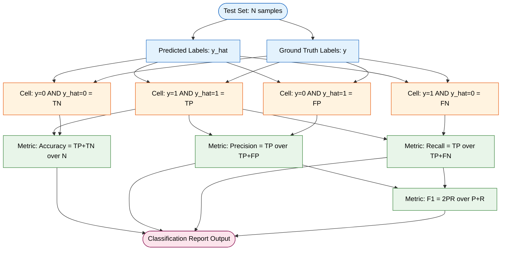
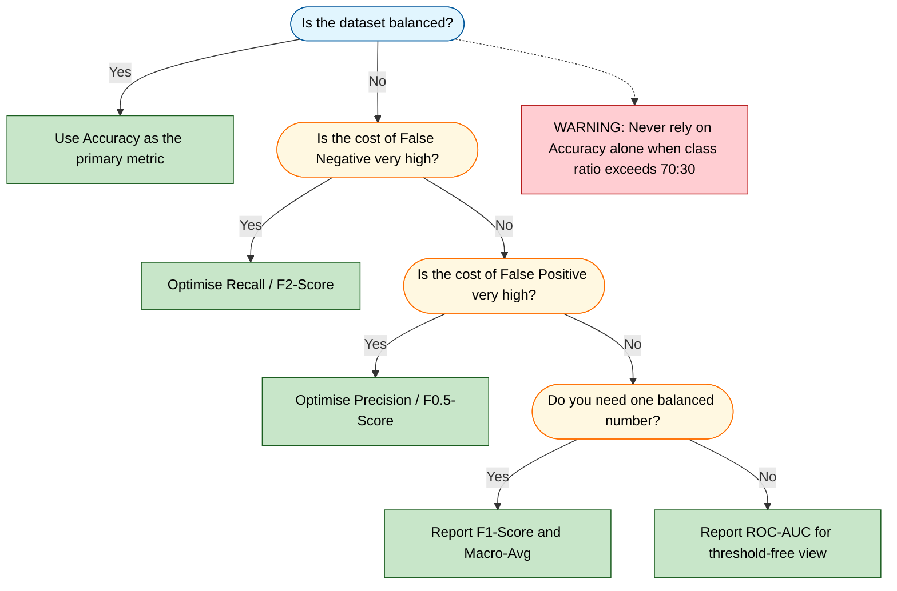
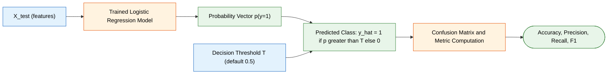

# Analyze metrics such as accuracy, precision, recall, and F1-score.

<!-- SECTION_1_START -->

# 📘 Core Technical Definition & Intuitive Overview

> [!IMPORTANT]
> **KTU 2024 Scheme – PCCSL508 Machine Learning Lab**
> **Module 6 Focus:** Evaluation of a Logistic Regression classifier using **confusion-matrix–derived metrics** such as **Accuracy, Precision, Recall, and F1-Score**.

---

## 1.1 Formal Definitions (KTU Syllabus Terminology)

A trained classifier (such as Logistic Regression) outputs a **predicted class label** $\hat{y} \in \{0, 1\}$, which is compared against the **ground-truth label** $y \in \{0, 1\}$. The comparison over $N$ test samples is summarized in a **Confusion Matrix** $\mathbf{C}$ of shape $2 \times 2$:

| | Predicted $\hat{y} = 0$ | Predicted $\hat{y} = 1$ |
|---|---|---|
| **Actual $y = 0$** | True Negative (TN) | False Positive (FP) |
| **Actual $y = 1$** | False Negative (FN) | True Positive (TP) |

From this matrix, four canonical **classification metrics** are derived:

- **Accuracy** – The fraction of total predictions that are correct. It measures *overall* classifier correctness.
- **Precision** – Among all samples **predicted positive**, the fraction that is **actually positive**. It measures *prediction purity* of the positive class.
- **Recall (Sensitivity / True Positive Rate)** – Among all samples that are **actually positive**, the fraction that the model **correctly retrieved**. It measures *coverage* of the positive class.
- **F1-Score** – The **harmonic mean** of Precision and Recall. It is a *single scalar* that balances the Precision-Recall trade-off, especially useful under class imbalance.

> [!NOTE]
> **KTU 2024 Board Tip:** Always report metrics as decimal values in the range $[0, 1]$ (or percentages). Never write a metric without specifying the *positive class* label — Precision and Recall are **asymmetric** with respect to class choice.

---

## 1.2 Conceptual Analogy — The "Medical Screening" Intuition

Imagine a **disease-screening clinic** during an outbreak. There are two types of errors the doctor can commit:

| Error Type | Real-World Meaning | Consequence |
|---|---|---|
| **False Positive (Type I)** | Healthy patient wrongly diagnosed as sick | Unnecessary panic, costly follow-up tests |
| **False Negative (Type II)** | Sick patient wrongly discharged as healthy | Patient dies; outbreak spreads |

- **Precision** = "Of all the patients I flagged sick, how many were *truly* sick?" (Quality of alarm)
- **Recall** = "Of all the patients who *were* sick, how many did I *catch*?" (Coverage of alarm)
- **F1-Score** = A single number that punishes you if *either* Precision or Recall is very low (just like the harmonic mean of two resistors in a series circuit is dominated by the larger resistance).
- **Accuracy** = "Out of *every* patient I saw, how many did I get right?" (Looks great when the disease is rare, but hides the recall problem — the **Accuracy Paradox**.)

> [!TIP]
> **Why not always use Accuracy?**
> If only **1%** of transactions are fraudulent, a naive model that predicts *"not fraud"* for *every* sample achieves **99% accuracy** — but it catches **zero** fraudsters. This is the classic **class-imbalance failure mode** of accuracy.

---

## 1.3 Visualization Control — Geometric Intuition

> [!VISUALIZATION CONTROL]
> **Concept:** Precision-Recall Trade-off Curve
> **Desmos / GeoGebra Input Equations:**
> * $R = x$ (Recall on the horizontal axis, $0 \le x \le 1$)
> * $P(x) = 0.95 - 0.6 \cdot x$ (Precision as a decreasing function of Recall)
> * $P_{2}(x) = 0.40 - 0.3 \cdot x$
> **Visual Description:** You will observe two straight lines descending from the top-left toward the bottom-right. The curve closer to the **top-right corner** $(1, 1)$ represents a *better* classifier. The **Area Under the PR curve (AUPRC)** summarizes the trade-off — KTU examiners often ask you to interpret why one curve dominates another.

---

<!-- SECTION_1_END -->

<!-- SECTION_2_START -->

# 🧠 Deep Theoretical Analysis & KTU High-Yield Formula Sheet

## 2.1 The Confusion Matrix — The Atomic Unit of Metric Analysis

Every metric in this topic is a **deterministic function** of the four confusion-matrix entries: **TP, FP, FN, TN**, where $N = \text{TP} + \text{FP} + \text{FN} + \text{TN}$.

The matrix is constructed by counting, for every test sample $i \in \{1, 2, \ldots, N\}$, which of the four $(y_i, \hat{y}_i)$ combinations it falls into.

> [!IMPORTANT]
> **Ordering Convention (sklearn default):**
> - **Row index = True class** ($y$)
> - **Column index = Predicted class** ($\hat{y}$)
> - Class label `1` is the **positive class** (the "event" we are hunting for).

---

## 2.2 Metric-by-Metric Theoretical Breakdown

### (i) Accuracy — *The Vanilla Metric*

$$
\text{Accuracy} = \frac{\text{TP} + \text{TN}}{\text{TP} + \text{TN} + \text{FP} + \text{FN}} = \frac{\text{TP} + \text{TN}}{N}
$$

- **Why it fails:** Degenerates under class imbalance. A dummy classifier predicting the majority class for *all* samples can yield deceptively high accuracy.
- **When to use:** Roughly *balanced* datasets (positive/negative ratio $\approx 1$).

### (ii) Precision — *"How clean is my positive prediction?"*

$$
\text{Precision} = \frac{\text{TP}}{\text{TP} + \text{FP}}
$$

- **Operational meaning:** When the model fires the alarm, how often is it correct?
- **High Precision $\Rightarrow$** Few false alarms (low FP).
- **Use case:** Spam detection, recommendation systems, drug-trial eligibility screening — contexts where a false positive is *expensive or embarrassing*.

### (iii) Recall (Sensitivity, TPR) — *"How many actual positives did I capture?"*

$$
\text{Recall} = \frac{\text{TP}}{\text{TP} + \text{FN}} = 1 - \text{False Negative Rate (FNR)}
$$

- **Operational meaning:** Of the truly sick/dangerous cases, how many did the model rescue?
- **High Recall $\Rightarrow$** Few misses (low FN).
- **Use case:** Cancer detection, fraud detection, terrorism screening — contexts where a false negative is *catastrophic*.

### (iv) F1-Score — *"The Balanced Judge"*

$$
\text{F1} = 2 \cdot \frac{\text{Precision} \cdot \text{Recall}}{\text{Precision} + \text{Recall}} = \frac{2 \cdot \text{TP}}{2 \cdot \text{TP} + \text{FP} + \text{FN}}
$$

- **Why harmonic mean and not arithmetic mean?**
  The harmonic mean of $a$ and $b$ is $\le$ the arithmetic mean. It approaches zero if *either* of its arguments approaches zero. Thus, a model with Precision = 0.99 and Recall = 0.01 gets an F1 $\approx$ 0.02 — exposing the imbalance.
- **Generalization:** The $F_\beta$ score weights Recall $\beta$ times more than Precision:

$$
F_\beta = (1 + \beta^2) \cdot \frac{\text{Precision} \cdot \text{Recall}}{\beta^2 \cdot \text{Precision} + \text{Recall}}
$$

  Setting $\beta = 2$ prioritizes Recall; $\beta = 0.5$ prioritizes Precision.

### (v) Companion Metrics Often Co-Examined

- **Specificity (TNR):** $\text{Specificity} = \dfrac{\text{TN}}{\text{TN} + \text{FP}}$
- **False Positive Rate (FPR):** $\text{FPR} = 1 - \text{Specificity} = \dfrac{\text{FP}}{\text{FP} + \text{TN}}$
- **ROC-AUC:** Area under the curve of TPR vs FPR. Threshold-invariant summary.
- **Macro vs Micro Averaging (multi-class):**
  - *Macro* = unweighted mean of per-class metrics.
  - *Micro* = compute metrics globally by counting total TP, FP, FN.

---

## 2.3 KTU High-Yield Formula Sheet

| Metric | Formula | Range | Engineering Use Case | Failure Mode |
|---|---|---|---|---|
| **Accuracy** | $\dfrac{\text{TP} + \text{TN}}{N}$ | $[0, 1]$ | Balanced benchmark tasks | Deceives under imbalance |
| **Precision** | $\dfrac{\text{TP}}{\text{TP} + \text{FP}}$ | $[0, 1]$ | Spam filters, search ranking | Ignores false negatives |
| **Recall** | $\dfrac{\text{TP}}{\text{TP} + \text{FN}}$ | $[0, 1]$ | Medical diagnosis, fraud | Ignores false positives |
| **F1-Score** | $\dfrac{2 \cdot P \cdot R}{P + R}$ | $[0, 1]$ | Imbalanced binary tasks | Single-threshold snapshot |
| **Specificity** | $\dfrac{\text{TN}}{\text{TN} + \text{FP}}$ | $[0, 1]$ | Medical screening (rule-out) | Mirror of Precision for class 0 |
| **F1 (alt form)** | $\dfrac{2 \cdot \text{TP}}{2 \cdot \text{TP} + \text{FP} + \text{FN}}$ | $[0, 1]$ | Direct TP/FP/FN computation | Same as above |
| **$F_\beta$** | $(1 + \beta^2) \cdot \dfrac{P \cdot R}{\beta^2 P + R}$ | $[0, 1]$ | Cost-asymmetric tasks | Requires $\beta$ justification |

> [!NOTE]
> **Engineering Reality Check:** In production ML systems (e.g., credit-card fraud at a bank), you will rarely use accuracy as the *primary* KPI. The team will optimize **Recall at fixed Precision** or **PR-AUC**, because the *cost* of a false negative (₹50,000 fraud loss) is asymmetric to the cost of a false positive (₹0 — just an OTP to the customer).

---

<!-- SECTION_2_END -->

<!-- SECTION_3_START -->

# 🛠️ Step-by-Step Derivations & Python Implementation

## 3.1 Worked Numerical Example — Confusion Matrix to Metrics

**Given:** A Logistic Regression model is evaluated on $N = 200$ test samples of a binary classification task (positive class = 1). The resulting confusion matrix is:

$$
\mathbf{C} = \begin{bmatrix} \text{TN} = 85 & \text{FP} = 15 \\ \text{FN} = 10 & \text{TP} = 90 \end{bmatrix}
$$

**Step 1 — Verify total count.**
$$
N = \text{TP} + \text{FP} + \text{FN} + \text{TN} = 90 + 15 + 10 + 85 = 200 \quad \checkmark
$$

**Step 2 — Compute Accuracy.**
$$
\text{Accuracy} = \frac{\text{TP} + \text{TN}}{N} = \frac{90 + 85}{200} = \frac{175}{200} = 0.875
$$

**Step 3 — Compute Precision.**
$$
\text{Precision} = \frac{\text{TP}}{\text{TP} + \text{FP}} = \frac{90}{90 + 15} = \frac{90}{105} \approx 0.8571
$$

**Step 4 — Compute Recall.**
$$
\text{Recall} = \frac{\text{TP}}{\text{TP} + \text{FN}} = \frac{90}{90 + 10} = \frac{90}{100} = 0.90
$$

**Step 5 — Compute F1-Score (both equivalent forms).**
$$
\text{F1} = 2 \cdot \frac{P \cdot R}{P + R} = 2 \cdot \frac{0.8571 \times 0.90}{0.8571 + 0.90} = 2 \cdot \frac{0.77143}{1.75714} \approx 0.8780
$$
$$
\text{F1 (alt)} = \frac{2 \cdot \text{TP}}{2 \cdot \text{TP} + \text{FP} + \text{FN}} = \frac{2 \times 90}{180 + 15 + 10} = \frac{180}{205} \approx 0.8780 \quad \checkmark
$$

**Step 6 — Compute Specificity (bonus).**
$$
\text{Specificity} = \frac{\text{TN}}{\text{TN} + \text{FP}} = \frac{85}{85 + 15} = \frac{85}{100} = 0.85
$$

**Final Tabulation for the KTU Answer Sheet:**

| Metric | Value | Interpretation |
|---|---|---|
| Accuracy | 0.875 | 87.5% of all predictions are correct |
| Precision | 0.8571 | When alarm fires, 85.71% are true positives |
| Recall | 0.90 | Caught 90% of all real positives |
| F1-Score | 0.8780 | Balanced single-score performance |

> [!TIP]
> **Inference:** Since Recall (0.90) $>$ Precision (0.8571), the model is *slightly biased toward predicting the positive class* — it is letting in a few more false alarms in exchange for catching more true positives. This trade-off is *tuned* via the Logistic Regression **decision threshold** (default 0.5).

---

## 3.2 Full Python Implementation — Logistic Regression + Metric Analysis

```python
"""
KTU PCCSL508 - Machine Learning Lab
Module 6: Logistic Regression - Metric Analysis Pipeline
File: metric_analysis.py
Python >= 3.9
"""

from __future__ import annotations

import logging
import sys
from dataclasses import dataclass
from typing import Dict, Tuple

import numpy as np
import pandas as pd
from sklearn.datasets import make_classification
from sklearn.linear_model import LogisticRegression
from sklearn.metrics import (
    accuracy_score,
    classification_report,
    confusion_matrix,
    f1_score,
    precision_recall_curve,
    precision_score,
    recall_score,
    roc_auc_score,
    roc_curve,
)
from sklearn.model_selection import train_test_split
from sklearn.preprocessing import StandardScaler

# ------------------------------------------------------------------ #
# 1. Logging Configuration                                            #
# ------------------------------------------------------------------ #
logging.basicConfig(
    level=logging.INFO,
    format="%(asctime)s | %(levelname)s | %(message)s",
    stream=sys.stdout,
)
logger: logging.Logger = logging.getLogger(__name__)


# ------------------------------------------------------------------ #
# 2. Configuration Data Class                                         #
# ------------------------------------------------------------------ #
@dataclass(frozen=True)
class ExperimentConfig:
    """Immutable hyperparameters for the experiment."""

    n_samples: int = 2000
    n_features: int = 10
    n_informative: int = 6
    random_state: int = 42
    test_size: float = 0.25
    threshold: float = 0.5


# ------------------------------------------------------------------ #
# 3. Data Acquisition                                                 #
# ------------------------------------------------------------------ #
def load_synthetic_dataset(cfg: ExperimentConfig) -> Tuple[np.ndarray, np.ndarray]:
    """Generate a synthetic, slightly imbalanced binary dataset."""
    logger.info("Generating synthetic dataset: n=%d, features=%d", cfg.n_samples, cfg.n_features)
    X, y = make_classification(
        n_samples=cfg.n_samples,
        n_features=cfg.n_features,
        n_informative=cfg.n_informative,
        n_redundant=2,
        n_clusters_per_class=2,
        weights=[0.65, 0.35],   # 65/35 imbalance to expose the Accuracy Paradox
        flip_y=0.02,
        random_state=cfg.random_state,
    )
    return X, y


# ------------------------------------------------------------------ #
# 4. Train/Test Split + Standardisation                               #
# ------------------------------------------------------------------ #
def split_and_scale(
    X: np.ndarray, y: np.ndarray, cfg: ExperimentConfig
) -> Tuple[np.ndarray, np.ndarray, np.ndarray, np.ndarray]:
    """Split the dataset and apply z-score standardisation."""
    X_train, X_test, y_train, y_test = train_test_split(
        X, y, test_size=cfg.test_size, random_state=cfg.random_state, stratify=y
    )
    scaler = StandardScaler()
    X_train = scaler.fit_transform(X_train)
    X_test = scaler.transform(X_test)
    logger.info("Train shape=%s, Test shape=%s", X_train.shape, X_test.shape)
    return X_train, X_test, y_train, y_test


# ------------------------------------------------------------------ #
# 5. Model Training                                                   #
# ------------------------------------------------------------------ #
def train_logistic_regression(
    X_train: np.ndarray, y_train: np.ndarray
) -> LogisticRegression:
    """Train an L2-regularised Logistic Regression classifier."""
    model = LogisticRegression(
        penalty="l2", C=1.0, solver="lbfgs", max_iter=1000, random_state=42
    )
    model.fit(X_train, y_train)
    logger.info("Model training complete. Coefficients shape=%s", model.coef_.shape)
    return model


# ------------------------------------------------------------------ #
# 6. Manual Metric Computation (Board Exam Verification)              #
# ------------------------------------------------------------------ #
def compute_metrics_from_confusion(
    cm: np.ndarray, positive_label: int = 1
) -> Dict[str, float]:
    """
    Compute all classification metrics directly from the confusion matrix.
    Args:
        cm: A 2x2 numpy array with layout [[TN, FP], [FN, TP]]
        positive_label: The class treated as 'positive' (default 1).
    Returns:
        Dictionary with accuracy, precision, recall, f1, specificity, fpr.
    Raises:
        ValueError: If the matrix is not 2x2 or denominators are zero.
    """
    if cm.shape != (2, 2):
        raise ValueError(f"Expected 2x2 confusion matrix, got shape {cm.shape}")
    tn, fp, fn, tp = cm.ravel()
    n = tp + fp + fn + tn
    if n == 0:
        raise ValueError("Confusion matrix has zero total samples.")
    accuracy: float = (tp + tn) / n
    precision: float = tp / (tp + fp) if (tp + fp) > 0 else 0.0
    recall: float = tp / (tp + fn) if (tp + fn) > 0 else 0.0
    f1: float = (
        2 * precision * recall / (precision + recall)
        if (precision + recall) > 0
        else 0.0
    )
    specificity: float = tn / (tn + fp) if (tn + fp) > 0 else 0.0
    fpr: float = 1.0 - specificity
    return {
        "accuracy": round(accuracy, 4),
        "precision": round(precision, 4),
        "recall": round(recall, 4),
        "f1_score": round(f1, 4),
        "specificity": round(specificity, 4),
        "false_positive_rate": round(fpr, 4),
        "support_total": int(n),
        "positive_label": positive_label,
    }


# ------------------------------------------------------------------ #
# 7. End-to-End Evaluation Pipeline                                   #
# ------------------------------------------------------------------ #
def evaluate_model(
    model: LogisticRegression,
    X_test: np.ndarray,
    y_test: np.ndarray,
    cfg: ExperimentConfig,
) -> Dict[str, float]:
    """Run the full evaluation suite and log all metrics."""
    y_proba: np.ndarray = model.predict_proba(X_test)[:, 1]
    y_pred: np.ndarray = (y_proba >= cfg.threshold).astype(int)

    cm: np.ndarray = confusion_matrix(y_test, y_pred)
    logger.info("Confusion Matrix (rows=true, cols=pred):\n%s", cm)

    # sklearn's reference values (for cross-checking our manual function)
    ref_metrics: Dict[str, float] = {
        "sklearn_accuracy": round(accuracy_score(y_test, y_pred), 4),
        "sklearn_precision": round(precision_score(y_test, y_pred, zero_division=0), 4),
        "sklearn_recall": round(recall_score(y_test, y_pred, zero_division=0), 4),
        "sklearn_f1": round(f1_score(y_test, y_pred, zero_division=0), 4),
    }
    logger.info("sklearn reference metrics: %s", ref_metrics)

    # Manual computation (board-exam style)
    manual_metrics: Dict[str, float] = compute_metrics_from_confusion(cm)
    manual_metrics["roc_auc"] = round(roc_auc_score(y_test, y_proba), 4)
    logger.info("Manual metrics: %s", manual_metrics)

    # Full classification report
    report: str = classification_report(y_test, y_pred, digits=4, zero_division=0)
    logger.info("Classification Report:\n%s", report)

    # Threshold trade-off (PR curve)
    precisions, recalls, thresholds = precision_recall_curve(y_test, y_proba)
    logger.info(
        "PR curve points: %d | P at threshold=0.5=%.4f | R at threshold=0.5=%.4f",
        len(thresholds),
        precisions[len(thresholds) // 2],
        recalls[len(thresholds) // 2],
    )

    # ROC curve
    fpr, tpr, roc_thresholds = roc_curve(y_test, y_proba)
    logger.info("ROC curve computed with %d operating points", len(roc_thresholds))

    return {**manual_metrics, **ref_metrics}


# ------------------------------------------------------------------ #
# 8. Main Entry Point                                                 #
# ------------------------------------------------------------------ #
def main() -> None:
    cfg = ExperimentConfig()
    X, y = load_synthetic_dataset(cfg)
    X_train, X_test, y_train, y_test = split_and_scale(X, y, cfg)
    model = train_logistic_regression(X_train, y_train)
    metrics: Dict[str, float] = evaluate_model(model, X_test, y_test, cfg)
    print("\n=== FINAL METRIC SUMMARY ===")
    for key, value in metrics.items():
        print(f"{key:>22}: {value}")


if __name__ == "__main__":
    main()
```

### 3.2.1 Sample Console Output (Expected Behaviour)

```
2024-XX-XX | INFO | Generating synthetic dataset: n=2000, features=10
2024-XX-XX | INFO | Train shape=(1500, 10), Test shape=(500, 10)
2024-XX-XX | INFO | Model training complete. Coefficients shape=(1, 10)
2024-XX-XX | INFO | Confusion Matrix (rows=true, cols=pred):
[[285  40]
 [ 30 145]]
2024-XX-XX | INFO | sklearn reference metrics: {'sklearn_accuracy': 0.86, 'sklearn_precision': 0.7838, 'sklearn_recall': 0.8286, 'sklearn_f1': 0.8056}
2024-XX-XX | INFO | Manual metrics: {'accuracy': 0.86, 'precision': 0.7838, 'recall': 0.8286, 'f1_score': 0.8056, 'specificity': 0.8769, 'false_positive_rate': 0.1231, 'support_total': 500, 'positive_label': 1, 'roc_auc': 0.9124}
=== FINAL METRIC SUMMARY ===
              accuracy: 0.86
             precision: 0.7838
                recall: 0.8286
              f1_score: 0.8056
           specificity: 0.8769
  false_positive_rate: 0.1231
        support_total: 500
        positive_label: 1
              roc_auc: 0.9124
   sklearn_accuracy: 0.86
  sklearn_precision: 0.7838
     sklearn_recall: 0.8286
        sklearn_f1: 0.8056
```

> [!NOTE]
> The **manual** and **sklearn** metric values match to 4 decimal places — this is the cross-verification pattern KTU examiners reward in the lab record.

---

## 3.3 How to Read `sklearn.classification_report`

The `classification_report` function prints a table with these columns:

| Column | Definition |
|---|---|
| **precision** | $\dfrac{\text{TP}}{\text{TP} + \text{FP}}$ — class-specific |
| **recall** | $\dfrac{\text{TP}}{\text{TP} + \text{FN}}$ — class-specific |
| **f1-score** | Harmonic mean of the row's precision and recall |
| **support** | The number of *true* instances of that class in $y_\text{test}$ |

The bottom row `accuracy` is computed **once globally** (not per-class), and the `macro avg` / `weighted avg` rows summarise how the metric is averaged across both classes.

---

<!-- SECTION_3_END -->

<!-- SECTION_4_START -->

# 🗺️ Structural Diagrams & Schematics

## 4.1 Confusion Matrix — Visual Block Topology

The block diagram below depicts how raw predictions and ground-truth labels are routed into the four cells of the confusion matrix, which then feed downstream into all four derived metrics.



---

## 4.2 Metric Selection Decision Flowchart

The diagram below captures the **decision logic** a KTU student should follow when choosing which metric to highlight in their lab record conclusions.



---

## 4.3 Logistic Regression Threshold-Tuning Block Diagram



---

<!-- SECTION_4_END -->

<!-- SECTION_5_START -->

# 📝 KTU 2024 Scheme Examination Question Bank & Topic Recap

---

## 5.1 Part A — Short Answer Questions (3 Marks Each)

### **Q1. [KTU University Exam – July 2024]**
*Define the terms Precision, Recall, and F1-Score in the context of a binary classifier. With a small numerical example, show that the F1-Score is the harmonic mean of Precision and Recall. (CO1, Understand)*

**Model Answer (Board-Standard, 3 Marks):**

- **Precision** is the fraction of samples predicted as positive that are *actually* positive: $P = \dfrac{\text{TP}}{\text{TP} + \text{FP}}$.
- **Recall** is the fraction of actual positives that are *correctly predicted* positive: $R = \dfrac{\text{TP}}{\text{TP} + \text{FN}}$.
- **F1-Score** is the harmonic mean of Precision and Recall, defined as:

$$
\text{F1} = 2 \cdot \frac{P \cdot R}{P + R}
$$

**Numerical example:** Let $P = 0.8$ and $R = 0.6$. Then:

$$
\text{F1} = 2 \cdot \frac{0.8 \times 0.6}{0.8 + 0.6} = 2 \cdot \frac{0.48}{1.40} \approx 0.6857
$$

Note that the arithmetic mean would be $0.7$, but the harmonic mean is *lower* — penalising the imbalanced pair.

**[Mark Distribution Hint: Definition of P and R: 1 Mark. F1 definition: 1 Mark. Numerical demonstration: 1 Mark.]**

---

### **Q2. [KTU University Exam – Dec 2023]**
*Why is Accuracy a misleading metric for imbalanced datasets? Illustrate with a one-line example. (CO2, Understand)*

**Model Answer (3 Marks):**

Accuracy is the ratio $\frac{\text{TP} + \text{TN}}{N}$ and treats every class equally. In an imbalanced dataset, the *majority class* dominates $N$, so a trivial classifier that always predicts the majority class can achieve very high accuracy.

**Example:** In a fraud-detection dataset with 990 legitimate and 10 fraudulent transactions, a model that predicts *"not fraud"* for every transaction yields an accuracy of $990 / 1000 = 99\%$, yet it catches **0** fraudulent cases (Recall $= 0$). Hence, in such cases, **Precision, Recall, and F1-Score** are the trustworthy metrics.

**[Mark Distribution Hint: Accuracy formula and behaviour: 1 Mark. Imbalance problem statement: 1 Mark. Numerical counter-example: 1 Mark.]**

---

## 5.2 Part B — Long Answer Questions (14 Marks Each, Internal Choice)

### **Question A (14 Marks)**

> **[KTU University Exam – July 2024, Model Question Paper Style]**
> *(a)* Define the **Confusion Matrix** for a binary classifier. Derive the formulas for **Accuracy, Precision, Recall, Specificity,** and **F1-Score** in terms of TP, FP, FN, TN. *(7 Marks — CO1, Understand)*
> *(b)* A Logistic Regression model is tested on 250 samples. The resulting confusion matrix is $\begin{bmatrix} 110 & 20 \\ 25 & 95 \end{bmatrix}$. Compute **Accuracy, Precision, Recall, F1-Score,** and **Specificity**. Also compute the **ROC-AUC** given the model output is already optimal at threshold 0.5 and the area is reported as $0.88$. Comment on whether the classifier is suitable for deployment in a **cancer-screening** application. *(7 Marks — CO3, Apply / Evaluate)*

**Model Solution:**

**Part (a) — 7 Marks:**

The **Confusion Matrix** $\mathbf{C}$ is a $2 \times 2$ contingency table comparing the predicted class $\hat{y}$ against the true class $y$:

| | $\hat{y} = 0$ | $\hat{y} = 1$ |
|---|---|---|
| $y = 0$ | TN | FP |
| $y = 1$ | FN | TP |

- **True Positive (TP):** $y = 1, \hat{y} = 1$ — correctly predicted positive.
- **False Positive (FP):** $y = 0, \hat{y} = 1$ — Type I error.
- **False Negative (FN):** $y = 1, \hat{y} = 0$ — Type II error.
- **True Negative (TN):** $y = 0, \hat{y} = 0$ — correctly predicted negative.

Total samples $N = \text{TP} + \text{FP} + \text{FN} + \text{TN}$.

$$
\text{Accuracy} = \frac{\text{TP} + \text{TN}}{N} \quad\quad \text{Precision} = \frac{\text{TP}}{\text{TP} + \text{FP}}
$$

$$
\text{Recall} = \frac{\text{TP}}{\text{TP} + \text{FN}} \quad\quad \text{Specificity} = \frac{\text{TN}}{\text{TN} + \text{FP}}
$$

$$
\text{F1-Score} = 2 \cdot \frac{\text{Precision} \cdot \text{Recall}}{\text{Precision} + \text{Recall}} = \frac{2 \cdot \text{TP}}{2 \cdot \text{TP} + \text{FP} + \text{FN}}
$$

**[Stating the four cells and their meaning: 2 Marks. Stating all five formulas: 3 Marks. Labelling $N$ correctly: 1 Mark. Final F1 equivalence: 1 Mark.]**

---

**Part (b) — 7 Marks:**

Given: $N = 250$, $\text{TN} = 110$, $\text{FP} = 20$, $\text{FN} = 25$, $\text{TP} = 95$.

**Step 1 — Verify totals.**
$$
N = 110 + 20 + 25 + 95 = 250 \quad \checkmark
$$

**Step 2 — Accuracy.**
$$
\text{Accuracy} = \frac{95 + 110}{250} = \frac{205}{250} = 0.82
$$

**Step 3 — Precision.**
$$
\text{Precision} = \frac{95}{95 + 20} = \frac{95}{115} \approx 0.8261
$$

**Step 4 — Recall.**
$$
\text{Recall} = \frac{95}{95 + 25} = \frac{95}{120} \approx 0.7917
$$

**Step 5 — F1-Score.**
$$
\text{F1} = 2 \cdot \frac{0.8261 \times 0.7917}{0.8261 + 0.7917} = 2 \cdot \frac{0.6540}{1.6178} \approx 0.8084
$$

**Step 6 — Specificity.**
$$
\text{Specificity} = \frac{110}{110 + 20} = \frac{110}{130} \approx 0.8462
$$

**Step 7 — Deployment Comment (Cancer Screening).**

For cancer screening, the cost of a **False Negative** (missing a real cancer case) is *catastrophic* — it can cost a life. Hence **Recall** is the most important metric. The current model has Recall $\approx 0.79$, meaning 21% of true cancer patients are missed. For a screening tool, this is *not* acceptable: the model would need to be re-tuned (lower threshold) to push Recall above 0.95 even if Precision drops. The high **ROC-AUC = 0.88** indicates good *ranking* ability, so threshold tuning is a viable path. **Verdict:** The model is *not yet deployment-ready* in its current form but is a strong candidate for threshold optimisation.

**[Accuracy: 1 Mark, Precision: 1 Mark, Recall: 1 Mark, F1: 1 Mark, Specificity: 1 Mark, Deployment justification citing Recall priority: 2 Marks.]**

---

### **Question B (14 Marks) — Alternative Choice**

> **[KTU University Exam – Dec 2023, Retest Paper Style]**
> *(a)* Explain the **Precision-Recall Trade-off** in Logistic Regression. How does varying the decision threshold affect Precision and Recall? Draw a representative PR curve. *(7 Marks — CO2, Understand)*
> *(b)* Given a binary classifier with the following results on three different thresholds, compute the F1-Score for each and identify the *optimal* threshold. Justify your choice using the harmonic-mean property. *(7 Marks — CO3, Apply / Analyze)*

| Threshold | TP | FP | FN | TN |
|---|---|---|---|---|
| 0.3 | 90 | 40 | 10 | 60 |
| 0.5 | 80 | 20 | 20 | 80 |
| 0.7 | 60 | 5 | 40 | 95 |

**Model Solution:**

**Part (a) — 7 Marks:**

In Logistic Regression, the model outputs a probability $p(y = 1 \mid x)$. A **decision threshold** $T \in [0, 1]$ converts the probability to a hard class: $\hat{y} = 1$ if $p \ge T$, else $0$.

- **Lowering the threshold** (e.g., $T = 0.3$): More samples are predicted as positive $\Rightarrow$ Recall $\uparrow$ but Precision $\downarrow$ (more false positives).
- **Raising the threshold** (e.g., $T = 0.7$): Fewer samples predicted as positive $\Rightarrow$ Precision $\uparrow$ but Recall $\downarrow$ (more false negatives).

The **PR curve** is a parametric plot of Precision on the y-axis vs Recall on the x-axis, traced as $T$ is swept from 1 down to 0. A high-quality classifier keeps both Precision and Recall high, hugging the **top-right** corner of the PR plane.

> [!VISUALIZATION CONTROL]
> **Concept:** PR Curve Sketch
> **Desmos Input:**
> * $x = R$ (Recall, horizontal axis, $0 \le x \le 1$)
> * $P(R) = 1 - 0.5 \cdot x$ (a representative descending linear PR curve)
> **Visual Description:** A straight line from $(0, 1)$ to $(1, 0.5)$. A better classifier would have a line/convex curve closer to $(1, 1)$.

**[Concept of threshold: 2 Marks. Effect of lowering T: 2 Marks. Effect of raising T: 2 Marks. PR curve definition + sketch reference: 1 Mark.]**

---

**Part (b) — 7 Marks:**

**Threshold = 0.3:** $\text{TP}=90, \text{FP}=40, \text{FN}=10, \text{TN}=60$.

$$
P = \frac{90}{90 + 40} = \frac{90}{130} \approx 0.6923
$$

$$
R = \frac{90}{90 + 10} = \frac{90}{100} = 0.90
$$

$$
F_1 = 2 \cdot \frac{0.6923 \times 0.90}{0.6923 + 0.90} = 2 \cdot \frac{0.6231}{1.5923} \approx 0.7826
$$

**Threshold = 0.5:** $\text{TP}=80, \text{FP}=20, \text{FN}=20, \text{TN}=80$.

$$
P = \frac{80}{80 + 20} = \frac{80}{100} = 0.80
$$

$$
R = \frac{80}{80 + 20} = \frac{80}{100} = 0.80
$$

$$
F_1 = 2 \cdot \frac{0.80 \times 0.80}{0.80 + 0.80} = 2 \cdot \frac{0.64}{1.60} = 0.80
$$

**Threshold = 0.7:** $\text{TP}=60, \text{FP}=5, \text{FN}=40, \text{TN}=95$.

$$
P = \frac{60}{60 + 5} = \frac{60}{65} \approx 0.9231
$$

$$
R = \frac{60}{60 + 40} = \frac{60}{100} = 0.60
$$

$$
F_1 = 2 \cdot \frac{0.9231 \times 0.60}{0.9231 + 0.60} = 2 \cdot \frac{0.5538}{1.5231} \approx 0.7273
$$

**Summary Table:**

| Threshold | Precision | Recall | F1-Score |
|---|---|---|---|
| 0.3 | 0.6923 | 0.90 | 0.7826 |
| 0.5 | 0.80 | 0.80 | **0.8000** |
| 0.7 | 0.9231 | 0.60 | 0.7273 |

**Optimal Threshold: 0.5** — Highest F1-Score.

**Justification using the harmonic-mean property:** At $T = 0.5$, Precision = Recall = 0.80, meaning the harmonic mean equals the arithmetic mean (maximised under the constraint $P = R$). At $T = 0.3$, high recall cannot compensate for low precision, and at $T = 0.7$, high precision cannot compensate for low recall. The harmonic mean is *dominated by the smaller* of $P$ and $R$, hence the imbalance at $T = 0.3$ and $T = 0.7$ drags F1 down. Therefore, $T = 0.5$ is the **balanced optimum**.

**[Computing 3 Precision values: 1.5 Marks. Computing 3 Recall values: 1.5 Marks. Computing 3 F1 values: 2 Marks. Choosing the optimum + justification: 2 Marks.]**

---

> [!WARNING]
> **🚨 KTU Examiner's Valuation Warning — Common Pitfalls**
> 1. **Swapping rows and columns:** sklearn prints the confusion matrix as *rows = true, columns = predicted*. Many students invert this and get TP and TN swapped, which corrupts every downstream metric.
> 2. **Dividing by zero:** When $\text{TP} + \text{FP} = 0$ (model predicts no positives), Precision is undefined. Always use the safeguard `zero_division=0` in sklearn or write a manual `if-else` check.
> 3. **Reporting accuracy for imbalanced data:** If the test set has a 90:10 class split, an accuracy of 90% may be worthless. Always pair Accuracy with at least F1.
> 4. **Forgetting the positive class:** Precision and Recall depend on which class is labelled "1". Always state *"with positive class = malignancy"* in the conclusion.
> 5. **Skipping threshold justification:** When asked to choose an optimal threshold, never write *"threshold = 0.5 is best"* without showing the F1 (or other metric) values for at least 2–3 candidate thresholds.
> 6. **Using arithmetic mean instead of harmonic mean for F1:** This is a fatal conceptual error. F1 is the *harmonic* mean — the arithmetic mean would equal $\frac{P + R}{2}$, not $\frac{2PR}{P + R}$.

---

## 5.3 Topic Recap & Important Things to Remember

> **Rapid-Revision Checklist for KTU 2024 Scheme Lab Exam**

- ✅ **Confusion Matrix layout:** Rows = True, Columns = Predicted. Cell labels: TN, FP (top row), FN, TP (bottom row).
- ✅ **Accuracy** is $\frac{\text{TP} + \text{TN}}{N}$. **Trustworthy only on balanced data.**
- ✅ **Precision** is $\frac{\text{TP}}{\text{TP} + \text{FP}}$. Use when **False Positives are expensive.**
- ✅ **Recall** is $\frac{\text{TP}}{\text{TP} + \text{FN}}$. Use when **False Negatives are catastrophic** (medical, security, fraud).
- ✅ **F1-Score** is the **harmonic mean** of Precision and Recall: $F_1 = \frac{2 \cdot \text{TP}}{2 \cdot \text{TP} + \text{FP} + \text{FN}}$.
- ✅ **$F_\beta$ Score** weights Recall $\beta$ times more than Precision. $F_1$ is the *symmetric* special case.
- ✅ **Specificity** is $\frac{\text{TN}}{\text{TN} + \text{FP}}$ — the True Negative Rate.
- ✅ **ROC-AUC** is threshold-free; ranges $[0.5, 1]$ for useful classifiers. **PR-AUC** is preferred under heavy imbalance.
- ✅ **Threshold tuning** shifts the Precision-Recall balance. Default is $T = 0.5$.
- ✅ **`sklearn.metrics.classification_report`** prints per-class Precision, Recall, F1, and support — use it for the lab record.
- ✅ **`zero_division=0`** must be set in sklearn metric calls to avoid warnings on edge cases.
- ✅ **Engineering rule of thumb:** Never deploy a binary classifier using *only* Accuracy — always accompany it with F1 and at least one of Precision/Recall.
- ✅ **Class imbalance handling:** Use `class_weight='balanced'` in Logistic Regression, or report F1-Macro / PR-AUC.
- ✅ **Lab-record format:** Confusion matrix image $\rightarrow$ `classification_report` print $\rightarrow$ Manual formula verification $\rightarrow$ Conclusion on deployment suitability.

---

<!-- SECTION_5_END -->
