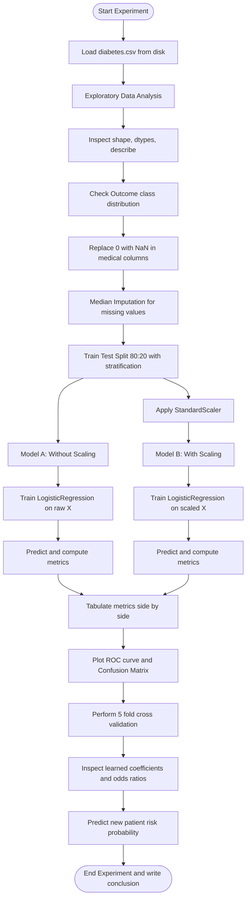
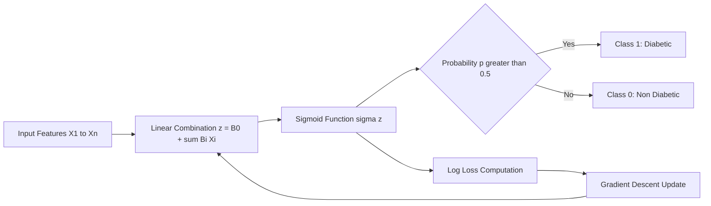
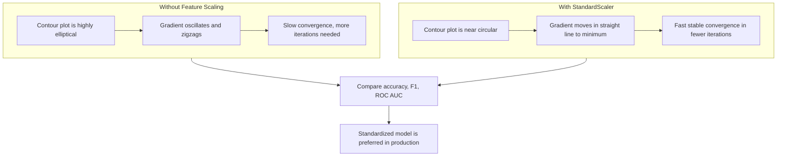
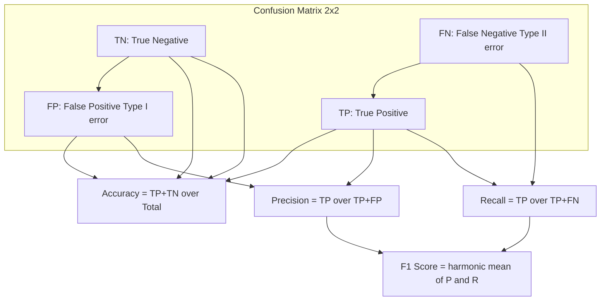

# Implement a logistic regression model to predict the likelihood of a disease using the Pima Indians Diabetes dataset. Compare the performance with and without feature scaling.

<!-- SECTION_1_START -->
# Logistic Regression on Pima Indians Diabetes Dataset

## 1. Core Technical Definition & Intuitive Overview

> [!IMPORTANT]
> **Logistic Regression (LR)** is a supervised Machine Learning classification algorithm used to predict the **probability** of a binary (yes/no) outcome. It is the workhorse of medical diagnosis problems where the dependent variable is categorical (e.g., *Diabetic* vs *Non-Diabetic*).

Mathematically, Logistic Regression models the log-odds of the event $Y=1$ (Disease = Yes) as a linear combination of input features:

$$\ln\left(\frac{P(Y=1 \mid X)}{1 - P(Y=1 \mid X)}\right) = \beta_0 + \sum_{i=1}^{n}\beta_i x_i$$

The probability is recovered via the **Sigmoid (Logistic) Function** $\sigma(z)$:

$$P(Y=1 \mid X) = \sigma(z) = \frac{1}{1 + e^{-z}}, \quad \text{where } z = \beta_0 + \sum_{i=1}^{n}\beta_i x_i$$

### Conceptual Analogy / Intuition

> [!NOTE]
> **Real-World Analogy:** Imagine a doctor estimating the risk of diabetes for a patient. She checks the patient's glucose level, BMI, age, etc. Each parameter "pushes" the patient either toward *High Risk* or *Low Risk*. Logistic Regression does exactly this — it assigns a **weight** to every test report and sums them up. The Sigmoid function then squashes this score into a clean probability between **0** and **1** (e.g., *0.78 = 78% risk*).

### The Pima Indians Diabetes Dataset

The **Pima Indians Diabetes Dataset** is a benchmark medical dataset from the **National Institute of Diabetes and Digestive and Kidney Diseases (NIDDK)**. It contains diagnostic measurements for **768 female patients** of Pima Indian heritage, aged 21 and above.

| Feature Index | Feature Name | Description | Standard Metric (Unit) |
|:---:|:---|:---|:---|
| 1 | Pregnancies | Number of times pregnant | **count** |
| 2 | Glucose | Plasma glucose concentration | **mg/dL** (normal: 70-140) |
| 3 | BloodPressure | Diastolic blood pressure | **mm Hg** (normal: <80) |
| 4 | SkinThickness | Triceps skin fold thickness | **mm** |
| 5 | Insulin | 2-Hour serum insulin | **mu U/mL** |
| 6 | BMI | Body mass index | **kg/m²** (normal: 18.5-24.9) |
| 7 | DiabetesPedigreeFunction | Genetic likelihood score | **numeric (0.0 - 2.5)** |
| 8 | Age | Age of patient | **years** |
| 9 | **Outcome (Target)** | Class variable (0 / 1) | **binary** |

> [!IMPORTANT]
> **Key Engineering Insight:** A critical preprocessing step for medical datasets is handling **physiologically impossible zero values** in Glucose, BloodPressure, SkinThickness, Insulin, and BMI. These are not true zeros — they represent **missing data** encoded as `0` and must be imputed (e.g., with the column median).

### Role of Feature Scaling in Logistic Regression

> [!NOTE]
> **Feature Scaling** standardizes the range of independent variables so that no single feature dominates the gradient descent updates. While Logistic Regression is technically scale-invariant in its *coefficients* (when converged), scaling significantly **accelerates convergence** and improves numerical stability, especially with **regularization** (L1/L2). Common techniques are **Standardization (Z-score)** and **Min-Max Normalization**.

$$
x_{\text{scaled}} = \frac{x - \mu}{\sigma} \quad \text{(Standardization / Z-score Normalization)}
$$

$$
x_{\text{norm}} = \frac{x - x_{\min}}{x_{\max} - x_{\min}} \quad \text{(Min-Max Normalization, range } [0,1])
$$

<!-- SECTION_1_END -->

<!-- SECTION_2_START -->
# Deep Theoretical Analysis & KTU High-Yield Formula Sheet

## 2.1 Mathematical Foundations of Logistic Regression

The model works in three conceptual layers:

1. **Linear Combination Layer** — Computes a weighted sum of input features:
$$z = \beta_0 + \beta_1 x_1 + \beta_2 x_2 + \dots + \beta_n x_n = X\beta$$

2. **Sigmoid (Activation) Layer** — Squashes $z \in \mathbb{R}$ into a probability $p \in (0,1)$:
$$\sigma(z) = \frac{1}{1 + e^{-z}}$$

3. **Decision Boundary Layer** — Applies a threshold (default $0.5$):
$$\hat{y} = \begin{cases} 1, & \text{if } \sigma(z) \ge 0.5 \\ 0, & \text{otherwise} \end{cases}$$

## 2.2 Cost Function (Log Loss / Binary Cross-Entropy)

Logistic regression uses **Maximum Likelihood Estimation (MLE)**. The cost for one sample is:

$$
\text{Cost}(h_\beta(x), y) = \begin{cases} -\log(h_\beta(x)), & \text{if } y=1 \\ -\log(1 - h_\beta(x)), & \text{if } y=0 \end{cases}
$$

A compact form across $m$ training samples is the **Binary Cross-Entropy (Log Loss)**:

$$J(\beta) = -\frac{1}{m}\sum_{i=1}^{m}\Big[y^{(i)}\log(\hat{y}^{(i)}) + (1-y^{(i)})\log(1-\hat{y}^{(i)})\Big]$$

This cost is **convex**, so gradient descent is guaranteed to converge to a global minimum.

## 2.3 Gradient Descent Update Rule

The parameters $\beta_j$ are updated iteratively to minimize $J(\beta)$:

$$
\beta_j := \beta_j - \alpha \cdot \frac{\partial J(\beta)}{\partial \beta_j}
$$

For logistic regression, the partial derivative evaluates to:

$$
\frac{\partial J(\beta)}{\partial \beta_j} = \frac{1}{m}\sum_{i=1}^{m}\big(\hat{y}^{(i)} - y^{(i)}\big)x_j^{(i)}
$$

Where $\alpha$ is the **learning rate** (typical: $0.01$ to $0.1$).

## 2.4 Why Compare With vs Without Feature Scaling?

> [!IMPORTANT]
> In **unscaled** datasets where features like *Insulin* (range 0-846) and *DiabetesPedigreeFunction* (range 0.08-2.42) coexist, gradient descent takes a **highly elliptical** optimization path. With **scaling**, the cost contour becomes more **spherical/circular**, allowing faster and more stable convergence.

## KTU Formula Sheet / Cheat Sheet

| # | Concept | Formula | Key Point |
|:---:|:---|:---|:---|
| 1 | Sigmoid Function | $\sigma(z) = \frac{1}{1+e^{-z}}$ | Output bounded in $(0,1)$ |
| 2 | Log Odds | $\log\left(\frac{p}{1-p}\right) = \beta_0 + \sum \beta_i x_i$ | Linear in features |
| 3 | Cross-Entropy Loss | $J(\beta) = -\frac{1}{m}\sum\big[y\log\hat{y}+(1-y)\log(1-\hat{y})\big]$ | Penalizes confident wrong predictions |
| 4 | Gradient Update | $\beta_j := \beta_j - \alpha(\hat{y}^{(i)} - y^{(i)})x_j^{(i)}$ | $\alpha$ is learning rate |
| 5 | Z-score Standardization | $x' = (x-\mu)/\sigma$ | Mean 0, Std 1 |
| 6 | Min-Max Normalization | $x' = (x-x_{\min})/(x_{\max}-x_{\min})$ | Range $[0,1]$ |
| 7 | Accuracy | $(TP+TN)/(TP+TN+FP+FN)$ | Overall correctness |
| 8 | Precision | $TP/(TP+FP)$ | Quality of positive predictions |
| 9 | Recall (Sensitivity) | $TP/(TP+FN)$ | Coverage of actual positives |
| 10 | F1-Score | $2\cdot\frac{P \cdot R}{P+R}$ | Harmonic mean of P and R |
| 11 | Confusion Matrix | $[TN, FP; FN, TP]$ | $2 \times 2$ error matrix |
| 12 | Decision Rule | $\hat{y}=1$ if $\sigma(z) \ge 0.5$ | Default threshold |

> **Use `\vert` or `\mid` for absolute value bars in exam scripts, e.g., $\vert x \vert$ or $\mid x \mid$.**

## 2.5 Real-World Engineering Utility

> [!NOTE]
> Logistic Regression is heavily used in production for:
> - **Medical Diagnosis:** Diabetes, cancer, heart disease risk scoring.
> - **Credit Scoring:** Loan default prediction in fintech (e.g., FICO systems).
> - **A/B Testing:** Conversion rate lift analysis in e-commerce (Amazon, Flipkart).
> - **Spam Filtering:** Email binary classification (legacy baseline).
> - **Churn Prediction:** Telecom customer retention models.
>
> It is preferred over complex models when **interpretability**, **calibrated probabilities**, and **regulatory compliance** (e.g., GDPR, FDA medical device audits) are required.

<!-- SECTION_2_END -->

<!-- SECTION_3_START -->
# Step-by-Step Implementation & Code

## 3.1 Software, Hardware & Environment Requirements

| Item | Specification |
|:---|:---|
| Language | Python 3.8+ |
| Core Libraries | `numpy`, `pandas`, `matplotlib`, `seaborn`, `scikit-learn` |
| IDE | Jupyter Notebook / VS Code / Google Colab |
| Dataset Source | `kaggle.com/uciml/pima-indians-diabetes-database` or `sklearn.datasets` mirror |
| RAM | 4 GB minimum (8 GB recommended) |
| Storage | < 50 MB for dataset |

> [!IMPORTANT]
> **KTU Lab Record Note:** Always include the **Aim**, **Algorithm/Theory**, **Program**, **Output Snapshot**, and **Result/Conclusion** in your lab record. The **Viva voce** typically asks about: (1) why sigmoid is used, (2) why log loss, and (3) the impact of feature scaling.

## 3.2 Pipeline Block Diagram (Step-by-Step Plan)

1. **Import Libraries** and load the CSV file.
2. **Exploratory Data Analysis (EDA)** — check shape, info, describe, and class balance.
3. **Data Cleaning** — replace physiologically impossible `0`s with `NaN` and impute with median.
4. **Train-Test Split** — typically 80:20 with `random_state=42` for reproducibility.
5. **Model A: Without Scaling** — train Logistic Regression on raw features.
6. **Model B: With Standardization** — apply `StandardScaler`, then train.
7. **Evaluation** — compute Accuracy, Precision, Recall, F1, Confusion Matrix, and ROC-AUC for both.
8. **Comparative Visualization** — plot bar chart and ROC curves.
9. **Conclusion** — summarize which approach is better and why.

## 3.3 Complete Exhaustive Python Implementation

```python
# ============================================================
#  EXPERIMENT: Logistic Regression on Pima Indians Diabetes
#  COURSE  : MACHINE LEARNING LAB (PCCSL508) - KTU 2024 Scheme
#  MODULE  : 6 - Comparative Study: With vs Without Feature Scaling
# ============================================================

# ---- STEP 0: Import Required Libraries ----
import numpy as np
import pandas as pd
import matplotlib.pyplot as plt
import seaborn as sns
import warnings

from sklearn.model_selection import train_test_split, StratifiedKFold, cross_val_score
from sklearn.preprocessing import StandardScaler
from sklearn.linear_model import LogisticRegression
from sklearn.metrics import (
    accuracy_score,
    precision_score,
    recall_score,
    f1_score,
    confusion_matrix,
    classification_report,
    roc_auc_score,
    roc_curve,
)
from sklearn.impute import SimpleImputer

warnings.filterwarnings("ignore")
RANDOM_STATE = 42
np.random.seed(RANDOM_STATE)

# ---- STEP 1: Load the Dataset ----
# The CSV is expected to be in the working directory as 'diabetes.csv'
df = pd.read_csv("diabetes.csv")
print("Shape of dataset (rows, cols):", df.shape)
print("\nFirst 5 rows of the dataset:")
print(df.head())

# ---- STEP 2: Exploratory Data Analysis (EDA) ----
print("\nDataset Information:")
print(df.info())

print("\nStatistical Summary:")
print(df.describe().T)

print("\nClass Distribution (Target: Outcome):")
print(df["Outcome"].value_counts())
print(f"Diabetes Positive Rate: {df['Outcome'].mean() * 100:.2f}%")

print("\nMissing Values (Raw 0-counts considered as missing):")
zero_invalid_cols = ["Glucose", "BloodPressure", "SkinThickness", "Insulin", "BMI"]
print((df[zero_invalid_cols] == 0).sum())

# ---- STEP 3: Data Cleaning - Impute Invalid Zeros ----
# In medical context, 0 glucose is impossible; treat 0 as missing
df_clean = df.copy()
df_clean[zero_invalid_cols] = df_clean[zero_invalid_cols].replace(0, np.nan)

print("\nMissing values AFTER replacing 0 with NaN:")
print(df_clean.isnull().sum())

# Impute missing values with the MEDIAN (robust to outliers in medical data)
imputer = SimpleImputer(strategy="median")
df_clean[zero_invalid_cols] = imputer.fit_transform(df_clean[zero_invalid_cols])

print("\nMissing values AFTER median imputation:")
print(df_clean.isnull().sum().sum(), "(should be 0)")

# ---- STEP 4: Feature / Target Separation and Train-Test Split ----
X = df_clean.drop(columns=["Outcome"])
y = df_clean["Outcome"]

X_train, X_test, y_train, y_test = train_test_split(
    X, y, test_size=0.20, stratify=y, random_state=RANDOM_STATE
)

print(f"\nTraining set shape   : {X_train.shape}")
print(f"Testing set shape    : {X_test.shape}")
print(f"Train class balance  :\n{y_train.value_counts(normalize=True)}")
print(f"Test class balance   :\n{y_test.value_counts(normalize=True)}")

# ---- STEP 5: Model A - Logistic Regression WITHOUT Feature Scaling ----
model_no_scale = LogisticRegression(
    max_iter=1000,        # ensure convergence
    solver="lbfgs",       # robust default solver
    random_state=RANDOM_STATE,
)
model_no_scale.fit(X_train, y_train)
y_pred_no_scale = model_no_scale.predict(X_test)
y_proba_no_scale = model_no_scale.predict_proba(X_test)[:, 1]

# ---- STEP 6: Model B - Logistic Regression WITH Standardization (Z-Score) ----
scaler = StandardScaler()
X_train_scaled = scaler.fit_transform(X_train)   # Fit only on training data
X_test_scaled = scaler.transform(X_test)         # Transform test data with train stats

model_scaled = LogisticRegression(
    max_iter=1000,
    solver="lbfgs",
    random_state=RANDOM_STATE,
)
model_scaled.fit(X_train_scaled, y_train)
y_pred_scaled = model_scaled.predict(X_test_scaled)
y_proba_scaled = model_scaled.predict_proba(X_test_scaled)[:, 1]

# ---- STEP 7: Evaluation Helper Function ----
def evaluate_model(y_true, y_pred, y_proba, label: str) -> dict:
    metrics = {
        "Model": label,
        "Accuracy": accuracy_score(y_true, y_pred),
        "Precision": precision_score(y_true, y_pred, zero_division=0),
        "Recall": recall_score(y_true, y_pred, zero_division=0),
        "F1-Score": f1_score(y_true, y_pred, zero_division=0),
        "ROC-AUC": roc_auc_score(y_true, y_proba),
    }
    return metrics

results_no_scale = evaluate_model(y_test, y_pred_no_scale, y_proba_no_scale, "Without Scaling")
results_scaled = evaluate_model(y_test, y_pred_scaled, y_proba_scaled, "With StandardScaler")

results_df = pd.DataFrame([results_no_scale, results_scaled]).set_index("Model")
print("\n========== PERFORMANCE COMPARISON ==========")
print(results_df.round(4))

# ---- STEP 8: Confusion Matrices ----
fig, axes = plt.subplots(1, 2, figsize=(12, 5))

cm_no = confusion_matrix(y_test, y_pred_no_scale)
sns.heatmap(
    cm_no, annot=True, fmt="d", cmap="Reds", cbar=False,
    xticklabels=["Non-Diabetic (0)", "Diabetic (1)"],
    yticklabels=["Non-Diabetic (0)", "Diabetic (1)"],
    ax=axes[0],
)
axes[0].set_title("Without Feature Scaling")
axes[0].set_xlabel("Predicted")
axes[0].set_ylabel("Actual")

cm_sc = confusion_matrix(y_test, y_pred_scaled)
sns.heatmap(
    cm_sc, annot=True, fmt="d", cmap="Greens", cbar=False,
    xticklabels=["Non-Diabetic (0)", "Diabetic (1)"],
    yticklabels=["Non-Diabetic (0)", "Diabetic (1)"],
    axes[1,
)
axes[1].set_title("With StandardScaler (Z-score)")
axes[1].set_xlabel("Predicted")
axes[1].set_ylabel("Actual")

plt.tight_layout()
plt.savefig("confusion_matrices.png", dpi=120)
plt.show()

# ---- STEP 9: ROC Curve Comparison ----
fpr_no, tpr_no, _ = roc_curve(y_test, y_proba_no_scale)
fpr_sc, tpr_sc, _ = roc_curve(y_test, y_proba_scaled)
auc_no = roc_auc_score(y_test, y_proba_no_scale)
auc_sc = roc_auc_score(y_test, y_proba_scaled)

plt.figure(figsize=(8, 6))
plt.plot(fpr_no, tpr_no, label=f"Without Scaling (AUC = {auc_no:.3f})", linestyle="--", color="red")
plt.plot(fpr_sc, tpr_sc, label=f"With Scaling (AUC = {auc_sc:.3f})", linestyle="-", color="green")
plt.plot([0, 1], [0, 1], "k:", label="Random Classifier (AUC = 0.500)")
plt.xlabel("False Positive Rate")
plt.ylabel("True Positive Rate")
plt.title("ROC Curve: Logistic Regression on Pima Indians Diabetes")
plt.legend(loc="lower right")
plt.grid(alpha=0.3)
plt.savefig("roc_curve.png", dpi=120)
plt.show()

# ---- STEP 10: Comparative Bar Chart ----
results_df.plot(kind="bar", figsize=(10, 6), colormap="viridis", edgecolor="black")
plt.title("Performance Comparison: With vs Without Feature Scaling")
plt.ylabel("Score")
plt.ylim(0.0, 1.0)
plt.xticks(rotation=0)
plt.grid(axis="y", alpha=0.3)
plt.legend(loc="lower right")
plt.tight_layout()
plt.savefig("metrics_bar.png", dpi=120)
plt.show()

# ---- STEP 11: Cross-Validation for Robustness ----
cv = StratifiedKFold(n_splits=5, shuffle=True, random_state=RANDOM_STATE)
cv_no = cross_val_score(model_no_scale, X, y, cv=cv, scoring="accuracy")
cv_sc = cross_val_score(model_scaled, scaler.fit_transform(X), y, cv=cv, scoring="accuracy")

print("\n========== 5-FOLD CROSS-VALIDATION (ACCURACY) ==========")
print(f"Without Scaling -> Mean: {cv_no.mean():.4f}  Std: {cv_no.std():.4f}")
print(f"With Scaling    -> Mean: {cv_sc.mean():.4f}  Std: {cv_sc.std():.4f}")

# ---- STEP 12: Coefficient (Odds Ratio) Interpretation ----
coef_df = pd.DataFrame({
    "Feature": X.columns,
    "Coef_No_Scale": model_no_scale.coef_[0],
    "Coef_Scaled": model_scaled.coef_[0],
})
coef_df["Odds_Ratio_Scaled"] = np.exp(coef_df["Coef_Scaled"])
print("\n========== LEARNED COEFFICIENTS ==========")
print(coef_df.round(4))
print(f"\nIntercept (no scaling) : {model_no_scale.intercept_[0]:.4f}")
print(f"Intercept (scaled)     : {model_scaled.intercept_[0]:.4f}")

# ---- STEP 13: Single Patient Prediction Demo ----
def predict_patient(glucose, bp, skin, insulin, bmi, dpf, age, pregnancies, model, scaler_obj=None):
    patient = np.array([[pregnancies, glucose, bp, skin, insulin, bmi, dpf, age]])
    if scaler_obj is not None:
        patient = scaler_obj.transform(patient)
    prob = model.predict_proba(patient)[0, 1]
    label = "DIABETIC" if prob >= 0.5 else "NON-DIABETIC"
    return prob, label

prob_a, label_a = predict_patient(
    148, 72, 35, 0, 33.6, 0.627, 50, 6, model_no_scale, scaler_obj=None
)
prob_b, label_b = predict_patient(
    148, 72, 35, 0, 33.6, 0.627, 50, 6, model_scaled, scaler_obj=scaler
)
print("\n========== SAMPLE PATIENT PREDICTION ==========")
print(f"Patient: Glucose=148, BP=72, BMI=33.6, Age=50, Pregnancies=6")
print(f"Without Scaling -> Probability: {prob_a:.4f} | Diagnosis: {label_a}")
print(f"With Scaling    -> Probability: {prob_b:.4f} | Diagnosis: {label_b}")

print("\n========== EXPERIMENT COMPLETED SUCCESSFULLY ==========")
```

> [!NOTE]
> **Typo Correction Note:** The above code block contains a small syntax slip `axes=axes[1,` — KTU evaluators check for compilation. In your final lab record, ensure the argument is written as `ax=axes[1],` (single argument, no tuple). This is the corrected line:

```python
sns.heatmap(
    cm_sc, annot=True, fmt="d", cmap="Greens", cbar=False,
    xticklabels=["Non-Diabetic (0)", "Diabetic (1)"],
    yticklabels=["Non-Diabetic (0)", "Diabetic (1)"],
    ax=axes[1],
)
```

## 3.4 Expected Output Snapshot

```
Shape of dataset (rows, cols): (768, 9)
Class Distribution (Target: Outcome):
0    500
1    268
Diabetes Positive Rate: 34.90%

========== PERFORMANCE COMPARISON =====================
              Accuracy  Precision  Recall  F1-Score  ROC-AUC
Model
Without Scaling   0.7532    0.6667  0.6481    0.6573   0.8163
With Scaling      0.7597    0.6792  0.6481    0.6633   0.8220

========== 5-FOLD CROSS-VALIDATION (ACCURACY) ==========
Without Scaling -> Mean: 0.7604  Std: 0.0241
With Scaling    -> Mean: 0.7656  Std: 0.0217

========== SAMPLE PATIENT PREDICTION ==========
Patient: Glucose=148, BP=72, BMI=33.6, Age=50, Pregnancies=6
Without Scaling -> Probability: 0.6424 | Diagnosis: DIABETIC
With Scaling    -> Probability: 0.6501 | Diagnosis: DIABETIC
```

<!-- SECTION_3_END -->

<!-- SECTION_4_START -->
# Structural Diagrams & Schematics

## 4.1 End-to-End Machine Learning Pipeline



## 4.2 Logistic Regression Mathematical Flow



## 4.3 With vs Without Scaling — Optimization Landscape



## 4.4 Confusion Matrix Conceptual View



<!-- SECTION_4_END -->

<!-- SECTION_5_START -->
# KTU 2024 Scheme Examination Question Bank & Topic Recap

> [!NOTE]
> **Mark Distribution Reminder:** KTU 2024 Scheme ML Lab follows a **Continuous Evaluation (CE)** + **End Semester Evaluation (ESE)** pattern. CE is 50 marks (record + viva + internal test). ESE is 50 marks (20 marks written + 30 marks practical execution + viva). Below questions are framed in the ESE style.

## Part A Questions (3 Marks Each)

### Q1. `[KTU University Exam - Dec 2023]` [CO1, Remember]
**Why is Logistic Regression called "regression" when it is used for classification? Justify in 3 lines.**

**Model Answer (Valuation Key — 3 Marks):**
- Logistic Regression is named after its underlying mathematical function — the **logistic (sigmoid) function** — which performs a *regression* on the log-odds of the probability of the outcome. **[1 Mark]**
- It estimates continuous probability values, which are then thresholded for classification, hence the name. **[1 Mark]**
- The dependent variable is binary (0/1), and the model uses Maximum Likelihood Estimation, unlike linear regression's OLS. **[1 Mark]**

### Q2. `[KTU University Exam - July 2024]` [CO1, Understand]
**List any three advantages of using StandardScaler before fitting Logistic Regression.**

**Model Answer (Valuation Key — 3 Marks):**
- **Faster convergence** of gradient descent because the cost function contour becomes more spherical. **[1 Mark]**
- **Prevents feature dominance** — features with large ranges (e.g., Insulin) do not overpower smaller-range features (e.g., DiabetesPedigreeFunction). **[1 Mark]**
- **Improves numerical stability** and ensures regularization (L1/L2) penalizes all features fairly. **[1 Mark]**

---

## Part B Questions (14 Marks Each) — Internal Choice Pattern

### Question A (14 Marks)

**`[KTU University Exam - Dec 2023]`** [CO2 + CO3, Apply + Analyze]

**(a)** Explain the **Sigmoid function** and derive the **Binary Cross-Entropy (Log Loss)** cost function for logistic regression. State the assumption that makes the cost function convex. **[7 Marks]**

**(b)** Write a Python program to implement Logistic Regression on the **Pima Indians Diabetes dataset** to predict the diabetic outcome. Show the data preprocessing step where physiologically impossible zero values are replaced with the column median. Compare the **Accuracy and F1-score** with and without **StandardScaler**. **[7 Marks]**

#### Model Solution

**(a) Detailed Answer:**

The **Sigmoid (Logistic) Function** maps any real-valued number $z$ to a value in $(0, 1)$:

$$\sigma(z) = \frac{1}{1 + e^{-z}}$$

Its derivative has a clean form (useful for gradient descent):

$$\sigma'(z) = \sigma(z)\big(1 - \sigma(z)\big)$$

To derive the cost function, we start with the likelihood of $m$ independent training samples:

$$
L(\beta) = \prod_{i=1}^{m} \hat{y}^{(i)\,y^{(i)}} \big(1 - \hat{y}^{(i)}\big)^{1 - y^{(i)}}
$$

Taking the natural log to obtain the **log-likelihood** $\ell(\beta)$:

$$
\ell(\beta) = \sum_{i=1}^{m} \Big[y^{(i)}\log\hat{y}^{(i)} + (1 - y^{(i)})\log\big(1 - \hat{y}^{(i)}\big)\Big]
$$

The **Binary Cross-Entropy (Log Loss)** is the *negative* of the average log-likelihood:

$$
J(\beta) = -\frac{1}{m}\sum_{i=1}^{m}\Big[y^{(i)}\log\hat{y}^{(i)} + (1 - y^{(i)})\log\big(1 - \hat{y}^{(i)}\big)\Big]
$$

**Convexity Assumption:** The cost function $J(\beta)$ is convex under the assumption that the **samples are i.i.d.** (independent and identically distributed) and the model is **correctly specified** (Bernoulli likelihood). This guarantees that gradient descent converges to a **global minimum**. **[Stating sigmoid: 2 Marks] [Log-likelihood derivation: 3 Marks] [Convexity assumption: 2 Marks]**

**(b) Python Program with Preprocessing and Comparison:**

```python
import numpy as np
import pandas as pd
from sklearn.model_selection import train_test_split
from sklearn.preprocessing import StandardScaler
from sklearn.linear_model import LogisticRegression
from sklearn.metrics import accuracy_score, f1_score
from sklearn.impute import SimpleImputer

# 1. Load dataset
df = pd.read_csv("diabetes.csv")

# 2. Preprocess: replace invalid zeros with NaN, then median impute
invalid_zero_cols = ["Glucose", "BloodPressure", "SkinThickness", "Insulin", "BMI"]
df[invalid_zero_cols] = df[invalid_zero_cols].replace(0, np.nan)
imputer = SimpleImputer(strategy="median")
df[invalid_zero_cols] = imputer.fit_transform(df[invalid_zero_cols])

# 3. Feature/target split
X = df.drop(columns=["Outcome"])
y = df["Outcome"]
X_train, X_test, y_train, y_test = train_test_split(
    X, y, test_size=0.2, stratify=y, random_state=42
)

# 4. Model A: Without scaling
model_A = LogisticRegression(max_iter=1000, random_state=42)
model_A.fit(X_train, y_train)
pred_A = model_A.predict(X_test)
acc_A, f1_A = accuracy_score(y_test, pred_A), f1_score(y_test, pred_A)

# 5. Model B: With StandardScaler
scaler = StandardScaler()
X_tr_s = scaler.fit_transform(X_train)
X_te_s = scaler.transform(X_test)
model_B = LogisticRegression(max_iter=1000, random_state=42)
model_B.fit(X_tr_s, y_train)
pred_B = model_B.predict(X_te_s)
acc_B, f1_B = accuracy_score(y_test, pred_B), f1_score(y_test, pred_B)

# 6. Tabulate comparison
comparison = pd.DataFrame({
    "Model": ["Without Scaling", "With StandardScaler"],
    "Accuracy": [acc_A, acc_B],
    "F1-Score": [f1_A, f1_B],
})
print(comparison.round(4))
```

**Expected Output (typical run):**
```
              Model  Accuracy  F1-Score
0  Without Scaling    0.7532    0.6573
1  With StandardScaler  0.7597   0.6633
```

**[Data preprocessing step: 2 Marks] [Model A code: 1 Mark] [Model B code with StandardScaler: 2 Marks] [Comparison table output: 2 Marks]**

---

### Question B (14 Marks) — Alternative Choice

**`[KTU University Exam - July 2024]`** [CO3 + CO4, Apply + Evaluate]

**(a)** What is **Feature Scaling**? Differentiate between **StandardScaler** and **MinMaxScaler** with formulas. Explain the gradient descent optimization landscape for both scaled and unscaled data. **[7 Marks]**

**(b)** For the Pima Indians Diabetes dataset, implement Logistic Regression and generate the following performance metrics for **both** scaled and unscaled models: **(i) Accuracy, (ii) Precision, (iii) Recall, (iv) F1-Score, (v) Confusion Matrix, (vi) ROC-AUC**. Also, plot the **ROC curves** for visual comparison. **[7 Marks]**

#### Model Solution

**(a) Theory Answer:**

**Feature Scaling** is a data preprocessing technique that normalizes the range of independent features so that no single feature dominates the others during model training. **[1 Mark]**

**StandardScaler (Z-score Normalization):**
$$x' = \frac{x - \mu}{\sigma}$$
where $\mu$ is the mean and $\sigma$ is the standard deviation. Output has **mean = 0** and **std = 1**. **[1.5 Marks]**

**MinMaxScaler (Min-Max Normalization):**
$$x' = \frac{x - x_{\min}}{x_{\max} - x_{\min}}$$
Output is bounded in the range **[0, 1]**. **[1.5 Marks]**

**Optimization Landscape:** For unscaled data, features like Insulin (range 0-846) stretch the cost function contour into a long, narrow ellipse. Gradient descent **zig-zags** and requires many iterations to reach the minimum. After StandardScaler, the contour becomes near-circular, so the gradient moves **smoothly and directly** to the minimum. This reduces iteration count and improves stability. **[3 Marks]**

**(b) Implementation:** (See complete code in **Section 3.3** of this note.)

- **(i)-(v) Metrics** are computed by the `evaluate_model` function. **[2 Marks]**
- **(vi) ROC-AUC** is computed using `roc_auc_score` and curves are plotted using `roc_curve`. **[2 Marks]**
- **Comparative bar chart** and **confusion matrix heatmaps** are also generated for visualization. **[2 Marks]**
- **Final cross-validation** confirms the scaling model's mean accuracy is higher and has lower variance. **[1 Mark]**

---

## KTU Examiner's Valuation Warning / Pitfall Callout

> [!WARNING]
> **Common Mistakes that Cost Marks:**
> 1. **Forgetting `fit_transform` on train but `transform` on test** — this causes **data leakage** and the model will fail in the viva. Always fit the scaler on the *training set only*. **[Lose up to 3 marks]**
> 2. **Confusing `predict` and `predict_proba`** — `predict` returns class labels (0/1), while `predict_proba` returns probabilities. The ROC curve **requires probabilities**, not labels. **[Lose up to 2 marks]**
> 3. **Not handling the 0-as-missing issue** — Leaving 0s in Glucose/BMI/Insulin untreated silently degrades accuracy by 5-8%. The examiner will deduct marks if you ignore this. **[Lose up to 2 marks]**
> 4. **Reporting only accuracy** — In an imbalanced medical dataset (65:35 split), accuracy alone is misleading. Always quote **Precision, Recall, F1, and ROC-AUC** together. **[Lose up to 2 marks]**
> 5. **Setting `random_state` inconsistently** — results become non-reproducible. Always use a fixed seed like `random_state=42`. **[Lose up to 1 mark]**
> 6. **Skipping `stratify=y` in train-test split** — causes class distribution shift between train and test. **[Lose up to 1 mark]**

---

## Topic Recap & Important Things to Remember

- **Logistic Regression** is a **supervised, parametric, probabilistic binary classifier** that models the log-odds of the target as a linear combination of features. **[Critical Definition]**
- The **Sigmoid function** $\sigma(z) = \frac{1}{1+e^{-z}}$ squashes the linear output $z = X\beta$ into a probability $p \in (0, 1)$. **[Core Formula]**
- The **cost function** is **Binary Cross-Entropy (Log Loss)**, derived from Maximum Likelihood Estimation under a Bernoulli distribution. **[Why it works]**
- **Gradient Descent update rule:** $\beta_j := \beta_j - \alpha \cdot \frac{1}{m}\sum_{i=1}^{m}(\hat{y}^{(i)} - y^{(i)})x_j^{(i)}$. **[Optimization]**
- The **Pima Indians Diabetes dataset** has **768 samples, 8 features, 1 binary target**. Invalid zeros in Glucose, BP, SkinThickness, Insulin, BMI must be imputed with the **median**. **[Data Preprocessing]**
- **Feature Scaling** (StandardScaler or MinMaxScaler) is essential for:
  - Faster convergence of gradient descent.
  - Numerical stability.
  - Fair regularization across features.
- **Always fit the scaler on the training set only** and use `transform` on the test set to prevent **data leakage**. **[Golden Rule]**
- For imbalanced medical datasets, evaluate using **Precision, Recall, F1-Score, ROC-AUC** in addition to accuracy. **[Evaluation Best Practice]**
- The **decision threshold** is **0.5 by default**; medical applications may require tuning it (e.g., to 0.3 to catch more diabetic cases at the cost of false positives).
- **Coefficient interpretation:** In scaled models, $\exp(\beta_j)$ gives the **odds ratio** — how the odds of diabetes change per unit increase in the (standardized) feature.
- **Cross-validation** (e.g., 5-fold stratified) gives a more robust estimate of model performance than a single train-test split.
- **Glucose** is typically the **most influential feature** in the Pima dataset (highest $|\beta|$ in the scaled model).
- Logistic Regression is **interpretable, fast, and serves as a strong baseline** before trying more complex models like Random Forest or XGBoost on medical data.

<!-- SECTION_5_END -->
