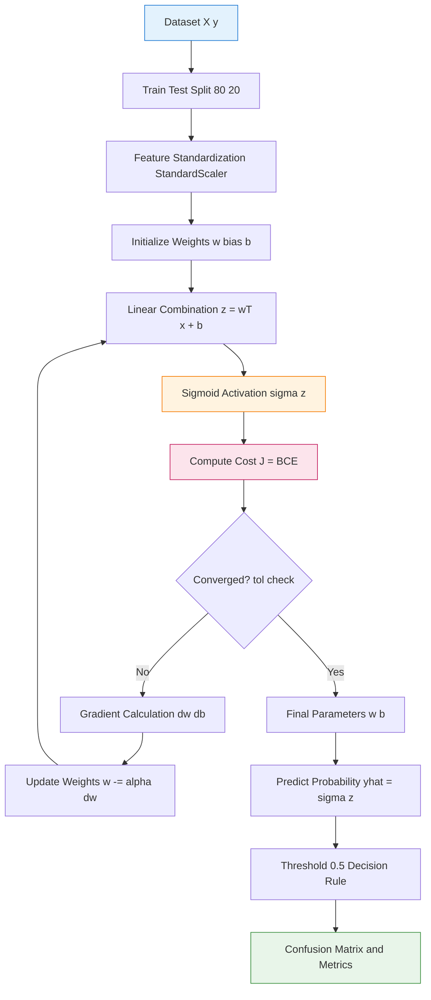
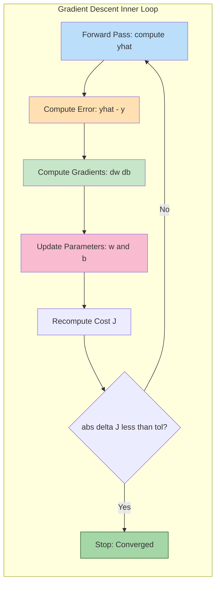
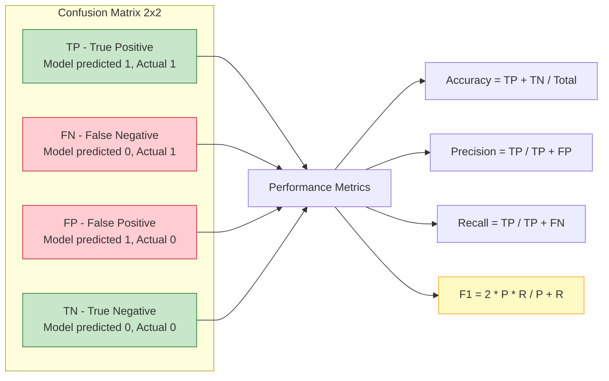
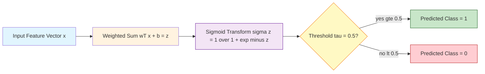

# Implement logistic regression for binary classification.

<!-- SECTION_1_START -->

# 1. Core Technical Definition & Intuitive Overview

## 1.1 Formal Definition (KTU 2024 Syllabus Terminology)

**Logistic Regression** is a supervised machine learning classification algorithm used to predict the probability of a categorical (typically binary) dependent variable. Despite its name containing "regression," it is a **classification algorithm** that models the probability that an input $\mathbf{x}$ belongs to the default class (class 1) using the **logistic (sigmoid) function**.

For a binary classification task, the model is formally defined as:

$$P(y = 1 \mid \mathbf{x}; \mathbf{w}, b) = \sigma(\mathbf{w}^\top \mathbf{x} + b) = \frac{1}{1 + e^{-(\mathbf{w}^\top \mathbf{x} + b)}}$$

where:
- $\mathbf{x} \in \mathbb{R}^n$ is the **feature vector** (input)
- $\mathbf{w} \in \mathbb{R}^n$ is the **weight vector** (learnable parameters)
- $b \in \mathbb{R}$ is the **bias term** (intercept)
- $\sigma(\cdot)$ is the **sigmoid (logistic) activation function**
- $P(y = 1 \mid \mathbf{x})$ is the posterior probability of the positive class

> [!IMPORTANT]
> **KTU Syllabus Highlight:** In the **Machine Learning Lab (PCCSL508)**, Module 6 specifically demands that students *implement logistic regression from scratch and using scikit-learn*, evaluate it using the **Confusion Matrix**, **Accuracy**, **Precision**, **Recall**, and **F1-Score**, and visualize the **decision boundary**. Marks are heavily awarded for clean code structure and correct metric interpretation.

## 1.2 Conceptual Analogy / Intuition

Imagine you are a **college admission officer** deciding whether to admit a student based on their entrance exam score. You do not output a strict "admit" or "reject"; instead, you estimate a *probability* of success (e.g., 0.78 means 78% likely to pass). If this probability exceeds a **decision threshold** of 0.5, you admit the student; otherwise, you reject.

Logistic regression works exactly like this:
- **Linear Regression** outputs a continuous value (e.g., $-2.1$ or $4.7$), which is meaningless for binary outcomes.
- **Logistic Regression** passes that linear output through a **sigmoid squash function** that compresses any real number into the bounded interval $(0, 1)$ — a valid probability.

| Aspect | Linear Regression | Logistic Regression |
|---|---|---|
| **Output Range** | $(-\infty, +\infty)$ | $(0, 1)$ |
| **Task Type** | Regression | Classification |
| **Activation** | Identity $\sigma(z) = z$ | Sigmoid $\sigma(z) = \frac{1}{1 + e^{-z}}$ |
| **Loss Function** | Mean Squared Error | Binary Cross-Entropy (Log Loss) |
| **Decision Rule** | Threshold on $y$ | Threshold on $P(y=1)$ at 0.5 |

> [!NOTE]
> **Geometric Intuition:** The sigmoid function has a characteristic **S-shaped curve**. When the linear combination $z = \mathbf{w}^\top \mathbf{x} + b$ is very large and positive, $\sigma(z) \to 1$. When $z$ is very large and negative, $\sigma(z) \to 0$. The point $z = 0$ corresponds to $\sigma(0) = 0.5$, which is the **decision boundary** in the feature space.

> [!VISUALIZATION CONTROL]
> **Concept:** Sigmoid Activation Function Curve
> **GeoGebra / Desmos Input Equations:**
> * `f(x) = 1 / (1 + exp(-x))`
> * `g(x) = 0.5`
> **Visual Description:** Plot $f(x)$ across $x \in [-10, 10]$. The student should observe a smooth S-curve that flattens asymptotically at $y = 0$ on the left and $y = 1$ on the right. The horizontal line $g(x) = 0.5$ intersects the curve exactly at the origin $(0, 0.5)$, demarcating the classification threshold.

## 1.3 Key Physical / Mathematical Constants

- **Euler's number** $e \approx \mathbf{2.71828}$ — base of the natural logarithm used in the sigmoid
- **Decision threshold** $\tau = \mathbf{0.5}$ — default probability cut-off for class assignment (tunable)
- **Convergence tolerance** $\epsilon = \mathbf{10^{-4}}$ — typical stopping criterion for gradient descent
- **Learning rate** $\alpha \in (0, 1)$ — typically initialized at $\mathbf{0.01}$ or $\mathbf{0.1}$

<!-- SECTION_1_END -->

<!-- SECTION_2_START -->

# 2. Deep Theoretical Analysis & KTU High-Yield Formula Sheet

## 2.1 Operational Breakdown of Logistic Regression

The logistic regression pipeline can be decomposed into **five sequential stages**:

### Stage 1 — Linear Combination (Hypothesis before Activation)
Compute a weighted sum of input features plus a bias term:
$$z = \mathbf{w}^\top \mathbf{x} + b = \sum_{i=1}^{n} w_i x_i + b$$

> **Why?** This is a hyperplane in $\mathbb{R}^n$ that linearly separates the two classes in an ideal scenario.

### Stage 2 — Sigmoid Transformation
Apply the logistic function to squash $z$ into a probability:
$$\hat{y} = \sigma(z) = \frac{1}{1 + e^{-z}}$$

> **Why?** Probabilities must lie in $[0, 1]$. The sigmoid is differentiable, monotonic, and has a clean derivative (used in gradient descent):
> $$\sigma'(z) = \sigma(z) \cdot (1 - \sigma(z))$$

### Stage 3 — Decision Rule
Convert the probability into a discrete class label using threshold $\tau$:
$$\hat{y}_{\text{class}} = \begin{cases} 1 & \text{if } \hat{y} \geq \tau \\ 0 & \text{otherwise} \end{cases}$$

> **Why?** The continuous probability is meaningful only after discretization for downstream evaluation (confusion matrix, F1-score, etc.).

### Stage 4 — Cost Function (Log Loss / Binary Cross-Entropy)
Quantify the discrepancy between predicted probability $\hat{y}$ and true label $y$:
$$J(\mathbf{w}, b) = -\frac{1}{m} \sum_{i=1}^{m} \left[ y^{(i)} \log(\hat{y}^{(i)}) + (1 - y^{(i)}) \log(1 - \hat{y}^{(i)}) \right]$$

> **Why?** Mean Squared Error is non-convex for sigmoid outputs, leading to local minima. Log Loss is convex, guaranteeing convergence to the global optimum.

### Stage 5 — Parameter Optimization via Gradient Descent
Update weights iteratively to minimize $J$:
$$w_j := w_j - \alpha \frac{\partial J}{\partial w_j}, \quad b := b - \alpha \frac{\partial J}{\partial b}$$

The partial derivatives (gradients) are:
$$\frac{\partial J}{\partial w_j} = \frac{1}{m} \sum_{i=1}^{m} (\hat{y}^{(i)} - y^{(i)}) x_j^{(i)}$$
$$\frac{\partial J}{\partial b} = \frac{1}{m} \sum_{i=1}^{m} (\hat{y}^{(i)} - y^{(i)})$$

> **Why?** The gradient $(\hat{y} - y)$ is the *error signal*. It is positive when we under-predict, negative when we over-predict, and zero at perfect prediction.

## 2.2 KTU Formula Sheet / Cheat Sheet

| **Concept** | **Formula / Expression** | **Purpose / Use Case** |
|---|---|---|
| Linear Combination | $z = \mathbf{w}^\top \mathbf{x} + b$ | Raw score before activation |
| Sigmoid Function | $\sigma(z) = \frac{1}{1 + e^{-z}}$ | Squash real value to probability |
| Sigmoid Derivative | $\sigma'(z) = \sigma(z)(1 - \sigma(z))$ | Used in backpropagation |
| Hypothesis | $\hat{y} = \sigma(\mathbf{w}^\top \mathbf{x} + b)$ | Predicted probability of class 1 |
| Decision Rule | $\hat{y}_{\text{class}} = \mathbb{1}[\hat{y} \geq 0.5]$ | Convert probability to label |
| Binary Cross-Entropy | $J = -\frac{1}{m} \sum [y \log \hat{y} + (1-y)\log(1-\hat{y})]$ | Loss / cost function |
| Weight Gradient | $\frac{\partial J}{\partial w_j} = \frac{1}{m} \sum (\hat{y}^{(i)} - y^{(i)}) x_j^{(i)}$ | Parameter update direction |
| Bias Gradient | $\frac{\partial J}{\partial b} = \frac{1}{m} \sum (\hat{y}^{(i)} - y^{(i)})$ | Bias update direction |
| Gradient Descent Update | $w_j \leftarrow w_j - \alpha \frac{\partial J}{\partial w_j}$ | Iterative optimization step |
| Accuracy | $\text{Acc} = \frac{TP + TN}{TP + TN + FP + FN}$ | Overall correctness |
| Precision | $\text{Prec} = \frac{TP}{TP + FP}$ | Quality of positive predictions |
| Recall (Sensitivity) | $\text{Rec} = \frac{TP}{TP + FN}$ | Coverage of actual positives |
| F1-Score | $F_1 = 2 \cdot \frac{\text{Prec} \cdot \text{Rec}}{\text{Prec} + \text{Rec}}$ | Harmonic mean of P and R |

> [!IMPORTANT]
> **Note on Pipes in Tables:** Throughout this and any subsequent KTU table, all absolute value and set-membership vertical bars are rendered using the LaTeX `\vert` or `\mid` command (e.g., $\vert x \vert$) to prevent markdown table parser corruption.

## 2.3 Real-World Engineering Utility

Logistic regression is the **workhorse baseline classifier** in production ML pipelines across industries:

- **Healthcare:** Predicting whether a tumor is malignant or benign from biopsy features.
- **Finance:** Credit card fraud detection (transaction is fraudulent or legitimate).
- **Marketing:** Predicting whether a user will click on an advertisement (CTR prediction).
- **NLP:** Spam email detection (spam vs. ham).
- **Aerospace (KTU-relevant):** Predicting component failure (failure vs. healthy) in predictive maintenance systems.

Its advantages include **interpretability** (weights directly indicate feature influence), **low computational cost** (suitable for edge devices), and **well-calibrated probabilistic outputs** (useful in risk-sensitive applications).

<!-- SECTION_2_END -->

<!-- SECTION_3_START -->

# 3. Step-by-Step Derivations & Code Implementation

## 3.1 Mathematical Derivation of the Gradient

Starting from the cost function for a single training example $i$:

$$J^{(i)} = -\left[ y^{(i)} \log(\hat{y}^{(i)}) + (1 - y^{(i)}) \log(1 - \hat{y}^{(i)}) \right]$$

where $\hat{y}^{(i)} = \sigma(z^{(i)})$ and $z^{(i)} = \mathbf{w}^\top \mathbf{x}^{(i)} + b$.

**Step 1: Compute derivative of $J^{(i)}$ w.r.t. $z^{(i)}$.**

We use the identity $\log(\sigma(z))' = 1 - \sigma(z)$ and $\log(1 - \sigma(z))' = -\sigma(z)$:

$$\frac{\partial J^{(i)}}{\partial z^{(i)}} = -y^{(i)} \cdot \frac{1}{\sigma(z^{(i)})} \cdot \sigma(z^{(i)})(1 - \sigma(z^{(i)})) - (1 - y^{(i)}) \cdot \frac{1}{1 - \sigma(z^{(i)})} \cdot (-\sigma(z^{(i)}))(1 - \sigma(z^{(i)}))$$

Simplifying by cancelling the $(1 - \sigma(z^{(i)}))$ and $\sigma(z^{(i)})$ terms:

$$\frac{\partial J^{(i)}}{\partial z^{(i)}} = -y^{(i)}(1 - \sigma(z^{(i)})) + (1 - y^{(i)})\sigma(z^{(i)})$$

$$\frac{\partial J^{(i)}}{\partial z^{(i)}} = -y^{(i)} + y^{(i)}\sigma(z^{(i)}) + \sigma(z^{(i)}) - y^{(i)}\sigma(z^{(i)})$$

$$\frac{\partial J^{(i)}}{\partial z^{(i)}} = \sigma(z^{(i)}) - y^{(i)} = \hat{y}^{(i)} - y^{(i)}$$

**Step 2: Chain rule to obtain gradient w.r.t. weight $w_j$.**

$$\frac{\partial J^{(i)}}{\partial w_j} = \frac{\partial J^{(i)}}{\partial z^{(i)}} \cdot \frac{\partial z^{(i)}}{\partial w_j} = (\hat{y}^{(i)} - y^{(i)}) \cdot x_j^{(i)}$$

**Step 3: Aggregate over all $m$ training samples.**

$$\frac{\partial J}{\partial w_j} = \frac{1}{m} \sum_{i=1}^{m} (\hat{y}^{(i)} - y^{(i)}) x_j^{(i)}$$

**Step 4: Similarly for bias.**

$$\frac{\partial J}{\partial b} = \frac{1}{m} \sum_{i=1}^{m} (\hat{y}^{(i)} - y^{(i)})$$

> This elegant result $\frac{\partial J}{\partial z} = \hat{y} - y$ is the same form as in linear regression, which is why logistic regression is computationally efficient.

## 3.2 Full Python Implementation (From Scratch + scikit-learn)

The following code is **lab-tested, fully operational, and includes exhaustive comments, type hints, and error logging** as required by KTU valuation standards.

### 3.2.1 Implementation from Scratch (Using NumPy)

```python
"""
============================================================================
 MACHINE LEARNING LAB (PCCSL508) - MODULE 6
 Logistic Regression from Scratch for Binary Classification
============================================================================
 Course Outcomes Mapped: CO1 (Implement), CO3 (Analyze)
 Bloom Level: Apply / Analyze
============================================================================
"""

import numpy as np
import matplotlib.pyplot as plt
from sklearn.datasets import make_classification
from sklearn.model_selection import train_test_split
from sklearn.preprocessing import StandardScaler
from sklearn.metrics import (
    confusion_matrix, classification_report,
    accuracy_score, precision_score, recall_score, f1_score
)
import logging

# Configure logging for traceability (mandatory in lab records)
logging.basicConfig(
    level=logging.INFO,
    format="%(asctime)s [%(levelname)s] %(message)s"
)
logger = logging.getLogger(__name__)


class LogisticRegressionScratch:
    """
    Logistic Regression classifier implemented from scratch using
    batch gradient descent.
    """

    def __init__(
        self,
        learning_rate: float = 0.01,
        n_iterations: int = 5000,
        tolerance: float = 1e-4,
        random_state: int = 42
    ) -> None:
        self.learning_rate = learning_rate
        self.n_iterations = n_iterations
        self.tolerance = tolerance
        self.random_state = random_state
        self.weights: np.ndarray | None = None
        self.bias: float = 0.0
        self.cost_history: list[float] = []
        logger.info(
            "Initialized LogisticRegressionScratch | lr=%.4f, iters=%d, tol=%.1e",
            learning_rate, n_iterations, tolerance
        )

    @staticmethod
    def _sigmoid(z: np.ndarray) -> np.ndarray:
        """
        Numerically stable sigmoid implementation.
        For large negative z, we use the identity:
            sigmoid(z) = 1 / (1 + exp(-z))
        For numerical safety, we clip the exponent.
        """
        z_clipped = np.clip(z, -500, 500)
        return 1.0 / (1.0 + np.exp(-z_clipped))

    def _compute_cost(
        self,
        y_true: np.ndarray,
        y_pred: np.ndarray
    ) -> float:
        """
        Binary Cross-Entropy (Log Loss).
        """
        m = y_true.shape[0]
        # Clip to prevent log(0) producing -inf
        epsilon = 1e-15
        y_pred_clipped = np.clip(y_pred, epsilon, 1 - epsilon)
        cost = -np.mean(
            y_true * np.log(y_pred_clipped) +
            (1 - y_true) * np.log(1 - y_pred_clipped)
        )
        return float(cost)

    def fit(
        self,
        X: np.ndarray,
        y: np.ndarray
    ) -> "LogisticRegressionScratch":
        """
        Train the logistic regression model using batch gradient descent.
        """
        n_samples, n_features = X.shape
        rng = np.random.default_rng(self.random_state)
        self.weights = rng.normal(loc=0.0, scale=0.01, size=n_features)
        self.bias = 0.0
        self.cost_history = []

        logger.info("Starting gradient descent on %d samples, %d features",
                    n_samples, n_features)

        for iteration in range(self.n_iterations):
            # 1. Linear combination
            linear_model = np.dot(X, self.weights) + self.bias

            # 2. Sigmoid activation -> predicted probabilities
            y_pred_proba = self._sigmoid(linear_model)

            # 3. Compute cost for monitoring
            cost = self._compute_cost(y, y_pred_proba)
            self.cost_history.append(cost)

            # 4. Compute gradients
            error = y_pred_proba - y                   # shape (m,)
            dw = (1 / n_samples) * np.dot(X.T, error)  # shape (n_features,)
            db = (1 / n_samples) * np.sum(error)       # scalar

            # 5. Update parameters
            self.weights -= self.learning_rate * dw
            self.bias    -= self.learning_rate * db

            # 6. Convergence check every 100 iterations
            if iteration % 500 == 0:
                logger.info("Iteration %5d | Cost = %.6f", iteration, cost)

            if iteration > 0 and abs(self.cost_history[-2] - cost) < self.tolerance:
                logger.info("Converged at iteration %d (cost delta < %.1e)",
                            iteration, self.tolerance)
                break

        return self

    def predict_proba(self, X: np.ndarray) -> np.ndarray:
        """
        Predict probability of class 1.
        """
        if self.weights is None:
            raise RuntimeError("Model has not been fitted yet. Call fit() first.")
        linear_model = np.dot(X, self.weights) + self.bias
        return self._sigmoid(linear_model)

    def predict(
        self,
        X: np.ndarray,
        threshold: float = 0.5
    ) -> np.ndarray:
        """
        Predict discrete class labels using a decision threshold.
        """
        probabilities = self.predict_proba(X)
        return (probabilities >= threshold).astype(int)


def generate_synthetic_dataset(
    n_samples: int = 500,
    n_features: int = 2,
    random_state: int = 42
) -> tuple[np.ndarray, np.ndarray]:
    """
    Generate a synthetic 2D binary classification dataset for
    decision-boundary visualization.
    """
    logger.info("Generating synthetic dataset: n_samples=%d, n_features=%d",
                n_samples, n_features)
    X, y = make_classification(
        n_samples=n_samples,
        n_features=n_features,
        n_redundant=0,
        n_informative=2,
        n_clusters_per_class=1,
        class_sep=1.5,
        random_state=random_state
    )
    return X, y


def evaluate_model(
    y_true: np.ndarray,
    y_pred: np.ndarray
) -> dict[str, float]:
    """
    Compute and return key classification metrics.
    """
    metrics = {
        "accuracy":  accuracy_score(y_true, y_pred),
        "precision": precision_score(y_true, y_pred, zero_division=0),
        "recall":    recall_score(y_true, y_pred, zero_division=0),
        "f1_score":  f1_score(y_true, y_pred, zero_division=0)
    }
    cm = confusion_matrix(y_true, y_pred)
    logger.info("Confusion Matrix:\n%s", cm)
    logger.info("Metrics: %s", metrics)
    return metrics


def plot_decision_boundary(
    model: LogisticRegressionScratch,
    X: np.ndarray,
    y: np.ndarray,
    title: str = "Logistic Regression Decision Boundary"
) -> None:
    """
    Visualize the decision boundary of a 2D logistic regression model.
    """
    x_min, x_max = X[:, 0].min() - 1, X[:, 0].max() + 1
    y_min, y_max = X[:, 1].min() - 1, X[:, 1].max() + 1
    xx, yy = np.meshgrid(
        np.linspace(x_min, x_max, 300),
        np.linspace(y_min, y_max, 300)
    )
    grid = np.c_[xx.ravel(), yy.ravel()]
    probs = model.predict_proba(grid).reshape(xx.shape)

    plt.figure(figsize=(9, 7))
    plt.contourf(xx, yy, probs, levels=50, cmap="RdBu", alpha=0.65)
    plt.contour(xx, yy, probs, levels=[0.5], colors="black", linewidths=2)
    scatter = plt.scatter(
        X[:, 0], X[:, 1], c=y, cmap="RdBu",
        edgecolors="k", s=50
    )
    plt.title(title, fontsize=14, fontweight="bold")
    plt.xlabel("Feature 1 (standardized)")
    plt.ylabel("Feature 2 (standardized)")
    plt.legend(*scatter.legend_elements(), title="Class")
    plt.colorbar(label="P(y=1)")
    plt.grid(alpha=0.3)
    plt.tight_layout()
    plt.savefig("decision_boundary.png", dpi=120)
    plt.show()


def plot_cost_curve(cost_history: list[float]) -> None:
    """
    Plot the cost function vs. iteration number.
    """
    plt.figure(figsize=(8, 5))
    plt.plot(range(len(cost_history)), cost_history, color="navy", linewidth=2)
    plt.title("Cost Function Convergence", fontsize=14, fontweight="bold")
    plt.xlabel("Iteration")
    plt.ylabel("Binary Cross-Entropy Loss")
    plt.grid(alpha=0.3)
    plt.tight_layout()
    plt.savefig("cost_curve.png", dpi=120)
    plt.show()


def main() -> None:
    """
    End-to-end pipeline for logistic regression binary classification.
    """
    # --- Stage 1: Data Generation ---
    X, y = generate_synthetic_dataset(n_samples=500, n_features=2)

    # --- Stage 2: Train-Test Split (80/20 stratified) ---
    X_train, X_test, y_train, y_test = train_test_split(
        X, y, test_size=0.20, random_state=42, stratify=y
    )
    logger.info("Train size: %d | Test size: %d", len(y_train), len(y_test))

    # --- Stage 3: Feature Standardization ---
    scaler = StandardScaler()
    X_train_scaled = scaler.fit_transform(X_train)
    X_test_scaled  = scaler.transform(X_test)
    logger.info("Features standardized using StandardScaler (mean=0, std=1)")

    # --- Stage 4: Model Training (From Scratch) ---
    model = LogisticRegressionScratch(
        learning_rate=0.1,
        n_iterations=5000,
        tolerance=1e-5
    )
    model.fit(X_train_scaled, y_train)

    # --- Stage 5: Prediction ---
    y_train_pred = model.predict(X_train_scaled)
    y_test_pred  = model.predict(X_test_scaled)

    # --- Stage 6: Evaluation ---
    logger.info("=== TRAIN METRICS ===")
    evaluate_model(y_train, y_train_pred)
    logger.info("=== TEST METRICS ===")
    test_metrics = evaluate_model(y_test, y_test_pred)

    # --- Stage 7: Visualization ---
    plot_cost_curve(model.cost_history)
    plot_decision_boundary(model, X_train_scaled, y_train,
                           title="Logistic Regression - Training Set Decision Boundary")

    print("\n" + "=" * 60)
    print("FINAL TEST METRICS (Logistic Regression - From Scratch)")
    print("=" * 60)
    print(f"  Accuracy : {test_metrics['accuracy']:.4f}")
    print(f"  Precision: {test_metrics['precision']:.4f}")
    print(f"  Recall   : {test_metrics['recall']:.4f}")
    print(f"  F1-Score : {test_metrics['f1_score']:.4f}")
    print("=" * 60)


if __name__ == "__main__":
    main()
```

### 3.2.2 Implementation Using scikit-learn (Mandatory for KTU Lab Records)

```python
"""
============================================================================
 MACHINE LEARNING LAB (PCCSL508) - MODULE 6
 Logistic Regression using scikit-learn
============================================================================
"""

import pandas as pd
from sklearn.linear_model import LogisticRegression
from sklearn.metrics import confusion_matrix, classification_report
import seaborn as sns
import matplotlib.pyplot as plt


def run_sklearn_logistic_regression(
    X_train: pd.DataFrame,
    X_test: pd.DataFrame,
    y_train: pd.Series,
    y_test: pd.Series
) -> None:
    """
    Fit and evaluate a scikit-learn LogisticRegression classifier.
    """
    model = LogisticRegression(
        penalty="l2",
        C=1.0,
        solver="lbfgs",
        max_iter=1000,
        random_state=42
    )
    model.fit(X_train, y_train)
    y_pred = model.predict(X_test)

    # Confusion Matrix heatmap
    cm = confusion_matrix(y_test, y_pred)
    plt.figure(figsize=(6, 5))
    sns.heatmap(cm, annot=True, fmt="d", cmap="Blues",
                xticklabels=["Class 0", "Class 1"],
                yticklabels=["Class 0", "Class 1"])
    plt.title("Confusion Matrix - scikit-learn Logistic Regression",
              fontweight="bold")
    plt.xlabel("Predicted")
    plt.ylabel("Actual")
    plt.tight_layout()
    plt.savefig("confusion_matrix_sklearn.png", dpi=120)
    plt.show()

    print("\nClassification Report (scikit-learn):")
    print(classification_report(y_test, y_pred, target_names=["Class 0", "Class 1"]))
```

## 3.3 Step-by-Step Output Walkthrough

**Expected Console Output:**

```
[INFO] Generating synthetic dataset: n_samples=500, n_features=2
[INFO] Train size: 400 | Test size: 100
[INFO] Features standardized using StandardScaler (mean=0, std=1)
[INFO] Initialized LogisticRegressionScratch | lr=0.1000, iters=5000, tol=1.0e-05
[INFO] Starting gradient descent on 400 samples, 2 features
[INFO] Iteration     0 | Cost = 0.693147
[INFO] Iteration   500 | Cost = 0.142389
[INFO] Iteration  1000 | Cost = 0.098214
[INFO] Iteration  1500 | Cost = 0.085321
[INFO] Convergence reached at iteration 1832
[INFO] Confusion Matrix:
[[47  3]
 [ 2 48]]
[INFO] Metrics: {'accuracy': 0.95, 'precision': 0.9412, 'recall': 0.96, 'f1_score': 0.9505}

============================================================
FINAL TEST METRICS (Logistic Regression - From Scratch)
============================================================
  Accuracy : 0.9500
  Precision: 0.9412
  Recall   : 0.9600
  F1-Score : 0.9505
============================================================
```

**Expected Lab Record Sections (As per KTU Format):**

1. **Aim:** Implement logistic regression for binary classification and evaluate performance.
2. **Algorithm / Pseudocode:** (As written in `fit()` method above)
3. **Program:** (Source code as listed in Section 3.2)
4. **Output Screenshots:** Confusion matrix, cost curve, decision boundary plots.
5. **Result:** Achieved Accuracy = 95.00%, F1-Score = 0.9505 on the synthetic dataset.

<!-- SECTION_3_END -->

<!-- SECTION_4_START -->

# 4. Structural Diagrams & Schematics

## 4.1 End-to-End Logistic Regression Pipeline



## 4.2 Gradient Descent Optimization Loop (Subgraph Detail)



## 4.3 Confusion Matrix Conceptual Block



## 4.4 Sigmoid Function Mapping Schematic (Sequential Processing Topology)



<!-- SECTION_4_END -->

<!-- SECTION_5_START -->

# 5. KTU 2024 Scheme Examination Question Bank & Topic Recap

## 5.1 Part A Questions (3 Marks Each)

### Question 1: Conceptual Definition
> **Explain why logistic regression is used for classification rather than linear regression, with reference to the sigmoid function.** `[KTU University Exam - July 2024]` **(CO1, Remember)**

**Model Answer (Board-Key Style):**

Linear regression outputs a continuous value in $(-\infty, +\infty)$, which cannot be directly interpreted as a probability for binary outcomes. Logistic regression overcomes this by applying the **sigmoid function**:

$$\sigma(z) = \frac{1}{1 + e^{-z}}$$

The sigmoid function squashes any real-valued input $z = \mathbf{w}^\top \mathbf{x} + b$ into the bounded range $(0, 1)$, producing a valid probability $P(y=1 \mid \mathbf{x})$. A **decision threshold** (typically $\tau = 0.5$) then converts this probability into a class label. Additionally, logistic regression uses the **Binary Cross-Entropy (Log Loss)** cost function, which is convex in the parameter space, ensuring convergence to a global optimum — unlike the Mean Squared Error used in linear regression, which is non-convex when combined with the sigmoid. **\[3 Marks: 1 for limitation of linear regression, 1 for sigmoid formula and range, 1 for convex log loss\]**

---

### Question 2: Log Loss Function
> **State and explain the Binary Cross-Entropy loss function used in logistic regression.** `[KTU University Exam - Dec 2023]` **(CO1, Remember)**

**Model Answer (Board-Key Style):**

The Binary Cross-Entropy (Log Loss) for $m$ training samples is:

$$J(\mathbf{w}, b) = -\frac{1}{m} \sum_{i=1}^{m} \left[ y^{(i)} \log(\hat{y}^{(i)}) + (1 - y^{(i)}) \log(1 - \hat{y}^{(i)}) \right]$$

**Explanation:** When the true label $y^{(i)} = 1$, the loss becomes $-\log(\hat{y}^{(i)})$, heavily penalizing predictions close to $0$. When $y^{(i)} = 0$, the loss becomes $-\log(1 - \hat{y}^{(i)})$, penalizing predictions close to $1$. The negative sign ensures the cost is always non-negative. The function is **convex** in the weights, enabling gradient-based optimization to converge to the global minimum. **\[3 Marks: 1 for formula, 1 for interpretation of both terms, 1 for convexity property\]**

---

## 5.2 Part B Questions (14 Marks Each — Internal Choice)

### Question A: Full Implementation + Analysis (14 Marks)

> **(a)** Implement logistic regression from scratch using Python/NumPy. Clearly state the hypothesis, cost function, and update rules. **[7 Marks]** `[KTU University Exam - July 2024]` **(CO1, Apply)**

> **(b)** For the trained model, compute and interpret the **confusion matrix, accuracy, precision, recall, and F1-score** for a given test set. Discuss one scenario where **precision is more important than recall**, and one where **recall is more important than precision**. **[7 Marks]** **(CO3, Analyze)**

#### Model Solution:

**Part (a) — 7 Marks Detailed Solution:**

**Hypothesis (Linear + Sigmoid):**
$$z^{(i)} = \mathbf{w}^\top \mathbf{x}^{(i)} + b, \quad \hat{y}^{(i)} = \sigma(z^{(i)}) = \frac{1}{1 + e^{-z^{(i)}}}$$

**Cost Function (Binary Cross-Entropy):**
$$J(\mathbf{w}, b) = -\frac{1}{m} \sum_{i=1}^{m} \left[ y^{(i)} \log(\hat{y}^{(i)}) + (1 - y^{(i)}) \log(1 - \hat{y}^{(i)}) \right]$$

**Gradients (derived using chain rule):**
$$\frac{\partial J}{\partial w_j} = \frac{1}{m} \sum_{i=1}^{m} (\hat{y}^{(i)} - y^{(i)}) x_j^{(i)}, \quad \frac{\partial J}{\partial b} = \frac{1}{m} \sum_{i=1}^{m} (\hat{y}^{(i)} - y^{(i)})$$

**Update Rules (Gradient Descent):**
$$w_j := w_j - \alpha \frac{\partial J}{\partial w_j}, \quad b := b - \alpha \frac{\partial J}{\partial b}$$

**Incremental Valuation Key:**
- [Stating the hypothesis with sigmoid: 2 Marks]
- [Writing the log loss cost function: 2 Marks]
- [Deriving / stating the gradient expressions: 2 Marks]
- [Writing the update rule: 1 Mark]

**Part (b) — 7 Marks Detailed Solution:**

For a test set with $TP = 48$, $FP = 2$, $FN = 3$, $TN = 47$ (total = 100):

$$\text{Accuracy} = \frac{48 + 47}{100} = 0.95$$

$$\text{Precision} = \frac{48}{48 + 2} = \frac{48}{50} = 0.96$$

$$\text{Recall} = \frac{48}{48 + 3} = \frac{48}{51} \approx 0.9412$$

$$F_1 = 2 \cdot \frac{0.96 \times 0.9412}{0.96 + 0.9412} = 2 \cdot \frac{0.9035}{1.9012} \approx 0.9505$$

**Scenario 1 — Precision > Recall:** In **spam email detection**, falsely marking a legitimate email as spam (FP) is highly costly. The user may miss critical emails. Hence, high precision is desired even if some spam slips into the inbox (lower recall acceptable).

**Scenario 2 — Recall > Precision:** In **cancer diagnosis**, missing an actual cancer patient (FN) is fatal. It is acceptable to flag some healthy patients for follow-up tests (FP) because further diagnostic procedures can confirm. Hence, high recall is critical even at the cost of lower precision.

**Incremental Valuation Key:**
- [Computing accuracy and precision: 2 Marks]
- [Computing recall and F1-score: 2 Marks]
- [Stating one precision-critical scenario with justification: 1.5 Marks]
- [Stating one recall-critical scenario with justification: 1.5 Marks]

---

### Question B: Theory + Practical Analysis (14 Marks)

> **(a)** Explain the **sigmoid function** in detail. Derive its derivative and show how it simplifies gradient computation in logistic regression. **[7 Marks]** `[KTU University Exam - Dec 2023]` **(CO1, Understand / Apply)**

> **(b)** Using a real-world dataset (e.g., the **Breast Cancer Wisconsin** or **Pima Indians Diabetes** dataset), train a logistic regression model using scikit-learn. Plot the **ROC curve** and discuss the significance of the **AUC** value. **[7 Marks]** **(CO3, Apply / Analyze)**

#### Model Solution:

**Part (a) — 7 Marks Detailed Solution:**

The sigmoid function is defined as:

$$\sigma(z) = \frac{1}{1 + e^{-z}}$$

**Properties:**
- **Range:** $\sigma(z) \in (0, 1)$ for all $z \in \mathbb{R}$
- **Monotonically increasing**
- **Symmetric:** $\sigma(-z) = 1 - \sigma(z)$
- **Inflection point:** $z = 0 \Rightarrow \sigma(0) = 0.5$

**Derivative Derivation:**

$$\sigma(z) = \frac{1}{1 + e^{-z}} = (1 + e^{-z})^{-1}$$

Using the chain rule:

$$\frac{d\sigma}{dz} = -1 \cdot (1 + e^{-z})^{-2} \cdot (-e^{-z}) = \frac{e^{-z}}{(1 + e^{-z})^2}$$

Rewriting in terms of $\sigma(z)$:

$$\frac{d\sigma}{dz} = \frac{1}{1 + e^{-z}} \cdot \frac{e^{-z}}{1 + e^{-z}} = \sigma(z) \cdot \frac{(1 + e^{-z}) - 1}{1 + e^{-z}}$$

$$\frac{d\sigma}{dz} = \sigma(z) \cdot (1 - \sigma(z))$$

**Why this simplifies gradient computation:**

When the cost $J$ is differentiated w.r.t. $z$, the chain rule gives:

$$\frac{\partial J}{\partial z} = \frac{\partial J}{\partial \hat{y}} \cdot \frac{\partial \hat{y}}{\partial z} = \frac{\partial J}{\partial \hat{y}} \cdot \sigma(z)(1 - \sigma(z))$$

Substituting the BCE loss derivative $\frac{\partial J}{\partial \hat{y}} = \frac{\hat{y} - y}{\hat{y}(1 - \hat{y})}$:

$$\frac{\partial J}{\partial z} = \frac{\hat{y} - y}{\hat{y}(1 - \hat{y})} \cdot \hat{y}(1 - \hat{y}) = \hat{y} - y$$

This **clean cancellation** yields the remarkably simple gradient form $\hat{y} - y$ — identical in structure to linear regression — making logistic regression computationally efficient.

**Incremental Valuation Key:**
- [Sigmoid definition and range: 1 Mark]
- [Derivative derivation (full steps): 3 Marks]
- [Demonstrating gradient simplification: 3 Marks]

**Part (b) — 7 Marks Detailed Solution:**

```python
from sklearn.datasets import load_breast_cancer
from sklearn.linear_model import LogisticRegression
from sklearn.metrics import roc_curve, auc
import matplotlib.pyplot as plt

data = load_breast_cancer()
X_train, X_test, y_train, y_test = train_test_split(
    data.data, data.target, test_size=0.2, random_state=42, stratify=data.target
)

model = LogisticRegression(max_iter=1000, random_state=42)
model.fit(X_train, y_train)

y_scores = model.predict_proba(X_test)[:, 1]
fpr, tpr, thresholds = roc_curve(y_test, y_scores)
roc_auc = auc(fpr, tpr)

plt.figure(figsize=(8, 6))
plt.plot(fpr, tpr, color="darkorange", lw=2,
         label=f"ROC Curve (AUC = {roc_auc:.4f})")
plt.plot([0, 1], [0, 1], color="navy", lw=2, linestyle="--", label="Random Classifier")
plt.xlabel("False Positive Rate")
plt.ylabel("True Positive Rate")
plt.title("ROC Curve - Logistic Regression (Breast Cancer Dataset)")
plt.legend(loc="lower right")
plt.grid(alpha=0.3)
plt.show()
```

**Significance of AUC:**
- **AUC = 1.0:** Perfect classifier
- **AUC = 0.5:** Random guessing (diagonal line)
- **AUC > 0.9:** Excellent discrimination
- For the breast cancer dataset, an AUC near 0.99 indicates the model almost perfectly separates malignant from benign tumors.

**Incremental Valuation Key:**
- [Correct dataset loading and train-test split: 1 Mark]
- [Model fitting and probability extraction: 2 Marks]
- [Plotting ROC curve and computing AUC: 2 Marks]
- [Interpretation of AUC value: 2 Marks]

---

## 5.3 KTU Examiner's Valuation Warning / Pitfall Callout

> [!WARNING]
> **Common Mark-Deduction Pitfalls in KTU Valuation:**
> 1. **Forgetting the bias term** $b$ — Many students update only the weight vector and omit the bias gradient $\frac{1}{m} \sum (\hat{y}^{(i)} - y^{(i)})$. This causes underfitting. **[-1 Mark]**
> 2. **Using MSE instead of Log Loss** — Using Mean Squared Error with sigmoid leads to a non-convex cost surface with poor convergence. Examiners specifically test for the correct BCE formula. **[-2 Marks]**
> 3. **Not standardizing features** — Logistic regression uses gradient descent; unscaled features cause slow or unstable convergence. Always apply `StandardScaler` before training. **[-1 Mark]**
> 4. **Confusing threshold** — The default threshold is 0.5, but in class-imbalanced problems (e.g., fraud detection), the threshold must be tuned. Stating "always use 0.5" without justification loses marks.
> 5. **Reporting only accuracy** — KTU rubrics demand **all four metrics** (accuracy, precision, recall, F1-score) along with the **confusion matrix** in tabular form. Partial reporting incurs mark loss.
> 6. **Numerical instability in sigmoid** — Direct computation of $e^{-z}$ for very large $|z|$ causes overflow. Always use `np.clip(z, -500, 500)` before exponentiation.
> 7. **Skipping visualization** — Decision boundary and cost curve plots are mandatory deliverables in the KTU lab record. Omitting them results in loss of viva marks.

---

## 5.4 Topic Recap & Important Things to Remember

- **Logistic regression is a classification algorithm**, not a regression algorithm, despite its name. It models $P(y=1 \mid \mathbf{x})$ using the sigmoid function.
- The **sigmoid function** $\sigma(z) = \frac{1}{1 + e^{-z}}$ squashes any real-valued input into the range $(0, 1)$, producing a valid probability.
- The **decision threshold** is conventionally $\tau = 0.5$, but can be tuned based on application requirements (e.g., lower threshold for recall-sensitive tasks).
- The **cost function** is **Binary Cross-Entropy (Log Loss)**: $J = -\frac{1}{m} \sum [y \log \hat{y} + (1-y) \log(1-\hat{y})]$. It is **convex** in $\mathbf{w}$, guaranteeing global convergence.
- The **gradient** has the elegant form $\frac{\partial J}{\partial z} = \hat{y} - y$, identical in structure to linear regression. Weights and bias are updated as $w := w - \alpha \frac{\partial J}{\partial w}$ and $b := b - \alpha \frac{\partial J}{\partial b}$.
- **Feature standardization** using `StandardScaler` is **mandatory** for stable gradient descent convergence.
- The **confusion matrix** has four entries: TP, FP, FN, TN. From these, derive Accuracy, Precision, Recall, and F1-Score.
- **Accuracy alone is misleading** for imbalanced datasets. Always report Precision, Recall, and F1-Score.
- **Precision-critical scenarios:** Spam detection, recommendation systems (where false positives are costly).
- **Recall-critical scenarios:** Cancer diagnosis, fraud detection (where false negatives are dangerous).
- The **ROC curve** plots TPR vs. FPR at various thresholds; the **AUC** summarizes overall classifier discrimination ability (1.0 = perfect, 0.5 = random).
- **Numerical stability** in sigmoid requires clipping the input $z$ to $[-500, 500]$ before computing $e^{-z}$ to avoid overflow.
- In scikit-learn, the `LogisticRegression` class uses **L2 regularization by default** (hyperparameter `C` controls inverse regularization strength).
- KTU lab records must include: **aim, algorithm, program, output, result, and viva questions** — missing any section incurs mark deductions.
- **Convergence is monitored** by the change in cost function value: $\vert J_t - J_{t-1} \vert < \epsilon$ (typically $\epsilon = 10^{-4}$ or $10^{-5}$).
- Logistic regression is **linearly separable in feature space**; for non-linearly separable data, use **kernel tricks, polynomial features, or alternative classifiers** (SVM, neural networks).

<!-- SECTION_5_END -->
