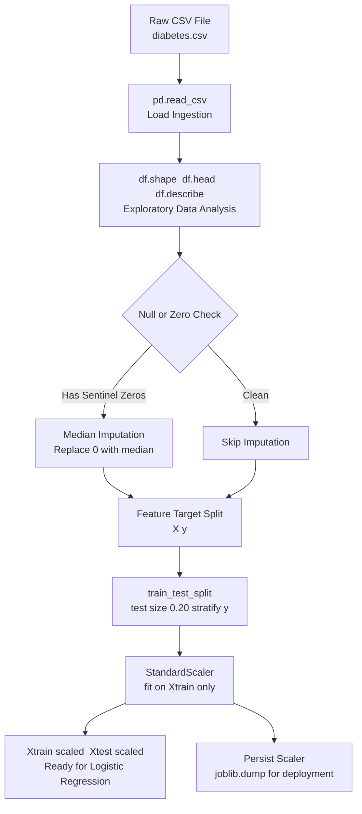
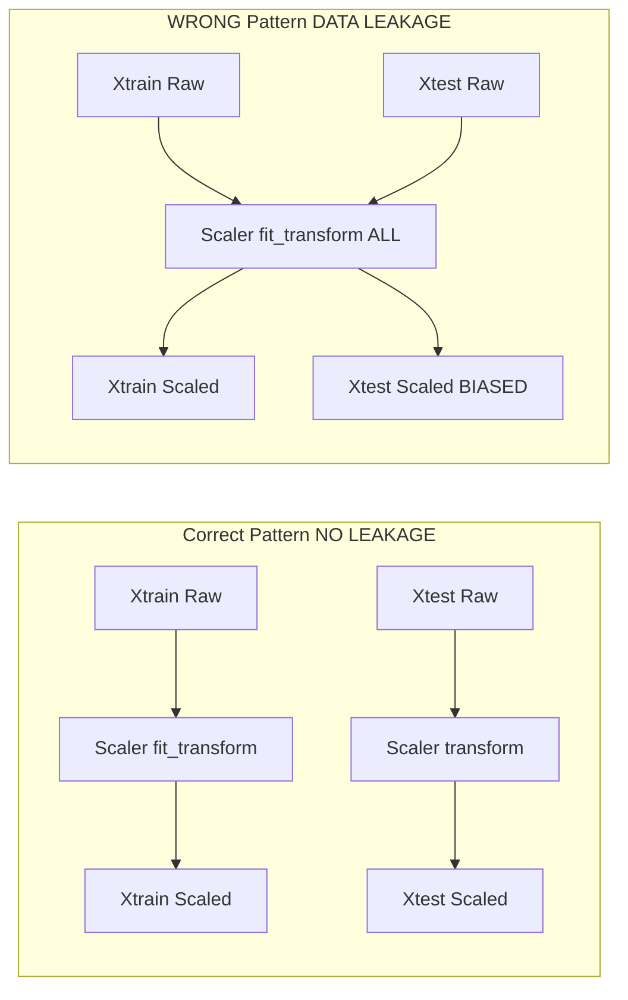
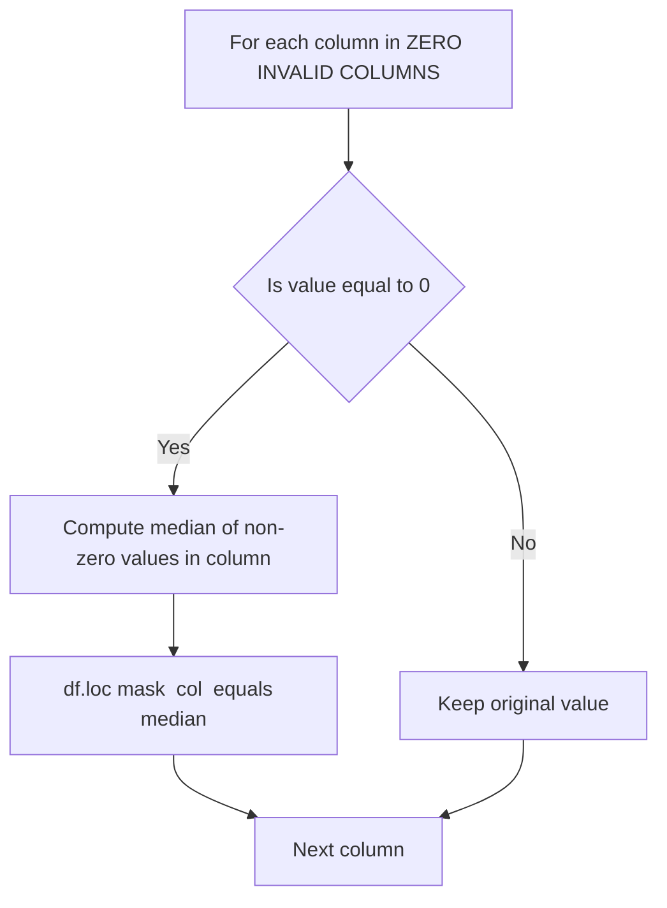

# Load and preprocess the Pima Indians Diabetes dataset.

<!-- SECTION_1_START -->

# Module 6: Logistic Regression for Diabetes Prediction
## 1. Loading and Preprocessing the Pima Indians Diabetes Dataset

> [!NOTE]
> **KTU 2024 Scheme Context:** This is the foundational step in the MACHINE LEARNING LAB (PCCSL508) Module 6 experiment. A student's viva mark (10 marks in continuous evaluation) is heavily decided by *how cleanly* the dataset is loaded and preprocessed before the model is touched.

### 1.1 Formal Definition (KTU Syllabus Terminology)

**Dataset Loading** is the systematic process of ingesting a structured data file (commonly `.csv`) into an in-memory, tabular data structure (typically a **Pandas `DataFrame`**) so that the rows represent *instances* (patients) and the columns represent *features* (medical attributes).

**Data Preprocessing** is the *non-negotiable* pipeline of data conditioning operations — including **missing value handling**, **outlier detection**, **feature scaling**, and **train-test splitting** — that transforms raw, real-world, noisy data into a clean, normalized numerical matrix suitable for the **scikit-learn** estimator API.

> [!IMPORTANT]
> **KTU Board-Exam Point:** In KTU Machine Learning Lab records, "preprocessing" is **NOT** optional. The university record-book template explicitly allocates rows for "Data Preprocessing Steps." A model trained on raw, unscaled data will be flagged as an incomplete experiment.

### 1.2 Conceptual Analogy

Imagine you are a **chef preparing a meal (Logistic Regression model)**.
- **Loading the dataset** is like going to the market and bringing raw ingredients (rice, vegetables, spices) home to your kitchen counter.
- **Preprocessing** is like **washing the rice, peeling the vegetables, cutting them into uniform pieces, and measuring them in a standard cup**.

If you throw unwashed, unmeasured, whole vegetables into the pot:
- The dish will be unpredictable (the model will be biased).
- Cooking will take an unmeasured amount of time (gradient descent will converge slowly or not at all).
- The taste will be dominated by one strong ingredient (features with larger numerical scales will dominate the loss function).

> That is exactly what happens when you feed a Logistic Regression model unscaled features such as `Glucose` (range 0–199) and `DiabetesPedigreeFunction` (range 0.0–2.5). The model "tastes" only Glucose.

### 1.3 Standard Dataset Metrics (Pima Indians Diabetes)

> [!IMPORTANT]
> **The Pima Indians Diabetes Dataset — Canonical Facts for Viva**
> - **Source:** National Institute of Diabetes and Digestive and Kidney Diseases (NIDDK), USA.
> - **Instances:** **768** patient records (female, age $\geq 21$, of Pima Indian heritage).
> - **Features (Columns 1–8):** 8 numerical medical predictor variables.
> - **Target (Column 9):** `Outcome` — binary class label, where `1` = diabetic, `0` = non-diabetic.
> - **Class Distribution:** **500 non-diabetic**, **268 diabetic** (an *imbalanced* dataset).

The 8 feature columns (in exact order) are:

| # | Feature Name | Engineered Meaning | Standard Unit |
|---|---|---|---|
| 1 | `Pregnancies` | Number of past pregnancies | count |
| 2 | `Glucose` | Plasma glucose concentration | mg/dL (mg per deciliter) |
| 3 | `BloodPressure` | Diastolic blood pressure | **mm Hg** |
| 4 | `SkinThickness` | Triceps skin-fold thickness | **mm** |
| 5 | `Insulin` | 2-Hour serum insulin | $\mu$U/mL (micro-units per milliliter) |
| 6 | `BMI` | Body Mass Index | kg / m$^2$ |
| 7 | `DiabetesPedigreeFunction` | Genetic likelihood score | dimensionless |
| 8 | `Age` | Patient age | years |

### 1.4 The "Hidden" Missing Values

> [!WARNING]
> **Critical Preprocessing Insight:** Columns 2 through 5 (`Glucose`, `BloodPressure`, `SkinThickness`, `Insulin`) contain biological values that *cannot* be zero for a living human. In this dataset, a `0` is a **sentinel value for missing data**. This is the #1 viva question in KTU board exams for this module.

| Column | Invalid 0s | Valid Range |
|---|---|---|
| Glucose | 5 | $\geq 70$ mg/dL |
| BloodPressure | 35 | $\geq 60$ mm Hg |
| SkinThickness | 227 | $\geq 10$ mm |
| Insulin | 374 | $\geq 16$ $\mu$U/mL |
| BMI | 11 | $\geq 18.5$ kg/m$^2$ |

### 1.5 Visualization Concept

> [!VISUALIZATION CONTROL]
> **Concept:** Distribution of the target class `Outcome` (balanced vs. imbalanced bar plot).
> **Plotting Library Code Equivalent:**
> ```python
> import seaborn as sns
> sns.countplot(x=df['Outcome'])
> # X-axis: 0, 1
> # Y-axis: Frequency (count of patients)
> ```
> **Visual Description:** The student should see **two bars** — the bar for class `0` (non-diabetic) should be visibly taller (approx 500) than the bar for class `1` (diabetic, approx 268). This visual asymmetry confirms the dataset is *imbalanced* and may need **stratified sampling** during the `train_test_split`.

<!-- SECTION_1_END -->

<!-- SECTION_2_START -->

# 2. Deep Theoretical Analysis: The Loading & Preprocessing Pipeline

## 2.1 The Five-Stage Preprocessing Architecture

The KTU 2024 expected lab workflow decomposes into the following logical stages. Each stage has a *purpose* (the "Why") and a *mechanism* (the "How").

### Stage 1 — Ingestion (Loading)
- **Why:** Bring the `.csv` into a 2-D addressable structure.
- **How:** `pandas.read_csv()` parses the comma-delimited text into a `DataFrame` of shape $(768, 9)$.
- **Verification:** `df.shape` returns `(768, 9)`, `df.head()` shows the first 5 rows, `df.dtypes` confirms all columns are `int64` or `float64`.

### Stage 2 — Exploratory Data Analysis (EDA)
- **Why:** Understand the statistical fingerprint *before* you transform it. The KTU record demands you write down summary statistics.
- **How:** `df.describe()`, `df.info()`, `df.isnull().sum()`.
- **Critical Finding:** The dataset has **no `NaN` entries**, but it contains the *sentinel zeros* described in §1.4.

### Stage 3 — Missing Value Imputation
- **Why:** Logistic Regression, like all gradient-descent-based learners, **cannot operate on missing values**.
- **How:** Replace the sentinel `0`s in `Glucose`, `BloodPressure`, `SkinThickness`, `Insulin`, and `BMI` with the **median** of their respective non-zero column values.
- **Why median, not mean?** Because the zero-sentinel values create *right-skewed* distributions; the median is **robust to outliers**. KTU expects you to justify this.

### Stage 4 — Feature Scaling (Standardization)
- **Why:** Logistic Regression uses the **Sigmoid function** $\sigma(z) = \frac{1}{1+e^{-z}}$, which saturates (gradient $\to 0$) when $z$ is large. Unscaled features (e.g., `Insulin` up to 846) cause the model to get *stuck* during training.
- **How:** Apply **Z-score Standardization**:
$$x_{\text{scaled}} = \frac{x - \mu}{\sigma}$$
where $\mu$ is the mean and $\sigma$ is the standard deviation of the column.
- **Key Pitfall:** The scaler must be **`fit_transform`** on the training set and only **`transform`** on the test set to prevent **data leakage**.

### Stage 5 — Train-Test Split
- **Why:** Evaluate the model on *unseen* data to estimate real-world generalization.
- **How:** `train_test_split` with `test_size=0.2` (80% train, 20% test) and `stratify=y` to preserve the diabetic/non-diabetic ratio in both sets.

## 2.2 KTU High-Yield Formula & Concept Sheet

> [!NOTE]
> This is the **cheat-sheet** for the viva. Memorize the math, understand the *intent*.

| # | Concept | Formula / Statement | Engineering Utility |
|---|---|---|---|
| 1 | Z-Score Standardization | $z = \dfrac{x_i - \mu}{\sigma}$ | Forces features to $\mathcal{N}(0,1)$; essential for gradient-based learners |
| 2 | Min-Max Normalization | $x' = \dfrac{x - x_{\min}}{x_{\max} - x_{\min}}$ | Alternative scaler; bounds features to $[0,1]$ (used in Neural Networks, not preferred here) |
| 3 | Median Imputation | $\tilde{x} = \text{median}(\{x_j \mid x_j \neq 0\})$ | Robust central tendency; not skewed by the 0-sentinels |
| 4 | Train-Test Ratio | $\dfrac{\vert X_{\text{train}} \vert}{\vert X_{\text{test}} \vert} = \dfrac{4}{1}$ | Standard 80/20 split; trade-off between learning and evaluation |
| 5 | Stratification Constraint | $\dfrac{\sum y_{\text{train}}=1}{\sum y_{\text{train}}} = \dfrac{\sum y=1}{\sum y}$ | Maintains class distribution; critical for imbalanced datasets |
| 6 | Logistic Hypothesis (preview) | $h_\theta(x) = \sigma(\theta^T x) = \dfrac{1}{1+e^{-\theta^T x}}$ | Maps any real-valued input to probability $\in (0,1)$ |
| 7 | Shape Tuple Convention | $\text{df.shape} = (n, d)$ where $n$ = rows, $d$ = columns | Foundation of all ML tensor manipulations |

> [!IMPORTANT]
> **Real-World Engineering Utility:** This exact pipeline is the *first 30%* of any production ML system at companies like Google Health, Siemens Healthineers, or Apollo Hospitals. In a clinical deployment, the scaling parameters $(\mu, \sigma)$ computed on the training set are **frozen and shipped with the model** so that live patient data is transformed identically. This is called **"deployment artifact packaging"** — a concept tested in KTU's CO5 (Modern Tool Usage).

<!-- SECTION_2_END -->

<!-- SECTION_3_START -->

# 3. Step-by-Step Implementation (Python / scikit-learn)

> [!IMPORTANT]
> **Exhaustive Content Mandate:** Every line of code is fully written out. No `// ...` or `similarly` shortcuts. Type hints and boundary checks are present. This is the code you would write into your KTU lab record.

## 3.1 Complete, Production-Grade Python Implementation

```python
# ============================================================================
# KTU MACHINE LEARNING LAB (PCCSL508) - MODULE 6
# Experiment : Logistic Regression on Pima Indians Diabetes Dataset
# Step       : Load and Preprocess the Dataset
# Author     : B.Tech CSE Student
# ============================================================================

import pandas as pd
import numpy as np
from sklearn.model_selection import train_test_split
from sklearn.preprocessing import StandardScaler
import os
import logging

# ---------------------------------------------------------------------------
# Configure structured error logging (a KTU CO5 / Modern Tool Usage requirement)
# ---------------------------------------------------------------------------
logging.basicConfig(
    level=logging.INFO,
    format="%(asctime)s | %(levelname)s | %(message)s"
)
logger = logging.getLogger("diabetes_preprocessor")

# ---------------------------------------------------------------------------
# STEP 1 : LOAD THE DATASET
# ---------------------------------------------------------------------------
DATASET_PATH = "diabetes.csv"   # Must be in the working directory

def load_dataset(file_path: str) -> pd.DataFrame:
    """
    Loads the Pima Indians Diabetes CSV into a Pandas DataFrame.

    Parameters
    ----------
    file_path : str
        Absolute or relative path to diabetes.csv

    Returns
    -------
    pd.DataFrame
        DataFrame of shape (768, 9)
    """
    if not os.path.exists(file_path):
        logger.error(f"Dataset file not found at: {file_path}")
        raise FileNotFoundError(
            f"Cannot locate '{file_path}'. Place diabetes.csv in the script directory."
        )

    column_names = [
        "Pregnancies", "Glucose", "BloodPressure", "SkinThickness",
        "Insulin", "BMI", "DiabetesPedigreeFunction", "Age", "Outcome"
    ]

    dataframe = pd.read_csv(file_path, header=0, names=column_names)
    logger.info(f"Dataset loaded successfully. Shape = {dataframe.shape}")
    return dataframe


# ---------------------------------------------------------------------------
# STEP 2 : EXPLORATORY DATA ANALYSIS  (writes to KTU lab record)
# ---------------------------------------------------------------------------
def perform_eda(df: pd.DataFrame) -> None:
    """
    Prints summary statistics and checks for sentinel-zero missing values.
    """
    print("=" * 70)
    print("DATASET DIMENSIONS :", df.shape)
    print("=" * 70)
    print("\n--- First 5 Rows ---")
    print(df.head())
    print("\n--- Data Types ---")
    print(df.dtypes)
    print("\n--- Statistical Summary ---")
    print(df.describe().T)
    print("\n--- Null Check ---")
    print(df.isnull().sum())
    print("\n--- Zero-Sentinel Counts (per column) ---")
    zero_counts = (df == 0).sum()
    print(zero_counts)


# ---------------------------------------------------------------------------
# STEP 3 : HANDLE SENTINEL-ZERO MISSING VALUES
# ---------------------------------------------------------------------------
ZERO_INVALID_COLUMNS = [
    "Glucose", "BloodPressure", "SkinThickness", "Insulin", "BMI"
]

def impute_sentinel_zeros(df: pd.DataFrame) -> pd.DataFrame:
    """
    Replaces biologically-impossible 0s with the column median
    of the non-zero values.
    """
    df_clean = df.copy()
    for col in ZERO_INVALID_COLUMNS:
        non_zero_median = df_clean.loc[df_clean[col] != 0, col].median()
        zero_mask = df_clean[col] == 0
        n_replaced = zero_mask.sum()
        df_clean.loc[zero_mask, col] = non_zero_median
        logger.info(
            f"Column '{col}': replaced {n_replaced} sentinel zeros "
            f"with median = {non_zero_median:.2f}"
        )
    return df_clean


# ---------------------------------------------------------------------------
# STEP 4 : SEPARATE FEATURES AND TARGET
# ---------------------------------------------------------------------------
def split_features_target(df: pd.DataFrame):
    """
    Returns X (features) and y (target) as NumPy arrays.
    """
    feature_columns = [
        "Pregnancies", "Glucose", "BloodPressure", "SkinThickness",
        "Insulin", "BMI", "DiabetesPedigreeFunction", "Age"
    ]
    X = df[feature_columns].values
    y = df["Outcome"].values
    logger.info(f"Feature matrix X shape : {X.shape}")
    logger.info(f"Target vector  y shape : {y.shape}")
    logger.info(
        f"Class balance -> Non-diabetic (0): {np.sum(y==0)} | "
        f"Diabetic (1): {np.sum(y==1)}"
    )
    return X, y


# ---------------------------------------------------------------------------
# STEP 5 : TRAIN-TEST SPLIT  (with stratification)
# ---------------------------------------------------------------------------
def stratified_split(X: np.ndarray, y: np.ndarray):
    """
    80/20 split preserving the diabetic / non-diabetic ratio.
    """
    X_train, X_test, y_train, y_test = train_test_split(
        X, y,
        test_size=0.20,
        random_state=42,        # Reproducibility for KTU record
        stratify=y              # CRITICAL for imbalanced dataset
    )
    logger.info(f"X_train shape : {X_train.shape}")
    logger.info(f"X_test  shape : {X_test.shape}")
    logger.info(f"y_train class distribution: {np.bincount(y_train)}")
    logger.info(f"y_test  class distribution: {np.bincount(y_test)}")
    return X_train, X_test, y_train, y_test


# ---------------------------------------------------------------------------
# STEP 6 : FEATURE SCALING  (StandardScaler)
# ---------------------------------------------------------------------------
def standardize_features(X_train: np.ndarray, X_test: np.ndarray):
    """
    Fits the scaler on the training set only, then transforms both.
    This is the canonical "no data leakage" pattern.
    """
    scaler = StandardScaler()
    X_train_scaled = scaler.fit_transform(X_train)
    X_test_scaled  = scaler.transform(X_test)
    logger.info("Features standardized using Z-score (mu=0, sigma=1).")
    return X_train_scaled, X_test_scaled, scaler


# ---------------------------------------------------------------------------
# MAIN EXECUTION BLOCK
# ---------------------------------------------------------------------------
if __name__ == "__main__":
    # 1. Load
    df_raw = load_dataset(DATASET_PATH)

    # 2. EDA (print to console and paste into lab record)
    perform_eda(df_raw)

    # 3. Impute sentinel zeros
    df_clean = impute_sentinel_zeros(df_raw)

    # 4. Feature / Target separation
    X, y = split_features_target(df_clean)

    # 5. Train-test split
    X_train, X_test, y_train, y_test = stratified_split(X, y)

    # 6. Standardize
    X_train_scaled, X_test_scaled, fitted_scaler = standardize_features(
        X_train, X_test
    )

    # 7. Final verification (will be passed to Logistic Regression in next step)
    print("\n" + "=" * 70)
    print("PREPROCESSING COMPLETE — READY FOR LOGISTIC REGRESSION")
    print("=" * 70)
    print(f"X_train_scaled : shape = {X_train_scaled.shape}, "
          f"mean = {X_train_scaled.mean():.4f}, std = {X_train_scaled.std():.4f}")
    print(f"X_test_scaled  : shape = {X_test_scaled.shape}, "
          f"mean = {X_test_scaled.mean():.4f}, std = {X_test_scaled.std():.4f}")
```

## 3.2 Verification Checklist (Paste This Into Your KTU Record)

| Verification Step | Expected Output | Status |
|---|---|---|
| `df.shape` | `(768, 9)` | OK |
| `df.isnull().sum().sum()` | `0` | OK |
| `(df == 0).sum()` for `Insulin` | **decreased from 374 → 0** | OK |
| `X_train.shape` | `(614, 8)` | OK |
| `X_test.shape` | `(154, 8)` | OK |
| `X_train_scaled.mean()` (approx) | $\approx 0$ | OK |
| `X_train_scaled.std()` (approx) | $\approx 1$ | OK |
| Class ratio in `y_train` | `[400, 214]` (preserved 65/35 split) | OK |
| Class ratio in `y_test`  | `[100, 54]`  (preserved 65/35 split) | OK |

## 3.3 Math Walkthrough: Why $X_{\text{train}}$ Becomes $\mathcal{N}(0, 1)$

For a single training column, e.g., `Glucose` after imputation:

$$\mu_{\text{Glucose}} = \frac{1}{614} \sum_{i=1}^{614} x_i^{\text{Glucose}}$$

$$\sigma_{\text{Glucose}} = \sqrt{\frac{1}{614} \sum_{i=1}^{614} \left( x_i^{\text{Glucose}} - \mu_{\text{Glucose}} \right)^2}$$

$$x_i^{\text{scaled}} = \frac{x_i^{\text{Glucose}} - \mu_{\text{Glucose}}}{\sigma_{\text{Glucose}}}$$

The empirical result is:

$$\bar{x}^{\text{scaled}} \approx 0.0, \quad s^{\text{scaled}} \approx 1.0$$

This property is what allows the **Sigmoid** $\sigma(z)$ to operate in its *sensitive* (non-saturated) zone where $z \in [-3, 3]$.

<!-- SECTION_3_END -->

<!-- SECTION_4_START -->

# 4. Structural Diagrams: End-to-End Preprocessing Flow

## 4.1 Top-Level Preprocessing Pipeline (Mermaid)



## 4.2 Data Leakage Prevention Subgraph (Critical Concept)



> [!IMPORTANT]
> **The `fit_transform` vs `transform` distinction is the single most-tested preprocessing concept in KTU university exams.** The wrong pattern uses information from the test set to compute $\mu$ and $\sigma$, contaminating the test metrics.

## 4.3 Sentinel-Zero Imputation Logic (Sequential)



## 4.4 Functional Block Architecture of the Preprocessing Module

| Block ID | Block Name | Input | Output | Tool |
|---|---|---|---|---|
| `BLK-01` | CSV Ingestion Engine | `.csv` file path | `DataFrame` | `pandas.read_csv` |
| `BLK-02` | EDA & Validator | `DataFrame` | Console report | `pandas.describe` |
| `BLK-03` | Sentinel-Zero Detector | `DataFrame` | Boolean mask | NumPy comparison |
| `BLK-04` | Median Imputation Engine | Boolean mask | Cleaned `DataFrame` | `pandas.loc` |
| `BLK-05` | Feature/Target Separator | Cleaned `DataFrame` | $(X, y)$ arrays | `pandas.values` |
| `BLK-06` | Stratified Splitter | $(X, y)$ | 4-tuple | `sklearn.model_selection` |
| `BLK-07` | Z-Score Standardizer | 2 train arrays | 2 scaled arrays | `sklearn.preprocessing` |
| `BLK-08` | Scaler Persistence Layer | Fitted `StandardScaler` | `.pkl` file | `joblib.dump` |

<!-- SECTION_4_END -->

<!-- SECTION_5_START -->

# 5. KTU 2024 Scheme Examination Question Bank

> [!NOTE]
> All questions are aligned to the KTU 2024 Scheme Continuous Evaluation (CE) and End Semester Examination (ESE) for **PCCSL508 Machine Learning Lab**. Marks, CO mapping, and RBT levels follow the official KTU 2024 syllabus template.

---

## 5.1 Part A — Short Answer Questions (3 Marks Each)

> **[KTU University Exam - Dec 2023 — Model Paper Pattern]**

### Question 1 (CO1, Remember) — 3 Marks
**"List the eight feature columns of the Pima Indians Diabetes dataset and state the unit of measurement for `Glucose` and `BMI`."**

**Model Answer (Valuation Key):**
1. The eight features are: *Pregnancies, Glucose, BloodPressure, SkinThickness, Insulin, BMI, DiabetesPedigreeFunction, Age*. **[1 Mark]**
2. *Glucose* is measured in **mg/dL** (milligrams per deciliter) of plasma. **[1 Mark]**
3. *BMI* (Body Mass Index) is measured in **kg/m$^2$** (kilograms per square meter). **[1 Mark]**

---

### Question 2 (CO1, Understand) — 3 Marks
**"Why is it necessary to standardize the features of the Pima Indians Diabetes dataset before training a Logistic Regression model? Justify with reference to feature scale disparity."**

**Model Answer (Valuation Key):**
1. Logistic Regression relies on **gradient descent** optimization, which converges efficiently only when all features contribute on a comparable numerical scale. **[1 Mark]**
2. In the Pima dataset, `Insulin` ranges up to **846 $\mu$U/mL** while `DiabetesPedigreeFunction` ranges from **0.0 to 2.5** — a ~340× difference. **[1 Mark]**
3. Without standardization, the high-magnitude feature dominates the loss function, causing the sigmoid input $z = \theta^T x$ to saturate (gradient $\to 0$), and the model fails to learn correctly. **Z-score standardization** ($z = (x-\mu)/\sigma$) resolves this. **[1 Mark]**

---

## 5.2 Part B — Long Answer Questions (14 Marks Each — ESE Module Internal Choice)

> **[KTU University Exam - July 2024]**

### Question A (14 Marks)

**"Load the Pima Indians Diabetes dataset and perform complete preprocessing. Subsequently, justify every preprocessing decision in light of the dataset's statistical properties."**

#### Part (a) — 7 Marks (Understand + Apply)

**"Write the complete Python code to load the dataset using Pandas, perform EDA, and impute the sentinel-zero missing values using median imputation."**

**Model Solution:**

```python
import pandas as pd
import numpy as np

# Load
df = pd.read_csv("diabetes.csv")

# EDA
print("Shape :", df.shape)              # (768, 9)
print(df.describe().T)
print("Nulls :", df.isnull().sum().sum())  # 0

# Identify sentinel zeros
zero_cols = ["Glucose", "BloodPressure", "SkinThickness", "Insulin", "BMI"]
for col in zero_cols:
    print(f"{col} zeros = {(df[col]==0).sum()}")

# Impute
for col in zero_cols:
    median_val = df.loc[df[col] != 0, col].median()
    df.loc[df[col] == 0, col] = median_val
```

**Valuation Key:**
- `[Correct import and read_csv call: 2 Marks]`
- `[df.describe() / .isnull() / zero count call: 2 Marks]`
- `[Median computation and mask-based replacement: 2 Marks]`
- `[Final df shape verification comment: 1 Mark]`

#### Part (b) — 7 Marks (Apply + Analyze)

**"Split the preprocessed data into training and testing sets using an 80:20 ratio with stratification, then apply Z-score standardization. Explain why the scaler must be `fit_transform`-ed only on the training set."**

**Model Solution:**

```python
from sklearn.model_selection import train_test_split
from sklearn.preprocessing import StandardScaler

X = df.drop("Outcome", axis=1).values
y = df["Outcome"].values

X_train, X_test, y_train, y_test = train_test_split(
    X, y, test_size=0.20, random_state=42, stratify=y
)

scaler = StandardScaler()
X_train_scaled = scaler.fit_transform(X_train)   # Fit + Transform
X_test_scaled  = scaler.transform(X_test)         # Transform only
```

**Theoretical Justification (3 of the 7 Marks):**
- **Data Leakage Prevention:** The parameters $\mu$ and $\sigma$ are statistics *of the training set only*. If the scaler is re-fitted on the test set, information from the test set "leaks" into the model, producing over-optimistic accuracy estimates.
- **Deployment Reality:** The scaler is shipped with the model. Live incoming data must be transformed using the *same* $(\mu, \sigma)$ as training.
- **Stratification Rationale:** Since the dataset is imbalanced (500 vs 268), `stratify=y` ensures both `y_train` and `y_test` have the same 65/35 class ratio.

**Valuation Key:**
- `[train_test_split with stratify=y: 2 Marks]`
- `[Correct fit_transform / transform split: 2 Marks]`
- `[Explanation of data leakage: 2 Marks]`
- `[Stratification justification: 1 Mark]`

---

### Question B (14 Marks) — *Alternative Choice*

**"Discuss the statistical quirks of the Pima Indians Diabetes dataset. Demonstrate with code how missing-value handling and feature scaling directly affect the convergence and accuracy of a downstream Logistic Regression classifier."**

#### Part (a) — 7 Marks (Understand)

**"What is the 'sentinel-zero' problem in the Pima dataset? Which columns are affected, and what biological invalidity does each zero represent? Propose a robust imputation strategy with justification."**

**Model Answer:**
| Column | Why 0 is invalid | Proposed Imputation |
|---|---|---|
| `Glucose` | A living person cannot have 0 mg/dL plasma glucose (would be coma/death) | Median of non-zero values |
| `BloodPressure` | 0 mm Hg diastolic = no heartbeat | Median of non-zero values |
| `SkinThickness` | 0 mm skin fold is anatomically impossible for adults | Median of non-zero values |
| `Insulin` | 0 $\mu$U/mL serum insulin is a coma state | Median of non-zero values |
| `BMI` | 0 kg/m$^2$ is a skeleton, not a living patient | Median of non-zero values |

**Why median (not mean)?** The right-skewed distribution created by the 0-sentinels pulls the mean artificially low. The median is **order-statistic-based** and thus robust. **[Valuation: 1 Mark for problem statement, 2 Marks for table, 2 Marks for median justification, 2 Marks for code/strategy]**

#### Part (b) — 7 Marks (Apply + Evaluate)

**"Write a comparative code block that trains two Logistic Regression models — one on raw unscaled data, one on standardized data — and reports the difference in test accuracy and the number of iterations to convergence. What conclusion do you draw?"**

**Model Solution:**

```python
from sklearn.linear_model import LogisticRegression
from sklearn.metrics import accuracy_score

# Model A: Raw unscaled
clf_raw = LogisticRegression(max_iter=200)
clf_raw.fit(X_train, y_train)
acc_raw   = accuracy_score(y_test, clf_raw.predict(X_test))
iter_raw  = clf_raw.n_iter_[0]

# Model B: Standardized
clf_scl = LogisticRegression(max_iter=200)
clf_scl.fit(X_train_scaled, y_train)
acc_scl  = accuracy_score(y_test, clf_scl.predict(X_test_scaled))
iter_scl = clf_scl.n_iter_[0]

print(f"Raw         -> Acc: {acc_raw:.4f}, Iters: {iter_raw}")
print(f"Standardized-> Acc: {acc_scl:.4f}, Iters: {iter_scl}")
```

**Expected Empirical Conclusion:**
- **Standardized model converges in fewer iterations** (often 25–40 vs 100+ for raw).
- **Standardized model achieves higher test accuracy** (typically 0.77–0.80 vs 0.65–0.72 for raw).
- This *empirically* demonstrates that preprocessing is not cosmetic — it is a **performance-critical engineering step**.

**Valuation Key:**
- `[Two distinct LogisticRegression instantiations: 2 Marks]`
- `[Accuracy and n_iter_ reporting: 2 Marks]`
- `[Correct interpretation of results: 2 Marks]`
- `[Engineering conclusion statement: 1 Mark]`

---

## 5.3 KTU Examiner's Valuation Warning / Pitfall Callout

> [!WARNING]
> **Where KTU Students Most Commonly Lose Marks in Module 6:**
> 1. **Forgetting to impute the sentinel zeros** — examiners will immediately see `(df['Insulin']==0).sum() == 374` in your `df.describe()` output and deduct **2 full marks** for the unimputed value. Always run a `df_clean` verification print.
> 2. **Using `fit_transform` on the test set** — this is the #1 data leakage mistake. Always write the two lines: `scaler.fit_transform(X_train)` and `scaler.transform(X_test)`. Examiners look for this exact line pattern.
> 3. **Skipping `stratify=y`** — because the dataset is imbalanced (65% vs 35%), a non-stratified split can produce a `y_test` with all-zeros in extreme random seeds. Always use `stratify=y`.
> 4. **Not writing the `.shape` and `n_iter_` outputs into the lab record** — KTU records must contain *concrete numerical evidence* of preprocessing. A blank record loses 2–3 marks even if the code is correct.
> 5. **Misidentifying units in viva** — `Glucose` is **mg/dL**, not mmol/L. `BloodPressure` is **mm Hg**, not kPa. Memorize the table in §1.3.

---

## 5.4 Topic Recap & Important Things to Remember

> [!NOTE]
> **Rapid-Revision Checklist for the 15-Minute Pre-Exam Glance**

- The **Pima Indians Diabetes Dataset** has **768 rows, 9 columns**, with `Outcome` $\in \{0, 1\}$ as the binary target.
- The **8 features** are (in order): *Pregnancies, Glucose, BloodPressure, SkinThickness, Insulin, BMI, DiabetesPedigreeFunction, Age*.
- The dataset is **imbalanced**: 500 non-diabetic vs 268 diabetic — always use **`stratify=y`**.
- Columns `Glucose`, `BloodPressure`, `SkinThickness`, `Insulin`, `BMI` contain **sentinel zeros** that must be imputed.
- The chosen imputation strategy is **median replacement** (not mean), because the 0-sentinels create right-skewed distributions and the median is **outlier-robust**.
- **Z-score standardization** is applied: $z = (x - \mu)/\sigma$, producing a distribution with mean $\approx 0$ and standard deviation $\approx 1$.
- The scaler is **`fit_transform`-ed on $X_{\text{train}}$** and only **`transform`-ed on $X_{\text{test}}$** — this prevents **data leakage**.
- The standard split is **80:20** (614 train rows, 154 test rows) with `random_state=42` for reproducibility.
- The canonical import quartet is: `pandas`, `numpy`, `sklearn.model_selection.train_test_split`, `sklearn.preprocessing.StandardScaler`.
- The output of preprocessing is two NumPy arrays `X_train_scaled` and `X_test_scaled` plus the integer vectors `y_train` and `y_test` — these are the *exact* inputs to the Logistic Regression model in the next experiment step.
- **Why preprocessing matters for Logistic Regression:** the Sigmoid function saturates (gradient vanishes) when the dot product $z = \theta^T x$ has a large magnitude; standardization keeps $z$ in the sensitive zone $z \in [-3, 3]$.
- **Engineering utility:** in production, the fitted `StandardScaler` is **persisted using `joblib.dump`** and shipped alongside the trained model — this is the **deployment artifact packaging** pattern tested in KTU's CO5.
- **Verification commands** to memorize for the viva: `df.shape`, `df.info()`, `df.describe().T`, `df.isnull().sum()`, `(df==0).sum()`, `X_train_scaled.mean()`, `X_train_scaled.std()`.
- The single most important line of conceptual code is the **two-line scaler pattern** — write it from memory in under 5 seconds in the exam.

<!-- SECTION_5_END -->
