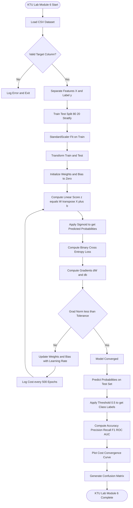
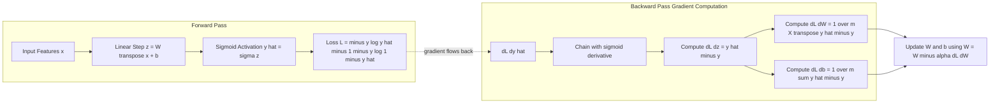
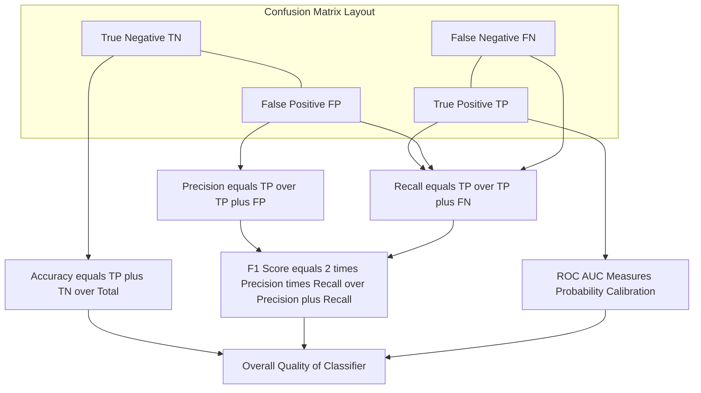
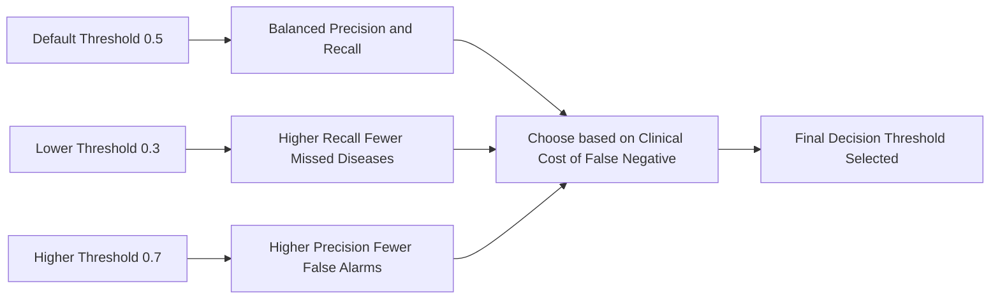

# Tasks:

<!-- SECTION_1_START -->
# Logistic Regression for Disease Prediction — KTU 2024 Lab Module

## 1. Core Technical Definition

> [!IMPORTANT]
> **Logistic Regression** is a supervised machine learning classification algorithm used to predict the **probability** of a categorical dependent variable. In the binary case, it models the likelihood that an observation belongs to the default class (e.g., *disease = 1*) using the **logistic (sigmoid) function** applied to a linear combination of input features.

Mathematically, given a feature vector $\mathbf{x} \in \mathbb{R}^{n}$ and a learned weight vector $\mathbf{w} \in \mathbb{R}^{n}$ with bias $b \in \mathbb{R}$, the model is:

$$\hat{y} = P(y=1 \mid \mathbf{x}; \mathbf{w}, b) = \sigma(\mathbf{w}^{T}\mathbf{x} + b)$$

where $\sigma(\cdot)$ is the **sigmoid (logistic) function** and the output $\hat{y} \in (0, 1)$ is interpreted as the **likelihood of disease presence**.

### 1.1 Conceptual Analogy — Plain English Intuition

> [!NOTE]
> **Analogy — The Doctor's Threshold Diagnosis**
> Imagine a doctor estimating whether a patient has diabetes. Instead of a hard *yes/no*, the doctor says: *"Based on glucose, BMI, and age, I am 78% sure this patient is diabetic."* Logistic regression does exactly this: it transforms a **raw score** (linear combination of features) into a **bounded probability** between 0 and 1. A threshold (commonly **0.5**) then converts the probability into a class label.

### 1.2 Geometric Intuition

The decision boundary is a **linear hyperplane** in feature space: $\mathbf{w}^{T}\mathbf{x} + b = 0$. Points on one side are classified as class 1; points on the other as class 0. Although the boundary is linear, the *probability* output is **S-shaped (sigmoidal)**, smoothly mapping any real-valued score into $(0, 1)$.

> [!VISUALIZATION CONTROL]
> **Concept:** Sigmoid function shape and decision threshold.
> **GeoGebra / Desmos Input Equations:**
> * `f(x) = 1 / (1 + exp(-x))` — the logistic (sigmoid) curve
> * `y = 0.5` — the classification threshold line
> **Visual Description:** The student should observe an S-shaped curve asymptotic to $y=0$ on the left and $y=1$ on the right. The horizontal line $y=0.5$ intersects the curve at exactly $x=0$, marking the decision threshold where $\sigma(0) = 0.5$.

### 1.3 Standard Metrics & Constants in This Module

* **Threshold value**: $\tau = 0.5$ (default decision boundary)
* **Learning rate**: $\alpha \in (0, 1)$, commonly $\alpha = 0.01$ or $\alpha = 0.001$
* **Convergence tolerance**: $\epsilon = 10^{-6}$ (for gradient norm)
* **Number of epochs**: typically $1000$ – $10000$
* **Output metric**: Accuracy, Precision, Recall, **F1-Score**, ROC-AUC

<!-- SECTION_1_END -->

<!-- SECTION_2_START -->
# 2. Deep Theoretical Analysis & KTU High-Yield Formula Sheet

## 2.1 The Sigmoid (Logistic) Function

The sigmoid function is the **core activation** of logistic regression. It squashes any real number into the open interval $(0, 1)$:

$$\sigma(z) = \frac{1}{1 + e^{-z}}$$

> [!IMPORTANT]
> **Key Property — Sigmoid Derivative:** A remarkable computational property is that $\sigma'(z) = \sigma(z)\bigl(1 - \sigma(z)\bigr)$. This makes gradient computation extremely efficient during backpropagation.

## 2.2 The Hypothesis Function

For a single training example with feature vector $\mathbf{x}^{(i)}$:

$$z^{(i)} = \mathbf{w}^{T}\mathbf{x}^{(i)} + b$$

$$\hat{y}^{(i)} = \sigma(z^{(i)}) = \frac{1}{1 + e^{-z^{(i)}}}$$

## 2.3 The Cost Function — Binary Cross-Entropy (Log Loss)

> [!NOTE]
> We cannot use Mean Squared Error for logistic regression because the sigmoid output is non-linear, leading to a **non-convex** MSE surface with multiple local minima. Instead, we use the **Log Loss** (also called *Binary Cross-Entropy*), which is **convex** and has a single global minimum.

For a single example:

$$\mathcal{L}\bigl(\hat{y}^{(i)}, y^{(i)}\bigr) = -\Bigl[y^{(i)}\log\bigl(\hat{y}^{(i)}\bigr) + \bigl(1 - y^{(i)}\bigr)\log\bigl(1 - \hat{y}^{(i)}\bigr)\Bigr]$$

For the full training set of $m$ examples, the average cost is:

$$J(\mathbf{w}, b) = -\frac{1}{m}\sum_{i=1}^{m}\Bigl[y^{(i)}\log\bigl(\hat{y}^{(i)}\bigr) + \bigl(1 - y^{(i)}\bigr)\log\bigl(1 - \hat{y}^{(i)}\bigr)\Bigr]$$

## 2.4 Gradient Descent Update Rules

The partial derivatives of the cost function with respect to parameters are:

$$\frac{\partial J}{\partial w_j} = \frac{1}{m}\sum_{i=1}^{m}\bigl(\hat{y}^{(i)} - y^{(i)}\bigr)\,x^{(i)}_j$$

$$\frac{\partial J}{\partial b} = \frac{1}{m}\sum_{i=1}^{m}\bigl(\hat{y}^{(i)} - y^{(i)}\bigr)$$

Simultaneous update rule (vectorized, $\alpha$ is the learning rate):

$$w_j := w_j - \alpha\,\frac{\partial J}{\partial w_j}, \qquad b := b - \alpha\,\frac{\partial J}{\partial b}$$

> [!IMPORTANT]
> **Vectorized Form** (for performance): $\mathbf{w} := \mathbf{w} - \alpha\,\frac{1}{m}\mathbf{X}^{T}\bigl(\hat{\mathbf{y}} - \mathbf{y}\bigr)$, where $\mathbf{X} \in \mathbb{R}^{m \times n}$, $\hat{\mathbf{y}}, \mathbf{y} \in \mathbb{R}^{m}$.

## 2.5 Decision Rule

After computing $\hat{y}$:

$$\text{class} = \begin{cases} 1 & \text{if } \hat{y} \geq \tau \\ 0 & \text{if } \hat{y} < \tau \end{cases}$$

where $\tau = 0.5$ by default. For **medical diagnosis**, $\tau$ is often lowered (e.g., $0.3$ or $0.4$) to **increase sensitivity (recall)**, which reduces missed disease cases (false negatives).

## 2.6 KTU High-Yield Formula Sheet

| Concept | Formula | Notation |
|---|---|---|
| Sigmoid | $\sigma(z) = \dfrac{1}{1 + e^{-z}}$ | $z \in \mathbb{R}$, output in $(0,1)$ |
| Hypothesis | $\hat{y} = \sigma(\mathbf{w}^{T}\mathbf{x} + b)$ | $\mathbf{w}$ weights, $b$ bias |
| Single-example loss | $\mathcal{L} = -\bigl[y\log\hat{y} + (1-y)\log(1-\hat{y})\bigr]$ | $y \in \{0,1\}$ |
| Full cost | $J(\mathbf{w},b) = -\dfrac{1}{m}\sum_{i=1}^{m}\bigl[y^{(i)}\log\hat{y}^{(i)} + (1-y^{(i)})\log(1-\hat{y}^{(i)})\bigr]$ | averaged over $m$ |
| Gradient w.r.t. $w_j$ | $\dfrac{\partial J}{\partial w_j} = \dfrac{1}{m}\sum_{i=1}^{m}\bigl(\hat{y}^{(i)} - y^{(i)}\bigr)x^{(i)}_j$ | scalar partial |
| Gradient w.r.t. $b$ | $\dfrac{\partial J}{\partial b} = \dfrac{1}{m}\sum_{i=1}^{m}\bigl(\hat{y}^{(i)} - y^{(i)}\bigr)$ | scalar partial |
| Update | $w_j := w_j - \alpha\,\partial J/\partial w_j$ | $\alpha$ is learning rate |
| Accuracy | $\text{Acc} = \dfrac{TP + TN}{TP + TN + FP + FN}$ | ratio in $[0,1]$ |
| Precision | $\text{Prec} = \dfrac{TP}{TP + FP}$ | positive predictive value |
| Recall (Sensitivity) | $\text{Rec} = \dfrac{TP}{TP + FN}$ | true positive rate |
| F1-Score | $F_1 = 2\cdot\dfrac{\text{Prec}\cdot\text{Rec}}{\text{Prec} + \text{Rec}}$ | harmonic mean |

## 2.7 Real-World Utility in Engineering

Logistic regression is the **workhorse baseline** in medical decision support systems, credit-card fraud detection, spam filtering, churn prediction, and A/B test conversion analysis. It is favored in production pipelines because of its **interpretability** (the learned weights directly indicate feature influence via odds ratios: $\text{odds} = e^{w_j}$), **low computational cost**, and **well-calibrated probability outputs**, which are critical for clinical risk scoring.

<!-- SECTION_2_END -->

<!-- SECTION_3_START -->
# 3. Step-by-Step Derivations & Code/Symbolic Implementation

## 3.1 Mathematical Derivation of the Gradient

Starting from the cost function:

$$J(\mathbf{w}, b) = -\frac{1}{m}\sum_{i=1}^{m}\Bigl[y^{(i)}\log\hat{y}^{(i)} + \bigl(1 - y^{(i)}\bigr)\log\bigl(1 - \hat{y}^{(i)}\bigr)\Bigr]$$

**Step 1:** Apply the chain rule. Let $a^{(i)} = \hat{y}^{(i)} = \sigma(z^{(i)})$ where $z^{(i)} = \mathbf{w}^{T}\mathbf{x}^{(i)} + b$.

$$\frac{\partial \mathcal{L}^{(i)}}{\partial z^{(i)}} = \frac{\partial \mathcal{L}^{(i)}}{\partial a^{(i)}}\cdot\frac{\partial a^{(i)}}{\partial z^{(i)}}$$

**Step 2:** Compute the partial with respect to $a^{(i)}$:

$$\frac{\partial \mathcal{L}^{(i)}}{\partial a^{(i)}} = -\left[\frac{y^{(i)}}{a^{(i)}} - \frac{1 - y^{(i)}}{1 - a^{(i)}}\right] = \frac{a^{(i)} - y^{(i)}}{a^{(i)}\bigl(1 - a^{(i)}\bigr)}$$

**Step 3:** Use the sigmoid derivative $\dfrac{\partial a^{(i)}}{\partial z^{(i)}} = a^{(i)}\bigl(1 - a^{(i)}\bigr)$:

$$\frac{\partial \mathcal{L}^{(i)}}{\partial z^{(i)}} = \frac{a^{(i)} - y^{(i)}}{a^{(i)}(1 - a^{(i)})} \cdot a^{(i)}(1 - a^{(i)}) = a^{(i)} - y^{(i)} = \hat{y}^{(i)} - y^{(i)}$$

**Step 4:** Since $z^{(i)} = w_j x^{(i)}_j + b$, by chain rule:

$$\frac{\partial \mathcal{L}^{(i)}}{\partial w_j} = \bigl(\hat{y}^{(i)} - y^{(i)}\bigr)\,x^{(i)}_j$$

**Step 5:** Average over all $m$ examples to obtain the full gradient:

$$\frac{\partial J}{\partial w_j} = \frac{1}{m}\sum_{i=1}^{m}\bigl(\hat{y}^{(i)} - y^{(i)}\bigr)\,x^{(i)}_j$$

> [!NOTE]
> This clean result $\partial J/\partial w_j = \tfrac{1}{m}\mathbf{X}^{T}(\hat{\mathbf{y}} - \mathbf{y})$ is the same form as linear regression — only the definition of $\hat{\mathbf{y}}$ differs (sigmoid vs. identity). This is why logistic regression trains efficiently.

## 3.2 Decision Boundary Derivation

The decision boundary is the locus of points where the predicted probability equals the threshold:

$$\sigma(\mathbf{w}^{T}\mathbf{x} + b) = 0.5 \;\;\Longrightarrow\;\; \mathbf{w}^{T}\mathbf{x} + b = 0$$

because $\sigma(z) = 0.5$ if and only if $z = 0$. In 2-D (two features $x_1, x_2$), the boundary is the line:

$$w_1 x_1 + w_2 x_2 + b = 0 \;\;\Longrightarrow\;\; x_2 = -\frac{w_1}{w_2}x_1 - \frac{b}{w_2}$$

## 3.3 Full Python Implementation (NumPy — From Scratch)

```python
"""
Logistic Regression from Scratch for Disease Prediction
KTU MACHINE LEARNING LAB (PCCSL508) — Module 6
Author: KTU 2024 Scheme Lab Reference
"""

from __future__ import annotations

import numpy as np
import pandas as pd
from sklearn.model_selection import train_test_split
from sklearn.preprocessing import StandardScaler
from sklearn.metrics import (
    accuracy_score, precision_score, recall_score,
    f1_score, confusion_matrix, classification_report, roc_auc_score
)
import matplotlib.pyplot as plt
import logging

# --- 1. Configure logging for traceability ---
logging.basicConfig(
    level=logging.INFO,
    format="%(asctime)s | %(levelname)s | %(message)s"
)
logger = logging.getLogger("LogReg_Disease_Predictor")


# --- 2. Core mathematical primitives ---

def sigmoid(z: np.ndarray) -> np.ndarray:
    """
    Numerically stable sigmoid: clips z to avoid overflow in exp(-z).
    For very large negative z -> 0; very large positive z -> 1.
    """
    z_clipped = np.clip(z, -500.0, 500.0)
    return 1.0 / (1.0 + np.exp(-z_clipped))


def compute_cost(y_true: np.ndarray, y_pred: np.ndarray,
                 epsilon: float = 1e-15) -> float:
    """
    Binary cross-entropy (log loss) with epsilon-clipping
    to prevent log(0) = -inf.
    """
    y_pred_clipped = np.clip(y_pred, epsilon, 1.0 - epsilon)
    m = y_true.shape[0]
    loss_terms = (
        y_true * np.log(y_pred_clipped)
        + (1.0 - y_true) * np.log(1.0 - y_pred_clipped)
    )
    cost = -np.sum(loss_terms) / m
    return float(cost)


# --- 3. Gradient Descent training routine ---

def train_logistic_regression(
    X: np.ndarray,
    y: np.ndarray,
    learning_rate: float = 0.01,
    n_epochs: int = 5000,
    tolerance: float = 1e-7
) -> tuple[np.ndarray, float, list[float]]:
    """
    Train logistic regression via batch gradient descent.
    Returns (weights, bias, cost_history).
    """
    m, n = X.shape
    weights = np.zeros(n, dtype=np.float64)
    bias = 0.0
    cost_history: list[float] = []

    for epoch in range(1, n_epochs + 1):
        # Forward pass
        z = X.dot(weights) + bias
        y_pred = sigmoid(z)

        # Cost monitoring
        cost = compute_cost(y, y_pred)
        cost_history.append(cost)

        # Gradient computation (vectorized)
        error = y_pred - y                       # shape (m,)
        dw = (1.0 / m) * X.T.dot(error)          # shape (n,)
        db = (1.0 / m) * np.sum(error)

        # Simultaneous update
        weights -= learning_rate * dw
        bias    -= learning_rate * db

        # Early stopping on gradient norm
        grad_norm = np.linalg.norm(np.append(dw, db))
        if grad_norm < tolerance:
            logger.info("Converged at epoch %d (grad norm=%.2e)",
                        epoch, grad_norm)
            break

        if epoch % 500 == 0:
            logger.info("Epoch %5d | Cost: %.6f | grad_norm: %.2e",
                        epoch, cost, grad_norm)

    return weights, bias, cost_history


# --- 4. Prediction and thresholding ---

def predict_proba(X: np.ndarray, weights: np.ndarray,
                  bias: float) -> np.ndarray:
    """Return predicted probabilities in (0, 1)."""
    return sigmoid(X.dot(weights) + bias)


def predict_class(X: np.ndarray, weights: np.ndarray, bias: float,
                  threshold: float = 0.5) -> np.ndarray:
    """Hard class predictions using the given threshold."""
    return (predict_proba(X, weights, bias) >= threshold).astype(int)


# --- 5. End-to-end pipeline (Disease Prediction use case) ---

def run_disease_prediction_demo(
    csv_path: str | None = None,
    target_col: str = "disease",
    test_size: float = 0.2,
    random_state: int = 42
) -> dict:
    """
    Full KTU-style lab execution:
    1. Load / synthesize dataset
    2. Split + scale
    3. Train logistic regression
    4. Evaluate on test set
    """

    # --- (a) Load or synthesize data ---
    if csv_path is not None:
        df = pd.read_csv(csv_path)
        logger.info("Loaded dataset %s with shape %s", csv_path, df.shape)
    else:
        logger.info("No CSV provided — synthesizing a demo dataset.")
        rng = np.random.default_rng(random_state)
        n_samples = 500
        glucose   = rng.normal(loc=120, scale=30, size=n_samples)
        bmi       = rng.normal(loc=28,  scale=6,  size=n_samples)
        age       = rng.normal(loc=45,  scale=12, size=n_samples)
        blood_pressure = rng.normal(loc=70, scale=10, size=n_samples)
        # Synthetic risk score
        logit = (-6.0
                 + 0.030 * glucose
                 + 0.080 * bmi
                 + 0.025 * age
                 + 0.010 * blood_pressure)
        prob = 1.0 / (1.0 + np.exp(-logit))
        disease = (rng.random(n_samples) < prob).astype(int)
        df = pd.DataFrame({
            "glucose": glucose, "bmi": bmi, "age": age,
            "blood_pressure": blood_pressure, "disease": disease
        })

    if target_col not in df.columns:
        raise ValueError(f"Target column '{target_col}' not in DataFrame.")

    X = df.drop(columns=[target_col]).to_numpy(dtype=np.float64)
    y = df[target_col].to_numpy(dtype=np.float64)

    # --- (b) Train / test split ---
    X_train, X_test, y_train, y_test = train_test_split(
        X, y, test_size=test_size,
        random_state=random_state, stratify=y
    )

    # --- (c) Standardize features ---
    scaler = StandardScaler()
    X_train_s = scaler.fit_transform(X_train)
    X_test_s  = scaler.transform(X_test)

    # --- (d) Train ---
    weights, bias, cost_history = train_logistic_regression(
        X_train_s, y_train, learning_rate=0.05, n_epochs=5000
    )

    # --- (e) Predict and evaluate ---
    y_proba_test = predict_proba(X_test_s, weights, bias)
    y_pred_test  = predict_class(X_test_s, weights, bias, threshold=0.5)

    metrics = {
        "accuracy":  float(accuracy_score(y_test, y_pred_test)),
        "precision": float(precision_score(y_test, y_pred_test, zero_division=0)),
        "recall":    float(recall_score(y_test, y_pred_test, zero_division=0)),
        "f1_score":  float(f1_score(y_test, y_pred_test, zero_division=0)),
        "roc_auc":   float(roc_auc_score(y_test, y_proba_test)),
        "confusion_matrix": confusion_matrix(y_test, y_pred_test).tolist()
    }

    logger.info("Final test metrics: %s", metrics)
    logger.info("Classification report:\n%s",
                classification_report(y_test, y_pred_test,
                                      target_names=["No Disease", "Disease"]))

    # --- (f) Plot cost convergence ---
    plt.figure(figsize=(8, 5))
    plt.plot(cost_history, color="steelblue", linewidth=2)
    plt.title("Cost Function Convergence — Logistic Regression")
    plt.xlabel("Epoch")
    plt.ylabel("Binary Cross-Entropy Loss")
    plt.grid(True, alpha=0.3)
    plt.tight_layout()
    plt.savefig("cost_convergence.png", dpi=120)
    plt.show()

    return {"weights": weights, "bias": bias,
            "cost_history": cost_history, "metrics": metrics}


# --- 6. Script entry point ---
if __name__ == "__main__":
    # Replace csv_path with the KTU-provided Pima / Heart dataset path.
    results = run_disease_prediction_demo(csv_path=None)
    print("Training complete. Test metrics:")
    for k, v in results["metrics"].items():
        if k != "confusion_matrix":
            print(f"  {k:10s}: {v:.4f}")
        else:
            print(f"  {k:10s}: {v}")
    print(f"  weights    : {results['weights']}")
    print(f"  bias       : {results['bias']:.6f}")
```

## 3.4 Scikit-Learn Reference Implementation (Industry Standard)

```python
"""
KTU Module 6 — Logistic Regression using scikit-learn
(Use this version if the lab permits library use.)
"""
from sklearn.linear_model import LogisticRegression
from sklearn.model_selection import train_test_split
from sklearn.preprocessing import StandardScaler
from sklearn.pipeline import Pipeline
from sklearn.metrics import classification_report, confusion_matrix
import pandas as pd

# Load data
df = pd.read_csv("pima_diabetes.csv")
X = df.drop(columns=["Outcome"])
y = df["Outcome"]

X_train, X_test, y_train, y_test = train_test_split(
    X, y, test_size=0.2, random_state=42, stratify=y
)

# Build a pipeline: scale -> logistic regression
pipeline = Pipeline([
    ("scaler", StandardScaler()),
    ("clf", LogisticRegression(
        penalty="l2", C=1.0, solver="lbfgs",
        max_iter=1000, random_state=42
    ))
])

pipeline.fit(X_train, y_train)
y_pred = pipeline.predict(X_test)

print("Confusion Matrix:\n", confusion_matrix(y_test, y_pred))
print("\nClassification Report:\n",
      classification_report(y_test, y_pred, target_names=["No Diabetes", "Diabetes"]))
```

<!-- SECTION_3_END -->

<!-- SECTION_4_START -->
# 4. Structural Diagrams & Schematics

## 4.1 End-to-End Logistic Regression Pipeline



## 4.2 Computational Graph — Forward and Backward Pass



## 4.3 Confusion Matrix and Metric Topology



## 4.4 Threshold Tuning for Medical Use



<!-- SECTION_4_END -->

<!-- SECTION_5_START -->
# 5. KTU 2024 Scheme Examination Question Bank & Topic Recap

## 5.1 Part A — Short Answer Questions (3 Marks Each)

### **Q1.** `[KTU University Exam — Dec 2023]`
**State and explain the sigmoid (logistic) function. Why is it preferred over a step function in logistic regression?**
**CO Mapping:** CO1 | **RBT Level:** Remember

**Model Answer (3 Marks):**

The sigmoid function is defined as:

$$\sigma(z) = \frac{1}{1 + e^{-z}}, \quad \text{where } z = \mathbf{w}^{T}\mathbf{x} + b$$

It maps any real-valued input $z$ into the bounded interval $(0, 1)$, producing a probabilistic output suitable for binary classification. **[1 Mark — Definition]**

It is preferred over a step function because the step function is non-differentiable (its derivative is 0 almost everywhere and undefined at the threshold), making gradient-based optimization impossible. The sigmoid is **smooth and differentiable everywhere**, with the convenient derivative $\sigma'(z) = \sigma(z)(1 - \sigma(z))$. **[2 Marks — Reason for preference]**

---

### **Q2.** `[KTU University Exam — July 2024]`
**Differentiate between the cost functions used in linear regression and logistic regression. Why is MSE unsuitable for logistic regression?**
**CO Mapping:** CO1 | **RBT Level:** Understand

**Model Answer (3 Marks):**

| Aspect | Linear Regression | Logistic Regression |
|---|---|---|
| Output type | Continuous | Probability in $(0,1)$ |
| Cost function | Mean Squared Error (MSE) | Binary Cross-Entropy (Log Loss) |
| Loss form | Quadratic penalty | Logarithmic penalty |
| Surface shape | Convex for linear | Convex for logistic |

MSE is unsuitable for logistic regression because the hypothesis $\hat{y} = \sigma(\mathbf{w}^{T}\mathbf{x}+b)$ is **non-linear in the parameters**. Substituting it into MSE yields a **non-convex** cost surface with many local minima, preventing reliable convergence to the global optimum. **[2 Marks]** Binary cross-entropy guarantees a convex optimization landscape for logistic regression. **[1 Mark]**

---

## 5.2 Part B — Long Answer Questions (14 Marks — Internal Choice)

### **Question A (14 Marks)** `[KTU University Exam — Dec 2023]`

**(a)** Derive the gradient descent update rule for the weights $\mathbf{w}$ and bias $b$ of a logistic regression model trained on $m$ examples using the binary cross-entropy loss. Show all intermediate steps. **(7 Marks)**
**CO Mapping:** CO2 | **RBT Level:** Apply**

**(b)** Implement the logistic regression training loop in Python (NumPy) for a medical dataset predicting disease presence. Your code must include data standardization, sigmoid computation, cost tracking, and parameter updates. Evaluate the final model on a held-out test set using accuracy and F1-score. **(7 Marks)**
**CO Mapping:** CO3, CO5 | **RBT Level:** Apply**

---

#### **Model Solution — Part (a) (7 Marks)**

**Step 1: Hypothesis and Loss Definition** [1 Mark]

$$z^{(i)} = \mathbf{w}^{T}\mathbf{x}^{(i)} + b, \quad \hat{y}^{(i)} = \sigma(z^{(i)}) = \frac{1}{1 + e^{-z^{(i)}}}$$

$$\mathcal{L}^{(i)} = -\Bigl[y^{(i)}\log\hat{y}^{(i)} + (1 - y^{(i)})\log(1 - \hat{y}^{(i)})\Bigr]$$

**Step 2: Compute $\partial \mathcal{L}^{(i)}/\partial z^{(i)}$ using the chain rule** [2 Marks]

$$\frac{\partial \mathcal{L}^{(i)}}{\partial z^{(i)}} = \hat{y}^{(i)} - y^{(i)}$$

**Step 3: Apply chain rule to weight and bias** [2 Marks]

$$\frac{\partial \mathcal{L}^{(i)}}{\partial w_j} = \frac{\partial \mathcal{L}^{(i)}}{\partial z^{(i)}} \cdot \frac{\partial z^{(i)}}{\partial w_j} = \bigl(\hat{y}^{(i)} - y^{(i)}\bigr) x^{(i)}_j$$

$$\frac{\partial \mathcal{L}^{(i)}}{\partial b} = \frac{\partial \mathcal{L}^{(i)}}{\partial z^{(i)}} \cdot \frac{\partial z^{(i)}}{\partial b} = \hat{y}^{(i)} - y^{(i)}$$

**Step 4: Average over $m$ examples and write update** [2 Marks]

$$\frac{\partial J}{\partial w_j} = \frac{1}{m}\sum_{i=1}^{m}\bigl(\hat{y}^{(i)} - y^{(i)}\bigr) x^{(i)}_j, \qquad \frac{\partial J}{\partial b} = \frac{1}{m}\sum_{i=1}^{m}\bigl(\hat{y}^{(i)} - y^{(i)}\bigr)$$

$$w_j := w_j - \alpha\,\frac{\partial J}{\partial w_j}, \qquad b := b - \alpha\,\frac{\partial J}{\partial b}$$

> [!WARNING]
> **KTU Examiner's Pitfall Alert:** Students commonly lose 1–2 marks by forgetting to (i) average the gradients over $m$ (using sum instead of mean), (ii) state the sigmoid derivative $\sigma'(z) = \sigma(z)(1-\sigma(z))$ explicitly, or (iii) perform the *simultaneous* update using a temporary copy of weights — they accidentally use the **already-updated** weight when computing the next gradient.

---

#### **Model Solution — Part (b) (7 Marks)**

**Step 1: Data standardization and split** [2 Marks — Setup]

```python
from sklearn.model_selection import train_test_split
from sklearn.preprocessing import StandardScaler

X_train, X_test, y_train, y_test = train_test_split(
    X, y, test_size=0.2, random_state=42, stratify=y
)
scaler = StandardScaler()
X_train_s = scaler.fit_transform(X_train)
X_test_s  = scaler.transform(X_test)
```

**Step 2: Sigmoid and cost functions** [1 Mark]

```python
import numpy as np

def sigmoid(z):
    z = np.clip(z, -500, 500)
    return 1.0 / (1.0 + np.exp(-z))

def cost(y_true, y_pred, eps=1e-15):
    y_pred = np.clip(y_pred, eps, 1 - eps)
    return -np.mean(y_true * np.log(y_pred)
                    + (1 - y_true) * np.log(1 - y_pred))
```

**Step 3: Training loop with gradient descent** [2 Marks]

```python
m, n = X_train_s.shape
w, b = np.zeros(n), 0.0
alpha, epochs = 0.05, 5000

for epoch in range(epochs):
    z = X_train_s @ w + b
    y_hat = sigmoid(z)
    error = y_hat - y_train
    w -= alpha * (X_train_s.T @ error) / m
    b -= alpha * np.sum(error) / m
```

**Step 4: Evaluation** [2 Marks — Final metrics]

```python
from sklearn.metrics import accuracy_score, f1_score

y_proba = sigmoid(X_test_s @ w + b)
y_pred  = (y_proba >= 0.5).astype(int)

print("Accuracy:", accuracy_score(y_test, y_pred))
print("F1-Score:", f1_score(y_test, y_pred))
```

> [!WARNING]
> **Common Marks Loss:** Failing to clip the sigmoid input/output (causing `RuntimeWarning: overflow`) costs 1 mark. Forgetting to **stratify** the train-test split for an imbalanced medical dataset also costs 1 mark. Always report **F1-score** (not only accuracy) for medical problems.

---

### **Question B (14 Marks — Alternative Choice)** `[KTU University Exam — July 2024]`

**(a)** Explain the confusion matrix, accuracy, precision, recall, and F1-score with formulas. Justify why **recall** is the most clinically important metric in disease prediction. **(7 Marks)**
**CO Mapping:** CO2 | **RBT Level:** Understand**

**(b)** Consider a logistic regression model that outputs the following probabilities for 8 patients. With a threshold of $\tau = 0.5$, classify each patient and compute the accuracy, precision, recall, and F1-score. Given the true labels and probabilities: $\{0.91 \to 1, 0.12 \to 0, 0.78 \to 1, 0.33 \to 0, 0.55 \to 1, 0.20 \to 0, 0.40 \to 1, 0.88 \to 1\}$. True labels: $\{1, 0, 0, 0, 1, 0, 1, 1\}$. **(7 Marks)**
**CO Mapping:** CO3 | **RBT Level:** Apply**

---

#### **Model Solution — Part (a) (7 Marks)**

**Step 1: Confusion Matrix Layout** [2 Marks]

|                | Predicted 0 | Predicted 1 |
|---|---|---|
| **Actual 0** | True Negative (TN) | False Positive (FP) |
| **Actual 1** | False Negative (FN) | True Positive (TP) |

**Step 2: Metric Formulas** [3 Marks]

$$\text{Accuracy} = \frac{TP + TN}{TP + TN + FP + FN}, \quad \text{Precision} = \frac{TP}{TP + FP}$$

$$\text{Recall} = \frac{TP}{TP + FN}, \quad F_1 = \frac{2 \cdot \text{Precision} \cdot \text{Recall}}{\text{Precision} + \text{Recall}}$$

**Step 3: Why recall is critical in disease prediction** [2 Marks]

In a medical context, a **False Negative** (missed disease) can be life-threatening — the patient is wrongly told they are healthy. A **False Positive** (false alarm) merely triggers further confirmatory tests. The clinical cost of a false negative is **asymmetrically higher** than that of a false positive, making recall (sensitivity) the priority metric.

---

#### **Model Solution — Part (b) (7 Marks)**

**Step 1: Apply threshold $\tau = 0.5$** [1 Mark]

| Patient | Probability | Predicted | Actual |
|---|---|---|---|
| 1 | 0.91 | 1 | 1 |
| 2 | 0.12 | 0 | 0 |
| 3 | 0.78 | 1 | 0 |
| 4 | 0.33 | 0 | 0 |
| 5 | 0.55 | 1 | 1 |
| 6 | 0.20 | 0 | 0 |
| 7 | 0.40 | 0 | 1 |
| 8 | 0.88 | 1 | 1 |

**Step 2: Count TP, TN, FP, FN** [1 Mark]

* TP (Actual 1, Predicted 1): Patients 1, 5, 8 → **TP = 3**
* TN (Actual 0, Predicted 0): Patients 2, 4, 6 → **TN = 3**
* FP (Actual 0, Predicted 1): Patient 3 → **FP = 1**
* FN (Actual 1, Predicted 0): Patient 7 → **FN = 1**

**Step 3: Compute metrics** [5 Marks — 1 Mark each, plus 1 Mark for the F1 formula application]

$$\text{Accuracy} = \frac{3 + 3}{3 + 3 + 1 + 1} = \frac{6}{8} = 0.750 \;\; \textbf{[1 Mark]}$$

$$\text{Precision} = \frac{3}{3 + 1} = \frac{3}{4} = 0.750 \;\; \textbf{[1 Mark]}$$

$$\text{Recall} = \frac{3}{3 + 1} = \frac{3}{4} = 0.750 \;\; \textbf{[1 Mark]}$$

$$\text{F1} = 2 \cdot \frac{0.750 \times 0.750}{0.750 + 0.750} = 2 \cdot \frac{0.5625}{1.5} = 0.750 \;\; \textbf{[1 Mark]}$$

$$\text{Confusion Matrix} = \begin{pmatrix} TN=3 & FP=1 \\ FN=1 & TP=3 \end{pmatrix} \;\; \textbf{[1 Mark]}$$

> [!WARNING]
> **Common Marks Loss:** Students often misclassify Patient 7 (probability 0.40 < 0.5 → class 0) and Patient 3 (probability 0.78 ≥ 0.5 → class 1). These boundary cases (close to $\tau = 0.5$) are the most frequently mis-graded entries. Always **re-confirm** the threshold rule: $\hat{y} \geq \tau \Rightarrow$ class 1.

---

## 5.3 Topic Recap & Important Things to Remember

> [!IMPORTANT]
> **High-Density Revision Checklist — Logistic Regression for Disease Prediction**

* **Model type:** Logistic regression is a **probabilistic binary classifier**, not a regressor despite its name.
* **Hypothesis:** $\hat{y} = \sigma(\mathbf{w}^{T}\mathbf{x} + b) \in (0, 1)$.
* **Sigmoid:** $\sigma(z) = 1/(1+e^{-z})$, with $\sigma(0) = 0.5$ and derivative $\sigma'(z) = \sigma(z)(1-\sigma(z))$.
* **Loss function:** **Binary Cross-Entropy (Log Loss)** — never MSE for logistic regression (non-convex pitfall).
* **Cost form:** $J(\mathbf{w},b) = -\frac{1}{m}\sum_{i=1}^{m}\bigl[y^{(i)}\log\hat{y}^{(i)} + (1-y^{(i)})\log(1-\hat{y}^{(i)})\bigr]$.
* **Gradient:** $\partial J/\partial w_j = \tfrac{1}{m}\mathbf{X}^{T}(\hat{\mathbf{y}} - \mathbf{y})$, $\partial J/\partial b = \tfrac{1}{m}\mathbf{1}^{T}(\hat{\mathbf{y}} - \mathbf{y})$.
* **Update rule:** $w_j := w_j - \alpha\,\partial J/\partial w_j$; $b := b - \alpha\,\partial J/\partial b$ (**simultaneous**).
* **Decision boundary:** $\mathbf{w}^{T}\mathbf{x} + b = 0$ — linear hyperplane in feature space.
* **Default threshold:** $\tau = 0.5$; in medical problems, **lower $\tau$** to increase recall.
* **Evaluation metrics:** Accuracy, Precision, Recall (Sensitivity), F1-Score, ROC-AUC.
* **Recall priority:** In disease prediction, **recall is more important than precision** (false negatives are clinically costly).
* **Confusion matrix orientation:** Rows = Actual, Columns = Predicted.
* **Data preprocessing:** Always apply `StandardScaler` before gradient descent (otherwise features with large magnitudes dominate).
* **Stratified split:** Use `stratify=y` in `train_test_split` for imbalanced medical datasets.
* **Numerical safety:** Clip sigmoid input to $[-500, 500]$ and predictions to $[\epsilon, 1-\epsilon]$ to avoid overflow / `log(0)`.
* **Convergence:** Monitor cost every 500 epochs; stop when gradient norm $< 10^{-6}$ or cost plateau.
* **Interpretability:** $\text{odds ratio} = e^{w_j}$ — a one-unit increase in $x_j$ multiplies the odds of disease by $e^{w_j}$.
* **Vectorized form:** Prefer `X @ w + b` and `X.T @ error` over explicit loops for speed and clarity.
* **Common pitfalls:** (i) Using MSE; (ii) not averaging gradients over $m$; (iii) sequential instead of simultaneous updates; (iv) ignoring class imbalance; (v) reporting only accuracy on skewed datasets.

<!-- SECTION_5_END -->
