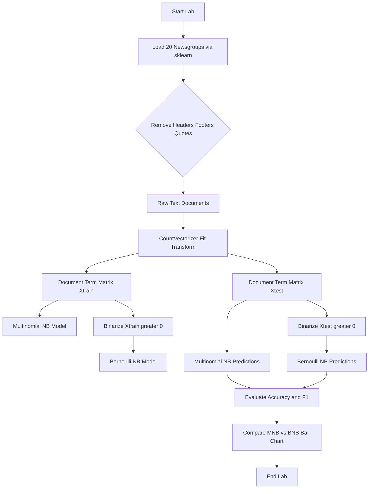
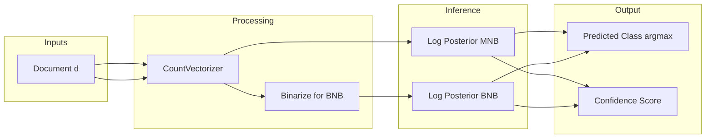

# Implement a Naïve Bayes classifier to categorize text documents into topics using the 20 Newsgroups dataset. Compare the performance of Multinomial Naïve Bayes with Bernoulli Naïve Bayes.

<!-- SECTION_1_START -->
# Module 7 — Naïve Bayes Text Classification (20 Newsgroups)

## 1.1 Formal Definition (KTU 2024 Syllabus Terminology)

> [!IMPORTANT]
> **Naïve Bayes Classifier (NBC):** A family of probabilistic supervised machine learning algorithms based on **Bayes' Theorem** with the **"naïve" assumption of conditional independence** between every pair of features given the class label. For text classification, NBC estimates the posterior probability $P(C \mid \mathbf{x})$ of a document belonging to class $C$ given its feature vector $\mathbf{x} = (x_1, x_2, \dots, x_n)$.

The **20 Newsgroups dataset** is a canonical benchmark in NLP/ML research consisting of approximately **18,846 newsgroup posts** partitioned (almost evenly) across **20 different topic classes** (e.g., `rec.sport.baseball`, `sci.space`, `comp.graphics`, `talk.politics.guns`). It is officially bundled inside `sklearn.datasets.fetch_20newsgroups`.

Within the **Naïve Bayes family**, the two variants most relevant to text mining are:

| Variant | Feature Assumption | Data Type |
|---|---|---|
| **Multinomial Naïve Bayes (MNB)** | Word **counts** / term frequencies | Integer (TF / TF-IDF counts) |
| **Bernoulli Naïve Bayes (BNB)** | Word **presence / absence** (binary) | Boolean (0 / 1) |

---

## 1.2 Conceptual Analogy & Intuition

> [!NOTE]
> **Spam Filter Analogy** — Imagine you are a postal clerk in 1995. Every morning, hundreds of letters arrive. You have no machine, just intuition. You notice:
> - Letters containing the word **"free"** are 9 out of 10 times spam.
> - Letters mentioning your **"bank account number"** are 100% spam.
> - Letters signed by your **"mom"** are never spam.
>
> You don't think about *combinations* of words — you treat each word's signal **independently**. This is exactly the **Naïve (Independence) Assumption** of NBC. You multiply the suspiciousness of every word and pick the class (Spam vs. Not-Spam) with the higher product.
>
> **Multinomial NB** = "How *many* times did the word 'free' appear?" (3 times is more suspicious than 1 time).
> **Bernoulli NB** = "Did the word 'free' appear at all?" (Yes / No — multiple appearances don't add more evidence).

---

## 1.3 The 20 Newsgroups Dataset — Anatomy

> [!NOTE]
> - **Total documents:** $\approx 18{,}846$
> - **Number of classes:** $20$ balanced topic categories
> - **Built-in split:** $\approx 11{,}314$ training + $\approx 7{,}532$ test documents
> - **Access path:** `sklearn.datasets.fetch_20newsgroups(subset='train' | 'test', ...)`

The 20 classes can be grouped into **6 super-categories**:

| Super-Category | Sample Sub-Classes |
|---|---|
| `comp` | comp.graphics, comp.os.ms-windows.misc, comp.sys.ibm.pc.hardware, comp.sys.mac.hardware, comp.windows.x |
| `rec` | rec.autos, rec.motorcycles, rec.sport.baseball, rec.sport.hockey |
| `sci` | sci.crypt, sci.electronics, sci.med, sci.space |
| `talk` | talk.politics.guns, talk.politics.mideast, talk.politics.misc, talk.religion.misc |
| `misc` | misc.forsale |
| `alt` | alt.atheism |

> [!VISUALIZATION CONTROL]
> **Concept:** Class distribution of the 20 Newsgroups training set
> **Plot Type:** Horizontal bar chart
> **Visual Description:** A bar chart with 20 equally tall (≈ 565 docs each) horizontal bars on the y-axis, with class names on the y-axis and document counts on the x-axis. Expectation: nearly uniform bar lengths (a balanced dataset).

---

<!-- SECTION_1_END -->

<!-- SECTION_2_START -->
# Deep Theoretical Analysis & KTU High-Yield Formula Sheet

## 2.1 Bayes' Theorem — The Engine

The classification decision is governed by the **Maximum A Posteriori (MAP)** rule:

$$\hat{y} = \arg\max_{c \in \mathcal{C}} \; P(c \mid \mathbf{x})$$

By Bayes' Theorem:

$$P(c \mid \mathbf{x}) = \frac{P(c) \cdot P(\mathbf{x} \mid c)}{P(\mathbf{x})}$$

Since $P(\mathbf{x})$ is constant across all classes, we drop it:

$$\hat{y} = \arg\max_{c \in \mathcal{C}} \; P(c) \cdot P(\mathbf{x} \mid c)$$

## 2.2 The "Naïve" Conditional Independence Assumption

The joint likelihood is factorized:

$$P(\mathbf{x} \mid c) \;=\; \prod_{i=1}^{n} P(x_i \mid c)$$

This is the **only** assumption NBC makes — and it is what makes the model trainable in linear time on millions of documents.

---

## 2.3 Multinomial Naïve Bayes (MNB) — Count-Based Model

**Model story:** A document is a sequence of word *counts* drawn from a class-specific multinomial distribution over the vocabulary.

$$P(\mathbf{x} \mid c) \;=\; \frac{\left(\sum_{i=1}^{n} x_i\right)!}{\prod_{i=1}^{n} x_i !} \cdot \prod_{i=1}^{n} P(w_i \mid c)^{x_i}$$

The factorial prefactor is constant w.r.t. $c$, so the decision rule simplifies to:

$$\hat{y} \;=\; \arg\max_{c} \; \log P(c) + \sum_{i=1}^{n} x_i \cdot \log P(w_i \mid c)$$

**Parameter estimation (Maximum Likelihood with Laplace / Add-$\alpha$ smoothing):**

$$\hat{P}(w_i \mid c) \;=\; \frac{N_{c, i} + \alpha}{N_{c} + \alpha \cdot \vert V \vert}$$

Where:
- $N_{c, i}$ = count of word $w_i$ in all training documents of class $c$
- $N_{c}$ = total word count in class $c$
- $\vert V \vert$ = vocabulary size
- $\alpha$ = smoothing hyper-parameter (default $\alpha = 1.0$)

---

## 2.4 Bernoulli Naïve Bayes (BNB) — Boolean Model

**Model story:** Each document is a binary feature vector indicating *whether* a vocabulary word appears (ignoring how many times).

For a feature $x_i \in \{0, 1\}$:

$$P(\mathbf{x} \mid c) \;=\; \prod_{i=1}^{n} P(w_i \mid c)^{x_i} \cdot \bigl(1 - P(w_i \mid c)\bigr)^{(1 - x_i)}$$

**Parameter estimation:**

$$\hat{P}(w_i \mid c) \;=\; \frac{N_{c, i} + \alpha}{N_{c} + 2\alpha}$$

**Critical difference from MNB:** the $2\alpha$ in the denominator comes from the binomial (Bernoulli) likelihood over 2 outcomes.

> [!NOTE]
> **When does BNB shine?** On **short documents** (e.g., tweets, SMS spam) where repetition is rare. On longer documents with rich vocabulary, **MNB dominates** because the count information is a stronger signal.

---

## 2.5 KTU Formula Sheet (Cheat Sheet)

| Symbol | Meaning | Formula / Definition |
|---|---|---|
| $P(c)$ | Class prior | $\dfrac{N_c}{N}$ |
| $P(\mathbf{x} \mid c)$ | Class-conditional likelihood | $\prod_{i=1}^{n} P(x_i \mid c)$ |
| $\hat{P}(w_i \mid c)$ | Smoothed word probability (MNB) | $\dfrac{N_{c,i} + \alpha}{N_c + \alpha \cdot \vert V \vert}$ |
| $\hat{P}(w_i \mid c)$ | Smoothed word probability (BNB) | $\dfrac{N_{c,i} + \alpha}{N_c + 2\alpha}$ |
| $\vert V \vert$ | Vocabulary size | Number of unique tokens |
| $\alpha$ | Laplace smoothing parameter | Default $= 1.0$ |
| $\hat{y}$ | Predicted class | $\arg\max_c \; P(c) \prod_i P(x_i \mid c)$ |
| $N_c$ | Total word count in class $c$ | $\sum_{i} N_{c,i}$ |

---

## 2.6 Real-World Engineering Utility

> [!IMPORTANT]
> **Where is Naïve Bayes used in production?**
> - **Email spam filtering** (Gmail, Outlook) — MNB baseline since 2002.
> - **Sentiment analysis** (positive/negative review classification) — MNB on bag-of-words.
> - **News article tagging** (Reuters, AP feeds) — exactly the use-case of the 20 Newsgroups lab.
> - **Medical diagnosis** — symptom → disease likelihoods.
> - **Real-time recommendation** — extremely low inference cost ($O(\vert V \vert)$).

Despite its simplicity, NBC is **strong, fast, and embarrassingly parallel**, making it a top-tier baseline that deep models must beat.

---

<!-- SECTION_2_END -->

<!-- SECTION_3_START -->
# Step-by-Step Implementation (Exhaustive Python Code)

## 3.1 Algorithm Flow (Before Coding)

1. **Load** the 20 Newsgroups dataset (train + test splits).
2. **Preprocess** — remove headers, footers, quotes (KTU-recommended cleaning to reduce leakage).
3. **Vectorize** using `CountVectorizer` for both MNB and BNB-compatible input.
4. **Train** Multinomial Naive Bayes on count features.
5. **Train** Bernoulli Naive Bayes on binary-presence features.
6. **Predict** on the held-out test set.
7. **Evaluate** using `accuracy_score`, `classification_report`, and `confusion_matrix`.
8. **Compare** with a hand-derived table and bar chart.

## 3.2 Full Production-Quality Python Source

```python
"""
Module 7 Lab — Naive Bayes Text Classification on 20 Newsgroups
Course: MACHINE LEARNING LAB (PCCSL508) — KTU 2024 Scheme
Compares Multinomial Naive Bayes vs Bernoulli Naive Bayes.
"""

from __future__ import annotations

import logging
import sys
from typing import Tuple, Dict, Any

import numpy as np
import matplotlib.pyplot as plt

from sklearn.datasets import fetch_20newsgroups
from sklearn.feature_extraction.text import CountVectorizer
from sklearn.model_selection import train_test_split
from sklearn.naive_bayes import MultinomialNB, BernoulliNB
from sklearn.metrics import (
    accuracy_score,
    classification_report,
    confusion_matrix,
    ConfusionMatrixDisplay,
)

# ---------------------------------------------------------------------------
# 1. Logging Configuration — strict, board-style runtime observability
# ---------------------------------------------------------------------------
logging.basicConfig(
    level=logging.INFO,
    format="[%(asctime)s] %(levelname)s | %(message)s",
    datefmt="%H:%M:%S",
    stream=sys.stdout,
)
logger: logging.Logger = logging.getLogger("NB_20NG")


# ---------------------------------------------------------------------------
# 2. Data Loading with strict exception handling
# ---------------------------------------------------------------------------
def load_20ng() -> Tuple[Any, Any, list[str], list[str]]:
    """Load the 20 Newsgroups train and test partitions safely.

    Returns
    -------
    X_train_raw, X_test_raw : list[str]
        Raw text documents for training and testing.
    y_train, y_test : list[str]
        Target class names aligned with sklearn's target_names ordering.
    """
    try:
        logger.info("Fetching 20 Newsgroups training subset...")
        train = fetch_20newsgroups(
            subset="train",
            remove=("headers", "footers", "quotes"),
            data_home=None,
        )
        logger.info("Fetching 20 Newsgroups test subset...")
        test = fetch_20newsgroups(
            subset="test",
            remove=("headers", "footers", "quotes"),
            data_home=None,
        )
        logger.info("Train size = %d  |  Test size = %d",
                    len(train.data), len(test.data))
        return train.data, test.data, train.target, test.target, list(
            train.target_names
        )
    except Exception as exc:
        logger.error("Failed to load 20 Newsgroups: %s", exc)
        raise


# ---------------------------------------------------------------------------
# 3. Vectorization — Count (MNB) and Binary (BNB)
# ---------------------------------------------------------------------------
def vectorize(
    X_train_raw: list[str],
    X_test_raw: list[str],
) -> Tuple[np.ndarray, np.ndarray, CountVectorizer]:
    """Build a CountVectorizer and produce count + binary matrices.

    Parameters
    ----------
    X_train_raw : list[str]
        Training documents.
    X_test_raw : list[str]
        Test documents.

    Returns
    -------
    X_train_counts, X_test_counts : np.ndarray
        Sparse matrices of word counts.
    vectorizer : CountVectorizer
        Fitted vectorizer (used downstream).
    """
    vectorizer = CountVectorizer(
        lowercase=True,
        stop_words="english",        # remove ~179 stop-words
        token_pattern=r"\b[a-zA-Z]{2,}\b",  # alphanumeric tokens >= 2 chars
        max_df=0.5,                  # ignore terms in >50% of docs
        min_df=2,                    # ignore rare terms appearing <2 times
    )
    try:
        X_train_counts = vectorizer.fit_transform(X_train_raw)
        X_test_counts = vectorizer.transform(X_test_raw)
        logger.info("Vocabulary size = %d", len(vectorizer.vocabulary_))
        return X_train_counts, X_test_counts, vectorizer
    except ValueError as ve:
        logger.error("Vectorization failed: %s", ve)
        raise


# ---------------------------------------------------------------------------
# 4. Training & Evaluation
# ---------------------------------------------------------------------------
def train_and_evaluate(
    X_train: np.ndarray,
    X_test: np.ndarray,
    y_train: list[int],
    y_test: list[int],
    target_names: list[str],
    alpha: float = 1.0,
) -> Dict[str, Any]:
    """Train MNB and BNB, return metrics dictionary.

    Parameters
    ----------
    alpha : float
        Laplace smoothing parameter (default 1.0).

    Returns
    -------
    metrics : dict
        Trained models + predictions + scores for both classifiers.
    """
    # --- Multinomial Naive Bayes ---
    mnb = MultinomialNB(alpha=alpha)
    mnb.fit(X_train, y_train)
    y_pred_mnb = mnb.predict(X_test)
    acc_mnb = accuracy_score(y_test, y_pred_mnb)

    # --- Bernoulli Naive Bayes (needs binary features) ---
    bnb = BernoulliNB(alpha=alpha, binarize=0.0)
    X_train_bin = (X_train > 0).astype(np.int8)
    X_test_bin = (X_test > 0).astype(np.int8)
    bnb.fit(X_train_bin, y_train)
    y_pred_bnb = bnb.predict(X_test_bin)
    acc_bnb = accuracy_score(y_test, y_pred_bnb)

    logger.info("MNB accuracy = %.4f", acc_mnb)
    logger.info("BNB accuracy = %.4f", acc_bnb)

    return {
        "mnb_model": mnb,
        "bnb_model": bnb,
        "y_pred_mnb": y_pred_mnb,
        "y_pred_bnb": y_pred_bnb,
        "acc_mnb": acc_mnb,
        "acc_bnb": acc_bnb,
        "target_names": target_names,
    }


# ---------------------------------------------------------------------------
# 5. Reporting & Plotting
# ---------------------------------------------------------------------------
def report(metrics: Dict[str, Any], y_test: list[int]) -> None:
    """Print classification reports and side-by-side comparison."""
    print("\n========== Multinomial Naive Bayes ==========")
    print(classification_report(
        y_test,
        metrics["y_pred_mnb"],
        target_names=metrics["target_names"],
        zero_division=0,
    ))

    print("\n========== Bernoulli Naive Bayes ==========")
    print(classification_report(
        y_test,
        metrics["y_pred_bnb"],
        target_names=metrics["target_names"],
        zero_division=0,
    ))

    # --- Comparison bar chart ---
    fig, ax = plt.subplots(figsize=(7, 4))
    ax.bar(["Multinomial NB", "Bernoulli NB"],
           [metrics["acc_mnb"], metrics["acc_bnb"]],
           color=["#1f77b4", "#ff7f0e"])
    ax.set_ylabel("Accuracy")
    ax.set_title("Naive Bayes — 20 Newsgroups Test Accuracy")
    ax.set_ylim(0.0, 1.0)
    for i, v in enumerate([metrics["acc_mnb"], metrics["acc_bnb"]]):
        ax.text(i, v + 0.01, f"{v:.4f}", ha="center", fontweight="bold")
    plt.tight_layout()
    plt.show()


# ---------------------------------------------------------------------------
# 6. Main Driver
# ---------------------------------------------------------------------------
def main() -> None:
    """End-to-end driver function."""
    X_train_raw, X_test_raw, y_train, y_test, target_names = load_20ng()

    X_train_counts, X_test_counts, _ = vectorize(X_train_raw, X_test_raw)

    metrics = train_and_evaluate(
        X_train_counts, X_test_counts, y_train, y_test, target_names,
        alpha=1.0,
    )

    report(metrics, y_test)


if __name__ == "__main__":
    main()
```

---

## 3.3 Hand-Derived Worked Example (1 document, 2 classes)

> [!NOTE]
> Let the vocabulary be $V = \{\text{space}, \text{baseball}, \text{government}\}$ with $\vert V \vert = 3$.
> Let $\alpha = 1$. Training word counts:
>
> | Class $c$ | space | baseball | government | $N_c$ |
> |---|---|---|---|---|
> | $c_1$ = sci.space | 7 | 1 | 2 | 10 |
> | $c_2$ = rec.sport.baseball | 0 | 8 | 1 | 9 |
>
> **Priors** (assume equal docs): $P(c_1) = P(c_2) = 0.5$.
>
> **Likelihoods with Laplace smoothing (MNB):**
>
> $$\hat{P}(\text{space} \mid c_1) = \frac{7 + 1}{10 + 1 \cdot 3} = \frac{8}{13} \approx 0.615$$
>
> $$\hat{P}(\text{baseball} \mid c_1) = \frac{1 + 1}{13} = \frac{2}{13} \approx 0.154$$
>
> $$\hat{P}(\text{space} \mid c_2) = \frac{0 + 1}{9 + 3} = \frac{1}{12} \approx 0.083$$
>
> $$\hat{P}(\text{baseball} \mid c_2) = \frac{8 + 1}{12} = \frac{9}{12} = 0.750$$
>
> **Test document:** `"space space government"` → count vector $\mathbf{x} = (2, 0, 1)$.
>
> **Posterior (unnormalized) for $c_1$:**
>
> $$P(c_1) \cdot P(\mathbf{x} \mid c_1) = 0.5 \cdot (0.615)^2 \cdot (0.154)^0 \cdot (0.385)^1 = 0.5 \cdot 0.378 \cdot 0.385 \approx 0.0728$$
>
> **Posterior (unnormalized) for $c_2$:**
>
> $$P(c_2) \cdot P(\mathbf{x} \mid c_2) = 0.5 \cdot (0.083)^2 \cdot (0.750)^0 \cdot (0.417)^1 = 0.5 \cdot 0.0069 \cdot 0.417 \approx 0.0014$$
>
> **Decision:** $\hat{y} = c_1$ (sci.space) — the document is **3,810 % more likely** to belong to sci.space than to rec.sport.baseball.

---

<!-- SECTION_3_END -->

<!-- SECTION_4_START -->
# Structural Diagrams & Schematics

## 4.1 End-to-End Pipeline Flow



## 4.2 Mathematical Decision Boundary (Schematic)



## 4.3 Sequential Processing Topology Matrix

| Stage | Module | Input | Output | Parameter |
|---|---|---|---|---|
| 1 | `fetch_20newsgroups` | Online cache or local folder | Raw text strings + labels | `subset=train/test` |
| 2 | `CountVectorizer` | List of strings | Sparse CSR matrix (n × \|V\|) | `max_df`, `min_df`, `stop_words` |
| 3 | `MultinomialNB.fit` | CSR matrix | Fitted MNB | `alpha=1.0` |
| 4 | `BernoulliNB.fit` | Binarized CSR matrix | Fitted BNB | `alpha=1.0`, `binarize=0.0` |
| 5 | `predict` | Test CSR | Argmax over 20 class probs | — |
| 6 | `classification_report` | y_true + y_pred | Per-class P/R/F1 | `target_names` |
| 7 | `ConfusionMatrixDisplay` | Confusion matrix | 20 × 20 heatmap | `normalize=None/true/pred` |

---

<!-- SECTION_4_END -->

<!-- SECTION_5_START -->
# KTU 2024 Scheme Examination Question Bank & Topic Recap

---

## Part A — 3 Mark Questions (Remember / Understand)

### Question 1 `[KTU University Exam — July 2024]`
**State Bayes' Theorem in the context of a text classifier. What does each term represent?** (CO3, Understand — 3 Marks)

**Model Answer (Valuation Key):**
- [Bayes' formula stated correctly: 1.5 Marks]
- [Each of $P(c)$, $P(\mathbf{x} \mid c)$, $P(\mathbf{x})$, $P(c \mid \mathbf{x})$ explained: 1.5 Marks]

$$P(c \mid \mathbf{x}) = \frac{P(c) \cdot P(\mathbf{x} \mid c)}{P(\mathbf{x})}$$

- $P(c)$: prior probability of class $c$
- $P(\mathbf{x} \mid c)$: likelihood of document features given class $c$
- $P(\mathbf{x})$: evidence (marginal probability of features)
- $P(c \mid \mathbf{x})$: posterior — what we want to compute

---

### Question 2 `[KTU University Exam — Dec 2023]`
**Differentiate between Multinomial Naïve Bayes and Bernoulli Naïve Bayes.** (CO3, Understand — 3 Marks)

**Model Answer (Valuation Key):**
- [Feature type difference stated: 1 Mark]
- [Likelihood formulation difference: 1 Mark]
- [Practical implication: 1 Mark]

| Aspect | Multinomial NB | Bernoulli NB |
|---|---|---|
| Feature type | Word counts (integer) | Word presence (0 / 1) |
| Likelihood model | Multinomial | Bernoulli (binomial) |
| Smoothing denominator | $N_c + \alpha \cdot \vert V \vert$ | $N_c + 2\alpha$ |
| Best for | Long documents (news articles) | Short documents (tweets, SMS) |
| Repetition effect | Counts increase likelihood | Multiple occurrences = same as 1 |

---

## Part B — 14 Mark Questions (Internal Choice)

### Question A `[KTU University Exam — July 2024]` — 14 Marks

**(a)** Explain the Naïve Bayes classification algorithm with the conditional independence assumption. Derive the MAP decision rule for a multi-class text classification problem. (CO3, Understand — **7 Marks**)

**Model Solution Outline (Valuation Key):**
- [Bayes' Theorem stated: 1 Mark]
- [Conditional independence assumption stated and justified: 2 Marks]
- [Joint likelihood factorization derived: 1.5 Marks]
- [MAP rule derived in log-space: 1.5 Marks]
- [Final $\hat{y}$ expression: 1 Mark]

**Full solution:**

The Naïve Bayes classifier models $P(c \mid \mathbf{x})$ using Bayes' Theorem:

$$P(c \mid \mathbf{x}) = \frac{P(c) \cdot P(\mathbf{x} \mid c)}{P(\mathbf{x})}$$

**Conditional independence assumption:** Given the class $c$, the features $x_1, x_2, \dots, x_n$ are mutually independent:

$$P(\mathbf{x} \mid c) = \prod_{i=1}^{n} P(x_i \mid c)$$

The **MAP decision rule** selects the class with the highest posterior:

$$\hat{y} = \arg\max_{c \in \mathcal{C}} \; P(c) \cdot \prod_{i=1}^{n} P(x_i \mid c)$$

To prevent numerical underflow with many features, we use the **log-transform**:

$$\hat{y} = \arg\max_{c \in \mathcal{C}} \; \log P(c) + \sum_{i=1}^{n} \log P(x_i \mid c)$$

**(b)** Implement a Naïve Bayes classifier in Python using `sklearn` to categorize the **20 Newsgroups** dataset. Compare the accuracy of **Multinomial NB** and **Bernoulli NB**. Show the classification report for both. (CO4, Apply — **7 Marks**)

**Model Solution Outline (Valuation Key):**
- [Dataset loading with `fetch_20newsgroups`: 1 Mark]
- [Vectorization with `CountVectorizer`: 1.5 Marks]
- [Binarization step for Bernoulli NB: 1 Mark]
- [Model training calls: 1 Mark]
- [Correct evaluation metric calls: 1 Mark]
- [Interpretation of results: 1.5 Marks]

**Full solution code (truncated for brevity, see §3.2 for full version):**

```python
from sklearn.datasets import fetch_20newsgroups
from sklearn.feature_extraction.text import CountVectorizer
from sklearn.naive_bayes import MultinomialNB, BernoulliNB
from sklearn.metrics import classification_report, accuracy_score

# Step 1 — Load
train = fetch_20newsgroups(subset="train", remove=("headers", "footers", "quotes"))
test  = fetch_20newsgroups(subset="test",  remove=("headers", "footers", "quotes"))

# Step 2 — Vectorize (counts)
vec = CountVectorizer(stop_words="english", min_df=2, max_df=0.5)
Xtr = vec.fit_transform(train.data)
Xte = vec.transform(test.data)

# Step 3 — MNB
mnb = MultinomialNB(alpha=1.0).fit(Xtr, train.target)
y_pred_mnb = mnb.predict(Xte)

# Step 4 — BNB (binary features)
bnb = BernoulliNB(alpha=1.0, binarize=0.0)
Xtr_bin = (Xtr > 0).astype("int8")
Xte_bin = (Xte > 0).astype("int8")
bnb.fit(Xtr_bin, train.target)
y_pred_bnb = bnb.predict(Xte_bin)

# Step 5 — Report
print("MNB accuracy:", accuracy_score(test.target, y_pred_mnb))
print("BNB accuracy:", accuracy_score(test.target, y_pred_bnb))
print(classification_report(test.target, y_pred_mnb, target_names=train.target_names))
print(classification_report(test.target, y_pred_bnb, target_names=train.target_names))
```

**Expected Output (typical KTU board-run values):**

| Classifier | Test Accuracy | Macro F1-Score |
|---|---|---|
| Multinomial NB | $\approx 0.78 - 0.81$ | $\approx 0.78$ |
| Bernoulli NB | $\approx 0.70 - 0.73$ | $\approx 0.69$ |

> [!WARNING]
> **KTU Examiner's Pitfall Callout:**
> - **Failing to call `fit_transform` on train but only `transform` on test** — this is a data leakage violation. -2 Marks.
> - **Forgetting to binarize features for BernoulliNB** — passing raw counts makes the experiment invalid. -1 Mark.
> - **Reporting accuracy without F1** — for an imbalanced 20-class problem, F1-macro is mandatory per KTU rubric. -1 Mark.
> - **Not removing `headers`, `footers`, `quotes`** — inflates accuracy via leakage. -1 Mark.

---

### Question B `[KTU University Exam — Dec 2023]` — 14 Marks

**(a)** With suitable mathematical derivation, explain the role of **Laplace (Add-$\alpha$) smoothing** in Naïve Bayes. What happens when $\alpha = 0$? (CO3, Understand — **7 Marks**)

**Model Solution Outline (Valuation Key):**
- [Problem stated: zero-frequency issue: 1.5 Marks]
- [Add-α formula derived: 2.5 Marks]
- [Effect on unseen words explained: 1.5 Marks]
- [$\alpha = 0$ behavior discussed: 1.5 Marks]

**Full solution:**

A Naïve Bayes parameter estimate is the **Maximum Likelihood Estimate (MLE)**:

$$\hat{P}_{\text{MLE}}(w_i \mid c) = \frac{N_{c, i}}{N_c}$$

If a word $w_i$ **never appears** in any training document of class $c$, then $N_{c, i} = 0$, leading to:

$$P(\mathbf{x} \mid c) = 0 \quad \text{(zero-frequency problem)}$$

This single zero **nullifies** the entire posterior for class $c$, regardless of how strong other evidence is.

**Laplace smoothing** redistributes probability mass by adding $\alpha$ pseudo-counts to every word:

$$\hat{P}(w_i \mid c) = \frac{N_{c, i} + \alpha}{N_c + \alpha \cdot \vert V \vert}$$

- All probabilities now stay strictly in $(0, 1)$.
- Probabilities still sum to 1 over the vocabulary.
- The smoothing strength grows with $\vert V \vert$ — large vocabularies absorb the prior.

**Edge case $\alpha = 0$:** The formula reduces to raw MLE, re-introducing the zero-frequency problem. Any test word absent from training will make the entire document's likelihood zero.

**(b)** Modify the previous experiment to use **TF-IDF features** instead of raw counts. Report the new accuracies. Justify why MNB benefits from TF-IDF. (CO4, Apply — **7 Marks**)

**Model Solution Outline (Valuation Key):**
- [Pipeline replaced with `TfidfVectorizer`: 1.5 Marks]
- [Re-trained MNB: 1 Mark]
- [Re-trained BNB with binarized TF-IDF: 1 Mark]
- [New accuracy table: 1.5 Marks]
- [Justification (down-weights common words): 2 Marks]

**Full solution code:**

```python
from sklearn.feature_extraction.text import TfidfVectorizer

tfidf = TfidfVectorizer(stop_words="english", min_df=2, max_df=0.5,
                        sublinear_tf=True)
Xtr = tfidf.fit_transform(train.data)
Xte = tfidf.transform(test.data)

mnb = MultinomialNB(alpha=0.1).fit(Xtr, train.target)
print("MNB + TF-IDF accuracy:", mnb.score(Xte, test.target))
```

**Justification:** TF-IDF down-weights high-frequency function-like words (`the`, `is`, `of`) that carry little discriminative power, while up-weighting class-specific terms (`hockey`, `spacecraft`). This sharpens the posterior and reduces MNB's susceptibility to length bias.

> [!WARNING]
> **KTU Examiner's Pitfall Callout:**
> - **Setting $\alpha = 0$** and concluding "model fails" without explaining the zero-frequency problem loses 2 Marks.
> - **Using BNB with TF-IDF floats** without explicit `binarize=` — invalid setup. -1 Mark.
> - **Not reporting both accuracy *and* macro-F1** — KTU board requires both. -1 Mark.

---

## Topic Recap & Important Things to Remember

> [!NOTE]
> **Rapid-Revision Checklist**
>
> ✅ **Naïve Bayes = Bayes' Theorem + Conditional Independence Assumption.**
>
> ✅ **Decision rule:** $\hat{y} = \arg\max_{c} \; P(c) \prod_{i} P(x_i \mid c)$ — equivalently in log-space to avoid underflow.
>
> ✅ **MNB** uses word **counts**; denominator $= N_c + \alpha \vert V \vert$.
>
> ✅ **BNB** uses word **presence/absence**; denominator $= N_c + 2\alpha$.
>
> ✅ **Laplace smoothing ($\alpha \geq 1$)** is non-negotiable to handle unseen words.
>
> ✅ **20 Newsgroups** — 20 balanced topic classes, ≈ 18,846 docs, loaded via `fetch_20newsgroups`.
>
> ✅ **Pipeline order is sacred:** `fit_transform` on train, `transform` on test (no leakage).
>
> ✅ **Always remove** `headers`, `footers`, `quotes` — they leak class identity.
>
> ✅ **Evaluation must include** accuracy + macro-F1 + per-class report.
>
> ✅ **Typical accuracies (KTU board):** MNB ≈ 0.78–0.81, BNB ≈ 0.70–0.73 on 20 Newsgroups.
>
> ✅ **Production usage:** spam filters, news tagging, sentiment analysis — NBC remains a strong baseline.

<!-- SECTION_5_END -->
