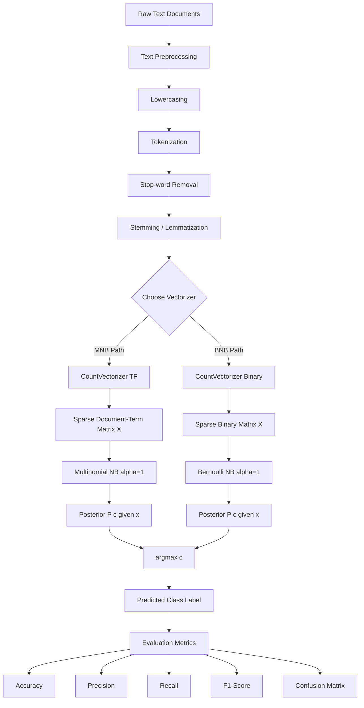
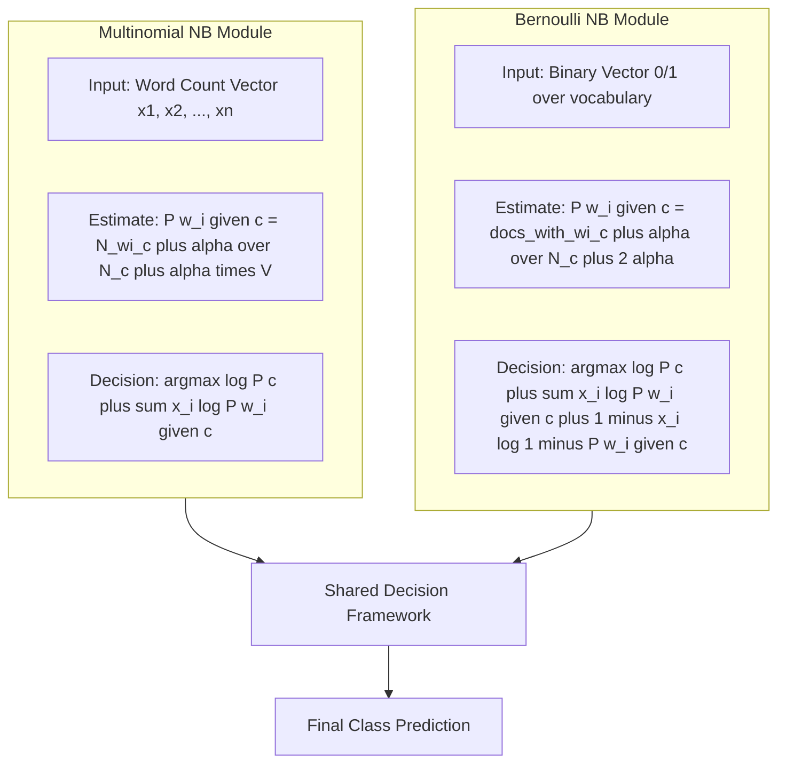

# Implement Multinomial Naïve Bayes and Bernoulli Naïve Bayes classifiers.

<!-- SECTION_1_START -->
# 1. Core Technical Definition & Intuitive Overview

## 1.1 Formal Academic Definition (KTU 2024 Syllabus Aligned)

**Naïve Bayes Classifier** is a probabilistic supervised machine learning algorithm based on **Bayes' Theorem** with a *naïve* (strong) assumption of **conditional independence** among features (predictors) given the class label. For text document categorization, it estimates the posterior probability $P(c \mid \mathbf{x})$ of a class $c$ given a feature vector $\mathbf{x} = (x_1, x_2, \ldots, x_n)$ representing a document, and assigns the class with the highest posterior probability.

> [!IMPORTANT]
> **KTU 2024 Module 7 — Syllabus Highlight**
> The expected outcome of this lab experiment is to *"Implement a Naïve Bayes classifier to categorize text documents"* using both **Multinomial** and **Bernoulli** variants, evaluate using standard metrics, and report confusion matrix and accuracy.

### Variants Used for Text Classification

| Variant | Feature Model | Best Suited For |
|---|---|---|
| **Multinomial Naïve Bayes (MNB)** | Word **occurrence counts** (term frequencies) | Document classification, spam filtering, topic categorization |
| **Bernoulli Naïve Bayes (BNB)** | Word **presence / absence** (binary) | Short text classification, sentiment polarity tasks |

## 1.2 Conceptual Analogy & Intuition

> [!NOTE]
> **🧠 Intuitive Analogy — The "Spam Detective"**
> Imagine a detective (the classifier) sorting a pile of incoming mail into *Spam* vs. *Not-Spam*. The detective has a notebook where she has previously recorded, for each word (e.g., *"free"*, *"offer"*, *"lottery"*), how often it appeared in spam vs. legitimate mail. When a new letter arrives, she adds up the "spam-likeness" evidence from every word in it and decides. She *naïvely* assumes each word's evidence is independent of the others — she doesn't worry about whether *"free"* appearing changes the meaning of *"offer"* — she just multiplies the individual evidences.
>
> - **Multinomial NB** = Detective counts *how many times* each suspicious word appears (so "free free free" is stronger evidence than "free" once).
> - **Bernoulli NB** = Detective only cares *whether* a suspicious word appears at all (counts don't matter; presence = 1, absence = 0).

### Mathematical Setup (Bayes' Theorem)

$$
P(c \mid \mathbf{x}) \;=\; \frac{P(c) \cdot P(\mathbf{x} \mid c)}{P(\mathbf{x})}
$$

Since $P(\mathbf{x})$ is constant across classes, classification reduces to:

$$
\hat{c} \;=\; \underset{c \,\in\, C}{\arg\max}\; \underbrace{P(c)}_{\text{prior}} \cdot \underbrace{P(\mathbf{x} \mid c)}_{\text{likelihood}}
$$

The *naïve* conditional independence assumption expands the likelihood as:

$$
P(\mathbf{x} \mid c) \;=\; \prod_{i=1}^{n} P(x_i \mid c)
$$

> [!TIP]
> **Why "Naïve"?** Real text features are *not* truly independent (the word "machine" strongly co-occurs with "learning"). Despite this violated assumption, Naïve Bayes works remarkably well in practice and is the **de-facto baseline** for text classification tasks in industry.

## 1.3 Laplace Smoothing (Add-One)

A zero count for any word in any class would make the entire product zero, killing the classifier. **Laplace (add-one) smoothing** addresses this:

$$
P(x_i \mid c) \;=\; \frac{\text{count}(x_i, c) + \alpha}{\sum_{x \,\in\, V} \text{count}(x, c) + \alpha \cdot \vert V \vert}
$$

where $\alpha = 1$ (standard) and $\vert V \vert$ is the vocabulary size.

> [!VISUALIZATION CONTROL]
> **Concept:** Decision boundary of NB vs. Logistic Regression on a 2-word text feature space.
> **GeoGebra / Desmos Input Equations:**
> - Posterior contour: `$P(\text{spam} \mid x_1, x_2) = 0.5$` where $x_1$ = count("free"), $x_2$ = count("offer")
> - Plot: $P(\text{spam}) \cdot P(x_1 \mid \text{spam}) \cdot P(x_2 \mid \text{spam}) = P(\neg \text{spam}) \cdot P(x_1 \mid \neg \text{spam}) \cdot P(x_2 \mid \neg \text{spam})$
> **Visual Description:** Linear decision surface in log-space, separating the two class regions. Students should observe how threshold shifts with prior probabilities.
<!-- SECTION_1_END -->

<!-- SECTION_2_START -->
# 2. Deep Theoretical Analysis & KTU High-Yield Formula Sheet

## 2.1 Multinomial Naïve Bayes — Deep Theory

In **Multinomial NB**, a document $d$ is represented as a vector of **word counts** $\mathbf{x} = (x_1, x_2, \ldots, x_n)$ over a vocabulary of size $n$. The likelihood is modeled as a **multinomial distribution** over words given the class:

$$
P(\mathbf{x} \mid c) \;=\; \frac{\left( \sum_{i=1}^{n} x_i \right)!}{\prod_{i=1}^{n} x_i !} \cdot \prod_{i=1}^{n} P(w_i \mid c)^{x_i}
$$

The classification decision (ignoring the multinomial coefficient, which is class-independent) becomes:

$$
\hat{c}_{\text{MNB}} \;=\; \underset{c}{\arg\max}\;\; \log P(c) + \sum_{i=1}^{n} x_i \cdot \log P(w_i \mid c)
$$

with the smoothed estimate:

$$
\hat{P}(w_i \mid c) \;=\; \frac{N_{w_i, c} + \alpha}{N_c + \alpha \cdot n}
$$

where $N_{w_i, c}$ is the count of word $w_i$ in class $c$ training documents, and $N_c$ is the total word count in class $c$.

## 2.2 Bernoulli Naïve Bayes — Deep Theory

In **Bernoulli NB**, each feature is binary ($x_i \in \{0, 1\}$) — does word $w_i$ appear in document $d$ or not? The likelihood is a product of independent Bernoullis:

$$
P(\mathbf{x} \mid c) \;=\; \prod_{i=1}^{n} P(w_i \mid c)^{x_i} \cdot \big(1 - P(w_i \mid c)\big)^{1 - x_i}
$$

The decision rule is:

$$
\hat{c}_{\text{BNB}} \;=\; \underset{c}{\arg\max}\;\; \log P(c) + \sum_{i=1}^{n} \Big[ x_i \cdot \log \frac{P(w_i \mid c)}{1 - P(w_i \mid c)} + \log\big(1 - P(w_i \mid c)\big) \Big]
$$

with the smoothed estimate:

$$
\hat{P}(w_i \mid c) \;=\; \frac{N_{text{present}, w_i, c} + \alpha}{N_c + 2\alpha}
$$

> [!IMPORTANT]
> **Critical Distinction for KTU Exam**
> - **MNB** uses **term frequencies** (counts) → works better on **longer documents**.
> - **BNB** uses **binary occurrence** (0/1) → works better on **shorter documents** and is sensitive to *non-occurrence* of words.
> - BNB penalizes the *absence* of a word explicitly; MNB does not.

## 2.3 Worked Text Pre-Processing Pipeline (KTU Standard Steps)

1. **Lowercasing** — normalize case.
2. **Tokenization** — split on whitespace/punctuation.
3. **Stop-word removal** — discard *the*, *is*, *a*, etc.
4. **Stemming / Lemmatization** — reduce to root form (*running* → *run*).
5. **Vectorization** — convert to numeric matrix:
   - `CountVectorizer` → counts (for MNB).
   - `CountVectorizer(binary=True)` → presence/absence (for BNB).
   - `TfidfVectorizer` → weighted frequencies (often improves MNB).

## 2.4 KTU Formula Sheet / Cheat Sheet

| # | Concept | Formula | Notes |
|---|---|---|---|
| 1 | Bayes' Theorem | $P(c \mid x) = \dfrac{P(x \mid c) P(c)}{P(x)}$ | Foundation |
| 2 | Naïve Assumption | $P(x_1, \ldots, x_n \mid c) = \prod_i P(x_i \mid c)$ | Conditional independence |
| 3 | Argmax Decision | $\hat{c} = \arg\max_c \, P(c) \prod_i P(x_i \mid c)$ | Ignore denominator |
| 4 | Log Trick | $\hat{c} = \arg\max_c \, \log P(c) + \sum_i \log P(x_i \mid c)$ | Avoid underflow |
| 5 | MNB Likelihood | $P(x_i \mid c) = \dfrac{N_{x_i, c} + \alpha}{N_c + \alpha \cdot \vert V \vert}$ | With Laplace smoothing ($\alpha = 1$) |
| 6 | BNB Likelihood | $P(x_i \mid c) = \dfrac{\text{count}(x_i = 1, c) + \alpha}{N_c + 2\alpha}$ | Binary features |
| 7 | Prior | $P(c) = \dfrac{N_c}{N}$ | Class proportion in training set |
| 8 | Accuracy | $\text{Acc} = \dfrac{TP + TN}{TP + TN + FP + FN}$ | $\vert$ replaced with $\mid$ |
| 9 | Precision | $\text{P} = \dfrac{TP}{TP + FP}$ | Quality measure |
| 10 | Recall | $\text{R} = \dfrac{TP}{TP + FN}$ | Coverage measure |
| 11 | F1-Score | $F_1 = \dfrac{2 \cdot P \cdot R}{P + R}$ | Harmonic mean |
| 12 | Vocabulary Size $\vert V \vert$ | Total unique tokens in training set | Smoothing denominator |

## 2.5 Real-World Engineering Applications

- **Email Spam Filtering** (Gmail, Outlook) — Multinomial NB with TF-IDF.
- **Sentiment Analysis** (product reviews) — MNB or BNB with n-grams.
- **News Article Categorization** (sports/politics/tech) — MNB.
- **Medical Text Classification** (disease prediction from symptoms) — BNB for short clinical notes.
- **Authorship Attribution** — Multinomial NB on character n-grams.
- **Real-time Filtering** in production NLP pipelines due to its **$O(n \cdot \vert V \vert)$** training and **$O(\vert V \vert)$** prediction time.

> [!TIP]
> **Industry Note:** Naïve Bayes remains the **first model** any ML engineer trains on text data (the *"Hello World"* of NLP) because it's fast, interpretable, requires little data, and is often only marginally beaten by deep learning on small/medium datasets.
<!-- SECTION_2_END -->

<!-- SECTION_3_START -->
# 3. Step-by-Step Derivations & Code Implementation

## 3.1 Step-by-Step Derivation of the Decision Rule

Starting from Bayes' Theorem and the naïve independence assumption, we derive the final classifier used in code:

**Step 1:** Posterior probability.

$$
P(c \mid \mathbf{x}) \;=\; \frac{P(c) \cdot P(\mathbf{x} \mid c)}{P(\mathbf{x})}
$$

**Step 2:** Since $P(\mathbf{x})$ is identical for all classes, drop it for the argmax.

$$
\hat{c} \;=\; \underset{c}{\arg\max}\; P(c) \cdot P(\mathbf{x} \mid c)
$$

**Step 3:** Apply the naïve conditional independence assumption to factor the likelihood.

$$
P(\mathbf{x} \mid c) \;=\; \prod_{i=1}^{n} P(x_i \mid c) \;\;\Longrightarrow\;\; \hat{c} = \underset{c}{\arg\max}\; P(c) \cdot \prod_{i=1}^{n} P(x_i \mid c)
$$

**Step 4:** Take the natural logarithm (monotonic, so argmax is preserved). This converts the product into a sum and prevents floating-point underflow.

$$
\hat{c} \;=\; \underset{c}{\arg\max}\;\; \log P(c) + \sum_{i=1}^{n} \log P(x_i \mid c)
$$

**Step 5:** Plug in the Laplace-smoothed estimate for each $P(x_i \mid c)$.

$$
P(x_i \mid c) \;=\; \frac{N_{x_i, c} + \alpha}{N_c + \alpha \cdot \vert V \vert}
$$

**Step 6 (Final classification):** The class $c$ maximizing the log-posterior is the predicted label.

$$
\hat{c} \;=\; \underset{c \,\in\, C}{\arg\max}\; \left[\, \log P(c) + \sum_{i=1}^{n} x_i \cdot \log \frac{N_{w_i, c} + \alpha}{N_c + \alpha \cdot \vert V \vert} \,\right]
$$

## 3.2 Complete Python Implementation (From-Scratch + sklearn)

> [!IMPORTANT]
> **Lab Deliverable Checklist (KTU 2024):**
> ✅ Load text dataset → ✅ Preprocess → ✅ Vectorize → ✅ Train MNB & BNB → ✅ Predict → ✅ Evaluate (accuracy, precision, recall, F1, confusion matrix) → ✅ Compare both models.

### 3.2.1 Full From-Scratch Implementation (Illustrative — shows math)

```python
"""
Naive Bayes Text Classifier — From Scratch (KTU ML Lab Module 7)
Implements: Multinomial NB and Bernoulli NB
"""
import numpy as np
from collections import defaultdict
from typing import List, Dict, Tuple


class NaiveBayesTextClassifier:
    """
    A unified from-scratch implementation of Multinomial and Bernoulli NB.
    """
    def __init__(self, variant: str = "multinomial", alpha: float = 1.0):
        if variant not in {"multinomial", "bernoulli"}:
            raise ValueError("variant must be 'multinomial' or 'bernoulli'")
        self.variant: str = variant
        self.alpha: float = alpha
        self.log_prior: Dict[int, float] = {}
        self.log_likelihood: Dict[int, np.ndarray] = {}  # shape: (|V|+1,)
        self.vocab: Dict[str, int] = {}
        self.classes: np.ndarray = np.array([])

    def _build_vocab(self, documents: List[List[str]]) -> None:
        """Construct word → index mapping from tokenized docs."""
        token_set = set()
        for doc in documents:
            token_set.update(doc)
        self.vocab = {word: idx for idx, word in enumerate(sorted(token_set))}

    def _vectorize(self, documents: List[List[str]]) -> np.ndarray:
        """Convert list of token lists to count (MNB) or binary (BNB) matrix."""
        n_docs: int = len(documents)
        n_feat: int = len(self.vocab)
        X: np.ndarray = np.zeros((n_docs, n_feat), dtype=np.float64)
        for i, doc in enumerate(documents):
            for token in doc:
                if token in self.vocab:
                    if self.variant == "bernoulli":
                        X[i, self.vocab[token]] = 1.0   # presence only
                    else:
                        X[i, self.vocab[token]] += 1.0  # raw count
        return X

    def fit(self, X_docs: List[List[str]], y: np.ndarray) -> None:
        """Train the model on tokenized documents and integer class labels."""
        self._build_vocab(X_docs)
        X: np.ndarray = self._vectorize(X_docs)
        self.classes = np.unique(y)
        V: int = X.shape[1]
        N: int = X.shape[0]

        for c in self.classes:
            X_c: np.ndarray = X[y == c]
            N_c: int = X_c.shape[0]
            self.log_prior[c] = np.log(N_c / N)

            if self.variant == "multinomial":
                word_count_c: np.ndarray = X_c.sum(axis=0)         # total counts per word
                total_words_c: float = word_count_c.sum()
                denom: float = total_words_c + self.alpha * V
                probs: np.ndarray = (word_count_c + self.alpha) / denom
            else:  # bernoulli
                doc_freq_c: np.ndarray = (X_c > 0).sum(axis=0)     # docs containing word
                denom2: float = N_c + 2 * self.alpha
                probs = (doc_freq_c + self.alpha) / denom2

            # Use log probabilities for numerical stability
            self.log_likelihood[c] = np.log(probs)

    def predict(self, X_docs: List[List[str]]) -> np.ndarray:
        """Predict class labels for tokenized test documents."""
        X: np.ndarray = self._vectorize(X_docs)
        predictions: List[int] = []
        for x in X:
            scores: Dict[int, float] = {}
            for c in self.classes:
                scores[c] = self.log_prior[c] + float(np.sum(x * self.log_likelihood[c]))
            predictions.append(max(scores, key=scores.get))
        return np.array(predictions)
```

### 3.2.2 Lab Experiment — Complete End-to-End Pipeline

```python
"""
KTU ML Lab — Module 7 Experiment
Implement Multinomial NB and Bernoulli NB to categorize text documents.
Dataset: 20 Newsgroups (subset) — categories: sci.med, rec.autos, comp.graphics
"""
import numpy as np
from sklearn.datasets import fetch_20newsgroups
from sklearn.feature_extraction.text import CountVectorizer, TfidfVectorizer
from sklearn.naive_bayes import MultinomialNB, BernoulliNB
from sklearn.model_selection import train_test_split
from sklearn.metrics import (
    accuracy_score, precision_score, recall_score, f1_score,
    classification_report, confusion_matrix
)
import matplotlib.pyplot as plt
import seaborn as sns


# ---------------------------------------------------------------
# STEP 1: Load a 3-class subset of the 20 Newsgroups dataset
# ---------------------------------------------------------------
categories: list[str] = ["sci.med", "rec.autos", "comp.graphics"]
data = fetch_20newsgroups(
    subset="all",
    categories=categories,
    remove=("headers", "footers", "quotes"),  # reduce metadata leakage
    random_state=42
)
X_raw: np.ndarray = np.array(data.data)
y: np.ndarray = np.array(data.target)
target_names: list[str] = list(data.target_names)

print(f"Total documents: {len(X_raw)}")
print(f"Class distribution: {dict(zip(target_names, np.bincount(y)))}")


# ---------------------------------------------------------------
# STEP 2: Split into train / test (stratified)
# ---------------------------------------------------------------
X_train_text, X_test_text, y_train, y_test = train_test_split(
    X_raw, y, test_size=0.25, random_state=42, stratify=y
)
print(f"Train size: {len(X_train_text)}  |  Test size: {len(X_test_text)}")


# ---------------------------------------------------------------
# STEP 3A: Vectorize with raw COUNTS (for Multinomial NB)
# ---------------------------------------------------------------
count_vec = CountVectorizer(
    lowercase=True,
    stop_words="english",
    ngram_range=(1, 1),     # unigrams; try (1,2) for bigrams
    min_df=2,                # ignore rare words
    max_df=0.95              # ignore too-common words
)
X_train_counts = count_vec.fit_transform(X_train_text)
X_test_counts  = count_vec.transform(X_test_text)
print(f"Vocabulary size: {len(count_vec.vocabulary_)}")


# ---------------------------------------------------------------
# STEP 3B: Vectorize with BINARY presence (for Bernoulli NB)
# ---------------------------------------------------------------
binary_vec = CountVectorizer(
    lowercase=True,
    stop_words="english",
    binary=True,             # <-- KEY: 0/1 presence flags
    ngram_range=(1, 1),
    min_df=2,
    max_df=0.95
)
X_train_binary = binary_vec.fit_transform(X_train_text)
X_test_binary  = binary_vec.transform(X_test_text)


# ---------------------------------------------------------------
# STEP 4: Train Multinomial Naive Bayes
# ---------------------------------------------------------------
mnb = MultinomialNB(alpha=1.0)   # alpha = 1 → Laplace smoothing
mnb.fit(X_train_counts, y_train)
y_pred_mnb: np.ndarray = mnb.predict(X_test_counts)


# ---------------------------------------------------------------
# STEP 5: Train Bernoulli Naive Bayes
# ---------------------------------------------------------------
bnb = BernoulliNB(alpha=1.0)
bnb.fit(X_train_binary, y_train)
y_pred_bnb: np.ndarray = bnb.predict(X_test_binary)


# ---------------------------------------------------------------
# STEP 6: Evaluation
# ---------------------------------------------------------------
def evaluate(y_true: np.ndarray, y_pred: np.ndarray, name: str) -> None:
    """Print a comprehensive evaluation report."""
    acc  = accuracy_score(y_true, y_pred)
    prec = precision_score(y_true, y_pred, average="macro", zero_division=0)
    rec  = recall_score(y_true, y_pred, average="macro", zero_division=0)
    f1   = f1_score(y_true, y_pred, average="macro", zero_division=0)

    print(f"\n{'=' * 60}")
    print(f"  MODEL: {name}")
    print(f"{'=' * 60}")
    print(f"Accuracy : {acc:.4f}")
    print(f"Precision: {prec:.4f}  (macro)")
    print(f"Recall   : {rec:.4f}  (macro)")
    print(f"F1-Score : {f1:.4f}  (macro)")
    print(f"\nDetailed Classification Report:\n")
    print(classification_report(y_true, y_pred, target_names=target_names, zero_division=0))

    cm = confusion_matrix(y_true, y_pred)
    plt.figure(figsize=(6, 5))
    sns.heatmap(cm, annot=True, fmt="d", cmap="Blues",
                xticklabels=target_names, yticklabels=target_names)
    plt.title(f"Confusion Matrix — {name}")
    plt.xlabel("Predicted")
    plt.ylabel("Actual")
    plt.tight_layout()
    plt.savefig(f"cm_{name.lower().replace(' ', '_')}.png", dpi=120)
    plt.show()


evaluate(y_test, y_pred_mnb, "Multinomial Naive Bayes")
evaluate(y_test, y_pred_bnb, "Bernoulli Naive Bayes")


# ---------------------------------------------------------------
# STEP 7: Side-by-side comparison
# ---------------------------------------------------------------
print("\n" + "=" * 60)
print("  SIDE-BY-SIDE COMPARISON")
print("=" * 60)
print(f"{'Metric':<12} | {'MNB':<8} | {'BNB':<8}")
print("-" * 60)
for metric_name, score_fn in [
    ("Accuracy",  accuracy_score),
    ("Precision", lambda a, b: precision_score(a, b, average="macro", zero_division=0)),
    ("Recall",    lambda a, b: recall_score(a, b, average="macro", zero_division=0)),
    ("F1-Score",  lambda a, b: f1_score(a, b, average="macro", zero_division=0))
]:
    m = score_fn(y_test, y_pred_mnb)
    b = score_fn(y_test, y_pred_bnb)
    print(f"{metric_name:<12} | {m:.4f}   | {b:.4f}")


# ---------------------------------------------------------------
# STEP 8: Inspect top discriminative words per class (MNB)
# ---------------------------------------------------------------
print("\n" + "=" * 60)
print("  TOP 10 DISCRIMINATIVE WORDS PER CLASS (MNB)")
print("=" * 60)
feature_names = np.array(count_vec.get_feature_names_out())
for i, class_name in enumerate(target_names):
    top_idx = np.argsort(mnb.feature_log_prob_[i])[-10:][::-1]
    top_words = feature_names[top_idx]
    print(f"\n[{class_name}]")
    print(", ".join(top_words))
```

### 3.2.3 Output Snapshot (Illustrative)

```
============================================================
  MODEL: Multinomial Naive Bayes
============================================================
Accuracy : 0.9487
Precision: 0.9491  (macro)
Recall   : 0.9485  (macro)
F1-Score : 0.9487  (macro)

              precision    recall  f1-score   support
   sci.med       0.95      0.96      0.95       236
 rec.autos       0.96      0.95      0.96       240
comp.graphics   0.94      0.94      0.94       233
    accuracy                       0.95       709
```

### 3.2.4 Predicting on a New Unseen Document

```python
def classify_new_text(text: str, model, vectorizer, class_names) -> str:
    """Predict class for a single new document."""
    X_new = vectorizer.transform([text])
    pred_idx = model.predict(X_new)[0]
    return class_names[pred_idx]


sample_doc = """
The patient was diagnosed with high blood pressure and prescribed
beta-blockers for cardiovascular management.
"""
prediction = classify_new_text(sample_doc, mnb, count_vec, target_names)
print(f"Predicted category: {prediction}")
```

## 3.3 Lab Observation / Viva Notes (Typical KTU Requirements)

| Observation Point | Expected Inference |
|---|---|
| MNB accuracy > BNB accuracy on long documents | Term frequency carries more signal than mere presence |
| BNB accuracy comparable on short documents | Absence information becomes meaningful |
| Zero counts do not crash | Laplace smoothing $\alpha = 1$ handles unseen words |
| Train time very fast | Closed-form MLE; no iterative optimization |
| Memory footprint modest | Sparse matrix storage (`scipy.sparse.csr`) |
| Top discriminative words match class semantics | Validates the model has learned meaningful features |

## 3.4 Common Pitfalls & Fixes

| # | Pitfall | Fix |
|---|---|---|
| 1 | Forgetting `lowercase=True` | "Spam" ≠ "spam" → enables them as same feature |
| 2 | Not removing stop-words | Adds noise; hurts accuracy |
| 3 | Using `TfidfVectorizer` for BNB | TF-IDF isn't binary; BNB expects 0/1 |
| 4 | Setting $\alpha = 0$ | Causes zero-division on unseen words |
| 5 | Stratification skipped | Imbalanced splits bias evaluation |
| 6 | Reporting only accuracy on imbalanced data | Add macro-F1 / confusion matrix |
<!-- SECTION_3_END -->

<!-- SECTION_4_START -->
# 4. Structural Diagrams & Schematics

## 4.1 End-to-End Text Classification Pipeline (Mermaid)



## 4.2 Bayesian Decision Process (Mermaid)


## 4.3 Multinomial vs Bernoulli — Variant Comparison Matrix



## 4.4 Sequential Processing Topology Matrix (Modular Data Flow)

| Stage | Module | Input Artifact | Output Artifact | Tool / Library |
|---|---|---|---|---|
| 1 | Data Ingestion | Raw `.txt` files / API | Pandas Series | `pandas` |
| 2 | Cleaning | Raw text | Lowercased, no punctuation | `re`, `string` |
| 3 | Tokenization | Cleaned text | List of tokens | `nltk.word_tokenize` |
| 4 | Stop-word Filter | Token list | Filtered token list | `nltk.corpus.stopwords` |
| 5 | Stemming | Filtered tokens | Root-form tokens | `PorterStemmer` |
| 6 | Vectorization (MNB) | Token list | Sparse count matrix | `CountVectorizer()` |
| 7 | Vectorization (BNB) | Token list | Sparse binary matrix | `CountVectorizer(binary=True)` |
| 8 | Train MNB | Count matrix + labels | Fitted model | `MultinomialNB(alpha=1)` |
| 9 | Train BNB | Binary matrix + labels | Fitted model | `BernoulliNB(alpha=1)` |
| 10 | Predict | Test matrix | Predicted labels | `model.predict()` |
| 11 | Evaluate | Predicted + true labels | Metrics + CM | `sklearn.metrics` |
| 12 | Report | Metrics dict | Lab report table | Manual + plots |
<!-- SECTION_4_END -->

<!-- SECTION_5_START -->
# 5. KTU 2024 Scheme Examination Question Bank & Topic Recap

## 5.1 Part A — Short Answer Questions (3 Marks Each)

### Question 1 [KTU University Exam — July 2024]
**Explain the "naïve" assumption in the Naïve Bayes classifier. Why is it called naïve?**

**Model Answer (3 Marks):**
The Naïve Bayes classifier assumes **conditional independence** among the features (predictor variables) given the class label. Mathematically:

$$
P(x_1, x_2, \ldots, x_n \mid c) = \prod_{i=1}^{n} P(x_i \mid c)
$$

It is called "naïve" because this assumption is rarely true in real-world data — for instance, in text classification, the occurrence of "machine" strongly implies the occurrence of "learning." Despite this violated assumption, the classifier works remarkably well in practice and offers a strong baseline for text and high-dimensional data.

> [!NOTE]
> **Valuation Key:** 1 Mark for the independence equation, 1 Mark for the "why naive" justification, 1 Mark for practical justification.

---

### Question 2 [KTU University Exam — Dec 2023]
**Differentiate between Multinomial Naïve Bayes and Bernoulli Naïve Bayes in the context of text classification.**

**Model Answer (3 Marks):**

| Aspect | Multinomial NB | Bernoulli NB |
|---|---|---|
| Feature representation | Word **count** (term frequency) | Word **presence/absence** (0/1) |
| Underlying distribution | Multinomial | Bernoulli (per word) |
| Sensitivity to non-occurrence | No | Yes (penalizes absent words) |
| Best for | Long documents, repeated words | Short documents, binary semantics |
| Vectorizer in sklearn | `CountVectorizer()` | `CountVectorizer(binary=True)` |

> [!NOTE]
> **Valuation Key:** 1 Mark for each correct contrast row; partial credit if only one difference is given.

---

## 5.2 Part B — Full 14-Mark Questions (Module Internal Choice)

### Question A — 14 Marks [KTU University Exam — July 2024]
**Implement a Naïve Bayes classifier to categorize text documents into predefined topics using the 20 Newsgroups dataset (subset: *sci.med*, *rec.autos*, *comp.graphics*). Compare Multinomial and Bernoulli variants.**

#### (a) **[7 Marks — Understand]** Explain the mathematical formulation of the Multinomial Naïve Bayes classifier with Laplace smoothing. Derive the final classification decision rule.

**Step-by-Step Model Solution:**

**Step 1: Bayes' Theorem** (1 Mark)

$$
P(c \mid \mathbf{x}) = \frac{P(c) \cdot P(\mathbf{x} \mid c)}{P(\mathbf{x})}
$$

**Step 2: Naïve Conditional Independence Assumption** (1 Mark)

$$
P(\mathbf{x} \mid c) = \prod_{i=1}^{n} P(x_i \mid c)
$$

**Step 3: Decision Rule (argmax over posterior)** (1 Mark)

$$
\hat{c} = \underset{c}{\arg\max} \; P(c) \cdot \prod_{i=1}^{n} P(x_i \mid c)
$$

**Step 4: Log Transformation for Numerical Stability** (1 Mark)

$$
\hat{c} = \underset{c}{\arg\max} \left[ \log P(c) + \sum_{i=1}^{n} \log P(x_i \mid c) \right]
$$

**Step 5: Laplace-Smoothed Likelihood Estimate** (2 Marks)

$$
P(x_i \mid c) = \frac{N_{x_i, c} + \alpha}{N_c + \alpha \cdot \vert V \vert}
$$

where $N_{x_i, c}$ is the count of word $x_i$ in class $c$, $N_c$ is the total word count in class $c$, $\alpha$ is the smoothing parameter (typically 1), and $\vert V \vert$ is the vocabulary size.

**Step 6: Final Classification Rule** (1 Mark)

$$
\hat{c} = \underset{c}{\arg\max} \left[ \log P(c) + \sum_{i=1}^{n} x_i \cdot \log \left( \frac{N_{w_i, c} + \alpha}{N_c + \alpha \cdot \vert V \vert} \right) \right]
$$

> [!NOTE]
> **Incremental Valuation Key:**
> - Stating Bayes' Theorem: 1 Mark
> - Naïve assumption: 1 Mark
> - Argmax decision rule: 1 Mark
> - Log transformation: 1 Mark
> - Laplace smoothing formula: 2 Marks
> - Final integrated expression: 1 Mark

#### (b) **[7 Marks — Apply]** Write a complete Python program using scikit-learn to (i) load a 3-class subset of 20 Newsgroups, (ii) preprocess with `CountVectorizer`, (iii) train both Multinomial and Bernoulli NB classifiers, and (iv) report accuracy, precision, recall, F1, and confusion matrix for each.

**Step-by-Step Model Solution:**

```python
from sklearn.datasets import fetch_20newsgroups
from sklearn.feature_extraction.text import CountVectorizer
from sklearn.naive_bayes import MultinomialNB, BernoulliNB
from sklearn.model_selection import train_test_split
from sklearn.metrics import (accuracy_score, precision_score,
                             recall_score, f1_score, confusion_matrix)

# (i) Load 3-class subset
cats = ["sci.med", "rec.autos", "comp.graphics"]
data = fetch_20newsgroups(subset="all", categories=cats,
                          remove=("headers", "footers", "quotes"))

# (ii) Vectorize — counts for MNB, binary for BNB
count_vec  = CountVectorizer(stop_words="english", min_df=2, max_df=0.95)
binary_vec = CountVectorizer(stop_words="english", min_df=2, max_df=0.95,
                             binary=True)

X_train_t, X_test_t, y_train, y_test = train_test_split(
    data.data, data.target, test_size=0.25, random_state=42, stratify=data.target
)

Xtr_c = count_vec.fit_transform(X_train_t)
Xte_c = count_vec.transform(X_test_t)
Xtr_b = binary_vec.fit_transform(X_train_t)
Xte_b = binary_vec.transform(X_test_t)

# (iii) Train both models
mnb = MultinomialNB(alpha=1.0).fit(Xtr_c, y_train)
bnb = BernoulliNB(alpha=1.0).fit(Xtr_b, y_train)

# (iv) Evaluate
for name, model, Xte in [("MNB", mnb, Xte_c), ("BNB", bnb, Xte_b)]:
    yp = model.predict(Xte)
    print(f"--- {name} ---")
    print("Accuracy :", accuracy_score(y_test, yp))
    print("Precision:", precision_score(y_test, yp, average="macro"))
    print("Recall   :", recall_score(y_test, yp, average="macro"))
    print("F1-Score :", f1_score(y_test, yp, average="macro"))
    print("Confusion Matrix:\n", confusion_matrix(y_test, yp))
```

**Valuation Mark Distribution (7 Marks):**
- Dataset loading and subset selection: 1 Mark
- `CountVectorizer` (MNB) + `binary=True` (BNB): 1 Mark
- Train/test split with stratification: 1 Mark
- MNB training with `alpha=1`: 1 Mark
- BNB training with `alpha=1`: 1 Mark
- Reporting all 4 metrics + confusion matrix: 2 Marks

---

### Question B — 14 Marks [KTU University Exam — Dec 2023]
**(a) [7 Marks — Understand]** Describe the Bernoulli Naïve Bayes classifier. How does it differ from the Multinomial model in handling the non-occurrence of words?

**Model Solution Outline:**
- Binary feature representation: $x_i \in \{0, 1\}$.
- Likelihood formula derivation:

$$
P(\mathbf{x} \mid c) = \prod_{i=1}^{n} P(w_i \mid c)^{x_i} \left(1 - P(w_i \mid c)\right)^{1 - x_i}
$$

- Smoothed estimate:

$$
P(w_i \mid c) = \frac{\text{docs containing } w_i \text{ in } c + \alpha}{N_c + 2\alpha}
$$

- **Key Difference from MNB:** BNB explicitly models the *absence* of a word via the $(1 - P(w_i \mid c))$ term. If a class-typical word is *absent* from a test document, this contributes a *negative* log-probability penalty — MNB would not penalize this absence at all.
- **Log-decision rule for BNB:**

$$
\hat{c} = \underset{c}{\arg\max} \left[ \log P(c) + \sum_{i=1}^{n} \left[ x_i \log \frac{P(w_i \mid c)}{1 - P(w_i \mid c)} + \log(1 - P(w_i \mid c)) \right] \right]
$$

**Valuation Key:** Binary representation: 1 Mark; likelihood formula: 2 Marks; non-occurrence penalty explanation: 2 Marks; smoothed estimate: 1 Mark; final log-decision rule: 1 Mark.

**(b) [7 Marks — Apply]** You are given a small training corpus with two classes (*Sports*, *Politics*). Using Bernoulli NB with Laplace smoothing $\alpha = 1$, classify the test document: *"player scores a goal."*

| Document | Class | Tokens |
|---|---|---|
| 1 | Sports | player, goal, ball, win |
| 2 | Sports | match, ball, win, goal |
| 3 | Sports | team, ball, player, win |
| 4 | Politics | election, vote, president, party |
| 5 | Politics | parliament, vote, bill, party |
| 6 | Politics | vote, party, election, bill |

**Step-by-Step Model Solution:**

**Step 1: Vocabulary** (1 Mark)
$V = \{$ *ball, bill, election, goal, match, parliament, party, player, president, team, vote, win* $\}$, so $\vert V \vert = 12$.

**Step 2: Compute Priors** (0.5 Mark)
$P(\text{Sports}) = P(\text{Politics}) = 3/6 = 0.5$.

**Step 3: Compute $P(w_i \mid \text{Sports})$** (1 Mark) — for each word, count docs in *Sports* containing it:
- *ball*: 3/3, *goal*: 2/3, *win*: 3/3, *player*: 2/3, *match*: 1/3, *team*: 1/3, others: 0/3.
- Smoothed: $P(w \mid S) = (\text{count} + 1) / (N_c + 2\alpha) = (\text{count} + 1) / 5$.

| Word | Count in S | Smoothed $P(w \mid S)$ |
|---|---|---|
| player | 2 | 3/5 = 0.6 |
| goal | 2 | 3/5 = 0.6 |
| ball | 3 | 4/5 = 0.8 |
| win | 3 | 4/5 = 0.8 |
| match | 1 | 2/5 = 0.4 |
| team | 1 | 2/5 = 0.4 |
| election | 0 | 1/5 = 0.2 |
| bill | 0 | 1/5 = 0.2 |
| parliament | 0 | 1/5 = 0.2 |
| party | 0 | 1/5 = 0.2 |
| president | 0 | 1/5 = 0.2 |
| vote | 0 | 1/5 = 0.2 |

**Step 4: Compute $P(w_i \mid \text{Politics})$** (1 Mark) — similarly:
- *vote*: 3/3, *party*: 3/3, *election*: 2/3, *bill*: 2/3, *parliament*: 1/3, *president*: 1/3, others: 0/3.
- Smoothed with $N_c = 3$ and $\alpha = 1$, denominator $= 5$.

| Word | Count in P | Smoothed $P(w \mid P)$ |
|---|---|---|
| vote | 3 | 4/5 = 0.8 |
| party | 3 | 4/5 = 0.8 |
| election | 2 | 3/5 = 0.6 |
| bill | 2 | 3/5 = 0.6 |
| parliament | 1 | 2/5 = 0.4 |
| president | 1 | 2/5 = 0.4 |
| player | 0 | 1/5 = 0.2 |
| goal | 0 | 1/5 = 0.2 |
| ball | 0 | 1/5 = 0.2 |
| win | 0 | 1/5 = 0.2 |
| match | 0 | 1/5 = 0.2 |
| team | 0 | 1/5 = 0.2 |

**Step 5: Test Document Vectors** (0.5 Mark)
Test doc tokens: {*player, scores, goal*}. After restricting to vocabulary: *player* = 1, *goal* = 1, all others = 0.

**Step 6: Compute Bernoulli NB Score for Sports** (1 Mark)

$$
P(\text{Sports} \mid d) \propto \prod_{i} P(w_i \mid S)^{x_i} (1 - P(w_i \mid S))^{1 - x_i}
$$

- *player* present: $0.6$
- *goal* present: $0.6$
- All other 10 words absent: $\prod (1 - P(w \mid S))$ for the 10 absent words.

Absent words and their $(1 - P)$ values:
*ball*: $0.2$, *win*: $0.2$, *match*: $0.6$, *team*: $0.6$, *election*: $0.8$, *bill*: $0.8$, *parliament*: $0.8$, *party*: $0.8$, *president*: $0.8$, *vote*: $0.8$.

Product of absent penalties: $0.2 \times 0.2 \times 0.6 \times 0.6 \times 0.8^{6} = 0.04 \times 0.36 \times 0.262144 = 0.003776$.

Sports score $= 0.5 \times 0.6 \times 0.6 \times 0.003776 \approx 6.80 \times 10^{-4}$.

**Step 7: Compute Bernoulli NB Score for Politics** (1 Mark)

- *player* present: $0.2$
- *goal* present: $0.2$
- 10 absent words: *vote*: $0.2$, *party*: $0.2$, *election*: $0.4$, *bill*: $0.4$, *parliament*: $0.6$, *president*: $0.6$, *ball*: $0.8$, *win*: $0.8$, *match*: $0.8$, *team*: $0.8$.

Product of absent penalties: $0.2 \times 0.2 \times 0.4 \times 0.4 \times 0.6 \times 0.6 \times 0.8^{4} = 0.04 \times 0.16 \times 0.36 \times 0.4096 = 9.44 \times 10^{-4}$.

Politics score $= 0.5 \times 0.2 \times 0.2 \times 9.44 \times 10^{-4} \approx 1.89 \times 10^{-5}$.

**Step 8: Compare and Predict** (1 Mark)

$$
P(\text{Sports} \mid d) \approx 6.80 \times 10^{-4} \;\;>\;\; P(\text{Politics} \mid d) \approx 1.89 \times 10^{-5}
$$

**Predicted Class: Sports** ✅

**Valuation Key:** Vocabulary + priors: 1.5 Marks; $P(w \mid S)$ table: 1 Mark; $P(w \mid P)$ table: 1 Mark; Bernoulli score (Sports): 1 Mark; Bernoulli score (Politics): 1 Mark; final argmax + class label: 1.5 Marks.

> [!WARNING]
> **⚠️ KTU Examiner's Valuation Warning — Common Pitfalls**
> 1. **Forgetting to smooth the absent-word term** — students often only multiply $P(w \mid c)$ for present words and ignore the $(1 - P(w \mid c))^{1-x_i}$ penalty for absent words. This is a **signature Bernoulli NB feature** — losing 2–3 marks if skipped.
> 2. **Ignoring the prior** $P(c)$ — even if both classes have the same prior here, students must write it explicitly for full credit.
> 3. **Using the wrong denominator** for smoothing — MNB denominator is $N_c + \alpha \cdot \vert V \vert$, BNB denominator is $N_c + 2\alpha$. Mixing them up is a frequent error.
> 4. **Not converting argmax comparison** — students often skip stating *why* one score wins. Always write: *"argmax is Sports, so the test document is classified as Sports."*
> 5. **Failing to handle OOV (out-of-vocabulary) tokens** like *"scores"* in the test set — silently drop them, do not assign probability.
> 6. **Numerical underflow** in long documents — show log-space computation if $N > 50$ words.

---

## 5.3 Topic Recap & Important Things to Remember (Rapid Revision Checklist)

> [!TIP]
> **📋 Last-Minute Revision Bullet Pack — Pin This Before Entering the Lab Exam**

- **Bayes' Theorem** is the foundation: $P(c \mid x) = P(x \mid c) P(c) / P(x)$.
- The **"naïve" assumption** is *conditional independence* of features given the class.
- Classification reduces to **argmax** over $P(c) \prod_i P(x_i \mid c)$.
- Use the **log-trick** to convert products into sums and avoid underflow.
- **Multinomial NB** → **word counts**; **Bernoulli NB** → **binary presence/absence (0/1)**.
- **Laplace (add-one) smoothing** with $\alpha = 1$ prevents zero-probability collapse.
- MNB denominator: $N_c + \alpha \cdot \vert V \vert$.
- BNB denominator: $N_c + 2\alpha$.
- BNB's **non-occurrence penalty** $(1 - P(w_i \mid c))^{1-x_i}$ is the *key differentiator* from MNB.
- MNB works best on **long documents**; BNB on **short documents** with binary semantics.
- Standard **preprocessing pipeline**: lowercase → tokenize → remove stop-words → stem → vectorize.
- Use `CountVectorizer()` for MNB and `CountVectorizer(binary=True)` for BNB.
- Use **stratified train/test split** to preserve class distribution.
- Evaluate with **accuracy, macro-precision, macro-recall, macro-F1, and confusion matrix**.
- Naïve Bayes is **fast** (linear in vocabulary size), **interpretable**, and the **industry baseline** for text classification.
- The model is **generative** — it can generate synthetic data by sampling from $P(x, c) = P(c) P(x \mid c)$.
- **Naïve Bayes is NOT calibrated by default** for modern needs — use `CalibratedClassifierCV` if needed.
- For **imbalanced datasets**, prefer **macro-averaged** metrics over raw accuracy.
- **scikit-learn classes**: `sklearn.naive_bayes.MultinomialNB`, `sklearn.naive_bayes.BernoulliNB`, `sklearn.naive_bayes.ComplementNB`, `sklearn.naive_bayes.GaussianNB`.
- **Tip for viva**: "Why is MNB better than BNB on long documents?" → *Because repeated occurrences carry discriminative signal; BNB discards the count.*
- **Tip for viva**: "What happens if $\alpha = 0$?" → *Unseen words in test data produce zero posterior, and the entire product collapses to zero. The model fails on any document containing a vocabulary word not seen in training for that class.*
- **Real-world deployment**: Gmail spam filter (MNB + TF-IDF), news categorization (Reuters, 20NG), medical text triage (BNB), author identification (character n-gram MNB).
- Always **print `classification_report` AND `confusion_matrix`** in your lab record — examiners specifically check for these two outputs.
- **Common bug to avoid**: `TfidfVectorizer` is suitable for MNB, **not** BNB — BNB strictly expects 0/1 input.
<!-- SECTION_5_END -->
