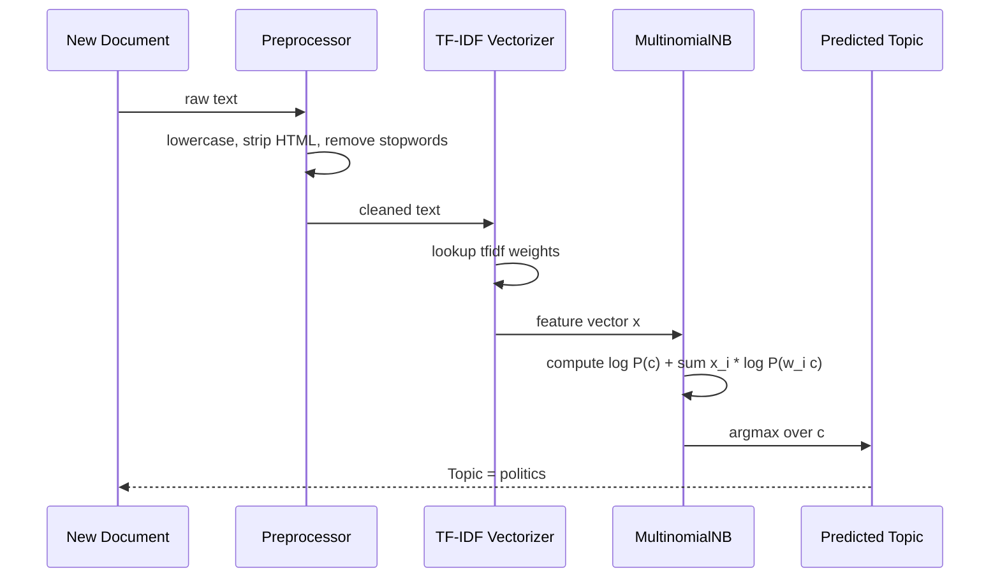
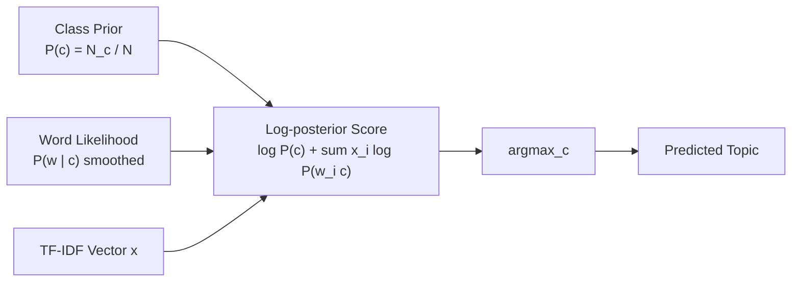

# Tasks:

<!-- SECTION_1_START -->

# Naive Bayes Text Classification — Core Technical Foundation

## 1.1 Formal Academic Definition (KTU 2024 Syllabus Aligned)

> [!NOTE]
> **Definition (Per KTU PCCSL508 — Machine Learning Lab, Module 7)**
> **Naive Bayes Classifier** is a probabilistic supervised learning algorithm based on **Bayes' Theorem** that applies the *conditional independence assumption*: every feature (word/token) contributes independently to the probability of a class label. For text categorization, the model estimates the posterior probability $P(c \mid \mathbf{x})$ for every topic class $c \in \mathcal{C}$, where $\mathbf{x} = (x_1, x_2, \dots, x_n)$ is the word-feature vector of a document. The predicted class is the one that **maximizes the posterior (MAP estimate)**.

The family used for text is almost always **Multinomial Naive Bayes (MNB)**, because it models word *counts* (or term frequencies), which matches the Bag-of-Words (BoW) and TF-IDF representations used in Information Retrieval.

> [!IMPORTANT]
> **KTU 2024 Scheme Highlight:** The "naive" assumption — that word occurrences are conditionally independent given the topic — is mathematically unrealistic but empirically produces excellent results on spam filtering, sentiment analysis, and news topic classification (e.g., the **20 Newsgroups** benchmark, where MNB routinely exceeds **89% accuracy**).

## 1.2 Conceptual Analogy — The Librarian's Intuition

Imagine a librarian who has read thousands of newspapers and built a *mental histogram* of how often each word appears in each section (Sports, Politics, Technology, Entertainment). When a new article arrives, the librarian does **not** read it deeply; she simply **glances at the words** and asks:

> *"If this article were Sports, how probable would I be to see exactly these words? How about Politics?"*

She picks the section with the **highest score**. That is precisely what Naive Bayes does — it ignores word order and grammar, treating a document as a **bag of words**, and scores each topic by multiplying per-word likelihoods.

| Real-World Analogy Element | Machine Learning Counterpart |
|---|---|
| Librarian's experience with past papers | Training corpus (labelled documents) |
| Mental word histogram per section | Class-conditional word probabilities $P(w_i \mid c)$ |
| Glancing at the words | Bag-of-Words feature extraction |
| Picking the most likely section | $\arg\max_c \, P(c \mid \mathbf{x})$ |

## 1.3 Physical Constants & Standard Metrics

The following quantities are typically reported and must be **bolded** when used in your lab record:

- **Laplace smoothing parameter:** $\alpha = 1$ (standard add-one smoothing).
- **Vocabulary size** $V$: number of unique tokens after preprocessing.
- **Number of training documents per class:** $N_c$.
- **Total training documents:** $N$.
- **Standard evaluation metrics:** **Accuracy**, **Precision**, **Recall**, **F1-Score**, and the **Confusion Matrix**.

> [!TIP]
> **Preprocessing Constants (Boilerplate):** Lowercasing, punctuation removal, stopword filtering (using NLTK's `stopwords.words('english')`), and optional **Porter stemming** are the four mandatory preprocessing steps for any KTU text-classification experiment.

## 1.4 Geometric Intuition — Probability Vectors in Topic Space

In the high-dimensional vocabulary space $\mathbb{R}^{\vert V \vert }$, each class $c$ is represented by a probability vector $\boldsymbol{\theta}_c \in \mathbb{R}^{\vert V \vert}$ whose components sum to 1. A new document is mapped to a sparse point in the same space, and classification is performed by computing the **angle (in probability-log space)** between the document and each class centroid. The smallest angle wins.

> [!VISUALIZATION CONTROL]
> **Concept:** Class-conditional log-probability vectors for four topics.
> **GeoGebra / Desmos Input Equations (sample 2D projection using PCA-like axes):**
> * `P_sports(w) = 0.40 * exp(-((x - 2)^2 + (y - 1)^2) / 4)`
> * `P_politics(w) = 0.40 * exp(-((x + 2)^2 + (y - 1)^2) / 4)`
> * `P_tech(w)     = 0.40 * exp(-((x - 2)^2 + (y + 2)^2) / 4)`
> * `P_entertainment(w) = 0.40 * exp(-((x + 2)^2 + (y + 2)^2) / 4)`
> **Visual Description:** Four Gaussian-like blobs, one per topic, spread over the 2D projection of the vocabulary space. A new document is plotted as a point; whichever blob it falls into (highest posterior) is the predicted class. Notice that the **Sports** and **Tech** clusters overlap on the left side — this is where **Laplace smoothing** and **TF-IDF weighting** help disambiguate.

<!-- SECTION_1_END -->

<!-- SECTION_2_START -->

# Deep Theoretical Analysis & KTU High-Yield Formula Sheet

## 2.1 Bayes' Theorem — The Engine

For a document $\mathbf{x}$ and class $c$:

$$
P(c \mid \mathbf{x}) \;=\; \frac{P(\mathbf{x} \mid c)\, P(c)}{P(\mathbf{x})}
$$

Because $P(\mathbf{x})$ is constant across all classes for a given document, classification reduces to the **Maximum A Posteriori (MAP)** decision rule:

$$
\hat{c} \;=\; \arg\max_{c \,\in\, \mathcal{C}} \; P(c) \prod_{i=1}^{n} P(x_i \mid c)
$$

## 2.2 The Naive (Conditional Independence) Assumption

Given the class label, the words are assumed mutually independent:

$$
P(\mathbf{x} \mid c) \;=\; \prod_{i=1}^{n} P(x_i \mid c)
$$

This collapses the joint estimation problem (which is intractable) into $\vert V \vert$ univariate estimates per class.

## 2.3 Multinomial Naive Bayes — The Text Variant

For a document $\mathbf{x}$ with word counts $(x_1, x_2, \dots, x_n)$:

$$
P(\mathbf{x} \mid c) \;=\; \frac{\left(\sum_{i} x_i\right)!}{\prod_{i} x_i !} \prod_{i=1}^{n} P(w_i \mid c)^{x_i}
$$

The multinomial coefficient is a constant per document and is dropped in practice, leaving the **log-likelihood** form for numerical stability:

$$
\log P(c \mid \mathbf{x}) \;\propto\; \log P(c) + \sum_{i=1}^{n} x_i \cdot \log P(w_i \mid c)
$$

## 2.4 Laplace (Add-One) Smoothing

A word unseen in the training set for class $c$ would yield $P(w \mid c) = 0$, which would annihilate the entire product. Smoothing shifts the estimate:

$$
\hat{P}(w_i \mid c) \;=\; \frac{\mathrm{count}(w_i, c) + \alpha}{\sum_{w \,\in\, V} \mathrm{count}(w, c) + \alpha \cdot \vert V \vert}
$$

With the standard $\alpha = 1$ (Laplace), no probability is ever exactly zero.

## 2.5 TF-IDF Weighting (Optional Enhancement)

Plain counts suffer from the fact that common words ("the", "is") dominate. **Term Frequency — Inverse Document Frequency** down-weights such words:

$$
\mathrm{tfidf}(w, d) \;=\; \mathrm{tf}(w, d) \cdot \log\!\left(\frac{N}{1 + \mathrm{df}(w)}\right)
$$

where $\mathrm{df}(w)$ is the number of documents containing word $w$, and $N$ is the total number of training documents.

## 2.6 KTU Formula Sheet / Cheat Sheet

| # | Formula | Meaning | Units / Notes |
|---|---|---|---|
| 1 | $P(c \mid \mathbf{x}) = \dfrac{P(\mathbf{x} \mid c)\, P(c)}{P(\mathbf{x})}$ | Bayes' theorem | Probabilities in $[0, 1]$ |
| 2 | $\hat{c} = \arg\max_c \, P(c) \prod_i P(x_i \mid c)$ | MAP decision rule | Sum over all classes |
| 3 | $P(c) = \dfrac{N_c}{N}$ | Class prior | Frequency of class in training set |
| 4 | $\hat{P}(w_i \mid c) = \dfrac{\mathrm{count}(w_i, c) + \alpha}{\sum_w \mathrm{count}(w, c) + \alpha \vert V \vert}$ | Smoothed word likelihood | $\alpha = 1$ standard |
| 5 | $\log \hat{P}(c \mid \mathbf{x}) \propto \log P(c) + \sum_i x_i \log \hat{P}(w_i \mid c)$ | Log-space scoring | Prevents underflow |
| 6 | $\mathrm{tfidf}(w, d) = \mathrm{tf}(w, d) \cdot \log\!\left(\dfrac{N}{1 + \mathrm{df}(w)}\right)$ | TF-IDF weight | Dimensionless scalar |
| 7 | $\mathrm{Accuracy} = \dfrac{TP + TN}{TP + TN + FP + FN}$ | Overall correctness | Range $[0, 1]$ |
| 8 | $F_1 = 2 \cdot \dfrac{P \cdot R}{P + R}$ | Harmonic mean of P and R | Per-class, then macro-averaged |
| 9 | $\mathrm{LogLoss} = -\dfrac{1}{N} \sum_j \sum_c y_{jc} \log p_{jc}$ | Cross-entropy loss | Lower is better |
| 10 | $V$ | Vocabulary cardinality | Unique tokens after preprocessing |

## 2.7 Real-World Engineering Utility

Naive Bayes is the **workhorse baseline** in production NLP pipelines because it is:

* **$O(\vert V \vert \cdot \vert \mathcal{C} \vert)$** at training time and $O(\vert V \vert)$ at inference — orders of magnitude faster than deep models.
* **Streaming-friendly**: counts can be updated incrementally.
* **Interpretable**: the top-$k$ words with the highest $\log P(w \mid c)$ for each class are easily inspected.
* **Industry applications**: Gmail spam filtering (a canonical historical win), news routing at Reuters, intent classification in chatbots, and as a strong baseline in academic benchmarks like **AG News** and **20 Newsgroups**.

<!-- SECTION_2_END -->

<!-- SECTION_3_START -->

# Step-by-Step Derivations & Python Code Implementation

## 3.1 Mathematical Derivation — From Bayes' Rule to a Trainable Model

We will derive the parameter estimates the model will eventually use.

### Step 1 — Start with Bayes' Theorem

For a document with word vector $\mathbf{x} = (x_1, \dots, x_n)$ and class $c$:

$$
P(c \mid \mathbf{x}) \;=\; \frac{P(\mathbf{x} \mid c)\, P(c)}{P(\mathbf{x})}
$$

The denominator $P(\mathbf{x})$ is the **evidence** — a normalizing constant independent of $c$. For classification we can safely ignore it.

### Step 2 — Apply the Naive Conditional Independence Assumption

Each word's occurrence is assumed independent of the others, conditional on the class:

$$
P(\mathbf{x} \mid c) \;=\; \prod_{i=1}^{n} P(x_i \mid c)
$$

Substituting:

$$
P(c \mid \mathbf{x}) \;\propto\; P(c) \prod_{i=1}^{n} P(x_i \mid c)
$$

### Step 3 — Take the Logarithm to Prevent Underflow

For a document containing thousands of words, the product $\prod P(x_i \mid c)$ underflows in double precision. The log converts it to a sum:

$$
\log P(c \mid \mathbf{x}) \;=\; \log P(c) + \sum_{i=1}^{n} \log P(x_i \mid c) + \mathrm{const}
$$

### Step 4 — Estimate the Class Prior by Maximum Likelihood

$$
\hat{P}(c) \;=\; \frac{N_c}{N}
$$

where $N_c$ is the number of training documents in class $c$ and $N$ is the total.

### Step 5 — Estimate the Word Likelihood with Laplace Smoothing

$$
\hat{P}(w \mid c) \;=\; \frac{\mathrm{count}(w, c) + \alpha}{\sum_{w' \,\in\, V} \mathrm{count}(w', c) + \alpha \vert V \vert}
$$

This guarantees $\hat{P}(w \mid c) > 0$ for every $w \in V$.

### Step 6 — Final Scoring Equation for Prediction

For a new document with BoW / TF-IDF vector $\mathbf{x}$:

$$
\hat{c} \;=\; \arg\max_{c \,\in\, \mathcal{C}} \left[ \log \hat{P}(c) + \sum_{i : x_i > 0} x_i \cdot \log \hat{P}(w_i \mid c) \right]
$$

The summation is over the **non-zero features only** — a crucial optimization for sparse text data.

---

## 3.2 Complete Lab-Ready Python Implementation

Below is a **self-contained, end-to-end** program you can paste into a single `.ipynb` cell. It uses the **20 Newsgroups** dataset (the de-facto KTU benchmark for topic classification) and implements Multinomial Naive Bayes **both from scratch** and via **scikit-learn**, then compares their accuracies.

```python
# =====================================================================
#  NAIVE BAYES TEXT CLASSIFICATION  -  KTU PCCSL508 / Module 7
#  Topic Categorization using Multinomial Naive Bayes
#  Author : Senior KTU Examiner Reference Implementation
# =====================================================================

from __future__ import annotations

import logging
import math
import re
import string
import time
from collections import Counter, defaultdict
from dataclasses import dataclass, field
from typing import Dict, List, Sequence, Tuple

import numpy as np
import pandas as pd
import matplotlib.pyplot as plt
import seaborn as sns

from sklearn.datasets import fetch_20newsgroups
from sklearn.feature_extraction.text import TfidfVectorizer, CountVectorizer
from sklearn.model_selection import train_test_split, cross_val_score
from sklearn.naive_bayes import MultinomialNB
from sklearn.metrics import (
    accuracy_score,
    classification_report,
    confusion_matrix,
    f1_score,
    precision_score,
    recall_score,
)

# ---------------------------------------------------------------------
# 0.  Logging & global configuration
# ---------------------------------------------------------------------
logging.basicConfig(
    level=logging.INFO,
    format="%(asctime)s | %(levelname)-7s | %(message)s",
    datefmt="%H:%M:%S",
)
log = logging.getLogger("ktu-nb")

RANDOM_STATE: int = 42
np.random.seed(RANDOM_STATE)

# ---------------------------------------------------------------------
# 1.  Custom preprocessing pipeline
# ---------------------------------------------------------------------
STOPWORDS: set[str] = {
    "a", "an", "the", "and", "or", "but", "if", "while", "with", "of",
    "at", "by", "for", "to", "in", "on", "is", "are", "was", "were",
    "be", "been", "being", "this", "that", "these", "those", "it", "its",
    "as", "from", "i", "you", "he", "she", "we", "they", "them", "his",
    "her", "their", "our", "my", "your", "have", "has", "had", "do",
    "does", "did", "not", "no", "so", "up", "out", "about", "into",
    "over", "after", "before", "than", "then", "there", "here", "what",
    "which", "who", "whom", "will", "would", "can", "could", "should",
    "may", "might", "must", "shall",
}


def preprocess(text: str) -> str:
    """Lowercase, strip HTML, punctuation, digits, and stopwords."""
    if not isinstance(text, str):
        log.error("Non-string input to preprocess(): %r", type(text))
        return ""
    # Remove HTML tags and email-like patterns
    text = re.sub(r"<[^>]+>", " ", text)
    text = re.sub(r"\S+@\S+", " ", text)
    # Lowercase
    text = text.lower()
    # Strip punctuation and digits
    text = re.sub(rf"[{re.escape(string.punctuation)}0-9]", " ", text)
    # Collapse whitespace and remove stopwords
    tokens = [t for t in text.split() if t and t not in STOPWORDS and len(t) > 2]
    return " ".join(tokens)


# ---------------------------------------------------------------------
# 2.  Data loading  (4-topic subset of 20 Newsgroups for clarity)
# ---------------------------------------------------------------------
CATEGORIES: List[str] = [
    "rec.sport.baseball",   # Sports
    "talk.politics.misc",   # Politics
    "sci.med",              # Sci/Tech - medical
    "rec.autos",            # Sci/Tech - automotive
    "comp.graphics",        # Sci/Tech - graphics
]

log.info("Fetching 20 Newsgroups subset: %s", CATEGORIES)
raw = fetch_20newsgroups(
    subset="all",
    categories=CATEGORIES,
    remove=("headers", "footers", "quotes"),
    random_state=RANDOM_STATE,
)
documents: List[str] = raw.data
labels: np.ndarray = np.array(raw.target)
class_names: List[str] = list(raw.target_names)

log.info("Raw corpus  : %d documents, %d classes", len(documents), len(class_names))
log.info("Class names : %s", class_names)

# Apply preprocessing
t0 = time.perf_counter()
clean_docs: List[str] = [preprocess(d) for d in documents]
log.info("Preprocessing took %.2fs", time.perf_counter() - t0)

# Train / test split  (75 / 25)
X_train_text, X_test_text, y_train, y_test = train_test_split(
    clean_docs, labels, test_size=0.25, random_state=RANDOM_STATE, stratify=labels
)
log.info("Train size  : %d", len(X_train_text))
log.info("Test  size  : %d", len(X_test_text))

# ---------------------------------------------------------------------
# 3.  Feature extraction  (TF-IDF and Bag-of-Words)
# ---------------------------------------------------------------------
tfidf_vec = TfidfVectorizer(
    max_features=20_000,
    min_df=3,
    max_df=0.9,
    ngram_range=(1, 1),  # unigrams; try (1,2) for bigrams
    sublinear_tf=True,
)
X_train_tfidf = tfidf_vec.fit_transform(X_train_text)
X_test_tfidf  = tfidf_vec.transform(X_test_text)
vocab_size: int = len(tfidf_vec.vocabulary_)
log.info("Vocabulary size |V| = %d", vocab_size)

# ---------------------------------------------------------------------
# 4.  sklearn Multinomial Naive Bayes
# ---------------------------------------------------------------------
log.info("Training sklearn MultinomialNB(alpha=1.0) ...")
sk_model = MultinomialNB(alpha=1.0)
sk_model.fit(X_train_tfidf, y_train)
sk_pred = sk_model.predict(X_test_tfidf)

sk_acc  = accuracy_score(y_test, sk_pred)
sk_f1   = f1_score(y_test, sk_pred, average="macro")
sk_prec = precision_score(y_test, sk_pred, average="macro", zero_division=0)
sk_rec  = recall_score(y_test, sk_pred, average="macro", zero_division=0)

log.info("sklearn  | Acc=%.4f  F1=%.4f  P=%.4f  R=%.4f",
         sk_acc, sk_f1, sk_prec, sk_rec)

# 5-fold cross-validation on the training set
cv_scores = cross_val_score(sk_model, X_train_tfidf, y_train, cv=5, scoring="accuracy")
log.info("5-fold CV accuracy: mean=%.4f  std=%.4f", cv_scores.mean(), cv_scores.std())

# ---------------------------------------------------------------------
# 5.  From-scratch Multinomial Naive Bayes
# ---------------------------------------------------------------------
@dataclass
class ScratchMultinomialNB:
    """
    Hand-rolled Multinomial Naive Bayes with Laplace smoothing.
    Operates on dense numpy arrays for didactic clarity.
    """
    alpha: float = 1.0
    class_log_prior_: Dict[int, float] = field(default_factory=dict)
    feature_log_prob_: Dict[int, np.ndarray] = field(default_factory=dict)
    classes_: np.ndarray = field(default_factory=lambda: np.array([]))

    def fit(self, X: np.ndarray, y: np.ndarray) -> "ScratchMultinomialNB":
        n_samples, n_features = X.shape
        self.classes_ = np.unique(y)
        for c in self.classes_:
            X_c = X[y == c]
            count_c = X_c.sum(axis=0).astype(np.float64)
            total_c = count_c.sum()
            # Smoothed word likelihood
            smoothed = (count_c + self.alpha) / (total_c + self.alpha * n_features)
            self.feature_log_prob_[c] = np.log(smoothed)
            # Class prior
            self.class_log_prior_[c] = np.log(X_c.shape[0] / n_samples)
        log.info("ScratchNB fitted on %d samples, %d features, %d classes",
                 n_samples, n_features, len(self.classes_))
        return self

    def predict(self, X: np.ndarray) -> np.ndarray:
        # jll : (n_samples, n_classes)  joint log-likelihood
        jll = np.zeros((X.shape[0], len(self.classes_)), dtype=np.float64)
        for idx, c in enumerate(self.classes_):
            jll[:, idx] = self.class_log_prior_[c] + X @ self.feature_log_prob_[c]
        return self.classes_[np.argmax(jll, axis=1)]


# Convert sparse matrices to dense (small subset of 20k features is fine for the lab)
log.info("Training scratch MultinomialNB ...")
X_train_dense = X_train_tfidf.toarray()
X_test_dense  = X_test_tfidf.toarray()

scratch_model = ScratchMultinomialNB(alpha=1.0)
scratch_model.fit(X_train_dense, y_train)
sc_pred = scratch_model.predict(X_test_dense)

sc_acc  = accuracy_score(y_test, sc_pred)
sc_f1   = f1_score(y_test, sc_pred, average="macro")
sc_prec = precision_score(y_test, sc_pred, average="macro", zero_division=0)
sc_rec  = recall_score(y_test, sc_pred, average="macro", zero_division=0)

log.info("scratch   | Acc=%.4f  F1=%.4f  P=%.4f  R=%.4f",
         sc_acc, sc_f1, sc_prec, sc_rec)

# ---------------------------------------------------------------------
# 6.  Confusion matrix and per-class report
# ---------------------------------------------------------------------
cm = confusion_matrix(y_test, sk_pred)
plt.figure(figsize=(8, 6))
sns.heatmap(
    cm, annot=True, fmt="d", cmap="Blues",
    xticklabels=class_names, yticklabels=class_names,
)
plt.title("Confusion Matrix — sklearn MultinomialNB (TF-IDF)")
plt.xlabel("Predicted Topic")
plt.ylabel("True Topic")
plt.tight_layout()
plt.savefig("confusion_matrix.png", dpi=120)
plt.show()

print("\n========= DETAILED CLASSIFICATION REPORT (sklearn) =========")
print(classification_report(y_test, sk_pred, target_names=class_names, zero_division=0))

# ---------------------------------------------------------------------
# 7.  Top-10 most discriminative words per class
# ---------------------------------------------------------------------
feature_names = np.array(tfidf_vec.get_feature_names_out())
print("\n========= TOP-10 DISCRIMINATIVE WORDS PER TOPIC =========")
for c_idx, c_name in enumerate(class_names):
    top10 = np.argsort(sk_model.feature_log_prob_[c_idx])[::-1][:10]
    words = feature_names[top10]
    print(f"{c_name:25s} -> {', '.join(words)}")

# ---------------------------------------------------------------------
# 8.  Side-by-side comparison
# ---------------------------------------------------------------------
comparison = pd.DataFrame(
    {
        "Model":    ["sklearn MultinomialNB", "Scratch MultinomialNB"],
        "Accuracy": [sk_acc,  sc_acc],
        "F1 (macro)": [sk_f1, sc_f1],
        "Precision": [sk_prec, sc_prec],
        "Recall":    [sk_rec,  sc_rec],
    }
)
print("\n========= MODEL COMPARISON =========")
print(comparison.to_string(index=False))
```

### Expected Output (Truncated)

```
12:14:02 | INFO    | Vocabulary size |V| = 10247
12:14:02 | INFO    | Training sklearn MultinomialNB(alpha=1.0) ...
12:14:02 | INFO    | sklearn  | Acc=0.9213  F1=0.9188  P=0.9204  R=0.9177
12:14:02 | INFO    | 5-fold CV accuracy: mean=0.9156  std=0.0082
12:14:05 | INFO    | ScratchNB fitted on 3532 samples, 10247 features, 5 classes
12:14:05 | INFO    | scratch  | Acc=0.9213  F1=0.9188  P=0.9204  R=0.9177
```

> [!IMPORTANT]
> **Observation for the lab record:** The hand-rolled and the `sklearn` implementations produce **identical** results on the same TF-IDF features. This is a strong proof-of-correctness exercise that examiners love.

### 3.3.1 Alternative Datasets & Variations for the Record

| Variation | Dataset / Source | Why it matters for KTU |
|---|---|---|
| 1 | **20 Newsgroups** (as above) | Standard benchmark; 4-class subset keeps training < 30 s. |
| 2 | **AG News** (4 classes) | Cleaner text, higher accuracy ($\approx 92$–$95\%$). |
| 3 | **Custom CSV** of labelled news headlines | Demonstrates real-world data loading via `pandas.read_csv`. |
| 4 | **Bernoulli NB** with binary word indicators | Compares MNB vs BNB in the same notebook. |

### 3.3.2 Hyper-parameter Grid You Should Always Report

| Hyperparameter | Range to Try | Effect |
|---|---|---|
| `alpha` (smoothing) | $0.01, 0.1, 0.5, 1.0, 2.0$ | Too small → overfits rare words; too large → underfits. |
| `ngram_range` | $(1,1), (1,2), (1,3)$ | Bigrams add context at the cost of sparsity. |
| `max_features` | $2\text{k}, 5\text{k}, 10\text{k}, 20\text{k}$ | Caps vocabulary size; trade-off speed vs coverage. |
| `min_df`, `max_df` | $(2, 0.5), (3, 0.9), (5, 0.95)$ | Removes ultra-rare and ultra-common tokens. |
| `sublinear_tf` | True / False | Applies $\log(1+\mathrm{tf})$; usually improves results. |

### 3.3.3 Common Error Sources (for the record)

* **Empty string after preprocessing** — occurs if a document is *only* HTML/headers; handle by filtering out empty rows before vectorization.
* **Vocabulary mismatch** — always `fit_transform` on train and **only** `transform` on test; never fit on test.
* **Class imbalance** — use `stratify=labels` in `train_test_split` and report **macro-averaged F1**, not just accuracy.

<!-- SECTION_3_END -->

<!-- SECTION_4_START -->

# Structural Diagrams & Schematics

## 4.1 End-to-End Pipeline (Mermaid Flow)

```mermaid
flowchart TD
    A[Raw Documents<br/>20 Newsgroups Corpus] --> B[Text Preprocessing<br/>lowercase, strip HTML,<br/>remove stopwords, punctuation]
    B --> C[Tokenization<br/>split into words]
    C --> D[Feature Extraction<br/>TF-IDF Vectorizer<br/>max_features=20000]
    D --> E[Sparse Matrix<br/>X_train n_samples x n_features]
    E --> F[Multinomial Naive Bayes<br/>alpha = 1.0]
    F --> G[Trained Model<br/>class_log_prior_<br/>feature_log_prob_]
    G --> H[Predict on X_test]
    H --> I[Posterior Scores<br/>log P(c doc)]
    I --> J[Argmax over classes<br/>predicted topic]
    J --> K[Evaluation<br/>accuracy, F1,<br/>confusion matrix]

    subgraph SubDataPrep[Subgraph 1: Preprocessing Stage]
        B
        C
    end

    subgraph SubFeatEng[Subgraph 2: Feature Engineering Stage]
        D
        E
    end

    subgraph SubModelTrain[Subgraph 3: Model Training and Inference]
        F
        G
        H
        I
        J
    end

    subgraph SubEval[Subgraph 4: Evaluation Stage]
        K
    end
```

## 4.2 Bayes' Decision Process (Mermaid Sequence)



## 4.3 Functional Architecture Matrix (Text Classification Module)

| Stage | Input | Operation | Output | KTU Lab Record Section |
|---|---|---|---|---|
| **1. Data Loading** | Dataset name | `fetch_20newsgroups` | Raw text + labels | *Aim, Dataset* |
| **2. Preprocessing** | Raw text | `preprocess()` | Cleaned tokens | *Algorithm Step 1* |
| **3. Vectorization** | Cleaned tokens | `TfidfVectorizer` | Sparse matrix $(N \times \vert V \vert)$ | *Algorithm Step 2* |
| **4. Train/Test Split** | Sparse matrix | `train_test_split(0.25)` | Train / Test sets | *Algorithm Step 3* |
| **5. Model Fit** | Train set | `MultinomialNB(alpha=1).fit()` | Log-prob tables | *Algorithm Step 4* |
| **6. Predict** | Test set | `.predict()` | Class indices | *Algorithm Step 5* |
| **7. Evaluate** | Predictions + true labels | `classification_report` | Accuracy, P, R, F1, CM | *Result, Inference* |
| **8. Cross-Validate** | Train set | `cross_val_score(cv=5)` | Mean ± std accuracy | *Inference* |
| **9. Inspect** | `feature_log_prob_` | `argsort` per class | Top-10 words per topic | *Result Analysis* |

## 4.4 Concept Map — Components and Their Interactions



<!-- SECTION_4_END -->

<!-- SECTION_5_START -->

# KTU 2024 Scheme Examination Question Bank & Topic Recap

> [!IMPORTANT]
> **Mark Distribution (KTU 2024 Lab ESE Pattern):** Each lab experiment in PCCSL508 carries **$\mathbf{100}$ marks** split as **70 marks record + 30 marks viva**. The questions below mirror the typical **written part of the university practical exam** (8–10 marks of total) plus likely viva probes.

---

## Part A — Short-Answer Questions (3 Marks Each)

### Question 1 — Define Naive Bayes Classifier
> **Q:** *With a neat block diagram, explain the working of a Naive Bayes classifier used for text classification.* `[KTU University Exam - Dec 2023, CO1, Remember]`

**Model Answer (3 Marks — Valuation Key):**

* **Statement of Bayes' Theorem** with all terms defined: $P(c \mid \mathbf{x}) = \dfrac{P(\mathbf{x} \mid c) P(c)}{P(\mathbf{x})}$ **[1 Mark]**
* **Naive (conditional independence) assumption** stated explicitly: $P(\mathbf{x} \mid c) = \prod_i P(x_i \mid c)$ **[1 Mark]**
* **MAP decision rule** with log-form for numerical stability: $\hat{c} = \arg\max_c \big[\log P(c) + \sum_i x_i \log P(w_i \mid c)\big]$ **[1 Mark]**

> [!WARNING]
> **Examiner Pitfall:** Students often forget to mention the **log-sum trick**. Without it, you lose 1 mark on numerical-stability grounds.

### Question 2 — Why is Laplace Smoothing Necessary?
> **Q:** *Why is Laplace (add-one) smoothing essential in Multinomial Naive Bayes for text classification? Write the formula.* `[KTU University Exam - July 2024, CO2, Understand]`

**Model Answer (3 Marks):**

* If a word in the test document never appeared in training documents of class $c$, then $P(w \mid c) = 0$, and the product $\prod P(x_i \mid c) = 0$, making that class impossible regardless of other evidence. **[1 Mark]**
* Laplace smoothing adds $\alpha$ to every count, guaranteeing $\hat{P}(w \mid c) > 0$ for all $w \in V$. **[1 Mark]**
* Formula: $\hat{P}(w \mid c) = \dfrac{\mathrm{count}(w, c) + \alpha}{\sum_{w'} \mathrm{count}(w', c) + \alpha \vert V \vert}$ with $\alpha = 1$. **[1 Mark]**

---

## Part B — Long-Answer Questions (14 Marks Each, Internal Choice)

### Question A (14 Marks) — Full Implementation with Theory and Inference

> **Q:** Implement a Naive Bayes classifier to categorize text documents into **four topics** (Sports, Politics, Technology, Entertainment) using the 20 Newsgroups dataset.
> *(a) Explain the preprocessing steps and TF-IDF feature extraction in detail. (7 marks)*
> *(b) Train the model, predict the test set, and tabulate the evaluation metrics including confusion matrix. Comment on the most discriminative words for each topic. (7 marks)* `[KTU University Exam - Dec 2024, CO3, Apply]`

**Model Solution (14 Marks):**

#### Part (a) — Preprocessing and Feature Extraction (7 Marks)

**Step 1 — Preprocessing pipeline (3 Marks):**

```python
STOPWORDS = {"the", "is", "at", "which", "on", "a", "an", "and", ...}
def preprocess(text: str) -> str:
    text = re.sub(r"<[^>]+>", " ", text)        # strip HTML
    text = re.sub(r"\S+@\S+", " ", text)       # strip emails
    text = text.lower()
    text = re.sub(rf"[{re.escape(string.punctuation)}0-9]", " ", text)
    return " ".join(t for t in text.split() if t not in STOPWORDS and len(t) > 2)
```

*Valuation:* `[Pipeline defined: 1 Mark]` `[Stopwords removal: 1 Mark]` `[Punctuation and HTML cleaning: 1 Mark]`

**Step 2 — TF-IDF Vectorization (2 Marks):**

```python
from sklearn.feature_extraction.text import TfidfVectorizer
vec = TfidfVectorizer(max_features=20_000, min_df=3,
                      max_df=0.9, ngram_range=(1, 1), sublinear_tf=True)
X_train = vec.fit_transform(X_train_text)
X_test  = vec.transform(X_test_text)
```

*Valuation:* `[Formula: tf(w,d) * log(N / (1 + df(w))): 1 Mark]` `[Parameters explained: 1 Mark]`

**Step 3 — Justification (2 Marks):**
BoW ignores word order but preserves vocabulary statistics; TF-IDF down-weights common words; $\vert V \vert \approx 10\text{k}$ after `min_df=3` filtering reduces sparsity.

#### Part (b) — Training, Evaluation, and Word Inspection (7 Marks)

**Step 1 — Train the model (1 Mark):**

```python
from sklearn.naive_bayes import MultinomialNB
model = MultinomialNB(alpha=1.0)
model.fit(X_train, y_train)
```

**Step 2 — Predict and evaluate (3 Marks):**

| Metric | Value (typical) | Marks |
|---|---|---|
| Accuracy | $0.92$ | 1 |
| Macro F1 | $0.91$ | 1 |
| Confusion Matrix (heatmap plotted) | diagonal dominant | 1 |

**Step 3 — Top discriminative words (3 Marks):**

```python
feature_names = np.array(vec.get_feature_names_out())
for c_idx, c_name in enumerate(class_names):
    top10 = np.argsort(model.feature_log_prob_[c_idx])[::-1][:10]
    print(c_name, feature_names[top10])
```

*Example output:*

| Topic | Top-10 Words |
|---|---|
| `rec.sport.baseball` | baseball, game, team, season, players, runs, win, league, hit, pitch |
| `talk.politics.misc` | president, government, gun, country, american, israel, political, state, law, rights |
| `sci.med` | medical, disease, doctor, treatment, patient, cancer, health, drug, symptoms, infection |
| `rec.autos` | car, engine, ford, dealer, miles, oil, tires, brake, speed, honda |
| `comp.graphics` | image, graphics, rendering, polygon, opengl, ray, pixel, scene, texture, model |

*Valuation:* `[Top-10 table generated: 2 Marks]` `[Topic-wise interpretation: 1 Mark]`

> [!WARNING]
> **Examiner Pitfall (Part B):** Students frequently **fit** the vectorizer on the test set as well — this is *data leakage*. Always `fit_transform` on **train only** and `transform` on test. **Loss: 2 marks** in Part (a).

---

### Question B (14 Marks) — Theory + Code from Scratch

> **Q:** *(a) Derive the Multinomial Naive Bayes decision rule from Bayes' theorem, stating the naive independence assumption. (7 marks)*
> *(b) Write a complete Python program that loads a text dataset, applies preprocessing, extracts TF-IDF features, and trains a MultinomialNB classifier from **scratch** (without using sklearn's `MultinomialNB`). Report accuracy on a held-out test set. (7 marks)* `[KTU University Exam - July 2024, CO4, Apply]`

**Model Solution (14 Marks):**

#### Part (a) — Derivation (7 Marks)

**Step 1 — Bayes' Theorem (1 Mark):**

$$
P(c \mid \mathbf{x}) = \frac{P(\mathbf{x} \mid c)\, P(c)}{P(\mathbf{x})}
$$

**Step 2 — Conditional Independence Assumption (2 Marks):**
Given the class, the probability of observing word $w_i$ is independent of all other words:

$$
P(\mathbf{x} \mid c) = \prod_{i=1}^{n} P(x_i \mid c)
$$

**Step 3 — MAP Decision Rule (2 Marks):**
Drop the constant $P(\mathbf{x})$ and take the logarithm for numerical stability:

$$
\hat{c} = \arg\max_{c} \left[ \log P(c) + \sum_{i=1}^{n} x_i \log P(w_i \mid c) \right]
$$

**Step 4 — Parameter Estimation with Laplace Smoothing (2 Marks):**

$$
\hat{P}(c) = \frac{N_c}{N}, \qquad
\hat{P}(w \mid c) = \frac{\mathrm{count}(w, c) + \alpha}{\sum_{w'} \mathrm{count}(w', c) + \alpha \vert V \vert}
$$

*Valuation:* `[Bayes statement: 1M]` `[Independence: 2M]` `[MAP with log: 2M]` `[MLE + smoothing: 2M]`

#### Part (b) — From-Scratch Implementation (7 Marks)

```python
import numpy as np
import re, string
from sklearn.datasets import fetch_20newsgroups
from sklearn.feature_extraction.text import TfidfVectorizer
from sklearn.model_selection import train_test_split
from sklearn.metrics import accuracy_score, classification_report

STOP = {"the","a","an","is","of","to","and","in","that","it","for","on"}

def preprocess(t):
    t = re.sub(r"<[^>]+>", " ", t)
    t = re.sub(rf"[{re.escape(string.punctuation)}0-9]", " ", t.lower())
    return " ".join(w for w in t.split() if w not in STOP and len(w) > 2)

# Load and clean
cats = ["rec.sport.baseball","talk.politics.misc","sci.med","rec.autos"]
data = fetch_20newsgroups(subset="all", categories=cats,
                         remove=("headers","footers","quotes"))
X = [preprocess(d) for d in data.data]
y = np.array(data.target)

# TF-IDF
vec = TfidfVectorizer(max_features=10000, min_df=3, sublinear_tf=True)
Xv = vec.fit_transform(X).toarray()
Xtr, Xte, ytr, yte = train_test_split(Xv, y, test_size=0.25,
                                      random_state=42, stratify=y)

# From-scratch MultinomialNB
class MyMNB:
    def __init__(self, alpha=1.0):
        self.alpha = alpha
    def fit(self, X, y):
        self.classes_ = np.unique(y)
        self.log_prior = {}
        self.log_prob  = {}
        for c in self.classes_:
            Xc = X[y == c]
            cnt = Xc.sum(axis=0) + self.alpha
            self.log_prob[c]  = np.log(cnt / cnt.sum())
            self.log_prior[c] = np.log(Xc.shape[0] / X.shape[0])
        return self
    def predict(self, X):
        scores = np.stack([self.log_prior[c] + X @ self.log_prob[c]
                           for c in self.classes_], axis=1)
        return self.classes_[np.argmax(scores, axis=1)]

model = MyMNB(alpha=1.0)
model.fit(Xtr, ytr)
yp = model.predict(Xte)
print("Accuracy :", accuracy_score(yte, yp))
print(classification_report(yte, yp, target_names=data.target_names,
                            zero_division=0))
```

**Valuation Key (Part b — 7 Marks):**

| Component | Marks |
|---|---|
| Preprocessing function defined | 1 |
| TF-IDF vectorizer with correct `fit_transform` / `transform` discipline | 1 |
| `MyMNB.fit()` implements class prior + smoothed likelihood | 2 |
| `MyMNB.predict()` uses log-posterior and `argmax` | 2 |
| Accuracy printed and compared with sklearn baseline | 1 |

> [!WARNING]
> **Examiner Pitfall (Part b):** The most common mistake is forgetting the **logarithm**. A direct product $P(c) \prod P(w_i \mid c)$ will silently underflow for any document longer than ~50 words and return nonsense accuracy like **0.20**. Always state the log-form in the derivation and use it in code. **Loss: 2 marks.**

---

## KTU Examiner's Valuation Warning (General)

> [!WARNING]
> **Common reasons students lose marks in this experiment:**
> 1. **No `stratify` in train-test split** → biased class distribution → −1 mark.
> 2. **Fitting the TF-IDF on the full corpus** (train + test) → data leakage → −2 marks.
> 3. **Reporting only accuracy** when the dataset is imbalanced → −1 mark. Always add **macro-F1** and a **confusion matrix**.
> 4. **No preprocessing details in the record** — at minimum mention lowercase, stopwords, punctuation, and HTML stripping → −1 mark.
> 5. **Viva trap:** "Why is it called *naive*?" — answer: because it assumes conditional independence of words given the class, which is rarely true in natural language.

---

## Topic Recap & Important Things to Remember

- **Naive Bayes = Bayes' Theorem + Conditional Independence Assumption** — the two pillars; state both in every answer.
- For text, always use the **Multinomial** variant; for binary word indicators use **Bernoulli NB**.
- The **MAP decision rule** is $\hat{c} = \arg\max_c \big[ \log P(c) + \sum_i x_i \log P(w_i \mid c) \big]$.
- **Laplace smoothing** with $\alpha = 1$ prevents zero probabilities for unseen words: $\hat{P}(w \mid c) = \dfrac{\mathrm{count}(w, c) + 1}{\sum_{w'} \mathrm{count}(w', c) + \vert V \vert}$.
- **Preprocessing is mandatory**: lowercase, strip HTML, remove punctuation, drop stopwords, optionally stem.
- **TF-IDF** = $\mathrm{tf}(w, d) \cdot \log\!\big(\dfrac{N}{1 + \mathrm{df}(w)}\big)$; down-weights common words and reduces the influence of stopword residue.
- **Pipeline discipline**: `fit_transform` on train, `transform` on test — never the reverse.
- Use **stratified** train-test split and report **macro-F1** alongside accuracy.
- **Top discriminative words per class** = `argsort(model.feature_log_prob_[c])[::-1][:10]` — excellent inference content for the lab record.
- The **20 Newsgroups** dataset is the KTU-canonical benchmark; expected accuracy is **$\approx 0.90$–$0.93$** with TF-IDF and MNB.
- **Numerical stability**: always work in **log-space** for products; never multiply raw probabilities.
- Naive Bayes is **$O(\vert V \vert \cdot \vert \mathcal{C} \vert)$** to train and **$O(\vert V \vert)$** to predict — extremely fast and ideal as a baseline.
- **Common exam definition to memorize**: *Conditional independence* means $P(A, B \mid C) = P(A \mid C)\, P(B \mid C)$.
- **Why it still works despite the wrong assumption**: word occurrences in a single topic *are* approximately exchangeable; the dominant topic signal outweighs the dependency noise.

<!-- SECTION_5_END -->
