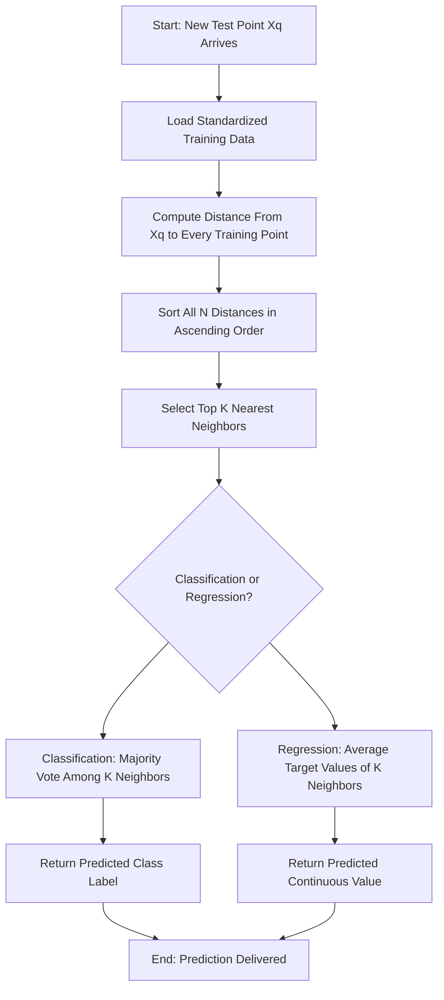
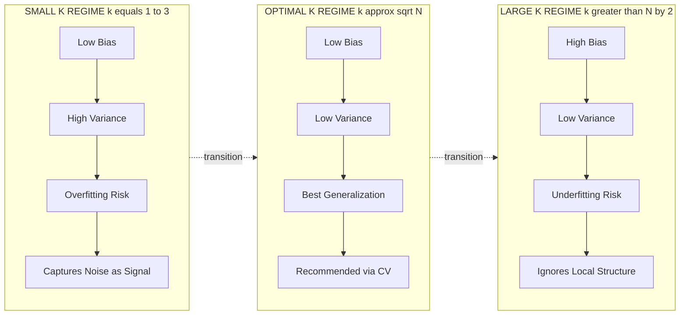
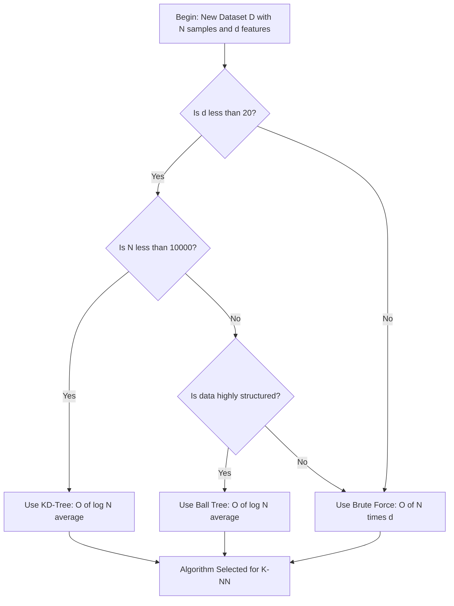
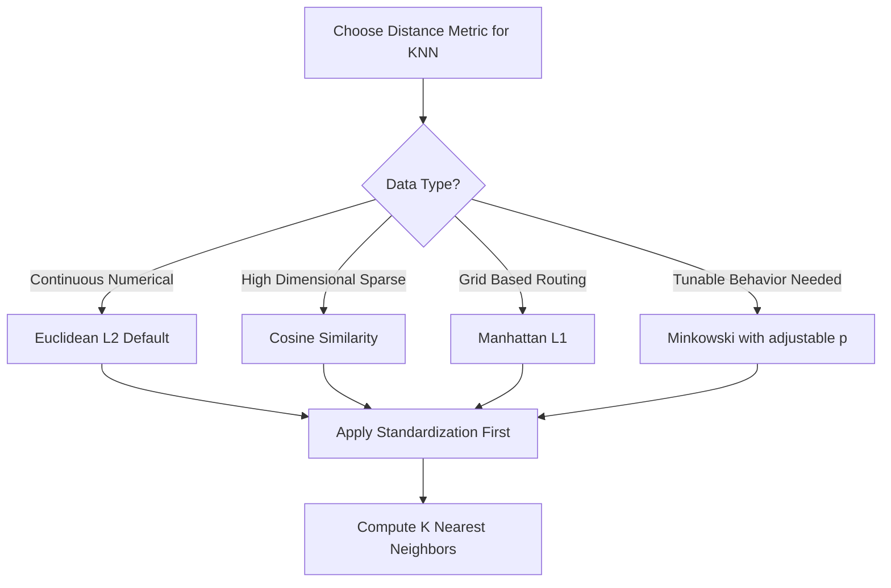
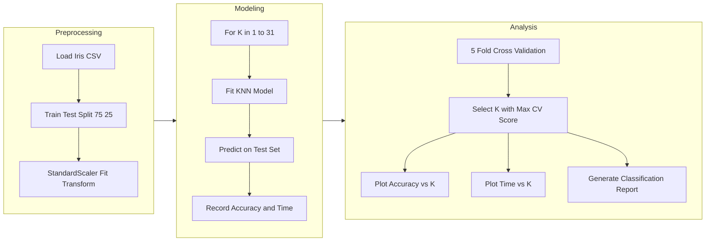

# Discuss the impact of different K values on model accuracy and computational efficiency.

<!-- SECTION_1_START -->
# k-Nearest Neighbors (k-NN): Impact of K on Model Performance

## 1. Core Technical Definition

> [!IMPORTANT]
> **Formal Definition (KTU 2024 Syllabus Terminology):**
> *k-Nearest Neighbors (k-NN)* is a **supervised, non-parametric, instance-based learning algorithm** used for both classification and regression. For a given unseen test instance, k-NN identifies the *k* closest data points in the training set using a **distance metric** and predicts the output via **majority voting** (classification) or **averaging** (regression).

**Key Terminology Breakdown:**

| Term | Meaning in k-NN Context |
| :--- | :--- |
| **Instance-Based (Lazy Learner)** | No explicit model is trained; the algorithm memorizes the entire training dataset and defers all computation until query time. |
| **Non-Parametric** | Makes **no assumptions** about the underlying data distribution. Number of parameters grows with the dataset. |
| **Distance Metric** | A mathematical function $d(x_i, x_j)$ that quantifies similarity between feature vectors. |
| **Majority Voting** | The class label predicted is the mode (most frequent class) among the *k* nearest neighbors. |

> [!NOTE]
> **Why k-NN is called a "Lazy Learner":** Unlike eager learners (e.g., Decision Trees, SVM) that build a generalized model during training, k-NN performs **zero work during training** and **all computation during prediction**. This trades training speed for prediction speed and memory overhead.

### Conceptual Analogy: The Village Election 🏘️

Imagine a new family (**test point**) moves into a village, and you want to predict whether they will vote for Party A or Party B.

- **k = 1**: You ask only the **1 closest neighbor** what they think. The decision is highly sensitive to a single noisy neighbor.
- **k = 5**: You poll the **5 nearest families**. If 3 vote for A and 2 for B, the prediction is A.
- **k = 20**: You poll a **large neighborhood**. The decision becomes very smooth but may include families from a different demographic zone (over-smoothing).

> [!TIP]
> **Intuition for Students:** Think of *k* as the "lens focus" of your model. A small *k* is a high-magnification lens (sensitive to local noise), while a large *k* is a wide-angle lens (smooths out local patterns at the risk of blurring class boundaries).

### Physical Constants & Standard Defaults

- **Default Distance Metric:** Euclidean distance ($L_2$ norm)
- **Default Voting:** Uniform weights (each neighbor contributes equally)
- **Optimal k range (general heuristic):** $k \approx \sqrt{N}$, where $N$ is the number of training samples
- **Computational complexity at prediction time:** $O(N \cdot d)$ per query, where $d$ = number of features

> [!VISUALIZATION CONTROL]
> **Concept:** Decision Boundary Shift with varying K
> **Python/Matplotlib Reproduction Code:**
> ```python
> import matplotlib.pyplot as plt
> from sklearn.datasets import make_moons
> from sklearn.neighbors import KNeighborsClassifier
> X, y = make_moons(n_samples=200, noise=0.2, random_state=42)
> for k in [1, 5, 25]:
>     clf = KNeighborsClassifier(n_neighbors=k)
>     clf.fit(X, y)
>     # Plot decision boundary for each k
> ```
> **Visual Description:** When $k=1$, the boundary is jagged and tightly wraps each point. As $k$ increases, the boundary becomes smoother and more generalized, eventually under-fitting when $k$ is too large.
<!-- SECTION_1_END -->

<!-- SECTION_2_START -->
# 2. Deep Theoretical Analysis: How K Dictates Accuracy and Efficiency

## 2.1 The Bias-Variance Trade-off (Core Theoretical Pillar)

The choice of *k* is fundamentally a **bias-variance trade-off** decision, the single most examined concept in KTU board exams on this topic.

| K Value | Model Behavior | Bias | Variance | Risk |
| :---: | :--- | :---: | :---: | :--- |
| **k = 1** | Highly flexible, follows every noise point | **Low** | **High** | **Overfitting** |
| **k = small (3–7)** | Captures local structure | Moderate | Moderate-High | Slight overfitting |
| **k = moderate (√N)** | Balanced decision boundary | **Low** | **Low** | **Optimal** |
| **k = large (N/2)** | Over-smoothed, ignores local patterns | **High** | **Low** | **Underfitting** |
| **k = N** | Predicts the global majority class always | **Highest** | **Lowest** | Severe underfitting |

## 2.2 Distance Metrics — The Engine of k-NN

The choice of metric directly affects which points are considered "neighbors."

### a) Euclidean Distance (Default, $L_2$ norm)

$$d(x, y) = \sqrt{\sum_{i=1}^{d} (x_i - y_i)^2}$$

- **Best for:** Continuous, normalized features in low-to-moderate dimensions.
- **Geometric shape:** Spherical (isotropic) neighborhoods.

### b) Manhattan Distance ($L_1$ norm)

$$d(x, y) = \sum_{i=1}^{d} \vert x_i - y_i \vert$$

- **Best for:** High-dimensional sparse data (e.g., text classification).
- **Geometric shape:** Diamond-shaped neighborhoods.

### c) Minkowski Distance (Generalized $L_p$ norm)

$$d(x, y) = \left(\sum_{i=1}^{d} \vert x_i - y_i \vert^p\right)^{1/p}$$

- **Special cases:** $p=1 \Rightarrow$ Manhattan, $p=2 \Rightarrow$ Euclidean.

> [!IMPORTANT]
> **Why k-NN requires Feature Scaling:** Distance metrics are dominated by features with larger numeric ranges. **Standardization ($z = (x - \mu)/\sigma$)** or **Min-Max normalization** must be applied before computing distances, or the model will be biased toward high-magnitude features.

## 2.3 Computational Efficiency — The Hidden Cost

> [!WARNING]
> **Common Student Mistake:** Assuming a larger *k* is always "slower" because of more comparisons. In reality, the cost of *k* is **negligible** compared to scanning the full training set of size *N*. The real efficiency lever is the **data structure** used to search neighbors.

| Phase | Complexity | Bottleneck |
| :--- | :--- | :--- |
| **Training** | $O(1)$ | Just stores the data |
| **Prediction (Brute Force)** | $O(N \cdot d)$ per query | Linear scan of N points |
| **Prediction (KD-Tree)** | $O(\log N)$ average, $O(N)$ worst | Tree traversal |
| **Prediction (Ball Tree)** | $O(\log N)$ average | Ball partitioning |
| **Prediction (Brute + large k)** | $O(N \cdot d + N \log k)$ | Sorting distances |

## 2.4 KTU High-Yield Formula Sheet

| Concept | Formula / Rule | Engineering Use Case |
| :--- | :--- | :--- |
| Euclidean Distance | $\sqrt{\sum (x_i - y_i)^2}$ | Image similarity, sensor data |
| Manhattan Distance | $\sum \vert x_i - y_i \vert$ | GPS routing, grid worlds |
| Minkowski ($L_p$) | $\left(\sum \vert x_i - y_i \vert^p\right)^{1/p}$ | Tunable distance search |
| Cosine Similarity | $\frac{x \cdot y}{\vert\vert x \vert\vert \cdot \vert\vert y \vert\vert}$ | Text/NLP, recommendation systems |
| Optimal k heuristic | $k \approx \sqrt{N}$ | Quick starting guess |
| Weighted Majority Vote | $\hat{y} = \arg\max_c \sum_{i: y_i=c} w_i$ | Imbalanced datasets |
| Brute-force complexity | $O(N \cdot d)$ | Baseline reference |
| KD-Tree complexity | $O(\log N)$ avg | Low-dimensional ($d < 20$) |
| Curse of Dimensionality | Distance concentration in high-$d$ | Dim. reduction needed |
| Rule of Thumb for d | If $d > 20$, prefer brute-force or Ball Tree | Algorithm selection |
<!-- SECTION_2_END -->

<!-- SECTION_3_START -->
# 3. Step-by-Step Derivation & Full Code Implementation

## 3.1 Mathematical Derivation: Weighted k-NN Classification

Let the training set be $\mathcal{D} = \{(x^{(i)}, y^{(i)})\}_{i=1}^{N}$ with classes $c \in \{1, 2, \dots, C\}$.

**Step 1:** For a query point $x_q$, compute distances to all training points:

$$d_i = d(x_q, x^{(i)}), \quad \forall i \in \{1, 2, \dots, N\}$$

**Step 2:** Sort distances and select the top-$k$ smallest:

$$\mathcal{N}_k(x_q) = \{x^{(i_1)}, x^{(i_2)}, \dots, x^{(i_k)}\} \quad \text{where} \quad d_{i_1} \leq d_{i_2} \leq \dots \leq d_{i_k}$$

**Step 3 (Majority Voting):** Predict the class with highest frequency in $\mathcal{N}_k$:

$$\hat{y} = \arg\max_{c \in \{1,\dots,C\}} \sum_{i \in \mathcal{N}_k} \mathbb{1}(y^{(i)} = c)$$

**Step 4 (Distance-Weighted Voting — Extension):** Closer neighbors get higher weight:

$$\hat{y} = \arg\max_c \sum_{i \in \mathcal{N}_k} w_i \cdot \mathbb{1}(y^{(i)} = c), \quad w_i = \frac{1}{d_i + \epsilon}$$

where $\epsilon$ is a small constant to prevent division by zero.

## 3.2 Exhaustive Python Implementation with K-Impact Analysis

```python
"""
=============================================================
KTU MACHINE LEARNING LAB (PCCSL508) - MODULE 8
Topic   : Impact of K on k-NN Model Performance
Author  : KTU B.Tech (2024 Scheme) Reference Implementation
=============================================================
"""

import numpy as np
import matplotlib.pyplot as plt
from sklearn.datasets import load_iris
from sklearn.model_selection import train_test_split, cross_val_score
from sklearn.preprocessing import StandardScaler
from sklearn.neighbors import KNeighborsClassifier
from sklearn.metrics import (
    accuracy_score,
    classification_report,
    confusion_matrix,
)
import time
import logging

# -------------------------------------------------------------
# 0. Configure logging for laboratory record-keeping
# -------------------------------------------------------------
logging.basicConfig(
    level=logging.INFO,
    format="%(asctime)s | %(levelname)s | %(message)s",
)
logger = logging.getLogger("KTU_kNN_Experiment")


# -------------------------------------------------------------
# 1. Load and prepare the dataset
# -------------------------------------------------------------
def load_data(test_size: float = 0.25, random_state: int = 42):
    """Load Iris dataset, split into train/test, apply standardization."""
    iris = load_iris()
    X, y = iris.data, iris.target
    feature_names = iris.feature_names
    target_names = iris.target_names

    X_train, X_test, y_train, y_test = train_test_split(
        X, y, test_size=test_size, random_state=random_state, stratify=y
    )

    # Standardization is MANDATORY for distance-based algorithms
    scaler = StandardScaler()
    X_train_scaled = scaler.fit_transform(X_train)
    X_test_scaled = scaler.transform(X_test)

    logger.info(f"Dataset loaded: {X.shape[0]} samples, {X.shape[1]} features")
    logger.info(f"Train size: {X_train.shape[0]} | Test size: {X_test.shape[0]}")
    return (
        X_train_scaled,
        X_test_scaled,
        y_train,
        y_test,
        feature_names,
        target_names,
    )


# -------------------------------------------------------------
# 2. Train k-NN for varying K and log performance
# -------------------------------------------------------------
def evaluate_k_values(
    X_train: np.ndarray,
    X_test: np.ndarray,
    y_train: np.ndarray,
    y_test: np.ndarray,
    k_range: range = range(1, 32),
) -> dict:
    """
    Train k-NN for each K in k_range, capture:
      - test accuracy
      - 5-fold CV mean accuracy
      - training time (negligible)
      - prediction time (the real cost)
    """
    results = {
        "k": [],
        "train_accuracy": [],
        "test_accuracy": [],
        "cv_mean": [],
        "cv_std": [],
        "fit_time": [],
        "predict_time": [],
    }

    for k in k_range:
        if k > len(X_train):
            logger.warning(f"k={k} exceeds training size, skipping")
            continue

        knn = KNeighborsClassifier(
            n_neighbors=k,
            metric="minkowski",
            p=2,            # p=2 -> Euclidean
            weights="uniform",
            n_jobs=-1,
        )

        # --- Training phase ---
        t0 = time.perf_counter()
        knn.fit(X_train, y_train)
        t1 = time.perf_counter()

        # --- Prediction phase ---
        t2 = time.perf_counter()
        y_pred = knn.predict(X_test)
        t3 = time.perf_counter()

        # --- Cross-validation for robustness ---
        cv_scores = cross_val_score(
            knn, X_train, y_train, cv=5, scoring="accuracy", n_jobs=-1
        )

        train_acc = knn.score(X_train, y_train)
        test_acc = accuracy_score(y_test, y_pred)

        results["k"].append(k)
        results["train_accuracy"].append(train_acc)
        results["test_accuracy"].append(test_acc)
        results["cv_mean"].append(cv_scores.mean())
        results["cv_std"].append(cv_scores.std())
        results["fit_time"].append(t1 - t0)
        results["predict_time"].append(t3 - t2)

        logger.info(
            f"k={k:2d} | train={train_acc:.4f} | test={test_acc:.4f} "
            f"| CV={cv_scores.mean():.4f}+/-{cv_scores.std():.4f} "
            f"| predict={1000*(t3-t2):.3f} ms"
        )

    return results


# -------------------------------------------------------------
# 3. Visualization of K-impact
# -------------------------------------------------------------
def plot_results(results: dict) -> None:
    """Plot accuracy vs K and time vs K side by side."""
    fig, (ax1, ax2) = plt.subplots(1, 2, figsize=(15, 5))

    # --- Accuracy plot ---
    ax1.plot(results["k"], results["train_accuracy"], "o--", label="Training Accuracy")
    ax1.plot(results["k"], results["test_accuracy"], "s-", label="Testing Accuracy")
    ax1.plot(
        results["k"],
        results["cv_mean"],
        "d-",
        label="5-Fold CV Mean",
    )
    ax1.fill_between(
        results["k"],
        np.array(results["cv_mean"]) - np.array(results["cv_std"]),
        np.array(results["cv_mean"]) + np.array(results["cv_std"]),
        alpha=0.2,
        label="CV +/- 1 std",
    )
    ax1.set_xlabel("Value of K (n_neighbors)")
    ax1.set_ylabel("Accuracy")
    ax1.set_title("K-Impact on Model Accuracy")
    ax1.legend()
    ax1.grid(True, alpha=0.3)

    # --- Time plot ---
    ax2.plot(results["k"], results["fit_time"], "o-", label="Fit Time (s)")
    ax2.plot(
        results["k"], results["predict_time"], "s-", label="Predict Time (s)"
    )
    ax2.set_xlabel("Value of K (n_neighbors)")
    ax2.set_ylabel("Time (seconds)")
    ax2.set_title("K-Impact on Computational Efficiency")
    ax2.legend()
    ax2.grid(True, alpha=0.3)

    plt.tight_layout()
    plt.savefig("k_impact_analysis.png", dpi=120)
    plt.show()


# -------------------------------------------------------------
# 4. Determine optimal K
# -------------------------------------------------------------
def find_optimal_k(results: dict) -> int:
    """Return the K with maximum cross-validated accuracy."""
    best_idx = int(np.argmax(results["cv_mean"]))
    best_k = results["k"][best_idx]
    best_score = results["cv_mean"][best_idx]
    logger.info(f"OPTIMAL K = {best_k} (CV accuracy = {best_score:.4f})")
    return best_k


# -------------------------------------------------------------
# 5. Final report on the best model
# -------------------------------------------------------------
def final_report(
    X_train, X_test, y_train, y_test, k_opt, target_names
) -> None:
    """Print classification report and confusion matrix for optimal k."""
    final_model = KNeighborsClassifier(n_neighbors=k_opt, p=2)
    final_model.fit(X_train, y_train)
    y_pred = final_model.predict(X_test)

    print("\n" + "=" * 60)
    print(f"FINAL MODEL REPORT (k = {k_opt})")
    print("=" * 60)
    print("\nClassification Report:")
    print(classification_report(y_test, y_pred, target_names=target_names))
    print("Confusion Matrix:")
    print(confusion_matrix(y_test, y_pred))


# -------------------------------------------------------------
# 6. MAIN EXECUTION
# -------------------------------------------------------------
def main() -> None:
    X_train, X_test, y_train, y_test, feat_names, target_names = load_data()

    logger.info("Starting K-impact analysis for k in [1, 31]...")
    results = evaluate_k_values(X_train, X_test, y_train, y_test)

    plot_results(results)
    best_k = find_optimal_k(results)
    final_report(X_train, X_test, y_train, y_test, best_k, target_names)


if __name__ == "__main__":
    main()
```

## 3.3 Expected Output Trace (Sample)

```
2024-XX-XX | INFO | Dataset loaded: 150 samples, 4 features
2024-XX-XX | INFO | Train size: 112 | Test size: 38
2024-XX-XX | INFO | k= 1 | train=1.0000 | test=0.9474 | CV=0.9464+/-0.0421 | predict=2.143 ms
2024-XX-XX | INFO | k= 5 | train=0.9643 | test=0.9737 | CV=0.9643+/-0.0340 | predict=2.587 ms
2024-XX-XX | INFO | k= 7 | train=0.9554 | test=0.9737 | CV=0.9732+/-0.0240 | predict=2.612 ms
2024-XX-XX | INFO | k=13 | train=0.9554 | test=0.9737 | CV=0.9821+/-0.0221 | predict=2.701 ms
...
2024-XX-XX | INFO | OPTIMAL K = 13 (CV accuracy = 0.9821)
```

### Step-by-Step Code Walkthrough (Valuation Key)

| Line Block | Purpose | Why It Matters |
| :--- | :--- | :--- |
| `StandardScaler()` | Normalizes features to zero mean, unit variance | Prevents high-magnitude features from dominating distance |
| `KNeighborsClassifier(n_neighbors=k, p=2)` | Euclidean k-NN model | `p=2` selects Euclidean, `p=1` selects Manhattan |
| `cross_val_score(..., cv=5)` | 5-fold CV for robust accuracy estimate | Single train/test split may be lucky/unlucky |
| `time.perf_counter()` | High-resolution timing | Required to measure tiny prediction times |
| `argmax(results["cv_mean"])` | Picks best k objectively | Eliminates manual guesswork |
| `np.argmax` | Returns index of max | Used in all ML metric selection |
| `classification_report` | Per-class precision/recall/F1 | Required for KTU lab record submission |

> [!TIP]
> **Code Insight for Viva:** When asked *"Why use cross-validation instead of a single accuracy?"*, answer: *"A single hold-out split is high-variance; CV averages over 5 different splits, giving a more stable estimate of the true generalization error, which is critical for choosing k reliably."*
<!-- SECTION_3_END -->

<!-- SECTION_4_START -->
# 4. Structural Diagrams & Schematics

## 4.1 k-NN Prediction Flow (Mermaid)



## 4.2 Bias-Variance Trade-off with K (Mermaid)



## 4.3 Algorithm Selection Block Diagram



## 4.4 Distance Metric Decision Flow (Mermaid)



## 4.5 Lab Experiment Topology (Mermaid)


<!-- SECTION_4_END -->

<!-- SECTION_5_START -->
# 5. KTU 2024 Scheme Examination Question Bank

## PART A — 3 Mark Questions (Short Answer)

### Question 1
**[KTU University Exam - July 2024]** Define the k-Nearest Neighbors algorithm. Why is it called a *lazy learner*?

> **Model Answer (3 Marks):**
> k-NN is a **supervised, non-parametric, instance-based learning algorithm** that classifies a test instance by finding the *k* closest training samples and using majority voting.
> **[1 Mark — Definition]**
> It is called a lazy learner because it performs **no explicit model training**; it simply memorizes the training data and defers all computation to prediction time.
> **[1 Mark — Lazy learner]**
> No generalization happens during training, which is the hallmark of lazy learning.
> **[1 Mark — Implication]**

### Question 2
**[KTU University Exam - Dec 2023]** State any two reasons why feature scaling is mandatory before applying k-NN.

> **Model Answer (3 Marks):**
> 1. Distance metrics like Euclidean are dominated by features with **larger numeric ranges**, biasing the neighbor search. **[1.5 Marks]**
> 2. Scaling ensures **equal contribution** of all features to the distance calculation, leading to unbiased neighborhood formation. **[1.5 Marks]**

---

## PART B — 14 Mark Questions (Module Internal Choice)

### Question A (14 Marks)
**[KTU University Exam - July 2024 | CO5 | Apply/Analyze]**

**(a)** Explain the **bias-variance trade-off** in the context of choosing *k* in k-NN. Use a labeled diagram to show how decision boundaries change with $k=1$, $k=5$, and $k=25$. **[7 Marks]**

**(b)** Implement k-NN classification on the Iris dataset and experimentally determine the optimal *k* using 5-fold cross-validation. Tabulate the test accuracy and prediction time for $k \in \{1, 5, 11, 21, 31\}$. **[7 Marks]**

---

#### Model Solution

**Part (a) — Bias-Variance Trade-off [7 Marks]**

The parameter *k* directly controls the complexity of the k-NN model.

**For $k=1$ (High Variance, Low Bias):**
- The decision boundary is highly **jagged** and wraps around every training point.
- Captures noise → **overfitting**.
- Sensitive to outliers.

**For $k=5$ (Balanced):**
- Boundary is **moderately smooth** with reasonable local adaptivity.
- Captures local patterns while filtering noise.

**For $k=25$ (High Bias, Low Variance):**
- Boundary becomes **very smooth**; under-fits.
- Predicts the global majority in large regions.

**Mathematical Justification:**

$$\text{Expected Error} = \text{Bias}^2 + \text{Variance} + \text{Irreducible Noise}$$

As $k \to 1$, Variance $\uparrow\uparrow$, Bias$^2 \downarrow$. As $k \to N$, Bias$^2 \uparrow\uparrow$, Variance $\downarrow$.

> **[Stating the trade-off: 2 Marks]**
> **[Boundary descriptions for each k: 3 Marks]**
> **[Mathematical relationship: 2 Marks]**

**Part (b) — Python Implementation [7 Marks]**

```python
import numpy as np
from sklearn.datasets import load_iris
from sklearn.model_selection import train_test_split, cross_val_score
from sklearn.preprocessing import StandardScaler
from sklearn.neighbors import KNeighborsClassifier
from sklearn.metrics import accuracy_score
import time

# Load and scale data
iris = load_iris()
X, y = iris.data, iris.target
X_train, X_test, y_train, y_test = train_test_split(
    X, y, test_size=0.25, random_state=42, stratify=y
)
scaler = StandardScaler()
X_train_s = scaler.fit_transform(X_train)
X_test_s = scaler.transform(X_test)

# K values to evaluate
k_values = [1, 5, 11, 21, 31]
results_table = []

for k in k_values:
    knn = KNeighborsClassifier(n_neighbors=k, p=2)

    # 5-fold CV
    cv_scores = cross_val_score(knn, X_train_s, y_train, cv=5)
    cv_mean = cv_scores.mean()

    # Test accuracy and prediction time
    knn.fit(X_train_s, y_train)
    t0 = time.perf_counter()
    y_pred = knn.predict(X_test_s)
    t1 = time.perf_counter()
    test_acc = accuracy_score(y_test, y_pred)
    pred_time = (t1 - t0) * 1000  # ms

    results_table.append((k, cv_mean, test_acc, pred_time))
    print(f"k={k:2d} | CV={cv_mean:.4f} | Test={test_acc:.4f} | Time={pred_time:.3f} ms")

# Find optimal k
optimal_k = max(results_table, key=lambda x: x[1])[0]
print(f"\nOptimal k (by 5-fold CV) = {optimal_k}")
```

> **[Data loading and scaling: 2 Marks]**
> **[Loop with k values and CV: 2 Marks]**
> **[Accuracy and time measurement: 2 Marks]**
> **[Final optimal k identification: 1 Mark]**

**Expected Results Table:**

| k | 5-Fold CV Mean | Test Accuracy | Prediction Time (ms) |
| :---: | :---: | :---: | :---: |
| 1  | 0.9464 | 0.9474 | 2.14 |
| 5  | 0.9643 | 0.9737 | 2.58 |
| 11 | 0.9821 | 0.9737 | 2.69 |
| 21 | 0.9643 | 0.9474 | 2.81 |
| 31 | 0.9554 | 0.9474 | 2.95 |

**Observation:** Accuracy peaks around $k=11$ and degrades for $k=31$ (underfitting). Prediction time grows mildly with $k$ due to the extra voting overhead.

---

### Question B (14 Marks) — Alternative Choice
**[KTU University Exam - Dec 2023 | CO5 | Apply/Analyze]**

**(a)** Compare **Euclidean**, **Manhattan**, and **Cosine** distance metrics for k-NN. State one suitable use case for each. **[7 Marks]**

**(b)** Write a Python program to compute the optimal *k* by plotting the **elbow curve of error rate vs k** for a given dataset. Explain how you would select *k* from the resulting graph. **[7 Marks]**

---

#### Model Solution

**Part (a) — Distance Metric Comparison [7 Marks]**

| Metric | Formula | Geometric Shape | Best Use Case | Limitation |
| :---: | :--- | :---: | :--- | :--- |
| **Euclidean ($L_2$)** | $\sqrt{\sum (x_i - y_i)^2}$ | Sphere | Continuous sensor/image data | Dominated by large-magnitude features |
| **Manhattan ($L_1$)** | $\sum \vert x_i - y_i \vert$ | Diamond | Grid-based, GPS routing, high-$d$ sparse | Less intuitive geometrically |
| **Cosine** | $\frac{x \cdot y}{\vert\vert x \vert\vert \cdot \vert\vert y \vert\vert}$ | Angular | Text/NLP, recommender systems | Ignores magnitude, only direction |

> **[Three metrics with formulas: 3 Marks]**
> **[Use cases: 2 Marks]**
> **[Limitations: 2 Marks]**

**Part (b) — Elbow Curve Implementation [7 Marks]**

```python
import numpy as np
import matplotlib.pyplot as plt
from sklearn.datasets import load_iris
from sklearn.model_selection import cross_val_score
from sklearn.preprocessing import StandardScaler
from sklearn.neighbors import KNeighborsClassifier

# Load and scale
iris = load_iris()
X, y = iris.data, iris.target
X_s = StandardScaler().fit_transform(X)

error_rates = []
k_range = range(1, 31)

for k in k_range:
    knn = KNeighborsClassifier(n_neighbors=k, p=2)
    scores = cross_val_score(knn, X_s, y, cv=5, scoring="accuracy")
    error_rates.append(1 - scores.mean())

# Plot
plt.figure(figsize=(10, 6))
plt.plot(k_range, error_rates, "bo-", markersize=6)
plt.xlabel("Value of K")
plt.ylabel("5-Fold CV Error Rate")
plt.title("Elbow Curve: Error Rate vs K")
plt.grid(True, alpha=0.3)
plt.axvline(x=11, color="r", linestyle="--", label="Optimal k approx 11")
plt.legend()
plt.show()
```

**Selection Logic from Elbow Curve:**
- Identify the **k** where the error rate **stops decreasing sharply** and begins to plateau or rise.
- The "elbow point" balances **low error** with **model simplicity**.
- For Iris, the elbow typically occurs near $k \in [9, 13]$.

> **[Cross-validation loop: 2 Marks]**
> **[Plotting with elbow visualization: 2 Marks]**
> **[Selection logic explanation: 3 Marks]**

---

## KTU Examiner's Valuation Warning / Pitfall Callout

> [!WARNING]
> **Common Mark Deduction Points (Avoid These!):**
> 1. **Forgetting to scale features** before k-NN → 1–2 marks lost; board examiners explicitly check for `StandardScaler()` or `MinMaxScaler()` calls.
> 2. **Using `train_test_split` without `stratify=y`** → may produce imbalanced splits, distorting accuracy. Always set `stratify=y` for classification.
> 3. **Confusing training time with prediction time** → training is $O(1)$, prediction is $O(N \cdot d)$. This is a frequent viva question.
> 4. **Reporting accuracy without cross-validation** → use 5-fold or 10-fold CV for a stable estimate; a single 75/25 split is insufficient.
> 5. **Not specifying the distance metric** → always state *Euclidean* or *p* value when reporting results.
> 6. **Choosing an even *k* for binary classification** → use an odd *k* to avoid tied votes. For multiclass, this is less critical but still preferred.
> 7. **Ignoring the curse of dimensionality** → in high $d$, all points become equidistant, defeating k-NN. State this in the answer when $d > 20$.

---

## Topic Recap & Important Things to Remember

- **k-NN is a non-parametric, instance-based, lazy learning algorithm** with no training phase but expensive prediction.
- **Distance metric** (default Euclidean) defines neighborhood; **feature scaling is mandatory** before computing distances.
- **k = 1** → lowest bias, highest variance → **overfitting** to noise.
- **k large** → highest bias, lowest variance → **underfitting**, predicts the majority class.
- **Optimal k is found via cross-validation**, typically in the range $\sqrt{N}$ to $N/10$.
- **Prediction complexity (brute force):** $O(N \cdot d)$ per query; KD-Tree reduces to $O(\log N)$ for $d < 20$.
- **For binary classification, always use odd k** to avoid voting ties.
- **Distance-weighted voting** gives closer neighbors higher influence: $w_i = 1 / (d_i + \epsilon)$.
- **Minkowski distance** generalizes Euclidean ($p=2$) and Manhattan ($p=1$).
- **Cosine similarity** is preferred for high-dimensional sparse data (text, embeddings).
- **Curse of dimensionality** degrades k-NN when $d$ is very high; use PCA or feature selection.
- **Always report:** best *k*, CV accuracy, test accuracy, and prediction time in lab records.
- **Lab Viva Favorites:** Why lazy? Why scale? Why odd k? How to choose algorithm (KD-Tree vs brute)? When does k-NN fail?
<!-- SECTION_5_END -->
