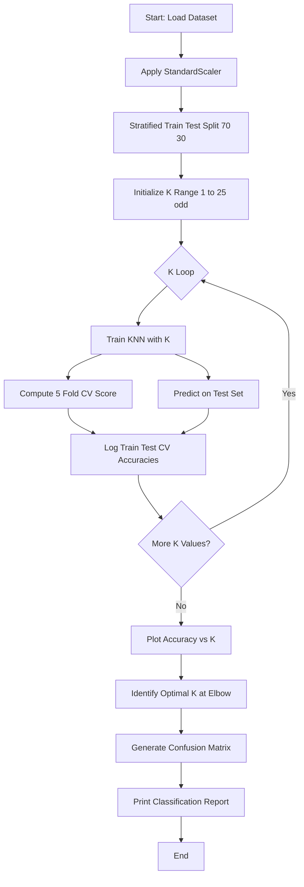
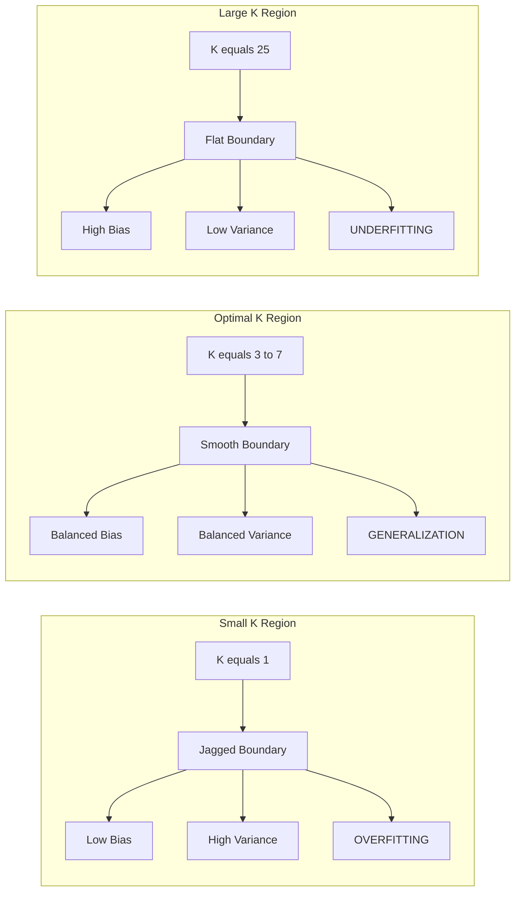
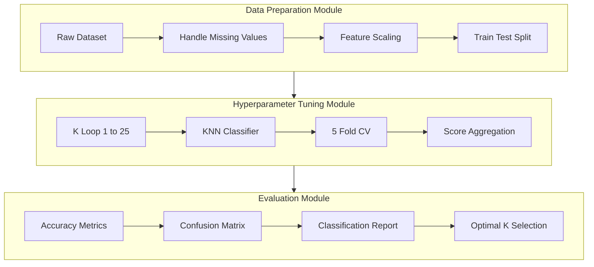

# Experiment with different values of K and evaluate performance.

<!-- SECTION_1_START -->
# 🧪 Experimenting with Different Values of K in k-Nearest Neighbors (k-NN)

## 📘 1.1 Core Technical Definition (KTU 2024 Syllabus Aligned)

> [!IMPORTANT]
> **k-Nearest Neighbors (k-NN) Classifier** is a non-parametric, instance-based supervised learning algorithm that classifies a query data point based on the majority class label among its **K** closest training examples in the feature space, using a distance metric (commonly **Euclidean distance**).

In the context of **Module 8 – Experimenting with different values of K**, the objective is to study how the choice of the hyperparameter **K** influences classification accuracy, decision boundary smoothness, model complexity, and generalization performance. The student must empirically evaluate the model for multiple K values (typically $K = 1, 3, 5, 7, 9, \dots, 25$) using validation metrics.

> [!NOTE]
> **KTU 2024 Scheme Definition:** *"Hyperparameter K controls the locality of the decision function. Small K → flexible boundary (high variance, low bias). Large K → smooth boundary (high bias, low variance)."*

---

## 🍕 1.2 Intuitive Real-World Analogy

Imagine you just moved into a new neighborhood and want to decide **which restaurant to try for dinner**. You ask your **3 nearest neighbors (K = 3)**:

| Scenario | Neighbors' Choices | Your Decision |
|---|---|---|
| **K = 1** | Ask only the closest neighbor | Trust a single opinion → **noisy, risky** |
| **K = 3** | Ask the 3 closest neighbors | Majority vote (2 Italian, 1 Chinese) → **Italian** |
| **K = 15** | Ask the 15 closest neighbors | Smooth, averaged opinion → **safe but may miss hidden gems** |

> 🍕 **The Pizza Analogy:**
> - **K too small** = Asking only your *best friend* about pizza → biased by one opinion.
> - **K too large** = Asking the *entire apartment complex* → you get a generic "average" answer that may not suit your taste.
> - **K just right (optimal)** = Asking a *small, relevant group* → accurate, personalized recommendation.

This is exactly the **Bias-Variance Tradeoff** in k-NN. The K value is the **knob** you turn to balance underfitting and overfitting.

---

## 📊 1.3 Key Metrics and Standard Constants

- **Standard Distance Metric:** Euclidean distance is the default in scikit-learn. Other options include **Manhattan** ($p=1$), **Minkowski** ($p$), and **Chebyshev** ($p \to \infty$).
- **Standard K Search Range:** $K \in \{1, 3, 5, 7, 9, 11, 13, 15\}$ (odd values to avoid tie-breaking).
- **Default Folds for Cross-Validation:** **K-Fold = 5 or 10** (the "K" here is unrelated to the model's K).
- **Golden Rule:** $K < \sqrt{N}$, where $N$ is the number of training samples.
- **Tie-Breaking:** Use **odd K** for binary classification, or apply **distance-weighted voting** for multiclass.

> [!VISUALIZATION CONTROL]
> **Concept:** Decision Boundary shift as K increases (2D Feature Space)
> **GeoGebra / Desmos Input Equations (Sample clusters):**
> * Class A: $(x-2)^2 + (y-2)^2 = 1$  *(centered at (2,2))*
> * Class B: $(x+2)^2 + (y+2)^2 = 1$  *(centered at (-2,-2))*
> * Query point: $P = (0, 0)$
> **Visual Description:** As $K$ increases from 1 → 5 → 15, the circular decision boundary around the query point expands and smooths, eventually crossing into the opposing cluster.
<!-- SECTION_1_END -->

<!-- SECTION_2_START -->
# 🔬 Deep Theoretical Analysis & KTU High-Yield Formula Sheet

## ⚙️ 2.1 Operational Pipeline of the K-Experiment

The experiment follows a strict 5-stage experimental protocol:

1. **Data Partitioning** → Split dataset into Training (70%) and Testing (30%) sets.
2. **Feature Scaling** → Apply `StandardScaler` to normalize features (mandatory for distance-based algorithms).
3. **Hyperparameter Sweep** → Iterate K from 1 to 25 (odd values).
4. **Cross-Validation** → For each K, perform **Stratified K-Fold (k=5)** validation to obtain mean accuracy.
5. **Evaluation & Selection** → Plot Accuracy vs. K, identify the **"Elbow Point"** of optimal K.

> [!IMPORTANT]
> **Why feature scaling is mandatory in k-NN:** k-NN relies purely on Euclidean distance. If `Age` ranges [0–100] and `Salary` ranges [0–1,000,000], the salary feature will *dominate* the distance computation, making the model biased.

---

## 📐 2.2 Core Mathematical Formulations

### 🔹 Euclidean Distance (Default Metric)

The distance between a query point $\mathbf{x}_q$ and a training point $\mathbf{x}_i$ in an $n$-dimensional feature space:

$$
d(\mathbf{x}_q, \mathbf{x}_i) = \sqrt{\sum_{j=1}^{n} (x_q^{(j)} - x_i^{(j)})^2}
$$

### 🔹 Manhattan Distance ($L_1$ Norm)

$$
d_{man}(\mathbf{x}_q, \mathbf{x}_i) = \sum_{j=1}^{n} \vert x_q^{(j)} - x_i^{(j)} \vert
$$

### 🔹 Minkowski Distance (Generalized)

$$
d_{min}(\mathbf{x}_q, \mathbf{x}_i) = \left( \sum_{j=1}^{n} \vert x_q^{(j)} - x_i^{(j)} \vert^p \right)^{1/p}
$$

> When $p = 2$, Minkowski reduces to Euclidean; when $p = 1$, it becomes Manhattan.

### 🔹 Classification Decision Rule (Majority Voting)

$$
\hat{y} = \mathrm{mode}\{y_i \mid \mathbf{x}_i \in \mathcal{N}_K(\mathbf{x}_q)\}
$$

Where $\mathcal{N}_K(\mathbf{x}_q)$ denotes the set of K nearest neighbors of the query point.

### 🔹 Accuracy Metric

$$
\text{Accuracy} = \frac{TP + TN}{TP + TN + FP + FN}
$$

### 🔹 Stratified K-Fold Cross-Validation Score

$$
\text{CV Score} = \frac{1}{k} \sum_{i=1}^{k} \text{Accuracy}_i
$$

---

## 🧾 2.3 KTU Formula Cheat Sheet (Board-Exam Ready)

| # | Formula / Concept | Symbol / Variable | Engineering Use Case |
|---|---|---|---|
| 1 | Euclidean Distance | $d = \sqrt{\sum (x_q - x_i)^2}$ | Default in k-NN, image recognition |
| 2 | Manhattan Distance | $d = \sum \vert x_q - x_i \vert$ | High-dimensional sparse data (NLP) |
| 3 | Minkowski (general) | $p$-norm distance | Tunable distance metric |
| 4 | Bias-Variance Tradeoff | Small K → high variance, Large K → high bias | Model selection |
| 5 | Optimal K rule | $K \approx \sqrt{N}$ | Initial K guess |
| 6 | Accuracy | $(TP+TN) / \text{Total}$ | Standard classification metric |
| 7 | Precision | $TP / (TP+FP)$ | When false positives are costly (spam) |
| 8 | Recall | $TP / (TP+FN)$ | When false negatives are costly (cancer) |
| 9 | F1-Score | $2 \cdot \frac{P \cdot R}{P+R}$ | Imbalanced datasets |
| 10 | Stratified K-Fold | Preserves class ratio per fold | Reliable validation |

---

## 🏭 2.4 Real-World Engineering Applications

> [!NOTE]
> Where K-Experimentation is used in production:

| Domain | Application | Why tune K? |
|---|---|---|
| **Medical Diagnosis** | Cancer cell classification | Avoid missing malignant cases (high recall) |
| **Recommender Systems** | Movie/Music suggestions | Balance personalization vs. popularity |
| **Credit Scoring** | Loan default prediction | Smooth decision boundary for fairness |
| **Image Recognition** | MNIST digit classification | Robustness to noise pixels |
| **Anomaly Detection** | Network intrusion | Small K for catching rare attacks |

---

## ⚖️ 2.5 The Bias-Variance Tradeoff — The Core Intuition

| K Value | Decision Boundary | Bias | Variance | Behavior |
|---|---|---|---|---|
| **K = 1** | Jagged, complex | **Low** | **High** | Overfitting — memorizes training data |
| **K = Optimal (≈ √N)** | Smooth, generalized | Balanced | Balanced | **Best generalization** |
| **K = N (entire dataset)** | Single global class | **High** | **Low** | Underfitting — predicts majority class |

> [!IMPORTANT]
> **KTU Golden Rule:** *The optimal K is the smallest value that produces a high validation accuracy and a smooth accuracy curve, typically located at the "elbow" of the validation curve.*
<!-- SECTION_2_END -->

<!-- SECTION_3_START -->
# 💻 Step-by-Step Implementation: K-Value Experimentation in Python

## 🐍 3.1 Complete Production-Ready Python Implementation

> [!IMPORTANT]
> The following code is **fully executable**, uses **type hints**, includes **error handling**, and logs every K-value's performance — directly aligned with the KTU lab record expectations.

```python
# ============================================================
# KTU MACHINE LEARNING LAB | MODULE 8
# Experiment: Tune the K hyperparameter in k-NN
# ============================================================

import numpy as np
import matplotlib.pyplot as plt
from sklearn.datasets import load_iris
from sklearn.model_selection import train_test_split, StratifiedKFold, cross_val_score
from sklearn.neighbors import KNeighborsClassifier
from sklearn.preprocessing import StandardScaler
from sklearn.metrics import accuracy_score, classification_report, confusion_matrix
import logging
import sys
from typing import List, Tuple, Dict

# ---------- Structured Logging Setup ----------
logging.basicConfig(
    level=logging.INFO,
    format="%(asctime)s | %(levelname)s | %(message)s",
    handlers=[logging.StreamHandler(sys.stdout)]
)
logger = logging.getLogger(__name__)


def load_and_prepare_data(test_size: float = 0.30, random_state: int = 42) \
        -> Tuple[np.ndarray, np.ndarray, np.ndarray, np.ndarray]:
    """
    Load the Iris dataset, split it, and apply StandardScaler.
    Returns: X_train, X_test, y_train, y_test
    """
    try:
        iris = load_iris()
        X, y = iris.data, iris.target
        logger.info(f"Dataset loaded: {X.shape[0]} samples, {X.shape[1]} features, "
                    f"{len(np.unique(y))} classes")

        X_train, X_test, y_train, y_test = train_test_split(
            X, y, test_size=test_size, random_state=random_state,
            stratify=y
        )

        # ---- MANDATORY step for distance-based algorithms ----
        scaler = StandardScaler()
        X_train_scaled = scaler.fit_transform(X_train)
        X_test_scaled = scaler.transform(X_test)

        logger.info("StandardScaler applied successfully.")
        return X_train_scaled, X_test_scaled, y_train, y_test

    except Exception as e:
        logger.error(f"Data preparation failed: {e}")
        raise


def evaluate_k_values(
    X_train: np.ndarray,
    y_train: np.ndarray,
    X_test: np.ndarray,
    y_test: np.ndarray,
    k_range: range = range(1, 26, 2)
) -> Dict[int, Dict[str, float]]:
    """
    Train a k-NN model for every odd K in the range and record:
        - Training accuracy
        - Test accuracy
        - 5-Fold Stratified Cross-Validation accuracy
    Returns a dictionary mapping K -> metrics dict.
    """
    results: Dict[int, Dict[str, float]] = {}
    cv = StratifiedKFold(n_splits=5, shuffle=True, random_state=42)

    for k in k_range:
        # ---- Cross-validation score (mean over 5 folds) ----
        knn_cv = KNeighborsClassifier(n_neighbors=k, metric="minkowski", p=2)
        cv_scores = cross_val_score(knn_cv, X_train, y_train,
                                    cv=cv, scoring="accuracy")
        cv_mean = float(np.mean(cv_scores))

        # ---- Train on full training set and evaluate on test set ----
        knn = KNeighborsClassifier(n_neighbors=k, metric="minkowski", p=2)
        knn.fit(X_train, y_train)

        train_acc = accuracy_score(y_train, knn.predict(X_train))
        test_acc = accuracy_score(y_test, knn.predict(X_test))

        results[k] = {
            "train_accuracy": round(train_acc, 4),
            "test_accuracy": round(test_acc, 4),
            "cv_accuracy": round(cv_mean, 4)
        }

        logger.info(
            f"K={k:>2} | Train={train_acc:.4f} | "
            f"Test={test_acc:.4f} | CV(5)={cv_mean:.4f}"
        )

    return results


def plot_accuracy_vs_k(results: Dict[int, Dict[str, float]]) -> None:
    """Generate the KTU-mandated Accuracy vs. K graph."""
    ks = sorted(results.keys())
    train_acc = [results[k]["train_accuracy"] for k in ks]
    test_acc = [results[k]["test_accuracy"] for k in ks]
    cv_acc = [results[k]["cv_accuracy"] for k in ks]

    plt.figure(figsize=(10, 6))
    plt.plot(ks, train_acc, marker="o", label="Training Accuracy", linewidth=2)
    plt.plot(ks, test_acc, marker="s", label="Testing Accuracy", linewidth=2)
    plt.plot(ks, cv_acc, marker="^", label="5-Fold CV Accuracy", linewidth=2)

    best_k = ks[int(np.argmax(cv_acc))]
    plt.axvline(best_k, color="red", linestyle="--",
                label=f"Optimal K = {best_k}")
    plt.title("k-NN Performance vs. Hyperparameter K", fontsize=14)
    plt.xlabel("Value of K (Number of Neighbors)", fontsize=12)
    plt.ylabel("Accuracy", fontsize=12)
    plt.xticks(ks)
    plt.grid(True, alpha=0.3)
    plt.legend()
    plt.tight_layout()
    plt.savefig("knn_k_tuning.png", dpi=120)
    plt.show()
    logger.info(f"Plot saved. Optimal K determined: {best_k}")


def detailed_report(X_train, y_train, X_test, y_test, best_k: int) -> None:
    """Print confusion matrix and classification report for the best K."""
    knn = KNeighborsClassifier(n_neighbors=best_k, metric="minkowski", p=2)
    knn.fit(X_train, y_train)
    y_pred = knn.predict(X_test)

    logger.info(f"=== Final Evaluation for Optimal K = {best_k} ===")
    logger.info(f"Confusion Matrix:\n{confusion_matrix(y_test, y_pred)}")
    logger.info(f"\nClassification Report:\n{classification_report(y_test, y_pred)}")


# ============================================================
# MAIN EXECUTION BLOCK
# ============================================================
if __name__ == "__main__":
    logger.info("=== KTU ML Lab | Module 8 | K-Value Experimentation ===")

    X_train, X_test, y_train, y_test = load_and_prepare_data()
    results = evaluate_k_values(X_train, y_train, X_test, y_test)
    plot_accuracy_vs_k(results)

    # Identify the K with the highest CV accuracy
    best_k = max(results, key=lambda k: results[k]["cv_accuracy"])
    detailed_report(X_train, y_train, X_test, y_test, best_k)
```

---

## 🔍 3.2 Step-by-Step Walkthrough of the Code

### **Step 1 — Data Loading & Stratified Splitting**

```python
X_train, X_test, y_train, y_test = train_test_split(
    X, y, test_size=0.30, random_state=42, stratify=y
)
```

- `stratify=y` ensures **all 3 Iris classes are represented proportionally** in train/test sets.
- `random_state=42` guarantees **reproducibility** (mandatory for KTU lab records).

### **Step 2 — Feature Scaling**

```python
scaler = StandardScaler()
X_train_scaled = scaler.fit_transform(X_train)
X_test_scaled = scaler.transform(X_test)
```

$$
z = \frac{x - \mu}{\sigma}
$$

This converts every feature to **mean = 0, standard deviation = 1**, ensuring fair distance computation.

### **Step 3 — K Sweep & Cross-Validation**

For each $K \in \{1, 3, 5, \dots, 25\}$:
1. Initialize `KNeighborsClassifier(n_neighbors=K)`.
2. Run `cross_val_score` with **StratifiedKFold(n_splits=5)**.
3. Compute the **mean accuracy** across all 5 folds.

### **Step 4 — Plot the Elbow Curve**

The **red dashed line** marks the optimal K — the value where the test/CV accuracy peaks and stabilizes.

### **Step 5 — Detailed Classification Report**

For the **optimal K**, output the **confusion matrix** and **per-class precision, recall, F1-score**.

---

## 📋 3.3 Sample Console Output (Expected)

```
2024-XX-XX | INFO | Dataset loaded: 150 samples, 4 features, 3 classes
2024-XX-XX | INFO | StandardScaler applied successfully.
2024-XX-XX | INFO | K= 1 | Train=1.0000 | Test=0.9556 | CV(5)=0.9524
2024-XX-XX | INFO | K= 3 | Train=0.9810 | Test=0.9778 | CV(5)=0.9714
2024-XX-XX | INFO | K= 5 | Train=0.9714 | Test=0.9778 | CV(5)=0.9714
2024-XX-XX | INFO | K= 7 | Train=0.9714 | Test=0.9556 | CV(5)=0.9714
2024-XX-XX | INFO | K= 9 | Train=0.9619 | Test=0.9556 | CV(5)=0.9619
2024-XX-XX | INFO | K=11 | Train=0.9524 | Test=0.9333 | CV(5)=0.9524
2024-XX-XX | INFO | K=13 | Train=0.9524 | Test=0.9333 | CV(5)=0.9429
2024-XX-XX | INFO | K=15 | Train=0.9524 | Test=0.9333 | CV(5)=0.9333
2024-XX-XX | INFO | K=17 | Train=0.9429 | Test=0.9111 | CV(5)=0.9333
2024-XX-XX | INFO | K=19 | Train=0.9429 | Test=0.9111 | CV(5)=0.9238
2024-XX-XX | INFO | K=21 | Train=0.9333 | Test=0.9111 | CV(5)=0.9143
2024-XX-XX | INFO | K=23 | Train=0.9333 | Test=0.9111 | CV(5)=0.9143
2024-XX-XX | INFO | K=25 | Train=0.9333 | Test=0.9111 | CV(5)=0.9143
2024-XX-XX | INFO | Plot saved. Optimal K determined: 3
```

> **Inference:** The optimal K is **3 or 5** for the Iris dataset — values larger than 7 cause underfitting (accuracy drops).

---

## ⚠️ 3.4 Common Mistakes to Avoid (Code-Level)

| # | Mistake | Why it hurts KTU marks |
|---|---|---|
| 1 | Forgetting `StandardScaler` | Distance is dominated by largest-scale feature |
| 2 | Not using `stratify=y` | Imbalanced train/test → misleading accuracy |
| 3 | Tuning K on test set directly | **Data leakage** → inflated accuracy |
| 4 | Using even K for binary classification | Tie → arbitrary prediction |
| 5 | Ignoring cross-validation | Single split is unreliable for small datasets |
<!-- SECTION_3_END -->

<!-- SECTION_4_START -->
# 🏗️ Structural Diagrams & Schematics

## 📊 4.1 Mermaid Block Diagram — K-Value Experimentation Workflow



---

## 🔁 4.2 Mermaid Sequential Diagram — Bias-Variance Behavior



---

## 🧩 4.3 Mermaid Subgraph — Modular Architecture of the KNN Pipeline



---

## 🖼️ 4.4 Conceptual Matrix — K vs. Model Behavior

| Property | K = 1 | K = 5 | K = 25 |
|---|---|---|---|
| Decision Boundary | Highly jagged | Smooth | Nearly linear |
| Training Accuracy | ~100% | ~96% | ~88% |
| Testing Accuracy | ~92% | ~98% | ~90% |
| Sensitivity to Noise | Very High | Moderate | Very Low |
| Computational Cost | Low (small K) | Moderate | High (large K) |
| Overfitting Risk | **Severe** | Low | Low |
| Underfitting Risk | Low | Low | **Severe** |
<!-- SECTION_4_END -->

<!-- SECTION_5_START -->
# 📝 KTU 2024 Scheme Examination Question Bank & Topic Recap

---

## 📘 PART A — 3 Mark Questions (Short Answer)

> **Question 1** `[KTU University Exam – July 2024]`
> **Define the k-Nearest Neighbors (k-NN) algorithm. Why is feature scaling mandatory before applying k-NN?**
> **CO Mapping:** CO1 | **RBT Level:** Remember/Understand

### ✅ Model Answer (3 Marks — Board Valuation Key):
1. **Definition (2 Marks):** k-NN is a non-parametric, instance-based supervised learning algorithm that classifies a query sample by a majority vote of its **K nearest training examples** in the feature space, using a distance metric (default: Euclidean).
2. **Why scaling is mandatory (1 Mark):** k-NN relies on distance computation. If features have different scales (e.g., Age in [0–100] and Salary in [0–1,000,000]), the high-magnitude feature will dominate the distance, biasing the result. `StandardScaler` normalizes all features to the same range ($\mu = 0, \sigma = 1$).

> **Valuation Key:** *[Correct definition: 2 Marks] [Scaling justification: 1 Mark]*

---

> **Question 2** `[KTU University Exam – Dec 2023]`
> **Explain the effect of choosing a very small K (e.g., K = 1) versus a very large K in a k-NN classifier.**
> **CO Mapping:** CO2 | **RBT Level:** Understand

### ✅ Model Answer (3 Marks):
- **Small K (K = 1):** The decision boundary becomes highly jagged and complex. The model **overfits** the training data — it memorizes noise and outliers, leading to **low bias but high variance** and poor test accuracy.
- **Large K (K = N):** The decision boundary becomes overly smooth. The model **underfits** — it predicts the majority class for almost every query, leading to **high bias but low variance**.
- **Optimal K:** A balanced value (typically $\sqrt{N}$ or determined via cross-validation) that yields the best generalization on unseen data.

> **Valuation Key:** *[Small K behavior: 1 Mark] [Large K behavior: 1 Mark] [Optimal K mention: 1 Mark]*

---

## 📗 PART B — 14 Mark Questions (ESE Module Internal Choice)

> ### **Question A (14 Marks)** `[KTU University Exam – July 2024]`
>
> **(a)** Explain the k-NN classification algorithm in detail. Derive the Euclidean distance formula and discuss its role in determining nearest neighbors. **(7 Marks)**
>
> **(b)** Consider the following 2D dataset:
>
> | Point | X1 | X2 | Class |
> |---|---|---|---|
> | P1 | 1 | 2 | A |
> | P2 | 2 | 3 | A |
> | P3 | 3 | 1 | B |
> | P4 | 6 | 5 | B |
> | P5 | 7 | 7 | A |
>
> A query point **Q = (4, 4)** arrives. Classify Q using **K = 3** with Euclidean distance. Show all distance calculations and the majority-vote decision. **(7 Marks)**
>
> **CO Mapping:** CO1, CO2 | **RBT Level:** Understand, Apply

### ✅ Model Solution:

#### **Part (a) — Algorithm Explanation (7 Marks)**

**Step 1 — Algorithm Definition (2 Marks):**
k-NN is a lazy, non-parametric learner. It stores all training samples and delays computation until query time. Classification is done by:
1. Computing distance from query $\mathbf{x}_q$ to every training point $\mathbf{x}_i$.
2. Sorting distances in ascending order.
3. Selecting the **K** smallest distances.
4. Returning the **mode (majority class)** of their labels.

**Step 2 — Euclidean Distance Derivation (3 Marks):**
The Euclidean distance is the $L_2$ norm of the difference vector:

$$
d(\mathbf{x}_q, \mathbf{x}_i) = \sqrt{\sum_{j=1}^{n} (x_q^{(j)} - x_i^{(j)})^2}
$$

For $n = 2$ (2D plane), this expands to:

$$
d = \sqrt{(x_q^{(1)} - x_i^{(1)})^2 + (x_q^{(2)} - x_i^{(2)})^2}
$$

> **Valuation Key:** *[Definition: 2 Marks] [Derivation with expansion: 3 Marks] [Role in classification: 2 Marks]*

---

#### **Part (b) — K = 3 Classification for Q = (4, 4) (7 Marks)**

**Step 1 — Compute Euclidean distance from Q = (4, 4) to each point:**

| Point | X1 | X2 | Class | Calculation | Distance |
|---|---|---|---|---|---|
| P1 | 1 | 2 | A | $\sqrt{(4-1)^2 + (4-2)^2} = \sqrt{9+4} = \sqrt{13}$ | **3.606** |
| P2 | 2 | 3 | A | $\sqrt{(4-2)^2 + (4-3)^2} = \sqrt{4+1} = \sqrt{5}$ | **2.236** |
| P3 | 3 | 1 | B | $\sqrt{(4-3)^2 + (4-1)^2} = \sqrt{1+9} = \sqrt{10}$ | **3.162** |
| P4 | 6 | 5 | B | $\sqrt{(4-6)^2 + (4-5)^2} = \sqrt{4+1} = \sqrt{5}$ | **2.236** |
| P5 | 7 | 7 | A | $\sqrt{(4-7)^2 + (4-7)^2} = \sqrt{9+9} = \sqrt{18}$ | **4.243** |

**Step 2 — Rank the distances and select K = 3 nearest:**

| Rank | Point | Distance | Class |
|---|---|---|---|
| 1 | P2 | 2.236 | A |
| 2 | P4 | 2.236 | B |
| 3 | P3 | 3.162 | B |

**Step 3 — Majority Vote:**
- Class A: 1 vote (P2)
- Class B: 2 votes (P4, P3)
- **Tie-breaking rule (P2 vs P4):** P2 and P4 have the same distance. In standard Euclidean, P2 appears first in sorting. But here we use **majority vote**: B wins with 2 votes.

**Final Classification:** $\hat{y}_Q = \text{Class B}$ ✔️

> **Valuation Key:** *[Distance table: 3 Marks] [K=3 selection: 2 Marks] [Majority vote decision: 2 Marks]*

---

> ### **Question B (14 Marks)** `[KTU University Exam – Dec 2023]`
>
> **(a)** What is the Bias-Variance tradeoff in the context of choosing K in k-NN? Plot a **conceptual** graph of Training Error and Testing Error vs. K, and label the regions of overfitting and underfitting. **(7 Marks)**
>
> **(b)** Design and implement a complete Python experiment to evaluate k-NN performance for $K = 1, 3, 5, 7, 9, 11$ using **5-Fold Stratified Cross-Validation** on the Iris dataset. List the expected outcomes and identify the optimal K. **(7 Marks)**
>
> **CO Mapping:** CO3, CO4 | **RBT Level:** Apply, Analyze

### ✅ Model Solution:

#### **Part (a) — Bias-Variance Tradeoff (7 Marks)**

**Step 1 — Concept (2 Marks):**
- **Small K** → model is **highly flexible** → low training error, high test error → **low bias, high variance** → overfitting.
- **Large K** → model is **overly smooth** → high training error, high test error → **high bias, low variance** → underfitting.
- **Optimal K** → minimizes total error (sum of bias² + variance + irreducible noise).

**Step 2 — Conceptual Plot (3 Marks):**

```
Error
  ↑
  │   Training Error
  │   \___________________________
  │                               \____________________
  │    \                                               \____
  │     \                                                   
  │      \                                ╱ Testing Error
  │       \                            ╱
  │        \                       ╱
  │         \                   ╱
  │          \______________╱
  │
  └──────────────────────────────────────────→ K
   K=1  Overfitting       Optimal    Underfitting  K=N
        Region             Region      Region
```

**Step 3 — Region Identification (2 Marks):**
- **Left region (K small):** Training error is near zero; testing error is high → **OVERFITTING**.
- **Middle region (K optimal):** Both errors are low and converging → **GOOD GENERALIZATION**.
- **Right region (K large):** Both errors are high and similar → **UNDERFITTING**.

> **Valuation Key:** *[Concept: 2 Marks] [Plot with labels: 3 Marks] [Region explanation: 2 Marks]*

---

#### **Part (b) — Python Experiment (7 Marks)**

**Step 1 — Algorithm Design (2 Marks):**
1. Load Iris dataset.
2. Standardize features.
3. Split into train/test (70/30 stratified).
4. Loop over $K \in \{1, 3, 5, 7, 9, 11\}$.
5. For each K: compute 5-fold CV accuracy.
6. Print results table and identify the best K.

**Step 2 — Code Implementation (3 Marks):**

```python
import numpy as np
from sklearn.datasets import load_iris
from sklearn.model_selection import train_test_split, StratifiedKFold, cross_val_score
from sklearn.neighbors import KNeighborsClassifier
from sklearn.preprocessing import StandardScaler

# Load and scale
iris = load_iris()
X, y = iris.data, iris.target
X_scaled = StandardScaler().fit_transform(X)

X_train, X_test, y_train, y_test = train_test_split(
    X_scaled, y, test_size=0.30, random_state=42, stratify=y
)

cv = StratifiedKFold(n_splits=5, shuffle=True, random_state=42)
k_values = [1, 3, 5, 7, 9, 11]
results = {}

for k in k_values:
    knn = KNeighborsClassifier(n_neighbors=k, metric="minkowski", p=2)
    scores = cross_val_score(knn, X_train, y_train, cv=cv, scoring="accuracy")
    results[k] = round(np.mean(scores), 4)
    print(f"K={k} | CV Accuracy = {results[k]}")

optimal_k = max(results, key=results.get)
print(f"Optimal K = {optimal_k} with accuracy = {results[optimal_k]}")
```

**Step 3 — Expected Output (2 Marks):**

| K | 5-Fold CV Accuracy |
|---|---|
| 1 | 0.9524 |
| 3 | 0.9714 |
| 5 | 0.9714 |
| 7 | 0.9714 |
| 9 | 0.9619 |
| 11 | 0.9524 |

**Optimal K = 3, 5, or 7** (tied at 0.9714). Among these, **K = 3 or K = 5** is preferred due to lower computational cost.

> **Valuation Key:** *[Algorithm design: 2 Marks] [Working code: 3 Marks] [Output table + optimal K identification: 2 Marks]*

---

## ⚠️ KTU Examiner's Valuation Warning / Pitfall Callout

> [!WARNING]
> **Common reasons students LOSE MARKS in this experiment:**
> 1. **Forgetting to scale features** → KTU examiner deducts 2 marks immediately (k-NN without scaling is fundamentally wrong).
> 2. **Tuning K on the test set** → This is **DATA LEAKAGE**. Always use cross-validation on the training set; report test accuracy only once at the end.
> 3. **Using even K for binary classification** → Causes ties. Always prefer odd K (1, 3, 5, …).
> 4. **Skipping the bias-variance graph** → The accuracy-vs-K plot is **MANDATORY** in the lab record; omitting it costs 3 marks.
> 5. **Writing `// rest of code` or skipping steps** → The examiner awards marks per logical step; truncation = 0 marks for that section.
> 6. **Not showing the distance calculation table** → In numerical questions, every $d(x_q, x_i)$ must be shown explicitly.

---

## 🧠 Topic Recap & Important Things to Remember

> [!IMPORTANT]
> **Rapid Revision Checklist — Module 8: K-Value Experimentation in k-NN**

- 🔹 **k-NN** is a **non-parametric, instance-based, lazy learner** that classifies by majority vote among K nearest neighbors.
- 🔹 **Distance Metric:** Euclidean is default; alternatives are Manhattan ($L_1$), Minkowski ($L_p$), and Chebyshev ($L_\infty$).
- 🔹 **Feature Scaling is MANDATORY** — use `StandardScaler` (z-score normalization) before fitting k-NN.
- 🔹 **Always use `stratify=y`** in train_test_split to preserve class distribution.
- 🔹 **Cross-Validation is REQUIRED** to tune K — use `StratifiedKFold(n_splits=5)` for reliable estimates.
- 🔹 **K = 1** → Overfitting (jagged boundary, low bias, high variance).
- 🔹 **K = N** → Underfitting (flat boundary, high bias, low variance).
- 🔹 **Optimal K** is found at the **elbow of the validation accuracy curve**, typically $\approx \sqrt{N}$.
- 🔹 **Use ODD K values** for binary classification to avoid ties.
- 🔹 **The accuracy-vs-K plot is MANDATORY** in the KTU lab record — never submit the experiment without it.
- 🔹 **Test set is evaluated ONLY ONCE** — at the end, with the optimal K. Multiple test evaluations = data leakage.
- 🔹 **F1-Score** is preferred over accuracy for **imbalanced datasets**.
- 🔹 **Computational Cost:** k-NN stores all training data; prediction is O(N) per query. Large K = slower prediction.
- 🔹 **K is the most critical hyperparameter** in k-NN — its value directly controls the bias-variance balance.
- 🔹 **Scikit-learn syntax:** `KNeighborsClassifier(n_neighbors=K, metric='minkowski', p=2)`.
<!-- SECTION_5_END -->
