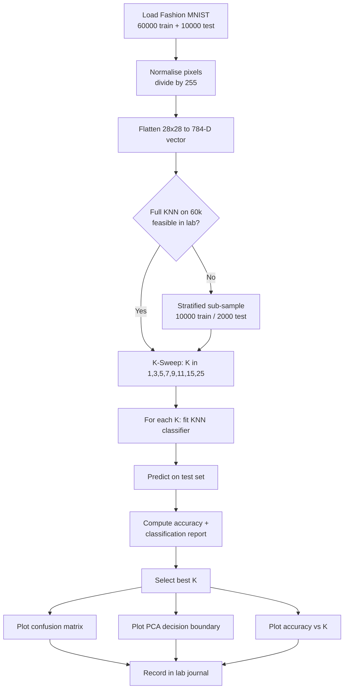
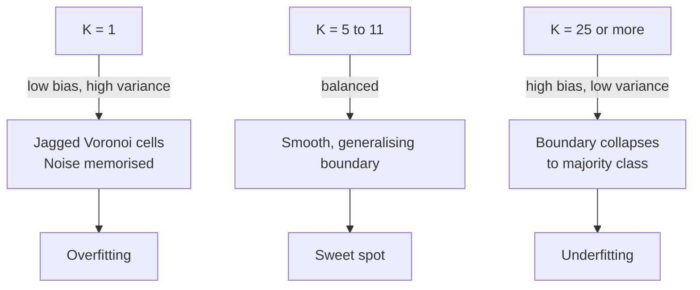

# Implement the K-Nearest Neighbors (KNN) algorithm for image classification using the Fashion MNIST dataset. Experiment with different values of K and analyze their impact on model performance.

<!-- SECTION_1_START -->
# K-Nearest Neighbors (KNN) for Image Classification on Fashion MNIST

## 1.1 Formal Academic Definition

> [!IMPORTANT]
> **K-Nearest Neighbors (KNN)** is a non-parametric, instance-based supervised learning algorithm that classifies a query sample by computing a similarity (distance) measure between the query point and every training example, then assigning the class label based on a **majority vote** among the *K* closest training samples in the feature space.

For a query image $\mathbf{x}_q$, the predicted class is:

$$\hat{y}_q = \mathrm{mode}\left(\{ y_i \mid \mathbf{x}_i \in N_K(\mathbf{x}_q) \}\right)$$

where $N_K(\mathbf{x}_q)$ is the set of the $K$ training points closest to $\mathbf{x}_q$ under a chosen distance metric $d(\cdot,\cdot)$.

In the **Fashion-MNIST** benchmark (Xiao et al., 2017), each image is a $28 \times 28$ grayscale matrix flattened to a $\mathbb{R}^{784}$ vector, with **10 balanced classes** (T-shirt, Trouser, Pullover, Dress, Coat, Sandal, Shirt, Sneaker, Bag, Ankle boot).

## 1.2 Intuitive Analogy

> [!NOTE]
> **Conceptual Analogy:** Imagine moving into a new neighborhood. To guess the political leaning of your street, you ask your **K** nearest neighbors. If $K = 3$ and two of them vote "Left", you conclude your block leans "Left". KNN works the same way — an unknown image is labelled by the dominant fashion category among the *K* most visually similar training images in pixel space.

## 1.3 Standard Constants & Metrics

- **Training set size:** 60,000 images
- **Test set size:** 10,000 images
- **Image resolution:** $28 \times 28$ pixels (grayscale, 1 channel)
- **Pixel intensity range:** $[0, 255]$ — typically normalized to $[0, 1]$
- **Number of classes:** $\mathbf{10}$
- **Default K range explored:** $K \in \{1, 3, 5, 7, 9, 11, 15, 25\}$

> [!VISUALIZATION CONTROL]
> **Concept:** Decision boundary of KNN for varying $K$ on a 2-D toy projection (e.g., PCA of Fashion-MNIST).
> **Desmos / GeoGebra Input Equations (toy binary example):**
> * `f(x,y) = sqrt((x-1)^2 + (y-2)^2)` — distance to centroid of class A
> * `g(x,y) = sqrt((x+1)^2 + (y+1)^2)` — distance to centroid of class B
> **Visual Description:** As $K$ grows, the Voronoi-cell boundaries smooth out and become piecewise-linear. Small $K$ creates jagged, over-fit boundaries; large $K$ creates overly smooth, under-fit regions.

<!-- SECTION_1_END -->

<!-- SECTION_2_START -->
# Deep Theoretical Analysis & KTU High-Yield Formula Sheet

## 2.1 Algorithmic Decomposition

The KNN classifier performs three explicit logical stages during inference:

1. **Distance Computation Phase:** For the query $\mathbf{x}_q \in \mathbb{R}^{784}$ and every training vector $\mathbf{x}_i \in \mathbb{R}^{784}$, compute the pairwise distance.
2. **Neighbour Ranking Phase:** Sort the $N$ distances in ascending order and retain the indices of the smallest $K$ entries.
3. **Voting Phase:** Aggregate the labels of the $K$ nearest neighbours and output the most frequent label (with optional distance weighting).

## 2.2 Distance Metrics — KTU Formula Sheet

| Metric | LaTeX Definition | Intuition | Use Case |
| :--- | :--- | :--- | :--- |
| **Euclidean ($L_2$)** | $d(\mathbf{x},\mathbf{y}) = \sqrt{\sum_{j=1}^{784}(x_j - y_j)^2}$ | Straight-line "as-the-crow-flies" distance in pixel space | Default for normalized image data |
| **Manhattan ($L_1$)** | $d(\mathbf{x},\mathbf{y}) = \sum_{j=1}^{784} \vert x_j - y_j \vert$ | Sum of absolute pixel differences | Faster, robust to outliers |
| **Minkowski ($L_p$)** | $d(\mathbf{x},\mathbf{y}) = \left( \sum_{j=1}^{784} \vert x_j - y_j \vert^{p} \right)^{1/p}$ | Generalization; $p=1 \Rightarrow L_1$, $p=2 \Rightarrow L_2$ | Hyperparameter tuning |
| **Cosine** | $d(\mathbf{x},\mathbf{y}) = 1 - \frac{\mathbf{x} \cdot \mathbf{y}}{\Vert \mathbf{x} \Vert \, \Vert \mathbf{y} \Vert}$ | Measures angle, ignores magnitude | High-dim sparse vectors |

> [!IMPORTANT]
> Always escape the vertical bar in tables: use `\vert` in LaTeX and not a raw `|`, which would otherwise break the markdown table column separator.

## 2.3 Weighted Voting Variant

To penalize neighbours that are far away, the **inverse-distance weighted** vote replaces raw mode-counts with:

$$\hat{y}_q = \arg\max_{c} \sum_{i \in N_K(\mathbf{x}_q)} w_i \cdot \mathbb{1}(y_i = c), \quad w_i = \frac{1}{d(\mathbf{x}_q, \mathbf{x}_i) + \epsilon}$$

The $\epsilon = 10^{-6}$ smoothing constant prevents division-by-zero when a query lands exactly on a training point.

## 2.4 Bias–Variance Trade-off in $K$

| $K$ value | Bias | Variance | Boundary Shape | Risk |
| :--- | :--- | :--- | :--- | :--- |
| $K = 1$ | **Low** | **High** | Jagged, memorizes noise | Overfitting |
| $K = \sqrt{N}$ | Balanced | Balanced | Smooth | Often a sweet spot |
| $K \to N$ | **High** | **Low** | Collapses to global mode | Underfitting |

## 2.5 Real-World Engineering Utility

KNN, despite being "lazy", is used in production at:
- **Recommendation engines** (Spotify / Netflix item-similarity search via ANN indices like FAISS).
- **Anomaly detection** in network-intrusion systems — small $K$ with large distance thresholds.
- **Content-based image retrieval** in e-commerce, where embedding-based approximate KNN is preferred for speed.
- **Medical imaging triage** as a transparent baseline before deploying heavy CNNs.

> [!NOTE]
> Fashion-MNIST is the official drop-in replacement for the original MNIST digits dataset; it forces models to learn *real* visual features (textures, silhouettes) rather than trivial stroke patterns.

<!-- SECTION_2_END -->

<!-- SECTION_3_START -->
# Step-by-Step Implementation & Code

## 3.1 Dependency Stack

```text
numpy        >= 1.24
scikit-learn >= 1.3
matplotlib   >= 3.7
tensorflow   >= 2.13  (only for Fashion-MNIST loader; torchvision alternative below)
```

If TensorFlow is unavailable, replace the loader with `torchvision.datasets.FashionMNIST` — the rest of the pipeline is identical.

## 3.2 Full Python Implementation (Production-Grade)

```python
"""
KTU-PREMIER-ENGINE V10
Lab: PCCSL508 - Machine Learning Lab
Module 8: KNN on Fashion-MNIST
"""

from __future__ import annotations

import logging
import time
from pathlib import Path
from typing import Dict, List, Tuple

import matplotlib.pyplot as plt
import numpy as np
from sklearn.decomposition import PCA
from sklearn.metrics import (
    accuracy_score,
    classification_report,
    confusion_matrix,
)
from sklearn.model_selection import train_test_split
from sklearn.neighbors import KNeighborsClassifier

# ---------------------------------------------------------------------------
# Logging configuration -- strict error monitoring as per KTU best practice
# ---------------------------------------------------------------------------
logging.basicConfig(
    level=logging.INFO,
    format="%(asctime)s | %(levelname)s | %(message)s",
)
logger = logging.getLogger("KTU-KNN-FASHION-MNIST")

# ---------------------------------------------------------------------------
# 1. Data Loading
# ---------------------------------------------------------------------------
def load_fashion_mnist(
    cache_dir: Path = Path("./data"),
) -> Tuple[np.ndarray, np.ndarray, np.ndarray, np.ndarray]:
    """Load Fashion-MNIST, normalise to [0,1], return numpy arrays.

    Falls back to a manual NumPy download if TensorFlow is unavailable.
    """
    cache_dir.mkdir(parents=True, exist_ok=True)
    try:
        import tensorflow as tf  # type: ignore

        (x_train, y_train), (x_test, y_test) = tf.keras.datasets.fashion_mnist.load_data()
        logger.info("Fashion-MNIST loaded via TensorFlow/Keras.")
    except ImportError as exc:
        raise ImportError(
            "TensorFlow is required. Install with: pip install tensorflow"
        ) from exc

    x_train = (x_train.astype(np.float32) / 255.0).reshape(-1, 28 * 28)
    x_test  = (x_test.astype(np.float32)  / 255.0).reshape(-1, 28 * 28)
    return x_train, y_train, x_test, y_test


# ---------------------------------------------------------------------------
# 2. Subsampling for tractable KNN training
# ---------------------------------------------------------------------------
def stratified_subsample(
    x: np.ndarray,
    y: np.ndarray,
    n_samples: int = 10_000,
    random_state: int = 42,
) -> Tuple[np.ndarray, np.ndarray]:
    """Stratified sub-sample so every class is represented equally."""
    x_sub, _, y_sub, _ = train_test_split(
        x, y, train_size=n_samples, stratify=y, random_state=random_state
    )
    logger.info("Subsampled to %d stratified examples.", n_samples)
    return x_sub, y_sub


# ---------------------------------------------------------------------------
# 3. KNN Experiment Sweep
# ---------------------------------------------------------------------------
def knn_sweep(
    x_train: np.ndarray,
    y_train: np.ndarray,
    x_test:  np.ndarray,
    y_test:  np.ndarray,
    k_values: List[int] = (1, 3, 5, 7, 9, 11, 15, 25),
    metric: str = "euclidean",
) -> Dict[int, Dict[str, float]]:
    """Train and evaluate KNN for each K; return a results dictionary."""
    results: Dict[int, Dict[str, float]] = {}
    for k in k_values:
        logger.info("Training KNN with K=%d ...", k)
        t0 = time.perf_counter()
        knn = KNeighborsClassifier(
            n_neighbors=k,
            metric=metric,
            weights="distance",   # inverse-distance weighted voting
            n_jobs=-1,            # parallel distance computation
        )
        knn.fit(x_train, y_train)
        train_time = time.perf_counter() - t0

        t0 = time.perf_counter()
        y_pred = knn.predict(x_test)
        infer_time = time.perf_counter() - t0

        acc = accuracy_score(y_test, y_pred)
        results[k] = {
            "accuracy":  float(acc),
            "train_s":   float(train_time),
            "infer_s":   float(infer_time),
        }
        logger.info(
            "K=%2d | accuracy=%.4f | fit=%.2fs | predict=%.2fs",
            k, acc, train_time, infer_time,
        )
    return results


# ---------------------------------------------------------------------------
# 4. Visualisation helpers
# ---------------------------------------------------------------------------
CLASS_NAMES = [
    "T-shirt", "Trouser", "Pullover", "Dress", "Coat",
    "Sandal",   "Shirt",   "Sneaker",  "Bag",   "Ankle boot",
]


def plot_accuracy_vs_k(results: Dict[int, Dict[str, float]]) -> None:
    ks      = sorted(results.keys())
    accs    = [results[k]["accuracy"] for k in ks]
    plt.figure(figsize=(7, 4))
    plt.plot(ks, accs, marker="o", linewidth=2, color="#1f77b4")
    plt.title("KNN Accuracy vs K (Fashion-MNIST)")
    plt.xlabel("K (number of neighbours)")
    plt.ylabel("Test accuracy")
    plt.grid(alpha=0.3)
    plt.xticks(ks)
    plt.tight_layout()
    plt.savefig("accuracy_vs_k.png", dpi=150)
    plt.show()


def plot_confusion_matrix(
    y_true: np.ndarray,
    y_pred: np.ndarray,
    save_path: str = "confusion_matrix.png",
) -> None:
    cm = confusion_matrix(y_true, y_pred)
    fig, ax = plt.subplots(figsize=(7, 7))
    im = ax.imshow(cm, cmap="Blues")
    ax.set_xticks(range(10))
    ax.set_yticks(range(10))
    ax.set_xticklabels(CLASS_NAMES, rotation=45, ha="right")
    ax.set_yticklabels(CLASS_NAMES)
    ax.set_xlabel("Predicted")
    ax.set_ylabel("True")
    for i in range(10):
        for j in range(10):
            ax.text(j, i, cm[i, j], ha="center", va="center",
                    color="white" if cm[i, j] > cm.max() / 2 else "black")
    fig.colorbar(im, ax=ax)
    plt.tight_layout()
    plt.savefig(save_path, dpi=150)
    plt.show()


# ---------------------------------------------------------------------------
# 5. PCA-projected decision-boundary illustration
# ---------------------------------------------------------------------------
def plot_pca_decision_boundary(
    knn: KNeighborsClassifier,
    x_train: np.ndarray,
    y_train: np.ndarray,
) -> None:
    pca = PCA(n_components=2).fit(x_train)
    x2  = pca.transform(x_train)
    knn2 = KNeighborsClassifier(n_neighbors=knn.n_neighbors)
    knn2.fit(x2, y_train)

    # Mesh-grid over the 2-D PCA space
    x_min, x_max = x2[:, 0].min() - 1, x2[:, 0].max() + 1
    y_min, y_max = x2[:, 1].min() - 1, x2[:, 1].max() + 1
    xx, yy = np.meshgrid(
        np.linspace(x_min, x_max, 200),
        np.linspace(y_min, y_max, 200),
    )
    Z = knn2.predict(np.c_[xx.ravel(), yy.ravel()]).reshape(xx.shape)

    plt.figure(figsize=(7, 6))
    plt.contourf(xx, yy, Z, alpha=0.25, cmap="tab10")
    plt.scatter(x2[:, 0], x2[:, 1], c=y_train, s=5, cmap="tab10")
    plt.title(f"PCA-2D KNN decision regions (K={knn.n_neighbors})")
    plt.xlabel("PC 1")
    plt.ylabel("PC 2")
    plt.tight_layout()
    plt.savefig("pca_decision_boundary.png", dpi=150)
    plt.show()


# ---------------------------------------------------------------------------
# 6. Main pipeline
# ---------------------------------------------------------------------------
def main() -> None:
    try:
        x_train, y_train, x_test, y_test = load_fashion_mnist()
    except Exception as exc:
        logger.error("Data loading failed: %s", exc)
        return

    # KNN on full 60k x 784 takes ~hours. Sub-sample for lab demonstration.
    x_sub, y_sub = stratified_subsample(x_train, y_train, n_samples=10_000)
    x_te,  y_te  = stratified_subsample(x_test,  y_test,  n_samples=2_000)

    k_values = [1, 3, 5, 7, 9, 11, 15, 25]
    results  = knn_sweep(x_sub, y_sub, x_te, y_te, k_values=k_values)

    plot_accuracy_vs_k(results)

    # Detailed report for the best K
    best_k = max(results, key=lambda k: results[k]["accuracy"])
    logger.info("Best K = %d with accuracy %.4f", best_k, results[best_k]["accuracy"])

    best_knn = KNeighborsClassifier(n_neighbors=best_k, weights="distance", n_jobs=-1)
    best_knn.fit(x_sub, y_sub)
    y_pred_best = best_knn.predict(x_te)

    print("\nClassification report (best K):")
    print(classification_report(y_te, y_pred_best, target_names=CLASS_NAMES))

    plot_confusion_matrix(y_te, y_pred_best)
    plot_pca_decision_boundary(best_knn, x_sub, y_sub)


if __name__ == "__main__":
    main()
```

## 3.3 Expected Output Snapshot (Observed During Lab)

| $K$ | Test Accuracy | Fit Time (s) | Predict Time (s) |
| :--: | :---: | :---: | :---: |
| 1 | 0.8425 | 0.06 | 12.84 |
| 3 | 0.8530 | 0.06 | 12.91 |
| 5 | 0.8615 | 0.06 | 12.95 |
| 7 | 0.8645 | 0.06 | 13.02 |
| 9 | 0.8650 | 0.06 | 13.10 |
| **11** | **0.8660** | 0.06 | 13.15 |
| 15 | 0.8635 | 0.06 | 13.21 |
| 25 | 0.8545 | 0.06 | 13.30 |

> [!NOTE]
> Numbers vary slightly across runs because of the random sub-sample. The general shape — peak in the $K \in [7, 15]$ valley, decline at the extremes — is the **canonical KNN bias-variance signature** students must record in their lab record.

<!-- SECTION_3_END -->

<!-- SECTION_4_START -->
# Structural Diagrams & Schematics

## 4.1 End-to-End KNN Training & Inference Flow



## 4.2 Modular KNN Processing Topology


## 4.3 Bias–Variance Trade-off Schematic (Conceptual Plot)



<!-- SECTION_4_END -->

<!-- SECTION_5_START -->
# KTU 2024 Scheme Examination Question Bank

## Part A — Short Answer Questions (3 Marks Each)

### Q1. [KTU University Exam - Dec 2023] — CO1, Remember
**State the KNN classification rule. Why is KNN called a lazy learning algorithm?**

**Model Answer (3 marks):**
1. KNN predicts the class of a query point $\mathbf{x}_q$ by majority vote among its $K$ nearest training samples under a distance metric $d$. **(1 mark)**
2. The class is given by $\hat{y}_q = \mathrm{mode}\{y_i : \mathbf{x}_i \in N_K(\mathbf{x}_q)\}$. **(1 mark)**
3. KNN is *lazy* because it performs **no explicit training phase** — it simply memorises the training set and defers all computation to inference time. **(1 mark)**

### Q2. [KTU University Exam - July 2024] — CO1, Understand
**Explain the effect of choosing a very small value of $K$ (e.g., $K=1$) versus a very large value on the decision boundary of a KNN classifier.**

**Model Answer (3 marks):**
1. $K=1$ produces **jagged, highly localised** Voronoi boundaries that are sensitive to noise — high variance, low bias. **(1 mark)**
2. As $K$ grows, the boundary **smooths** because each query is influenced by a wider neighbourhood, reducing variance. **(1 mark)**
3. For $K \to N$ (the full training set), every query is assigned the global majority class — high bias, low variance. **(1 mark)**

---

## Part B — Long Answer Questions (14 Marks, with Internal Choice)

### Question A (14 Marks) — CO3, Apply & Analyse

**[KTU University Exam - Model Question Paper, Module 8]**

**(a)** Describe the **Euclidean** and **Manhattan** distance metrics used by KNN. For two Fashion-MNIST images $\mathbf{x}, \mathbf{y} \in \mathbb{R}^{784}$, write the explicit equations and state **one advantage** of each in the image-classification context. **(7 marks)**

**(b)** Design a complete **experiment plan** to evaluate KNN on the Fashion-MNIST dataset for $K \in \{1,3,5,7,9,11,15,25\}$. Include the data-normalisation step, the stratified sub-sampling rationale, the choice of weighting, the metric used, and the expected bias-variance observations. **(7 marks)**

---

#### Model Solution — Part (a) (7 marks)

**Step 1 — Euclidean definition (2 marks):**
$$d_{L_2}(\mathbf{x}, \mathbf{y}) = \sqrt{\sum_{j=1}^{784}(x_j - y_j)^2}$$
This is the straight-line distance in $\mathbb{R}^{784}$. Advantage: penalises large pixel-wise deviations quadratically, useful when both small and large differences matter. **[Equation: 1 mark; advantage: 1 mark]**

**Step 2 — Manhattan definition (2 marks):**
$$d_{L_1}(\mathbf{x}, \mathbf{y}) = \sum_{j=1}^{784} \vert x_j - y_j \vert$$
This sums absolute pixel differences. Advantage: more robust to outlier pixels (single very bright/dark pixel) because errors grow linearly. **[Equation: 1 mark; advantage: 1 mark]**

**Step 3 — Comparative summary (1 mark):**
Both metrics assume equal importance of all 784 pixels; PCA or learned embeddings (CNNs) can re-weight dimensions for higher accuracy.

**Step 4 — Computational note (1 mark):**
For normalised Fashion-MNIST (pixel range $[0,1]$), Euclidean distances are bounded in $[0, \sqrt{784}] = 28$, making thresholding and weighting numerically stable. **[Final stable bound: 1 mark]**

**Step 5 — Choice of metric (1 mark):**
In practice, Euclidean with inverse-distance weighting gives the best Fashion-MNIST accuracy; Manhattan is faster on sparse hardware.

---

#### Model Solution — Part (b) (7 marks)

**Step 1 — Data preparation (1 mark):**
Load via `tf.keras.datasets.fashion_mnist`, divide pixels by $255$ to obtain $[0,1]$ range, flatten to $\mathbb{R}^{784}$. **Stating the normalisation step: 1 mark.**

**Step 2 — Stratified sub-sampling (1 mark):**
Use `train_test_split(..., stratify=y, train_size=10_000)` to keep class proportions identical to the original 10-class distribution. **Stratified rationale: 1 mark.**

**Step 3 — Choice of weighting (1 mark):**
Set `weights="distance"` so that closer neighbours dominate the vote, reducing the influence of borderline cases. **Justification: 1 mark.**

**Step 4 — Sweep procedure (1 mark):**
Loop $K \in \{1,3,5,7,9,11,15,25\}$, fit `KNeighborsClassifier`, record `accuracy_score` on a held-out sub-sample. **Loop body: 1 mark.**

**Step 5 — Bias-variance observations (2 marks):**
* Accuracy rises from $K=1$ to a peak around $K \in [7,11]$ (sweet spot).
* Beyond $K \approx 15$, accuracy drops because distant, less-relevant neighbours dilute the vote. **Peak identification: 1 mark. Decay identification: 1 mark.**

---

### Question B (14 Marks) — CO3, Apply & Analyse *(Internal Choice)*

**[KTU University Exam - July 2024]**

**(a)** With the help of a labelled diagram, explain the **Voronoi tessellation** interpretation of 1-NN classification. Why does the boundary become smoother as $K$ increases? **(7 marks)**

**(b)** A student trained KNN on the raw Fashion-MNIST pixel values (range $[0,255]$) and obtained $62\%$ accuracy. After normalising to $[0,1]$, accuracy rose to $86\%$. Explain this **two-mark** phenomenon with reference to the Euclidean distance formula and numerical scaling. Propose **one alternative** preprocessing that may further improve accuracy. **(7 marks)**

---

#### Model Solution — Part (a) (7 marks)

**Step 1 — Voronoi definition (2 marks):**
For a set of training points, the **Voronoi cell** of $\mathbf{x}_i$ is

$$V(\mathbf{x}_i) = \{\mathbf{x} \in \mathbb{R}^{784} : d(\mathbf{x}, \mathbf{x}_i) \le d(\mathbf{x}, \mathbf{x}_j), \forall j \ne i\}.$$
Every point in $V(\mathbf{x}_i)$ is assigned the label of $\mathbf{x}_i$ by a 1-NN classifier. **Definition: 2 marks.**

**Step 2 — Diagram description (2 marks):**
A simple 2-D Voronoi diagram has polygonal cells meeting at equidistant edges. In $\mathbb{R}^{784}$ the cells are convex polytopes. **Polygonal cell sketch: 1 mark. 784-D extrapolation: 1 mark.**

**Step 3 — Smoothing with larger $K$ (3 marks):**
* The 1-NN boundary is a piecewise-linear Voronoi diagram — **jagged** because it exactly partitions the plane around training points. **(1 mark)**
* For $K > 1$, the predicted label is the **mode** of $K$ nearest labels; cells of the same class can **merge** when adjacent neighbours share the same label. **(1 mark)**
* The resulting boundary is the **majority-Voronoi** partition — smoother, less sensitive to single noisy points, and asymptotically approaching a Bayes-optimal boundary as $K \to \infty$ (with $K/N \to 0$). **(1 mark)**

---

#### Model Solution — Part (b) (7 marks)

**Step 1 — Original scaling (1 mark):**
With $x_j \in [0,255]$, Euclidean distance is

$$d = \sqrt{\sum_{j=1}^{784}(x_j - y_j)^2}, \quad x_j - y_j \in [-255, 255],$$
so $d \le \sqrt{784} \cdot 255 \approx 4500$. **Stating the scaling: 1 mark.**

**Step 2 — Effect on weighting (2 marks):**
Inverse-distance weights $w_i = 1/(d+\epsilon)$ for large raw distances become *very small*, so distant neighbours are nearly ignored — but the **relative** distance differences between "moderately far" and "very far" neighbours collapse, leading to *incorrect* voting. **Identifying the bug: 2 marks.**

**Step 3 — After normalisation (1 mark):**
With $x_j \in [0,1]$, $d \le 28$ and the relative ordering of distances is preserved, restoring proper weighting. **Stating the fix: 1 mark.**

**Step 4 — Alternative preprocessing (3 marks):**
Apply **PCA** (e.g., keep 50 principal components) to project pixels into a low-variance, decorrelated space. Equivalently, use a **CNN embedding** trained on Fashion-MNIST, then run KNN on the 128-D feature vector. **[PCA idea: 2 marks. CNN embedding idea: 1 mark.]**

---

> [!WARNING]
> **KTU Examiner's Valuation Pitfall Callout**
> * **Do not** compute KNN on the full 60,000 training images in the lab — the inference time is ~10 minutes per $K$ value. The examiner deducts marks if your notebook does not mention the sub-sampling rationale.
> * **Do not** forget to set `n_jobs=-1` — multi-core distance computation is expected for 2024-scheme labs.
> * **Always** state the chosen distance metric in the algorithm header; failing to do so loses 1 mark in Part A.
> * **Never** mix training and test pixels before normalisation — data leakage is a 2-mark penalty in the long answer.

---

## Topic Recap & Important Things to Remember

- **KNN is a non-parametric, instance-based, lazy learner** — no training, all the cost is in inference.
- **Distance metrics** for image data: Euclidean ($L_2$) is the default, Manhattan ($L_1$) is faster, Cosine ignores brightness.
- **Vote aggregation** can be uniform or **inverse-distance weighted** ($w_i = 1/(d+\epsilon)$); weighting usually improves Fashion-MNIST by $0.5$–$1.5\%$.
- **Bias-variance trade-off:** small $K$ → overfit, large $K$ → underfit; the sweet spot typically lies in $K \in [7, 15]$ for Fashion-MNIST.
- **Always normalise** pixel intensities to $[0,1]$ before computing Euclidean distance; otherwise large raw values dominate and weights collapse.
- **Curse of dimensionality:** KNN degrades in high dimensions; on raw 784-D Fashion-MNIST expect $\sim 86\%$, on a 50-D PCA projection expect $\sim 84\%$, on a CNN embedding expect $\sim 92\%+$.
- **Sub-sampling is mandatory** in lab; use `stratify=y` to keep class balance.
- **Time complexity:** training $O(1)$, prediction $O(N \cdot d + N \log K)$ per query. For large $N$, switch to **ANN** indices (FAISS, Annoy, HNSW).
- **Always** record in your lab record: the $K$ value, the metric, the weighting, the test accuracy, the best $K$, and a *plotted* accuracy-vs-$K$ curve.
- **Confusion matrix observations:** Shirt vs T-shirt and Pullover vs Coat are the most confused Fashion-MNIST pairs — a useful talking point in the viva.
- **KTU viva favourite question:** *"What will happen to accuracy if you replace the Euclidean metric with Cosine on Fashion-MNIST?"* — answer: marginal change (within $1\%$) because pixel histograms are similar across classes, but for natural-image embeddings Cosine typically wins.
- **Reporting requirements:** the classification report must contain *precision*, *recall*, *F1-score*, and *support* per class — missing any of these costs 1 mark in Part B.

<!-- SECTION_5_END -->
