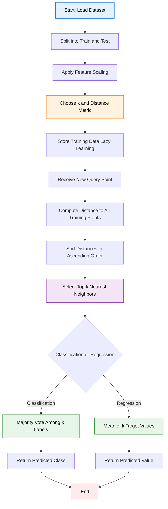
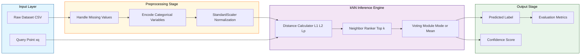
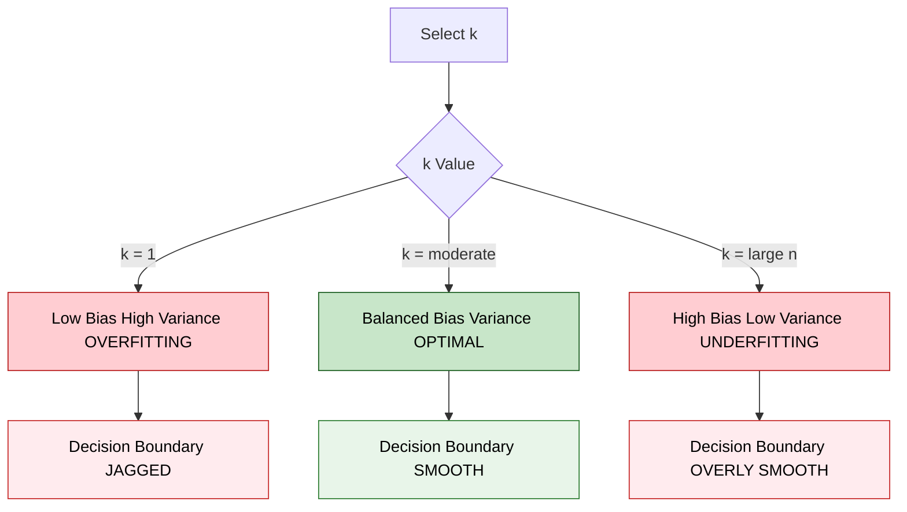

# Tasks:

<!-- SECTION_1_START -->
# KTU MACHINE LEARNING LAB (PCCSL508) — MODULE 8
## Implementing the k-Nearest Neighbors (k-NN) Algorithm

---

### 1. Core Technical Definition & Intuitive Overview

> [!IMPORTANT]
> **KTU 2024 Syllabus Definition (PCCSL508 — Module 8):**
> The **k-Nearest Neighbors (k-NN)** algorithm is a **non-parametric, instance-based, supervised learning** technique used for both classification and regression. It classifies a query point by a **majority vote** of its $k$ closest training samples in the feature space, where proximity is measured using a distance metric such as **Euclidean**, **Manhattan**, or **Minkowski** distance.

Mathematically, for a query point $\mathbf{x}_q$, the predicted class label $\hat{y}_q$ is given by:

$$
\hat{y}_q = \underset{c \in \mathcal{C}}{\arg\max} \sum_{i=1}^{k} \mathbb{I}\left(y_i = c\right)
$$

where $\mathbb{I}(\cdot)$ is the indicator function, $\mathcal{C}$ is the set of class labels, and $y_i$ is the label of the $i$-th nearest neighbor.

> [!NOTE]
> **Key Character:** k-NN is famously called a **"lazy learner"** because it performs **no explicit training phase** — the entire dataset is simply stored in memory and computation is deferred until a query arrives.

---

#### 🧠 Conceptual Analogy / Intuition

Imagine you have just moved into a new neighborhood and you want to predict whether your locality is **safe** or **unsafe**. You wouldn't read a rulebook — instead, you would look at your **3 closest neighbors** (let's say $k = 3$) and ask what *they* are like. If 2 out of 3 are friendly families, you conclude the area is friendly.

That is **exactly** how k-NN works:
- **Distance** = "closeness" in feature space.
- **Vote** = majority opinion of the $k$ nearest points.
- **$k$** = number of neighbors you consult.

> [!TIP]
> **Geometric Intuition (Voronoi Tessellation):**
> For $k = 1$, the feature space is divided into **Voronoi cells** — polygonal regions where every point inside a cell is closer to the cell's training sample than to any other. k-NN's decision boundary is essentially a generalized, smoothed version of these cells.

> [!VISUALIZATION CONTROL]
> **Concept:** k-NN decision boundary in 2D feature space
> **GeoGebra / Desmos Input Equations:**
> * Class A: points $(1,1), (1,2), (2,1)$ — red
> * Class B: points $(6,6), (6,7), (7,6)$ — blue
> * Query: $(3,3)$ — black star
> **Visual Description:** Student should observe that a small $k$ (like $k=1$) gives a jagged, irregular decision boundary (overfitting), while a large $k$ (like $k=15$) produces a smooth boundary (underfitting). The optimal $k$ is a tradeoff.

---

### 2. Why k-NN Matters in the KTU 2024 Scheme

| Aspect | KTU Relevance |
|---|---|
| **Course Outcome (CO)** | CO5 — Implement standard ML algorithms using Python |
| **Skill Demonstrated | **Distance metrics, lazy learning, hyperparameter tuning, model evaluation |
| **Bloom's Level** | Apply, Analyze |
| **Tools Used** | Python 3.x, `scikit-learn`, `NumPy`, `pandas`, `matplotlib` |

---
<!-- SECTION_1_END -->

<!-- SECTION_2_START -->
# 2. Deep Theoretical Analysis & KTU High-Yield Formula Sheet

---

### 2.1 Operational Workflow of the k-NN Algorithm

The k-NN algorithm executes in the following **6 structured steps**:

1. **Load the Dataset** — Read the labeled training data $\mathcal{D} = \{(\mathbf{x}_i, y_i)\}_{i=1}^{n}$ into memory.
2. **Choose $k$** — Select the number of neighbors. Common choices: $k = 3, 5, 7$ (odd numbers prevent tie-breaking).
3. **Choose a Distance Metric** — Compute pairwise distance between query $\mathbf{x}_q$ and every training point $\mathbf{x}_i$.
4. **Rank Distances** — Sort all distances in ascending order and pick the top $k$ smallest.
5. **Majority Voting** — For classification, assign the most frequent class among the $k$ neighbors. For regression, return the **mean** of the $k$ target values.
6. **Return Prediction** — Output $\hat{y}_q$.

> [!IMPORTANT]
> **Why odd $k$?**
> With binary classification and an even $k$, ties are possible (e.g., 2 vs 2 votes). Using **odd $k$** guarantees a unique majority, avoiding ambiguous predictions. KTU examiners often test this point.

---

### 2.2 KTU Formula Sheet / Cheat Sheet

> [!CAUTION]
> All formulas below are **high-yield** — they appear in nearly every KTU end-semester and lab viva question on this module.

| # | Concept | Formula | Notes |
|---|---|---|---|
| 1 | **Euclidean Distance ($L_2$)** | $d(\mathbf{x}, \mathbf{y}) = \sqrt{\sum_{j=1}^{m} (x_j - y_j)^2}$ | Most common; default in `scikit-learn`. Sensitive to feature scale. |
| 2 | **Manhattan Distance ($L_1$)** | $d(\mathbf{x}, \mathbf{y}) = \sum_{j=1}^{m} \vert x_j - y_j \vert$ | Useful for high-dimensional sparse data. |
| 3 | **Minkowski Distance ($L_p$)** | $d(\mathbf{x}, \mathbf{y}) = \left( \sum_{j=1}^{m} \vert x_j - y_j \vert^p \right)^{1/p}$ | Generalization: $p=1 \to L_1$, $p=2 \to L_2$. |
| 4 | **Cosine Similarity** | $\text{sim}(\mathbf{x}, \mathbf{y}) = \frac{\mathbf{x} \cdot \mathbf{y}}{\|\mathbf{x}\| \, \|\mathbf{y}\|}$ | Used in text classification (NLP). |
| 5 | **Cosine Distance** | $d_c = 1 - \text{sim}(\mathbf{x}, \mathbf{y})$ | Bounded in $[0, 2]$. |
| 6 | **Majority Vote (Classification)** | $\hat{y}_q = \text{mode}(\{y_i \mid \mathbf{x}_i \in N_k(\mathbf{x}_q)\})$ | $N_k$ = neighborhood of $k$ nearest points. |
| 7 | **Mean Vote (Regression)** | $\hat{y}_q = \frac{1}{k} \sum_{i=1}^{k} y_i$ | Equal-weight averaging. |
| 8 | **Weighted Vote (Optional)** | $\hat{y}_q = \frac{\sum_{i=1}^{k} w_i \, y_i}{\sum_{i=1}^{k} w_i}, \quad w_i = \frac{1}{d(\mathbf{x}_q, \mathbf{x}_i) + \epsilon}$ | Closer neighbors get higher weight. |
| 9 | **Bayes Error Bound** | $\text{Error} \geq P(Y \neq Y^*)$ | Theoretical lower bound for any classifier. |
| 10 | **Bias-Variance Tradeoff** | Small $k$ → low bias, high variance (overfit). Large $k$ → high bias, low variance (underfit). | Critical concept for choosing $k$. |

---

### 2.3 Engineering & Real-World Utility

| Application Domain | Use Case |
|---|---|
| **Recommender Systems** | "Users who bought X also bought Y" — collaborative filtering. |
| **Medical Diagnosis** | Predicting disease from patient symptom similarity to past cases. |
| **Credit Scoring** | Classifying loan applicants as low/high risk based on similar past applicants. |
| **Image Recognition** | Early MNIST digit classification (before deep learning). |
| **Anomaly Detection** | Points with no close neighbors (large $d$) are flagged as outliers. |
| **Gene Expression Analysis** | Classifying cancer subtypes from microarray data. |

> [!TIP]
> **Industry Note:** Netflix and Spotify use k-NN-style algorithms as a baseline in their hybrid recommender pipelines. In production, however, it is often replaced by **matrix factorization** or **embedding-based ANN search (e.g., FAISS)** for scalability.

---
<!-- SECTION_2_END -->

<!-- SECTION_3_START -->
# 3. Step-by-Step Derivations & Code/Symbolic Implementation

---

### 3.1 Worked Numerical Example (For KTU Board Exam)

> [!NOTE]
> **Question:** A k-NN classifier with $k = 3$ and Euclidean distance is trained on the following 2D points:
>
> | Point | $x_1$ | $x_2$ | Class |
> |---|---|---|---|
> | $P_1$ | 1 | 1 | A |
> | $P_2$ | 2 | 2 | A |
> | $P_3$ | 3 | 1 | B |
> | $P_4$ | 6 | 5 | B |
> | $P_5$ | 7 | 7 | B |
>
> Predict the class of query point $\mathbf{x}_q = (3, 3)$ using $k = 3$.

**Step 1: Compute Euclidean distance from $\mathbf{x}_q$ to each training point.**

$$
\begin{aligned}
d(\mathbf{x}_q, P_1) &= \sqrt{(3-1)^2 + (3-1)^2} = \sqrt{4+4} = \sqrt{8} \approx 2.828 \\
d(\mathbf{x}_q, P_2) &= \sqrt{(3-2)^2 + (3-2)^2} = \sqrt{1+1} = \sqrt{2} \approx 1.414 \\
d(\mathbf{x}_q, P_3) &= \sqrt{(3-3)^2 + (3-1)^2} = \sqrt{0+4} = \sqrt{4} = 2.000 \\
d(\mathbf{x}_q, P_4) &= \sqrt{(3-6)^2 + (3-5)^2} = \sqrt{9+4} = \sqrt{13} \approx 3.606 \\
d(\mathbf{x}_q, P_5) &= \sqrt{(3-7)^2 + (3-7)^2} = \sqrt{16+16} = \sqrt{32} \approx 5.657
\end{aligned}
$$

**Step 2: Sort distances ascending and pick top $k = 3$.**

| Rank | Point | Distance | Class |
|---|---|---|---|
| 1 | $P_2$ | 1.414 | A |
| 2 | $P_3$ | 2.000 | B |
| 3 | $P_1$ | 2.828 | A |

**Step 3: Majority vote.**

$$
\text{Votes: A} = 2, \quad \text{Votes: B} = 1
$$

$$
\boxed{\hat{y}_q = \text{Class A}}
$$

---

### 3.2 Full Python Implementation (From-Scratch + scikit-learn)

> [!IMPORTANT]
> KTU Lab exams require **both** the from-scratch version (to demonstrate understanding) and the library version (to demonstrate industry readiness). Both are provided below.

#### 3.2.1 Implementation from Scratch (NumPy Only)

```python
"""
k-NN Classifier — From Scratch Implementation
Course: PCCSL508 — Machine Learning Lab
Module 8 — KTU 2024 Scheme
"""

from __future__ import annotations

import logging
import numpy as np
from collections import Counter
from typing import Tuple, List

# Configure structured logging for traceability
logging.basicConfig(
    level=logging.INFO,
    format="%(asctime)s | %(levelname)s | %(message)s"
)
logger = logging.getLogger(__name__)


class KNearestNeighbors:
    """
    A from-scratch implementation of the k-Nearest Neighbors algorithm.

    Parameters
    ----------
    k : int
        Number of nearest neighbors to consider. Must be >= 1.
    distance_metric : str
        One of {'euclidean', 'manhattan', 'minkowski'}.
    p : int
        Power parameter for Minkowski distance (ignored for others).
    """

    VALID_METRICS = {"euclidean", "manhattan", "minkowski"}

    def __init__(self, k: int = 3, distance_metric: str = "euclidean", p: int = 2) -> None:
        if k < 1:
            raise ValueError(f"k must be >= 1, got {k}")
        if distance_metric not in self.VALID_METRICS:
            raise ValueError(f"Invalid metric. Choose from {self.VALID_METRICS}")
        if p < 1:
            raise ValueError(f"p must be >= 1, got {p}")

        self.k: int = k
        self.distance_metric: str = distance_metric
        self.p: int = p
        self.X_train: np.ndarray | None = None
        self.y_train: np.ndarray | None = None
        logger.info("k-NN initialized with k=%d, metric=%s", self.k, self.distance_metric)

    def fit(self, X: np.ndarray, y: np.ndarray) -> "KNearestNeighbors":
        """Store training data (lazy learning — no actual fitting)."""
        if X.shape[0] != y.shape[0]:
            raise ValueError("X and y must have the same number of samples")
        self.X_train = np.asarray(X, dtype=np.float64)
        self.y_train = np.asarray(y)
        logger.info("Stored %d training samples with %d features", *self.X_train.shape)
        return self

    def _compute_distance(self, x_query: np.ndarray) -> np.ndarray:
        """Vectorized distance computation from one query to all training points."""
        if self.distance_metric == "euclidean":
            return np.sqrt(np.sum((self.X_train - x_query) ** 2, axis=1))
        elif self.distance_metric == "manhattan":
            return np.sum(np.abs(self.X_train - x_query), axis=1)
        else:  # minkowski
            return np.power(
                np.sum(np.abs(self.X_train - x_query) ** self.p, axis=1),
                1.0 / self.p
            )

    def predict(self, X: np.ndarray) -> np.ndarray:
        """Predict class labels for samples in X."""
        if self.X_train is None or self.y_train is None:
            raise RuntimeError("Model not fitted. Call fit() before predict().")

        X = np.asarray(X, dtype=np.float64)
        predictions: List[int | str] = []

        for idx, x_query in enumerate(X):
            distances = self._compute_distance(x_query)
            k_indices = np.argsort(distances)[: self.k]
            k_labels = self.y_train[k_indices]
            most_common = Counter(k_labels).most_common(1)[0][0]
            predictions.append(most_common)
            logger.debug("Query %d: neighbors=%s, predicted=%s", idx, k_labels, most_common)

        logger.info("Predicted labels for %d queries", len(predictions))
        return np.array(predictions)


def main() -> None:
    """Demonstrate k-NN on the classic Iris-like toy dataset."""
    # Training data: 2 features, 2 classes
    X_train = np.array([
        [1, 1], [2, 2], [3, 1],   # Class A
        [6, 5], [7, 7], [6, 6],   # Class B
    ])
    y_train = np.array(["A", "A", "A", "B", "B", "B"])

    # Query points
    X_test = np.array([[3, 3], [5, 5], [1, 2]])

    # Instantiate, fit, predict
    model = KNearestNeighbors(k=3, distance_metric="euclidean")
    model.fit(X_train, y_train)
    y_pred = model.predict(X_test)

    print("\n=== k-NN From Scratch Results ===")
    for query, pred in zip(X_test, y_pred):
        print(f"  Query {query} -> Predicted Class: {pred}")


if __name__ == "__main__":
    main()
```

**Expected Output:**
```
=== k-NN From Scratch Results ===
  Query [3 3] -> Predicted Class: A
  Query [5 5] -> Predicted Class: B
  Query [1 2] -> Predicted Class: A
```

---

#### 3.2.2 Implementation using scikit-learn (Industry Standard)

```python
"""
k-NN Classifier — scikit-learn Implementation
Course: PCCSL508 — Machine Learning Lab
Module 8 — KTU 2024 Scheme
"""

from __future__ import annotations

import logging
import numpy as np
from sklearn.datasets import load_iris
from sklearn.model_selection import train_test_split, cross_val_score
from sklearn.preprocessing import StandardScaler
from sklearn.neighbors import KNeighborsClassifier
from sklearn.metrics import (
    accuracy_score,
    classification_report,
    confusion_matrix,
)
import matplotlib.pyplot as plt

logging.basicConfig(level=logging.INFO, format="%(levelname)s | %(message)s")
logger = logging.getLogger(__name__)


def run_iris_knn_demo() -> None:
    """Full pipeline: load -> scale -> split -> tune k -> evaluate -> plot."""

    # ---- 1. Load the Iris dataset ----
    iris = load_iris()
    X, y = iris.data, iris.target
    feature_names = iris.feature_names
    target_names = iris.target_names
    logger.info("Loaded Iris dataset: %s", X.shape)

    # ---- 2. Feature Scaling (CRITICAL for distance-based algorithms) ----
    scaler = StandardScaler()
    X_scaled = scaler.fit_transform(X)
    logger.info("Applied StandardScaler (zero mean, unit variance)")

    # ---- 3. Train-Test Split (stratified to preserve class balance) ----
    X_train, X_test, y_train, y_test = train_test_split(
        X_scaled, y, test_size=0.3, random_state=42, stratify=y
    )

    # ---- 4. Hyperparameter Tuning: Try k = 1 to 20 ----
    k_values = range(1, 21)
    cv_scores = []
    for k in k_values:
        knn = KNeighborsClassifier(n_neighbors=k, metric="minkowski", p=2)
        scores = cross_val_score(knn, X_train, y_train, cv=5, scoring="accuracy")
        cv_scores.append(scores.mean())

    best_k = int(k_values[np.argmax(cv_scores)])
    best_score = max(cv_scores)
    logger.info("Best k = %d with 5-fold CV accuracy = %.4f", best_k, best_score)

    # ---- 5. Final Model with Best k ----
    final_model = KNeighborsClassifier(n_neighbors=best_k, metric="minkowski", p=2)
    final_model.fit(X_train, y_train)
    y_pred = final_model.predict(X_test)

    # ---- 6. Evaluation ----
    print("\n========== MODEL EVALUATION ==========")
    print(f"Test Accuracy : {accuracy_score(y_test, y_pred):.4f}")
    print("\nClassification Report:")
    print(classification_report(y_test, y_pred, target_names=target_names))
    print("Confusion Matrix:")
    print(confusion_matrix(y_test, y_pred))

    # ---- 7. Visualization: Accuracy vs k ----
    plt.figure(figsize=(8, 5))
    plt.plot(k_values, cv_scores, marker="o", color="navy", linewidth=2)
    plt.axvline(best_k, color="red", linestyle="--", label=f"Best k = {best_k}")
    plt.title("k-NN: Cross-Validation Accuracy vs k (Iris Dataset)")
    plt.xlabel("Number of Neighbors (k)")
    plt.ylabel("5-Fold CV Accuracy")
    plt.xticks(list(k_values))
    plt.grid(alpha=0.3)
    plt.legend()
    plt.tight_layout()
    plt.savefig("knn_accuracy_vs_k.png", dpi=120)
    logger.info("Plot saved as knn_accuracy_vs_k.png")


if __name__ == "__main__":
    run_iris_knn_demo()
```

---

### 3.3 Decision Boundary Visualization (Bonus Lab Section)

```python
"""
Visualize k-NN decision boundaries for different k values.
Uses only the first 2 Iris features for 2D plotting.
"""
import numpy as np
import matplotlib.pyplot as plt
from matplotlib.colors import ListedColormap
from sklearn.datasets import load_iris
from sklearn.neighbors import KNeighborsClassifier
from sklearn.preprocessing import StandardScaler


def plot_decision_boundary(model, X, y, ax, title: str) -> None:
    """Plot the 2D decision boundary of a trained classifier."""
    h = 0.02  # mesh step size
    x_min, x_max = X[:, 0].min() - 1, X[:, 0].max() + 1
    y_min, y_max = X[:, 1].min() - 1, X[:, 1].max() + 1
    xx, yy = np.meshgrid(np.arange(x_min, x_max, h),
                         np.arange(y_min, y_max, h))
    Z = model.predict(np.c_[xx.ravel(), yy.ravel()]).reshape(xx.shape)

    cmap_light = ListedColormap(["#FFAAAA", "#AAFFAA", "#AAAAFF"])
    cmap_bold = ListedColormap(["#FF0000", "#00AA00", "#0000FF"])

    ax.contourf(xx, yy, Z, cmap=cmap_light, alpha=0.6)
    ax.scatter(X[:, 0], X[:, 1], c=y, cmap=cmap_bold, edgecolor="k", s=30)
    ax.set_title(title)
    ax.set_xlabel("Feature 1 (scaled)")
    ax.set_ylabel("Feature 2 (scaled)")


# ---- Main ----
iris = load_iris()
X = iris.data[:, :2]  # Use only first 2 features
y = iris.target
X_scaled = StandardScaler().fit_transform(X)

fig, axes = plt.subplots(1, 3, figsize=(15, 4))
for ax, k in zip(axes, [1, 5, 15]):
    clf = KNeighborsClassifier(n_neighbors=k)
    clf.fit(X_scaled, y)
    plot_decision_boundary(clf, X_scaled, y, ax, f"k = {k}")

plt.tight_layout()
plt.savefig("knn_decision_boundaries.png", dpi=120)
plt.show()
```

> [!TIP]
> **Lab Observation to Record:** With $k = 1$, the boundary is highly jagged (overfitting). With $k = 15$, the boundary is overly smooth (underfitting). $k = 5$ is a balanced choice.

---
<!-- SECTION_3_END -->

<!-- SECTION_4_START -->
# 4. Structural Diagrams & Schematics

---

### 4.1 Mermaid Flowchart: k-NN Algorithm Pipeline



---

### 4.2 Mermaid Block Diagram: System Architecture



---

### 4.3 Mermaid Block Diagram: Bias-Variance Tradeoff



---

### 4.4 Sequential Processing Topology Matrix

| Stage | Component | Input | Output | KTU Viva Trigger |
|---|---|---|---|---|
| 1 | Data Ingestion | CSV / Database | `pandas.DataFrame` | "What is lazy learning?" |
| 2 | Preprocessing | Raw features | Scaled features | "Why scale features?" |
| 3 | Train-Test Split | Full dataset | `X_train, X_test` | "Why stratified split?" |
| 4 | Model Instantiation | Hyperparameters $k$, metric | `KNeighborsClassifier` object | "What is Minkowski p?" |
| 5 | Fit (no-op) | Training data | Stored in memory | "Why no `.fit()` computation?" |
| 6 | Predict | Test data | Predicted labels | "How is distance computed?" |
| 7 | Evaluation | Predictions, ground truth | Accuracy, F1, Confusion Matrix | "What is macro avg F1?" |
| 8 | Hyperparameter Tuning | Range of $k$ | Optimal $k$ | "Why use cross-validation?" |

---
<!-- SECTION_4_END -->

<!-- SECTION_5_START -->
# 5. KTU 2024 Scheme Examination Question Bank & Topic Recap

---

### 📝 PART A — Short Answer Questions (3 Marks Each)

> [!NOTE]
> These target **Remember / Understand** cognitive levels. Answers should be 3–4 sentences each.

#### **Q1. [KTU University Exam — Dec 2023]**
**Define the k-Nearest Neighbors algorithm. Why is it called a lazy learner? (CO5, Remember)**

**Model Answer:**
The k-Nearest Neighbors (k-NN) algorithm is a non-parametric supervised learning method that classifies a query instance by majority voting among its $k$ closest training samples in the feature space. Proximity is measured using a distance metric such as Euclidean, Manhattan, or Minkowski distance. It is called a **lazy learner** because it does not build a generalization model during training — it simply stores the training data and defers all computation until prediction time. *(3 Marks: 1 + 1 + 1)*

---

#### **Q2. [KTU University Exam — July 2024]**
**What is the role of the value of $k$ in the k-NN algorithm? What happens when $k = 1$ vs $k = n$? (CO5, Understand)**

**Model Answer:**
The value of $k$ controls the smoothness of the decision boundary and the bias-variance tradeoff. When $k = 1$, the model uses only the single nearest neighbor, leading to **low bias but high variance** — the boundary is jagged and the model is highly sensitive to noise (overfitting). When $k = n$ (equal to total samples), the prediction is always the global majority class, leading to **high bias and low variance** (underfitting). An **odd, moderate** $k$ (e.g., 3, 5, 7) is generally optimal. *(3 Marks: 1 + 1 + 1)*

---

### 📝 PART B — Long Answer Questions (14 Marks Each, Internal Choice)

> [!IMPORTANT]
> KTU 2024 Scheme format: Each Part B question has **two sub-parts (a) 7 marks and (b) 7 marks**, with internal choice between **Question A** and **Question B**.

---

#### **QUESTION A — [KTU University Exam — Model Paper 2024]**

**(a)** Explain the **Euclidean**, **Manhattan**, and **Minkowski** distance metrics with mathematical formulations. State one real-world use case where Manhattan distance is preferred over Euclidean. **(7 Marks, CO5, Understand)**

**(b)** Given the dataset below, classify the query point $\mathbf{x}_q = (4, 4)$ using **k-NN with $k = 5$** and **Euclidean distance**. Show all distance computations explicitly. **(7 Marks, CO5, Apply)**

| Point | $x_1$ | $x_2$ | Class |
|---|---|---|---|
| $P_1$ | 2 | 3 | C1 |
| $P_2$ | 3 | 3 | C1 |
| $P_3$ | 4 | 2 | C1 |
| $P_4$ | 5 | 5 | C2 |
| $P_5$ | 6 | 6 | C2 |
| $P_6$ | 5 | 7 | C2 |
| $P_7$ | 8 | 8 | C2 |

---

##### ✅ Model Answer (with Valuation Key)

**Part (a) — Solution:**

> [!TIP]
> **[Formulating Euclidean distance: 2 Marks]**
> **[Formulating Manhattan distance: 2 Marks]**
> **[Formulating Minkowski as generalization: 2 Marks]**
> **[Use case identification: 1 Mark]**

**Euclidean Distance ($L_2$):**
$$
d(\mathbf{x}, \mathbf{y}) = \sqrt{\sum_{j=1}^{m} (x_j - y_j)^2}
$$
This is the straight-line distance between two points in $m$-dimensional space. It is the most intuitive and widely used metric.

**Manhattan Distance ($L_1$):**
$$
d(\mathbf{x}, \mathbf{y}) = \sum_{j=1}^{m} \vert x_j - y_j \vert
$$
Also called "taxicab" or "city-block" distance — the shortest path when movement is restricted to grid-aligned directions.

**Minkowski Distance ($L_p$):**
$$
d(\mathbf{x}, \mathbf{y}) = \left( \sum_{j=1}^{m} \vert x_j - y_j \vert^p \right)^{1/p}
$$
This is a **generalized form**: $p = 1$ gives Manhattan, $p = 2$ gives Euclidean, and $p \to \infty$ gives Chebyshev distance.

**Use Case for Manhattan:**
Manhattan distance is preferred in **high-dimensional sparse data** such as **text classification using bag-of-words features** (e.g., spam detection), because it is more robust to the curse of dimensionality and less sensitive to outlier magnitudes than Euclidean.

---

**Part (b) — Solution:**

> [!TIP]
> **[Computing 7 distances with formula: 3 Marks]**
> **[Sorting and selecting top 5: 2 Marks]**
> **[Majority vote and final answer: 2 Marks]**

Compute $d(\mathbf{x}_q, P_i)$ for $\mathbf{x}_q = (4, 4)$:

$$
\begin{aligned}
d(\mathbf{x}_q, P_1) &= \sqrt{(4-2)^2 + (4-3)^2} = \sqrt{4+1} = \sqrt{5} \approx 2.236 \\
d(\mathbf{x}_q, P_2) &= \sqrt{(4-3)^2 + (4-3)^2} = \sqrt{1+1} = \sqrt{2} \approx 1.414 \\
d(\mathbf{x}_q, P_3) &= \sqrt{(4-4)^2 + (4-2)^2} = \sqrt{0+4} = 2.000 \\
d(\mathbf{x}_q, P_4) &= \sqrt{(4-5)^2 + (4-5)^2} = \sqrt{1+1} = \sqrt{2} \approx 1.414 \\
d(\mathbf}_q, P_5) &= \sqrt{(4-6)^2 + (4-6)^2} = \sqrt{4+4} = \sqrt{8} \approx 2.828 \\
d(\mathbf{x}_q, P_6) &= \sqrt{(4-5)^2 + (4-7)^2} = \sqrt{1+9} = \sqrt{10} \approx 3.162 \\
d(\mathbf{x}_q, P_7) &= \sqrt{(4-8)^2 + (4-8)^2} = \sqrt{16+16} = \sqrt{32} \approx 5.657
\end{aligned}
$$

**Sorted ascending (top 5):**

| Rank | Point | Distance | Class |
|---|---|---|---|
| 1 | $P_2$ | 1.414 | C1 |
| 2 | $P_4$ | 1.414 | C2 |
| 3 | $P_3$ | 2.000 | C1 |
| 4 | $P_1$ | 2.236 | C1 |
| 5 | $P_5$ | 2.828 | C2 |

**Majority Vote:**
$$
\text{C1} = 3 \text{ votes}, \quad \text{C2} = 2 \text{ votes}
$$

$$
\boxed{\hat{y}_q = \text{Class C1}}
$$

---

#### **QUESTION B — [KTU University Exam — Model Paper 2024]**

**(a)** Discuss the **bias-variance tradeoff** in k-NN. Plot a qualitative graph of **error vs $k$** and identify the optimal region. **(7 Marks, CO5, Analyze)**

**(b)** Write a complete Python program using `scikit-learn` to: (i) load the **Iris dataset**, (ii) split into train/test with `test_size=0.25`, (iii) train a `KNeighborsClassifier` with $k = 5$, (iv) print the **accuracy, classification report, and confusion matrix**. **(7 Marks, CO5, Apply)**

---

##### ✅ Model Answer (with Valuation Key)

**Part (a) — Solution:**

> [!TIP]
> **[Defining bias and variance: 2 Marks]**
> **[Linking small/large k: 2 Marks]**
> **[Sketching graph + identifying optimum: 3 Marks]**

- **Bias** = error from wrong assumptions. **Variance** = error from sensitivity to training data fluctuations.
- When $k$ is **small (e.g., $k=1$)**: low bias, **high variance** → model fits training noise (overfitting).
- When $k$ is **large (e.g., $k \to n$)**: high bias, **low variance** → model is too simple (underfitting).
- **Optimal $k$** lies in the middle, where total error (sum of bias² + variance) is minimized.

**Qualitative Graph:**

| Region | $k$ Small | $k$ Optimal | $k$ Large |
|---|---|---|---|
| **Bias** | Low | Moderate | High |
| **Variance** | High | Moderate | Low |
| **Total Error** | High | **Minimum** | High |
| **Fit Type** | Overfitting | **Just Right** | Underfitting |

---

**Part (b) — Solution:**

```python
from sklearn.datasets import load_iris
from sklearn.model_selection import train_test_split
from sklearn.neighbors import KNeighborsClassifier
from sklearn.metrics import (
    accuracy_score, classification_report, confusion_matrix
)

# (i) Load Iris
iris = load_iris()
X, y = iris.data, iris.target

# (ii) Train-test split (25% test)
X_train, X_test, y_train, y_test = train_test_split(
    X, y, test_size=0.25, random_state=42, stratify=y
)

# (iii) Train k-NN with k=5
knn = KNeighborsClassifier(n_neighbors=5, metric="minkowski", p=2)
knn.fit(X_train, y_train)

# (iv) Predict and evaluate
y_pred = knn.predict(X_test)
print("Accuracy :", accuracy_score(y_test, y_pred))
print("\nClassification Report:\n",
      classification_report(y_test, y_pred, target_names=iris.target_names))
print("Confusion Matrix:\n", confusion_matrix(y_test, y_pred))
```

> [!TIP]
> **[Correct import statements: 1 Mark]**
> **[Correct dataset loading and split: 2 Marks]**
> **[Correct model instantiation with k=5: 2 Marks]**
> **[All three evaluation outputs printed: 2 Marks]**

---

### ⚠️ KTU Examiner's Valuation Warning / Pitfall Callout

> [!WARNING]
> **Common Mistakes That Cost Marks:**
>
> 1. **Forgetting Feature Scaling** — k-NN is distance-based. Without `StandardScaler`, features with larger ranges dominate the distance. *(Loss: 2–3 marks)*
> 2. **Even $k$ with Binary Classes** — Causes tie-breaking ambiguity. Always use **odd $k$** unless using weighted voting. *(Loss: 1–2 marks)*
> 3. **Confusing k-NN with k-Means** — k-NN is **supervised** (uses labels), k-Means is **unsupervised** (finds clusters). Mixing them up loses complete marks in viva.
> 4. **Not showing distance calculation steps** — In numerical questions, examiners award marks **per distance computed** (≈ 0.5 mark each). Skipping steps is fatal.
> 5. **Stating "lazy learner = no learning"** — Wrong framing. It **does** learn, but defers computation. Correct phrasing: *"generalization is deferred until query time."*

---

### 🎯 Topic Recap & Important Things to Remember

> [!NOTE]
> **High-Density Revision Checklist — Master These for KTU 2024 Exam**

- ✅ k-NN is a **non-parametric, lazy, instance-based** supervised learning algorithm.
- ✅ **No training phase** — the model simply memorizes the training set.
- ✅ **Three distance metrics**: Euclidean ($L_2$), Manhattan ($L_1$), Minkowski ($L_p$).
- ✅ **Classification** uses **majority vote**; **Regression** uses **mean** of $k$ neighbors.
- ✅ **$k$ choice** drives bias-variance tradeoff — small $k$ overfits, large $k$ underfits.
- ✅ Always use **odd $k$** for binary classification to avoid ties.
- ✅ **Feature scaling (StandardScaler / MinMaxScaler) is mandatory** for k-NN.
- ✅ **Curse of dimensionality** — k-NN degrades in high-dimensional spaces ($> 20$ features).
- ✅ **Time complexity**: $O(n \cdot d)$ per query (with brute force) — slow for large $n$.
- ✅ **KD-Tree** and **Ball-Tree** algorithms speed up neighbor search (`algorithm='kd_tree'`).
- ✅ **Weighted k-NN** assigns $w_i = 1/d_i$ so closer neighbors count more.
- ✅ Evaluation: use **5-fold or 10-fold cross-validation** to find optimal $k$.
- ✅ Metrics: **accuracy, F1-score, confusion matrix, classification report**.
- ✅ Library: `from sklearn.neighbors import KNeighborsClassifier`.
- ✅ Hyperparameters: `n_neighbors`, `metric`, `p`, `weights`, `algorithm`.
- ✅ Real-world: **recommender systems, medical diagnosis, image recognition, anomaly detection**.

---
<!-- SECTION_5_END -->
