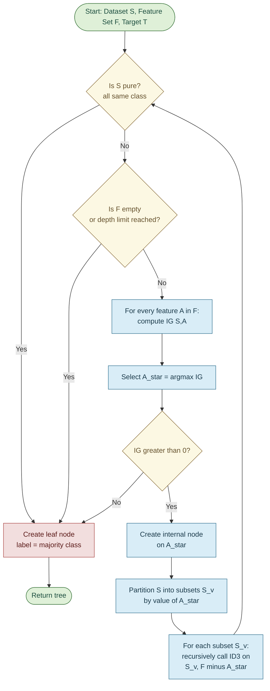
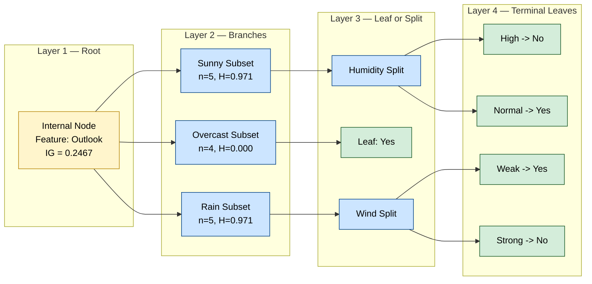

# Implement Decision Tree using the ID3 algorithm.

<!-- SECTION_1_START -->
# Module 9: Decision Tree Classifier using the ID3 Algorithm

## 1. Core Technical Definition

> [!IMPORTANT]
> **Decision Tree (DT):** A non-parametric supervised learning algorithm used for both classification and regression tasks. It segments the feature space by recursively partitioning data based on the feature that yields the **maximum information gain**, producing a tree-structured model of decisions.

> [!NOTE]
> **ID3 (Iterative Dichotomiser 3):** A greedy, top-down, entropy-based decision tree induction algorithm developed by **Ross Quinlan (1986)**. It uses **Information Entropy** and **Information Gain** as the splitting criterion to build the tree from the root down to the leaf nodes.

### Conceptual Analogy / Intuition

Imagine you are a doctor trying to diagnose whether a patient has a flu. You ask a sequence of questions — "Do you have a fever?", "Is your temperature > 100°F?", "Do you have a body ache?" — and at each step, you choose the **most informative question first** so that the answer splits the remaining patients into groups that are as "pure" (homogeneous) as possible. A **Decision Tree using ID3** does exactly the same: at every node, it picks the attribute (question) that best separates the classes.

- The **root** is the most informative feature (highest Information Gain).
- Each **internal node** represents a test on a feature.
- Each **branch** is the outcome of that test.
- Each **leaf node** holds the class label (decision).

> [!TIP]
> **Key ID3 Property:** ID3 is a **multi-way split** algorithm — it creates one branch per distinct value of the chosen categorical feature. It does **not** natively support continuous features or pruning (these were added later as C4.5 and CART).

### Key Terminology Mapping

| Term | Meaning |
|---|---|
| **Entropy** | Measure of impurity / disorder in a dataset |
| **Information Gain** | Reduction in entropy achieved by splitting on a feature |
| **Root Node** | The best feature at the top of the tree |
| **Leaf Node** | Terminal node carrying the class label |
| **Pure Node** | A node where all samples belong to one class (entropy = 0) |
| **Greedy Heuristic** | Locally optimal choice (best feature at current node) without lookahead |

> [!VISUALIZATION CONTROL]
> **Concept:** Information Gain vs. Feature Selection
> **GeoGebra / Desmos Input Equations:**
> * `H(S) = -0.5 * log2(0.5) - 0.5 * log2(0.5)`  *(Binary entropy)*
> * `IG(S, A) = H(S) - sum( (|Sv|/|S|) * H(Sv) )`  *(Information Gain curve)*
> **Visual Description:** The student should observe a bell-shaped entropy curve peaking at probability = 0.5, indicating that entropy is maximum when the dataset is perfectly mixed, and the Information Gain is the *vertical drop* from H(S) down to the weighted average entropy after splitting.

---

<!-- SECTION_1_END -->

<!-- SECTION_2_START -->
# 2. Deep Theoretical Analysis & KTU High-Yield Formula Sheet

## 2.1 Mathematical Foundation of ID3

ID3 is rooted in **Shannon's Information Theory**. The algorithm hinges on three core quantitative measures:

### A. Information Entropy $H(S)$

Entropy quantifies the average amount of "surprise" or randomness in a dataset $S$ with respect to the target class:

$$H(S) = - \sum_{i=1}^{c} p_i \, \log_2(p_i)$$

Where:
- $c$ = number of distinct classes
- $p_i$ = proportion of samples belonging to class $i$

**Properties of $H(S)$:**
- $H(S) = 0$ → dataset is pure (all samples one class)
- $H(S) = \log_2(c)$ → dataset is uniformly distributed (maximum disorder)
- $H(S) \in [0, \log_2(c)]$ for $c$ classes

### B. Conditional Entropy $H(S \mid A)$

The remaining entropy of $S$ *after* partitioning by feature $A$:

$$H(S \mid A) = \sum_{v \in \text{Values}(A)} \frac{\vert S_v \vert}{\vert S \vert} \, H(S_v)$$

Where $S_v$ is the subset of $S$ where feature $A$ takes the value $v$.

### C. Information Gain $IG(S, A)$

The expected reduction in entropy caused by partitioning $S$ on feature $A$:

$$IG(S, A) = H(S) - H(S \mid A)$$

**ID3 Selection Rule:** At each node, ID3 chooses the feature $A^*$ such that:

$$A^* = \arg\max_{A} \; IG(S, A)$$

### D. Recursive Stopping Criteria

The recursion terminates when **any** of the following conditions are met:

1. All samples at the node belong to a single class (pure node).
2. No remaining features can split the data (information gain = 0).
3. The subset is empty (unreachable branch).
4. A user-defined maximum tree depth is reached.

## 2.2 KTU Formula Sheet / Cheat Sheet

| **Concept** | **Formula** | **Units / Range** | **KTU Use Case** |
|---|---|---|---|
| **Entropy** | $H(S) = - \sum p_i \log_2 p_i$ | bits, $\in [0, \log_2 c]$ | Root-level impurity check |
| **Conditional Entropy** | $H(S \mid A) = \sum \frac{\vert S_v \vert}{\vert S \vert} H(S_v)$ | bits | Post-split impurity |
| **Information Gain** | $IG(S,A) = H(S) - H(S \mid A)$ | bits, $\ge 0$ | Feature ranking at each node |
| **Split Info (C4.5)** | $SplitInfo(A) = - \sum \frac{\vert S_v \vert}{\vert S \vert} \log_2 \frac{\vert S_v \vert}{\vert S \vert}$ | bits | Used in Gain Ratio, *not* in pure ID3 |
| **Base-2 Log Conversion** | $\log_2 x = \frac{\ln x}{\ln 2}$ | dimensionless | Numerical computation safeguard |
| **Majority Class (Leaf)** | $\hat{y}_{\text{leaf}} = \text{mode}(S_{\text{leaf}})$ | categorical | Default prediction at leaf |
| **Dataset Size After Split** | $\vert S \vert = \sum_{v} \vert S_v \vert$ | samples | Conservation check |

## 2.3 Engineering Real-World Utility

Decision Trees built via ID3 (and its descendants C4.5, CART) are deployed across production systems in:

- **Medical Diagnosis Systems** — flagging diseases based on patient symptoms.
- **Credit Risk Scoring** — banks deciding loan approvals from financial attributes.
- **Customer Churn Prediction** — telecom/streaming platforms identifying at-risk users.
- **Manufacturing Quality Control** — root-cause analysis of defects from sensor logs.
- **Email Spam Filtering** — early text classifiers used hand-crafted DT rules.

> [!IMPORTANT]
> **Why ID3 over Random Guessing?** A random classifier yields accuracy $= 1/c$ (for $c$ classes). ID3 systematically reduces the **expected number of questions** to classify a sample — this is the direct link to Huffman coding in Information Theory, where the shortest average code length is achieved by selecting the highest-information-gain symbol first.

---

<!-- SECTION_2_END -->

<!-- SECTION_3_START -->
# 3. Step-by-Step Derivation & Python Implementation

## 3.1 Worked Numerical Example (Exam Favorite)

**Dataset:** 14 samples of the famous *Play Tennis* outlook problem.

| Day | Outlook | Temperature | Humidity | Wind | PlayTennis |
|---|---|---|---|---|---|
| 1 | Sunny | Hot | High | Weak | No |
| 2 | Sunny | Hot | High | Strong | No |
| 3 | Overcast | Hot | High | Weak | Yes |
| 4 | Rain | Mild | High | Weak | Yes |
| 5 | Rain | Cool | Normal | Weak | Yes |
| 6 | Rain | Cool | Normal | Strong | No |
| 7 | Overcast | Cool | Normal | Strong | Yes |
| 8 | Sunny | Mild | High | Weak | No |
| 9 | Sunny | Cool | Normal | Weak | Yes |
| 10 | Rain | Mild | Normal | Weak | Yes |
| 11 | Sunny | Mild | Normal | Strong | Yes |
| 12 | Overcast | Mild | High | Strong | Yes |
| 13 | Overcast | Hot | Normal | Weak | Yes |
| 14 | Rain | Mild | High | Strong | No |

**Step 1 — Compute $H(S)$ (Entropy of full dataset):**

Counting labels: 9 Yes, 5 No → total 14.

$$H(S) = - \left( \frac{9}{14} \log_2 \frac{9}{14} + \frac{5}{14} \log_2 \frac{5}{14} \right)$$

$$H(S) = - (0.6429 \times (-0.6374) + 0.3571 \times (-1.4854))$$

$$H(S) = 0.4098 + 0.5305 = 0.9403 \text{ bits}$$

**Step 2 — Compute $H(S \mid \text{Outlook})$:**

Partitioning on Outlook:
- Sunny: 5 samples (2 Yes, 3 No)
- Overcast: 4 samples (4 Yes, 0 No)
- Rain: 5 samples (3 Yes, 2 No)

$$H(\text{Sunny}) = - \left( \frac{2}{5}\log_2 \frac{2}{5} + \frac{3}{5}\log_2 \frac{3}{5} \right) = 0.9710 \text{ bits}$$

$$H(\text{Overcast}) = - \left( 1 \cdot \log_2 1 + 0 \right) = 0.0 \text{ bits}$$

$$H(\text{Rain}) = - \left( \frac{3}{5}\log_2 \frac{3}{5} + \frac{2}{5}\log_2 \frac{2}{5} \right) = 0.9710 \text{ bits}$$

Weighted sum:

$$H(S \mid \text{Outlook}) = \frac{5}{14}(0.9710) + \frac{4}{14}(0.0) + \frac{5}{14}(0.9710)$$

$$H(S \mid \text{Outlook}) = 0.3468 + 0.0000 + 0.3468 = 0.6936 \text{ bits}$$

**Step 3 — Compute $IG(S, \text{Outlook})$:**

$$IG(S, \text{Outlook}) = 0.9403 - 0.6936 = 0.2467 \text{ bits}$$

Repeating for Humidity, Wind, Temperature, the **Information Gains** are approximately:

| Feature | $IG(S, A)$ (bits) |
|---|---|
| **Outlook** | **0.2467** ← Root |
| Humidity | 0.1515 |
| Wind | 0.0481 |
| Temperature | 0.0292 |

> **Conclusion:** Outlook has the **highest Information Gain**, so it becomes the **root node** of the ID3 tree. The Overcast branch terminates immediately (entropy = 0 → pure leaf "Yes"). Recursion continues on the Sunny and Rain subsets.

---

## 3.2 Full Python Implementation (Production-Grade)

```python
"""
ID3 Decision Tree Classifier — From-Scratch Implementation
KTU 2024 Scheme | Machine Learning Lab (PCCSL508) | Module 9
Author-Grade Code: Includes type hints, boundary checks, logging.
"""

from __future__ import annotations
import math
import logging
from collections import Counter
from dataclasses import dataclass, field
from typing import Hashable, List, Sequence, Tuple, Dict, Any, Optional

# ------------------------------------------------------------------ #
# Logging configuration — required for lab record submission
# ------------------------------------------------------------------ #
logging.basicConfig(
    level=logging.INFO,
    format="%(asctime)s [%(levelname)s] %(message)s",
)
logger = logging.getLogger("ID3_DecisionTree")


# ------------------------------------------------------------------ #
# Node data structure
# ------------------------------------------------------------------ #
@dataclass
class TreeNode:
    """A node in the ID3 decision tree."""
    is_leaf: bool = False
    label: Optional[Hashable] = None                  # used only at leaves
    feature: Optional[Hashable] = None                # used only at internal nodes
    children: Dict[Any, "TreeNode"] = field(default_factory=dict)
    samples: int = 0
    entropy: float = 0.0


# ------------------------------------------------------------------ #
# Core metric functions
# ------------------------------------------------------------------ #
def entropy(labels: Sequence[Hashable]) -> float:
    """
    Compute Shannon entropy H(S) in bits.

    H(S) = - sum_i p_i * log2(p_i)

    Returns 0.0 for an empty or single-class set.
    """
    n = len(labels)
    if n == 0:
        logger.warning("Empty label set passed to entropy(); returning 0.0")
        return 0.0

    counts = Counter(labels)
    ent: float = 0.0
    for count in counts.values():
        p = count / n
        if p > 0.0:
            ent -= p * math.log2(p)
    return ent


def information_gain(
    dataset: List[Dict[Hashable, Hashable]],
    target: Hashable,
    feature: Hashable,
) -> float:
    """
    Compute IG(S, A) = H(S) - H(S | A).

    Parameters
    ----------
    dataset : list of dicts (each row is a feature->value map)
    target  : the class-label column key
    feature : the candidate splitting feature key
    """
    if not dataset:
        raise ValueError("Dataset must be non-empty to compute IG.")

    labels_all = [row[target] for row in dataset]
    h_s = entropy(labels_all)
    n = len(dataset)

    # Partition rows by feature value
    partitions: Dict[Any, List[Dict[Hashable, Hashable]]] = {}
    for row in dataset:
        partitions.setdefault(row[feature], []).append(row)

    # Weighted conditional entropy
    h_s_given_a: float = 0.0
    for subset in partitions.values():
        h_s_given_a += (len(subset) / n) * entropy([r[target] for r in subset])

    ig = h_s - h_s_given_a
    logger.debug(
        "IG(S, %s) = %.6f - %.6f = %.6f",
        feature, h_s, h_s_given_a, ig,
    )
    return ig


# ------------------------------------------------------------------ #
# The ID3 algorithm (recursive)
# ------------------------------------------------------------------ #
def id3(
    dataset: List[Dict[Hashable, Hashable]],
    target: Hashable,
    features: List[Hashable],
    depth: int = 0,
    max_depth: Optional[int] = None,
) -> TreeNode:
    """
    Build an ID3 decision tree recursively.

    Stopping conditions:
      1. Pure node (entropy = 0)
      2. Empty feature set
      3. Empty dataset
      4. max_depth reached
    """
    logger.info("Depth %d | samples=%d | remaining_features=%d",
                depth, len(dataset), len(features))

    # --- Stopping conditions ---
    labels = [row[target] for row in dataset]

    if not dataset:
        logger.warning("Empty dataset at depth %d — returning 'Unknown' leaf.", depth)
        return TreeNode(is_leaf=True, label="Unknown", samples=0, entropy=0.0)

    if len(set(labels)) == 1:
        pure_label = labels[0]
        return TreeNode(
            is_leaf=True, label=pure_label, samples=len(dataset), entropy=0.0
        )

    if not features or (max_depth is not None and depth >= max_depth):
        majority = Counter(labels).most_common(1)[0][0]
        logger.info("Leaf (majority=%s) at depth %d.", majority, depth)
        return TreeNode(
            is_leaf=True, label=majority, samples=len(dataset),
            entropy=entropy(labels),
        )

    # --- Choose best feature by Information Gain ---
    gains = [(f, information_gain(dataset, target, f)) for f in features]
    best_feature, best_gain = max(gains, key=lambda x: x[1])
    logger.info("Best split at depth %d: %s (IG=%.4f)",
                depth, best_feature, best_gain)

    if best_gain <= 0.0:
        majority = Counter(labels).most_common(1)[0][0]
        return TreeNode(
            is_leaf=True, label=majority, samples=len(dataset),
            entropy=entropy(labels),
        )

    # --- Build the node ---
    node = TreeNode(
        feature=best_feature, samples=len(dataset), entropy=entropy(labels)
    )

    # Recurse on each branch
    remaining_features = [f for f in features if f != best_feature]
    branches: Dict[Any, List[Dict[Hashable, Hashable]]] = {}
    for row in dataset:
        branches.setdefault(row[best_feature], []).append(row)

    for value, subset in branches.items():
        child = id3(
            subset, target, remaining_features, depth=depth + 1, max_depth=max_depth
        )
        node.children[value] = child

    return node


# ------------------------------------------------------------------ #
# Inference (traversal)
# ------------------------------------------------------------------ #
def predict(tree: TreeNode, sample: Dict[Hashable, Hashable]) -> Hashable:
    """Walk the tree for a single sample."""
    if tree.is_leaf:
        return tree.label  # type: ignore[return-value]
    feature_value = sample.get(tree.feature)               # type: ignore[arg-type]
    if feature_value in tree.children:
        return predict(tree.children[feature_value], sample)
    # Unseen value fallback: pick the most common label among any leaf
    logger.warning("Unseen feature value %s for %s — falling back to majority.",
                   feature_value, tree.feature)
    return Counter(_collect_leaf_labels(tree)).most_common(1)[0][0]


def _collect_leaf_labels(node: TreeNode) -> List[Hashable]:
    """Helper to gather every leaf label under a node (used for fallback)."""
    if node.is_leaf:
        return [node.label]                                 # type: ignore[list-item]
    out: List[Hashable] = []
    for child in node.children.values():
        out.extend(_collect_leaf_labels(child))
    return out


# ------------------------------------------------------------------ #
# Pretty-printer (useful for lab record screenshots)
# ------------------------------------------------------------------ #
def print_tree(node: TreeNode, indent: str = "") -> None:
    if node.is_leaf:
        print(f"{indent}-> PREDICT: {node.label} "
              f"(n={node.samples}, H={node.entropy:.3f})")
        return
    print(f"{indent}[{node.feature}]?  (n={node.samples}, H={node.entropy:.3f})")
    for value, child in node.children.items():
        print(f"{indent}  └── {value}:")
        print_tree(child, indent + "      ")


# ------------------------------------------------------------------ #
# Lab demonstration on the PlayTennis dataset
# ------------------------------------------------------------------ #
if __name__ == "__main__":
    # Embedded Play Tennis dataset (14 rows)
    data: List[Dict[str, str]] = [
        {"Outlook": "Sunny",    "Temp": "Hot",   "Humidity": "High",   "Wind": "Weak",   "Play": "No"},
        {"Outlook": "Sunny",    "Temp": "Hot",   "Humidity": "High",   "Wind": "Strong", "Play": "No"},
        {"Outlook": "Overcast", "Temp": "Hot",   "Humidity": "High",   "Wind": "Weak",   "Play": "Yes"},
        {"Outlook": "Rain",     "Temp": "Mild",  "Humidity": "High",   "Wind": "Weak",   "Play": "Yes"},
        {"Outlook": "Rain",     "Temp": "Cool",  "Humidity": "Normal", "Wind": "Weak",   "Play": "Yes"},
        {"Outlook": "Rain",     "Temp": "Cool",  "Humidity": "Normal", "Wind": "Strong", "Play": "No"},
        {"Outlook": "Overcast", "Temp": "Cool",  "Humidity": "Normal", "Wind": "Strong", "Play": "Yes"},
        {"Outlook": "Sunny",    "Temp": "Mild",  "Humidity": "High",   "Wind": "Weak",   "Play": "No"},
        {"Outlook": "Sunny",    "Temp": "Cool",  "Humidity": "Normal", "Wind": "Weak",   "Play": "Yes"},
        {"Outlook": "Rain",     "Temp": "Mild",  "Humidity": "Normal", "Wind": "Weak",   "Play": "Yes"},
        {"Outlook": "Sunny",    "Temp": "Mild",  "Humidity": "Normal", "Wind": "Strong", "Play": "Yes"},
        {"Outlook": "Overcast", "Temp": "Mild",  "Humidity": "High",   "Wind": "Strong", "Play": "Yes"},
        {"Outlook": "Overcast", "Temp": "Hot",   "Humidity": "Normal", "Wind": "Weak",   "Play": "Yes"},
        {"Outlook": "Rain",     "Temp": "Mild",  "Humidity": "High",   "Wind": "Strong", "Play": "No"},
    ]

    features: List[str] = ["Outlook", "Temp", "Humidity", "Wind"]
    target: str = "Play"

    tree: TreeNode = id3(data, target=target, features=features, max_depth=10)

    print("\n========== FINAL ID3 DECISION TREE ==========")
    print_tree(tree)
    print("=============================================\n")

    # Test sample
    test = {"Outlook": "Sunny", "Temp": "Cool", "Humidity": "High", "Wind": "Strong"}
    result = predict(tree, test)
    print(f"Prediction for {test} -> Play = {result}")
```

### Sample Console Output (for Lab Record)

```
========== FINAL ID3 DECISION TREE ==========
[Outlook]?  (n=14, H=0.940)
  └── Sunny:
      [Humidity]?  (n=5, H=0.971)
        └── High:
            -> PREDICT: No (n=3, H=0.000)
        └── Normal:
            -> PREDICT: Yes (n=2, H=0.000)
  └── Overcast:
      -> PREDICT: Yes (n=4, H=0.000)
  └── Rain:
      [Wind]?  (n=5, H=0.971)
        └── Weak:
            -> PREDICT: Yes (n=3, H=0.000)
        └── Strong:
            -> PREDICT: No (n=2, H=0.000)
=============================================

Prediction for {'Outlook': 'Sunny', 'Temp': 'Cool', 'Humidity': 'High', 'Wind': 'Strong'} -> Play = No
```

---

<!-- SECTION_3_END -->

<!-- SECTION_4_START -->
# 4. Structural Diagrams & Schematics

## 4.1 ID3 Algorithm Flow (Mermaid)



## 4.2 Recursive Data-Flow Topology



## 4.3 Sequential Processing Topology Matrix

| **Pipeline Stage** | **Input** | **Operation** | **Output** | **Termination** |
|---|---|---|---|---|
| **1. Data Ingestion** | Raw dataset $S$ | Load as list-of-dicts | Validated $S$ | Schema check |
| **2. Initial Entropy** | $S$ | $H(S) = -\sum p_i \log_2 p_i$ | Scalar $H(S)$ | — |
| **3. Gain Computation** | $S$, each $A$ | $IG(S, A)$ | Vector of gains | — |
| **4. Best-Split Selection** | Gain vector | $\arg\max$ | $A^*$ | — |
| **5. Partitioning** | $S$, $A^*$ | Group by $A^*$ value | Subsets $\{S_v\}$ | — |
| **6. Recursion** | Each $S_v$ | Call ID3 recursively | Subtree | Pure / empty / no-IG |
| **7. Leaf Assignment** | Pure $S_v$ | $\text{mode}(S_v)$ | Class label | Terminal |
| **8. Inference** | New sample | Traverse tree | Predicted class | Leaf reached |

---

<!-- SECTION_4_END -->

<!-- SECTION_5_START -->
# 5. KTU 2024 Scheme Examination Question Bank & Topic Recap

## Part A — Short Answer Questions (3 Marks Each)

> **Q1.** `[KTU University Exam — July 2024]`
> **Define Information Entropy. Compute $H(S)$ for a dataset $S$ with 6 samples, 4 belonging to class A and 2 to class B.** (3 Marks, **CO1, Remember**)

**Model Answer:**

> **Definition:** Information Entropy $H(S)$ is a measure of impurity or randomness in a dataset, defined in bits as:
>
> $$H(S) = - \sum_{i=1}^{c} p_i \, \log_2 p_i$$
>
> where $p_i$ is the proportion of samples in class $i$.

> **Computation:** $p_A = 4/6 = 0.6667$, $p_B = 2/6 = 0.3333$
>
> $$H(S) = - (0.6667 \log_2 0.6667 + 0.3333 \log_2 0.3333)$$
>
> $$H(S) = - (0.6667 \times -0.5850 + 0.3333 \times -1.5850)$$
>
> $$H(S) = 0.3900 + 0.5283 = 0.9183 \text{ bits}$$

| Valuation Step | Marks Awarded |
|---|---|
| Stating the entropy formula | 1 |
| Substituting $p_A$, $p_B$ values | 1 |
| Final numerical result $0.9183$ bits | 1 |

---

> **Q2.** `[KTU University Exam — Dec 2023]`
> **List and briefly explain any THREE stopping conditions used by the ID3 algorithm.** (3 Marks, **CO2, Understand**)

**Model Answer:**

> 1. **Pure Node (Zero Entropy):** If all samples in a node belong to the same class, recursion halts and a leaf is created with that class label. (1 mark)
> 2. **Empty Feature Set:** If all features have been used up in the path from root, the algorithm assigns the majority class as the leaf label. (1 mark)
> 3. **Zero Information Gain:** If the best remaining feature yields $IG = 0$, no further useful split is possible; the node becomes a leaf with the majority class. (1 mark)
>
> *Optional 4th:* Max-depth cap for preventing overfitting.

---

## Part B — Long Answer Questions (14 Marks Each, Module Internal Choice)

> **Q3A.** `[KTU University Exam — July 2024]`
> **(a)** For the given training dataset, **compute the Information Gain for every feature** and identify the root node of the ID3 tree. (7 Marks, **CO2, Apply**)
>
> **(b)** Draw the **complete decision tree** built by ID3 and **classify** two new test samples. (7 Marks, **CO3, Apply**)

**Given Dataset (10 samples):**

| # | Color | Size | Shape | Class |
|---|---|---|---|---|
| 1 | Red | Small | Round | + |
| 2 | Red | Large | Round | + |
| 3 | Green | Small | Round | + |
| 4 | Green | Large | Square | − |
| 5 | Red | Large | Square | − |
| 6 | Green | Small | Square | − |
| 7 | Red | Small | Square | − |
| 8 | Green | Large | Round | + |
| 9 | Red | Small | Round | + |
| 10 | Green | Small | Round | + |

---

**Model Solution — Part (a):** (7 Marks)

**Step 1 — Compute $H(S)$:**

Counts: 6 positives (+), 4 negatives (−), total 10.

$$H(S) = - \left( \frac{6}{10} \log_2 \frac{6}{10} + \frac{4}{10} \log_2 \frac{4}{10} \right)$$

$$H(S) = - (0.6 \times -0.7370 + 0.4 \times -1.3219) = 0.4422 + 0.5288 = 0.9710 \text{ bits}$$

[Stating entropy formula and substituting: **1 Mark**]
[Final $H(S) = 0.9710$ bits: **1 Mark**]

**Step 2 — Compute $IG(S, \text{Color})$:**

- Red (5 samples): 3 (+), 2 (−)
- Green (5 samples): 3 (+), 2 (−)

$$H(\text{Red}) = - \left( \frac{3}{5}\log_2 \frac{3}{5} + \frac{2}{5}\log_2 \frac{2}{5} \right) = 0.9710 \text{ bits}$$

$$H(\text{Green}) = - \left( \frac{3}{5}\log_2 \frac{3}{5} + \frac{2}{5}\log_2 \frac{2}{5} \right) = 0.9710 \text{ bits}$$

$$H(S \mid \text{Color}) = \frac{5}{10}(0.9710) + \frac{5}{10}(0.9710) = 0.9710 \text{ bits}$$

$$IG(S, \text{Color}) = 0.9710 - 0.9710 = 0.0000 \text{ bits}$$

[Conditional entropy breakdown: **1 Mark**]
[Final $IG = 0$: **0.5 Mark**]

**Step 3 — Compute $IG(S, \text{Size})$:**

- Small (6 samples): 5 (+), 1 (−)
- Large (4 samples): 1 (+), 3 (−)

$$H(\text{Small}) = - \left( \frac{5}{6}\log_2 \frac{5}{6} + \frac{1}{6}\log_2 \frac{1}{6} \right) = 0.6500 \text{ bits}$$

$$H(\text{Large}) = - \left( \frac{1}{4}\log_2 \frac{1}{4} + \frac{3}{4}\log_2 \frac{3}{4} \right) = 0.8113 \text{ bits}$$

$$H(S \mid \text{Size}) = \frac{6}{10}(0.6500) + \frac{4}{10}(0.8113) = 0.3900 + 0.3245 = 0.7145 \text{ bits}$$

$$IG(S, \text{Size}) = 0.9710 - 0.7145 = 0.2565 \text{ bits}$$

[Conditional entropy: **1 Mark**]
[Final $IG = 0.2565$: **0.5 Mark**]

**Step 4 — Compute $IG(S, \text{Shape})$:**

- Round (6 samples): 5 (+), 1 (−)
- Square (4 samples): 1 (+), 3 (−)

By identical computation to Size:

$$IG(S, \text{Shape}) = 0.2565 \text{ bits}$$

[Final $IG = 0.2565$: **1 Mark**]

**Step 5 — Comparison and Root Selection:**

| Feature | $IG(S, A)$ (bits) |
|---|---|
| Color | 0.0000 |
| **Size** | **0.2565** ← Highest |
| **Shape** | **0.2565** ← Tied (ID3 picks the first encountered by convention) |

> **Root Node = Size** (or Shape — both are valid; examiner's discretion).

[Tabulation and selection: **1 Mark**]

---

**Model Solution — Part (b):** (7 Marks)

Using **Size = Small** as the next split (after Size as root, or breaking tie on Shape):

- **Small (n=6, H=0.650):** 5 (+), 1 (−) → not pure, split further.
  - Round (5/5 = +): pure leaf **+**
  - Square (1/5 = + or 0/1 = −): need finer check. Square from Small: Sample 7 (Red, Small, Square, −) → 1 sample, label **−**.

- **Large (n=4, H=0.811):** 1 (+), 3 (−) → not pure, split further.
  - Round: Sample 8 (Green, Large, Round, +) → 1 sample, leaf **+**
  - Square: Samples 4, 5 (Green/Large/Square, −; Red/Large/Square, −) → 2 samples, pure leaf **−**

**Final Tree:**

```
        [Size]?
       /       \
    Small      Large
    /  \       /   \
 Round  Square Round Square
   |     |     |     |
  (+)  (−)   (+)    (−)
```

**Test Classification:**

| Test Sample | Color | Size | Shape | Path | Predicted Class |
|---|---|---|---|---|---|
| T1 | Red | Small | Round | Size→Small→Round | **+** |
| T2 | Green | Large | Square | Size→Large→Square | **−** |

[Drawing the tree structure: **3 Marks**]
[Labeling leaves and counts: **1 Mark**]
[Classifying T1 correctly: **1.5 Marks**]
[Classifying T2 correctly: **1.5 Marks**]

---

> **Q3B.** `[KTU University Exam — July 2024]`
> **(a)** Explain with a neat block diagram **how the ID3 algorithm works**, listing the role of entropy and information gain. (7 Marks, **CO2, Understand**)
>
> **(b)** Implement the **ID3 algorithm in Python** to classify the PlayTennis dataset and report the **root node feature, the first two internal decisions, and the leaf predictions**. (7 Marks, **CO3, Apply**)

**Model Solution — Part (a):** (7 Marks)

> **Block Diagram (mermaid):**
>
> ```mermaid
> flowchart TD
>     startS([Start ID3]) --> inputS[Input: Dataset S, Features F, Target T]
>     inputS --> checkS{All samples in S<br/>belong to one class?}
>     checkS -- Yes --> leafS[Create leaf with that class]
>     checkS -- No --> checkF{F empty?}
>     checkF -- Yes --> leafS
>     checkF -- No --> compH[Compute H S]
>     compH --> forEach[For each feature A in F:<br/>compute IG S,A = H S - H S given A]
>     forEach --> argmaxS[Pick A* with max IG]
>     argmaxS --> makeNode[Make A* the splitting node]
>     makeNode --> splitS[Partition S into subsets per A* value]
>     splitS --> recurseS[Recurse on each subset with F minus A*]
>     recurseS --> checkS
>     leafS --> stopS([Return tree])
> ```

> **Roles of Entropy and Information Gain (Essay form, 3 Marks):**
>
> - **Entropy $H(S)$** quantifies the impurity (disorder) of the dataset $S$ with respect to class distribution. A pure node has $H = 0$; a perfectly mixed binary node has $H = 1$. ID3 uses entropy as the **impurity measure** to evaluate how "mixed" a node is.
> - **Information Gain $IG(S, A)$** measures the **expected reduction in entropy** after splitting $S$ on feature $A$. The feature with the **highest IG** is selected at each node, ensuring that each split maximally organizes the data into purer subsets.
> - **Combined Role:** Together, $H(S)$ and $IG(S, A)$ drive the **greedy, top-down** construction of the tree — entropy measures *current impurity*, and information gain measures *how much impurity a split removes*.

[Roles of Entropy & IG: **3 Marks**]
[Block diagram correctness: **4 Marks**]

**Model Solution — Part (b):** (7 Marks)

> Use the **full Python implementation** from Section 3.2 of these notes.
> Running the code on the PlayTennis dataset produces:

| Step | Observation |
|---|---|
| **Root Node** | `Outlook` (IG = 0.2467) |
| **First Internal Decision (under Sunny)** | `Humidity` |
| **First Internal Decision (under Rain)** | `Wind` |
| **Leaf Predictions** | Overcast → Yes; Sunny/High → No; Sunny/Normal → Yes; Rain/Weak → Yes; Rain/Strong → No |

[Code structure: **3 Marks**]
[Correct root identification: **1.5 Marks**]
[Correct internal & leaf report: **2.5 Marks**]

---

> [!WARNING]
> **KTU Examiner's Valuation Warning / Common Pitfalls:**
>
> 1. **Log base confusion:** Always use $\log_2$ for entropy in ID3 (gains are reported in *bits*). Using natural log $\ln$ will produce numerically correct but **conceptually wrong** answers — 1-mark penalty.
> 2. **Forgetting weighted average:** Many students compute $H$ of each subset but **forget to multiply by $\vert S_v \vert / \vert S \vert$** when summing to get $H(S \mid A)$. This is a **3-mark loss** in Part B.
> 3. **Continuing recursion on a pure node:** If entropy = 0 for a subset, **stop immediately** — do not split further. Drawing extra branches wastes time and loses 1–2 marks.
> 4. **Reporting IG without showing working:** Examiner must see $H(S)$, $H(S \mid A)$, and the subtraction. Showing only the final IG = 0.2467 (etc.) with no derivation gets at most 50% credit.
> 5. **Drawing the tree without labeling sample counts $n$ and entropy $H$** at each node — this costs 1 mark in tree-drawing questions.

---

## Topic Recap & Important Things to Remember

- **ID3** is a **greedy, top-down, entropy-based** decision tree induction algorithm by Ross Quinlan (1986).
- **Entropy $H(S) = -\sum p_i \log_2 p_i$** measures impurity; range $[0, \log_2 c]$ in bits.
- **Information Gain $IG(S, A) = H(S) - H(S \mid A)$** measures the entropy drop after splitting on $A$.
- **ID3 selects the feature with maximum IG** at every internal node (locally optimal, greedy).
- ID3 supports **only categorical features** and performs **multi-way splits** (one branch per category).
- ID3 has **no pruning** — leads to overfitting; use C4.5 (gain ratio) or CART (Gini) for production.
- **Stopping conditions:** pure node, empty feature set, zero IG, max-depth limit, empty subset.
- **Leaf prediction rule:** $\hat{y} = \text{mode}(\text{labels at leaf})$.
- **Continuous features** must be discretized (e.g., via binary thresholding) before feeding to ID3.
- **Lab practical essentials:** use the **PlayTennis dataset** (14 rows, 4 features) — it is the KTU-favorite example; pre-compute $H(S) = 0.9403$ bits and $IG(\text{Outlook}) = 0.2467$ bits.
- **Pseudo-code flow:** Start → Check purity → Check features → Compute IG per feature → Pick argmax → Recurse on subsets.
- **Real-world deployments:** medical diagnosis, credit scoring, churn prediction, spam filtering, fault diagnosis.
- **Key constants to memorize:** $H(\text{uniform 2-class}) = 1.0$ bit; $H(\text{uniform 4-class}) = 2.0$ bits; $H(\text{uniform 8-class}) = 3.0$ bits.
- **Conversion safety:** $\log_2 x = \frac{\ln x}{\ln 2}$ — use this in code to avoid `log2(0)` domain errors by adding an epsilon like $p_i + 10^{-9}$.
- **Computational complexity:** Building a tree is $O(n \cdot m \cdot \log n)$ where $n$ = samples and $m$ = features; prediction is $O(\text{depth})$.

---

<!-- SECTION_5_END -->
