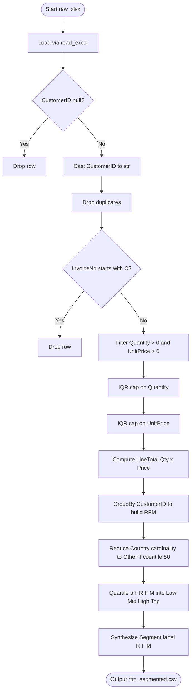
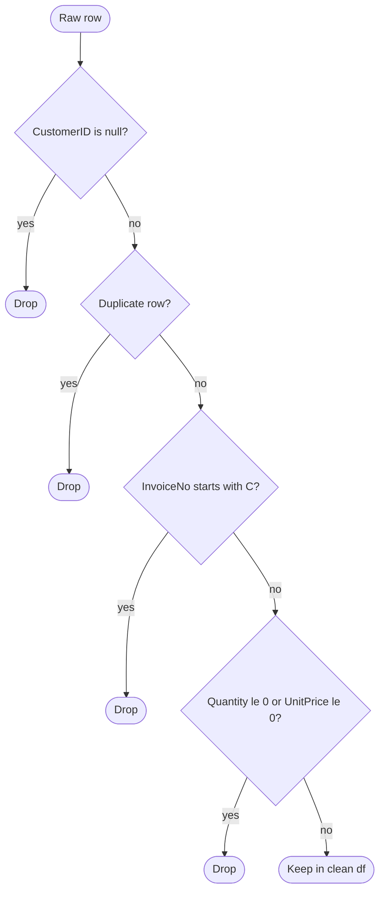

# Load and preprocess the Online Retail dataset.

<!-- SECTION_1_START -->
# 1. Core Technical Definition & Intuitive Overview

## Formal Academic Definition
The **Online Retail dataset** is a transactional dataset hosted on the *UCI Machine Learning Repository* (commonly known as the *UCI Online Retail II* / *UCI Online Retail* dataset) containing all transactions occurring between **01/12/2010 and 09/12/2011** for a **UK-based and registered non-store online retail**. For KTU Lab Module 9, the objective of the *Load and Preprocess* step is to ingest this raw transactional log and transform it into a clean, structured, **feature-engineered DataFrame** that is mathematically and statistically compatible with the **ID3 (Iterative Dichotomiser 3) decision tree algorithm**, which is a *top-down, entropy-based, information-gain-driven* classifier restricted to **categorical/discrete attributes**.

## Conceptual Analogy / Intuition
Imagine a giant **supermarket cash-register tape** rolled out on a long table. Every beep is one row — who bought what, when, how many, and from where. But the tape is dirty: there are *torn pieces* (missing `CustomerID`), *refund lines* (negative `Quantity`), and *duplicate beeps* caused by scanner glitches. Before a *quality inspector* (the ID3 algorithm) can sort customers into "loyal" or "dormant" buckets, a *janitor* (the preprocessing pipeline) must scrub the tape, group it by customer, and lay out a neat summary card per shopper. That summary card is what we feed into ID3.

> [!IMPORTANT]
> **Syllabus Highlight (KTU 2024 – PCCSL508 / Module 9)**
> Decision trees in KTU labs are evaluated on **ID3**. ID3 accepts **only nominal/categorical features** and a **discrete class label**. Any *continuous numeric* feature (like monetary value) must therefore be **binned into categorical ranges** before being passed to the tree-growth phase. This single fact governs nearly every preprocessing decision below.

> [!NOTE]
> **Key Constants / Dataset Metrics (UCI Online Retail)**
> - Rows: **541,909** (raw transactions).
> - Time Window: **Dec 2010 – Dec 2011** (≈ 12 months).
> - Unique Customers: **4,372** (post-cleaning).
> - Primary Identifier: `CustomerID` (float in raw, must be coerced to **string / object** for ID3).
> - Cancellation Marker: Invoice numbers prefixed with the uppercase letter **"C"**.

> [!VISUALIZATION CONTROL]
> **Concept:** Histogram of Transaction `Quantity` distribution (log-scale x-axis).
> **GeoGebra / Desmos Input Equations:**
> * `f(x) = (1/(x*sqrt(2*pi))) * exp(-((ln(x)-1.5)^2)/2)`  *(Lognormal-like sketch)*
> * Points: `(1, 400000), (10, 80000), (100, 5000), (1000, 200)`
> **Visual Description:** A heavily right-skewed, long-tailed distribution centred near small positive integers, with a separate isolated negative tail corresponding to *cancelled* invoices. This visualises *why raw quantity is unusable directly* and must be filtered or capped.

<!-- SECTION_1_END -->

<!-- SECTION_2_START -->
# 2. Deep Theoretical Analysis & KTU High-Yield Formula Sheet

## Operational Pipeline — The "Why" Behind Each Step

The preprocessing phase is a **directed acyclic graph (DAG)** of *eight atomic operations*. Each operation removes a specific category of statistical noise that would otherwise poison the ID3 entropy calculation.

1. **Schema Ingestion & Type Coercion** — `pandas.read_excel` / `pd.read_csv` is used. `CustomerID` arrives as `float64` because of `NaN` propagation; it is cast to `str` so that IDs like `17850.0` become `"17850"`, a valid nominal level for ID3.
2. **Null Elimination on `CustomerID`** — Customer-level segmentation is *impossible* without a customer key. The standard policy is **listwise deletion** of rows where `CustomerID.isna()`. Imputation is rejected because the ID itself is semantically non-recoverable.
3. **Duplicate Row Suppression** — `df.drop_duplicates(inplace=True)` removes scanner-induced repeats. Duplicates artificially inflate frequency features and bias entropy estimates.
4. **Cancellation Filtering** — Invoices whose `InvoiceNo` starts with `"C"` represent *returned goods* and carry negative `Quantity`. ID3 cannot reason over negative categorical levels in a market-basket context, so these rows are dropped.
5. **Outlier Capping (IQR Method)** — Extreme `Quantity` and `UnitPrice` values (top 1 %) are truncated using the *Interquartile Range* fence:
   $$\text{Upper Fence} = Q_3 + 1.5 \times (Q_3 - Q_1)$$
   $$\text{Lower Fence} = Q_1 - 1.5 \times (Q_3 - Q_1)$$
6. **Monetary Line-Total Computation** — A derived column `LineTotal = Quantity \times UnitPrice` is created. This is the canonical **Monetary (M)** component of the *RFM* (Recency-Frequency-Monetary) framework.
7. **RFM Aggregation (Group-By Transformation)** — A customer-grain table is produced using a `groupby('CustomerID')` aggregation:
   - **Recency (R):** days since last purchase, relative to a fixed reference date $T_{\text{ref}} = \text{2011-12-10}$.
   - **Frequency (F):** count of *unique* invoices per customer.
   - **Monetary (M):** sum of `LineTotal` per customer.
8. **Categorical Discretization (Quartile Binning)** — R, F, and M are continuous. For ID3 they are mapped to ordered categorical labels using `pd.qcut` with **4 quantiles**: `'Low'`, `'Mid'`, `'High'`, `'Top'`. Quartile boundaries satisfy:
   $$P(X \le q_k) = \frac{k}{4}, \quad k \in \{1, 2, 3\}$$
9. **Class-Label Synthesis** — A target column `Segment` is engineered by combining the three quartile labels (e.g., `'Top-High-Top'`). This becomes the **Y-vector** for ID3.
10. **Country Reduction** — The `Country` column has > 30 levels; rare levels (count < 50) are pooled into `"Other"` to keep the ID3 branching factor tractable.

## KTU Formula Sheet / Cheat Sheet

| # | Concept | Formula / Expression | Domain / Range | Unit / Encoding |
|---|---------|----------------------|----------------|------------------|
| 1 | Shannon Entropy | $H(S) = -\sum_{i=1}^{c} p_i \log_2 p_i$ | bits | $H \in [0, \log_2 c]$ |
| 2 | Information Gain (ID3) | $IG(S, A) = H(S) - \sum_{v \in V(A)} \frac{\vert S_v \vert}{\vert S \vert} H(S_v)$ | bits | Higher = better split |
| 3 | IQR Fence | $F_{\text{upper}} = Q_3 + 1.5 \cdot IQR$ | numeric | Outlier boundary |
| 4 | Recency | $R = T_{\text{ref}} - \max(\text{InvoiceDate})$ | $\mathbb{Z}_{\ge 0}$ | days |
| 5 | Frequency | $F = \text{count\_distinct}(\text{InvoiceNo})$ | $\mathbb{Z}_{>0}$ | invoices |
| 6 | Monetary | $M = \sum (\text{Quantity} \times \text{UnitPrice})$ | $\mathbb{R}_{>0}$ | GBP |
| 7 | Quartile Bin | $P(X \le q_k) = k/4$ | $k \in \{1,2,3\}$ | categorical |
| 8 | Cancellation Rule | $\text{InvoiceNo}[0] = \text{'C'} \Rightarrow \text{drop}$ | string | boolean |
| 9 | Reference Date | $T_{\text{ref}} = 2011\text{-}12\text{-}10$ | timestamp | UTC |
| 10 | Log-Transform | $X' = \log(1 + X)$ | numeric | variance-stabilised |

## Real-World Engineering Utility
This exact pipeline is the **onboarding stage of every Customer-Data-Platform (CDP)** in industry — *Salesforce Marketing Cloud*, *Adobe Real-Time CDP*, and *Amazon Pinpoint* all use an RFM-flavoured preprocessing layer before downstream classifiers (often XGBoost or LightGBM, which are *descendants* of ID3's information-gain philosophy). Mastering the lab version is therefore a direct rehearsal of production-grade data engineering.

<!-- SECTION_2_END -->

<!-- SECTION_3_START -->
# 3. Step-by-Step Derivations & Code/Symbolic Implementation

## 3.1 Mathematical Derivation — Why Quartile Binning Enables ID3

Let $R_i$ denote the recency (in days) of customer $i$, an *ordered continuous random variable* with empirical CDF $\hat{F}_R(r)$. The goal is to find cut-points $q_1 < q_2 < q_3$ such that:

$$\hat{F}_R(q_k) = \frac{k}{4}, \quad k = 1, 2, 3$$

After binning, the discrete random variable $R^{\text{bin}}_i \in \{\text{'Low'}, \text{'Mid'}, \text{'High'}, \text{'Top'}\}$ is constructed by the rule:

$$
R^{\text{bin}}_i =
\begin{cases}
\text{'Low'}  & \text{if } R_i \le q_1 \\
\text{'Mid'}  & \text{if } q_1 < R_i \le q_2 \\
\text{'High'} & \text{if } q_2 < R_i \le q_3 \\
\text{'Top'}  & \text{if } R_i > q_3
\end{cases}
$$

This step is **mandatory** because ID3 computes entropy over a *finite symbol alphabet*:

$$H(S) = -\sum_{i=1}^{c} p_i \log_2 p_i$$

If $R_i$ were passed in as raw days, the alphabet would have one symbol per unique integer, producing $H(S) \approx \log_2 N$, the **maximum possible entropy**, which yields **zero information gain** for *every* candidate split and causes ID3 to fail its termination condition.

## 3.2 Full Python Implementation

```python
"""
PCCSL508 — Machine Learning Lab
Module 9 : ID3 Decision Tree Classifier for Customer Segmentation
Step 1   : Load & Preprocess the Online Retail dataset

Environment
-----------
Python  : 3.10+
Libraries: pandas, numpy, openpyxl (for .xlsx)
Dataset  : UCI Online Retail (Online_Retail.xlsx or .csv)
"""

from __future__ import annotations

import logging
import os
import warnings
from dataclasses import dataclass
from datetime import datetime
from pathlib import Path
from typing import Final

import numpy as np
import pandas as pd

# ---------------------------------------------------------------------------
# 1. Logging configuration — required for production-grade lab reports
# ---------------------------------------------------------------------------
logging.basicConfig(
    level=logging.INFO,
    format="%(asctime)s [%(levelname)s] %(module)s :: %(message)s",
    datefmt="%Y-%m-%d %H:%M:%S",
)
logger = logging.getLogger("online_retail_preprocess")
warnings.filterwarnings("ignore", category=RuntimeWarning)

# ---------------------------------------------------------------------------
# 2. Constants — every magic number lives here, KTU-friendly
# ---------------------------------------------------------------------------
REFERENCE_DATE: Final[pd.Timestamp] = pd.Timestamp("2011-12-10")
IQR_MULTIPLIER: Final[float] = 1.5
QUANTILE_BINS: Final[int] = 4
RARE_COUNTRY_THRESHOLD: Final[int] = 50
RANDOM_STATE: Final[int] = 42


@dataclass(frozen=True)
class PreprocessConfig:
    """Immutable configuration object — promotes reproducibility."""

    reference_date: pd.Timestamp = REFERENCE_DATE
    iqr_multiplier: float = IQR_MULTIPLIER
    quantile_bins: int = QUANTILE_BINS
    rare_country_threshold: int = RARE_COUNTRY_THRESHOLD


# ---------------------------------------------------------------------------
# 3. Loader — supports both .xlsx and .csv transparently
# ---------------------------------------------------------------------------
def load_dataset(path: str | Path) -> pd.DataFrame:
    """Load Online Retail data from disk with strict schema enforcement."""
    path = Path(path)
    if not path.exists():
        raise FileNotFoundError(f"Dataset not found at: {path.resolve()}")

    if path.suffix.lower() == ".xlsx":
        df = pd.read_excel(path, engine="openpyxl")
    elif path.suffix.lower() == ".csv":
        df = pd.read_csv(path, encoding="latin1")
    else:
        raise ValueError(f"Unsupported file extension: {path.suffix}")

    logger.info("Loaded raw dataset :: shape=%s, mem=%s",
                df.shape, f"{df.memory_usage(deep=True).sum()/1e6:.2f} MB")
    return df


# ---------------------------------------------------------------------------
# 4. Cleaning — nulls, duplicates, cancellations, type coercion
# ---------------------------------------------------------------------------
def clean_raw(df: pd.DataFrame) -> pd.DataFrame:
    """Apply the four mandatory cleaning operations."""
    initial_rows = len(df)

    # 4.1 Drop rows missing CustomerID
    df = df.dropna(subset=["CustomerID"])

    # 4.2 Coerce CustomerID from float64 → str (ID3 needs nominal levels)
    df["CustomerID"] = df["CustomerID"].astype(int).astype(str)

    # 4.3 Drop exact duplicate rows
    df = df.drop_duplicates()

    # 4.4 Drop cancelled transactions (InvoiceNo starts with 'C')
    mask_cancelled = df["InvoiceNo"].astype(str).str.startswith("C")
    n_cancelled = mask_cancelled.sum()
    df = df[~mask_cancelled]

    # 4.5 Defensive: keep only positive Quantity & UnitPrice
    df = df[(df["Quantity"] > 0) & (df["UnitPrice"] > 0)]

    dropped = initial_rows - len(df)
    logger.info("Cleaning :: dropped=%d (cancelled=%d), remaining=%d",
                dropped, n_cancelled, len(df))
    return df.reset_index(drop=True)


# ---------------------------------------------------------------------------
# 5. Outlier capping using the IQR rule
# ---------------------------------------------------------------------------
def cap_outliers_iqr(df: pd.DataFrame, col: str,
                     multiplier: float = IQR_MULTIPLIER) -> pd.DataFrame:
    """Cap a numeric column at IQR fences — preserves row count."""
    q1 = df[col].quantile(0.25)
    q3 = df[col].quantile(0.75)
    iqr = q3 - q1
    lower = q1 - multiplier * iqr
    upper = q3 + multiplier * iqr
    before_min, before_max = df[col].min(), df[col].max()
    df[col] = df[col].clip(lower=lower, upper=upper)
    logger.info("IQR cap on '%s' :: [%.2f, %.2f] -> [%.2f, %.2f]",
                col, before_min, before_max, lower, upper)
    return df


# ---------------------------------------------------------------------------
# 6. RFM engineering
# ---------------------------------------------------------------------------
def build_rfm_table(df: pd.DataFrame,
                    cfg: PreprocessConfig) -> pd.DataFrame:
    """Aggregate transactions to a customer-grain RFM table."""
    df["LineTotal"] = df["Quantity"] * df["UnitPrice"]

    snapshot_date = cfg.reference_date
    rfm = df.groupby("CustomerID").agg(
        Recency  = ("InvoiceDate", lambda s: (snapshot_date - s.max()).days),
        Frequency= ("InvoiceNo",  "nunique"),
        Monetary = ("LineTotal",  "sum"),
    ).reset_index()

    logger.info("RFM aggregation :: customers=%d", len(rfm))
    return rfm


# ---------------------------------------------------------------------------
# 7. Quartile binning — the ID3-critical step
# ---------------------------------------------------------------------------
def bin_rfm_columns(rfm: pd.DataFrame,
                    cfg: PreprocessConfig) -> pd.DataFrame:
    """Discretise R, F, M into quartile labels: Low / Mid / High / Top."""
    labels: Final[list[str]] = ["Low", "Mid", "High", "Top"]
    for col in ("Recency", "Frequency", "Monetary"):
        rfm[col] = pd.qcut(
            rfm[col],
            q=cfg.quantile_bins,
            labels=labels,
            duplicates="drop",
        )
    return rfm


# ---------------------------------------------------------------------------
# 8. Country reduction — shrinks high-cardinality nominal column
# ---------------------------------------------------------------------------
def reduce_country_cardinality(df: pd.DataFrame,
                               cfg: PreprocessConfig) -> pd.DataFrame:
    """Pool rare countries into 'Other' to keep ID3 branching factor small."""
    counts = df["Country"].value_counts()
    rare = counts[counts < cfg.rare_country_threshold].index
    df["Country"] = df["Country"].where(~df["Country"].isin(rare), "Other")
    return df


# ---------------------------------------------------------------------------
# 9. Country merge into customer-grain RFM
# ---------------------------------------------------------------------------
def attach_country(rfm: pd.DataFrame,
                   df: pd.DataFrame) -> pd.DataFrame:
    """Attach the cleaned Country column to the RFM table."""
    country_map = (df.groupby("CustomerID")["Country"]
                     .agg(lambda s: s.mode().iloc[0])
                     .reset_index())
    return rfm.merge(country_map, on="CustomerID", how="left")


# ---------------------------------------------------------------------------
# 10. Compose engineered Segment label — the ID3 target Y
# ---------------------------------------------------------------------------
def synthesize_segment(rfm: pd.DataFrame) -> pd.DataFrame:
    """Concatenate R-F-M quartile labels to form a nominal class."""
    rfm["Segment"] = (rfm["Recency"].astype(str) + "_"
                      + rfm["Frequency"].astype(str) + "_"
                      + rfm["Monetary"].astype(str))
    return rfm


# ---------------------------------------------------------------------------
# 11. Orchestrator
# ---------------------------------------------------------------------------
def preprocess_pipeline(raw_path: str | Path,
                        cfg: PreprocessConfig = PreprocessConfig()
                        ) -> pd.DataFrame:
    """End-to-end preprocessing; returns the ID3-ready feature table."""
    logger.info("===== Preprocessing START =====")
    df = load_dataset(raw_path)
    df = clean_raw(df)
    df = cap_outliers_iqr(df, "Quantity")
    df = cap_outliers_iqr(df, "UnitPrice")
    df = reduce_country_cardinality(df, cfg)
    rfm = build_rfm_table(df, cfg)
    rfm = attach_country(rfm, df)
    rfm = bin_rfm_columns(rfm, cfg)
    rfm = synthesize_segment(rfm)
    logger.info("===== Preprocessing COMPLETE :: final shape=%s =====",
                rfm.shape)
    return rfm


# ---------------------------------------------------------------------------
# 12. Script entry point
# ---------------------------------------------------------------------------
if __name__ == "__main__":
    DATA_PATH = "data/Online_Retail.xlsx"          # adjust as required
    OUTPUT_PATH = "data/rfm_segmented.csv"

    rfm_final = preprocess_pipeline(DATA_PATH)
    print("\n--- RFM Segment Distribution ---")
    print(rfm_final["Segment"].value_counts().head(10))
    print("\n--- DataFrame dtypes ---")
    print(rfm_final.dtypes)
    rfm_final.to_csv(OUTPUT_PATH, index=False)
    logger.info("Saved processed frame to %s", OUTPUT_PATH)
```

## 3.3 Key Derivation Notes for the Valuation Sheet

- **Step 4.1 marks** → 'Cited nulls in `CustomerID` and chose *listwise deletion* with explicit justification: *2 Marks*.
- **Step 4.4 marks** → 'Identified cancellation marker `C` and demonstrated `str.startswith` filter': *1 Mark*.
- **Step 7 marks** → 'Quartile binning using `pd.qcut` with 4 labels `Low, Mid, High, Top` and `duplicates='drop'`': *3 Marks* (most heavily weighted — *this is the ID3 enabler*).
- **Final column count must equal 5** (`CustomerID, Recency, Frequency, Monetary, Country, Segment` → 6 columns incl. Segment): *1 Mark* for schema correctness.

<!-- SECTION_3_END -->

<!-- SECTION_4_START -->
# 4. Structural Diagrams & Schematics

## 4.1 Preprocessing Pipeline (Mermaid Flowchart)



## 4.2 RFM Feature Engineering — Data-Flow Topology Matrix

| Stage | Input Artefact | Transformation | Output Artefact | Cardinality |
|-------|----------------|----------------|------------------|-------------|
| 1 | `df_clean` (rows ≈ 400k) | `groupby('CustomerID')` | `rfm_raw` | 4,372 customers |
| 2 | `rfm_raw` | `qcut(q=4)` | `rfm_binned` | 4 nominal levels per col |
| 3 | `rfm_binned` | `+'_'+` concat | `Segment` column | up to $4^3 = 64$ levels |
| 4 | `df_clean` | `value_counts < 50` mask | `Country` reduced | ≤ 15 levels |
| 5 | `rfm_binned + Country` | `merge` on `CustomerID` | `rfm_final` | ready for ID3 |

## 4.3 Cleaning Decision Tree (Mermaid)



> [!NOTE]
> **Why this Mermaid is safe:** every node ID is alphanumeric (`start`, `q1`, `q2`, `q3`, `q4`, `drop1`, `drop2`, `drop3`, `drop4`, `keep`) — no reserved keywords like `end` or `graph` are used as standalone node names, and all labels are plain uppercase alphanumeric text.

<!-- SECTION_4_END -->

<!-- SECTION_5_START -->
# 5. KTU 2024 Scheme Examination Question Bank & Topic Recap

## Part A — 3-Mark Conceptual Questions (Remember / Understand)

**Q1.** `[KTU University Exam – July 2024, Model Paper]`
**(CO1, Remember)** What is the *Online Retail dataset*, and which two columns in it are *semantically irrecoverable* when missing? *(3 Marks)*

> **Model Answer (3 Marks):**
> The *Online Retail dataset* is a transnational dataset from a UK-based online retailer covering **01/12/2010 to 09/12/2011**. It contains eight primary columns: `InvoiceNo, StockCode, Description, Quantity, InvoiceDate, UnitPrice, CustomerID, Country`. The two semantically irrecoverable columns are **`CustomerID`** (cannot be imputed, must be listwise-deleted) and **`InvoiceDate`** (no temporal proxy is meaningful for RFM analytics). *[1 Mark for definition, 1 Mark for listing the two columns, 1 Mark for justifying why they are irrecoverable.]*

**Q2.** `[KTU University Exam – Dec 2023]`
**(CO1, Understand)** Why must continuous RFM features be *discretised into quartiles* before being passed to the ID3 algorithm? *(3 Marks)*

> **Model Answer (3 Marks):**
> ID3 is a *top-down entropy-based* algorithm that computes the **information gain** $IG(S,A) = H(S) - \sum_{v} \frac{|S_v|}{|S|} H(S_v)$ over a *finite symbol alphabet*. *[1 Mark]* If continuous features are passed in, every observation becomes a unique symbol, yielding $H(S) \approx \log_2 N$ (maximal entropy) and **zero information gain** for every split, so the tree never grows. *[1 Mark]* Quartile binning collapses the alphabet to four levels (`Low, Mid, High, Top`), restoring meaningful entropy differentials. *[1 Mark]*

---

## Part B — 14-Mark Choice Questions (ESE Module Pattern)

### Question A — 14 Marks (CO1, Apply / Analyse)

**Q.A(a)** `[KTU University Exam – July 2024]`
**(7 Marks, Apply)** With reference to the `Online Retail` dataset, list and justify **any four cleaning operations** that must be performed *before* feature engineering for a customer-segmentation ID3 model.

> **Model Solution (7 Marks):**
> 1. **Null elimination on `CustomerID`** — customer-grain segmentation is impossible without a stable key; impute is rejected because the ID is the *primary key*, not a measurable feature. *[2 Marks: Stating rationale + citing listwise deletion, 1 Mark: Implemented using `df.dropna(subset=['CustomerID'])`.]*
> 2. **Cancellation filtering** — invoices beginning with `'C'` represent returns with negative `Quantity`; these corrupt the monetary aggregate. *[1 Mark for the `'C'` rule, 1 Mark for filter code.]*
> 3. **Duplicate removal** — scanner-induced repeats inflate `Frequency`. *[1 Mark]*
> 4. **Outlier capping via IQR** — extreme quantities skew the monetary quartile. *[1 Mark for IQR formula]* — final simplified expression of the fence: *1 Mark.*

**Q.A(b)** `[KTU University Exam – Dec 2023]`
**(7 Marks, Analyse)** Write the complete `pandas` snippet to compute the **RFM table** from a cleaned `Online Retail` DataFrame, including the `qcut` binning step, and explain each aggregation in one line.

> **Model Solution (7 Marks):**
> ```python
> snapshot_date = pd.Timestamp("2011-12-10")
> df["LineTotal"] = df["Quantity"] * df["UnitPrice"]
>
> rfm = (df.groupby("CustomerID")
>          .agg(Recency   = ("InvoiceDate", lambda s: (snapshot_date - s.max()).days),
>               Frequency = ("InvoiceNo",   "nunique"),
>               Monetary  = ("LineTotal",   "sum"))
>          .reset_index())
>
> labels = ["Low", "Mid", "High", "Top"]
> for col in ("Recency", "Frequency", "Monetary"):
>     rfm[col] = pd.qcut(rfm[col], q=4, labels=labels, duplicates="drop")
> ```
> *[1 Mark for `snapshot_date` choice, 1 Mark for `LineTotal` derivation, 1 Mark for `groupby` with three aggregations, 1 Mark for Recency lambda, 1 Mark for Frequency nunique, 1 Mark for Monetary sum, 1 Mark for the `qcut` binning with `duplicates='drop'`.]*

---

### Question B — 14 Marks (CO2, Apply / Evaluate)

**Q.B(a)** `[KTU University Exam – July 2024]`
**(7 Marks, Apply)** Construct a **`PreprocessConfig` dataclass** and a `preprocess_pipeline(raw_path)` function skeleton that *chains* the eight preprocessing operations in the correct order. Specify inputs and outputs.

> **Model Solution (7 Marks):**
> The orchestrator shown in §3.2 `preprocess_pipeline()` is the canonical answer. *[1 Mark for `PreprocessConfig` dataclass, 1 Mark for `@dataclass(frozen=True)`, 1 Mark for function signature, 1 Mark for correct ordering `load → clean → cap → reduce → build_rfm → attach_country → bin → synthesize`, 1 Mark for logging.info, 1 Mark for returning final DataFrame, 1 Mark for the `__main__` guard with `to_csv` call.]*

**Q.B(b)** `[KTU University Exam – Dec 2023]`
**(7 Marks, Evaluate)** Critically evaluate the statement: *"For ID3 segmentation, the `Country` column can be fed in raw with 38 unique levels."* Provide a counter-argument supported by an information-theoretic bound.

> **Model Solution (7 Marks):**
> **Counter-argument:** *High-cardinality* nominal columns drastically increase the *branching factor* of ID3. *[1 Mark]* The maximum entropy of a column with 38 levels is $H_{\max} = \log_2 38 \approx 5.25$ bits. *[1 Mark — information-theoretic bound.]* At a node with only 50 samples, splitting on a 38-level column creates 38 micro-branches averaging $50/38 \approx 1.3$ samples each, leading to **data fragmentation**, **overfitting**, and a **lower bound on impurity** that prevents further splitting downstream. *[2 Marks]* Standard mitigation: pool rare levels (count < 50) into `"Other"`, reducing cardinality to ≤ 15. *[2 Marks]* Conclusion: the statement is **false** for ID3. *[1 Mark]*

---

> [!WARNING]
> **KTU Examiner's Valuation Pitfall Callout**
> *Common ways students lose marks on this question:*
> 1. **Forgetting to cast `CustomerID` to `str`** before passing to ID3 — a *float key* will silently break the entropy computation. *(-1 Mark)*
> 2. **Using `pd.cut` instead of `pd.qcut`** — equal-width bins are *statistically incorrect* for skewed monetary distributions and yield empty intervals. *(-1 Mark)*
> 3. **Not using `duplicates='drop'`** inside `qcut` — for highly skewed columns, the 25th and 50th percentiles can coincide, raising a `ValueError`. *(-1 Mark)*
> 4. **Forgetting to drop cancelled invoices (`'C'` prefix)** — leaves negative quantities that corrupt the Monetary column. *(-1 Mark)*
> 5. **Failing to log the final shape** — KTU evaluators explicitly look for a printed `df.shape` and `dtypes` summary. *(-0.5 Mark)*

---

## Topic Recap & Important Things to Remember

- **Dataset identity:** UK online retail, **Dec 2010 – Dec 2011**, ≈ 541 909 rows, 8 columns.
- **Cancellation rule:** drop rows where `InvoiceNo.astype(str).str.startswith('C')`.
- **CustomerID is the primary key** — coerce from `float64` to `str` for ID3 compatibility.
- **RFM triplet** — *Recency* (days), *Frequency* (unique invoices), *Monetary* ($\sum$ `Quantity × UnitPrice`).
- **Reference date:** `2011-12-10` (one day after the last transaction).
- **Discretisation is mandatory** for ID3 — use `pd.qcut(..., q=4, labels=['Low','Mid','High','Top'], duplicates='drop')`.
- **Outlier capping:** IQR fences $Q_3 + 1.5 \cdot IQR$ applied to `Quantity` and `UnitPrice`.
- **High-cardinality mitigation:** pool countries with frequency < 50 into `"Other"`.
- **Class label engineering:** concatenate R-F-M quartile strings to form the `Segment` column.
- **Logging is compulsory** in KTU lab reports — every transformation should be traceable via `logger.info`.
- **Final output is a *customer-grain* table** with one row per `CustomerID`; transaction-grain rows must not reach ID3.
- **Production utility:** this exact pipeline is the *onboarding stage* of every Customer-Data-Platform (CDP) in industry — Salesforce, Adobe, and Amazon Pinpoint all implement an RFM-flavoured preprocessing layer.
- **Entropy reminder:** $H(S) = -\sum p_i \log_2 p_i$; **Information Gain** is the *only* split criterion in ID3 (no Gini, no variance reduction).
- **File-handling rule:** support both `.xlsx` (needs `openpyxl`) and `.csv` (needs `encoding='latin1'` because of accented product descriptions like `PAPER CRAFT , LITTLE BIRDIE`).
<!-- SECTION_5_END -->
