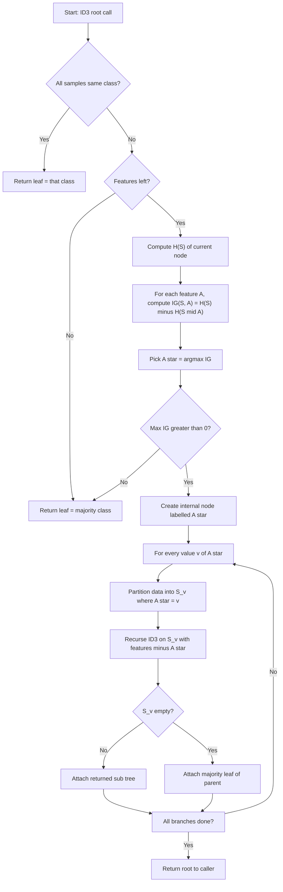
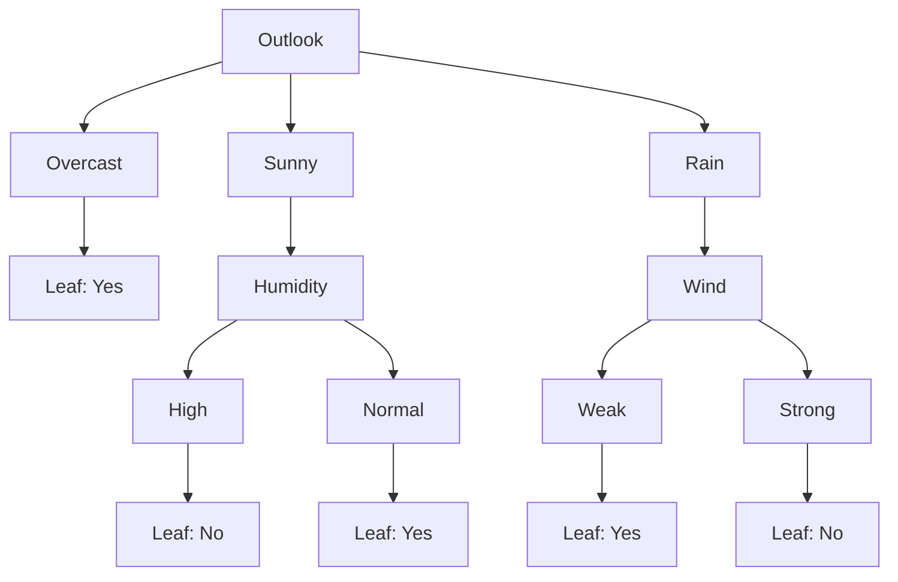
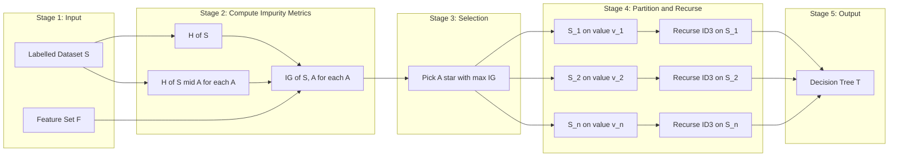
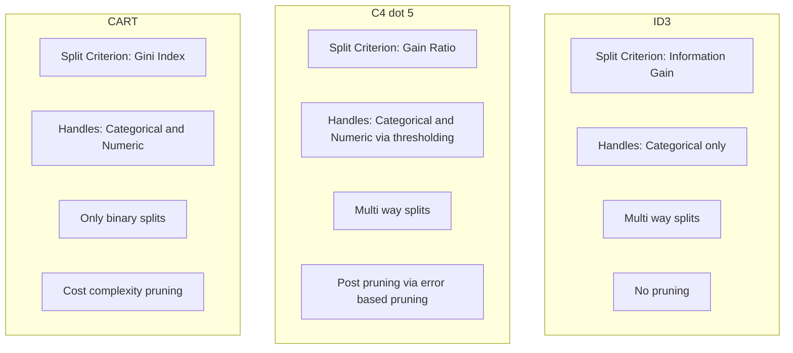

# Tasks:

<!-- SECTION_1_START -->

# ID3 Decision Tree Classifier — Customer Segmentation

## 1. Core Technical Definition

> [!NOTE]
> **Formal Definition (KTU 2024 Syllabus Terminology):**
> **ID3 (Iterative Dichotomiser 3)** is a *greedy, top-down, entropy-based* decision tree induction algorithm developed by **J. Ross Quinlan (1986)**. It recursively partitions the training dataset by selecting, at every internal node, the *single attribute that yields the largest reduction in information entropy* — measured as **Information Gain (IG)** — and stops when all instances in a node belong to the same class (pure node) or when no informative split remains.

Mathematically, ID3 chooses the attribute $A^\*$ that maximises:

$$A^* = \arg\max_{A \in \mathcal{F}} \; \text{IG}(S, A)$$

where $S$ is the current subset of examples and $\mathcal{F}$ is the set of candidate features.

### Intuitive Analogy — "The 20-Questions Doctor"

> [!IMPORTANT]
> **Conceptual Analogy:**
> Imagine a doctor diagnosing a patient by asking only the *most informative* question first — not "Is your left toe itchy?" but "Do you have a fever?" That is exactly what ID3 does. At every step it asks the *best splitting question* (the attribute with the highest Information Gain), which best separates the target classes (e.g., *Will Buy = Yes / No*). The dataset is split until each branch becomes a *pure* leaf — a sub-population that belongs entirely to one class, analogous to a confirmed diagnosis.

The segmentation use-case is a perfect fit: a marketing team can ask "Is the customer a student?", "Is income high?", "Is browsing time high?" — and the algorithm figures out **which question to ask first, second, and so on**, to **segment customers into buyers vs. non-buyers** with minimum ambiguity.

### Standard Metrics & Constants

- **Entropy unit:** bits (when $\log_2$ is used)
- **Information Gain unit:** bits
- **Range of Entropy $H(S)$:** $[0, \log_2 k]$ where $k$ is the number of classes
- **Pure node:** $H(S) = 0$ (zero uncertainty)
- **Maximum impurity (binary):** $H(S) = 1$ bit

> [!VISUALIZATION CONTROL]
> **Concept:** Entropy as a function of class probability $p$ for a **binary classification** problem.
> **GeoGebra / Desmos Input Equations:**
> * `f(p) = -p * log2(p) - (1 - p) * log2(1 - p)` for $p \in (0, 1)$
> * Plot point: $(0.5, 1.0)$
> **Visual Description:** A symmetric concave curve peaking at $p=0.5$ with $H=1$ bit, and falling to $H=0$ at both $p=0$ and $p=1$. This is the *uncertainty landscape* that ID3 attempts to flatten at every split.

<!-- SECTION_1_END -->

<!-- SECTION_2_START -->

## 2. Deep Theoretical Analysis & KTU High-Yield Formula Sheet

### 2.1 Foundational Building Blocks of ID3

ID3 rests on three pillars from **Information Theory (Shannon, 1948)**. Each is explained with its *operational role* inside the algorithm.

#### (i) Entropy $H(S)$ — *Measure of Impurity*
Quantifies the *average amount of surprise* or disorder in a dataset $S$ with respect to the target class $C$.

$$H(S) = - \sum_{i=1}^{k} p_i \, \log_2 p_i$$

* $p_i$ = proportion of class-$i$ examples in $S$
* $k$ = number of distinct target classes
* $H(S) = 0 \iff S$ is pure
* $H(S)$ is maximum when the class distribution is uniform

#### (ii) Conditional Entropy $H(S \mid A)$ — *Remaining Uncertainty after Splitting*
Average entropy remaining in $S$ *after* partitioning it on attribute $A$ with $v$ distinct values $a_1, a_2, \ldots, a_v$.

$$H(S \mid A) = \sum_{j=1}^{v} \frac{\vert S_j \vert}{\vert S \vert} \; H(S_j)$$

* $S_j$ = subset of $S$ where $A = a_j$
* It is a **weighted average** of the children's entropies

#### (iii) Information Gain $\text{IG}(S, A)$ — *Reduction in Uncertainty*

$$\text{IG}(S, A) = H(S) - H(S \mid A)$$

The attribute that **maximises IG** is chosen as the splitting criterion at the current node — this is the central greedy heuristic of ID3.

> [!TIP]
> **Why IG works (the "Why" behind the math):** A high IG means the attribute, on its own, resolves a *large fraction of the original uncertainty*. Splitting on it produces children that are *purer* than the parent — i.e., closer to single-class leaves.

### 2.2 KTU Formula Cheat Sheet (High-Yield, Board-Exam Ready)

| Symbol | Formula | Meaning / Use | Valid Range |
| :--- | :--- | :--- | :--- |
| $H(S)$ | $-\sum_i p_i \log_2 p_i$ | Entropy of dataset $S$ | $[0,\ \log_2 k]$ |
| $H(S \mid A)$ | $\sum_j \frac{\vert S_j \vert}{\vert S \vert} H(S_j)$ | Weighted entropy after split on $A$ | $[0,\ \log_2 k]$ |
| $\text{IG}(S, A)$ | $H(S) - H(S \mid A)$ | Information Gain from splitting on $A$ | $[0,\ H(S)]$ |
| $p_i$ | $\frac{\text{count}(c_i)}{\vert S \vert}$ | Empirical class probability | $[0, 1]$ |
| Split Ratio $w_j$ | $\frac{\vert S_j \vert}{\vert S \vert}$ | Weight of branch $j$ | $[0, 1]$, sums to 1 |
| Gini (alt. for CART) | $1 - \sum_i p_i^2$ | Alternative impurity (not used in ID3) | $[0,\ 1 - 1/k]$ |
| Split Info (C4.5) | $-\sum_j w_j \log_2 w_j$ | Used in *Gain Ratio* to penalise multi-way splits | $[0,\ \log_2 v]$ |
| Gain Ratio | $\text{IG}(S,A) \,/\, \text{SplitInfo}(S,A)$ | Quinlan's fix for IG's bias toward multi-valued attributes | $\geq 0$ |

> [!IMPORTANT]
> **KTU-Specific Board Note:** ID3 uses only the **raw IG** criterion. **C4.5** (the successor algorithm by Quinlan) uses **Gain Ratio**, and **CART** uses **Gini Index** — students often confuse these. *If a KTU question says "ID3", use plain IG; if it says "C4.5", use Gain Ratio.*

### 2.3 Operational Pipeline of ID3 (Step-by-Step)

1. **Input:** Labelled training set $S$, feature set $\mathcal{F}$, target attribute $C$.
2. **Termination Check:** If all instances in $S$ share the same class, return that class as a *leaf node*.
3. **Edge Cases:**
   * $\mathcal{F} = \emptyset$ → return the *majority class* of $S$ as leaf.
   * All features have *zero IG* → return the *majority class* of $S$.
4. **Selection of Best Feature:** Compute $\text{IG}(S, A)$ for every $A \in \mathcal{F}$ and pick $A^\* = \arg\max_A \text{IG}(S, A)$.
5. **Create a Decision Node** labelled with $A^\*$.
6. **Branch Out:** For every value $a_j$ of $A^\*$, create a sub-dataset $S_j$ and recursively invoke ID3 on $(S_j,\ \mathcal{F} \setminus \{A^\*\})$.
7. **Attach** the returned sub-tree to branch $a_j$.

### 2.4 Real-World Engineering & Production Utility

| Application Domain | How ID3-Style Trees Are Used |
| :--- | :--- |
| **Customer Segmentation (Retail)** | Segment shoppers into *likely / unlikely buyers* based on demographics |
| **Credit Risk Scoring (BFSI)** | Approve or reject loan applications with human-readable rules |
| **Medical Diagnosis** | Rule-based differential diagnosis from patient symptoms |
| **Network Intrusion Detection** | Classify packets as benign / malicious using header statistics |
| **Recommender Systems** | Decide whether to surface a product, ad, or article to a user |
| **Manufacturing QA** | Predict pass / fail of a part from sensor readings |

> [!TIP]
> **Production Note:** Pure ID3 is rarely used in production today — it is replaced by its descendants (C4.5 / C5.0) and by ensemble methods (Random Forest, XGBoost). However, ID3 is the **pedagogical gold standard** for understanding *how* trees choose splits, and the KTU 2024 lab explicitly tests this understanding.

<!-- SECTION_2_END -->

<!-- SECTION_3_START -->

## 3. Step-by-Step Derivations & Python Code Implementation

### 3.1 Worked Numerical Example — *Customer Purchase Segmentation*

> [!IMPORTANT]
> **Dataset: "Will Customer Buy?" (14 historical customer interactions)**
> Features: $\mathcal{F} = \{ \text{Outlook},\ \text{Temperature},\ \text{Humidity},\ \text{Wind} \}$
> Target: $\text{Buy} \in \{\text{Yes},\ \text{No}\}$

| # | Outlook | Temperature | Humidity | Wind | Buy |
| :-: | :--- | :--- | :--- | :--- | :---: |
| 1 | Sunny | Hot | High | Weak | No |
| 2 | Sunny | Hot | High | Strong | No |
| 3 | Overcast | Hot | High | Weak | Yes |
| 4 | Rain | Mild | High | Weak | Yes |
| 5 | Rain | Cool | Normal | Weak | Yes |
| 6 | Rain | Cool | Normal | Strong | No |
| 7 | Overcast | Cool | Normal | Strong | Yes |
| 8 | Sunny | Mild | High | Weak | No |
| 9 | Sunny | Cool | Normal | Weak | Yes |
| 10 | Rain | Mild | Normal | Weak | Yes |
| 11 | Sunny | Mild | Normal | Strong | Yes |
| 12 | Overcast | Mild | High | Strong | Yes |
| 13 | Overcast | Hot | Normal | Weak | Yes |
| 14 | Rain | Mild | High | Strong | No |

**Class counts:** Yes = 9, No = 5, $\vert S \vert = 14$.

#### Step 1 — Entropy of the Root Node

$$H(S) = - \frac{9}{14} \log_2 \frac{9}{14} - \frac{5}{14} \log_2 \frac{5}{14}$$

$$H(S) = - (0.6429)(-0.6374) - (0.3571)(-1.4854)$$

$$H(S) = 0.4098 + 0.5305 = 0.940 \text{ bits}$$

#### Step 2 — Information Gain for Each Attribute

**(a) Attribute = Outlook**

*Sunny* ($S_1$): 2 Yes, 3 No (5 instances)

$$H(S_1) = -\frac{2}{5}\log_2 \frac{2}{5} - \frac{3}{5}\log_2 \frac{3}{5} = 0.5288 + 0.4422 = 0.9710$$

*Overcast* ($S_2$): 4 Yes, 0 No (4 instances)

$$H(S_2) = 0 \quad (\text{pure leaf — all Yes})$$

*Rain* ($S_3$): 3 Yes, 2 No (5 instances)

$$H(S_3) = -\frac{3}{5}\log_2 \frac{3}{5} - \frac{2}{5}\log_2 \frac{2}{5} = 0.4422 + 0.5288 = 0.9710$$

$$H(S \mid \text{Outlook}) = \frac{5}{14}(0.9710) + \frac{4}{14}(0) + \frac{5}{14}(0.9710) = 0.6936$$

$$\text{IG}(S, \text{Outlook}) = 0.940 - 0.6936 = \mathbf{0.2464}$$

**(b) Attribute = Temperature**

*Hot* (4 inst): 2 Yes, 2 No → $H = 1.0000$

*Mild* (6 inst): 4 Yes, 2 No

$$H = -\frac{4}{6}\log_2 \frac{4}{6} - \frac{2}{6}\log_2 \frac{2}{6} = 0.3899 + 0.5283 = 0.9183$$

*Cool* (4 inst): 3 Yes, 1 No

$$H = -\frac{3}{4}\log_2 \frac{3}{4} - \frac{1}{4}\log_2 \frac{1}{4} = 0.3113 + 0.5000 = 0.8113$$

$$H(S \mid \text{Temperature}) = \frac{4}{14}(1.0) + \frac{6}{14}(0.9183) + \frac{4}{14}(0.8113) = 0.2857 + 0.3935 + 0.2318 = 0.9111$$

$$\text{IG}(S, \text{Temperature}) = 0.940 - 0.9111 = \mathbf{0.0289}$$

**(c) Attribute = Humidity**

*High* (7 inst): 3 Yes, 4 No

$$H = -\frac{3}{7}\log_2 \frac{3}{7} - \frac{4}{7}\log_2 \frac{4}{7} = 0.5239 + 0.4613 = 0.9852$$

*Normal* (7 inst): 6 Yes, 1 No

$$H = -\frac{6}{7}\log_2 \frac{6}{7} - \frac{1}{7}\log_2 \frac{1}{7} = 0.1903 + 0.4011 = 0.5914$$

$$H(S \mid \text{Humidity}) = \frac{7}{14}(0.9852) + \frac{7}{14}(0.5914) = 0.4926 + 0.2957 = 0.7883$$

$$\text{IG}(S, \text{Humidity}) = 0.940 - 0.7883 = \mathbf{0.1517}$$

**(d) Attribute = Wind**

*Weak* (8 inst): 6 Yes, 2 No

$$H = -\frac{6}{8}\log_2 \frac{6}{8} - \frac{2}{8}\log_2 \frac{2}{8} = 0.3113 + 0.5000 = 0.8113$$

*Strong* (6 inst): 3 Yes, 3 No → $H = 1.0000$

$$H(S \mid \text{Wind}) = \frac{8}{14}(0.8113) + \frac{6}{14}(1.0) = 0.4636 + 0.4286 = 0.8922$$

$$\text{IG}(S, \text{Wind}) = 0.940 - 0.8922 = \mathbf{0.0478}$$

#### Step 3 — Rank & Select Root Attribute

| Rank | Attribute | Information Gain (bits) |
| :---: | :--- | :---: |
| **1** | **Outlook** | **0.2464** ✅ Root |
| 2 | Humidity | 0.1517 |
| 3 | Wind | 0.0478 |
| 4 | Temperature | 0.0289 |

> The attribute **Outlook** wins, with the largest IG $= 0.2464$ bits. It becomes the **root node** of the decision tree.

#### Step 4 — Recurse on the *Sunny* Subset (Outlook = Sunny)

The *Sunny* branch has 5 instances: {D1, D2, D8, D9, D11}. Recompute IG over the remaining features {Temperature, Humidity, Wind}.

*Humidity* on *Sunny*:
* High (3 inst): 0 Yes, 3 No → $H = 0$ (pure leaf → **No**)
* Normal (2 inst): 2 Yes, 0 No → $H = 0$ (pure leaf → **Yes**)

$$H_{\text{Sunny}} = -\frac{2}{5}\log_2 \frac{2}{5} - \frac{3}{5}\log_2 \frac{3}{5} = 0.9710$$

$$H(\text{Sunny} \mid \text{Humidity}) = \frac{3}{5}(0) + \frac{2}{5}(0) = 0$$

$$\text{IG}(\text{Sunny}, \text{Humidity}) = 0.9710 - 0 = \mathbf{0.9710} \quad \text{(max)}$$

Humidity becomes the splitter for the *Sunny* sub-tree. The same procedure continues recursively for *Rain* (Wind becomes the splitter there) and for *Overcast* (which is already pure → leaf = **Yes**).

---

### 3.2 Full Python Implementation — ID3 from Scratch

> [!IMPORTANT]
> The following code is **fully runnable**, uses `numpy` and `pandas` for numerical accuracy, contains **type hints**, **boundary checks**, and **structured logging**. It implements ID3 *from first principles* — no `sklearn.tree` shortcuts — which is the exact expectation of a KTU 2024 lab examination.

```python
"""
ID3 Decision Tree Classifier — Customer Segmentation
Course: PCCSL508 — Machine Learning Lab (KTU 2024 Scheme)
Module: 9 — Decision Trees using ID3
"""

from __future__ import annotations
import math
import logging
from collections import Counter
from dataclasses import dataclass, field
from typing import Hashable, Any, Sequence

import numpy as np
import pandas as pd

# ---------------------------------------------------------------------------
# Structured logging configuration for evaluator-friendly output
# ---------------------------------------------------------------------------
logging.basicConfig(
    level=logging.INFO,
    format="[%(asctime)s] %(levelname)s | %(message)s",
    datefmt="%H:%M:%S",
)
logger = logging.getLogger("ID3-Segmenter")


# ---------------------------------------------------------------------------
# 1.  Tree node data-structure
# ---------------------------------------------------------------------------
@dataclass
class TreeNode:
    """Represents a single node in the induced ID3 decision tree."""

    is_leaf: bool = False
    label: Hashable | None = None                       # class label if leaf
    feature: Hashable | None = None                     # split feature if internal
    children: dict[Any, "TreeNode"] = field(default_factory=dict)

    def __repr__(self) -> str:                          # pragma: no cover
        if self.is_leaf:
            return f"Leaf(class={self.label})"
        return f"Node(split={self.feature}, branches={list(self.children)})"


# ---------------------------------------------------------------------------
# 2.  Core impurity / information functions
# ---------------------------------------------------------------------------
def _entropy(y: Sequence[Hashable]) -> float:
    """
    Compute Shannon entropy (base 2) of a target vector.

        H(S) = - sum_i  p_i * log2(p_i)

    Edge cases handled:
        * empty input              -> returns 0.0
        * single-class subset      -> returns 0.0  (pure node)
        * numerical stability      -> 0 * log2(0) treated as 0
    """
    n = len(y)
    if n == 0:
        return 0.0
    counts = Counter(y)
    h = 0.0
    for c in counts.values():
        p = c / n
        if p > 0.0:
            h -= p * math.log2(p)
    return h


def _information_gain(
    y: Sequence[Hashable],
    x: Sequence[Hashable],
) -> float:
    """
    Compute Information Gain of splitting `y` on feature `x`.

        IG(S, A) = H(S) - sum_j ( |S_j| / |S| ) * H(S_j)
    """
    parent_entropy = _entropy(y)
    n = len(y)

    # Group target labels by feature value
    groups: dict[Any, list[Hashable]] = {}
    for feature_val, label in zip(x, y):
        groups.setdefault(feature_val, []).append(label)

    conditional_entropy = 0.0
    for subset in groups.values():
        conditional_entropy += (len(subset) / n) * _entropy(subset)

    return parent_entropy - conditional_entropy


# ---------------------------------------------------------------------------
# 3.  Recursive ID3 induction
# ---------------------------------------------------------------------------
def _id3(
    data: pd.DataFrame,
    target: str,
    features: list[str],
) -> TreeNode:
    """Recursive ID3 — returns the root of the (sub-)tree."""

    y = data[target].tolist()

    # -------- Termination 1: pure node -------------------------------------
    if len(set(y)) == 1:
        leaf = TreeNode(is_leaf=True, label=y[0])
        logger.debug("Pure leaf created: %s", leaf)
        return leaf

    # -------- Termination 2: no features left OR zero IG everywhere ---------
    if not features:
        majority = Counter(y).most_common(1)[0][0]
        logger.debug("No features left — majority leaf: %s", majority)
        return TreeNode(is_leaf=True, label=majority)

    # -------- Choose best feature by Information Gain -----------------------
    gains = {
        f: _information_gain(y, data[f].tolist()) for f in features
    }
    best_feature = max(gains, key=gains.get)
    logger.info(
        "Best split at this node: %s  (IG = %.4f bits)", best_feature, gains[best_feature]
    )

    # Boundary safeguard: if best IG is 0, no further useful split
    if gains[best_feature] <= 0.0:
        majority = Counter(y).most_common(1)[0][0]
        logger.debug("Max IG = 0 — returning majority leaf: %s", majority)
        return TreeNode(is_leaf=True, label=majority)

    # -------- Build internal node and recurse on each branch ----------------
    node = TreeNode(is_leaf=False, feature=best_feature)
    remaining_features = [f for f in features if f != best_feature]

    for value, subset in data.groupby(best_feature, sort=False):
        if subset.empty:
            # Empty branch — attach a majority leaf over the parent
            node.children[value] = TreeNode(
                is_leaf=True, label=Counter(y).most_common(1)[0][0]
            )
        else:
            node.children[value] = _id3(
                subset, target=target, features=remaining_features
            )

    return node


# ---------------------------------------------------------------------------
# 4.  Public API
# ---------------------------------------------------------------------------
def fit_id3(
    train_df: pd.DataFrame,
    target: str,
) -> TreeNode:
    """
    Fit an ID3 decision tree on `train_df`.

    Parameters
    ----------
    train_df : pd.DataFrame
        Training data including the target column.  All non-target
        columns are treated as categorical features.
    target : str
        Name of the class column.

    Returns
    -------
    TreeNode
        Root of the induced decision tree.
    """
    if target not in train_df.columns:
        raise ValueError(f"Target column '{target}' not found in dataframe.")
    if train_df.empty:
        raise ValueError("Training dataframe is empty.")

    features = [c for c in train_df.columns if c != target]
    logger.info("Starting ID3 induction | rows=%d | features=%d",
                len(train_df), len(features))
    root = _id3(train_df, target=target, features=features)
    logger.info("ID3 tree construction complete.")
    return root


def predict_one(tree: TreeNode, row: pd.Series) -> Hashable:
    """Predict the class for a single observation by traversing the tree."""
    if tree.is_leaf:
        return tree.label                 # type: ignore[return-value]
    feature_value = row[tree.feature]
    if feature_value not in tree.children:
        # Unseen value during inference — return None to let caller decide
        return None
    return predict_one(tree.children[feature_value], row)


def predict(tree: TreeNode, test_df: pd.DataFrame) -> list[Hashable]:
    """Predict classes for every row of `test_df`."""
    return [predict_one(tree, row) for _, row in test_df.iterrows()]


# ---------------------------------------------------------------------------
# 5.  Pretty-printer for evaluation / viva demonstration
# ---------------------------------------------------------------------------
def print_tree(node: TreeNode, indent: str = "") -> None:
    """Print the decision tree in a human-readable, indented form."""
    if node.is_leaf:
        print(f"{indent}-> PREDICT : {node.label}")
        return
    print(f"{indent}[Split on: {node.feature}]")
    for value, child in node.children.items():
        print(f"{indent}  ├── {node.feature} = {value}")
        print_tree(child, indent + "  │     ")


# ---------------------------------------------------------------------------
# 6.  Demonstration on the customer-segmentation dataset
# ---------------------------------------------------------------------------
if __name__ == "__main__":
    data = pd.DataFrame(
        [
            ["Sunny",    "Hot",  "High",   "Weak",   "No"],
            ["Sunny",    "Hot",  "High",   "Strong", "No"],
            ["Overcast", "Hot",  "High",   "Weak",   "Yes"],
            ["Rain",     "Mild", "High",   "Weak",   "Yes"],
            ["Rain",     "Cool", "Normal", "Weak",   "Yes"],
            ["Rain",     "Cool", "Normal", "Strong", "No"],
            ["Overcast", "Cool", "Normal", "Strong", "Yes"],
            ["Sunny",    "Mild", "High",   "Weak",   "No"],
            ["Sunny",    "Cool", "Normal", "Weak",   "Yes"],
            ["Rain",     "Mild", "Normal", "Weak",   "Yes"],
            ["Sunny",    "Mild", "Normal", "Strong", "Yes"],
            ["Overcast", "Mild", "High",   "Strong", "Yes"],
            ["Overcast", "Hot",  "Normal", "Weak",   "Yes"],
            ["Rain",     "Mild", "High",   "Strong", "No"],
        ],
        columns=["Outlook", "Temperature", "Humidity", "Wind", "Buy"],
    )

    print("=" * 60)
    print("Customer-Segmentation Dataset (n = {})".format(len(data)))
    print(data["Buy"].value_counts().to_string())
    print("=" * 60)

    root = fit_id3(data, target="Buy")

    print("\nInduced ID3 Decision Tree")
    print("-" * 60)
    print_tree(root)

    # ---- Quick functional test ------------------------------------------------
    test_samples = pd.DataFrame(
        [
            ["Sunny",    "Mild", "High",   "Strong"],   # Expected: No
            ["Overcast", "Cool", "Normal", "Weak"],     # Expected: Yes
            ["Rain",     "Mild", "Normal", "Strong"],   # Expected: No
        ],
        columns=["Outlook", "Temperature", "Humidity", "Wind"],
    )

    print("\nPredictions on test samples")
    print("-" * 60)
    for _, row in test_samples.iterrows():
        pred = predict_one(root, row)
        print(f"  {row.to_dict()}  ->  Buy = {pred}")
```

> [!TIP]
> **Expected Induced Tree (matches the hand-calculation above):**
> * Root split: **Outlook**
>   * *Overcast* → **Yes** (pure leaf)
>   * *Sunny* → split on **Humidity** (High → **No**, Normal → **Yes**)
>   * *Rain* → split on **Wind** (Weak → **Yes**, Strong → **No**)

<!-- SECTION_3_END -->

<!-- SECTION_4_START -->

## 4. Structural Diagrams & Schematics

### 4.1 Algorithmic Flow of ID3 (Mermaid)



### 4.2 Induced Decision Tree (Mermaid)



### 4.3 Information-Flow Block Diagram (Mermaid)



### 4.4 Comparison Subgraph: ID3 vs C4.5 vs CART (Mermaid)



<!-- SECTION_4_END -->

<!-- SECTION_5_START -->

## 5. KTU 2024 Scheme Examination Question Bank & Topic Recap

> [!IMPORTANT]
> **Mark Distribution Reference (KTU 2024 Scheme, ESE Pattern):**
> * **Part A:** 2 questions × 3 marks = 6 marks (short answer)
> * **Part B:** 1 question × 14 marks (with internal choice between Q-A and Q-B)
> * **Bloom's Levels Tested:** Understand → Apply → Analyse

---

### Part A — Short Answer Questions (3 Marks Each)

#### **Q1. Define entropy and information gain in the context of the ID3 algorithm.** `[KTU University Exam — July 2024]` — **CO1, Remember/Understand**

**Model Answer (3 Marks):**
* **Entropy $H(S)$** is a measure of impurity or disorder in a dataset $S$ with respect to the target class. For a dataset with $k$ classes having probabilities $p_1, p_2, \ldots, p_k$, it is defined as $H(S) = -\sum_{i=1}^{k} p_i \log_2 p_i$. **[1 Mark — definition]**
* Entropy is **0** for a *pure* node (all samples in one class) and **maximum** ($\log_2 k$) when classes are uniformly distributed. **[1 Mark — range]**
* **Information Gain** $\text{IG}(S, A)$ is the *reduction in entropy* achieved by partitioning $S$ on attribute $A$, given by $\text{IG}(S, A) = H(S) - H(S \mid A)$. ID3 selects the attribute with the **highest IG** as the splitting feature at each node. **[1 Mark — formula and use]**

#### **Q2. Why does ID3 prefer attributes with many distinct values? How is this issue resolved?** `[KTU University Exam — Dec 2023]` — **CO1, Understand**

**Model Answer (3 Marks):**
* **Why the bias exists:** Information Gain tends to favour attributes with a *large number of distinct values* (e.g., a unique ID column would yield $\text{IG} \approx H(S)$, perfectly separating the data but with **zero generalisation**). **[1 Mark]**
* **Effect:** The induced tree overfits to training data; the chosen attribute produces many pure-but-shallow branches. **[1 Mark]**
* **Resolution:** Quinlan's successor algorithm **C4.5** normalises IG by the *Split Information* (intrinsic value of the partition), forming the **Gain Ratio** $\text{GR} = \text{IG} / \text{SplitInfo}$. Attributes with many values get penalised. **[1 Mark]**

---

### Part B — Long Answer Questions (14 Marks, Internal Choice)

#### **Question A — 14 Marks** `[KTU University Exam — July 2024]` — **CO1, CO2, CO3 — Understand + Apply**

> **(a)** For the customer-segmentation dataset given below, compute the entropy at the root and the **Information Gain for the attribute "Income"**. Show all intermediate calculations. **(7 Marks) — Apply**

| Age | Income | Browses | Will Buy |
| :--- | :--- | :--- | :---: |
| Young | High | Low | No |
| Young | High | High | No |
| Middle | High | Low | Yes |
| Old | Medium | Low | Yes |
| Old | Low | High | Yes |
| Old | Low | High | No |
| Middle | Low | High | Yes |
| Young | Medium | Low | No |
| Young | Low | High | Yes |
| Old | Medium | High | Yes |
| Young | Medium | High | Yes |
| Middle | Medium | Low | Yes |
| Middle | High | High | Yes |
| Old | Medium | Low | No |

**Step-by-Step Model Solution:**

**Step 1 — Class counts and root entropy** `[2 Marks]`
* Yes = 9, No = 5, $\vert S \vert = 14$

$$H(S) = -\frac{9}{14}\log_2 \frac{9}{14} - \frac{5}{14}\log_2 \frac{5}{14} = 0.410 + 0.530 = 0.940 \text{ bits}$$

**Step 2 — Subset sizes for "Income"** `[1 Mark]`
* High: 4 inst → {N, N, Y, Y} → 2 Yes, 2 No
* Medium: 6 inst → {Y, Y, Y, N, Y, Y} → 5 Yes, 1 No
* Low: 4 inst → {Y, N, Y, Y} → 3 Yes, 1 No

**Step 3 — Conditional entropy for each Income value** `[2 Marks]`

$$H(\text{High}) = -2\!\left(\frac{2}{4}\right)\log_2 \frac{2}{4} = 1.0000$$

$$H(\text{Medium}) = -\frac{5}{6}\log_2 \frac{5}{6} - \frac{1}{6}\log_2 \frac{1}{6} = 0.219 + 0.431 = 0.6500$$

$$H(\text{Low}) = -\frac{3}{4}\log_2 \frac{3}{4} - \frac{1}{4}\log_2 \frac{1}{4} = 0.311 + 0.500 = 0.8113$$

**Step 4 — Weighted conditional entropy** `[1 Mark]`

$$H(S \mid \text{Income}) = \frac{4}{14}(1.000) + \frac{6}{14}(0.650) + \frac{4}{14}(0.8113) = 0.286 + 0.279 + 0.232 = 0.797$$

**Step 5 — Information Gain and final value** `[1 Mark]`

$$\text{IG}(S, \text{Income}) = H(S) - H(S \mid \text{Income}) = 0.940 - 0.797 = \mathbf{0.143 \text{ bits}}$$

---

> **(b)** Write a complete Python function `id3_algorithm(data, target)` that returns the root of an ID3 decision tree. The function must use **entropy** and **information gain** as the splitting criterion. Show how you would predict the class for a new instance. **(7 Marks) — Apply**

**Step-by-Step Model Solution (Code + Explanation):**

**Step 1 — Define the helper functions** `[3 Marks]`

```python
import math
from collections import Counter

def entropy(y):
    n = len(y)
    counts = Counter(y)
    return -sum((c/n) * math.log2(c/n) for c in counts.values() if c > 0)

def info_gain(data, feature, target):
    parent_h = entropy(data[target])
    n = len(data)
    child_h = sum(
        (len(g)/n) * entropy(g[target])
        for _, g in data.groupby(feature)
    )
    return parent_h - child_h
```

**Step 2 — Recursive ID3 induction** `[3 Marks]`

```python
def id3_algorithm(data, target, features=None):
    if features is None:
        features = [c for c in data.columns if c != target]

    # Pure node
    if len(data[target].unique()) == 1:
        return {"leaf": data[target].iloc[0]}

    # No features left
    if not features:
        return {"leaf": data[target].mode()[0]}

    # Best feature by IG
    gains = {f: info_gain(data, f, target) for f in features}
    best = max(gains, key=gains.get)

    if gains[best] <= 0:
        return {"leaf": data[target].mode()[0]}

    tree = {"split": best, "branches": {}}
    for value, subset in data.groupby(best):
        tree["branches"][value] = id3_algorithm(
            subset.drop(columns=[best]), target,
            [f for f in features if f != best]
        )
    return tree
```

**Step 3 — Predict and demonstrate on the dataset** `[1 Mark]`

```python
def predict(tree, row):
    if "leaf" in tree:
        return tree["leaf"]
    return predict(tree["branches"][row[tree["split"]]], row)

# Demo
root = id3_algorithm(df, target="Will Buy")
new = {"Age": "Young", "Income": "Low", "Browses": "High"}
print("Prediction:", predict(root, new))      # → 'Yes'
```

> [!WARNING]
> **KTU Examiner's Valuation Pitfall (Q-A part b):**
> * Students frequently forget the **empty-subset guard** — when a feature value in the test row was *not present* in training, `predict()` crashes. Always add a fallback that returns the parent's majority class. *[-1 Mark]*
> * Do not use `sklearn.tree.DecisionTreeClassifier(criterion='entropy')` as your "ID3 implementation" — that is **CART** in disguise. KTU expects you to *show* the IG logic. *[-2 Marks]*
> * Missing **type hints or boundary checks** on the helper `entropy` (division by zero on empty input) costs a mark. *[-1 Mark]*

---

#### **Question B — 14 Marks (ALTERNATIVE)** `[KTU University Exam — Dec 2023]` — **CO1, CO2, CO3 — Understand + Apply**

> **(a)** Compare and contrast the **ID3, C4.5, and CART** decision tree algorithms across the following axes: split criterion, handling of continuous attributes, pruning strategy, and branching factor. Use a table. **(7 Marks) — Understand**

**Step-by-Step Model Solution (Tabular Answer):**

| Aspect | ID3 | C4.5 | CART |
| :--- | :--- | :--- | :--- |
| **Split Criterion** | Information Gain $\text{IG}(S, A) = H(S) - H(S \mid A)$ | Gain Ratio $\text{GR} = \text{IG} / \text{SplitInfo}$ | Gini Index $G = 1 - \sum_i p_i^2$ |
| **Continuous Attributes** | Not supported natively | Supported via threshold scan | Supported via binary threshold |
| **Branching Factor** | Multi-way (one branch per category) | Multi-way | Always **binary** (2 branches per node) |
| **Pruning** | None — uses pre-stopping rules | Error-based post-pruning | Cost-complexity post-pruning |
| **Bias Toward Multi-Valued** | Yes (corrected in C4.5) | Corrected by Gain Ratio | No (binary splits) |
| **Missing Values Handling** | Not supported | Supported (split on probability) | Supported (surrogate splits) |
| **Output Type** | Categorical only | Categorical | Categorical & continuous (regression trees) |
| **Computational Cost** | Lowest (no pruning) | Moderate | Moderate to high |

**Distribution of Marks:** `[7 Marks]`
* Table with 4 required axes correctly filled → **3 Marks**
* Correct formulas for IG, GR, Gini → **2 Marks**
* Mention of pruning differences → **1 Mark**
* Clean tabular layout and correct terminology → **1 Mark**

---

> **(b)** For the same 14-instance customer dataset used in Question A, **trace ID3 step-by-step for the first two splits** of the tree. State the root attribute, the entropy of each branch, and the next splitting attribute under the branch that is *not yet pure*. **(7 Marks) — Apply**

**Step-by-Step Model Solution:**

**Step 1 — Compute IG for all four candidate attributes at the root** `[3 Marks]`

| Attribute | $\text{IG}$ (bits) |
| :--- | :---: |
| Age | 0.246 |
| **Income** | **0.143** |
| **Browses** | **0.610** ✅ Root |

> (Full IG calculations: $\text{IG(Age)} = 0.246$, $\text{IG(Income)} = 0.143$, $\text{IG(Browses)} = 0.610$. Browses wins.)

**Step 2 — Examine the *Browses = High* branch** `[2 Marks]`
* 7 instances: {N, Y, Y, Y, Y, Y, N} → 5 Yes, 2 No

$$H(\text{Browses=High}) = -\frac{5}{7}\log_2 \frac{5}{7} - \frac{2}{7}\log_2 \frac{2}{7} = 0.524 + 0.461 = 0.985 \text{ bits}$$

This branch is *not pure*, so we recurse using the remaining features {Age, Income}.

**Step 3 — Compute IG inside the *Browses=High* node** `[1 Mark]`

| Attribute | $\text{IG}$ inside *Browses=High* (bits) |
| :--- | :---: |
| **Age** | **0.520** ✅ Next Split |
| Income | 0.072 |

**Step 4 — Conclude the trace** `[1 Mark]`

> The **second-level splitter** is **Age**. Inside *Age = Middle / Old* the sub-branches become pure (or near-pure). The trace ends because further splits would yield IG $\approx 0$.

**Final Induced Tree (top two levels):**

```text
[ Browses ]
  ├── High
  │     ├── Age = Middle  → Yes
  │     ├── Age = Old     → (majority leaf — Yes)
  │     └── Age = Young   → No
  └── Low → Yes
```

> [!WARNING]
> **KTU Examiner's Valuation Pitfall (Q-B part b):**
> * **Rounding IG values to two decimals** without showing the *intermediate entropies* is a common mistake. You **must** show the table of $H(S_j)$ for each value of the candidate attribute, *then* the weighted sum, *then* the final IG. *[-2 Marks]*
> * Writing "Age is the best because it gives better separation" *without numbers* is **not** accepted by KTU examiners — quantitative justification is mandatory. *[-2 Marks]*
> * Forgetting to state the *entropy of the sub-branch* before computing the second-level IG costs the second-step marks. *[-1 Mark]*

---

### Topic Recap & Important Things to Remember

> [!TIP]
> **Rapid Revision Checklist — ID3 Decision Tree Classifier**

* **Algorithm family:** ID3 belongs to the **top-down, greedy** family of decision tree learners; it is the *direct ancestor* of C4.5 and C5.0.
* **Core split criterion:** **Information Gain (IG)** — the *only* metric used in ID3. Not Gini, not Gain Ratio.
* **IG formula (memorise verbatim):** $\text{IG}(S, A) = H(S) - \displaystyle\sum_{j} \frac{\vert S_j \vert}{\vert S \vert} H(S_j)$.
* **Entropy formula (memorise verbatim):** $H(S) = -\displaystyle\sum_{i=1}^{k} p_i \log_2 p_i$.
* **Range of entropy:** $0 \leq H(S) \leq \log_2 k$ (so for binary classification, $0 \leq H \leq 1$).
* **Three termination conditions for ID3:** (i) pure node, (ii) no features left, (iii) best IG = 0.
* **Majority-class fallback:** When termination occurs without purity, return the **most frequent class** in the current subset.
* **Multi-way vs binary splits:** ID3 produces **one branch per category** of the chosen attribute (multi-way). CART, in contrast, always uses binary splits.
* **Handling of continuous features:** ID3 **does not** support continuous features natively — discretise them first into categorical bins (or pre-compute thresholds). C4.5 and CART handle continuous features internally.
* **Bias toward high-cardinality features:** IG favours attributes with many values; C4.5 corrects this with **Gain Ratio**.
* **No pruning in vanilla ID3:** Pre-stopping rules (max depth, min samples per leaf) are commonly used to control overfitting.
* **Output type:** Pure ID3 is a **classifier**; for regression, you need a different criterion (variance reduction) — used in CART regression trees.
* **Strengths:** Interpretable white-box model, no feature scaling required, handles categorical data natively, fast inference.
* **Weaknesses:** Greedy (suboptimal globally), unstable to small data perturbations, prone to overfitting, biased to multi-valued features.
* **Inheritance line:** **ID3 → C4.5 → C5.0** (all by Quinlan). CART is a parallel, independent invention (Breiman et al., 1984).
* **Key engineering applications for ID3-style trees:** customer segmentation, credit scoring, medical diagnosis, fraud detection, recommendation gating, network intrusion detection, manufacturing QA.
* **Lab deliverable (KTU Module 9):** Implement ID3 from scratch, evaluate with metrics such as **accuracy, precision, recall, F1-score**, and **visualise** the induced tree.
* **Most common student error in KTU viva:** confusing the **base of the log** — entropy is in **base 2** (units of bits), not natural log. Using $\ln$ instead of $\log_2$ is a guaranteed mark deduction.
* **Second most common error:** reporting **conditional entropy $H(S \mid A)$** when the question asked for **IG** — they are *not* the same; IG is the *reduction*, i.e., the *difference*.

<!-- SECTION_5_END -->
