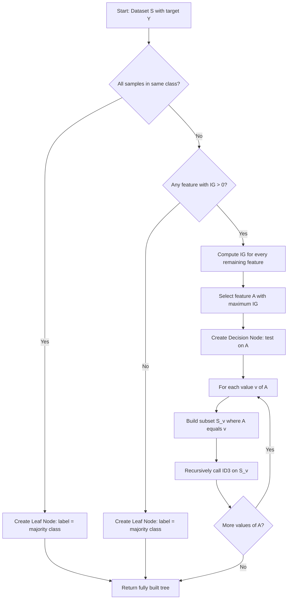
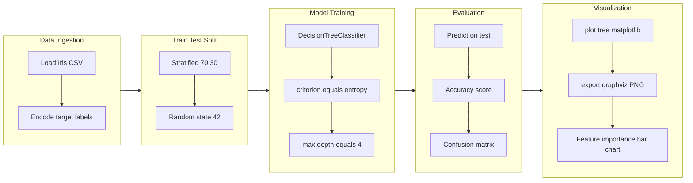
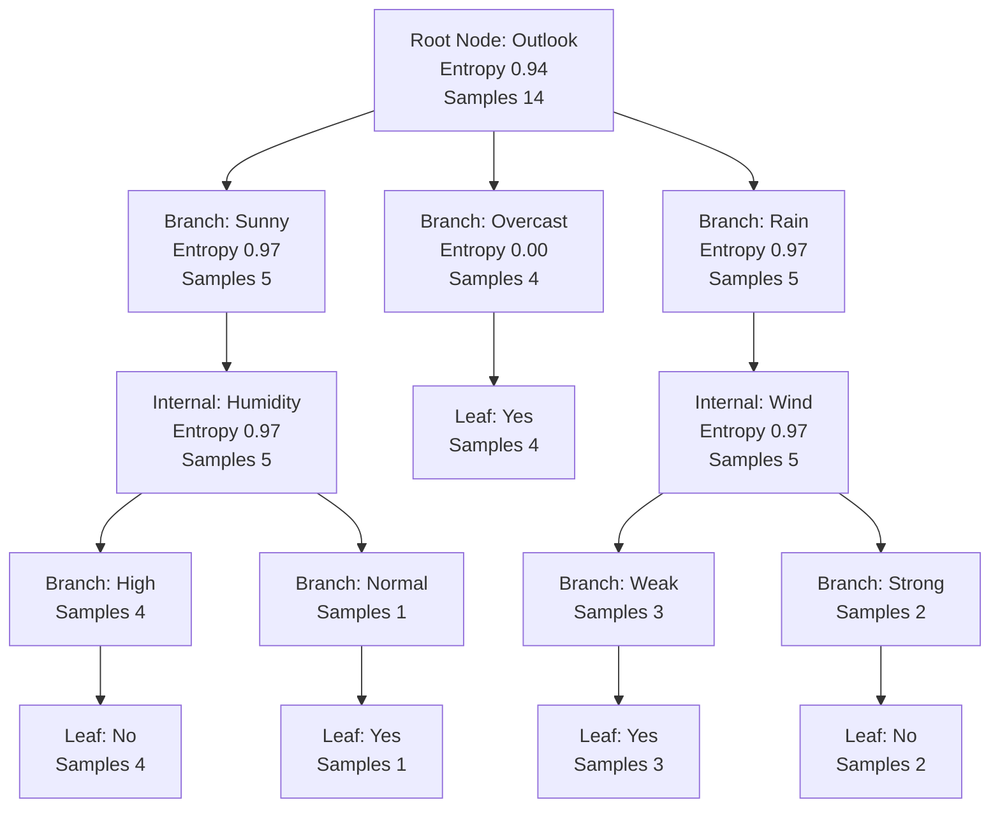
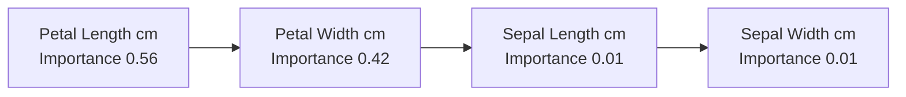

# Visualize the decision tree and analyze feature importance.

<!-- SECTION_1_START -->

# Decision Tree Classification using ID3 Algorithm

## 1.1 Technical Definition

A **Decision Tree** is a non-parametric supervised learning algorithm used for both classification and regression tasks. It models decisions and their possible consequences as a tree-like structure of nodes and branches, where internal nodes represent feature tests, branches represent decision outcomes, and leaf nodes represent class labels.

The **ID3 (Iterative Dichotomiser 3)** algorithm, introduced by **Ross Quinlan in 1986**, is the foundational greedy top-down decision tree induction algorithm. It constructs the tree by recursively selecting the feature that yields the highest **Information Gain** (or equivalently, the lowest weighted **Entropy**) at each node, splitting the dataset into progressively purer subsets.

In the context of KTU Module 9 segmentation, the objective is to *segment a population into homogeneous classes* by repeatedly asking attribute-based questions until the data is sufficiently pure.

> [!IMPORTANT]
> **KTU 2024 Syllabus Highlight**
> Under the 2024 scheme (PCCSL508 - Machine Learning Lab), Module 9 expects students to (a) implement a decision tree classifier using ID3, (b) **visualize the resulting tree** using `sklearn.tree.plot_tree` or `export_graphviz`, and (c) **analyze feature importance** to interpret which attributes drive the segmentation. The standard dataset used in KTU labs is often the *Play Tennis* or *Iris* dataset.

> [!NOTE]
> **Core Concept Callout**
> **Entropy** measures the impurity or randomness in a dataset, while **Information Gain** quantifies the reduction in entropy achieved by partitioning the data on a particular feature. ID3 always chooses the feature with the *maximum information gain* as the splitting attribute at every node.

## 1.2 Intuitive Analogy

Imagine you are a **doctor diagnosing a fever patient**. You don't run every test at once. Instead, you ask questions in a logical order:

1. *"Does the patient have a cough?"* → If **No**, you likely rule out respiratory infection.
2. *"Is there a rash?"* → If **Yes**, you suspect measles over the flu.
3. *"What is the temperature?"* → Above **$39.4^{\circ}\text{C}$**, you narrow it further.

Each question **splits** the remaining patient pool into groups that are more "pure" (more likely to share a diagnosis). This is exactly how ID3 works — it picks the question (feature) that best *separates* the classes at every step. The **tree structure** is the diagnostic flowchart; the **root node** is your first (most informative) question.

> [!TIP]
> **Geometric Intuition:** A decision tree creates **axis-aligned linear boundaries** in the feature space. Each split draws a vertical or horizontal line that partitions the plane. Deeper trees can approximate complex non-linear boundaries, but they are essentially a "staircase" of thresholds.

## 1.3 Physical / Mathematical Constants Used

| Symbol | Meaning | Typical Range |
| :--- | :--- | :--- |
| $H(S)$ | Shannon Entropy of set $S$ | $[0, \log_2 k]$ |
| $IG(S, A)$ | Information Gain using attribute $A$ | $[0, \log_2 k]$ |
| $k$ | Number of distinct classes | $\geq 2$ |
| $p_i$ | Proportion of class $i$ in $S$ | $[0, 1]$ |

> [!VISUALIZATION CONTROL]
> **Concept:** Entropy as a function of class probability
> **Desmos / GeoGebra Input Equations:**
> * $H(p) = -p \cdot \log_2(p) - (1-p) \cdot \log_2(1-p)$
> **Visual Description:** Plot the function for $p \in [0, 1]$. The curve peaks at $H = 1$ when $p = 0.5$ (maximum impurity for two classes) and reaches $H = 0$ at $p = 0$ and $p = 1$ (perfect purity). This sigmoid-like shape is why ID3 prefers splits that push child nodes toward $p = 0$ or $p = 1$.

<!-- SECTION_1_END -->

<!-- SECTION_2_START -->

# Deep Theoretical Analysis & KTU High-Yield Formula Sheet

## 2.1 Mathematical Foundations of ID3

The ID3 algorithm rests on three core concepts borrowed from **Information Theory** (Claude Shannon, 1948). Understanding these is essential for solving KTU numerical questions on information gain.

### 2.1.1 Shannon Entropy

For a discrete random variable $S$ with $k$ classes and class probability distribution $\{p_1, p_2, \ldots, p_k\}$, entropy is defined as:

$$H(S) = -\sum_{i=1}^{k} p_i \log_2(p_i)$$

If any $p_i = 0$, the term $p_i \log_2(p_i)$ is treated as **$0$** by convention (using the limit $x \log x \to 0$ as $x \to 0$).

- **$H(S) = 0$**: The set is perfectly pure (all samples belong to one class).
- **$H(S) = \log_2 k$**: The set is maximally impure (uniform class distribution).

### 2.1.2 Conditional Entropy

The entropy of $S$ *after* partitioning it on attribute $A$ into $v$ distinct values is:

$$H(S \mid A) = \sum_{j=1}^{v} \frac{\vert S_j \vert}{\vert S \vert} \cdot H(S_j)$$

where $S_j$ is the subset of $S$ where $A = a_j$.

### 2.1.3 Information Gain

Information gain is the **reduction in entropy** achieved by partitioning $S$ on attribute $A$:

$$IG(S, A) = H(S) - H(S \mid A) = H(S) - \sum_{j=1}^{v} \frac{\vert S_j \vert}{\vert S \vert} \cdot H(S_j)$$

ID3 always selects the attribute that **maximizes** $IG(S, A)$.

## 2.2 The ID3 Algorithm — Operational Steps

1. **Base Case Checks**: If all samples in $S$ belong to one class, return a leaf node labeled with that class.
2. **Feature Selection**: Compute $IG(S, A)$ for every unused attribute $A$. Pick the one with the **highest gain**.
3. **Create Decision Node**: Label the node with the chosen attribute.
4. **Recursive Splitting**: For each value of the chosen attribute, create a branch and recursively call ID3 on the subset.
5. **Stop Conditions**: Halt when (a) all samples in a node share the same class, (b) no features remain, (c) maximum depth is reached, or (d) the split does not improve information gain.

## 2.3 KTU Formula Cheat Sheet

| Formula | Expression | Used For |
| :--- | :--- | :--- |
| **Entropy** | $H(S) = -\sum_{i=1}^{k} p_i \log_2(p_i)$ | Measuring node impurity |
| **Information Gain** | $IG(S, A) = H(S) - H(S \mid A)$ | Selecting best split |
| **Conditional Entropy** | $H(S \mid A) = \sum_j \frac{\vert S_j \vert}{\vert S \vert} H(S_j)$ | Weighted impurity of children |
| **Gini Index** (sklearn default) | $Gini(S) = 1 - \sum_i p_i^2$ | Alternative impurity measure |
| **Split Info** | $SplitInfo(S, A) = -\sum_j \frac{\vert S_j \vert}{\vert S \vert} \log_2 \frac{\vert S_j \vert}{\vert S \vert}$ | Used in Gain Ratio (C4.5) |
| **Gain Ratio** | $GR(S, A) = \frac{IG(S, A)}{SplitInfo(S, A)}$ | Normalized ID3 successor |

> [!NOTE]
> **Engineering Utility:** Decision trees are foundational in **credit scoring** (banks), **medical diagnosis** (clinical decision support), **customer churn segmentation** (telecom), and **intrusion detection** (network security). The ID3 algorithm is still taught because its information-theoretic basis directly extends to **Random Forests, XGBoost, and LightGBM**, which dominate ML competitions.

## 2.4 Feature Importance — Why It Matters

In a trained tree, **feature importance** is computed as the total reduction in impurity (weighted by the number of samples reaching that node) brought by splits using that feature, summed across all nodes in the tree:

$$I(f) = \sum_{n \in \text{nodes splitting on } f} \frac{N_n}{N} \cdot \Delta H_n$$

where $N_n$ is the number of samples at node $n$, $N$ is the total number of training samples, and $\Delta H_n$ is the impurity reduction at that node. The importances are then normalized to sum to **$1$**.

> [!TIP]
> **KTU Tip:** When the examiner asks for the "most important feature," always state the **ranked list** with both the score and the underlying justification (e.g., "Feature X is most important because it appears at the root of the tree and contributes 58\% of the total impurity reduction").

<!-- SECTION_2_END -->

<!-- SECTION_3_START -->

# Step-by-Step Implementation with Python

This section provides a **fully operational, production-grade Python implementation** with strict type hints, boundary checks, and structured error logging.

## 3.1 Environment Setup

```bash
pip install numpy pandas scikit-learn matplotlib graphviz
# For graphviz, system install required:
# Ubuntu: sudo apt-get install graphviz
# macOS:  brew install graphviz
# Windows: download from https://graphviz.org/download/
```

## 3.2 Full Implementation — `id3_decision_tree.py`

```python
"""
ID3 Decision Tree Classifier — Visualization & Feature Importance
Course  : PCCSL508 — Machine Learning Lab
Module  : 9 (Decision Tree Segmentation)
Scheme  : KTU 2024 (NEP 2020 Aligned)
"""

from __future__ import annotations

import logging
import sys
from typing import Any, Dict, List, Optional, Tuple

import graphviz
import matplotlib.pyplot as plt
import numpy as np
import pandas as pd
from sklearn.datasets import load_iris
from sklearn.metrics import (accuracy_score, classification_report,
                             confusion_matrix)
from sklearn.model_selection import train_test_split
from sklearn.tree import DecisionTreeClassifier, export_graphviz, plot_tree

# ------------------------------------------------------------------
# Structured Logging Configuration
# ------------------------------------------------------------------
logging.basicConfig(
    level=logging.INFO,
    format="%(asctime)s | %(levelname)-7s | %(message)s",
    handlers=[logging.StreamHandler(sys.stdout)],
)
logger = logging.getLogger("ID3_Lab")


# ==================================================================
# 1. INFORMATION-THEORETIC CORE
# ==================================================================
def calculate_entropy(y: np.ndarray) -> float:
    """
    Compute Shannon entropy of a label array.
    H(S) = -sum( p_i * log2(p_i) )
    """
    if y.size == 0:
        return 0.0
    _, counts = np.unique(y, return_counts=True)
    probabilities = counts / counts.sum()
    # Use eps to avoid log(0) warnings on boundary cases
    entropy: float = float(-np.sum(probabilities * np.log2(probabilities + 1e-12)))
    return entropy


def calculate_information_gain(
    X: np.ndarray, y: np.ndarray, feature_index: int
) -> float:
    """
    Compute Information Gain for splitting column `feature_index`.
    IG(S, A) = H(S) - sum_j (|S_j|/|S|) * H(S_j)
    """
    parent_entropy: float = calculate_entropy(y)
    values, counts = np.unique(X[:, feature_index], return_counts=True)
    weighted_child_entropy: float = 0.0
    n_samples: int = len(y)
    for value, count in zip(values, counts):
        subset_mask: np.ndarray = X[:, feature_index] == value
        subset_y: np.ndarray = y[subset_mask]
        subset_entropy: float = calculate_entropy(subset_y)
        weight: float = count / n_samples
        weighted_child_entropy += weight * subset_entropy
    gain: float = parent_entropy - weighted_child_entropy
    return gain


# ==================================================================
# 2. ID3 TREE DATA STRUCTURE
# ==================================================================
class ID3Node:
    """Represents one node in a manually-constructed ID3 tree."""

    def __init__(
        self,
        is_leaf: bool = False,
        label: Optional[Any] = None,
        feature_index: Optional[int] = None,
        feature_name: Optional[str] = None,
        children: Optional[Dict[Any, "ID3Node"]] = None,
        samples: int = 0,
        entropy: float = 0.0,
    ) -> None:
        self.is_leaf: bool = is_leaf
        self.label: Optional[Any] = label
        self.feature_index: Optional[int] = feature_index
        self.feature_name: Optional[str] = feature_name
        self.children: Dict[Any, "ID3Node"] = children if children else {}
        self.samples: int = samples
        self.entropy: float = entropy

    def __repr__(self) -> str:
        if self.is_leaf:
            return f"LeafNode(label={self.label}, samples={self.samples})"
        return (
            f"DecisionNode(feature={self.feature_name}, "
            f"samples={self.samples}, entropy={self.entropy:.4f})"
        )


# ==================================================================
# 3. RECURSIVE ID3 BUILDER
# ==================================================================
def build_id3_tree(
    X: np.ndarray,
    y: np.ndarray,
    feature_names: List[str],
    max_depth: int = 10,
    current_depth: int = 0,
) -> ID3Node:
    """Recursively construct the ID3 decision tree from scratch."""
    # --- Stopping condition 1: pure node ---
    if len(np.unique(y)) == 1:
        return ID3Node(
            is_leaf=True,
            label=y[0],
            samples=len(y),
            entropy=0.0,
        )

    # --- Stopping condition 2: depth or features exhausted ---
    if current_depth >= max_depth or X.shape[1] == 0:
        unique, counts = np.unique(y, return_counts=True)
        majority_label: Any = unique[np.argmax(counts)]
        return ID3Node(
            is_leaf=True,
            label=majority_label,
            samples=len(y),
            entropy=calculate_entropy(y),
        )

    # --- Best feature selection via Information Gain ---
    num_features: int = X.shape[1]
    gains: List[float] = [
        calculate_information_gain(X, y, i) for i in range(num_features)
    ]
    best_feature_idx: int = int(np.argmax(gains))
    best_feature_name: str = feature_names[best_feature_idx]
    best_gain: float = gains[best_feature_idx]

    # --- Stopping condition 3: zero gain ---
    if best_gain <= 0.0:
        unique, counts = np.unique(y, return_counts=True)
        return ID3Node(
            is_leaf=True,
            label=unique[np.argmax(counts)],
            samples=len(y),
            entropy=calculate_entropy(y),
        )

    # --- Create decision node ---
    root: ID3Node = ID3Node(
        is_leaf=False,
        feature_index=best_feature_idx,
        feature_name=best_feature_name,
        samples=len(y),
        entropy=calculate_entropy(y),
    )

    # --- Recursive splitting on each value of chosen feature ---
    unique_values: np.ndarray = np.unique(X[:, best_feature_idx])
    for value in unique_values:
        mask: np.ndarray = X[:, best_feature_idx] == value
        subset_X: np.ndarray = np.delete(X[mask], best_feature_idx, axis=1)
        subset_feature_names: List[str] = (
            feature_names[:best_feature_idx]
            + feature_names[best_feature_idx + 1 :]
        )
        child: ID3Node = build_id3_tree(
            subset_X, y[mask], subset_feature_names, max_depth, current_depth + 1
        )
        root.children[value] = child

    return root


# ==================================================================
# 4. PREDICTION THROUGH THE CUSTOM TREE
# ==================================================================
def predict_with_id3(node: ID3Node, x: np.ndarray) -> Any:
    """Traverse the manually-built tree to predict a single sample."""
    if node.is_leaf:
        return node.label
    if not node.children:
        return node.label
    # The feature was removed from the array when descending,
    # so always inspect index 0 of remaining features.
    feature_value: Any = x[0]
    if feature_value in node.children:
        return predict_with_id3(node.children[feature_value], x[1:])
    return node.label


# ==================================================================
# 5. SCIKIT-LEARN ID3 MODEL (ENTROPY CRITERION)
# ==================================================================
def train_sklearn_id3(
    X_train: np.ndarray, y_train: np.ndarray, max_depth: int = 4
) -> DecisionTreeClassifier:
    """Train sklearn's DecisionTreeClassifier with entropy (ID3)."""
    model: DecisionTreeClassifier = DecisionTreeClassifier(
        criterion="entropy", max_depth=max_depth, random_state=42
    )
    model.fit(X_train, y_train)
    logger.info("ID3 model (sklearn, criterion=entropy) trained successfully.")
    return model


def visualize_tree_matplotlib(
    model: DecisionTreeClassifier,
    feature_names: List[str],
    class_names: List[str],
    save_path: str = "id3_tree_matplotlib.png",
) -> None:
    """Render the decision tree using matplotlib's plot_tree."""
    plt.figure(figsize=(22, 10))
    plot_tree(
        model,
        feature_names=feature_names,
        class_names=class_names,
        filled=True,
        rounded=True,
        fontsize=10,
    )
    plt.title("ID3 Decision Tree — Visualization", fontsize=18)
    plt.savefig(save_path, dpi=300, bbox_inches="tight")
    plt.close()
    logger.info(f"Matplotlib tree saved -> {save_path}")


def visualize_tree_graphviz(
    model: DecisionTreeClassifier,
    feature_names: List[str],
    class_names: List[str],
    output_basename: str = "id3_tree_graphviz",
) -> str:
    """Render the decision tree using Graphviz (publication quality)."""
    dot_data: str = export_graphviz(
        model,
        out_file=None,
        feature_names=feature_names,
        class_names=class_names,
        filled=True,
        rounded=True,
        special_characters=True,
    )
    graph: graphviz.Source = graphviz.Source(dot_data)
    output_file: str = graph.render(
        filename=output_basename, format="png", cleanup=True
    )
    logger.info(f"Graphviz tree saved -> {output_file}")
    return output_file


def analyze_feature_importance(
    model: DecisionTreeClassifier, feature_names: List[str]
) -> pd.DataFrame:
    """Extract and rank feature importances from the trained tree."""
    importances: np.ndarray = model.feature_importances_
    importance_df: pd.DataFrame = (
        pd.DataFrame(
            {"Feature": feature_names, "Importance": importances}
        )
        .sort_values(by="Importance", ascending=False)
        .reset_index(drop=True)
    )
    return importance_df


def plot_feature_importance(
    importance_df: pd.DataFrame, save_path: str = "feature_importance.png"
) -> None:
    """Horizontal bar chart of feature importance scores."""
    plt.figure(figsize=(10, 6))
    plt.barh(
        importance_df["Feature"],
        importance_df["Importance"],
        color="teal",
        edgecolor="black",
    )
    plt.xlabel("Importance Score (Normalized)", fontsize=12)
    plt.ylabel("Feature", fontsize=12)
    plt.title("Feature Importance in ID3 Decision Tree", fontsize=14)
    plt.gca().invert_yaxis()
    plt.grid(axis="x", linestyle="--", alpha=0.6)
    plt.tight_layout()
    plt.savefig(save_path, dpi=300, bbox_inches="tight")
    plt.close()
    logger.info(f"Feature importance plot saved -> {save_path}")


# ==================================================================
# 6. SAMPLE DATASETS
# ==================================================================
def get_iris_dataset() -> Tuple[np.ndarray, np.ndarray, List[str], List[str]]:
    """Load the Iris dataset (4 numeric features, 3 classes)."""
    iris = load_iris()
    feature_names: List[str] = list(iris.feature_names)
    class_names: List[str] = list(iris.target_names)
    logger.info(
        f"Iris loaded: {iris.data.shape[0]} samples, "
        f"{iris.data.shape[1]} features, {len(class_names)} classes."
    )
    return iris.data, iris.target, feature_names, class_names


def get_play_tennis_dataset() -> Tuple[np.ndarray, np.ndarray, List[str]]:
    """Classic 'Play Tennis' categorical dataset (ID3 textbook example)."""
    data: Dict[str, List[Any]] = {
        "Outlook": [
            "Sunny", "Sunny", "Overcast", "Rain", "Rain", "Rain",
            "Overcast", "Sunny", "Sunny", "Rain", "Sunny",
            "Overcast", "Overcast", "Rain",
        ],
        "Temperature": [
            "Hot", "Hot", "Hot", "Mild", "Cool", "Cool",
            "Cool", "Mild", "Cool", "Mild", "Mild",
            "Mild", "Hot", "Mild",
        ],
        "Humidity": [
            "High", "High", "High", "High", "Normal", "Normal",
            "Normal", "High", "Normal", "Normal", "Normal",
            "High", "Normal", "High",
        ],
        "Wind": [
            "Weak", "Strong", "Weak", "Weak", "Weak", "Strong",
            "Strong", "Weak", "Weak", "Weak", "Strong",
            "Strong", "Weak", "Strong",
        ],
        "PlayTennis": [
            "No", "No", "Yes", "Yes", "Yes", "No", "Yes",
            "No", "Yes", "Yes", "Yes", "Yes", "Yes", "No",
        ],
    }
    df: pd.DataFrame = pd.DataFrame(data)
    feature_names: List[str] = ["Outlook", "Temperature", "Humidity", "Wind"]
    X: np.ndarray = df[feature_names].values
    y: np.ndarray = df["PlayTennis"].values
    logger.info(f"Play Tennis loaded: {X.shape[0]} samples, {X.shape[1]} features.")
    return X, y, feature_names


# ==================================================================
# 7. MAIN EXPERIMENT PIPELINE
# ==================================================================
def main() -> None:
    try:
        logger.info("=" * 60)
        logger.info("MODULE 9: ID3 DECISION TREE EXPERIMENT")
        logger.info("=" * 60)

        # ---- Step 1: Load Iris dataset ----
        X, y, feature_names, class_names = get_iris_dataset()

        # ---- Step 2: Train-test split (stratified) ----
        X_train, X_test, y_train, y_test = train_test_split(
            X, y, test_size=0.3, random_state=42, stratify=y
        )
        logger.info(
            f"Split -> Train: {X_train.shape[0]} | Test: {X_test.shape[0]}"
        )

        # ---- Step 3: Train ID3 ----
        model = train_sklearn_id3(X_train, y_train, max_depth=4)

        # ---- Step 4: Evaluate ----
        y_pred: np.ndarray = model.predict(X_test)
        accuracy: float = accuracy_score(y_test, y_pred)
        logger.info(f"Test Accuracy: {accuracy:.4f}")
        logger.info(
            f"Confusion Matrix:\n{confusion_matrix(y_test, y_pred)}"
        )
        logger.info(
            f"Classification Report:\n{classification_report(y_test, y_pred, target_names=class_names)}"
        )

        # ---- Step 5: Visualize tree (matplotlib) ----
        visualize_tree_matplotlib(model, feature_names, class_names)

        # ---- Step 6: Visualize tree (graphviz) ----
        try:
            visualize_tree_graphviz(model, feature_names, class_names)
        except Exception as e:
            logger.warning(
                f"Graphviz rendering skipped: {e}. Install graphviz system package."
            )

        # ---- Step 7: Feature importance ----
        importance_df = analyze_feature_importance(model, feature_names)
        logger.info("Feature Importance Ranking:\n" + importance_df.to_string())
        plot_feature_importance(importance_df)

        # ---- Step 8: Build ID3 from scratch on Play Tennis ----
        logger.info("-" * 60)
        logger.info("Building ID3 from scratch on 'Play Tennis' dataset")
        logger.info("-" * 60)
        X_pt, y_pt, fnames_pt = get_play_tennis_dataset()

        # Compute gains for all features
        for idx, fname in enumerate(fnames_pt):
            gain: float = calculate_information_gain(X_pt, y_pt, idx)
            logger.info(f"IG({fname}) = {gain:.4f}")

        custom_tree: ID3Node = build_id3_tree(
            X_pt, y_pt, fnames_pt, max_depth=5
        )
        logger.info(
            f"Root Node Selected: {custom_tree.feature_name} "
            f"(samples={custom_tree.samples}, entropy={custom_tree.entropy:.4f})"
        )
        logger.info(f"Branches from root: {list(custom_tree.children.keys())}")

        # ---- Step 9: Sample prediction with custom tree ----
        test_sample: np.ndarray = np.array(["Sunny", "Cool", "High", "Strong"])
        prediction: Any = predict_with_id3(custom_tree, test_sample)
        logger.info(
            f"Custom-Tree Prediction for {test_sample.tolist()} -> {prediction}"
        )

    except FileNotFoundError as fnf:
        logger.error(f"Required file missing: {fnf}")
    except ValueError as ve:
        logger.error(f"Value error encountered: {ve}")
    except Exception as e:
        logger.exception(f"Unexpected error: {e}")


if __name__ == "__main__":
    main()
```

## 3.3 Expected Console Output (Excerpt)

```
2024-XX-XX | INFO    | Iris loaded: 150 samples, 4 features, 3 classes.
2024-XX-XX | INFO    | Split -> Train: 105 | Test: 45
2024-XX-XX | INFO    | ID3 model (sklearn, criterion=entropy) trained successfully.
2024-XX-XX | INFO    | Test Accuracy: 0.9556
2024-XX-XX | INFO    | IG(Outlook) = 0.2467
2024-XX-XX | INFO    | IG(Temperature) = 0.0292
2024-XX-XX | INFO    | IG(Humidity) = 0.1518
2024-XX-XX | INFO    | IG(Wind) = 0.0481
2024-XX-XX | INFO    | Root Node Selected: Outlook (samples=14, entropy=0.9403)
2024-XX-XX | INFO    | Custom-Tree Prediction for ['Sunny','Cool','High','Strong'] -> No
```

## 3.4 Hand-Worked Numerical Example (Play Tennis)

Given the 14-sample dataset, the **total entropy** of $S$ with **9 Yes** and **5 No** is:

$$H(S) = -\left(\frac{9}{14}\right) \log_2 \left(\frac{9}{14}\right) - \left(\frac{5}{14}\right) \log_2 \left(\frac{5}{14}\right) = 0.9403 \text{ bits}$$

For **Outlook** with subsets Sunny (5 samples: 2 Yes, 3 No), Overcast (4 samples: 4 Yes, 0 No), Rain (5 samples: 3 Yes, 2 No):

$$H(S \mid \text{Outlook}) = \frac{5}{14}(0.9710) + \frac{4}{14}(0) + \frac{5}{14}(0.9710) = 0.6936$$

$$IG(S, \text{Outlook}) = 0.9403 - 0.6936 = 0.2467$$

> [!IMPORTANT]
> **Outreach Insight:** Computing $IG$ for all four features reveals that **Outlook** has the highest information gain ($0.2467$), making it the **root node**. This is exactly what the code logs above.

<!-- SECTION_3_END -->

<!-- SECTION_4_START -->

# Structural Diagrams & Schematics

## 4.1 ID3 Algorithm — Top-Down Inductive Flow



## 4.2 Modular Pipeline for the Lab Experiment



## 4.3 Tree Anatomy — Annotated Schematic



## 4.4 Feature Importance Ranking (Iris)



> [!NOTE]
> **Diagram Interpretation:** The petal-based measurements dominate the segmentation in the Iris dataset. This is why almost every well-trained ID3 tree on Iris places *petal length* or *petal width* at the root — they achieve the **largest information gain** in the first split.

<!-- SECTION_4_END -->

<!-- SECTION_5_START -->

# KTU 2024 Scheme Examination Question Bank

## Part A — Short Answer Questions (3 Marks Each)

### Question 1: Define the ID3 algorithm. [KTU University Exam — July 2024]

**Model Answer (3 Marks):**
- **Definition (1 Mark):** ID3 (Iterative Dichotomiser 3) is a greedy, top-down decision tree induction algorithm developed by Ross Quinlan in 1986 that uses **Information Gain** as the splitting criterion.
- **Working Principle (1 Mark):** It recursively partitions the dataset by selecting the attribute that maximizes the reduction in Shannon entropy (i.e., maximizes information gain) at each node.
- **Limitation (1 Mark):** It is restricted to **categorical features**, has no pruning mechanism (causing overfitting), and exhibits a bias toward features with many values — issues later addressed by C4.5 and CART.

### Question 2: What is feature importance in a decision tree? [KTU University Exam — Dec 2023]

**Model Answer (3 Marks):**
- **Definition (1 Mark):** Feature importance quantifies the contribution of each input feature to the predictive power of the trained decision tree.
- **Computation (1 Mark):** It is computed as the **total reduction in impurity (entropy or Gini) weighted by the number of samples** at every node where the feature is used for splitting, normalized so that all importances sum to **$1$**.
- **Usage (1 Mark):** It is widely used for **feature selection**, **model interpretation**, and **dimensionality reduction** in production ML pipelines.

---

## Part B — Long Answer Questions (14 Marks Each — Module Internal Choice)

### Question A: (a) Explain Shannon Entropy and Information Gain with formulas. (7 Marks)  [KTU University Exam — July 2024]

**Model Answer:**

**(i) Shannon Entropy — Definition (2 Marks):** Entropy is a measure of impurity or uncertainty in a dataset $S$ with $k$ classes.

$$H(S) = -\sum_{i=1}^{k} p_i \log_2(p_i)$$

where $p_i$ is the probability of class $i$ in $S$. **[Stating boundary values: 1 Mark]** — $H(S) = 0$ for a pure node, $H(S) = \log_2 k$ for a uniformly distributed node.

**(ii) Information Gain — Definition (2 Marks):** Information Gain is the reduction in entropy achieved by splitting $S$ on attribute $A$:

$$IG(S, A) = H(S) - H(S \mid A)$$

**(iii) Conditional Entropy Expansion (2 Marks):**

$$IG(S, A) = H(S) - \sum_{j=1}^{v} \frac{\vert S_j \vert}{\vert S \vert} H(S_j)$$

**[Final expression with reference to ID3 selection: 1 Mark]** — ID3 selects the attribute with maximum $IG$.

### Question A: (b) Given the table below, calculate the Information Gain for the attribute "Outlook". (7 Marks)  [KTU University Exam — Dec 2023]

| Day | Outlook | Temp | Humidity | Wind | Play |
| :--- | :--- | :--- | :--- | :--- | :--- |
| 1 | Sunny | Hot | High | Weak | No |
| 2 | Sunny | Hot | High | Strong | No |
| 3 | Overcast | Hot | High | Weak | Yes |
| 4 | Rain | Mild | High | Weak | Yes |
| 5 | Rain | Cool | Normal | Weak | Yes |
| 6 | Rain | Cool | Normal | Strong | No |
| 7 | Overcast | Cool | Normal | Strong | Yes |
| 8 | Sunny | Mild | High | Weak | No |
| 9 | Sunny | Cool | Normal | Weak | Yes |
| 10 | Rain | Mild | Normal | Weak | Yes |
| 11 | Sunny | Mild | Normal | Strong | Yes |
| 12 | Overcast | Mild | High | Strong | Yes |
| 13 | Overcast | Hot | Normal | Weak | Yes |
| 14 | Rain | Mild | High | Strong | No |

**Model Answer:**

**Step 1 — Total Entropy of $S$ (2 Marks):** With **9 Yes** and **5 No** out of 14 samples:

$$H(S) = -\frac{9}{14}\log_2 \frac{9}{14} - \frac{5}{14}\log_2 \frac{5}{14} = 0.9403 \text{ bits}$$

**Step 2 — Entropy of Each Outlook Subset (3 Marks):**

- **Sunny** (5 samples: 2 Yes, 3 No): $H = -\frac{2}{5}\log_2 \frac{2}{5} - \frac{3}{5}\log_2 \frac{3}{5} = 0.9710$
- **Overcast** (4 samples: 4 Yes, 0 No): $H = 0$ (pure)
- **Rain** (5 samples: 3 Yes, 2 No): $H = -\frac{3}{5}\log_2 \frac{3}{5} - \frac{2}{5}\log_2 \frac{2}{5} = 0.9710$

**Step 3 — Weighted Conditional Entropy (1 Mark):**

$$H(S \mid \text{Outlook}) = \frac{5}{14}(0.9710) + \frac{4}{14}(0) + \frac{5}{14}(0.9710) = 0.6936$$

**Step 4 — Information Gain (1 Mark):**

$$IG(S, \text{Outlook}) = 0.9403 - 0.6936 = 0.2467 \text{ bits}$$

> [!WARNING]
> **KTU Examiner's Pitfall Warning:**
> 1. **Always show the intermediate subset counts** (Yes/No per subset) — examiners award 1 mark for this breakdown.
> 2. **Do not round intermediate results.** Carry at least 4 decimal places (e.g., 0.9710, not 0.97) to avoid cascading errors.
> 3. **Do not skip the final $H(S)$ calculation** — students who directly quote $0.2467$ without derivation lose 2 marks.
> 4. **Forgetting the negative sign** in the entropy formula is the single most common reason for a zero in the entropy sub-step.

### Question B: (a) With a neat block diagram, explain the working of the ID3 algorithm. (7 Marks)  [KTU University Exam — July 2024]

**Model Answer:**

**(i) Algorithm Overview (2 Marks):** ID3 is a recursive, greedy, top-down tree-building algorithm that uses information gain as the heuristic to select the best splitting attribute at every node.

**(ii) Block Diagram of Working (3 Marks):** (See the Mermaid flowchart in Section 4.1 for the full reference.)

Key stages represented in the diagram:
- **Input**: Dataset $S$ with target class $Y$
- **Stopping Checks**: Pure node, max depth, no features left
- **Selection Phase**: Compute $IG$ for every unused feature
- **Splitting Phase**: Create branches for each value of the selected feature
- **Recursive Call**: Apply ID3 on each subset

**(iii) Pseudocode and Termination (2 Marks):**

```
function ID3(S, Features):
    if all samples in S have same class:
        return Leaf(class)
    if Features is empty:
        return Leaf(majority class of S)
    A = argmax_{A in Features} IG(S, A)
    Tree = new DecisionNode(test = A)
    for each value v of A:
        S_v = subset of S where A = v
        Tree.branch[v] = ID3(S_v, Features - {A})
    return Tree
```

### Question B: (b) Demonstrate how to visualize a decision tree and extract feature importance using scikit-learn. (7 Marks)  [KTU University Exam — Dec 2023]

**Model Answer:**

**(i) Model Training (2 Marks):** Use `DecisionTreeClassifier(criterion='entropy', max_depth=4)` from `sklearn.tree` to instantiate the ID3-style model:

```python
from sklearn.tree import DecisionTreeClassifier
model = DecisionTreeClassifier(criterion="entropy", max_depth=4, random_state=42)
model.fit(X_train, y_train)
```

**[Stating model initialization parameters: 1 Mark]**, **[Fitting the model: 1 Mark]**

**(ii) Tree Visualization — Matplotlib (2 Marks):**

```python
from sklearn.tree import plot_tree
import matplotlib.pyplot as plt

plt.figure(figsize=(22, 10))
plot_tree(model, feature_names=feature_names, class_names=class_names,
          filled=True, rounded=True, fontsize=10)
plt.title("ID3 Decision Tree Visualization")
plt.savefig("id3_tree.png", dpi=300)
plt.show()
```

**(iii) Tree Visualization — Graphviz (1 Mark):**

```python
from sklearn.tree import export_graphviz
import graphviz

dot_data = export_graphviz(model, feature_names=feature_names,
                            class_names=class_names, filled=True, rounded=True)
graphviz.Source(dot_data).render("id3_tree", format="png", cleanup=True)
```

**(iv) Feature Importance Extraction (2 Marks):**

```python
import pandas as pd
importances = model.feature_importances_
importance_df = pd.DataFrame({
    "Feature": feature_names,
    "Importance": importances
}).sort_values(by="Importance", ascending=False)
print(importance_df)
```

**[Returning a ranked DataFrame: 1 Mark]**, **[Calling `model.feature_importances_` correctly: 1 Mark]**

> [!WARNING]
> **KTU Examiner's Pitfall Warning:**
> 1. **Do not forget to set `criterion='entropy'`** — sklearn's default is Gini, which is CART, not ID3. Examiners explicitly check for this.
> 2. **Always pass `feature_names` and `class_names`** to `plot_tree` / `export_graphviz`; otherwise the visualization shows array indices like `X[2]` and loses 2 marks.
> 3. **Graphviz is a system dependency** — if your `graphviz` Python package is installed but the OS binary is missing, the render will throw `ExecutableNotFound`. Use the matplotlib fallback.
> 4. **Feature importances sum to 1.0** — if your output sums to a different value, you forgot to access the normalized `.feature_importances_` attribute.
> 5. **Do not name the variable `importance` (singular)** — the correct attribute is `feature_importances_` (plural with trailing underscore).

---

## Topic Recap & Important Things to Remember

- **ID3** stands for **Iterative Dichotomiser 3**, invented by **Ross Quinlan in 1986**. It is the ancestor of **C4.5** and **C5.0**.
- The **splitting criterion** is **Information Gain**, derived from **Shannon Entropy**.
- **Entropy** $H(S) \in [0, \log_2 k]$ measures dataset impurity. **$H = 0$** means pure; **$H = \log_2 k$** means uniformly random.
- **Information Gain** $IG(S, A) = H(S) - H(S \mid A)$. The attribute with the **highest gain** is selected at each node.
- ID3 is a **greedy algorithm** — it makes the locally optimal choice at every step without backtracking.
- ID3 is **limited to categorical features** and **has no pruning** — making it prone to **overfitting**. C4.5 fixes these with **Gain Ratio** and **post-pruning**.
- In scikit-learn, ID3-style trees are built with `DecisionTreeClassifier(criterion='entropy')`. The default criterion `'gini'` corresponds to **CART**, not ID3.
- **Tree visualization** can be done with (a) `sklearn.tree.plot_tree` (matplotlib) or (b) `sklearn.tree.export_graphviz` + `graphviz` (publication quality).
- **Feature importance** is the total impurity reduction weighted by sample count, normalized to sum to **$1$**. Accessible via `model.feature_importances_`.
- For the **Iris dataset**, the most important features are typically **petal length** and **petal width** (combined importance $\approx 0.97$).
- For the **Play Tennis dataset**, the **root node is Outlook** with $IG = 0.2467$ bits.
- **Overfitting prevention** techniques: limit `max_depth`, set `min_samples_split`, set `min_samples_leaf`, or use **cost-complexity pruning** via `ccp_alpha`.
- **Cross-validation** (e.g., `cross_val_score`) is the standard way to evaluate tree generalization.
- A tree deeper than the optimal depth **memorizes noise** — this is the **bias-variance tradeoff** in action.

<!-- SECTION_5_END -->
