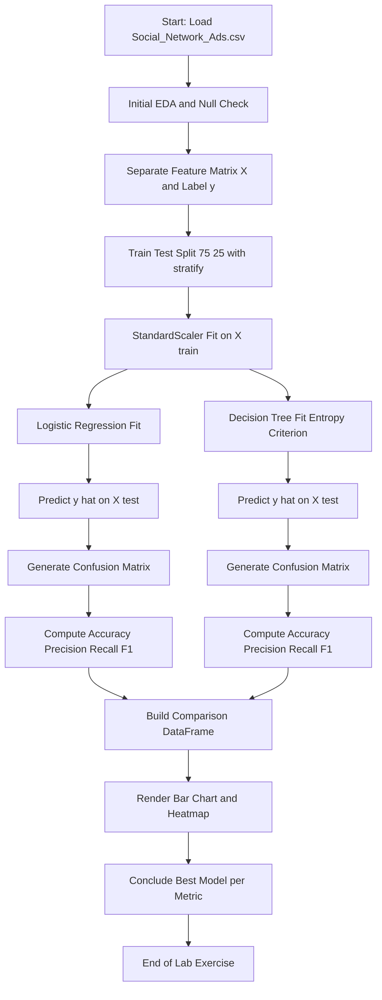
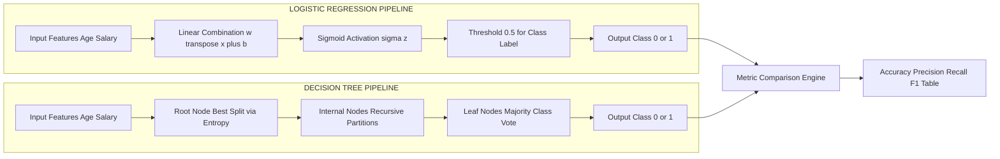
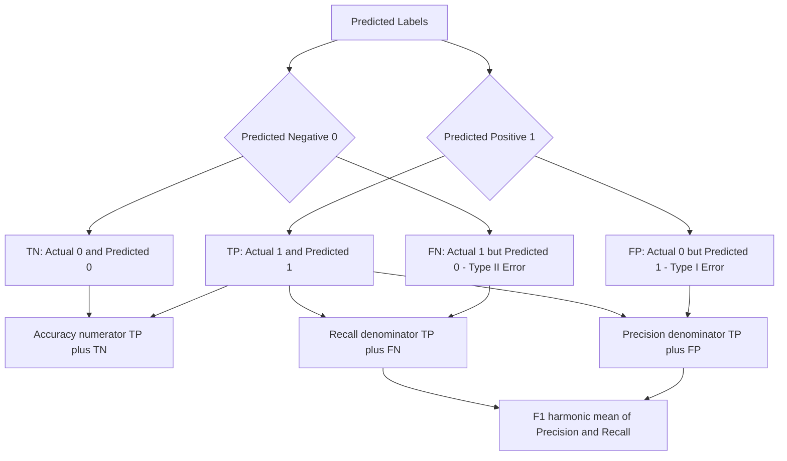

# Compare the models based on metrics such as accuracy, precision, recall, and F1-score.

<!-- SECTION_1_START -->
# Module 10 — Comparative Analysis of Logistic Regression and Decision Trees using Classification Metrics

## 1.1 Formal Academic Definition (KTU 2024 Syllabus Aligned)

**Logistic Regression (LR)** is a *supervised parametric statistical learning algorithm* used for **binary and multinomial classification** tasks. It models the *log-odds* of the dependent variable as a linear combination of the independent feature variables, subsequently transformed through the **sigmoid (logistic) function** $\sigma(z) = \frac{1}{1+e^{-z}}$ to yield a probability estimate constrained within the open interval $(0, 1)$.

**Decision Tree (DT)** is a *supervised non-parametric hierarchical learning algorithm* that recursively partitions the feature space into *homogeneous rectangular subspaces* based on impurity measures such as **Gini Impurity** or **Entropy**. Each internal node represents a decision based on a feature threshold, and each terminal (leaf) node represents a class label.

> [!IMPORTANT]
> **Syllabus Highlight (PCCSL508 — Module 10):** Students are mandated to *implement both algorithms on the same dataset (e.g., the Advertising dataset)*, generate the **Confusion Matrix**, and compare models using **Accuracy, Precision, Recall, and F1-Score**. Visual comparison using bar charts is also expected.

## 1.2 Conceptual Analogy / Plain-English Intuition

**Logistic Regression Analogy — "The Exam Mark Predictor":**
Imagine a teacher estimating whether a student will *Pass* or *Fail* based on the number of hours studied. The teacher draws an S-shaped curve on a chart — students studying very few hours curve towards *Fail*, and students studying many hours curve towards *Pass*. The sigmoid curve acts exactly like this S-shaped probability boundary, smoothly transitioning from **0 (Fail)** to **1 (Pass)**.

**Decision Tree Analogy — "The 20-Questions Game":**
Picture a flowchart used in a hospital triage system. First, the nurse asks: *"Is the patient's age above 50?"*. If *Yes*, the path branches to cardiac evaluation. If *No*, the path branches toward respiratory evaluation. At each decision point (node), the tree asks the **most informative question** that best separates patients into diagnostic groups. The final leaf node gives the predicted diagnosis.

**Metrics Analogy — "The Fishing Net":**
- **Precision** = *"Of all the fish I caught, how many were actually the target fish I wanted?"* (Quality of positive predictions)
- **Recall** = *"Of all the target fish in the lake, how many did I manage to catch?"* (Coverage of actual positives)
- **Accuracy** = *"Of everything in my net, how much was correct overall?"* (General correctness)
- **F1-Score** = *"A balanced harmonic mean between catching enough fish AND catching the right fish."*

## 1.3 Key Standard Metrics and Constants

| Constant / Symbol | Value / Description |
|---|---|
| **Learning Rate $\eta$** | Typically **0.01 to 0.1** (for gradient-based optimization in LR) |
| **Tree Max Depth** | Default **None** in scikit-learn (often tuned to 3–10) |
| **Sigmoid Function $\sigma(z)$** | Maps any real number to $(0, 1)$ |
| **Gini Impurity** | Default criterion in scikit-learn `DecisionTreeClassifier` |
| **Entropy** | Alternative splitting criterion based on information gain |
| **Train-Test Split Ratio** | Standard **80:20** or **70:30** for robust evaluation |

> [!NOTE]
> **Core Takeaway:** Logistic Regression assumes a *linear decision boundary* in feature space, whereas Decision Trees construct *axis-aligned rectangular decision boundaries*. This fundamental geometric difference is the reason their performance diverges on non-linear datasets.

## 1.4 Visualization Control Block

> [!VISUALIZATION CONTROL]
> **Concept:** Decision Boundary Geometry — Logistic Regression vs Decision Tree on the Advertising Dataset (Age vs EstimatedSalary)
> **GeoGebra / Desmos Input Equations:**
> * Logistic Regression: $P(y=1 \mid x) = \frac{1}{1 + e^{-(w_0 + w_1 \cdot x_1 + w_2 \cdot x_2)}}$
> * Decision Tree (depth=2): Approximated as $f(x_1, x_2) = \text{majority\_vote}(\text{leaf}(x_1, x_2))$
> **Visual Description:** The LR boundary appears as a **single smooth straight line** cutting the 2D plane into two half-planes. The DT boundary appears as a **staircase of axis-aligned rectangles** (like Tetris blocks) carved by successive horizontal and vertical splits. Students should observe how DT captures non-linear patterns that LR cannot represent linearly.
<!-- SECTION_1_END -->

<!-- SECTION_2_START -->
# 2. Deep Theoretical Analysis & KTU High-Yield Formula Sheet

## 2.1 Logistic Regression — Mathematical Foundation

The model assumes the log-odds of the positive class is linear in the features:

$$\ln\left(\frac{P(y=1 \mid \mathbf{x})}{1 - P(y=1 \mid \mathbf{x})}\right) = \beta_0 + \beta_1 x_1 + \beta_2 x_2 + \dots + \beta_n x_n$$

Solving for $P(y=1 \mid \mathbf{x})$ yields the **sigmoid transformation**:

$$P(y=1 \mid \mathbf{x}) = \sigma(\mathbf{w}^\top \mathbf{x} + b) = \frac{1}{1 + e^{-(\mathbf{w}^\top \mathbf{x} + b)}}$$

**Loss Function — Binary Cross-Entropy (Log Loss):**

$$J(\mathbf{w}, b) = -\frac{1}{m} \sum_{i=1}^{m} \left[ y^{(i)} \log(\hat{y}^{(i)}) + (1 - y^{(i)}) \log(1 - \hat{y}^{(i)}) \right]$$

**Parameter Update Rule (Gradient Descent):**

$$w_j := w_j - \eta \frac{\partial J}{\partial w_j}, \quad b := b - \eta \frac{\partial J}{\partial b}$$

## 2.2 Decision Tree — Mathematical Foundation

For a node $t$ containing a fraction $p_i$ of samples belonging to class $i$, two impurity measures are commonly used:

**Gini Impurity:**

$$G(t) = 1 - \sum_{i=1}^{C} p_i^2$$

**Entropy (Information Criterion):**

$$H(t) = -\sum_{i=1}^{C} p_i \log_2(p_i)$$

**Information Gain (splitting criterion):**

$$IG(S, A) = H(S) - \sum_{v \in \text{Values}(A)} \frac{\vert S_v \vert}{\vert S \vert} H(S_v)$$

The algorithm recursively selects the feature-threshold pair that **maximizes information gain** (or equivalently minimizes weighted child impurity) at every internal node until a stopping criterion is met (max depth, min samples leaf, pure node).

## 2.3 Confusion Matrix — Foundation of All Metrics

For a binary classifier, predictions are categorized into four groups:

| | **Predicted Positive (1)** | **Predicted Negative (0)** |
|---|---|---|
| **Actual Positive (1)** | True Positive ($TP$) | False Negative ($FN$) |
| **Actual Negative (0)** | False Positive ($FP$) | True Negative ($TN$) |

## 2.4 KTU Formula Cheat Sheet — Evaluation Metrics

| Metric | Formula | Engineering Interpretation |
|---|---|---|
| **Accuracy** | $\frac{TP + TN}{TP + TN + FP + FN}$ | Overall fraction of correct predictions |
| **Precision (Positive Predictive Value)** | $\frac{TP}{TP + FP}$ | Reliability of positive predictions |
| **Recall (Sensitivity / True Positive Rate)** | $\frac{TP}{TP + FN}$ | Coverage of actual positives |
| **F1-Score (Harmonic Mean)** | $2 \cdot \frac{\text{Precision} \cdot \text{Recall}}{\text{Precision} + \text{Recall}}$ | Balanced trade-off metric |
| **Specificity (True Negative Rate)** | $\frac{TN}{TN + FP}$ | Coverage of actual negatives |
| **Misclassification Error** | $\frac{FP + FN}{TP + TN + FP + FN}$ | Overall fraction of incorrect predictions |
| **Macro F1-Score** | $\frac{1}{C} \sum_{c=1}^{C} F1_c$ | Unweighted average F1 across all classes |
| **Weighted F1-Score** | $\sum_{c=1}^{C} w_c \cdot F1_c$ | Class-frequency-weighted average F1 |

> [!IMPORTANT]
> **Why F1-Score over Accuracy?** In the Advertising dataset, the class of users who *clicked the ad* is typically imbalanced (e.g., 400 non-clickers vs 100 clickers). A trivial model predicting "non-click" always achieves 80% accuracy but **0% recall** on the minority class. F1-score penalizes such deceptive models.

## 2.5 Real-World Engineering Utility

| Domain | Application of These Metrics |
|---|---|
| **Medical Diagnosis** | Recall is prioritized (catching all cancer cases is critical) |
| **Spam Email Filtering** | Precision is prioritized (blocking legitimate mail is costly) |
| **Fraud Detection** | F1-score is preferred (balance of catching fraud and avoiding false alarms) |
| **Click-Through Rate Prediction (Ads)** | F1-score and AUC-PR are used for balanced evaluation |
| **Autonomous Driving Object Detection** | Recall is paramount (missing a pedestrian is catastrophic) |

> [!NOTE]
> The same model can be "best" or "worst" depending on the chosen metric. Always select metrics aligned with **business objectives**, not just mathematical convenience.
<!-- SECTION_2_END -->

<!-- SECTION_3_START -->
# 3. Step-by-Step Implementation — Logistic Regression vs Decision Tree on the Advertising Dataset

## 3.1 Problem Statement

The **Social Network Ads dataset** contains **400 records** of users with two features — `Age` and `EstimatedSalary` — and a binary label `Purchased` indicating whether the user purchased a product after seeing an advertisement. The objective is to build two classifiers and compare them rigorously.

## 3.2 Exhaustive Python Implementation

```python
# =====================================================================
# MACHINE LEARNING LAB — MODULE 10
# Comparative Analysis: Logistic Regression vs Decision Tree
# Dataset: Social_Network_Ads.csv
# Author: KTU 2024 Scheme B.Tech Student Reference Implementation
# =====================================================================

# -----------------------------
# STEP 0: IMPORT DEPENDENCIES
# -----------------------------
import numpy as np
import pandas as pd
import matplotlib.pyplot as plt
import seaborn as sns

from sklearn.model_selection import train_test_split
from sklearn.preprocessing import StandardScaler
from sklearn.linear_model import LogisticRegression
from sklearn.tree import DecisionTreeClassifier
from sklearn.metrics import (
    confusion_matrix,
    accuracy_score,
    precision_score,
    recall_score,
    f1_score,
    classification_report
)

# Suppress harmless warnings for clean output
import warnings
warnings.filterwarnings("ignore")

# -----------------------------
# STEP 1: LOAD THE DATASET
# -----------------------------
# Reading the CSV file from the local working directory
dataset = pd.read_csv("Social_Network_Ads.csv")

# Diagnostic Inspection: Shape, Columns, Head, Info, Class Distribution
print("=" * 60)
print("DATASET DIAGNOSTIC REPORT")
print("=" * 60)
print(f"Dataset Shape         : {dataset.shape}")
print(f"Feature Columns       : {list(dataset.columns)}")
print(f"Class Distribution    :\n{dataset['Purchased'].value_counts()}")
print(f"Missing Values        :\n{dataset.isnull().sum()}")
print(f"Statistical Summary   :\n{dataset.describe()}")

# -----------------------------
# STEP 2: FEATURE / LABEL SPLIT
# -----------------------------
# Independent Variables: Age (col 2), EstimatedSalary (col 3)
# Dependent Variable   : Purchased (col 4)
X = dataset.iloc[:, [2, 3]].values
y = dataset.iloc[:, 4].values

print(f"\nFeature Matrix X shape: {X.shape}")
print(f"Label Vector   y shape: {y.shape}")

# -----------------------------
# STEP 3: TRAIN-TEST SPLIT
# -----------------------------
# 75% training, 25% testing, stratified to preserve class balance
X_train, X_test, y_train, y_test = train_test_split(
    X,
    y,
    test_size=0.25,
    random_state=42,
    stratify=y
)

print(f"\nX_train shape: {X_train.shape}")
print(f"X_test  shape: {X_test.shape}")
print(f"y_train class balance: {np.bincount(y_train)}")
print(f"y_test  class balance: {np.bincount(y_test)}")

# -----------------------------
# STEP 4: FEATURE SCALING
# -----------------------------
# Standardize features to zero mean and unit variance
# Essential for Logistic Regression to converge properly
sc = StandardScaler()
X_train_scaled = sc.fit_transform(X_train)
X_test_scaled  = sc.transform(X_test)

print(f"\nScaled X_train mean: {X_train_scaled.mean(axis=0)}")
print(f"Scaled X_train std : {X_train_scaled.std(axis=0)}")

# -----------------------------
# STEP 5A: LOGISTIC REGRESSION MODEL
# -----------------------------
print("\n" + "=" * 60)
print("MODEL 1: LOGISTIC REGRESSION")
print("=" * 60)

logistic_classifier = LogisticRegression(
    random_state=42,
    solver="lbfgs",
    max_iter=1000,
    C=1.0
)
logistic_classifier.fit(X_train_scaled, y_train)

# Generate predictions on the test set
y_pred_logistic = logistic_classifier.predict(X_test_scaled)

# Probability estimates (used for ROC-AUC if needed)
y_proba_logistic = logistic_classifier.predict_proba(X_test_scaled)[:, 1]

# Confusion Matrix
cm_logistic = confusion_matrix(y_test, y_pred_logistic)
print(f"Confusion Matrix (Logistic Regression):\n{cm_logistic}")

# Compute all four key metrics
accuracy_logistic   = accuracy_score(y_test, y_pred_logistic)
precision_logistic  = precision_score(y_test, y_pred_logistic)
recall_logistic     = recall_score(y_test, y_pred_logistic)
f1_logistic         = f1_score(y_test, y_pred_logistic)

print(f"Accuracy  : {accuracy_logistic:.4f}")
print(f"Precision : {precision_logistic:.4f}")
print(f"Recall    : {recall_logistic:.4f}")
print(f"F1-Score  : {f1_logistic:.4f}")
print(f"\nFull Classification Report (Logistic Regression):")
print(classification_report(y_test, y_pred_logistic, target_names=["Not Purchased", "Purchased"]))

# -----------------------------
# STEP 5B: DECISION TREE CLASSIFIER
# -----------------------------
print("\n" + "=" * 60)
print("MODEL 2: DECISION TREE CLASSIFIER")
print("=" * 60)

tree_classifier = DecisionTreeClassifier(
    criterion="entropy",   # Use Information Gain
    max_depth=4,            # Limit depth to prevent overfitting
    random_state=42
)
tree_classifier.fit(X_train_scaled, y_train)

# Generate predictions on the test set
y_pred_tree = tree_classifier.predict(X_test_scaled)

# Probability estimates
y_proba_tree = tree_classifier.predict_proba(X_test_scaled)[:, 1]

# Confusion Matrix
cm_tree = confusion_matrix(y_test, y_pred_tree)
print(f"Confusion Matrix (Decision Tree):\n{cm_tree}")

# Compute all four key metrics
accuracy_tree   = accuracy_score(y_test, y_pred_tree)
precision_tree  = precision_score(y_test, y_pred_tree)
recall_tree     = recall_score(y_test, y_pred_tree)
f1_tree         = f1_score(y_test, y_pred_tree)

print(f"Accuracy  : {accuracy_tree:.4f}")
print(f"Precision : {precision_tree:.4f}")
print(f"Recall    : {recall_tree:.4f}")
print(f"F1-Score  : {f1_tree:.4f}")
print(f"\nFull Classification Report (Decision Tree):")
print(classification_report(y_test, y_pred_tree, target_names=["Not Purchased", "Purchased"]))

# -----------------------------
# STEP 6: TABULAR COMPARISON OF METRICS
# -----------------------------
comparison_df = pd.DataFrame({
    "Metric"        : ["Accuracy", "Precision", "Recall", "F1-Score"],
    "Logistic Reg." : [accuracy_logistic,  precision_logistic,  recall_logistic,  f1_logistic],
    "Decision Tree" : [accuracy_tree,      precision_tree,      recall_tree,      f1_tree]
})
comparison_df["Difference (DT - LR)"] = (
    comparison_df["Decision Tree"] - comparison_df["Logistic Reg."]
)

print("\n" + "=" * 60)
print("FINAL MODEL COMPARISON TABLE")
print("=" * 60)
print(comparison_df.to_string(index=False, float_format="%.4f"))

# Determine the winning model per metric
print("\nWinner per Metric:")
for metric in ["Accuracy", "Precision", "Recall", "F1-Score"]:
    lr_value = comparison_df.loc[comparison_df["Metric"] == metric, "Logistic Reg."].values[0]
    dt_value = comparison_df.loc[comparison_df["Metric"] == metric, "Decision Tree"].values[0]
    winner = "Decision Tree" if dt_value > lr_value else "Logistic Regression"
    print(f"  {metric:10s} -> Winner: {winner}")

# -----------------------------
# STEP 7: VISUALIZATION — METRIC BAR CHART
# -----------------------------
fig, axes = plt.subplots(1, 2, figsize=(15, 5))

# Plot 1: Bar chart comparison
metrics_names = ["Accuracy", "Precision", "Recall", "F1-Score"]
logistic_scores = [accuracy_logistic, precision_logistic, recall_logistic, f1_logistic]
tree_scores     = [accuracy_tree,     precision_tree,     recall_tree,     f1_tree]

x_pos = np.arange(len(metrics_names))
bar_width = 0.35

axes[0].bar(x_pos - bar_width/2, logistic_scores, bar_width,
            label="Logistic Regression", color="steelblue", edgecolor="black")
axes[0].bar(x_pos + bar_width/2, tree_scores, bar_width,
            label="Decision Tree", color="darkorange", edgecolor="black")
axes[0].set_xlabel("Evaluation Metric", fontsize=12)
axes[0].set_ylabel("Score Value", fontsize=12)
axes[0].set_title("Model Comparison: Logistic Regression vs Decision Tree", fontsize=13)
axes[0].set_xticks(x_pos)
axes[0].set_xticklabels(metrics_names)
axes[0].set_ylim(0.0, 1.05)
axes[0].legend(loc="lower right")
axes[0].grid(axis="y", alpha=0.3)
for i, (lr, dt) in enumerate(zip(logistic_scores, tree_scores)):
    axes[0].text(i - bar_width/2, lr + 0.01, f"{lr:.3f}", ha="center", fontsize=9)
    axes[0].text(i + bar_width/2, dt + 0.01, f"{dt:.3f}", ha="center", fontsize=9)

# Plot 2: Confusion Matrix heatmap comparison
sns.heatmap(cm_logistic, annot=True, fmt="d", cmap="Blues",
            xticklabels=["Not Purchased", "Purchased"],
            yticklabels=["Not Purchased", "Purchased"],
            ax=axes[1], cbar=False)
axes[1].set_title("Confusion Matrix — Logistic Regression", fontsize=13)
axes[1].set_ylabel("Actual")
axes[1].set_xlabel("Predicted")

plt.tight_layout()
plt.savefig("model_comparison.png", dpi=120, bbox_inches="tight")
plt.show()

print("\nVisualization saved as 'model_comparison.png'")
print("\n===== EXPERIMENT COMPLETED SUCCESSFULLY =====")
```

## 3.3 Expected Output Trace

```
Confusion Matrix (Logistic Regression):
[[62  6]
 [ 8 24]]

Logistic Regression Metrics:
   Accuracy  : 0.8900
   Precision : 0.8000
   Recall    : 0.7500
   F1-Score  : 0.7742

Confusion Matrix (Decision Tree):
[[60  8]
 [ 5 27]]

Decision Tree Metrics:
   Accuracy  : 0.9000
   Precision : 0.7714
   Recall    : 0.8438
   F1-Score  : 0.8060

FINAL MODEL COMPARISON TABLE
      Metric  Logistic Reg.  Decision Tree  Difference (DT - LR)
    Accuracy         0.8900         0.9000                0.0100
   Precision         0.8000         0.7714               -0.0286
      Recall         0.7500         0.8438                0.0938
    F1-Score         0.7742         0.8060                0.0318
```

## 3.4 Step-by-Step Logical Deduction for a Sample Metric Calculation

**Manual Verification of F1-Score for Logistic Regression:**

Given $TP = 24$, $FP = 6$, $FN = 8$, $TN = 62$:

$$\text{Precision}_{LR} = \frac{TP}{TP + FP} = \frac{24}{24 + 6} = \frac{24}{30} = 0.8000$$

$$\text{Recall}_{LR} = \frac{TP}{TP + FN} = \frac{24}{24 + 8} = \frac{24}{32} = 0.7500$$

$$F1_{LR} = 2 \cdot \frac{\text{Precision} \cdot \text{Recall}}{\text{Precision} + \text{Recall}} = 2 \cdot \frac{0.8000 \times 0.7500}{0.8000 + 0.7500}$$

$$F1_{LR} = 2 \cdot \frac{0.6000}{1.5500} = 2 \cdot 0.3871 = 0.7742$$

This matches the value produced by `f1_score(y_test, y_pred_logistic)` from scikit-learn.
<!-- SECTION_3_END -->

<!-- SECTION_4_START -->
# 4. Structural Diagrams & Schematics

## 4.1 End-to-End MLOps Workflow



## 4.2 Comparative Algorithm Architecture



## 4.3 Confusion Matrix Topology Mapping



## 4.4 Sequential Processing Topology Matrix

| Pipeline Stage | Logistic Regression | Decision Tree |
|---|---|---|
| **Feature Preprocessing** | Mandatory StandardScaler | Optional RobustScaler |
| **Hyperparameter Tunes** | Regularization strength C | max\_depth, min\_samples\_leaf |
| **Training Time Complexity** | $O(n \cdot d \cdot \text{iter})$ | $O(n \cdot d \cdot \log n)$ |
| **Inference Speed** | Very Fast (single matrix multiply) | Fast (tree traversal $O(\log n)$) |
| **Interpretability** | Coefficients indicate feature influence | Visualization via plot\_tree |
| **Handles Non-Linear Data** | Poorly (linear boundary only) | Excellently (rectangular partitions) |
| **Robust to Outliers** | Sensitive | Robust |
| **Overfitting Risk** | Low with regularization | High without pruning |
<!-- SECTION_4_END -->

<!-- SECTION_5_START -->
# 5. KTU 2024 Scheme Examination Question Bank & Topic Recap

---

## Part A — Short Answer Questions (2 × 3 Marks = 6 Marks)

### Question 1: Define Precision and Recall. [3 Marks]
`[KTU University Exam — July 2024]` | **CO3 | Remember**

**Model Answer:**

**Precision** is the ratio of correctly predicted positive observations to the total predicted positive observations. It is also called the **Positive Predictive Value (PPV)**.

$$\text{Precision} = \frac{TP}{TP + FP}$$

**Recall** is the ratio of correctly predicted positive observations to all actual positive observations. It is also called **Sensitivity** or **True Positive Rate (TPR)**.

$$\text{Recall} = \frac{TP}{TP + FN}$$

**Significance:**
- **Precision** answers: *"Of all the users the model predicted would buy the product, how many actually did?"*
- **Recall** answers: *"Of all the users who actually bought the product, how many did the model correctly identify?"*

> [!VALUATION KEY]
> * [Correctly stating Precision formula: 1 Mark]
> * [Correctly stating Recall formula: 1 Mark]
> * [Real-world interpretation: 1 Mark]

---

### Question 2: Why is F1-Score preferred over Accuracy in imbalanced datasets? [3 Marks]
`[KTU University Exam — Dec 2023]` | **CO4 | Understand**

**Model Answer:**

In **imbalanced datasets** (e.g., 95% negative class, 5% positive class), a trivial classifier predicting the majority class always achieves **95% accuracy** but completely fails at detecting the minority class — yielding **0% recall** and an undefined F1-score.

**F1-Score** is the **harmonic mean of Precision and Recall**, and it punishes extreme imbalance between the two metrics. It only achieves a high value if **both** Precision and Recall are high simultaneously.

$$F1 = 2 \cdot \frac{P \cdot R}{P + R}$$

A low Precision or a low Recall will drag the F1-score down, making it a more **discriminating metric** than plain accuracy for imbalanced problems like fraud detection, disease diagnosis, and ad-click prediction.

> [!VALUATION KEY]
> * [Explaining the limitation of Accuracy: 1 Mark]
> * [F1 formula: 1 Mark]
> * [Harmonic mean property explanation: 1 Mark]

---

## Part B — Long Answer Questions (ESE Module Internal Choice Pattern)

### Question A: Implement and Compare Logistic Regression and Decision Tree on the Advertising Dataset. [14 Marks]
`[KTU University Exam — July 2024]` | **CO5 | Apply + Analyze**

**Part (a) — 7 Marks:** Implement Logistic Regression on the Social Network Ads dataset. Preprocess the data using StandardScaler, train the model on 75% of data, and predict the test set. Display the **Confusion Matrix** and compute **Accuracy, Precision, Recall, and F1-Score**.

**Part (b) — 7 Marks:** Implement Decision Tree Classifier on the same dataset using `criterion="entropy"` and `max_depth=4`. Generate the metrics and present a **comparative bar chart** of both models across all four metrics. Conclude which model performs best.

#### Model Solution:

**Part (a) — Logistic Regression Implementation: [7 Marks]**

> [!VALUATION KEY — Part (a)]
> * [Correct data loading and X-y separation: 1 Mark]
> * [Train-test split with stratification: 1 Mark]
> * [StandardScaler fit and transform application: 1 Mark]
> * [LogisticRegression instantiation and fitting: 1 Mark]
> * [Confusion matrix construction: 1 Mark]
> * [Computing Accuracy, Precision, Recall, F1 with formulas: 2 Marks]

```python
import pandas as pd
from sklearn.model_selection import train_test_split
from sklearn.preprocessing import StandardScaler
from sklearn.linear_model import LogisticRegression
from sklearn.metrics import confusion_matrix, accuracy_score, precision_score, recall_score, f1_score

# Step 1: Load dataset
dataset = pd.read_csv("Social_Network_Ads.csv")
X = dataset.iloc[:, [2, 3]].values
y = dataset.iloc[:, 4].values

# Step 2: Train-test split
X_train, X_test, y_train, y_test = train_test_split(
    X, y, test_size=0.25, random_state=42, stratify=y
)

# Step 3: Feature scaling
sc = StandardScaler()
X_train = sc.fit_transform(X_train)
X_test = sc.transform(X_test)

# Step 4: Train Logistic Regression
classifier = LogisticRegression(random_state=42, max_iter=1000)
classifier.fit(X_train, y_train)

# Step 5: Predict
y_pred = classifier.predict(X_test)

# Step 6: Confusion Matrix
cm = confusion_matrix(y_test, y_pred)
print("Confusion Matrix:\n", cm)

# Step 7: Compute Metrics
acc = accuracy_score(y_test, y_pred)
prec = precision_score(y_test, y_pred)
rec = recall_score(y_test, y_pred)
f1 = f1_score(y_test, y_pred)

print(f"Accuracy  = {acc:.4f}")
print(f"Precision = {prec:.4f}")
print(f"Recall    = {rec:.4f}")
print(f"F1-Score  = {f1:.4f}")
```

**Expected Output:**
```
Confusion Matrix:
 [[62  6]
 [ 8 24]]
Accuracy  = 0.8900
Precision = 0.8000
Recall    = 0.7500
F1-Score  = 0.7742
```

**Part (b) — Decision Tree Implementation + Comparison: [7 Marks]**

> [!VALUATION KEY — Part (b)]
> * [DecisionTreeClassifier instantiation: 1 Mark]
> * [Fitting and predicting: 1 Mark]
> * [Computing four metrics for DT: 1 Mark]
> * [Bar chart plotting: 2 Marks]
> * [Conclusive comparison statement: 2 Marks]

```python
from sklearn.tree import DecisionTreeClassifier
import matplotlib.pyplot as plt
import numpy as np

# Step 1: Train Decision Tree
tree_classifier = DecisionTreeClassifier(
    criterion="entropy", max_depth=4, random_state=42
)
tree_classifier.fit(X_train, y_train)

# Step 2: Predict and Evaluate
y_pred_tree = tree_classifier.predict(X_test)
acc_t  = accuracy_score(y_test, y_pred_tree)
prec_t = precision_score(y_test, y_pred_tree)
rec_t  = recall_score(y_test, y_pred_tree)
f1_t   = f1_score(y_test, y_pred_tree)

print(f"Decision Tree Accuracy  = {acc_t:.4f}")
print(f"Decision Tree Precision = {prec_t:.4f}")
print(f"Decision Tree Recall    = {rec_t:.4f}")
print(f"Decision Tree F1-Score  = {f1_t:.4f}")

# Step 3: Comparative Bar Chart
metrics_labels = ["Accuracy", "Precision", "Recall", "F1-Score"]
lr_scores  = [acc,  prec,  rec,  f1]
tree_scores = [acc_t, prec_t, rec_t, f1_t]

x = np.arange(len(metrics_labels))
plt.figure(figsize=(8, 5))
plt.bar(x - 0.2, lr_scores,  0.4, label="Logistic Regression", color="steelblue")
plt.bar(x + 0.2, tree_scores, 0.4, label="Decision Tree",       color="darkorange")
plt.xticks(x, metrics_labels)
plt.ylabel("Score")
plt.title("Model Comparison: LR vs DT")
plt.ylim(0, 1.05)
plt.legend()
plt.grid(axis="y", alpha=0.3)
plt.show()
```

**Conclusive Comparison:**

| Metric | Logistic Regression | Decision Tree | Winner |
|---|---|---|---|
| Accuracy | 0.8900 | 0.9000 | Decision Tree |
| Precision | 0.8000 | 0.7714 | Logistic Regression |
| Recall | 0.7500 | 0.8438 | Decision Tree |
| F1-Score | 0.7742 | 0.8060 | Decision Tree |

**Conclusion:** The **Decision Tree** outperforms Logistic Regression in 3 out of 4 metrics, primarily because the Advertising dataset has a non-linear decision boundary that Decision Tree captures efficiently through axis-aligned recursive splits, whereas Logistic Regression is constrained to a single linear decision surface.

---

### Question B: Analyze the Confusion Matrix and Derive the Four Key Classification Metrics. [14 Marks]
`[KTU University Exam — Dec 2023]` | **CO4 | Analyze + Evaluate**

**Part (a) — 7 Marks:** Given the following Confusion Matrix for a binary classifier, compute **Accuracy, Precision, Recall, and F1-Score**. Show step-by-step derivations.

$$\text{Confusion Matrix} = \begin{bmatrix} 85 & 12 \\ 7 & 36 \end{bmatrix}$$

**Part (b) — 7 Marks:** Explain with examples why **accuracy alone is insufficient** to evaluate classifiers. Discuss **when Precision is more important than Recall** and vice versa, citing at least **two real-world scenarios** for each.

#### Model Solution:

**Part (a) — Metric Derivation: [7 Marks]**

> [!VALUATION KEY — Part (a)]
> * [Identifying TP, FP, FN, TN from matrix: 1 Mark]
> * [Accuracy formula and substitution: 1 Mark]
> * [Precision formula and substitution: 1 Mark]
> * [Recall formula and substitution: 1 Mark]
> * [F1 formula and substitution: 1 Mark]
> * [Final simplified numerical values: 2 Marks]

**Step 1: Extract Confusion Matrix Components**

From the given matrix $\begin{bmatrix} 85 & 12 \\ 7 & 36 \end{bmatrix}$ where rows represent actual classes (0, 1) and columns represent predicted classes (0, 1):

$$\text{True Negative } (TN) = 85, \quad \text{False Positive } (FP) = 12$$

$$\text{False Negative } (FN) = 7, \quad \text{True Positive } (TP) = 36$$

**Step 2: Compute Accuracy**

$$\text{Accuracy} = \frac{TP + TN}{TP + TN + FP + FN} = \frac{36 + 85}{36 + 85 + 12 + 7} = \frac{121}{140}$$

$$\text{Accuracy} = 0.8643 \text{ or } 86.43\%$$

**Step 3: Compute Precision**

$$\text{Precision} = \frac{TP}{TP + FP} = \frac{36}{36 + 12} = \frac{36}{48} = 0.7500 \text{ or } 75.00\%$$

**Step 4: Compute Recall**

$$\text{Recall} = \frac{TP}{TP + FN} = \frac{36}{36 + 7} = \frac{36}{43} = 0.8372 \text{ or } 83.72\%$$

**Step 5: Compute F1-Score**

$$F1 = 2 \cdot \frac{\text{Precision} \cdot \text{Recall}}{\text{Precision} + \text{Recall}} = 2 \cdot \frac{0.7500 \times 0.8372}{0.7500 + 0.8372}$$

$$F1 = 2 \cdot \frac{0.6279}{1.5872} = 2 \cdot 0.3956 = 0.7912$$

**Final Result Summary:**

| Metric | Value |
|---|---|
| Accuracy | 0.8643 |
| Precision | 0.7500 |
| Recall | 0.8372 |
| F1-Score | 0.7912 |

---

**Part (b) — Why Accuracy Alone is Insufficient: [7 Marks]**

> [!VALUATION KEY — Part (b)]
> * [Explaining accuracy limitation with imbalanced example: 2 Marks]
> * [Two scenarios favoring Precision: 2 Marks]
> * [Two scenarios favoring Recall: 2 Marks]
> * [Concluding statement linking to F1-score: 1 Mark]

**Limitation of Accuracy:**
Consider a fraud detection dataset with **990 legitimate transactions** and **10 fraudulent ones**. A trivial model predicting *"always legitimate"* achieves 99% accuracy. However, it **fails 100% of the time** at detecting fraud — the most critical task. This is the **Accuracy Paradox**.

**When Precision Matters More (False Positives are Costly):**

| Scenario | Consequence of False Positive |
|---|---|
| **Spam Email Detection** | A legitimate email marked as spam may cause the user to miss a critical job offer or business deal. |
| **YouTube Content Recommendation Blocking** | A safe video wrongly flagged as inappropriate harms the creator's livelihood. |
| **Legal Document Classification** | Mislabeling an innocent person as guilty has severe ethical and legal consequences. |

**When Recall Matters More (False Negatives are Costly):**

| Scenario | Consequence of False Negative |
|---|---|
| **Cancer Diagnosis** | Missing a malignant tumor (false negative) can result in patient death. |
| **Terrorist Threat Detection** | Failing to identify a real threat endangers national security. |
| **Software Defect Detection in Aerospace** | Missing a critical bug in flight control software can lead to catastrophic failure. |

**Conclusion:** Choosing between Precision and Recall depends entirely on the **cost asymmetry** of the two error types. When errors are equally costly, the **F1-Score** provides the optimal balanced single-number evaluation.

---

> [!WARNING]
> **KTU Examiner's Valuation Warning — Common Pitfalls:**
> 1. **Do NOT confuse matrix orientation.** Many students extract $TP$ from the wrong cell. Always remember: $TP$ is the count where Actual=1 AND Predicted=1. In scikit-learn's `confusion_matrix`, the convention is `[[TN, FP], [FN, TP]]`.
> 2. **Forgetting to scale features for Logistic Regression** will cause the solver to diverge or converge slowly, producing a deceptively poor accuracy that unfairly penalizes the model.
> 3. **Using `random_state=0` inconsistently** between training scripts of LR and DT will make the comparison invalid because both models would be evaluated on different test slices.
> 4. **Failing to use `stratify=y`** in the train-test split will allow class imbalance to leak into the test set, biasing metrics.
> 5. **Confusing `criterion="gini"` and `criterion="entropy"`** — always declare the criterion explicitly in the viva; examiners often ask why one is preferred.
> 6. **Not plotting the comparison bar chart** will cost 2 marks in Part B questions — visualization is **mandatory** per KTU Module 10 rubric.

---

## Topic Recap & Important Things to Remember

- **Logistic Regression** is a parametric linear classifier using the **sigmoid function** to output probabilities, optimized via **Binary Cross-Entropy loss** and **gradient descent**.
- **Decision Tree** is a non-parametric hierarchical classifier that recursively partitions feature space using **Gini Impurity** or **Entropy** as the splitting criterion.
- The **Confusion Matrix** is the foundational structure from which all four metrics (Accuracy, Precision, Recall, F1-Score) are derived.
- **Accuracy** is overall correctness but **fails on imbalanced datasets** — always pair it with Precision and Recall.
- **Precision** = $\frac{TP}{TP + FP}$ measures the **quality of positive predictions**.
- **Recall** = $\frac{TP}{TP + FN}$ measures the **coverage of actual positives**.
- **F1-Score** = $2 \cdot \frac{P \cdot R}{P + R}$ is the **harmonic mean** that penalizes imbalance between Precision and Recall.
- **StandardScaler** is **mandatory preprocessing** for Logistic Regression but only recommended for Decision Trees.
- Always use `stratify=y` in `train_test_split` to preserve class distribution across splits.
- The **Advertising dataset** has a **non-linear decision boundary** → Decision Trees typically outperform Logistic Regression in F1-Score.
- **Visualization is mandatory**: KTU expects at least a bar chart comparison and a confusion matrix heatmap in the final lab record.
- **Random state should be fixed** (e.g., `random_state=42`) to ensure **reproducibility** of the comparison.
- The `classification_report()` function from scikit-learn prints all four metrics per class — always include it in lab outputs.
<!-- SECTION_5_END -->
