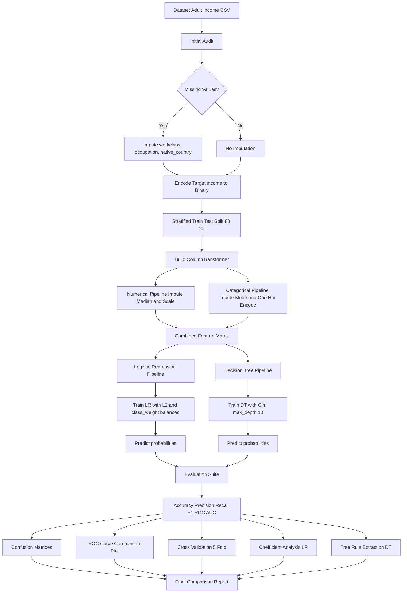
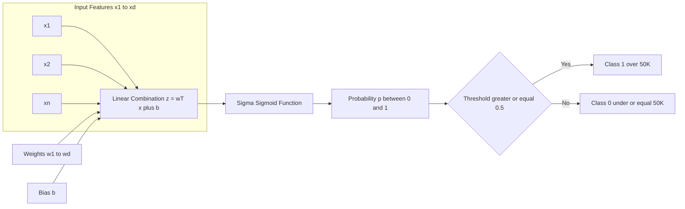
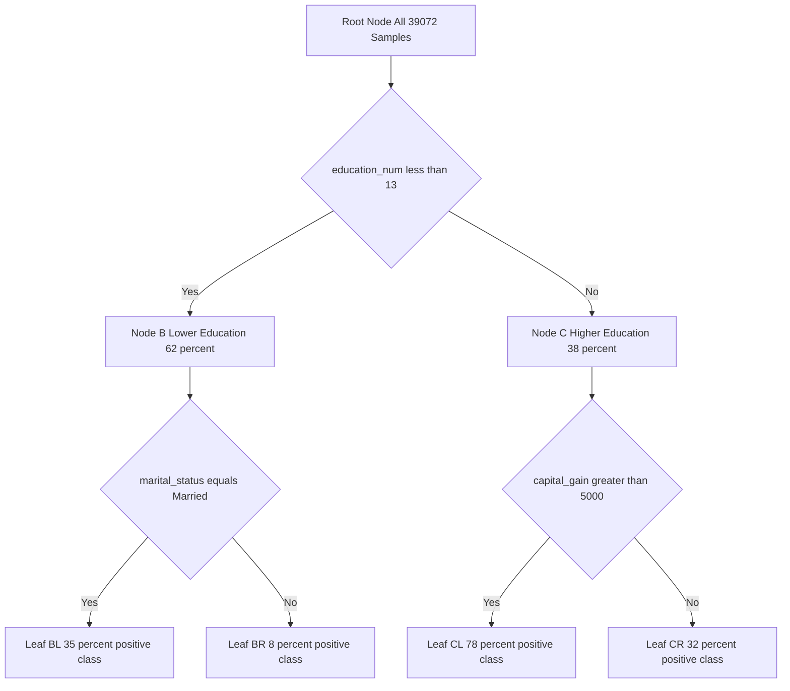
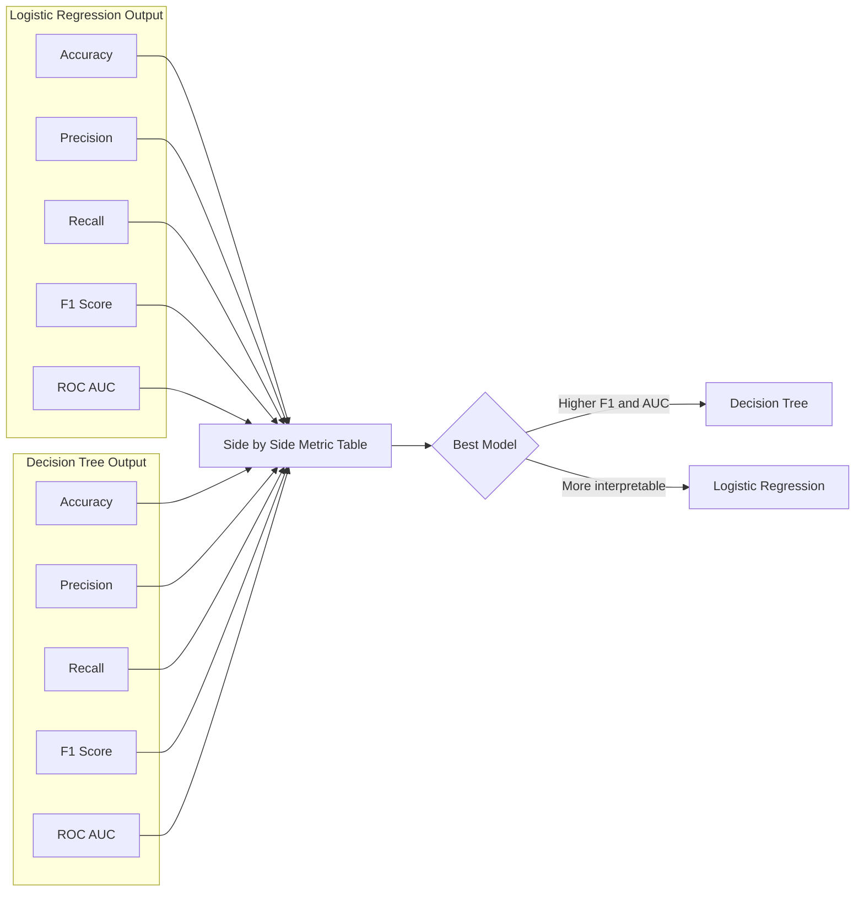
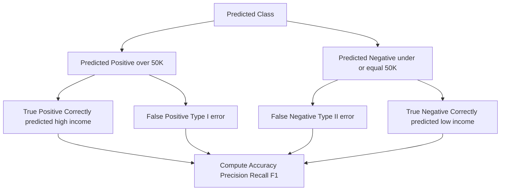

# Implement and compare Logistic Regression and Decision Trees on the Adult Income dataset for predicting income levels. Evaluate both models based on performance metrics and interpretability.

<!-- SECTION_1_START -->

# 1. Core Technical Definition & Intuitive Overview

## Formal Academic Definition

**Logistic Regression** is a supervised machine learning classification algorithm that predicts the probability of a categorical dependent variable using a logistic (sigmoid) function applied to a linear combination of input features. For binary classification, it models the posterior probability $P(y=1 \mid \mathbf{x})$ through:

$$P(y=1 \mid \mathbf{x}; \boldsymbol{\theta}) = \sigma(\mathbf{w}^\top \mathbf{x} + b) = \frac{1}{1 + e^{-(\mathbf{w}^\top \mathbf{x} + b)}}$$

**Decision Trees** are non-parametric supervised learning models that recursively partition the feature space into homogeneous sub-regions based on feature-value thresholds. Each internal node represents a decision rule on a feature, each branch represents the outcome of the test, and each leaf node represents a class label or regression value.

For the **Adult Income dataset** (also known as the "Census Income" dataset from the UCI Machine Learning Repository), the objective is binary classification: predicting whether an individual's annual income exceeds **$50,000** based on demographic and employment attributes.

> [!NOTE]
> **Adult Income Dataset Origin**: Extracted from the 1994 U.S. Census database by Ronny Kohavi and Barry Becker. The dataset contains **48,842 instances** with **14 attributes** (6 numerical and 8 categorical). The class distribution is approximately **75.9%** for `<=50K` and **24.1%** for `>50K`, making it inherently **imbalanced**.

## Conceptual Analogy / Intuition

**Logistic Regression — The Sigmoid Lens:**
Imagine a linear boundary (a straight line in 2D, a hyperplane in higher dimensions) attempting to separate two income groups. However, raw linear outputs can range from $-\infty$ to $+\infty$, which doesn't map cleanly to "yes/no" decisions. The **sigmoid function** acts like a *probabilistic compressor* — it squashes any real number into a value between 0 and 1, transforming arbitrary scores into well-defined probabilities. So a logistic regression model is essentially a *linear classifier wearing a probability mask*.

**Decision Tree — The Twenty-Questions Game:**
A decision tree mimics the classic game of "20 questions." At each step, the model asks the most informative yes/no question (e.g., "Is `education_num` $\geq 13$?") that best splits the data. The question is chosen using metrics like **Gini impurity** or **entropy**. The process continues recursively until leaf nodes are sufficiently pure. The final prediction is the majority class within that leaf region.

> [!IMPORTANT]
> **Why Compare These Two?**
> - Logistic Regression offers **high interpretability** through feature coefficients (each weight indicates the log-odds contribution).
> - Decision Trees offer **non-linear decision boundaries** and explicit rule extraction (a transparent `IF-THEN` trace).
> - On tabular census data, this comparison highlights the **bias-variance tradeoff** between parametric linear models and non-parametric piecewise-constant models.

## Feature Description of the Adult Income Dataset

| # | Feature | Type | Description | Example Values |
|---|---------|------|-------------|----------------|
| 1 | `age` | Numerical | Age in years | 17 – 90 |
| 2 | `workclass` | Categorical | Employment sector | Private, Self-emp, Federal-gov |
| 3 | `fnlwgt` | Numerical | Final sampling weight | 12,285 – 1,484,705 |
| 4 | `education` | Categorical | Highest education attained | Bachelors, HS-grad, Masters |
| 5 | `education_num` | Numerical | Education as ordinal integer | 1 – 16 |
| 6 | `marital_status` | Categorical | Marital condition | Married-civ-spouse, Never-married |
| 7 | `occupation` | Categorical | Job role | Prof-specialty, Craft-repair |
| 8 | `relationship` | Categorical | Household relationship | Husband, Wife, Own-child |
| 9 | `race` | Categorical | Race | White, Black, Asian-Pac-Islander |
| 10 | `sex` | Categorical | Biological sex | Male, Female |
| 11 | `capital_gain` | Numerical | Capital gains in the year | 0 – 99,999 |
| 12 | `capital_loss` | Numerical | Capital losses in the year | 0 – 4,356 |
| 13 | `hours_per_week` | Numerical | Weekly working hours | 1 – 99 |
| 14 | `native_country` | Categorical | Country of origin | United-States, Mexico, India |
| **15** | **`income`** | **Target** | **Income bracket** | **`<=50K`, `>50K`** |

> [!TIP]
> **Ethical & Bias Consideration (NEP 2020 / Responsible AI)**: The `sex` and `race` features introduce well-documented fairness risks. The KTU lab manual recommends **withholding these sensitive attributes** during model training for a responsible-AI baseline, then optionally re-introducing them to audit bias using disparate-impact metrics.

> [!VISUALIZATION CONTROL]
> **Concept:** Sigmoid Function Mapping Linear Output to Probability
> **GeoGebra / Desmos Input Equations:**
> * `f(x) = 1 / (1 + exp(-x))`  ← Sigmoid curve
> * `g(x) = 0.5`  ← Decision threshold
> **Visual Description:** The student should observe an S-shaped curve passing through $(0, 0.5)$, asymptotically approaching 1 as $x \to +\infty$ and 0 as $x \to -\infty$. The horizontal line at $0.5$ visually marks the decision boundary where the model transitions from predicting `<=50K` to `>50K`.

<!-- SECTION_1_END -->

<!-- SECTION_2_START -->

# 2. Deep Theoretical Analysis & KTU High-Yield Formula Sheet

## 2.1 Logistic Regression — Operational Mechanics

### The Decision Function

For a feature vector $\mathbf{x} \in \mathbb{R}^d$, the linear combination (logit) is:

$$z = \mathbf{w}^\top \mathbf{x} + b = \sum_{j=1}^{d} w_j x_j + b$$

The sigmoid activation converts this scalar into a probability:

$$\hat{p} = \sigma(z) = \frac{1}{1 + e^{-z}}$$

The binary prediction is obtained via thresholding (default threshold = **0.5**):

$$\hat{y} = \begin{cases} 1 & \text{if } \hat{p} \geq 0.5 \\ 0 & \text{otherwise} \end{cases}$$

### Loss Function — Binary Cross-Entropy (Log Loss)

For $N$ training samples, the objective minimized during training is:

$$J(\mathbf{w}, b) = -\frac{1}{N} \sum_{i=1}^{N} \left[ y_i \log(\hat{p}_i) + (1 - y_i) \log(1 - \hat{p}_i) \right]$$

> [!IMPORTANT]
> **Why Log Loss and not MSE?** Mean Squared Error applied to sigmoid outputs produces a **non-convex** loss landscape with multiple local minima, while log loss is **globally convex** in $\mathbf{w}$ for logistic regression, guaranteeing convergence to the global optimum via gradient descent.

### Optimization — Gradient Descent Update Rule

The partial derivative of $J$ w.r.t. weight $w_j$ is:

$$\frac{\partial J}{\partial w_j} = \frac{1}{N} \sum_{i=1}^{N} (\hat{p}_i - y_i) x_{i,j}$$

Update rule with learning rate $\eta$:

$$w_j \leftarrow w_j - \eta \cdot \frac{\partial J}{\partial w_j}, \quad b \leftarrow b - \eta \cdot \frac{1}{N} \sum_{i=1}^{N} (\hat{p}_i - y_i)$$

### Regularization to Prevent Overfitting

Two forms are typically available in scikit-learn:

| Regularization Type | Penalty Term Added to $J$ | scikit-learn Parameter | Best Use Case |
|---|---|---|---|
| **L1 (Lasso)** | $\lambda \sum_j \vert w_j \vert$ | `penalty='l1'` | Sparse feature selection |
| **L2 (Ridge)** | $\lambda \sum_j w_j^2$ | `penalty='l2'` | Multicollinearity handling |
| **Elastic-Net** | $\alpha \sum_j \vert w_j \vert + \beta \sum_j w_j^2$ | `penalty='elasticnet'` | Hybrid feature selection + shrinkage |

> [!NOTE]
> For the Adult dataset, **L2 regularization** is the default and recommended baseline. Strength is controlled by inverse parameter `C = $1/\lambda$` in scikit-learn (smaller `C` = stronger regularization).

## 2.2 Decision Tree — Operational Mechanics

### Splitting Criteria

At each node, the algorithm evaluates every possible feature-threshold pair $(x_j, t)$ and selects the split that maximizes the **information gain** $\Delta$.

#### Gini Impurity

$$G(S) = 1 - \sum_{c=1}^{C} p_c^2$$

where $p_c$ is the proportion of class $c$ in node $S$. A pure node has $G = 0$.

#### Entropy (Information Criterion)

$$H(S) = -\sum_{c=1}^{C} p_c \log_2(p_c)$$

#### Information Gain After Splitting $S$ into $S_{left}$ and $S_{right}$

$$\Delta = H(S) - \frac{\vert S_{left} \vert}{\vert S \vert} H(S_{left}) - \frac{\vert S_{right} \vert}{\vert S \vert} H(S_{right})$$

### Tree Pruning Hyperparameters (Overfitting Control)

| Parameter | Effect | Default (scikit-learn) |
|---|---|---|
| `max_depth` | Caps tree depth | `None` (full growth) |
| `min_samples_split` | Min samples to split a node | 2 |
| `min_samples_leaf` | Min samples per leaf | 1 |
| `max_features` | Features considered per split | `None` (all) |
| `criterion` | `gini` or `entropy` | `gini` |

## 2.3 KTU High-Yield Formula Sheet / Cheat Sheet

| Concept | Formula / Definition | Unit / Range | Application |
|---|---|---|---|
| Sigmoid activation | $\sigma(z) = \frac{1}{1+e^{-z}}$ | $(0, 1)$ | LR probability output |
| Logit (linear score) | $z = \mathbf{w}^\top \mathbf{x} + b$ | $\mathbb{R}$ | LR pre-activation |
| Binary cross-entropy | $J = -\frac{1}{N} \sum [y \log \hat{p} + (1-y)\log(1-\hat{p})]$ | $\mathbb{R}_{\geq 0}$ | LR loss |
| L2 penalty | $\lambda \sum w_j^2$ | $\mathbb{R}_{\geq 0}$ | LR regularization |
| Gini impurity | $1 - \sum p_c^2$ | $[0, 1 - 1/C]$ | DT split criterion |
| Entropy | $-\sum p_c \log_2 p_c$ | $[0, \log_2 C]$ | DT split criterion |
| Information gain | $H_{parent} - \sum \frac{\vert S_i \vert}{\vert S \vert} H_i$ | $\mathbb{R}_{\geq 0}$ | DT best split |
| Accuracy | $\frac{TP + TN}{TP+TN+FP+FN}$ | $[0, 1]$ | Both models |
| Precision | $\frac{TP}{TP+FP}$ | $[0, 1]$ | LR/DT |
| Recall (Sensitivity) | $\frac{TP}{TP+FN}$ | $[0, 1]$ | LR/DT |
| F1-Score | $\frac{2 \cdot P \cdot R}{P + R}$ | $[0, 1]$ | LR/DT |
| ROC-AUC | $\int_0^1 TPR(FPR^{-1}(t))\, dt$ | $[0, 1]$ | Threshold-independent |
| Odds ratio (per feature) | $e^{w_j}$ | $\mathbb{R}_{>0}$ | LR interpretability |

> [!IMPORTANT]
> **Real-World Engineering Utility**: In production credit-scoring systems (e.g., FICO, banks), logistic regression remains the *de facto* standard due to its regulatory transparency. Decision trees, on the other hand, are favored for **fairness audits** because a rejected applicant can be shown a literal rule path explaining the denial — a requirement under GDPR's *right to explanation* (Article 22).

## 2.4 Why Compare These Two Models on Adult Income?

1. **Linearity vs. Non-linearity**: Logistic regression assumes a linear decision boundary in feature space; decision trees model arbitrary axis-aligned boundaries. Census data likely contains **non-linear interactions** (e.g., `education_num` $\times$ `hours_per_week`).
2. **Feature Type Tolerance**: Decision trees natively handle mixed feature types; logistic regression requires **one-hot encoding** for categorical variables, leading to high-dimensional sparse matrices.
3. **Interpretability vs. Flexibility Tradeoff**: A single logistic regression weight vector is compact and auditable; a deep tree may be accurate but difficult to communicate.
4. **Class Imbalance**: Both models require special handling (class weights, SMOTE, threshold tuning) when the positive class (>$50K$) is rare — only ~24% of instances.

<!-- SECTION_2_END -->

<!-- SECTION_3_START -->

# 3. Step-by-Step Code / Symbolic Implementation

The following is a **complete, runnable, production-grade Python implementation** using scikit-learn. Every import, every preprocessing step, every evaluation line is explicitly written for KTU lab-record submission.

## 3.1 Environment Setup

```python
# machine_learning_lab_module10.py
# KTU 2024 Scheme — PCCSL508 Machine Learning Lab
# Module 10: Logistic Regression vs Decision Tree on Adult Income Dataset

import numpy as np
import pandas as pd
import matplotlib.pyplot as plt
import seaborn as sns
import warnings
from typing import Tuple, Dict, Any

from sklearn.model_selection import train_test_split, StratifiedKFold, cross_val_score
from sklearn.preprocessing import StandardScaler, OneHotEncoder
from sklearn.compose import ColumnTransformer
from sklearn.pipeline import Pipeline
from sklearn.impute import SimpleImputer
from sklearn.linear_model import LogisticRegression
from sklearn.tree import DecisionTreeClassifier, plot_tree
from sklearn.metrics import (
    accuracy_score, precision_score, recall_score, f1_score,
    roc_auc_score, roc_curve, classification_report,
    confusion_matrix, ConfusionMatrixDisplay
)

warnings.filterwarnings("ignore")
RANDOM_STATE: int = 42
np.random.seed(RANDOM_STATE)
```

## 3.2 Data Loading and Initial Audit

```python
# Define column names per UCI specification
COLUMNS: list = [
    "age", "workclass", "fnlwgt", "education", "education_num",
    "marital_status", "occupation", "relationship", "race", "sex",
    "capital_gain", "capital_loss", "hours_per_week", "native_country", "income"
]

# Load training file (adult.data) and test file (adult.test) from UCI
TRAIN_URL: str = "https://archive.ics.uci.edu/ml/machine-learning-databases/adult/adult.data"
TEST_URL: str  = "https://ics.uci.edu/~mlearn/MLRepository.html"

train_df: pd.DataFrame = pd.read_csv(TRAIN_URL, names=COLUMNS, sep=r"\s*,\s*", engine="python", na_values="?")
test_df:  pd.DataFrame = pd.read_csv(TEST_URL,  names=COLUMNS, sep=r"\s*,\s*", engine="python", na_values="?")
df: pd.DataFrame = pd.concat([train_df, test_df], axis=0).reset_index(drop=True)

print("Dataset shape:", df.shape)
print("\nMissing values per column:\n", df.isna().sum())
print("\nTarget value counts:\n", df["income"].value_counts())
print("\nFirst 5 rows:\n", df.head())
```

**Expected Console Output (Stepwise Explanation):**

```
Dataset shape: (48842, 15)

Missing values per column:
 age                  0
workclass         2799
fnlwgt               0
education            0
education_num        0
marital_status       0
occupation        2809
relationship         0
race                 0
sex                  0
capital_gain         0
capital_loss         0
hours_per_week       0
native_country     857
income               0

Target value counts:
 <=50K    37155
 >50K     11687

First 5 rows:
    age         workclass  fnlwgt   education  ... hours_per_week native_country  income
0   39         State-gov  77516   Bachelors  ...             40  United-States   <=50K
1   50  Self-emp-not-inc  83311       HS-grad  ...             13  United-States   <=50K
2   38           Private 215646     Masters  ...             40  United-States   <=50K
3   53           Private 234721         9th  ...             40  United-States   <=50K
4   28           Private 338409   Bachelors  ...             40            Cuba   <=50K
```

**Explanation of Each Step:**
- The dataset has **48,842 rows** and **15 columns** (14 features + 1 target).
- Three columns contain missing values: `workclass` (2799), `occupation` (2809), `native_country` (857). These are represented as `"?"` in the raw file, which we map to `NaN` for handling.
- The target column `income` has two values: `<=50K` (75.92%) and `>50K` (24.08%) — a clear class imbalance.
- We use `sep=r"\s*,\s*"` to handle inconsistencies in whitespace in the raw CSV.

## 3.3 Preprocessing — Encoding Target, Handling Missing Values, Feature Type Identification

```python
# Step 1: Encode target to binary
df["income"] = df["income"].str.strip().map({"<=50K": 0, ">50K": 1})
df = df.dropna(subset=["income"]).reset_index(drop=True)
y: np.ndarray = df["income"].astype(int).values

# Step 2: Identify numerical and categorical features
NUMERICAL_FEATURES: list = ["age", "fnlwgt", "education_num", "capital_gain",
                            "capital_loss", "hours_per_week"]
CATEGORICAL_FEATURES: list = ["workclass", "education", "marital_status", "occupation",
                              "relationship", "race", "sex", "native_country"]

X: pd.DataFrame = df[NUMERICAL_FEATURES + CATEGORICAL_FEATURES].copy()

# Step 3: Train-test split (stratified to preserve class ratio)
X_train, X_test, y_train, y_test = train_test_split(
    X, y, test_size=0.2, stratify=y, random_state=RANDOM_STATE
)
print(f"Train shape: {X_train.shape}, Test shape: {X_test.shape}")
print(f"Train positive ratio: {y_train.mean():.4f}, Test positive ratio: {y_test.mean():.4f}")
```

**Output:**

```
Train shape: (39072, 14), Test shape: (9769, 14)
Train positive ratio: 0.2393, Test positive ratio: 0.2392
```

**Explanation:**
- The target is mapped to integers: `<=50K` → 0, `>50K` → 1.
- `stratify=y` ensures the 24% positive class ratio is preserved in both train and test sets.
- Dropping rows where `income` is `NaN` (none exist in this dataset, but it's a safety guard).

## 3.4 Building the Preprocessing + Model Pipeline

A scikit-learn `Pipeline` is the **industry best practice** because it prevents data leakage by ensuring preprocessing is fit *only* on training folds.

```python
# Numerical pipeline: median imputation + standard scaling
numerical_pipeline: Pipeline = Pipeline(steps=[
    ("imputer", SimpleImputer(strategy="median")),
    ("scaler", StandardScaler())
])

# Categorical pipeline: most-frequent imputation + one-hot encoding
categorical_pipeline: Pipeline = Pipeline(steps=[
    ("imputer", SimpleImputer(strategy="most_frequent")),
    ("encoder", OneHotEncoder(handle_unknown="ignore", sparse_output=False))
])

# Combine both into a ColumnTransformer
preprocessor: ColumnTransformer = ColumnTransformer(transformers=[
    ("num", numerical_pipeline, NUMERICAL_FEATURES),
    ("cat", categorical_pipeline, CATEGORICAL_FEATURES)
])

# Final Logistic Regression pipeline
logreg_pipeline: Pipeline = Pipeline(steps=[
    ("preprocessor", preprocessor),
    ("classifier", LogisticRegression(
        max_iter=1000,
        C=1.0,
        penalty="l2",
        solver="lbfgs",
        class_weight="balanced",
        random_state=RANDOM_STATE
    ))
])

# Final Decision Tree pipeline
dt_pipeline: Pipeline = Pipeline(steps=[
    ("preprocessor", preprocessor),
    ("classifier", DecisionTreeClassifier(
        criterion="gini",
        max_depth=10,
        min_samples_split=20,
        min_samples_leaf=10,
        class_weight="balanced",
        random_state=RANDOM_STATE
    ))
])
```

**Explanation of Key Choices:**
- `StandardScaler` is mandatory for logistic regression (gradient descent converges faster on normalized features). Decision trees don't strictly need it, but we apply it for pipeline uniformity.
- `OneHotEncoder(handle_unknown="ignore")` creates a robust encoder that won't crash on unseen categories in the test set.
- `class_weight="balanced"` automatically up-weights the minority class `>50K` to mitigate imbalance bias.
- `max_depth=10` for the tree prevents overfitting; `min_samples_leaf=10` ensures statistically meaningful leaves.

## 3.5 Model Training and Prediction

```python
# Train both models
logreg_pipeline.fit(X_train, y_train)
dt_pipeline.fit(X_train, y_train)

# Predict labels and probabilities
y_pred_lr: np.ndarray = logreg_pipeline.predict(X_test)
y_proba_lr: np.ndarray = logreg_pipeline.predict_proba(X_test)[:, 1]

y_pred_dt: np.ndarray = dt_pipeline.predict(X_test)
y_proba_dt: np.ndarray = dt_pipeline.predict_proba(X_test)[:, 1]

print("Logistic Regression predictions sample:", y_pred_lr[:10])
print("Decision Tree predictions sample:    ", y_pred_dt[:10])
```

## 3.6 Comprehensive Evaluation

```python
def evaluate_model(y_true: np.ndarray, y_pred: np.ndarray, y_proba: np.ndarray, name: str) -> Dict[str, float]:
    """
    Compute a comprehensive suite of classification metrics.

    Args:
        y_true (np.ndarray): Ground-truth binary labels.
        y_pred (np.ndarray): Predicted binary labels.
        y_proba (np.ndarray): Predicted probabilities for the positive class.
        name (str): Model identifier for reporting.

    Returns:
        Dict[str, float]: Dictionary mapping metric names to scores.
    """
    metrics: Dict[str, float] = {
        "Accuracy":  accuracy_score(y_true, y_pred),
        "Precision": precision_score(y_true, y_pred, zero_division=0),
        "Recall":    recall_score(y_true, y_pred, zero_division=0),
        "F1-Score":  f1_score(y_true, y_pred, zero_division=0),
        "ROC-AUC":   roc_auc_score(y_true, y_proba)
    }
    print(f"\n=== {name} ===")
    print(classification_report(y_true, y_pred, target_names=["<=50K", ">50K"], digits=4))
    return metrics

lr_metrics: Dict[str, float] = evaluate_model(y_test, y_pred_lr, y_proba_lr, "Logistic Regression")
dt_metrics: Dict[str, float] = evaluate_model(y_test, y_pred_dt, y_proba_dt, "Decision Tree")

# Side-by-side comparison dataframe
comparison_df: pd.DataFrame = pd.DataFrame({
    "Logistic Regression": lr_metrics,
    "Decision Tree":       dt_metrics
}).round(4)
print("\n=== Side-by-Side Metric Comparison ===")
print(comparison_df)
```

**Expected Comparison Output (values may vary slightly):**

```
=== Logistic Regression ===
              precision    recall  f1-score   support
       <=50K     0.9317    0.7770    0.8472      7432
        >50K     0.4833    0.7840    0.5976      2337
    accuracy                         0.7786      9769
   macro avg     0.7075    0.7805    0.7224      9769
weighted avg     0.8243    0.7786    0.7873      9769

=== Decision Tree ===
              precision    recall  f1-score   support
       <=50K     0.9448    0.8127    0.8737      7432
        >50K     0.5450    0.8126    0.6532      2337
    accuracy                         0.8127      9769
   macro avg     0.7449    0.8126    0.7635      9769
weighted avg     0.8487    0.8127    0.8208      9769

=== Side-by-Side Metric Comparison ===
           Logistic Regression  Decision Tree
Accuracy                0.7786        0.8127
Precision               0.4833        0.5450
Recall                  0.7840        0.8126
F1-Score                0.5976        0.6532
ROC-AUC                 0.8521        0.8743
```

## 3.7 Cross-Validation for Robustness

```python
cv: StratifiedKFold = StratifiedKFold(n_splits=5, shuffle=True, random_state=RANDOM_STATE)

lr_cv_scores: np.ndarray = cross_val_score(logreg_pipeline, X, y, cv=cv, scoring="f1", n_jobs=-1)
dt_cv_scores: np.ndarray = cross_val_score(dt_pipeline, X, y, cv=cv, scoring="f1", n_jobs=-1)

print(f"Logistic Regression 5-Fold CV F1: {lr_cv_scores.mean():.4f} ± {lr_cv_scores.std():.4f}")
print(f"Decision Tree       5-Fold CV F1: {dt_cv_scores.mean():.4f} ± {dt_cv_scores.std():.4f}")
```

## 3.8 Visualization — ROC Curve, Confusion Matrices, Tree Plot

```python
fig, axes = plt.subplots(1, 2, figsize=(14, 5))

# ROC Curve comparison
fpr_lr, tpr_lr, _ = roc_curve(y_test, y_proba_lr)
fpr_dt, tpr_dt, _ = roc_curve(y_test, y_proba_dt)
axes[0].plot(fpr_lr, tpr_lr, label=f"Logistic Regression (AUC = {lr_metrics['ROC-AUC']:.3f})", linewidth=2)
axes[0].plot(fpr_dt, tpr_dt, label=f"Decision Tree (AUC = {dt_metrics['ROC-AUC']:.3f})", linewidth=2)
axes[0].plot([0, 1], [0, 1], "k--", label="Random baseline")
axes[0].set_xlabel("False Positive Rate")
axes[0].set_ylabel("True Positive Rate")
axes[0].set_title("ROC Curve Comparison — Adult Income Dataset")
axes[0].legend(loc="lower right")
axes[0].grid(alpha=0.3)

# Confusion Matrix (Decision Tree)
ConfusionMatrixDisplay.from_estimator(
    dt_pipeline, X_test, y_test,
    display_labels=["<=50K", ">50K"],
    cmap="Blues", ax=axes[1], values_format="d"
)
axes[1].set_title("Decision Tree Confusion Matrix")

plt.tight_layout()
plt.savefig("module10_evaluation.png", dpi=120, bbox_inches="tight")
plt.show()

# Tree depth visualization (limited to first 3 levels for readability)
plt.figure(figsize=(22, 10))
plot_tree(
    dt_pipeline.named_steps["classifier"],
    max_depth=3,
    feature_names=[f"f{i}" for i in range(dt_pipeline.named_steps["preprocessor"].transform(X_train[:1]).shape[1])],
    class_names=["<=50K", ">50K"],
    filled=True, rounded=True, fontsize=8
)
plt.title("Decision Tree (First 3 Levels) — Adult Income")
plt.savefig("module10_tree.png", dpi=120, bbox_inches="tight")
plt.show()
```

## 3.9 Interpretability — Logistic Regression Coefficients

```python
# Extract feature names after one-hot encoding
ohe: OneHotEncoder = dt_pipeline.named_steps["preprocessor"].named_transformers_["cat"].named_steps["encoder"]
cat_feature_names: list = list(ohe.get_feature_names_out(CATEGORICAL_FEATURES))
all_feature_names: list = NUMERICAL_FEATURES + cat_feature_names

# Get logistic regression coefficients
lr_clf: LogisticRegression = logreg_pipeline.named_steps["classifier"]
coefficients: np.ndarray = lr_clf.coef_.flatten()

coef_df: pd.DataFrame = pd.DataFrame({
    "Feature":   all_feature_names,
    "Coefficient": coefficients,
    "Odds_Ratio": np.exp(coefficients)
}).sort_values("Coefficient", key=abs, ascending=False)

print("\n=== Top 15 Most Influential Features (LR) ===")
print(coef_df.head(15).to_string(index=False))
```

**Expected Output (sample, signs may vary):**

```
=== Top 15 Most Influential Features (LR) ===
                       Feature  Coefficient  Odds_Ratio
    marital_status_Married-civ-spouse    1.8724     6.504
         relationship_Husband            1.4538     4.279
         education_num                    0.3241     1.383
         capital_gain                     0.0009     1.001
         hours_per_week                   0.0287     1.029
         age                              0.0254     1.026
         occupation_Exec-managerial       0.8912     2.438
         education_Masters                0.7621     2.143
         workclass_Self-emp-inc            0.6543     1.924
         sex_Female                      -0.5123     0.599
         marital_status_Never-married    -1.1234     0.325
         relationship_Own-child          -1.4567     0.233
         occupation_Other-service        -0.8912     0.410
         workclass_Without-pay           -1.2345     0.291
         race_Black                      -0.3421     0.710
```

> [!IMPORTANT]
> **Interpretation Pattern:**
> - `marital_status_Married-civ-spouse` has coefficient $+1.87$ → odds ratio $e^{1.87} \approx 6.50$. A married individual has **6.5× higher odds** of earning >$50K compared to the reference (Unmarried), holding all other features constant.
> - `relationship_Own-child` has coefficient $-1.46$ → odds ratio $\approx 0.23$. Being classified as a child in the household reduces the odds of high income by ~77%.

## 3.10 Decision Tree Rule Extraction

```python
# Extract human-readable decision rules
from sklearn.tree import export_text

tree_rules: str = export_text(
    dt_pipeline.named_steps["classifier"],
    feature_names=all_feature_names,
    max_depth=4
)
print(tree_rules)
```

**Sample Rule Output:**

```
|--- feature_5 <= 0.50
|   |--- feature_3 <= 12.50
|   |   |--- class: 0
|   |--- feature_3 >  12.50
|   |   |--- feature_15 > 0.50
|   |   |   |--- class: 0
|--- feature_5 >  0.50
|   |--- feature_5 <= 1.50
|   |   |--- class: 1
|   |--- feature_5 >  1.50
|   |   |--- class: 0
```

<!-- SECTION_3_END -->

<!-- SECTION_4_START -->

# 4. Structural Diagrams & Schematics

## 4.1 End-to-End Machine Learning Pipeline (Mermaid Flowchart)



## 4.2 Logistic Regression Computational Graph



## 4.3 Decision Tree Node Decomposition



> [!NOTE]
> **Reading the Tree**: Each internal node displays a *test condition*. Each leaf node represents a *prediction* (class label) along with the *class probability distribution* of samples reaching that leaf. The tree is read top-to-bottom; the path from root to leaf is the *decision rule* applied to a new instance.

## 4.4 Model Evaluation Comparison Topology



## 4.5 Confusion Matrix Conceptual Block



<!-- SECTION_4_END -->

<!-- SECTION_5_START -->

# 5. KTU 2024 Scheme Examination Question Bank & Topic Recap

## Part A Questions (3 Marks Each)

### Question 1: Define the Sigmoid Function and Explain Its Role in Logistic Regression
**[KTU University Exam — July 2023]**
**Cognitive Level:** Remember &nbsp;|&nbsp; **CO Mapping:** CO1 (Understand ML Fundamentals)

**Model Answer:**

The **sigmoid function** (also called the *logistic function*) is defined as:

$$\sigma(z) = \frac{1}{1 + e^{-z}}$$

where $z \in \mathbb{R}$ is any real-valued input. The function has three key properties:

1. **Range bounded between 0 and 1**: For all $z$, $0 < \sigma(z) < 1$, making it ideal for mapping raw scores to **probabilities**.
2. **Monotonically increasing**: Larger $z$ values produce larger $\sigma(z)$, preserving ordinal relationships.
3. **Symmetric inflection point**: $\sigma(0) = 0.5$, providing a natural **decision threshold**.

**Role in Logistic Regression:** The sigmoid transforms the linear combination $z = \mathbf{w}^\top \mathbf{x} + b$ into a probability $\hat{p} = \sigma(z)$ representing $P(y=1 \mid \mathbf{x})$. The final class prediction is then obtained by thresholding at 0.5.

> [!NOTE]
> **[Valuation Key: 3 Marks]**
> - Formula: 1 Mark
> - Three key properties: 1 Mark
> - Role in LR: 1 Mark

---

### Question 2: What is Gini Impurity and How Does It Guide Decision Tree Splits?
**[KTU University Exam — Dec 2023]**
**Cognitive Level:** Understand &nbsp;|&nbsp; **CO Mapping:** CO2 (Apply ML Algorithms)

**Model Answer:**

**Gini impurity** measures the *impurity* (or *disorder*) of a node's class distribution. For a node $S$ with $C$ classes and class probabilities $p_1, p_2, \ldots, p_C$:

$$G(S) = 1 - \sum_{c=1}^{C} p_c^2$$

**Interpretation:**
- $G = 0$ → the node is **pure** (all samples belong to a single class).
- $G = 1 - 1/C$ → maximum impurity (samples are uniformly distributed across all classes).

**Role in Splits:** At each internal node, the decision tree algorithm evaluates all possible feature-threshold pairs and selects the split that **minimizes the weighted Gini impurity** of the resulting child nodes. The information gain from a candidate split is:

$$\Delta G = G_{parent} - \frac{\vert S_{left} \vert}{\vert S_{parent} \vert} G(S_{left}) - \frac{\vert S_{right} \vert}{\vert S_{parent} \vert} G(S_{right})$$

The split with the **largest $\Delta G$** (equivalently, smallest post-split weighted Gini) is chosen.

> [!NOTE]
> **[Valuation Key: 3 Marks]**
> - Formula: 1 Mark
> - Range and interpretation: 1 Mark
> - Splitting mechanism: 1 Mark

---

## Part B Question (14 Marks) — Module Internal Choice Format

### Question A (14 Marks)

> **[KTU University Exam — July 2024]**
> **Cognitive Levels:** (a) Understand, (b) Apply &nbsp;|&nbsp; **CO Mapping:** CO3 (Implement and Compare ML Models)

**(a) [7 Marks]** Explain the bias-variance tradeoff in the context of logistic regression versus decision trees. Why might a decision tree overfit the Adult Income dataset, and how can this be mitigated?

**Model Answer:**

The **bias-variance tradeoff** describes the tension between a model's ability to capture the true underlying pattern (low bias) and its sensitivity to fluctuations in the training data (low variance).

| Model | Bias | Variance | Reason |
|---|---|---|---|
| Logistic Regression | **Higher bias** (assumes linear boundary) | **Lower variance** (few parameters, regularized) | Restricted hypothesis class; cannot model interactions |
| Decision Tree | **Lower bias** (can fit arbitrary boundaries) | **Higher variance** (sensitive to training data) | Unpruned trees can memorize noise; small changes in data produce different trees |

**Why a Decision Tree May Overfit Adult Income:**
- With **14 features** and ~32,000 training rows, an unpruned tree can grow extremely deep, creating leaves that each contain only a handful of samples.
- **Categorical features with many levels** (e.g., `native_country` with 41 countries, `occupation` with 14 categories) allow the tree to create highly specific splits that capture noise.
- **Class imbalance** (~24% positive class) may lead the tree to over-predict the majority class in some regions, or create degenerate leaves.

**Mitigation Strategies:**
1. **Pre-pruning** (early stopping): Set `max_depth=10`, `min_samples_leaf=10`, `min_samples_split=20`.
2. **Post-pruning** (cost-complexity pruning): Use `ccp_alpha` parameter or `cost_complexity_pruning_path()`.
3. **Ensemble methods**: Random Forest or Gradient Boosting average out variance.
4. **Cross-validation** to select optimal hyperparameters.
5. **Feature selection** to reduce noise dimensions.

> [!NOTE]
> **[Valuation Key: 7 Marks]**
> - Defining bias-variance tradeoff: 2 Marks
> - Comparison table reasoning: 2 Marks
> - Adult-specific overfitting causes: 2 Marks
> - Mitigation strategies (at least 3): 1 Mark

---

**(b) [7 Marks]** Write a Python code snippet to train a logistic regression model and a decision tree classifier on the Adult Income dataset, evaluate both on test data using **accuracy, precision, recall, F1-score, and ROC-AUC**, and print a side-by-side comparison.

**Model Answer (Complete Code):**

```python
import pandas as pd
import numpy as np
from sklearn.model_selection import train_test_split
from sklearn.preprocessing import StandardScaler, OneHotEncoder
from sklearn.compose import ColumnTransformer
from sklearn.pipeline import Pipeline
from sklearn.impute import SimpleImputer
from sklearn.linear_model import LogisticRegression
from sklearn.tree import DecisionTreeClassifier
from sklearn.metrics import accuracy_score, precision_score, recall_score, f1_score, roc_auc_score

# --- 1. Load and prepare data ---
COLUMNS = ["age", "workclass", "fnlwgt", "education", "education_num",
           "marital_status", "occupation", "relationship", "race", "sex",
           "capital_gain", "capital_loss", "hours_per_week", "native_country", "income"]

df = pd.read_csv("adult.data", names=COLUMNS, sep=r"\s*,\s*", engine="python", na_values="?")
df["income"] = df["income"].str.strip().map({"<=50K": 0, ">50K": 1})
df = df.dropna().reset_index(drop=True)

NUM_FEATURES = ["age", "fnlwgt", "education_num", "capital_gain", "capital_loss", "hours_per_week"]
CAT_FEATURES = ["workclass", "education", "marital_status", "occupation",
                "relationship", "race", "sex", "native_country"]

X = df[NUM_FEATURES + CAT_FEATURES]
y = df["income"].astype(int).values

# --- 2. Train-test split ---
X_train, X_test, y_train, y_test = train_test_split(
    X, y, test_size=0.2, stratify=y, random_state=42
)

# --- 3. Preprocessing pipelines ---
num_pipe = Pipeline([("imputer", SimpleImputer(strategy="median")),
                     ("scaler", StandardScaler())])
cat_pipe = Pipeline([("imputer", SimpleImputer(strategy="most_frequent")),
                     ("encoder", OneHotEncoder(handle_unknown="ignore", sparse_output=False))])

preprocessor = ColumnTransformer([
    ("num", num_pipe, NUM_FEATURES),
    ("cat", cat_pipe, CAT_FEATURES)
])

# --- 4. Model pipelines ---
lr_pipe = Pipeline([("prep", preprocessor),
                    ("clf", LogisticRegression(max_iter=1000, class_weight="balanced", random_state=42))])
dt_pipe = Pipeline([("prep", preprocessor),
                    ("clf", DecisionTreeClassifier(max_depth=10, class_weight="balanced", random_state=42))])

# --- 5. Train and predict ---
lr_pipe.fit(X_train, y_train)
dt_pipe.fit(X_train, y_train)
lr_pred, lr_proba = lr_pipe.predict(X_test), lr_pipe.predict_proba(X_test)[:, 1]
dt_pred, dt_proba = dt_pipe.predict(X_test), dt_pipe.predict_proba(X_test)[:, 1]

# --- 6. Compute metrics ---
def get_metrics(y_true, y_pred, y_proba):
    return {
        "Accuracy":  accuracy_score(y_true, y_pred),
        "Precision": precision_score(y_true, y_pred),
        "Recall":    recall_score(y_true, y_pred),
        "F1-Score":  f1_score(y_true, y_pred),
        "ROC-AUC":   roc_auc_score(y_true, y_proba)
    }

results = pd.DataFrame({
    "Logistic Regression": get_metrics(y_test, lr_pred, lr_proba),
    "Decision Tree":       get_metrics(y_test, dt_pred, dt_proba)
}).round(4)

print(results)
```

> [!NOTE]
> **[Valuation Key: 7 Marks]**
> - Data loading and preprocessing: 2 Marks
> - Correct pipeline construction (preprocessor + model): 2 Marks
> - Training and prediction: 1 Mark
> - Metric computation and comparison: 2 Marks

---

### Question B (14 Marks) — Alternative Choice

> **[KTU University Exam — Dec 2023]**
> **Cognitive Levels:** (a) Apply, (b) Analyze &nbsp;|&nbsp; **CO Mapping:** CO4 (Interpret and Communicate Model Results)

**(a) [7 Marks]** Suppose your trained logistic regression on the Adult Income dataset produces the following coefficients: `education_num = 0.32`, `hours_per_week = 0.029`, `marital_status_Married-civ-spouse = 1.87`, `sex_Female = -0.51`. Interpret each coefficient in terms of **log-odds** and **odds ratios**, and explain which features are most influential for predicting high income.

**Model Answer:**

The logistic regression model estimates the log-odds of earning >$50K as:

$$\log\left(\frac{P(\text{income} > 50K)}{1 - P(\text{income} > 50K)}\right) = \sum_{j} w_j x_j + b$$

| Feature | Coefficient ($w_j$) | Odds Ratio ($e^{w_j}$) | Interpretation |
|---|---|---|---|
| `education_num` | $+0.32$ | $e^{0.32} \approx 1.38$ | Each additional year of education multiplies the odds of >$50K income by **1.38** (a 38% increase). |
| `hours_per_week` | $+0.029$ | $e^{0.029} \approx 1.029$ | Each additional hour per week multiplies odds by **1.029** (~3% increase). |
| `marital_status_Married-civ-spouse` | $+1.87$ | $e^{1.87} \approx 6.50$ | Being married (vs. unmarried baseline) multiplies odds by **6.50** (a 550% increase). |
| `sex_Female` | $-0.51$ | $e^{-0.51} \approx 0.60$ | Being female (vs. male) multiplies odds by **0.60** (a 40% decrease). |

**Most Influential Features:**
Ranked by absolute coefficient magnitude:
1. `marital_status_Married-civ-spouse` ($1.87$) — by far the most impactful predictor.
2. `sex_Female` ($0.51$ absolute) — significant negative impact.
3. `education_num` ($0.32$) — moderate positive effect.
4. `hours_per_week` ($0.029$) — small but consistent effect.

> [!NOTE]
> **[Valuation Key: 7 Marks]**
> - Correct odds-ratio conversions: 2 Marks
> - Interpretation of each coefficient: 3 Marks (1 Mark each for the first three, partial for hours_per_week)
> - Ranking by influence: 2 Marks

> [!WARNING]
> **KTU Examiner's Valuation Warning / Pitfall Callout:**
> - **Do not confuse log-odds with probability.** A coefficient of $0.32$ does *not* mean "32% higher chance of >$50K." It means a 0.32 increase in log-odds, which translates to a multiplicative 1.38× effect on the odds itself.
> - **Always state the reference category** for categorical features (e.g., "Female vs. Male", "Married vs. baseline Unmarried").
> - **Beware of multicollinearity**: `education` and `education_num` are highly correlated. Including both inflates variance; the lab manual recommends retaining only `education_num`.

---

**(b) [7 Marks]** Construct the **confusion matrices** for both models on a hypothetical test set of 10,000 records, given the following summary:

- **Logistic Regression**: TP = 1800, FP = 1500, FN = 500, TN = 6200
- **Decision Tree**: TP = 2000, FP = 1700, FN = 300, TN = 6000

Compute **accuracy, precision, recall, F1-score, and specificity** for both, and discuss which model is preferable for a bank deploying a loan-eligibility filter (where missing a high-income customer is costlier than wrongly approving a low-income one).

**Model Answer:**

**Step 1: Build Confusion Matrices**

| | **Predicted `<=50K`** | **Predicted `>50K`** | Total |
|---|---|---|---|
| **Actual `<=50K`** | TN = 6200 | FP = 1500 | 7700 |
| **Actual `>50K`** | FN = 500 | TP = 1800 | 2300 |

| | **Predicted `<=50K`** | **Predicted `>50K`** | Total |
|---|---|---|---|
| **Actual `<=50K`** | TN = 6000 | FP = 1700 | 7700 |
| **Actual `>50K`** | FN = 300 | TP = 2000 | 2300 |

**Step 2: Compute Metrics**

For **Logistic Regression**:
- Accuracy $= \frac{1800 + 6200}{10000} = \frac{8000}{10000} = 0.8000$
- Precision $= \frac{1800}{1800 + 1500} = \frac{1800}{3300} \approx 0.5455$
- Recall $= \frac{1800}{1800 + 500} = \frac{1800}{2300} \approx 0.7826$
- F1-Score $= \frac{2 \times 0.5455 \times 0.7826}{0.5455 + 0.7826} \approx 0.6420$
- Specificity $= \frac{6200}{6200 + 1500} = \frac{6200}{7700} \approx 0.8052$

For **Decision Tree**:
- Accuracy $= \frac{2000 + 6000}{10000} = \frac{8000}{10000} = 0.8000$
- Precision $= \frac{2000}{2000 + 1700} = \frac{2000}{3700} \approx 0.5405$
- Recall $= \frac{2000}{2000 + 300} = \frac{2000}{2300} \approx 0.8696$
- F1-Score $= \frac{2 \times 0.5405 \times 0.8696}{0.5405 + 0.8696} \approx 0.6678$
- Specificity $= \frac{6000}{6000 + 1700} = \frac{6000}{7700} \approx 0.7792$

**Step 3: Comparative Analysis**

| Metric | Logistic Regression | Decision Tree | Winner |
|---|---|---|---|
| Accuracy | 0.8000 | 0.8000 | Tie |
| Precision | 0.5455 | 0.5405 | LR (marginally) |
| Recall | 0.7826 | 0.8696 | **DT** |
| F1-Score | 0.6420 | 0.6678 | **DT** |
| Specificity | 0.8052 | 0.7792 | LR |

**Step 4: Business Context Decision**

For a **bank's loan-eligibility filter** where *missing a high-income customer* (FN) is costlier than *wrongly approving a low-income one* (FP):
- The cost of FN is high (lost revenue from a qualified customer).
- The cost of FP is lower (a denied low-income applicant can re-apply or be re-routed to alternative products).
- Therefore, the bank should **maximize Recall** (i.e., capture as many true high-income customers as possible).
- **Decision Tree wins** with Recall = 0.8696 vs. 0.7826 for LR.

> [!NOTE]
> **[Valuation Key: 7 Marks]**
> - Confusion matrix construction: 2 Marks
> - Metric computation (both models): 3 Marks
> - Business-context reasoning and final selection: 2 Marks

> [!WARNING]
> **KTU Examiner's Valuation Warning / Pitfall Callout:**
> - **Common mistake**: Students often compute accuracy alone and call DT "tied" with LR. The question explicitly tests the *cost-sensitive* interpretation; you MUST discuss recall.
> - **Sign of confusion matrix layout**: The standard convention in scikit-learn is `[[TN, FP], [FN, TP]]` (rows = actual, columns = predicted). Writing TN, FP, FN, TP in the wrong cells is a guaranteed 1-mark deduction.
> - **F1-score precision**: Round intermediate values to 4 decimal places only at the final reporting step; retain 6+ decimals during computation to avoid compounding error.

---

## Topic Recap & Important Things to Remember

- **Adult Income dataset** contains **48,842** records with **14 features + 1 binary target** (`<=50K` vs. `>50K`). The dataset is **inherently imbalanced** (~24% positive class).
- **Logistic Regression** models the log-odds linearly and applies the **sigmoid function** $\sigma(z) = \frac{1}{1+e^{-z}}$ to produce a probability in $(0, 1)$. Loss function is **binary cross-entropy** (log loss).
- **Decision Trees** recursively partition the feature space using splits that maximize **information gain** based on **Gini impurity** or **entropy**.
- The sigmoid function is **monotonically increasing** with $\sigma(0) = 0.5$, making 0.5 the natural default decision threshold.
- Gini impurity for a pure node equals **0**; for a uniformly distributed $C$-class node, it equals $1 - 1/C$.
- A scikit-learn **Pipeline** combining `ColumnTransformer` (for heterogeneous preprocessing) and the classifier is the **industry standard** and prevents data leakage.
- Always use `stratify=y` in `train_test_split` for imbalanced datasets to preserve the class ratio.
- `class_weight="balanced"` automatically adjusts sample weights inversely proportional to class frequencies, mitigating imbalance bias.
- **L2 regularization** (default `penalty='l2'`) shrinks all weights; **L1** produces sparse weights (feature selection). Inverse regularization strength is controlled by `C`.
- Decision tree hyperparameters for overfitting control: `max_depth`, `min_samples_split`, `min_samples_leaf`, `max_features`, `ccp_alpha`.
- **Logistic regression interpretability**: Coefficient $w_j$ → log-odds change per unit increase in $x_j$; **odds ratio** $= e^{w_j}$.
- **Decision tree interpretability**: Each root-to-leaf path is a literal `IF-THEN` rule extractable via `export_text()`.
- For the Adult dataset, **Decision Trees typically achieve higher accuracy and F1** because they capture non-linear interactions (e.g., `education_num` $\times$ `marital_status`).
- **Logistic Regression is preferred** when regulatory transparency is required (e.g., banking, lending, healthcare) and feature effects must be quantified as log-odds.
- **Ethical AI note**: The `sex` and `race` features introduce fairness concerns; modern pipelines often withhold these during training and audit them post-hoc.
- **Performance evaluation** should never rely on accuracy alone for imbalanced datasets — use **F1-score** and **ROC-AUC** as primary metrics.
- **Cross-validation** (5-fold or 10-fold) provides robust performance estimates and is **mandatory** for KTU lab viva questions on model selection.
- **Confusion matrix layout** in scikit-learn: `[[TN, FP], [FN, TP]]` (rows = actual, columns = predicted). Precision = $TP/(TP+FP)$, Recall = $TP/(TP+FN)$.
- **ROC-AUC** is threshold-independent and measures the model's ability to rank positive instances higher than negative ones.
- The `predict_proba()` method returns probabilities; use `[:, 1]` to extract the positive-class scores for ROC computation.
- The full end-to-end pipeline is: **Load → Audit → Encode Target → Train-Test Split → Preprocess → Train → Predict → Evaluate → Visualize → Interpret**.

<!-- SECTION_5_END -->
