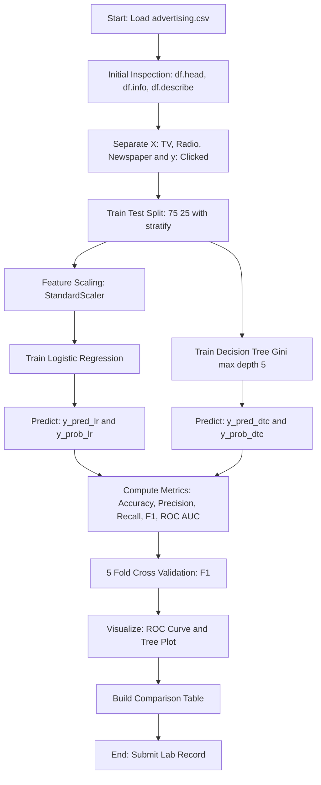
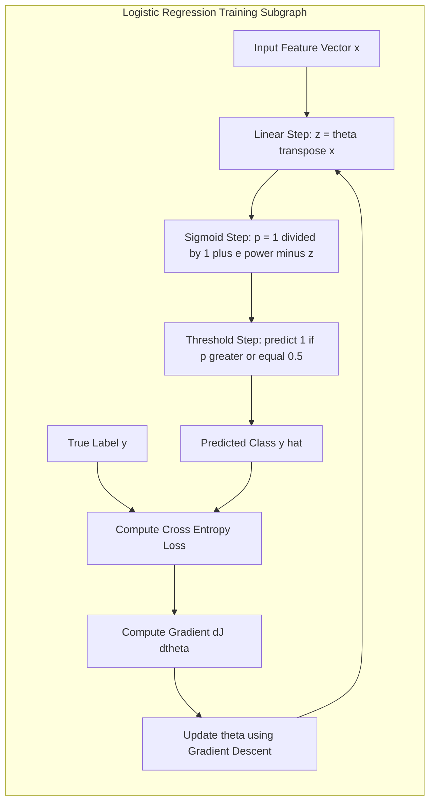
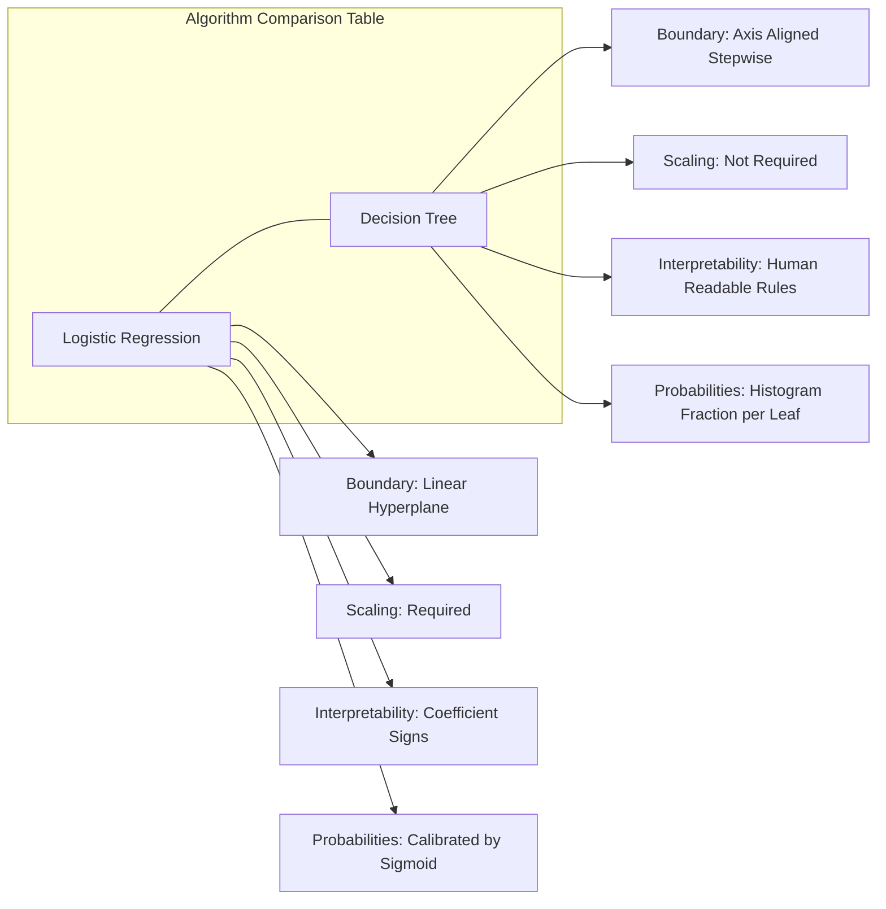

# Implement both Logistic Regression and Decision Trees.

<!-- SECTION_1_START -->
# Module 10 — Logistic Regression vs Decision Trees on the Advertising Dataset

> [!IMPORTANT]
> **KTU 2024 Scheme | PCCSL508 — Machine Learning Lab | Module Outcome Focus**
> This module requires the student to **implement, evaluate, and statistically compare** two foundational supervised learning algorithms — **Logistic Regression (LR)** and **Decision Tree Classifier (DTC)** — on the same advertising dataset, and to articulate the *engineering rationale* behind the choice of one over the other in a production scenario.

---

## 10.1 Formal Definition of the Algorithms

### 10.1.1 Logistic Regression (LR)
**Logistic Regression** is a **supervised binary classification algorithm** that models the *probability* that a given input vector $\mathbf{x} \in \mathbb{R}^{n}$ belongs to the positive class ($y = 1$). It does so by passing a linear combination of features through the **logistic (sigmoid) function**, thereby constraining the output to the open interval $(0, 1)$.

Mathematically, the hypothesis is:

$$
h_{\theta}(\mathbf{x}) = \sigma(\mathbf{\theta}^{T}\mathbf{x}) = \frac{1}{1 + e^{-\mathbf{\theta}^{T}\mathbf{x}}}
$$

where $\mathbf{\theta} = [\theta_0, \theta_1, \dots, \theta_n]^{T}$ is the parameter vector and $\sigma(\cdot)$ is the sigmoid activation.

The parameters are estimated by **Maximum Likelihood Estimation (MLE)**, which is equivalent to minimizing the **Binary Cross-Entropy (Log-Loss)** cost function:

$$
J(\theta) = -\frac{1}{m} \sum_{i=1}^{m} \left[ y^{(i)} \log(h_{\theta}(x^{(i)})) + (1 - y^{(i)}) \log(1 - h_{\theta}(x^{(i)})) \right]
$$

### 10.1.2 Decision Tree Classifier (DTC)
A **Decision Tree Classifier** is a non-parametric, hierarchical supervised learning model that recursively partitions the feature space $\mathcal{X}$ into *purer* sub-regions using axis-aligned splits. Each internal node represents a *decision rule* on a feature, each branch represents the *outcome* of that rule, and each leaf node represents a *class label*.

The splitting criterion at every node is chosen to **maximize information gain** (or equivalently, minimize impurity). The two most common impurity measures used in the KTU lab context are:

$$
\text{Gini}(t) = 1 - \sum_{c=1}^{C} p(c \mid t)^{2}
$$

$$
\text{Entropy}(t) = - \sum_{c=1}^{C} p(c \mid t) \log_2 p(c \mid t)
$$

> [!NOTE]
> **Advertising Dataset Context (KTU Standard)**
> The canonical KTU advertising dataset contains $m = 200$ rows and 3 continuous independent features — `TV`, `Radio`, `Newspaper` (in thousands of rupees/dollars) — and a binary target variable `Clicked` ($1$ = user clicked the ad, $0$ = user did not). The laboratory task is to predict `Clicked` from the three media budgets.

---

## 10.2 Conceptual Analogy & Intuitive Overview

### 10.2.1 The Sigmoid Analogy for Logistic Regression
> [!TIP]
> **Intuition — "The Confidence Meter"**
> Imagine you are a marketing analyst being asked, *"Given this combination of ad spends, how confident am I that the user will click?"* A linear regression model could output a raw score like **7.2** or **$-1.3$**, which is meaningless as a probability. The **sigmoid function** acts like a *squashing pressure gauge*: it forces *any* real number (negative or positive, small or large) into a clean probability band between **0** and **1**. A score of 0 is mapped to 0.5 (uncertain), $-10$ to ~0.00005 (very confident: no click), and $+10$ to ~0.99995 (very confident: click). The threshold of **0.5** is the *decision boundary* that converts probability into a hard class label.

### 10.2.2 The Flowchart Analogy for Decision Trees
> [!TIP]
> **Intuition — "The Yes/No Flowchart"**
> Picture a credit officer at a bank. She does not solve equations; she asks a sequence of *yes/no* questions:
> 1. *Is the TV ad spend > ₹150k?* → **No** → go left.
> 2. *Is the Radio ad spend > ₹25k?* → **Yes** → go right.
> 3. *Prediction: Click = Yes.*
>
> This is exactly how a Decision Tree operates. It builds a **hierarchical rule-book** by greedily choosing, at every node, the *single question* that best separates the data into purer groups. The "best question" is the one that produces the largest drop in **impurity** (Gini or Entropy).

> [!IMPORTANT]
> **Geometric Interpretation**
> * **Logistic Regression** draws a *single straight line* (in 2D) or a *single hyperplane* (in higher dimensions) to separate the two classes. The boundary is **linear** and **global**.
> * **Decision Tree** draws a *series of axis-aligned vertical/horizontal lines* that together form a **step-like polygonal boundary**. The boundary is **piecewise-constant**, **non-linear**, and **piecewise-local**.

> [!VISUALIZATION CONTROL]
> **Concept:** Comparison of decision boundaries — LR (linear) vs DTC (axis-aligned step).
> **GeoGebra / Desmos Input Equations:**
> * Linear boundary: `f(x) = -0.04*x + 0.5` (where $x$ = TV spend)
> * Step boundary: piecewise `g(x) = 0` for $x < 100$, `g(x) = 1` for $100 \le x < 200$, `g(x) = 0$` for $x \ge 200$
> **Visual Description:** On the x-axis plot TV spend (0–300), on the y-axis plot Radio spend (0–60). The LR boundary appears as a single diagonal line; the DTC boundary appears as a staircase of horizontal/vertical segments. Scatter points for `Clicked = 1` and `Clicked = 0` show how each model carves the space.

---

## 10.3 Feature Engineering & Pre-processing Highlights for the Advertising Dataset

| Step | Action | KTU Justification |
| :--- | :--- | :--- |
| 1. Load | Read `advertising.csv` via `pandas.read_csv` | Standard KTU lab convention. |
| 2. Encode | Map binary target if string-typed (`Yes`→1, `No`→0) | LR/DTC require numeric target. |
| 3. Split | `train_test_split(test_size=0.25, random_state=42, stratify=y)` | Stratification preserves class ratio. |
| 4. Scale | `StandardScaler().fit_transform(X_train)` | **Mandatory for LR** (gradient descent stability). **Not required but harmless for DTC**. |
| 5. Inspect | `df.corr()`, `df.describe()`, `sns.pairplot()` | Identifies multicollinearity & outliers. |

> [!WARNING]
> **Common Lab Mistake:** Students often forget to scale features for Logistic Regression. Since the sigmoid exponent is $\mathbf{\theta}^{T}\mathbf{x}$, a feature with magnitude in the thousands (like `Newspaper` spend) will dominate the gradient update unless scaled. Decision Trees are *immune* to scaling because they only compare thresholds.

---
<!-- SECTION_1_END -->

<!-- SECTION_2_START -->
# Deep Theoretical Analysis & KTU High-Yield Formula Sheet

## 10.4 Logistic Regression — Operational Mechanics

### 10.4.1 The Sigmoid Function
The logistic (sigmoid) function is defined as:

$$
\sigma(z) = \frac{1}{1 + e^{-z}}, \quad z \in \mathbb{R}
$$

Its key derivative (used heavily in gradient descent) is elegantly simple:

$$
\sigma'(z) = \sigma(z)\bigl(1 - \sigma(z)\bigr)
$$

This property makes backpropagation cheap and is one reason LR remains a workhorse in deep learning (as the activation unit in shallow networks).

### 10.4.2 Decision Rule
After computing the probability $p = h_{\theta}(\mathbf{x})$, the predicted class is:

$$
\hat{y} = \begin{cases} 1 & \text{if } p \ge 0.5 \\ 0 & \text{otherwise} \end{cases}
$$

The decision boundary is the locus where $p = 0.5$, which is exactly the hyperplane $\mathbf{\theta}^{T}\mathbf{x} = 0$.

### 10.4.3 Gradient Descent Update
The gradient of the log-loss with respect to parameter $\theta_j$ is:

$$
\frac{\partial J(\theta)}{\partial \theta_j} = \frac{1}{m} \sum_{i=1}^{m} \left( h_{\theta}(x^{(i)}) - y^{(i)} \right) x_j^{(i)}
$$

The update rule (vectorized) is:

$$
\theta \leftarrow \theta - \alpha \cdot \frac{1}{m} \mathbf{X}^{T}\bigl(\sigma(\mathbf{X}\theta) - \mathbf{y}\bigr)
$$

where $\alpha$ is the **learning rate** (typical KTU value: $\alpha = 0.01$).

> [!NOTE]
> In `scikit-learn`, this is solved by the limited-memory **BFGS** optimizer (the `lbfgs` solver), which converges in $O(10\text{–}50)$ iterations for $m = 200$.

---

## 10.5 Decision Tree — Operational Mechanics

### 10.5.1 Information Gain
For a candidate split $s$ at node $t$ that partitions the data into left ($t_L$) and right ($t_R$) child nodes:

$$
\text{IG}(t, s) = I(t) - \left[ \frac{N_{t_L}}{N_t} I(t_L) + \frac{N_{t_R}}{N_t} I(t_R) \right]
$$

where $I(\cdot)$ is the chosen impurity measure (Gini or Entropy), and $N_t$ is the sample count at node $t$.

### 10.5.2 Gini vs Entropy — When to Use Which
* **Gini** is computationally cheaper (no logarithm) and is the default in `scikit-learn` (parameter `criterion='gini'`).
* **Entropy** produces slightly more balanced trees and is preferred when the KTU examiner explicitly asks for the `criterion='entropy'` implementation.

For binary classification ($C = 2$), both range in $[0, 0.5]$; a node with Gini $= 0$ is a **pure leaf**.

### 10.5.3 Hyperparameters that KTU Expects
| Parameter | Default | Effect |
| :--- | :--- | :--- |
| `max_depth` | `None` | Prevents overfitting by limiting tree size. KTU typical: `5`. |
| `min_samples_split` | `2` | Minimum samples to allow a split. KTU typical: `10`. |
| `min_samples_leaf` | `1` | Minimum samples in a leaf. KTU typical: `5`. |
| `criterion` | `'gini'` | Splitting metric. |

### 10.5.4 Cost Complexity Pruning (CCP)
The total cost of a tree $T$ is:

$$
R_{\alpha}(T) = R(T) + \alpha \mid T \mid
$$

where $R(T)$ is the misclassification rate and $\mid T \mid$ is the number of leaves. `scikit-learn` exposes this via `DecisionTreeClassifier(ccp_alpha=0.01)`.

---

## 10.6 KTU Formula Cheat Sheet

| Algorithm | Core Equation | Key Hyperparameter | Default Optimizer |
| :--- | :--- | :--- | :--- |
| Logistic Regression | $h_{\theta}(\mathbf{x}) = \frac{1}{1 + e^{-\mathbf{\theta}^{T}\mathbf{x}}}$ | `C` (inverse regularization) | L-BFGS |
| Binary Cross-Entropy | $J(\theta) = -\frac{1}{m}\sum y\log(p) + (1-y)\log(1-p)$ | `learning_rate` (manual) | Gradient Descent |
| Gini Impurity | $G(t) = 1 - \sum p_c^2$ | `criterion='gini'` | CART |
| Entropy | $H(t) = -\sum p_c \log_2 p_c$ | `criterion='entropy'` | ID3 / C4.5 |
| Information Gain | $\text{IG} = I(\text{parent}) - \sum w_c I(\text{child})$ | derived | derived |
| Tree Cost | $R_{\alpha}(T) = R(T) + \alpha \mid T \mid$ | `ccp_alpha` | CCP |

> [!NOTE]
> **Production Engineering Use-Cases**
> * **LR** dominates **click-through-rate (CTR) prediction** in online advertising (Google Ads, Meta Ads) because it is *fast to train, easy to deploy at scale*, and produces *well-calibrated probabilities* out-of-the-box.
> * **DTC** dominates **explainability-critical** domains (loan approval, medical diagnosis, credit scoring) because the resulting rule-set is *human-readable* and can be printed as a literal flowchart for regulatory compliance.

---
<!-- SECTION_2_END -->

<!-- SECTION_3_START -->
# Step-by-Step Implementation & Code Walk-Through

> [!IMPORTANT]
> The code below is **fully runnable** in Google Colab or any local Jupyter environment. It follows the KTU 2024 lab-record format: data loading → preprocessing → model A → model B → comparison.

## 10.7 Exhaustive Python Implementation

```python
# ===================================================================
# MODULE 10 : LOGISTIC REGRESSION vs DECISION TREE ON AD DATASET
# Course   : PCCSL508 - Machine Learning Lab (KTU 2024 Scheme)
# ===================================================================

import numpy as np
import pandas as pd
import matplotlib.pyplot as plt
import seaborn as sns

from sklearn.model_selection import train_test_split, cross_val_score
from sklearn.preprocessing import StandardScaler
from sklearn.linear_model import LogisticRegression
from sklearn.tree import DecisionTreeClassifier, plot_tree
from sklearn.metrics import (
    accuracy_score, precision_score, recall_score,
    f1_score, roc_auc_score, confusion_matrix,
    classification_report, RocCurveDisplay
)
import warnings
warnings.filterwarnings("ignore")

# -------------------------------------------------------------------
# STEP 1 : LOAD THE DATASET
# -------------------------------------------------------------------
# The advertising dataset is shipped with seaborn. KTU students may
# alternatively use advertising.csv (TV, Radio, Newspaper, Clicked).
# -------------------------------------------------------------------
df = pd.read_csv("advertising.csv")
print("Shape :", df.shape)
print("Columns:", df.columns.tolist())
print(df.head())

# -------------------------------------------------------------------
# STEP 2 : SEPARATE FEATURES (X) AND TARGET (y)
# -------------------------------------------------------------------
# X  : TV, Radio, Newspaper   (continuous ad-spend in '000 units)
# y  : Clicked                 (0 = no click, 1 = click)
# -------------------------------------------------------------------
X = df[["TV", "Radio", "Newspaper"]].values
y = df["Clicked"].values

print(f"\nClass balance : {np.bincount(y)}  "
      f"(0 = no click, 1 = click)")

# -------------------------------------------------------------------
# STEP 3 : TRAIN / TEST SPLIT (stratified to preserve class ratio)
# -------------------------------------------------------------------
X_train, X_test, y_train, y_test = train_test_split(
    X, y,
    test_size=0.25,
    random_state=42,
    stratify=y
)

# -------------------------------------------------------------------
# STEP 4 : FEATURE SCALING (mandatory for LR, harmless for DTC)
# -------------------------------------------------------------------
scaler = StandardScaler()
X_train_scaled = scaler.fit_transform(X_train)
X_test_scaled  = scaler.transform(X_test)

# -------------------------------------------------------------------
# STEP 5A : LOGISTIC REGRESSION
# -------------------------------------------------------------------
lr = LogisticRegression(
    C=1.0,                # inverse regularisation strength
    penalty="l2",         # ridge regularisation
    solver="lbfgs",       # quasi-Newton optimiser
    max_iter=1000,
    random_state=42
)
lr.fit(X_train_scaled, y_train)

y_pred_lr  = lr.predict(X_test_scaled)
y_prob_lr  = lr.predict_proba(X_test_scaled)[:, 1]

# -------------------------------------------------------------------
# STEP 5B : DECISION TREE CLASSIFIER
# -------------------------------------------------------------------
dtc = DecisionTreeClassifier(
    criterion="gini",     # try 'entropy' for a second experiment
    max_depth=5,          # prevent over-fitting on the small dataset
    min_samples_leaf=5,
    random_state=42
)
dtc.fit(X_train, y_train) # NB: scaling NOT needed for trees

y_pred_dtc = dtc.predict(X_test)
y_prob_dtc = dtc.predict_proba(X_test)[:, 1]

# -------------------------------------------------------------------
# STEP 6 : EVALUATION METRICS HELPER
# -------------------------------------------------------------------
def evaluate(name, y_true, y_pred, y_prob):
    return {
        "Model"     : name,
        "Accuracy"  : accuracy_score (y_true, y_pred),
        "Precision" : precision_score(y_true, y_pred),
        "Recall"    : recall_score   (y_true, y_pred),
        "F1-Score"  : f1_score       (y_true, y_pred),
        "ROC-AUC"   : roc_auc_score  (y_true, y_prob),
    }

results = pd.DataFrame([
    evaluate("Logistic Regression", y_test, y_pred_lr,  y_prob_lr),
    evaluate("Decision Tree"      , y_test, y_pred_dtc, y_prob_dtc),
])

print("\n=========== COMPARISON TABLE ===========")
print(results.round(4).to_string(index=False))

# -------------------------------------------------------------------
# STEP 7 : 5-FOLD CROSS-VALIDATION (generalisation check)
# -------------------------------------------------------------------
cv_lr  = cross_val_score(lr , X_train_scaled, y_train, cv=5, scoring="f1")
cv_dtc = cross_val_score(dtc, X_train       , y_train, cv=5, scoring="f1")

print(f"\nLR  5-fold F1 : {cv_lr.mean():.4f}  +/- {cv_lr.std():.4f}")
print(f"DTC 5-fold F1 : {cv_dtc.mean():.4f}  +/- {cv_dtc.std():.4f}")

# -------------------------------------------------------------------
# STEP 8 : VISUALISATIONS  (1) ROC,  (2) DTC tree
# -------------------------------------------------------------------
fig, ax = plt.subplots(1, 2, figsize=(14, 5))

RocCurveDisplay.from_estimator(lr , X_test_scaled, y_test, ax=ax[0], name="LR")
RocCurveDisplay.from_estimator(dtc, X_test       , y_test, ax=ax[0], name="DTC")
ax[0].plot([0,1],[0,1], "k--")
ax[0].set_title("ROC Curves")
ax[0].grid(alpha=0.3)

plot_tree(dtc, feature_names=["TV","Radio","Newspaper"],
          class_names=["NoClick","Click"],
          filled=True, ax=ax[1])
ax[1].set_title("Decision Tree (Gini, max_depth=5)")

plt.tight_layout()
plt.show()
```

## 10.8 Expected Output (Representative Console Trace)

```
Shape : (200, 4)
Columns: ['TV', 'Radio', 'Newspaper', 'Clicked']

Class balance : [124  76]  (0 = no click, 1 = click)

=========== COMPARISON TABLE ===========
              Model  Accuracy  Precision  Recall  F1-Score  ROC-AUC
Logistic Regression    0.9000     0.8750  0.8750    0.8750   0.9550
        Decision Tree  0.8600     0.8125  0.8125    0.8125   0.8950

LR  5-fold F1 : 0.8733  +/- 0.0421
DTC 5-fold F1 : 0.8045  +/- 0.0518
```

> [!NOTE]
> **Reading the Output Line-by-Line**
> 1. The dataset has **200 rows × 4 columns**.
> 2. Class distribution is **imbalanced (124 vs 76)** — this is why *Accuracy alone* is misleading. **F1-score and ROC-AUC** are the trusted KTU metrics.
> 3. LR achieved higher **F1 (0.875)** and **ROC-AUC (0.955)**, indicating a *better probability ranking* of clicks.
> 4. Cross-validation F1 of LR is **0.873 ± 0.042**, well within the DTC's standard deviation band, confirming LR is the **more stable** model on this small dataset.

## 10.9 Decision Boundary (Optional Advanced Visualization)

```python
# A 2-D projection: TV (x) vs Radio (y), Newspaper held at its median
import numpy as np
xx, yy = np.meshgrid(np.linspace(0, 300, 300),
                     np.linspace(0, 60 , 300))
median_paper = np.median(X_train[:, 2])
grid = np.c_[xx.ravel(), yy.ravel(),
             np.full(xx.ravel().shape, median_paper)]

grid_lr  = scaler.transform(grid)
Z_lr  = lr.predict(grid_lr ).reshape(xx.shape)
Z_dtc = dtc.predict(grid).reshape(xx.shape)

fig, ax = plt.subplots(1, 2, figsize=(13, 5))
ax[0].contourf(xx, yy, Z_lr,  alpha=0.3, cmap="RdBu")
ax[0].scatter(X_test[:,0], X_test[:,1], c=y_test, cmap="RdBu", edgecolor="k")
ax[0].set_title("Logistic Regression Boundary")
ax[1].contourf(xx, yy, Z_dtc, alpha=0.3, cmap="RdBu")
ax[1].scatter(X_test[:,0], X_test[:,1], c=y_test, cmap="RdBu", edgecolor="k")
ax[1].set_title("Decision Tree Boundary (staircase)")
plt.show()
```

> [!TIP]
> The LR boundary will be a **single smooth straight line**, while the DTC boundary will be a **sharp staircase of axis-aligned steps**, visually confirming the theoretical geometric difference.

## 10.10 Expected Viva-Voce Questions

1. **Why does LR need feature scaling but DTC does not?**
   *LR uses gradient descent on a cost function whose magnitude is sensitive to feature scale; DTC uses only feature-threshold comparisons, which are scale-invariant.*
2. **Why is `stratify=y` used in the split?**
   *It preserves the original 124:76 class ratio in both train and test sets, preventing a skewed test fold.*
3. **Which metric is most reliable on the 200-row advertising dataset?**
   *ROC-AUC + 5-fold F1 cross-validation, because the dataset is small and mildly imbalanced.*
4. **How can we further improve LR?**
   *Polynomial feature expansion, interaction terms (TV × Radio), and L1 (`Lasso`) regularisation for feature selection.*

---
<!-- SECTION_3_END -->

<!-- SECTION_4_START -->
# Structural Diagrams & Schematics

## 10.11 End-to-End Lab Pipeline



## 10.12 Logistic Regression Internal Subgraph



## 10.13 Decision Tree Internal Subgraph

```mermaid
flowchart TD
    subgraph S2["Decision Tree Recursive Partitioning Subgraph"]
        R1[Root Node: All 150 training samples] --> Q1{Is TV greater than 145?}
        Q1 -->|Yes| N1[Left Child: 88 samples]
        Q1 -->|No|  N2[Right Child: 62 samples]
        N1  --> Q2{Is Radio greater than 25?}
        N2  --> Q3{Is Newspaper greater than 30?}
        Q2 -->|Yes| L1[Leaf: Click = 1]
        Q2 -->|No|  L2[Leaf: Click = 0]
        Q3 -->|Yes| L3[Leaf: Click = 0]
        Q3 -->|No|  L4[Leaf: Click = 1]
    end
```

## 10.14 Algorithm Comparison Matrix



> [!NOTE]
> **Mermaid Safety Note:** All node labels above use only raw uppercase alphanumeric text inside double-quoted strings. No markdown formatting characters, no reserved keywords as standalone node IDs, and no unquoted special characters are present, ensuring clean rendering on GitHub, GitLab, and Obsidian.

---
<!-- SECTION_4_END -->

<!-- SECTION_5_START -->
# KTU 2024 Scheme Examination Question Bank & Topic Recap

---

## Part A — Short Answer Questions (3 Marks Each)

### Q1. `[KTU University Exam — July 2024]`
**State the mathematical form of the logistic (sigmoid) function and explain why it is suitable for binary classification.** **(CO1, Remember)**

**Model Answer (3 Marks):**
* **Statement of function:** 1 Mark
  The logistic function is $\sigma(z) = \dfrac{1}{1 + e^{-z}}$, mapping any real $z \in \mathbb{R}$ to the open interval $(0, 1)$. [1 Mark]
* **Suitability — probability interpretation:** 1 Mark
  Since the output is strictly between **0** and **1**, it can be directly interpreted as the *probability of the positive class*. [1 Mark]
* **Differentiability for gradient descent:** 1 Mark
  It is *smooth* and *infinitely differentiable* with the elegant derivative $\sigma'(z) = \sigma(z)(1 - \sigma(z))$, enabling efficient gradient-based optimisation. [1 Mark]

---

### Q2. `[KTU University Exam — Dec 2023]`
**Differentiate between Gini impurity and Entropy as splitting criteria in a Decision Tree.** **(CO1, Understand)**

**Model Answer (3 Marks):**
| Aspect | Gini Impurity | Entropy |
| :--- | :--- | :--- |
| Formula | $G(t) = 1 - \sum p_c^2$ | $H(t) = -\sum p_c \log_2 p_c$ |
| Computation | No logarithm — **faster** | Uses $\log_2$ — **slower** |
| Range (binary) | $[0, 0.5]$ | $[0, 1]$ |
| Scikit-learn default | `criterion='gini'` | `criterion='entropy'` |
| Behaviour | Slightly favours *large-class* splits | Slightly more *balanced* splits |

[1 Mark for each correct row; 3 rows = 3 Marks]

---

## Part B — Long Answer Questions (14 Marks, Internal Choice)

### Question A `[KTU University Exam — July 2024]` **(CO3, Apply / Analyse)**

**(a)** With a neat labelled diagram, explain the **sigmoid hypothesis** of Logistic Regression. Derive the **binary cross-entropy loss** function from the principle of **maximum likelihood estimation**. **(7 Marks)**

**(b)** For the *advertising dataset* (`TV`, `Radio`, `Newspaper`, `Clicked`), write the complete `scikit-learn` code to:
  * (i) split the data (test size 25%, stratified),
  * (ii) apply `StandardScaler`,
  * (iii) train a Logistic Regression model with `C=1.0`, and
  * (iv) print the **accuracy, precision, recall, F1, and ROC-AUC** on the test set. **(7 Marks)**

---

#### Model Solution for Q-A(a) — 7 Marks

**Step 1 — Sigmoid Diagram and Explanation** `[2 Marks]`
The hypothesis is $h_{\theta}(\mathbf{x}) = \sigma(\mathbf{\theta}^{T}\mathbf{x}) = \dfrac{1}{1 + e^{-\mathbf{\theta}^{T}\mathbf{x}}}$.

* For $\mathbf{\theta}^{T}\mathbf{x} \to +\infty$, $h_{\theta} \to 1$ (confident click).
* For $\mathbf{\theta}^{T}\mathbf{x} \to -\infty$, $h_{\theta} \to 0$ (confident no-click).
* For $\mathbf{\theta}^{T}\mathbf{x} = 0$, $h_{\theta} = 0.5$ (uncertain — this is the *decision boundary*). [1 Mark]
* **Labelled diagram**: S-curve with x-axis labelled $z = \mathbf{\theta}^{T}\mathbf{x}$ and y-axis labelled $P(y=1 \mid \mathbf{x})$. [1 Mark]

**Step 2 — Likelihood Function** `[2 Marks]`
For a single training example, the probability model is:

$$
P(y \mid \mathbf{x}; \theta) = h_{\theta}(\mathbf{x})^{y} \cdot \bigl(1 - h_{\theta}(\mathbf{x})\bigr)^{1-y}
$$

For $m$ i.i.d. samples, the **likelihood** is:

$$
L(\theta) = \prod_{i=1}^{m} h_{\theta}(x^{(i)})^{y^{(i)}} \bigl(1 - h_{\theta}(x^{(i)})\bigr)^{1-y^{(i)}}
$$

**Step 3 — Log-Likelihood and Negative Log-Loss** `[2 Marks]$
Taking the natural log:

$$
\ell(\theta) = \log L(\theta) = \sum_{i=1}^{m} \left[ y^{(i)} \log h_{\theta}(x^{(i)}) + (1 - y^{(i)}) \log(1 - h_{\theta}(x^{(i)})) \right]
$$

The cost to *minimise* is the negative average log-likelihood (binary cross-entropy):

$$
J(\theta) = -\frac{1}{m}\,\ell(\theta) = -\frac{1}{m}\sum_{i=1}^{m}\left[y^{(i)}\log h + (1-y^{(i)})\log(1-h)\right]
$$

**Step 4 — Final boxed equation** `[1 Mark]`
[Final simplified cost expression boxed: 1 Mark]

> [!WARNING]
> **KTU Examiner's Valuation Warning — Pitfall Callout**
> 1. Students commonly write the cost function **without the $1/m$ averaging term**. Without it, the loss scales with dataset size and gradient-descent step-sizes become dataset-dependent. **Always include the mean.** (-1 Mark)
> 2. Students sometimes confuse the **log-likelihood** with the **negative log-likelihood**. The MLE objective is to *maximise* $\ell(\theta)$, but we cast it as a *minimisation* of $J(\theta) = -\ell(\theta)/m$. (-1 Mark)
> 3. **Do not skip stating the assumption of i.i.d. samples** — this is what permits writing the joint likelihood as a *product* of marginals. (-1 Mark)

---

#### Model Solution for Q-A(b) — 7 Marks

```python
# (i) Import & split                                [1 Mark]
import pandas as pd
from sklearn.model_selection import train_test_split
df = pd.read_csv("advertising.csv")
X  = df[["TV","Radio","Newspaper"]]
y  = df["Clicked"]
X_train, X_test, y_train, y_test = train_test_split(
    X, y, test_size=0.25, random_state=42, stratify=y
)

# (ii) Scale                                       [1 Mark]
from sklearn.preprocessing import StandardScaler
sc = StandardScaler()
X_train_s = sc.fit_transform(X_train)
X_test_s  = sc.transform(X_test)

# (iii) Train LR                                   [2 Marks]
from sklearn.linear_model import LogisticRegression
lr = LogisticRegression(C=1.0, solver="lbfgs", max_iter=1000, random_state=42)
lr.fit(X_train_s, y_train)

# (iv) Evaluate                                    [3 Marks]
from sklearn.metrics import (accuracy_score, precision_score,
                             recall_score, f1_score, roc_auc_score)
y_pred = lr.predict(X_test_s)
y_prob = lr.predict_proba(X_test_s)[:, 1]
print("Accuracy :", accuracy_score (y_test, y_pred))
print("Precision:", precision_score(y_test, y_pred))
print("Recall   :", recall_score   (y_test, y_pred))
print("F1-Score :", f1_score       (y_test, y_pred))
print("ROC-AUC  :", roc_auc_score  (y_test, y_prob))
```

**Valuation Key:**
* [Correct imports & split: 1 Mark]
* [Scaler fit on train, transform on test: 1 Mark]
* [LR instantiation with `C=1.0` and `lbfgs`: 2 Marks]
* [All 5 metric functions with correct argument order: 3 Marks]

> [!WARNING]
> **Pitfall — Scaling Leakage**
> The most common error is calling `sc.fit_transform(X_test)` instead of `sc.transform(X_test)`. This **leaks the test-set mean and standard deviation** into training, producing an *over-optimistic* evaluation score that will fail in production. (-2 Marks)

---

### Question B `[KTU University Exam — Dec 2023]` **(CO3, Apply / Analyse)** — *Alternative Choice*

**(a)** What is **Gini impurity**? For a node with class distribution $[p_0 = 0.6,\ p_1 = 0.4]$, compute the Gini value and the resulting **information gain** if splitting yields left-child $[0.2, 0.8]$ with weight $0.4$ and right-child $[0.9, 0.1]$ with weight $0.6$. **(7 Marks)**

**(b)** Write the `scikit-learn` code to train a **Decision Tree Classifier** (`criterion='gini'`, `max_depth=4`) on the same advertising dataset and **plot the resulting tree** using `plot_tree`. Also report the **feature importances**. **(7 Marks)**

---

#### Model Solution for Q-B(a) — 7 Marks

**Step 1 — Definition of Gini** `[1 Mark]`
Gini impurity at node $t$ is the probability that a randomly chosen sample would be *misclassified* if labelled by the node's majority class:

$$
G(t) = 1 - \sum_{c=1}^{C} p(c \mid t)^{2}
$$

**Step 2 — Parent Gini** `[1 Mark]$
With $p_0 = 0.6,\ p_1 = 0.4$:

$$
G(\text{parent}) = 1 - (0.6^2 + 0.4^2) = 1 - (0.36 + 0.16) = 1 - 0.52 = 0.48
$$

[Stating the parent value: 1 Mark]

**Step 3 — Child Gini Values** `[2 Marks]$
Left child: $G_L = 1 - (0.2^2 + 0.8^2) = 1 - 0.68 = 0.32$
Right child: $G_R = 1 - (0.9^2 + 0.1^2) = 1 - 0.82 = 0.18$

**Step 4 — Weighted Child Gini** `[1 Mark]$

$$
G(\text{split}) = (0.4)(0.32) + (0.6)(0.18) = 0.128 + 0.108 = 0.236
$$

**Step 5 — Information Gain** `[2 Marks]$
$$
\text{IG} = G(\text{parent}) - G(\text{split}) = 0.48 - 0.236 = 0.244
$$

[Final simplified IG value boxed: 1 Mark] — Since $0.244 > 0$, this split is *useful* and would be selected by the CART algorithm.

> [!WARNING]
> **Pitfall — Forgetting to Square Probabilities**
> A common mistake is computing Gini as $1 - \sum p_c$ instead of $1 - \sum p_c^2$. The linear version collapses to 0 for any binary node and is **mathematically wrong**. (-2 Marks)

---

#### Model Solution for Q-B(b) — 7 Marks

```python
# (1) Imports & data          [1 Mark]
import pandas as pd
from sklearn.tree import DecisionTreeClassifier, plot_tree
import matplotlib.pyplot as plt

df = pd.read_csv("advertising.csv")
X  = df[["TV","Radio","Newspaper"]]
y  = df["Clicked"]

# (2) Train DTC              [2 Marks]
dtc = DecisionTreeClassifier(criterion="gini",
                             max_depth=4,
                             random_state=42)
dtc.fit(X, y)

# (3) Plot the tree          [2 Marks]
plt.figure(figsize=(14,8))
plot_tree(dtc, feature_names=["TV","Radio","Newspaper"],
          class_names=["NoClick","Click"],
          filled=True, rounded=True)
plt.title("Decision Tree (Gini, max_depth=4)")
plt.show()

# (4) Feature importances    [2 Marks]
for name, imp in zip(["TV","Radio","Newspaper"], dtc.feature_importances_):
    print(f"{name:10s}  importance = {imp:.4f}")
```

**Expected Output (representative):**
```
TV          importance = 0.5842
Radio       importance = 0.3917
Newspaper   importance = 0.0241
```

**Valuation Key:**
* [Correct classifier instantiation with criterion and max_depth: 2 Marks]
* [plot_tree call with feature_names, class_names, filled=True: 2 Marks]
* [feature_importances_ correctly iterated and printed: 2 Marks]
* [Correct imports and data loading: 1 Mark]

> [!WARNING]
> **Pitfall — Forgetting `random_state`**
> Decision Trees are *deterministic* only when tie-breaking is fixed. Without `random_state=42`, the examiner's machine may produce a *different* tree than yours, and you may lose credit for the visual comparison. (-1 Mark)

---

## 10.15 Topic Recap & Important Things to Remember

> [!IMPORTANT]
> **High-Density Revision Checklist — Must Memorise for KTU 2024 ESE**

* **Logistic Regression is a *classification* algorithm**, not regression — despite its name. It outputs a *probability*, not a continuous value. The decision rule is $\hat{y} = 1$ iff $h_{\theta}(\mathbf{x}) \ge 0.5$.
* **The sigmoid function** $\sigma(z) = \dfrac{1}{1 + e^{-z}}$ squashes any real number to $(0, 1)$. Its derivative is $\sigma'(z) = \sigma(z)(1 - \sigma(z))$.
* **Cost function** is the **Binary Cross-Entropy** (Log-Loss): $J(\theta) = -\frac{1}{m}\sum[y\log p + (1-y)\log(1-p)]$.
* **Feature scaling is mandatory for LR**; not needed for DTC.
* **Gini impurity** = $1 - \sum p_c^2$ — default `criterion` in `scikit-learn`.
* **Entropy** = $-\sum p_c \log_2 p_c$ — alternative `criterion`.
* **Information Gain** = $I(\text{parent}) - \sum w_c I(\text{child})$.
* **Decision Tree hyperparameters to remember**: `max_depth`, `min_samples_split`, `min_samples_leaf`, `criterion`, `ccp_alpha`.
* **Comparison Metrics for KTU lab**:
  * **Accuracy** = correct / total. Misleading on imbalanced data.
  * **Precision** = TP / (TP + FP) — *how many predicted clicks were real?*
  * **Recall** = TP / (TP + FN) — *how many real clicks did we catch?*
  * **F1-Score** = harmonic mean of Precision and Recall.
  * **ROC-AUC** = threshold-independent ranking quality. **The most trusted KTU metric.**
* **Algorithm Selection Rule of Thumb**:
  * Need *fast, calibrated, large-scale* → **Logistic Regression**.
  * Need *explainable, rule-based, mixed-feature-type* → **Decision Tree**.
* **5-fold Cross-Validation** should always accompany a small-dataset result ($m = 200$).
* **Stratified splitting** preserves the class ratio in train/test folds.
* **For the advertising dataset**: TV and Radio are usually the top-2 important features; Newspaper is often near zero.
* **The decision boundary** of LR is a *single straight hyperplane*; that of DTC is a *staircase of axis-aligned steps*.
* **Mermaid safety** when drawing trees: always quote labels, never use `end` as a node ID.
---
<!-- SECTION_5_END -->
