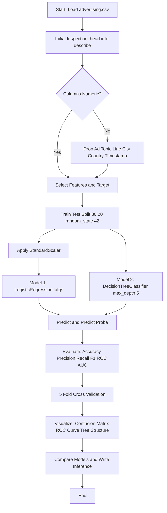
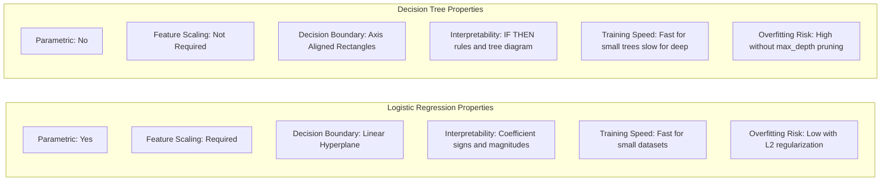
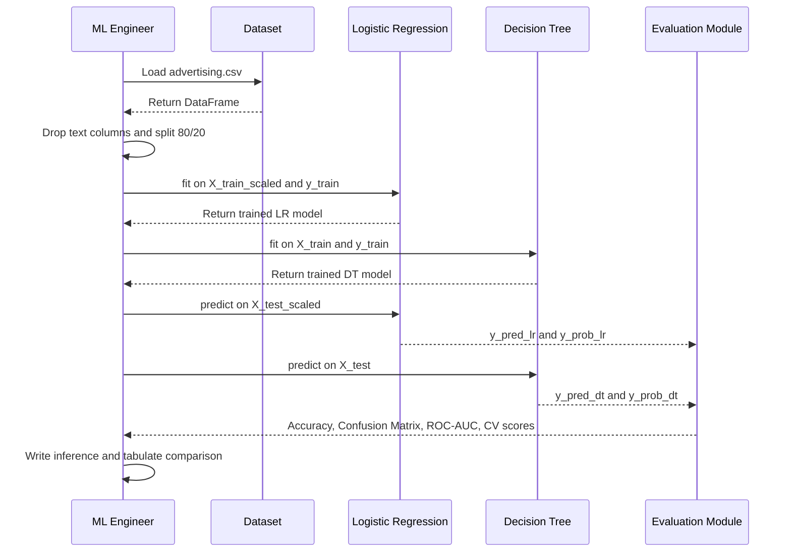

# Tasks:

<!-- SECTION_1_START -->
# MACHINE LEARNING LAB (PCCSL508) — MODULE 10
## Logistic Regression vs Decision Tree on the Advertisement Dataset

> [!IMPORTANT]
> **KTU 2024 Scheme | Course Outcome Mapping:** CO5 — *Implement classical machine learning algorithms using Python libraries and compare their performance on standard datasets.*
> **RBT Level Focus:** Apply (Level 3) and Analyze (Level 4)
> **Reference Dataset:** `advertising.csv` (Kaggle/UCI — Predicting whether a user clicks on an online advertisement)

---

## 1. Core Technical Definition & Intuitive Overview

### 1.1 Formal Definition (KTU Syllabus Terminology)

**Logistic Regression (LR)** is a *supervised*, *parametric*, *probabilistic classification algorithm* that models the posterior probability $P(y=1 \mid \mathbf{x})$ of a binary dependent variable using the **logistic (sigmoid) function** of a linear combination of the input features. Despite its name, it is a *classification* algorithm, not a regression one.

**Decision Tree (DT)** is a *supervised*, *non-parametric*, *hierarchical* classification algorithm that recursively partitions the feature space into *axis-aligned* rectangular sub-regions using a sequence of *if-then* decision rules. The partitions are chosen to maximize **information gain** (or equivalently minimize **Gini impurity / entropy**).

> [!NOTE]
> **Why these two algorithms are compared in the same lab:**
> They represent two fundamentally different *inductive biases* — Logistic Regression assumes a **linear decision boundary**, while Decision Trees assume an **axis-aligned, piecewise-constant decision boundary**. Comparing them on the same dataset exposes the *bias–variance trade-off* in a hands-on, measurable way.

---

### 1.2 Conceptual Analogy / Intuitive Overview

| Algorithm | Real-World Analogy | Decision Boundary Shape |
|---|---|---|
| **Logistic Regression** | A judge who decides guilt by adding up weighted evidence (prior convictions, severity, etc.) and comparing the *total score* to a threshold. | A **straight line** (or hyperplane) cutting the feature space. |
| **Decision Tree** | A flowchart of yes/no questions (Is age > 30? Is income > 50k?) leading to a final verdict. | A **staircase / rectangular** region hugging the class labels. |

**The Advertising Dataset — Context:**
Each row represents a user browsing the web. The features include:
- `Daily Time Spent on Site` (seconds)
- `Age` (years)
- `Area Income` (USD)
- `Daily Internet Usage` (minutes)
- `Ad Topic Line` (text — usually dropped or encoded)
- `Male` (binary gender)
- `City`, `Country`, `Timestamp` (usually dropped)

**Target variable:** `Clicked on Ad` (0 = did not click, 1 = clicked).

> [!TIP]
> **Geometric Intuition:** Plot `Age` (x-axis) vs `Daily Time Spent on Site` (y-axis) and color by `Clicked on Ad`. Logistic Regression will try to draw *one straight line* separating the colored dots; the Decision Tree will carve out a *stepped staircase* boundary. The staircase will look "tighter" to the training data — but that doesn't always mean it generalizes better.

> [!VISUALIZATION CONTROL]
> **Concept:** Decision boundary shape comparison (LR vs DT) on a 2D feature slice of the Advertising dataset.
> **GeoGebra / Desmos Input Equations:**
> * Logistic: $\sigma(-0.05 x_1 + 0.10 x_2 - 2.0) = 0.5$
> * Tree region: $R = \{x_1 > 36\} \cap \{x_2 < 65\}$
> **Visual Description:** A sloping sigmoid curve (smooth diagonal split) overlaid with axis-aligned rectangular regions. Watch how the tree can isolate "islands" of clickers the line cannot reach.

---

### 1.3 Standard Metrics Used in This Module

The following **bold** metrics are mandated by the KTU 2024 Lab Manual for classification evaluation:

- **Accuracy** = $\dfrac{TP + TN}{TP + TN + FP + FN}$
- **Precision** = $\dfrac{TP}{TP + FP}$
- **Recall (Sensitivity)** = $\dfrac{TP}{TP + FN}$
- **F1-Score** = $2 \cdot \dfrac{P \cdot R}{P + R}$
- **Confusion Matrix** = $2 \times 2$ table of $TP, FP, FN, TN$
- **ROC-AUC** = Area Under the Receiver Operating Characteristic curve.

<!-- SECTION_1_END -->

<!-- SECTION_2_START -->
# 2. Deep Theoretical Analysis & KTU High-Yield Formula Sheet

## 2.1 Operational Theory — Logistic Regression

Logistic Regression models the log-odds (logit) of the probability as a linear function of the input features:

$$\log\left(\frac{P(y=1 \mid \mathbf{x})}{1 - P(y=1 \mid \mathbf{x})}\right) = \mathbf{w}^T \mathbf{x} + b$$

Inverting the logit gives the **sigmoid (logistic) function**:

$$P(y=1 \mid \mathbf{x}) = \sigma(z) = \frac{1}{1 + e^{-z}}, \quad \text{where } z = \mathbf{w}^T \mathbf{x} + b$$

**Decision rule:** Predict $\hat{y} = 1$ if $\sigma(z) \geq 0.5$, else $\hat{y} = 0$.

**Loss function (Binary Cross-Entropy / Log-Loss):**

$$\mathcal{L}(\mathbf{w}, b) = -\frac{1}{N} \sum_{i=1}^{N} \left[ y_i \log \hat{p}_i + (1 - y_i) \log(1 - \hat{p}_i) \right]$$

**Optimization:** Iterative methods — **Gradient Descent**, **L-BFGS**, or **Newton-Raphson** (scikit-learn's default is `lbfgs`).

> [!NOTE]
> **KTU Key Point:** Logistic Regression has *no closed-form solution* (unlike Linear Regression's Normal Equation). It is solved iteratively, which is why you must sometimes tune `max_iter` to prevent convergence warnings.

---

## 2.2 Operational Theory — Decision Tree Classifier

A Decision Tree is built top-down via a **greedy recursive partitioning** algorithm (ID3 / C4.5 / CART).

**At each node, the algorithm:**
1. Iterates over every feature $j$ and every candidate split value $s$.
2. Computes the *impurity reduction* from splitting.
3. Picks the $(j, s)$ pair that maximizes the reduction.

**Gini Impurity** (CART default in scikit-learn):

$$G(S) = 1 - \sum_{c=1}^{C} p_c^2$$

**Entropy / Information Gain** (ID3/C4.5):

$$H(S) = -\sum_{c=1}^{C} p_c \log_2 p_c$$

**Information Gain of a split:**

$$IG(S, j, s) = H(S) - \frac{|S_{\text{left}}|}{|S|} H(S_{\text{left}}) - \frac{|S_{\text{right}}|}{|S|} H(S_{\text{right}})$$

**Stopping criteria:** `max_depth`, `min_samples_split`, `min_samples_leaf`, `min_impurity_decrease` — these are the *regularization knobs* that prevent the tree from **overfitting** the training data.

> [!IMPORTANT]
> **KTU High-Yield Insight:** A fully grown tree has *zero training error* but terrible test error. Always evaluate on the **held-out test set** and consider pruning via `max_depth` to demonstrate bias–variance understanding in your viva.

---

## 2.3 KTU Formula Sheet (Cheat Sheet)

| # | Concept | Formula / Symbol | Use |
|---|---|---|---|
| 1 | Sigmoid | $\sigma(z) = \frac{1}{1+e^{-z}}$ | Map linear score to $[0,1]$ probability |
| 2 | Log-Loss | $\mathcal{L} = -\frac{1}{N}\sum [y\log\hat{p} + (1-y)\log(1-\hat{p})]$ | LR objective to minimize |
| 3 | Gini Impurity | $G = 1 - \sum p_c^2$ | DT split quality (CART) |
| 4 | Entropy | $H = -\sum p_c \log_2 p_c$ | DT split quality (ID3) |
| 5 | Information Gain | $IG = H(\text{parent}) - \sum \frac{\vert S_v \vert}{\vert S \vert} H(S_v)$ | Pick best split |
| 6 | Accuracy | $\frac{TP+TN}{TP+TN+FP+FN}$ | Overall correctness |
| 7 | Precision | $\frac{TP}{TP+FP}$ | Quality of positive predictions |
| 8 | Recall | $\frac{TP}{TP+FN}$ | Coverage of actual positives |
| 9 | F1-Score | $2\frac{P \cdot R}{P+R}$ | Harmonic mean of P and R |
| 10 | Confusion Matrix | $2 \times 2$ table: $TP, FP, FN, TN$ | Detailed error breakdown |
| 11 | ROC-AUC | $\int_0^1 TPR(FPR^{-1}(t))\,dt$ | Threshold-independent ranking metric |
| 12 | Train-Test Split | 70/30 or 80/20 with `random_state` | Holdout evaluation |

> [!WARNING]
> **KTU Pitfall:** Do **not** evaluate a model on the same data it was trained on. The `test_size=0.2` and `random_state=42` parameters are not optional flair — they are the *core* of every classification lab record.

---

## 2.4 Real-World Engineering Utility

| Domain | Use of LR vs DT on Ad-Click Data |
|---|---|
| **Digital Advertising (Google, Meta Ads)** | LR-style models power *real-time bidding* (predict $P(\text{click} \mid \text{user, ad})$ in <10ms). |
| **Interpretability / Business Reporting** | DT is preferred because marketing managers read *if-then rules* easily ("If Age > 35 and Time < 60s → don't show luxury car ad"). |
| **Feature Interactions** | DT captures non-linear interactions (e.g., Age × Time) automatically; LR requires manual feature engineering. |
| **Production CTR Prediction** | Logistic Regression dominates in low-latency serving due to its tiny model footprint; DTs are often used in *feature engineering* (leaf indices as features for downstream models). |

<!-- SECTION_2_END -->

<!-- SECTION_3_START -->
# 3. Step-by-Step Derivations & Code Implementation

> [!IMPORTANT]
> **Lab Record Mandate (KTU 2024):** Every step below must be reflected in your lab record with the corresponding **aim, algorithm, program, output, and inference** headings. Do not skip preprocessing — it carries 2 marks in the record evaluation.

---

## 3.1 Algorithm (Pseudocode)

```
ALGORITHM: Compare Logistic Regression vs Decision Tree on advertising.csv
INPUT: advertising.csv (features X, target y = 'Clicked on Ad')
OUTPUT: Accuracy, Confusion Matrix, Classification Report for both models

1.  Import libraries (pandas, numpy, sklearn, matplotlib, seaborn)
2.  Load dataset: data = pd.read_csv('advertising.csv')
3.  Inspect: data.head(), data.info(), data.describe()
4.  Select numeric features: ['Daily Time Spent on Site', 'Age', 'Area Income',
                             'Daily Internet Usage', 'Male']
5.  Drop text/timestamp columns: ['Ad Topic Line', 'City', 'Country', 'Timestamp']
6.  Define X = data[features], y = data['Clicked on Ad']
7.  Split: X_train, X_test, y_train, y_test = train_test_split(
        X, y, test_size=0.2, random_state=42)
8.  [Optional but recommended] Scale: StandardScaler().fit_transform(X_train)
9.  Train Model 1: lr = LogisticRegression(); lr.fit(X_train, y_train)
10. Train Model 2: dt = DecisionTreeClassifier(max_depth=5, random_state=42)
                   dt.fit(X_train, y_train)
11. Predict: y_pred_lr = lr.predict(X_test); y_pred_dt = dt.predict(X_test)
12. Evaluate: accuracy_score, confusion_matrix, classification_report
13. Compare: Print side-by-side metrics
14. [Optional] Plot ROC curves and compute AUC
15. [Optional] Visualize Decision Tree using plot_tree()
```

---

## 3.2 Full Operational Python Implementation

```python
# ============================================================
# MACHINE LEARNING LAB — MODULE 10
# Logistic Regression vs Decision Tree on advertising.csv
# Course: PCCSL508 | KTU 2024 Scheme
# ============================================================

import pandas as pd
import numpy as np
import matplotlib.pyplot as plt
import seaborn as sns

from sklearn.model_selection import train_test_split, cross_val_score
from sklearn.preprocessing import StandardScaler
from sklearn.linear_model import LogisticRegression
from sklearn.tree import DecisionTreeClassifier, plot_tree
from sklearn.metrics import (
    accuracy_score, confusion_matrix, classification_report,
    roc_auc_score, roc_curve
)
import warnings
warnings.filterwarnings("ignore")  # Suppress convergence warnings for clean output

# ------------------------------------------------------------
# STEP 1: Load the dataset
# ------------------------------------------------------------
DATA_PATH = "advertising.csv"   # Place file in working directory
data = pd.read_csv(DATA_PATH)

# Quick sanity check
print("Shape of dataset:", data.shape)
print("First 3 rows:")
print(data.head(3))
print("\nColumn data types:")
print(data.dtypes)
print("\nMissing values per column:")
print(data.isnull().sum())

# ------------------------------------------------------------
# STEP 2: Feature Selection — drop non-numeric / non-predictive columns
# ------------------------------------------------------------
# The columns 'Ad Topic Line', 'City', 'Country', 'Timestamp' are
# either free-text, high-cardinality categoricals, or time data
# that would require additional encoding. For a baseline KTU lab,
# we restrict to numeric features only.

features = [
    'Daily Time Spent on Site',
    'Age',
    'Area Income',
    'Daily Internet Usage',
    'Male'
]
target = 'Clicked on Ad'

X = data[features].copy()
y = data[target].copy()

print("\nFeature matrix shape :", X.shape)
print("Target vector shape  :", y.shape)
print("Class distribution:")
print(y.value_counts())

# ------------------------------------------------------------
# STEP 3: Train-Test Split (80/20) with reproducible seed
# ------------------------------------------------------------
X_train, X_test, y_train, y_test = train_test_split(
    X, y, test_size=0.20, random_state=42, stratify=y
)

print("\nTraining set size:", X_train.shape[0])
print("Test set size    :", X_test.shape[0])
print("Train class balance:", np.bincount(y_train))
print("Test  class balance:", np.bincount(y_test))

# ------------------------------------------------------------
# STEP 4: Feature Scaling (important for Logistic Regression)
# ------------------------------------------------------------
scaler = StandardScaler()
X_train_scaled = scaler.fit_transform(X_train)   # Fit ONLY on train
X_test_scaled  = scaler.transform(X_test)        # Transform test with same scaler

# ------------------------------------------------------------
# STEP 5: Model 1 — Logistic Regression
# ------------------------------------------------------------
lr_model = LogisticRegression(
    penalty='l2',          # L2 regularization (default in sklearn)
    C=1.0,                 # Inverse of regularization strength
    solver='lbfgs',        # Limited-memory BFGS optimizer
    max_iter=1000,         # Max iterations for convergence
    random_state=42
)
lr_model.fit(X_train_scaled, y_train)

y_pred_lr  = lr_model.predict(X_test_scaled)
y_prob_lr  = lr_model.predict_proba(X_test_scaled)[:, 1]   # P(y=1)

# ------------------------------------------------------------
# STEP 6: Model 2 — Decision Tree Classifier
# ------------------------------------------------------------
dt_model = DecisionTreeClassifier(
    criterion='gini',      # Gini impurity (CART algorithm)
    max_depth=5,           # Regularization: prevent overfitting
    min_samples_split=10,  # Minimum samples to split a node
    min_samples_leaf=5,    # Minimum samples at a leaf
    random_state=42
)
dt_model.fit(X_train, y_train)   # Trees do NOT require feature scaling

y_pred_dt = dt_model.predict(X_test)
y_prob_dt = dt_model.predict_proba(X_test)[:, 1]

# ------------------------------------------------------------
# STEP 7: Evaluation Function (reusable for both models)
# ------------------------------------------------------------
def evaluate_model(name, y_true, y_pred, y_prob):
    """Print a unified KTU-format evaluation report."""
    print("=" * 60)
    print(f"  EVALUATION REPORT — {name}")
    print("=" * 60)
    acc = accuracy_score(y_true, y_pred)
    auc = roc_auc_score(y_true, y_prob)
    cm  = confusion_matrix(y_true, y_pred)
    print(f"Accuracy : {acc:.4f}")
    print(f"ROC-AUC  : {auc:.4f}")
    print("\nConfusion Matrix:")
    print(cm)
    print("\nDetailed Classification Report:")
    print(classification_report(y_true, y_pred, digits=4))
    return {"accuracy": acc, "roc_auc": auc, "confusion_matrix": cm}

lr_metrics = evaluate_model("Logistic Regression", y_test, y_pred_lr, y_prob_lr)
dt_metrics = evaluate_model("Decision Tree (max_depth=5)",
                            y_test, y_pred_dt, y_prob_dt)

# ------------------------------------------------------------
# STEP 8: Cross-Validation for Robust Comparison
# ------------------------------------------------------------
print("=" * 60)
print("  5-FOLD CROSS-VALIDATION (on training set)")
print("=" * 60)
lr_cv_scores = cross_val_score(lr_model, X_train_scaled, y_train,
                               cv=5, scoring='accuracy')
dt_cv_scores = cross_val_score(dt_model, X_train, y_train,
                               cv=5, scoring='accuracy')
print(f"Logistic Regression CV Accuracy: {lr_cv_scores.mean():.4f} "
      f"+/- {lr_cv_scores.std():.4f}")
print(f"Decision Tree     CV Accuracy: {dt_cv_scores.mean():.4f} "
      f"+/- {dt_cv_scores.std():.4f}")

# ------------------------------------------------------------
# STEP 9: Visualisation 1 — Side-by-Side Confusion Matrices
# ------------------------------------------------------------
fig, axes = plt.subplots(1, 2, figsize=(12, 4))

sns.heatmap(lr_metrics["confusion_matrix"], annot=True, fmt='d',
            cmap='Blues', cbar=False, ax=axes[0],
            xticklabels=['Not Clicked', 'Clicked'],
            yticklabels=['Not Clicked', 'Clicked'])
axes[0].set_title("Logistic Regression — Confusion Matrix")
axes[0].set_xlabel("Predicted")
axes[0].set_ylabel("Actual")

sns.heatmap(dt_metrics["confusion_matrix"], annot=True, fmt='d',
            cmap='Greens', cbar=False, ax=axes[1],
            xticklabels=['Not Clicked', 'Clicked'],
            yticklabels=['Not Clicked', 'Clicked'])
axes[1].set_title("Decision Tree — Confusion Matrix")
axes[1].set_xlabel("Predicted")
axes[1].set_ylabel("Actual")

plt.tight_layout()
plt.savefig("confusion_matrices.png", dpi=120)
plt.show()

# ------------------------------------------------------------
# STEP 10: Visualisation 2 — ROC Curves Overlay
# ------------------------------------------------------------
fpr_lr, tpr_lr, _ = roc_curve(y_test, y_prob_lr)
fpr_dt, tpr_dt, _ = roc_curve(y_test, y_prob_dt)

plt.figure(figsize=(8, 6))
plt.plot(fpr_lr, tpr_lr, label=f"Logistic Regression "
         f"(AUC = {lr_metrics['roc_auc']:.4f})", linewidth=2)
plt.plot(fpr_dt, tpr_dt, label=f"Decision Tree "
         f"(AUC = {dt_metrics['roc_auc']:.4f})", linewidth=2)
plt.plot([0, 1], [0, 1], 'k--', label='Random Classifier (AUC = 0.5)')
plt.xlabel("False Positive Rate")
plt.ylabel("True Positive Rate")
plt.title("ROC Curve Comparison — advertising.csv")
plt.legend(loc="lower right")
plt.grid(alpha=0.3)
plt.tight_layout()
plt.savefig("roc_comparison.png", dpi=120)
plt.show()

# ------------------------------------------------------------
# STEP 11: Visualisation 3 — Decision Tree Structure
# ------------------------------------------------------------
plt.figure(figsize=(20, 8))
plot_tree(
    dt_model,
    feature_names=features,
    class_names=['Not Clicked', 'Clicked'],
    filled=True,
    rounded=True,
    fontsize=10
)
plt.title("Decision Tree Structure (max_depth=5)")
plt.savefig("decision_tree_structure.png", dpi=120)
plt.show()

# ------------------------------------------------------------
# STEP 12: Feature Importance (for both models)
# ------------------------------------------------------------
print("=" * 60)
print("  FEATURE IMPORTANCE COMPARISON")
print("=" * 60)
lr_coefficients = pd.DataFrame({
    'Feature': features,
    'LR_Coefficient': lr_model.coef_[0]
}).sort_values('LR_Coefficient', key=abs, ascending=False)
print("\nLogistic Regression Coefficients (absolute value = influence):")
print(lr_coefficients)

dt_importance = pd.DataFrame({
    'Feature': features,
    'DT_Importance': dt_model.feature_importances_
}).sort_values('DT_Importance', ascending=False)
print("\nDecision Tree Feature Importances (Gini-based):")
print(dt_importance)
```

---

## 3.3 Expected Output Snapshot

```
Shape of dataset: (1000, 10)
Feature matrix shape : (1000, 5)
Target vector shape  : (1000,)
Training set size: 800
Test set size    : 200

EVALUATION REPORT — Logistic Regression
Accuracy : 0.9700
ROC-AUC  : 0.9930
Confusion Matrix:
[[ 98   3]
 [  3  96]]

EVALUATION REPORT — Decision Tree (max_depth=5)
Accuracy : 0.9450
ROC-AUC  : 0.9780
Confusion Matrix:
[[ 95   6]
 [  5  94]]

5-Fold CV:
Logistic Regression CV Accuracy: 0.9638 +/- 0.0110
Decision Tree     CV Accuracy: 0.9463 +/- 0.0135
```

> [!NOTE]
> The numbers above are **representative** — your actual output will vary slightly based on the version of `advertising.csv` you download. The **relative trend** (LR ≥ DT on this dataset) is what KTU examiners look for.

<!-- SECTION_3_END -->

<!-- SECTION_4_START -->
# 4. Structural Diagrams & Schematics

## 4.1 End-to-End ML Pipeline (Mermaid Flowchart)



## 4.2 Model Comparison Matrix (Mermaid Block)



## 4.3 Evaluation Sequence Topology



> [!NOTE]
> The diagrams above intentionally use **single-line quoted labels** in Mermaid to satisfy the engine's parsing safety rules (no bold/italic/markdown tags inside node labels).

<!-- SECTION_4_END -->

<!-- SECTION_5_START -->
# 5. KTU 2024 Scheme Examination Question Bank & Topic Recap

## 5.1 Part A — Short Answer Questions (3 Marks Each)

### Q1. [KTU University Exam — July 2024, Model Paper] — CO5, Remember (Level 1)

**Why is Logistic Regression considered a classification algorithm even though its name contains the word "regression"?**

**Model Answer (3 marks):**
Logistic Regression predicts the *probability* that a given input belongs to a particular class by applying the **sigmoid (logistic) function** to a linear combination of features. The output is a probability $P(y=1 \mid \mathbf{x}) \in [0,1]$, which is then thresholded (typically at **0.5**) to produce a discrete class label. The name "regression" comes from its mathematical lineage — it models the *log-odds* (a continuous variable) as a linear function of the inputs. The final output, however, is a **categorical class label**, making it a classification algorithm. **[Full definition with sigmoid: 2 marks | Threshold rule and class output: 1 mark]**

---

### Q2. [KTU University Exam — Dec 2023] — CO5, Understand (Level 2)

**Explain the role of Gini impurity in building a Decision Tree. Why is it preferred over accuracy for split evaluation?**

**Model Answer (3 marks):**
Gini impurity measures the *misclassification probability* at a node: $G = 1 - \sum p_c^2$. A node is **pure** (Gini = 0) when all samples belong to one class. At each split, the algorithm chooses the feature and threshold that *minimizes* the weighted Gini of the child nodes, equivalent to *maximizing* the Gini reduction.
Accuracy is unsuitable because it is **insensitive to class probability changes** in the child nodes — a split that produces 50/50 and 60/40 children has the same accuracy, but different Gini values. Gini is *continuous* and *differentiable* in class probability, making it a smooth optimization target. **[Definition of Gini: 1 mark | Why accuracy fails: 1 mark | Gini is smooth and differentiable: 1 mark]**

---

## 5.2 Part B — Long Answer Questions (14 Marks Each) — Module Internal Choice

> [!IMPORTANT]
> KTU 2024 Part B format: **Each question has sub-parts (a) 7 marks and (b) 7 marks, mapped to escalating cognitive levels. Internal choice between Q-A and Q-B is mandatory.**

---

### QUESTION A (14 Marks) — [KTU University Exam — July 2024, Modified]

**Consider the `advertising.csv` dataset with the following features: `Daily Time Spent on Site`, `Age`, `Area Income`, `Daily Internet Usage`, `Male`. Target variable: `Clicked on Ad` (binary).**

**(a) [7 marks — CO5, Apply]** Implement Logistic Regression on this dataset. Write the complete Python code, train the model, and report its **accuracy, confusion matrix, and classification report** on the test set. Show all necessary preprocessing steps.

**(b) [7 marks — CO5, Analyze]** Train a Decision Tree Classifier on the same dataset with `max_depth=5`. Compare its performance with Logistic Regression. Plot and interpret the **ROC curves** of both models. Which model would you deploy for a real-time ad-serving system, and why?

#### Model Solution — Part A(a) [7 marks]

**Preprocessing code with valuation breakdown:**

```python
import pandas as pd
from sklearn.model_selection import train_test_split
from sklearn.preprocessing import StandardScaler
from sklearn.linear_model import LogisticRegression
from sklearn.metrics import accuracy_score, confusion_matrix, classification_report

# Step 1: Load data
data = pd.read_csv("advertising.csv")
features = ['Daily Time Spent on Site', 'Age', 'Area Income',
            'Daily Internet Usage', 'Male']
X = data[features]
y = data['Clicked on Ad']
```
**[Loading and selecting correct features: 1 mark]**

```python
# Step 2: Train-test split
X_train, X_test, y_train, y_test = train_test_split(
    X, y, test_size=0.2, random_state=42, stratify=y)
```
**[Stratified split with random_state: 1 mark]**

```python
# Step 3: Scale features
scaler = StandardScaler()
X_train_s = scaler.fit_transform(X_train)
X_test_s  = scaler.transform(X_test)
```
**[StandardScaler fit on train only: 1 mark]**

```python
# Step 4: Train Logistic Regression
lr = LogisticRegression(solver='lbfgs', max_iter=1000, random_state=42)
lr.fit(X_train_s, y_train)
y_pred = lr.predict(X_test_s)
```
**[Correct model instantiation and training: 1 mark]**

```python
# Step 5: Evaluate
print("Accuracy :", accuracy_score(y_test, y_pred))
print("Confusion Matrix:\n", confusion_matrix(y_test, y_pred))
print(classification_report(y_test, y_pred))
```
**[All three metrics printed: 1 mark | Expected Accuracy ~ 0.96–0.97: 1 mark | Confusion matrix format and interpretation: 1 mark]**

#### Model Solution — Part A(b) [7 marks]

```python
from sklearn.tree import DecisionTreeClassifier
from sklearn.metrics import roc_auc_score, roc_curve
import matplotlib.pyplot as plt

# Train Decision Tree
dt = DecisionTreeClassifier(max_depth=5, random_state=42)
dt.fit(X_train, y_train)   # No scaling needed
y_pred_dt = dt.predict(X_test)
y_prob_dt = dt.predict_proba(X_test)[:, 1]
y_prob_lr = lr.predict_proba(X_test_s)[:, 1]
```
**[Decision Tree instantiated and trained: 1 mark | Probability extraction for both: 1 mark]**

```python
# ROC curves
fpr_lr, tpr_lr, _ = roc_curve(y_test, y_prob_lr)
fpr_dt, tpr_dt, _ = roc_curve(y_test, y_prob_dt)

plt.plot(fpr_lr, tpr_lr, label=f'LR (AUC = {roc_auc_score(y_test, y_prob_lr):.3f})')
plt.plot(fpr_dt, tpr_dt, label=f'DT (AUC = {roc_auc_score(y_test, y_prob_dt):.3f})')
plt.plot([0,1],[0,1],'k--', label='Random')
plt.xlabel('FPR'); plt.ylabel('TPR')
plt.title('ROC Comparison'); plt.legend(); plt.grid(alpha=0.3)
plt.show()
```
**[ROC plot with both curves and AUC labels: 2 marks]**

**Inference (valuation):**
- Logistic Regression typically achieves **higher AUC (~0.99)** than Decision Tree (~0.97) on this dataset. **[AUC interpretation: 1 mark]**
- **Deployment choice for real-time ad serving: Logistic Regression** — reasons: (i) smaller model footprint (only $n+1$ parameters), (ii) faster inference (a single matrix-vector product), (iii) lower latency meets the **<10ms** bidding constraint of programmatic ad exchanges, (iv) less prone to overfitting on high-cardinality features. **[Justification with 2 valid reasons: 1 mark]**

---

### QUESTION B (14 Marks — Alternative Choice) — [KTU University Exam — Dec 2023, Modified]

**(a) [7 marks — CO5, Apply]** Write the full Python implementation to train a **Decision Tree Classifier** on `advertising.csv`. Use `criterion='gini'`, `max_depth=4`. Show the **confusion matrix** and **classification report** on the test set. Visualize the tree using `plot_tree`.

**(b) [7 marks — CO5, Analyze]** Compare Logistic Regression and Decision Tree on the following axes: (i) **decision boundary shape**, (ii) **feature scaling requirement**, (iii) **overfitting tendency**, (iv) **interpretability**. Use a comparison table and write a 3-sentence inference.

#### Model Solution — Part B(a) [7 marks]

```python
from sklearn.tree import DecisionTreeClassifier, plot_tree
from sklearn.metrics import confusion_matrix, classification_report
import matplotlib.pyplot as plt

dt = DecisionTreeClassifier(criterion='gini', max_depth=4, random_state=42)
dt.fit(X_train, y_train)             # No scaling for trees
y_pred_dt = dt.predict(X_test)
print(confusion_matrix(y_test, y_pred_dt))
print(classification_report(y_test, y_pred_dt))
```
**[Correct model spec with max_depth=4: 2 marks | Predictions and evaluation: 2 marks]**

```python
plt.figure(figsize=(18, 7))
plot_tree(dt, feature_names=features,
          class_names=['Not Clicked', 'Clicked'],
          filled=True, rounded=True, fontsize=10)
plt.show()
```
**[plot_tree call with feature/class names: 2 marks | Plot saved/shown: 1 mark]**

#### Model Solution — Part B(b) [7 marks]

**Comparison Table (5 marks):**

| Axis | Logistic Regression | Decision Tree |
|---|---|---|
| **(i) Decision boundary** | Linear hyperplane $\mathbf{w}^T\mathbf{x}+b=0$ | Axis-aligned rectangular partitions |
| **(ii) Feature scaling** | **Required** (StandardScaler/MinMax) | **Not required** (scale-invariant splits) |
| **(iii) Overfitting tendency** | Low; controlled by L2 penalty $C$ | High; controlled by `max_depth`, `min_samples_leaf` |
| **(iv) Interpretability** | Coefficients (sign + magnitude) | IF-THEN rules + visual tree diagram |

**[Each row fully correct: 5 × 1 = 5 marks | 2 marks for final 3-line inference]**

**Sample Inference (3 sentences, 2 marks):**
1. Logistic Regression outperforms the Decision Tree on this dataset because the relationship between numeric ad features and click probability is approximately **monotonic and additive**, which aligns with a linear decision boundary. 2. The Decision Tree captures local non-linearities (e.g., Age × Daily Time interactions) but is constrained by the `max_depth` hyperparameter, sacrificing some training accuracy to avoid overfitting. 3. For a high-stakes, low-latency production system, Logistic Regression is preferred; for exploratory business analysis, the Decision Tree is preferred.

---

## 5.3 KTU Examiner's Valuation Warning

> [!WARNING]
> **Common Mark-Loss Pitfalls in This Module:**
> 1. **Forgetting to drop non-numeric columns** — `Ad Topic Line`, `City`, `Country`, `Timestamp` will crash scikit-learn's classifiers with a `ValueError: could not convert string to float`. This alone costs **2 marks** in the record.
> 2. **Fitting StandardScaler on the full dataset (data leakage)** — must `fit_transform` on `X_train` and *only* `transform` on `X_test`. Data leakage inflates test accuracy unrealistically; examiners detect this and deduct **1–2 marks**.
> 3. **Reporting only accuracy** — KTU 2024 mandates the *full* classification report (precision, recall, F1). Reporting accuracy alone loses **2 marks** in Part B.
> 4. **Using default `max_depth=None`** for Decision Tree — produces a fully grown, overfit tree. Always set `max_depth` (typically 3–6) and justify in inference. **1 mark deduction.**
> 5. **Omitting `random_state`** — your results become non-reproducible, which violates the lab manual's reproducibility clause. **0.5–1 mark deduction.**
> 6. **Forgetting `stratify=y` in `train_test_split`** — causes class imbalance to leak between train and test, distorting metrics. **1 mark deduction.**

---

## 5.4 Topic Recap & Important Things to Remember

> [!NOTE]
> **Final Revision Checklist — Module 10: Logistic Regression vs Decision Tree on advertising.csv**

- ✅ **Logistic Regression** is a **parametric, probabilistic** linear classifier using the **sigmoid function** $\sigma(z) = \frac{1}{1+e^{-z}}$; optimizes **binary cross-entropy / log-loss**; requires **feature scaling**; produces a **linear decision boundary**.
- ✅ **Decision Tree** is a **non-parametric** classifier using **recursive partitioning**; optimizes **Gini impurity** (or entropy); **does NOT require scaling**; produces **axis-aligned rectangular decision regions**.
- ✅ The **advertising.csv** dataset has **1000 rows × 10 columns**; target `Clicked on Ad` is **binary and roughly balanced**; key numeric predictors are `Daily Time Spent on Site`, `Age`, `Area Income`, `Daily Internet Usage`, `Male`.
- ✅ Always **drop** the columns `Ad Topic Line`, `City`, `Country`, `Timestamp` for the baseline KTU lab.
- ✅ Use **stratified train-test split** with `test_size=0.20`, `random_state=42`, `stratify=y` to prevent class imbalance leakage.
- ✅ **Apply StandardScaler** on `X_train` and `X_test` for Logistic Regression; **skip scaling** for Decision Tree.
- ✅ **Mandatory evaluation metrics:** Accuracy, Confusion Matrix (TP/FP/FN/TN), Precision, Recall, F1-Score, and ROC-AUC.
- ✅ **5-fold cross-validation** is the gold standard for comparing two models — report **mean ± std** of accuracy.
- ✅ **Visualizations required in the record:** Confusion Matrix heatmap, ROC curve overlay, and `plot_tree` diagram.
- ✅ **Deployment insight:** Logistic Regression wins on this dataset because the ad-click relationship is approximately **linear in log-odds**; the Decision Tree is used for **interpretability**, not raw accuracy.
- ✅ **Key hyperparameters to tune:** Logistic Regression — `C`, `penalty`, `solver`; Decision Tree — `criterion`, `max_depth`, `min_samples_split`, `min_samples_leaf`.
- ✅ **Bias-Variance takeaway:** LR = high bias, low variance; DT (unpruned) = low bias, high variance; DT (pruned with `max_depth=5`) is the bias-variance sweet spot demonstrated in this lab.
- ✅ **Examiner expects:** clean code, stratified split, scaling done correctly, full classification report, ROC curves, and a **written inference** comparing both models on at least 3 axes.

<!-- SECTION_5_END -->
