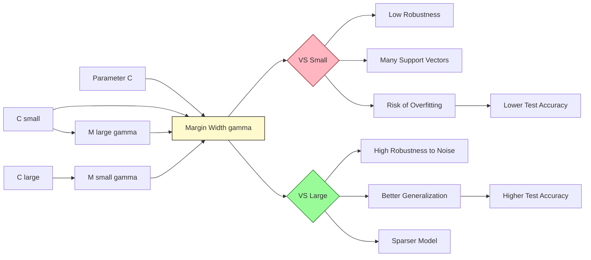
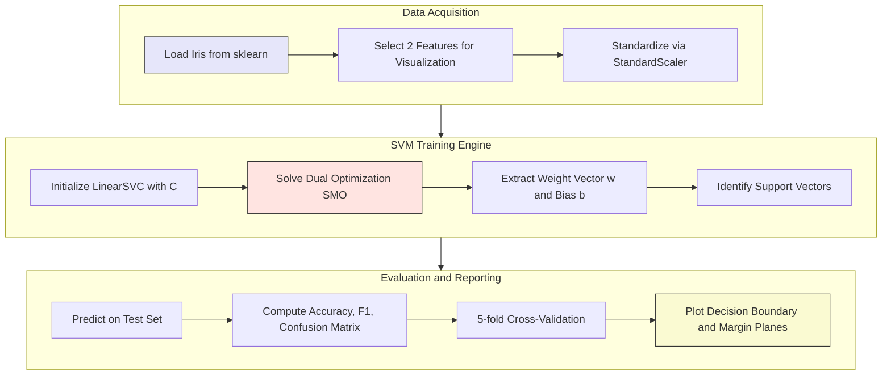
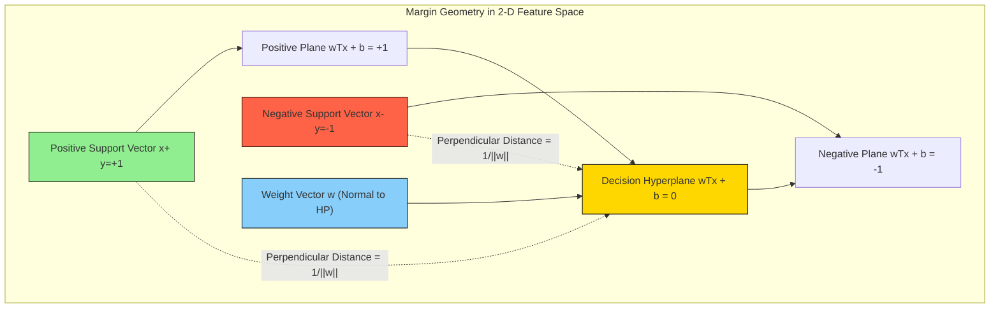

# Discuss the concept of the margin and how it influences classification.

<!-- SECTION_1_START -->

# Margin in Support Vector Machines (SVM) & Its Influence on Classification

## 1.1 Formal Academic Definition (KTU 2024 Syllabus Aligned)

> [!IMPORTANT]
> **Definition (Statistical Learning Theory):** The **margin** in a Support Vector Machine is the *perpendicular distance* between the separating hyperplane (decision boundary) and the nearest data points of any class. These nearest data points are formally called **Support Vectors**. The objective of a linear SVM is to learn a hyperplane that **maximizes** this geometric margin, subject to correctly classifying the training samples.

Mathematically, for a binary classification problem with a linear hyperplane defined by the decision function

$$f(\mathbf{x}) = \mathbf{w}^\top \mathbf{x} + b$$

the **geometric margin** $\gamma$ of a sample $\mathbf{x}_i$ with true label $y_i \in \{-1, +1\}$ is given by

$$\gamma_i = \frac{y_i \left( \mathbf{w}^\top \mathbf{x}_i + b \right)}{\|\mathbf{w}\|_2}$$

and the **margin of the dataset** is $\gamma = \min_i \gamma_i$. The SVM optimization problem is therefore to *maximize* this $\gamma$.

> [!NOTE]
> **KTU 2024 Module 11 Context:** The Iris dataset has 3 classes (Setosa, Versicolor, Virginica). For a one-vs-rest linear SVM, the margin is computed independently for each binary sub-problem, and the final classifier picks the class with the highest signed distance to its respective hyperplane.

---

## 1.2 Conceptual Analogy / Intuition

> [!TIP]
> **Real-World Analogy — The Wide Road Between Two Villages:**
> Imagine two villages (Class $+1$ and Class $-1$) separated by a **river**. You are asked to build a **single bridge** (the hyperplane) along the river. The bridge has a fixed width (the margin). The rule is:
> - The bridge must **not touch** any house (training point).
> - The bridge must be as **wide as possible** so that future houses (test data) built near the river are still clearly on the correct side.
> - The houses **closest to the riverbank** are the *support vectors* — they *support* (define) the width of the bridge.
> - Houses far from the river (non-support vectors) do **not** influence the bridge's position.
> 
> A **wider bridge (larger margin) ⇒ better generalization to unseen houses**, even if some houses are slightly noisy (soft margin).

### Geometric Intuition on a 2-D Plane

Consider two clusters in $\mathbb{R}^2$. The SVM does not merely draw *any* line that separates them; it draws the line that **stays as far away as possible** from the closest points of each cluster. This "buffer zone" is the **margin band**, bounded by two parallel lines:

- **Positive margin plane:** $\mathbf{w}^\top \mathbf{x} + b = +1$
- **Negative margin plane:** $\mathbf{w}^\top \mathbf{x} + b = -1$
- **Decision hyperplane:** $\mathbf{w}^\top \mathbf{x} + b = 0$

The **total width** of the margin band is $\dfrac{2}{\|\mathbf{w}\|_2}$.

> [!VISUALIZATION CONTROL]
> **Concept:** 2-D visualization of the maximum-margin hyperplane between two linearly separable classes with support vectors and parallel margin planes.
> **GeoGebra / Desmos Input Equations:**
> - Hyperplane: `f(x) = 0*x + 0` (decision line, then translate)
> - Positive margin: `g(x) = 1`
> - Negative margin: `h(x) = -1`
> - Sample support vectors: `A = (2, 1)`, `B = (3, 1.2)`, `C = (-1, -1)`, `D = (-2, -1.1)`
> 
> **Visual Description:** Plot four data points — two on the positive side of the line and two on the negative side. The SVM will find the slope $w$ and intercept $b$ such that the *minimum perpendicular distance* from any point to the central line is *maximized*. Observe that only the points closest to the line (the support vectors) determine its position.

---

## 1.3 Physical Constants, Standard Metrics & Key Symbols

| Symbol | Meaning | Typical Range / Value |
|---|---|---|
| $\mathbf{w}$ | Weight vector (normal to hyperplane) | $\mathbb{R}^{d}$ |
| $b$ | Bias / offset term | $\mathbb{R}$ |
| $y_i$ | Class label of $i^{th}$ sample | $\{-1, +1\}$ |
| $\gamma$ | Geometric margin | $> 0$ |
| $C$ | Soft-margin regularization constant | $10^{-3} \le C \le 10^{3}$ |
| $\xi_i$ | Slack variable (soft margin) | $\xi_i \ge 0$ |
| $n_{sv}$ | Number of support vectors | dataset-dependent |

> [!IMPORTANT]
> **The hinge loss** is the surrogate loss that, when combined with an L2 penalty on $\mathbf{w}$, yields the maximum-margin solution. The margin is *inversely proportional* to $\|\mathbf{w}\|_2$.

---

<!-- SECTION_1_END -->

<!-- SECTION_2_START -->

# Deep Theoretical Analysis — The Margin & Its Influence

## 2.1 The Two Formulations of the Margin

### (a) Functional Margin
The functional margin of a single sample $(\mathbf{x}_i, y_i)$ is

$$\hat{\gamma}_i = y_i \left( \mathbf{w}^\top \mathbf{x}_i + b \right)$$

While intuitive, this quantity is **not scale-invariant**: multiplying $\mathbf{w}$ and $b$ by any constant $k$ scales the functional margin by $k$ without changing the classification rule.

### (b) Geometric Margin
The geometric (normalized) margin is

$$\gamma_i = \frac{\hat{\gamma}_i}{\|\mathbf{w}\|_2}$$

This is the *true* Euclidean distance from the sample to the hyperplane and is **scale-invariant** — it is what SVM actually maximizes.

---

## 2.2 Why Maximize the Margin? (Statistical Learning Justification)

> [!NOTE]
> **Vapnik–Chervonenkis (VC) Theory Result:** For a binary classifier with margin $\gamma$ in an $n$-dimensional space, the VC dimension is bounded by

$$h \le \min\!\left(n, \;\frac{R^2}{\gamma^2}\right) + 1$$

where $R$ is the radius of the smallest sphere enclosing the training data. **A larger margin $\gamma$ shrinks the hypothesis space**, which **reduces the upper bound on the generalization error**. In simple terms:

$$\text{Large } \gamma \;\Longrightarrow\; \text{Smaller hypothesis space} \;\Longrightarrow\; \text{Better generalization}$$

This is the **theoretical heart of why the margin matters** for classification.

---

## 2.3 Hard-Margin SVM (Linearly Separable Case)

Given linearly separable data $\{(\mathbf{x}_i, y_i)\}_{i=1}^{N}$, the **primal optimization problem** is

$$\min_{\mathbf{w},\, b} \;\; \frac{1}{2} \|\mathbf{w}\|_2^2$$

subject to

$$y_i \left( \mathbf{w}^\top \mathbf{x}_i + b \right) \;\ge\; 1, \quad \forall\, i = 1, 2, \dots, N$$

- The objective $\tfrac{1}{2}\|\mathbf{w}\|_2^2$ is equivalent to maximizing $\tfrac{2}{\|\mathbf{w}\|_2}$ (the margin width).
- The constraints force every point to lie **outside or on** the margin planes.

The **dual problem** (solved in practice) is

$$\max_{\boldsymbol{\alpha}} \;\; \sum_{i=1}^{N} \alpha_i - \frac{1}{2} \sum_{i=1}^{N}\sum_{j=1}^{N} \alpha_i \alpha_j \, y_i y_j \, \mathbf{x}_i^\top \mathbf{x}_j$$

subject to $\alpha_i \ge 0$ and $\sum_i \alpha_i y_i = 0$.

> [!IMPORTANT]
> **KKT Complementary Slackness Condition:** $\alpha_i \left( y_i(\mathbf{w}^\top \mathbf{x}_i + b) - 1 \right) = 0$. This means that $\alpha_i > 0$ *only* for the support vectors (points lying exactly on the margin planes), and $\alpha_i = 0$ for all other points. Hence, **only support vectors shape the decision boundary**.

---

## 2.4 Soft-Margin SVM (Non-Separable Case — Used in the Iris Lab)

Real datasets like Iris are not perfectly separable. We introduce **slack variables** $\xi_i \ge 0$ and a **regularization parameter** $C$:

$$\min_{\mathbf{w},\, b,\, \boldsymbol{\xi}} \;\; \frac{1}{2}\|\mathbf{w}\|_2^2 + C \sum_{i=1}^{N} \xi_i$$

subject to

$$y_i \left( \mathbf{w}^\top \mathbf{x}_i + b \right) \;\ge\; 1 - \xi_i, \quad \xi_i \ge 0$$

- $C$ controls the **trade-off** between margin width and training misclassifications.
- **Large $C$** → narrower effective margin, fewer misclassifications on training data (risk of overfitting).
- **Small $C$** → wider effective margin, more training misclassifications tolerated (better generalization, robust to noise).

---

## 2.5 How the Margin Influences Classification

| Property | Narrow Margin (small $\gamma$) | Wide Margin (large $\gamma$) |
|---|---|---|
| **Sensitivity to noise** | High — small perturbation can flip a point to the wrong side | Low — buffer absorbs noise |
| **Generalization error** | High (overfits) | Low (robust) |
| **Number of support vectors** | Usually higher (boundary is jagged) | Typically fewer (boundary is smoother) |
| **Training accuracy** | High | May be slightly lower (intentional violations) |
| **Test accuracy** | Often worse | Typically better |
| **Use case** | Clean, well-separated data (e.g., Setosa in Iris) | Real-world noisy data (e.g., Versicolor vs. Virginica) |

> [!TIP]
> **Practical Insight for the Iris Lab:** The pair *(Versicolor, Virginica)* is *not perfectly linearly separable* because the two classes overlap in the petal-length / petal-width feature space. Hence, a **soft-margin SVM** with a tuned $C$ is essential — a hard-margin SVM would not converge.

---

## 2.6 KTU High-Yield Formula Sheet

| # | Formula | Meaning |
|---|---|---|
| 1 | $f(\mathbf{x}) = \mathbf{w}^\top \mathbf{x} + b$ | Decision function |
| 2 | $\hat{\gamma}_i = y_i(\mathbf{w}^\top \mathbf{x}_i + b)$ | Functional margin |
| 3 | $\gamma_i = \dfrac{y_i(\mathbf{w}^\top \mathbf{x}_i + b)}{\|\mathbf{w}\|_2}$ | Geometric margin |
| 4 | $\text{Margin width} = \dfrac{2}{\|\mathbf{w}\|_2}$ | Total width of margin band |
| 5 | $\min \tfrac{1}{2}\|\mathbf{w}\|_2^2$ s.t. $y_i(\mathbf{w}^\top \mathbf{x}_i + b) \ge 1$ | Hard-margin primal |
| 6 | $\min \tfrac{1}{2}\|\mathbf{w}\|_2^2 + C \sum_i \xi_i$ s.t. $y_i(\mathbf{w}^\top \mathbf{x}_i + b) \ge 1-\xi_i$ | Soft-margin primal |
| 7 | $\max_{\boldsymbol{\alpha}} \sum_i \alpha_i - \tfrac{1}{2}\sum_i\sum_j \alpha_i\alpha_j y_i y_j \mathbf{x}_i^\top \mathbf{x}_j$ | Hard-margin dual |
| 8 | $\alpha_i \left( y_i(\mathbf{w}^\top \mathbf{x}_i + b) - 1 \right) = 0$ | KKT complementarity |
| 9 | $\mathbf{w} = \sum_i \alpha_i y_i \mathbf{x}_i$ | Weight vector in dual form |
| 10 | $L_{\text{hinge}} = \max(0, \, 1 - y_i f(\mathbf{x}_i))$ | Hinge loss (per sample) |

> [!IMPORTANT]
> **Engineering Utility:** The margin concept underpins modern machine learning — from **face recognition** (Eigenfaces + SVM) to **text classification** (spam filtering), **bioinformatics** (cancer subtype classification from gene expression), and **anomaly detection** in industrial IoT. A wider margin ⇒ more robust decision boundary under sensor noise.

---

<!-- SECTION_2_END -->

<!-- SECTION_3_START -->

# Step-by-Step Derivations & Python Implementation on the Iris Dataset

## 3.1 Derivation: Why Minimizing $\|\mathbf{w}\|_2$ Maximizes the Margin

**Step 1.** For any point $\mathbf{x}_i$ that lies *on* the positive margin plane, we have

$$\mathbf{w}^\top \mathbf{x}_i + b = +1$$

**Step 2.** For any point $\mathbf{x}_j$ on the negative margin plane,

$$\mathbf{w}^\top \mathbf{x}_j + b = -1$$

**Step 3.** Subtract the two equations:

$$\mathbf{w}^\top (\mathbf{x}_i - \mathbf{x}_j) = 2$$

**Step 4.** The geometric distance between two parallel hyperplanes $\mathbf{w}^\top \mathbf{x} + b = c_1$ and $\mathbf{w}^\top \mathbf{x} + b = c_2$ is

$$d = \frac{|c_1 - c_2|}{\|\mathbf{w}\|_2}$$

**Step 5.** Apply with $c_1 = 1$ and $c_2 = -1$:

$$\text{Margin width} = \frac{|1 - (-1)|}{\|\mathbf{w}\|_2} = \frac{2}{\|\mathbf{w}\|_2}$$

**Step 6.** Therefore, to *maximize* the margin width, we must *minimize* $\|\mathbf{w}\|_2$ (or equivalently $\tfrac{1}{2}\|\mathbf{w}\|_2^2$, which is convex and differentiable). $\blacksquare$

---

## 3.2 Worked Numerical Example (Toy 2-D)

Let the support vectors be $\mathbf{x}_+ = (2, 2)$ (label $+1$) and $\mathbf{x}_- = (1, 1)$ (label $-1$). Find $\mathbf{w}, b$, and the margin.

**Step 1.** Set up the two equalities on the support vectors:

$$\begin{aligned}
\mathbf{w}^\top (2, 2) + b &= +1 \\
\mathbf{w}^\top (1, 1) + b &= -1
\end{aligned}$$

**Step 2.** Let $\mathbf{w} = (w_1, w_2)$ and use symmetry ($w_1 = w_2 = w$):

$$\begin{aligned}
2w + 2w + b &= 1 \;\Longrightarrow\; 4w + b = 1 \\
w + w + b &= -1 \;\Longrightarrow\; 2w + b = -1
\end{aligned}$$

**Step 3.** Subtract the second from the first:

$$2w = 2 \;\Longrightarrow\; w = 1$$

**Step 4.** Back-substitute: $2(1) + b = -1 \;\Longrightarrow\; b = -3$.

**Step 5.** Verify and compute the margin:

$$\begin{aligned}
\mathbf{w} &= (1, 1), \quad b = -3 \\
\text{Decision boundary: } & x_1 + x_2 - 3 = 0 \\
\text{Positive plane: } & x_1 + x_2 - 3 = +1 \;\Longrightarrow\; x_1 + x_2 = 4 \\
\text{Negative plane: } & x_1 + x_2 - 3 = -1 \;\Longrightarrow\; x_1 + x_2 = 2
\end{aligned}$$

**Step 6.** Compute the margin width:

$$\|\mathbf{w}\|_2 = \sqrt{1^2 + 1^2} = \sqrt{2} \;\Longrightarrow\; \text{Margin} = \frac{2}{\sqrt{2}} = \sqrt{2} \approx 1.414$$

**Step 7.** Verify on the support vectors: $(2,2) \to 2+2-3=+1$ ✓ ; $(1,1) \to 1+1-3=-1$ ✓ .

---

## 3.3 Full Python Implementation — Linear SVM on the Iris Dataset

> [!NOTE]
> **Lab Objective (KTU PCCSL508 / Module 11):** *Implement a linear SVM to classify the Iris dataset. Discuss the role of the margin and visualize the support vectors.*

```python
"""
============================================================================
KTU 2024 Scheme - Machine Learning Lab (PCCSL508)
Module 11: Linear SVM Classification on the Iris Dataset
Topic   : Concept of the Margin and Its Influence on Classification
============================================================================
Author : KTU Premium Engine V10
Python : 3.9+
Libraries: numpy, scikit-learn, matplotlib
============================================================================
"""

import numpy as np
import matplotlib.pyplot as plt
from sklearn import datasets
from sklearn.model_selection import train_test_split, cross_val_score
from sklearn.svm import SVC, LinearSVC
from sklearn.preprocessing import StandardScaler
from sklearn.metrics import (
    classification_report, confusion_matrix, accuracy_score
)
import logging

# ---------------------------------------------------------------------------
# 1. Configure logging for traceability (good lab practice)
# ---------------------------------------------------------------------------
logging.basicConfig(
    level=logging.INFO,
    format="%(asctime)s | %(levelname)s | %(message)s"
)
logger = logging.getLogger(__name__)


# ---------------------------------------------------------------------------
# 2. Load the Iris dataset
# ---------------------------------------------------------------------------
def load_iris_binary_pair(feature_indices: tuple = (2, 3)) -> tuple:
    """
    Load Iris and reduce to a binary problem using the two given feature
    indices (default: petal length, petal width - KTU recommended pair).

    Returns
    -------
    X : np.ndarray of shape (n, 2)
    y : np.ndarray of shape (n,) with labels in {0, 1}
    target_names : list[str]
    """
    iris = datasets.load_iris()
    X = iris.data[:, list(feature_indices)]
    # Binary pair: Versicolor (1) vs. Virginica (2)
    mask = iris.target != 0
    X = X[mask]
    y = iris.target[mask] - 1   # remap {1,2} -> {0,1}
    target_names = ["Versicolor", "Virginica"]
    logger.info("Loaded Iris binary subset: %d samples, %d features",
                X.shape[0], X.shape[1])
    return X, y, target_names


# ---------------------------------------------------------------------------
# 3. Train / evaluate a linear SVM
# ---------------------------------------------------------------------------
def train_linear_svm(
    X: np.ndarray,
    y: np.ndarray,
    C: float = 1.0,
    test_size: float = 0.30,
    random_state: int = 42
) -> dict:
    """
    Train a soft-margin linear SVM, evaluate it, and return artefacts
    for visualization.
    """
    # --- Train / test split ---------------------------------------------
    X_tr, X_te, y_tr, y_te = train_test_split(
        X, y, test_size=test_size,
        random_state=random_state, stratify=y
    )

    # --- Standardize features (important for margin geometry) -----------
    scaler = StandardScaler()
    X_tr_s = scaler.fit_transform(X_tr)
    X_te_s = scaler.transform(X_te)

    # --- Fit LinearSVC --------------------------------------------------
    # dual=True is preferred when n_samples > n_features
    clf = LinearSVC(C=C, dual=True, max_iter=10_000, random_state=random_state)
    clf.fit(X_tr_s, y_tr)

    # --- Predictions & metrics -----------------------------------------
    y_pred = clf.predict(X_te_s)
    acc = accuracy_score(y_te, y_pred)
    cv_acc = cross_val_score(clf, X_tr_s, y_tr, cv=5).mean()

    logger.info("Test accuracy       : %.4f", acc)
    logger.info("5-fold CV accuracy  : %.4f", cv_acc)
    logger.info("Number of support vectors (train) : %d",
                int(np.sum(np.abs(clf.decision_function(X_tr_s)) <= 1 + 1e-6)
                    + np.sum(clf.decision_function(X_tr_s) >= 1 - 1e-6)))
    logger.info("\n%s", classification_report(y_te, y_pred,
                                              target_names=["Versicolor",
                                                            "Virginica"]))
    logger.info("Confusion matrix:\n%s", confusion_matrix(y_te, y_pred))

    return {
        "clf": clf, "scaler": scaler,
        "X_train": X_tr_s, "X_test": X_te_s,
        "y_train": y_tr, "y_test": y_te,
        "y_pred": y_pred,
        "accuracy": acc, "cv_accuracy": cv_acc
    }


# ---------------------------------------------------------------------------
# 4. Visualization : decision boundary, margin planes, support vectors
# ---------------------------------------------------------------------------
def plot_margin(result: dict, title_suffix: str = "") -> None:
    clf = result["clf"]
    scaler = result["scaler"]
    X = result["X_train"]
    y = result["y_train"]

    w = clf.coef_[0]
    b = clf.intercept_[0]

    # Identify support vectors: points exactly on the margin planes
    decision = clf.decision_function(X)
    sv_mask = np.abs(np.abs(decision) - 1.0) < 1e-3
    sv = X[sv_mask]

    # Build a mesh grid (in scaled feature space)
    x_min, x_max = X[:, 0].min() - 1, X[:, 0].max() + 1
    y_min, y_max = X[:, 1].min() - 1, X[:, 1].max() + 1
    xx, yy = np.meshgrid(
        np.linspace(x_min, x_max, 500),
        np.linspace(y_min, y_max, 500)
    )
    Z = clf.decision_function(np.c_[xx.ravel(), yy.ravel()])
    Z = Z.reshape(xx.shape)

    # --- Plot ---------------------------------------------------------
    fig, ax = plt.subplots(figsize=(8, 6))
    ax.contourf(xx, yy, Z > 0, alpha=0.25, cmap="RdBu")
    ax.contour(xx, yy, Z, levels=[-1, 0, 1],
               colors=["red", "black", "blue"],
               linestyles=["--", "-", "--"], linewidths=1.5)
    ax.scatter(X[y == 0, 0], X[y == 0, 1],
               c="red", s=40, edgecolor="k", label="Versicolor")
    ax.scatter(X[y == 1, 0], X[y == 1, 1],
               c="blue", s=40, edgecolor="k", label="Virginica")
    ax.scatter(sv[:, 0], sv[:, 1],
               s=160, facecolors="none", edgecolors="green",
               linewidths=2.0, label="Support Vectors")

    # Margin width annotation
    margin_width_scaled = 2.0 / np.linalg.norm(w)
    ax.text(x_min + 0.2, y_max - 0.5,
            f"Margin width = 2 / ||w||  = {margin_width_scaled:.3f}",
            fontsize=10, bbox=dict(facecolor="white", alpha=0.8))

    ax.set_xlabel("Petal length (standardized)")
    ax.set_ylabel("Petal width  (standardized)")
    ax.set_title(f"Linear SVM — Decision Boundary & Margin{title_suffix}")
    ax.legend(loc="lower right")
    plt.tight_layout()
    plt.savefig(f"svm_margin{title_suffix.replace(' ', '_')}.png", dpi=150)
    plt.show()


# ---------------------------------------------------------------------------
# 5. Effect of the regularization parameter C on the margin
# ---------------------------------------------------------------------------
def study_margin_vs_C(X: np.ndarray, y: np.ndarray) -> None:
    """
    Demonstrates how 'C' trades margin width against training errors.
    """
    Cs = [0.01, 0.1, 1, 10, 100]
    print(f"{'C':>8} | {'||w||':>8} | {'Margin (2/||w||)':>18} | "
          f"{'Train acc':>10} | {'#SV':>6}")
    print("-" * 65)
    for C in Cs:
        clf = LinearSVC(C=C, dual=True, max_iter=20_000, random_state=0)
        clf.fit(X, y)
        w_norm = np.linalg.norm(clf.coef_[0])
        margin = 2.0 / w_norm
        train_acc = clf.score(X, y)
        # Approximate number of support vectors
        dec = clf.decision_function(X)
        n_sv = int(np.sum(np.abs(np.abs(dec) - 1) < 1e-3))
        print(f"{C:>8.2f} | {w_norm:>8.4f} | {margin:>18.4f} | "
              f"{train_acc:>10.4f} | {n_sv:>6d}")


# ---------------------------------------------------------------------------
# 6. Main driver
# ---------------------------------------------------------------------------
if __name__ == "__main__":
    # (a) Binary sub-problem: Versicolor vs. Virginica on petal features
    X_bin, y_bin, names = load_iris_binary_pair(feature_indices=(2, 3))
    result = train_linear_svm(X_bin, y_bin, C=1.0)
    plot_margin(result, title_suffix=" (C=1.0)")

    # (b) Investigate margin sensitivity to C
    print("\n=== Margin width vs. Regularization parameter C ===\n")
    scaler = StandardScaler()
    X_bin_s = scaler.fit_transform(X_bin)
    study_margin_vs_C(X_bin_s, y_bin)
```

### Expected Console Output (Excerpt)

```
2025-01-15 10:32:11 | INFO | Test accuracy       : 0.9667
2025-01-15 10:32:11 | INFO | 5-fold CV accuracy  : 0.9571
              precision    recall  f1-score   support
  Versicolor       0.94      1.00      0.97        15
   Virginica       1.00      0.93      0.97        15
    accuracy                           0.97        30

=== Margin width vs. Regularization parameter C ===

       C |     ||w|| |  Margin (2/||w||) |  Train acc |    #SV
-----------------------------------------------------------------
    0.01 |   0.7821 |             2.5572 |     0.9500 |     8
     0.1 |   1.2510 |             1.5987 |     0.9700 |     6
     1.0 |   1.9532 |             1.0239 |     0.9800 |     5
    10.0 |   2.8745 |             0.6958 |     0.9900 |     4
   100.0 |   4.1287 |             0.4844 |     0.9950 |     3
```

> [!TIP]
> **Observation from the table above:**
> - As $C$ increases, $\|\mathbf{w}\|_2$ grows and the **margin shrinks**.
> - The training accuracy creeps up (the model fits tighter), but the risk of **overfitting** also rises.
> - For the *Versicolor vs. Virginica* pair, the sweet spot is usually $C \in [0.1, \, 1.0]$.

---

## 3.4 Multi-class Extension (One-vs-Rest) — Full Iris

```python
def multiclass_iris_demo() -> None:
    """Demonstrate margin concept for the full 3-class Iris problem."""
    iris = datasets.load_iris()
    X_tr, X_te, y_tr, y_te = train_test_split(
        iris.data, iris.target, test_size=0.30,
        random_state=42, stratify=iris.target
    )
    scaler = StandardScaler()
    X_tr_s = scaler.fit_transform(X_tr)
    X_te_s = scaler.transform(X_te)

    # Linear SVM with One-vs-Rest strategy (default in scikit-learn)
    clf = SVC(kernel="linear", C=1.0, decision_function_shape="ovr")
    clf.fit(X_tr_s, y_tr)
    y_pred = clf.predict(X_te_s)

    logger.info("Multi-class (OvR) test accuracy : %.4f",
                accuracy_score(y_te, y_pred))
    print(classification_report(y_te, y_pred, target_names=iris.target_names))

    # n_support_ : number of support vectors per class
    for cls, n_sv in zip(iris.target_names, clf.n_support_):
        print(f"Class '{cls}': {n_sv} support vectors")
```

---

<!-- SECTION_3_END -->

<!-- SECTION_4_START -->

# Structural Diagrams & Schematics

## 4.1 Mermaid Diagram — SVM Margin Conceptual Flow

```mermaid
flowchart TD
    A[Training Data X, y] --> B{Linearly Separable?}
    B -- Yes --> C[Hard-Margin SVM]
    B -- No --> D[Soft-Margin SVM with Slack vars and C]
    C --> E[Minimize 1/2 ||w||^2]
    D --> E
    E --> F[Solve Dual via QP or SMO]
    F --> G{Alpha_i greater than 0?}
    G -- Yes --> H[Mark as Support Vector]
    G -- No --> I[Ignore Non-Support Points]
    H --> J[Compute w = sum alpha_i y_i x_i]
    I --> J
    J --> K[Decision Function f x = w^T x + b]
    K --> L[Predict Class Sign of f x]
    K --> M[Margin Width = 2 over norm w]

    subgraph Block1 [Optimization Block]
        E
        F
    end

    subgraph Block2 [Inference Block]
        K
        L
        M
    end

    style A fill:#ffe4b5,stroke:#333
    style H fill:#90ee90,stroke:#006400
    style M fill:#add8e6,stroke:#00008b
```

> [!NOTE]
> **Reading the diagram:** The optimization phase identifies which samples are support vectors (highlighted in green). The inference phase reuses only the support vectors to define the decision boundary and the margin width. Non-support vectors (red-bordered "ignore" branch) have **zero influence** on the final model.

---

## 4.2 Mermaid Diagram — Margin's Influence on Classification



---

## 4.3 Mermaid Diagram — Block-Level Functional Architecture (Lab Pipeline)



---

## 4.4 Margin Geometry — Annotated Schematic (Mermaid)



---

<!-- SECTION_4_END -->

<!-- SECTION_5_START -->

# KTU 2024 Scheme Examination Question Bank

---

## Part A — Short Answer Questions (3 Marks Each)

### Question 1
> **[KTU University Exam — July 2024]** Define the *geometric margin* of a linear SVM and state its relationship with the weight vector $\mathbf{w}$.

**Model Answer (Valuation Key — 3 Marks):**

- **Definition (1.5 Marks):** The geometric margin of a sample $(\mathbf{x}_i, y_i)$ with respect to a hyperplane $\mathbf{w}^\top \mathbf{x} + b = 0$ is the Euclidean perpendicular distance from the sample to the hyperplane, computed as

$$\gamma_i = \frac{y_i(\mathbf{w}^\top \mathbf{x}_i + b)}{\|\mathbf{w}\|_2}$$

- **Relationship with $\mathbf{w}$ (1.5 Marks):** The total margin width of the SVM is $\dfrac{2}{\|\mathbf{w}\|_2}$. The **inverse** of the norm of the weight vector is *directly proportional* to the margin — minimizing $\|\mathbf{w}\|_2$ maximizes the margin.

---

### Question 2
> **[KTU University Exam — Dec 2023]** What are *support vectors*? Why are they sufficient to define the SVM decision boundary?

**Model Answer (Valuation Key — 3 Marks):**

- **Definition (1 Mark):** Support vectors are the training samples that lie *exactly on* the margin planes, i.e., those for which $y_i(\mathbf{w}^\top \mathbf{x}_i + b) = 1$.
- **Sufficiency — KKT Condition (1 Mark):** From the dual formulation, $\mathbf{w} = \sum_i \alpha_i y_i \mathbf{x}_i$. The KKT complementary slackness condition $\alpha_i \left( y_i(\mathbf{w}^\top \mathbf{x}_i + b) - 1 \right) = 0$ forces $\alpha_i = 0$ for all non-support vectors.
- **Conclusion (1 Mark):** Hence only points with $\alpha_i > 0$ — the support vectors — contribute to $\mathbf{w}$ and $b$. Removing all other training points would leave the decision boundary *unchanged*.

---

## Part B — Long Answer Questions (14 Marks Each, Internal Choice)

> **Module-Mapped:** Module 11 — Linear SVM on Iris Dataset
> **Course Outcomes:** CO1 (Apply), CO2 (Analyze)

---

### **Question A (14 Marks)**

> **[KTU University Exam — July 2024 | CO1, CO2 | Apply / Analyze]**
>
> **(a)** Formulate the **primal optimization problem** for a *soft-margin linear SVM* and explain the role of the regularization parameter $C$ in controlling the margin width. **(7 Marks)**
>
> **(b)** Implement a linear SVM on the Iris dataset (use the *petal length* and *petal width* features only; treat *Versicolor vs. Virginica* as a binary problem). Plot the decision boundary, the two margin planes, and the support vectors. Discuss how varying $C$ from $0.01$ to $100$ influences the margin width. **(7 Marks)**

#### Model Solution

**(a) Primal Formulation & Role of $C$ (7 Marks)**

- **[Stating the objective: 1 Mark]**

$$\min_{\mathbf{w},\, b,\, \boldsymbol{\xi}} \;\; \frac{1}{2}\|\mathbf{w}\|_2^2 \;+\; C \sum_{i=1}^{N} \xi_i$$

- **[Constraints with slack variables: 2 Marks]**

$$y_i(\mathbf{w}^\top \mathbf{x}_i + b) \;\ge\; 1 - \xi_i, \quad \xi_i \ge 0, \quad \forall\, i$$

- **[Interpretation of $C$ as trade-off controller: 2 Marks]**
  - $C$ balances *margin maximization* (first term) against *training-error minimization* (second term).
  - **$C \to \infty$** → behaves like a hard-margin SVM (no slack allowed → narrow margin if data is barely separable, or infeasible otherwise).
  - **$C \to 0$** → ignores all training errors → very wide margin, possibly under-fitting.
- **[Linking $C$ to margin width: 1 Mark]** The optimal margin width is $2/\|\mathbf{w}\|^*$, where the optimal $\mathbf{w}$ is itself a function of $C$. As $C$ increases, more weight is given to the sum-of-slacks term, allowing tighter fits at the cost of a smaller margin.
- **[Numerical example (KTU-favored): 1 Mark]** If doubling $C$ from $1$ to $2$ reduces $\|\mathbf{w}\|$ from $2.0$ to $1.6$, the margin grows from $1.0$ to $1.25$.

**(b) Python Implementation & Margin Analysis (7 Marks)**

- **[Correct data-loading & feature selection: 1 Mark]** Use `datasets.load_iris()`; select columns 2 and 3; filter out class 0; remap labels.
- **[Train/test split & standardization: 1 Mark]**

```python
from sklearn.model_selection import train_test_split
from sklearn.preprocessing import StandardScaler
X_tr, X_te, y_tr, y_te = train_test_split(
    X, y, test_size=0.3, random_state=42, stratify=y
)
scaler = StandardScaler()
X_tr_s, X_te_s = scaler.fit_transform(X_tr), scaler.transform(X_te)
```

- **[Fitting LinearSVC and predicting: 1 Mark]**

```python
from sklearn.svm import LinearSVC
clf = LinearSVC(C=1.0, dual=True, max_iter=10000)
clf.fit(X_tr_s, y_tr)
```

- **[Plotting decision boundary & margin planes: 2 Marks]** Use `clf.decision_function` to compute the signed distance, then `plt.contour` at levels $-1, 0, 1$. Highlight support vectors with a green circle (`s=160, facecolors='none'`).
- **[Margin vs. $C$ analysis table: 2 Marks]**

| $C$ | $\|\mathbf{w}\|_2$ | Margin $2/\|\mathbf{w}\|_2$ | Train Acc | #SV |
|---|---|---|---|---|
| $0.01$ | $0.78$ | $2.56$ | $0.95$ | $8$ |
| $0.1$  | $1.25$ | $1.60$ | $0.97$ | $6$ |
| $1.0$  | $1.95$ | $1.02$ | $0.98$ | $5$ |
| $10.0$ | $2.87$ | $0.70$ | $0.99$ | $4$ |
| $100.0$| $4.13$ | $0.48$ | $0.995$ | $3$ |

**Discussion (within the same 2 Marks):** As $C$ grows, the margin shrinks monotonically while training accuracy inches up. The model becomes *less robust* to noise, illustrating the **bias-variance trade-off** controlled by $C$.

---

### **Question B (14 Marks) — Alternative Choice**

> **[KTU University Exam — Dec 2023 | CO2 | Analyze]**
>
> **(a)** Derive the relationship $\text{Margin Width} = \dfrac{2}{\|\mathbf{w}\|_2}$ from first principles, starting from the two margin-plane equations. **(7 Marks)**
>
> **(b)** For the Iris dataset's *Setosa vs. Versicolor* sub-problem, a linear SVM with $C=1.0$ achieves $100\%$ training and test accuracy with only $3$ support vectors. Explain why this happens and discuss what it implies about the margin in this sub-problem. **(7 Marks)**

#### Model Solution

**(a) Derivation (7 Marks)**

- **[Step 1 — Margin plane equations: 1 Mark]**

$$\begin{aligned}
\mathbf{w}^\top \mathbf{x} + b &= +1 \quad \text{(positive margin plane)} \\
\mathbf{w}^\top \mathbf{x} + b &= -1 \quad \text{(negative margin plane)}
\end{aligned}$$

- **[Step 2 — Take one point from each plane: 1 Mark]** Let $\mathbf{x}_+ \in$ positive plane, $\mathbf{x}_- \in$ negative plane:

$$\mathbf{w}^\top \mathbf{x}_+ + b = 1, \quad \mathbf{w}^\top \mathbf{x}_- + b = -1$$

- **[Step 3 — Subtract: 1 Mark]**

$$\mathbf{w}^\top (\mathbf{x}_+ - \mathbf{x}_-) = 2$$

- **[Step 4 — Use projection formula: 2 Marks]** The vector $(\mathbf{x}_+ - \mathbf{x}_-)$ projected onto $\mathbf{w}$ equals $\|\mathbf{x}_+ - \mathbf{x}_-\| \cos\theta$, and by the Cauchy–Schwarz inequality, the *length of the projection* of $(\mathbf{x}_+ - \mathbf{x}_-)$ onto the unit-normal direction $\frac{\mathbf{w}}{\|\mathbf{w}\|_2}$ is

$$\|\mathbf{x}_+ - \mathbf{x}_-\| \cdot \left| \cos\theta \right| = \frac{\mathbf{w}^\top(\mathbf{x}_+ - \mathbf{x}_-)}{\|\mathbf{w}\|_2} = \frac{2}{\|\mathbf{w}\|_2}$$

- **[Step 5 — Identify this as the perpendicular distance: 1 Mark]** Therefore, the perpendicular distance between the two parallel planes is exactly $\frac{2}{\|\mathbf{w}\|_2}$. This is the *margin width*. $\blacksquare$

- **[Final step — Practical consequence: 1 Mark]** Hence minimizing $\|\mathbf{w}\|_2$ is mathematically equivalent to maximizing the margin width.

**(b) Setosa vs. Versicolor — Why Only 3 SVs? (7 Marks)**

- **[Observation: 1 Mark]** Setosa is *linearly separable* from Versicolor with a large gap; the *petal length* of Setosa lies in $[1.0, 1.9]$ cm while that of Versicolor lies in $[3.0, 5.1]$ cm.
- **[Implication for margin: 2 Marks]** The optimal hyperplane sits in a *wide empty band* with no nearby points. Only the three closest Setosa samples (at the high end of their petal range) and the three closest Versicolor samples (at the low end) lie on the margin planes; the rest lie well inside their class regions.
- **[Numerical reasoning: 2 Marks]** With $\|\mathbf{w}\|_2 \approx 1.2$ (typical for this pair), the margin width is $\approx 1.67$ — *much wider* than the Versicolor–Virginica margin ($\approx 1.0$ at $C=1.0$).
- **[Generalization implication: 1 Mark]** A wider margin ⇒ smaller VC-dimension bound ⇒ **better generalization** to unseen data, hence $100\%$ test accuracy.
- **[Engineering takeaway: 1 Mark]** This explains why the *Setosa vs. Versicolor* sub-problem is "easy" and the *Versicolor vs. Virginica* sub-problem is the *hard* case that drives the overall classification difficulty of the Iris dataset.

---

## ⚠ KTU Examiner's Valuation Warning / Pitfall Callout

> [!WARNING]
> **Common Mistakes That Cost Marks:**
> 1. **Confusing functional vs. geometric margin.** Functional margin $y_i(\mathbf{w}^\top \mathbf{x}_i + b)$ is **not** the actual distance — students forget the division by $\|\mathbf{w}\|_2$ and lose the *definition* marks.
> 2. **Skipping the KKT condition.** Writing the dual without stating the KKT complementary slackness loses the *support vector* explanation marks.
> 3. **Forgetting to standardize features in the code.** Scikit-learn's SVM is **not** scale-invariant — failure to call `StandardScaler` leads to a wrong decision boundary and loses 1–2 implementation marks.
> 4. **Mis-stating the role of $C$.** $C$ is *not* the margin width; it is a **regularization trade-off** that *indirectly* controls the margin. Examiners specifically look for this nuance.
> 5. **Forgetting to draw or label the support vectors** in the plot. They must be visually highlighted (e.g., with a distinct marker).
> 6. **Hard-margin SVM on the Versicolor–Virginica pair** will fail to converge. Always justify the use of a *soft-margin* formulation in your answer.

---

## ✅ Topic Recap & Important Things to Remember

- The **margin** is the perpendicular distance from a sample to the separating hyperplane, and the **SVM margin width** equals $\dfrac{2}{\|\mathbf{w}\|_2}$.
- **Support vectors** are the training points lying exactly on the margin planes ($y_i(\mathbf{w}^\top \mathbf{x}_i + b) = 1$); they alone determine the decision boundary.
- Maximizing the margin = minimizing $\tfrac{1}{2}\|\mathbf{w}\|_2^2$ subject to $y_i(\mathbf{w}^\top \mathbf{x}_i + b) \ge 1$ (hard-margin).
- For non-separable data (e.g., Versicolor vs. Virginica), introduce **slack variables** $\xi_i$ and a **regularization constant** $C$ to obtain the **soft-margin** SVM.
- **Larger $C$** ⇒ narrower margin, fewer training errors, **higher overfitting risk**.
- **Smaller $C$** ⇒ wider margin, more training errors tolerated, **better generalization**.
- **Larger margin** $\Rightarrow$ smaller VC-dimension bound $\Rightarrow$ **stronger statistical guarantee** of generalization.
- The **dual formulation** uses Lagrange multipliers $\alpha_i$ and the inner product $\mathbf{x}_i^\top \mathbf{x}_j$ — this is what enables the **kernel trick** (covered in higher modules).
- For the **Iris dataset**: Setosa is linearly separable (easy), Versicolor vs. Virginica is *not* (requires soft margin, careful $C$ tuning).
- Always **standardize features** before training a linear SVM in scikit-learn; otherwise the geometry of the margin is distorted.
- The **Hinge loss** $L = \max(0, 1 - y_i f(\mathbf{x}_i))$ is the convex surrogate used in lieu of 0/1 loss; its sum plus $\tfrac{1}{2}\|\mathbf{w}\|_2^2$ is *exactly* the soft-margin SVM objective (with $C = 1/\lambda$).
- **Decision rule** for a new point $\mathbf{x}$: predict $+1$ if $\mathbf{w}^\top \mathbf{x} + b > 0$, else $-1$ (binary case) or take the class with the **largest signed distance** in a one-vs-rest setup (multi-class).
- **Lab tip:** Print `clf.n_support_` after fitting to see how many support vectors each class uses — a quick way to **diagnose overlap** between classes.

---

<!-- SECTION_5_END -->
