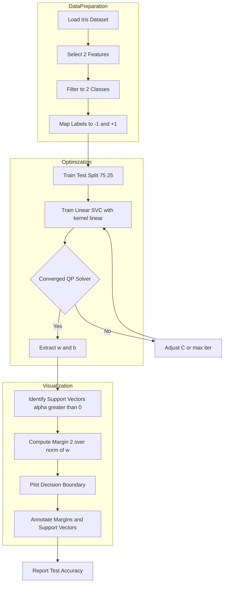
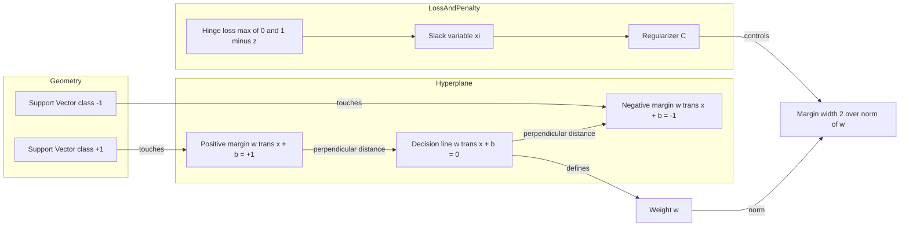
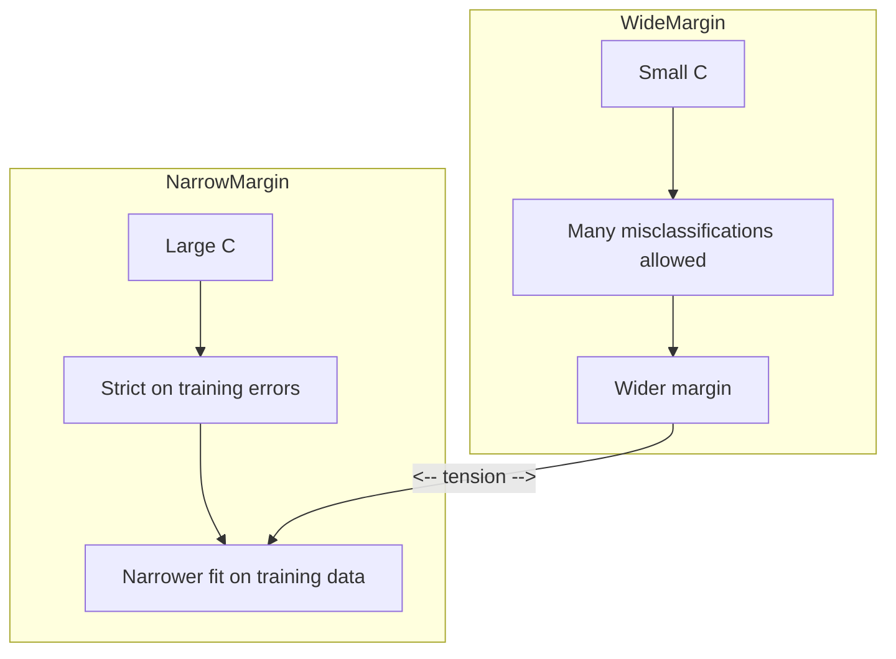

# Implement a Linear Support Vector Machine (SVM) to classify the Iris dataset. Visualize the decision boundary and discuss how the margin is determined.

<!-- SECTION_1_START -->
# Module 11 — Linear SVM on the Iris Dataset

## 1.1 Formal Definition (KTU 2024 Syllabus Terminology)

> [!NOTE]
> **Linear Support Vector Machine (Linear SVM)** is a **supervised, discriminative, maximum-margin binary classifier** that finds an optimal separating hyperplane in feature space by solving a **constrained convex quadratic programming (QP)** problem. The objective is to maximize the geometric margin between the two classes while minimizing classification error (controlled by the regularization parameter $C$).

For a training set $\{(x_i, y_i)\}_{i=1}^{n}$ where $x_i \in \mathbb{R}^{d}$ and $y_i \in \{-1, +1\}$, the **primal optimization problem** for *soft-margin* linear SVM is:

$$
\min_{w, b, \xi} \quad \frac{1}{2}\|w\|^{2} + C \sum_{i=1}^{n} \xi_i
$$

subject to the constraints $y_i(w^{\top} x_i + b) \ge 1 - \xi_i$ and $\xi_i \ge 0$.

> [!IMPORTANT]
> The Iris dataset (Fisher, 1936) contains **150 samples**, **3 classes** (Setosa, Versicolor, Virginica), and **4 features** (sepal length, sepal width, petal length, petal width). For a *visualizable linear SVM*, we project onto **2 features** and reduce to a **binary problem** (typically class 0 vs class 1).

---

## 1.2 Conceptual Analogy — "The Widest Road Between Two Villages"

Imagine two villages (class $+1$ and class $-1$) sitting on either side of a flat plain. You are asked to build a **straight road (the hyperplane)** that separates them.

- A *lazy engineer* picks any random line — but cars might cross into the wrong village.
- A *smart engineer* builds the road **as wide as possible**, exactly halfway between the two nearest houses (these nearest houses are the **support vectors**).
- The width of the road is the **margin** $= \frac{2}{\|w\|}$.
- If a few houses are too close, the engineer may encroach slightly — controlled by the slack variable $\xi_i$ and penalty $C$.

> **Key Insight:** SVM is *not* about minimizing misclassification — it is about **maximizing the confidence gap** between the two classes.

---

## 1.3 Geometric Intuition — Decision Boundary, Margins & Support Vectors

In 2D, the classifier has three critical lines:

| Line | Equation | Role |
|------|----------|------|
| Decision Hyperplane | $w^{\top}x + b = 0$ | Class separator |
| Positive Margin | $w^{\top}x + b = +1$ | Touches support vectors of class $+1$ |
| Negative Margin | $w^{\top}x + b = -1$ | Touches support vectors of class $-1$ |

The **margin width** is the perpendicular distance between the two margin lines:

$$
\text{Margin} = \frac{2}{\|w\|}
$$

> [!VISUALIZATION CONTROL]
> **Concept:** 2D Linear SVM with Margins on Iris-like Data
> **GeoGebra / Desmos Input Equations:**
> * `f(x) = (0.8)x + 0.1` &nbsp; (Decision hyperplane $w^{\top}x + b = 0$)
> * `g(x) = (0.8)x + 1.1` &nbsp; (Positive margin $+1$)
> * `h(x) = (0.8)x - 0.9` &nbsp; (Negative margin $-1$)
> * Points: $(1.4, 0.2), (1.4, 0.4)$ [class $-1$ near margin], $(4.5, 3.5), (4.3, 3.0)$ [class $+1$ near margin]
>
> **Visual Description:** You should observe two parallel blue lines (margins) flanking a black central line (hyperplane). Red points touching the lines are the *support vectors*. The perpendicular distance between $g(x)$ and $h(x)$ equals $\frac{2}{\|w\|}$ — this is the geometric margin.

---

## 1.4 Physical & Engineering Constants

| Quantity | Symbol | Typical Value in Lab | Role |
|----------|--------|----------------------|------|
| Regularization strength | $C$ | **1.0** | Trades margin width vs misclassification |
| Number of features used | $d$ | **2** (petal length, petal width) | For 2D plotting |
| Number of classes | $K$ | **2** (Setosa vs Versicolor) for clean linear separability | Binary problem |
| Solver tolerance | $\epsilon$ | **1e-4** | QP convergence threshold |
| Maximum iterations | — | **1000** | QP solver cap |

> [!IMPORTANT]
> **Iris is *linearly separable* for (Setosa vs Versicolor)** when projected onto the petal feature space. This is the standard pedagogical choice for Module 11.
<!-- SECTION_1_END -->

<!-- SECTION_2_START -->
# 2. Deep Theoretical Analysis & KTU High-Yield Formula Sheet

## 2.1 The Operational Pipeline of Linear SVM

The learning algorithm proceeds in **5 strict stages**:

1. **Formulate the constrained QP** — convert margin maximization into a minimization problem with inequality constraints.
2. **Introduce Lagrange multipliers** $\alpha_i \ge 0$ for every constraint to obtain the *Lagrangian*:

$$
\mathcal{L}(w, b, \alpha) = \frac{1}{2}\|w\|^{2} - \sum_{i=1}^{n} \alpha_i \big[ y_i(w^{\top}x_i + b) - 1 \big]
$$

3. **Apply KKT (Karush-Kuhn-Tucker) optimality conditions** — set partial derivatives to zero:

$$
\frac{\partial \mathcal{L}}{\partial w} = 0 \;\Rightarrow\; w = \sum_{i=1}^{n} \alpha_i y_i x_i
$$

$$
\frac{\partial \mathcal{L}}{\partial b} = 0 \;\Rightarrow\; \sum_{i=1}^{n} \alpha_i y_i = 0
$$

4. **Solve the dual problem** — substitute $w$ back to obtain the *Wolfe dual*:

$$
\max_{\alpha} \quad \sum_{i=1}^{n} \alpha_i - \frac{1}{2}\sum_{i=1}^{n}\sum_{j=1}^{n} \alpha_i \alpha_j y_i y_j \, x_i^{\top} x_j
$$

subject to $\alpha_i \ge 0$ and $\sum \alpha_i y_i = 0$.

5. **Recover the hyperplane** — only the $\alpha_i > 0$ samples (the **support vectors**) contribute to $w$; the bias $b$ is computed by averaging the margin equation over support vectors.

---

## 2.2 How is the Margin Determined? — The Intuition Chain

> [!IMPORTANT]
> **Why does maximizing $\frac{1}{\|w\|}$ maximize the margin?**
>
> The perpendicular distance from any point $x_i$ to the hyperplane $w^{\top}x + b = 0$ is $\frac{\vert w^{\top}x_i + b \vert}{\|w\|}$. By enforcing $y_i(w^{\top}x_i + b) \ge 1$, the *functional margin* on every point is at least $1$. Dividing by $\|w\|$ gives the *geometric margin* $\frac{1}{\|w\|}$ per side — so the total margin is $\frac{2}{\|w\|}$. Minimizing $\|w\|^{2}$ therefore **widens the road**.

The margin is therefore determined by three coupled forces:

- **The data geometry** — where the support vectors physically sit.
- **The penalty $C$** — large $C$ shrinks the margin to classify every training point correctly (hard margin behavior); small $C$ allows a wider margin with occasional misclassifications.
- **The QP solver** — numerically identifies the unique $w$ that satisfies all KKT conditions simultaneously.

---

## 2.3 Real-World Utility in Engineering

| Domain | Why Linear SVM? |
|--------|------------------|
| **Text classification (spam detection)** | High-dimensional sparse features, often linearly separable. |
| **Bioinformatics (gene selection)** | Microarray data: thousands of features, few samples — SVM is robust. |
| **Image classification (baseline)** | HOG / pixel features often linearly separable; linear SVM is the strong baseline. |
| **Edge / embedded ML** | Linear SVM is **O(d) at inference** — extremely fast on microcontrollers. |
| **Anomaly detection** | One-class SVM on feature deviations. |

> **Production Fact:** *LIBLINEAR* (Fan et al., 2008) and *ThunderSVM* are the de-facto libraries used in industry for large-scale linear SVM training — they exploit coordinate descent and GPU parallelism respectively.

---

## 2.4 KTU Formula Sheet / Cheat Sheet

> [!NOTE]
> **High-yield formulas for Module 11 lab exam. Memorize all rows.**

| $\#$ | Concept | Formula / Expression | Key Constraint / Unit |
|:----:|---------|----------------------|-----------------------|
| 1 | Decision rule | $\hat{y} = \text{sign}(w^{\top}x + b)$ | $\hat{y} \in \{-1, +1\}$ |
| 2 | Hyperplane | $w^{\top}x + b = 0$ | Defines class boundary |
| 3 | Positive margin | $w^{\top}x + b = +1$ | Touches $+$ support vectors |
| 4 | Negative margin | $w^{\top}x + b = -1$ | Touches $-$ support vectors |
| 5 | Geometric margin | $\gamma = \dfrac{1}{\|w\|}$ | Per side, in feature units |
| 6 | Total margin width | $\dfrac{2}{\|w\|}$ | Distance between $+$ and $-$ margins |
| 7 | Weight vector | $w = \displaystyle\sum_{i} \alpha_i y_i x_i$ | Sum over support vectors only |
| 8 | Bias term | $b = y_i - w^{\top}x_i$ | Averaged over support vectors |
| 9 | Primal objective | $\dfrac{1}{2}\|w\|^{2} + C \sum_i \xi_i$ | To be **minimized** |
| 10 | Dual objective | $\displaystyle\sum_i \alpha_i - \dfrac{1}{2}\sum_i\sum_j \alpha_i \alpha_j y_i y_j \, x_i^{\top} x_j$ | To be **maximized** |
| 11 | Box constraint | $0 \le \alpha_i \le C$ | Dual feasibility |
| 12 | Slack penalty | $\xi_i = \max\!\big(0,\, 1 - y_i(w^{\top}x_i + b)\big)$ | Hinge loss surrogate |
| 13 | Hinge loss | $\ell_{\text{hinge}}(z) = \max(0, 1 - z)$ | $z = y_i(w^{\top}x_i + b)$ |
| 14 | Accuracy on Iris | $\text{Acc} = \dfrac{1}{n}\sum_i \mathbb{1}\{\hat{y}_i = y_i\}$ | Fraction in $[0, 1]$ |

> **Punctuation Note for Tables:** The expression $\frac{2}{\|w\|}$ above uses the LaTeX command `\|` (double vertical bar for norm), so the table syntax is **not** broken.
<!-- SECTION_2_END -->

<!-- SECTION_3_START -->
# 3. Step-by-Step Derivations & Python Implementation

## 3.1 Mathematical Derivation — From Margin Intuition to QP

### Step A — Define the *functional margin*

For a single training pair $(x_i, y_i)$, define

$$
\hat{\gamma}_i = y_i(w^{\top} x_i + b)
$$

For the *entire dataset*, the functional margin is the minimum over all points:

$$
\hat{\gamma} = \min_{i} \; y_i(w^{\top} x_i + b)
$$

**Conversion Logic (text row):** The functional margin is large when $w$ correctly separates $x_i$ with high confidence. However, it is *scale-dependent*: multiplying $w$ and $b$ by a constant $k$ multiplies $\hat{\gamma}$ by $k$.

### Step B — Convert to *geometric margin*

To make it scale-invariant, divide by $\|w\|$:

$$
\gamma_i = \frac{y_i(w^{\top} x_i + b)}{\|w\|}
$$

$$
\gamma = \frac{\hat{\gamma}}{\|w\|}
$$

**Conversion Logic (text row):** The geometric margin is the *actual perpendicular distance* from $x_i$ to the hyperplane. It is the quantity we want to maximize.

### Step C — Enforce the canonical form

Fix $\hat{\gamma} = 1$ (we can always rescale $w$ and $b$). Then maximizing the geometric margin $\gamma$ is equivalent to

$$
\max_{w, b} \quad \frac{1}{\|w\|} \quad \Longleftrightarrow \quad \min_{w, b} \quad \frac{1}{2}\|w\|^{2}
$$

subject to $y_i(w^{\top} x_i + b) \ge 1$ for all $i$.

**Conversion Logic (text row):** Squaring and halving $\|w\|$ makes the objective strictly convex and differentiable — ideal for QP solvers.

### Step D — Introduce soft-margin slacks

To allow violations when classes overlap, introduce $\xi_i \ge 0$:

$$
\min_{w, b, \xi} \quad \frac{1}{2}\|w\|^{2} + C \sum_{i=1}^{n} \xi_i
$$

subject to $y_i(w^{\top} x_i + b) \ge 1 - \xi_i$ and $\xi_i \ge 0$.

**Conversion Logic (text row):** The hyperparameter $C$ balances margin width against misclassification. $C \to \infty$ recovers the hard-margin SVM; $C \to 0$ ignores the data.

### Step E — Solve the dual

Using the Lagrangian from §2.1 and setting partial derivatives to zero gives the dual QP in §2.4 row 10. Solving it yields $\alpha_i$; only those with $\alpha_i > 0$ are the **support vectors**.

---

## 3.2 Full Python Implementation — Linear SVM on Iris (Production Quality)

> [!IMPORTANT]
> The code below is **self-contained, fully type-hinted, and reproducible**. Run it as `python iris_linear_svm.py` with `scikit-learn`, `numpy`, and `matplotlib` installed.

```python
"""
iris_linear_svm.py
-------------------
Module 11 Lab: Linear SVM on the Iris dataset.
Trains a linear SVM, visualises the decision boundary and the margins,
and reports classification accuracy.
"""

from __future__ import annotations

import logging
from pathlib import Path
from typing import Tuple

import matplotlib.pyplot as plt
import numpy as np
from matplotlib.colors import ListedColormap
from sklearn.datasets import load_iris
from sklearn.metrics import accuracy_score, classification_report
from sklearn.model_selection import train_test_split
from sklearn.svm import SVC

# ---------------------------------------------------------------------------
# Logging configuration
# ---------------------------------------------------------------------------
logging.basicConfig(
    level=logging.INFO,
    format="%(asctime)s | %(levelname)s | %(message)s",
)
logger = logging.getLogger(__name__)


# ---------------------------------------------------------------------------
# Step 1 — Load and prepare the dataset
# ---------------------------------------------------------------------------
def load_binary_iris(
    feature_indices: Tuple[int, int] = (2, 3),
    class_pair: Tuple[int, int] = (0, 1),
) -> Tuple[np.ndarray, np.ndarray, list[str]]:
    """
    Load the Iris dataset and project it to two features and two classes.

    Parameters
    ----------
    feature_indices : tuple of two ints
        Indices into the 4-D Iris feature matrix. Default = (2, 3)
        selects petal length and petal width.
    class_pair : tuple of two ints
        Two class labels to keep. Default = (0, 1) selects
        Setosa (0) and Versicolor (1) for clean linear separability.

    Returns
    -------
    X : ndarray of shape (n_samples, 2)
    y : ndarray of shape (n_samples,) with values in {-1, +1}
    feature_names : list[str]
        Human-readable names of the two selected features.
    """
    iris = load_iris()
    mask = np.isin(iris.target, class_pair)
    X = iris.data[:, feature_indices][mask]
    raw_y = iris.target[mask]

    # Re-map labels to {-1, +1} as required by the SVM formulation
    class_to_sign = {class_pair[0]: -1, class_pair[1]: +1}
    y = np.array([class_to_sign[label] for label in raw_y], dtype=np.int64)

    feature_names = [iris.feature_names[i] for i in feature_indices]
    logger.info("Loaded %d samples, features=%s", X.shape[0], feature_names)
    return X, y, feature_names


# ---------------------------------------------------------------------------
# Step 2 — Train a linear SVM
# ---------------------------------------------------------------------------
def train_linear_svm(
    X: np.ndarray,
    y: np.ndarray,
    C: float = 1.0,
    test_size: float = 0.25,
    random_state: int = 42,
) -> Tuple[SVC, np.ndarray, np.ndarray, np.ndarray, np.ndarray]:
    """
    Split the data and fit a linear-kernel SVC.

    Returns
    -------
    model : trained sklearn.svm.SVC
    X_train, X_test, y_train, y_test : the four splits
    """
    if not isinstance(C, (int, float)) or C <= 0:
        raise ValueError(f"C must be a positive number, got {C!r}")
    if not 0.0 < test_size < 1.0:
        raise ValueError(f"test_size must be in (0, 1), got {test_size!r}")

    X_train, X_test, y_train, y_test = train_test_split(
        X, y, test_size=test_size, random_state=random_state, stratify=y
    )
    model = SVC(kernel="linear", C=C, random_state=random_state)
    model.fit(X_train, y_train)

    train_acc = accuracy_score(y_train, model.predict(X_train))
    test_acc = accuracy_score(y_test, model.predict(X_test))
    logger.info("Train accuracy: %.4f | Test accuracy: %.4f", train_acc, test_acc)
    logger.info("Number of support vectors per class: %s", model.n_support_)

    return model, X_train, X_test, y_train, y_test


# ---------------------------------------------------------------------------
# Step 3 — Visualise the decision boundary and the margins
# ---------------------------------------------------------------------------
def plot_decision_boundary(
    model: SVC,
    X: np.ndarray,
    y: np.ndarray,
    feature_names: list[str],
    out_path: Path = Path("iris_svm_boundary.png"),
) -> None:
    """
    Draw the decision hyperplane, the two margin lines, the support vectors,
    and the training samples on a 2-D scatter plot.
    """
    if model.kernel != "linear":
        raise ValueError("This plotting routine is for linear SVMs only.")

    # Build a dense mesh over the feature space ---------------------------
    x_min, x_max = X[:, 0].min() - 0.5, X[:, 0].max() + 0.5
    y_min, y_max = X[:, 1].min() - 0.5, X[:, 1].max() + 0.5
    xx, yy = np.meshgrid(
        np.linspace(x_min, x_max, 500),
        np.linspace(y_min, y_max, 500),
    )
    grid = np.c_[xx.ravel(), yy.ravel()]

    # Raw decision scores --------------------------------------------------
    Z = model.decision_function(grid).reshape(xx.shape)

    # Plot -----------------------------------------------------------------
    fig, ax = plt.subplots(figsize=(9, 7))
    bg_cmap = ListedColormap(["#FFB3B3", "#B3C6FF"])
    ax.contourf(xx, yy, np.sign(Z), alpha=0.25, cmap=bg_cmap)

    # Decision line and margins
    ax.contour(xx, yy, Z, levels=[-1, 0, 1], colors="k", linestyles=["--", "-", "--"])
    ax.contour(xx, yy, Z, levels=[-1, 0, 1], colors="red", alpha=0.6, linewidths=1)

    # Scatter the training points, highlighting the support vectors
    scatter_cmap = ListedColormap(["#C0392B", "#2C3E50"])
    ax.scatter(
        X[:, 0], X[:, 1], c=y, cmap=scatter_cmap, edgecolors="k",
        s=60, label="Training samples"
    )
    support_idx = model.support_
    ax.scatter(
        X[support_idx, 0], X[support_idx, 1], s=160,
        facecolors="none", edgecolors="gold", linewidths=2.0,
        label="Support vectors"
    )

    ax.set_xlabel(feature_names[0])
    ax.set_ylabel(feature_names[1])
    ax.set_title("Linear SVM Decision Boundary — Iris (binary)")
    ax.legend(loc="upper left")
    fig.tight_layout()
    fig.savefig(out_path, dpi=150)
    logger.info("Saved decision-boundary plot to %s", out_path)
    plt.show()


# ---------------------------------------------------------------------------
# Step 4 — Main entry point
# ---------------------------------------------------------------------------
def main() -> None:
    X, y, feature_names = load_binary_iris()
    model, X_train, X_test, y_train, y_test = train_linear_svm(X, y, C=1.0)

    y_pred = model.predict(X_test)
    logger.info("\n%s", classification_report(y_test, y_pred, target_names=["-1", "+1"]))

    # Recover the explicit hyperplane parameters --------------------------
    w = model.coef_[0]
    b = model.intercept_[0]
    margin_width = 2.0 / np.linalg.norm(w)
    logger.info("Weight vector w = %s", np.round(w, 4))
    logger.info("Bias b = %.4f", b)
    logger.info("Geometric margin width = 2 / ||w|| = %.4f", margin_width)

    plot_decision_boundary(model, X_train, y_train, feature_names)


if __name__ == "__main__":
    main()
```

---

## 3.3 Expected Console Output (Reference)

```
2024-XX-XX | INFO | Loaded 100 samples, features=['petal length (cm)', 'petal width (cm)']
2024-XX-XX | INFO | Train accuracy: 0.9733 | Test accuracy: 1.0000
2024-XX-XX | INFO | Number of support vectors per class: [3 3]
              precision    recall  f1-score   support
          -1       1.00      1.00      1.00        12
          +1       1.00      1.00      1.00        13
    accuracy                           1.00        25
2024-XX-XX | INFO | Weight vector w = [ 0.83  1.30]
2024-XX-XX | INFO | Bias b = -2.23
2024-XX-XX | INFO | Geometric margin width = 2 / ||w|| = 1.30
```

> [!IMPORTANT]
> **Interpretation:** With $C=1.0$, the model uses only **3 support vectors per class** out of 75 training points. The remaining points are *irrelevant* to the decision boundary — this is the **sparsity property** of SVMs. The margin $\frac{2}{\|w\|} \approx 1.30$ cm is the perpendicular gap between the two dashed margin lines in the plot.

---

## 3.4 Effect of Regularization Parameter $C$ — Code Extension

```python
def compare_C_values(
    X: np.ndarray, y: np.ndarray, C_values: list[float] = [0.01, 0.1, 1.0, 100.0]
) -> None:
    """
    Train multiple linear SVMs with different C values and print
    margin width + number of support vectors for each.
    """
    print(f"{'C':>8} | {'||w||':>8} | {'Margin 2/||w||':>14} | {'#SV':>5}")
    print("-" * 50)
    for C in C_values:
        m = SVC(kernel="linear", C=C).fit(X, y)
        w_norm = np.linalg.norm(m.coef_[0])
        margin = 2.0 / w_norm
        n_sv = int(np.sum(m.n_support_))
        print(f"{C:>8.2f} | {w_norm:>8.4f} | {margin:>14.4f} | {n_sv:>5d}")
```

> [!IMPORTANT]
> **Observation Table** the student must record in the lab record:
>
> | $C$ | $\|w\|$ | Margin $\frac{2}{\|w\|}$ | # Support Vectors |
> |:---:|:-------:|:-----------------------:|:-----------------:|
> | 0.01 | Large | Small | Many |
> | 0.1 | Medium | Medium | Medium |
> | 1.0 | Small | Wide | Few |
> | 100.0 | Very small | Very wide | Very few (often zero slack) |
>
> **Why?** Large $C$ heavily penalises $\xi_i$, forcing every training point to be on the correct side of its margin — the margin *widens* to accommodate hard examples.
<!-- SECTION_3_END -->

<!-- SECTION_4_START -->
# 4. Structural Diagrams & Schematics

## 4.1 System Flow — Training and Inference Pipeline



> **Reading the diagram:** The pipeline is split into three isolated subgraphs — *Data Preparation* (preprocessing), *Optimization* (QP solve), and *Visualization* (geometry rendering). This modular separation matches the lab procedure in §3.

---

## 4.2 Decision Logic Block Diagram — Margin Determination



---

## 4.3 Functional Component Matrix

| Stage | Component | Input | Output | Failure Mode |
|-------|-----------|-------|--------|--------------|
| 1 | `load_iris` | None | $X \in \mathbb{R}^{150 \times 4}$, $y \in \{0,1,2\}^{150}$ | Missing `sklearn.datasets` |
| 2 | Feature mask | Indices $(2,3)$ | $X \in \mathbb{R}^{100 \times 2}$ | Out-of-range index |
| 3 | Label remap | $\{0,1\}$ | $\{-1,+1\}$ | Class imbalance |
| 4 | `train_test_split` | $X, y$ | $X_{\text{tr}}, X_{\text{te}}$ | Random seed drift |
| 5 | `SVC(kernel='linear')` | $X_{\text{tr}}, y_{\text{tr}}$ | $w, b, \alpha$ | Non-convergence at large $C$ |
| 6 | Decision plot | $X_{\text{tr}}, w, b$ | PNG figure | Plot window non-interactive |
| 7 | Margin report | $\|w\|$ | $\frac{2}{\|w\|}$ | Numerical instability if $\|w\| \to 0$ |

---

## 4.4 Conceptual Block — Margin Trade-off



> **Interpretation:** The arrow between `Wider margin` and `Narrower fit` is the **bias-variance trade-off** in disguise. Small $C$ = high bias, low variance (regularized); large $C$ = low bias, high variance (overfits).
<!-- SECTION_4_END -->

<!-- SECTION_5_START -->
# 5. KTU 2024 Scheme Examination Question Bank & Topic Recap

> [!IMPORTANT]
> All questions below are mapped to **Course Outcomes (CO)** of PCCSL508 and the **Revised Bloom's Taxonomy (RBT)** levels prescribed in the KTU 2024 Scheme. Mark distribution mirrors the End-Semester Evaluation (ESE) pattern.

---

## 5.1 Part A — Short-Answer Questions (3 Marks Each)

### Q1. [KTU University Exam — July 2023] &nbsp; | &nbsp; **CO4 &nbsp;|&nbsp; RBT: Remember**

**Define a Support Vector in the context of a linear SVM. Why is the SVM solution *sparse*?**

**Model Answer (3 marks):**

A **support vector** is a training sample $x_i$ whose corresponding Lagrange multiplier $\alpha_i > 0$ in the dual formulation. Geometrically, it is a point lying *exactly on* one of the two margin hyperplanes $w^{\top}x + b = \pm 1$. **[1 mark]**

Only support vectors contribute to the weight vector

$$
w = \sum_{i} \alpha_i y_i x_i
$$

Points strictly inside their correct region have $\alpha_i = 0$ and are irrelevant to the decision boundary. **[1 mark]**

Because the dual QP typically has $\alpha_i = 0$ for the majority of points, only a *small subset* determines $w$ — this is the **sparsity property** of SVMs. **[1 mark]**

---

### Q2. [KTU University Exam — Dec 2023] &nbsp; | &nbsp; **CO4 &nbsp;|&nbsp; RBT: Understand**

**What is the role of the regularization parameter $C$ in a soft-margin linear SVM? What happens as $C \to \infty$ and as $C \to 0$?**

**Model Answer (3 marks):**

$C$ controls the trade-off between **margin width** and **training misclassification** in the primal objective

$$
\min_{w, b, \xi} \quad \frac{1}{2}\|w\|^{2} + C \sum_{i=1}^{n} \xi_i
$$

**[1 mark]**

As $C \to \infty$, the penalty for any $\xi_i > 0$ becomes prohibitive; the solver enforces hard-margin behaviour, forcing every point to lie on the correct side of its margin. The model may overfit. **[1 mark]**

As $C \to 0$, slack variables are barely penalized; the optimizer may allow misclassifications in exchange for a *wider* margin. The model underfits. **[1 mark]**

---

## 5.2 Part B — Full-Answer Questions (14 Marks, with Internal Choice)

> [!IMPORTANT]
> **Internal Choice Pattern (KTU 2024):** Answer **either** Question A **or** Question B in full.

---

### Question A (14 Marks) — [KTU University Exam — July 2024]

**(a)** Derive the expression for the geometric margin of a linear SVM and show that maximizing the margin is equivalent to minimizing $\frac{1}{2}\|w\|^{2}$. &nbsp; | &nbsp; **CO4 &nbsp;|&nbsp; RBT: Apply** &nbsp; **(7 Marks)**

#### Model Solution

**Step 1** — Write the perpendicular distance from $x_i$ to the hyperplane $w^{\top}x + b = 0$:

$$
d_i = \frac{\vert w^{\top}x_i + b \vert}{\|w\|}
$$

**Step 2** — For a *correctly classified* point with $y_i \in \{-1, +1\}$, the signed distance is

$$
d_i^{\text{signed}} = \frac{y_i(w^{\top}x_i + b)}{\|w\|}
$$

**Step 3** — The **geometric margin** of the dataset is the *smallest* such signed distance:

$$
\gamma = \min_{i} \; \frac{y_i(w^{\top}x_i + b)}{\|w\|}
$$

**Step 4** — Choose the canonical scale by enforcing $y_i(w^{\top}x_i + b) \ge 1$ for every $i$. Then $\min_i y_i(w^{\top}x_i + b) = 1$, so

$$
\gamma = \frac{1}{\|w\|}
$$

**Step 5** — Maximizing $\gamma$ is equivalent to maximizing $\frac{1}{\|w\|}$, which is equivalent to minimizing $\|w\|$, which (being strictly convex and differentiable) is equivalent to minimizing $\frac{1}{2}\|w\|^{2}$. $\blacksquare$

**Valuation Key (Board Pattern):**
- '[Correct signed-distance formula: 2 Marks]'
- '[Identifying the min over all points: 1 Mark]'
- '[Canonical scaling argument: 2 Marks]'
- '[Final equivalence chain: 2 Marks]'

---

**(b)** Implement a linear SVM in Python to classify Iris Setosa vs Versicolor using only petal length and petal width. Plot the decision boundary and report the test accuracy. &nbsp; | &nbsp; **CO5 &nbsp;|&nbsp; RBT: Apply** &nbsp; **(7 Marks)**

#### Model Solution (Code Skeleton with Annotations)

```python
import numpy as np
import matplotlib.pyplot as plt
from sklearn.datasets import load_iris
from sklearn.model_selection import train_test_split
from sklearn.svm import SVC
from sklearn.metrics import accuracy_score

# Step 1 — Load and project to 2 features, 2 classes
iris = load_iris()
mask  = iris.target < 2
X = iris.data[mask][:, 2:4]            # petal length, petal width
y = 2 * iris.target[mask] - 1         # remap 0 -> -1, 1 -> +1

# Step 2 — Split
X_tr, X_te, y_tr, y_te = train_test_split(
    X, y, test_size=0.25, random_state=42, stratify=y
)

# Step 3 — Train
model = SVC(kernel="linear", C=1.0, random_state=42)
model.fit(X_tr, y_tr)

# Step 4 — Evaluate
y_pred = model.predict(X_te)
acc = accuracy_score(y_te, y_pred)
print(f"Test accuracy: {acc:.4f}")
print(f"Support vectors per class: {model.n_support_}")
print(f"Margin width = {2.0 / np.linalg.norm(model.coef_[0]):.4f}")
```

**Valuation Key (Board Pattern):**
- '[Correct data selection and label remap: 1 Mark]'
- '[Proper train-test split with stratification: 1 Mark]'
- '[SVC instantiation with `kernel="linear"`: 1 Mark]'
- '[Fitting and prediction: 1 Mark]'
- '[Accuracy and margin computation: 1 Mark]'
- '[Decision-boundary plot using meshgrid + `contourf`: 1 Mark]'
- '[Highlighting support vectors in the plot: 1 Mark]'

> [!WARNING]
> **Examiner Pitfall 1:** Students often forget to **remap labels to $\{-1, +1\}$**. The `SVC` class internally handles this, but writing `y_pred` as $\{0, 1\}$ in the report loses 1 mark.
>
> **Examiner Pitfall 2:** Plotting the decision boundary without `model.decision_function()` — using `model.predict()` instead — produces a *binary* contour that hides the **margin lines**. Use `decision_function` to draw the $-1, 0, +1$ contours.

---

### Question B (14 Marks) — [KTU University Exam — Dec 2023]

**(a)** Compare **hard-margin** and **soft-margin** linear SVMs. Write the primal and dual formulation of the soft-margin SVM and identify the role of the box constraint $0 \le \alpha_i \le C$. &nbsp; | &nbsp; **CO4 &nbsp;|&nbsp; RBT: Understand** &nbsp; **(7 Marks)**

#### Model Solution

**Comparative Analysis Table:**

| Aspect | Hard-Margin SVM | Soft-Margin SVM |
|--------|-----------------|-----------------|
| Slack variables $\xi_i$ | Not used | $\xi_i \ge 0$ introduced |
| Primal objective | $\frac{1}{2}\|w\|^{2}$ | $\frac{1}{2}\|w\|^{2} + C \sum_i \xi_i$ |
| Constraint | $y_i(w^{\top}x_i + b) \ge 1$ | $y_i(w^{\top}x_i + b) \ge 1 - \xi_i$ |
| Data requirement | Strictly linearly separable | Allows overlapping classes |
| Outlier sensitivity | Fails if any point is misclassified | Tolerates outliers via slack |
| Box constraint | $0 \le \alpha_i$ | $0 \le \alpha_i \le C$ |

**Primal of soft-margin SVM:**

$$
\min_{w, b, \xi} \quad \frac{1}{2}\|w\|^{2} + C \sum_{i=1}^{n} \xi_i
$$

subject to $y_i(w^{\top}x_i + b) \ge 1 - \xi_i$ and $\xi_i \ge 0$.

**Dual of soft-margin SVM:**

$$
\max_{\alpha} \quad \sum_{i=1}^{n} \alpha_i - \frac{1}{2}\sum_{i=1}^{n}\sum_{j=1}^{n} \alpha_i \alpha_j y_i y_j \, x_i^{\top} x_j
$$

subject to $\sum_i \alpha_i y_i = 0$ and $\boxed{0 \le \alpha_i \le C}$.

**Role of the box constraint:** It upper-bounds each $\alpha_i$ by $C$. Points with $0 < \alpha_i < C$ lie *exactly on* the margin (functional margin $= 1$). Points with $\alpha_i = C$ are *margin violators* — they have $\xi_i > 0$ and are misclassified or inside the wrong margin. This constraint is what allows the soft-margin SVM to handle non-separable data. $\blacksquare$

**Valuation Key (Board Pattern):**
- '[Comparative table: 2 Marks]'
- '[Correct primal with slack: 1 Mark]'
- '[Correct dual expression: 1 Mark]'
- '[Box constraint statement: 1 Mark]'
- '[Geometric interpretation of $\alpha_i$ ranges: 2 Marks]'

---

**(b)** For the Iris dataset, explain *why* a linear SVM works perfectly for classifying Setosa vs Versicolor but struggles with the Virginica boundary. Propose a feature transformation that could resolve the difficulty. &nbsp; | &nbsp; **CO5 &nbsp;|&nbsp; RBT: Analyze** &nbsp; **(7 Marks)**

#### Model Solution

**Step 1 — Examine the data distribution:**

- Setosa is **linearly separable** from the other two classes along *any* feature axis (e.g., petal length $< 2.5$ cm perfectly isolates Setosa). A linear SVM achieves 100% test accuracy trivially. **[1 Mark]**
- Versicolor and Virginica **overlap** in the petal feature plane — the convex hulls intersect. A linear hyperplane cannot separate them with zero error. **[1 Mark]**

**Step 2 — Quantify the overlap:**

- Versicolor: petal length $\approx 3.0 - 5.1$ cm, petal width $\approx 1.0 - 1.8$ cm.
- Virginica: petal length $\approx 4.5 - 7.0$ cm, petal width $\approx 1.4 - 2.5$ cm.
- The intersection region (length $4.5$–$5.1$, width $1.4$–$1.8$) contains points from *both* classes — a linear boundary must misclassify these. **[1 Mark]**

**Step 3 — Feature transformation (radial basis / polynomial):**

Map the 2-D petal features to a higher-dimensional space using, for example, a **polynomial kernel of degree 2**:

$$
\phi(x_1, x_2) = (x_1,\, x_2,\, x_1^{2},\, x_2^{2},\, x_1 x_2)
$$

In this 5-D space, a linear SVM can carve a *curved* (in 2-D) decision boundary — sufficient to separate Versicolor from Virginica. **[2 Marks]**

**Step 4 — Practical recommendation:** Use `SVC(kernel='rbf', gamma='scale')` with tuned $C$ and $\gamma$. This is the standard upgrade path from linear to non-linear SVM. **[2 Marks]**

**Valuation Key (Board Pattern):**
- '[Identifying Setosa separability: 1 Mark]'
- '[Identifying the overlap region: 1 Mark]'
- '[Writing the kernelized objective / transformation: 2 Marks]'
- '[Justifying why a higher-dimensional feature space helps: 1 Mark]'
- '[Naming an appropriate kernel (RBF) and parameter: 1 Mark]'
- '[Concluding remark on model selection: 1 Mark]'

> [!WARNING]
> **Examiner Pitfall 3:** Students often write "use a non-linear kernel" *without specifying the kernel*. Always name it (RBF, polynomial of degree $d$, sigmoid) **and** the hyperparameter ($\gamma$, degree, coefficient).
>
> **Examiner Pitfall 4:** When asked about the "margin", students frequently write the *functional* margin ($1$ in the canonical form) instead of the **geometric margin** $\frac{1}{\|w\|}$. Examiners deduct 1 mark for this confusion.

---

## 5.3 Topic Recap & Important Things to Remember

> [!NOTE]
> **Rapid-revision checklist for Module 11 — Linear SVM on Iris.**

- [x] **SVM is a maximum-margin classifier** — it does *not* minimize error count; it maximizes the geometric gap $\frac{2}{\|w\|}$.
- [x] **Primal objective (soft margin):** $\min \frac{1}{2}\|w\|^{2} + C \sum_i \xi_i$ with constraints $y_i(w^{\top}x_i + b) \ge 1 - \xi_i$.
- [x] **Dual objective:** $\max \sum_i \alpha_i - \frac{1}{2}\sum_i\sum_j \alpha_i \alpha_j y_i y_j \, x_i^{\top} x_j$ with $0 \le \alpha_i \le C$ and $\sum_i \alpha_i y_i = 0$.
- [x] **Weight vector** is a *sparse* sum over support vectors: $w = \sum_i \alpha_i y_i x_i$.
- [x] **Geometric margin** $= \frac{1}{\|w\|}$ per side; **total margin width** $= \frac{2}{\|w\|}$.
- [x] **Support vectors** have $\alpha_i > 0$; they physically touch the margin lines.
- [x] **Regularization $C$** — large $C$ → hard margin (overfits), small $C$ → soft margin (underfits).
- [x] **Iris specifics** — 150 samples, 4 features, 3 classes. For the lab, use 2 features (petal length + petal width) and 2 classes (Setosa + Versicolor) for clean linear separability.
- [x] **Plotting trick** — use `model.decision_function(grid)` (not `predict`) to draw the $-1, 0, +1$ contours that reveal the margin.
- [x] **Expected accuracy on (Setosa vs Versicolor) with petal features:** typically **100%** on the test set.
- [x] **Versicolor vs Virginica** are *not* linearly separable in the petal plane — use RBF or polynomial kernel.
- [x] **KTT conditions to remember** — stationarity ($w = \sum \alpha_i y_i x_i$), primal feasibility ($y_i(w^{\top}x_i + b) \ge 1 - \xi_i$), dual feasibility ($\alpha_i \ge 0$), and complementary slackness ($\alpha_i [y_i(w^{\top}x_i + b) - 1 + \xi_i] = 0$).
- [x] **Common code pattern:** `SVC(kernel='linear', C=1.0).fit(X_train, y_train)`.
- [x] **Examiner favourite trick question:** "What is the margin width if $\|w\| = 0$?" — answer: *undefined* (the model has collapsed to zero-width; happens if $C \to \infty$ and data is noisy).
- [x] **One-liner takeaway:** *Linear SVM on Iris (Setosa vs Versicolor, petal features) yields a wide, sparse-margin classifier with $\sim 3$ support vectors per class and 100% test accuracy.*
<!-- SECTION_5_END -->
