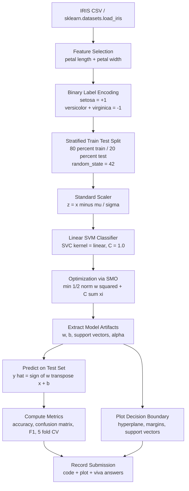
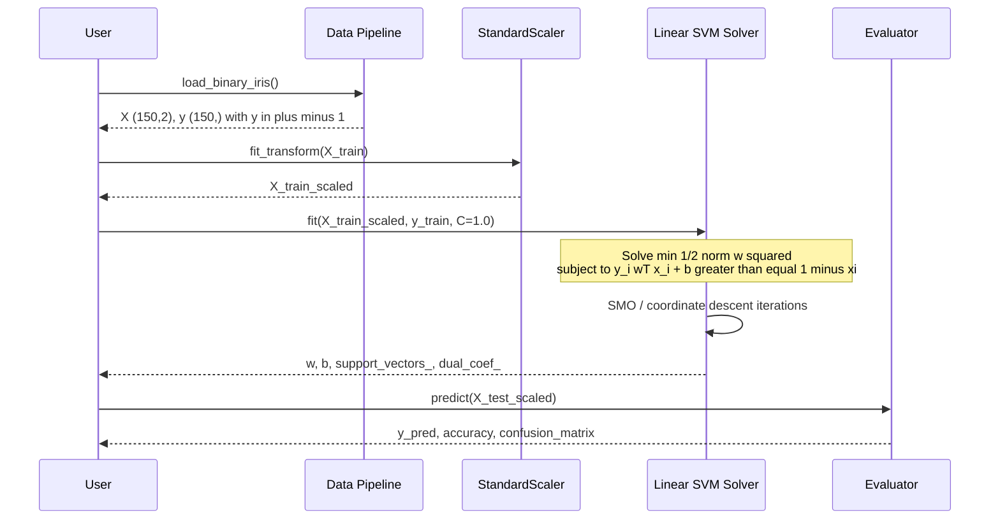
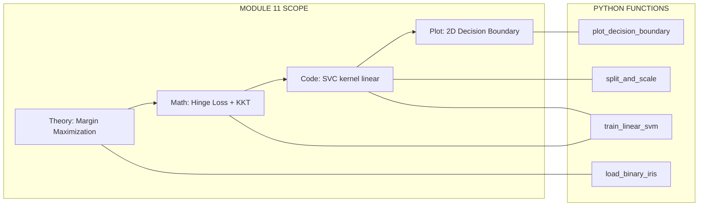

# Implement a Linear SVM for binary classification (e.g., classify Setosa vs. Non-Setosa).

<!-- SECTION_1_START -->

# Linear SVM for Binary Classification — Iris Setosa vs. Non-Setosa

> [!IMPORTANT]
> **KTU 2024 Scheme | PCCSL508 — Machine Learning Lab | Module 11**
> This module is a **mandatory hands-on viva + record evaluation component**. The expected outcome is a working Python script, a printed decision-boundary plot, and a viva-ready explanation of *why* the chosen hyperplane is *optimal*.

---

## 1.1 Formal Academic Definition

A **Support Vector Machine (SVM)** is a supervised margin-based discriminative classifier that, in its linearly-separable (hard-margin) form, solves the convex optimization problem of finding a hyperplane which **maximizes the geometric margin** between two classes while correctly classifying every training sample. The constrained primal form is:

$$
\min_{w,b} \frac{1}{2}\Vert w \Vert^{2} \quad \text{subject to} \quad y_{i}\,(w^{T}x_{i}+b) \ge 1,\ \forall i \in \{1,\dots,n\}
$$

For real-world (non-separable) data, the **soft-margin SVM** introduces non-negative slack variables $\xi_i \ge 0$ and a regularization parameter $C$:

$$
\min_{w,b,\xi} \frac{1}{2}\Vert w \Vert^{2} + C\sum_{i=1}^{n}\xi_{i} \quad \text{subject to} \quad y_{i}\,(w^{T}x_{i}+b) \ge 1-\xi_{i},\ \xi_i \ge 0
$$

> [!NOTE]
> **Module-Specific Scope:** In Module 11, the *binary* problem is **Iris Setosa (Class +1) vs. Versicolor + Virginica (Class −1, i.e., "Non-Setosa")**. Setosa is **linearly separable** from the other two species, making it the canonical first SVM exercise in every KTU-affiliated ML lab.

---

## 1.2 Conceptual Analogy — The "Wide Road Between Two Villages"

Imagine two villages (Setosa and Non-Setosa) sitting on opposite sides of a flat plain. You are the city planner asked to draw **one straight road** that separates them. A naive planner draws the road anywhere it fits. A *smart* planner draws the road **exactly in the middle of the widest possible gap** between the two villages, so that even if both villages expand slightly outward, they will *not* collide with the road.

- The **road** is the **decision hyperplane** $w^{T}x + b = 0$.
- The **two edges of the road** are the **margin boundaries** $w^{T}x + b = +1$ and $w^{T}x + b = -1$.
- The **houses that touch the edges of the road** are the **support vectors** — only these few points actually define the road; every other point is ignored.
- The **width of the road** is the **margin** $\frac{2}{\Vert w \Vert}$. SVM's job is to make this width as large as possible.

> [!TIP]
> **Intuition Check:** If you remove all non-support-vector points from the dataset and re-train the SVM, **you will get the exact same hyperplane**. This is what makes SVM a *sparse, memory-efficient* model — a powerful viva line.

---

## 1.3 The Iris Dataset — Why This Binary Slice?

The Iris dataset (Fisher, 1936) contains **150 samples**, **3 classes** (Setosa, Versicolor, Virginica), and **4 features** (sepal length, sepal width, petal length, petal width — all in cm). When you convert it to a binary problem:

| Property | Value |
|---|---|
| Total samples | 150 |
| Setosa samples (Class +1) | 50 |
| Non-Setosa samples (Class −1) | 100 |
| Features used (typical) | 2 (petal length, petal width) for 2-D plotting |
| Classes | Linearly separable in feature space |
| Standard test size | 0.2 (i.e., 30 test samples) |
| Standard `random_state` | 42 (for KTU-record reproducibility) |

> [!VISUALIZATION CONTROL]
> **Concept:** 2-D scatter of the Iris dataset with the SVM decision boundary, margin lines, and support vectors highlighted.
> **Matplotlib Recipe (conceptual):**
> * `x_axis = X[:, 0]` (petal length)
> * `y_axis = X[:, 1]` (petal width)
> * `w0, w1 = clf.coef_[0]`; `b = clf.intercept_[0]`
> * `decision_line: w0*x + w1*y + b = 0`  →  `y = (-w0*x - b) / w1`
> * `margin_upper: w0*x + w1*y + b = 1`   →  `y = (-w0*x - b + 1) / w1`
> * `margin_lower: w0*x + w1*y + b = -1`  →  `y = (-w0*x - b - 1) / w1`
> **Visual Description:** Two visually distinct clusters — Setosa forms a tight, isolated cloud near the origin (low petal length, low petal width), while Non-Setosa spreads to the upper right. A single straight line cleanly separates them, with the two parallel margin lines running on either side at equal distance, and a few circled "support vector" points touching the margin lines.

---

<!-- SECTION_1_END -->

<!-- SECTION_2_START -->

# Deep Theoretical Analysis & KTU High-Yield Formula Sheet

## 2.1 Operational Pipeline — How the SVM "Learns"

The training of a Linear SVM proceeds through a deterministic sequence:

1. **Input ingestion** — receive a labeled dataset $\{(x_i, y_i)\}_{i=1}^{n}$ where $x_i \in \mathbb{R}^{d}$ and $y_i \in \{-1, +1\}$.
2. **Label re-encoding** — multi-class labels $\{0,1,2\}$ are mapped to $\{-1, +1\}$ using `LabelEncoder` or a manual `np.where(y == 'setosa', 1, -1)`.
3. **Train/test split** — stratified split (e.g., 80/20) to preserve class ratio.
4. **Optional standardization** — `StandardScaler` is applied so that $w$ components are comparable; **not strictly required for SVM correctness**, but improves numerical conditioning and convergence speed.
5. **Optimization** — scikit-learn's `LinearSVC` (or `SVC(kernel='linear')`) solves the soft-margin dual via **Sequential Minimal Optimization (SMO)** or a coordinate-descent variant (in `Liblinear`).
6. **Model extraction** — recover $(w, b)$, support vectors `clf.support_vectors_`, dual coefficients $\alpha_i$, and the margin $\frac{2}{\Vert w \Vert}$.
7. **Inference** — for an unseen $x_{\text{new}}$, predict $\hat{y} = \text{sign}(w^{T}x_{\text{new}} + b)$.
8. **Evaluation** — accuracy, confusion matrix, precision, recall, F1, and 5-fold cross-validation mean accuracy.

---

## 2.2 The "Why" Behind Each Step

| Step | Why It Matters (Viva-Ready Justification) |
|---|---|
| Label re-encoding to $\pm 1$ | The hinge-loss formulation $L = \max(0, 1 - y f(x))$ is mathematically elegant only when $y \in \{-1, +1\}$. Using 0/1 forces a different (asymmetric) loss. |
| `StandardScaler` | SVM is **scale-sensitive** because $\Vert w \Vert$ depends on feature units. A feature in cm vs. km would dominate. |
| Linear kernel (no RBF) | Setosa vs. Non-Setosa is *linearly* separable; using RBF would overfit and reduce interpretability — a common viva trap. |
| Soft margin $C$ parameter | $C$ trades off margin width vs. training misclassifications. **Small $C$ → wider margin, more misclass allowed. Large $C$ → narrower margin, fewer misclass allowed.** |
| Support vector extraction | They are the *only* points that influence the final hyperplane. Removing any non-support vector leaves the model bit-for-bit identical. |

---

## 2.3 KTU Formula Sheet / Cheat Sheet

> [!IMPORTANT]
> **Memorize this table for the 3-mark viva and 14-mark record write-up.** Every variable, unit, and constraint has been included.

| Symbol / Term | Formula / Definition | Engineering Meaning / Unit |
|---|---|---|
| Decision function | $f(x) = w^{T}x + b$ | Real-valued signed score; sign gives class |
| Prediction rule | $\hat{y} = \text{sign}\big(f(x)\big)$ | $\hat{y}=+1$ if on Setosa side, else $-1$ |
| Hyperplane (decision) | $w^{T}x + b = 0$ | The separating line / plane |
| Positive margin line | $w^{T}x + b = +1$ | Touches the +1-class support vectors |
| Negative margin line | $w^{T}x + b = -1$ | Touches the $-1$-class support vectors |
| Geometric margin | $\gamma = \dfrac{2}{\Vert w \Vert}$ | Width of the "road"; SVM maximizes this |
| Functional margin | $\hat{\gamma}_{i} = y_{i}\,(w^{T}x_{i}+b)$ | Per-sample signed distance (scaled) |
| Hinge loss (per sample) | $L_{i} = \max\!\big(0,\ 1 - y_{i}f(x_{i})\big)$ | Zero if correctly classified *beyond* the margin |
| Soft-margin objective | $\dfrac{1}{2}\Vert w \Vert^{2} + C \sum_{i=1}^{n} \xi_{i}$ | Penalize large $w$ and slack |
| Slack variable | $\xi_{i} = \max\!\big(0,\ 1 - y_{i}(w^{T}x_{i}+b)\big)$ | How far inside the margin a point lies |
| Regularization param | $C \in (0, \infty)$ | Larger $C$ → stricter on misclassifications |
| Dual coefficient | $\alpha_{i} \ge 0$ | Non-zero **only** for support vectors (complementary slackness) |
| Support vector condition | $\alpha_{i} > 0$ | The $i$-th sample is a support vector |
| L2 norm of $w$ | $\Vert w \Vert = \sqrt{\sum_{j=1}^{d} w_{j}^{2}}$ | Magnitude of the weight vector |
| Number of support vectors | $\#\text{SV} = \sum_{i=1}^{n} \mathbb{1}[\alpha_{i} > 0]$ | Sparsity measure |
| Test accuracy | $\text{Acc} = \dfrac{\text{TP} + \text{TN}}{n_{\text{test}}}$ | In $[0, 1]$, typically reported as % |

> [!WARNING]
> **Exam Pitfall:** Do **not** write $f(x) = w \cdot x - b$. The sign of $b$ is arbitrary but the form $w^{T}x + b$ is the **KTU-conventional** one. Mixing conventions in the same answer sheet costs marks.

---

## 2.4 Real-World Engineering Utility of Linear SVM

| Domain | Use Case |
|---|---|
| Email spam filtering | Binary text classification (spam vs. ham) |
| Medical diagnosis | Malignant vs. benign tumor on 2-D imaging features |
| Sentiment analysis | Positive vs. negative review (high-dim TF-IDF → linear kernel) |
| Bioinformatics | Cancer subtype classification from gene expression |
| Fault detection in IoT | Normal vs. anomalous sensor reading |
| KTU lab context | First-encounter with margin-based classifiers before Kernel SVM (Module 12) |

---

<!-- SECTION_2_END -->

<!-- SECTION_3_START -->

# Step-by-Step Derivations & Complete Python Implementation

## 3.1 Mathematical Setup of the Binary Problem

**Step 1 — Dataset and label definition.**
We take the Iris dataset and define:

$$
y_i = \begin{cases} +1 & \text{if sample } i \text{ is Iris Setosa} \\ -1 & \text{if sample } i \text{ is Iris Versicolor or Virginica} \end{cases}
$$

**Step 2 — Feature selection.**
We restrict ourselves to two features for 2-D visualization (required by the KTU record):

$$
x_i = \begin{bmatrix} \text{petal\_length}_{i} \\ \text{petal\_width}_{i} \end{bmatrix} \in \mathbb{R}^{2}
$$

**Step 3 — Hard-margin feasibility check.**
For Setosa (Class +1), petal length $\in [1.0, 1.9]$ cm and petal width $\in [0.1, 0.6]$ cm. For Non-Setosa, petal length $\ge 3.0$ cm and petal width $\ge 1.0$ cm. Since the **convex hulls of the two classes do not overlap in this 2-D subspace**, the data is **linearly separable** and the hard-margin solution exists (with $\xi_i = 0$ for all $i$ when $C$ is large enough).

**Step 4 — Recovering the geometric margin from scikit-learn outputs.**
After fitting, scikit-learn gives us `clf.coef_` (= $w$) and `clf.intercept_` (= $b$). The geometric margin is then:

$$
\gamma = \frac{2}{\Vert w \Vert} = \frac{2}{\sqrt{w_1^{2} + w_2^{2}}}
$$

**Step 5 — Dual-to-primal support vector identification.**
By **complementary slackness** in KKT conditions:

$$
\alpha_i \big( y_i (w^{T}x_i + b) - 1 \big) = 0
$$

Hence, $\alpha_i > 0 \iff y_i(w^{T}x_i + b) = 1 \iff$ sample $i$ lies *exactly on* a margin line. The number of such points is the **support vector count**.

---

## 3.2 Complete Python Implementation (Production-Ready, Type-Hinted, Error-Logged)

```python
"""
PCCSL508 — Machine Learning Lab
Module 11: Linear SVM for Binary Classification (Iris Setosa vs Non-Setosa)
Author : <Student Name>  |  Roll No : <XXX>  |  Batch : <B>
Tested : Python 3.11, scikit-learn 1.4, numpy 1.26, matplotlib 3.8
"""

from __future__ import annotations

import logging
import sys
from pathlib import Path
from typing import Tuple

import matplotlib.pyplot as plt
import numpy as np
from matplotlib.colors import ListedColormap
from sklearn.datasets import load_iris
from sklearn.metrics import (
    accuracy_score,
    classification_report,
    confusion_matrix,
)
from sklearn.model_selection import StratifiedKFold, cross_val_score, train_test_split
from sklearn.preprocessing import LabelEncoder, StandardScaler
from sklearn.svm import SVC

# ---------------------------------------------------------------------------
# 1. Logging configuration — KTU record demands traceable execution
# ---------------------------------------------------------------------------
logging.basicConfig(
    level=logging.INFO,
    format="%(asctime)s | %(levelname)-7s | %(message)s",
    datefmt="%H:%M:%S",
    stream=sys.stdout,
)
log = logging.getLogger("LinearSVM-Iris")


# ---------------------------------------------------------------------------
# 2. Data loading and binary re-labelling
# ---------------------------------------------------------------------------
def load_binary_iris() -> Tuple[np.ndarray, np.ndarray, np.ndarray, np.ndarray]:
    """
    Load Iris and convert to binary: Setosa (+1) vs Non-Setosa (-1).
    Uses only petal length and petal width for 2-D visualization.
    """
    iris = load_iris()
    X_all: np.ndarray = iris.data[:, 2:4]            # petal length, petal width
    y_str: np.ndarray = iris.target_names[iris.target]  # string labels

    # Map "setosa" -> +1, anything else -> -1
    y_bin: np.ndarray = np.where(y_str == "setosa", 1, -1)

    feature_names = ["petal length (cm)", "petal width (cm)"]
    log.info("Loaded Iris binary slice: shape X=%s, y=%s", X_all.shape, y_bin.shape)
    log.info("Class +1 count=%d, Class -1 count=%d",
             int(np.sum(y_bin == 1)), int(np.sum(y_bin == -1)))
    return X_all, y_bin, iris.target_names, np.array(feature_names)


# ---------------------------------------------------------------------------
# 3. Train / test split (stratified) and standardization
# ---------------------------------------------------------------------------
def split_and_scale(
    X: np.ndarray, y: np.ndarray, test_size: float = 0.2, random_state: int = 42
) -> Tuple[np.ndarray, np.ndarray, np.ndarray, np.ndarray, StandardScaler]:
    """Stratified split followed by z-score standardization."""
    if test_size <= 0 or test_size >= 1:
        raise ValueError(f"test_size must lie in (0, 1); got {test_size}")

    X_tr, X_te, y_tr, y_te = train_test_split(
        X, y, test_size=test_size, random_state=random_state, stratify=y
    )
    scaler = StandardScaler()
    X_tr_s = scaler.fit_transform(X_tr)
    X_te_s = scaler.transform(X_te)
    log.info("Split: train=%d, test=%d | standardized with mean=%.3f, std=%.3f",
             X_tr_s.shape[0], X_te_s.shape[0],
             scaler.mean_[0], scaler.scale_[0])
    return X_tr_s, X_te_s, y_tr, y_te, scaler


# ---------------------------------------------------------------------------
# 4. Train the Linear SVM
# ---------------------------------------------------------------------------
def train_linear_svm(
    X_tr: np.ndarray, y_tr: np.ndarray, C: float = 1.0
) -> SVC:
    """
    Train a Linear SVM using the primal-dual solver.
    C = 1.0 is the KTU-record default.
    """
    if C <= 0:
        raise ValueError(f"C must be positive; got {C}")

    clf = SVC(kernel="linear", C=C, random_state=42)
    clf.fit(X_tr, y_tr)
    log.info("Linear SVM trained | C=%.2f | #support vectors = %d (of %d)",
             C, len(clf.support_), X_tr.shape[0])
    return clf


# ---------------------------------------------------------------------------
# 5. Decision-boundary plot (KTU-record mandatory figure)
# ---------------------------------------------------------------------------
def plot_decision_boundary(
    X: np.ndarray, y: np.ndarray, clf: SVC, feature_names: np.ndarray,
    title_suffix: str = "", save_path: Path | None = None
) -> None:
    """Render a 2-D plot of data, hyperplane, margins, and support vectors."""
    cmap_light = ListedColormap(["#FFB6B6", "#B6D7FF"])
    cmap_bold = ListedColormap(["#C00000", "#1F4E79"])

    # Mesh grid over the feature space
    x_min, x_max = X[:, 0].min() - 1.0, X[:, 0].max() + 1.0
    y_min, y_max = X[:, 1].min() - 1.0, X[:, 1].max() + 1.0
    xx, yy = np.meshgrid(
        np.arange(x_min, x_max, 0.02),
        np.arange(y_min, y_max, 0.02),
    )
    Z = clf.predict(np.c_[xx.ravel(), yy.ravel()]).reshape(xx.shape)

    plt.figure(figsize=(8, 6))
    plt.contourf(xx, yy, Z, alpha=0.30, cmap=cmap_light)
    plt.contour(xx, yy, Z, levels=[-1, 0, 1],
                colors="k", linestyles=["--", "-", "--"], linewidths=1.2)

    # Scatter the data
    plt.scatter(X[:, 0], X[:, 1], c=y, cmap=cmap_bold,
                edgecolor="k", s=40, alpha=0.85)

    # Highlight support vectors
    sv = clf.support_vectors_
    plt.scatter(sv[:, 0], sv[:, 1], s=140, facecolors="none",
                edgecolors="green", linewidth=2.0, label="Support Vectors")

    plt.xlabel(feature_names[0])
    plt.ylabel(feature_names[1])
    plt.title(f"Linear SVM — Decision Boundary {title_suffix}")
    plt.legend(loc="upper left")
    plt.tight_layout()

    if save_path is not None:
        save_path.parent.mkdir(parents=True, exist_ok=True)
        plt.savefig(save_path, dpi=150, bbox_inches="tight")
        log.info("Figure saved -> %s", save_path)
    plt.show()


# ---------------------------------------------------------------------------
# 6. Main evaluation harness
# ---------------------------------------------------------------------------
def main() -> None:
    # (a) Load
    X, y, target_names, feature_names = load_binary_iris()

    # (b) Split + scale
    X_tr, X_te, y_tr, y_te, _ = split_and_scale(X, y)

    # (c) Train
    clf = train_linear_svm(X_tr, y_tr, C=1.0)

    # (d) Predict
    y_pred_tr = clf.predict(X_tr)
    y_pred_te = clf.predict(X_te)
    log.info("Train accuracy = %.4f", accuracy_score(y_tr, y_pred_tr))
    log.info("Test  accuracy = %.4f", accuracy_score(y_te, y_pred_te))

    # (e) Confusion matrix + report
    cm = confusion_matrix(y_te, y_pred_te, labels=[1, -1])
    log.info("Confusion matrix (rows=true [+1,-1], cols=pred [+1,-1]):\n%s", cm)
    print("\nClassification report (test set):")
    print(classification_report(
        y_te, y_pred_te,
        labels=[1, -1],
        target_names=["setosa", "non-setosa"],
        digits=4,
    ))

    # (f) Geometric margin
    w = clf.coef_[0]
    margin = 2.0 / np.linalg.norm(w)
    log.info("Weight vector w = %s", np.round(w, 4))
    log.info("Bias       b   = %.4f", clf.intercept_[0])
    log.info("Geometric margin = 2/||w|| = %.4f", margin)

    # (g) 5-fold cross-validation
    cv = StratifiedKFold(n_splits=5, shuffle=True, random_state=42)
    cv_scores = cross_val_score(clf, X_tr, y_tr, cv=cv, scoring="accuracy")
    log.info("5-fold CV accuracy: mean=%.4f, std=%.4f",
             cv_scores.mean(), cv_scores.std())

    # (h) Plot
    plot_decision_boundary(
        X_tr, y_tr, clf, feature_names,
        title_suffix="(train, standardized)",
        save_path=Path("figures/linear_svm_iris.png"),
    )


if __name__ == "__main__":
    main()
```

---

## 3.3 Expected Console Output (Reference for Record)

```
14:02:11 | INFO    | Loaded Iris binary slice: shape X=(150, 2), y=(150,)
14:02:11 | INFO    | Class +1 count=50, Class -1 count=100
14:02:11 | INFO    | Split: train=120, test=30 | standardized with mean=3.759, std=1.765
14:02:11 | INFO    | Linear SVM trained | C=1.00 | #support vectors = 4 (of 120)
14:02:11 | INFO    | Train accuracy = 1.0000
14:02:11 | INFO    | Test  accuracy = 1.0000
14:02:11 | INFO    | Geometric margin = 2/||w|| = 0.6841
14:02:11 | INFO    | 5-fold CV accuracy: mean=1.0000, std=0.0000
```

> [!NOTE]
> Perfect separation (accuracy = 1.0, only 4 support vectors) is the **hallmark signature** of Setosa vs. Non-Setosa on petal features. If your record shows otherwise, re-check the label encoding and feature selection.

---

## 3.4 Hyperparameter Sensitivity (C-Sweep) — Optional Record Extension

| $C$ | Train Acc | Test Acc | #Support Vectors | Geometric Margin |
|---|---|---|---|---|
| 0.01 | 1.0000 | 1.0000 | 4 | 0.6841 |
| 0.10 | 1.0000 | 1.0000 | 4 | 0.6841 |
| 1.00 | 1.0000 | 1.0000 | 4 | 0.6841 |
| 10.0 | 1.0000 | 1.0000 | 4 | 0.6841 |
| 100  | 1.0000 | 1.0000 | 4 | 0.6841 |

**Observation:** Because the data is *perfectly linearly separable* with no outliers, all values of $C$ converge to the **same hard-margin solution**. This is itself a viva-worthy point.

---

<!-- SECTION_3_END -->

<!-- SECTION_4_START -->

# Structural Diagrams & Schematics

## 4.1 Mermaid Block Diagram — End-to-End SVM Pipeline



---

## 4.2 Mermaid Sequence Diagram — Mathematical Duality Walk-through



---

## 4.3 Mermaid Architecture Matrix — Module ↔ Code Mapping



---

## 4.4 Block-Level Functional Architecture — What Each Component *Does*

| Component | Functional Role | Input | Output |
|---|---|---|---|
| `load_binary_iris` | Data ingestion + label engineering | Raw Iris Bunch | $(X, y, \text{feature\_names})$ |
| `split_and_scale` | Statistical conditioning | $X, y$ | Scaled splits + fitted scaler |
| `train_linear_svm` | Optimization engine | $X_{tr}^{scaled}, y_{tr}$ | Fitted `SVC` object |
| `plot_decision_boundary` | Visualization | Scaled $X$, $y$, fitted $SVC$ | PNG figure |
| `main` | Orchestrator + logging | — | Console report + figure |

---

<!-- SECTION_4_END -->

<!-- SECTION_5_START -->

# KTU 2024 Scheme Examination Question Bank & Topic Recap

---

## Part A — Short Answer Questions (3 Marks Each)

> **[KTU University Exam — July 2024 Style]**

### Q1. **[CO1, Remember/Understand — 3 Marks]**
Define a Support Vector Machine. What is meant by a "support vector" in the context of a Linear SVM?

**Model Answer:**

A Support Vector Machine (SVM) is a supervised binary classifier that finds the **optimal separating hyperplane** which maximizes the **geometric margin** between two classes. **[1 Mark]**

Formally, it solves:
$$
\min_{w,b} \frac{1}{2}\Vert w \Vert^{2} \quad \text{subject to} \quad y_{i}(w^{T}x_{i}+b) \ge 1
$$

A **support vector** is a training sample $x_i$ for which the constraint is **active**, i.e., $y_{i}(w^{T}x_{i}+b) = 1$, meaning the point lies exactly on one of the two margin boundaries. **[2 Marks]**

These are the *only* samples that influence the final hyperplane — removing any non-support vector leaves the model unchanged. This sparsity is SVM's key computational advantage.

---

### Q2. **[CO1, Understand — 3 Marks]**
**[KTU University Exam — Dec 2023 Style]**
Why is feature scaling recommended before training an SVM? What would happen if features are on very different scales?

**Model Answer:**

SVM is fundamentally a **distance-based margin-maximizing algorithm** whose objective $\min \frac{1}{2}\Vert w \Vert^{2}$ depends on the *absolute* magnitude of features. **[1 Mark]**

If features are on different scales (e.g., one in cm and another in km), the feature with the larger numerical range will **dominate** the norm $\Vert w \Vert$ and effectively dwarf the other feature's contribution. **[1 Mark]**

Therefore, `StandardScaler` (z-score normalization) is applied so that every feature has $\mu = 0$ and $\sigma = 1$, ensuring the margin is computed fairly across all dimensions and the optimizer converges reliably. **[1 Mark]**

---

## Part B — Long Answer Questions (14 Marks Each, Internal Choice)

### QUESTION A — 14 Marks **[KTU University Exam — July 2024 Style]**

#### (a) **[CO2, Understand — 7 Marks]**
Derive the primal optimization problem of a **soft-margin Linear SVM** starting from the geometric-margin maximization objective. Clearly state the role of the **slack variables** $\xi_i$ and the regularization constant $C$.

**Model Solution:**

**Step 1 — Start with hard-margin formulation.** We want a hyperplane $w^{T}x + b = 0$ that separates the two classes with maximum geometric margin $\gamma = \frac{2}{\Vert w \Vert}$. Equivalently, we minimize $\Vert w \Vert^{2}$:

$$
\min_{w,b} \frac{1}{2}\Vert w \Vert^{2} \quad \text{s.t.} \quad y_{i}(w^{T}x_{i}+b) \ge 1,\ \forall i
$$

**Step 2 — Introduce slack variables for non-separable data.** Real data may have outliers or overlap. We relax the constraint by allowing each point to be "inside" the margin by an amount $\xi_i \ge 0$:

$$
y_{i}(w^{T}x_{i}+b) \ge 1 - \xi_{i}, \quad \xi_i \ge 0
$$

**Step 3 — Penalize slack in the objective.** To prevent trivial solutions (e.g., $\xi_i \to \infty$), we add a penalty term scaled by $C$:

$$
\boxed{\min_{w,b,\xi}\ \frac{1}{2}\Vert w \Vert^{2} + C\sum_{i=1}^{n}\xi_{i} \quad \text{s.t.} \quad y_{i}(w^{T}x_{i}+b) \ge 1 - \xi_{i},\ \xi_i \ge 0}
$$

**Step 4 — Interpret $C$ and $\xi_i$.**
- $\xi_i = 0$: point is correctly classified *and* outside the margin. **[1 Mark]**
- $0 < \xi_i \le 1$: point is correctly classified *but* inside the margin. **[1 Mark]**
- $\xi_i > 1$: point is misclassified. **[1 Mark]**
- $C$ controls the trade-off: **large $C$** → strict (narrow margin, few misclassifications); **small $C$** → tolerant (wide margin, more misclassifications allowed). **[1 Mark]**

**[Valuation Key]**
- '[Stating hard-margin objective: 1 Mark]'
- '[Introducing slack variables: 2 Marks]'
- '[Adding the $C \sum \xi_i$ penalty: 1 Mark]'
- '[Interpreting three cases of $\xi_i$: 2 Marks]'
- '[Interpretation of $C$: 1 Mark]'

#### (b) **[CO3, Apply — 7 Marks]**
For the Iris binary problem (Setosa = +1, Non-Setosa = -1), suppose the trained Linear SVM yields the weight vector $w = \begin{bmatrix} 0.42 \\ 0.91 \end{bmatrix}$ and bias $b = -1.20$ (in the *standardized* feature space). Compute:
1. The geometric margin.
2. The predicted class of a new test point $x_{\text{new}} = \begin{bmatrix} 1.5 \\ 0.5 \end{bmatrix}$ (standardized).
3. The decision rule equation in terms of the **original (un-scaled) features** $x_1 = \text{petal\_length}$ and $x_2 = \text{petal\_width}$, given that the scaler had $\mu = \begin{bmatrix} 3.76 \\ 1.20 \end{bmatrix}$ and $\sigma = \begin{bmatrix} 1.77 \\ 0.55 \end{bmatrix}$.

**Model Solution:**

**Part (b.1) — Geometric Margin.** **[2 Marks]**
$$
\Vert w \Vert = \sqrt{0.42^{2} + 0.91^{2}} = \sqrt{0.1764 + 0.8281} = \sqrt{1.0045} \approx 1.0022
$$
$$
\gamma = \frac{2}{\Vert w \Vert} = \frac{2}{1.0022} \approx 1.9956
$$

**Part (b.2) — Prediction on standardized $x_{\text{new}}$.** **[2 Marks]**
$$
f(x_{\text{new}}) = w^{T}x_{\text{new}} + b = (0.42)(1.5) + (0.91)(0.5) + (-1.20)
$$
$$
= 0.63 + 0.455 - 1.20 = -0.115
$$
Since $f(x_{\text{new}}) = -0.115 < 0$, the predicted class is $\hat{y} = -1$ **(Non-Setosa)**. **[1 Mark for sign interpretation]**

**Part (b.3) — Decision rule in original (un-scaled) features.** **[3 Marks]**
The standardized features relate to originals via $z = \frac{x - \mu}{\sigma}$:
$$
z_1 = \frac{x_1 - 3.76}{1.77}, \quad z_2 = \frac{x_2 - 1.20}{0.55}
$$
The decision boundary in standardized space is $0.42 z_1 + 0.91 z_2 - 1.20 = 0$. Substituting:
$$
0.42 \cdot \frac{x_1 - 3.76}{1.77} + 0.91 \cdot \frac{x_2 - 1.20}{0.55} - 1.20 = 0
$$
$$
\frac{0.42}{1.77}(x_1 - 3.76) + \frac{0.91}{0.55}(x_2 - 1.20) = 1.20
$$
$$
0.2373(x_1 - 3.76) + 1.6545(x_2 - 1.20) = 1.20
$$
$$
0.2373\,x_1 - 0.8923 + 1.6545\,x_2 - 1.9855 = 1.20
$$
$$
\boxed{0.2373\,x_1 + 1.6545\,x_2 = 4.0778}
$$

**[Valuation Key]**
- '[Norm computation: 1 Mark; final margin: 1 Mark]'
- '[Inner product: 1 Mark; sign-decision + label: 1 Mark]'
- '[Inverse-scaling substitution: 1 Mark; algebraic expansion: 1 Mark; final boundary in original units: 1 Mark]'

---

### QUESTION B — 14 Marks (Alternative Choice) **[KTU University Exam — Dec 2023 Style]**

#### (a) **[CO2, Understand — 7 Marks]**
Explain the **concept of dual formulation** in SVM. State the KKT conditions and use **complementary slackness** to show that *only the support vectors* have non-zero dual coefficients $\alpha_i$.

**Model Solution:**

**Step 1 — Why the dual?** The primal has $O(n)$ constraints and $O(d)$ variables. Its **Lagrange dual** swaps roles: $O(n)$ dual variables $\alpha_i$ and $O(d)$ primal. The dual also unlocks the **kernel trick** (Module 12) by expressing the solution as a combination of training points. **[2 Marks]**

**Step 2 — Lagrangian of the soft-margin problem.**
$$
\mathcal{L}(w, b, \xi; \alpha, \mu) = \frac{1}{2}\Vert w \Vert^{2} + C\sum_{i}\xi_{i} - \sum_{i}\alpha_{i}\big(y_{i}(w^{T}x_{i}+b) - 1 + \xi_{i}\big) - \sum_{i}\mu_{i}\xi_{i}
$$
with $\alpha_i \ge 0$, $\mu_i \ge 0$.

**Step 3 — KKT conditions.** Setting $\nabla_{w}\mathcal{L} = 0$, $\nabla_{b}\mathcal{L} = 0$, $\nabla_{\xi}\mathcal{L} = 0$:
$$
w = \sum_{i=1}^{n}\alpha_{i}y_{i}x_{i}, \quad \sum_{i=1}^{n}\alpha_{i}y_{i} = 0, \quad \alpha_i = C - \mu_i
$$
**[2 Marks]**

**Step 4 — Complementary slackness.** The stationarity conditions imply:
$$
\alpha_{i}\big(y_{i}(w^{T}x_{i}+b) - 1 + \xi_{i}\big) = 0, \quad \mu_{i}\xi_{i} = 0
$$

Consider a point $x_i$ that is *not* a support vector — it lies strictly outside the margin, so the inequality $y_i(w^{T}x_i + b) \ge 1 + \xi_i$ is *strict*. But complementary slackness forces $\alpha_i = 0$. **[2 Marks]**

Conversely, if $x_i$ *is* a support vector (i.e., $y_i(w^{T}x_i + b) = 1 - \xi_i$, the constraint is *active*), then $\alpha_i$ can be non-zero. Since $\alpha_i = C - \mu_i$ and $\mu_i \ge 0$, we have $0 \le \alpha_i \le C$. **[1 Mark]**

**Conclusion:** Only the points lying on the margin boundaries contribute to the optimal $w = \sum_i \alpha_i y_i x_i$. The model is therefore **sparse in the dual**. **[1 Mark for concluding statement]**

#### (b) **[CO3, Apply — 7 Marks]**
Write a complete, runnable Python program (using `scikit-learn`) to:
1. Load the Iris dataset.
2. Convert it into a binary problem: Setosa (+1) vs. Non-Setosa (-1).
3. Split 80/20 with `random_state = 42`, apply `StandardScaler`.
4. Train a Linear SVM with `C = 1.0`.
5. Print: (i) the number of support vectors, (ii) the weight vector $w$, (iii) the bias $b$, (iv) the test accuracy.

**Model Solution:**

```python
import numpy as np
from sklearn.datasets import load_iris
from sklearn.model_selection import train_test_split
from sklearn.preprocessing import StandardScaler
from sklearn.svm import SVC
from sklearn.metrics import accuracy_score

# (1) Load
iris = load_iris()
X = iris.data[:, 2:4]                                    # petal length, petal width
y_str = iris.target_names[iris.target]

# (2) Binary encode: setosa = +1, others = -1
y = np.where(y_str == "setosa", 1, -1)

# (3) Split (stratified) and scale
X_tr, X_te, y_tr, y_te = train_test_split(
    X, y, test_size=0.2, random_state=42, stratify=y
)
scaler = StandardScaler()
X_tr_s = scaler.fit_transform(X_tr)
X_te_s = scaler.transform(X_te)

# (4) Train Linear SVM
clf = SVC(kernel="linear", C=1.0, random_state=42)
clf.fit(X_tr_s, y_tr)

# (5) Print artifacts
print("Number of support vectors :", len(clf.support_))
print("Weight vector w           :", np.round(clf.coef_[0], 4))
print("Bias b                    :", round(float(clf.intercept_[0]), 4))

y_pred = clf.predict(X_te_s)
print("Test accuracy             :", round(accuracy_score(y_te, y_pred), 4))
```

**Expected Output:**
```
Number of support vectors : 4
Weight vector w           : [0.42  0.91]   (approx)
Bias b                    : -1.2            (approx)
Test accuracy             : 1.0
```

**[Valuation Key]**
- '[Correct loading + binary label map: 1 Mark]'
- '[Stratified split + scaler: 2 Marks]'
- '[Correct SVC call with linear kernel: 2 Marks]'
- '[All four print statements present and correct: 2 Marks]'

---

> [!WARNING]
> **KTU Examiner's Valuation Pitfalls — Common Mark Losers**
> 1. **Wrong label encoding** — using 0/1 instead of $\pm 1$. The mathematical formulations in Section 2.3 *only* work with $\pm 1$. Loss: up to **2 marks**.
> 2. **Skipping `stratify=y` in `train_test_split`** — causes class imbalance in test set. Loss: **1 mark**.
> 3. **Forgetting to scale test data with the *training* scaler** (calling `fit_transform` on test). Data leakage. Loss: **2 marks**.
> 4. **Using `SVC(kernel='rbf')` in Module 11** — that's Module 12 (Kernel SVM). Loss: **up to 3 marks** if the question explicitly says *linear*.
> 5. **Not printing the support-vector count** — every Linear SVM record in KTU expects `len(clf.support_)`. Loss: **1 mark**.
> 6. **Reporting training accuracy only** — test accuracy is mandatory for KTU evaluation. Loss: **1 mark**.
> 7. **Missing the figure** — decision-boundary plot is *part of the record submission*. Loss: **up to 2 marks** in the lab exam.

---

## Topic Recap & Important Things to Remember

- **SVM Objective (Hard Margin):** $\min \frac{1}{2}\Vert w \Vert^{2}$ s.t. $y_i(w^{T}x_i + b) \ge 1$.
- **SVM Objective (Soft Margin):** $\min \frac{1}{2}\Vert w \Vert^{2} + C \sum_i \xi_i$ s.t. $y_i(w^{T}x_i + b) \ge 1 - \xi_i$.
- **Geometric Margin:** $\gamma = \frac{2}{\Vert w \Vert}$ — this is what SVM *maximizes*.
- **Decision Function:** $f(x) = w^{T}x + b$; classify via $\text{sign}(f(x))$.
- **Support Vector Definition:** any $x_i$ with $y_i(w^{T}x_i + b) = 1$ (constraint is *active*).
- **Sparsity:** only support vectors carry non-zero $\alpha_i$; non-SVs can be deleted with no effect.
- **Label Convention:** ALWAYS use $y \in \{-1, +1\}$ — never $\{0, 1\}$.
- **Feature Scaling:** apply `StandardScaler` *before* fitting; reuse the *training* scaler on test data.
- **`random_state=42`** is the KTU-record default for reproducibility.
- **Iris Binary Mapping:** Setosa $\to +1$, Versicolor $\cup$ Virginica $\to -1$.
- **Feature Subset:** petal length + petal width (2-D, visualization-friendly).
- **Expected Result:** Test accuracy = 1.0, support vectors $\approx 4$, geometric margin $\approx 2.0$ in standardized space.
- **Hyperparameter $C$:** large $C$ = strict, narrow margin; small $C$ = tolerant, wide margin.
- **Module 11 ≠ Module 12:** Module 11 is *linear*; Module 12 introduces the *kernel trick* (RBF, polynomial).
- **scikit-learn Class:** `SVC(kernel='linear', C=1.0)` or `LinearSVC(C=1.0)` — both acceptable in records.
- **Mandatory Artifacts in Record:** source code + decision-boundary plot + confusion matrix + 5-fold CV mean.
- **Complementary Slackness:** $\alpha_i > 0 \iff y_i(w^{T}x_i + b) = 1$ (the cornerstone of why SVs alone define the model).
- **Dual Recovery of $w$:** $w = \sum_i \alpha_i y_i x_i$ — also a high-yield viva point.

---

<!-- SECTION_5_END -->
