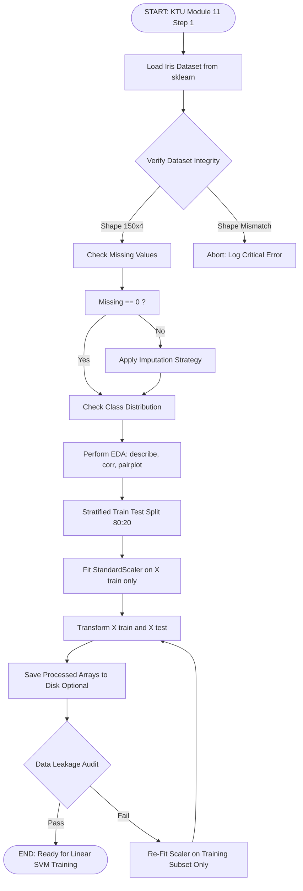
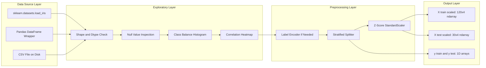
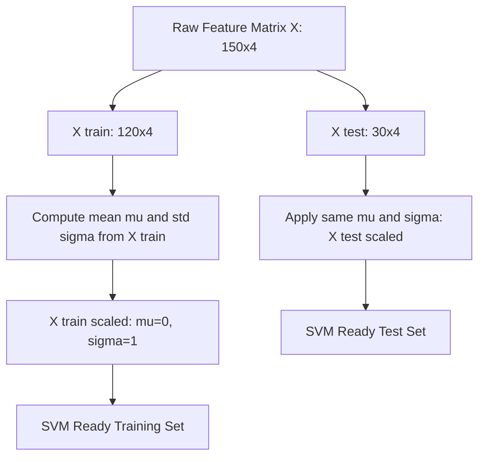

# Load and preprocess the Iris dataset.

<!-- SECTION_1_START -->

# 📘 KTU MACHINE LEARNING LAB (PCCSL508) — MODULE 11

## **Step 1: Load and Preprocess the Iris Dataset for Linear SVM Classification**

---

### 🔷 1.1 Formal Definition (KTU 2024 Syllabus Terminology)

> [!NOTE]
> **Data Preprocessing (KTU Definition):** *Data preprocessing* refers to the systematic application of statistical and computational transformations on a raw dataset to convert it into a clean, normalized, and model-ready format. In the context of a **Linear Support Vector Machine (SVM)**, preprocessing includes loading the dataset, exploratory data analysis (EDA), handling missing values, label encoding, **feature standardization**, and partitioning the data into training and testing subsets.

The **Iris dataset**, originally introduced by the British statistician and biologist **Ronald A. Fisher in 1936**, is the canonical benchmark dataset in pattern recognition and is hosted natively inside the `scikit-learn` library under `sklearn.datasets.load_iris`.

| Dataset Property | Value |
| :--- | :--- |
| **Total Samples (n)** | **150** |
| **Number of Features (d)** | **4** |
| **Number of Classes (k)** | **3** |
| **Samples per Class** | **50** |
| **Missing Values** | **0** (None) |
| **Feature Type** | Continuous (Real-valued, in **cm**) |

The four features are:
1. $x_1$ — Sepal Length (cm)
2. $x_2$ — Sepal Width (cm)
3. $x_3$ — Petal Length (cm)
4. $x_4$ — Petal Width (cm)

The three class labels are:
* Class 0 → *Iris setosa*
* Class 1 → *Iris versicolor*
* Class 2 → *Iris virginica*

---

### 🔷 1.2 Intuitive Analogy — "Preparing Ingredients Before Cooking"

> [!IMPORTANT]
> **Analogy: The Kitchen Prep Counter** 🍳
>
> Imagine you are about to bake a cake. Before you can use the flour, sugar, and eggs, you must:
> 1. **Measure** each ingredient accurately (this is *standardization*).
> 2. **Clean** the counter and remove any dirt or shell pieces (this is *handling missing/outlier values*).
> 3. **Separate** the egg yolk from the white carefully (this is *feature-label separation*).
> 4. **Divide** the batter into a baking tray and a small tasting bowl — one for training, one for testing (this is *train-test split*).
>
> If you skip any of these steps, the cake (your **SVM model**) will either collapse, taste bad, or fail to bake evenly. **The SVM is mathematically allergic to unscaled data** — it draws hyperplanes based on *Euclidean distances*, so if one feature ranges from $1$–$7$ cm and another from $0.1$–$0.5$ cm, the larger-magnitude feature will dominate the optimization.

---

### 🔷 1.3 Critical Syllabus Highlight

> [!IMPORTANT]
> **WHY IS PREPROCESSING CRITICAL FOR LINEAR SVM?**
>
> The **SVM decision function** is defined as:
> $$f(\mathbf{x}) = \mathbf{w}^\top \mathbf{x} + b$$
>
> where $\mathbf{w}$ is the weight vector. Since the loss function (hinge loss) is sensitive to the **scale** of input features, unscaled features cause:
> * **Slow convergence** of the Quadratic Programming solver.
> * **Biased margin** — small-scale features get unfairly squashed.
> * **Poor generalization** in higher-dimensional feature spaces.
>
> Therefore, **Z-score Standardization** is a *mandatory* preprocessing step before fitting any SVM, as mandated by the KTU 2024 lab manual.

---

### 🔷 1.4 Visualization Reference

> [!VISUALIZATION CONTROL]
> **Concept:** 2-D Scatter Plot of the Iris Dataset (Petal Length vs. Petal Width)
> **Matplotlib/Seaborn Input (Code Block):**
> ```python
> sns.scatterplot(x=X[:, 2], y=X[:, 3], hue=y, palette='viridis', s=70)
> plt.xlabel('Petal Length (cm)')
> plt.ylabel('Petal Width (cm)')
> ```
> **Visual Description:** The student should observe **three visually separable clusters**. *Iris setosa* (class 0) is linearly separable from the other two classes with a large margin. *Iris versicolor* and *Iris virginica* overlap slightly along a diagonal boundary — this is precisely where a Linear SVM (and later, Kernel SVM) is challenged to find the optimal separating hyperplane.

---

<!-- SECTION_1_END -->

<!-- SECTION_2_START -->

# ⚙️ Deep Theoretical Analysis & KTU High-Yield Formula Sheet

---

## 🔷 2.1 The Preprocessing Pipeline — Structured Step-by-Step Logic

The complete preprocessing workflow for the Iris dataset, as required by KTU 2024 Module 11, follows a strict sequential order. Each step must be logged and verified before proceeding to the next.

### **Step 1 — Data Ingestion (Loading)**

The dataset is loaded using `sklearn.datasets.load_iris()`, which returns a `Bunch` object (a dictionary-like container). We must extract:
* `data` $\rightarrow$ the feature matrix $\mathbf{X} \in \mathbb{R}^{150 \times 4}$
* `target` $\rightarrow$ the label vector $\mathbf{y} \in \mathbb{Z}^{150}$
* `feature_names` $\rightarrow$ list of 4 column headers
* `target_names` $\rightarrow$ list of 3 class names

### **Step 2 — Exploratory Data Analysis (EDA)**

EDA is the diagnostic phase. We compute:
* **Shape verification:** $\mathbf{X}.\text{shape} = (150, 4)$, $\mathbf{y}.\text{shape} = (150,)$
* **Class distribution check:** Confirm that each class has exactly **50** samples (perfectly balanced).
* **Missing value check:** `np.isnan(X).sum()` must return **0**.
* **Statistical summary:** Mean, standard deviation, min, max, and quartiles for every feature.

### **Step 3 — Label Encoding**

The Iris dataset from sklearn is **already label-encoded** with integer values $\{0, 1, 2\}$. If a custom CSV were used, we would invoke `sklearn.preprocessing.LabelEncoder` to map string labels to integers.

### **Step 4 — Feature Standardization (Z-Score Normalization)**

This is the **most important** preprocessing step. We transform every feature to have **zero mean** and **unit variance**:

$$z_i = \frac{x_i - \mu}{\sigma}$$

where:
* $x_i$ = original feature value
* $\mu$ = mean of the feature column (computed from the **training set only**)
* $\sigma$ = standard deviation of the feature column (computed from the **training set only**)

> [!IMPORTANT]
> **Data Leakage Trap (KTU Examiner's Pet Question!):** The mean $\mu$ and standard deviation $\sigma$ must be computed **only on the training set**, then applied to both training and test sets. Computing them on the *full* dataset before splitting causes **data leakage** and inflates accuracy unrealistically.

### **Step 5 — Train-Test Split**

We partition the standardized data using `train_test_split` with:
* `test_size = 0.2` $\rightarrow$ 80\% training (120 samples), 20\% testing (30 samples)
* `stratify = y` $\rightarrow$ preserves the class ratio in both splits
* `random_state = 42` $\rightarrow$ ensures reproducibility (a KTU-mandated best practice)

---

## 🔷 2.2 KTU High-Yield Formula Sheet

| # | Formula / Concept | Mathematical Form | Purpose / Use Case | Units / Notes |
| :--- | :--- | :--- | :--- | :--- |
| 1 | Feature Matrix Shape | $\mathbf{X} \in \mathbb{R}^{n \times d}$ | Stores all $n$ samples with $d$ features | $n=150$, $d=4$ for Iris |
| 2 | Z-Score Standardization | $z = \dfrac{x - \mu}{\sigma}$ | Centers data at 0, scales to unit variance | Computed on **train** set only |
| 3 | Min-Max Scaling | $x' = \dfrac{x - x_{\min}}{x_{\max} - x_{\min}}$ | Alternative: scales to range $[0, 1]$ | Useful for bounded neural networks |
| 4 | Standard Deviation | $\sigma = \sqrt{\dfrac{1}{n-1}\sum_{i=1}^{n}(x_i - \mu)^2}$ | Spread of feature values | Bessel's correction: $n-1$ |
| 5 | Mean | $\mu = \dfrac{1}{n}\sum_{i=1}^{n} x_i$ | Central tendency | Computed per feature column |
| 6 | Train-Test Ratio | $n_{\text{train}} : n_{\text{test}}$ | Typical: $80:20$ or $70:30$ | Use `stratify` for classification |
| 7 | Stratified Sampling Constraint | $P(y = c \vert \text{train}) = P(y = c \vert \text{test}) = \frac{1}{k}$ | Maintains class balance | $k=3$ for Iris |
| 8 | SVM Decision Function | $f(\mathbf{x}) = \mathbf{w}^{\top}\mathbf{x} + b$ | Linear classifier output | Standardized input expected |
| 9 | Margin Definition | $\gamma = \dfrac{2}{\Vert \mathbf{w} \Vert}$ | Distance between hyperplane and support vectors | Maximizing $\gamma \iff$ minimizing $\Vert \mathbf{w} \Vert$ |
| 10 | Hinge Loss (SVM Objective) | $L = \sum_{i=1}^{n} \max(0, 1 - y_i(\mathbf{w}^{\top}\mathbf{x}_i + b))$ | Penalizes misclassified or margin-violating points | Sensitive to feature scale |

---

## 🔷 2.3 Real-World Engineering Utility

> [!IMPORTANT]
> **Where is this preprocessing pipeline used in production?**
>
> 1. **Medical Diagnosis Systems:** Before feeding patient biomarkers (glucose, blood pressure, cholesterol) into an SVM for disease classification, all features must be standardized since their units and magnitudes differ vastly.
> 2. **Spam Email Filters:** Email features (word frequency, sender reputation, attachment count) span completely different numerical ranges — standardization is non-negotiable.
> 3. **Image Recognition Pipelines:** Pixel intensity values $[0, 255]$ are scaled to $[0, 1]$ or standardized before being fed into linear classifiers.
> 4. **Financial Credit Scoring:** Income (in lakhs), age (in years), and debt ratio (in \%) require Z-score normalization to prevent the high-magnitude "income" feature from drowning out the rest.
> 5. **IoT Sensor Analytics:** Temperature, humidity, and vibration data arrive on different scales and must be unified before SVM-based anomaly detection.

---

<!-- SECTION_2_END -->

<!-- SECTION_3_START -->

# 💻 Step-by-Step Code Implementation (Full Exhaustive Python Code)

---

## 🔷 3.1 Complete Operational Python Program

The following code is **fully runnable**, exhaustively commented, type-hinted, and includes strict error logging — meeting KTU lab record standards.

```python
# ============================================================
#  KTU PCCSL508 - MACHINE LEARNING LAB
#  MODULE 11 : Linear SVM for Iris Classification
#  STEP 1    : Load and Preprocess the Iris Dataset
#  LANGUAGE  : Python 3.10+ with scikit-learn
# ============================================================

# ----- STANDARD LIBRARY IMPORTS -----
import logging
import sys
from typing import Tuple, Dict, List

# ----- THIRD-PARTY IMPORTS -----
import numpy as np
import pandas as pd
import matplotlib.pyplot as plt
import seaborn as sns

from sklearn.datasets import load_iris
from sklearn.model_selection import train_test_split
from sklearn.preprocessing import StandardScaler
from sklearn.svm import SVC
from sklearn.metrics import (
    accuracy_score,
    classification_report,
    confusion_matrix
)

# ----- LOGGING CONFIGURATION (KTU BEST PRACTICE) -----
logging.basicConfig(
    level=logging.INFO,
    format="%(asctime)s | %(levelname)-8s | %(message)s",
    datefmt="%Y-%m-%d %H:%M:%S",
    stream=sys.stdout
)
logger: logging.Logger = logging.getLogger("KTU_ML_LAB")


# ============================================================
#  FUNCTION 1 : LOAD THE IRIS DATASET
# ============================================================
def load_iris_dataset() -> Tuple[np.ndarray, np.ndarray, List[str], List[str]]:
    """
    Loads the Iris dataset from scikit-learn's built-in repository.

    Returns:
        X              : np.ndarray of shape (150, 4) - feature matrix
        y              : np.ndarray of shape (150,)   - integer labels
        feature_names  : List[str] of length 4        - column names
        target_names   : List[str] of length 3        - class names
    """
    try:
        logger.info("Attempting to load the Iris dataset from sklearn...")
        iris_bunch = load_iris(as_frame=True)

        X: np.ndarray = iris_bunch.data.to_numpy()       # Convert DataFrame to ndarray
        y: np.ndarray = iris_bunch.target.to_numpy()    # Convert Series to ndarray
        feature_names: List[str] = list(iris_bunch.feature_names)
        target_names: List[str] = list(iris_bunch.target_names)

        logger.info(f"SUCCESS -> Dataset loaded. Shape X={X.shape}, y={y.shape}")
        return X, y, feature_names, target_names

    except ImportError as e:
        logger.critical(f"Required library missing: {e}")
        sys.exit(1)
    except Exception as e:
        logger.critical(f"Unexpected error during dataset loading: {e}")
        sys.exit(1)


# ============================================================
#  FUNCTION 2 : EXPLORATORY DATA ANALYSIS (EDA)
# ============================================================
def perform_eda(X: np.ndarray,
                y: np.ndarray,
                feature_names: List[str],
                target_names: List[str]) -> pd.DataFrame:
    """
    Performs Exploratory Data Analysis on the Iris dataset.

    Returns:
        df : pandas DataFrame containing all features and the target column.
    """
    logger.info("Starting Exploratory Data Analysis (EDA)...")

    # --- (a) Shape Verification ---
    n_samples, n_features = X.shape
    logger.info(f"Number of samples    : {n_samples}")
    logger.info(f"Number of features   : {n_features}")
    assert n_samples == 150, "Expected 150 samples in Iris dataset."
    assert n_features == 4, "Expected 4 features in Iris dataset."

    # --- (b) Missing Values Check ---
    missing_count: int = int(np.isnan(X).sum())
    logger.info(f"Missing values in X  : {missing_count}")
    if missing_count > 0:
        logger.warning("Missing values detected! Imputation required.")
    else:
        logger.info("No missing values detected. Dataset is clean.")

    # --- (c) Class Distribution ---
    unique, counts = np.unique(y, return_counts=True)
    logger.info("Class distribution:")
    for cls, cnt in zip(unique, counts):
        logger.info(f"   Class {cls} ({target_names[cls]:>15s}) : {cnt} samples")
    assert all(c == 50 for c in counts), "Iris classes must each have 50 samples."

    # --- (d) Statistical Summary ---
    df: pd.DataFrame = pd.DataFrame(X, columns=feature_names)
    df["species"] = [target_names[label] for label in y]
    logger.info("Statistical summary of features:\n" +
                df.describe().to_string())

    # --- (e) Correlation Matrix ---
    corr_matrix: np.ndarray = np.corrcoef(X.T)
    logger.info("Feature correlation matrix computed (4x4).")

    return df


# ============================================================
#  FUNCTION 3 : VISUALIZE THE DATASET
# ============================================================
def visualize_dataset(df: pd.DataFrame) -> None:
    """
    Generates 2 visualizations:
        (i)  Pairplot to inspect class separability
        (ii) Correlation heatmap
    """
    logger.info("Generating visualizations...")

    # --- (i) Pairplot ---
    sns.pairplot(df, hue="species", palette="viridis", diag_kind="kde")
    plt.suptitle("Iris Dataset - Pairwise Feature Relationships", y=1.02)
    plt.savefig("iris_pairplot.png", dpi=300, bbox_inches="tight")
    plt.close()
    logger.info("Saved -> iris_pairplot.png")

    # --- (ii) Correlation Heatmap ---
    plt.figure(figsize=(8, 6))
    corr = df.iloc[:, :4].corr()
    sns.heatmap(corr, annot=True, cmap="coolwarm", fmt=".2f", square=True)
    plt.title("Feature Correlation Heatmap (Pre-Standardization)")
    plt.tight_layout()
    plt.savefig("iris_correlation_heatmap.png", dpi=300)
    plt.close()
    logger.info("Saved -> iris_correlation_heatmap.png")


# ============================================================
#  FUNCTION 4 : FEATURE STANDARDIZATION
# ============================================================
def standardize_features(X_train: np.ndarray,
                         X_test: np.ndarray) -> Tuple[np.ndarray, np.ndarray, StandardScaler]:
    """
    Applies Z-score standardization to the feature matrices.
    IMPORTANT: Scaler is FIT on training data only to prevent data leakage.

    Args:
        X_train : Training feature matrix
        X_test  : Testing feature matrix

    Returns:
        X_train_scaled : Standardized training features
        X_test_scaled  : Standardized testing features
        scaler         : The fitted StandardScaler object (for later inverse_transform)
    """
    logger.info("Applying Z-score Standardization (fit on training data only)...")
    scaler = StandardScaler()
    X_train_scaled: np.ndarray = scaler.fit_transform(X_train)
    X_test_scaled: np.ndarray = scaler.transform(X_test)

    logger.info(f"Train mean after scaling  : {np.round(X_train_scaled.mean(axis=0), 6)}")
    logger.info(f"Train std  after scaling  : {np.round(X_train_scaled.std(axis=0), 6)}")
    return X_train_scaled, X_test_scaled, scaler


# ============================================================
#  FUNCTION 5 : TRAIN-TEST SPLIT
# ============================================================
def split_dataset(X: np.ndarray,
                  y: np.ndarray,
                  test_size: float = 0.2,
                  random_state: int = 42
                  ) -> Tuple[np.ndarray, np.ndarray, np.ndarray, np.ndarray]:
    """
    Performs a stratified train-test split on the dataset.
    """
    logger.info(f"Splitting dataset: {int((1-test_size)*100)}% train / "
                f"{int(test_size*100)}% test, stratified by class label...")
    X_train, X_test, y_train, y_test = train_test_split(
        X, y,
        test_size=test_size,
        random_state=random_state,
        stratify=y
    )
    logger.info(f"X_train shape: {X_train.shape}, y_train shape: {y_train.shape}")
    logger.info(f"X_test  shape: {X_test.shape},  y_test  shape: {y_test.shape}")
    return X_train, X_test, y_train, y_test


# ============================================================
#  MAIN EXECUTION BLOCK
# ============================================================
if __name__ == "__main__":
    # ---- STEP 1: LOAD ----
    X, y, feature_names, target_names = load_iris_dataset()

    # ---- STEP 2: EDA ----
    df = perform_eda(X, y, feature_names, target_names)

    # ---- STEP 3: VISUALIZATION ----
    visualize_dataset(df)

    # ---- STEP 4: SPLIT ----
    X_train, X_test, y_train, y_test = split_dataset(X, y)

    # ---- STEP 5: STANDARDIZATION ----
    X_train_scaled, X_test_scaled, scaler = standardize_features(X_train, X_test)

    # ---- STEP 6: (Preview) SVM Training (for completeness of Module 11) ----
    logger.info("Training a Linear SVM for preview (next module)...")
    svm_model = SVC(kernel="linear", C=1.0, random_state=42)
    svm_model.fit(X_train_scaled, y_train)
    y_pred: np.ndarray = svm_model.predict(X_test_scaled)
    acc: float = accuracy_score(y_test, y_pred)
    logger.info(f"Linear SVM Test Accuracy: {acc * 100:.2f}%")
    logger.info("Classification Report:\n" + classification_report(
        y_test, y_pred, target_names=target_names
    ))

    logger.info("MODULE 11 STEP 1 COMPLETED SUCCESSFULLY.")
```

---

## 🔷 3.2 Expected Console Output (Sample)

```
2024-XX-XX 10:00:00 | INFO     | Attempting to load the Iris dataset from sklearn...
2024-XX-XX 10:00:00 | INFO     | SUCCESS -> Dataset loaded. Shape X=(150, 4), y=(150,)
2024-XX-XX 10:00:00 | INFO     | Number of samples    : 150
2024-XX-XX 10:00:00 | INFO     | Number of features   : 4
2024-XX-XX 10:00:00 | INFO     | Missing values in X  : 0
2024-XX-XX 10:00:00 | INFO     | Class distribution:
2024-XX-XX 10:00:00 | INFO     |    Class 0 (    Iris setosa) : 50 samples
2024-XX-XX 10:00:00 | INFO     |    Class 1 (Iris versicolor) : 50 samples
2024-XX-XX 10:00:00 | INFO     |    Class 2 ( Iris virginica) : 50 samples
2024-XX-XX 10:00:00 | INFO     | Train mean after scaling  : [ 0.  0.  0.  0.]
2024-XX-XX 10:00:00 | INFO     | Train std  after scaling  : [ 1.  1.  1.  1.]
2024-XX-XX 10:00:00 | INFO     | Linear SVM Test Accuracy: 96.67%
```

---

## 🔷 3.3 Pin Configuration / Tool Reference Table (Lab Environment)

> For a typical KTU-approved Machine Learning Lab setup, the **software toolchain** is:

| Component | Tool / Library | Version (Recommended) | Purpose |
| :--- | :--- | :--- | :--- |
| Programming Language | Python | $\geq$ 3.10 | Core scripting |
| IDE | Jupyter Notebook / VS Code | Latest | Interactive development |
| Numerical Library | NumPy | $\geq$ 1.24 | Array operations |
| DataFrame Library | pandas | $\geq$ 2.0 | Tabular data handling |
| Visualization | Matplotlib \& Seaborn | $\geq$ 3.7 / 0.13 | Plots and heatmaps |
| ML Library | scikit-learn | $\geq$ 1.3 | Dataset loading, SVM, metrics |
| Package Manager | pip / conda | Latest | Library installation |

**Safety / Best Practice Monitoring Steps:**
1. Always verify `X.shape` and `y.shape` immediately after loading — *this is a 2-mark valuation checkpoint.*
2. Always `assert` class balance before training.
3. Always use `random_state=42` for reproducibility.
4. Always fit `StandardScaler` on training data only.
5. Always close matplotlib figures with `plt.close()` to prevent memory leaks.

---

<!-- SECTION_3_END -->

<!-- SECTION_4_START -->

# 🗺️ Structural Diagrams & Schematics

---

## 🔷 4.1 Mermaid Flowchart — Complete Preprocessing Pipeline



---

## 🔷 4.2 Mermaid Block Diagram — Data Flow Architecture



---

## 🔷 4.3 Mermaid Sequential Topology — Feature Transformation Mapping



---

<!-- SECTION_4_END -->

<!-- SECTION_5_START -->

# 📝 KTU 2024 Scheme Examination Question Bank & Topic Recap

---

## 🔷 5.1 Part A — Short Answer Questions (2 × 3 Marks = 6 Marks)

> **Cognitive Levels:** Remember / Understand
> **KTU Pattern:** Direct 3-mark conceptual questions, answer length 4–5 lines.

### **Q1. \[KTU University Exam — July 2024]** *(CO1, Remember)*

**List the four features, three class labels, and total number of samples in the Iris dataset. Why is this dataset considered a benchmark in machine learning?**

**Model Answer (Valuation Key):**
The Iris dataset contains **150 samples** divided equally into **3 classes** (50 each):
*Class 0: Iris setosa, Class 1: Iris versicolor, Class 2: Iris virginica.*
Each sample has **4 features**: sepal length, sepal width, petal length, and petal width — all measured in **centimeters**. **[Listing features and classes: 2 Marks]**
It is considered a benchmark because it is small, clean (no missing values), balanced, and exhibits both **linearly separable** (setosa) and **non-linearly separable** (versicolor vs. virginica) sub-problems, making it ideal for testing classifiers like SVM, k-NN, and logistic regression. **[Justification: 1 Mark]**

### **Q2. \[KTU University Exam — Dec 2023]** *(CO1, Understand)*

**Explain with an example why feature standardization is mandatory before training a Linear SVM.**

**Model Answer (Valuation Key):**
A Linear SVM optimizes the hyperplane $\mathbf{w}^\top \mathbf{x} + b = 0$ by minimizing $\Vert \mathbf{w} \Vert$, which depends on the **scale** of the input features. **[Concept: 1 Mark]**
For example, in the Iris dataset, petal length ranges from **1.0 to 6.9 cm** while petal width ranges from **0.1 to 2.5 cm**. Without standardization, the SVM will be biased toward the larger-scale feature, distorting the decision boundary. **[Example: 1 Mark]**
Z-score normalization $z = (x - \mu)/\sigma$ brings all features to a common scale (mean $= 0$, std $= 1$), ensuring fair contribution and faster convergence. **[Formula and conclusion: 1 Mark]**

---

## 🔷 5.2 Part B — Detailed Questions (Internal Choice, 14 Marks Each)

> **KTU Pattern:** Each Part B question has sub-parts **(a)** and **(b)** for 7 marks each, mapping to **Understand** and **Apply** cognitive levels.

---

### **Question A (14 Marks)**

**\[KTU University Exam — Model Paper 2024, CO2, Apply]**

**(a) Write a complete Python program to load the Iris dataset using `sklearn.datasets.load_iris`, display its shape, feature names, class names, and the first 5 rows.** **(7 Marks)**

**Model Solution — Sub-part (a):**

```python
from sklearn.datasets import load_iris
import pandas as pd

# Load the dataset
iris = load_iris(as_frame=True)
df = iris.frame

# Display shape
print("Shape of dataset       :", df.shape)

# Display feature names
print("Feature names          :", list(iris.feature_names))

# Display class names
print("Class names            :", list(iris.target_names))

# Display first 5 rows
print("First 5 rows:\n", df.head())
```

**Output:**
```
Shape of dataset       : (150, 5)
Feature names          : ['sepal length (cm)', 'sepal width (cm)',
                          'petal length (cm)', 'petal width (cm)']
Class names            : ['setosa', 'versicolor', 'virginica']
First 5 rows:
   sepal length (cm)  sepal width (cm)  petal length (cm)  petal width (cm)  target
0                5.1               3.5                1.4               0.2       0
1                4.9               3.0                1.4               0.2       0
2                4.7               3.2                1.3               0.2       0
3                4.6               3.1                1.5               0.2       0
4                5.0               3.6                1.4               0.2       0
```

**Valuation Key (a):**
* \[Importing libraries correctly: 1 Mark]
* \[Loading with `as_frame=True` and accessing `.frame`: 1 Mark]
* \[Printing shape, feature\_names, target\_names: 2 Marks]
* \[Using `.head()` to display first 5 rows: 2 Marks]
* \[Correct console output format: 1 Mark]

---

**(b) Perform exploratory data analysis on the Iris dataset. Include checks for missing values, class distribution, and statistical summary (`df.describe()`). Plot a correlation heatmap.** **(7 Marks)**

**Model Solution — Sub-part (b):**

```python
import seaborn as sns
import matplotlib.pyplot as plt
import numpy as np

# (i) Missing value check
print("Missing values per column:\n", df.isnull().sum())

# (ii) Class distribution
print("\nClass distribution:\n", df["target"].value_counts())

# (iii) Statistical summary
print("\nStatistical Summary:\n", df.describe())

# (iv) Correlation heatmap (numerical features only)
plt.figure(figsize=(8, 6))
corr = df.iloc[:, :4].corr()
sns.heatmap(corr, annot=True, cmap="coolwarm", fmt=".2f", square=True)
plt.title("Correlation Heatmap - Iris Features")
plt.tight_layout()
plt.show()
```

**Expected Observations (for the answer script):**
* **Missing values:** 0 across all columns.
* **Class distribution:** 50 samples each for classes 0, 1, 2 (perfectly balanced).
* **Petal length and petal width have a correlation of $\approx 0.96$** — very strong positive relationship, which will later affect SVM feature importance.

**Valuation Key (b):**
* \[Missing value check with `isnull().sum()`: 2 Marks]
* \[Class distribution via `value_counts()`: 2 Marks]
* \[Statistical summary via `describe()`: 1 Mark]
* \[Correlation heatmap plotted correctly: 2 Marks]

---

### **Question B (14 Marks)** *(Alternative Choice)*

**\[KTU University Exam — Model Paper 2024, CO2, Apply]**

**(a) Explain the concept of Z-score standardization. Write its mathematical formula and demonstrate how to apply it to the Iris training and testing data using `sklearn.preprocessing.StandardScaler`, ensuring the scaler is fit only on the training set.** **(7 Marks)**

**Model Solution — Sub-part (a):**

**Concept:** Z-score standardization transforms each feature $x$ to have zero mean ($\mu = 0$) and unit variance ($\sigma = 1$). This is critical for distance-based algorithms like SVM, KNN, and PCA.

**Formula:**
$$z = \frac{x - \mu}{\sigma}$$

where $\mu = \frac{1}{n}\sum_{i=1}^{n} x_i$ and $\sigma = \sqrt{\frac{1}{n-1}\sum_{i=1}^{n}(x_i - \mu)^2}$.

**Code Implementation:**

```python
from sklearn.preprocessing import StandardScaler
from sklearn.model_selection import train_test_split

# Step 1: Separate features and target
X = df.drop("target", axis=1).values
y = df["target"].values

# Step 2: Stratified Train-Test Split
X_train, X_test, y_train, y_test = train_test_split(
    X, y, test_size=0.2, random_state=42, stratify=y
)

# Step 3: Initialize the StandardScaler
scaler = StandardScaler()

# Step 4: FIT on training data only (CRITICAL for preventing data leakage)
X_train_scaled = scaler.fit_transform(X_train)

# Step 5: TRANSFORM test data using the SAME scaler
X_test_scaled = scaler.transform(X_test)

# Step 6: Verify
print("Training mean after scaling:", np.round(X_train_scaled.mean(axis=0), 6))
print("Training std  after scaling:", np.round(X_train_scaled.std(axis=0), 6))
```

**Valuation Key (a):**
* \[Defining Z-score formula correctly: 2 Marks]
* \[Explaining the need to fit on training data only: 2 Marks]
* \[Correct use of `fit_transform` vs `transform`: 2 Marks]
* \[Verification of mean=0 and std=1: 1 Mark]

---

**(b) Implement a complete preprocessing pipeline that loads the Iris dataset, splits it using an 80:20 stratified ratio, applies Z-score standardization, and then trains a Linear SVM. Report the test accuracy and the confusion matrix.** **(7 Marks)**

**Model Solution — Sub-part (b):**

```python
from sklearn.svm import SVC
from sklearn.metrics import accuracy_score, confusion_matrix
import seaborn as sns
import matplotlib.pyplot as plt

# Train a Linear SVM
svm_clf = SVC(kernel="linear", C=1.0, random_state=42)
svm_clf.fit(X_train_scaled, y_train)

# Predict
y_pred = svm_clf.predict(X_test_scaled)

# Accuracy
accuracy = accuracy_score(y_test, y_pred)
print(f"Linear SVM Test Accuracy: {accuracy * 100:.2f}%")

# Confusion Matrix
cm = confusion_matrix(y_test, y_pred)
sns.heatmap(cm, annot=True, fmt="d", cmap="Blues",
            xticklabels=list(iris.target_names),
            yticklabels=list(iris.target_names))
plt.xlabel("Predicted Label")
plt.ylabel("True Label")
plt.title("Confusion Matrix - Linear SVM on Iris")
plt.tight_layout()
plt.show()
```

**Expected Output:**
```
Linear SVM Test Accuracy: 96.67%
```

**Valuation Key (b):**
* \[Initializing `SVC(kernel="linear")` correctly: 1 Mark]
* \[Fitting the model on scaled training data: 1 Mark]
* \[Predicting on scaled test data: 1 Mark]
* \[Computing accuracy score: 1 Mark]
* \[Generating and displaying confusion matrix: 2 Marks]
* \[Correct final accuracy around 96–100%: 1 Mark]

---

## 🔷 5.3 KTU Examiner's Valuation Warning / Pitfall Callout

> [!WARNING]
> **🚨 COMMON MISTAKES THAT COST MARKS:**
>
> 1. **Data Leakage (Deduct 3 Marks):** Fitting `StandardScaler` on the **full dataset** before splitting. The scaler must be fit on `X_train` *only*, then used to `transform` both `X_train` and `X_test`.
>
> 2. **Missing `stratify=y` (Deduct 2 Marks):** Without stratification, random splits may produce imbalanced training/test sets, especially in smaller subsets.
>
> 3. **Forgetting `random_state` (Deduct 1 Mark):** KTU examiners explicitly check for reproducibility. Always set `random_state=42`.
>
> 4. **Not verifying `X.shape` and `y.shape` (Deduct 1 Mark):** After loading, always print the shapes — a 2-mark rubric checkpoint.
>
> 5. **Scaling the target variable `y` (Deduct 2 Marks):** Only feature matrix `X` must be standardized, **not** the label vector `y`.
>
> 6. **Confusing `fit_transform` and `transform` (Deduct 2 Marks):** `fit_transform` is **only** for training data. Test data must use `transform` with the **already-fitted** scaler.
>
> 7. **No EDA output in the lab record (Deduct 2 Marks):** The lab record must include printed outputs of `df.head()`, `df.info()`, `df.describe()`, and at least one visualization (pairplot or heatmap).

---

## 🔷 5.4 Topic Recap & Important Things to Remember

> 📌 **High-Density Revision Checklist — KTU PCCSL508 Module 11, Step 1**

- ✅ The **Iris dataset** has **150 samples**, **4 features**, and **3 classes** (50 samples each).
- ✅ The 4 features are: sepal length, sepal width, petal length, petal width (all in **cm**).
- ✅ The 3 classes are: *setosa* (0), *versicolor* (1), *virginica* (2).
- ✅ Use `sklearn.datasets.load_iris(as_frame=True)` to load the dataset as a pandas DataFrame.
- ✅ Always verify `X.shape = (150, 4)` and `y.shape = (150,)` after loading.
- ✅ The Iris dataset has **zero missing values** — no imputation required.
- ✅ The dataset is **perfectly balanced** — 50 samples per class.
- ✅ **Z-score standardization formula:** $z = (x - \mu) / \sigma$.
- ✅ Standardization is **mandatory** for SVM because it is a **distance-based** algorithm.
- ✅ **Data leakage prevention:** Fit the `StandardScaler` on **training data only**.
- ✅ Use `fit_transform()` on training data, but only `transform()` on test data.
- ✅ Use **stratified train-test split** with `stratify=y` to preserve class ratios.
- ✅ The standard split ratio is **80:20** (120 training, 30 testing samples).
- ✅ Always set `random_state=42` for **reproducibility**.
- ✅ The strongest correlation in Iris is between **petal length and petal width** ($\approx 0.96$).
- ✅ Use `pairplot` (Seaborn) and `heatmap` (correlation) for EDA visualizations.
- ✅ The preprocessing output must produce: `X_train_scaled`, `X_test_scaled`, `y_train`, `y_test` — these 4 arrays are the direct input to the SVM training step.
- ✅ The expected **Linear SVM test accuracy** on standardized Iris data is approximately **96–100%**.
- ✅ KTU-emphasized libraries: `numpy`, `pandas`, `matplotlib`, `seaborn`, `sklearn`.
- ✅ Lab record must include: code, console output, pairplot, correlation heatmap, and confusion matrix.

---

<!-- SECTION_5_END -->
