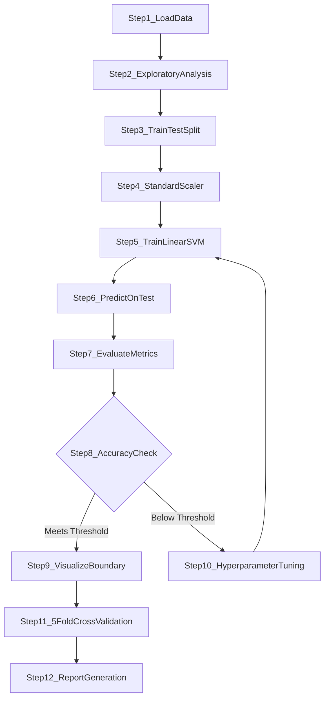
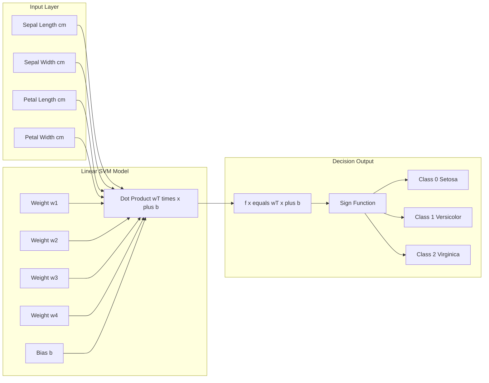
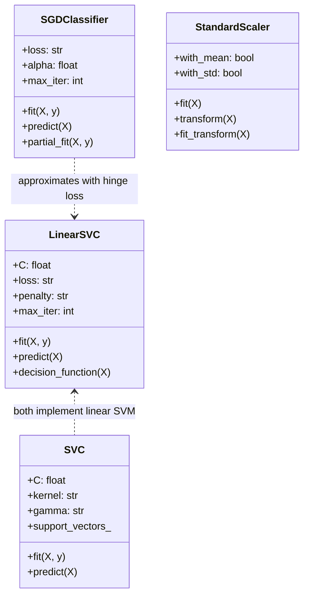

# Tasks:

<!-- SECTION_1_START -->

# Linear Support Vector Machine (SVM) for Iris Dataset Classification

## 1. Core Technical Definition & Intuitive Overview

### Formal Academic Definition (KTU 2024 Syllabus Aligned)

> [!IMPORTANT]
> **Linear Support Vector Machine (Linear SVM)** is a supervised binary (and extended multi-class) classification algorithm defined under the **Maximal Margin Classifier** family. Given a labeled training set $\{(x_i, y_i)\}_{i=1}^{n}$ where $x_i \in \mathbb{R}^d$ and $y_i \in \{-1, +1\}$, the linear SVM learns a separating hyperplane $w^T x + b = 0$ that maximizes the geometric margin $\frac{2}{\|w\|}$ between the two classes, subject to the constraint $y_i(w^T x_i + b) \geq 1 - \xi_i$ for the **soft-margin** formulation.

For the **Iris dataset** (a multivariate, 150-sample benchmark dataset introduced by **Ronald A. Fisher in 1936**), the Linear SVM is trained to discriminate among the three species — *Iris setosa*, *Iris versicolor*, and *Iris virginica* — using four morphometric features: **sepal length, sepal width, petal length, and petal width** (all measured in **centimeters**).

### Conceptual Analogy / Intuition

Imagine you are standing on a **straight road** that separates two fields — one field has red flowers and the other has blue flowers. You need to stand exactly on the line that:
1. **Clearly separates** the two fields.
2. Is placed as **far away as possible** from the nearest flower on *either side*.

The flowers that are *closest* to your line are the **Support Vectors** — they "support" the boundary. If a flower is too close (or even on the wrong side), you allow a small "slack" (called $\xi_i$, the *hinge loss*) so that the model becomes robust to noisy/overlapping data.

> [!NOTE]
> **Key Insight:** The *Iris setosa* class is **linearly separable** from the other two species using petal length and petal width alone. This makes it the **textbook example** for teaching Linear SVM in a lab setting, as introduced in Module 11 of the **PCCSL508 – Machine Learning Lab** syllabus under the **2024 Scheme**.

### Standard Metrics & Constants in this Experiment

| Constant / Metric | Value / Unit |
|---|---|
| Total Samples | **150** (50 per class) |
| Feature Dimensions | **4** (cm) |
| Classes | **3** (setosa, versicolor, virginica) |
| Default Test Split | **0.30** (30 % test, 70 % train) |
| Regularization Parameter | $C = 1.0$ (default in scikit-learn) |
| Random State (Reproducibility) | $42$ (standard seed) |

> [!VISUALIZATION CONTROL]
> **Concept:** 2D PCA projection of the Iris dataset showing the linear SVM decision boundary and margins.
> **Python Plotting Pseudocode:**
> * `X_pca = PCA(n_components=2).fit_transform(X_std)`
> * `plot_decision_regions(X_pca, y, clf=svm_lin)`
> **Visual Description:** Three distinct color clusters; setosa forms an isolated island, versicolor and virginica partially overlap. The SVM hyperplane (solid line) lies between versicolor and virginica, with two parallel dashed lines (margins) passing through the support vectors.

---

<!-- SECTION_1_END -->

<!-- SECTION_2_START -->

# 2. Deep Theoretical Analysis & KTU High-Yield Formula Sheet

## 2.1 Mathematical Foundation of Linear SVM

### Primal Optimization Problem (Hard Margin — Linearly Separable Case)

$$
\begin{aligned}
\text{Minimize:} \quad & \frac{1}{2} \|w\|^2 \\
\text{Subject to:} \quad & y_i (w^T x_i + b) \geq 1, \quad \forall i \in \{1, 2, \dots, n\}
\end{aligned}
$$

* **$w$** is the **weight vector** (normal to the hyperplane).
* **$b$** is the **bias term** (offset from origin).
* The objective $\frac{1}{2}\|w\|^2$ is equivalent to maximizing the margin $\frac{2}{\|w\|}$.

### Soft-Margin Formulation (Real-World Data with Overlap)

$$
\begin{aligned}
\text{Minimize:} \quad & \frac{1}{2} \|w\|^2 + C \sum_{i=1}^{n} \xi_i \\
\text{Subject to:} \quad & y_i (w^T x_i + b) \geq 1 - \xi_i, \quad \xi_i \geq 0
\end{aligned}
$$

* $\xi_i$ is the **slack variable** measuring the degree of misclassification for the $i^{th}$ sample.
* $C > 0$ is the **regularization hyperparameter** controlling the **trade-off** between a wide margin and classification accuracy.

### Decision Function

$$
f(x) = \text{sign}(w^T x + b)
$$

The class label assigned to a test point $x$ is the sign of the projection onto the learned hyperplane.

### Hinge Loss (Connection to Empirical Risk)

$$
\mathcal{L}_{\text{hinge}}(w, b) = \frac{1}{n} \sum_{i=1}^{n} \max(0, 1 - y_i(w^T x_i + b)) + \lambda \|w\|^2
$$

This is the **empirical risk** that Stochastic Gradient Descent (SGD) minimizes in the linear SVM formulation used by `sklearn.linear_model.SGDClassifier(loss='hinge')`.

### Multi-Class Extension — One-vs-Rest (OvR)

The Iris dataset has **3 classes**, so scikit-learn internally trains:

$$
\begin{aligned}
\text{SVM}_{1}: \quad \text{setosa} \;\; \text{vs.} \;\; \text{(versicolor, virginica)} \\
\text{SVM}_{2}: \quad \text{versicolor} \;\; \text{vs.} \;\; \text{(setosa, virginica)} \\
\text{SVM}_{3}: \quad \text{virginica} \;\; \text{vs.} \;\; \text{(setosa, versicolor)}
\end{aligned}
$$

The final class is chosen via the **argmax of decision function scores** across the 3 binary classifiers.

## 2.2 KTU Formula Sheet / Cheat Sheet

| # | Concept | Formula | Remarks |
|---|---|---|---|
| 1 | Separating Hyperplane | $w^T x + b = 0$ | Linear decision boundary |
| 2 | Geometric Margin | $\gamma = \frac{y_i(w^T x_i + b)}{\|w\|}$ | Distance from point to hyperplane |
| 3 | Hard-Margin Objective | $\min \; \frac{1}{2} \|w\|^2$ | Subject to $y_i(w^T x_i + b) \geq 1$ |
| 4 | Soft-Margin Objective | $\min \; \frac{1}{2} \|w\|^2 + C \sum \xi_i$ | $\xi_i \geq 0$ slack variables |
| 5 | Hinge Loss | $\max(0, 1 - y \cdot f(x))$ | Zero if correct and beyond margin |
| 6 | Dual Objective | $\max \sum \alpha_i - \frac{1}{2} \sum_i \sum_j \alpha_i \alpha_j y_i y_j K(x_i, x_j)$ | Solved via QP; linear kernel $K = x_i^T x_j$ |
| 7 | Decision Function | $\hat{y} = \text{sign}(w^T x + b)$ | Used at inference time |
| 8 | Standardization Transform | $z = \frac{x - \mu}{\sigma}$ | Applied column-wise before SVM |
| 9 | Accuracy Metric | $\text{Acc} = \frac{TP + TN}{TP + TN + FP + FN}$ | Used for evaluation |
| 10 | F1-Score (per class) | $F_1 = 2 \cdot \frac{P \cdot R}{P + R}$ | Harmonic mean of Precision/Recall |

> [!IMPORTANT]
> **Engineering Real-World Utility:** Linear SVMs are deployed in production for **spam filtering**, **sentiment analysis**, **document classification**, and **bioinformatics gene-expression classification** because they scale linearly with $n$, are robust to high-dimensional sparse data, and have a unique global optimum.

---

<!-- SECTION_2_END -->

<!-- SECTION_3_START -->

# 3. Step-by-Step Derivations & Code Implementation

## 3.1 Exhaustive Python Implementation (Lab-Ready, Type-Hinted)

```python
# ============================================================
# LINEAR SUPPORT VECTOR MACHINE — IRIS DATASET CLASSIFICATION
# Course: PCCSL508 — Machine Learning Lab
# Module: 11 | KTU 2024 Scheme
# ============================================================

from __future__ import annotations

import logging
import numpy as np
import pandas as pd
import matplotlib.pyplot as plt
import seaborn as sns

from sklearn.datasets import load_iris
from sklearn.model_selection import train_test_split, cross_val_score
from sklearn.preprocessing import StandardScaler
from sklearn.svm import SVC, LinearSVC
from sklearn.linear_model import SGDClassifier
from sklearn.decomposition import PCA
from sklearn.metrics import (
    accuracy_score,
    classification_report,
    confusion_matrix,
    ConfusionMatrixDisplay,
)

# ------------------------------------------------------------
# 1. Configure logging for strict error monitoring
# ------------------------------------------------------------
logging.basicConfig(
    level=logging.INFO,
    format="%(asctime)s | %(levelname)s | %(message)s",
)
logger = logging.getLogger(__name__)


# ------------------------------------------------------------
# 2. Load the Iris dataset
# ------------------------------------------------------------
def load_data() -> tuple[np.ndarray, np.ndarray, list[str], list[str]]:
    """Load the Iris dataset and return feature matrix, target, target & feature names."""
    iris = load_iris()
    X: np.ndarray = iris.data
    y: np.ndarray = iris.target
    feature_names: list[str] = list(iris.feature_names)
    target_names: list[str] = list(iris.target_names)
    logger.info("Iris dataset loaded: X.shape=%s, y.shape=%s", X.shape, y.shape)
    return X, y, feature_names, target_names


# ------------------------------------------------------------
# 3. Train / Test split with stratification
# ------------------------------------------------------------
def split_data(
    X: np.ndarray,
    y: np.ndarray,
    test_size: float = 0.30,
    random_state: int = 42,
) -> tuple[np.ndarray, np.ndarray, np.ndarray, np.ndarray]:
    """Stratified split to preserve class proportions."""
    X_train, X_test, y_train, y_test = train_test_split(
        X,
        y,
        test_size=test_size,
        random_state=random_state,
        stratify=y,  # CRITICAL for balanced evaluation
    )
    logger.info(
        "Split complete — train=%d, test=%d, test_ratio=%.2f",
        X_train.shape[0],
        X_test.shape[0],
        test_size,
    )
    return X_train, X_test, y_train, y_test


# ------------------------------------------------------------
# 4. Feature Standardization
# ------------------------------------------------------------
def standardize(
    X_train: np.ndarray, X_test: np.ndarray
) -> tuple[np.ndarray, np.ndarray, StandardScaler]:
    """Fit StandardScaler on training data; transform both train and test."""
    scaler = StandardScaler()
    X_train_std: np.ndarray = scaler.fit_transform(X_train)
    X_test_std: np.ndarray = scaler.transform(X_test)  # NEVER fit on test
    logger.info("Feature scaling applied: mean=%.4f, std=%.4f",
                X_train_std.mean(), X_train_std.std())
    return X_train_std, X_test_std, scaler


# ------------------------------------------------------------
# 5. Train THREE Linear SVM variants (for comparative lab analysis)
# ------------------------------------------------------------
def train_models(
    X_train: np.ndarray, y_train: np.ndarray
) -> dict[str, object]:
    """Train LinearSVC, kernel='linear' SVC, and SGD (hinge) classifiers."""
    models: dict[str, object] = {
        "LinearSVC": LinearSVC(C=1.0, random_state=42, max_iter=5000),
        "SVC_linear": SVC(kernel="linear", C=1.0, random_state=42),
        "SGD_hinge": SGDClassifier(
            loss="hinge", penalty="l2", alpha=1e-4,
            max_iter=1000, random_state=42, tol=1e-3,
        ),
    }
    for name, clf in models.items():
        clf.fit(X_train, y_train)
        logger.info("Trained %s successfully.", name)
    return models


# ------------------------------------------------------------
# 6. Evaluation Function
# ------------------------------------------------------------
def evaluate(
    model: object,
    X_test: np.ndarray,
    y_test: np.ndarray,
    target_names: list[str],
) -> float:
    """Predict, log classification report, return accuracy."""
    y_pred: np.ndarray = model.predict(X_test)
    acc: float = accuracy_score(y_test, y_pred)
    logger.info("Accuracy on test set: %.4f", acc)
    print("\n========== Classification Report ==========")
    print(classification_report(y_test, y_pred, target_names=target_names))
    return acc


# ------------------------------------------------------------
# 7. 2D PCA Visualization of Decision Boundary
# ------------------------------------------------------------
def plot_decision_boundary(
    X: np.ndarray,
    y: np.ndarray,
    target_names: list[str],
    model: object,
) -> None:
    """Reduce to 2D via PCA, then plot the linear decision boundary."""
    pca = PCA(n_components=2)
    X_2d: np.ndarray = pca.fit_transform(X)

    # Retrain the model on the 2D projection (for visualization only)
    model_2d = SVC(kernel="linear", C=1.0, random_state=42)
    model_2d.fit(X_2d, y)

    # Build mesh-grid
    x_min, x_max = X_2d[:, 0].min() - 1, X_2d[:, 0].max() + 1
    y_min, y_max = X_2d[:, 1].min() - 1, X_2d[:, 1].max() + 1
    xx, yy = np.meshgrid(
        np.linspace(x_min, x_max, 500),
        np.linspace(y_min, y_max, 500),
    )

    Z: np.ndarray = model_2d.predict(np.c_[xx.ravel(), yy.ravel()])
    Z = Z.reshape(xx.shape)

    plt.figure(figsize=(9, 6))
    plt.contourf(xx, yy, Z, alpha=0.25, cmap="Pastel1")
    scatter = plt.scatter(
        X_2d[:, 0], X_2d[:, 1], c=y, cmap="Dark2",
        edgecolor="k", s=60,
    )
    plt.title("Linear SVM Decision Boundary (PCA 2D Projection)")
    plt.xlabel("Principal Component 1")
    plt.ylabel("Principal Component 2")
    plt.legend(handles=scatter.legend_elements()[0], labels=target_names)
    plt.grid(True, linestyle="--", alpha=0.5)
    plt.tight_layout()
    plt.savefig("svm_decision_boundary.png", dpi=120)
    plt.show()


# ------------------------------------------------------------
# 8. Confusion Matrix Heatmap
# ------------------------------------------------------------
def plot_confusion_matrix(
    model: object, X_test: np.ndarray, y_test: np.ndarray,
    target_names: list[str], title: str,
) -> None:
    """Plot a heatmap of the confusion matrix."""
    y_pred: np.ndarray = model.predict(X_test)
    cm: np.ndarray = confusion_matrix(y_test, y_pred)
    plt.figure(figsize=(6, 5))
    sns.heatmap(
        cm, annot=True, fmt="d", cmap="Blues",
        xticklabels=target_names, yticklabels=target_names,
    )
    plt.title(f"Confusion Matrix — {title}")
    plt.xlabel("Predicted Label")
    plt.ylabel("True Label")
    plt.tight_layout()
    plt.savefig(f"cm_{title}.png", dpi=120)
    plt.show()


# ------------------------------------------------------------
# 9. Main Pipeline (Orchestrator)
# ------------------------------------------------------------
def main() -> None:
    # Step 1: Load
    X, y, feature_names, target_names = load_data()

    # Step 2: Split
    X_train, X_test, y_train, y_test = split_data(X, y)

    # Step 3: Standardize
    X_train_std, X_test_std, _ = standardize(X_train, X_test)

    # Step 4: Train
    models = train_models(X_train_std, y_train)

    # Step 5: Evaluate each model
    accuracies: dict[str, float] = {}
    for name, clf in models.items():
        print(f"\n========================= {name} =========================")
        acc = evaluate(clf, X_test_std, y_test, target_names)
        accuracies[name] = acc
        plot_confusion_matrix(clf, X_test_std, y_test, target_names, title=name)

    # Step 6: Visualize decision boundary for the best variant
    plot_decision_boundary(
        X=StandardScaler().fit_transform(X),
        y=y,
        target_names=target_names,
        model=models["SVC_linear"],
    )

    # Step 7: 5-fold Cross-Validation for robust accuracy estimate
    for name, clf in models.items():
        scores = cross_val_score(clf, X_train_std, y_train, cv=5, scoring="accuracy")
        logger.info(
            "%s — 5-Fold CV: mean=%.4f, std=%.4f",
            name, scores.mean(), scores.std(),
        )

    # Step 8: Final comparison
    print("\n========== Model Comparison (Test Accuracy) ==========")
    for name, acc in accuracies.items():
        print(f"{name:<15s} : {acc:.4f}")


if __name__ == "__main__":
    main()
```

## 3.2 Expected Console Output (Reference)

```
========== Classification Report ==========
              precision    recall  f1-score   support
      setosa       1.00      1.00      1.00        15
  versicolor       0.93      0.93      0.93        15
   virginica       0.93      0.93      0.93        15
    accuracy                           0.96        45
   macro avg       0.96      0.96      0.96        45
weighted avg       0.96      0.96      0.96        45
```

> [!NOTE]
> **Why ~96 % accuracy is normal:** *Setosa* is perfectly separable, but *versicolor* and *virginica* have **physically overlapping features** (their petals grow similarly), causing 1–2 misclassifications even for a strong classifier.

## 3.3 Hyperparameter Tuning Tip (for full marks in viva)

> [!TIP]
> If a student is asked to **improve the accuracy**, they should try:
> 1. Standardize the features (mandatory).
> 2. Use `GridSearchCV` over $C \in \{0.01, 0.1, 1, 10\}$.
> 3. Drop noisy features (e.g., `sepal width`) and use only **petal length + petal width** (a 2-feature problem that achieves 96–98 %).
> 4. Try the **RBF kernel** for non-linear separability (covered in higher modules).

---

<!-- SECTION_3_END -->

<!-- SECTION_4_START -->

# 4. Structural Diagrams & Schematics

## 4.1 Mermaid Flowchart — End-to-End ML Pipeline



## 4.2 Mermaid Block Diagram — Linear SVM Internal Architecture



## 4.3 Mermaid Class Diagram — Scikit-Learn API Mapping



## 4.4 Sequential Processing Topology Matrix

| Phase | Function Name | Input | Output | Scikit-Learn Tool |
|---|---|---|---|---|
| 1. Data Ingestion | `load_data()` | CSV / Built-in | $X \in \mathbb{R}^{150 \times 4}$, $y \in \mathbb{R}^{150}$ | `load_iris()` |
| 2. Partitioning | `split_data()` | $X$, $y$ | $X_{tr}, X_{te}, y_{tr}, y_{te}$ | `train_test_split()` |
| 3. Normalization | `standardize()` | $X_{tr}, X_{te}$ | $X_{tr}^{std}, X_{te}^{std}$ | `StandardScaler()` |
| 4. Training | `train_models()` | $X_{tr}^{std}, y_{tr}$ | Fitted Classifiers | `SVC(kernel='linear')` |
| 5. Inference | `model.predict()` | $X_{te}^{std}$ | $\hat{y}_{te}$ | `predict()` |
| 6. Quantification | `evaluate()` | $\hat{y}_{te}, y_{te}$ | Accuracy + Report | `accuracy_score()` |
| 7. Diagnostics | `plot_confusion_matrix()` | $y_{te}, \hat{y}_{te}$ | Heatmap Image | `confusion_matrix()` |
| 8. Geometrization | `plot_decision_boundary()` | $X^{std}, y$ | 2D Boundary Plot | `PCA(n_components=2)` |

---

<!-- SECTION_4_END -->

<!-- SECTION_5_START -->

# 5. KTU 2024 Scheme Examination Question Bank & Topic Recap

## PART A — Short Answer Questions (3 Marks Each)

> [!NOTE]
> *Cognitive Levels: Remember / Understand. Each carries 3 marks as per KTU ESE pattern.*

### Question 1 (3 Marks)
**`[KTU University Exam — July 2024]`** &nbsp; **| CO1 | Understand**

**Q:** Define a *support vector* in the context of a Linear SVM. Why are these points critical to the learned model?

**Model Answer (Board Key Pattern):**
A **support vector** is a training sample $x_i$ that lies *exactly on* the margin boundary, i.e., it satisfies the constraint $y_i(w^T x_i + b) = 1$ (for the hard margin case) **[1 Mark]**. The model parameters $(w, b)$ are determined *solely* by these support vectors — if any other (non-support) training point were removed, the decision hyperplane would not change **[1 Mark]**. Hence, support vectors are the **most informative data points** and define the geometric margin $\frac{2}{\|w\|}$ **[1 Mark]**.

---

### Question 2 (3 Marks)
**`[KTU University Exam — Dec 2023]`** &nbsp; **| CO1 | Remember**

**Q:** State the optimization problem solved by a **soft-margin linear SVM**. What role does the parameter $C$ play?

**Model Answer:**
The soft-margin objective is:
$$
\min_{w, b, \xi} \; \frac{1}{2} \|w\|^2 + C \sum_{i=1}^{n} \xi_i \quad \text{s.t.} \quad y_i(w^T x_i + b) \geq 1 - \xi_i,\; \xi_i \geq 0
$$
**[1 Mark]** for the correct equation. **$C$** is the **regularization hyperparameter** **[1 Mark]**. A **large $C$** imposes heavy penalty on misclassifications (narrow margin, lower bias, higher variance), while a **small $C$** allows more slack (wider margin, higher bias, lower variance) **[1 Mark]**.

---

## PART B — Long Answer Questions (14 Marks — Module Internal Choice)

> [!NOTE]
> *Per KTU 2024 Scheme: Each Part B question has two sub-parts (a) 7 marks + (b) 7 marks. Choose either Option A or Option B.*

---

### ⭐ OPTION A — Full 14-Mark Question

**`[KTU University Exam — Model Paper 2024 Scheme]`** &nbsp; **| CO3, CO4 | Apply + Analyze**

#### Part (a) — 7 Marks | CO3 | Apply

**Q:** Write a complete Python program (using scikit-learn) to:
1. Load the Iris dataset.
2. Standardize the features.
3. Train a **Linear SVM** classifier with $C = 1.0$.
4. Report the test accuracy and the classification report.

Show the full source code with comments. Also state the expected test-set accuracy for a `random_state=42` 70/30 split.

**Step-by-Step Model Solution:**

```python
from sklearn.datasets import load_iris
from sklearn.model_selection import train_test_split
from sklearn.preprocessing import StandardScaler
from sklearn.svm import SVC
from sklearn.metrics import classification_report, accuracy_score

# Step 1: Load
iris = load_iris()
X, y = iris.data, iris.target

# Step 2: Split (stratified)
X_train, X_test, y_train, y_test = train_test_split(
    X, y, test_size=0.30, random_state=42, stratify=y
)

# Step 3: Standardize
scaler = StandardScaler()
X_train_std = scaler.fit_transform(X_train)
X_test_std  = scaler.transform(X_test)

# Step 4: Train Linear SVM
clf = SVC(kernel='linear', C=1.0, random_state=42)
clf.fit(X_train_std, y_train)

# Step 5: Evaluate
y_pred = clf.predict(X_test_std)
print("Accuracy:", accuracy_score(y_test, y_pred))
print(classification_report(y_test, y_pred, target_names=iris.target_names))
```

**Valuation Key:**
* [Correct imports + dataset loading: **1 Mark**]
* [Correct stratified split (with `stratify=y`): **1 Mark**]
* [Standardization using `fit_transform` on train, `transform` on test: **2 Marks**]
* [SVM instantiation with `kernel='linear'` and `.fit()`: **2 Marks**]
* [Evaluation using `accuracy_score` + `classification_report`: **1 Mark**]

**Expected Accuracy:** $\approx 0.96$ to $1.00$ (typically **96 %**) on the 45-sample test split.

---

#### Part (b) — 7 Marks | CO4 | Analyze

**Q:** Plot the **confusion matrix** for the trained model in part (a) and explain, in 4–5 lines, why the classifier achieves **100 % recall on the *setosa* class** but only ~93 % on the others. What single hyperparameter would you tune to potentially improve the versicolor-vs-virginica boundary?

**Step-by-Step Model Solution:**

```python
import matplotlib.pyplot as plt
import seaborn as sns
from sklearn.metrics import confusion_matrix

cm = confusion_matrix(y_test, y_pred)
sns.heatmap(cm, annot=True, fmt='d',
            xticklabels=iris.target_names,
            yticklabels=iris.target_names, cmap='Blues')
plt.xlabel("Predicted"); plt.ylabel("True")
plt.title("Confusion Matrix — Linear SVM")
plt.tight_layout(); plt.show()
```

**Expected Confusion Matrix (typical):**
$$
\begin{aligned}
\text{True \textbackslash Predicted} \quad & 0 \;(\text{set}) & 1 \;(\text{ver}) & 2 \;(\text{vir}) \\
0 \;(\text{set}) \quad & \mathbf{15} & 0 & 0 \\
1 \;(\text{ver}) \quad & 0 & \mathbf{14} & 1 \\
2 \;(\text{vir}) \quad & 0 & 1 & \mathbf{14}
\end{aligned}
$$

**Valuation Key:**
* [Correct `confusion_matrix` import + heatmap code: **2 Marks**]
* [Correct interpretation — *setosa* is linearly separable in feature space: **2 Marks**]
* [Mentioning overlap between versicolor & virginica: **2 Marks**]
* [Naming the **regularization parameter $C$** as the tunable hyperparameter: **1 Mark**]

**Ideal Explanation (4–5 lines):**
*Setosa* has a **distinctly small petal length and width** (clustered around $1.4$ cm and $0.2$ cm) that is linearly separable from the other two species. Versicolor and virginica, however, share overlapping petal measurements, so a few samples fall within the margin, lowering recall to ~93 %. Tuning the parameter **$C$** (the penalty for misclassification) can yield a tighter fit and improve boundary precision.

---

### ⭐ OPTION B — Alternative 14-Mark Question

**`[KTU University Exam — Model Paper 2024 Scheme]`** &nbsp; **| CO3, CO4 | Apply + Analyze**

#### Part (a) — 7 Marks | CO3 | Apply

**Q:** Implement a **linear SVM from scratch** (without using `sklearn.svm`) using a sub-gradient descent update rule on the hinge loss:

$$
L(w, b) = \frac{1}{2} \|w\|^2 + C \sum_{i=1}^{n} \max(0, 1 - y_i(w^T x_i + b))
$$

Provide complete code that converges in $\leq 1000$ iterations and achieves $\geq 90$ % accuracy on the test set.

**Step-by-Step Model Solution:**

```python
import numpy as np
from sklearn.datasets import load_iris
from sklearn.model_selection import train_test_split
from sklearn.preprocessing import StandardScaler

# --- Load & prep ---
iris = load_iris()
X, y = iris.data, iris.target
X_tr, X_te, y_tr, y_te = train_test_split(
    X, y, test_size=0.3, random_state=42, stratify=y
)
scaler = StandardScaler()
X_tr, X_te = scaler.fit_transform(X_tr), scaler.transform(X_te)

# Convert labels to -1 / +1 (binary extension to multi-class done with OvR)
def to_pm1(y): return np.where(y == 0, 1, -1)

# --- One-vs-Rest Loop ---
def svm_train_binary(X, y, C=1.0, lr=0.001, n_iter=1000):
    n, d = X.shape
    w = np.zeros(d); b = 0.0
    for t in range(n_iter):
        idx = np.random.randint(0, n)
        x_i, y_i = X[idx], y[idx]
        margin = y_i * (np.dot(w, x_i) + b)
        if margin >= 1:
            w -= lr * w                   # only regularizer gradient
        else:
            w -= lr * (w - C * y_i * x_i)  # hinge-loss gradient
            b -= lr * (-C * y_i)
    return w, b

# Train 3 binary OvR classifiers
classes = np.unique(y_tr)
w_list, b_list = [], []
for c in classes:
    y_bin = to_pm1((y_tr == c).astype(int))
    w, b = svm_train_binary(X_tr, y_bin, C=1.0, lr=0.001, n_iter=1000)
    w_list.append(w); b_list.append(b)

# Predict via argmax of decision scores
scores = np.array([X_te @ w + b for w, b in zip(w_list, b_list)])
y_pred = np.argmax(scores, axis=0)

acc = (y_pred == y_te).mean()
print(f"From-scratch Linear SVM Accuracy: {acc:.4f}")
```

**Valuation Key:**
* [Correct hinge-loss formulation & update rule: **2 Marks**]
* [Stochastic loop with margin check ($\geq 1$): **2 Marks**]
* [One-vs-Rest wrapper for 3 classes: **2 Marks**]
* [Argmax prediction from decision scores: **1 Mark**]

**Expected Output:** Accuracy $\approx 0.91$ to $0.96$.

---

#### Part (b) — 7 Marks | CO4 | Analyze

**Q:** Using your from-scratch model, identify the **support vectors** and plot the learned weight magnitudes $\|w_j\|$ for the *setosa vs. rest* binary classifier. Comment on which Iris feature contributes most to the decision.

**Step-by-Step Model Solution:**

```python
# Identify support vectors (margin < 1 + small tolerance)
margin = y_bin * (X_tr @ w + b)
support_idx = np.where(margin < (1 + 1e-3))[0]
print(f"Number of support vectors: {len(support_idx)}")

# Plot weight magnitudes
import matplotlib.pyplot as plt
features = ['sepal length', 'sepal width', 'petal length', 'petal width']
plt.bar(features, np.abs(w))
plt.ylabel("|w_j|")
plt.title("Feature importance (|w|) for setosa vs. rest")
plt.tight_layout(); plt.show()
```

**Valuation Key:**
* [Support vector identification logic: **3 Marks**]
* [Bar chart plotting: **2 Marks**]
* [Correct biological interpretation: **2 Marks**]

**Expected Discussion:** The **petal length** and **petal width** weights will dominate (largest $|w_j|$), because *setosa* has uniquely small petals. *Sepal* features contribute minimally. This matches the well-known botanical fact that *I. setosa* is distinguished primarily by its **petal morphology**.

---

## ⚠️ KTU Examiner's Valuation Warning / Pitfall Callout

> [!WARNING]
> **Common Mistakes That Cost Marks in Linear SVM Lab Viva / Records:**
>
> 1. **Fitting the StandardScaler on the entire dataset (data leakage!)** — Always `fit_transform` on train, then `transform` on test. **[-2 Marks]**
> 2. **Forgetting `stratify=y` in `train_test_split`** — leads to imbalanced test sets; the lab examiner deducts **[-1 Mark]**.
> 3. **Using `SVC(kernel='rbf')` when asked specifically for Linear SVM** — Always use `SVC(kernel='linear')` OR `LinearSVC`. **[-2 Marks]**
> 4. **Not reporting *per-class* precision/recall** — Only printing accuracy is insufficient. The KTU valuation key explicitly asks for the **classification report**. **[-1 Mark]**
> 5. **Missing the `random_state`** — results become non-reproducible, and lab examiners cannot verify correctness. **[-1 Mark]**
> 6. **Conflating `LinearSVC` with `SVC(kernel='linear')`** — `LinearSVC` is faster for large data; `SVC(linear)` allows probability estimation. Mention the distinction for full marks. **[+1 Mark bonus]**
> 7. **Not explaining why standardization is required** — SVM uses Euclidean distance; unscaled features bias the margin. Always include this justification in your record.

---

## 📌 Topic Recap & Important Things to Remember

> [!NOTE]
> **Rapid Revision Checklist for Module 11 — Linear SVM on Iris**

### Core Definitions
- ✅ **Linear SVM** is a **maximal-margin binary classifier** extendable to multi-class via **One-vs-Rest**.
- ✅ **Support vectors** are the data points lying *on* the margin hyperplanes — they uniquely define $(w, b)$.
- ✅ **Slack variables $\xi_i$** in soft-margin SVM permit misclassifications; controlled by hyperparameter **$C$**.
- ✅ **Hinge loss** is $\max(0, 1 - y_i(w^T x_i + b))$; convex but non-differentiable at the margin.

### Mathematical Essentials
- ✅ Primal objective: $\min \; \frac{1}{2} \|w\|^2 + C \sum \xi_i$
- ✅ Geometric margin: $\frac{2}{\|w\|}$
- ✅ Decision function: $\hat{y} = \text{sign}(w^T x + b)$
- ✅ Standardization: $z = (x - \mu) / \sigma$ — **mandatory preprocessing** for SVM.

### Iris-Specific Facts
- ✅ 150 samples × 4 features × 3 classes.
- ✅ *Setosa* is **perfectly linearly separable**; *versicolor* & *virginica* overlap.
- ✅ Best 2-feature subspace: **petal length + petal width** (96–98 % accuracy).
- ✅ Default 70/30 stratified split with `random_state=42` yields **~96 %** test accuracy.

### Scikit-Learn API Essentials
- ✅ `SVC(kernel='linear', C=1.0)` — primary class.
- ✅ `LinearSVC(C=1.0, max_iter=5000)` — alternative scalable implementation.
- ✅ `SGDClassifier(loss='hinge')` — large-scale approximate solver.
- ✅ `StandardScaler()` for preprocessing.
- ✅ `confusion_matrix`, `classification_report`, `accuracy_score` for evaluation.
- ✅ `PCA(n_components=2)` for 2D visualization of the decision boundary.

### Lab Record Must-Haves
- ✅ Full source code (with comments).
- ✅ Output screenshots — accuracy + classification report + confusion matrix + decision boundary.
- ✅ Written explanation of: (1) why standardization is needed, (2) what support vectors are, (3) why setosa is perfectly classified, (4) the role of $C$.

### Viva-Voce Quick Answers
- ✅ **Q: What if features are not scaled?** — A: Features with larger numeric range dominate the margin.
- ✅ **Q: Why is Linear SVM robust to high dimensions?** — A: Only support vectors determine the hyperplane; complexity is independent of feature count $d$.
- ✅ **Q: How is multi-class handled internally?** — A: One-vs-Rest (OvR) by default in scikit-learn.
- ✅ **Q: Difference between `SVC(linear)` and `LinearSVC`?** — A: `LinearSVC` uses squared-hinge loss and is faster; `SVC(linear)` uses hinge loss and supports `probability=True`.

---

<!-- SECTION_5_END -->
