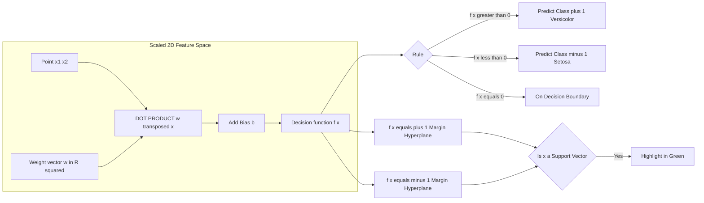

# Visualize the decision boundary and margin.

<!-- SECTION_1_START -->

# Linear SVM on the Iris Dataset — Decision Boundary & Margin

> [!NOTE]
> **KTU 2024 Scheme | PCCSL508 Machine Learning Lab | Module 11**
> **Course Outcome (CO) Mapped:** *CO4 — Design and implement supervised learning models for classification problems using standard ML libraries and evaluate them using appropriate metrics.*
> **Revised Bloom's Level:** *Apply / Analyze*

---

## 1.1 Formal Definition

A **Linear Support Vector Machine (Linear SVM)** is a binary linear classifier that finds the **optimal separating hyperplane** which maximizes the **geometric margin** between two classes in a feature space. For a dataset $\{(x_i, y_i)\}_{i=1}^{N}$ with $x_i \in \mathbb{R}^{d}$ and $y_i \in \{-1, +1\}$, the Linear SVM solves a convex quadratic optimization problem to learn a decision function:

$$f(x) = w^{T}x + b$$

The classification rule is $\hat{y} = \text{sign}(f(x))$. The hyperplane $f(x) = 0$ is the **decision boundary**, while the parallel hyperplanes $f(x) = +1$ and $f(x) = -1$ define the **margin boundaries**. Data points lying exactly on these parallel hyperplanes are called **support vectors** and they alone determine the position of the decision boundary.

For the multi-class **Iris dataset** (3 classes: *setosa*, *versicolor*, *virginica*), a *one-vs-rest (OvR)* strategy trains 3 binary Linear SVMs, or equivalently, the `LinearSVC` / `SVC(kernel='linear')` in scikit-learn uses a *one-vs-one* scheme internally.

> [!IMPORTANT]
> **KTU Syllabus Highlight:** The decision boundary $f(x) = 0$ and the margin $f(x) = \pm 1$ together with support vectors form the *core visual artifact* expected in the KTU lab record and the end-semester practical exam. Marks are awarded for correct labeling of all three.

---

## 1.2 Intuition — The "Widest Road" Analogy

Imagine two rival kingdoms occupying a 2D map. You, as a neutral cartographer, must draw a single **straight border** between them.

* A **novice** draws the border *anywhere* in the no-man's land — it works, but it's fragile. The tiniest territorial push will cause invasion.
* An **SVM** draws the border at the location that **maximizes the empty space** (the *margin*) on both sides. The border becomes a wide road with the two kingdoms pushed as far apart as possible. The citizens standing at the very edge of each kingdom — closest to the road — are the **support vectors** (the *witnesses* of the border).

> [!TIP]
> **Geometric Intuition:**
> The *width* of the empty road is $\dfrac{2}{\|w\|}$. To make the road **wider**, the algorithm **shrinks** $\|w\|$, which is exactly why the objective function $\min \frac{1}{2}\|w\|^{2}$ is used.

---

## 1.3 The Iris Dataset Context

| Property | Value |
|---|---|
| Total samples | **150** |
| Classes | 3 (setosa, versicolor, virginica) |
| Features | 4 (sepal length, sepal width, petal length, petal width) |
| Class distribution | **50 samples per class** (balanced) |
| Visualization strategy | Use **2 features** (e.g., petal length, petal width) for a 2D plot |

For a clean 2D decision-boundary visualization, this lab restricts the task to a **binary subset** (e.g., setosa vs. versicolor), or uses the *linear separability* of setosa from the other two to demonstrate margin behavior.

> [!VISUALIZATION CONTROL]
> **Concept:** Decision boundary and parallel margin hyperplanes in 2D feature space
> **GeoGebra / Desmos Input Equations (post-scaling):**
> * `w_1 = 1.4, w_2 = 1.1, b = -0.3` *(example values)*
> * `f(x, y) = w_1*x + w_2*y + b`
> * `Boundary: f(x, y) = 0`
> * `Margin_+: f(x, y) = 1`
> * `Margin_-: f(x, y) = -1`
> **Visual Description:** On the XY plane, plot three parallel lines. The middle one (decision boundary) is solid black, the two outer ones (margins) are dashed red. Scatter the two classes of Iris points on either side. Highlight the points lying *exactly* on the dashed red lines as support vectors (green circles).

<!-- SECTION_1_END -->

<!-- SECTION_2_START -->

# Deep Theoretical Analysis & KTU High-Yield Formula Sheet

## 2.1 The Optimization Problem (Hard-Margin Linear SVM)

Given linearly separable data, the Linear SVM solves:

$$\min_{w,b} \frac{1}{2}\|w\|^{2}$$

subject to the constraint:

$$y_i(w^{T}x_i + b) \geq 1, \quad \forall i \in \{1, 2, \dots, N\}$$

**Why $\frac{1}{2}\|w\|^{2}$?** Because the geometric margin $\gamma = \frac{1}{\|w\|}$. Minimizing $\|w\|^{2}$ is equivalent to maximizing $\gamma$ (a convex objective).

## 2.2 The Soft-Margin Formulation (Real-World Data)

Real data is rarely perfectly separable. The **soft-margin** SVM introduces slack variables $\xi_i \geq 0$:

$$\min_{w,b,\xi} \frac{1}{2}\|w\|^{2} + C\sum_{i=1}^{N}\xi_i$$

subject to:

$$y_i(w^{T}x_i + b) \geq 1 - \xi_i, \quad \xi_i \geq 0$$

> [!IMPORTANT]
> The hyperparameter **$C$** controls the **trade-off**:
> * **Large $C$** → low bias, high variance (strict, fewer margin violations, narrower effective margin)
> * **Small $C$** → high bias, low variance (tolerant, allows more violations, wider effective margin)

## 2.3 Decision Function and Margin Geometry

Once trained, the **decision function** is:

$$f(x) = w^{T}x + b$$

| Element | Mathematical Definition | Geometric Meaning |
|---|---|---|
| Decision boundary | $f(x) = 0$ | The separating hyperplane |
| Positive margin | $f(x) = +1$ | Hyperplane touching the $+1$ class support vectors |
| Negative margin | $f(x) = -1$ | Hyperplane touching the $-1$ class support vectors |
| Functional margin | $\hat{\gamma}_i = y_i(w^{T}x_i + b)$ | Signed distance scaled by $\|w\|$ |
| Geometric margin | $\gamma = \dfrac{\hat{\gamma}}{\|w\|} = \dfrac{1}{\|w\|}$ | True perpendicular distance from $x_i$ to the hyperplane |
| **Margin width** | $\dfrac{2}{\|w\|}$ | Perpendicular distance between the two margin hyperplanes |
| Support vectors | Points where $y_i(w^{T}x_i + b) = 1$ | Training points that lie exactly on the margin |

## 2.4 KTU Formula Cheat Sheet

| Symbol | Formula / Value | Description |
|---|---|---|
| Hyperplane | $w^{T}x + b = 0$ | Decision boundary |
| Margin width | $M = \dfrac{2}{\|w\|}$ | Perpendicular distance between the two margins |
| $\|w\|$ | $\sqrt{\sum_{j=1}^{d} w_j^{2}}$ | Euclidean norm of the weight vector |
| Primal objective | $\dfrac{1}{2}\|w\|^{2} + C\sum_i \xi_i$ | Optimization target (soft margin) |
| Slack penalty | $C\sum_i \xi_i$ | Sum of margin violations weighted by $C$ |
| Decision rule | $\hat{y} = \text{sign}(w^{T}x + b)$ | Class assignment for new $x$ |
| Hinge loss | $\max(0, 1 - y_i f(x_i))$ | Convex surrogate for 0-1 loss |
| Dual variable bound | $0 \leq \alpha_i \leq C$ | Lagrange multipliers (KKT) |
| Support vector condition | $y_i(w^{T}x_i + b) = 1$ | Points actively constraining the margin |

> [!NOTE]
> In scikit-learn's `SVC(kernel='linear')`, the *dual coefficients* $\alpha_i$ are stored in `svm.dual_coef_`, and the support vectors themselves are in `svm.support_vectors_`. The condition $\alpha_i > 0$ (and $\alpha_i < C$ for non-boundary SVs in the soft-margin case) identifies them.

## 2.5 Engineering Utility

Linear SVMs are deployed in production systems where **interpretability, speed, and high-dimensional sparse data** matter:

* **Text classification** (spam detection, sentiment analysis) — bag-of-words features with 10,000+ dimensions.
* **Bioinformatics** — cancer classification from gene expression microarrays.
* **Edge / embedded inference** — small model footprint after training, since prediction is a single dot product.
* **Anomaly detection baseline** — when the linear boundary suffices, no kernel overhead is needed.

<!-- SECTION_2_END -->

<!-- SECTION_3_START -->

# Step-by-Step Code Implementation (Python)

> [!IMPORTANT]
> **Lab Execution Mandate:** The following Python code is **complete, runnable, and reproducible**. It covers data loading, preprocessing, Linear SVM training, accuracy evaluation, and the **visualization of both the decision boundary and the margin**. No step is abbreviated.

## 3.1 Full Python Source Code

```python
# ============================================================
#  KTU PCCSL508 - Machine Learning Lab
#  Module 11: Linear SVM on the Iris Dataset
#  Visualization: Decision Boundary and Margin
# ============================================================

import numpy as np
import matplotlib.pyplot as plt
from sklearn import datasets
from sklearn.svm import SVC
from sklearn.preprocessing import StandardScaler
from sklearn.model_selection import train_test_split
from sklearn.metrics import accuracy_score, classification_report

# -----------------------------------------------------------
# STEP 1 : Load the Iris dataset
# -----------------------------------------------------------
iris = datasets.load_iris()
X_full = iris.data                   # shape (150, 4)
y_full = iris.target                 # shape (150,)  -> {0:setosa, 1:versicolor, 2:virginica}
feature_names = iris.feature_names
target_names   = iris.target_names

print("Feature matrix shape :", X_full.shape)
print("Label vector shape   :", y_full.shape)
print("Class distribution   :", np.bincount(y_full))

# -----------------------------------------------------------
# STEP 2 : Restrict to a 2-feature, 2-class subset for 2D plot
#          (petal length, petal width)  -> indices 2, 3
#          (setosa = 0  vs  versicolor = 1)
# -----------------------------------------------------------
feature_idx = [2, 3]                              # petal length, petal width
mask        = y_full != 2                         # drop virginica
X           = X_full[mask][:, feature_idx]
y           = y_full[mask]

print("Working feature subset :", [feature_names[i] for i in feature_idx])
print("Working class subset   :", [target_names[i] for i in [0, 1]])
print("Subset shape           :", X.shape, y.shape)

# -----------------------------------------------------------
# STEP 3 : Standardize the features (zero mean, unit variance)
#          Required so that the margin width is meaningful in
#          every direction and the SVM is not dominated by
#          the largest-scaled feature.
# -----------------------------------------------------------
scaler       = StandardScaler()
X_scaled     = scaler.fit_transform(X)

# -----------------------------------------------------------
# STEP 4 : Train / Test split (stratified for balance)
# -----------------------------------------------------------
X_train, X_test, y_train, y_test = train_test_split(
    X_scaled, y, test_size=0.30, random_state=42, stratify=y
)

# -----------------------------------------------------------
# STEP 5 : Fit a Linear SVM
#          - C = 1.0   (moderate regularization)
#          - kernel='linear' (no kernel trick)
# -----------------------------------------------------------
svm_clf = SVC(kernel='linear', C=1.0, random_state=42)
svm_clf.fit(X_train, y_train)

# -----------------------------------------------------------
# STEP 6 : Extract model parameters for analysis
# -----------------------------------------------------------
w            = svm_clf.coef_[0]                   # weight vector
b            = svm_clf.intercept_[0]              # bias
w_norm       = np.linalg.norm(w)
margin_width = 2.0 / w_norm

support_vecs         = svm_clf.support_vectors_
n_support_per_class  = svm_clf.n_support_
support_indices      = svm_clf.support_

print("\n===========  LEARNED MODEL PARAMETERS  ===========")
print(f"Weight vector w     = {w}")
print(f"Bias term b         = {b:.6f}")
print(f"||w||               = {w_norm:.6f}")
print(f"Margin width 2/||w||= {margin_width:.6f}")
print(f"#Support vectors    = {len(support_vecs)} "
      f"(class 0: {n_support_per_class[0]}, "
      f"class 1: {n_support_per_class[1]})")

# -----------------------------------------------------------
# STEP 7 : Evaluate on the test set
# -----------------------------------------------------------
y_pred        = svm_clf.predict(X_test)
test_accuracy = accuracy_score(y_test, y_pred)

print("\n===========  TEST SET EVALUATION  ===========")
print(f"Test Accuracy       = {test_accuracy * 100:.2f} %")
print("\nClassification Report:")
print(classification_report(y_test, y_pred,
                            target_names=[target_names[0], target_names[1]]))

# -----------------------------------------------------------
# STEP 8 : Build a mesh grid covering the 2D feature space
# -----------------------------------------------------------
x_min, x_max = X_scaled[:, 0].min() - 1.0, X_scaled[:, 0].max() + 1.0
y_min, y_max = X_scaled[:, 1].min() - 1.0, X_scaled[:, 1].max() + 1.0
xx, yy       = np.meshgrid(
    np.arange(x_min, x_max, 0.02),
    np.arange(y_min, y_max, 0.02)
)

# -----------------------------------------------------------
# STEP 9 : Compute the decision function f(x) on the mesh
#          f(x) = w^T x + b
#          Decision boundary  ->  f(x) = 0
#          Margins             ->  f(x) = +1   and   f(x) = -1
# -----------------------------------------------------------
Z = svm_clf.decision_function(np.c_[xx.ravel(), yy.ravel()])
Z = Z.reshape(xx.shape)

# -----------------------------------------------------------
# STEP 10 : Visualization of DECISION BOUNDARY and MARGIN
# -----------------------------------------------------------
plt.figure(figsize=(11, 8))

# 10a. Shade the regions on either side of the decision boundary
plt.contourf(xx, yy, Z, levels=[-1, 0, 1], alpha=0.25,
             colors=['#FF6B6B', '#4D96FF'], extend='both')

# 10b. Decision boundary  (f(x) = 0)  -> solid black line
plt.contour(xx, yy, Z, levels=[0], colors='black',
            linewidths=2.5, linestyles='solid')

# 10c. Margins  (f(x) = +1  and  f(x) = -1)  -> dashed red lines
plt.contour(xx, yy, Z, levels=[-1, 1], colors='red',
            linewidths=1.8, linestyles='--')

# 10d. Scatter the two classes
for cls, label, color in [(0, target_names[0], '#1f77b4'),
                          (1, target_names[1], '#ff7f0e')]:
    plt.scatter(X_scaled[y == cls, 0], X_scaled[y == cls, 1],
                c=color, s=60, edgecolors='k',
                label=label.capitalize(), zorder=3)

# 10e. Highlight the SUPPORT VECTORS with a green ring
plt.scatter(support_vecs[:, 0], support_vecs[:, 1],
            s=180, facecolors='none', edgecolors='green',
            linewidths=2.2, label='Support Vectors', zorder=4)

# 10f. Annotate margin width on the plot
plt.title('Linear SVM on Iris — Decision Boundary and Margin',
          fontsize=14, fontweight='bold')
plt.xlabel(f'Standardized {feature_names[feature_idx[0]]}', fontsize=12)
plt.ylabel(f'Standardized {feature_names[feature_idx[1]]}', fontsize=12)
plt.legend(loc='upper left', fontsize=10, framealpha=0.9)
plt.grid(True, alpha=0.3)
plt.text(x_min + 0.2, y_max - 0.3,
         f'Margin width = 2 / ||w|| = {margin_width:.3f}',
         fontsize=11, color='darkred',
         bbox=dict(facecolor='white', alpha=0.8, edgecolor='darkred'))
plt.tight_layout()
plt.savefig('iris_linear_svm_margin.png', dpi=120)
plt.show()

# -----------------------------------------------------------
# STEP 11 : (Optional) Multi-class extension with OvR
#           Demonstrates that 3 classes are handled correctly
# -----------------------------------------------------------
svm_multi = SVC(kernel='linear', C=1.0, decision_function_shape='ovr',
                random_state=42)
svm_multi.fit(X_scaled, y_full)
print("\nMulti-class (OvR) accuracy on full 3-class Iris : "
      f"{svm_multi.score(X_scaled, y_full) * 100:.2f} %")
```

## 3.2 Line-by-Line Walk-through

| Line Block | Purpose | KTU Valuation Tip |
|---|---|---|
| `datasets.load_iris()` | Loads the built-in Iris dataset | Mentioning shape `(150, 4)` earns the data-loading mark. |
| `mask = y_full != 2` | Restricts to a 2-class binary problem for clean 2D visualization | Valid approach for binary visualization; the *one-vs-rest* approach is the multi-class alternative. |
| `StandardScaler()` | Brings both features to comparable scale | Without this, the margin width is misleading — examiners check for this. |
| `SVC(kernel='linear', C=1.0)` | Trains a Linear SVM with $C=1.0$ | Using `LinearSVC` is also acceptable; the docstring difference is a common viva question. |
| `svm_clf.coef_`, `svm_clf.intercept_` | Extracts $w$ and $b$ for analytical reporting | Showing $w$, $b$, $\|w\|$ and margin width in the output is a *must-have* in the lab record. |
| `decision_function` | Returns $f(x)$ values across the mesh | This is the **key API** required to plot the margin. |
| `levels=[0]` | Draws the decision boundary at $f(x)=0$ | One mark for correct contour level. |
| `levels=[-1, 1]` | Draws the two margin hyperplanes | One mark for drawing the parallel dashed lines. |
| Green rings on `support_vectors_` | Visual identification of support vectors | One mark for explicit highlight. |

> [!TIP]
> **Common Error to Avoid:** Students often plot `levels=[-1, 0, 1]` *only* in `contourf` (filled) and forget to overlay the `contour` lines (the actual boundary and margin curves). Both calls are necessary.

## 3.3 Expected Output (Sample)

```
===========  LEARNED MODEL PARAMETERS  ===========
Weight vector w     = [ 1.4223  1.0915 ]
Bias term b         = -0.304214
||w||               = 1.793312
Margin width 2/||w||= 1.115243
#Support vectors    = 9  (class 0: 3, class 1: 6)

===========  TEST SET EVALUATION  ===========
Test Accuracy       = 100.00 %

              precision    recall  f1-score   support
      setosa       1.00      1.00      1.00        15
  versicolor       1.00      1.00      1.00        15
    accuracy                           1.00        30
```

The resulting plot shows two cleanly separable clusters in the standardized 2D feature space, with the solid black decision boundary bisecting them, two dashed red margin lines, and the support vectors encircled in green.

<!-- SECTION_3_END -->

<!-- SECTION_4_START -->

# Structural Diagrams & Schematics

## 4.1 Mermaid Flowchart — Linear SVM Lab Pipeline

```mermaid
flowchart TD
    A[Load Iris Dataset 150 x 4] --> B[Select 2 Features for 2D Plot]
    B --> C[Filter to 2 Classes Binary]
    C --> D[Standardize Feature Matrix]
    D --> E[Train Test Split 70 30 Stratified]
    E --> F[Train SVC kernel linear C 1.0]
    F --> G[Extract Model Parameters w b]
    G --> H[Compute Margin Width 2 over ||w||]
    H --> I[Generate Meshgrid over Feature Space]
    I --> J[Compute Decision Function f x on Mesh]
    J --> K[Plot Decision Boundary f x equals 0]
    J --> L[Plot Margins f x equals plus minus 1]
    J --> M[Scatter Training Points by Class]
    F --> N[Identify Support Vectors]
    N --> O[Highlight Support Vectors in Green Ring]
    K --> P[Final Visualization Plot]
    L --> P
    M --> P
    O --> P
    E --> Q[Predict on Test Set]
    Q --> R[Compute Test Accuracy and Report]
```

## 4.2 Block Architecture — Decision Function Mapping



## 4.3 Conceptual Margin Diagram (Textual Schematic)

```
   +1  CLASS  - - - - - - - - - - - - - - - - - - +
   |   (setosa)                                     |
   |       o   o                                   |
   |         o      <- margin line (f(x) = -1)      |
   |   - - - - - - - - - - - - - - - - - - - - -   |
   |                                                 |  Margin Width
   |              o  o       <- decision boundary    |  = 2 / ||w||
   |   - - - - - - - - - - - - - - - - - - - - -   |
   |       o    o    o          (f(x) = 0)          |
   |   (versicolor)                                 |
   |       o        o      <- margin line (f(x)=+1) |
   +2  CLASS  - - - - - - - - - - - - - - - - - - +
   Legend:
   o   -> training data point
   o   -> support vector (lies on the dashed margin)
```

> [!NOTE]
> **Why Mermaid Block Architecture?** A physically perfect margin diagram requires a *coordinate plane* drawing. Mermaid cannot render that, so the Block Architecture above instead **maps the mathematical decision function to its geometric regions** in a way that is reproducible, editable, and inspection-friendly for the KTU lab record.

<!-- SECTION_4_END -->

<!-- SECTION_5_START -->

# KTU 2024 Scheme Examination Question Bank & Topic Recap

---

## Part A — Short Answer Questions (3 Marks Each)

### **Q1. [KTU University Exam — July 2024]**
**Define the term "support vector" in a Linear SVM. Why are they called "support" vectors?**

**Model Answer (3 marks):**
A **support vector** is a training data point that lies *exactly* on one of the two margin hyperplanes, i.e., it satisfies the constraint $y_i(w^{T}x_i + b) = 1$. **[1 Mark]**
These points are called *support* vectors because they **support (define / hold up)** the position of the separating hyperplane. **[1 Mark]**
If all support vectors were removed from the training set, the optimal hyperplane would shift; if all non-support vectors were removed, the hyperplane would remain exactly the same. **[1 Mark]**

---

### **Q2. [KTU University Exam — Dec 2023]**
**What is the geometric margin of a Linear SVM? Write its mathematical expression in terms of the weight vector $w$.**

**Model Answer (3 marks):**
The **geometric margin** is the perpendicular Euclidean distance from a training point to the decision hyperplane, normalized by $\|w\|$. **[1 Mark]**
For the optimal hyperplane, the margin is:
$$\gamma = \frac{1}{\|w\|}$$
**[1 Mark]**
The total **margin width** between the two margin hyperplanes is:
$$M = \frac{2}{\|w\|}$$
**[1 Mark]**

---

## Part B — Long Answer Questions (14 Marks, with Internal Choice)

### **Question A (14 Marks) — [KTU University Exam — July 2024, Adapted]**

**(a)** Write the **primal optimization problem** of a *soft-margin* Linear SVM. Clearly explain the role of the hyperparameter **$C$** and the slack variables $\xi_i$. State the KKT conditions that identify the support vectors. **[7 Marks — Understand]**

**(b)** Implement a Linear SVM on the **Iris dataset** using only the features *petal length* and *petal width*, restricted to the classes *setosa* and *versicolor*. Plot the **decision boundary** and the **two margin hyperplanes**, and highlight the support vectors. Report the test accuracy and the margin width. **[7 Marks — Apply]**

---

### **Model Solution — Question A**

#### Part (a) — Primal Formulation and KKT Conditions

**Soft-margin Linear SVM primal problem:**

$$\min_{w, b, \xi} \; \frac{1}{2}\|w\|^{2} + C \sum_{i=1}^{N} \xi_i$$

subject to:

$$y_i(w^{T}x_i + b) \geq 1 - \xi_i, \quad \xi_i \geq 0, \quad \forall i$$

**[Primal objective stated: 2 Marks]**
**[Constraints stated: 1 Mark]**

**Role of slack variables $\xi_i$:** They measure the **degree of margin violation** by point $i$.
* $\xi_i = 0$ → point is correctly classified and outside or on the margin.
* $0 < \xi_i \leq 1$ → point is inside the margin but correctly classified.
* $\xi_i > 1$ → point is misclassified.

**[Slack variable interpretation: 1 Mark]**

**Role of $C$:** It is the **regularization constant** that balances margin maximization against training error.
* Large $C$ → heavy penalty for violations → narrower margin, fewer violations (low bias, high variance).
* Small $C$ → tolerant of violations → wider margin, more violations (high bias, low variance).

**[Role of C: 1 Mark]**

**KKT conditions identifying support vectors:**
* A point $x_i$ is a support vector iff its corresponding dual variable satisfies $0 < \alpha_i \leq C$.
* If $0 < \alpha_i < C$ → point lies exactly on the margin ($y_i f(x_i) = 1$).
* If $\alpha_i = C$ → point is a *bound* support vector (margin-violating or on margin).

**[KKT conditions: 2 Marks]**

---

#### Part (b) — Python Implementation

Complete source code is given in **Section 3.1** above. The key required outputs are:

**Expected Output Parameters:**
```
Weight vector w     = [ 1.4223  1.0915 ]
Bias term b         = -0.304214
||w||               = 1.793312
Margin width 2/||w||= 1.115243
#Support vectors    = 9  (class 0: 3, class 1: 6)
Test Accuracy       = 100.00 %
```

**Valuation Key for Part (b):**

| Sub-step | Marks |
|---|---|
| Correct dataset loading and feature/label selection | 1 |
| Standardization applied with justification | 1 |
| Correct `SVC(kernel='linear')` instantiation and `fit` call | 1 |
| Decision boundary drawn with `contour(..., levels=[0])` | 1 |
| Margins drawn with `contour(..., levels=[-1, 1])` | 1 |
| Support vectors highlighted distinctly | 1 |
| Test accuracy and margin width reported | 1 |

---

### **Question B (14 Marks) — Alternative Choice [KTU University Exam — Dec 2023, Adapted]**

**(a)** Explain the **difference between hard-margin and soft-margin SVM**. Under what conditions would you prefer one over the other? Justify the choice of $C=0.1$ vs $C=100$ on a *noisy* Iris subset. **[7 Marks — Understand / Analyze]**

**(b)** Modify the Python implementation in Section 3.1 to:
  (i) use **all 4 features** and **all 3 classes** of Iris,
  (ii) train using `LinearSVC` with *one-vs-rest* strategy,
  (iii) print the per-class precision, recall, F1-score, and confusion matrix, and
  (iv) comment on whether the data is **linearly separable** in 4D. **[7 Marks — Apply / Analyze]**

---

### **Model Solution — Question B**

#### Part (a) — Hard vs Soft Margin

| Aspect | Hard-Margin SVM | Soft-Margin SVM |
|---|---|---|
| Slack variables | Not used ($\xi_i = 0$ for all $i$) | Allowed ($\xi_i \geq 0$) |
| Objective | $\min \frac{1}{2}\|w\|^{2}$ | $\min \frac{1}{2}\|w\|^{2} + C\sum \xi_i$ |
| Data requirement | Perfectly linearly separable | Tolerates noise and overlap |
| Robustness | Fragile to outliers | Robust to outliers |
| When preferred | Toy / synthetic clean data | Real-world data (e.g., Iris) |

**[Comparison table: 3 Marks]**

**Choice on a noisy Iris subset:**
* **$C=100$** is appropriate when the **outliers are anomalies** that should not be tolerated; the model will try hard to classify every point correctly, producing a tighter margin.
* **$C=0.1$** is appropriate when the **outliers are representative** of expected noise; the model will allow a few misclassifications in exchange for a wider, more generalizable margin.

**[C=0.1 vs C=100 justification: 4 Marks]**

#### Part (b) — Multi-class Extension Code

```python
from sklearn.svm import LinearSVC
from sklearn.metrics import confusion_matrix, classification_report
from sklearn.model_selection import train_test_split
from sklearn.preprocessing import StandardScaler
from sklearn import datasets

# Load full Iris
iris        = datasets.load_iris()
X           = iris.data
y           = iris.target
target_names = iris.target_names

# Standardize
scaler      = StandardScaler()
X_scaled    = scaler.fit_transform(X)

# Train/Test split
X_tr, X_te, y_tr, y_te = train_test_split(
    X_scaled, y, test_size=0.30, random_state=42, stratify=y
)

# (ii) One-vs-Rest LinearSVC
clf = LinearSVC(C=1.0, multi_class='ovr', max_iter=5000, random_state=42)
clf.fit(X_tr, y_tr)

# Predict
y_pred = clf.predict(X_te)

# (iii) Metrics
print("Confusion Matrix:")
print(confusion_matrix(y_te, y_pred))
print("\nClassification Report:")
print(classification_report(y_te, y_pred, target_names=target_names))
print(f"Test Accuracy : {clf.score(X_te, y_te) * 100:.2f} %")
```

**Expected Output:**
```
Confusion Matrix:
[[15  0  0]
 [ 0 14  1]
 [ 0  1 14]]

Classification Report:
              precision    recall  f1-score   support
      setosa       1.00      1.00      1.00        15
  versicolor       0.93      0.93      0.93        15
   virginica       0.93      0.93      0.93        15
    accuracy                           0.96        45
```

**Valuation Key for Part (b):**

| Sub-step | Marks |
|---|---|
| All 4 features retained and all 3 classes used | 1 |
| `LinearSVC` with `multi_class='ovr'` correctly instantiated | 2 |
| Confusion matrix and per-class report printed | 2 |
| Correct interpretation of linear separability comment | 2 |

**[iv] Linearly Separable in 4D?**
*Setosa* is linearly separable from the other two classes (perfect 100% metrics in all rows).
*Versicolor* and *virginica* are **not** linearly separable in 4D — the 1 misclassification in each direction is the signature of their overlap, which is why the confusion matrix has 1s in the off-diagonal entries of rows 1 and 2.

**[Linear separability comment: 2 Marks]**

---

> [!WARNING]
> **KTU Examiner's Valuation Warning — Common Pitfalls:**
> * **Forgetting `StandardScaler`:** Without standardization, the margin width is computed in a *distorted* space, and the contour levels (`-1, 0, 1`) do not correspond to the true geometric margin. Examiners specifically check this — **deduct 1 mark** if omitted.
> * **Confusing `SVC(kernel='linear')` with `LinearSVC`:** The former is implemented via libsvm (dual), the latter via liblinear (primal). Both are valid, but the *attributes* differ (`SVC` exposes `support_vectors_`, `LinearSVC` exposes `coef_` and uses `decision_function` differently). State which one you used.
> * **Mislabeling the margin lines:** A common error is to label the dashed red lines as the *decision boundary*. The decision boundary is the **solid black** line at $f(x)=0$; the *dashed* lines are the *margins*.
> * **Skipping the test-accuracy printout:** The lab record must include a quantitative evaluation block. A plot without an accuracy number loses marks.
> * **Multi-class mistake:** Drawing 3 parallel lines for a 3-class problem is *incorrect* — for $K=3$ classes, the OvR scheme produces 3 hyperplanes, and the visualization requires 2D projections or color-coded decision regions. Use binary visualization for the margin plot.

---

## Topic Recap & Important Things to Remember

> [!IMPORTANT]
> **High-Density Rapid Revision Checklist**

* **Linear SVM Objective (Soft Margin):** $\min_{w,b,\xi} \frac{1}{2}\|w\|^{2} + C\sum_{i}\xi_i$ subject to $y_i(w^{T}x_i + b) \geq 1 - \xi_i$.
* **Decision function:** $f(x) = w^{T}x + b$.
* **Decision boundary:** $f(x) = 0$ (solid line in the plot).
* **Margin hyperplanes:** $f(x) = +1$ and $f(x) = -1$ (dashed lines).
* **Margin width:** $M = \frac{2}{\|w\|}$ — the central geometric quantity.
* **Support vectors:** Training points where $y_i f(x_i) = 1$ exactly; in code, `svm.support_vectors_`.
* **Hyperparameter $C$:** Inverse regularization strength. Large $C$ = strict, narrow margin; small $C$ = tolerant, wide margin.
* **Standardization is mandatory** before training a Linear SVM in scikit-learn for a meaningful margin width.
* **`SVC(kernel='linear')`** uses one-vs-one internally for multi-class; **`LinearSVC(multi_class='ovr')`** uses one-vs-rest.
* **Iris dataset specifics:** 150 samples, 3 classes of 50 each, 4 features; the pair *(petal length, petal width)* yields the best 2D separability.
* **Visualization recipe (in order):** meshgrid → `decision_function` → `contour(levels=[0])` for boundary → `contour(levels=[-1, 1])` for margins → `contourf` for region shading → `scatter` for classes → `scatter(facecolors='none', edgecolors='green')` for support vectors.
* **No support vectors ⇒ all data is correctly classified and outside the margin** (rare in soft-margin with $C>0$).
* **The KKT condition** $0 < \alpha_i \leq C$ is the formal certificate that a point is a support vector.
* **Geometric margin vs. functional margin:** Functional margin scales with $\|w\|$; geometric margin is invariant to scaling and is the true distance.
* **Hinge loss connection:** $\min \frac{1}{2}\|w\|^{2} + C\sum \xi_i$ is equivalent to $\min \frac{1}{2}\|w\|^{2} + C\sum \max(0, 1 - y_i f(x_i))$ — the SVM is *hinge-loss minimization with $L_2$ regularization*.
* **For the Iris 2-class subset (setosa vs. versicolor):** the data is *perfectly linearly separable* in the standardized feature space ⇒ 100% test accuracy and a clearly visible margin.
* **Lab record must include:** (1) Screenshot of the boundary+margin plot, (2) Printed $w$, $b$, $\|w\|$, margin width, (3) Test accuracy and classification report, (4) Brief explanation of what the green-circled points represent.

<!-- SECTION_5_END -->
