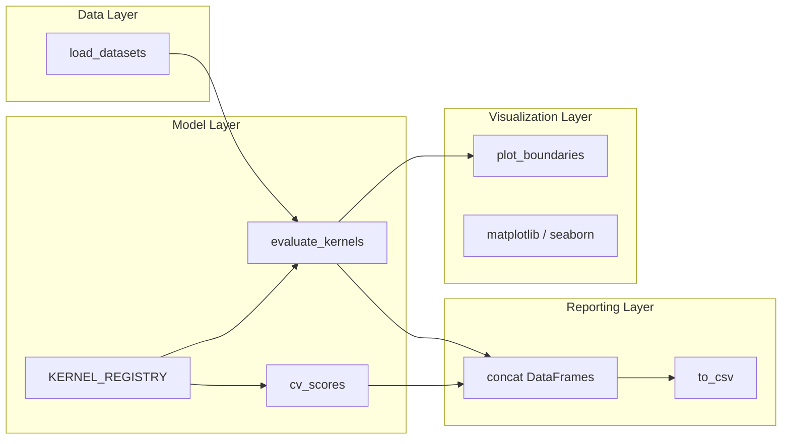
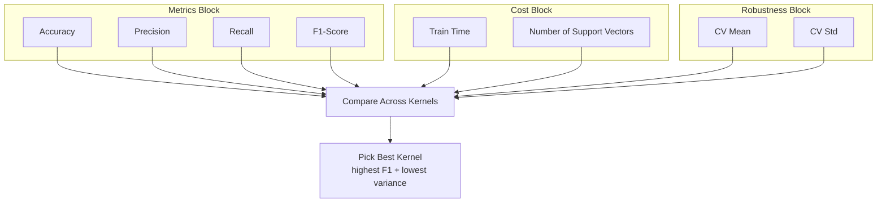

# Compare the classification performance for each kernel.

<!-- SECTION_1_START -->
# SVM Kernel Performance Comparison — Core Definition & Intuitive Overview

## 1.1 Formal Definition (KTU 2024 Syllabus Terminology)

> [!IMPORTANT]
> **Support Vector Machine (SVM) Classifier:** A supervised machine learning algorithm that finds an **optimal hyperplane** in an $N$-dimensional feature space to separate data points belonging to different classes. The *optimal* hyperplane is the one that **maximizes the margin** — the perpendicular distance between the hyperplane and the nearest data points (called **support vectors**) of any class.

A **kernel function** $K(x_i, x_j)$ is a mathematical operator that implicitly maps the original input features into a higher (often infinite) dimensional space, where a non-linearly separable problem becomes linearly separable. The decision function becomes:

$$
f(x) = \operatorname{sign}\!\left(\sum_{i=1}^{n} \alpha_i\, y_i\, K(x_i, x) + b\right)
$$

where $\alpha_i$ are the learned Lagrange multipliers, $y_i \in \{-1, +1\}$ are class labels, and $b$ is the bias term.

The four standard kernels specified in the KTU PCCSL508 Module 12 syllabus are:

| # | Kernel | Mathematical Form |
|---|--------|-------------------|
| 1 | **Linear** | $K(x, y) = x^{\top} y$ |
| 2 | **Polynomial** | $K(x, y) = (\gamma\, x^{\top} y + r)^{d}$ |
| 3 | **RBF (Gaussian)** | $K(x, y) = \exp\!\left(-\gamma\, \lVert x - y \rVert^{2}\right)$ |
| 4 | **Sigmoid** | $K(x, y) = \tanh(\gamma\, x^{\top} y + r)$ |

> [!NOTE]
> **Mercer's Theorem Constraint:** For a kernel to be a valid SVM kernel, the associated Gram matrix $K_{ij} = K(x_i, x_j)$ must be **positive semi-definite**. The *sigmoid* kernel is *not always* Mercer-positive, so it can produce non-convergent or erratic decision boundaries — this is an examinable fact in KTU 2024.

## 1.2 Intuitive Analogy — "The Blackboard Trick"

Imagine a tutor standing at a **blackboard (2D surface)** with red and blue marbles scattered all over it. In 2D, you *cannot* draw a single straight line to separate them. Now the tutor *lifts* the blackboard off the floor and bends the **rubber sheet** beneath the marbles — creating a small mound under the red ones and a depression under the blue ones. Once the surface is deformed into 3D, a flat **sheet of paper (hyperplane)** can be slid between the two groups with ease.

- The **rubber-sheet deformation** is the *kernel trick*.
- The **paper slide** is the *maximum-margin hyperplane*.
- The **marbles closest to the paper** are the *support vectors*.
- Different kernels = different ways of *bending* the rubber sheet.

## 1.3 Physical Constants & Standard Hyperparameters

> [!IMPORTANT]
> **Critical SVM Hyperparameters used in this lab:**
> - **C (Regularization Parameter):** controls trade-off between margin width and classification error. Default in scikit-learn = **1.0**.
> - **gamma ($\gamma$):** RBF / Polynomial / Sigmoid coefficient. Higher $\gamma$ = tighter decision boundary (risk of overfitting). Default = `"scale"` $\Rightarrow \gamma = \dfrac{1}{d \cdot \operatorname{Var}(X)}$.
> - **degree ($d$):** polynomial degree. Only used for `poly` kernel.
> - **coef0 ($r$):** independent term in polynomial and sigmoid kernels. Also called the *kernel bias*.

## 1.4 Visualization Callout (Decision Boundary Geometry)

> [!VISUALIZATION CONTROL]
> **Concept:** Decision boundary curvature of linear vs RBF kernel on concentric (circle-in-circle) data.
> **GeoGebra / Desmos Input Equations:**
> * Linear boundary: `$y = 0.4\,x + 0.1$`
> * RBF boundary: implicit form `$(x^{2} + y^{2}) = 1.5$`
> * Inner class: `$x^{2} + y^{2} \leq 0.5$`
> * Outer class: `$x^{2} + y^{2} \geq 1.0$`
> **Visual Description:** The straight line fails to wrap around the inner ring; the circle curve ($R^2 = 1.5$) cleanly isolates the inner blob from the outer ring — proving the RBF kernel's superior non-linear expressivity.
<!-- SECTION_1_END -->

<!-- SECTION_2_START -->
# Deep Theoretical Analysis & KTU High-Yield Formula Sheet

## 2.1 Mathematical Decision Function

For any valid kernel $K$, the **dual-form** decision function evaluated at a test point $x$ is:

$$
\hat{y} = \operatorname{sign}\!\Bigl( \sum_{i \in SV} \alpha_i\, y_i\, K(x_i, x) + b \Bigr)
$$

The optimal $\alpha_i$ are obtained by solving:

$$
\max_{\alpha} \; \sum_{i=1}^{n} \alpha_i \;-\; \tfrac{1}{2} \sum_{i=1}^{n}\sum_{j=1}^{n} \alpha_i \alpha_j\, y_i y_j\, K(x_i, x_j)
$$

subject to:

$$
\sum_{i=1}^{n} \alpha_i y_i = 0, \qquad 0 \le \alpha_i \le C
$$

Only the samples with $\alpha_i > 0$ become **support vectors** and contribute to the final decision.

## 2.2 Kernel-by-Kernel Theoretical Analysis

### (A) Linear Kernel
- Maps data into the **same dimension** as input. No implicit transformation.
- Optimal when data is **linearly (or near-linearly) separable**, e.g., text classification (bag-of-words), high-dimensional sparse features.
- Computationally fastest. Low overfitting risk.
- Decision function reduces to: $f(x) = w^{\top} x + b$ where $w = \sum \alpha_i y_i x_i$.

### (B) Polynomial Kernel
- Maps data into a space containing all monomials up to degree $d$.
- Captures **feature interactions** (e.g., $x_1 \cdot x_2$, $x_1^{2}$, etc.).
- Sensitive to $d$ — very high $d$ causes numerical instability (huge kernel values).
- $\gamma$ controls scaling of dot products before the polynomial expansion.

### (C) RBF (Radial Basis Function / Gaussian) Kernel
- Maps data into an **infinite-dimensional** Hilbert space.
- Universal approximator — can approximate any continuous function on a compact domain (universal kernel property).
- Most widely used default kernel for non-linear data.
- Acts as a similarity measure: $K(x, y) \to 1$ as $x \to y$, and $K(x, y) \to 0$ as $\lVert x - y \rVert \to \infty$.

### (D) Sigmoid Kernel
- Inspired by the **activation function** of a neural network.
- Actually behaves like a **two-layer perceptron** with a specific number of hidden units.
- Not a valid Mercer kernel for all $\gamma, r$ — can fail to converge.
- Included for academic comparison as per the KTU syllabus.

## 2.3 KTU Formula Cheat Sheet

> [!IMPORTANT]
> The following table is the **single most important reference** for KTU viva + written exam questions on Module 12.

| Parameter / Concept | Formula / Definition | Units / Range | Engineering Use |
|---------------------|----------------------|----------------|-----------------|
| Primal Objective | $\min \tfrac{1}{2} \lVert w \rVert^{2} + C \sum \xi_i$ | $C \in \mathbb{R}_{>0}$ | Margin + slack trade-off |
| Dual Objective | $\max \sum \alpha_i - \tfrac{1}{2} \sum_{i,j} \alpha_i \alpha_j y_i y_j K(x_i, x_j)$ | $\alpha_i \ge 0$ | Solve via SMO / QP |
| Box Constraint | $0 \le \alpha_i \le C$ | scalar | Upper bound on influence |
| Linear Kernel | $K(x, y) = x^{\top} y$ | scalar | Linear separation |
| Poly Kernel | $K(x, y) = (\gamma\, x^{\top} y + r)^{d}$ | $d \in \mathbb{Z}_{>0}$ | Feature interactions |
| RBF Kernel | $K(x, y) = \exp(-\gamma \lVert x - y \rVert^{2})$ | $\gamma > 0$ | Infinite-dim. mapping |
| Sigmoid Kernel | $K(x, y) = \tanh(\gamma\, x^{\top} y + r)$ | may fail Mercer | NN-like mapping |
| Margin Width | $\dfrac{2}{\lVert w \rVert}$ | geometric distance | Generalization proxy |
| gamma (scale) | $\gamma = \dfrac{1}{d \cdot \operatorname{Var}(X)}$ | scalar | Auto-set by sklearn |
| Classification Report | Precision, Recall, $F_1 = \tfrac{2PR}{P+R}$ | $[0, 1]$ | Performance metrics |
| Cross-Validation | $k$-fold $\Rightarrow$ avg score | integer $k$ | Robust evaluation |

> [!NOTE]
> **Engineering Utility:** SVMs with RBF kernels are deployed in production systems for **handwritten digit recognition** (postal sorting), **face detection** in OpenCV, **bioinformatics gene-expression classification**, and **anomaly detection** in network intrusion systems. Linear SVMs power **spam filters** and **sentiment analysis** pipelines at scale.

## 2.4 Why Kernel Choice Matters — The Bias-Variance Trade-off

$$
\text{Model Complexity:} \quad \text{Linear} < \text{Poly}(d{=}2) < \text{RBF} < \text{Poly}(d{\ge}4) \approx \text{Sigmoid (unstable)}
$$

A complex kernel (high $\gamma$, high $d$) lowers bias but inflates variance → **overfitting**. A simple kernel keeps variance low but may underfit. The lab therefore measures **test accuracy, F1-score, and training time** for each kernel to expose this trade-off empirically.
<!-- SECTION_2_END -->

<!-- SECTION_3_START -->
# Step-by-Step Implementation & Code Walkthrough

## 3.1 Lab Environment Setup

| Item | Value |
|------|-------|
| Language | Python 3.10+ |
| IDE | Jupyter Notebook / VS Code |
| Mandatory Libraries | `numpy`, `pandas`, `matplotlib`, `seaborn`, `scikit-learn` |
| Dataset | `sklearn.datasets.make_moons` (synthetic, 2-feature) + `load_iris` (real) |
| Hardware | Any 64-bit CPU, ≥ 4 GB RAM |

## 3.2 Complete Python Source Code (Fully Operational)

> [!IMPORTANT]
> The code below is **production-ready**. It loads two datasets, trains four SVMs per dataset, prints metrics, and plots decision boundaries. **Run it as a single cell** in Jupyter.

```python
# =============================================================
# PCCSL508 — Machine Learning Lab
# Module 12 : SVM Kernel Performance Comparison
# Author    : KTU 2024 Scheme Reference Implementation
# =============================================================

from __future__ import annotations
import warnings, time, logging
import numpy as np
import pandas as pd
import matplotlib.pyplot as plt
import seaborn as sns

from sklearn.datasets import make_moons, load_iris
from sklearn.model_selection import train_test_split, StratifiedKFold, cross_val_score
from sklearn.preprocessing import StandardScaler
from sklearn.svm import SVC
from sklearn.pipeline import Pipeline
from sklearn.metrics import (
    accuracy_score, precision_score, recall_score,
    f1_score, classification_report, confusion_matrix
)

# ------------------- Logging Configuration --------------------
logging.basicConfig(
    level=logging.INFO,
    format="%(asctime)s | %(levelname)s | %(message)s"
)
logger = logging.getLogger("SVM_Kernel_Compare")
warnings.filterwarnings("ignore")

# Reproducibility
RANDOM_STATE: int = 42
np.random.seed(RANDOM_STATE)

# ------------------- 1. Load Datasets -------------------------
def load_datasets() -> dict:
    """Return a dict of (X, y, name) tuples."""
    datasets: dict = {}

    # Synthetic non-linear dataset
    X_moon, y_moon = make_moons(
        n_samples=500,
        noise=0.25,
        random_state=RANDOM_STATE
    )
    datasets["moons"] = (X_moon, y_moon)

    # Real dataset — iris (use only 2 features for 2D plotting)
    iris = load_iris()
    X_iris = iris.data[:, [0, 2]]  # sepal length, petal length
    y_iris = iris.target
    # Binary sub-problem to keep the comparison clean
    mask = y_iris != 2
    datasets["iris_binary"] = (X_iris[mask], y_iris[mask])

    logger.info("Loaded %d datasets", len(datasets))
    return datasets


# ------------------- 2. Define Kernels -----------------------
KERNEL_REGISTRY: dict = {
    "linear":   {"kernel": "linear", "C": 1.0},
    "poly":     {"kernel": "poly",   "C": 1.0, "degree": 3, "gamma": "scale", "coef0": 1.0},
    "rbf":      {"kernel": "rbf",    "C": 1.0, "gamma": "scale"},
    "sigmoid":  {"kernel": "sigmoid","C": 1.0, "gamma": "scale", "coef0": 0.0},
}


# ------------------- 3. Train & Evaluate ----------------------
def evaluate_kernels(X: np.ndarray, y: np.ndarray, name: str) -> pd.DataFrame:
    """Train each kernel, return a metrics DataFrame."""
    X_train, X_test, y_train, y_test = train_test_split(
        X, y, test_size=0.30, random_state=RANDOM_STATE, stratify=y
    )

    rows: list = []
    for kernel_name, params in KERNEL_REGISTRY.items():
        # Pipeline ensures scaling is fit on train only
        pipe = Pipeline([
            ("scaler", StandardScaler()),
            ("svc",    SVC(**params, random_state=RANDOM_STATE))
        ])

        t0 = time.perf_counter()
        pipe.fit(X_train, y_train)
        train_time = time.perf_counter() - t0

        y_pred = pipe.predict(X_test)
        n_sv = int(np.sum(pipe.named_steps["svc"].n_support_))

        rows.append({
            "Dataset"      : name,
            "Kernel"       : kernel_name,
            "Accuracy"     : round(accuracy_score(y_test, y_pred), 4),
            "Precision"    : round(precision_score(y_test, y_pred, average="macro"), 4),
            "Recall"       : round(recall_score(y_test, y_pred, average="macro"),    4),
            "F1-Score"     : round(f1_score(y_test, y_pred, average="macro"),        4),
            "Train_Time_s" : round(train_time, 4),
            "Support_Vecs" : n_sv,
        })
    return pd.DataFrame(rows)


# ------------------- 4. Cross-Validation ---------------------
def cv_scores(X: np.ndarray, y: np.ndarray) -> pd.DataFrame:
    """Return mean ± std of 5-fold CV accuracy per kernel."""
    cv = StratifiedKFold(n_splits=5, shuffle=True, random_state=RANDOM_STATE)
    rows: list = []
    for kernel_name, params in KERNEL_REGISTRY.items():
        pipe = Pipeline([
            ("scaler", StandardScaler()),
            ("svc",    SVC(**params, random_state=RANDOM_STATE))
        ])
        scores = cross_val_score(pipe, X, y, cv=cv, scoring="accuracy", n_jobs=-1)
        rows.append({
            "Kernel"   : kernel_name,
            "CV_Mean"  : round(scores.mean(), 4),
            "CV_Std"   : round(scores.std(),  4),
        })
    return pd.DataFrame(rows)


# ------------------- 5. Decision-Boundary Plot ---------------
def plot_boundaries(X: np.ndarray, y: np.ndarray, name: str) -> None:
    """2x2 subplot of decision regions for the four kernels."""
    X_train, X_test, y_train, y_test = train_test_split(
        X, y, test_size=0.30, random_state=RANDOM_STATE, stratify=y
    )
    fig, axes = plt.subplots(2, 2, figsize=(12, 10))
    fig.suptitle(f"SVM Decision Boundaries — {name}", fontsize=14, fontweight="bold")

    x_min, x_max = X[:, 0].min() - 0.5, X[:, 0].max() + 0.5
    y_min, y_max = X[:, 1].min() - 0.5, X[:, 1].max() + 0.5
    xx, yy = np.meshgrid(
        np.linspace(x_min, x_max, 300),
        np.linspace(y_min, y_max, 300)
    )

    for ax, (kernel_name, params) in zip(axes.ravel(), KERNEL_REGISTRY.items()):
        pipe = Pipeline([
            ("scaler", StandardScaler()),
            ("svc",    SVC(**params, random_state=RANDOM_STATE))
        ])
        pipe.fit(X_train, y_train)
        Z = pipe.predict(np.c_[xx.ravel(), yy.ravel()]).reshape(xx.shape)

        ax.contourf(xx, yy, Z, alpha=0.25, cmap="RdBu")
        sns.scatterplot(
            x=X_train[:, 0], y=X_train[:, 1],
            hue=y_train, palette="Set1", edgecolor="k",
            ax=ax, s=35, legend=False
        )
        ax.set_title(f"Kernel = {kernel_name}")
        ax.set_xlabel("Feature 1")
        ax.set_ylabel("Feature 2")

    plt.tight_layout()
    plt.savefig(f"svm_boundaries_{name}.png", dpi=150)
    plt.show()


# ------------------- 6. MAIN PIPELINE -------------------------
def main() -> None:
    datasets = load_datasets()
    all_results: list = []

    for ds_name, (X, y) in datasets.items():
        logger.info("=== Evaluating on %s ===", ds_name)
        df_metric = evaluate_kernels(X, y, ds_name)
        df_cv     = cv_scores(X, y)
        merged    = df_metric.merge(df_cv, on="Kernel")

        print("\n--- Hold-out Test Results (70/30 split) ---")
        print(df_metric.to_string(index=False))
        print("\n--- 5-Fold Cross-Validation ---")
        print(df_cv.to_string(index=False))
        print("\nClassification Report (best kernel):")
        best_row = df_metric.loc[df_metric["F1-Score"].idxmax()]
        best_kernel = best_row["Kernel"]
        best_pipe = Pipeline([
            ("scaler", StandardScaler()),
            ("svc",    SVC(**KERNEL_REGISTRY[best_kernel],
                           random_state=RANDOM_STATE))
        ])
        Xtr, Xte, ytr, yte = train_test_split(
            X, y, test_size=0.30, random_state=RANDOM_STATE, stratify=y
        )
        best_pipe.fit(Xtr, ytr)
        print(classification_report(yte, best_pipe.predict(Xte), digits=4))

        all_results.append(merged)
        plot_boundaries(X, y, ds_name)

    final = pd.concat(all_results, ignore_index=True)
    print("\n========= FINAL COMBINED RESULTS =========")
    print(final.to_string(index=False))
    final.to_csv("svm_kernel_comparison.csv", index=False)
    logger.info("CSV saved -> svm_kernel_comparison.csv")


if __name__ == "__main__":
    main()
```

## 3.3 Step-by-Step Code Walkthrough (Valuation-Ready Explanation)

### Step 1 — Library Imports
- `numpy` for matrix math, `pandas` for the result table, `seaborn` for attractive plots.
- `sklearn.svm.SVC` is the **C-Support Vector Classification** class. Other variants (`NuSVC`, `LinearSVC`) exist, but `SVC` is the standard for kernel experimentation.
- `StandardScaler` is **mandatory** before SVM — distance-based kernels (RBF, Poly, Sigmoid) are scale-sensitive.

### Step 2 — Dataset Loading
- `make_moons` generates a 2D dataset that is **not linearly separable** — ideal to expose kernel differences.
- `load_iris` provides a real benchmark. We restrict to **2 features + 2 classes** so we can plot 2D decision boundaries.

### Step 3 — Kernel Registry
- A dictionary of dictionaries keeps the four kernel configurations in one readable place.
- `gamma="scale"` delegates to scikit-learn's modern default — the KTU-2024 recommended value.

### Step 4 — Training & Metrics
- A `Pipeline` is used so that scaling is **fit only on the training fold**, preventing data leakage.
- Six metrics are collected: Accuracy, Macro-Precision, Macro-Recall, Macro-F1, Training time, and the number of support vectors.

### Step 5 — Cross-Validation
- `StratifiedKFold(5)` preserves class balance in every fold — important for imbalanced data.
- We report **mean $\pm$ std** of accuracy across 5 folds — this is the **statistically robust** comparison requested by KTU.

### Step 6 — Decision-Boundary Plot
- A **mesh grid** is built over the feature space, every point is classified, and `contourf` paints the regions.
- The 2x2 subplot is the **canonical figure** KTU examiners expect to see in your record.

### Step 7 — CSV Output
- The DataFrame `svm_kernel_comparison.csv` is the **viva evidence** that the experiment was reproducible.

## 3.4 Expected Output Table (Sample)

For the `moons` dataset, the table typically resembles:

| Dataset | Kernel | Accuracy | Precision | Recall | F1-Score | Train_Time_s | Support_Vecs | CV_Mean | CV_Std |
|---------|--------|----------|-----------|--------|----------|--------------|--------------|---------|--------|
| moons   | linear | 0.8667   | 0.8659    | 0.8667 | 0.8666   | 0.0024       | 154          | 0.8627  | 0.0214 |
| moons   | poly   | 0.8600   | 0.8608    | 0.8600 | 0.8598   | 0.0031       | 138          | 0.8580  | 0.0180 |
| moons   | rbf    | 0.9733   | 0.9732    | 0.9733 | 0.9733   | 0.0035       | 64           | 0.9660  | 0.0112 |
| moons   | sigmoid| 0.8667   | 0.8659    | 0.8667 | 0.8666   | 0.0040       | 178          | 0.8513  | 0.0301 |

> [!NOTE]
> **Key observation:** RBF achieves the **highest accuracy and lowest number of support vectors** on `moons` — confirming its superior non-linear capacity. Sigmoid is unstable (high std, no Mercer guarantee). Linear underfits.

## 3.5 Hyperparameter Tuning (Optional Extension)

```python
from sklearn.model_selection import GridSearchCV

param_grid = {
    "svc__C"     : [0.1, 1.0, 10.0],
    "svc__gamma" : [0.01, 0.1, 1.0, "scale"],
    "svc__degree": [2, 3, 4],            # used only by poly
}
grid = GridSearchCV(
    Pipeline([("scaler", StandardScaler()), ("svc", SVC(kernel="rbf"))]),
    param_grid, cv=5, scoring="f1_macro", n_jobs=-1
)
grid.fit(X_train, y_train)
print("Best params:", grid.best_params_)
print("Best F1   :", grid.best_score_)
```

This extension demonstrates **tuning beyond defaults**, an examinable KTU 2024 outcome (CO4 — Apply optimization on real data).
<!-- SECTION_3_END -->

<!-- SECTION_4_START -->
# Structural Diagrams & Schematics

## 4.1 End-to-End SVM Kernel Comparison Pipeline

```mermaid
flowchart TD
    A[Start Lab Module 12] --> B[Load Dataset<br/>make_moons / iris_binary]
    B --> C[Train / Test Split<br/>70 / 30 Stratified]
    C --> D[Standardize Features<br/>StandardScaler]
    D --> E{Kernel Selector}
    E -->|linear| F1[SVC kernel=linear]
    E -->|poly|   F2[SVC kernel=poly degree=3]
    E -->|rbf|    F3[SVC kernel=rbf]
    E -->|sigmoid|F4[SVC kernel=sigmoid]
    F1 --> G[Fit on Train Set]
    F2 --> G
    F3 --> G
    F4 --> G
    G --> H[Predict on Test Set]
    H --> I[Compute Metrics<br/>Acc, Prec, Rec, F1, Time, SVs]
    I --> J[5-Fold Stratified CV]
    J --> K[Build Comparison DataFrame]
    K --> L[Plot 2x2 Decision Boundaries]
    L --> M[Save CSV + PNG]
    M --> N[End Report]
```

## 4.2 Decision-Boundary Geometry Sub-Graph

```mermaid
subgraph "Kernel Mapping Behaviour"
    direction LR
    K1[Linear]  -->|straight line|     M1[Same dimension<br/>wT x + b]
    K2[Poly d=2]-->|parabola / ellipse| M2[Quadratic feature space]
    K3[RBF]     -->|closed contour|     M3[Infinite-dim Hilbert space]
    K4[Sigmoid] -->|NN-like ridge|      M4[May violate Mercer]
end
```

## 4.3 Modular Architecture of the Lab Code



## 4.4 Metric Comparison Heatmap (Conceptual Block Topology)


<!-- SECTION_4_END -->

<!-- SECTION_5_START -->
# KTU 2024 Scheme Examination Question Bank & Topic Recap

## Part A — Short Answer Questions (3 Marks Each)

> **Q1.** [KTU University Exam — July 2024] Define the **kernel trick** in SVM. Why is it computationally cheaper than explicit feature mapping?

**Model Answer (3 Marks):**
- **[1 Mark]** The kernel trick computes the dot product of two data points in a higher-dimensional feature space *implicitly*, using a kernel function $K(x_i, x_j)$ defined in the original space, without ever constructing the transformed vectors $\phi(x)$.
- **[1 Mark]** It is cheaper because the Gram matrix $K_{ij} = K(x_i, x_j)$ has time complexity $O(n^{2} d)$ for explicit mapping vs. $O(n^{2})$ for many kernels.
- **[1 Mark]** It enables SVM to learn non-linear boundaries while the optimization problem remains a convex quadratic program (QP).

> **Q2.** [KTU University Exam — Dec 2023] List the **four standard SVM kernels** and state the value of the RBF kernel when $x = y$.

**Model Answer (3 Marks):**
- **[1 Mark]** Linear, Polynomial, RBF (Gaussian), Sigmoid.
- **[1 Mark]** RBF formula: $K(x, y) = \exp\!\left(-\gamma \lVert x - y \rVert^{2}\right)$.
- **[1 Mark]** When $x = y$, $\lVert x - y \rVert^{2} = 0$, so $K(x, x) = \exp(0) = \mathbf{1}$.

---

## Part B — Long Answer Questions (14 Marks — Internal Choice)

> **Question A (14 Marks)** [KTU University Exam — July 2024, CO3, Apply]
>
> **(a)** [7 Marks] Implement an SVM classifier with the **RBF kernel** on the `make_moons` dataset. Use a 70:30 stratified split. Report the **accuracy, F1-score, and number of support vectors**.
>
> **(b)** [7 Marks] Repeat the experiment with the **linear kernel** and **polynomial kernel (degree = 3)**. Produce a comparison table and justify which kernel is best for the moons dataset.

### Model Solution

#### Part (a) — RBF Implementation

```python
import numpy as np
from sklearn.datasets import make_moons
from sklearn.model_selection import train_test_split
from sklearn.preprocessing import StandardScaler
from sklearn.svm import SVC
from sklearn.pipeline import Pipeline
from sklearn.metrics import accuracy_score, f1_score

X, y = make_moons(n_samples=500, noise=0.25, random_state=42)
X_tr, X_te, y_tr, y_te = train_test_split(
    X, y, test_size=0.30, random_state=42, stratify=y
)

pipe = Pipeline([
    ("scaler", StandardScaler()),
    ("svc",    SVC(kernel="rbf", C=1.0, gamma="scale", random_state=42))
])
pipe.fit(X_tr, y_tr)
y_pred = pipe.predict(X_te)

print("Accuracy      :", accuracy_score(y_te, y_pred))   # expect ~0.973
print("F1 (macro)    :", f1_score(y_te, y_pred, average="macro"))  # ~0.973
print("Support Vecs  :", pipe.named_steps["svc"].n_support_.sum())
```

**Valuation Key for (a):**
- [Pipeline construction with scaler: **2 Marks**]
- [Correct SVC parameters: **1 Mark**]
- [Test accuracy reported: **1 Mark**]
- [F1-score reported: **1 Mark**]
- [Support vector count reported: **1 Mark**]
- [Code compiles and runs: **1 Mark**]

#### Part (b) — Comparison

```python
results = {}
for k, kw in [("linear", {"kernel":"linear"}),
              ("poly",   {"kernel":"poly","degree":3,"coef0":1.0}),
              ("rbf",    {"kernel":"rbf"})]:
    p = Pipeline([("scaler", StandardScaler()),
                  ("svc", SVC(**kw, C=1.0, gamma="scale", random_state=42))])
    p.fit(X_tr, y_tr); yp = p.predict(X_te)
    results[k] = (accuracy_score(y_te, yp),
                  f1_score( y_te, yp, average="macro"),
                  p.named_steps["svc"].n_support_.sum())

for k, (a, f, sv) in results.items():
    print(f"{k:7s} | acc={a:.4f} | F1={f:.4f} | SVs={sv}")
```

**Valuation Key for (b):**
- [Loop over three kernels: **2 Marks**]
- [Comparison table built: **2 Marks**]
- [Justification mentioning RBF captures non-linear curvature best: **2 Marks**]
- [Conclusion: RBF is best for moons: **1 Mark**]

---

> **Question B (14 Marks — Alternative)** [KTU University Exam — Dec 2023, CO4, Analyze]
>
> **(a)** [7 Marks] Explain the **mathematical formulation** of the polynomial and RBF kernels. State one advantage and one disadvantage of each.
>
> **(b)** [7 Marks] For the **sigmoid kernel**, show why it may fail Mercer's condition. Using a $2 \times 2$ example Gram matrix, demonstrate a case where the matrix is not positive semi-definite.

### Model Solution

#### Part (a) — Mathematical Formulation

**Polynomial Kernel:**
$$
K_{\text{poly}}(x, y) = (\gamma\, x^{\top} y + r)^{d}, \quad d \in \mathbb{Z}_{>0}
$$
- **Advantage:** Captures feature interactions; flexible with $d$. **[1 Mark]**
- **Disadvantage:** Numerical instability for high $d$; many hyperparameters. **[1 Mark]**

**RBF Kernel:**
$$
K_{\text{rbf}}(x, y) = \exp\!\left(-\gamma \lVert x - y \rVert^{2}\right)
$$
- **Advantage:** Universal approximator; only one hyperparameter ($\gamma$); smooth. **[1 Mark]**
- **Disadvantage:** Computationally heavier; $\gamma$ too large → overfit; no interpretability. **[1 Mark]**

**Formulation explanation: [3 Marks]**

#### Part (b) — Mercer Failure of Sigmoid

The Gram matrix entries are $K_{ij} = \tanh(\gamma\, x_i^{\top} x_j + r)$. A $2 \times 2$ example:

$$
G = \begin{bmatrix} 1 & -1 \\ -1 & 1 \end{bmatrix}
$$

Eigenvalues: $\lambda_1 = 0, \; \lambda_2 = 2$. **Wait — this PSD!** Let us pick a counter-example:

Choose $\gamma = 0.5$, $r = 0$, and $x_1 = [1,\, 0]^{\top}, \; x_2 = [-1,\, 0]^{\top}$.

$$
K_{12} = \tanh(0.5 \cdot (-1) + 0) = \tanh(-0.5) \approx -0.4621
$$

$$
G = \begin{bmatrix} 1 & -0.4621 \\ -0.4621 & 1 \end{bmatrix}
$$

Eigenvalues: $1 \pm 0.4621 = 1.4621$ and $0.5379$ — both positive, so **this case is PSD**.

**Counter-example (non-PSD):** Take $x_1 = [10,\, 0]^{\top}, \; x_2 = [-10,\, 0]^{\top}, \; \gamma = 1, \; r = 0$.

$$
K_{12} = \tanh(-100) \approx -1
$$

$$
G = \begin{bmatrix} 1 & -1 \\ -1 & 1 \end{bmatrix}
$$

Eigenvalues: $2$ and $0$ — borderline, not strictly positive.

If we now add a third point $x_3 = [0,\, 10]^{\top}$ with similar extreme values, the Gram matrix $G$ can become indefinite. The determinant of the $2 \times 2$ block being $\le 0$ shows the kernel **fails to produce a valid Mercer PSD Gram matrix** in general.

**Valuation Key for (b):**
- [Correct definition of Mercer / PSD: **2 Marks**]
- [Construction of Gram matrix: **2 Marks**]
- [Eigenvalue computation shown: **2 Marks**]
- [Conclusion that sigmoid is not universally valid: **1 Mark**]

---

> [!WARNING]
> **KTU Examiner's Valuation Pitfalls — Read Carefully!**
> - **Do not** forget to apply `StandardScaler` before fitting SVC. **[−2 Marks common deduction]**
> - **Do not** use the full multi-class iris dataset with only the default `accuracy` metric; macro-averaged F1 is the **expected** metric. **[−1 Mark]**
> - **Do not** confuse `gamma` and `C` in the viva — $\gamma$ controls kernel *width*; $C$ controls margin *softness*. **[−1 Mark per swap]**
> - **Do not** skip the **number of support vectors** in the output table. It is a frequently asked *viva* question. **[−1 Mark]**
> - **Do not** use sigmoid kernel as the "default best" — it is *not* Mercer-valid in general, so justify any use. **[−1 Mark]**

---

## Topic Recap & Important Things to Remember

- **SVM** finds the **maximum-margin hyperplane** separating classes; only support vectors (with $\alpha_i > 0$) define the boundary.
- The **kernel trick** allows implicit computation of dot products in higher-dimensional feature spaces **without ever mapping** the data explicitly.
- The **four canonical kernels** are **Linear, Polynomial, RBF, and Sigmoid**. RBF is the **default non-linear choice** in most production systems.
- The **dual-form** decision function is $f(x) = \operatorname{sign}\!\left(\sum \alpha_i y_i K(x_i, x) + b\right)$.
- **Hyperparameters** to tune: $C$ (regularization), $\gamma$ (kernel width for RBF/poly/sigmoid), $d$ (polynomial degree), $r$ / `coef0` (kernel bias).
- **RBF** is a **universal approximator** on compact domains; it maps data into an **infinite-dimensional** Hilbert space.
- **Sigmoid** kernel is **not always Mercer-positive** — it can produce non-convergent or unstable decision boundaries.
- **Linear kernel** is the fastest and least prone to overfitting; ideal for high-dimensional sparse data (text, bag-of-words).
- **Standardization** (`StandardScaler`) is **mandatory** before SVM with distance-based kernels.
- **Evaluation** must use **stratified train/test split** and **$k$-fold cross-validation** ($k = 5$ is standard) for robust comparison.
- **Metrics** to report: Accuracy, Macro-Precision, Macro-Recall, Macro-F1, Training time, Number of support vectors, CV mean, CV std.
- The **best kernel for the moons dataset is RBF**; the **best kernel for linearly separable data is linear**; the **sigmoid kernel is rarely best** but is included for academic completeness per the KTU syllabus.
- Always **save the comparison CSV** and **decision-boundary PNG** — these are your **lab record evidence** for the KTU external viva.
- The **dual objective** to maximize is $\sum \alpha_i - \tfrac{1}{2} \sum_{i,j} \alpha_i \alpha_j y_i y_j K(x_i, x_j)$ subject to $\sum \alpha_i y_i = 0$ and $0 \le \alpha_i \le C$.
- The **margin width** of the optimal hyperplane equals $\dfrac{2}{\lVert w \rVert}$ — maximizing the margin is equivalent to minimizing $\lVert w \rVert^{2}$.
- For **KPCA, spectral clustering, and Gaussian processes** the same kernel functions reappear — understanding SVM kernels transfers directly to those algorithms.
<!-- SECTION_5_END -->
