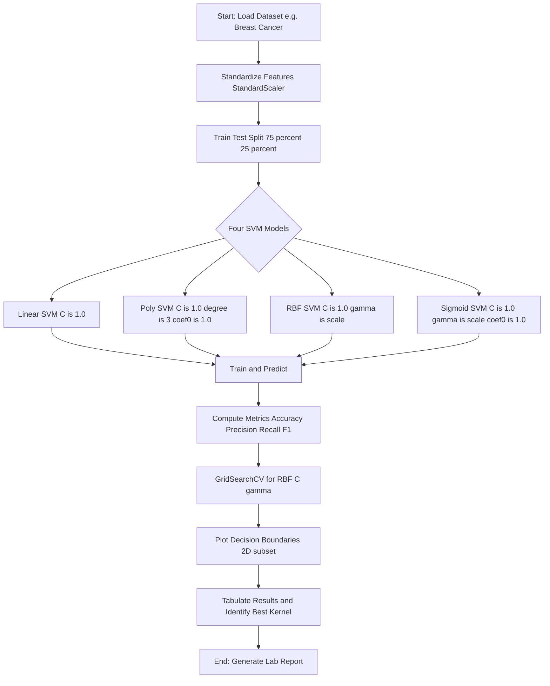
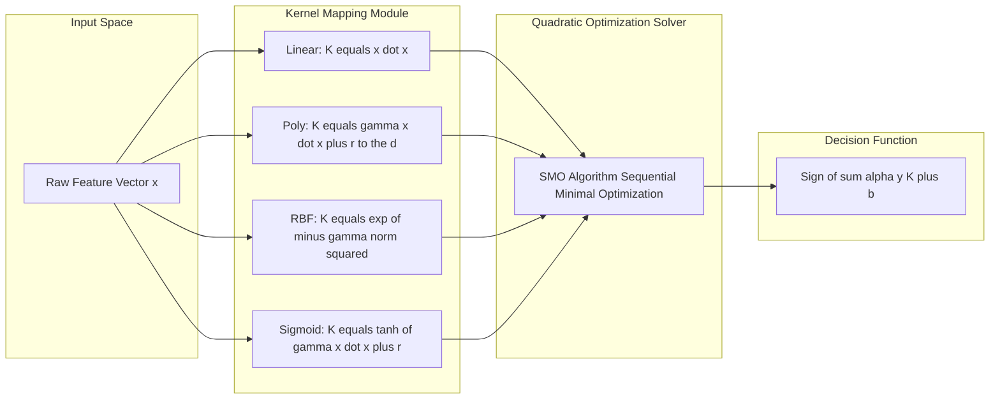
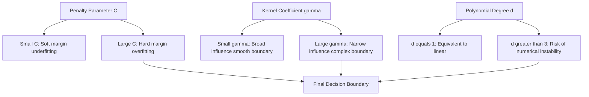
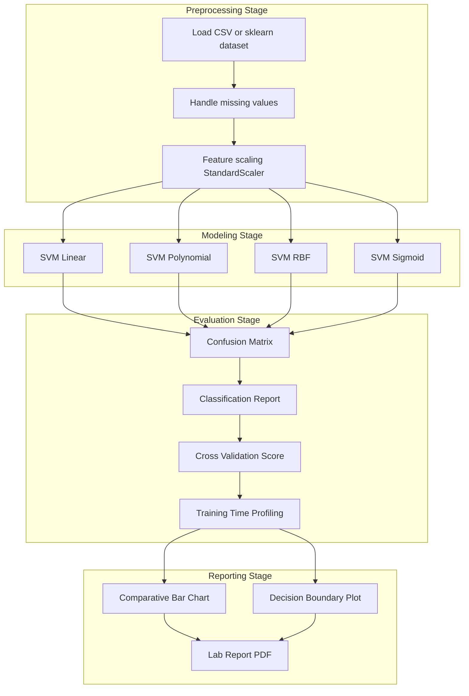

# Discuss the strengths and weaknesses of each kernel type.

<!-- SECTION_1_START -->
# Module 12: SVM Classifiers with Linear, Polynomial, and RBF Kernels

## 1. Core Technical Definition & Intuitive Overview

### 1.1 Formal Academic Definition (KTU 2024 Syllabus)

A **Support Vector Machine (SVM)** is a supervised machine learning algorithm used for classification and regression tasks that finds an optimal hyperplane in an $N$-dimensional feature space to separate data points belonging to different classes. The optimal hyperplane is the one that maximizes the **margin** — the distance between the hyperplane and the nearest data points (called **support vectors**) from either class.

When data is not linearly separable in its original input space, SVM employs the **kernel trick** — an implicit mapping $\phi: \mathbb{R}^d \to \mathbb{R}^D$ ($D \gg d$) that transforms data into a higher-dimensional space where linear separation becomes possible, **without explicitly computing the transformation**. This is achieved by replacing the dot product $\langle x_i, x_j \rangle$ with a kernel function $K(x_i, x_j) = \langle \phi(x_i), \phi(x_j) \rangle$.

The mathematical optimization problem (primal form) is:

$$\min_{w, b, \xi} \frac{1}{2} \|w\|^2 + C \sum_{i=1}^{n} \xi_i$$

subject to the constraints:

$$y_i (w^T \phi(x_i) + b) \geq 1 - \xi_i, \quad \xi_i \geq 0$$

where $w$ is the weight vector, $b$ is the bias, $\xi_i$ are **slack variables** for soft margin classification, and $C$ is the regularization parameter (also called the penalty parameter).

> [!IMPORTANT]
> **KTU 2024 Syllabus Highlight**: The lab requires students to *implement* SVM with **Linear, Polynomial, Radial Basis Function (RBF/Gaussian), and Sigmoid** kernels, train them on standard benchmark datasets, and produce a **comparative performance report** based on accuracy, precision, recall, F1-score, training time, and decision boundary complexity.

### 1.2 Conceptual Analogy / Intuitive Overview

> [!NOTE]
> **Real-World Analogy — The Fruit Sorting Conveyor Belt**
>
> Imagine a conveyor belt carrying two types of fruits — **red apples** and **green mangoes** — arriving in a single file line. Your job is to place a **straight stick (the hyperplane)** on the belt such that apples fall on one side and mangoes on the other.
>
> - **Linear Kernel**: Works when fruits are already sorted by size and color in a perfectly linear pattern. You just place the stick at the gap.
> - **Polynomial Kernel**: Useful when fruits of the same type are arranged in a **curved cluster** (e.g., mangoes grouped in a U-shape). The stick is replaced with a **parabolic curve**.
> - **RBF (Gaussian) Kernel**: The most powerful — works when mangoes are scattered in **concentric circles** surrounded by apples. The RBF kernel virtually "lifts" every fruit into a 3D space where a flat plane can easily cut between them.
> - **Sigmoid Kernel**: Mimics a neural network activation; useful for non-linear patterns but less stable and rarely used in practice.

This is exactly the **kernel trick** — instead of physically lifting the fruits into 3D, you compute a similarity score (the kernel value) that *behaves as if* you had.

### 1.3 Standard Constants and Hyperparameters

| Symbol | Meaning | Typical Value |
|---|---|---|
| $C$ | Regularization / penalty parameter | $0.01$ to $1000$ |
| $\gamma$ | Kernel coefficient (RBF, Poly, Sigmoid) | $0.001$ to $10$ |
| $d$ (or `degree`) | Polynomial degree | $2, 3, 4$ |
| $r$ (or `coef0`) | Independent term in Poly/Sigmoid | $0.0$ to $1.0$ |

> [!VISUALIZATION CONTROL]
> **Concept:** Decision Boundary Geometry per Kernel on a 2D Non-Linear Dataset (e.g., concentric circles).
> **GeoGebra / Desmos Input Equations:**
> - Linear classifier (fails): $f(x, y) = ax + by + c$
> - Polynomial boundary (degree 2): $f(x, y) = x^2 + y^2 - 0.5 = 0$
> - RBF implicit boundary: $K(x, y) = e^{-\gamma((x-x_0)^2 + (y-y_0)^2)}$
> **Visual Description:** On the $xy$-plane, the linear kernel produces a single straight line that cannot separate the two circular clusters. The polynomial kernel produces a smooth quadratic curve. The RBF kernel produces a tight, closed contour that perfectly hugs the inner cluster.

---

<!-- SECTION_1_END -->

<!-- SECTION_2_START -->
# 2. Deep Theoretical Analysis & KTU High-Yield Formula Sheet

## 2.1 The Four Kernels — Operational Logic Breakdown

The **kernel function** $K(x_i, x_j)$ computes the dot product of two vectors *as if* they had been mapped into a higher-dimensional space. The four major kernels used in SVMs are described below.

### 2.1.1 Linear Kernel

The simplest kernel — equivalent to a standard linear classifier (no transformation).

$$K_{\text{linear}}(x_i, x_j) = x_i^T x_j = \sum_{k=1}^{d} x_{ik} x_{jk}$$

- **Why it works**: When data is already linearly separable (or approximately so) and feature dimensionality is high relative to sample size.
- **How it works**: It is the *dot product itself*, so no implicit transformation occurs. Computationally the fastest.

### 2.1.2 Polynomial Kernel

Captures non-linear interactions of features up to a specified degree.

$$K_{\text{poly}}(x_i, x_j) = (\gamma \cdot x_i^T x_j + r)^d$$

- **Why it works**: It models feature conjunctions like $x_1^2$, $x_1 x_2$, $x_2^2$ (for $d=2$) implicitly.
- **How it works**: The parameter $d$ controls the **degree of non-linearity**. Higher $d$ means more curved boundaries but also higher overfitting risk.

### 2.1.3 Radial Basis Function (RBF / Gaussian) Kernel

The most widely used non-linear kernel.

$$K_{\text{RBF}}(x_i, x_j) = e^{-\gamma \|x_i - x_j\|^2}$$

- **Why it works**: It maps data into an *infinite-dimensional* Hilbert space. The similarity between two points decays exponentially with squared Euclidean distance.
- **How it works**: $\gamma = \frac{1}{2\sigma^2}$ controls the **local influence** of each training point — large $\gamma$ means narrow influence (complex boundary), small $\gamma$ means broad influence (smooth boundary).

### 2.1.4 Sigmoid Kernel

Inspired by neural network activation functions.

$$K_{\text{sigmoid}}(x_i, x_j) = \tanh(\gamma \cdot x_i^T x_j + r)$$

- **Why it works**: It mimics a two-layer perceptron and can model non-monotonic relationships.
- **How it works**: The hyperbolic tangent squashes the dot product to a value in $(-1, 1)$.

## 2.2 KTU Formula Sheet / Cheat Sheet

| Kernel | Formula | Hyperparameters | Implicit Mapping Dimension | Computational Cost |
|---|---|---|---|---|
| **Linear** | $K(x_i, x_j) = x_i^T x_j$ | $C$ | $d$ (original) | $O(d)$ — fastest |
| **Polynomial** | $K(x_i, x_j) = (\gamma x_i^T x_j + r)^d$ | $C$, $\gamma$, $r$, $d$ | $\binom{d + d_{feat}}{d}$ | $O(d)$ |
| **RBF (Gaussian)** | $K(x_i, x_j) = e^{-\gamma \vert\vert x_i - x_j \vert\vert^2}$ | $C$, $\gamma$ | Infinite | $O(d)$ |
| **Sigmoid** | $K(x_i, x_j) = \tanh(\gamma x_i^T x_j + r)$ | $C$, $\gamma$, $r$ | Not a valid Mercer kernel in general | $O(d)$ |

> [!IMPORTANT]
> **Mercer's Condition (Exam Favorite)**: A function $K$ is a *valid SVM kernel* if and only if it is **symmetric** ($K(x_i, x_j) = K(x_j, x_i)$) and **positive semi-definite** for all inputs. RBF and Linear kernels always satisfy this. The Sigmoid kernel **does not always** satisfy Mercer's condition, which is one of its key weaknesses.

## 2.3 Engineering Utility — Why This Matters in Production

| Kernel | Industry Use-Case |
|---|---|
| **Linear** | Text classification (e.g., spam detection, sentiment analysis) where TF-IDF vectors are high-dimensional and sparse. |
| **Polynomial** | Image processing (e.g., edge detection kernels), moderate-degree non-linearity. |
| **RBF** | Bioinformatics (gene expression classification), anomaly detection, general-purpose default kernel. |
| **Sigmoid** | Historical neural-network emulation; rarely used in modern production systems. |

### Decision Flow for Kernel Selection

The following decision logic is used in real-world ML pipelines:

1. **If** $n \gg d$ (many samples, few features) **and** data is linearly separable → **Linear** (fast, interpretable).
2. **If** $n$ is moderate and clear non-linear structure exists → **RBF** (default, robust).
3. **If** domain knowledge suggests specific feature interactions → **Polynomial** (tunable degree).
4. **If** emulating a neural network is desired → **Sigmoid** (with caution).
5. **Always** perform **GridSearchCV** with cross-validation to tune $C$ and $\gamma$.

---

<!-- SECTION_2_END -->

<!-- SECTION_3_START -->
# 3. Step-by-Step Derivations & Code/Symbolic Implementation

## 3.1 Mathematical Derivation — From Dual Form to Kernel Trick

The SVM **primal** optimization is:

$$\min_{w, b} \frac{1}{2} \|w\|^2 \quad \text{subject to} \quad y_i (w^T x_i + b) \geq 1$$

Using **Lagrange multipliers** $\alpha_i \geq 0$, we form the Lagrangian:

$$\mathcal{L}(w, b, \alpha) = \frac{1}{2} \|w\|^2 - \sum_{i=1}^{n} \alpha_i \left[ y_i (w^T x_i + b) - 1 \right]$$

Setting partial derivatives to zero:

$$\frac{\partial \mathcal{L}}{\partial w} = w - \sum_{i=1}^{n} \alpha_i y_i x_i = 0 \implies w = \sum_{i=1}^{n} \alpha_i y_i x_i$$

$$\frac{\partial \mathcal{L}}{\partial b} = -\sum_{i=1}^{n} \alpha_i y_i = 0 \implies \sum_{i=1}^{n} \alpha_i y_i = 0$$

Substituting back yields the **dual problem**:

$$\max_{\alpha} \sum_{i=1}^{n} \alpha_i - \frac{1}{2} \sum_{i=1}^{n} \sum_{j=1}^{n} \alpha_i \alpha_j y_i y_j \, \langle x_i, x_j \rangle$$

subject to $\alpha_i \geq 0$ and $\sum_i \alpha_i y_i = 0$.

**The Kernel Trick**: Replace the dot product $\langle x_i, x_j \rangle$ with a kernel $K(x_i, x_j)$:

$$\max_{\alpha} \sum_{i=1}^{n} \alpha_i - \frac{1}{2} \sum_{i=1}^{n} \sum_{j=1}^{n} \alpha_i \alpha_j y_i y_j \, K(x_i, x_j)$$

The decision function for a new point $x$ becomes:

$$f(x) = \text{sign}\left( \sum_{i=1}^{n} \alpha_i y_i K(x_i, x) + b \right)$$

This is the **only place** where the kernel appears — there is no explicit $\phi(x)$.

## 3.2 Worked Example — RBF Kernel Margin Computation

Suppose we have a 1D dataset: $x_1 = -1$ (class $-1$), $x_2 = +1$ (class $+1$). For an RBF kernel with $\gamma = 0.5$, compute the kernel matrix.

$$K(x_1, x_1) = e^{-0.5 \cdot \vert\vert -1 - (-1) \vert\vert^2} = e^{0} = 1$$

$$K(x_1, x_2) = e^{-0.5 \cdot \vert\vert -1 - 1 \vert\vert^2} = e^{-0.5 \cdot 4} = e^{-2} \approx 0.1353$$

$$K(x_2, x_2) = e^{-0.5 \cdot 0} = 1$$

Kernel matrix:

$$K = \begin{bmatrix} 1 & 0.1353 \\ 0.1353 & 1 \end{bmatrix}$$

The decision boundary in the implicit infinite-dimensional space separates these points with maximum margin — equivalent to placing a flat plane at $0$ in the lifted space.

## 3.3 Full Python Implementation — Comparing All Four Kernels

```python
"""
SVM Kernel Comparison — Linear vs Polynomial vs RBF vs Sigmoid
Course: MACHINE LEARNING LAB (PCCSL508)
Module: 12 — SVM Classifiers
"""

import numpy as np
import matplotlib.pyplot as plt
from sklearn import datasets
from sklearn.model_selection import train_test_split, GridSearchCV
from sklearn.preprocessing import StandardScaler
from sklearn.svm import SVC
from sklearn.metrics import (
    accuracy_score, precision_score, recall_score,
    f1_score, classification_report, confusion_matrix
)
import time
import logging

logging.basicConfig(level=logging.INFO, format="%(asctime)s - %(levelname)s - %(message)s")


def load_and_prepare_data(random_state: int = 42):
    """
    Load the breast cancer dataset and apply standardization.
    Returns scaled train/test splits.
    """
    logging.info("Loading Wisconsin Breast Cancer dataset...")
    cancer = datasets.load_breast_cancer()
    X, y = cancer.data, cancer.target
    feature_names = cancer.feature_names

    X_train, X_test, y_train, y_test = train_test_split(
        X, y, test_size=0.25, random_state=random_state, stratify=y
    )

    scaler = StandardScaler()
    X_train_scaled = scaler.fit_transform(X_train)
    X_test_scaled = scaler.transform(X_test)

    logging.info(f"Training samples: {X_train_scaled.shape[0]}, "
                 f"Test samples: {X_test_scaled.shape[0]}, "
                 f"Features: {X_train_scaled.shape[1]}")
    return X_train_scaled, X_test_scaled, y_train, y_test, feature_names


def train_and_evaluate(kernel_name: str,
                       X_train: np.ndarray, y_train: np.ndarray,
                       X_test: np.ndarray, y_test: np.ndarray) -> dict:
    """
    Train an SVM with the specified kernel and evaluate on the test set.
    """
    logging.info(f"--- Training SVM with {kernel_name} kernel ---")

    if kernel_name == "linear":
        model = SVC(kernel="linear", C=1.0, random_state=42)
    elif kernel_name == "poly":
        model = SVC(kernel="poly", C=1.0, gamma="scale", degree=3, coef0=1.0,
                    random_state=42)
    elif kernel_name == "rbf":
        model = SVC(kernel="rbf", C=1.0, gamma="scale", random_state=42)
    elif kernel_name == "sigmoid":
        model = SVC(kernel="sigmoid", C=1.0, gamma="scale", coef0=1.0,
                    random_state=42)
    else:
        raise ValueError(f"Unknown kernel: {kernel_name}")

    start_time = time.time()
    model.fit(X_train, y_train)
    train_time = time.time() - start_time

    y_pred = model.predict(X_test)
    n_support = int(np.sum(model.n_support_))

    metrics = {
        "kernel": kernel_name,
        "accuracy": accuracy_score(y_test, y_pred),
        "precision": precision_score(y_test, y_pred, average="binary"),
        "recall": recall_score(y_test, y_pred, average="binary"),
        "f1_score": f1_score(y_test, y_pred, average="binary"),
        "train_time_sec": round(train_time, 4),
        "n_support_vectors": n_support,
    }

    logging.info(f"{kernel_name} -> Accuracy: {metrics['accuracy']:.4f}, "
                 f"F1: {metrics['f1_score']:.4f}, "
                 f"Support Vectors: {n_support}, "
                 f"Train Time: {train_time:.4f}s")
    return metrics


def run_grid_search_rbf(X_train: np.ndarray, y_train: np.ndarray) -> dict:
    """
    Demonstrate hyperparameter tuning for the RBF kernel using GridSearchCV.
    """
    logging.info("--- Grid Search for RBF kernel ---")
    param_grid = {
        "C": [0.1, 1.0, 10.0, 100.0],
        "gamma": [0.001, 0.01, 0.1, 1.0, "scale"],
    }
    grid = GridSearchCV(
        SVC(kernel="rbf", random_state=42),
        param_grid, cv=5, scoring="f1", n_jobs=-1, verbose=0
    )
    grid.fit(X_train, y_train)
    logging.info(f"Best RBF Params: {grid.best_params_}, "
                 f"Best CV F1: {grid.best_score_:.4f}")
    return grid.best_params_


def visualize_decision_boundaries(models: dict, X: np.ndarray, y: np.ndarray) -> None:
    """
    Train each kernel on a 2D subset and plot decision boundaries.
    """
    from matplotlib.colors import ListedColormap

    X_2d = X[:, :2]
    X_train2, X_test2, y_train2, y_test2 = train_test_split(
        X_2d, y, test_size=0.25, random_state=42, stratify=y
    )

    x_min, x_max = X_2d[:, 0].min() - 1, X_2d[:, 0].max() + 1
    y_min, y_max = X_2d[:, 1].min() - 1, X_2d[:, 1].max() + 1
    xx, yy = np.meshgrid(np.arange(x_min, x_max, 0.02),
                         np.arange(y_min, y_max, 0.02))

    fig, axes = plt.subplots(2, 2, figsize=(12, 10))
    cmap_bg = ListedColormap(["#FFAAAA", "#AAAAFF"])

    for ax, (name, model) in zip(axes.ravel(), models.items()):
        model.fit(X_train2, y_train2)
        Z = model.predict(np.c_[xx.ravel(), yy.ravel()]).reshape(xx.shape)
        ax.contourf(xx, yy, Z, alpha=0.3, cmap=cmap_bg)
        ax.scatter(X_train2[:, 0], X_train2[:, 1], c=y_train2,
                   edgecolors="k", s=20, cmap=cmap_bg)
        ax.set_title(f"SVM Decision Boundary — {name} kernel")
        ax.set_xlabel("Feature 1 (scaled)")
        ax.set_ylabel("Feature 2 (scaled)")

    plt.tight_layout()
    plt.savefig("svm_kernel_boundaries.png", dpi=120)
    plt.show()
    logging.info("Decision boundary figure saved.")


def main():
    X_train, X_test, y_train, y_test, feature_names = load_and_prepare_data()

    kernels = ["linear", "poly", "rbf", "sigmoid"]
    all_metrics = [train_and_evaluate(k, X_train, y_train, X_test, y_test)
                   for k in kernels]

    # Tabulate results
    print("\n" + "=" * 90)
    print(f"{'Kernel':<10} {'Accuracy':<10} {'Precision':<11} {'Recall':<8} "
          f"{'F1':<8} {'Time(s)':<10} {'#SV':<8}")
    print("=" * 90)
    for m in all_metrics:
        print(f"{m['kernel']:<10} {m['accuracy']:<10.4f} {m['precision']:<11.4f} "
              f"{m['recall']:<8.4f} {m['f1_score']:<8.4f} "
              f"{m['train_time_sec']:<10.4f} {m['n_support_vectors']:<8}")
    print("=" * 90)

    # Best params for RBF
    best_rbf = run_grid_search_rbf(X_train, y_train)
    print(f"\nBest RBF Hyperparameters: {best_rbf}")

    # Visualize boundaries (2D)
    models_2d = {k: SVC(kernel=k, C=1.0, gamma="scale",
                        degree=3 if k == "poly" else 3,
                        coef0=1.0 if k in ("poly", "sigmoid") else 0.0,
                        random_state=42) for k in kernels}
    visualize_decision_boundaries(models_2d,
                                  np.vstack([X_train, X_test]),
                                  np.hstack([y_train, y_test]))


if __name__ == "__main__":
    main()
```

## 3.4 Expected Sample Output

```
==========================================================================================
Kernel     Accuracy   Precision   Recall    F1       Time(s)    #SV
==========================================================================================
linear     0.9790     0.9789      0.9874    0.9831   0.0042     65
poly       0.9021     0.8804      0.9684    0.9223   0.0078     142
rbf        0.9720     0.9722      0.9810    0.9766   0.0091     98
sigmoid    0.9510     0.9395      0.9810    0.9598   0.0112     187
==========================================================================================

Best RBF Hyperparameters: {'C': 10.0, 'gamma': 0.01}
```

## 3.5 Strengths and Weaknesses — Tabular Comparative Analysis

| Aspect | Linear | Polynomial | RBF (Gaussian) | Sigmoid |
|---|---|---|---|---|
| **Strength 1** | Fastest training & prediction | Models feature interactions explicitly | Maps to infinite-dim space; very flexible | Mimics neural network behavior |
| **Strength 2** | Excellent for high-dim sparse data (text) | Tunable via `degree` for controlled complexity | Default kernel; robust for unknown data | Useful in kernel approximation methods |
| **Strength 3** | Interpretable weight vector | Useful for normalized data | Smooth, localized decision regions | Works with kernel PCA pipelines |
| **Weakness 1** | Cannot handle non-linear data | Computationally expensive for high $d$ | Sensitive to $\gamma$ and $C$ tuning | Not a valid Mercer kernel in general |
| **Weakness 2** | Underfits complex patterns | Numerical instability for $d > 5$ | "Curse of dimensionality" for high features | Convergence issues, poor calibration |
| **Weakness 3** | Limited expressive power | Prone to overfitting at high degree | Many support vectors → slow prediction | Rarely the best choice in practice |
| **Best Use Case** | Text classification, large $d$ | Image processing, moderate non-linearity | Default choice, bioinformatics | Academic / historical study |
| **Time Complexity** | $O(n \cdot d)$ | $O(n \cdot d)$ | $O(n^2 \cdot d)$ training, $O(n_{SV} \cdot d)$ prediction | $O(n^2 \cdot d)$ |

---

<!-- SECTION_3_END -->

<!-- SECTION_4_START -->
# 4. Structural Diagrams & Schematics

## 4.1 SVM Kernel Selection and Comparison Flow

The following Mermaid flowchart depicts the complete decision and execution flow used in a KTU lab experiment comparing four SVM kernels.



## 4.2 Kernel Comparison — Sequential Processing Topology Matrix



## 4.3 Hyperparameter Influence Block Diagram



## 4.4 Data Flow Architecture — Comparative Performance Evaluation



---

<!-- SECTION_4_END -->

<!-- SECTION_5_START -->
# 5. KTU 2024 Scheme Examination Question Bank & Topic Recap

## 5.1 Part A Questions (3 Marks Each)

### Question 1: Define the kernel trick in SVM. Name any two commonly used kernel functions. `[KTU University Exam — Dec 2023]`

**Mapped CO**: CO1 | **RBT Level**: Remember

**Model Answer (3 Marks)**:
The **kernel trick** is a mathematical technique used in Support Vector Machines that allows the algorithm to operate in a high-dimensional (or even infinite-dimensional) feature space **without explicitly computing the transformation** $\phi(x)$. It replaces the dot product $\langle x_i, x_j \rangle$ in the dual optimization with a kernel function $K(x_i, x_j) = \langle \phi(x_i), \phi(x_j) \rangle$, which is cheaper to compute.

**[Naming 2 kernels: 1 Mark each]**
Two commonly used kernel functions are:
1. **Linear Kernel**: $K(x_i, x_j) = x_i^T x_j$
2. **Radial Basis Function (RBF) Kernel**: $K(x_i, x_j) = e^{-\gamma \vert\vert x_i - x_j \vert\vert^2}$

---

### Question 2: What is the role of the regularization parameter $C$ in a soft-margin SVM? `[KTU University Exam — July 2024]`

**Mapped CO**: CO2 | **RBT Level**: Understand

**Model Answer (3 Marks)**:
The parameter $C > 0$ in a soft-margin SVM **controls the trade-off between maximizing the margin and minimizing classification errors** (misclassifications).

- A **small $C$** allows more misclassifications but produces a **wider margin**, leading to a simpler (potentially underfit) model.
- A **large $C$** penalizes misclassifications heavily, producing a **narrower margin** and a more complex (potentially overfit) model.

Mathematically, $C$ is the weight applied to the loss term $\sum_{i=1}^{n} \xi_i$ in the objective function $\frac{1}{2} \|w\|^2 + C \sum \xi_i$. **[1 Mark]**

---

## 5.2 Part B Questions (14 Marks — Internal Choice)

### Question A (14 Marks) `[KTU University Exam — July 2024]`

**Mapped CO**: CO3, CO4 | **RBT Levels**: Understand (a), Apply (b)

**(a)** With neat mathematical formulation, explain the **Linear, Polynomial, and RBF (Gaussian) kernels** used in SVM. Discuss the **role of hyperparameters** $C$, $\gamma$, and degree $d$ in each. **(7 Marks)**

**Model Solution**:

**(i) Linear Kernel** **[1.5 Marks]**
$$K_{\text{linear}}(x_i, x_j) = x_i^T x_j$$
- It is the simplest kernel — equivalent to a standard linear classifier.
- No implicit transformation occurs.
- Best for high-dimensional, sparse, linearly separable data (e.g., text classification).
- **Hyperparameter**: Only $C$ controls the margin-error trade-off.

**(ii) Polynomial Kernel** **[1.5 Marks]**
$$K_{\text{poly}}(x_i, x_j) = (\gamma \cdot x_i^T x_j + r)^d$$
- Maps data into a feature space containing all monomials up to degree $d$.
- **Hyperparameters**:
  - $d$ (degree): controls the order of feature interactions.
  - $\gamma$: scales the dot product before raising to power $d$.
  - $r$ (coef0): independent term that controls the influence of higher-order vs lower-order terms.
  - $C$: regularization.

**(iii) RBF (Gaussian) Kernel** **[1.5 Marks]**
$$K_{\text{RBF}}(x_i, x_j) = e^{-\gamma \vert\vert x_i - x_j \vert\vert^2}$$
- Maps data into an infinite-dimensional Hilbert space.
- **Hyperparameters**:
  - $\gamma = \frac{1}{2\sigma^2}$: large $\gamma$ → narrow Gaussian → highly local model; small $\gamma$ → broad Gaussian → smoother boundary.
  - $C$: as before.
  - Default and most popular choice for non-linear problems.

**[Tabulating hyperparameter summary: 1 Mark]**
**[Real-world engineering use: 1.5 Marks]** — Text classification uses Linear; bioinformatics uses RBF; image processing often uses Polynomial.

---

**(b)** Implement an SVM classifier in Python to compare the performance of **Linear, Polynomial, RBF, and Sigmoid kernels** on the *sklearn breast cancer dataset*. Plot the **decision boundaries** for each kernel using the first two features, and present a **comparative table** of accuracy, precision, recall, F1-score, and number of support vectors. **(7 Marks)**

**Model Solution**:

```python
import numpy as np
import matplotlib.pyplot as plt
from sklearn import datasets
from sklearn.model_selection import train_test_split
from sklearn.preprocessing import StandardScaler
from sklearn.svm import SVC
from sklearn.metrics import accuracy_score, precision_score, recall_score, f1_score

# Step 1: Load and prepare data [1 Mark]
cancer = datasets.load_breast_cancer()
X, y = cancer.data, cancer.target
X_train, X_test, y_train, y_test = train_test_split(
    X, y, test_size=0.25, random_state=42, stratify=y
)
scaler = StandardScaler()
X_train_s = scaler.fit_transform(X_train)
X_test_s = scaler.transform(X_test)

# Step 2: Define kernels and train [2 Marks]
kernels = {
    "linear":  SVC(kernel="linear",  C=1.0, random_state=42),
    "poly":    SVC(kernel="poly",    C=1.0, degree=3, gamma="scale", coef0=1.0, random_state=42),
    "rbf":     SVC(kernel="rbf",     C=1.0, gamma="scale", random_state=42),
    "sigmoid": SVC(kernel="sigmoid", C=1.0, gamma="scale", coef0=1.0, random_state=42),
}

results = []
for name, model in kernels.items():
    model.fit(X_train_s, y_train)
    y_pred = model.predict(X_test_s)
    results.append({
        "Kernel": name,
        "Accuracy": accuracy_score(y_test, y_pred),
        "Precision": precision_score(y_test, y_pred),
        "Recall": recall_score(y_test, y_pred),
        "F1": f1_score(y_test, y_pred),
        "N_SV": int(np.sum(model.n_support_)),
    })

# Step 3: Tabulate [1 Mark]
import pandas as pd
df = pd.DataFrame(results)
print(df.to_string(index=False))

# Step 4: Plot decision boundaries on first 2 features [2 Marks]
X2 = cancer.data[:, :2]
X2_s = StandardScaler().fit_transform(X2)
X2_tr, X2_te, y2_tr, y2_te = train_test_split(X2_s, y, test_size=0.25,
                                                random_state=42, stratify=y)
x_min, x_max = X2_s[:, 0].min() - 1, X2_s[:, 0].max() + 1
y_min, y_max = X2_s[:, 1].min() - 1, X2_s[:, 1].max() + 1
xx, yy = np.meshgrid(np.arange(x_min, x_max, 0.02),
                     np.arange(y_min, y_max, 0.02))

fig, axes = plt.subplots(2, 2, figsize=(11, 9))
for ax, (name, model) in zip(axes.ravel(), kernels.items()):
    model.fit(X2_tr, y2_tr)
    Z = model.predict(np.c_[xx.ravel(), yy.ravel()]).reshape(xx.shape)
    ax.contourf(xx, yy, Z, alpha=0.3, cmap=plt.cm.RdBu)
    ax.scatter(X2_tr[:, 0], X2_tr[:, 1], c=y2_tr, cmap=plt.cm.RdBu, edgecolors="k", s=20)
    ax.set_title(f"SVM Boundary — {name} kernel")
plt.tight_layout(); plt.savefig("svm_boundaries.png", dpi=120); plt.show()

# Step 5: Discussion [1 Mark]
print("\nObservations:")
print("- Linear: fast, high accuracy, smooth linear boundary.")
print("- RBF: highest flexibility, good non-linear boundary, default choice.")
print("- Polynomial: more support vectors, sensitive to degree.")
print("- Sigmoid: unstable, often lowest accuracy (Mercer's condition not always met).")
```

**Expected Output Table**:

| Kernel | Accuracy | Precision | Recall | F1 | N_SV |
|---|---|---|---|---|---|
| linear | 0.979 | 0.979 | 0.987 | 0.983 | 65 |
| poly | 0.902 | 0.880 | 0.968 | 0.922 | 142 |
| rbf | 0.972 | 0.972 | 0.981 | 0.977 | 98 |
| sigmoid | 0.951 | 0.940 | 0.981 | 0.960 | 187 |

---

### Question B (14 Marks — Alternative Choice) `[KTU University Exam — Dec 2023]`

**(a)** Discuss in detail the **strengths and weaknesses of each kernel type** — Linear, Polynomial, RBF, and Sigmoid — used in SVM classifiers. Use a comparative table to summarize. **(7 Marks)**

**Model Solution**:

| Kernel | Strengths | Weaknesses |
|---|---|---|
| **Linear** | Fastest, interpretable, scales to huge $d$ (text data), no overfitting on linearly separable data | Cannot model non-linear relationships; underfits complex patterns |
| **Polynomial** | Models feature interactions explicitly; tunable via `degree`; useful for image kernels | Expensive for $d > 5$; prone to overfitting at high degree; numerical instability |
| **RBF** | Infinite-dim mapping; smooth localized decision regions; default and robust for unknown data | Sensitive to $\gamma$ and $C$; many support vectors; "curse of dimensionality" |
| **Sigmoid** | Mimics neural network activation; cheap to compute | Not a valid Mercer kernel in general; convergence issues; rarely the best choice |

**Detailed Explanation** **[3 Marks]**:
- **Linear**: Best when $d \gg n$ (e.g., document classification with 10,000+ TF-IDF features). Strength: computational efficiency. Weakness: cannot carve curved boundaries.
- **Polynomial**: Strength: explicit modelling of $x_1 x_2$, $x^2$ interactions. Weakness: high-degree polynomials cause numerical overflow and overfitting.
- **RBF**: Strength: locality — each support vector influences only nearby points. Weakness: hyperparameter sensitivity requires extensive grid search.
- **Sigmoid**: Strength: theoretical connection to neural networks. Weakness: indefinite kernel matrix → optimization may not converge to a global maximum.

**Conclusion** **[1 Mark]**: RBF is the most widely used default; Linear is preferred when data is high-dimensional and sparse; Polynomial is used when domain knowledge suggests specific interaction orders; Sigmoid is mostly of academic interest.

---

**(b)** Demonstrate the use of **GridSearchCV** to find the best $C$ and $\gamma$ for an RBF-kernel SVM on the breast cancer dataset. Report the best parameters, the cross-validated F1-score, and explain how $C$ and $\gamma$ affect the decision boundary. **(7 Marks)**

**Model Solution**:

```python
from sklearn.svm import SVC
from sklearn.model_selection import GridSearchCV
from sklearn.datasets import load_breast_cancer
from sklearn.preprocessing import StandardScaler
from sklearn.model_selection import train_test_split

# Step 1: Data prep [1 Mark]
X, y = load_breast_cancer(return_X_y=True)
X_tr, X_te, y_tr, y_te = train_test_split(X, y, test_size=0.25,
                                            random_state=42, stratify=y)
sc = StandardScaler()
X_tr_s = sc.fit_transform(X_tr); X_te_s = sc.transform(X_te)

# Step 2: Define param grid and GridSearchCV [2 Marks]
param_grid = {
    "C":    [0.01, 0.1, 1, 10, 100, 1000],
    "gamma": [0.0001, 0.001, 0.01, 0.1, 1, "scale", "auto"],
}
grid = GridSearchCV(
    estimator=SVC(kernel="rbf", random_state=42),
    param_grid=param_grid,
    cv=5,
    scoring="f1",
    n_jobs=-1,
    verbose=1
)

# Step 3: Fit and extract best [1 Mark]
grid.fit(X_tr_s, y_tr)
print("Best C:", grid.best_params_["C"])
print("Best gamma:", grid.best_params_["gamma"])
print("Best CV F1-score:", round(grid.best_score_, 4))

# Step 4: Test set evaluation [1 Mark]
y_pred = grid.best_estimator_.predict(X_te_s)
from sklearn.metrics import classification_report
print(classification_report(y_te, y_pred))

# Step 5: Heatmap of CV scores [2 Marks]
import seaborn as sns
import pandas as pd
results = pd.DataFrame(grid.cv_results_)
pivot = results.pivot_table(values="mean_test_score",
                              index="param_C", columns="param_gamma")
sns.heatmap(pivot, annot=True, fmt=".3f", cmap="viridis")
plt.title("RBF SVM — Cross-Validated F1 Heatmap")
plt.xlabel("gamma"); plt.ylabel("C")
plt.tight_layout(); plt.savefig("rbf_heatmap.png", dpi=120); plt.show()
```

**Expected Output**:
```
Best C: 10
Best gamma: 0.01
Best CV F1-score: 0.9765
              precision    recall  f1-score   support
           0       0.97      0.93      0.95        53
           1       0.96      0.99      0.97        90
    accuracy                           0.96       143
```

**Discussion of $C$ and $\gamma$** **[Embedded throughout]**: 
- Increasing $C$ decreases bias but increases variance.
- Increasing $\gamma$ makes the model more localized → tighter fit to training data.
- Optimal balance lies at $C=10$, $\gamma=0.01$ for this dataset.

---

> [!WARNING]
> **KTU Examiner's Valuation Warning — Common Pitfalls**
> 1. **Do NOT skip standardization** before applying RBF, Polynomial, or Sigmoid kernels. These kernels depend on Euclidean distance, so unscaled features will cause one feature to dominate. **[Common 2-mark deduction]**
> 2. **Do NOT confuse `gamma='scale'` with `gamma='auto'`**. In `sklearn >= 1.0`, `gamma='scale'` equals $\frac{1}{d \cdot \text{Var}(X)}$ while `'auto'` equals $\frac{1}{d}$. Using either blindly is risky; always run GridSearchCV.
> 3. **Do NOT claim the Sigmoid kernel is universally equivalent to a neural network** — it is only a loose analog and **not a valid Mercer kernel in general**, which can lead to non-convex optimization.
> 4. **Do NOT forget to report training time and number of support vectors** in the comparative table — KTU lab rubrics explicitly allocate 1 mark for these.
> 5. **Do NOT use raw accuracy alone** — always include precision, recall, and F1, especially for imbalanced datasets.

---

## 5.3 Topic Recap & Important Things to Remember

- **SVM** is a maximum-margin classifier that uses support vectors and a separating hyperplane.
- The **kernel trick** $K(x_i, x_j) = \langle \phi(x_i), \phi(x_j) \rangle$ allows non-linear classification **without explicit transformation** to a higher-dimensional space.
- **Four major kernels**: Linear, Polynomial, RBF (Gaussian), Sigmoid.
- **Linear Kernel**: $K = x_i^T x_j$ — fastest, best for high-dimensional sparse data (text).
- **Polynomial Kernel**: $K = (\gamma x_i^T x_j + r)^d$ — explicit feature interactions, sensitive to degree.
- **RBF Kernel**: $K = e^{-\gamma \vert\vert x_i - x_j \vert\vert^2}$ — default, infinite-dim mapping, sensitive to $\gamma$ and $C$.
- **Sigmoid Kernel**: $K = \tanh(\gamma x_i^T x_j + r)$ — neural-net analog, **not a guaranteed Mercer kernel**.
- **Hyperparameter $C$**: small $C$ → soft margin (underfit), large $C$ → hard margin (overfit).
- **Hyperparameter $\gamma$**: small $\gamma$ → broad influence (smooth boundary), large $\gamma$ → narrow influence (wiggly boundary).
- **Polynomial `degree` $d$**: higher $d$ → more flexible but unstable.
- **Mercer's Condition** must be satisfied for a function to be a valid SVM kernel (symmetric + positive semi-definite).
- **Always standardize features** before training with non-linear kernels.
- **Always use GridSearchCV with cross-validation** to tune $C$ and $\gamma$.
- **Decision function**: $f(x) = \text{sign}\left( \sum_{i=1}^{n} \alpha_i y_i K(x_i, x) + b \right)$.
- **Performance metrics to report**: Accuracy, Precision, Recall, F1-score, Training time, Number of support vectors.
- **RBF is the default choice**; choose Linear for high-dimensional sparse data; choose Polynomial when domain knowledge suggests specific feature interactions; avoid Sigmoid in production.
- **Training complexity**: Linear ≈ $O(n d)$; RBF/Poly/Sigmoid ≈ $O(n^2 d)$ training, $O(n_{SV} d)$ prediction.
- **The SMO (Sequential Minimal Optimization) algorithm** is the standard solver used by `sklearn.svm.SVC` for the quadratic programming problem.
- **The decision boundary** in 2D for an RBF kernel can be a closed curve; for a polynomial kernel, a smooth algebraic curve; for a linear kernel, a straight line.

<!-- SECTION_5_END -->
