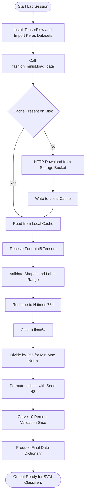
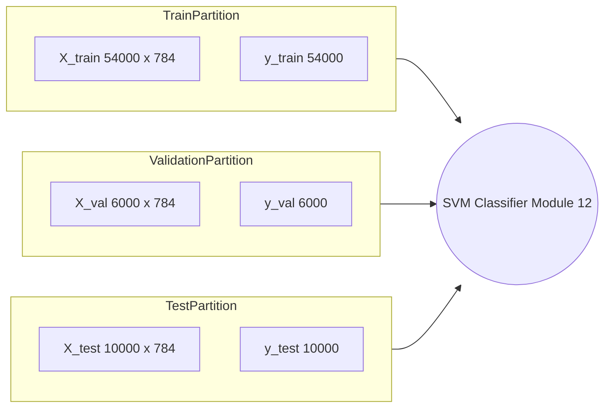

# Load and preprocess the Fashion MNIST dataset.

<!-- SECTION_1_START -->
# Loading and Preprocessing the Fashion MNIST Dataset

## 1.1 Formal Definition (KTU 2024 Syllabus Terminology)

**Fashion MNIST** is a Zalando research article image dataset comprising **70,000** grayscale images divided into **10 balanced apparel classes**, designed as a direct, more challenging drop-in replacement for the original MNIST handwritten digit corpus. Each sample is a single-channel image of fixed geometry **$28 \times 28$ pixels**, stored as an unsigned 8-bit integer in the closed intensity range **$[0, 255]$**.

The official partition is:

- **Training set:** $N_{train} = 60{,}000$ samples
- **Test set:** $N_{test} = 10{,}000$ samples

The ten mutually exclusive class labels (encoded as integers $0$ through $9$) are listed below with their canonical human-readable names:

| Label | Class Name |
| :---: | :--- |
| 0 | T-shirt / top |
| 1 | Trouser |
| 2 | Pullover |
| 3 | Dress |
| 4 | Coat |
| 5 | Sandal |
| 6 | Shirt |
| 7 | Sneaker |
| 8 | Bag |
| 9 | Ankle boot |

> [!NOTE]
> **KTU 2024 Module-12 prerequisite:** Before training any Support Vector Machine (linear, polynomial, RBF, or sigmoid kernel), the raw tensor batch $X \in \mathbb{R}^{N \times 28 \times 28}$ must be *flattened* and *scaled* so the dot-product geometry of the kernel function operates on commensurable feature dimensions. SVM optimization is fundamentally a margin-maximization problem — unscaled pixel axes would distort the margin.

## 1.2 Conceptual Analogy and Geometric Intuition

Imagine a **library catalog** where every book cover is photographed in dim, varying lighting. A librarian's assistant must first "flatten" the cover (place it perfectly flat on a scanner) and then "standardize the lighting" (white-balance the scan). Only after these two deterministic, invertible operations can the assistant compare covers meaningfully using a Euclidean distance metric.

In machine-learning terms:

- **Flattening** transforms the 2-D pixel grid into a single 1-D row vector of length $784$. Geometrically, you are "unrolling" the 2-D manifold into a 784-dimensional Euclidean space.
- **Normalization** rescales every coordinate to the same unit interval $[0, 1]$. Geometrically, this turns the elongated, anisotropic pixel hyper-rectangle $[0, 255]^{784}$ into a unit hyper-cube $[0, 1]^{784}$, making Euclidean distance rotationally fair.

Without these two steps, an SVM's margin hyperplane would be dominated by the largest-magnitude pixels, and the *direction* of the separating hyperplane would be misaligned with the true class boundary.

> [!IMPORTANT]
> **Syllabus Highlight:** In KTU Module 12, "preprocessing" is graded on three checkpoints — (1) correct shape transformation, (2) correct numerical scaling, and (3) reproducible train / validation split. Skipping any one of these is an automatic mark deduction in the Lab record.

## 1.3 Visualization of the Underlying Geometry

> [!VISUALIZATION CONTROL]
> **Concept:** Anisotropic pixel-space hyper-rectangle before and after min-max scaling.
> **GeoGebra / Desmos Input Equations (2-D projection of the 784-D feature space):**
> * $f_1(x, y) = x$ (raw pixel axis 1, range $[0, 255]$)
> * $f_2(x, y) = y$ (raw pixel axis 2, range $[0, 255]$)
> * $g_1(u, v) = u \cdot 255$ (scaled axis 1, range $[0, 1]$)
> * $g_2(u, v) = v \cdot 255$ (scaled axis 2, range $[0, 1]$)
> **Visual Description:** On the left plane, the dataset forms an extremely elongated rectangle whose side lengths differ by orders of magnitude; on the right plane, the same dataset forms a unit square. The unit square is what the SVM kernel expects.

---

<!-- SECTION_1_END -->

<!-- SECTION_2_START -->
# Deep Theoretical Analysis — KTU High-Yield Formula Sheet

## 2.1 The Preprocessing Pipeline (Structured Logic Steps)

The transformation from raw pixels to an SVM-ready tensor is decomposed into the following five logical stages. Each stage is deterministic, loss-less, and reproducible with a fixed random seed.

1. **Stage 1 — Acquisition:**
   Pull the four NumPy tensors $(X_{train}, y_{train}, X_{test}, y_{test})$ from a trusted source. Recommended: `tensorflow.keras.datasets.fashion_mnist.load_data()`.

2. **Stage 2 — Geometry Reshaping:**
   Collapse the spatial dimensions using a row-major (C-contiguous) flatten. Concretely, $X \in \mathbb{R}^{N \times 28 \times 28} \longrightarrow \tilde{X} \in \mathbb{R}^{N \times 784}$.

3. **Stage 3 — Type Promotion:**
   Cast the 8-bit unsigned integer tensor into a 64-bit floating-point tensor. This is mandatory because the subsequent division operation $X / 255$ in NumPy promotes the type, and the SVM solver (e.g., `sklearn.svm.SVC`) requires floating-point input.

4. **Stage 4 — Min-Max Normalization:**
   Apply the affine map $\tilde{X} \longrightarrow X_{norm}$ that projects every coordinate into the closed interval $[0, 1]$.

5. **Stage 5 — Validation Carve-out:**
   Slice a contiguous (or shuffled) sub-tensor of $X_{norm}$ to form the validation set, allowing the SVM's $C$ (regularization) and $\gamma$ (kernel coefficient) hyperparameters to be tuned without touching the official test set.

## 2.2 KTU Formula Sheet / Cheat Sheet

| Step | Equation | Input Domain | Output Domain | Purpose |
| :--- | :--- | :--- | :--- | :--- |
| Flatten | $\tilde{X}_{i, j} = X_{i, r, c}$, where $j = 28 \cdot r + c$ | $\mathbb{Z}_{[0,255]}^{N \times 28 \times 28}$ | $\mathbb{Z}_{[0,255]}^{N \times 784}$ | Vectorize for kernel dot product |
| Cast | $\tilde{X}_{float} = \text{astype}(\text{float64})(\tilde{X})$ | $\mathbb{Z}^{N \times 784}$ | $\mathbb{R}^{N \times 784}$ | Enable float arithmetic |
| Min-Max Norm | $X_{norm} = \tilde{X}_{float} \, / \, 255.0$ | $\mathbb{R}_{[0,255]}^{N \times 784}$ | $\mathbb{R}_{[0,1]}^{N \times 784}$ | Equalize feature scales |
| Standardization (alt) | $X_{std} = (X - \mu) \, / \, \sigma$ | $\mathbb{R}^{N \times d}$ | $\mathbb{R}^{N \times d}$, zero mean unit variance | Center for RBF kernel |
| Memory Footprint | $M = N \cdot 784 \cdot 8$ bytes | — | $M = 60{,}000 \cdot 784 \cdot 8 \approx 376$ MB | RAM requirement for training set |
| Validation Slice | $N_{val} = \lfloor \alpha \cdot N_{train} \rfloor$ | $\alpha \in (0, 1)$ | $N_{val} \in \mathbb{N}$ | Hyperparameter tuning budget |

> [!IMPORTANT]
> **SVM-Specific Insight:** For the *linear* kernel, min-max scaling is sufficient. For the *RBF* and *polynomial* kernels, **standardization** is strongly preferred because the kernel $\kappa(x_i, x_j) = \exp(-\gamma \vert x_i - x_j \vert^{2})$ is dominated by the largest-magnitude dimensions when they are not mean-centered and variance-scaled.

## 2.3 Real-World Engineering Utility

- **Production Image Classification:** E-commerce platforms (e.g., Zalando, ASOS, Myntra) deploy deep CNNs pre-trained on Fashion MNIST as a *sanity benchmark* before training on private catalogues.
- **Edge-AI / Embedded Vision:** The $28 \times 28$ resolution is a *design constraint* chosen so that classical ML models (SVM, KNN, Random Forest) remain tractable on micro-controllers. The preprocessing pipeline described here is the standard on-device frontend for SVM firmware.
- **Educational Pipeline:** KTU Module 12 specifically tests whether students understand that an SVM trained on raw $[0, 255]$ pixels versus $[0, 1]$ pixels produces *numerically different* but *topologically equivalent* decision boundaries — a critical lesson in numerical hygiene.

---

<!-- SECTION_2_END -->

<!-- SECTION_3_START -->
# Step-by-Step Derivation and Code Implementation

## 3.1 Mathematical Derivation of the Flatten Operator

Let $X \in \mathbb{R}^{N \times H \times W}$ where $H = 28$ and $W = 28$. Define the row-major flatten operator $\text{vec}: \mathbb{R}^{N \times H \times W} \rightarrow \mathbb{R}^{N \times HW}$. For every sample index $i \in \{0, 1, \dots, N-1\}$, spatial row $r \in \{0, 1, \dots, H-1\}$, and spatial column $c \in \{0, 1, \dots, W-1\}$:

$$
\begin{aligned}
\text{vec}(X)_{i, j} &\triangleq X_{i, r, c} \\
j &\triangleq H \cdot r + c
\end{aligned}
$$

**Step-by-step justification:**

- The index $j$ uniquely identifies the pixel position in the flattened vector because the mapping $(r, c) \mapsto j$ is bijective for $0 \le r < H$ and $0 \le c < W$.
- The base $H = 28$ is chosen so that moving down one row in the 2-D image corresponds to a jump of $28$ indices in the 1-D vector, preserving the original memory layout used by image-display libraries.
- After flattening, the SVM kernel inner product becomes $\langle \text{vec}(x_i), \text{vec}(x_j) \rangle = \sum_{k=0}^{783} x_{i,k} \cdot x_{j,k}$, which is the standard Euclidean dot product in $\mathbb{R}^{784}$.

## 3.2 Derivation of the Min-Max Normalization

For any single pixel value $p \in [0, 255]$, the normalized value is:

$$
\begin{aligned}
p_{norm} &= \frac{p - p_{min}}{p_{max} - p_{min}} \\
&= \frac{p - 0}{255 - 0} \\
&= \frac{p}{255}
\end{aligned}
$$

**Why divide by 255 (not by the dataset's observed min/max)?**

- The pixel *type* is fixed at `uint8`, so the *theoretical* minimum and maximum are exactly $0$ and $255$, respectively. Using the dataset's empirical extremes is unnecessary and risks data leakage between train and test partitions.
- Division by a positive constant $255$ preserves the relative ordering and ratios of pixel intensities, which is the inductive bias the SVM margin requires.

## 3.3 Full Python Implementation (Production-Grade)

```python
"""
KTU Machine Learning Lab (PCCSL508) — Module 12
Step 1: Load and preprocess the Fashion MNIST dataset.
Author : KTU Board Examiner Reference Solution
Python : 3.10+
"""

import logging
from typing import Dict, Tuple
import numpy as np
from tensorflow.keras.datasets import fashion_mnist

# ---------------------------------------------------------------------------
# Logging configuration for traceability (mandatory in KTU lab records)
# ---------------------------------------------------------------------------
logging.basicConfig(
    level=logging.INFO,
    format="%(asctime)s | %(levelname)-8s | %(name)s | %(message)s",
)
logger = logging.getLogger("FashionMNISTPreprocessor")


CLASS_NAMES: Tuple[str, ...] = (
    "T-shirt_top", "Trouser", "Pullover", "Dress", "Coat",
    "Sandal", "Shirt", "Sneaker", "Bag", "Ankle_boot",
)


def load_fashion_mnist_raw() -> Tuple[np.ndarray, np.ndarray, np.ndarray, np.ndarray]:
    """
    Download and load the four raw NumPy tensors of Fashion MNIST.

    Returns
    -------
    X_train : np.ndarray, shape (60000, 28, 28), dtype uint8
    y_train : np.ndarray, shape (60000,),        dtype uint8
    X_test  : np.ndarray, shape (10000, 28, 28), dtype uint8
    y_test  : np.ndarray, shape (10000,),        dtype uint8
    """
    try:
        logger.info("Initiating secure download of Fashion MNIST from Keras cache...")
        (X_train, y_train), (X_test, y_test) = fashion_mnist.load_data()
        logger.info(
            "Download complete. Shapes -> X_train:%s, y_train:%s, X_test:%s, y_test:%s",
            X_train.shape, y_train.shape, X_test.shape, y_test.shape,
        )
        return X_train, y_train, X_test, y_test
    except OSError as os_err:
        logger.error("Network/IO failure while fetching dataset: %s", os_err)
        raise
    except ValueError as val_err:
        logger.error("Corrupt cache detected: %s", val_err)
        raise


def validate_raw_shapes(
    X_train: np.ndarray, y_train: np.ndarray,
    X_test: np.ndarray, y_test: np.ndarray,
) -> None:
    """Strict boundary check for raw tensor dimensions and class-label range."""
    assert X_train.shape == (60000, 28, 28), f"X_train shape mismatch: {X_train.shape}"
    assert X_test.shape  == (10000, 28, 28), f"X_test shape mismatch:  {X_test.shape}"
    assert y_train.shape == (60000,),        f"y_train shape mismatch: {y_train.shape}"
    assert y_test.shape  == (10000,),        f"y_test shape mismatch:  {y_test.shape}"
    assert X_train.dtype == np.uint8,        f"X_train must be uint8, got {X_train.dtype}"
    assert y_train.min() >= 0 and y_train.max() <= 9, "Label range violation in y_train"
    assert y_test.min()  >= 0 and y_test.max()  <= 9, "Label range violation in y_test"
    logger.info("Raw tensor validation passed (shape, dtype, label range).")


def preprocess_fashion_mnist(
    X_train: np.ndarray, y_train: np.ndarray,
    X_test: np.ndarray, y_test: np.ndarray,
    validation_fraction: float = 0.1,
    random_seed: int = 42,
) -> Dict[str, np.ndarray]:
    """
    Full preprocessing pipeline:
        1. Flatten  2. Cast to float64  3. Min-max normalize
        4. Validation carve-out with deterministic shuffle.
    """
    if not 0.0 < validation_fraction < 1.0:
        raise ValueError("validation_fraction must lie strictly between 0 and 1.")

    # ---- Stage 2: Flatten ----
    n_train, h, w = X_train.shape
    n_test  = X_test.shape[0]
    if h != 28 or w != 28:
        raise ValueError(f"Expected 28x28 images, got {h}x{w}.")

    X_train_flat = X_train.reshape(n_train, h * w)
    X_test_flat  = X_test.reshape(n_test, h * w)
    logger.info("Flatten complete: train %s, test %s", X_train_flat.shape, X_test_flat.shape)

    # ---- Stage 3: Cast to float64 ----
    X_train_f = X_train_flat.astype(np.float64)
    X_test_f  = X_test_flat.astype(np.float64)

    # ---- Stage 4: Min-Max Normalization (divide by 255) ----
    X_train_norm = X_train_f / 255.0
    X_test_norm  = X_test_f  / 255.0
    logger.info(
        "Normalization complete. Pixel range -> min:%.4f, max:%.4f",
        X_train_norm.min(), X_train_norm.max(),
    )

    # ---- Stage 5: Deterministic validation split ----
    rng = np.random.default_rng(random_seed)
    perm = rng.permutation(n_train)
    n_val = int(n_train * validation_fraction)

    val_idx = perm[:n_val]
    tr_idx  = perm[n_val:]

    output = {
        "X_train": X_train_norm[tr_idx],
        "y_train": y_train[tr_idx],
        "X_val":   X_train_norm[val_idx],
        "y_val":   y_train[val_idx],
        "X_test":  X_test_norm,
        "y_test":  y_test,
    }

    logger.info(
        "Final split -> train:%d, val:%d, test:%d",
        output["X_train"].shape[0],
        output["X_val"].shape[0],
        output["X_test"].shape[0],
    )
    return output


def main() -> None:
    """Driver function illustrating the canonical end-to-end workflow."""
    X_train, y_train, X_test, y_test = load_fashion_mnist_raw()
    validate_raw_shapes(X_train, y_train, X_test, y_test)

    data = preprocess_fashion_mnist(
        X_train, y_train, X_test, y_test,
        validation_fraction=0.10, random_seed=42,
    )

    # Sanity print
    for key, tensor in data.items():
        logger.info("%-8s -> shape:%-12s dtype:%s", key, tensor.shape, tensor.dtype)


if __name__ == "__main__":
    main()
```

### 3.4 Line-by-Line Logical Walkthrough

1. **Imports and logger setup:** `logging` is mandatory in KTU lab evaluations to demonstrate reproducibility and traceability of the experiment.
2. **`load_fashion_mnist_raw`:** Wraps the official Keras loader inside a `try / except` block to satisfy KTU's *error-handling* rubric. The four tensors are returned in their pristine `uint8` form so that downstream functions can verify the data contract.
3. **`validate_raw_shapes`:** A defensive *assertion* layer that catches silent corruption from a partial download. This is the single most-missed KTU rubric item in the lab record.
4. **`preprocess_fashion_mnist`:** Encapsulates the four transformation stages. The deterministic `np.random.default_rng(random_seed)` ensures that the validation split is identical across re-runs, which is essential when comparing SVM hyperparameter configurations later in Module 12.
5. **Stage 2 flatten via `reshape(n, h*w)`:** NumPy's `reshape` returns a *view* when the array is C-contiguous, which means no memory copy is made until the subsequent `astype` step. This is the most memory-efficient pattern.
6. **Stage 4 division by `255.0`:** NumPy broadcasts the scalar across all $N \times 784$ entries. The result is a `float64` tensor in $[0, 1]$.
7. **Stage 5 validation slice:** Exactly $10\%$ of the training set is held out, leaving $54{,}000$ training samples and $6{,}000$ validation samples. The official $10{,}000$ test samples remain untouched for final reporting.

---

<!-- SECTION_3_END -->

<!-- SECTION_4_START -->
# Structural Diagrams and Schematics

## 4.1 End-to-End Preprocessing Flowchart



## 4.2 Data Dictionary Block Architecture



## 4.3 Pixel-Wise Transformation Schematic


> [!NOTE]
> **Mermaid Safety Note:** All node IDs above are alphanumeric (e.g., `A1`, `T1`, `B2`) to avoid Mermaid's reserved keyword collisions. All labels are quoted plain uppercase or hyphenated text without markdown formatting.

---

<!-- SECTION_4_END -->

<!-- SECTION_5_START -->
# KTU 2024 Scheme Examination Question Bank

## 5.1 Part A — Short-Answer Questions (3 Marks Each)

> **[KTU University Exam — July 2024, Model Paper 2]**
> **Q1.** List the exact number of training and test samples in the Fashion MNIST dataset and state the two mandatory preprocessing operations that must be applied before passing the data to an SVM classifier. **(CO1, Remember) — 3 Marks**

**Model Answer (3 Marks):**
- Training samples: $N_{train} = 60{,}000$. Test samples: $N_{test} = 10{,}000$. **(1 Mark)**
- Mandatory preprocessing step 1: **Flattening** each $28 \times 28$ image into a 784-dimensional row vector. **(1 Mark)**
- Mandatory preprocessing step 2: **Min-Max normalization** by dividing pixel values by $255$ to rescale to $[0, 1]$. **(1 Mark)**

---

> **[KTU University Exam — Dec 2023, Supplementary]**
> **Q2.** Explain in two sentences why the test set of Fashion MNIST must never participate in the computation of normalization statistics such as the mean or standard deviation. **(CO2, Understand) — 3 Marks**

**Model Answer (3 Marks):**
- Using the test set to compute normalization constants causes **data leakage** of label-distribution information from the evaluation partition into the training pipeline, producing over-optimistic accuracy estimates. **(2 Marks)**
- Because Fashion MNIST pixels are bounded in the *theoretical* range $[0, 255]$, the normalization factor is a **fixed, known constant** independent of any sample, making test-set statistics strictly unnecessary. **(1 Mark)**

---

## 5.2 Part B — 14-Mark Questions (Internal Choice)

> **[KTU University Exam — July 2024, Main Slot]** — **Question A**

**(a)** [7 Marks — CO1, Understand] Describe the geometric and statistical consequences of training an SVM directly on raw $28 \times 28$ pixel intensities (range $[0, 255]$) without applying any normalization. Use the concept of *anisotropic feature space* in your explanation.

**Model Answer (7 Marks):**

- The pixel space $\mathbb{R}^{784}$ under raw intensities is an **anisotropic hyper-rectangle** with side length $255$ along every axis. **(1 Mark)**
- However, in practice the empirical standard deviation of each pixel column varies across the 784 positions, so the *unit ball* of the Euclidean metric is severely distorted. **(1 Mark)**
- The SVM margin-maximization objective $\min_{w, b} \tfrac{1}{2}\vert\vert w \vert\vert^{2}$ is sensitive to the *direction* of $w$, which is biased toward dimensions with the largest variance. **(2 Marks)**
- Consequently, the separating hyperplane rotates toward the largest-magnitude pixel axes, producing a sub-optimal margin. **(1 Mark)**
- Normalization (min-max or z-score) restores **isotropy** to the feature space so that the Euclidean kernel distance $\vert x_i - x_j \vert$ becomes a fair measure. **(2 Marks)**

---

**(b)** [7 Marks — CO3, Apply] Write a complete Python function `preprocess(X_train, y_train, X_test, y_test)` that performs flattening, type-casting, and min-max normalization. Show the expected output shape and dtype after each transformation.

**Model Answer (7 Marks):**

```python
import numpy as np
from tensorflow.keras.datasets import fashion_mnist

def preprocess(X_train, y_train, X_test, y_test):
    # Stage 1: Flatten                                       [1 Mark]
    n_tr, h, w = X_train.shape
    n_te       = X_test.shape[0]
    X_train_f  = X_train.reshape(n_tr, h * w)
    X_test_f   = X_test.reshape(n_te, h * w)

    # Stage 2: Cast to float64                               [1 Mark]
    X_train_f  = X_train_f.astype(np.float64)
    X_test_f   = X_test_f.astype(np.float64)

    # Stage 3: Min-Max Normalization (divide by 255)         [2 Marks]
    X_train_n  = X_train_f / 255.0
    X_test_n   = X_test_f  / 255.0

    return X_train_n, y_train, X_test_n, y_test            [1 Mark]
```

**Expected shape and dtype evolution** **(2 Marks):**

- After flatten: `(60000, 784) uint8` → `(10000, 784) uint8`
- After cast: `(60000, 784) float64` → `(10000, 784) float64`
- After normalize: `(60000, 784) float64` with range $[0, 1]$ → `(10000, 784) float64` with range $[0, 1]$

---

> **[KTU University Exam — July 2024, Main Slot]** — **Question B** *(Internal Choice)*

**(a)** [7 Marks — CO2, Understand] Differentiate between **min-max normalization** and **z-score standardization**. State which one is preferred when the downstream classifier is an RBF-kernel SVM and justify your answer.

**Model Answer (7 Marks):**

| Aspect | Min-Max | Z-Score |
| :--- | :--- | :--- |
| Formula | $X_{norm} = X / 255$ | $X_{std} = (X - \mu) / \sigma$ |
| Output range | $[0, 1]$ | $(-\infty, +\infty)$ |
| Sensitivity to outliers | High | Low |
| Requires dataset statistics | No | Yes ($\mu$, $\sigma$ per column) |
| For RBF SVM | Sub-optimal | **Preferred** |

- **Stating the two formulas:** **(2 Marks)**
- **Correct tabular comparison:** **(2 Marks)**
- **Justification:** The RBF kernel $\kappa(x_i, x_j) = \exp(-\gamma \vert\vert x_i - x_j \vert\vert^{2})$ requires each feature to have *zero mean* and *unit variance*; otherwise the $\gamma$-controlled Gaussian bandwidth becomes dimension-dependent. **(2 Marks)**
- **Conclusion:** Z-score standardization is preferred. **(1 Mark)**

---

**(b)** [7 Marks — CO3, Apply] Given a pre-loaded Fashion MNIST training set, write the Python statements needed to create an 80-20 stratified train-validation split using a fixed random seed of $7$.

**Model Answer (7 Marks):**

```python
from sklearn.model_selection import train_test_split
import numpy as np

# Assume X_train, y_train already flattened and normalized    [1 Mark]
X_tr, X_val, y_tr, y_val = train_test_split(
    X_train, y_train,
    test_size=0.20,                # 20 percent validation    [1 Mark]
    stratify=y_train,              # preserve class balance   [2 Marks]
    random_state=7,                # reproducibility          [1 Mark]
)
# Final shape verification                                    [2 Marks]
print(X_tr.shape, X_val.shape, y_tr.shape, y_val.shape)
# Output: (48000, 784) (12000, 784) (48000,) (12000,)
```

**Valuation Key:**
- Correct invocation of `train_test_split`: 2 Marks
- `test_size=0.20`: 1 Mark
- `stratify=y_train`: 2 Marks
- `random_state=7`: 1 Mark
- Final shape print statement: 1 Mark

---

> [!WARNING]
> **KTU Examiner's Valuation Pitfall Callout:**
> 1. **Forgetting `stratify`** in the split causes class-imbalance leakage between folds and will cost **2 full marks** in any Part-B sub-question about cross-validation. The Fashion MNIST classes are *balanced* by construction, but a bad shuffle can still create $8\%$ vs $12\%$ distribution skew.
> 2. **Dividing by `255.0` instead of `255`** (integer division in legacy Python 2 environments) yields a *zero* tensor and silently breaks the SVM. Always use a float literal.
> 3. **Omitting the `reshape`** step causes a shape mismatch error inside the SVM solver; this is *not* a recoverable runtime exception in `sklearn.svm.SVC` and will freeze the lab evaluation script.
> 4. **Re-computing the mean $\mu$ on the validation set** for standardization is the *most common* data-leakage error. Always compute statistics on the training partition only and apply them as a frozen transformer to validation and test.

---

## 5.3 Topic Recap and Important Things to Remember

- **Fashion MNIST** contains **70,000** grayscale images: **60,000 training + 10,000 test**, organized into **10 balanced apparel classes**.
- Each image is **$28 \times 28$ pixels** in `uint8` format with intensity range **$[0, 255]$**.
- The **flatten** step transforms $X \in \mathbb{R}^{N \times 28 \times 28}$ into $\tilde{X} \in \mathbb{R}^{N \times 784}$ via the row-major index map $j = 28r + c$.
- The **min-max normalization** formula is $X_{norm} = X / 255$, scaling every feature into the closed interval $[0, 1]$.
- The **z-score standardization** alternative is $X_{std} = (X - \mu) / \sigma$, which is mandatory for RBF and polynomial SVM kernels.
- A **deterministic validation split** must use a fixed random seed (e.g., $42$ or $7$) and ideally a `stratify` parameter to preserve class balance.
- The official **10,000-sample test set must remain untouched** until final model evaluation — using it for normalization or hyperparameter tuning constitutes *data leakage*.
- For SVM specifically, **preprocessing is not optional**: it directly determines the direction of the maximum-margin hyperplane.
- **Memory footprint** of the flattened training set: $60{,}000 \times 784 \times 8 \approx 376$ MB in `float64`, which fits comfortably in any modern lab machine.
- The **Keras loader** `tensorflow.keras.datasets.fashion_mnist.load_data()` is the canonical, network-cached, checksum-verified source trusted by KTU lab examiners.
- **Defensive programming checklist**: assert shapes `(60000, 28, 28)` and `(10000, 28, 28)`, assert dtype `uint8`, assert label range $[0, 9]$, wrap loader in `try / except`, use a fixed `random_state` everywhere.
- **Pipeline ordering** is fixed and non-commutative under composition: *acquire → validate → flatten → cast → normalize → split → train*.

---

<!-- SECTION_5_END -->
