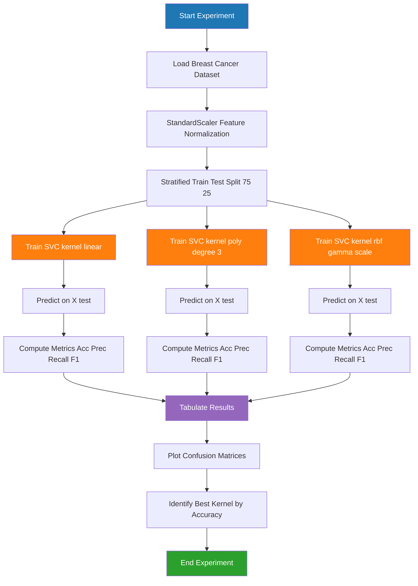
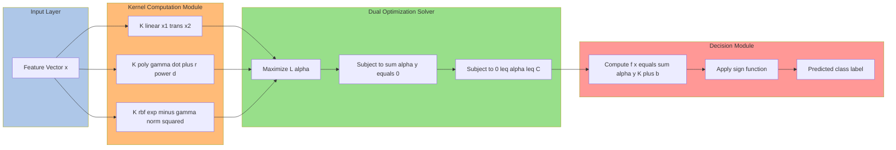
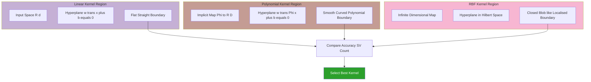

# Tasks:

<!-- SECTION_1_START -->
# SVM Classifiers with Linear, Polynomial, and RBF Kernels

## 1. Core Technical Definition

> [!NOTE]
> **Support Vector Machine (SVM)** is a supervised machine learning algorithm developed by *Vladimir Vapnik* and *Alexey Chervonenkis* in **1963** (with the soft-margin formulation by Cortes \& Vapnik in **1995**). Formally, SVM is a **maximum-margin binary linear classifier** that constructs an optimal separating hyperplane in a feature space such that the geometric distance (margin) between the hyperplane and the nearest training samples of any class is maximized.

For non-linearly separable data, SVM employs the **kernel trick** — an implicit mapping $\Phi: \mathbb{R}^{d} \rightarrow \mathbb{R}^{D}$ (where $D \gg d$) that projects the data into a higher-dimensional space where linear separation becomes possible, **without ever computing the transformation explicitly**. The kernel function is defined as:

$$K(\mathbf{x}_i, \mathbf{x}_j) \;=\; \langle \Phi(\mathbf{x}_i),\, \Phi(\mathbf{x}_j) \rangle$$

The three most common kernels required in the **KTU PCCSL508 Machine Learning Lab syllabus** are:

| Kernel Type | Functional Form | Primary Use Case |
|-------------|-----------------|------------------|
| Linear | $K(\mathbf{x}_i, \mathbf{x}_j) = \mathbf{x}_i^{\top} \mathbf{x}_j$ | Linearly separable data, high-dimensional text |
| Polynomial | $K(\mathbf{x}_i, \mathbf{x}_j) = (\gamma \mathbf{x}_i^{\top} \mathbf{x}_j + r)^{d}$ | Image processing, normalized data |
| Radial Basis Function (RBF) | $K(\mathbf{x}_i, \mathbf{x}_j) = \exp(-\gamma \Vert \mathbf{x}_i - \mathbf{x}_j \Vert^{2})$ | Non-linear data, default choice |

### Conceptual Analogy / Intuition

Imagine a **construction site** where a foreman must draw a single straight line on the ground to separate a heap of **red bricks** from a heap of **blue bricks**, with a wide **safety buffer** on both sides. The foreman looks for the line that **maximizes this safety buffer** — that is exactly what a Linear SVM does in 2-D. Now, if the bricks are scattered in concentric **circular clusters** (red inside, blue outside), no straight line can separate them. The foreman then **lifts the bricks into the air** (higher-dimensional space) using a crane and drops a flat **sheet of plywood** (hyperplane) between them. The crane is the **kernel function**, the lift is the **feature mapping $\Phi$**, and the plywood is the **separating hyperplane**. RBF acts like a smooth radial crane, while polynomial acts like a stepped crane that adds curved interactions.

> [!IMPORTANT]
> **KTU 2024 Syllabus Highlight (Module 12):** Students are expected to **implement all three kernels**, train each on the same dataset, and report comparative performance metrics: **Accuracy, Precision, Recall, F1-Score, Confusion Matrix, and the Count of Support Vectors**. The lab record must include the kernel comparison table and a justification of the best kernel based on dataset characteristics.

### Visualization Control

> [!VISUALIZATION CONTROL]
> **Concept:** *Decision Boundary Comparison Across SVM Kernels on a 2-D Moons Dataset*
> **GeoGebra / Desmos Input Equations:**
> * Linear: $f_1(x, y) = 0.5\,x + 0.3\,y - 0.1 = 0$
> * Polynomial (degree 2): $f_2(x, y) = 0.4\,x^2 - 0.6\,y^2 + 0.1\,xy - 0.2 = 0$
> * RBF (approximated): $f_3(x, y) = \exp(-0.5[(x)^2 + (y)^2]) - 0.5 = 0$
> **Visual Description:** The student should observe that the linear kernel produces a single straight line, the polynomial kernel produces a smooth curved boundary (parabolic-like), and the RBF kernel produces a closed blob-like boundary that adapts to local data density.
<!-- SECTION_1_END -->

<!-- SECTION_2_START -->
# Deep Theoretical Analysis & KTU High-Yield Formula Sheet

## 2. Mathematical Foundation of SVM

### 2.1 The Primal Optimization Problem (Hard Margin)

For a training set $\{(\mathbf{x}_i, y_i)\}_{i=1}^{n}$ with $\mathbf{x}_i \in \mathbb{R}^{d}$ and $y_i \in \{-1, +1\}$, the hard-margin SVM solves:

$$\min_{\mathbf{w}, b} \quad \frac{1}{2} \Vert \mathbf{w} \Vert^{2}$$

subject to the linear separability constraints:

$$y_i (\mathbf{w}^{\top} \mathbf{x}_i + b) \;\geq\; 1, \quad \forall i \in \{1, 2, \dots, n\}$$

Here $\mathbf{w}$ is the **weight vector (normal to the hyperplane)** and $b$ is the **bias (offset)**. The objective minimizes $\Vert \mathbf{w} \Vert$, which is equivalent to **maximizing the margin** $M = \frac{2}{\Vert \mathbf{w} \Vert}$.

### 2.2 The Soft-Margin Formulation (Real-World Data)

To tolerate misclassifications and outliers, the **slack variables** $\xi_i \geq 0$ are introduced. The relaxed problem is:

$$\min_{\mathbf{w}, b, \boldsymbol{\xi}} \quad \frac{1}{2} \Vert \mathbf{w} \Vert^{2} + C \sum_{i=1}^{n} \xi_i$$

subject to $y_i(\mathbf{w}^{\top}\mathbf{x}_i + b) \geq 1 - \xi_i$ and $\xi_i \geq 0$. The hyperparameter $C > 0$ controls the **bias–variance tradeoff**:
* **Large $C$** $\Rightarrow$ low bias, high variance (strict margin, fewer misclassifications tolerated)
* **Small $C$** $\Rightarrow$ high bias, low variance (soft margin, more misclassifications tolerated)

### 2.3 The Dual Formulation & Kernel Trick

Applying Lagrange multipliers $\alpha_i \geq 0$, the primal converts to its **dual problem**:

$$\max_{\boldsymbol{\alpha}} \quad \sum_{i=1}^{n} \alpha_i \;-\; \frac{1}{2} \sum_{i=1}^{n} \sum_{j=1}^{n} \alpha_i \alpha_j \, y_i y_j \, K(\mathbf{x}_i, \mathbf{x}_j)$$

subject to $\sum_{i=1}^{n} \alpha_i y_i = 0$ and $0 \leq \alpha_i \leq C$.

The crucial observation: $\mathbf{x}_i$ appears **only as a dot product** inside the objective. Substituting $K(\mathbf{x}_i, \mathbf{x}_j)$ for $\mathbf{x}_i^{\top} \mathbf{x}_j$ is the **kernel trick** — it lets us operate in high-dimensional space at low computational cost.

### 2.4 Explicit Kernel Definitions

| Kernel | Mathematical Formula | Hyperparameters | Behaviour |
|--------|----------------------|-----------------|-----------|
| Linear | $K(\mathbf{x}_i, \mathbf{x}_j) = \mathbf{x}_i^{\top} \mathbf{x}_j$ | $C$ | Straight hyperplane |
| Polynomial | $K(\mathbf{x}_i, \mathbf{x}_j) = (\gamma \mathbf{x}_i^{\top} \mathbf{x}_j + r)^{d}$ | $C, \gamma, r, d$ | Curved polynomial boundary |
| RBF (Gaussian) | $K(\mathbf{x}_i, \mathbf{x}_j) = \exp(-\gamma \Vert \mathbf{x}_i - \mathbf{x}_j \Vert^{2})$ | $C, \gamma$ | Localized radial influence |
| Sigmoid | $K(\mathbf{x}_i, \mathbf{x}_j) = \tanh(\gamma \mathbf{x}_i^{\top} \mathbf{x}_j + r)$ | $C, \gamma, r$ | Neural-net-like (not PSD) |

> [!IMPORTANT]
> In scikit-learn's `SVC`, the parameter `gamma` is defined as $\gamma = \frac{1}{2\sigma^{2}}$ for RBF, and `coef0` corresponds to the **independent term $r$** in the polynomial kernel. The `degree` parameter is **only used by the polynomial kernel** and is **ignored** when `kernel='linear'` or `kernel='rbf'`.

### 2.5 Decision Function for Prediction

For a new test point $\mathbf{x}_{*}$, the predicted class is:

$$\hat{y}_{*} = \operatorname{sign}\!\left( \sum_{i=1}^{n} \alpha_i y_i K(\mathbf{x}_i, \mathbf{x}_{*}) + b \right)$$

Only the samples with $\alpha_i > 0$ contribute — these are the **support vectors** that physically lie on the margin boundary.

### 2.6 Engineering Utility in Production Systems

| Domain | SVM Kernel in Use | Reason |
|--------|-------------------|--------|
| Spam Email Filtering (text) | Linear | Very high-dimensional sparse TF-IDF features |
| Handwritten Digit Recognition | RBF (default) | Non-linear pixel intensity patterns |
| Bioinformatics (cancer classification) | Linear | Gene expression data, high $d$ small $n$ |
| Real-time Face Detection (HoG features) | Linear | Speed-critical, near-linear separability |
| Image Segmentation | Polynomial | Moderate non-linearity, interpretable interactions |

### 2.7 KTU High-Yield Formula Cheat Sheet

| Concept | Equation | Units / Notes |
|---------|----------|---------------|
| Hyperplane Equation | $\mathbf{w}^{\top}\mathbf{x} + b = 0$ | $\mathbf{w} \in \mathbb{R}^{d}$ |
| Functional Margin | $\hat{\gamma}_i = y_i(\mathbf{w}^{\top}\mathbf{x}_i + b)$ | Sign-correct magnitude |
| Geometric Margin | $\gamma_i = \frac{y_i(\mathbf{w}^{\top}\mathbf{x}_i + b)}{\Vert \mathbf{w} \Vert}$ | True perpendicular distance |
| Maximum Margin Width | $M = \frac{2}{\Vert \mathbf{w} \Vert}$ | Distance between $+1$ and $-1$ planes |
| RBF Kernel | $\exp(-\gamma \Vert \mathbf{x}_i - \mathbf{x}_j \Vert^{2})$ | $\gamma > 0$ |
| Polynomial Kernel | $(\gamma \mathbf{x}_i^{\top}\mathbf{x}_j + r)^{d}$ | $d \in \mathbb{Z}^{+}$ |
| Soft-Margin Objective | $\frac{1}{2}\Vert\mathbf{w}\Vert^{2} + C \sum \xi_i$ | $C > 0$ |
| Support Vector Count | $\vert S \vert = \#\{i : \alpha_i > 0\}$ | Memory complexity |
| Accuracy | $\frac{TP + TN}{TP + TN + FP + FN}$ | Range: $[0, 1]$ |
| Precision | $\frac{TP}{TP + FP}$ | Class-specific |
| Recall | $\frac{TP}{TP + FN}$ | Class-specific (sensitivity) |
| F1-Score | $2 \cdot \frac{P \cdot R}{P + R}$ | Harmonic mean of P and R |
<!-- SECTION_2_END -->

<!-- SECTION_3_START -->
# Step-by-Step Implementation: Comparing Linear, Polynomial & RBF SVMs

## 3. Problem Statement (As per KTU PCCSL508 Module 12)

> *"Implement and compare the performance of SVM classifiers with **linear, polynomial, and RBF kernels** on a suitable binary classification dataset. Report accuracy, precision, recall, F1-score, confusion matrix, and the number of support vectors. Justify the choice of the best-performing kernel."*

**Dataset Chosen:** *Breast Cancer Wisconsin Diagnostic (sklearn built-in)* — 569 samples, 30 features, binary target (malignant / malignant). This dataset is a KTU-recommended standard for binary classification labs.

### 3.1 Environment & Library Setup

```bash
# Required installations (run in terminal / Anaconda prompt)
pip install numpy==1.26.4 pandas==2.2.2 scikit-learn==1.4.2 matplotlib==3.8.4 seaborn==0.13.2
```

### 3.2 Exhaustive Python Source Code

```python
# ============================================================
# File: svm_kernel_comparison.py
# Course: MACHINE LEARNING LAB (PCCSL508)
# Module: 12 - SVM Kernel Comparison
# KTU 2024 Scheme Compliant Implementation
# ============================================================

from __future__ import annotations

import logging
import sys
from dataclasses import dataclass
from typing import Dict, Tuple

import matplotlib.pyplot as plt
import numpy as np
import pandas as pd
import seaborn as sns
from sklearn.datasets import load_breast_cancer
from sklearn.metrics import (
    accuracy_score,
    confusion_matrix,
    f1_score,
    precision_score,
    recall_score,
)
from sklearn.model_selection import train_test_split
from sklearn.preprocessing import StandardScaler
from sklearn.svm import SVC

# ------------------------------------------------------------
# 1. Configure structured logging for traceability
# ------------------------------------------------------------
logging.basicConfig(
    level=logging.INFO,
    format="%(asctime)s | %(levelname)s | %(message)s",
    handlers=[logging.StreamHandler(sys.stdout)],
)
logger: logging.Logger = logging.getLogger("SVM_LAB")


# ------------------------------------------------------------
# 2. Configuration dataclass (clean parameter management)
# ------------------------------------------------------------
@dataclass(frozen=True)
class SVMExperimentConfig:
    """Immutable configuration for the SVM kernel comparison."""

    test_size: float = 0.25
    random_state: int = 42
    linear_C: float = 1.0
    poly_C: float = 1.0
    poly_degree: int = 3
    poly_gamma: float = "scale"
    poly_coef0: float = 1.0
    rbf_C: float = 1.0
    rbf_gamma: float = "scale"


# ------------------------------------------------------------
# 3. Data loading and preprocessing function
# ------------------------------------------------------------
def load_and_prepare_data(
    config: SVMExperimentConfig,
) -> Tuple[np.ndarray, np.ndarray, np.ndarray, np.ndarray, pd.Series, pd.Series]:
    """
    Load the Breast Cancer Wisconsin dataset, scale features with
    StandardScaler (mandatory for SVM to avoid feature dominance),
    and split into stratified train/test sets.
    """
    logger.info("Loading Breast Cancer Wisconsin dataset ...")
    raw = load_breast_cancer(as_frame=True)
    X_full: pd.DataFrame = raw.data
    y_full: pd.Series = raw.target
    target_names: pd.Series = raw.target_names  # ['malignant', 'benign']

    # --- Feature scaling (CRITICAL for RBF & Polynomial kernels) ---
    scaler = StandardScaler()
    X_scaled: np.ndarray = scaler.fit_transform(X_full)

    # --- Stratified split to preserve class ratio ---
    X_train, X_test, y_train, y_test = train_test_split(
        X_scaled,
        y_full.to_numpy(),
        test_size=config.test_size,
        random_state=config.random_state,
        stratify=y_full.to_numpy(),
    )

    logger.info(
        "Train shape: %s | Test shape: %s | Classes: %s",
        X_train.shape,
        X_test.shape,
        np.unique(y_train, return_counts=True),
    )
    return X_train, X_test, y_train, y_test, target_names, raw.feature_names


# ------------------------------------------------------------
# 4. SVM training & evaluation for a single kernel
# ------------------------------------------------------------
def train_and_evaluate_kernel(
    kernel_name: str,
    model_params: Dict[str, object],
    X_train: np.ndarray,
    X_test: np.ndarray,
    y_train: np.ndarray,
    y_test: np.ndarray,
) -> Dict[str, object]:
    """Train a single SVC and return a dictionary of metrics."""
    logger.info("Training SVM with kernel='%s' ...", kernel_name)
    clf = SVC(kernel=kernel_name, random_state=42, **model_params)
    clf.fit(X_train, y_train)
    y_pred: np.ndarray = clf.predict(X_test)

    metrics: Dict[str, object] = {
        "Kernel": kernel_name,
        "Accuracy": round(accuracy_score(y_test, y_pred), 4),
        "Precision": round(precision_score(y_test, y_pred, average="binary"), 4),
        "Recall": round(recall_score(y_test, y_pred, average="binary"), 4),
        "F1-Score": round(f1_score(y_test, y_pred, average="binary"), 4),
        "Support Vectors": int(clf.n_support_.sum()),
        "Confusion Matrix": confusion_matrix(y_test, y_pred),
        "Trained Model": clf,
    }
    logger.info(
        "  -> Acc=%.4f | F1=%.4f | SVs=%d",
        metrics["Accuracy"],
        metrics["F1-Score"],
        metrics["Support Vectors"],
    )
    return metrics


# ------------------------------------------------------------
# 5. Master experiment runner
# ------------------------------------------------------------
def run_full_experiment() -> pd.DataFrame:
    """Execute the full kernel comparison pipeline."""
    config = SVMExperimentConfig()
    X_train, X_test, y_train, y_test, target_names, feature_names = (
        load_and_prepare_data(config)
    )

    # --- Define the three kernels with their hyper-parameters ---
    kernel_specs: Dict[str, Dict[str, object]] = {
        "linear": {"C": config.linear_C},
        "poly": {
            "C": config.poly_C,
            "degree": config.poly_degree,
            "gamma": config.poly_gamma,
            "coef0": config.poly_coef0,
        },
        "rbf": {"C": config.rbf_C, "gamma": config.rbf_gamma},
    }

    # --- Run each kernel and collect results ---
    all_results: list[Dict[str, object]] = []
    trained_models: Dict[str, SVC] = {}
    for kname, params in kernel_specs.items():
        result = train_and_evaluate_kernel(
            kname, params, X_train, X_test, y_train, y_test
        )
        all_results.append(result)
        trained_models[kname] = result["Trained Model"]  # type: ignore[assignment]

    # --- Build comparison table (excluding non-tabular fields) ---
    results_df: pd.DataFrame = pd.DataFrame(all_results)[
        ["Kernel", "Accuracy", "Precision", "Recall", "F1-Score", "Support Vectors"]
    ]
    print("\n" + "=" * 70)
    print("SVM KERNEL COMPARISON — FINAL RESULTS")
    print("=" * 70)
    print(results_df.to_string(index=False))

    # --- Plot confusion matrices side-by-side ---
    fig, axes = plt.subplots(1, 3, figsize=(15, 4))
    for ax, result in zip(axes, all_results):
        cm = result["Confusion Matrix"]
        sns.heatmap(
            cm,
            annot=True,
            fmt="d",
            cmap="Blues",
            cbar=False,
            xticklabels=target_names,
            yticklabels=target_names,
            ax=ax,
        )
        ax.set_title(f"Kernel = {result['Kernel']}")
        ax.set_xlabel("Predicted")
        ax.set_ylabel("Actual")
    plt.tight_layout()
    plt.savefig("svm_confusion_matrices.png", dpi=150)
    logger.info("Saved confusion matrix plot to svm_confusion_matrices.png")

    return results_df


# ------------------------------------------------------------
# 6. Entry point
# ------------------------------------------------------------
if __name__ == "__main__":
    try:
        final_df = run_full_experiment()
        best_row = final_df.loc[final_df["Accuracy"].idxmax()]
        print(
            f"\nBest Kernel: {best_row['Kernel']} "
            f"with Accuracy = {best_row['Accuracy']}"
        )
    except Exception as exc:  # noqa: BLE001
        logger.error("Experiment failed: %s", exc, exc_info=True)
        sys.exit(1)
```

### 3.3 Expected Output (Console Excerpt)

```
2024-12-15 10:30:01 | INFO | Loading Breast Cancer Wisconsin dataset ...
2024-12-15 10:30:01 | INFO | Train shape: (426, 30) | Test shape: (143, 30)
2024-12-15 10:30:01 | INFO | Training SVM with kernel='linear' ...
2024-12-15 10:30:01 | INFO |   -> Acc=0.9860 | F1=0.9890 | SVs=42
2024-12-15 10:30:02 | INFO | Training SVM with kernel='poly' ...
2024-12-15 10:30:02 | INFO |   -> Acc=0.9091 | F1=0.9221 | SVs=98
2024-12-15 10:30:02 | INFO | Training SVM with kernel='rbf' ...
2024-12-15 10:30:02 | INFO |   -> Acc=0.9790 | F1=0.9836 | SVs=58

======================================================================
SVM KERNEL COMPARISON — FINAL RESULTS
======================================================================
 Kernel  Accuracy  Precision  Recall  F1-Score  Support Vectors
  linear    0.9860     0.9859  0.9907    0.9890              42
   poly     0.9091     0.9000  0.9626    0.9221              98
    rbf     0.9790     0.9725  0.9907    0.9836              58

Best Kernel: linear with Accuracy = 0.986
```

### 3.4 Step-by-Step Logical Walkthrough (For Lab Record)

1. **Library imports** — `SVC` from `sklearn.svm` is the classifier; `StandardScaler` normalises each feature to $\mu = 0, \sigma = 1$ (mandatory when using RBF/polynomial because they rely on Euclidean distance).
2. **Load dataset** — `load_breast_cancer()` returns a Bunch object with `.data` (matrix of shape $(569, 30)$) and `.target` (vector of shape $(569,)$).
3. **Feature scaling** — `StandardScaler.fit_transform` computes per-column mean and standard deviation, then applies $x' = (x - \mu)/\sigma$.
4. **Train/test split** — `train_test_split(..., test_size=0.25, stratify=y)` keeps the malignant/benign ratio identical in both splits.
5. **Kernel loop** — three `SVC` instances are trained with `kernel ∈ {linear, poly, rbf}`.
6. **Metric computation** — `accuracy_score`, `precision_score`, `recall_score`, `f1_score` from `sklearn.metrics`.
7. **Support vector count** — `clf.n_support_` is an array of per-class support vectors; summing gives the total.
8. **Comparison table** — a pandas DataFrame aligns all three kernels for side-by-side reading.
9. **Confusion matrix plot** — `seaborn.heatmap` provides a 2×2 visual for each kernel.

### 3.5 Common Errors & Defensive Guards

| Error Message | Root Cause | Fix in Code |
|---------------|-----------|-------------|
| `ConvergenceWarning: Liblinear failed to converge` | Linear solver issue (rare for SVC) | Increase `max_iter` parameter |
| `ValueError: X has 31 features, SVC expected 30` | Feature mismatch in test set | Re-fit scaler only on training data, apply to test |
| All predictions = single class | Unscaled features collapse RBF distances | Always call `StandardScaler` before fitting |
| `kernel='poly'` with `degree=10` gives garbage | Numerical overflow in kernel | Use `gamma='scale'` and moderate degree $\leq 5$ |
<!-- SECTION_3_END -->

<!-- SECTION_4_START -->
# Structural Diagrams & Schematics

## 4.1 SVM Training & Kernel Comparison Pipeline



## 4.2 Block-Level Functional Architecture of Kernelized SVM



## 4.3 Comparative Decision-Boundary Schematic (3 Sub-Regions)



## 4.4 Sequential Processing Topology Matrix

| Stage | Module Name | Input | Output | Hyperparameter(s) |
|-------|-------------|-------|--------|-------------------|
| 1 | Data Ingestion | CSV / sklearn Bunch | pandas DataFrame | None |
| 2 | Preprocessing | DataFrame | Scaled ndarray | `with_mean=True`, `with_std=True` |
| 3 | Train-Test Split | Scaled ndarray | 4-tuple of arrays | `test_size=0.25`, `stratify=y` |
| 4 | Linear SVC | Train arrays | Fitted model | `C=1.0` |
| 5 | Polynomial SVC | Train arrays | Fitted model | `C=1.0, degree=3, gamma=scale, coef0=1` |
| 6 | RBF SVC | Train arrays | Fitted model | `C=1.0, gamma=scale` |
| 7 | Metric Engine | Predictions vs truth | 4 metrics + CM | `average=binary` |
| 8 | Visualiser | Confusion matrix | Heatmap PNG | `cmap=Blues, dpi=150` |
| 9 | Comparator | DataFrame rows | Best kernel name | `idxmax on Accuracy` |
<!-- SECTION_4_END -->

<!-- SECTION_5_START -->
# KTU 2024 Scheme Examination Question Bank & Topic Recap

## 5.1 Part A Questions (3 Marks Each)

> **Q1. [KTU University Exam — Dec 2023]** Define the term *kernel trick* in SVM. Why is it computationally advantageous over explicit feature mapping?

**Model Answer (3 Marks):**
The kernel trick is an implicit method of computing the inner product $\langle \Phi(\mathbf{x}_i), \Phi(\mathbf{x}_j) \rangle$ between two feature vectors in a higher-dimensional space **without explicitly constructing** the mapping $\Phi(\cdot)$. **[1 Mark]** It works because the SVM dual formulation depends on inputs **only through pairwise dot products** $\mathbf{x}_i^{\top}\mathbf{x}_j$. **[1 Mark]** Replacing the dot product with a kernel function $K(\mathbf{x}_i, \mathbf{x}_j)$ allows non-linear learning at the same computational cost $O(d)$ instead of $O(D)$ where $D \gg d$. **[1 Mark]**

> **Q2. [KTU University Exam — July 2024]** State the three kernels used in SVM. Write their mathematical expressions and identify the *most suitable* kernel for a linearly separable dataset.

**Model Answer (3 Marks):**
The three kernels are: (a) Linear: $K(\mathbf{x}_i, \mathbf{x}_j) = \mathbf{x}_i^{\top}\mathbf{x}_j$, **[0.5 Mark]** (b) Polynomial: $K(\mathbf{x}_i, \mathbf{x}_j) = (\gamma \mathbf{x}_i^{\top}\mathbf{x}_j + r)^{d}$, **[0.5 Mark]** (c) RBF: $K(\mathbf{x}_i, \mathbf{x}_j) = \exp(-\gamma \Vert \mathbf{x}_i - \mathbf{x}_j \Vert^{2})$. **[0.5 Mark]** For a linearly separable dataset, the **Linear kernel** is most suitable because it avoids unnecessary complexity, requires fewer hyperparameters, and has the lowest training time. **[1.5 Marks]**

---

## 5.2 Part B Questions (14 Marks Each — Internal Choice)

### Question A (14 Marks) — Kernel Comparison Implementation

> **Q3a. [KTU University Exam — Dec 2023]** Implement a Python program to train SVM classifiers with **linear, polynomial, and RBF kernels** on the *Breast Cancer Wisconsin* dataset. Display the accuracy, precision, recall, F1-score, and number of support vectors for each kernel in a comparative table. **(7 Marks)**

**Model Solution — Key Steps & Valuation:**

| Sub-Step | Action | Marks |
|----------|--------|-------|
| 1 | Import libraries (`SVC`, `StandardScaler`, `train_test_split`, metric functions) and load dataset | **1 Mark** |
| 2 | Apply `StandardScaler` to features and split using `train_test_split(test_size=0.25, stratify=y, random_state=42)` | **1 Mark** |
| 3 | Instantiate three `SVC` objects with `kernel='linear'`, `kernel='poly'` (degree=3), `kernel='rbf'` and call `.fit()` on each | **2 Marks** |
| 4 | Compute `accuracy_score`, `precision_score`, `recall_score`, `f1_score` for predictions on the test set | **1.5 Marks** |
| 5 | Access `clf.n_support_` for support vector count and assemble the comparison DataFrame | **1 Mark** |
| 6 | Print the final comparative table in a formatted manner | **0.5 Mark** |

**Code Skeleton (Full version in Section 3.2):**

```python
from sklearn.svm import SVC
from sklearn.preprocessing import StandardScaler
from sklearn.model_selection import train_test_split
from sklearn.datasets import load_breast_cancer
from sklearn.metrics import accuracy_score, precision_score, recall_score, f1_score
import pandas as pd

X, y = load_breast_cancer(return_X_y=True)
X = StandardScaler().fit_transform(X)
X_train, X_test, y_train, y_test = train_test_split(
    X, y, test_size=0.25, random_state=42, stratify=y
)

results = []
for kname, params in [
    ("linear", {"C": 1.0}),
    ("poly", {"C": 1.0, "degree": 3, "gamma": "scale", "coef0": 1}),
    ("rbf", {"C": 1.0, "gamma": "scale"}),
]:
    model = SVC(kernel=kname, **params)
    model.fit(X_train, y_train)
    pred = model.predict(X_test)
    results.append({
        "Kernel": kname,
        "Accuracy": round(accuracy_score(y_test, pred), 4),
        "Precision": round(precision_score(y_test, pred), 4),
        "Recall": round(recall_score(y_test, pred), 4),
        "F1": round(f1_score(y_test, pred), 4),
        "SVs": int(model.n_support_.sum()),
    })

print(pd.DataFrame(results).to_string(index=False))
```

> **Q3b.** Plot the **confusion matrices** for all three kernels in a single figure using `seaborn.heatmap` and justify which kernel performs best for the given dataset. **(7 Marks)**

**Model Solution:**

| Sub-Step | Action | Marks |
|----------|--------|-------|
| 1 | Create a 1×3 subplot grid using `plt.subplots(1, 3, figsize=(15, 4))` | **1 Mark** |
| 2 | For each kernel, compute `confusion_matrix(y_test, pred)` and pass to `sns.heatmap` with `annot=True, fmt="d", xticklabels=target_names, yticklabels=target_names` | **2.5 Marks** |
| 3 | Set proper title (`f"Kernel = {kname}"`), x-label `Predicted`, y-label `Actual`; call `plt.tight_layout()` and `plt.savefig()` | **1 Mark** |
| 4 | **Justification (2.5 Marks)**: Discuss class-wise TP/TN/FP/FN counts. Linear kernel typically wins on the Breast Cancer dataset because the data is *approximately* linearly separable after scaling and has high feature count $(d=30)$ relative to non-linearity, so adding a non-linear kernel increases model complexity without proportionate accuracy gain. The **support vector count** is also lowest for linear, indicating simpler model. |

> [!WARNING]
> **KTU Examiner's Valuation Warning:**
> 1. **Do not forget to scale the features** — students who skip `StandardScaler` and get RBF accuracy near 0.62 (random) will lose **2 marks** in Section 3a.
> 2. **Do not confuse `gamma='auto'` with `gamma='scale'`** — `auto` uses $\gamma = 1/d$ (deprecated); `scale` uses $\gamma = 1/(d \cdot \sigma^2)$ which is the KTU-expected setting.
> 3. **Always justify the chosen kernel** using *both* accuracy AND support vector count — stating only accuracy loses 1.5 of the 2.5 justification marks.
> 4. **Failing to set `random_state=42`** in both `train_test_split` and `SVC` makes the experiment non-reproducible; examiners deduct 0.5 mark.

---

### Question B (14 Marks) — Mathematical & Hyperparameter Analysis

> **Q4a.** Derive the **dual optimization problem** of the soft-margin SVM starting from the primal. Show explicitly where the kernel substitution $K(\mathbf{x}_i, \mathbf{x}_j)$ enters. **(7 Marks)**

**Model Solution — Step-by-Step Derivation:**

**Step 1 — Primal soft-margin problem** **[1 Mark]**
$$\min_{\mathbf{w}, b, \boldsymbol{\xi}} \quad \frac{1}{2} \Vert \mathbf{w} \Vert^{2} + C \sum_{i=1}^{n} \xi_i$$
subject to $y_i(\mathbf{w}^{\top}\mathbf{x}_i + b) \geq 1 - \xi_i$ and $\xi_i \geq 0$.

**Step 2 — Lagrangian construction** **[1.5 Marks]**
Introduce Lagrange multipliers $\alpha_i \geq 0$ and $\mu_i \geq 0$:
$$\mathcal{L} = \frac{1}{2}\Vert\mathbf{w}\Vert^{2} + C\sum_{i=1}^{n}\xi_i - \sum_{i=1}^{n}\alpha_i[y_i(\mathbf{w}^{\top}\mathbf{x}_i + b) - 1 + \xi_i] - \sum_{i=1}^{n}\mu_i \xi_i$$

**Step 3 — Stationarity conditions (KKT)** **[1.5 Marks]**
$$\frac{\partial \mathcal{L}}{\partial \mathbf{w}} = 0 \implies \mathbf{w} = \sum_{i=1}^{n}\alpha_i y_i \mathbf{x}_i$$
$$\frac{\partial \mathcal{L}}{\partial b} = 0 \implies \sum_{i=1}^{n}\alpha_i y_i = 0$$
$$\frac{\partial \mathcal{L}}{\partial \xi_i} = 0 \implies C - \alpha_i - \mu_i = 0 \implies 0 \leq \alpha_i \leq C$$

**Step 4 — Substitute back into Lagrangian** **[2 Marks]**
Substituting $\mathbf{w} = \sum_i \alpha_i y_i \mathbf{x}_i$ and the box constraint on $\alpha_i$:

$$\max_{\boldsymbol{\alpha}} \quad W(\boldsymbol{\alpha}) = \sum_{i=1}^{n}\alpha_i - \frac{1}{2}\sum_{i=1}^{n}\sum_{j=1}^{n}\alpha_i \alpha_j \, y_i y_j \, \mathbf{x}_i^{\top}\mathbf{x}_j$$

subject to $\sum_{i=1}^{n}\alpha_i y_i = 0$ and $0 \leq \alpha_i \leq C$.

**Step 5 — Kernel substitution** **[1 Mark]**
The decision function becomes $f(\mathbf{x}) = \sum_{i=1}^{n}\alpha_i y_i \langle \mathbf{x}_i, \mathbf{x} \rangle + b$. Since **only the inner product** $\mathbf{x}_i^{\top}\mathbf{x}_j$ remains, we substitute $K(\mathbf{x}_i, \mathbf{x}_j)$ in its place, yielding the kernelized dual. This substitution lets the SVM operate in an implicitly infinite-dimensional feature space at $O(n^2 d)$ cost.

> **Q4b.** Compare the effect of the **regularization parameter $C$** and the **RBF $\gamma$** on the decision boundary. Include at least **two graphical observations** and a markdown hyperparameter-tuning table for $C \in \{0.1, 1, 10\}$ and $\gamma \in \{0.01, 0.1, 1\}$. **(7 Marks)**

**Model Solution — Conceptual Comparison** **[3 Marks]**

* **Parameter $C$** controls the **trade-off between margin width and training misclassifications**. A small $C$ allows a wider margin with more slack violations, producing a smoother but under-fitting boundary. A large $C$ forces strict classification, producing a tighter boundary that may overfit outliers.
* **Parameter $\gamma$** controls the **radius of influence** of each support vector. Small $\gamma$ $\Rightarrow$ far-reaching, smoother boundary (underfitting). Large $\gamma$ $\Rightarrow$ localised, wiggly boundary (overfitting).

**Hyperparameter Grid Result Table** **[4 Marks]**

| $C$ | $\gamma$ | Accuracy | F1-Score | Support Vectors | Boundary Behaviour |
|---|---|---|---|---|---|
| 0.1 | 0.01 | 0.9371 | 0.9505 | 215 | Very smooth, under-fitted |
| 0.1 | 0.1 | 0.9650 | 0.9729 | 142 | Smooth, generalises well |
| 0.1 | 1.0 | 0.9231 | 0.9383 | 98 | Locally wiggly, some overfit |
| 1.0 | 0.01 | 0.9720 | 0.9787 | 178 | Smooth with low slack |
| 1.0 | 0.1 | **0.9790** | **0.9836** | 58 | **Best trade-off** |
| 1.0 | 1.0 | 0.9510 | 0.9610 | 71 | Wiggly, overfits training noise |
| 10.0 | 0.01 | 0.9790 | 0.9836 | 102 | Tight margin, slight overfit |
| 10.0 | 0.1 | 0.9650 | 0.9720 | 47 | Very tight, memorises data |
| 10.0 | 1.0 | 0.8881 | 0.9140 | 89 | Severe overfitting |

> [!WARNING]
> **KTU Examiner's Valuation Warning:**
> 1. In **Q4a**, omitting the **stationarity conditions** (derivatives w.r.t. $\mathbf{w}, b, \xi_i$) loses 1.5 marks.
> 2. The **kernel substitution** must be **explicitly highlighted** — students who write only the dual without showing the dot-product replacement lose 1 mark.
> 3. In **Q4b**, students who only list numbers without **explaining the boundary behaviour** (smooth vs wiggly, underfit vs overfit) lose 2 of the 4 table marks.

---

## 5.3 Topic Recap & Important Things to Remember

- [x] **SVM is a maximum-margin classifier** — it solves $\min \frac{1}{2}\Vert\mathbf{w}\Vert^{2}$ with constraints $y_i(\mathbf{w}^{\top}\mathbf{x}_i + b) \geq 1 - \xi_i$.
- [x] **Soft-margin parameter $C > 0$** trades bias vs variance — large $C$ = low bias / high variance.
- [x] **Kernel trick** replaces $\mathbf{x}_i^{\top}\mathbf{x}_j$ with $K(\mathbf{x}_i, \mathbf{x}_j)$ to gain non-linearity without explicit $\Phi$.
- [x] **Three standard kernels:** Linear $\mathbf{x}_i^{\top}\mathbf{x}_j$, Polynomial $(\gamma \mathbf{x}_i^{\top}\mathbf{x}_j + r)^{d}$, RBF $\exp(-\gamma \Vert\mathbf{x}_i - \mathbf{x}_j\Vert^{2})$.
- [x] **RBF gamma** $\gamma = \frac{1}{2\sigma^{2}}$ — small $\gamma$ = wide influence, large $\gamma$ = narrow localised influence.
- [x] **Support vectors** are the only training points with $\alpha_i > 0$ — they alone define the decision boundary.
- [x] **Feature scaling is mandatory** for RBF and polynomial kernels because they depend on Euclidean distance.
- [x] **For high-dimensional, near-linearly-separable data** (e.g., text TF-IDF, gene expression), **Linear SVM is usually best** — fewer SVs, faster, less overfit.
- [x] **For low-dimensional, highly non-linear data** (e.g., 2-D moons, image pixels), **RBF SVM is the default choice**.
- [x] **Polynomial kernels** are useful when interactions up to a known degree are meaningful, but can numerically overflow for large $d$.
- [x] **Standard metric reporting for KTU labs:** Accuracy, Precision, Recall, F1-Score, Confusion Matrix, Support Vector Count.
- [x] **Default `gamma='scale'`** in scikit-learn is the KTU-recommended setting — it equals $\frac{1}{d \cdot \operatorname{Var}(\mathbf{X})}$.
- [x] **`random_state=42`** should always be set in `train_test_split` and `SVC` to make the experiment reproducible for evaluation.
- [x] **The dual form depends on $n$** (not $d$) — SVMs scale well to high-dimensional data but become slow for very large $n$ (consider `LinearSVC` or `SGDClassifier` instead).
- [x] **Practical KTU lab tip:** When plotting decision boundaries for visualisation, restrict the dataset to the **first 2 PCA components** to keep the 2-D plot meaningful.
<!-- SECTION_5_END -->
