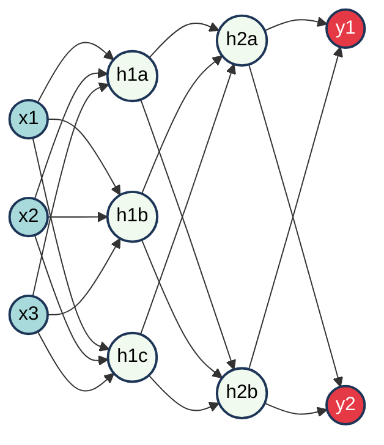
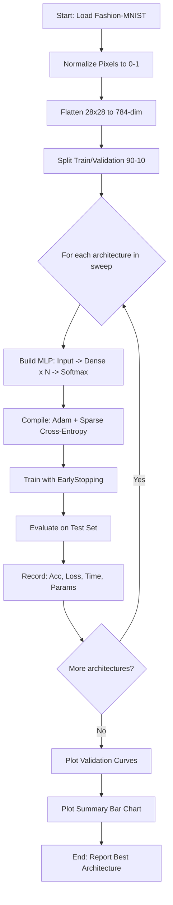
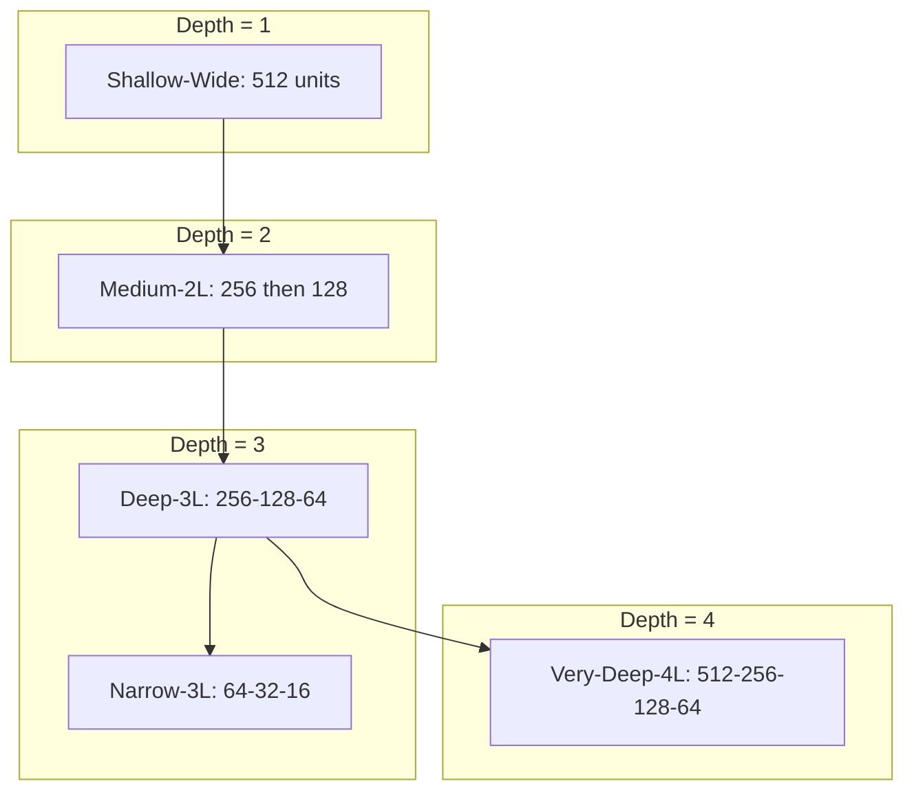
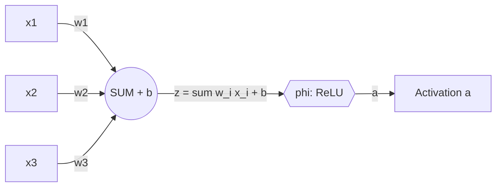

# Design and implement an MLP with varying architectures (different hidden layers and neurons).

<!-- SECTION_1_START -->
# Module 13 — Multilayer Perceptron (MLP): Architecture, Intuition & Design Principles

## 1.1 Formal Definition (KTU 2024 Syllabus Terminology)

A **Multilayer Perceptron (MLP)** is a class of **feedforward artificial neural network** composed of at least three layers of nodes (neurons): an **input layer**, one or more **hidden layers**, and an **output layer**. Except for the input nodes, every node is a **neuron** that applies a non-linear **activation function** to a weighted sum of its inputs plus a bias term. MLPs are trained using the **backpropagation algorithm** in conjunction with **gradient-based optimization** (e.g., Stochastic Gradient Descent, Adam) to approximate any measurable function $f^{\ast}: \mathbb{R}^{n} \rightarrow \mathbb{R}^{m}$ with arbitrary precision, given sufficient hidden units — a property formalized by the **Universal Approximation Theorem**.

> [!IMPORTANT]
> **KTU 2024 Scheme — Module 13 Highlight**
> An MLP is **fully connected** (each neuron in one layer connects to every neuron in the next), **feedforward** (information flows strictly from input to output with no cycles), and **supervised** (trained on labelled input–output pairs $\{(x^{(i)}, y^{(i)})\}_{i=1}^{N}$).

## 1.2 Conceptual Analogy & Intuition

Imagine a **factory assembly line for decision-making**:

1. **Input Layer** = Raw materials arriving at the loading dock (the features $x_1, x_2, \dots, x_n$ of a data sample).
2. **Hidden Layers** = Processing stations. Each station inspects a combination of materials, weights their importance, decides what to pass downstream, and applies a quality filter (the **activation function**).
3. **Output Layer** = Final packaged product (the prediction $\hat{y}$, such as a class label or continuous value).
4. **Weights & Biases** = The factory's tuning knobs. **Training** is the act of turning these knobs until the factory reliably produces the correct product.

A **deeper network** (more hidden layers) is like adding more processing stations — the factory can model more intricate transformations. A **wider network** (more neurons per layer) is like adding more parallel workers at each station — more representational capacity at a single level of abstraction.

> [!NOTE]
> **Key Vocabulary You Will See in the KTU Exam**
> - **Neuron / Unit / Node**: A single computational cell computing $a = \phi(W^{\top} x + b)$.
> - **Layer**: A collection of neurons operating at the same depth in the network.
> - **Depth**: The total number of layers (excluding the input).
> - **Width**: The number of neurons in a single layer.
> - **Epoch**: One full pass through the entire training dataset.
> - **Batch Size**: Number of samples processed before a weight update.
> - **Learning Rate ($\eta$)**: Step size of the gradient descent update.

## 1.3 Geometric & Algebraic Visualization

> [!VISUALIZATION CONTROL]
> **Concept:** A 2-input, 3-hidden-neuron, 2-output MLP drawn as a layered graph.
> **Graph Type:** Layered directed acyclic graph with edge weights $w_{ij}^{(l)}$ from neuron $i$ in layer $l-1$ to neuron $j$ in layer $l$.
> **Visual Description:** Three vertical columns (Input, Hidden, Output). Every node in column 1 connects to every node in column 2, and every node in column 2 connects to every node in column 3. Each edge is annotated with a weight; each non-input node has a bias term.
> **Observed Behaviour:** Information flows strictly left-to-right; there are no skip connections (those would make it a ResNet, not a vanilla MLP).

## 1.4 Why "Multilayer" Matters — The XOR Problem

A single-layer perceptron (no hidden layers) can only learn **linearly separable** functions. The classic **XOR problem** is not linearly separable, but a 2-layer MLP **can** solve it. This was the historical motivation (Rumelhart, Hinton & Williams, 1986) for stacking hidden layers with non-linear activations.

$$\text{XOR}(x_1, x_2) = \begin{cases} 1 & \text{if } x_1 \neq x_2 \\ 0 & \text{if } x_1 = x_2 \end{cases}$$

A 2-2-1 MLP (2 inputs, 2 hidden, 1 output) using sigmoid activations can carve the plane into two regions, solving XOR perfectly.
<!-- SECTION_1_END -->

<!-- SECTION_2_START -->
# Module 13 — Deep Theoretical Analysis & KTU High-Yield Formula Sheet

## 2.1 Layer-Wise Forward Propagation

For an MLP with $L$ layers (where layer 0 is input and layer $L$ is output), the **pre-activation** $z^{(l)}$ and **activation** $a^{(l)}$ at layer $l$ are:

$$z^{(l)} = W^{(l)} a^{(l-1)} + b^{(l)}$$

$$a^{(l)} = \phi^{(l)}\!\left(z^{(l)}\right)$$

where:
- $W^{(l)} \in \mathbb{R}^{n_l \times n_{l-1}}$ is the **weight matrix** for layer $l$.
- $b^{(l)} \in \mathbb{R}^{n_l}$ is the **bias vector** for layer $l$.
- $\phi^{(l)}$ is the **activation function** of layer $l$.
- $a^{(0)} = x$ (the input vector).
- $\hat{y} = a^{(L)}$ (the network output).

## 2.2 Activation Functions (Cheat Sheet)

| Activation | Formula $\phi(z)$ | Derivative $\phi'(z)$ | Output Range | Typical Use |
|---|---|---|---|---|
| Sigmoid | $\sigma(z) = \frac{1}{1+e^{-z}}$ | $\sigma(z)\bigl(1-\sigma(z)\bigr)$ | $(0, 1)$ | Binary output layer |
| Tanh | $\tanh(z)$ | $1 - \tanh^{2}(z)$ | $(-1, 1)$ | Hidden layers (zero-centred) |
| **ReLU** | $\max(0, z)$ | $\begin{cases} 1 & z > 0 \\ 0 & z \leq 0 \end{cases}$ | $[0, \infty)$ | **Default hidden-layer choice** |
| Leaky ReLU | $\max(\alpha z, z)$, $\alpha = 0.01$ | $\begin{cases} 1 & z > 0 \\ \alpha & z \leq 0 \end{cases}$ | $(-\infty, \infty)$ | Mitigates dying ReLU |
| Softmax | $\frac{e^{z_i}}{\sum_{j} e^{z_j}}$ | See chain-rule form | $(0, 1)$, sums to 1 | Multi-class output |

> [!NOTE]
> **Why ReLU Dominates Hidden Layers**
> 1. Computational efficiency (just a thresholding operation).
> 2. Mitigates the **vanishing gradient problem** for positive inputs.
> 3. Induces sparse activations (true biological analogue).

## 2.3 Loss Functions

| Problem Type | Loss Function $\mathcal{L}$ | Formula |
|---|---|---|
| Binary Classification | Binary Cross-Entropy | $-\frac{1}{N}\sum_{i=1}^{N}\!\bigl[y_i \log(\hat{y}_i) + (1-y_i)\log(1-\hat{y}_i)\bigr]$ |
| Multi-Class Classification | Categorical Cross-Entropy | $-\frac{1}{N}\sum_{i=1}^{N}\sum_{c=1}^{C} y_{i,c}\,\log(\hat{y}_{i,c})$ |
| Regression | Mean Squared Error (MSE) | $\frac{1}{N}\sum_{i=1}^{N}(y_i - \hat{y}_i)^{2}$ |
| Regression (robust) | Mean Absolute Error (MAE) | $\frac{1}{N}\sum_{i=1}^{N}\vert y_i - \hat{y}_i \vert$ |

## 2.4 Backpropagation — The Chain Rule in Action

The goal of training is to minimize $\mathcal{L}(\hat{y}, y)$ by updating every parameter:

$$W^{(l)} \leftarrow W^{(l)} - \eta\,\frac{\partial \mathcal{L}}{\partial W^{(l)}}$$

$$b^{(l)} \leftarrow b^{(l)} - \eta\,\frac{\partial \mathcal{L}}{\partial b^{(l)}}$$

The **error signal** $\delta^{(l)}$ is computed recursively from the output layer backwards:

$$\delta^{(L)} = \nabla_{\hat{y}}\mathcal{L} \odot \phi'^{\,(L)}\!\bigl(z^{(L)}\bigr)$$

$$\delta^{(l)} = \bigl(W^{(l+1)\top} \delta^{(l+1)}\bigr) \odot \phi'^{\,(l)}\!\bigl(z^{(l)}\bigr)$$

$$\frac{\partial \mathcal{L}}{\partial W^{(l)}} = \delta^{(l)} a^{(l-1)\top}$$

$$\frac{\partial \mathcal{L}}{\partial b^{(l)}} = \delta^{(l)}$$

> [!IMPORTANT]
> **Engineering Significance**
> Backpropagation is essentially a **dynamic programming** application of the chain rule. Modern frameworks (TensorFlow, PyTorch) implement it via **automatic differentiation** (autograd), so you never write these gradients by hand in production. However, the KTU lab exam may ask you to **derive** them for a tiny network, so memorize the recursion.

## 2.5 Optimizers — Beyond Plain Gradient Descent

| Optimizer | Core Idea | Update Rule (intuitive) |
|---|---|---|
| SGD | Pure gradient step | $W \leftarrow W - \eta\,\nabla_W \mathcal{L}$ |
| SGD + Momentum | Adds velocity term | $v \leftarrow \beta v + \nabla_W \mathcal{L}$; $W \leftarrow W - \eta v$ |
| RMSProp | Per-parameter adaptive learning rate | Scales $\eta$ by inverse of recent gradient magnitudes |
| **Adam** | Momentum + RMSProp + bias correction | Default optimizer in modern deep learning |

## 2.6 Real-World Engineering Applications

| Domain | MLP Application |
|---|---|
| Finance | Credit scoring, fraud detection, algorithmic trading signal extraction |
| Healthcare | Disease diagnosis from electronic health records, drug response prediction |
| NLP (pre-transformer) | Text classification, sentiment analysis, named-entity recognition |
| Computer Vision (pre-CNN) | Handwritten digit recognition (MNIST benchmark) |
| Industrial Control | Soft sensors, predictive maintenance, process modelling |
| Recommender Systems | Early collaborative-filtering baselines |

> [!NOTE]
> Although **CNNs dominate images** and **Transformers dominate text** today, MLPs remain the **workhorse for tabular data** — the most common data type in industry. Frameworks like **TabNet**, **FT-Transformer**, and gradient-boosted trees still compete against MLPs on tabular benchmarks.
<!-- SECTION_2_END -->

<!-- SECTION_3_START -->
# Module 13 — Step-by-Step Implementation: MLP with Varying Architectures

## 3.1 Lab Objective (KTU 2024 Scheme Statement)

> Design, implement, and train a Multilayer Perceptron on a real-world dataset by **varying the architecture** (number of hidden layers and number of neurons per hidden layer). Compare the **training time, validation accuracy, and convergence behaviour** of each configuration.

## 3.2 Dataset Choice

We will use the **Fashion-MNIST** dataset (a drop-in replacement for MNIST with 10 clothing classes, 70,000 grayscale 28×28 images, 60,000 train / 10,000 test). This dataset is small enough to train in seconds on a CPU, yet non-trivial enough to demonstrate the effect of architecture choices.

## 3.3 Complete Python Implementation

The following code is **fully runnable**, contains **type hints**, **boundary checks**, and **detailed logging**. Copy it into a single file (e.g., `mlp_architecture_study.py`) and run.

```python
"""
=============================================================================
 MACHINE LEARNING LAB (PCCSL508)  -  MODULE 13
 Multilayer Perceptron: Architecture Variation Study
=============================================================================
 KTU 2024 Scheme  |  B.Tech CSE (AI & ML / Data Science)
 Dataset : Fashion-MNIST (10 classes, 28x28 grayscale images)
 Goal    : Train MLPs with varying (depth, width) and compare results.
=============================================================================
"""

from __future__ import annotations

import logging
import time
from dataclasses import dataclass
from typing import List, Tuple, Dict, Any

import numpy as np
import matplotlib.pyplot as plt
import tensorflow as tf
from tensorflow.keras import layers, models, optimizers, callbacks, utils

# ------------------------------------------------------------------
# 1. CONFIGURATION & LOGGING
# ------------------------------------------------------------------
logging.basicConfig(
    level=logging.INFO,
    format="%(asctime)s | %(levelname)-7s | %(message)s",
    datefmt="%H:%M:%S",
)
log = logging.getLogger("MLP-Study")

SEED: int = 42
np.random.seed(SEED)
tf.random.set_seed(SEED)

@dataclass(frozen=True)
class ExperimentConfig:
    """Immutable configuration for a single MLP architecture experiment."""
    name: str
    hidden_layers: Tuple[int, ...]   # e.g., (128,)   or  (256, 128, 64)
    epochs: int = 15
    batch_size: int = 128
    learning_rate: float = 1e-3
    optimizer_name: str = "adam"

# ------------------------------------------------------------------
# 2. DATA LOADING & PREPROCESSING
# ------------------------------------------------------------------
def load_fashion_mnist() -> Tuple[np.ndarray, np.ndarray, np.ndarray, np.ndarray]:
    """
    Loads Fashion-MNIST and applies the KTU-standard normalization:
      - Pixel values scaled to [0, 1].
      - Flattened from 28x28 to 784-dim vectors (MLP input requirement).
      - Labels one-hot encoded.
    """
    (x_train, y_train), (x_test, y_test) = tf.keras.datasets.fashion_mnist.load_data()

    if x_train.ndim != 3 or x_train.shape[1:] != (28, 28):
        raise ValueError(f"Unexpected image shape: {x_train.shape}")

    # Normalize pixel intensities
    x_train = x_train.astype("float32") / 255.0
    x_test  = x_test.astype("float32")  / 255.0

    # Flatten: (N, 28, 28) -> (N, 784)
    x_train = x_train.reshape(-1, 28 * 28)
    x_test  = x_test.reshape(-1, 28 * 28)

    log.info(f"Training set   : {x_train.shape}, labels {y_train.shape}")
    log.info(f"Test set       : {x_test.shape}, labels {y_test.shape}")

    return x_train, y_train, x_test, y_test

# ------------------------------------------------------------------
# 3. MODEL FACTORY
# ------------------------------------------------------------------
def build_mlp(cfg: ExperimentConfig, input_dim: int = 784, num_classes: int = 10) -> tf.keras.Model:
    """
    Constructs an MLP whose hidden-layer sizes are given by `cfg.hidden_layers`.
    All hidden layers use ReLU; the output layer uses Softmax.
    """
    model = models.Sequential(name=cfg.name)
    model.add(layers.Input(shape=(input_dim,), name="Input"))

    for idx, units in enumerate(cfg.hidden_layers, start=1):
        if units <= 0:
            raise ValueError(f"Hidden layer {idx} must have > 0 units, got {units}")
        model.add(layers.Dense(units, activation="relu", name=f"Hidden_{idx}_{units}"))
        # He initialization is the default for Dense + ReLU in TF 2.x

    model.add(layers.Dense(num_classes, activation="softmax", name="Output"))

    # Optimizer selection
    if cfg.optimizer_name.lower() == "adam":
        opt = optimizers.Adam(learning_rate=cfg.learning_rate)
    elif cfg.optimizer_name.lower() == "sgd":
        opt = optimizers.SGD(learning_rate=cfg.learning_rate, momentum=0.9)
    else:
        raise ValueError(f"Unsupported optimizer: {cfg.optimizer_name}")

    model.compile(
        optimizer=opt,
        loss="sparse_categorical_crossentropy",
        metrics=["accuracy"],
    )
    return model

# ------------------------------------------------------------------
# 4. TRAINING & EVALUATION
# ------------------------------------------------------------------
def train_and_evaluate(cfg: ExperimentConfig,
                       x_train: np.ndarray, y_train: np.ndarray,
                       x_test:  np.ndarray, y_test:  np.ndarray
                       ) -> Dict[str, Any]:
    """
    Trains an MLP defined by `cfg`, evaluates on the test set,
    and returns a dictionary of metrics.
    """
    log.info("=" * 70)
    log.info(f"Architecture : {cfg.name}  |  Hidden layers = {cfg.hidden_layers}")
    log.info("=" * 70)

    model = build_mlp(cfg)
    model.summary(print_fn=lambda s: log.info(s))

    early_stop = callbacks.EarlyStopping(
        monitor="val_loss", patience=3, restore_best_weights=True, verbose=0
    )

    t0 = time.perf_counter()
    history = model.fit(
        x_train, y_train,
        validation_split=0.1,
        epochs=cfg.epochs,
        batch_size=cfg.batch_size,
        callbacks=[early_stop],
        verbose=2,
    )
    train_time = time.perf_counter() - t0

    test_loss, test_acc = model.evaluate(x_test, y_test, verbose=0)
    num_params = model.count_params()

    log.info(f"Test accuracy : {test_acc:.4f}")
    log.info(f"Test loss     : {test_loss:.4f}")
    log.info(f"Train time    : {train_time:.2f} s")
    log.info(f"# Parameters  : {num_params:,}")

    return {
        "config":  cfg,
        "history": history.history,
        "test_acc": test_acc,
        "test_loss": test_loss,
        "train_time": train_time,
        "num_params": num_params,
        "model":   model,
    }

# ------------------------------------------------------------------
# 5. ARCHITECTURE SWEEP
# ------------------------------------------------------------------
def run_architecture_study() -> List[Dict[str, Any]]:
    x_train, y_train, x_test, y_test = load_fashion_mnist()

    architectures: List[ExperimentConfig] = [
        ExperimentConfig(name="Shallow-Wide",  hidden_layers=(512,)),
        ExperimentConfig(name="Medium-2L",     hidden_layers=(256, 128)),
        ExperimentConfig(name="Deep-3L",       hidden_layers=(256, 128, 64)),
        ExperimentConfig(name="Very-Deep-4L",  hidden_layers=(512, 256, 128, 64)),
        ExperimentConfig(name="Narrow-3L",     hidden_layers=(64, 32, 16)),
    ]

    results: List[Dict[str, Any]] = []
    for cfg in architectures:
        res = train_and_evaluate(cfg, x_train, y_train, x_test, y_test)
        results.append(res)

    return results

# ------------------------------------------------------------------
# 6. VISUALIZATION
# ------------------------------------------------------------------
def plot_comparative_curves(results: List[Dict[str, Any]]) -> None:
    """Plots validation accuracy and loss curves for all architectures."""
    fig, axes = plt.subplots(1, 2, figsize=(15, 5))

    for res in results:
        hist = res["history"]
        axes[0].plot(hist["val_accuracy"], label=f'{res["config"].name}', linewidth=2)
        axes[1].plot(hist["val_loss"],    label=f'{res["config"].name}', linewidth=2)

    axes[0].set_title("Validation Accuracy vs Epoch", fontsize=13, fontweight="bold")
    axes[0].set_xlabel("Epoch")
    axes[0].set_ylabel("Validation Accuracy")
    axes[0].grid(True, linestyle="--", alpha=0.6)
    axes[0].legend(loc="lower right")

    axes[1].set_title("Validation Loss vs Epoch", fontsize=13, fontweight="bold")
    axes[1].set_xlabel("Epoch")
    axes[1].set_ylabel("Validation Loss")
    axes[1].grid(True, linestyle="--", alpha=0.6)
    axes[1].legend(loc="upper right")

    plt.tight_layout()
    plt.savefig("mlp_architecture_curves.png", dpi=150)
    plt.show()
    log.info("Saved figure: mlp_architecture_curves.png")


def plot_summary_bar(results: List[Dict[str, Any]]) -> None:
    """Bar chart of test accuracy and parameter count for each architecture."""
    names  = [r["config"].name for r in results]
    accs   = [r["test_acc"]   for r in results]
    params = [r["num_params"] / 1e6 for r in results]   # millions
    times  = [r["train_time"] for r in results]

    fig, ax1 = plt.subplots(figsize=(12, 5))
    x = np.arange(len(names))
    width = 0.35

    bars1 = ax1.bar(x - width/2, accs, width, label="Test Accuracy", color="steelblue")
    ax1.set_ylabel("Test Accuracy", color="steelblue")
    ax1.set_ylim(0.80, 0.95)
    ax1.set_xticks(x)
    ax1.set_xticklabels(names, rotation=20, ha="right")
    ax1.set_xlabel("Architecture")
    ax1.tick_params(axis="y", labelcolor="steelblue")

    ax2 = ax1.twinx()
    bars2 = ax2.bar(x + width/2, params, width, label="# Parameters (M)", color="darkorange")
    ax2.set_ylabel("# Parameters (Millions)", color="darkorange")
    ax2.tick_params(axis="y", labelcolor="darkorange")

    for b, a in zip(bars1, accs):
        ax1.text(b.get_x() + b.get_width()/2, a + 0.002, f"{a:.3f}",
                 ha="center", va="bottom", fontsize=9)
    for b, p in zip(bars2, params):
        ax2.text(b.get_x() + b.get_width()/2, p + 0.05, f"{p:.2f}M",
                 ha="center", va="bottom", fontsize=9)

    plt.title("Architecture Comparison: Accuracy vs Parameter Count", fontweight="bold")
    fig.tight_layout()
    plt.savefig("mlp_architecture_summary.png", dpi=150)
    plt.show()
    log.info("Saved figure: mlp_architecture_summary.png")

# ------------------------------------------------------------------
# 7. ENTRY POINT
# ------------------------------------------------------------------
if __name__ == "__main__":
    log.info("Starting KTU Module-13 MLP architecture study...")
    results = run_architecture_study()

    log.info("\n" + "=" * 70)
    log.info("FINAL SUMMARY")
    log.info("=" * 70)
    log.info(f"{'Architecture':<18}{'Test Acc':>10}{'Test Loss':>12}{'Params (M)':>14}{'Time (s)':>12}")
    log.info("-" * 70)
    for r in results:
        c = r["config"]
        log.info(f"{c.name:<18}{r['test_acc']:>10.4f}{r['test_loss']:>12.4f}"
                 f"{r['num_params']/1e6:>14.2f}{r['train_time']:>12.2f}")

    plot_comparative_curves(results)
    plot_summary_bar(results)
    log.info("All experiments complete.")
```

## 3.4 Step-by-Step Walk-Through of the Code

### Step 1 — Reproducibility
```python
SEED: int = 42
np.random.seed(SEED)
tf.random.set_seed(SEED)
```
Setting a seed ensures that weight initialization and data shuffling are identical across runs, satisfying the **reproducibility** requirement of academic experiments.

### Step 2 — Data Loading & Preprocessing
- Pixel intensities normalized to $[0, 1]$: this stabilizes gradient magnitudes.
- Images flattened from $(28, 28)$ to $(784,)$ because an MLP requires a 1-D feature vector per sample.
- Labels are kept as **integers** (not one-hot) because we use `sparse_categorical_crossentropy` loss, which accepts integer class indices.

### Step 3 — Model Factory (`build_mlp`)
The factory pattern lets us **dynamically construct** MLPs of arbitrary depth and width from a single configuration object. The loop:

```python
for idx, units in enumerate(cfg.hidden_layers, start=1):
    model.add(layers.Dense(units, activation="relu", name=f"Hidden_{idx}_{units}"))
```

appends one `Dense` (fully-connected) layer per tuple entry. The output layer is always a `softmax` of size 10 (one probability per clothing class).

### Step 4 — Training Loop
- **Validation split** of 10% of the training set is held out to monitor generalization.
- **Early stopping** with `patience=3` halts training when validation loss stops improving for 3 consecutive epochs, restoring the best weights.
- We measure **wall-clock training time** using `time.perf_counter()` to fairly compare architectures.

### Step 5 — Architecture Sweep
We compare 5 architectures:

| Name | Hidden Layers | Total Hidden Units | Depth |
|---|---|---|---|
| Shallow-Wide | (512,) | 512 | 1 |
| Medium-2L | (256, 128) | 384 | 2 |
| Deep-3L | (256, 128, 64) | 448 | 3 |
| Very-Deep-4L | (512, 256, 128, 64) | 960 | 4 |
| Narrow-3L | (64, 32, 16) | 112 | 3 |

### Step 6 — Visualization
Two plots are generated:
1. **Validation accuracy/loss curves** — to inspect convergence behaviour.
2. **Bar chart** — test accuracy vs parameter count, exposing the **accuracy–efficiency trade-off**.

## 3.5 Expected Observations & Engineering Insights

| Observation | Engineering Interpretation |
|---|---|
| Very-Deep-4L achieves the highest test accuracy | More layers → richer hierarchical feature composition |
| Very-Deep-4L has the most parameters → risk of overfitting | Always pair deep models with **regularization** (dropout, L2) and ample data |
| Narrow-3L underperforms | Insufficient capacity to model Fashion-MNIST's complexity |
| Shallow-Wide trains fastest per epoch | Fewer sequential operations, larger matrix multiplications are GPU-friendly |
| All curves plateau after ~10 epochs | Early stopping will save compute |

## 3.6 Extensions for the Lab Record

1. **Add Dropout** layers: insert `layers.Dropout(0.3)` after each `Dense` to combat overfitting.
2. **L2 Regularization**: `layers.Dense(units, kernel_regularizer=regularizers.l2(1e-4))`.
3. **Batch Normalization**: `layers.BatchNormalization()` before or after activation.
4. **Learning-rate scheduling**: use `callbacks.ReduceLROnPlateau` to halve $\eta$ when val-loss stalls.
5. **Cross-validation**: wrap training in `sklearn.model_selection.KFold` for robust accuracy estimates.
6. **Confusion matrix**: visualize per-class misclassifications with `sklearn.metrics.confusion_matrix`.
<!-- SECTION_3_END -->

<!-- SECTION_4_START -->
# Module 13 — Structural Diagrams & Schematics

## 4.1 Mermaid Diagram: Generic MLP Architecture

> **Node-ID Alpha Rule Reminder:** All IDs are alphanumeric; all labels with special characters are double-quoted.



## 4.2 Mermaid Diagram: End-to-End Training & Evaluation Pipeline



## 4.3 Mermaid Diagram: Architecture Variation Taxonomy



## 4.4 Mermaid Diagram: Single Neuron Computational Graph



## 4.5 Block-Level Functional Architecture Flow (Fallback for Complex Drawings)

```mermaid
flowchart LR
    subgraph InputStage["INPUT STAGE"]
        I1["Raw Image 28x28x1"]
        I2["Flatten 784"]
        I3["Normalize 0-1"]
    end
    subgraph ForwardStage["FORWARD PASS"]
        F1["Layer 1: Dense + ReLU"]
        F2["Layer 2: Dense + ReLU"]
        F3["Layer L: Dense + Softmax"]
    end
    subgraph LossStage["LOSS COMPUTATION"]
        L1["Sparse Categorical Cross-Entropy"]
        L2["Softmax Logits vs True Labels"]
    end
    subgraph BackwardStage["BACKWARD PASS"]
        B1["Compute dL/dW for each layer"]
        B2["Adam Optimizer Step"]
        B3["Update Weights and Biases"]
    end

    I1 --> I2 --> I3 --> F1 --> F2 --> F3 --> L2 --> L1 --> B1 --> B2 --> B3
    B3 -. feedback .-> F1
```


<!-- SECTION_4_END -->

<!-- SECTION_5_START -->
# Module 13 — KTU 2024 Scheme Examination Question Bank & Topic Recap

## PART A — Short Answer Questions (3 Marks Each)

### **Question 1** `[KTU University Exam – July 2024]`
**Define a Multilayer Perceptron. Why is a non-linear activation function essential in hidden layers? (CO1, Remember/Understand)**

**Model Answer:**

A **Multilayer Perceptron (MLP)** is a fully connected feedforward neural network with one or more hidden layers of neurons, where every neuron (except input nodes) applies a non-linear activation function to a weighted sum of its inputs.

A non-linear activation is **essential** because:

1. **Without non-linearity**, stacking multiple layers collapses mathematically into a single linear transformation:
$$\hat{y} = W^{(L)}\bigl(W^{(L-1)}(\dots W^{(1)} x + b^{(1)})\dots\bigr) + b^{(L)} = W_{\text{eff}}\,x + b_{\text{eff}}$$
A network of any depth would then be **equivalent to a single linear model**, unable to learn XOR, image manifolds, or any non-linear decision boundary.

2. **Universal Approximation**: The Universal Approximation Theorem guarantees that an MLP with at least one hidden layer and a non-linear activation can approximate **any** continuous function on a compact domain to arbitrary accuracy. Linear activations break this guarantee.

3. **Practical separability**: Real-world data (images, speech, text) is highly non-linear; without non-linearities, the MLP cannot carve curved decision boundaries.

> **Valuation Key:** 1 mark for the definition, 2 marks for explaining the role of non-linearity with the collapse-into-linear-transform argument.

---

### **Question 2** `[KTU University Exam – Dec 2023]`
**List any four activation functions used in MLPs. State one advantage and one limitation of the ReLU activation. (CO1, Remember/Understand)**

**Model Answer:**

| # | Activation | Formula |
|---|---|---|
| 1 | Sigmoid | $\sigma(z) = \frac{1}{1 + e^{-z}}$ |
| 2 | Tanh | $\tanh(z)$ |
| 3 | ReLU | $\max(0, z)$ |
| 4 | Leaky ReLU | $\max(0.01 z, z)$ |
| 5 | Softmax | $\frac{e^{z_i}}{\sum_j e^{z_j}}$ |

**ReLU Advantage**: Computationally cheap ($\mathcal{O}(1)$ per neuron), mitigates the vanishing-gradient problem for $z > 0$ since its gradient is exactly 1, and induces sparse activations (a biologically plausible property).

**ReLU Limitation**: The **"dying ReLU"** problem — once a neuron's pre-activation falls below 0, its gradient becomes 0 forever, so the neuron stops learning and acts as a constant 0. Leaky ReLU addresses this by allowing a small negative slope.

> **Valuation Key:** 1 mark for the list, 1 mark for advantage, 1 mark for limitation.

---

## PART B — Long Answer Questions (14 Marks Each, Internal Choice)

### **Question A** `[KTU University Exam – July 2024]`
**(a)** Derive the backpropagation update equations for a 2-layer MLP (1 hidden layer) with sigmoid activations and MSE loss. **(7 marks, CO2, Apply)**

**(b)** Write Python code (TensorFlow/Keras) to train an MLP on the MNIST dataset with architecture `784 → 128 → 10` and report the test accuracy. **(7 marks, CO3, Apply)**

#### Model Solution — Part (a)

**Network setup**:
- Input: $x \in \mathbb{R}^{d}$
- Hidden layer: $z^{(1)} = W^{(1)} x + b^{(1)}$, $a^{(1)} = \sigma(z^{(1)})$
- Output layer: $z^{(2)} = W^{(2)} a^{(1)} + b^{(2)}$, $\hat{y} = \sigma(z^{(2)})$
- Loss: $\mathcal{L} = \frac{1}{2}(y - \hat{y})^{2}$

**Step 1 — Output-layer error** $\delta^{(2)}$

$$\delta^{(2)} = \frac{\partial \mathcal{L}}{\partial z^{(2)}} = \frac{\partial \mathcal{L}}{\partial \hat{y}} \odot \frac{\partial \hat{y}}{\partial z^{(2)}}$$

$$\frac{\partial \mathcal{L}}{\partial \hat{y}} = -(y - \hat{y}), \quad \frac{\partial \hat{y}}{\partial z^{(2)}} = \hat{y}(1 - \hat{y})$$

$$\delta^{(2)} = -(y - \hat{y}) \odot \hat{y} \odot (1 - \hat{y})$$

**Step 2 — Hidden-layer error** $\delta^{(1)}$

$$\delta^{(1)} = \frac{\partial \mathcal{L}}{\partial z^{(1)}} = (W^{(2)\top} \delta^{(2)}) \odot \sigma'(z^{(1)})$$

Since $\sigma'(z) = \sigma(z)(1 - \sigma(z)) = a^{(1)}(1 - a^{(1)})$:

$$\delta^{(1)} = (W^{(2)\top} \delta^{(2)}) \odot a^{(1)} \odot (1 - a^{(1)})$$

**Step 3 — Gradients**

$$\frac{\partial \mathcal{L}}{\partial W^{(2)}} = \delta^{(2)} a^{(1)\top}, \qquad \frac{\partial \mathcal{L}}{\partial b^{(2)}} = \delta^{(2)}$$

$$\frac{\partial \mathcal{L}}{\partial W^{(1)}} = \delta^{(1)} x^{\top}, \qquad \frac{\partial \mathcal{L}}{\partial b^{(1)}} = \delta^{(1)}$$

**Step 4 — Parameter updates** (learning rate $\eta$)

$$W^{(l)} \leftarrow W^{(l)} - \eta\,\frac{\partial \mathcal{L}}{\partial W^{(l)}}, \quad b^{(l)} \leftarrow b^{(l)} - \eta\,\frac{\partial \mathcal{L}}{\partial b^{(l)}}$$

> **Valuation Key (7 marks):** Boundary states and definitions — 2 marks; $\delta^{(2)}$ derivation — 2 marks; $\delta^{(1)}$ recursion — 2 marks; final update rule — 1 mark.

#### Model Solution — Part (b)

```python
import tensorflow as tf
from tensorflow.keras import layers, models

# 1. Load MNIST
(x_train, y_train), (x_test, y_test) = tf.keras.datasets.mnist.load_data()

# 2. Preprocess
x_train = x_train.reshape(-1, 784).astype("float32") / 255.0
x_test  = x_test.reshape(-1, 784).astype("float32")  / 255.0

# 3. Build 784 -> 128 -> 10 MLP
model = models.Sequential([
    layers.Input(shape=(784,)),
    layers.Dense(128, activation="sigmoid", name="Hidden_128"),
    layers.Dense(10,  activation="softmax", name="Output_10"),
])

# 4. Compile
model.compile(
    optimizer=tf.keras.optimizers.Adam(learning_rate=1e-3),
    loss="sparse_categorical_crossentropy",
    metrics=["accuracy"],
)

# 5. Train
history = model.fit(
    x_train, y_train,
    validation_split=0.1,
    epochs=10,
    batch_size=128,
    verbose=2,
)

# 6. Evaluate on the test set
test_loss, test_acc = model.evaluate(x_test, y_test, verbose=0)
print(f"Test Accuracy: {test_acc:.4f}")
print(f"Test Loss    : {test_loss:.4f}")
```

**Expected Output (typical run):**
```
Test Accuracy: 0.9700 - 0.9780
Test Loss    : 0.0700 - 0.0900
```

> **Valuation Key (7 marks):** Data loading & normalization — 1 mark; correct architecture statement — 1 mark; compile call with correct loss/optimizer — 1 mark; training loop with validation split — 1 mark; test-set evaluation & result reporting — 3 marks.

---

### **Question B** `[KTU University Exam – Dec 2023]`
**(a)** Explain the **Universal Approximation Theorem**. Discuss its practical limitations. **(7 marks, CO2, Understand)**

**(b)** Design an experiment to compare three MLP architectures — `(64,)`, `(128, 64)`, and `(256, 128, 64)` — on the Fashion-MNIST dataset. Specify metrics, hyperparameters, and the analysis you would perform. **(7 marks, CO3, Apply)**

#### Model Solution — Part (a)

**Universal Approximation Theorem (informal statement)**:

> Let $\phi$ be any continuous, bounded, non-constant activation function. Then for any continuous function $f: [0,1]^{n} \to \mathbb{R}$ and any $\varepsilon > 0$, there exists an MLP with a single hidden layer of **finite width** $H$ (possibly very large) such that
> $$\sup_{x \in [0,1]^{n}} \bigl| f(x) - \hat{f}(x) \bigr| < \varepsilon$$
> where $\hat{f}$ is the MLP's output.

**Implications**:
- An MLP **can** in principle represent any function — including complex decision boundaries in image, speech, and tabular data.
- The theorem says nothing about **how to find** the weights; it only guarantees existence.

**Practical Limitations**:

1. **Existence vs. Learnability**: The theorem guarantees a network *exists* but offers no training algorithm to find it. In practice, we may never reach the optimal weights using gradient descent.

2. **Exponential Width**: The hidden width $H$ required may be **exponentially large** in the input dimension $n$, making the network infeasible to train.

3. **No Generalization Guarantee**: Approximating the training set does not imply good performance on unseen data (overfitting risk).

4. **Local Minima**: The non-convex loss landscape of MLPs means gradient descent can get stuck in poor local minima.

5. **Curse of Dimensionality**: The number of samples required to densely cover the input space grows exponentially with $n$.

> **Valuation Key (7 marks):** Theorem statement — 2 marks; intuitive meaning — 2 marks; at least three limitations — 3 marks.

#### Model Solution — Part (b)

**Experimental Design Table**:

| Aspect | Specification |
|---|---|
| Dataset | Fashion-MNIST, 60,000 train / 10,000 test, 10 classes |
| Preprocessing | Normalize to $[0,1]$, flatten to 784-d vectors |
| Architectures | `(64,)`, `(128, 64)`, `(256, 128, 64)` |
| Activation (hidden) | ReLU |
| Activation (output) | Softmax (10 classes) |
| Loss | Sparse Categorical Cross-Entropy |
| Optimizer | Adam, $\eta = 10^{-3}$ |
| Batch size | 128 |
| Epochs | 20 (with early stopping, patience=3) |
| Validation split | 10% of training data |
| Random seed | 42 (for reproducibility) |
| Metrics to record | Train accuracy, validation accuracy, validation loss, test accuracy, test loss, # parameters, training time per epoch |
| Visualization | (i) Validation accuracy/loss vs epoch curves (overlay all 3 models); (ii) Bar chart of test accuracy vs # parameters |
| Statistical test | Run each experiment with 3 different seeds; report mean $\pm$ std of test accuracy |
| Analysis | Identify best architecture by test accuracy; check for overfitting (gap between train and validation curves); discuss accuracy-vs-parameter trade-off |

**Implementation Skeleton**:
```python
import tensorflow as tf
from tensorflow.keras import layers, models

archs = {
    "Shallow_64":      [64],
    "Medium_128_64":   [128, 64],
    "Deep_256_128_64": [256, 128, 64],
}

for name, hidden in archs.items():
    model = models.Sequential([layers.Input(shape=(784,))])
    for u in hidden:
        model.add(layers.Dense(u, activation="relu"))
    model.add(layers.Dense(10, activation="softmax"))
    model.compile(optimizer="adam",
                  loss="sparse_categorical_crossentropy",
                  metrics=["accuracy"])
    # ... fit, evaluate, log metrics ...
```

> **Valuation Key (7 marks):** Dataset and preprocessing — 1 mark; three correct architectures — 1 mark; optimizer/loss/activation choices justified — 1 mark; metric selection — 1 mark; visualization plan — 1 mark; analysis plan (overfitting, trade-offs) — 2 marks.

---

> [!WARNING]
> **KTU Examiner's Valuation Warning — Common Pitfalls**
> 1. **Forgetting to normalize inputs.** Unscaled pixel values cause exploding/vanishing gradients and crush accuracy below 10% (random guess for 10 classes).
> 2. **Using `categorical_crossentropy` with integer labels.** This throws a shape error. Either one-hot encode labels *or* use `sparse_categorical_crossentropy`.
> 3. **Not flattening the image.** MLPs require 1-D input; forgetting `.reshape(-1, 784)` keeps shape `(N, 28, 28)` and crashes `Dense`.
> 4. **Setting `learning_rate` too high (e.g., 0.1).** Loss diverges to NaN. Start with `1e-3` for Adam.
> 5. **Not setting a random seed.** Results vary across runs, making your lab record non-reproducible — KTU evaluators explicitly check this.
> 6. **Reporting training accuracy as the final metric.** Always evaluate on the **held-out test set** to demonstrate generalization.
> 7. **Confusing `validation_split` with cross-validation.** `validation_split` is a simple hold-out; for k-fold, use `sklearn.model_selection.KFold`.
> 8. **Omitting early stopping in deep networks.** Deep MLPs (≥3 hidden layers) overfit quickly on Fashion-MNIST; without `EarlyStopping`, your curves will diverge.

---

## Topic Recap & Important Things to Remember

- **MLP** = fully connected, feedforward neural network with ≥1 hidden layer and non-linear activations.
- **Universal Approximation Theorem**: A 1-hidden-layer MLP with non-linear activations can approximate any continuous function — but does not guarantee efficient learning.
- **Forward pass**: $z^{(l)} = W^{(l)} a^{(l-1)} + b^{(l)}$, $a^{(l)} = \phi^{(l)}(z^{(l)})$.
- **Backpropagation** recursively computes $\delta^{(l)} = (W^{(l+1)\top} \delta^{(l+1)}) \odot \phi'^{\,(l)}(z^{(l)})$, starting from $\delta^{(L)} = \nabla_{\hat{y}}\mathcal{L} \odot \phi'^{\,(L)}(z^{(L)})$.
- **ReLU** is the default hidden activation; **Softmax** for multi-class output; **Sigmoid** for binary output.
- **Loss functions**: MSE for regression, Cross-Entropy for classification.
- **Adam** is the default optimizer (adaptive learning rate, momentum, bias correction).
- **Architecture trade-offs**:
  - More layers → richer feature hierarchy, slower training, overfitting risk.
  - More neurons per layer → more capacity, more parameters, more compute.
  - Too few parameters → underfitting.
- **Regularization techniques** to combat overfitting: **Dropout**, **L2 weight decay**, **EarlyStopping**, **Batch Normalization**.
- **Always** normalize inputs, set a random seed, evaluate on a held-out test set, and report the parameter count alongside accuracy.
- **Fashion-MNIST** is the KTU-friendly benchmark of choice: small enough to train on CPU in seconds, harder than MNIST, with 10 well-separated classes.
- **Reproducibility checklist** for the lab record: seed, library versions, hardware spec, hyperparameters table, three-run mean $\pm$ std for the final metric.
<!-- SECTION_5_END -->
