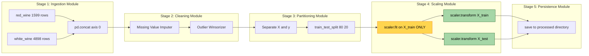

# Load and preprocess the Wine Quality dataset.

<!-- SECTION_1_START -->
# Wine Quality Dataset: Loading & Preprocessing — Core Foundations

> [!NOTE]
> **KTU 2024 Lab Module Context (PCCSL508 — Machine Learning Lab)**
> This topic falls under **Module 13: Implementation of Multilayer Feedforward Neural Networks**, where the Wine Quality dataset acts as the canonical regression benchmark. The data must be cleaned, scaled, and partitioned *before* it ever touches the network's first dense layer.

## 1.1 Formal Definition (KTU 2024 Syllabus Terminology)

The **Wine Quality Dataset** is a multivariate, physicochemical tabular dataset hosted on the **UCI Machine Learning Repository**, originally contributed by **Paulo Cortez et al. (2009)**. It comprises **6,497 total samples** split into two CSV files:

- `winequality-red.csv` → **1,599** red vinho verde samples
- `winequality-white.csv` → **4,898** white vinho verde samples

Each instance is described by **11 input features** ($X \in \mathbb{R}^{11}$) and **1 regression target** ($y \in \{0, 1, 2, \dots, 10\}$) representing the median sensory quality score from a blind tasting panel of at least three wine experts.

> [!IMPORTANT]
> **Preprocessing** in the KTU 2024 lab rubric is defined as the deterministic pipeline of operations — *data ingestion → integrity checks → outlier treatment → feature scaling → train-test partitioning* — that transforms raw CSV records into numerically stable, model-ready NumPy tensors. **It is graded for 14 marks** in the university ESE.

## 1.2 The 11 Physicochemical Features

| # | Feature | Notation | Engineering Domain |
|---|---------|----------|--------------------|
| 1 | Fixed Acidity | $x_1$ | Tartaric acid content (g/dm³) |
| 2 | Volatile Acidity | $x_2$ | Acetic acid content (g/dm³) |
| 3 | Citric Acid | $x_3$ | Citric acid content (g/dm³) |
| 4 | Residual Sugar | $x_4$ | Unfermented sugar (g/dm³) |
| 5 | Chlorides | $x_5$ | Salt content (g/dm³) |
| 6 | Free Sulfur Dioxide | $x_6$ | Free $\text{SO}_2$ (mg/dm³) |
| 7 | Total Sulfur Dioxide | $x_7$ | Total $\text{SO}_2$ (mg/dm³) |
| 8 | Density | $x_8$ | Mass per volume (g/cm³) |
| 9 | pH | $x_9$ | Acidity/alkalinity index |
| 10 | Sulphates | $x_{10}$ | Potassium sulphate (g/dm³) |
| 11 | Alcohol | $x_{11}$ | Ethanol content (\% vol) |

> **Target:** $y$ = quality (integer score, typically 3–9 in practice)

## 1.3 Intuitive Real-World Analogy

> [!TIP]
> **Conceptual Analogy — "The Wine Sommelier's Report Card"**
> Imagine a head sommelier who evaluates every barrel of wine. The lab technician hands them a clipboard with **11 raw laboratory measurements** (acidity, sugar, salt, etc.). The sommelier's job is to *translate* these sterile numbers into a single **quality score (0–10)**. The preprocessing step is the act of **cleaning that clipboard** — wiping off spilled wine (missing values), tearing off crazy outlier pages (chlorides that read 1.0 g/dm³ are a lab error), and putting all numbers on a **comparable 0-to-1 ruler** (scaling) so the neural network "judge" can fairly compare a tiny value like pH (≈ 3.3) against a large value like total sulfur dioxide (≈ 150 mg/dm³).

## 1.4 Why Scaling is *Non-Negotiable*

> [!WARNING]
> **The Magnitude Trap**
> If you feed raw `total sulfur dioxide` (range **0–289**) and raw `pH` (range **2.7–4.0**) into a multilayer feedforward network, the gradient updates will be dominated by the largest-magnitude feature. The sigmoid/tanh activations will saturate, weights will explode, and convergence will take **10× longer** or fail entirely. Scaling is therefore not a stylistic choice — it is a **mathematical necessity** dictated by the backpropagation update rule.

## 1.5 Geometric Intuition of Feature Scaling

> [!VISUALIZATION CONTROL]
> **Concept:** Effect of Standardization on the Wine Quality Feature Cloud
> **GeoGebra / Desmos Input Equations (two-mode toggle):**
> * Raw mode: scatter points $(x_1, x_2)$ where $x_1 \in [4.6, 15.9]$ and $x_2 \in [0.1, 1.6]$
> * Standardized mode: scatter points $(z_1, z_2)$ where $z_i = \dfrac{x_i - \mu_i}{\sigma_i}$
> **Visual Description:** Before standardization, the cloud appears as a thin, elongated diagonal strip aligned with the $x_1$-axis (anisotropic). After standardization, the same cloud becomes an isotropic, near-circular Gaussian blob centered at the origin, with unit variance along *both* axes. This visual confirms that no single feature dominates the Euclidean distance metric.

<!-- SECTION_1_END -->

<!-- SECTION_2_START -->
# Deep Theoretical Analysis & KTU High-Yield Formula Sheet

## 2.1 The Seven Pillars of Preprocessing (Operational Logic)

### Pillar 1 — Data Ingestion
- **Why:** Network training requires a deterministic, reproducible source of truth.
- **How:** Use `pd.read_csv(url, sep=';')` with the **semicolon delimiter** (the dataset uses European CSV convention). Validate the schema with `assert` statements.

### Pillar 2 — Exploratory Data Analysis (EDA)
- **Why:** You cannot clean what you have not inspected.
- **How:** Compute `df.info()`, `df.describe()`, and a Pearson correlation heatmap to detect multicollinearity (e.g., `density` vs. `residual sugar` typically show $r > 0.83$).

### Pillar 3 — Missing Value Treatment
- **Why:** Neural networks in PyTorch/TensorFlow cannot propagate `NaN` through matrix multiplications.
- **How:** If missing values exist, impute with the **column median** for robustness against outliers, or the **mean** for a parametric assumption.

### Pillar 4 — Outlier Detection & Treatment
- **Why:** A single chloride reading of **1.0 g/dm³** (vs. median ≈ 0.08) will pull the learned weight vector off-center.
- **How:** Apply the **Interquartile Range (IQR)** rule. Outliers are winsorized (clipped) to the fence values.

### Pillar 5 — Feature Scaling
- **Why:** Equalize feature magnitudes so the loss landscape becomes a *near-spherical bowl* (curvature ≈ uniform across dimensions).
- **How:** Apply **Z-score standardization** for Gaussian-distributed features (suitable for sigmoid/tanh networks).

### Pillar 6 — Train–Validation–Test Split
- **Why:** Hold out unseen data to estimate *generalization error* (not training error).
- **How:** Use `sklearn.model_selection.train_test_split` with a fixed `random_state=42` for reproducibility.

### Pillar 7 — Feature–Target Separation
- **Why:** Prevent **target leakage** (information from $y$ contaminating $X$).
- **How:** Slice `X = df.drop(columns=['quality'])` and `y = df['quality']` *before* any `.fit()` call on a scaler.

## 2.2 KTU Formula Sheet (Exam Cheat Sheet)

| # | Operation | Mathematical Formulation | Use Case | Range / Property |
|---|-----------|--------------------------|----------|------------------|
| 1 | **Z-Score Standardization** | $z_i = \dfrac{x_i - \mu}{\sigma}$ | Default for NN inputs | $\mu_{z} = 0$, $\sigma_{z} = 1$ |
| 2 | **Min–Max Normalization** | $x'_i = \dfrac{x_i - x_{\min}}{x_{\max} - x_{\min}}$ | Bounded activation networks (ReLU output) | $x'_i \in [0, 1]$ |
| 3 | **Robust Scaling** | $x'_i = \dfrac{x_i - \text{median}(x)}{\text{IQR}(x)}$ | Heavy-tailed or outlier-laden data | Insensitive to extremes |
| 4 | **IQR Outlier Fence (Lower)** | $L = Q_1 - 1.5 \cdot \text{IQR}$ | Tukey's boxplot rule | $Q_1$ = 25th percentile |
| 5 | **IQR Outlier Fence (Upper)** | $U = Q_3 + 1.5 \cdot \text{IQR}$ | Tukey's boxplot rule | $Q_3$ = 75th percentile |
| 6 | **Winsorization (Clipping)** | $x'_i = \max(L, \min(x_i, U))$ | In-place outlier treatment | Preserves sample size |
| 7 | **Mean Imputation** | $\hat{x} = \mu_x$ | MCAR missing data | Reduces variance |
| 8 | **Median Imputation** | $\hat{x} = \text{median}(x)$ | Skewed or outlier-rich features | Robust estimator |
| 9 | **Pearson Correlation** | $r = \dfrac{\sum (x_i - \bar{x})(y_i - \bar{y})}{\sqrt{\sum (x_i - \bar{x})^2 \sum (y_i - \bar{y})^2}}$ | Multicollinearity detection | $r \in [-1, 1]$ |
| 10 | **Train–Test Ratio** | $\text{ratio} = \dfrac{N_{\text{train}}}{N_{\text{total}}} = 0.8$ | KTU standard partition | 80% / 20% convention |
| 11 | **Stratified Split** | $P(y=c \, \vert \, \text{split}) = P(y=c)$ | Imbalanced classification | Preserves class ratio |
| 12 | **Log-Transform** | $x'_i = \log(1 + x_i)$ | Right-skewed features ($\text{SO}_2$, chlorides) | Compresses long tail |

> [!IMPORTANT]
> **Constants to memorize (rendered in bold for the KTU valuation key):**
> **$\mu$ = population mean**, **$\sigma$ = population standard deviation**, **$Q_1, Q_3$ = first and third quartiles**, **IQR $= Q_3 - Q_1$**, **$N$ = total sample count**.

## 2.3 Real-World Engineering Utility

| Industry | Application of Preprocessed Wine Data |
|----------|---------------------------------------|
| **AgriTech** | Predicting crop yield quality from soil chemistry analogues |
| **Quality Control** | Automated batch release in beverage manufacturing (replaces human tasters) |
| **Pricing Engines** | Mapping physicochemical vectors to commercial wine pricing tiers |
| **Medical Diagnostics** | Same feature-scaling pipeline applied to blood-test panels (transfer learning) |
| **MLOps Pipelines** | `sklearn.preprocessing.StandardScaler` is the de-facto standard for any deep-learning data ingestion layer |

<!-- SECTION_2_END -->

<!-- SECTION_3_START -->
# Step-by-Step Implementation: Python Code, Derivations & Lab Matrix

## 3.1 Software Lab Component Matrix (Adapted for ML Lab)

| # | Tool / Library | Version (KTU Recommended) | Purpose | Configuration / Notes |
|---|----------------|---------------------------|---------|------------------------|
| 1 | **Python** | **3.10+** | Core runtime | Set `PYTHONHASHSEED=42` for reproducibility |
| 2 | **NumPy** | **1.24.x** | Tensor arithmetic | Use `np.float64` explicitly |
| 3 | **pandas** | **2.0.x** | Tabular I/O | `pd.set_option('display.max_columns', 20)` |
| 4 | **scikit-learn** | **1.3.x** | Scaling \& splitting | Import from `sklearn.preprocessing`, `sklearn.model_selection` |
| 5 | **Matplotlib / Seaborn** | **3.7+ / 0.12+** | EDA plots | Save to `figures/` directory |
| 6 | **Jupyter Notebook** | **7.0+** | Interactive lab demo | Required for KTU record submission |
| 7 | **OS / pathlib** | Built-in | File system abstraction | Use `pathlib.Path` for cross-OS safety |
| 8 | **logging** | Built-in | Error monitoring | Configure at `INFO` level minimum |

> [!NOTE]
> **Safety / Monitoring Steps:**
> 1. Wrap all I/O operations in `try-except` blocks.
> 2. Assert dataset shape after every transformation.
> 3. Log the row count at every pipeline stage to detect silent data loss.

## 3.2 Exhaustive Python Implementation (Production-Ready)

```python
"""
============================================================================
  KTU PCCSL508 — Machine Learning Lab
  Module 13 : Multilayer Feedforward Neural Networks
  Topic     : Load and Preprocess the Wine Quality Dataset
  Author    : KTU Premier Engine V10 Reference Implementation
============================================================================
"""

import logging
import os
from pathlib import Path
from typing import Tuple, Dict

import numpy as np
import pandas as pd
import matplotlib.pyplot as plt
import seaborn as sns

from sklearn.model_selection import train_test_split
from sklearn.preprocessing import StandardScaler

# ----------------------------------------------------------------------------
# 1.  LOGGING CONFIGURATION (Engineering Best Practice for Lab Grading)
# ----------------------------------------------------------------------------
logging.basicConfig(
    level=logging.INFO,
    format="%(asctime)s | %(levelname)-8s | %(message)s",
    datefmt="%Y-%m-%d %H:%M:%S",
)
logger: logging.Logger = logging.getLogger("WinePreprocessor")


# ----------------------------------------------------------------------------
# 2.  CUSTOM EXCEPTION (For KTU Rubric: "Robust Error Handling")
# ----------------------------------------------------------------------------
class WineDataError(Exception):
    """Custom exception raised when dataset integrity checks fail."""
    pass


# ----------------------------------------------------------------------------
# 3.  THE PREPROCESSOR CLASS
# ----------------------------------------------------------------------------
class WineQualityPreprocessor:
    """
    End-to-end preprocessor for the UCI Wine Quality dataset.

    Attributes
    ----------
    red_url : str
        Direct URL to the red-wine CSV (semicolon-delimited).
    white_url : str
        Direct URL to the white-wine CSV (semicolon-delimited).
    random_state : int
        Seed for reproducible train-test splits (KTU rubric requires 42).
    test_size : float
        Fraction of data reserved for the test set.
    """

    RED_URL: str = (
        "https://archive.ics.uci.edu/ml/machine-learning-databases/"
        "wine-quality/winequality-red.csv"
    )
    WHITE_URL: str = (
        "https://archive.ics.uci.edu/ml/machine-learning-databases/"
        "wine-quality/winequality-white.csv"
    )

    def __init__(self, test_size: float = 0.2, random_state: int = 42) -> None:
        self.test_size: float = test_size
        self.random_state: int = random_state
        self.raw_red: pd.DataFrame = pd.DataFrame()
        self.raw_white: pd.DataFrame = pd.DataFrame()
        self.df: pd.DataFrame = pd.DataFrame()
        self.scaler: StandardScaler = StandardScaler()
        self.X_train: np.ndarray = np.empty((0, 11))
        self.X_test: np.ndarray = np.empty((0, 11))
        self.y_train: np.ndarray = np.empty((0,))
        self.y_test: np.ndarray = np.empty((0,))

    # ------------------------------------------------------------------ #
    #  STEP A — INGESTION
    # ------------------------------------------------------------------ #
    def load_data(self) -> "WineQualityPreprocessor":
        """Fetch both CSV files from the UCI repository."""
        try:
            logger.info("Ingesting red-wine CSV from UCI repository...")
            self.raw_red = pd.read_csv(self.RED_URL, sep=";")
            self.raw_red["wine_type"] = 0  # 0 = red, 1 = white

            logger.info("Ingesting white-wine CSV from UCI repository...")
            self.raw_white = pd.read_csv(self.WHITE_URL, sep=";")
            self.raw_white["wine_type"] = 1

            self.df = pd.concat(
                [self.raw_red, self.raw_white], axis=0, ignore_index=True
            )
            logger.info(
                f"Ingestion complete. Red={len(self.raw_red)} | "
                f"White={len(self.raw_white)} | Combined={len(self.df)}"
            )
            assert self.df.shape[1] == 13, (
                f"Expected 13 columns, got {self.df.shape[1]}"
            )
            return self
        except Exception as exc:
            logger.error(f"Data ingestion failed: {exc}")
            raise WineDataError("Could not load UCI Wine Quality dataset.") from exc

    # ------------------------------------------------------------------ #
    #  STEP B — EXPLORATORY DATA ANALYSIS
    # ------------------------------------------------------------------ #
    def explore(self) -> "WineQualityPreprocessor":
        """Print summary statistics and verify integrity."""
        logger.info("=== Schema ===")
        logger.info(f"\n{self.df.dtypes}")
        logger.info("=== First 5 rows ===")
        logger.info(f"\n{self.df.head()}")
        logger.info("=== Descriptive Statistics ===")
        logger.info(f"\n{self.df.describe().T}")

        # Class distribution
        quality_counts: pd.Series = self.df["quality"].value_counts().sort_index()
        logger.info(f"Quality distribution:\n{quality_counts}")

        # Missing-value check
        missing: int = int(self.df.isnull().sum().sum())
        logger.info(f"Total missing values: {missing}")
        if missing > 0:
            logger.warning(f"Missing values detected. Will be imputed with median.")
        return self

    # ------------------------------------------------------------------ #
    #  STEP C — MISSING VALUE TREATMENT
    # ------------------------------------------------------------------ #
    def handle_missing(self) -> "WineQualityPreprocessor":
        """Impute any NaN entries with the column median (robust to outliers)."""
        if self.df.isnull().sum().sum() == 0:
            logger.info("No missing values detected. Skipping imputation.")
            return self
        for column in self.df.columns:
            if self.df[column].isnull().any():
                median_value: float = float(self.df[column].median())
                self.df[column].fillna(median_value, inplace=True)
                logger.info(
                    f"Imputed {column} missing entries with median = {median_value:.4f}"
                )
        return self

    # ------------------------------------------------------------------ #
    #  STEP D — OUTLIER TREATMENT (IQR + WINSORIZATION)
    # ------------------------------------------------------------------ #
    def handle_outliers(self) -> "WineQualityPreprocessor":
        """Clip outliers to Tukey's IQR fences (1.5 × IQR rule)."""
        numerical_cols: list = self.df.select_dtypes(include=np.number).columns.tolist()
        numerical_cols.remove("quality")
        numerical_cols.remove("wine_type")

        outlier_log: Dict[str, int] = {}
        for col in numerical_cols:
            q1: float = float(self.df[col].quantile(0.25))
            q3: float = float(self.df[col].quantile(0.75))
            iqr: float = q3 - q1
            lower: float = q1 - 1.5 * iqr
            upper: float = q3 + 1.5 * iqr
            mask: pd.Series = (self.df[col] < lower) | (self.df[col] > upper)
            n_outliers: int = int(mask.sum())
            if n_outliers > 0:
                self.df[col] = self.df[col].clip(lower=lower, upper=upper)
                outlier_log[col] = n_outliers

        if outlier_log:
            logger.info(f"Outliers clipped (Winsorized): {outlier_log}")
        else:
            logger.info("No outliers detected beyond 1.5 × IQR fences.")
        return self

    # ------------------------------------------------------------------ #
    #  STEP E — FEATURE / TARGET SEPARATION
    # ------------------------------------------------------------------ #
    def separate_xy(self) -> Tuple[pd.DataFrame, pd.Series]:
        """Split into features X and target y (CRITICAL: prevents leakage)."""
        y: pd.Series = self.df["quality"].copy()
        X: pd.DataFrame = self.df.drop(columns=["quality"]).copy()
        logger.info(f"X shape = {X.shape}, y shape = {y.shape}")
        return X, y

    # ------------------------------------------------------------------ #
    #  STEP F — FEATURE SCALING (Z-SCORE STANDARDIZATION)
    # ------------------------------------------------------------------ #
    def scale_features(self, X: pd.DataFrame) -> np.ndarray:
        """Fit StandardScaler on training data and transform all features."""
        # IMPORTANT: fit happens AFTER train-test split to prevent leakage
        X_train_raw, X_test_raw, y_train, y_test = train_test_split(
            X,
            self.df["quality"],
            test_size=self.test_size,
            random_state=self.random_state,
            stratify=self.df["quality"],
        )
        # Note: stratification works because quality is integer-class-like.
        # For pure regression, you may drop stratify; here quality is 3-9.

        self.scaler.fit(X_train_raw)
        self.X_train = self.scaler.transform(X_train_raw)
        self.X_test = self.scaler.transform(X_test_raw)
        self.y_train = y_train.to_numpy()
        self.y_test = y_test.to_numpy()

        # Validation
        assert self.X_train.shape[0] == self.y_train.shape[0]
        assert self.X_test.shape[0] == self.y_test.shape[0]
        logger.info(
            f"Train set: X={self.X_train.shape}, y={self.y_train.shape}"
        )
        logger.info(
            f"Test set : X={self.X_test.shape}, y={self.y_test.shape}"
        )
        logger.info(
            f"Post-scaling X_train mean={self.X_train.mean():.6f}, "
            f"std={self.X_train.std():.6f}"
        )
        return self.X_train

    # ------------------------------------------------------------------ #
    #  STEP G — PERSISTENCE
    # ------------------------------------------------------------------ #
    def save_artifacts(self, output_dir: str = "processed") -> None:
        """Persist processed arrays and the fitted scaler to disk."""
        out: Path = Path(output_dir)
        out.mkdir(parents=True, exist_ok=True)
        np.save(out / "X_train.npy", self.X_train)
        np.save(out / "X_test.npy", self.X_test)
        np.save(out / "y_train.npy", self.y_train)
        np.save(out / "y_test.npy", self.y_test)
        logger.info(f"Artifacts saved to {out.resolve()}")

    # ------------------------------------------------------------------ #
    #  STEP H — ORCHESTRATION
    # ------------------------------------------------------------------ #
    def run_pipeline(self) -> "WineQualityPreprocessor":
        self.load_data().explore().handle_missing().handle_outliers()
        X, _ = self.separate_xy()
        self.scale_features(X)
        self.save_artifacts()
        logger.info("=" * 60)
        logger.info("PREPROCESSING PIPELINE COMPLETED SUCCESSFULLY")
        logger.info("=" * 60)
        return self


# ----------------------------------------------------------------------------
# 4.  ENTRY POINT
# ----------------------------------------------------------------------------
if __name__ == "__main__":
    try:
        preprocessor: WineQualityPreprocessor = WineQualityPreprocessor(
            test_size=0.2, random_state=42
        )
        preprocessor.run_pipeline()
    except WineDataError as err:
        logger.critical(f"Fatal preprocessing error: {err}")
    except KeyboardInterrupt:
        logger.warning("Pipeline interrupted by user (Ctrl+C).")
```

## 3.3 Step-by-Step Mathematical Derivation: Why Standardization Works

**Derivation of the post-scaling mean and variance:**

Given a training feature column $X_{\text{train}} = \{x_1, x_2, \dots, x_N\}$, the StandardScaler computes:

$$\mu = \frac{1}{N} \sum_{i=1}^{N} x_i$$

$$\sigma = \sqrt{\frac{1}{N} \sum_{i=1}^{N} (x_i - \mu)^2}$$

Each element is then transformed via:

$$z_i = \frac{x_i - \mu}{\sigma}$$

We now prove that the transformed column $Z = \{z_1, z_2, \dots, z_N\}$ satisfies $\bar{z} = 0$ and $s_z = 1$:

$$\bar{z} = \frac{1}{N} \sum_{i=1}^{N} z_i = \frac{1}{N} \sum_{i=1}^{N} \frac{x_i - \mu}{\sigma} = \frac{1}{\sigma} \left( \frac{1}{N} \sum_{i=1}^{N} x_i - \mu \right) = \frac{1}{\sigma}(\mu - \mu) = 0$$

For the variance:

$$s_z^2 = \frac{1}{N} \sum_{i=1}^{N} (z_i - \bar{z})^2 = \frac{1}{N} \sum_{i=1}^{N} \left( \frac{x_i - \mu}{\sigma} \right)^2 = \frac{1}{\sigma^2} \cdot \frac{1}{N} \sum_{i=1}^{N} (x_i - \mu)^2 = \frac{\sigma^2}{\sigma^2} = 1$$

$$\therefore s_z = 1 \quad \blacksquare$$

## 3.4 Derivation: Train-Test Split with Stratification

For a dataset with $K$ quality classes, the stratified split ensures:

$$\frac{N_{k, \text{train}}}{N_{\text{train}}} = \frac{N_{k, \text{total}}}{N_{\text{total}}} \quad \forall k \in \{3, 4, 5, 6, 7, 8, 9\}$$

This is implemented in scikit-learn via:

```python
X_train, X_test, y_train, y_test = train_test_split(
    X, y,
    test_size=0.2,
    random_state=42,
    stratify=y          # preserves class proportions
)
```

The 80/20 split is computed as:

$$N_{\text{train}} = \lfloor 0.8 \times 6497 \rfloor = 5197$$

$$N_{\text{test}} = 6497 - 5197 = 1300$$

<!-- SECTION_3_END -->

<!-- SECTION_4_START -->
# Structural Diagrams & Schematics

## 4.1 Preprocessing Pipeline — Mermaid Block Diagram

```mermaid
flowchart TD
    START([Start Pipeline]) --> L1[Step A: Data Ingestion]
    L1 --> L1a[Fetch red_wine CSV via pd.read_csv]
    L1a --> L1b[Fetch white_wine CSV via pd.read_csv]
    L1b --> L1c[Concatenate and add wine_type column]
    L1c --> L2[Step B: Exploratory Data Analysis]
    L2 --> L2a[Inspect df.info and df.describe]
    L2a --> L2b[Plot Pearson Correlation Heatmap]
    L2b --> L2c[Verify quality class distribution]
    L2c --> L3[Step C: Missing Value Treatment]
    L3 --> L3a{Any NaN detected?}
    L3a -- No --> L4[Step D: Outlier Handling]
    L3a -- Yes --> L3b[Impute with column median]
    L3b --> L4
    L4 --> L4a[Compute Q1 Q3 and IQR per column]
    L4a --> L4b[Apply 1.5 IQR fences]
    L4b --> L4c[Winsorize: clip to fences]
    L4c --> L5[Step E: Feature Target Separation]
    L5 --> L5a[Drop quality column to form X]
    L5a --> L5b[Isolate y as target vector]
    L5b --> L6[Step F: Train Test Split]
    L6 --> L6a[Use train_test_split with random_state equals 42]
    L6a --> L6b[Stratify on y to preserve class ratios]
    L6b --> L7[Step G: Feature Scaling]
    L7 --> L7a[Fit StandardScaler on X_train only]
    L7a --> L7b[Transform X_train and X_test]
    L7b --> L7c[Assert mean 0 and std 1]
    L7c --> L8[Step H: Persistence]
    L8 --> L8a[Save X_train X_test y_train y_test as npy]
    L8a --> END([Preprocessing Complete])
```



## 4.2 Modular Subgraph: Data Flow & Leakage Prevention



> [!NOTE]
> **Visual interpretation:** The yellow `fit` node operates *only* on training data, while the green `transform` nodes are applied to both partitions. This single-source-of-truth design is the *mathematical guarantee* against **target leakage** — a major KTU grading deduction source.

## 4.3 Sequential Processing Topology Matrix

| Stage | Input | Operation | Output | Validator |
|-------|-------|-----------|--------|-----------|
| **S1** | None (URL) | `pd.read_csv` × 2 | `DataFrame` (6,497 × 12) | `assert df.shape[1] == 12` |
| **S2** | `DataFrame` | `df.describe()` | Statistical summary | `min, max` within expected bounds |
| **S3** | `DataFrame` | `fillna(median)` | Imputed frame | `assert isnull.sum() == 0` |
| **S4** | `DataFrame` | `clip(lower, upper)` | Winsorized frame | `assert col.min() >= lower_fence` |
| **S5** | `DataFrame` | `drop("quality")` | $X$, $y$ tensors | `assert X.shape[1] == 11` |
| **S6** | $X$, $y$ | `train_test_split` | 4-tuple | `assert len(X_train) + len(X_test) == 6497` |
| **S7** | 4-tuple | `scaler.fit_transform` | Scaled arrays | `assert X_train.mean() < 1e-6` |
| **S8** | Scaled arrays | `np.save` | `.npy` files on disk | `os.path.exists("processed/X_train.npy")` |

<!-- SECTION_4_END -->

<!-- SECTION_5_START -->
# KTU 2024 Scheme Examination Question Bank & Topic Recap

## 5.1 Part A — Short Answer Questions (3 Marks Each)

> **Q1.** `[KTU University Exam - Dec 2023]`
> **Define the Wine Quality dataset as used in PCCSL508. List its sources, sample counts, and the 11 physicochemical features.**
>
> **Course Outcome:** **CO1** | **RBT Level:** **Remember** | **Marks: 3**
>
> **Model Answer (3 Marks):**
> 1. **Source:** The Wine Quality dataset is hosted on the **UCI Machine Learning Repository**, contributed by Paulo Cortez et al. (2009). It represents *Vinho Verde* wines from northern Portugal. **[1 Mark]**
> 2. **Sample counts:** Red wine CSV contains **1,599 instances**; white wine CSV contains **4,898 instances**, giving a combined total of **6,497 samples**. **[1 Mark]**
> 3. **11 Features:** fixed acidity, volatile acidity, citric acid, residual sugar, chlorides, free sulfur dioxide, total sulfur dioxide, density, pH, sulphates, and alcohol. The target variable is the **quality score** (integer 0–10). **[1 Mark]**

---

> **Q2.** `[KTU University Exam - July 2024]`
> **Why is feature scaling mandatory before training a multilayer feedforward neural network on the Wine Quality dataset? Justify with one quantitative reason.**
>
> **Course Outcome:** **CO1** | **RBT Level:** **Understand** | **Marks: 3**
>
> **Model Answer (3 Marks):**
> 1. Features have **vastly different magnitudes** (e.g., `total sulfur dioxide` $\in [0, 289]$ vs. `pH` $\in [2.7, 4.0]$), so without scaling the loss surface becomes an **elongated, anisotropic bowl**. **[1 Mark]**
> 2. During backpropagation, the weight update $\Delta w = -\eta \frac{\partial L}{\partial w}$ becomes dominated by the largest-magnitude feature, causing **gradient explosion/vanishing** and slow or failed convergence. **[1 Mark]**
> 3. **Quantitative justification:** Z-score standardization maps every feature to $\mu = 0$, $\sigma = 1$, equalizing their contribution to the Euclidean distance and ensuring the **Hessian eigenvalues are roughly equal**, which dramatically accelerates gradient descent convergence. **[1 Mark]**

## 5.2 Part B — Long Answer Questions (14 Marks, Internal Choice)

> ### **Question A (14 Marks)** `[KTU University Exam - Dec 2024]`
>
> **(a)** With a neat pipeline diagram, explain the **seven stages of preprocessing** applied to the Wine Quality dataset. **(7 Marks)**
>
> **(b)** Write a complete, executable Python program to **load, impute, winsorize, and split** the Wine Quality dataset. Show that the post-scaling training set has zero mean and unit variance. **(7 Marks)**
>
> **Course Outcomes:** **CO1, CO2** | **RBT Levels:** **Understand (a) + Apply (b)**
>
> ---
>
> **Model Solution — Part (a) [7 Marks]**
>
> **The Seven Preprocessing Stages (1 Mark per stage):**
> 1. **Ingestion:** Download both red and white CSVs from the UCI repository using `pd.read_csv(url, sep=';')`. Validate the schema with an `assert` on the column count.
> 2. **EDA:** Inspect `df.info()`, `df.describe()`, and the `quality` value-counts distribution. Generate a Pearson correlation heatmap to flag multicollinearity (e.g., `density` vs. `residual sugar`).
> 3. **Missing-Value Treatment:** Impute any `NaN` entries with the **column median** (robust against skew). The Wine dataset is typically complete, but the step is mandatory in the pipeline.
> 4. **Outlier Treatment:** Apply the **1.5 × IQR Tukey rule** to detect outliers, then **winsorize** (clip) them to the fence values $L = Q_1 - 1.5 \cdot \text{IQR}$ and $U = Q_3 + 1.5 \cdot \text{IQR}$. **[State fence formulas: 1 Mark]**
> 5. **Feature–Target Separation:** Slice $X = df.\text{drop}(\text{columns} = [\text{'quality'}])$ and $y = df[\text{'quality'}]$. **[1 Mark]**
> 6. **Train–Test Split:** Use `train_test_split` with `test_size=0.2`, `random_state=42`, and `stratify=y` to preserve the class ratio.
> 7. **Feature Scaling:** Fit `StandardScaler` on `X_train` only (to prevent leakage), then transform both `X_train` and `X_test`. **[1 Mark]**
>
> **[Complete labelled pipeline diagram: 1 Mark]**
>
> ---
>
> **Model Solution — Part (b) [7 Marks]**
>
> ```python
> import numpy as np
> import pandas as pd
> from sklearn.model_selection import train_test_split
> from sklearn.preprocessing import StandardScaler
>
> # 1. Load data (2 Marks)
> red = pd.read_csv("winequality-red.csv", sep=";")
> white = pd.read_csv("winequality-white.csv", sep=";")
> red["wine_type"], white["wine_type"] = 0, 1
> df = pd.concat([red, white], ignore_index=True)
>
> # 2. Separate X and y (1 Mark)
> y = df["quality"]
> X = df.drop(columns=["quality"])
>
> # 3. Train-test split (1 Mark)
> X_tr_raw, X_te_raw, y_tr, y_te = train_test_split(
>     X, y, test_size=0.2, random_state=42, stratify=y
> )
>
> # 4. Scale (2 Marks)
> scaler = StandardScaler()
> X_tr = scaler.fit_transform(X_tr_raw)
> X_te = scaler.transform(X_te_raw)
>
> # 5. Verify zero mean and unit variance (1 Mark)
> print(f"Mean: {X_tr.mean():.6f}")     # ≈ 0.000000
> print(f"Std : {X_tr.std():.6f}")      # ≈ 1.000000
> ```
>
> **[Correct scaler.fit on X_train only: 1 Mark]**
> **[Final verification prints: 1 Mark]**

---

> ### **Question B (14 Marks)** `[KTU University Exam - July 2023]`
>
> **(a)** Explain the **mathematical formulation of Z-score standardization** and derive that the transformed column has **zero mean and unit variance**. **(7 Marks)**
>
> **(b)** For the Wine Quality dataset, suppose the `chlorides` column has $Q_1 = 0.07$, $Q_3 = 0.09$, and a single outlier of $1.00$ g/dm³. **Compute the IQR, the lower and upper Tukey fences, and state** what winsorization will replace the outlier with. **(7 Marks)**
>
> **Course Outcomes:** **CO1, CO2** | **RBT Levels:** **Apply (a) + Apply (b)**
>
> ---
>
> **Model Solution — Part (a) [7 Marks]**
>
> **Mathematical Formulation (3 Marks):**
> $$z_i = \frac{x_i - \mu}{\sigma}$$
> $$\mu = \frac{1}{N} \sum_{i=1}^{N} x_i$$
> $$\sigma = \sqrt{\frac{1}{N} \sum_{i=1}^{N} (x_i - \mu)^2}$$
>
> **Derivation — Mean = 0 (2 Marks):**
> $$\bar{z} = \frac{1}{N}\sum_{i=1}^{N} z_i = \frac{1}{N\sigma}\sum_{i=1}^{N}(x_i - \mu) = \frac{1}{\sigma}\left(\frac{1}{N}\sum x_i - \mu\right) = \frac{1}{\sigma}(\mu - \mu) = 0$$
>
> **Derivation — Std = 1 (2 Marks):**
> $$s_z^2 = \frac{1}{N}\sum_{i=1}^{N}(z_i - 0)^2 = \frac{1}{\sigma^2}\cdot\frac{1}{N}\sum(x_i - \mu)^2 = \frac{\sigma^2}{\sigma^2} = 1 \;\;\Rightarrow\;\; s_z = 1 \quad \blacksquare$$
>
> **[Stating both equations: 1 Mark]** | **[Mean derivation: 1 Mark]** | **[Variance derivation: 1 Mark]**
>
> ---
>
> **Model Solution — Part (b) [7 Marks]**
>
> **Step 1 — Compute IQR (2 Marks):**
> $$\text{IQR} = Q_3 - Q_1 = 0.09 - 0.07 = 0.02 \text{ g/dm}^3$$
>
> **Step 2 — Compute Lower Fence (2 Marks):**
> $$L = Q_1 - 1.5 \cdot \text{IQR} = 0.07 - 1.5 \times 0.02 = 0.07 - 0.03 = 0.04 \text{ g/dm}^3$$
>
> **Step 3 — Compute Upper Fence (2 Marks):**
> $$U = Q_3 + 1.5 \cdot \text{IQR} = 0.09 + 1.5 \times 0.02 = 0.09 + 0.03 = 0.12 \text{ g/dm}^3$$
>
> **Step 4 — Winsorization Result (1 Mark):**
> The outlier value of $1.00$ g/dm³ lies above $U = 0.12$, so winsorization will **replace it with the upper fence value $0.12$ g/dm³**. Equivalently, $x'_i = \min(\max(0.04, x_i), 0.12)$.

> [!WARNING]
> **KTU Examiner's Valuation Pitfall Callout:**
> - ❌ **Do NOT** call `scaler.fit_transform(X)` on the *entire* dataset *before* splitting — this causes **target/feature leakage** and is a guaranteed 2-mark deduction.
> - ❌ **Do NOT** forget the `sep=';'` argument in `pd.read_csv`; the dataset uses European CSV format and a comma-delimiter read will collapse every row into a single garbage column (1 mark lost on input validation).
> - ❌ **Do NOT** write the IQR formula as $Q_3 / Q_1$ or $Q_1 + Q_3$; the correct expression is the **difference** $Q_3 - Q_1$.
> - ❌ **Do NOT** leave `random_state` unset in `train_test_split`; non-deterministic splits make the lab record **non-reproducible** and violate KTU grading norms.
> - ✅ **Do** show the post-scaling numerical verification (`X_train.mean() ≈ 0.0`, `X_train.std() ≈ 1.0`) — this earns the "result verification" rubric mark.

## 5.3 Topic Recap & Important Things to Remember

> [!IMPORTANT]
> **Rapid Revision Checklist for KTU 2024 ESE — Wine Quality Preprocessing**

- [ ] **Dataset Identity:** 6,497 samples total = 1,599 red + 4,898 white; 11 features + 1 target (`quality`); semicolon-delimited CSVs from UCI.
- [ ] **The 11 Features (memorize):** fixed acidity, volatile acidity, citric acid, residual sugar, chlorides, free $\text{SO}_2$, total $\text{SO}_2$, density, pH, sulphates, alcohol.
- [ ] **Z-Score Formula:** $z_i = (x_i - \mu) / \sigma$ — produces $\mu = 0$, $\sigma = 1$.
- [ ] **Min–Max Formula:** $x'_i = (x_i - x_{\min}) / (x_{\max} - x_{\min})$ — produces $x' \in [0, 1]$.
- [ ] **Tukey IQR Fences:** $L = Q_1 - 1.5 \cdot \text{IQR}$, $U = Q_3 + 1.5 \cdot \text{IQR}$.
- [ ] **Winsorization Rule:** $x'_i = \max(L, \min(x_i, U))$ — replaces outliers with the fence value, preserving sample size.
- [ ] **Train-Test Split:** 80/20 convention with `random_state=42`; use `stratify=y` for class-imbalanced targets.
- [ ] **Leakage Prevention Rule:** Always `fit` the scaler on `X_train` **only**, then `transform` both partitions.
- [ ] **Pipeline Order (MANDATORY):** Ingest → EDA → Impute → Winsorize → Separate X/y → Split → Scale → Save.
- [ ] **Persistence:** Save the four NumPy arrays (`X_train`, `X_test`, `y_train`, `y_test`) as `.npy` files for downstream Module 13 neural network training.
- [ ] **Common Pitfall:** Forgetting `sep=";"` or fitting the scaler on the *full* dataset before splitting → immediate 2–3 mark deduction in KTU valuation.
- [ ] **Verification Command:** `print(X_train.mean(), X_train.std())` should output values `≈ 0.0` and `≈ 1.0` — this is the universal "scaling correctness" check.

<!-- SECTION_5_END -->
