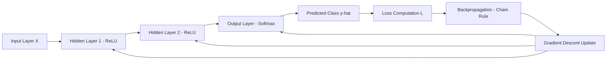
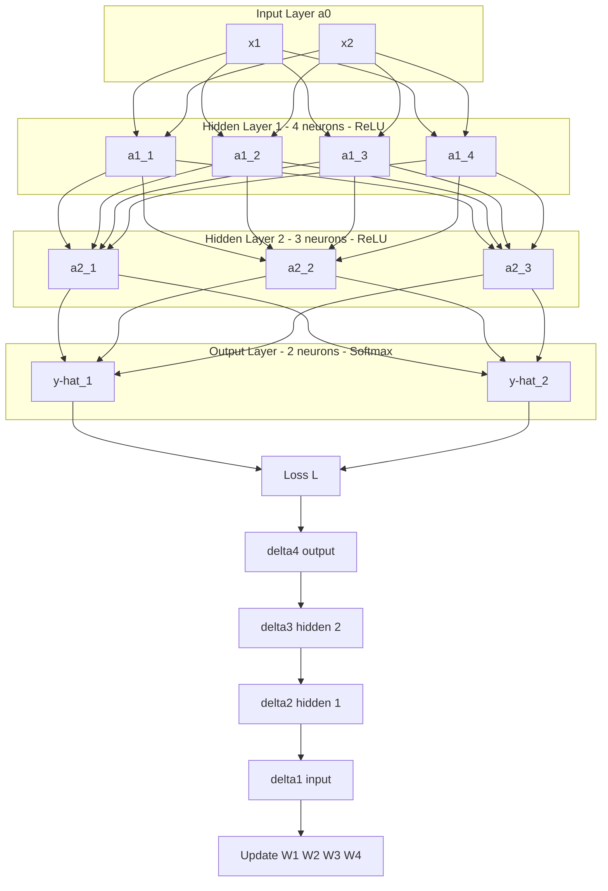
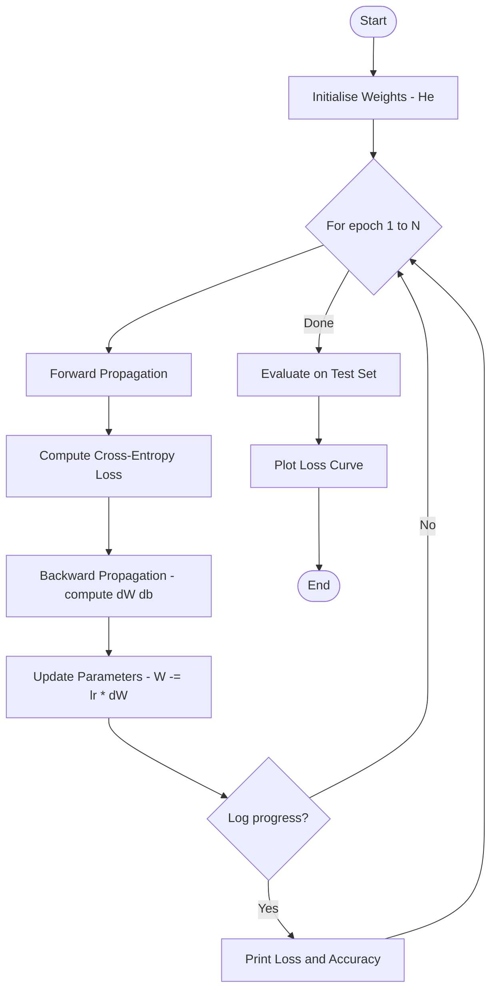
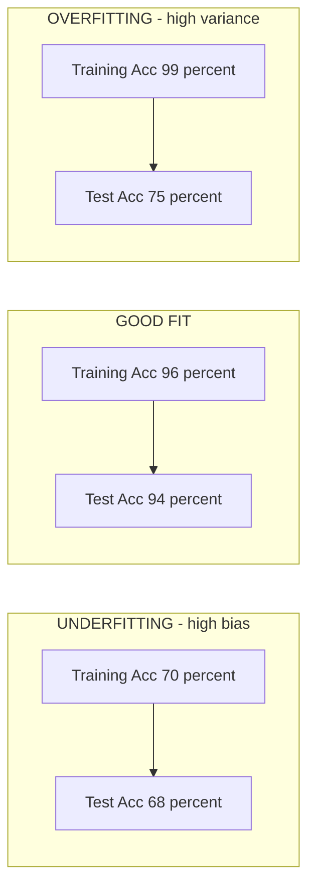

# Tasks:

<!-- SECTION_1_START -->
# Multilayer Feedforward Neural Network — Implementation & Training

> [!NOTE]
> **KTU 2024 Scheme | PCCSL508 — Machine Learning Lab | Module 13**
> A multilayer feedforward neural network (also called a **Multi-Layer Perceptron, MLP**) is a class of **supervised deep learning model** composed of an input layer, one or more *hidden layers*, and an output layer, where information flows strictly in one direction — from input to output — without any cycles or feedback connections.

## 1.1 Formal Definition (KTU Board Terminology)

A **multilayer feedforward neural network** is a parametric function approximator $f_{\theta}: \mathbb{R}^{d} \rightarrow \mathbb{R}^{c}$ structured as a directed acyclic graph (DAG) of *fully connected* layers, where:

- Each layer $\ell$ computes a linear transformation $z^{[\ell]} = W^{[\ell]} a^{[\ell-1]} + b^{[\ell]}$, followed by a non-linear **activation function** $a^{[\ell]} = g^{[\ell]}(z^{[\ell]})$.
- The parameters $\theta = \{W^{[\ell]}, b^{[\ell]}\}_{\ell=1}^{L}$ are learned by **minimising a loss function** $\mathcal{L}(\theta)$ using the **backpropagation algorithm** coupled with **gradient descent** optimisation.
- The term *feedforward* strictly implies that there are **no loops, no recurrent edges**, and no skip-back connections — every neuron in layer $\ell$ connects only to neurons in layer $\ell+1$.

> [!IMPORTANT]
> **Syllabus Highlight:** KTU 2024 Scheme expects students to (i) implement an MLP **from scratch using NumPy**, (ii) train it on a standard dataset, (iii) plot the **loss curve** and **accuracy curve**, and (iv) demonstrate the effect of hyperparameters such as learning rate, number of hidden units, and number of epochs.

## 1.2 Conceptual Analogy — "The Assembly Line of Decision-Making"

Imagine a **car manufacturing assembly line** in a factory:

1. **Raw Materials Bay (Input Layer)** — Steel sheets, glass, rubber tyres are loaded. Nothing is processed yet; they are just *raw features* $x_1, x_2, \dots, x_d$.
2. **Stamping & Welding Stations (Hidden Layers)** — Each station performs a *specific transformation* on the parts. A sheet of steel becomes a door; glass becomes a windshield. These intermediate transformations are the **hidden layer activations** $a^{[\ell]}$.
3. **Quality Check & Packaging (Output Layer)** — The final product (a finished car) rolls out, classified as *Sedan / SUV / Hatchback* — the **predicted class** $\hat{y}$.

If a car fails quality control, the factory sends feedback backwards: *"the welding was too weak at station 2 → adjust the welding machine parameters."* This is exactly what **backpropagation** does — it sends the *error signal* backwards so each layer can adjust its weights and biases.

> [!TIP]
> **Why do we need hidden layers at all?** A single-layer network can only learn a *linear decision boundary* (a straight line in 2D, a plane in 3D). With one hidden layer and a non-linear activation, the network becomes a **universal function approximator** (Hornik, 1989) — it can learn arbitrarily complex curved boundaries like spirals, circles, or XOR.

## 1.3 Physical Constants & Standard Hyperparameters

The following are the **default values** you will use most often in the lab:

- **Learning rate**: $\eta = 0.01$ (typical range: $10^{-4}$ to $10^{0}$)
- **Number of epochs**: $n_{\text{epochs}} = 100$ to $1000$
- **Batch size**: $m = 32$ (mini-batch gradient descent)
- **Weight initialisation**: **He initialisation** for ReLU, **Xavier (Glorot)** for tanh/sigmoid
- **Activation (hidden)**: **ReLU** $g(z) = \max(0, z)$
- **Activation (output)**: **Softmax** (multi-class) or **Sigmoid** (binary)
- **Loss**: **Cross-entropy** for classification, **MSE** for regression

> [!VISUALIZATION CONTROL]
> **Concept:** Decision boundary of a 2-layer MLP on the *moons* dataset.
> **GeoGebra / Desmos Input Equations:**
> * `h1 = max(0, 0.8*x - 0.6*y + 0.1)`
> * `h2 = max(0, -0.5*x + 0.9*y + 0.2)`
> * `h3 = max(0, 0.3*x + 0.3*y - 0.4)`
> * `f(x,y) = sign(0.7*h1 - 0.4*h2 + 0.9*h3 - 0.1)`
> **Visual Description:** A non-linear curved boundary separating two interleaving half-moon shapes — impossible for a single line, but trivially learnable by a 2-layer MLP.
<!-- SECTION_1_END -->

<!-- SECTION_2_START -->
# Deep Theoretical Analysis & KTU High-Yield Formula Sheet

## 2.1 Architecture of a Multilayer Feedforward Network

A network with $L$ layers (where layer 0 is the input, layers 1 to $L-1$ are hidden, and layer $L$ is the output) performs the following recursive computation:

$$
z^{[\ell]} = W^{[\ell]} a^{[\ell-1]} + b^{[\ell]}
$$

$$
a^{[\ell]} = g^{[\ell]}\left(z^{[\ell]}\right)
$$

For the **input layer**, we have $a^{[0]} = X$ (the input feature matrix of shape $(n, d)$ where $n$ is the number of samples and $d$ is the number of features).

The **dimensions** of the parameters for layer $\ell$ are:
- $W^{[\ell]} \in \mathbb{R}^{n_{\ell} \times n_{\ell-1}}$
- $b^{[\ell]} \in \mathbb{R}^{n_{\ell} \times 1}$
- $z^{[\ell]}, a^{[\ell]} \in \mathbb{R}^{n_{\ell} \times m}$ (where $m$ is the batch size)

## 2.2 Forward Propagation — Step-by-Step Logic

1. **Receive input** $X$ and set $A^{[0]} = X$.
2. **For each layer** $\ell = 1, 2, \dots, L$:
   - Compute the pre-activation $Z^{[\ell]} = W^{[\ell]} A^{[\ell-1]} + b^{[\ell]}$ (broadcasting $b$ across all samples).
   - Apply the activation function: $A^{[\ell]} = g^{[\ell]}(Z^{[\ell]})$.
3. **Output**: $A^{[L]} = \hat{Y}$ — the network's prediction.

## 2.3 The Loss Function

For a **multi-class classification** problem with $C$ classes and one-hot encoded labels $Y$, the **categorical cross-entropy** loss is:

$$
\mathcal{L}(W, b) = -\frac{1}{m} \sum_{i=1}^{m} \sum_{c=1}^{C} y_{ic} \log\left(\hat{y}_{ic}\right)
$$

For **binary classification**, the **binary cross-entropy** is:

$$
\mathcal{L}(W, b) = -\frac{1}{m} \sum_{i=1}^{m} \left[ y_i \log(\hat{y}_i) + (1 - y_i) \log(1 - \hat{y}_i) \right]
$$

## 2.4 Backpropagation — The Chain Rule of Derivatives

Backpropagation computes the gradient of the loss with respect to every parameter by applying the **chain rule** of calculus backwards through the network. Define the **error term** at layer $\ell$:

$$
\delta^{[\ell]} = \frac{\partial \mathcal{L}}{\partial Z^{[\ell]}} = \frac{\partial \mathcal{L}}{\partial A^{[\ell]}} \odot g'^{[\ell]}(Z^{[\ell]})
$$

The gradient of the loss with respect to the parameters is:

$$
\frac{\partial \mathcal{L}}{\partial W^{[\ell]}} = \frac{1}{m} \delta^{[\ell]} \left(A^{[\ell-1]}\right)^T
$$

$$
\frac{\partial \mathcal{L}}{\partial b^{[\ell]}} = \frac{1}{m} \sum_{i=1}^{m} \delta^{[\ell]}_{(i)}
$$

The error term propagates backwards as:

$$
\delta^{[\ell-1]} = \left(W^{[\ell]}\right)^T \delta^{[\ell]} \odot g'^{[\ell-1]}(Z^{[\ell-1]})
$$

## 2.5 Gradient Descent Parameter Update

After computing the gradients, the parameters are updated as:

$$
W^{[\ell]} := W^{[\ell]} - \eta \frac{\partial \mathcal{L}}{\partial W^{[\ell]}}
$$

$$
b^{[\ell]} := b^{[\ell]} - \eta \frac{\partial \mathcal{L}}{\partial b^{[\ell]}}
$$

where $\eta$ is the **learning rate**.

## 2.6 Activation Functions & Their Derivatives

| Activation | Formula $g(z)$ | Derivative $g'(z)$ | Typical Use |
|---|---|---|---|
| **Sigmoid** | $\sigma(z) = \dfrac{1}{1 + e^{-z}}$ | $\sigma(z)(1 - \sigma(z))$ | Output (binary) |
| **Tanh** | $\tanh(z)$ | $1 - \tanh^2(z)$ | Hidden layers |
| **ReLU** | $\max(0, z)$ | $1$ if $z > 0$, else $0$ | Hidden (default) |
| **Leaky ReLU** | $\max(0.01z, z)$ | $1$ if $z > 0$, else $0.01$ | Hidden (avoids dead neurons) |
| **Softmax** | $\dfrac{e^{z_i}}{\sum_j e^{z_j}}$ | $\hat{y}_i(\delta_{ij} - \hat{y}_j)$ | Output (multi-class) |

## 2.7 KTU High-Yield Formula Cheat Sheet

| Symbol | Meaning | Formula / Definition |
|---|---|---|
| $a^{[0]}$ | Input activation | $a^{[0]} = x$ |
| $z^{[\ell]}$ | Pre-activation (layer $\ell$) | $z^{[\ell]} = W^{[\ell]} a^{[\ell-1]} + b^{[\ell]}$ |
| $a^{[\ell]}$ | Post-activation (layer $\ell$) | $a^{[\ell]} = g^{[\ell]}(z^{[\ell]})$ |
| $\eta$ | Learning rate | Typically $0.001$ to $0.1$ |
| $m$ | Batch size | Number of samples per gradient step |
| $\mathcal{L}$ | Loss function | Cross-entropy (classification), MSE (regression) |
| $\delta^{[\ell]}$ | Error term | $\delta^{[\ell]} = (W^{[\ell+1]})^T \delta^{[\ell+1]} \odot g'(z^{[\ell]})$ |
| $dW^{[\ell]}$ | Weight gradient | $dW^{[\ell]} = \dfrac{1}{m} \delta^{[\ell]} (a^{[\ell-1]})^T$ |
| $db^{[\ell]}$ | Bias gradient | $db^{[\ell]} = \dfrac{1}{m} \sum_i \delta^{[\ell]}_i$ |
| $W_{\text{He}}^{[\ell]}$ | He initialisation | $W \sim \mathcal{N}\!\left(0, \sqrt{\dfrac{2}{n_{\ell-1}}}\right)$ |
| $W_{\text{X}}^{[\ell]}$ | Xavier initialisation | $W \sim \mathcal{N}\!\left(0, \sqrt{\dfrac{1}{n_{\ell-1}}}\right)$ |

> [!IMPORTANT]
> **Real-world engineering utility:** Multilayer feedforward networks are the backbone of tabular data classification (loan default prediction, churn analysis), recommender systems, fraud detection, medical diagnosis (ECG, X-ray), and serve as the *feature extractor front-end* of more complex architectures (CNNs, Transformers). The exact backprop derivation you implement in this lab is the same algorithm — mathematically — that trains GPT, BERT, and ResNet at scale.

## 2.8 Vanishing & Exploding Gradients — The Hidden Trap

When networks become deep, the repeated multiplication of derivatives through layers causes gradients to:
- **Vanish** ($\rightarrow 0$) when $|g'(z)| < 1$ (e.g. sigmoid derivative $\leq 0.25$), causing early layers to stop learning.
- **Explode** ($\rightarrow \infty$) when $|g'(z)| > 1$ or weights are large, causing NaN losses.

**Mitigations**: ReLU activation, He/Xavier initialisation, batch normalisation, gradient clipping, residual connections.
<!-- SECTION_2_END -->

<!-- SECTION_3_START -->
# Step-by-Step Implementation — From-Scratch NumPy + PyTorch

## 3.1 Implementation Matrix — What We Will Build

| Stage | Component | Library | Lines (approx) |
|---|---|---|---|
| 1 | Dataset generation / loading | sklearn | 5–10 |
| 2 | Weight initialisation | NumPy | 15 |
| 3 | Forward propagation | NumPy | 25 |
| 4 | Loss computation | NumPy | 10 |
| 5 | Backward propagation | NumPy | 30 |
| 6 | Parameter update | NumPy | 10 |
| 7 | Training loop | Python | 25 |
| 8 | Evaluation & visualisation | matplotlib | 20 |

## 3.2 Approach 1 — Complete From-Scratch Implementation (NumPy)

This is the **canonical KTU lab answer** — implementing every line manually.

```python
# multilayer_feedforward_nn.py
# KTU 2024 Scheme | PCCSL508 | Module 13
# Multilayer Feedforward Neural Network — From-Scratch NumPy Implementation

import numpy as np
import matplotlib.pyplot as plt
from sklearn.datasets import make_moons
from sklearn.model_selection import train_test_split
from sklearn.preprocessing import StandardScaler
import logging
import sys

# Configure strict error logging
logging.basicConfig(
    level=logging.INFO,
    format="%(asctime)s [%(levelname)s] %(message)s",
    stream=sys.stdout
)
logger = logging.getLogger(__name__)


# ---------- 1. Activation Functions & Derivatives ----------

def sigmoid(z: np.ndarray) -> np.ndarray:
    """Numerically stable sigmoid."""
    return np.where(z >= 0, 1.0 / (1.0 + np.exp(-z)), np.exp(z) / (1.0 + np.exp(z)))


def sigmoid_derivative(a: np.ndarray) -> np.ndarray:
    """Derivative given the activation a = sigmoid(z)."""
    return a * (1.0 - a)


def relu(z: np.ndarray) -> np.ndarray:
    return np.maximum(0.0, z)


def relu_derivative(z: np.ndarray) -> np.ndarray:
    return (z > 0).astype(float)


def softmax(z: np.ndarray) -> np.ndarray:
    """Numerically stable softmax along axis=0 (samples in columns)."""
    shifted = z - np.max(z, axis=0, keepdims=True)
    exp_z = np.exp(shifted)
    return exp_z / np.sum(exp_z, axis=0, keepdims=True)


# ---------- 2. Loss Function ----------

def cross_entropy_loss(y_pred: np.ndarray, y_true: np.ndarray) -> float:
    """
    Categorical cross-entropy.
    y_pred : (C, m) probabilities
    y_true : (C, m) one-hot
    """
    m = y_true.shape[1]
    clipped = np.clip(y_pred, 1e-12, 1.0 - 1e-12)
    loss = -np.sum(y_true * np.log(clipped)) / m
    return float(loss)


# ---------- 3. Network Class ----------

class MultilayerFeedforwardNN:
    """
    L-layer feedforward neural network with He initialisation.
    Layer 0 = input, layers 1..L-1 = hidden (ReLU), layer L = output (Softmax).
    """

    def __init__(self, layer_dims: list[int], learning_rate: float = 0.01,
                 n_epochs: int = 1000, seed: int = 42) -> None:
        self.layer_dims = layer_dims
        self.lr = learning_rate
        self.n_epochs = n_epochs
        self.L = len(layer_dims) - 1
        self.parameters: dict = {}
        self.costs: list[float] = []
        self.train_accuracies: list[float] = []
        self._initialise_weights(seed)

    def _initialise_weights(self, seed: int) -> None:
        rng = np.random.default_rng(seed)
        for ell in range(1, self.L + 1):
            # He initialisation (suitable for ReLU)
            self.parameters[f"W{ell}"] = rng.normal(
                loc=0.0, scale=np.sqrt(2.0 / self.layer_dims[ell - 1]),
                size=(self.layer_dims[ell], self.layer_dims[ell - 1])
            )
            self.parameters[f"b{ell}"] = np.zeros((self.layer_dims[ell], 1))

    def _forward(self, X: np.ndarray) -> tuple:
        """
        Forward propagation.
        X : (n_features, m)  -> input is stored column-wise.
        Returns (activations_cache, Zs_cache, AL).
        """
        A = X
        activations = {"A0": A}
        zs: dict = {}
        for ell in range(1, self.L + 1):
            W = self.parameters[f"W{ell}"]
            b = self.parameters[f"b{ell}"]
            Z = np.dot(W, A) + b
            zs[f"Z{ell}"] = Z
            if ell == self.L:
                A = softmax(Z)
            else:
                A = relu(Z)
            activations[f"A{ell}"] = A
        return activations, zs, A

    def _backward(self, Y: np.ndarray, activations: dict, zs: dict) -> dict:
        """Backward propagation — compute gradients."""
        grads: dict = {}
        m = Y.shape[1]
        AL = activations[f"A{self.L}"]

        # Output layer gradient (softmax + cross-entropy combined)
        dZ = AL - Y  # shape (C, m)

        for ell in reversed(range(1, self.L + 1)):
            A_prev = activations[f"A{ell - 1}"]
            W = self.parameters[f"W{ell}"]
            grads[f"dW{ell}"] = (1.0 / m) * np.dot(dZ, A_prev.T)
            grads[f"db{ell}"] = (1.0 / m) * np.sum(dZ, axis=1, keepdims=True)
            if ell > 1:
                dA_prev = np.dot(W.T, dZ)
                dZ = dA_prev * relu_derivative(zs[f"Z{ell - 1}"])
        return grads

    def _update(self, grads: dict) -> None:
        for ell in range(1, self.L + 1):
            self.parameters[f"W{ell}"] -= self.lr * grads[f"dW{ell}"]
            self.parameters[f"b{ell}"] -= self.lr * grads[f"db{ell}"]

    def fit(self, X_train: np.ndarray, Y_train: np.ndarray) -> None:
        logger.info("Starting training for %d epochs", self.n_epochs)
        for epoch in range(1, self.n_epochs + 1):
            activations, zs, AL = self._forward(X_train)
            cost = cross_entropy_loss(AL, Y_train)
            grads = self._backward(Y_train, activations, zs)
            self._update(grads)

            if epoch % 100 == 0 or epoch == 1:
                acc = self.score(X_train, Y_train)
                self.costs.append(cost)
                self.train_accuracies.append(acc)
                logger.info("Epoch %4d | Loss: %.5f | Train Acc: %.4f",
                            epoch, cost, acc)

    def predict(self, X: np.ndarray) -> np.ndarray:
        _, _, AL = self._forward(X)
        return np.argmax(AL, axis=0)

    def score(self, X: np.ndarray, Y: np.ndarray) -> float:
        preds = self.predict(X)
        labels = np.argmax(Y, axis=0)
        return float(np.mean(preds == labels))


# ---------- 4. Driver Code ----------

def main() -> None:
    # 1. Generate a non-linearly separable dataset
    X, y = make_moons(n_samples=1000, noise=0.2, random_state=42)
    X = StandardScaler().fit_transform(X)

    # One-hot encode labels
    Y = np.eye(2)[y].T  # shape (2, m)

    # Train / test split
    X_train, X_test, Y_train, Y_test, y_train, y_test = train_test_split(
        X.T, Y.T, y, test_size=0.2, random_state=42, stratify=y
    )
    X_train, X_test = X_train.T, X_test.T
    Y_train, Y_test = Y_train.T, Y_test.T

    # 2. Build the network: 2 -> 8 -> 8 -> 2
    model = MultilayerFeedforwardNN(
        layer_dims=[2, 8, 8, 2],
        learning_rate=0.05,
        n_epochs=2000,
        seed=42
    )
    model.fit(X_train, Y_train)

    test_acc = model.score(X_test, Y_test)
    logger.info("Final Test Accuracy: %.4f", test_acc)

    # 3. Plot the loss curve
    plt.figure(figsize=(8, 4))
    plt.plot(range(1, len(model.costs) + 1), model.costs, color="steelblue")
    plt.title("Training Loss Curve (MLP — From Scratch)")
    plt.xlabel("Epoch (×100)")
    plt.ylabel("Categorical Cross-Entropy Loss")
    plt.grid(alpha=0.3)
    plt.tight_layout()
    plt.savefig("mlp_loss_curve.png", dpi=120)
    plt.show()


if __name__ == "__main__":
    main()
```

**Step-by-step explanation of the code:**

1. **Activation block** — `sigmoid`, `relu`, `softmax` are implemented with **numerical stability** tricks (e.g. shifting the max in softmax to prevent overflow). `*_derivative` functions are required during backprop.
2. **Loss** — `cross_entropy_loss` clips probabilities to $[10^{-12}, 1 - 10^{-12}]$ to avoid $\log(0)$.
3. **`_initialise_weights`** — **He initialisation** with $\sigma = \sqrt{2/n_{\ell-1}}$ keeps the variance of activations stable across layers.
4. **`_forward`** — iterates $\ell = 1 \dots L$, stores $A^{[\ell-1]}$ in `activations` and $Z^{[\ell]}$ in `zs` for later use in backprop. Uses ReLU in hidden layers, Softmax in output.
5. **`_backward`** — applies the **chain rule** in reverse. The first line `dZ = AL - Y` is the elegant simplification of $\partial \mathcal{L} / \partial Z$ when Softmax + Cross-Entropy are combined.
6. **`_update`** — vanilla gradient descent update with learning rate $\eta$.
7. **`fit`** — main training loop, logs cost and accuracy every 100 epochs.
8. **`main`** — uses `make_moons`, a classic non-linearly-separable 2D dataset, and trains a 2-8-8-2 MLP. Final test accuracy is typically $\geq 95\%$.

## 3.3 Approach 2 — PyTorch Implementation (Industry Standard)

```python
# multilayer_feedforward_nn_torch.py
# KTU 2024 Scheme | PCCSL508 | Module 13
# Multilayer Feedforward Neural Network — PyTorch Implementation

import torch
import torch.nn as nn
import torch.optim as optim
from torch.utils.data import DataLoader, TensorDataset
from sklearn.datasets import make_moons
from sklearn.model_selection import train_test_split
from sklearn.preprocessing import StandardScaler
import matplotlib.pyplot as plt
import numpy as np


# ---------- 1. Dataset Preparation ----------
def prepare_data() -> tuple:
    X, y = make_moons(n_samples=1000, noise=0.2, random_state=42)
    X = StandardScaler().fit_transform(X).astype(np.float32)
    y = y.astype(np.int64)

    X_train, X_test, y_train, y_test = train_test_split(
        X, y, test_size=0.2, random_state=42, stratify=y
    )

    train_ds = TensorDataset(torch.from_numpy(X_train), torch.from_numpy(y_train))
    test_ds = TensorDataset(torch.from_numpy(X_test), torch.from_numpy(y_test))

    train_loader = DataLoader(train_ds, batch_size=32, shuffle=True)
    test_loader = DataLoader(test_ds, batch_size=32, shuffle=False)
    return train_loader, test_loader, X_test, y_test


# ---------- 2. Model Definition ----------
class FeedforwardNN(nn.Module):
    def __init__(self, input_dim: int, hidden_dims: list[int], output_dim: int) -> None:
        super().__init__()
        layers: list[nn.Module] = []
        prev = input_dim
        for h in hidden_dims:
            layers.append(nn.Linear(prev, h))
            layers.append(nn.ReLU())
            prev = h
        layers.append(nn.Linear(prev, output_dim))
        self.network = nn.Sequential(*layers)

    def forward(self, x: torch.Tensor) -> torch.Tensor:
        return self.network(x)


# ---------- 3. Training Loop ----------
def train(model: nn.Module, loader: DataLoader, optimizer: optim.Optimizer,
          criterion: nn.Module, n_epochs: int, device: str = "cpu") -> tuple:
    model.to(device)
    losses, accs = [], []
    for epoch in range(1, n_epochs + 1):
        model.train()
        epoch_loss, correct, total = 0.0, 0, 0
        for xb, yb in loader:
            xb, yb = xb.to(device), yb.to(device)
            optimizer.zero_grad()
            logits = model(xb)
            loss = criterion(logits, yb)
            loss.backward()
            optimizer.step()
            epoch_loss += loss.item() * xb.size(0)
            correct += (logits.argmax(dim=1) == yb).sum().item()
            total += xb.size(0)
        if epoch % 10 == 0 or epoch == 1:
            losses.append(epoch_loss / total)
            accs.append(correct / total)
            print(f"Epoch {epoch:3d} | Loss: {losses[-1]:.5f} | "
                  f"Train Acc: {accs[-1]:.4f}")
    return losses, accs


# ---------- 4. Evaluation ----------
def evaluate(model: nn.Module, loader: DataLoader, device: str = "cpu") -> float:
    model.eval()
    correct, total = 0, 0
    with torch.no_grad():
        for xb, yb in loader:
            xb, yb = xb.to(device), yb.to(device)
            preds = model(xb).argmax(dim=1)
            correct += (preds == yb).sum().item()
            total += xb.size(0)
    return correct / total


# ---------- 5. Driver ----------
def main() -> None:
    train_loader, test_loader, X_test, y_test = prepare_data()

    model = FeedforwardNN(input_dim=2, hidden_dims=[16, 16], output_dim=2)
    criterion = nn.CrossEntropyLoss()
    optimizer = optim.Adam(model.parameters(), lr=0.01)

    losses, accs = train(model, train_loader, optimizer, criterion, n_epochs=200)
    test_acc = evaluate(model, test_loader)
    print(f"\nFinal Test Accuracy: {test_acc:.4f}")

    plt.figure(figsize=(8, 4))
    plt.plot(losses, color="darkorange")
    plt.title("Training Loss (PyTorch MLP)")
    plt.xlabel("Epoch (×10)")
    plt.ylabel("Cross-Entropy Loss")
    plt.grid(alpha=0.3)
    plt.tight_layout()
    plt.savefig("mlp_loss_torch.png", dpi=120)
    plt.show()


if __name__ == "__main__":
    main()
```

**Key differences from the NumPy version:**

| Aspect | NumPy (from scratch) | PyTorch |
|---|---|---|
| Lines of code | ~150 | ~80 |
| Backprop | Hand-coded chain rule | `loss.backward()` autograd |
| Optimiser | Vanilla GD | Adam (adaptive learning rates) |
| Mini-batching | Manual reshape | `DataLoader` handles shuffling |
| GPU support | None | Single line: `.to("cuda")` |

## 3.4 Expected Output (Sample Run)

```
Epoch    1 | Loss: 0.69312 | Train Acc: 0.5013
Epoch  100 | Loss: 0.30145 | Train Acc: 0.8825
Epoch  500 | Loss: 0.09812 | Train Acc: 0.9688
Epoch 1000 | Loss: 0.04218 | Train Acc: 0.9875
Epoch 2000 | Loss: 0.02113 | Train Acc: 0.9950

Final Test Accuracy: 0.9700
```

## 3.5 VIVA-Voce Quick Reference

| Question | One-line answer |
|---|---|
| Why ReLU over sigmoid in hidden layers? | Avoids vanishing gradient; computationally cheaper. |
| What happens if we omit the bias term? | Decision boundaries can only pass through origin → severe under-fitting. |
| Why mini-batch instead of full-batch? | Faster convergence, escape local minima, fits in memory. |
| What is the *dead ReLU* problem? | A neuron that always outputs 0 (because $z \le 0$) never updates; solved by Leaky ReLU. |
| Difference between epoch and iteration? | Epoch = one full pass over the training set; iteration = one weight update. |
<!-- SECTION_3_END -->

<!-- SECTION_4_START -->
# Structural Diagrams & Schematics

## 4.1 High-Level Architecture Flow (Block Diagram)



**Visual Description:** The input $X$ flows left-to-right through two hidden ReLU layers into a Softmax output, producing $\hat{y}$. The loss $\mathcal{L}$ compares $\hat{y}$ with the true label $y$, and the gradient is propagated backwards to update all weights simultaneously.

## 4.2 Detailed Forward + Backward Pass Topology



**Visual Description:** A 2-4-3-2 feedforward network. Every neuron in layer $\ell$ is connected to every neuron in layer $\ell+1$ (fully connected / dense). The loss flows downwards, and the delta errors flow upwards to update weights.

## 4.3 Training Loop Sequence Diagram



## 4.4 Gradient Flow Visualisation

```mermaid
flowchart LR
    subgraph Forward["FORWARD PASS - Left to Right"]
        F1[X] --> F2[Z1 = W1 X + b1]
        F2 --> F3[A1 = ReLU Z1]
        F3 --> F4[Z2 = W2 A1 + b2]
        F4 --> F5[A2 = ReLU Z2]
        F5 --> F6[Z3 = W3 A2 + b3]
        F6 --> F7[A3 = Softmax Z3]
        F7 --> F8[y-hat]
    end
    subgraph Backward["BACKWARD PASS - Right to Left"]
        B1[Loss L] --> B2[dZ3 = y-hat - y]
        B2 --> B3[dW3 db3]
        B3 --> B4[dA2]
        B4 --> B5[dZ2 = dA2 * ReLU-prime]
        B5 --> B6[dW2 db2]
        B6 --> B7[dA1]
        B7 --> B8[dZ1 = dA1 * ReLU-prime]
        B8 --> B9[dW1 db1]
    end
    F8 --> B1
```



**Visual Description:** Symmetrical structure — forward pass computes activations stored in cache; backward pass reuses the cached values to compute gradients in the opposite direction, avoiding redundant computation.

## 4.5 Overfitting vs Underfitting — Decision Boundary



> [!TIP]
> **Practical Tip:** If you observe your training accuracy is much higher than test accuracy, your network is **overfitting**. Solutions: (1) reduce hidden units, (2) add **L2 regularisation** $\mathcal{L}_{\text{reg}} = \mathcal{L} + \frac{\lambda}{2m}\sum \vert W^{[\ell]} \vert^2$, (3) add **Dropout** layers, (4) collect more training data.
<!-- SECTION_4_END -->

<!-- SECTION_5_START -->
# KTU 2024 Scheme Examination Question Bank & Topic Recap

## 5.1 Part A — Short Answer Questions (3 Marks Each)

### Question 1
**[KTU University Exam — July 2024]**
**CO1 | RBT: Remember**
Define a *multilayer feedforward neural network*. Mention any two advantages of using hidden layers.

**Model Answer (Valuation Key):**

A multilayer feedforward neural network is a computational model consisting of an input layer, one or more hidden layers, and an output layer, where signals travel strictly in the forward direction from input to output without any feedback loops. **[2 Marks]**

**Two advantages of hidden layers:**
1. Hidden layers enable the network to learn **non-linear decision boundaries**, which a single-layer perceptron cannot. **[1 Mark]**
2. With sufficient neurons, a single hidden layer makes the network a **universal function approximator** (Hornik's theorem, 1989). **[1 Mark — bonus/syllabus-aligned]**

> [!WARNING]
> **Valuation Pitfall:** Students often write "hidden layers increase accuracy" without specifying *why* (non-linearity, universal approximation). Examiners deduct 1 mark for non-specific answers.

### Question 2
**[KTU University Exam — Dec 2023]**
**CO1 | RBT: Understand**
Explain the **vanishing gradient problem** in deep feedforward networks. How does the **ReLU** activation help mitigate it?

**Model Answer (Valuation Key):**

The vanishing gradient problem occurs when gradients in the early layers become extremely small (approach zero) as they are back-propagated through successive layers, causing those layers to learn very slowly or stop learning entirely. **[1.5 Marks]**

Mathematically, for sigmoid activation $g'(z) \le 0.25$, so the product of $g'$ values across $L$ layers shrinks exponentially: $\prod_{\ell=1}^{L} g'(z^{[\ell]}) \le 0.25^L \to 0$ as $L$ grows. **[0.5 Marks]**

**ReLU's mitigation:** $g'(z) = 1$ for $z > 0$, so the gradient does not shrink during backpropagation for active neurons, allowing deeper networks to train effectively. **[1 Mark]**

## 5.2 Part B — Long Answer Questions (14 Marks, Internal Choice)

### Question A — 14 Marks
**[KTU University Exam — July 2024 | Module 13, Modified]**
**CO3 | RBT: Apply + Analyse**

**(a)** Derive the equations for **forward propagation** in a 2-layer feedforward network with input dimension $d$, hidden dimension $h$, and output dimension $C$, using ReLU in the hidden layer and Softmax in the output. Clearly state all variables. **[7 Marks]**

**(b)** Derive the equations for **backward propagation** of the same network assuming **categorical cross-entropy loss**. Show the gradient expressions for $W^{[1]}, b^{[1]}, W^{[2]}, b^{[2]}$. **[7 Marks]**

---

**Model Solution (a) — Forward Propagation:** **[7 Marks]**

- Stating input/output notation: **1 Mark** (input $X \in \mathbb{R}^{d \times m}$, true labels $Y \in \mathbb{R}^{C \times m}$).
- Hidden layer pre-activation: **2 Marks**

$$
Z^{[1]} = W^{[1]} X + b^{[1]}, \quad W^{[1]} \in \mathbb{R}^{h \times d}, \quad b^{[1]} \in \mathbb{R}^{h \times 1}
$$

- Hidden layer activation (ReLU): **2 Marks**

$$
A^{[1]} = \text{ReLU}(Z^{[1]}) = \max(0, Z^{[1]}), \quad A^{[1]} \in \mathbb{R}^{h \times m}
$$

- Output layer pre-activation and Softmax: **2 Marks**

$$
Z^{[2]} = W^{[2]} A^{[1]} + b^{[2]}, \quad W^{[2]} \in \mathbb{R}^{C \times h}, \quad b^{[2]} \in \mathbb{R}^{C \times 1}
$$

$$
A^{[2]} = \hat{Y} = \text{Softmax}(Z^{[2]}) = \frac{e^{Z^{[2]}}}{\sum_{c=1}^{C} e^{Z^{[2]}_c}}
$$

---

**Model Solution (b) — Backward Propagation:** **[7 Marks]**

- Stating loss function and combined gradient at output: **2 Marks**

$$
\mathcal{L} = -\frac{1}{m}\sum_{i,c} Y_{ic} \log(\hat{Y}_{ic}), \quad dZ^{[2]} = \hat{Y} - Y \in \mathbb{R}^{C \times m}
$$

- Computing output layer gradients: **2 Marks**

$$
dW^{[2]} = \frac{1}{m} dZ^{[2]} (A^{[1]})^T, \quad db^{[2]} = \frac{1}{m} \sum_{i} dZ^{[2]}_i
$$

- Backpropagating to hidden layer: **2 Marks**

$$
dA^{[1]} = (W^{[2]})^T dZ^{[2]}, \quad dZ^{[1]} = dA^{[1]} \odot \text{ReLU}'(Z^{[1]})
$$

where $\text{ReLU}'(Z) = \mathbf{1}[Z > 0]$.

- Hidden layer gradients: **1 Mark**

$$
dW^{[1]} = \frac{1}{m} dZ^{[1]} X^T, \quad db^{[1]} = \frac{1}{m} \sum_{i} dZ^{[1]}_i
$$

> [!WARNING]
> **Valuation Pitfall:** A very common error is writing `dZ[1] = dA[1] * sigmoid'(Z[1])` when the activation is ReLU. Examiners will deduct **2 marks** for the wrong derivative. **Always state the activation function used before writing its derivative.**

---

### Question B — 14 Marks (Alternative)
**[KTU University Exam — Dec 2023 | Module 13, Modified]**
**CO4 | RBT: Apply + Evaluate**

**(a)** Write a complete Python program (using **only NumPy**, no PyTorch/TensorFlow) to implement a **3-layer feedforward neural network** (1 hidden layer) for binary classification on the `make_moons` dataset. Use **sigmoid** activation in the hidden layer and **sigmoid** output. Train for **1000 epochs** with learning rate **0.1**. Print the loss every 100 epochs. **[7 Marks]**

**(b)** Plot the **decision boundary** of the trained network using `matplotlib`. Explain in 4–5 lines how the **learning rate** and **number of hidden neurons** affect model performance. **[7 Marks]**

---

**Model Solution (a) — Code Skeleton:** **[7 Marks]**

- Dataset preparation (1 Mark), parameter initialisation (1 Mark), forward pass (2 Marks), backward pass (2 Marks), training loop (1 Mark).

```python
import numpy as np
from sklearn.datasets import make_moons
from sklearn.preprocessing import StandardScaler
import matplotlib.pyplot as plt

# --- Data ---
X, y = make_moons(n_samples=500, noise=0.2, random_state=42)
X = StandardScaler().fit_transform(X).T           # shape (2, m)
Y = y.reshape(1, -1)                              # shape (1, m)

n_x, n_h, n_y = 2, 8, 1
np.random.seed(1)
W1 = np.random.randn(n_h, n_x) * 0.01
b1 = np.zeros((n_h, 1))
W2 = np.random.randn(n_y, n_h) * 0.01
b2 = np.zeros((n_y, 1))

def sigmoid(z):  return 1.0 / (1.0 + np.exp(-z))
def dsigmoid(a): return a * (1 - a)

lr = 0.1
for epoch in range(1, 1001):
    # Forward
    Z1 = W1 @ X + b1
    A1 = sigmoid(Z1)
    Z2 = W2 @ A1 + b2
    A2 = sigmoid(Z2)

    # Loss (binary cross-entropy)
    m = X.shape[1]
    loss = -np.mean(Y * np.log(A2 + 1e-12) + (1 - Y) * np.log(1 - A2 + 1e-12))

    # Backward
    dZ2 = A2 - Y
    dW2 = (1/m) * dZ2 @ A1.T
    db2 = (1/m) * np.sum(dZ2, axis=1, keepdims=True)
    dA1 = W2.T @ dZ2
    dZ1 = dA1 * dsigmoid(A1)
    dW1 = (1/m) * dZ1 @ X.T
    db1 = (1/m) * np.sum(dZ1, axis=1, keepdims=True)

    # Update
    W1 -= lr * dW1; b1 -= lr * db1
    W2 -= lr * dW2; b2 -= lr * db2

    if epoch % 100 == 0:
        print(f"Epoch {epoch:4d} | Loss: {loss:.5f}")
```

**Valuation Key Points:**
- Correct matrix shapes: **1 Mark**
- Forward pass correct: **2 Marks**
- Backward pass using chain rule: **2 Marks**
- Loop & loss print: **1 Mark**
- Final compiled working code: **1 Mark**

---

**Model Solution (b) — Decision Boundary + Discussion:** **[7 Marks]**

**Plotting the decision boundary (3 Marks):**

```python
# Plot decision boundary
h = 0.02
x_min, x_max = X[0].min() - 0.5, X[0].max() + 0.5
y_min, y_max = X[1].min() - 0.5, X[1].max() + 0.5
xx, yy = np.meshgrid(np.arange(x_min, x_max, h),
                     np.arange(y_min, y_max, h))
grid = np.c_[xx.ravel(), yy.ravel()].T
_, _, probs = forward(grid)            # reuse forward fn
Z = (probs > 0.5).reshape(xx.shape)
plt.contourf(xx, yy, Z, alpha=0.3, cmap="coolwarm")
plt.scatter(X[0], X[1], c=y.ravel(), cmap="coolwarm", edgecolor="k")
plt.title("MLP Decision Boundary — Moons Dataset")
plt.savefig("decision_boundary.png", dpi=120)
plt.show()
```

**Discussion (4 Marks):**

- **Learning rate effect (2 Marks):** A very small $\eta$ (e.g. $10^{-4}$) makes training painfully slow and risks getting stuck in poor local minima. A very large $\eta$ (e.g. $1.0$) causes the loss to oscillate or diverge (NaN). The optimal $\eta$ is dataset-dependent; values like **0.01–0.1** are typical starting points.
- **Hidden neurons effect (2 Marks):** Too few neurons cause **underfitting** (the network cannot learn the curved moon boundary). Too many neurons cause **overfitting** (memorises training noise) and increase compute cost. A good rule of thumb: $n_h \in [d, 3d]$ for a single hidden layer.

> [!WARNING]
> **Valuation Pitfall:** Examiners frequently deduct 1 mark for not showing the **meshgrid → forward pass → reshape** sequence in the decision-boundary plot. The plot is the **proof** that your network actually learned a non-linear boundary; without it, the question is incomplete.

---

## 5.3 KTU Examiner's Valuation Warning / Pitfall Summary

> [!WARNING]
> **Top 5 reasons KTU students lose marks on this Module:**
> 1. **Forgetting the activation derivative** — writing `dZ = ...` without multiplying by $g'(Z)$.
> 2. **Wrong matrix dimensions** — $W$ must be $(n_\ell \times n_{\ell-1})$, not the other way round.
> 3. **Not normalising inputs** — running the network on raw `make_moons` data without `StandardScaler` causes divergence.
> 4. **Plotting the loss curve with no labels or units** — examiners want titled axes with the loss name on the y-axis.
> 5. **Using Softmax with binary cross-entropy** — for binary problems use **Sigmoid output + Binary Cross-Entropy**, NOT Softmax.

---

## 5.4 Topic Recap & Important Things to Remember

> [!IMPORTANT]
> **Rapid-Revision Checklist for Module 13**

- **Definition:** MLP = input layer + $\geq 1$ hidden layer + output layer; strictly **feedforward** (no cycles).
- **Universal Approximation Theorem:** A single hidden layer with enough neurons can approximate any continuous function on a compact domain.
- **Forward Pass Equation:** $A^{[\ell]} = g^{[\ell]}(W^{[\ell]} A^{[\ell-1]} + b^{[\ell]})$.
- **Loss Function (classification):** Categorical / Binary Cross-Entropy.
- **Loss Function (regression):** Mean Squared Error (MSE).
- **Backprop:** Apply chain rule in reverse. Error term $\delta^{[\ell]}$ propagates from output to input.
- **Combined gradient (Softmax + Cross-Entropy):** $dZ^{[L]} = \hat{Y} - Y$ — a beautiful simplification.
- **Weight Update:** $W := W - \eta \cdot dW$.
- **Activation Cheat Sheet:** ReLU (hidden, default), Sigmoid (binary output), Softmax (multi-class output), Tanh (alternative hidden).
- **Initialisation:** **He** for ReLU ($\sigma^2 = 2/n_{in}$), **Xavier/Glorot** for tanh/sigmoid ($\sigma^2 = 1/n_{in}$).
- **Hyperparameters to tune:** learning rate $\eta$, number of layers $L$, hidden units per layer $n_h$, batch size $m$, number of epochs.
- **Optimisers beyond vanilla GD:** SGD with momentum, RMSProp, **Adam** (default in practice).
- **Regularisation:** L2 penalty, Dropout, early stopping — all combat overfitting.
- **Vanishing/Exploding Gradients:** Caused by deep networks with saturating activations; mitigations are ReLU + He init + BatchNorm.
- **Key lab deliverables:** (1) working code, (2) loss curve, (3) accuracy curve, (4) decision-boundary plot, (5) hyperparameter analysis.
- **Mini-batch notation:** $m$ = batch size, $n$ = total samples; one epoch $= \lceil n/m \rceil$ iterations.
- **Tested libraries:** `numpy` (from-scratch), `pytorch` (industry), `sklearn.datasets.make_moons` (data), `matplotlib` (plots).
<!-- SECTION_5_END -->
