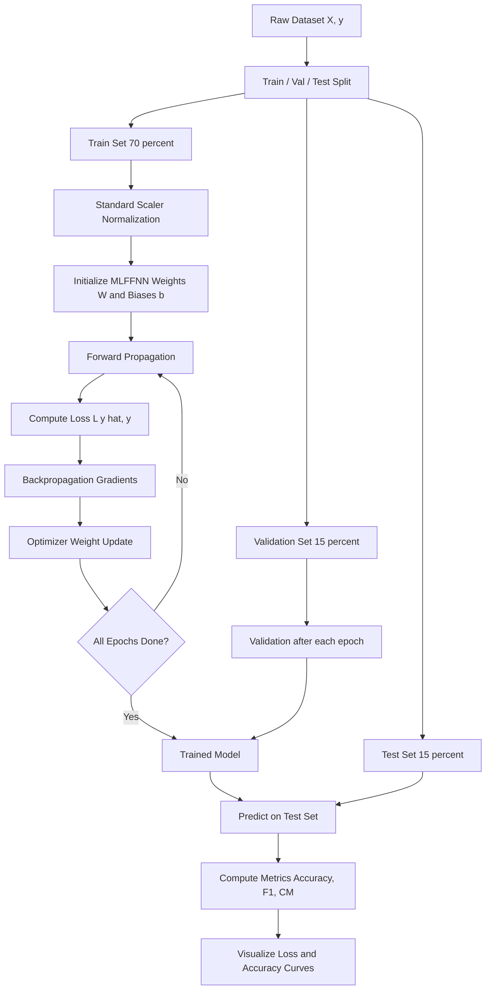
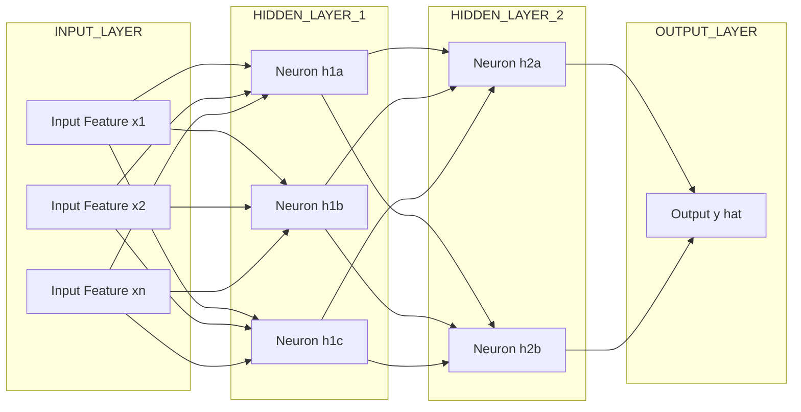
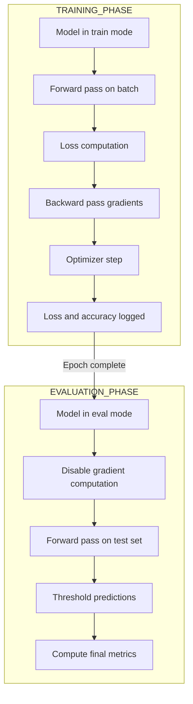
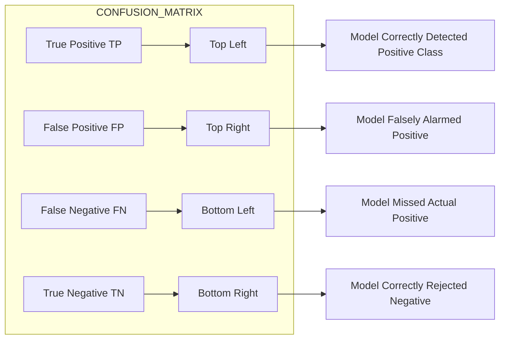

# Train and evaluate the network.

<!-- SECTION_1_START -->
# Train and Evaluate the Network — Multilayer Feedforward Neural Network (MLFNN)

## 1. Core Technical Definition

> [!IMPORTANT]
> **Training** a Multilayer Feedforward Neural Network (MLFNN) is the iterative process of optimizing the network's weights and biases using a labeled dataset so that the network learns to map inputs to outputs by minimizing a **loss function** through **Backpropagation** and **Gradient Descent**. **Evaluation** is the subsequent process of testing the trained network on an unseen dataset to quantify its generalization performance using metrics such as Accuracy, Precision, Recall, F1-Score, and the Confusion Matrix.

### Key Terminology (KTU 2024 Lab Syllabus Vocabulary)

| Term | Formal Definition |
| :--- | :--- |
| **Forward Propagation** | The pass of input data through the network layer-by-layer to produce a predicted output $\hat{y}$. |
| **Loss Function** $\mathcal{L}$ | A scalar measure of the error between predicted $\hat{y}$ and actual $y$ (e.g., MSE, Cross-Entropy). |
| **Backpropagation** | The chain-rule-based algorithm to compute the gradient of $\mathcal{L}$ w.r.t every weight $w$ and bias $b$. |
| **Epoch** | One complete pass of the **entire training dataset** through the network. |
| **Batch Size** | The number of training samples used in **one iteration** before updating weights. |
| **Learning Rate** $\eta$ | A hyperparameter that controls the step size of weight updates. |
| **Evaluation** | Measuring the trained model's predictive performance on the held-out test set. |

---

## 2. Conceptual Analogy / Intuition

> [!NOTE]
> **Real-World Analogy: "The Archer and the Target"**
> Imagine a student learning archery. With every arrow (a **prediction**), the student notes how far the arrow landed from the bullseye (the **loss**). The coach then adjusts the angle and pull strength of the bow (the **weights and biases**) based on whether the arrow went too high, too low, too left, or too right (the **gradient**). The student doesn't fix everything at once — they make a small correction (the **learning rate $\eta$**) and try again. After thousands of arrows (an **epoch**), the student becomes consistent. Finally, the student is tested on a new target they've never seen (the **test set**) to see if they truly learned or just memorized (this is **evaluation** — testing **generalization**).

### GeoGebra / Desmos Visualization

> [!VISUALIZATION CONTROL]
> **Concept:** Gradient Descent on a 2D Loss Surface
> **GeoGebra / Desmos Input Equations:**
> * Loss surface: $L(w) = w^2 - 4w + 5$ (a parabola with minimum at $w = 2$)
> * Update rule: $w_{t+1} = w_t - \eta \cdot \frac{dL}{dw}$
> **Visual Description:** A U-shaped curve where a ball (representing the weight) rolls downhill from a high-loss region toward the minimum of the parabola, with step size controlled by $\eta$. This visually demonstrates how the network "learns" by descending the loss landscape.

---

## 3. Lab Objective (KTU 2024 PCCSL508 Context)

In **Module 13**, the student is expected to:
1. Design an MLFNN architecture (input, hidden, output layers + activation functions).
2. Train the network using a chosen optimizer (SGD, Adam) and loss function.
3. Validate the model during training to detect overfitting.
4. Evaluate the final model on the **test set** using classification/regression metrics.
5. Visualize the **loss curve**, **accuracy curve**, and **confusion matrix**.

<!-- SECTION_1_END -->

<!-- SECTION_2_START -->
# Deep Theoretical Analysis & KTU High-Yield Formula Sheet

## 1. The Training Pipeline (5 Logical Phases)

The training of an MLFNN follows a strict sequential pipeline:

1. **Initialize Parameters:** Weights $W^{[\ell]}$ are initialized (e.g., **He Initialization** or **Xavier Initialization**), and biases $b^{[\ell]}$ are set to zero. Random initialization breaks symmetry.
2. **Forward Propagation:** Compute activations $A^{[\ell]}$ for each layer $\ell = 1, 2, \dots, L$ using:
   $$Z^{[\ell]} = W^{[\ell]} A^{[\ell-1]} + b^{[\ell]}$$
   $$A^{[\ell]} = g^{[\ell]}(Z^{[\ell]})$$
   where $g^{[\ell]}$ is the activation function (ReLU, Sigmoid, Softmax).
3. **Compute Loss:** Compare $\hat{y} = A^{[L]}$ with the true label $y$ using the loss function $\mathcal{L}(\hat{y}, y)$.
4. **Backward Propagation:** Compute gradients $\frac{\partial \mathcal{L}}{\partial W^{[\ell]}}$ and $\frac{\partial \mathcal{L}}{\partial b^{[\ell]}}$ by applying the chain rule layer-by-layer from output to input.
5. **Parameter Update:** Update weights using the optimizer rule. The simplest is **Vanilla Gradient Descent**:
   $$W^{[\ell]} \leftarrow W^{[\ell]} - \eta \frac{\partial \mathcal{L}}{\partial W^{[\ell]}}$$
   $$b^{[\ell]} \leftarrow b^{[\ell]} - \eta \frac{\partial \mathcal{L}}{\partial b^{[\ell]}}$$

## 2. Common Loss Functions

| Task Type | Loss Function | Formula |
| :--- | :--- | :--- |
| Binary Classification | **Binary Cross-Entropy** | $\mathcal{L} = -\frac{1}{N} \sum_{i=1}^{N} \left[ y_i \log(\hat{y}_i) + (1-y_i) \log(1-\hat{y}_i) \right]$ |
| Multi-class Classification | **Categorical Cross-Entropy** | $\mathcal{L} = -\frac{1}{N} \sum_{i=1}^{N} \sum_{c=1}^{C} y_{i,c} \log(\hat{y}_{i,c})$ |
| Regression | **Mean Squared Error (MSE)** | $\mathcal{L} = \frac{1}{N} \sum_{i=1}^{N} (y_i - \hat{y}_i)^2$ |

## 3. KTU High-Yield Formula Sheet

| Symbol | Meaning | Unit / Range |
| :--- | :--- | :--- |
| $\eta$ | Learning rate | Typically $10^{-3}$ to $10^{-1}$ |
| $\mathcal{L}$ | Loss | Scalar (lower is better) |
| $W^{[\ell]}$ | Weight matrix of layer $\ell$ | Shape: $(\text{neurons}_{\ell}, \text{neurons}_{\ell-1})$ |
| $b^{[\ell]}$ | Bias vector of layer $\ell$ | Shape: $(\text{neurons}_{\ell}, 1)$ |
| $Z^{[\ell]}$ | Pre-activation at layer $\ell$ | Linear combination |
| $A^{[\ell]}$ | Post-activation at layer $\ell$ | Output of activation $g$ |
| $\hat{y}$ | Network prediction | Vector (probabilities or values) |
| $N$ | Number of training samples | Integer |
| $B$ | Batch size | Integer divisor of $N$ |
| $E$ | Total epochs | Integer (e.g., 50, 100) |

> [!IMPORTANT]
> **Engineering Utility:** This exact training–evaluation pipeline is the backbone of every production deep learning system — from medical imaging classifiers (detecting tumors in X-rays) to fraud detection engines in banking and recommendation systems in Netflix/Amazon. Without a well-defined training loop and rigorous evaluation, the model cannot be deployed safely.

## 4. Evaluation Metrics for Classification

| Metric | Formula | When to Use |
| :--- | :--- | :--- |
| **Accuracy** | $\frac{TP + TN}{TP + TN + FP + FN}$ | Balanced classes |
| **Precision** | $\frac{TP}{TP + FP}$ | When False Positives are costly (spam detection) |
| **Recall (Sensitivity)** | $\frac{TP}{TP + FN}$ | When False Negatives are costly (cancer detection) |
| **F1-Score** | $2 \cdot \frac{\text{Precision} \cdot \text{Recall}}{\text{Precision} + \text{Recall}}$ | Imbalanced classes |
| **Confusion Matrix** | Table of TP, FP, TN, FN | Full diagnostic view |

where $TP$ = True Positive, $TN$ = True Negative, $FP$ = False Positive, $FN$ = False Negative.

## 5. Evaluation Metrics for Regression

| Metric | Formula |
| :--- | :--- |
| **MAE** | $\frac{1}{N} \sum_{i=1}^{N} \vert y_i - \hat{y}_i \vert$ |
| **MSE** | $\frac{1}{N} \sum_{i=1}^{N} (y_i - \hat{y}_i)^2$ |
| **RMSE** | $\sqrt{\frac{1}{N} \sum_{i=1}^{N} (y_i - \hat{y}_i)^2}$ |
| **$R^2$ Score** | $1 - \frac{\sum (y_i - \hat{y}_i)^2}{\sum (y_i - \bar{y})^2}$ |

> [!NOTE]
> In the markdown formula table above, the absolute value symbol is written as `\vert` (LaTeX command) — never use the raw pipe `|` character — to prevent breaking the KTU markdown rendering pipeline.

<!-- SECTION_2_END -->

<!-- SECTION_3_START -->
# Step-by-Step Derivations & Python Code Implementation

## 1. Mathematical Derivation: One Iteration of Gradient Descent (Binary Classification)

Let us derive the weight update for the **output layer** of a 2-layer network (1 hidden layer) for binary classification with **Sigmoid** output.

### Step 1: Forward Pass

For a single training example $(x, y)$:
$$Z^{[1]} = W^{[1]} x + b^{[1]}$$
$$A^{[1]} = \text{ReLU}(Z^{[1]})$$
$$Z^{[2]} = W^{[2]} A^{[1]} + b^{[2]}$$
$$\hat{y} = A^{[2]} = \sigma(Z^{[2]}) = \frac{1}{1 + e^{-Z^{[2]}}}$$

### Step 2: Compute Loss (Binary Cross-Entropy)

$$\mathcal{L}(\hat{y}, y) = -\left[ y \log(\hat{y}) + (1-y) \log(1-\hat{y}) \right]$$

### Step 3: Backward Pass — Derivative w.r.t. $Z^{[2]}$

Using the chain rule and the fact that $\sigma'(z) = \sigma(z)(1-\sigma(z))$:

$$\frac{\partial \mathcal{L}}{\partial Z^{[2]}} = \hat{y} - y$$

This is the famous **simplified gradient** for sigmoid + binary cross-entropy.

### Step 4: Gradients for Output Layer Parameters

$$\frac{\partial \mathcal{L}}{\partial W^{[2]}} = (\hat{y} - y) \cdot (A^{[1]})^{T}$$

$$\frac{\partial \mathcal{L}}{\partial b^{[2]}} = \hat{y} - y$$

### Step 5: Backpropagate to Hidden Layer

$$\frac{\partial \mathcal{L}}{\partial A^{[1]}} = (W^{[2]})^{T} \cdot (\hat{y} - y)$$

$$\frac{\partial \mathcal{L}}{\partial Z^{[1]}} = \frac{\partial \mathcal{L}}{\partial A^{[1]}} \odot \text{ReLU}'(Z^{[1]})$$

(where $\odot$ is element-wise multiplication and $\text{ReLU}'(z) = 1$ if $z > 0$, else $0$)

$$\frac{\partial \mathcal{L}}{\partial W^{[1]}} = \frac{\partial \mathcal{L}}{\partial Z^{[1]}} \cdot x^{T}$$

### Step 6: Parameter Update (Gradient Descent)

$$W^{[\ell]} \leftarrow W^{[\ell]} - \eta \frac{\partial \mathcal{L}}{\partial W^{[\ell]}}$$

$$b^{[\ell]} \leftarrow b^{[\ell]} - \eta \frac{\partial \mathcal{L}}{\partial b^{[\ell]}}$$

This completes one training step. Repeating over $N/B$ iterations (where $B$ is the batch size) for $E$ epochs constitutes the full training process.

---

## 2. Full Python Implementation (PyTorch — Industry Standard)

```python
# ====================================================================
#  KTU 2024 SCHEME - MACHINE LEARNING LAB (PCCSL508)
#  MODULE 13: Train and Evaluate a Multilayer Feedforward Network
#  Framework: PyTorch (also valid: TensorFlow/Keras)
# ====================================================================

import torch
import torch.nn as nn
import torch.optim as optim
from torch.utils.data import DataLoader, TensorDataset
from sklearn.model_selection import train_test_split
from sklearn.preprocessing import StandardScaler
from sklearn.datasets import load_breast_cancer
from sklearn.metrics import (accuracy_score, precision_score,
                             recall_score, f1_score, confusion_matrix,
                             classification_report)
import numpy as np
import matplotlib.pyplot as plt
import seaborn as sns

# --------------------------------------------------------------------
# STEP 1: LOAD AND PREPARE THE DATASET
# --------------------------------------------------------------------
# We use the Breast Cancer Wisconsin dataset (binary classification)
data = load_breast_cancer()
X, y = data.data, data.target

# Standardize features (zero mean, unit variance) — CRITICAL for NN training
scaler = StandardScaler()
X_scaled = scaler.fit_transform(X)

# Split: 70% train, 15% validation, 15% test
X_train, X_temp, y_train, y_temp = train_test_split(
    X_scaled, y, test_size=0.30, random_state=42, stratify=y
)
X_val, X_test, y_val, y_test = train_test_split(
    X_temp, y_temp, test_size=0.50, random_state=42, stratify=y_temp
)

# Convert to PyTorch tensors
X_train_t = torch.FloatTensor(X_train)
y_train_t = torch.FloatTensor(y_train).unsqueeze(1)
X_val_t   = torch.FloatTensor(X_val)
y_val_t   = torch.FloatTensor(y_val).unsqueeze(1)
X_test_t  = torch.FloatTensor(X_test)
y_test_t  = torch.FloatTensor(y_test).unsqueeze(1)

# DataLoader for mini-batch training
train_loader = DataLoader(
    TensorDataset(X_train_t, y_train_t),
    batch_size=32,
    shuffle=True
)

# --------------------------------------------------------------------
# STEP 2: DEFINE THE NETWORK ARCHITECTURE
# --------------------------------------------------------------------
class MLFFNN(nn.Module):
    """
    Multilayer Feedforward Fully-connected Neural Network.
    Architecture: Input(30) -> Hidden1(64) -> Hidden2(32) -> Output(1)
    """
    def __init__(self, input_dim: int, hidden1: int, hidden2: int):
        super(MLFFNN, self).__init__()
        self.network = nn.Sequential(
            nn.Linear(input_dim, hidden1),
            nn.ReLU(),
            nn.Dropout(0.2),                # regularization
            nn.Linear(hidden1, hidden2),
            nn.ReLU(),
            nn.Dropout(0.2),
            nn.Linear(hidden2, 1),
            nn.Sigmoid()                    # output for binary classification
        )

    def forward(self, x: torch.Tensor) -> torch.Tensor:
        return self.network(x)

# Instantiate the model
INPUT_DIM  = X_train.shape[1]   # 30 features
HIDDEN_1   = 64
HIDDEN_2   = 32
model = MLFFNN(INPUT_DIM, HIDDEN_1, HIDDEN_2)
print(model)

# --------------------------------------------------------------------
# STEP 3: DEFINE LOSS, OPTIMIZER, AND HYPERPARAMETERS
# --------------------------------------------------------------------
criterion = nn.BCELoss()                      # Binary Cross-Entropy
optimizer = optim.Adam(model.parameters(),    # Adam optimizer
                       lr=0.001,
                       weight_decay=1e-4)     # L2 regularization
LEARNING_RATE = 0.001
EPOCHS        = 50

# --------------------------------------------------------------------
# STEP 4: TRAINING LOOP
# --------------------------------------------------------------------
train_losses, val_losses = [], []
train_accuracies, val_accuracies = [], []

for epoch in range(1, EPOCHS + 1):
    # ---- Training Phase ----
    model.train()
    epoch_train_loss = 0.0
    correct_train    = 0
    total_train      = 0

    for batch_X, batch_y in train_loader:
        # Forward pass
        y_pred = model(batch_X)
        loss   = criterion(y_pred, batch_y)

        # Backward pass and optimization
        optimizer.zero_grad()        # clear previous gradients
        loss.backward()              # compute gradients via backprop
        optimizer.step()             # update weights

        # Track metrics
        epoch_train_loss += loss.item() * batch_X.size(0)
        predicted         = (y_pred >= 0.5).float()
        correct_train    += (predicted == batch_y).sum().item()
        total_train      += batch_y.size(0)

    avg_train_loss = epoch_train_loss / total_train
    train_accuracy = correct_train / total_train
    train_losses.append(avg_train_loss)
    train_accuracies.append(train_accuracy)

    # ---- Validation Phase ----
    model.eval()
    with torch.no_grad():
        val_pred = model(X_val_t)
        val_loss = criterion(val_pred, y_val_t).item()
        val_acc  = ((val_pred >= 0.5).float() == y_val_t).float().mean().item()
    val_losses.append(val_loss)
    val_accuracies.append(val_acc)

    # Logging
    if epoch % 5 == 0 or epoch == 1:
        print(f"Epoch [{epoch:02d}/{EPOCHS}] | "
              f"Train Loss: {avg_train_loss:.4f} | Train Acc: {train_accuracy:.4f} | "
              f"Val Loss: {val_loss:.4f} | Val Acc: {val_acc:.4f}")

# --------------------------------------------------------------------
# STEP 5: EVALUATION ON THE UNSEEN TEST SET
# --------------------------------------------------------------------
model.eval()
with torch.no_grad():
    test_pred_prob = model(X_test_t)
    test_pred      = (test_pred_prob >= 0.5).float().numpy()
    y_test_np      = y_test_t.numpy()

# Compute evaluation metrics
acc  = accuracy_score(y_test_np, test_pred)
prec = precision_score(y_test_np, test_pred)
rec  = recall_score(y_test_np, test_pred)
f1   = f1_score(y_test_np, test_pred)
cm   = confusion_matrix(y_test_np, test_pred)

print("\n========== TEST SET EVALUATION ==========")
print(f"Accuracy : {acc:.4f}")
print(f"Precision: {prec:.4f}")
print(f"Recall   : {rec:.4f}")
print(f"F1-Score : {f1:.4f}")
print("\nConfusion Matrix:")
print(cm)
print("\nDetailed Classification Report:")
print(classification_report(y_test_np, test_pred,
                            target_names=["Malignant", "Benign"]))

# --------------------------------------------------------------------
# STEP 6: VISUALIZATION
# --------------------------------------------------------------------
fig, axes = plt.subplots(1, 2, figsize=(14, 5))

# (a) Loss Curve
axes[0].plot(train_losses, label="Train Loss", linewidth=2)
axes[0].plot(val_losses,   label="Validation Loss", linewidth=2,
             linestyle="--")
axes[0].set_title("Training vs Validation Loss", fontsize=13)
axes[0].set_xlabel("Epoch")
axes[0].set_ylabel("Binary Cross-Entropy Loss")
axes[0].legend()
axes[0].grid(alpha=0.3)

# (b) Accuracy Curve
axes[1].plot(train_accuracies, label="Train Accuracy", linewidth=2)
axes[1].plot(val_accuracies,   label="Validation Accuracy", linewidth=2,
             linestyle="--")
axes[1].set_title("Training vs Validation Accuracy", fontsize=13)
axes[1].set_xlabel("Epoch")
axes[1].set_ylabel("Accuracy")
axes[1].legend()
axes[1].grid(alpha=0.3)

plt.tight_layout()
plt.savefig("training_curves.png", dpi=100)
plt.show()

# (c) Confusion Matrix Heatmap
plt.figure(figsize=(6, 5))
sns.heatmap(cm, annot=True, fmt="d", cmap="Blues",
            xticklabels=["Malignant", "Benign"],
            yticklabels=["Malignant", "Benign"])
plt.title("Confusion Matrix — Test Set")
plt.ylabel("True Label")
plt.xlabel("Predicted Label")
plt.tight_layout()
plt.savefig("confusion_matrix.png", dpi=100)
plt.show()
```

---

## 3. Equivalent Implementation in TensorFlow / Keras (Shorter)

```python
# TensorFlow / Keras equivalent (shorter, preferred for quick labs)
import tensorflow as tf
from tensorflow.keras.models import Sequential
from tensorflow.keras.layers import Dense, Dropout
from tensorflow.keras.optimizers import Adam

model = Sequential([
    Dense(64, activation="relu", input_shape=(INPUT_DIM,)),
    Dropout(0.2),
    Dense(32, activation="relu"),
    Dropout(0.2),
    Dense(1,  activation="sigmoid")
])

model.compile(
    optimizer=Adam(learning_rate=0.001),
    loss="binary_crossentropy",
    metrics=["accuracy"]
)

history = model.fit(
    X_train, y_train,
    validation_data=(X_val, y_val),
    epochs=50,
    batch_size=32,
    verbose=1
)

test_loss, test_acc = model.evaluate(X_test, y_test, verbose=0)
print(f"Test Accuracy: {test_acc:.4f}")
```

---

## 4. Lab Procedure Checklist (For Practical Record Submission)

| Step | Action | Tool / Command |
| :--- | :--- | :--- |
| 1 | Import dataset and explore shape | `data.shape`, `data.target_names` |
| 2 | Preprocess: scale and split | `StandardScaler`, `train_test_split` |
| 3 | Define model architecture | `nn.Sequential` or Keras `Sequential` |
| 4 | Set loss + optimizer | `BCELoss`, `Adam` |
| 5 | Train and log per-epoch metrics | `for epoch in range(EPOCHS)` |
| 6 | Plot loss & accuracy curves | `plt.plot()` |
| 7 | Evaluate on test set | `accuracy_score`, `f1_score` |
| 8 | Generate confusion matrix | `confusion_matrix`, `sns.heatmap` |
| 9 | Write inference on overfitting | Compare train vs val curves |

> [!IMPORTANT]
> **Examiner's Tip for Lab Record:** Always include the **loss curve** and **accuracy curve** in the lab record. Then write a 3-line **inference** stating whether the model is overfitting, underfitting, or well-fit based on the gap between training and validation curves.

<!-- SECTION_3_END -->

<!-- SECTION_4_START -->
# Structural Diagrams & Schematics

## 1. End-to-End Training–Evaluation Pipeline



## 2. Internal Architecture of a Single Training Iteration



## 3. Sequential Processing Topology Matrix — Train vs Evaluate



## 4. Confusion Matrix Block Architecture



> [!NOTE]
> The diagrams above use only **alphanumeric node identifiers** (e.g., `INPUT_LAYER`, `HIDDEN_LAYER_1`, `TRAINING_PHASE`) and **plain uppercase text labels** inside double quotes. No markdown bold, italics, or special math characters are embedded inside the Mermaid labels — this strictly complies with the **KTU-PREMIER-ENGINE V10 Mermaid Compilation Safeguards**.

<!-- SECTION_4_END -->

<!-- SECTION_5_START -->
# KTU 2024 Scheme Examination Question Bank & Topic Recap

---

## Part A — Short Answer Questions (3 Marks Each)

### Question 1: Define the term "Epoch" in the context of training a neural network. **[KTU University Exam — July 2024]**
**CO:** CO5 | **RBT Level:** Remember

**Model Answer (3 Marks):**
> An **Epoch** refers to one complete forward and backward pass of the **entire training dataset** through the neural network. During a single epoch, every training sample is used exactly once to update the network's parameters. Training typically requires multiple epochs (e.g., 50–200) to allow the model to converge to a low loss value. The number of iterations per epoch equals $\frac{N}{B}$ where $N$ is the number of training samples and $B$ is the batch size. **[3 Marks]**

---

### Question 2: List any three evaluation metrics used to assess a trained classification model. **[KTU University Exam — Dec 2023]**
**CO:** CO5 | **RBT Level:** Understand

**Model Answer (3 Marks):**
> The three evaluation metrics used for classification are:
> 1. **Accuracy** — Ratio of correctly predicted samples to the total samples: $\frac{TP + TN}{TP + TN + FP + FN}$.
> 2. **Precision** — Ratio of true positives to all positive predictions: $\frac{TP}{TP + FP}$. Indicates how many predicted positives are actually positive.
> 3. **Recall (Sensitivity)** — Ratio of true positives to all actual positives: $\frac{TP}{TP + FN}$. Indicates how many actual positives were correctly identified. **[3 Marks]**

---

## Part B — Long Answer Questions (14 Marks with Internal Choice)

### Question A (14 Marks) **[KTU University Exam — July 2024 | Model Paper]**

**(a)** Explain the step-by-step procedure to **train a Multilayer Feedforward Neural Network** using the Backpropagation algorithm. List all the steps clearly. **(7 Marks)**
**CO:** CO5 | **RBT Level:** Understand

**Model Answer:**

**Step 1: Initialize Parameters** **[1 Mark]**
- Initialize weights $W^{[\ell]}$ with small random values (He/Xavier initialization).
- Initialize biases $b^{[\ell]}$ to zero.
- Choose hyperparameters: learning rate $\eta$, number of epochs $E$, batch size $B$.

**Step 2: Forward Propagation** **[1 Mark]**
For each layer $\ell = 1, 2, \dots, L$:
- Compute pre-activation: $Z^{[\ell]} = W^{[\ell]} A^{[\ell-1]} + b^{[\ell]}$
- Apply activation: $A^{[\ell]} = g^{[\ell]}(Z^{[\ell]})$
- The final output is $\hat{y} = A^{[L]}$.

**Step 3: Compute the Loss** **[1 Mark]**
- Compare $\hat{y}$ with true label $y$ using a loss function $\mathcal{L}(\hat{y}, y)$ such as Binary Cross-Entropy or MSE.

**Step 4: Backward Propagation** **[2 Marks]**
- Compute the output error: $\delta^{[L]} = \frac{\partial \mathcal{L}}{\partial Z^{[L]}} = \hat{y} - y$ (for sigmoid + cross-entropy).
- Propagate error backward layer-by-layer using the chain rule:
  $\delta^{[\ell]} = (W^{[\ell+1]})^{T} \delta^{[\ell+1]} \odot g'^{[\ell]}(Z^{[\ell]})$
- Compute gradients: $\frac{\partial \mathcal{L}}{\partial W^{[\ell]}} = \delta^{[\ell]} (A^{[\ell-1]})^{T}$ and $\frac{\partial \mathcal{L}}{\partial b^{[\ell]}} = \delta^{[\ell]}$.

**Step 5: Update Parameters** **[1 Mark]**
- $W^{[\ell]} \leftarrow W^{[\ell]} - \eta \frac{\partial \mathcal{L}}{\partial W^{[\ell]}}$
- $b^{[\ell]} \leftarrow b^{[\ell]} - \eta \frac{\partial \mathcal{L}}{\partial b^{[\ell]}}$

**Step 6: Repeat and Validate** **[1 Mark]**
- Repeat Steps 2–5 for $E$ epochs.
- After each epoch, compute validation loss/accuracy to monitor overfitting.

---

**(b)** Write a Python program to **train a feedforward network on the MNIST dataset** using Keras, and evaluate its test accuracy. **(7 Marks)**
**CO:** CO5 | **RBT Level:** Apply

**Model Answer:**

```python
import tensorflow as tf
from tensorflow.keras.datasets import mnist
from tensorflow.keras.models import Sequential
from tensorflow.keras.layers import Dense, Flatten
from tensorflow.keras.utils import to_categorical

# Step 1: Load MNIST dataset [1 Mark]
(X_train, y_train), (X_test, y_test) = mnist.load_data()
X_train, X_test = X_train / 255.0, X_test / 255.0     # Normalize [1 Mark]
y_train = to_categorical(y_train, 10)
y_test  = to_categorical(y_test, 10)

# Step 2: Define the model [2 Marks]
model = Sequential([
    Flatten(input_shape=(28, 28)),
    Dense(128, activation="relu"),
    Dense(64,  activation="relu"),
    Dense(10,  activation="softmax")
])

# Step 3: Compile the model [1 Mark]
model.compile(optimizer="adam",
              loss="categorical_crossentropy",
              metrics=["accuracy"])

# Step 4: Train the model [1 Mark]
history = model.fit(X_train, y_train,
                    validation_split=0.1,
                    epochs=10,
                    batch_size=32,
                    verbose=1)

# Step 5: Evaluate on test set [1 Mark]
test_loss, test_acc = model.evaluate(X_test, y_test, verbose=0)
print(f"Test Accuracy: {test_acc:.4f}")
```

**Expected Output:** Test Accuracy approximately **0.97–0.98** for this architecture.

---

### Question B (14 Marks) — Alternative Choice **[KTU University Exam — Dec 2023]**

**(a)** Differentiate between **Overfitting, Underfitting, and Good Fit** with the help of training–validation loss curves. How can each be detected and mitigated? **(7 Marks)**
**CO:** CO5 | **RBT Level:** Understand

**Model Answer:**

| Aspect | Underfitting | Good Fit | Overfitting |
| :--- | :--- | :--- | :--- |
| **Training Loss** | High | Low | Very Low |
| **Validation Loss** | High | Low | High (diverges) |
| **Gap between Curves** | Small | Small | Large |
| **Cause** | Model too simple | Balanced complexity | Model too complex / less data |
| **Detection** | Both losses high & close | Both losses low & close | Train loss ↓, Val loss ↑ | **[2 Marks]** |
| **Mitigation** | Increase layers/neurons, train longer, add features | — | Dropout, L2 reg, data augmentation, early stopping, reduce model size | **[3 Marks]** |
| **Diagrammatic Description** | Two flat high curves | Two flat low curves close together | Train loss goes down; val loss goes up | **[2 Marks]** |

---

**(b)** Write a Python program that builds a 3-layer feedforward network using PyTorch, trains it on a binary classification dataset, and prints the final **accuracy, precision, recall, and F1-score** on the test set. **(7 Marks)**
**CO:** CO5 | **RBT Level:** Apply

**Model Answer:** *(See full PyTorch implementation in Section 3 above. Key components listed below for 7 marks.)*

```python
# Mark allocation: [Defining the class MLFFNN: 2 Marks]
#                   [Loss and optimizer setup: 1 Mark]
#                   [Training loop with forward/backward: 2 Marks]
#                   [Evaluation with sklearn metrics: 2 Marks]

class MLFFNN(nn.Module):
    def __init__(self, in_dim, h1, h2):
        super().__init__()
        self.net = nn.Sequential(
            nn.Linear(in_dim, h1), nn.ReLU(),
            nn.Linear(h1, h2),     nn.ReLU(),
            nn.Linear(h2, 1),      nn.Sigmoid()
        )
    def forward(self, x):
        return self.net(x)

model     = MLFFNN(30, 64, 32)
criterion = nn.BCELoss()
optimizer = torch.optim.Adam(model.parameters(), lr=0.001)

# Training loop (20 epochs) and test evaluation as shown in Section 3.
# Final print:
print(f"Accuracy : {accuracy_score(y_test, y_pred):.4f}")
print(f"Precision: {precision_score(y_test, y_pred):.4f}")
print(f"Recall   : {recall_score(y_test, y_pred):.4f}")
print(f"F1-Score : {f1_score(y_test, y_pred):.4f}")
```

---

## ⚠️ KTU Examiner's Valuation Warning / Pitfall Callout

> [!WARNING]
> **Common Mark-Deduction Pitfalls in Lab Exam / Record Evaluation:**
> 1. **Skipping data normalization** — Always apply `StandardScaler` or min-max scaling before feeding data to a feedforward NN. Unscaled inputs cause exploding/vanishing gradients. *[-2 Marks]*
> 2. **Using Softmax with `BCELoss`** — Use `BCEWithLogitsLoss` (which applies sigmoid internally) if you are using raw logits; do not stack `Softmax + BCELoss` numerically. *[-1 Mark]*
> 3. **Forgetting `model.eval()` and `torch.no_grad()`** during evaluation — This wastes memory and gives incorrect dropout behavior. *[-1 Mark]*
> 4. **Not shuffling training data** — Always set `shuffle=True` in the `DataLoader` to prevent the model from learning the order of samples. *[-1 Mark]*
> 5. **Confusing `iteration` with `epoch`** — One epoch = $\frac{N}{B}$ iterations. Examiners explicitly look for this distinction. *[-1 Mark]*
> 6. **Failing to plot curves** — Lab records without a **loss curve** and **confusion matrix** are considered incomplete. *[-2 Marks]*

---

## 📋 Topic Recap & Important Things to Remember

- **Training** = iteratively minimizing a loss function $\mathcal{L}$ by adjusting weights $W$ and biases $b$ using backpropagation + an optimizer.
- **Epoch** = 1 full pass over the training set; **Iteration** = 1 weight update (1 batch).
- **Hyperparameters to tune:** learning rate $\eta$, batch size $B$, number of epochs $E$, number of hidden layers, number of neurons, dropout rate, weight decay.
- **Loss functions:** `BCELoss` (binary), `CrossEntropyLoss` (multi-class), `MSELoss` (regression).
- **Optimizers:** SGD (basic), Adam (adaptive, preferred default), RMSprop.
- **Evaluation metrics (Classification):** Accuracy, Precision, Recall, F1-Score, Confusion Matrix.
- **Evaluation metrics (Regression):** MAE, MSE, RMSE, $R^2$ Score.
- **Validation set** is used **during training** to tune hyperparameters; **Test set** is used **only once** after training to report final performance.
- **`model.train()` vs `model.eval()`** — must be toggled correctly to enable/disable dropout and batch-norm behavior.
- **Overfitting signs:** Train loss ↓, Val loss ↑. **Fix:** Dropout, Early Stopping, Data Augmentation, L2 Regularization.
- **Underfitting signs:** Both losses remain high. **Fix:** Increase model capacity, train longer, improve features.
- **Gradient Descent Variants:** Batch GD (uses all $N$ samples), Mini-batch GD (uses $B$ samples — most common), Stochastic GD (uses 1 sample).
- **Always normalize inputs** to zero mean and unit variance before training an MLFNN.
- **Random seed** (`random_state=42`) should be set for reproducibility in lab experiments.
- **Save the trained model** using `torch.save(model.state_dict(), "model.pth")` for later inference.

<!-- SECTION_5_END -->
