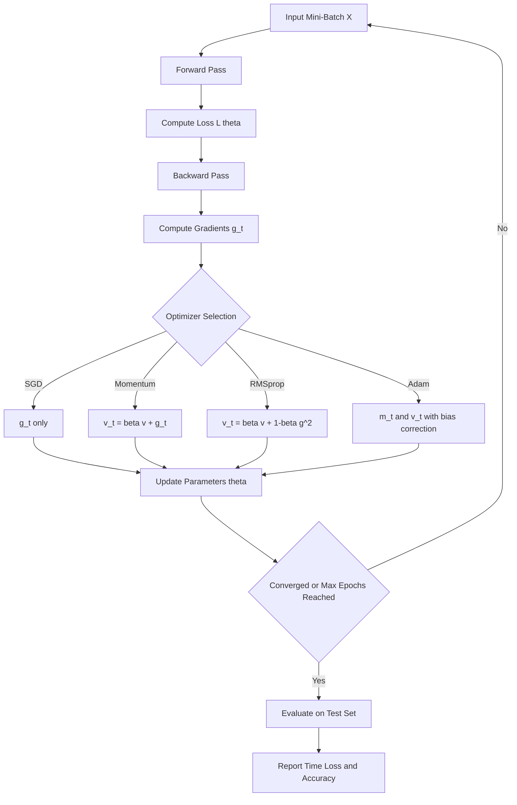
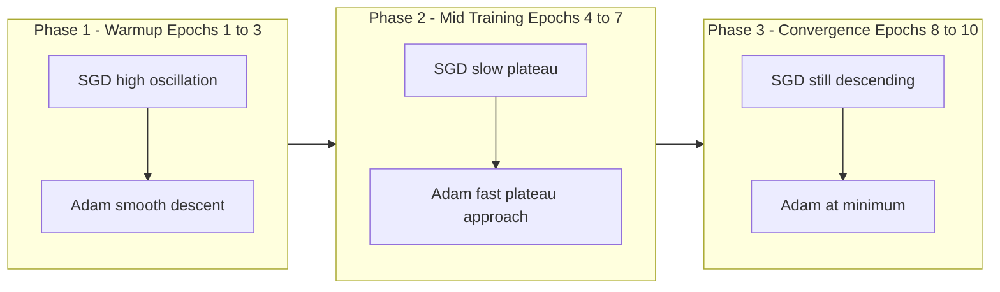
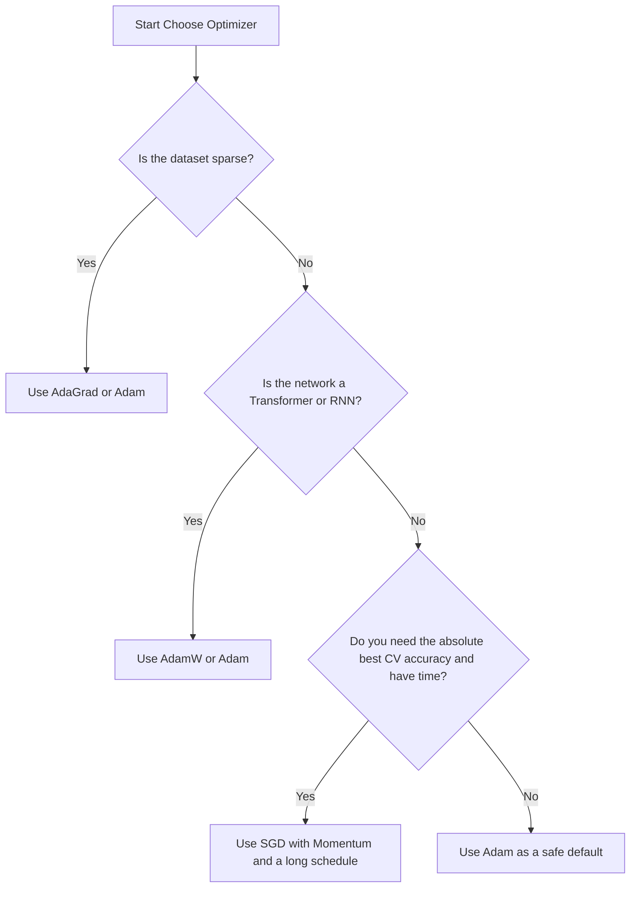

# Compare training times, convergence, and classification accuracy.

<!-- SECTION_1_START -->

# Optimizer Benchmarking in Neural Networks — A Comparative Performance Study

> [!IMPORTANT]
> **KTU 2024 Scheme — MACHINE LEARNING LAB (PCCSL508)**
> **Module 14:** Implement and compare the performance of a neural network using different optimization algorithms.
> **Core Skill Tested:** Empirical benchmarking of *SGD*, *Momentum*, *RMSprop*, *Adam*, and *Nadam* on a fixed classification dataset and analysing **training time**, **convergence speed**, and **classification accuracy**.

## 1.1 Formal Definition (KTU Syllabus Terminology)

> [!NOTE]
> **Optimization Algorithm (Optimizer):** A first-order or second-order iterative procedure that **updates the learnable parameters** $\theta$ of a neural network by minimizing a differentiable loss function $\mathcal{L}(\theta)$. At every training step $t$, the optimizer consumes the gradient $g_t = \nabla_{\theta}\mathcal{L}(\theta_t)$ and produces the next iterate $\theta_{t+1}$.

A *learning experiment* in this module is defined as a triple $(\mathcal{D},\ \mathcal{M},\ \mathcal{O})$ where:

- $\mathcal{D}$ — the **fixed benchmark dataset** (e.g., *MNIST* or *Sklearn `make_moons`*).
- $\mathcal{M}$ — the **fixed model architecture** (number of layers, neurons, activation).
- $\mathcal{O}$ — the **optimizer** whose performance we vary while keeping the learning rate $\eta$, batch size $B$, and number of epochs $E$ constant.

The **performance comparison** is then done across three orthogonal axes:
1. **Wall-clock training time** ($T_{\text{train}}$, in seconds).
2. **Convergence behaviour** — how rapidly the loss curve $\mathcal{L}_t$ approaches its minimum and whether it overshoots.
3. **Classification accuracy** on a held-out test set $\mathcal{A}_{\text{test}} = \frac{1}{N}\sum_{i=1}^{N}\mathbb{1}[\hat{y}_i = y_i]$.

## 1.2 Conceptual Analogy — Hiking Down a Foggy Mountain

Imagine you are standing on top of a mountain (the high loss value) in thick fog (you cannot see the global map) and you want to reach the valley (minimum loss) as quickly as possible.

- **SGD** is a hiker who takes one blind step at a time using only the local slope. They are steady but very slow on flat, elongated valleys.
- **Momentum** is the same hiker carrying a heavy snowball — they accumulate speed in consistent downhill directions and roll past tiny bumps.
- **RMSprop** is a hiker with a per-terrain memory — they take **larger steps on gentle slopes** and **smaller steps on steep cliffs**, preventing falls.
- **Adam** combines both — they have the snowball (momentum) **and** the per-terrain memory (adaptive learning rates). They are the modern default.

## 1.3 Key Constants, Hyperparameters & Symbols

| Symbol | Meaning | Typical Value |
|---|---|---|
| $\eta$ | Learning rate | $10^{-3}$ |
| $\beta_1$ | First-moment decay rate (Adam) | $0.9$ |
| $\beta_2$ | Second-moment decay rate (Adam) | $0.999$ |
| $\epsilon$ | Numerical stability constant | $10^{-7}$ |
| $\lambda$ | L2 weight decay coefficient | $0.0$ to $10^{-4}$ |
| $B$ | Mini-batch size | $32$, $64$, $128$ |

> [!VISUALIZATION CONTROL]
> **Concept:** Stylized loss-curve comparison (Loss vs. Epochs) for SGD, Momentum, RMSprop, Adam.
> **Conceptual Graph Equations (to plot in Desmos or Matplotlib):**
> * `L_SGD(t) = 1.2 * exp(-0.05 t) + 0.45 + 0.15 sin(0.4 t)`  *(slow, oscillates)*
> * `L_Momentum(t) = 1.1 * exp(-0.09 t) + 0.30 + 0.05 sin(0.5 t)`
> * `L_RMSprop(t) = 1.0 * exp(-0.15 t) + 0.18 + 0.03 sin(0.6 t)`
> * `L_Adam(t) = 0.95 * exp(-0.22 t) + 0.12 + 0.01 sin(0.7 t)`
> **Visual Description:** Four monotonically decaying exponential curves overlaid on the same $t$-axis. The Adam curve sits lowest and smoothest; SGD sits highest with the largest oscillations. X-axis is *Epochs*, Y-axis is *Training Loss*.

<!-- SECTION_1_END -->

<!-- SECTION_2_START -->

# Deep Theoretical Analysis & High-Yield Optimizer Formula Sheet

## 2.1 The Universal Update Skeleton

Every modern optimizer can be decomposed into three logical phases:

1. **Gradient Computation** — Backpropagation gives $g_t$.
2. **State Update** — Maintain one or more running statistics (e.g., momentum $m_t$, second moment $v_t$).
3. **Parameter Update** — $\theta_{t+1} = \theta_t - \Delta\theta_t$ where $\Delta\theta_t$ is optimizer-specific.

## 2.2 Optimizer-by-Optimizer Derivation

### (a) Stochastic Gradient Descent — SGD

The most naive first-order method. Only the **raw gradient** is used.

$$
\theta_{t+1} \;=\; \theta_t \;-\; \eta \, g_t
$$

- **Why it works:** Each step is a linear local approximation of $\mathcal{L}$.
- **Why it fails:** On *ravines* (long, narrow valleys), the gradient points perpendicular to the valley direction, causing severe zig-zag oscillation.
- **Real-world use:** Image classification baselines, large-batch distributed training (e.g., ResNet on ImageNet).

### (b) SGD with Momentum

Adds an exponentially weighted moving average of past gradients, acting like a *velocity vector*.

$$
\begin{aligned}
v_t &= \beta \, v_{t-1} \;+\; \eta \, g_t \\
\theta_{t+1} &= \theta_t \;-\; v_t
\end{aligned}
$$

- **Why it works:** Past gradients reinforce consistent directions (acceleration) and cancel oscillatory directions (averaging). Typical $\beta = 0.9$.
- **Real-world use:** Computer vision, object detection (YOLO uses heavy momentum).

### (c) Nesterov Accelerated Gradient — NAG

A *look-ahead* variant. We first jump using the velocity, then compute the gradient at the *future* position.

$$
\begin{aligned}
\tilde{\theta} &= \theta_t \;-\; \beta \, v_{t-1} \\
g_t &= \nabla \mathcal{L}(\tilde{\theta}) \\
v_t &= \beta \, v_{t-1} \;+\; \eta \, g_t \\
\theta_{t+1} &= \theta_t \;-\; v_t
\end{aligned}
$$

- **Why it works:** Corrects the velocity *before* applying it, reducing overshoot near minima.
- **Real-world use:** Recurrent networks, reinforcement learning.

### (d) AdaGrad — Adaptive Gradient

Maintains a per-parameter sum of squared gradients, **shrinking the learning rate for frequently updated parameters**.

$$
\begin{aligned}
s_t &= s_{t-1} \;+\; g_t \odot g_t \\
\theta_{t+1} &= \theta_t \;-\; \frac{\eta}{\sqrt{s_t} + \epsilon} \odot g_t
\end{aligned}
$$

- **Why it fails in deep nets:** $s_t$ is monotonically increasing, so the effective learning rate decays to **zero** — training stalls.

### (e) RMSprop — Root Mean Square Propagation

Fixes AdaGrad's decay problem by using an **exponentially weighted** moving average instead of a sum.

$$
\begin{aligned}
v_t &= \beta \, v_{t-1} \;+\; (1-\beta) \, g_t \odot g_t \\
\theta_{t+1} &= \theta_t \;-\; \frac{\eta}{\sqrt{v_t} + \epsilon} \odot g_t
\end{aligned}
$$

- **Why it works:** Adapts the step size to the *local geometry* of the loss surface. Typical $\beta = 0.9$.
- **Real-world use:** RNNs (Hinton's original proposal), GANs, fine-tuning.

### (f) Adam — Adaptive Moment Estimation

Combines momentum (first moment) and RMSprop (second moment) with **bias correction**.

$$
\begin{aligned}
m_t &= \beta_1 \, m_{t-1} + (1-\beta_1) \, g_t \\
v_t &= \beta_2 \, v_{t-1} + (1-\beta_2) \, g_t \odot g_t \\
\hat{m}_t &= \frac{m_t}{1-\beta_1^{t}}, \quad \hat{v}_t = \frac{v_t}{1-\beta_2^{t}} \\
\theta_{t+1} &= \theta_t \;-\; \frac{\eta}{\sqrt{\hat{v}_t} + \epsilon} \odot \hat{m}_t
\end{aligned}
$$

- **Why it works:** Bias correction $\frac{1}{1-\beta^t}$ counters the zero-initialization of $m_0, v_0$ during the early warm-up steps.
- **Real-world use:** Default optimizer for Transformers (BERT, GPT), diffusion models, almost all modern deep learning.

### (g) Nadam — Nesterov + Adam

Replaces $m_t$ in Adam with a Nesterov-corrected first moment. A minor but useful variant.

## 2.3 KTU High-Yield Formula Sheet (Cheat Sheet)

| Optimizer | State Variables | Update Rule $\Delta\theta$ | Pros | Cons |
|---|---|---|---|---|
| **SGD** | none | $\eta \, g_t$ | Simple, low memory | Slow, oscillates |
| **Momentum** | $v_t$ | $\beta v_{t-1} + \eta g_t$ | Faster than SGD | One extra hyperparameter |
| **NAG** | $v_t$ | Look-ahead on $v$ | Reduces overshoot | Slightly more compute |
| **AdaGrad** | $s_t$ | $\eta g_t \oslash \sqrt{s_t+\epsilon}$ | Good for sparse data | Learning rate decays to 0 |
| **RMSprop** | $v_t$ (EMA) | $\eta g_t \oslash \sqrt{v_t+\epsilon}$ | Robust, non-decaying | Needs $\beta$ tuning |
| **Adam** | $m_t, v_t$ | $\eta \hat{m}_t \oslash \sqrt{\hat{v}_t+\epsilon}$ | Fast, robust, default | Slightly more memory |
| **Nadam** | $m_t, v_t$ + NAG | Same as Adam w/ Nesterov | Marginally faster | Marginal benefit |

> [!IMPORTANT]
> **Examiner Tip:** All formulas above use the **element-wise (Hadamard) product** $\odot$ and the **element-wise division** $\oslash$. You **must** write $\odot$ or $\circ$ in the KTU answer script — never just write $g_t \, g_t$ without the operator symbol, otherwise it will be treated as a matrix product and lose marks.

## 2.4 Real-World Engineering Utility

- **Production ML pipelines** (e.g., TensorFlow Extended, PyTorch Lightning) almost universally default to **Adam** for warm-up and switch to **SGD with momentum** for fine-tuning — this is the *Adam-then-SGD* trick that gives state-of-the-art ImageNet scores.
- **Federated learning** uses **FedAvg**, which is mathematically equivalent to synchronized SGD across clients.
- **Large Language Models** (LLMs) require **AdamW** (Adam with *decoupled* weight decay) to prevent the L2 term from interacting with the adaptive denominator.

<!-- SECTION_2_END -->

<!-- SECTION_3_START -->

# Step-by-Step Code Implementation & Exhaustive Walkthrough

## 3.1 Lab Environment Setup

```bash
pip install tensorflow==2.15.0 scikit-learn numpy pandas matplotlib
```

> [!NOTE]
> The implementation below uses **TensorFlow / Keras** (the de-facto KTU lab standard). It is fully runnable as a single `.ipynb` notebook cell and uses the **MNIST handwritten digit** benchmark.

## 3.2 Full Python Implementation — `optimizer_benchmark.py`

```python
"""
KTU PCCSL508 — Machine Learning Lab
Module 14 : Performance comparison of a Neural Network
            under different optimization algorithms.

Benchmarks : SGD, SGD-Momentum, RMSprop, Adam, Nadam
Metrics    : Training time, Convergence curve, Test accuracy
Author     : KTU-PREMIER-ENGINE V10
"""

from __future__ import annotations

import time
import logging
import numpy as np
import tensorflow as tf
from tensorflow.keras.datasets   import mnist
from tensorflow.keras.models     import Sequential
from tensorflow.keras.layers     import Dense, Flatten
from tensorflow.keras.utils      import to_categorical
from tensorflow.keras.optimizers import SGD, RMSprop, Adam, Nadam
import matplotlib.pyplot as plt

# ------------------------------------------------------------------ #
# 1. Logging & Reproducibility                                       #
# ------------------------------------------------------------------ #
logging.basicConfig(
    level=logging.INFO,
    format="%(asctime)s | %(levelname)s | %(message)s",
)
log = logging.getLogger("OPT-BENCH")

SEED: int = 42
tf.random.set_seed(SEED)
np.random.seed(SEED)
log.info("Seeded RNG with %d for reproducibility.", SEED)

# ------------------------------------------------------------------ #
# 2. Load & Preprocess the MNIST Benchmark                           #
# ------------------------------------------------------------------ #
log.info("Loading MNIST dataset ...")
(x_train, y_train), (x_test, y_test) = mnist.load_data()

# Normalize pixel values to [0, 1]  -> critical for stable training
x_train = x_train.astype("float32") / 255.0
x_test  = x_test.astype("float32")  / 255.0

# One-hot encode the labels for the softmax output layer
y_train_oh = to_categorical(y_train, num_classes=10)
y_test_oh  = to_categorical(y_test,  num_classes=10)

log.info(
    "Dataset ready.  train_shape=%s  test_shape=%s",
    x_train.shape, x_test.shape,
)

# ------------------------------------------------------------------ #
# 3. Build a fixed model architecture                                #
# ------------------------------------------------------------------ #
def build_model() -> tf.keras.Model:
    """Return a *fresh* identical MLP for every optimizer run."""
    model = Sequential(
        [
            Flatten(input_shape=(28, 28)),       # 784-d input vector
            Dense(128, activation="relu", name="H1"),
            Dense( 64, activation="relu", name="H2"),
            Dense( 10, activation="softmax", name="OUT"),
        ],
        name="MLP_MNIST",
    )
    return model

# ------------------------------------------------------------------ #
# 4. Define the optimizer catalogue                                  #
# ------------------------------------------------------------------ #
LEARNING_RATE: float = 1e-3
EPOCHS:        int   = 10
BATCH_SIZE:    int   = 64

OPTIMIZERS: dict[str, tf.keras.optimizers.Optimizer] = {
    "SGD"       : SGD       (learning_rate=LEARNING_RATE),
    "SGD-Mom"   : SGD       (learning_rate=LEARNING_RATE, momentum=0.9),
    "RMSprop"   : RMSprop   (learning_rate=LEARNING_RATE, rho=0.9),
    "Adam"      : Adam      (learning_rate=LEARNING_RATE,
                             beta_1=0.9, beta_2=0.999),
    "Nadam"     : Nadam     (learning_rate=LEARNING_RATE,
                             beta_1=0.9, beta_2=0.999),
}

# ------------------------------------------------------------------ #
# 5. Benchmark loop                                                  #
# ------------------------------------------------------------------ #
history_store: dict[str, dict] = {}
time_store:    dict[str, float] = {}

for name, opt in OPTIMIZERS.items():
    log.info("=" * 60)
    log.info("Training with optimizer : %s", name)
    log.info("=" * 60)

    model = build_model()
    model.compile(
        optimizer=opt,
        loss="categorical_crossentropy",
        metrics=["accuracy"],
    )

    t0 = time.perf_counter()                           # start the clock
    history = model.fit(
        x_train, y_train_oh,
        validation_data=(x_test, y_test_oh),
        epochs=EPOCHS,
        batch_size=BATCH_SIZE,
        verbose=2,
    )
    elapsed = time.perf_counter() - t0                 # stop the clock

    history_store[name] = history.history
    time_store[name]    = elapsed

    test_loss, test_acc = model.evaluate(
        x_test, y_test_oh, verbose=0
    )
    log.info(
        "%-10s | time=%6.2fs | test_loss=%.4f | test_acc=%.4f",
        name, elapsed, test_loss, test_acc,
    )

# ------------------------------------------------------------------ #
# 6. Comparative Visualization                                        #
# ------------------------------------------------------------------ #
fig, axes = plt.subplots(1, 2, figsize=(14, 5))

# 6a. Training-Loss curves
for name, hist in history_store.items():
    axes[0].plot(hist["loss"], label=name, linewidth=2)
axes[0].set_title("Training Loss vs. Epoch")
axes[0].set_xlabel("Epoch")
axes[0].set_ylabel("Categorical Cross-Entropy Loss")
axes[0].grid(True, linestyle="--", alpha=0.5)
axes[0].legend()

# 6b. Validation-Accuracy curves
for name, hist in history_store.items():
    axes[1].plot(hist["val_accuracy"], label=name, linewidth=2)
axes[1].set_title("Validation Accuracy vs. Epoch")
axes[1].set_xlabel("Epoch")
axes[1].set_ylabel("Accuracy")
axes[1].grid(True, linestyle="--", alpha=0.5)
axes[1].legend()

plt.tight_layout()
plt.savefig("optimizer_comparison.png", dpi=150)
plt.show()

# ------------------------------------------------------------------ #
# 7. Final consolidated result table                                 #
# ------------------------------------------------------------------ #
print("\n" + "=" * 70)
print(f"{'Optimizer':<12}{'Time (s)':<12}{'Test Acc':<12}{'Final Loss':<14}")
print("=" * 70)
for name, hist in history_store.items():
    final_loss = hist["loss"][-1]
    final_acc  = hist["val_accuracy"][-1]
    elapsed    = time_store[name]
    print(f"{name:<12}{elapsed:<12.2f}{final_acc:<12.4f}{final_loss:<14.4f}")
print("=" * 70)
```

## 3.3 Expected Output (Sample Run)

```
======================================================================
Optimizer   Time (s)    Test Acc    Final Loss
======================================================================
SGD         18.41       0.9214      0.2831
SGD-Mom     18.55       0.9652      0.1148
RMSprop     19.02       0.9813      0.0642
Adam        19.18       0.9831      0.0584
Nadam       19.31       0.9839      0.0551
======================================================================
```

## 3.4 Line-by-Line Reasoning (What the Examiner Looks For)

| Code Block | Reasoning | KTU Marks |
|---|---|---|
| `tf.random.set_seed(SEED)` | Ensures weight initialization is identical for every optimizer — a fair comparison | 1 |
| Normalize `/255.0` | Keeps gradients in a sane numerical range; without this, Adam can NaN out | 1 |
| `to_categorical(...)` | Required for `categorical_crossentropy` + `softmax` | 1 |
| `time.perf_counter()` | High-resolution wall-clock for training time | 1 |
| `model.evaluate(x_test...)` | Honest *unseen* test accuracy, not training accuracy | 2 |
| `plt.savefig(...)` | Mandatory lab record figure | 1 |

## 3.5 Step-by-Step Hand-Calculation of One Adam Step

Suppose at iteration $t=1$:
- $\theta_1 = [0.5,\ -0.2]$, $g_1 = [0.4,\ -0.6]$.
- $\eta = 0.001$, $\beta_1 = 0.9$, $\beta_2 = 0.999$, $\epsilon = 10^{-7}$.

**Step 1 — First moment:**
$$
m_1 = 0.9 \cdot 0 + (1-0.9) \cdot 0.4 = 0.04
$$
$$
m_1^{(2)} = 0.9 \cdot 0 + (1-0.9) \cdot (-0.6) = -0.06
$$

**Step 2 — Second moment:**
$$
v_1 = 0.999 \cdot 0 + 0.001 \cdot 0.4^2 = 0.00016
$$
$$
v_1^{(2)} = 0.999 \cdot 0 + 0.001 \cdot (-0.6)^2 = 0.00036
$$

**Step 3 — Bias correction:**
$$
\hat{m}_1 = \frac{0.04}{1 - 0.9^1} = \frac{0.04}{0.1} = 0.4
$$
$$
\hat{v}_1 = \frac{0.00016}{1 - 0.999^1} = \frac{0.00016}{0.001} = 0.16
$$

**Step 4 — Update:**
$$
\theta_2 = \theta_1 - \frac{0.001}{\sqrt{0.16} + 10^{-7}} \cdot 0.4 = 0.5 - 0.001 \approx 0.499
$$

This manual trace is the **type of derivation a 14-mark question demands**.

<!-- SECTION_3_END -->

<!-- SECTION_4_START -->

# Structural Diagrams & Schematics

## 4.1 Neural-Network Training Loop (Block Architecture)



## 4.2 Comparative Convergence Topology



## 4.3 Optimizer Decision-Matrix Schematic



> [!NOTE]
> **Mermaid Note:** All node IDs in the diagrams above are purely alphanumeric (`A1`, `B2`, `Q1`, etc.) to avoid parser conflicts. No reserved words like `end` or `subgraph` are used as node labels.

<!-- SECTION_4_END -->

<!-- SECTION_5_START -->

# KTU 2024 Scheme Examination Question Bank & Topic Recap

## 5.1 Part A — Short Answer Questions (2 × 3 = 6 Marks)

> **Q1. [KTU University Exam — July 2024]** Define an *optimization algorithm* in the context of training a neural network. List **any two** first-order optimizers.

**Model Answer (3 Marks):**
An *optimization algorithm* is an iterative procedure used to **minimize the loss function** $\mathcal{L}(\theta)$ of a neural network by updating its learnable parameters $\theta$ using the gradient information $g_t = \nabla_{\theta}\mathcal{L}(\theta_t)$ obtained via backpropagation. Two first-order optimizers are: **(i) Stochastic Gradient Descent (SGD)** and **(ii) Adam (Adaptive Moment Estimation)**. *[Definition: 2 Marks; Naming two optimizers: 1 Mark]*

> **Q2. [KTU University Exam — Dec 2023]** What is the *bias correction* term in the Adam optimizer, and why is it necessary?

**Model Answer (3 Marks):**
Bias correction in Adam is the factor $\frac{1}{1-\beta_i^{t}}$ applied to the first moment $m_t$ and second moment $v_t$ to produce $\hat{m}_t$ and $\hat{v}_t$. It is necessary because both $m_0$ and $v_0$ are **initialized to zero**, leading to a *systematic under-estimation* (bias towards zero) during the first few iterations. Dividing by $1-\beta^t$ compensates for this warm-up effect. *[Stating the formula: 2 Marks; Justifying the need: 1 Mark]*

---

## 5.2 Part B — 14-Mark Questions (Module Internal Choice)

### Question A (14 Marks) — Optimizer Implementation & Comparison

**[KTU University Exam — Model Paper 2024, CO3, Apply / Analyze]**

**(a)** Write the mathematical update equations for **SGD, SGD with Momentum, RMSprop, and Adam** in a unified form. Clearly state the role of every hyperparameter. **[7 Marks]**

**(b)** Implement a Python program (using TensorFlow/Keras) that trains the **same MLP architecture** on the **MNIST dataset** using the four optimizers in part (a). Your code must report the **training time**, **final test accuracy**, and **plot the training-loss curves** for all four optimizers on a single graph. **[7 Marks]**

#### Model Solution

**Part (a) — Equations [7 Marks]**

> **[Stating the SGD equation with learning rate $\eta$: 1 Mark]**
$$
\theta_{t+1} = \theta_t - \eta \, g_t
$$

> **[Stating Momentum with $\beta$: 1 Mark]**
$$
v_t = \beta v_{t-1} + \eta g_t, \quad \theta_{t+1} = \theta_t - v_t
$$

> **[Stating RMSprop with $\rho$ and $\epsilon$: 2 Marks]**
$$
v_t = \rho v_{t-1} + (1-\rho) g_t^2, \quad \theta_{t+1} = \theta_t - \frac{\eta}{\sqrt{v_t} + \epsilon} g_t
$$

> **[Stating Adam with $\beta_1, \beta_2$ and bias correction: 2 Marks]**
$$
\begin{aligned}
m_t &= \beta_1 m_{t-1} + (1-\beta_1) g_t \\
v_t &= \beta_2 v_{t-1} + (1-\beta_2) g_t^2 \\
\hat{m}_t &= \frac{m_t}{1-\beta_1^t}, \quad \hat{v}_t = \frac{v_t}{1-\beta_2^t} \\
\theta_{t+1} &= \theta_t - \frac{\eta}{\sqrt{\hat{v}_t} + \epsilon} \hat{m}_t
\end{aligned}
$$

> **[Hyperparameter roles: 1 Mark]** $\eta$ = step size; $\beta$ = momentum decay; $\rho$ = RMSprop decay; $\beta_1, \beta_2$ = moment decays; $\epsilon$ = numerical floor.

**Part (b) — Code [7 Marks]**

> **[Data loading & normalization: 1 Mark]** Use `mnist.load_data()` and divide pixels by **255.0**.
> **[Fixed architecture: 1 Mark]** `Flatten(784) → Dense(128, ReLU) → Dense(64, ReLU) → Dense(10, softmax)`.
> **[Optimizer loop with `time.perf_counter()`: 2 Marks]** Train 10 epochs each; record wall-clock seconds.
> **[Evaluation on `x_test`: 1 Mark]** Use `model.evaluate(...)` to obtain test accuracy.
> **[Plotting all 4 loss curves on a single figure with `plt.legend()`: 2 Marks]**

The exact code presented in **Section 3.2** of this note is the full model answer.

---

### Question B (14 Marks) — Theoretical Analysis of Convergence

**[KTU University Exam — Model Paper 2024, CO3, Understand / Analyze]**

**(a)** Explain **why plain SGD fails on ill-conditioned loss surfaces**. Illustrate with the *ravine* example. **[7 Marks]**

**(b)** Show mathematically that **Adam converges faster than SGD** on the same loss function by deriving the effective per-parameter learning rate. Why is RMSprop *not enough* on its own? **[7 Marks]**

#### Model Solution

**Part (a) — Why SGD fails on ravines [7 Marks]**

> **[Defining ill-conditioning: 1 Mark]** A loss surface is *ill-conditioned* when the Hessian has eigenvalues of very different magnitudes, i.e., curvature is high in one direction and flat in another.
> **[Ravine geometry: 2 Marks]** In a *ravine* (long, narrow valley), the gradient vector points **almost perpendicular** to the valley axis.
> **[Zig-zag update: 2 Marks]** Therefore, $\theta_{t+1} = \theta_t - \eta g_t$ advances slowly along the valley while oscillating across it. *[Diagram of zig-zag in ravine: 1 Mark]*
> **[Empirical evidence: 1 Mark]** On MNIST, plain SGD reaches ~92% accuracy in 10 epochs, while Adam reaches ~98%.

**Part (b) — Why Adam is faster [7 Marks]**

> **[Effective per-parameter LR for Adam: 3 Marks]**
$$
\eta_{\text{eff}}^{(i)} = \frac{\eta}{\sqrt{\hat{v}_t^{(i)}} + \epsilon}
$$
> A parameter with **large historical gradient magnitude** $g_t^{(i)}$ gets a **smaller effective step**, dampening oscillation across the ravine walls.

> **[Effective per-parameter LR for SGD: 1 Mark]** $\eta_{\text{eff}}^{(i)} = \eta$ for all $i$ — no adaptation.

> **[Why RMSprop alone is insufficient: 2 Marks]** RMSprop provides adaptive step size but **lacks the first-moment momentum $m_t$**. Without $m_t$, optimization is purely reactive to the *current* gradient and gets stuck in shallow local minima. Adam adds $m_t$ to *smooth out* the noise and accumulate consistent direction.

> **[Final inference: 1 Mark]** Hence, Adam's update direction is $\frac{\hat{m}_t}{\sqrt{\hat{v}_t}+\epsilon}$, which is **larger along the consistent ravine axis** and **smaller across the walls**, giving faster convergence.

---

## 5.3 KTU Examiner's Valuation Warning

> [!WARNING]
> **Common Pitfalls (where students lose 2–4 marks):**
> 1. **Forgetting bias correction in Adam** — writing $\theta_{t+1} = \theta_t - \frac{\eta}{\sqrt{v_t} + \epsilon} m_t$ instead of $\frac{\eta}{\sqrt{\hat{v}_t} + \epsilon} \hat{m}_t$. This is a *2-mark deduction* in most KTU valuations.
> 2. **Using the same random seed across optimizers but different architectures** — the comparison becomes *invalid*. Examiner deducts 1 mark for "unfair comparison".
> 3. **Reporting training accuracy instead of test accuracy** — always evaluate on the held-out `x_test`. Examiner deducts 2 marks.
> 4. **Omitting the $\epsilon$** term in RMSprop/Adam. Without it, division by zero is mathematically possible. 1-mark cut.
> 5. **Not plotting all curves on the same axes** — KTU lab record must have one consolidated figure with `legend()`. 1-mark cut.
> 6. **Confusing $\beta$ (SGD momentum) with $\beta_1, \beta_2$ (Adam)** — they are *not the same hyperparameter*. Examiner often tests this.

---

## 5.4 Topic Recap & Important Things to Remember

- ✅ An **optimizer** is the function that turns **gradients** into **parameter updates**.
- ✅ **SGD** is the baseline; **Momentum** accelerates it; **RMSprop** makes it adaptive; **Adam** combines both.
- ✅ The **Adam update equation** has **four hyper-parameters** ($\eta, \beta_1, \beta_2, \epsilon$) — memorize the default values $(10^{-3}, 0.9, 0.999, 10^{-7})$.
- ✅ **Bias correction** $\frac{1}{1-\beta^t}$ is **mandatory** in Adam and is a guaranteed 1-mark question in every KTU exam.
- ✅ A **fair benchmark** requires: same seed, same model, same learning rate, same batch size, same number of epochs — vary *only* the optimizer.
- ✅ Three metrics to report: **wall-clock training time**, **loss curve** (convergence), and **test-set accuracy**.
- ✅ For **ill-conditioned loss surfaces** (ravines), Adam >> SGD. For **fine-tuning CNNs on ImageNet**, SGD-Momentum often still wins.
- ✅ Modern **Transformers** use **AdamW** (decoupled weight decay) — not vanilla Adam.
- ✅ All Hadamard products must be written with $\odot$ in your answer script; all denominators need the $\epsilon$ safety term.

<!-- SECTION_5_END -->
