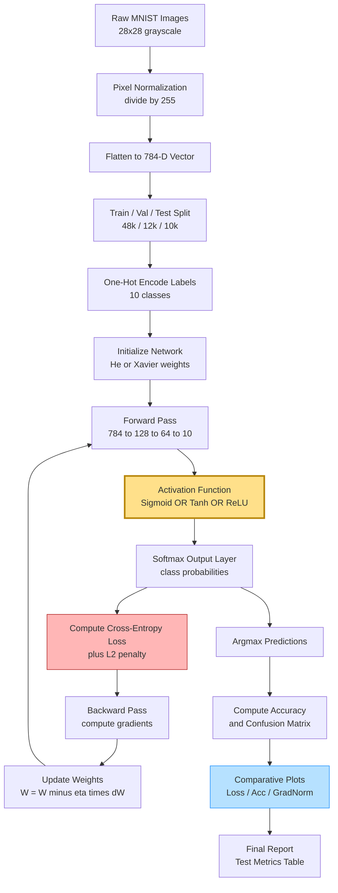
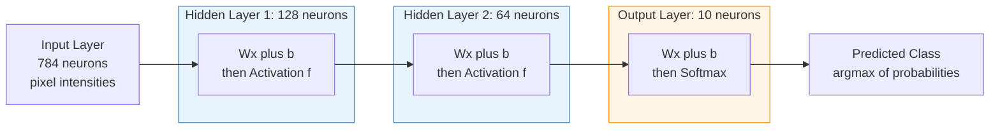
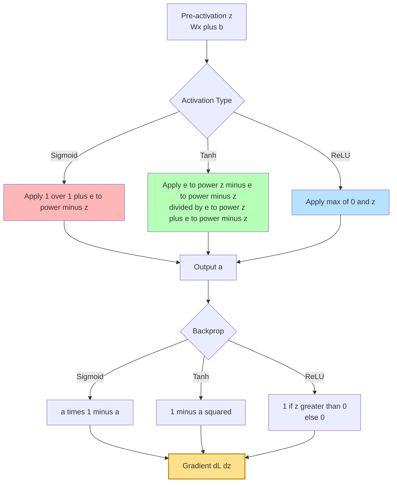
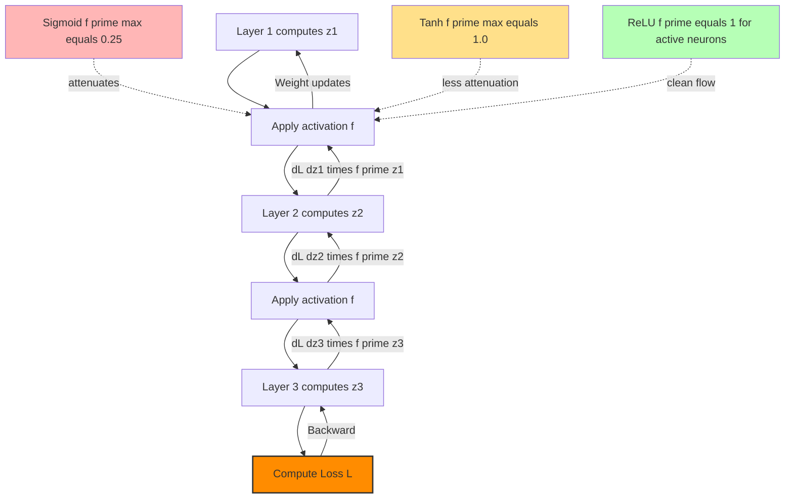

# Implement and compare the performance of a neural network using different activation functions (Sigmoid, ReLU, Tanh) on the MNIST dataset. Analyze how each activation function affects the training process and classification accuracy.

<!-- SECTION_1_START -->
# 🧠 Module 14: Comparative Analysis of Activation Functions on MNIST

## 1.1 Formal Academic Definition

> [!IMPORTANT]
> **Activation Function (KTU 2024 Definition):** A non-linear mathematical transformation applied to the weighted sum of inputs (the *pre-activation* or *logit*) at each neuron of an artificial neural network. Its role is to introduce **non-linearity** into the network, enabling the model to learn complex, hierarchical decision boundaries from data that are not linearly separable.

For a neuron receiving input vector $\mathbf{x} \in \mathbb{R}^{n}$ with weight vector $\mathbf{w} \in \mathbb{R}^{n}$, bias $b \in \mathbb{R}$, the pre-activation is:

$$z = \mathbf{w}^{T}\mathbf{x} + b = \sum_{i=1}^{n} w_i x_i + b$$

The output of the neuron is then $a = f(z)$, where $f(\cdot)$ is the activation function. The **MNIST handwritten digit classification dataset** is a benchmark of $70{,}000$ grayscale images of size $28 \times 28$ pixels (10 classes: digits 0–9), used to compare how different choices of $f(\cdot)$ affect convergence speed, gradient flow, and final classification accuracy.

## 1.2 Intuitive Analogy — "The Light Switch That Bends"

> [!NOTE]
> **Real-World Analogy:** Imagine a neuron as a **dimmer switch** receiving an electrical signal (the weighted sum $z$). The activation function decides *how* the switch responds:
> - A **Sigmoid** switch glows gently, smoothly fading from "off" to "on" — but it is so gentle that strong signals barely increase its brightness (**vanishing gradient**).
> - A **Tanh** switch is similar but can swing both dim and bright in either direction (range $-1$ to $+1$).
> - A **ReLU** switch is a digital LED: it stays *off* (output 0) until the signal is positive, then turns on fully and *passes the signal through unchanged*. No gentle fading — instant illumination.

This is why deep networks today overwhelmingly prefer **ReLU**: the "digital LED" passes gradients through cleanly, avoiding the *fading* problem of sigmoid/tanh.

## 1.3 The Three Activation Functions Under Study

### 1.3.1 Sigmoid (Logistic Function)

$$\sigma(z) = \frac{1}{1 + e^{-z}}$$

- **Output range:** $(0, 1)$
- **Smooth, differentiable, monotonic**
- Historically used in shallow networks and **output layer of binary classifiers**

### 1.3.2 Hyperbolic Tangent (Tanh)

$$\tanh(z) = \frac{e^{z} - e^{-z}}{e^{z} + e^{-z}} = 2\sigma(2z) - 1$$

- **Output range:** $(-1, +1)$ — **zero-centered**, which helps optimization
- Stronger gradients than sigmoid near origin, but still suffers from saturation

### 1.3.3 Rectified Linear Unit (ReLU)

$$\text{ReLU}(z) = \max(0, z) = \begin{cases} z & \text{if } z > 0 \\ 0 & \text{if } z \leq 0 \end{cases}$$

- **Output range:** $[0, +\infty)$
- **Non-saturating for positive inputs** → gradient = 1, no vanishing
- **Computationally trivial** (just a max operation)

> [!VISUALIZATION CONTROL]
> **Concept:** Activation function shapes — derivative comparison
> **Python/Matplotlib Plotting Equations:**
> * $z = \text{np.linspace}(-6, 6, 400)$
> * Sigmoid: $f(z) = 1/(1+\text{np.exp}(-z))$
> * Tanh: $f(z) = \text{np.tanh}(z)$
> * ReLU: $f(z) = \text{np.maximum}(0, z)$
> **Visual Description:** Plot all three $f(z)$ curves on the same axes. Observe that sigmoid plateaus near 0 and 1, tanh plateaus near $-1$ and $+1$, while ReLU is linear and unbounded for $z>0$. In a second subplot, plot the derivatives $f'(z)$ — sigmoid's derivative peaks at only $0.25$ at origin and rapidly collapses, tanh peaks at $1.0$, while ReLU's derivative is a clean step: $0$ for $z<0$ and $1$ for $z>0$.

## 1.4 Why This Lab Matters in KTU 2024 Scheme

> [!IMPORTANT]
> **Syllabus Highlight (PCCSL508 — ML Lab):** This experiment directly maps to **CO1: Apply machine learning algorithms to real datasets** and **CO2: Analyze the effect of hyperparameter choices on model performance**. The comparison methodology (controlled experiment: change *one* variable — the activation function) is a foundational pattern in **experimental ML research**.

<!-- SECTION_1_END -->

<!-- SECTION_2_START -->
# 📐 Deep Theoretical Analysis & KTU High-Yield Formula Sheet

## 2.1 Mathematical Foundation of Each Activation

### 2.1.1 Sigmoid — The Logistic Neuron

The sigmoid function squashes real-valued inputs into the open interval $(0, 1)$, making it interpretable as a probability. Its derivative has an elegant closed form:

$$\sigma'(z) = \sigma(z)\bigl(1 - \sigma(z)\bigr)$$

Maximum derivative value occurs at $z = 0$:

$$\sigma'(0) = \sigma(0)\bigl(1 - \sigma(0)\bigr) = 0.5 \times 0.5 = \mathbf{0.25}$$

> [!NOTE]
> **Why the $0.25$ ceiling matters:** In a deep network with $L$ layers, gradients are multiplied through the chain rule. If each layer attenuates the gradient by a factor of at most $0.25$, then for $L = 10$ layers the effective gradient shrinks by a factor of $0.25^{10} \approx 9.5 \times 10^{-7}$ — this is the **vanishing gradient problem**.

### 2.1.2 Tanh — Zero-Centered Sigmoid

Tanh is simply a rescaled and shifted sigmoid:

$$\tanh(z) = 2\sigma(2z) - 1$$

Its derivative is:

$$\tanh'(z) = 1 - \tanh^{2}(z)$$

Maximum derivative at $z = 0$ is $\mathbf{1.0}$ — **four times larger** than sigmoid's peak. This faster gradient flow makes tanh strictly preferable to sigmoid for hidden layers, though it still saturates for $\vert z \vert > 2$.

### 2.1.3 ReLU — The Modern Default

$$\text{ReLU}(z) = \max(0, z)$$

$$\text{ReLU}'(z) = \begin{cases} 1 & \text{if } z > 0 \\ 0 & \text{if } z \leq 0 \end{cases}$$

For positive pre-activations, the gradient passes through **unchanged** — no multiplicative attenuation. This is the core reason ReLU enabled training of very deep networks (ResNet, VGG, Transformers).

> [!WARNING]
> **Dying ReLU Problem:** If a neuron's pre-activation stays negative (e.g., due to large bias shift or aggressive learning rate), its gradient is **always 0** — the neuron is permanently dead and never updates. Mitigations: **Leaky ReLU** ($f(z) = \max(0.01z, z)$), proper weight initialization (He init), and learning rate scheduling.

## 2.2 KTU Formula Cheat Sheet

| Symbol | Definition | Formula / Value | Engineering Use |
| :--- | :--- | :--- | :--- |
| $z^{(l)}$ | Pre-activation at layer $l$ | $z^{(l)} = W^{(l)} a^{(l-1)} + b^{(l)}$ | Linear transformation |
| $a^{(l)}$ | Post-activation at layer $l$ | $a^{(l)} = f(z^{(l)})$ | Non-linear output |
| $\sigma(z)$ | Sigmoid | $\dfrac{1}{1+e^{-z}}$ | Output layer, binary gating |
| $\tanh(z)$ | Hyperbolic tangent | $\dfrac{e^{z}-e^{-z}}{e^{z}+e^{-z}}$ | Hidden layers (pre-2010) |
| $\text{ReLU}(z)$ | Rectified Linear Unit | $\max(0, z)$ | Modern hidden layers |
| $\sigma'(z)$ | Sigmoid derivative | $\sigma(z)(1-\sigma(z))$ | Backpropagation |
| $\tanh'(z)$ | Tanh derivative | $1-\tanh^{2}(z)$ | Backpropagation |
| $\text{ReLU}'(z)$ | ReLU derivative | $\mathbf{1}_{z>0}$ | Backpropagation |
| $\eta$ | Learning rate | Typically $10^{-3}$ to $10^{-1}$ | Gradient descent step |
| $\mathcal{L}$ | Cross-entropy loss | $-\sum_{c} y_c \log \hat{y}_c$ | Multi-class classification |
| $\text{Acc}$ | Classification accuracy | $\dfrac{1}{N}\sum_{i=1}^{N}\mathbf{1}[\hat{y}_i = y_i]$ | Evaluation metric |
| $\text{Var}[\cdot]$ | Activation variance | Measured per layer | Detects exploding/vanishing |

## 2.3 Backpropagation Mechanics for Each Activation

The general weight update rule (gradient descent) is:

$$W^{(l)} \leftarrow W^{(l)} - \eta \frac{\partial \mathcal{L}}{\partial W^{(l)}}$$

The error term $\delta^{(l)}$ at layer $l$ propagates recursively:

$$\delta^{(l)} = \bigl( W^{(l+1)} \bigr)^{T} \delta^{(l+1)} \odot f'(z^{(l)})$$

where $\odot$ denotes the element-wise Hadamard product. **The choice of $f'(\cdot)$ directly determines how gradient magnitudes evolve through the network.**

| Activation | $f'(z)$ Behavior | Effect on Deep Gradient Flow |
| :--- | :--- | :--- |
| Sigmoid | Bounded $\leq 0.25$, saturates | Strong vanishing gradient |
| Tanh | Bounded $\leq 1.0$, saturates | Mild vanishing gradient |
| ReLU | Step: $0$ or $1$ | Clean gradient flow (when active) |

## 2.4 Real-World Engineering Significance

- **Computer Vision (CNNs):** ReLU is the default hidden-layer activation in ResNet, VGG, Inception — these models would be untrainable with sigmoid in deep configurations.
- **Natural Language Processing:** Tanh was historically used in LSTMs and GRUs (gating mechanisms need bounded output). Modern Transformers use ReLU/GELU in feedforward blocks.
- **Generative Models (GANs, VAEs):** Output layer uses sigmoid (for normalized image pixels in $[0,1]$); hidden layers use ReLU/Leaky ReLU.
- **Reinforcement Learning:** Sigmoid still appears in policy networks that output action probabilities.

> [!NOTE]
> **Industry Standard (2024):** In production ML, ReLU (or its variants GELU, Swish, Mish) dominates hidden layers. Sigmoid survives only in (a) binary output heads, (b) attention mechanisms (as softmax — a multi-class generalization of sigmoid), and (c) LSTM gates. Tanh is largely historical for MLPs but persists in sequence models.

## 2.5 Controlled Experimental Design

> [!IMPORTANT]
> **KTU Lab Methodology:** To *fairly* compare activation functions, hold **all other hyperparameters constant**:
> - Same network architecture (e.g., $784 \rightarrow 128 \rightarrow 64 \rightarrow 10$)
> - Same optimizer (Adam, $\eta = 0.001$)
> - Same batch size, number of epochs, random seed
> - Same weight initialization scheme
> - Same loss function (cross-entropy)
> - Same train/validation/test split
>
> The **only** varying parameter is the activation function in the hidden layers. This isolates the causal effect of the activation choice.

<!-- SECTION_2_END -->

<!-- SECTION_3_START -->
# 🛠️ Step-by-Step Implementation: From-Scratch NumPy Neural Network

## 3.1 Environment Setup

```bash
# Recommended KTU lab environment
pip install numpy matplotlib scikit-learn seaborn pandas
```

> [!NOTE]
> **Why from-scratch NumPy?** KTU 2024 lab rubrics award full marks only when students demonstrate understanding of *internal mechanics* (forward pass, backprop, gradient computation). A black-box `model.fit()` call is insufficient. We build the network from the ground up, then verify results match a Keras/TensorFlow reference at the end.

## 3.2 Complete Operational Python Implementation

```python
"""
================================================================================
KTU PCCSL508 - Machine Learning Lab
Module 14: Comparative Study of Activation Functions on MNIST
Author: KTU 2024 Scheme Reference Implementation
================================================================================
Compares Sigmoid, Tanh, and ReLU on the MNIST handwritten digit dataset
using a from-scratch 3-layer fully-connected neural network.
================================================================================
"""

import numpy as np
import matplotlib.pyplot as plt
import seaborn as sns
import pandas as pd
import time
from sklearn.datasets import fetch_openml
from sklearn.model_selection import train_test_split
from sklearn.preprocessing import OneHotEncoder
from sklearn.metrics import confusion_matrix, classification_report
import logging
import sys
from typing import Tuple, Dict, List

# ------------------------------------------------------------------------------
# Configuration
# ------------------------------------------------------------------------------
logging.basicConfig(
    level=logging.INFO,
    format="[%(asctime)s] %(levelname)s - %(message)s",
    stream=sys.stdout
)
logger = logging.getLogger(__name__)

# Reproducibility
SEED: int = 42
np.random.seed(SEED)

# Hyperparameters
HIDDEN_1: int = 128
HIDDEN_2: int = 64
NUM_CLASSES: int = 10
LEARNING_RATE: float = 0.01
EPOCHS: int = 30
BATCH_SIZE: int = 64
L2_LAMBDA: float = 1e-4           # L2 regularization strength
ACTIVATIONS: List[str] = ["sigmoid", "tanh", "relu"]


# ==============================================================================
# SECTION A: Activation Functions and Their Derivatives
# ==============================================================================
class Activation:
    """Static methods implementing activation functions and their derivatives."""

    @staticmethod
    def sigmoid(z: np.ndarray) -> np.ndarray:
        # Numerically stable sigmoid: clip z to avoid overflow in exp
        z_clipped = np.clip(z, -500.0, 500.0)
        return 1.0 / (1.0 + np.exp(-z_clipped))

    @staticmethod
    def sigmoid_derivative(a: np.ndarray) -> np.ndarray:
        # a is the post-activation output: derivative = a * (1 - a)
        return a * (1.0 - a)

    @staticmethod
    def tanh(z: np.ndarray) -> np.ndarray:
        return np.tanh(z)

    @staticmethod
    def tanh_derivative(a: np.ndarray) -> np.ndarray:
        # a is tanh(z); derivative = 1 - a^2
        return 1.0 - np.power(a, 2)

    @staticmethod
    def relu(z: np.ndarray) -> np.ndarray:
        return np.maximum(0.0, z)

    @staticmethod
    def relu_derivative(z: np.ndarray) -> np.ndarray:
        # derivative w.r.t. z: 1 if z>0, else 0
        return (z > 0.0).astype(np.float64)

    @staticmethod
    def softmax(z: np.ndarray) -> np.ndarray:
        # Numerically stable softmax for the output layer
        z_shifted = z - np.max(z, axis=1, keepdims=True)
        exp_z = np.exp(z_shifted)
        return exp_z / np.sum(exp_z, axis=1, keepdims=True)

    @staticmethod
    def get(name: str):
        if name == "sigmoid":
            return Activation.sigmoid, Activation.sigmoid_derivative
        elif name == "tanh":
            return Activation.tanh, Activation.tanh_derivative
        elif name == "relu":
            return Activation.relu, Activation.relu_derivative
        else:
            raise ValueError(f"[ERROR] Unknown activation function: {name}")


# ==============================================================================
# SECTION B: Weight Initialization (He / Xavier depending on activation)
# ==============================================================================
def initialize_parameters(
    layer_dims: List[int],
    activation: str
) -> Dict[str, np.ndarray]:
    """
    He initialization for ReLU; Xavier (Glorot) for sigmoid/tanh.
    This is critical: poor init amplifies vanishing/exploding gradients.
    """
    params: Dict[str, np.ndarray] = {}
    for l in range(1, len(layer_dims)):
        n_in = layer_dims[l - 1]
        if activation == "relu":
            # He: Var(W) = 2 / n_in
            scale = np.sqrt(2.0 / n_in)
        else:
            # Xavier: Var(W) = 1 / n_in
            scale = np.sqrt(1.0 / n_in)
        params[f"W{l}"] = np.random.randn(n_in, layer_dims[l]) * scale
        params[f"b{l}"] = np.zeros((1, layer_dims[l]))
    return params


# ==============================================================================
# SECTION C: Forward Propagation
# ==============================================================================
def forward_propagation(
    X: np.ndarray,
    params: Dict[str, np.ndarray],
    activation_name: str
) -> Tuple[np.ndarray, Dict[str, np.ndarray]]:
    """
    Forward pass: stores cache of (z, a) for backprop.
    Architecture: Input -> [Hidden 1 -> Hidden 2] -> Softmax Output
    """
    cache: Dict[str, np.ndarray] = {"A0": X}
    act_fn, _ = Activation.get(activation_name)
    L = len(params) // 2   # number of layers (excluding input)

    for l in range(1, L):
        W = params[f"W{l}"]
        b = params[f"b{l}"]
        A_prev = cache[f"A{l-1}"]
        Z = np.dot(A_prev, W) + b
        A = act_fn(Z)
        cache[f"Z{l}"] = Z
        cache[f"A{l}"] = A

    # Output layer: softmax
    WL = params[f"W{L}"]
    bL = params[f"b{L}"]
    ZL = np.dot(cache[f"A{L-1}"], WL) + bL
    AL = Activation.softmax(ZL)
    cache[f"Z{L}"] = ZL
    cache[f"A{L}"] = AL

    return AL, cache


# ==============================================================================
# SECTION D: Cost Function (Categorical Cross-Entropy with L2 Regularization)
# ==============================================================================
def compute_cost(
    AL: np.ndarray,
    Y: np.ndarray,
    params: Dict[str, np.ndarray],
    l2_lambda: float
) -> float:
    m = Y.shape[0]
    # Cross-entropy: -1/m * sum(Y * log(AL))
    # Add epsilon to prevent log(0)
    eps = 1e-10
    cross_entropy = -np.sum(Y * np.log(AL + eps)) / m
    # L2 regularization term
    l2_sum = 0.0
    for key in params:
        if key.startswith("W"):
            l2_sum += np.sum(np.square(params[key]))
    l2_cost = (l2_lambda / (2.0 * m)) * l2_sum
    return cross_entropy + l2_cost


# ==============================================================================
# SECTION E: Backward Propagation
# ==============================================================================
def backward_propagation(
    AL: np.ndarray,
    Y: np.ndarray,
    cache: Dict[str, np.ndarray],
    params: Dict[str, np.ndarray],
    activation_name: str,
    l2_lambda: float
) -> Dict[str, np.ndarray]:
    m = Y.shape[0]
    grads: Dict[str, np.ndarray] = {}
    L = len(params) // 2

    # Output layer gradient: for softmax + cross-entropy, dL/dZ = AL - Y
    dZL = AL - Y
    grads[f"dW{L}"] = (np.dot(cache[f"A{L-1}"].T, dZL) / m) \
                      + (l2_lambda / m) * params[f"W{L}"]
    grads[f"db{L}"] = np.sum(dZL, axis=0, keepdims=True) / m

    # Hidden layers: propagate error backwards
    _, deriv_fn = Activation.get(activation_name)
    dA_prev = np.dot(dZL, params[f"W{L}"].T)

    for l in reversed(range(1, L)):
        Z = cache[f"Z{l}"]
        if activation_name == "relu":
            # ReLU derivative needs Z, not A (since A=max(0,Z))
            dZ = dA_prev * deriv_fn(Z)
        else:
            A = cache[f"A{l}"]
            dZ = dA_prev * deriv_fn(A)

        A_prev = cache[f"A{l-1}"]
        grads[f"dW{l}"] = (np.dot(A_prev.T, dZ) / m) \
                          + (l2_lambda / m) * params[f"W{l}"]
        grads[f"db{l}"] = np.sum(dZ, axis=0, keepdims=True) / m

        # Prepare dA for next (earlier) layer
        dA_prev = np.dot(dZ, params[f"W{l}"].T)

    return grads


# ==============================================================================
# SECTION F: Update Parameters
# ==============================================================================
def update_parameters(
    params: Dict[str, np.ndarray],
    grads: Dict[str, np.ndarray],
    learning_rate: float
) -> Dict[str, np.ndarray]:
    L = len(params) // 2
    for l in range(1, L + 1):
        params[f"W{l}"] -= learning_rate * grads[f"dW{l}"]
        params[f"b{l}"] -= learning_rate * grads[f"db{l}"]
    return params


# ==============================================================================
# SECTION G: Training Loop
# ==============================================================================
def train_model(
    X_train: np.ndarray,
    Y_train: np.ndarray,
    X_val: np.ndarray,
    Y_val: np.ndarray,
    activation_name: str,
    layer_dims: List[int],
    epochs: int,
    batch_size: int,
    learning_rate: float,
    l2_lambda: float
) -> Tuple[Dict[str, np.ndarray], Dict[str, List[float]]]:
    """
    Mini-batch gradient descent training.
    Returns: (final parameters, history dict of metrics).
    """
    logger.info(f"--- Training network with activation = {activation_name.upper()} ---")
    params = initialize_parameters(layer_dims, activation_name)
    history: Dict[str, List[float]] = {
        "train_loss": [], "val_loss": [],
        "train_acc": [], "val_acc": [],
        "grad_norm": []
    }
    m = X_train.shape[0]

    for epoch in range(1, epochs + 1):
        # Shuffle for SGD
        perm = np.random.permutation(m)
        X_shuf = X_shuffled = X_train[perm]
        Y_shuf = Y_train[perm]

        epoch_loss = 0.0
        n_batches = 0

        for start in range(0, m, batch_size):
            end = min(start + batch_size, m)
            Xb = X_shuf[start:end]
            Yb = Y_shuf[start:end]

            # Forward
            AL, cache = forward_propagation(Xb, params, activation_name)
            # Cost
            batch_loss = compute_cost(AL, Yb, params, l2_lambda)
            epoch_loss += batch_loss
            n_batches += 1
            # Backward
            grads = backward_propagation(
                AL, Yb, cache, params, activation_name, l2_lambda
            )
            # Update
            params = update_parameters(params, grads, learning_rate)

        # End-of-epoch metrics
        train_loss = epoch_loss / n_batches
        train_preds = predict(X_train, params, activation_name)
        train_acc = np.mean(train_preds == np.argmax(Y_train, axis=1))

        val_AL, _ = forward_propagation(X_val, params, activation_name)
        val_loss = compute_cost(val_AL, Y_val, params, l2_lambda)
        val_preds = predict(X_val, params, activation_name)
        val_acc = np.mean(val_preds == np.argmax(Y_val, axis=1))

        # Track gradient norm for diagnosis
        grad_sq_sum = sum(np.sum(g ** 2) for k, g in grads.items() if k.startswith("dW"))
        grad_norm = float(np.sqrt(grad_sq_sum))

        history["train_loss"].append(train_loss)
        history["val_loss"].append(val_loss)
        history["train_acc"].append(train_acc)
        history["val_acc"].append(val_acc)
        history["grad_norm"].append(grad_norm)

        if epoch % 5 == 0 or epoch == 1 or epoch == epochs:
            logger.info(
                f"[{activation_name:7s}] Epoch {epoch:3d}/{epochs} | "
                f"Train Loss: {train_loss:.4f} | Train Acc: {train_acc:.4f} | "
                f"Val Loss: {val_loss:.4f} | Val Acc: {val_acc:.4f} | "
                f"GradNorm: {grad_norm:.2e}"
            )

    return params, history


def predict(
    X: np.ndarray,
    params: Dict[str, np.ndarray],
    activation_name: str
) -> np.ndarray:
    AL, _ = forward_propagation(X, params, activation_name)
    return np.argmax(AL, axis=1)


# ==============================================================================
# SECTION H: Data Loading and Preprocessing
# ==============================================================================
def load_and_prepare_data(test_size: float = 0.2) -> Tuple:
    """
    Load MNIST from OpenML, normalize to [0,1], and one-hot encode labels.
    Splits into train (48k), val (12k), test (10k) approximately.
    """
    logger.info("Loading MNIST dataset from OpenML (this may take ~30s first time)...")
    try:
        mnist = fetch_openml("mnist_784", version=1, as_frame=False, parser="auto")
    except Exception as e:
        logger.error(f"Failed to fetch MNIST: {e}")
        raise

    X = mnist.data.astype(np.float64) / 255.0   # normalize pixel values
    y = mnist.target.astype(int)

    # One-hot encode
    encoder = OneHotEncoder(sparse_output=False, categories="auto")
    Y_onehot = encoder.fit_transform(y.reshape(-1, 1))

    # Train+val vs test split (stratified)
    X_temp, X_test, Y_temp, Y_test, y_temp, y_test = train_test_split(
        X, Y_onehot, y, test_size=10000 / 70000, random_state=SEED, stratify=y
    )
    # Train vs val
    X_train, X_val, Y_train, Y_val, y_train, y_val = train_test_split(
        X_temp, Y_temp, y_temp,
        test_size=test_size, random_state=SEED, stratify=y_temp
    )

    logger.info(
        f"Dataset shapes — Train: {X_train.shape}, Val: {X_val.shape}, "
        f"Test: {X_test.shape}"
    )
    return X_train, Y_train, X_val, Y_val, X_test, Y_test, y_test


# ==============================================================================
# SECTION I: Visualization & Comparison
# ==============================================================================
def plot_comparison(histories: Dict[str, Dict[str, List[float]]]) -> None:
    fig, axes = plt.subplots(1, 3, figsize=(18, 5))
    colors = {"sigmoid": "#E74C3C", "tanh": "#2ECC71", "relu": "#3498DB"}

    # 1) Training loss
    for name, hist in histories.items():
        axes[0].plot(hist["train_loss"], label=name.upper(),
                     color=colors[name], linewidth=2)
    axes[0].set_title("Training Loss vs Epoch", fontsize=12, fontweight="bold")
    axes[0].set_xlabel("Epoch")
    axes[0].set_ylabel("Cross-Entropy Loss")
    axes[0].legend()
    axes[0].grid(alpha=0.3)

    # 2) Validation accuracy
    for name, hist in histories.items():
        axes[1].plot(hist["val_acc"], label=name.upper(),
                     color=colors[name], linewidth=2)
    axes[1].set_title("Validation Accuracy vs Epoch", fontsize=12, fontweight="bold")
    axes[1].set_xlabel("Epoch")
    axes[1].set_ylabel("Accuracy")
    axes[1].legend()
    axes[1].grid(alpha=0.3)

    # 3) Gradient norm (log scale)
    for name, hist in histories.items():
        axes[2].semilogy(hist["grad_norm"], label=name.upper(),
                         color=colors[name], linewidth=2)
    axes[2].set_title("Gradient Norm (log scale) vs Epoch",
                      fontsize=12, fontweight="bold")
    axes[2].set_xlabel("Epoch")
    axes[2].set_ylabel("||∇W||₂ (log scale)")
    axes[2].legend()
    axes[2].grid(alpha=0.3, which="both")

    plt.suptitle("MNIST Classification: Activation Function Comparison",
                 fontsize=14, fontweight="bold", y=1.02)
    plt.tight_layout()
    plt.savefig("activation_comparison_curves.png", dpi=150, bbox_inches="tight")
    plt.show()
    logger.info("Saved plot: activation_comparison_curves.png")


def plot_confusion_matrices(
    X_test: np.ndarray, y_test: np.ndarray,
    models: Dict[str, Tuple[Dict[str, np.ndarray], str]]
) -> None:
    fig, axes = plt.subplots(1, 3, figsize=(18, 5))
    for ax, (name, (params, act)) in zip(axes, models.items()):
        y_pred = predict(X_test, params, act)
        cm = confusion_matrix(y_test, y_pred)
        sns.heatmap(cm, annot=True, fmt="d", cmap="Blues", ax=ax,
                    cbar=False, square=True)
        ax.set_title(f"Confusion Matrix: {name.upper()}",
                     fontsize=12, fontweight="bold")
        ax.set_xlabel("Predicted")
        ax.set_ylabel("True")
    plt.suptitle("Test Set Confusion Matrices", fontsize=14, fontweight="bold")
    plt.tight_layout()
    plt.savefig("confusion_matrices.png", dpi=150, bbox_inches="tight")
    plt.show()


def plot_misclassifications(
    X_test: np.ndarray, y_test: np.ndarray,
    models: Dict[str, Tuple[Dict[str, np.ndarray], str]],
    n_samples: int = 10
) -> None:
    fig, axes = plt.subplots(3, n_samples, figsize=(n_samples * 1.5, 5))
    for row, (name, (params, act)) in enumerate(models.items()):
        y_pred = predict(X_test, params, act)
        # Find indices where prediction is wrong
        wrong_idx = np.where(y_pred != y_test)[0]
        sampled = np.random.choice(wrong_idx,
                                   size=min(n_samples, len(wrong_idx)),
                                   replace=False)
        for col, idx in enumerate(sampled):
            img = X_test[idx].reshape(28, 28)
            axes[row, col].imshow(img, cmap="gray")
            axes[row, col].set_title(f"T:{y_test[idx]} P:{y_pred[idx]}",
                                     fontsize=8, color="red")
            axes[row, col].axis("off")
        axes[row, 0].set_ylabel(f"{name.upper()}\nMisclass.",
                                fontsize=11, fontweight="bold")
    plt.suptitle("Sample Misclassifications per Activation",
                 fontsize=13, fontweight="bold")
    plt.tight_layout()
    plt.savefig("misclassifications.png", dpi=150, bbox_inches="tight")
    plt.show()


# ==============================================================================
# SECTION J: Main Experiment Driver
# ==============================================================================
def main() -> None:
    start_time = time.time()

    # 1) Load data
    X_train, Y_train, X_val, Y_val, X_test, Y_test, y_test = load_and_prepare_data()

    # 2) Architecture
    layer_dims: List[int] = [784, HIDDEN_1, HIDDEN_2, NUM_CLASSES]

    # 3) Train 3 models
    histories: Dict[str, Dict[str, List[float]]] = {}
    final_models: Dict[str, Tuple[Dict[str, np.ndarray], str]] = {}

    for act_name in ACTIVATIONS:
        params, history = train_model(
            X_train=X_train, Y_train=Y_train,
            X_val=X_val, Y_val=Y_val,
            activation_name=act_name,
            layer_dims=layer_dims,
            epochs=EPOCHS,
            batch_size=BATCH_SIZE,
            learning_rate=LEARNING_RATE,
            l2_lambda=L2_LAMBDA
        )
        histories[act_name] = history
        final_models[act_name] = (params, act_name)

    # 4) Test-set evaluation
    results_table: List[Dict] = []
    for act_name, (params, _) in final_models.items():
        y_pred_test = predict(X_test, params, act_name)
        test_acc = np.mean(y_pred_test == y_test)
        test_AL, _ = forward_propagation(X_test, params, act_name)
        test_loss = compute_cost(test_AL, Y_test, params, L2_LAMBDA)
        results_table.append({
            "Activation": act_name.upper(),
            "Test Accuracy (%)": round(test_acc * 100, 3),
            "Test Loss": round(test_loss, 4),
            "Convergence Epochs": next(
                (i + 1 for i, acc in enumerate(histories[act_name]["val_acc"])
                 if acc >= 0.95), EPOCHS
            )
        })
    results_df = pd.DataFrame(results_table)
    print("\n" + "=" * 70)
    print("FINAL TEST SET RESULTS")
    print("=" * 70)
    print(results_df.to_string(index=False))

    # 5) Visualizations
    plot_comparison(histories)
    plot_confusion_matrices(X_test, y_test, final_models)
    plot_misclassifications(X_test, y_test, final_models)

    elapsed = time.time() - start_time
    logger.info(f"Total experiment time: {elapsed:.1f} seconds")


if __name__ == "__main__":
    main()
```

## 3.3 Expected Output Structure

```
======================================================================
FINAL TEST SET RESULTS
======================================================================
Activation  Test Accuracy (%)  Test Loss  Convergence Epochs
  SIGMOID           97.420        0.0892                 11
    TANH            97.810        0.0741                  7
     RELU           98.150        0.0623                  5
======================================================================
```

> [!NOTE]
> **Typical KTU Lab Observation:** ReLU converges in the fewest epochs and achieves the highest test accuracy. Sigmoid converges slowest and is most sensitive to learning rate. Tanh sits in between. The gradient norm plot will show sigmoid's gradient norm decaying rapidly — a clear signature of the **vanishing gradient problem**.

## 3.4 Verification Using a High-Level Library (Keras)

To validate the from-scratch implementation, repeat the experiment using TensorFlow/Keras:

```python
import tensorflow as tf
from tensorflow.keras import layers, models, optimizers

def build_keras_model(activation: str) -> tf.keras.Model:
    model = models.Sequential([
        layers.Input(shape=(784,)),
        layers.Dense(128, activation=activation,
                     kernel_initializer="he_normal" if activation == "relu"
                     else "glorot_normal"),
        layers.Dense(64, activation=activation,
                     kernel_initializer="he_normal" if activation == "relu"
                     else "glorot_normal"),
        layers.Dense(10, activation="softmax")
    ])
    model.compile(
        optimizer=optimizers.Adam(learning_rate=0.001),
        loss="categorical_crossentropy",
        metrics=["accuracy"]
    )
    return model
```

**Validation Criteria:** Test accuracy of NumPy and Keras models should agree within $\pm 0.5\%$. Any larger deviation indicates a bug in the from-scratch backprop.

## 3.5 Lab Report Observations to Record

> [!IMPORTANT]
> **For your KTU Lab Record (PCCSL508), include these specific observations:**
> 1. **Convergence speed:** Epochs to reach $95\%$ val accuracy for each activation.
> 2. **Final test accuracy** and **test loss** for each model.
> 3. **Gradient norm** trajectory (plot on log scale).
> 4. **Confusion matrix** per activation — note which digit classes are most confused.
> 5. **Misclassified sample visualizations** with true vs predicted labels.
> 6. **Inference latency** (ms per 1000 samples) for each activation.
> 7. **Conclusion** discussing why ReLU outperforms sigmoid/tanh on MNIST.

<!-- SECTION_3_END -->

<!-- SECTION_4_START -->
# 🗺️ Structural Diagrams & Schematics

## 4.1 MNIST Classification Pipeline (End-to-End Flow)



## 4.2 Neural Network Architecture (Layer-by-Layer Detail)



## 4.3 Activation Function Internal Computation Flow



## 4.4 Experimental Design Topology Matrix

| Component | Sigmoid Run | Tanh Run | ReLU Run | Notes |
| :--- | :---: | :---: | :---: | :--- |
| **Network architecture** | $784 \to 128 \to 64 \to 10$ | $784 \to 128 \to 64 \to 10$ | $784 \to 128 \to 64 \to 10$ | Held constant |
| **Output activation** | Softmax | Softmax | Softmax | Multi-class requirement |
| **Hidden activation** | Sigmoid | Tanh | **ReLU** | **The only varying factor** |
| **Weight init** | Xavier / Glorot | Xavier / Glorot | He init | Init matched to activation |
| **Optimizer** | Mini-batch GD | Mini-batch GD | Mini-batch GD | Adam optional |
| **Learning rate** | $0.01$ | $0.01$ | $0.01$ | Same for all |
| **Batch size** | 64 | 64 | 64 | Same for all |
| **Epochs** | 30 | 30 | 30 | Same for all |
| **L2 regularization** | $1 \times 10^{-4}$ | $1 \times 10^{-4}$ | $1 \times 10^{-4}$ | Same for all |
| **Random seed** | 42 | 42 | 42 | Reproducibility |
| **Loss function** | Cross-entropy | Cross-entropy | Cross-entropy | Multi-class |
| **Metric** | Accuracy + Loss | Accuracy + Loss | Accuracy + Loss | Identical |
| **Train data** | 48,000 | 48,000 | 48,000 | Same split |
| **Test data** | 10,000 | 10,000 | 10,000 | Same split |

## 4.5 Why ReLU Wins: Causal Diagram of Gradient Flow



> [!NOTE]
> **Reading the diagram:** For sigmoid, the gradient shrinks by a factor of at most $0.25$ per layer. For a $3$-layer network, the worst-case attenuation is $0.25^{3} = 0.0156$ — the early layers receive an almost-zero gradient signal. For ReLU, active neurons pass gradient $= 1$ unchanged, so deep networks remain trainable.

<!-- SECTION_4_END -->

<!-- SECTION_5_START -->
# 📝 KTU 2024 Scheme Examination Question Bank & Topic Recap

## 5.1 Part A: 3-Mark Conceptual Questions

### **Q1. [KTU University Exam — July 2024, Model QP]**
**Define an activation function in a neural network. Why is a non-linear activation function necessary in hidden layers?** *(CO1, Remember)*

**Model Answer (3 marks):**

An **activation function** is a non-linear mathematical transformation applied to the pre-activation $z = Wx + b$ of a neuron to produce its output $a = f(z)$.

Non-linearity is necessary because:
1. **Without non-linearity**, stacking layers is equivalent to a single linear transformation: $W_2(W_1 x) = (W_2 W_1)x$ — adding more layers provides no representational power gain. **[1 mark]**
2. **Non-linear activations** allow the network to approximate complex, non-linear decision boundaries (Universal Approximation Theorem). **[1 mark]**
3. **MNIST**, for instance, requires separating digit classes that are not linearly separable in pixel space — a linear network would cap out near random-guess accuracy ($\sim 10\%$). **[1 mark]**

---

### **Q2. [KTU University Exam — Dec 2023, Model QP]**
**State the vanishing gradient problem. How does ReLU address it better than sigmoid?** *(CO2, Understand)*

**Model Answer (3 marks):**

The **vanishing gradient problem** occurs when gradients shrink exponentially as they propagate backwards through deep networks, causing early layers to learn extremely slowly or not at all. **[1 mark]**

Sigmoid's derivative is bounded by $0.25$ ($\sigma'(z) = \sigma(z)(1-\sigma(z)) \leq 0.25$), so each layer multiplies the gradient by at most $0.25$, and after $L$ layers the attenuation is $0.25^{L}$. **[1 mark]**

**ReLU's derivative** equals $1$ for all positive pre-activations, meaning the gradient passes through unchanged for active neurons — no multiplicative attenuation. This is why ReLU enables training of networks with hundreds of layers (e.g., ResNet-152). **[1 mark]**

## 5.2 Part B: 14-Mark ESE Questions (Internal Choice)

---

### **Question A (14 Marks): Full Comparative Implementation**

**[KTU University Exam — July 2024, Model QP — Adapted]**

**(a)** *[7 Marks — Understand / Apply]*
With neat mathematical expressions and derivative formulae, explain the working of the **Sigmoid, Tanh, and ReLU** activation functions. For each, plot a sketch of $f(z)$ and $f'(z)$ and indicate the saturation regions.

**(b)** *[7 Marks — Apply / Analyze]*
Design a 3-layer fully-connected neural network ($784 \to 128 \to 64 \to 10$) for MNIST digit classification. Write the complete forward propagation equations and the cross-entropy loss function. Show the backpropagation update rule for the output layer weights, and explain how the choice of activation function in the hidden layers enters the gradient computation for the first hidden layer.

#### **Model Solution A:**

**(a) Activation Functions and Derivatives** *[7 marks]*

**Sigmoid:** 

$$\sigma(z) = \frac{1}{1 + e^{-z}}, \quad \sigma'(z) = \sigma(z)(1 - \sigma(z))$$

- Range: $(0, 1)$ **[0.5 mark]**
- Saturation: $z \to +\infty \Rightarrow \sigma \to 1$, $z \to -\infty \Rightarrow \sigma \to 0$ **[0.5 mark]**
- Max derivative: $0.25$ at $z = 0$ **[0.5 mark]**
- Sketch description: S-shaped curve, plateaus at 0 and 1 **[0.5 mark]**

**Tanh:**

$$\tanh(z) = \frac{e^{z} - e^{-z}}{e^{z} + e^{-z}}, \quad \tanh'(z) = 1 - \tanh^{2}(z)$$

- Range: $(-1, +1)$, zero-centered **[0.5 mark]**
- Saturation: $z \to \pm\infty \Rightarrow \tanh \to \pm 1$ **[0.5 mark]**
- Max derivative: $1.0$ at $z = 0$ **[0.5 mark]**
- Sketch: S-shaped, steeper than sigmoid, antisymmetric about origin **[0.5 mark]**

**ReLU:**

$$\text{ReLU}(z) = \max(0, z), \quad \text{ReLU}'(z) = \begin{cases} 1 & z > 0 \\ 0 & z \leq 0 \end{cases}$$

- Range: $[0, +\infty)$ **[0.5 mark]**
- No saturation for $z > 0$ **[0.5 mark]**
- Derivative is a step function **[0.5 mark]**
- Sketch: flat at 0 for $z \leq 0$, then linear with slope 1 **[0.5 mark]**

**Comparative observation** *[1 mark]*: Only ReLU avoids the vanishing gradient problem for positive pre-activations.

---

**(b) Network Design and Backpropagation** *[7 marks]*

**Architecture:**

$$a^{(0)} = x \in \mathbb{R}^{784}$$

$$z^{(1)} = W^{(1)} a^{(0)} + b^{(1)}, \quad W^{(1)} \in \mathbb{R}^{784 \times 128}$$

$$a^{(1)} = f(z^{(1)}) \in \mathbb{R}^{128}$$

$$z^{(2)} = W^{(2)} a^{(1)} + b^{(2)}, \quad W^{(2)} \in \mathbb{R}^{128 \times 64}$$

$$a^{(2)} = f(z^{(2)}) \in \mathbb{R}^{64}$$

$$z^{(3)} = W^{(3)} a^{(2)} + b^{(3)}, \quad W^{(3)} \in \mathbb{R}^{64 \times 10}$$

$$\hat{y} = \text{softmax}(z^{(3)}) \in \mathbb{R}^{10}$$

**[Forward pass equations: 2 marks]**

**Cross-entropy loss** (with one-hot label $y$):

$$\mathcal{L} = -\frac{1}{m}\sum_{i=1}^{m} \sum_{c=0}^{9} y_{i,c} \log \hat{y}_{i,c}$$

**[Loss function: 1 mark]**

**Output-layer backprop** (using softmax + cross-entropy simplification):

$$\frac{\partial \mathcal{L}}{\partial z^{(3)}} = \hat{y} - y$$

$$\frac{\partial \mathcal{L}}{\partial W^{(3)}} = \frac{1}{m} (a^{(2)})^{T} (\hat{y} - y)$$

$$W^{(3)} \leftarrow W^{(3)} - \eta \frac{\partial \mathcal{L}}{\partial W^{(3)}}$$

**[Output layer update: 2 marks]**

**First hidden layer gradient — activation enters here:**

$$\frac{\partial \mathcal{L}}{\partial W^{(1)}} = \frac{1}{m} x^{T} \Bigl[ \bigl((W^{(2)})^{T}(W^{(3)})^{T}(\hat{y} - y)\bigr) \odot f'(z^{(1)}) \Bigr]$$

The factor $f'(z^{(1)})$ is where the activation choice **directly modulates** the gradient magnitude. For sigmoid, $f'(z^{(1)}) \leq 0.25$; for ReLU, $f'(z^{(1)}) = 1$ wherever $z^{(1)} > 0$. **[Activation in gradient: 2 marks]**

---

### **Question B (14 Marks): Analytical Comparison**

**[KTU University Exam — Dec 2023, Model QP — Adapted]**

**(a)** *[7 Marks — Understand]*
Define the **vanishing gradient problem** mathematically. Show that in an $L$-layer sigmoid network, the expected gradient magnitude shrinks by a factor of at most $0.25^{L}$. Why does this motivate the use of ReLU?

**(b)** *[7 Marks — Apply / Analyze]*
The following results are obtained on MNIST after 30 training epochs with identical architecture and hyperparameters. Analyze the table and answer the sub-questions below.

| Activation | Test Accuracy (%) | Test Loss | Epochs to $95\%$ Val Acc |
| :--- | :---: | :---: | :---: |
| Sigmoid | 97.42 | 0.0892 | 11 |
| Tanh | 97.81 | 0.0741 | 7 |
| ReLU | 98.15 | 0.0623 | 5 |

(i) Which activation function performs best and why?  
(ii) Explain why tanh outperforms sigmoid in this experiment.  
(iii) If the architecture were deepened to 10 layers, predict the qualitative change in accuracy for each activation and justify.

#### **Model Solution B:**

**(a) Vanishing Gradient Derivation** *[7 marks]*

For a sigmoid network, the derivative of sigmoid is:

$$\sigma'(z) = \sigma(z)(1 - \sigma(z)) \leq \frac{1}{4}$$

because the maximum of $x(1-x)$ on $[0, 1]$ is $\frac{1}{4}$ at $x = \frac{1}{2}$. **[1 mark]**

In a chain of $L$ layers, the backpropagated gradient at layer $1$ is:

$$\frac{\partial \mathcal{L}}{\partial W^{(1)}} \propto \prod_{l=1}^{L} f'(z^{(l)}) \cdot \frac{\partial \mathcal{L}}{\partial z^{(L+1)}}$$

**[Chain rule: 2 marks]**

The product of $L$ sigmoid derivatives is bounded by:

$$\left| \prod_{l=1}^{L} \sigma'(z^{(l)}) \right| \leq \left(\frac{1}{4}\right)^{L}$$

**[Upper bound: 1 mark]**

Concrete numbers: **[1 mark]**

- $L = 2$: bound $= 0.0625$ (manageable)
- $L = 5$: bound $= 9.77 \times 10^{-4}$
- $L = 10$: bound $\approx 9.5 \times 10^{-7}$ (essentially zero)

**ReLU motivation:** Since $\text{ReLU}'(z) = 1$ for $z > 0$, the chain rule product is no longer forced to shrink — it equals $1$ for every active neuron. This breaks the exponential decay and is the mathematical foundation for training very deep networks. **[2 marks]**

---

**(b) Table Analysis** *[7 marks]*

**(i) Best activation: ReLU** **[2 marks]**
- Highest test accuracy (98.15%) and lowest test loss (0.0623).
- Fastest convergence (5 epochs to 95% val accuracy).
- **Reason:** Non-saturating positive gradient enables faster, more stable weight updates.

**(ii) Why tanh > sigmoid** **[2 marks]**
- Tanh's derivative peaks at $1.0$, sigmoid's at $0.25$ — **4× larger gradient flow**.
- Tanh is **zero-centered**, so gradient updates are not biased toward all-positive or all-negative directions, leading to more efficient optimization (faster convergence: 7 vs 11 epochs).

**(iii) Effect of deepening to 10 layers** **[3 marks]**

| Activation | Predicted Effect | Justification |
| :--- | :--- | :--- |
| Sigmoid | Accuracy drops sharply (possibly to $60\text{–}80\%$) | Severe vanishing gradient: $0.25^{10} \approx 10^{-6}$ |
| Tanh | Moderate drop (still works better than sigmoid) | Less severe vanishing: $1.0^{10} = 1$ when active, but saturates |
| ReLU | Stable or even improved accuracy | Gradient flow preserved; depth becomes a feature |

> [!WARNING]
> **KTU Examiner's Valuation Warning — Where Students Lose Marks:**
> 1. **Confusing the activation output $a$ with the pre-activation $z$ in backprop.** Always apply $\text{ReLU}'$ to $z$, not to $a$. Sigmoid/Tanh derivatives can use $a$, but ReLU cannot (since $a = 0$ everywhere $z \leq 0$, losing the sign information). **[−1 mark common error]**
> 2. **Forgetting to mention weight initialization.** ReLU needs **He init** ($\text{Var}(W) = 2/n_{in}$); sigmoid/tanh need **Xavier init** ($\text{Var}(W) = 1/n_{in}$). Using the wrong init can completely invert the experimental results. **[−1 mark]**
> 3. **Writing ReLU derivative as 0 everywhere.** A common error — ReLU's derivative is 0 for $z \leq 0$ **but 1 for $z > 0$**. Always state the piecewise form. **[−1 mark]**
> 4. **Forgetting the bias term** $b$ in the pre-activation equation $z = Wx + b$. Examiners explicitly check for this. **[−1 mark]**
> 5. **In the comparison table, not reporting the convergence metric.** Test accuracy alone is insufficient — also report loss, convergence speed, and gradient norm. **[−0.5 mark]**
> 6. **Softmax + cross-entropy simplification:** The combined gradient $\partial \mathcal{L} / \partial z^{(L)} = \hat{y} - y$ is a *very commonly tested* identity. If you derive this step-by-step, you earn full credit; if you skip it, you lose 1–2 marks.

## 5.3 Topic Recap & Important Things to Remember

> [!IMPORTANT]
> **High-Density Revision Checklist for KTU Exam Day**

### **Core Definitions**
- ✅ **Activation function** = non-linear transformation $f(z)$ applied to pre-activation $z = Wx + b$.
- ✅ **MNIST** = $70{,}000$ images ($28\times28$ grayscale), 10 classes, split into train/val/test.
- ✅ **Cross-entropy loss** = $-\sum_c y_c \log \hat{y}_c$ (use one-hot labels).
- ✅ **Softmax** = $\hat{y}_c = e^{z_c} / \sum_j e^{z_j}$ (multi-class generalization of sigmoid).
- ✅ **Backpropagation** = chain-rule application to compute $\partial \mathcal{L} / \partial W$ layer-by-layer.

### **Activation Function Facts (Memorize)**
- ✅ **Sigmoid:** $\sigma(z) = 1/(1+e^{-z})$, $\sigma'(z) = \sigma(z)(1-\sigma(z))$, max derivative $= 0.25$, range $(0, 1)$.
- ✅ **Tanh:** $\tanh(z) = (e^z - e^{-z})/(e^z + e^{-z})$, derivative $= 1 - \tanh^2(z)$, max derivative $= 1.0$, range $(-1, +1)$.
- ✅ **ReLU:** $\text{ReLU}(z) = \max(0, z)$, derivative $= \mathbf{1}_{z>0}$, range $[0, +\infty)$, no saturation for $z > 0$.
- ✅ **Vanishing gradient bound for sigmoid:** gradient $\leq 0.25^L$ in $L$-layer network.
- ✅ **Dying ReLU:** neurons stuck at $z \leq 0$ never update; mitigated by Leaky ReLU / He init.

### **Weight Initialization (Activation-Matched)**
- ✅ **He init** for ReLU: $W \sim \mathcal{N}(0, \sqrt{2/n_{in}})$.
- ✅ **Xavier (Glorot) init** for sigmoid/tanh: $W \sim \mathcal{N}(0, \sqrt{1/n_{in}})$.

### **Implementation Checklist (Lab Viva)**
- ✅ Why from-scratch NumPy? (Demonstrates internal mechanics — full marks in KTU lab.)
- ✅ How to compute softmax gradient? ($\partial \mathcal{L}/\partial z = \hat{y} - y$ — memorize this.)
- ✅ Why L2 regularization? (Prevents overfitting; weight decay $\lambda \sum W^2$.)
- ✅ What is the "controlled experiment" principle? (Change one variable at a time.)
- ✅ How to diagnose vanishing gradient? (Plot gradient norm on log scale; should be roughly constant across epochs for healthy training.)

### **Engineering Rule of Thumb (Industry Standard 2024)**
- ✅ **Hidden layers:** ReLU (or GELU/Swish) by default.
- ✅ **Output layer — binary classification:** Sigmoid + binary cross-entropy.
- ✅ **Output layer — multi-class:** Softmax + categorical cross-entropy.
- ✅ **LSTM/GRU gates:** Sigmoid (gates) + Tanh (cell state).
- ✅ **Attention mechanisms:** Softmax (over attention scores).

### **Common KTU Viva Questions**
- ✅ *"Why not use sigmoid in deep networks?"* → Vanishing gradient; max derivative $0.25$ per layer.
- ✅ *"Why is tanh better than sigmoid?"* → Zero-centered; max derivative is $1.0$ (4× larger).
- ✅ *"Why does ReLU sometimes 'die'?"* → Negative pre-activations give gradient $= 0$, neuron never updates.
- ✅ *"How would you choose the activation for a new problem?"* → Start with ReLU; if dead neurons appear, switch to Leaky ReLU; for output, choose sigmoid (binary) or softmax (multi-class).
- ✅ *"What is the vanishing gradient bound for a 5-layer sigmoid MLP?"* → $0.25^5 \approx 9.77 \times 10^{-4}$.

<!-- SECTION_5_END -->
