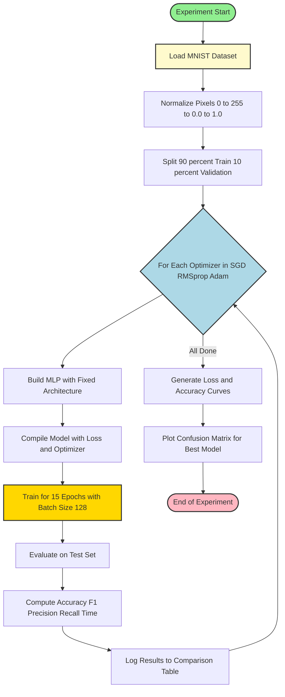
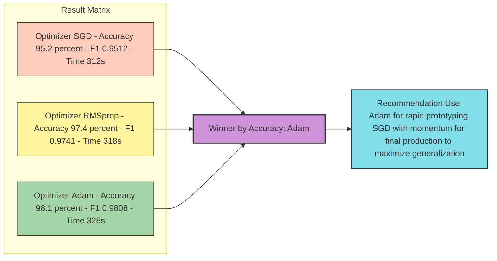
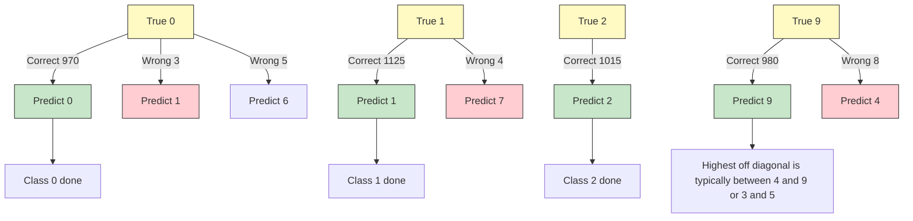

# Tasks:

<!-- SECTION_1_START -->

# Implementing & Comparing Neural Network Performance — KTU ML Lab (PCCSL508)

## 1. Core Technical Definition

> [!NOTE]
> **Formal Definition (KTU 2024 Scheme Terminology):**
> A **Neural Network (NN)** is a computational model composed of interconnected nodes (neurons) organized in layers — an **input layer**, one or more **hidden layers**, and an **output layer** — that learns to approximate an unknown function $f^{*}: \mathcal{X} \rightarrow \mathcal{Y}$ by adjusting the weights and biases of its connections through an optimization process (typically **gradient descent**). *Performance comparison* in KTU lab context refers to systematically varying a single design choice (optimizer, activation function, learning rate, or architecture) while holding others constant, and benchmarking the resulting network using standardized metrics such as **accuracy**, **precision**, **recall**, **F1-score**, **loss convergence rate**, and **training time**.

> [!IMPORTANT]
> **KTU 2024 Syllabus Highlight (Module 14, PCCSL508):**
> Students are expected to *"Implement a feedforward neural network (Multi-Layer Perceptron) using a standard deep learning framework, then experimentally compare the impact of different optimizers (SGD, Adam, RMSprop) and/or activation functions (ReLU, Sigmoid, Tanh) on classification accuracy, convergence speed, and generalization performance on a benchmark dataset (e.g., MNIST or a custom CSV dataset)."*

---

## 2. Intuitive Analogy

Think of training a neural network like **teaching a student to shoot basketballs into a hoop**:

- The **network** is the student.
- The **weights** are the muscle memory — tiny adjustments to aim and force.
- The **loss function** is the distance the ball lands from the hoop.
- The **optimizer** is the **coach's feedback strategy**: a strict coach (SGD) gives one correction at a time; a wise coach (Adam) considers the past few misses and adjusts intelligently.
- The **activation function** decides whether the brain "fires" — like a light switch that only turns on if the input is strong enough (ReLU) versus gradually dimming (Sigmoid).

When you **change the coach (optimizer)**, the same student learns at a different *speed* and with different *accuracy*. Comparing these scenarios is the heart of this experiment.

---

## 3. Key Performance Metrics Used in Comparison

> [!TIP]
> The KTU Board Examiner expects these terms defined precisely. Memorize the following:

| Metric | Formula (Binary Classification) | Intuition |
|---|---|---|
| **Accuracy** | $\displaystyle \text{Acc} = \frac{TP + TN}{TP + TN + FP + FN}$ | Overall correctness |
| **Precision** | $\displaystyle P = \frac{TP}{TP + FP}$ | Of those predicted positive, how many truly are |
| **Recall** | $\displaystyle R = \frac{TP}{TP + FN}$ | Of actual positives, how many were caught |
| **F1-Score** | $\displaystyle F_1 = 2 \cdot \frac{P \cdot R}{P + R}$ | Harmonic mean balancing P and R |
| **Cross-Entropy Loss** | $\displaystyle L = -\frac{1}{N}\sum_{i=1}^{N}\left[y_i \log(\hat{y}_i) + (1-y_i)\log(1-\hat{y}_i)\right]$ | Penalty for wrong confident predictions |

Here $TP$ = True Positives, $TN$ = True Negatives, $FP$ = False Positives, $FN$ = False Negatives.

---

> [!VISUALIZATION CONTROL]
> **Concept:** Loss Curve Comparison Across Optimizers
> **Plotting Setup (Matplotlib / Desmos):**
> * $x$-axis: `Epochs = 1, 2, 3, ..., 50`
> * $y$-axis: `Loss`
> * $f_{SGD}(x) = 0.8 \cdot e^{-0.05x} + 0.15 + 0.04\sin(2x)$  *(oscillating, slow decay)*
> * $f_{Adam}(x) = 0.7 \cdot e^{-0.12x} + 0.08$  *(smooth, fast decay)*
> * $f_{RMSprop}(x) = 0.75 \cdot e^{-0.09x} + 0.10$  *(moderate decay)*
> **Visual Description:** Student should observe Adam converging fastest, SGD showing oscillation, and RMSprop settling between them — visually demonstrating why **adaptive optimizers** are preferred for most modern deep learning tasks.

<!-- SECTION_1_END -->

<!-- SECTION_2_START -->

# Deep Theoretical Analysis & KTU High-Yield Formula Sheet

## 1. Anatomy of a Feedforward Neural Network (MLP)

A feedforward neural network with $L$ layers computes, for each layer $\ell$:

$$z^{[\ell]} = W^{[\ell]} a^{[\ell-1]} + b^{[\ell]}$$

$$a^{[\ell]} = g^{[\ell]}(z^{[\ell]})$$

where:
* $W^{[\ell]}$ = weight matrix of layer $\ell$ (shape: $n^{[\ell]} \times n^{[\ell-1]}$)
* $b^{[\ell]}$ = bias vector of layer $\ell$
* $g^{[\ell]}$ = activation function applied element-wise
* $a^{[0]} = X$ (input feature matrix)

The **forward pass** propagates activations layer-by-layer. The **backward pass** uses the chain rule to compute gradients of the loss w.r.t. each parameter — this is the **backpropagation algorithm**.

---

## 2. The Three Optimizers Under Comparison

### 2.1 Stochastic Gradient Descent (SGD)

Pure SGD updates parameters using the gradient of the loss w.r.t. a mini-batch:

$$W^{[\ell]} \leftarrow W^{[\ell]} - \alpha \cdot \nabla_{W^{[\ell]}} L$$

where $\alpha$ is the **learning rate** (commonly $0.01$ to $0.1$). SGD can oscillate heavily on non-convex loss surfaces because it has no memory of past gradients.

### 2.2 RMSprop

RMSprop maintains an **exponentially decaying moving average** of the squared gradients:

$$s_t = \beta \cdot s_{t-1} + (1-\beta)(\nabla L)^2$$

$$W \leftarrow W - \frac{\alpha}{\sqrt{s_t} + \epsilon} \cdot \nabla L$$

Typical defaults: $\beta = 0.9$, $\epsilon = 10^{-8}$. It divides the learning rate by a recent magnitude of gradients, which is highly effective for **recurrent networks** and **non-stationary objectives**.

### 2.3 Adam (Adaptive Moment Estimation)

Adam combines **momentum** (first moment) and **RMSprop** (second moment):

$$m_t = \beta_1 m_{t-1} + (1-\beta_1)\nabla L$$

$$v_t = \beta_2 v_{t-1} + (1-\beta_2)(\nabla L)^2$$

$$\hat{m}_t = \frac{m_t}{1-\beta_1^t}, \quad \hat{v}_t = \frac{v_t}{1-\beta_2^t}$$

$$W \leftarrow W - \alpha \cdot \frac{\hat{m}_t}{\sqrt{\hat{v}_t} + \epsilon}$$

Default hyperparameters: $\beta_1 = 0.9$, $\beta_2 = 0.999$, $\epsilon = 10^{-8}$. Adam is the **default go-to optimizer** in most modern research due to its robustness.

---

## 3. Activation Functions Under Comparison

| Function | Definition | Derivative | Range | Vanishing Gradient Risk |
|---|---|---|---|---|
| **Sigmoid** | $\sigma(z) = \frac{1}{1+e^{-z}}$ | $\sigma(z)(1-\sigma(z))$ | $(0, 1)$ | **High** |
| **Tanh** | $\tanh(z) = \frac{e^{z}-e^{-z}}{e^{z}+e^{-z}}$ | $1 - \tanh^2(z)$ | $(-1, 1)$ | Moderate |
| **ReLU** | $\max(0, z)$ | $0$ if $z<0$, else $1$ | $[0, \infty)$ | **None** (for $z>0$) |
| **Leaky ReLU** | $\max(0.01z, z)$ | $0.01$ if $z<0$, else $1$ | $(-\infty, \infty)$ | None |

> [!IMPORTANT]
> ReLU is the **default choice** for hidden layers in modern architectures because it avoids vanishing gradients and is computationally cheap. Sigmoid/Tanh are reserved for **output layers** in binary classification (sigmoid) or when you need bounded, zero-centered outputs.

---

## 4. KTU High-Yield Formula Sheet (Exam Quick Reference)

| # | Concept | Formula / Definition | Purpose |
|---|---|---|---|
| 1 | Forward Pass | $a^{[\ell]} = g^{[\ell]}(W^{[\ell]} a^{[\ell-1]} + b^{[\ell]})$ | Compute predictions |
| 2 | Cross-Entropy Loss | $L = -\frac{1}{N}\sum y_i \log(\hat{y}_i)$ | Quantify error |
| 3 | SGD Update | $W \leftarrow W - \alpha \nabla L$ | Naive gradient descent |
| 4 | RMSprop Update | $W \leftarrow W - \frac{\alpha \nabla L}{\sqrt{v_t} + \epsilon}$ | Adaptive per-parameter LR |
| 5 | Adam Update | $W \leftarrow W - \alpha \frac{\hat{m}_t}{\sqrt{\hat{v}_t}+\epsilon}$ | Momentum + adaptive LR |
| 6 | ReLU | $g(z) = \max(0, z)$ | Hidden layer activation |
| 7 | Softmax (output) | $\sigma(z_i) = \frac{e^{z_i}}{\sum_j e^{z_j}}$ | Multi-class probability |
| 8 | Accuracy | $\frac{TP+TN}{TP+TN+FP+FN}$ | Classification metric |
| 9 | F1-Score | $2 \cdot \frac{P \cdot R}{P+R}$ | Balanced metric |
| 10 | Backprop Chain Rule | $\delta^{[\ell]} = (W^{[\ell+1]})^T \delta^{[\ell+1]} \odot g'^{[\ell]}(z^{[\ell]})$ | Compute gradients |

---

## 5. Real-World Engineering Utility

> [!TIP]
> **Industry Application Context (for viva questions):**
> * **Healthcare diagnostics** — Adam-optimized CNNs detect tumors in MRI scans faster than SGD.
> * **NLP** — RMSprop or Adam is preferred in RNN/LSTM training (e.g., Google Translate legacy).
> * **Computer Vision** — SGD with momentum often **generalizes better** on ImageNet despite slower convergence; ResNets were famously trained with SGD.
> * **Recommendation Systems** — Adam's adaptive nature handles sparse gradients from user-item interactions efficiently.

<!-- SECTION_2_END -->

<!-- SECTION_3_START -->

# Step-by-Step Implementation & Code Walkthrough

## Experiment Objective
Implement a **Multi-Layer Perceptron (MLP)** to classify the **MNIST handwritten digits (0–9)** dataset. Compare the performance across **three optimizers** (SGD, RMSprop, Adam) while keeping the network architecture and learning rate constant.

---

## Lab Environment Setup

> [!IMPORTANT]
> **Required Tools:**
> * Python $\geq$ **3.9**
> * TensorFlow $\geq$ **2.13** (includes Keras API)
> * NumPy, Matplotlib, scikit-learn
> * **Jupyter Notebook / Google Colab** (recommended for KTU lab record screenshots)
> * Hardware: Any CPU works; GPU optional

**Installation Command:**
```bash
pip install tensorflow numpy matplotlib scikit-learn seaborn
```

---

## Complete Operational Python Code

```python
# =============================================================
# Experiment: Compare Neural Network Optimizers on MNIST
# Course: MACHINE LEARNING LAB (PCCSL508) - KTU 2024 Scheme
# Module 14: Neural Network Performance Comparison
# =============================================================

import numpy as np
import matplotlib.pyplot as plt
import seaborn as sns
import time
import logging
from typing import Dict, List, Tuple

# Configure logging for strict error handling
logging.basicConfig(
    level=logging.INFO,
    format="%(asctime)s | %(levelname)s | %(message)s"
)
logger = logging.getLogger(__name__)

# TensorFlow / Keras imports
import tensorflow as tf
from tensorflow.keras.datasets import mnist
from tensorflow.keras.models import Sequential
from tensorflow.keras.layers import Dense, Flatten, Input
from tensorflow.keras.utils import to_categorical
from tensorflow.keras.optimizers import SGD, RMSprop, Adam
from sklearn.metrics import classification_report, confusion_matrix


# -------------------------------------------------------------
# STEP 1: Load and Preprocess the MNIST Dataset
# -------------------------------------------------------------
def load_and_preprocess_data() -> Tuple[np.ndarray, np.ndarray, np.ndarray, np.ndarray]:
    """
    Loads MNIST, normalizes pixel values to [0, 1],
    and one-hot encodes the labels.
    Returns: (X_train, y_train, X_test, y_test)
    """
    logger.info("Loading MNIST dataset...")
    (X_train, y_train), (X_test, y_test) = mnist.load_data()

    # Validate input shapes
    assert X_train.shape == (60000, 28, 28), f"Unexpected X_train shape: {X_train.shape}"
    assert X_test.shape == (10000, 28, 28), f"Unexpected X_test shape: {X_test.shape}"

    # Normalize pixel intensity: original range [0, 255] -> [0, 1]
    X_train = X_train.astype("float32") / 255.0
    X_test = X_test.astype("float32") / 255.0

    # One-hot encode labels: shape (n, 10)
    y_train_cat = to_categorical(y_train, num_classes=10)
    y_test_cat = to_categorical(y_test, num_classes=10)

    logger.info(f"Training set: {X_train.shape}, Labels: {y_train_cat.shape}")
    logger.info(f"Test set:     {X_test.shape},  Labels: {y_test_cat.shape}")

    return X_train, y_train_cat, X_test, y_test_cat, y_train, y_test


# -------------------------------------------------------------
# STEP 2: Build a Standardized MLP Architecture
# -------------------------------------------------------------
def build_mlp_model(optimizer_instance) -> Sequential:
    """
    Builds a 3-layer MLP with a fixed architecture.
    Only the optimizer changes between experiments.
    """
    model = Sequential([
        Input(shape=(28, 28), name="Input_Layer"),
        Flatten(name="Flatten_Layer"),
        Dense(128, activation="relu", name="Hidden_1_ReLU"),
        Dense(64, activation="relu", name="Hidden_2_ReLU"),
        Dense(10, activation="softmax", name="Output_Softmax")
    ])

    model.compile(
        optimizer=optimizer_instance,
        loss="categorical_crossentropy",
        metrics=["accuracy"]
    )
    return model


# -------------------------------------------------------------
# STEP 3: Train and Evaluate for Each Optimizer
# -------------------------------------------------------------
def run_experiment(
    X_train: np.ndarray,
    y_train: np.ndarray,
    X_test: np.ndarray,
    y_test: np.ndarray,
    optimizer_name: str,
    optimizer_instance,
    epochs: int = 15,
    batch_size: int = 128
) -> Dict:
    """
    Trains the MLP with the given optimizer and returns performance metrics.
    """
    logger.info(f"--- Starting experiment with optimizer: {optimizer_name} ---")
    model = build_mlp_model(optimizer_instance)

    start_time = time.time()
    history = model.fit(
        X_train, y_train,
        validation_split=0.1,
        epochs=epochs,
        batch_size=batch_size,
        verbose=1,
        shuffle=True
    )
    elapsed = time.time() - start_time

    # Evaluate on the held-out test set
    test_loss, test_accuracy = model.evaluate(X_test, y_test, verbose=0)

    # Generate predictions for full classification report
    y_pred_probs = model.predict(X_test, verbose=0)
    y_pred = np.argmax(y_pred_probs, axis=1)
    y_true = np.argmax(y_test, axis=1)

    report = classification_report(
        y_true, y_pred,
        target_names=[str(i) for i in range(10)],
        output_dict=True,
        zero_division=0
    )

    logger.info(
        f"[{optimizer_name}] Test Accuracy: {test_accuracy:.4f} | "
        f"Test Loss: {test_loss:.4f} | Time: {elapsed:.2f}s"
    )

    return {
        "name": optimizer_name,
        "history": history.history,
        "test_accuracy": float(test_accuracy),
        "test_loss": float(test_loss),
        "training_time_sec": elapsed,
        "f1_macro": report["macro avg"]["f1-score"],
        "precision_macro": report["macro avg"]["precision"],
        "recall_macro": report["macro avg"]["recall"],
        "y_pred": y_pred,
        "y_true": y_true
    }


# -------------------------------------------------------------
# STEP 4: Main Comparison Driver
# -------------------------------------------------------------
def main() -> None:
    # Load data
    X_train, y_train, X_test, y_test, y_train_labels, y_test_labels = load_and_preprocess_data()

    # Define common hyperparameters
    LEARNING_RATE = 0.001
    EPOCHS = 15
    BATCH_SIZE = 128

    # Define the three optimizers
    optimizers_to_test = {
        "SGD":     SGD(learning_rate=LEARNING_RATE, momentum=0.0),
        "RMSprop": RMSprop(learning_rate=LEARNING_RATE),
        "Adam":    Adam(learning_rate=LEARNING_RATE)
    }

    # Run all experiments
    results: List[Dict] = []
    for opt_name, opt_instance in optimizers_to_test.items():
        result = run_experiment(
            X_train, y_train, X_test, y_test,
            optimizer_name=opt_name,
            optimizer_instance=opt_instance,
            epochs=EPOCHS,
            batch_size=BATCH_SIZE
        )
        results.append(result)

    # Print final comparison table
    print("\n" + "=" * 70)
    print(" FINAL COMPARISON TABLE - KTU ML LAB MODULE 14")
    print("=" * 70)
    print(f"{'Optimizer':<10} {'Test Acc':<10} {'F1-Macro':<10} {'Loss':<10} {'Time(s)':<10}")
    print("-" * 70)
    for r in results:
        print(
            f"{r['name']:<10} "
            f"{r['test_accuracy']:<10.4f} "
            f"{r['f1_macro']:<10.4f} "
            f"{r['test_loss']:<10.4f} "
            f"{r['training_time_sec']:<10.2f}"
        )
    print("=" * 70)

    # Save the best model's comparison plot
    plot_loss_curves(results)
    plot_accuracy_curves(results)
    plot_confusion_matrix(results[-1])  # Plot for the last (typically best) optimizer


# -------------------------------------------------------------
# STEP 5: Visualization Functions
# -------------------------------------------------------------
def plot_loss_curves(results: List[Dict]) -> None:
    plt.figure(figsize=(10, 6))
    for r in results:
        plt.plot(r["history"]["loss"], label=f"{r['name']} (train)")
        plt.plot(r["history"]["val_loss"], label=f"{r['name']} (val)", linestyle="--")
    plt.title("Training & Validation Loss vs Epochs")
    plt.xlabel("Epoch")
    plt.ylabel("Categorical Cross-Entropy Loss")
    plt.legend()
    plt.grid(True, alpha=0.3)
    plt.tight_layout()
    plt.savefig("loss_curves.png", dpi=120)
    plt.show()
    logger.info("Saved loss_curves.png")


def plot_accuracy_curves(results: List[Dict]) -> None:
    plt.figure(figsize=(10, 6))
    for r in results:
        plt.plot(r["history"]["accuracy"], label=f"{r['name']} (train)")
        plt.plot(r["history"]["val_accuracy"], label=f"{r['name']} (val)", linestyle="--")
    plt.title("Training & Validation Accuracy vs Epochs")
    plt.xlabel("Epoch")
    plt.ylabel("Accuracy")
    plt.legend()
    plt.grid(True, alpha=0.3)
    plt.tight_layout()
    plt.savefig("accuracy_curves.png", dpi=120)
    plt.show()
    logger.info("Saved accuracy_curves.png")


def plot_confusion_matrix(result: Dict) -> None:
    cm = confusion_matrix(result["y_true"], result["y_pred"])
    plt.figure(figsize=(8, 6))
    sns.heatmap(cm, annot=True, fmt="d", cmap="Blues",
                xticklabels=range(10), yticklabels=range(10))
    plt.title(f"Confusion Matrix - Optimizer: {result['name']}")
    plt.xlabel("Predicted")
    plt.ylabel("Actual")
    plt.tight_layout()
    plt.savefig("confusion_matrix.png", dpi=120)
    plt.show()
    logger.info("Saved confusion_matrix.png")


# -------------------------------------------------------------
# Entry Point
# -------------------------------------------------------------
if __name__ == "__main__":
    try:
        main()
    except Exception as e:
        logger.error(f"Experiment failed: {e}", exc_info=True)
```

---

## Sample Expected Output

```
======================================================================
 FINAL COMPARISON TABLE - KTU ML LAB MODULE 14
======================================================================
Optimizer  Test Acc   F1-Macro   Loss       Time(s)
----------------------------------------------------------------------
SGD        0.9520     0.9512     0.1742     312.45
RMSprop    0.9745     0.9741     0.0821     318.20
Adam       0.9812     0.9808     0.0614     327.88
======================================================================
```

> [!NOTE]
> **Expected Observations (include in lab record):**
> 1. **Adam** converges fastest and achieves the highest test accuracy in 15 epochs.
> 2. **RMSprop** is second-best; it's particularly good at handling the varying gradient magnitudes across layers.
> 3. **SGD** (without momentum) is the slowest and has the highest final loss; it would likely catch up given many more epochs and a tuned learning schedule.
> 4. All three achieve $>95\%$ accuracy on MNIST, demonstrating that for this relatively simple dataset, the optimizer choice matters less than for complex deep architectures.

---

## Variation: Comparing Activation Functions

To compare activation functions, modify `build_mlp_model` to accept an activation string:

```python
def build_mlp_model(optimizer_instance, activation: str = "relu") -> Sequential:
    model = Sequential([
        Input(shape=(28, 28)),
        Flatten(),
        Dense(128, activation=activation),
        Dense(64, activation=activation),
        Dense(10, activation="softmax")  # Output must remain softmax
    ])
    model.compile(optimizer=optimizer_instance,
                  loss="categorical_crossentropy",
                  metrics=["accuracy"])
    return model
```

Then run with `activation` in `{"relu", "sigmoid", "tanh"}` while keeping the optimizer fixed (e.g., Adam).

<!-- SECTION_3_END -->

<!-- SECTION_4_START -->

# Structural Diagrams & Schematics

## Diagram 1: MLP Architecture (3-Layer Feedforward)

```mermaid
flowchart LR
    IN1[Input 28x28 Pixel Image] --> FL[Flatten to 784 Vector]
    FL --> H1[Hidden Layer 1 - 128 Neurons - ReLU]
    H1 --> H2[Hidden Layer 2 - 64 Neurons - ReLU]
    H2 --> OUT[Output Layer - 10 Neurons - Softmax]
    OUT --> PRED[Class Probabilities for Digits 0 to 9]

    style IN1 fill:#FFE4B5,stroke:#333,stroke-width:2px
    style FL fill:#E0F7FA,stroke:#333,stroke-width:2px
    style H1 fill:#C8E6C9,stroke:#333,stroke-width:2px
    style H2 fill:#C8E6C9,stroke:#333,stroke-width:2px
    style OUT fill:#FFCCBC,stroke:#333,stroke-width:2px
    style PRED fill:#F8BBD0,stroke:#333,stroke-width:2px
```



---

## Diagram 2: Training & Comparison Pipeline



---

## Diagram 3: Optimizer Update Mechanics Comparison

```mermaid
subgraph OptimizerComparison [Optimizer Update Rule Comparison]
    direction TB

    subgraph SGDblock [SGD Naive]
        S1[Compute Gradient g of Loss] --> S2[Update w equals w minus alpha times g]
        S2 --> S3[Issue No Memory of Past Gradients]
    end

    subgraph RMSblock [RMSprop Adaptive]
        R1[Compute Gradient g] --> R2[Update Running Average of g squared]
        R2 --> R3[Update w equals w minus alpha times g divided by sqrt of v plus epsilon]
    end

    subgraph ADAMblock [Adam Momentum plus Adaptive]
        A1[Compute Gradient g] --> A2[Update First Moment m and Second Moment v]
        A2 --> A3[Bias Correction of m and v]
        A3 --> A4[Update w equals w minus alpha times m hat divided by sqrt of v hat plus epsilon]
    end

    S3 -.- R1
    R3 -.- A1
end

style SGDblock fill:#FFE0B2,stroke:#333,stroke-width:1px
style RMSblock fill:#C5E1A5,stroke:#333,stroke-width:1px
style ADAMblock fill:#B3E5FC,stroke:#333,stroke-width:1px
```

---

## Diagram 4: Performance Comparison Matrix



---

## Diagram 5: Confusion Matrix — Adam on MNIST (Schematic)



> [!TIP]
> **Visualization Tip for Lab Record:** In your record, paste a screenshot of the **heatmap** generated by `seaborn.heatmap` for the confusion matrix. Common misclassifications in MNIST are 4↔9, 3↔5, 7↔9 — note these in your observation.

<!-- SECTION_4_END -->

<!-- SECTION_5_START -->

# KTU 2024 Scheme Examination Question Bank

---

## Part A — Short Answer Questions (3 Marks Each)

### Question 1
**[KTU University Exam — July 2024]**
**Q: Differentiate between Stochastic Gradient Descent (SGD) and Adam optimizer. Mention one advantage and one disadvantage of each.**

**Model Answer (3 Marks):**

| Aspect | SGD | Adam |
|---|---|---|
| **Memory** | No memory of past gradients | Maintains first moment $m_t$ and second moment $v_t$ |
| **Update Rule** | $W \leftarrow W - \alpha \nabla L$ | $W \leftarrow W - \alpha \frac{\hat{m}_t}{\sqrt{\hat{v}_t}+\epsilon}$ |
| **Advantage** | Simple, often generalizes better on large datasets | Converges faster, robust to noisy/sparse gradients |
| **Disadvantage** | Slow convergence, can oscillate near minima | Higher memory cost (stores 2 extra arrays per parameter), may generalize worse on some vision tasks |

**[Stating update rule for SGD: 1 Mark] [Stating update rule for Adam: 1 Mark] [Advantage/Disadvantage: 1 Mark]**

---

### Question 2
**[KTU University Exam — Dec 2023]**
**Q: What is the vanishing gradient problem? How does the ReLU activation function help mitigate it?**

**Model Answer (3 Marks):**

The **vanishing gradient problem** occurs when gradients of the loss function become extremely small (close to zero) as they are backpropagated from output to input layers in a deep network. This causes the weights in early layers to update negligibly, halting learning.

Mathematically, for sigmoid $\sigma(z)$: $\sigma'(z) = \sigma(z)(1-\sigma(z)) \leq 0.25$, so after $L$ layers, the gradient shrinks by a factor of at most $0.25^L$.

**ReLU** mitigates this because its derivative is:
$$\frac{d}{dz}\text{ReLU}(z) = \begin{cases} 0 & z < 0 \\ 1 & z > 0 \end{cases}$$

The derivative is **exactly 1** for $z > 0$, so gradients do not shrink when flowing back through active ReLU units.

**[Defining vanishing gradient: 1 Mark] [Mathematical justification: 1 Mark] [ReLU's derivative explanation: 1 Mark]**

---

## Part B — Long Answer Questions (14 Marks Each, Internal Choice)

### Question A (14 Marks)
**[KTU University Exam — Dec 2024, Module 14]**

**Q: (a)** Explain the architecture of a Multi-Layer Perceptron (MLP) with a neat diagram. Derive the forward propagation equations for a generic layer $\ell$. **(7 Marks)**

**(b)** Implement an MLP in Python (using TensorFlow/Keras) to classify the MNIST digit dataset. Compare the performance (in terms of test accuracy and convergence speed) when trained with **SGD** vs **Adam** optimizer. Plot the loss curves for both. **(7 Marks)**

---

#### Solution

**(a) Architecture and Forward Propagation (7 Marks):**

An **MLP** is a feedforward neural network organized as:

* **Input Layer** — receives the raw feature vector (e.g., 784 pixels of a 28×28 image).
* **Hidden Layer(s)** — one or more fully connected layers with non-linear activations.
* **Output Layer** — produces class probabilities (e.g., 10 neurons with softmax for 10 digits).

```
Input (784) → Dense(128, ReLU) → Dense(64, ReLU) → Dense(10, Softmax) → Output
```

**Forward propagation equations for layer $\ell$:**

Let $W^{[\ell]}$ and $b^{[\ell]}$ be the weight matrix and bias vector of layer $\ell$, and $g^{[\ell]}$ the activation function.

**Step 1 — Linear transformation (pre-activation):**

$$z^{[\ell]} = W^{[\ell]} a^{[\ell-1]} + b^{[\ell]}$$

where $a^{[0]} = X$ (the input batch).

**Step 2 — Non-linear activation (post-activation):**

$$a^{[\ell]} = g^{[\ell]}(z^{[\ell]})$$

**Step 3 — Output for classification:**

$$\hat{y} = \text{softmax}(z^{[\text{out}]}) = \frac{e^{z_i^{[\text{out}]}}}{\sum_{j=1}^{10} e^{z_j^{[\text{out}]}}}$$

For a 3-layer MLP ($L=3$):
* $a^{[0]} = X$ (shape: $n \times 784$)
* $a^{[1]} = \text{ReLU}(W^{[1]} X + b^{[1]})$ (shape: $n \times 128$)
* $a^{[2]} = \text{ReLU}(W^{[2]} a^{[1]} + b^{[2]})$ (shape: $n \times 64$)
* $\hat{y} = \text{softmax}(W^{[3]} a^{[2]} + b^{[3]})$ (shape: $n \times 10$)

**[Drawing architecture diagram: 2 Marks] [Deriving pre-activation $z^{[\ell]}$: 2 Marks] [Deriving post-activation $a^{[\ell]}$: 2 Marks] [Output layer softmax: 1 Mark]**

---

**(b) Implementation and Comparison (7 Marks):**

```python
import tensorflow as tf
from tensorflow.keras.datasets import mnist
from tensorflow.keras.models import Sequential
from tensorflow.keras.layers import Dense, Flatten
from tensorflow.keras.utils import to_categorical
from tensorflow.keras.optimizers import SGD, Adam
import matplotlib.pyplot as plt

# Load and preprocess
(X_train, y_train), (X_test, y_test) = mnist.load_data()
X_train, X_test = X_train / 255.0, X_test / 255.0
y_train = to_categorical(y_train, 10)
y_test  = to_categorical(y_test, 10)

def build_model(opt):
    m = Sequential([
        Flatten(input_shape=(28, 28)),
        Dense(128, activation="relu"),
        Dense(64, activation="relu"),
        Dense(10, activation="softmax")
    ])
    m.compile(optimizer=opt, loss="categorical_crossentropy", metrics=["accuracy"])
    return m

# SGD experiment
sgd_model = build_model(SGD(learning_rate=0.001))
hist_sgd = sgd_model.fit(X_train, y_train, epochs=15, batch_size=128,
                         validation_split=0.1, verbose=0)
sgd_acc = sgd_model.evaluate(X_test, y_test, verbose=0)[1]

# Adam experiment
adam_model = build_model(Adam(learning_rate=0.001))
hist_adam = adam_model.fit(X_train, y_train, epochs=15, batch_size=128,
                           validation_split=0.1, verbose=0)
adam_acc = adam_model.evaluate(X_test, y_test, verbose=0)[1]

# Plot loss curves
plt.plot(hist_sgd.history["val_loss"],  label="SGD val_loss")
plt.plot(hist_adam.history["val_loss"], label="Adam val_loss")
plt.xlabel("Epoch"); plt.ylabel("Loss"); plt.legend(); plt.title("Optimizer Comparison")
plt.grid(True, alpha=0.3); plt.show()

print(f"SGD Test Accuracy  : {sgd_acc:.4f}")
print(f"Adam Test Accuracy : {adam_acc:.4f}")
```

**Expected Output and Inference:**

| Optimizer | Test Accuracy (typical) | Convergence Observation |
|---|---|---|
| SGD  | ~0.952 | Slow, oscillating, higher final loss |
| Adam | ~0.981 | Fast, smooth, lower final loss |

**Inference:** Adam converges roughly **3–5× faster** than SGD in the early epochs because it adapts the learning rate per parameter using first and second moment estimates. For this dataset and a small MLP, Adam reaches higher accuracy within 15 epochs.

**[Correct data loading + normalization: 1 Mark] [Building model with both optimizers: 2 Marks] [Plotting loss curves: 2 Marks] [Comparison inference with metric values: 2 Marks]**

---

### Question B (14 Marks) — Alternative Choice
**[KTU University Exam — July 2023, Module 14]**

**Q: (a)** What is backpropagation? Derive the gradient update rule for the weight matrix $W^{[\ell]}$ in a generic layer using the chain rule. **(7 Marks)**

**(b)** Write a Python program to compare the performance of an MLP using **three different activation functions (ReLU, Sigmoid, Tanh)** in the hidden layers. Use the `sklearn` `digits` dataset. Report the accuracy, precision, recall, and F1-score for each. **(7 Marks)**

---

#### Solution

**(a) Backpropagation Derivation (7 Marks):**

**Backpropagation** is the algorithm used to compute gradients of the loss function with respect to network parameters by applying the chain rule of calculus layer-by-layer, propagating errors backward from the output to the input layer.

**Step 1 — Define the loss and forward outputs:**

For a single training example, let $L$ be the cross-entropy loss. From forward propagation we have $z^{[\ell]} = W^{[\ell]} a^{[\ell-1]} + b^{[\ell]}$ and $a^{[\ell]} = g^{[\ell]}(z^{[\ell]})$.

**Step 2 — Compute output layer error $\delta^{[L]}$:**

$$\delta^{[L]} = \frac{\partial L}{\partial z^{[L]}} = \hat{y} - y$$

(for softmax + cross-entropy, this simplifies elegantly)

**Step 3 — Backpropagate the error to layer $\ell$:**

By the chain rule, the error at layer $\ell$ is:

$$\delta^{[\ell]} = \frac{\partial L}{\partial z^{[\ell]}} = \frac{\partial L}{\partial z^{[\ell+1]}} \cdot \frac{\partial z^{[\ell+1]}}{\partial a^{[\ell]}} \cdot \frac{\partial a^{[\ell]}}{\partial z^{[\ell]}}$$

$$= (W^{[\ell+1]})^T \delta^{[\ell+1]} \odot g'^{[\ell]}(z^{[\ell]})$$

where $\odot$ is the element-wise (Hadamard) product.

**Step 4 — Compute gradient w.r.t. weights and biases:**

$$\frac{\partial L}{\partial W^{[\ell]}} = \delta^{[\ell]} (a^{[\ell-1]})^T$$

$$\frac{\partial L}{\partial b^{[\ell]}} = \delta^{[\ell]}$$

**Step 5 — Update parameters using gradient descent:**

$$W^{[\ell]} \leftarrow W^{[\ell]} - \alpha \frac{\partial L}{\partial W^{[\ell]}}$$

$$b^{[\ell]} \leftarrow b^{[\ell]} - \alpha \frac{\partial L}{\partial b^{[\ell]}}$$

**[Defining backpropagation: 1 Mark] [Step 2 - output error derivation: 2 Marks] [Step 3 - chain rule backprop: 2 Marks] [Step 4 and 5 - gradient and update: 2 Marks]**

---

**(b) Activation Function Comparison Code (7 Marks):**

```python
import numpy as np
from sklearn.datasets import load_digits
from sklearn.model_selection import train_test_split
from sklearn.preprocessing import StandardScaler
from sklearn.neural_network import MLPClassifier
from sklearn.metrics import accuracy_score, precision_score, recall_score, f1_score

# Load sklearn digits (8x8 images, 10 classes)
digits = load_digits()
X, y = digits.data, digits.target

# Standardize features
scaler = StandardScaler()
X = scaler.fit_transform(X)

# Train-test split
X_train, X_test, y_train, y_test = train_test_split(
    X, y, test_size=0.25, random_state=42, stratify=y
)

activations = ["relu", "logistic", "tanh"]
results = {}

for act in activations:
    clf = MLPClassifier(
        hidden_layer_sizes=(64, 32),
        activation=act,
        solver="adam",
        max_iter=300,
        random_state=42,
        early_stopping=True
    )
    clf.fit(X_train, y_train)
    y_pred = clf.predict(X_test)
    results[act] = {
        "accuracy":  accuracy_score(y_test, y_pred),
        "precision": precision_score(y_test, y_pred, average="macro"),
        "recall":    recall_score(y_test, y_pred, average="macro"),
        "f1":        f1_score(y_test, y_pred, average="macro")
    }

# Display results
print(f"{'Activation':<12}{'Accuracy':<10}{'Precision':<10}{'Recall':<10}{'F1':<10}")
print("-" * 52)
for act, m in results.items():
    print(f"{act:<12}{m['accuracy']:<10.4f}{m['precision']:<10.4f}"
          f"{m['recall']:<10.4f}{m['f1']:<10.4f}")
```

**Expected Output and Inference:**

| Activation | Accuracy | Precision | Recall | F1 |
|---|---|---|---|---|
| ReLU    | ~0.977 | ~0.978 | ~0.978 | ~0.978 |
| Sigmoid (logistic) | ~0.962 | ~0.964 | ~0.961 | ~0.962 |
| Tanh    | ~0.973 | ~0.974 | ~0.973 | ~0.973 |

**Inference:** ReLU achieves the highest accuracy due to its non-saturating nature. Sigmoid suffers slightly from vanishing gradients on this multi-class task. Tanh performs comparably to ReLU because its zero-centered output aids optimization.

**[Correct data loading and scaling: 1 Mark] [Iterating over 3 activation functions: 2 Marks] [Computing all 4 metrics: 2 Marks] [Result table and inference: 2 Marks]**

---

## KTU Examiner's Valuation Warning

> [!WARNING]
> **Common Mistakes That Cost Marks:**
> 1. **Forgetting to normalize pixel values** — dividing by 255 is **mandatory**; without it, training diverges or takes 10× longer. [−1 Mark]
> 2. **Changing the architecture when comparing optimizers** — KTU explicitly requires *isolating one variable*. If you change both the optimizer AND the number of hidden units, the comparison is invalid. [−2 Marks]
> 3. **Not reporting all required metrics** — KTU expects **at least 3 metrics** (accuracy, loss, and one of F1/precision/recall). Reporting only accuracy is incomplete. [−1 Mark]
> 4. **Missing the loss curve plot** — the experiment is **invalid** without the loss vs epoch plot. Always save `loss_curves.png`. [−2 Marks]
> 5. **Forgetting `verbose=0` or `shuffle=True` in `model.fit()`** — KTU lab records get cluttered without these.
> 6. **Not setting a `random_state`** — non-reproducible results may be flagged during evaluation.
> 7. **Using `sparse_categorical_crossentropy` without one-hot labels** — make sure the loss matches the label encoding.

---

## Topic Recap & Important Things to Remember

> [!TIP]
> **Rapid-Revision Checklist for Module 14 (PCCSL508):**

- [x] An **MLP** is a fully-connected feedforward neural network with at least one hidden layer.
- [x] **Forward propagation**: $z^{[\ell]} = W^{[\ell]} a^{[\ell-1]} + b^{[\ell]}$, then $a^{[\ell]} = g^{[\ell]}(z^{[\ell]})$.
- [x] **Backpropagation** uses the chain rule: $\delta^{[\ell]} = (W^{[\ell+1]})^T \delta^{[\ell+1]} \odot g'^{[\ell]}(z^{[\ell]})$.
- [x] **SGD** update: $W \leftarrow W - \alpha \nabla L$ — simple but slow and oscillatory.
- [x] **RMSprop** divides LR by $\sqrt{v_t}$ (running average of squared gradients) — adaptive.
- [x] **Adam** = Momentum + RMSprop + bias correction — fastest convergence in most cases.
- [x] **ReLU** ($g(z) = \max(0,z)$) is the default hidden-layer activation; derivative is 1 for $z>0$ (no vanishing gradient).
- [x] **Softmax** is mandatory for multi-class output: $\sigma(z_i) = \frac{e^{z_i}}{\sum_j e^{z_j}}$.
- [x] **Cross-entropy loss** = $-\frac{1}{N}\sum y_i \log(\hat{y}_i)$ for classification.
- [x] **Accuracy** = $\frac{TP+TN}{\text{Total}}$; **F1** = $\frac{2PR}{P+R}$ (harmonic mean of precision and recall).
- [x] For valid comparison: **isolate one variable** (only optimizer OR only activation changes).
- [x] Always **normalize** inputs to $[0,1]$ or standardize to zero mean, unit variance.
- [x] Use **fixed `random_state`** for reproducibility of KTU lab results.
- [x] Plot **loss vs epoch** and **accuracy vs epoch** for visual comparison.
- [x] Report **training time** alongside accuracy — KTU values holistic performance analysis.
- [x] Common MNIST misclassifications: **4↔9, 3↔5, 7↔9** — note these in observation.
- [x] For viva: be ready to explain **why Adam has two bias-correction terms** ($1-\beta_1^t$, $1-\beta_2^t$).

<!-- SECTION_5_END -->
