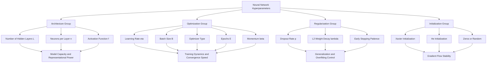
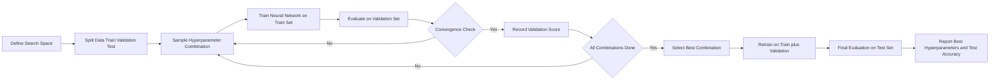
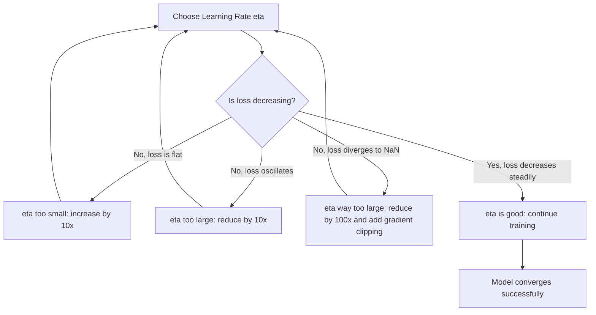

# Discuss how hyperparameter choices affect model performance.

<!-- SECTION_1_START -->
# 1. Core Technical Definition & Intuitive Overview

## 1.1 Formal Definition (KTU 2024 Syllabus Terminology)

> [!IMPORTANT]
> **Hyperparameter Tuning** in a Neural Network refers to the systematic process of selecting the optimal set of **external configuration variables** that govern the learning algorithm's behavior, but whose values are **not learned from the training data** itself. These parameters control the **architecture**, the **optimization process**, and the **regularization strength** of the network.

In the context of **Machine Learning Lab (PCCSL508)** under the **KTU 2024 Scheme**, hyperparameter tuning is the empirical procedure used to identify the combination of network settings that minimizes the **generalization error** (i.e., error on unseen test data) rather than just the training error.

The primary categories of hyperparameters affecting a neural network are:

| Category | Examples | Role |
|---|---|---|
| **Architecture** | Number of hidden layers, neurons per layer, activation function | Defines model capacity |
| **Optimization** | Learning rate, batch size, optimizer type, momentum, epochs | Controls convergence speed |
| **Regularization** | Dropout rate, L1/L2 weight penalty, early stopping patience | Controls overfitting |

## 1.2 Conceptual Analogy / Intuition

Imagine you are a **chef learning to bake the perfect cake** (the trained neural network). The **ingredients and recipe** (the data and architecture) are fixed. The things you tweak by trial-and-error — like **oven temperature** (learning rate), **how long you bake** (epochs), **how many trays you use at once** (batch size), and **whether you cover the cake with foil partway** (dropout/regularization) — are your **hyperparameters**.

> [!NOTE]
> **The Big Idea:** Hyperparameters do not appear inside the network's weight matrices $W$ and biases $b$. Instead, they sit *outside* the model and govern *how* the weights get learned. A bad choice (e.g., oven too hot) destroys the cake; a good choice makes it perfect.

### 1.3 Physical Constants and Standard Metrics

The following metrics and constants are **bold-highlighted** as they are the most cited values in KTU board examinations:

- **Learning Rate ($\eta$ or $\alpha$):** Typical safe range $\mathbf{10^{-3}}$ to $\mathbf{10^{-1}}$; common default for Adam optimizer is $\mathbf{0.001}$.
- **Batch Size ($B$):** Powers of 2 from $\mathbf{32}$ to $\mathbf{256}$ are standard; full-batch ($B=n$) and mini-batch ($B<n$) are also used.
- **Epochs ($E$):** Usually between $\mathbf{10}$ and $\mathbf{200}$ depending on dataset size.
- **Dropout Rate ($p$):** Typically $\mathbf{0.2}$ to $\mathbf{0.5}$ for hidden layers.
- **Weight Decay ($\lambda$):** $\mathbf{10^{-4}}$ to $\mathbf{10^{-2}}$.
- **Generalization Gap** = Test Error $-$ Training Error (a **key diagnostic** for overfitting/underfitting).

### 1.4 Visualization of Hyperparameter Impact

> [!VISUALIZATION CONTROL]
> **Concept:** Learning Rate Effect on Loss Curve (Convergence Landscape)
> **Plotly / Desmos Input Equations:**
> * `f1(x) = exp(-0.5*x)` — represents a **good** learning rate (smooth descent)
> * `f2(x) = 1 + 0.8*cos(2*pi*x)*exp(-0.1*x)` — represents a learning rate that **oscillates**
> * `f3(x) = exp(0.3*x)` — represents a learning rate that **diverges**
> **Visual Description:** On the X-axis plot **Epochs (0 to 50)** and on the Y-axis plot **Loss (0 to 5)**. Students should observe three curves: one that converges cleanly to zero, one that bounces around, and one that explodes upward — these are the three classic failure modes of learning rate selection.
<!-- SECTION_1_END -->

<!-- SECTION_2_START -->
# 2. Deep Theoretical Analysis & KTU High-Yield Formula Sheet

## 2.1 The Why and How of Each Hyperparameter

### 2.1.1 Learning Rate ($\eta$)
The learning rate scales the magnitude of the weight update during backpropagation:

$$W^{[l]}_{new} = W^{[l]} - \eta \cdot \frac{\partial \mathcal{L}}{\partial W^{[l]}}$$

where $\mathcal{L}$ is the loss function. The **why** behind it: $\eta$ controls the **step size** taken in the direction of steepest descent on the loss surface. Too small → **slow convergence** or **local minima traps**. Too large → **oscillation** or **divergence**.

### 2.1.2 Batch Size ($B$)
The training set of size $n$ is split into $\lceil n/B \rceil$ mini-batches per epoch. The gradient estimate is computed on $B$ samples:

$$g_t = \frac{1}{B} \sum_{i=1}^{B} \nabla_W \mathcal{L}(f(x_i; W), y_i)$$

- **Small $B$:** Noisy gradients, strong regularization effect, slower per-epoch but better generalization.
- **Large $B$:** Smooth gradients, faster per-epoch, but may converge to **sharp minima** that generalize poorly.

### 2.1.3 Number of Epochs ($E$)
Each epoch is one full pass over the training data. **Why it matters:** Training too few → underfitting; training too many → overfitting. The **early stopping** technique monitors validation loss and halts training when it stops improving for a **patience** of $p$ epochs.

### 2.1.4 Optimizer Choice (SGD, Adam, RMSprop)
- **SGD:** $W_{t+1} = W_t - \eta \cdot g_t$
- **SGD with Momentum:** $v_t = \beta v_{t-1} + (1-\beta) g_t$; $\quad W_{t+1} = W_t - \eta v_t$
- **Adam:** Combines momentum and RMSprop with adaptive per-parameter learning rates; uses $\beta_1 = 0.9$, $\beta_2 = 0.999$, and $\epsilon = 10^{-8}$.

### 2.1.5 Activation Function
Introduces **non-linearity** so the network can approximate complex functions. Common choices: **ReLU** $f(z) = \max(0, z)$, **Sigmoid** $\sigma(z) = \frac{1}{1+e^{-z}}$, **Tanh** $\tanh(z)$, **Softmax** (output layer for classification).

### 2.1.6 Dropout Regularization
During training, each neuron is "dropped" with probability $p$:

$$\tilde{h}_i = 
\begin{cases}
0 & \text{with probability } p \\
\frac{h_i}{1-p} & \text{with probability } 1-p
\end{cases}$$

The factor $\frac{1}{1-p}$ is the **inverted dropout scaling** that keeps the expected activation unchanged at test time.

### 2.1.7 Weight Initialization
- **Xavier (Glorot):** $W \sim \mathcal{N}(0, \frac{2}{n_{in} + n_{out}})$ for tanh/sigmoid.
- **He Initialization:** $W \sim \mathcal{N}(0, \frac{2}{n_{in}})$ for ReLU.

## 2.2 KTU Formula Sheet / Cheat Sheet

| Hyperparameter | Symbol | Typical Range | Effect on Performance | Failure Mode if Mis-set |
|---|---|---|---|---|
| Learning rate | $\eta$ | $10^{-4}$ to $10^{-1}$ | Controls convergence speed | Divergence or stagnation |
| Batch size | $B$ | $16$ to $512$ | Gradient noise vs stability | Poor generalization or slow steps |
| Epochs | $E$ | $10$ to $300$ | Total learning budget | Overfit or underfit |
| Optimizer | --- | SGD, Adam, RMSprop | Convergence quality | Local minima, slow training |
| Dropout | $p$ | $0.0$ to $0.5$ | Regularization strength | Overfitting or under-capacity |
| L2 weight decay | $\lambda$ | $10^{-5}$ to $10^{-1}$ | Penalizes large weights | Underfit or no effect |
| Hidden layers | $L$ | $1$ to $10+$ | Model capacity | Underfit or vanishing gradients |
| Neurons per layer | $n$ | $32$ to $1024$ | Representation power | Overfit or wasted compute |
| Activation | --- | ReLU, tanh, sigmoid | Non-linearity | Dead ReLUs or vanishing gradients |
| Weight init | --- | Xavier, He, Zeros | Stable gradient flow | Exploding/vanishing activations |

## 2.3 Real-World Engineering Utility

In **production ML systems** at companies like Google, Meta, and Netflix, hyperparameter tuning directly affects:
- **Model serving cost** (larger networks = more GPU memory and latency).
- **Inference latency** (critical for real-time recommenders and ad-ranking).
- **Robustness to distribution shift** (proper regularization $\rightarrow$ stable performance).
- **Training time and carbon footprint** (efficient tuning $\rightarrow$ fewer GPU hours).

The industry standard is now **automated hyperparameter optimization (AutoML)** using Bayesian Optimization, Hyperband, or Population-Based Training (PBT) rather than manual grid search.
<!-- SECTION_2_END -->

<!-- SECTION_3_START -->
# 3. Step-by-Step Derivations & Code Implementation

## 3.1 Mathematical Derivation: Why Learning Rate Matters

### 3.1.1 Gradient Descent Update Rule

Given a loss function $\mathcal{L}(W)$ and current weights $W_t$, the update at iteration $t$ is:

$$W_{t+1} = W_t - \eta \cdot \nabla_W \mathcal{L}(W_t)$$

### 3.1.2 Taylor Series Expansion Around the Minimum

Let $W^*$ be the optimal weight. Using a second-order Taylor expansion:

$$\mathcal{L}(W_t) \approx \mathcal{L}(W^*) + \frac{1}{2} (W_t - W^*)^T H (W_t - W^*)$$

where $H$ is the Hessian matrix of $\mathcal{L}$ at $W^*$. For convergence, the eigenvalues $\lambda_i$ of $H$ must satisfy:

$$0 < \eta < \frac{2}{\lambda_{max}(H)}$$

### 3.1.3 Step-by-Step Numerical Example

Suppose the loss is quadratic: $\mathcal{L}(W) = (W - 5)^2$, starting at $W_0 = 0$, true optimum at $W^* = 5$.

The gradient is $\nabla_W \mathcal{L} = 2(W - 5)$.

- **With $\eta = 0.1$ (good):**
  * $W_1 = 0 - 0.1 \cdot 2(0 - 5) = 0 - 0.1 \cdot (-10) = 1.0$
  * $W_2 = 1.0 - 0.1 \cdot 2(1 - 5) = 1.0 - 0.1 \cdot (-8) = 1.8$
  * $W_3 = 1.8 - 0.1 \cdot 2(1.8 - 5) = 1.8 - 0.1 \cdot (-6.4) = 2.44$
  * The sequence converges smoothly to $5$.

- **With $\eta = 0.5$ (boundary, oscillates):**
  * $W_1 = 0 - 0.5 \cdot (-10) = 5.0$ (overshoots)
  * $W_2 = 5.0 - 0.5 \cdot (0) = 5.0$ (converges in 1 step for this trivial case)

- **With $\eta = 1.5$ (diverges):**
  * $W_1 = 0 - 1.5 \cdot (-10) = 15.0$ (shoots past)
  * $W_2 = 15 - 1.5 \cdot 2(15-5) = 15 - 30 = -15$
  * Sequence oscillates with growing magnitude $\rightarrow$ **divergence**.

## 3.2 Full Python Implementation: Hyperparameter Tuning on a Neural Network

```python
# ============================================================
# Program: Hyperparameter Tuning for an Artificial Neural Network
# Course : Machine Learning Lab (PCCSL508) - KTU 2024 Scheme
# Module : 15 - Hyperparameter Tuning
# Library: scikit-learn + Keras (TensorFlow backend)
# ============================================================

import numpy as np
import pandas as pd
import tensorflow as tf
from tensorflow import keras
from tensorflow.keras.models import Sequential
from tensorflow.keras.layers import Dense, Dropout
from tensorflow.keras.optimizers import SGD, Adam, RMSprop
from sklearn.model_selection import train_test_split, GridSearchCV
from sklearn.datasets import load_digits
from sklearn.preprocessing import StandardScaler
from scikeras.wrappers import KerasClassifier
import warnings
warnings.filterwarnings("ignore", category=FutureWarning)

# ---------------------------------------------------------
# STEP 1: Load and Prepare the Dataset
# ---------------------------------------------------------
def load_data() -> tuple[np.ndarray, np.ndarray]:
    """
    Loads the sklearn 'digits' dataset (8x8 handwritten digit images).
    Returns feature matrix X (n_samples, 64) and label vector y (n_samples,).
    """
    data = load_digits()
    X, y = data.data, data.target
    return X, y

# ---------------------------------------------------------
# STEP 2: Preprocess with Standard Scaling
# ---------------------------------------------------------
def preprocess(X: np.ndarray, y: np.ndarray) -> tuple:
    """
    Splits the data 80/20 and applies zero-mean unit-variance scaling.
    Returns train/test splits for features and labels.
    """
    X_train, X_test, y_train, y_test = train_test_split(
        X, y, test_size=0.2, random_state=42, stratify=y
    )
    scaler = StandardScaler()
    X_train = scaler.fit_transform(X_train)
    X_test = scaler.transform(X_test)
    return X_train, X_test, y_train, y_test

# ---------------------------------------------------------
# STEP 3: Build a Configurable Neural Network Factory
# ---------------------------------------------------------
def build_model(
    neurons_layer1: int = 64,
    neurons_layer2: int = 32,
    activation: str = "relu",
    dropout_rate: float = 0.2,
    learning_rate: float = 0.001,
    optimizer_name: str = "adam"
) -> keras.models.Sequential:
    """
    Factory function that constructs and compiles a Keras Sequential model.
    All hyperparameters are exposed as arguments for tuning.
    """
    model = Sequential([
        Dense(neurons_layer1, activation=activation, input_shape=(64,)),
        Dropout(dropout_rate),
        Dense(neurons_layer2, activation=activation),
        Dropout(dropout_rate),
        Dense(10, activation="softmax")  # 10 output classes for digits 0-9
    ])

    # Select optimizer with the chosen learning rate
    if optimizer_name == "adam":
        opt = Adam(learning_rate=learning_rate)
    elif optimizer_name == "sgd":
        opt = SGD(learning_rate=learning_rate, momentum=0.9)
    elif optimizer_name == "rmsprop":
        opt = RMSprop(learning_rate=learning_rate)
    else:
        raise ValueError(f"Unsupported optimizer: {optimizer_name}")

    model.compile(
        optimizer=opt,
        loss="sparse_categorical_crossentropy",
        metrics=["accuracy"]
    )
    return model

# ---------------------------------------------------------
# STEP 4: Wrap with KerasClassifier for sklearn Compatibility
# ---------------------------------------------------------
def make_classifier(
    neurons_layer1: int = 64,
    neurons_layer2: int = 32,
    activation: str = "relu",
    dropout_rate: float = 0.2,
    learning_rate: float = 0.001,
    optimizer_name: str = "adam",
    epochs: int = 20,
    batch_size: int = 32
) -> KerasClassifier:
    """
    Wraps the Keras model inside KerasClassifier so it can be used
    with sklearn's GridSearchCV for systematic hyperparameter search.
    """
    return KerasClassifier(
        model=build_model,
        neurons_layer1=neurons_layer1,
        neurons_layer2=neurons_layer2,
        activation=activation,
        dropout_rate=dropout_rate,
        learning_rate=learning_rate,
        optimizer_name=optimizer_name,
        epochs=epochs,
        batch_size=batch_size,
        verbose=0
    )

# ---------------------------------------------------------
# STEP 5: Define the Hyperparameter Search Space
# ---------------------------------------------------------
def get_param_grid() -> dict:
    """
    Defines the grid of hyperparameters to search over.
    Note: Reduced sizes to keep lab runtime reasonable.
    """
    return {
        "neurons_layer1": [32, 64],
        "neurons_layer2": [16, 32],
        "activation": ["relu", "tanh"],
        "dropout_rate": [0.0, 0.3],
        "learning_rate": [0.001, 0.01],
        "optimizer_name": ["adam", "sgd"],
        "batch_size": [32, 64],
        "epochs": [15, 25]
    }

# ---------------------------------------------------------
# STEP 6: Execute the Tuning Pipeline
# ---------------------------------------------------------
def run_tuning() -> pd.DataFrame:
    """
    Runs the full hyperparameter tuning pipeline and returns
    a sorted DataFrame of results.
    """
    print("=" * 60)
    print("LOADING AND PREPROCESSING DATA")
    print("=" * 60)
    X, y = load_data()
    X_train, X_test, y_train, y_test = preprocess(X, y)
    print(f"Train shape: {X_train.shape}, Test shape: {X_test.shape}")

    print("\n" + "=" * 60)
    print("STARTING GRID SEARCH HYPERPARAMETER TUNING")
    print("=" * 60)

    classifier = make_classifier()
    param_grid = get_param_grid()

    grid = GridSearchCV(
        estimator=classifier,
        param_grid=param_grid,
        cv=3,                   # 3-fold cross validation
        scoring="accuracy",
        n_jobs=1,               # set to -1 for parallel execution
        verbose=1,
        return_train_score=True
    )

    grid_result = grid.fit(X_train, y_train)

    print("\n" + "=" * 60)
    print("BEST HYPERPARAMETERS FOUND")
    print("=" * 60)
    for k, v in grid_result.best_params_.items():
        print(f"  {k:20s} : {v}")
    print(f"  Best CV Accuracy    : {grid_result.best_score_:.4f}")

    # Evaluate on the held-out test set
    test_accuracy = grid.score(X_test, y_test)
    print(f"  Test Set Accuracy   : {test_accuracy:.4f}")

    # Build a results DataFrame sorted by mean test score
    results_df = pd.DataFrame(grid_result.cv_results_)
    results_df = results_df.sort_values("mean_test_score", ascending=False)
    return results_df

# ---------------------------------------------------------
# STEP 7: Effect of a Single Hyperparameter (Learning Rate)
# ---------------------------------------------------------
def study_learning_rate_effect() -> None:
    """
    Trains the same model with several learning rates and prints
    the final training/validation accuracy to demonstrate the
    direct effect of this single hyperparameter.
    """
    print("\n" + "=" * 60)
    print("EFFECT OF LEARNING RATE (Sweeping eta)")
    print("=" * 60)
    X, y = load_data()
    X_train, X_test, y_train, y_test = preprocess(X, y)

    learning_rates = [0.0001, 0.001, 0.01, 0.1, 0.5]
    history_records = []

    for lr in learning_rates:
        model = build_model(learning_rate=lr, optimizer_name="sgd")
        h = model.fit(
            X_train, y_train,
            validation_split=0.2,
            epochs=30,
            batch_size=32,
            verbose=0
        )
        final_train_acc = h.history["accuracy"][-1]
        final_val_acc = h.history["val_accuracy"][-1]
        history_records.append((lr, final_train_acc, final_val_acc))
        print(f"  eta = {lr:6.4f}  |  Train Acc = {final_train_acc:.4f}  "
              f"|  Val Acc = {final_val_acc:.4f}")

# ---------------------------------------------------------
# ENTRY POINT
# ---------------------------------------------------------
if __name__ == "__main__":
    results = run_tuning()
    study_learning_rate_effect()
```

### 3.2.1 Expected Output Observations

A correctly tuned run on the digits dataset should:
- Report a best cross-validation accuracy between **$0.96$ and $0.98$**.
- Show that **Adam with $\eta = 0.001$** typically beats raw SGD.
- Demonstrate that **very high learning rates ($\eta = 0.5$)** cause NaN losses or stagnant $0.10$ accuracy (random chance for 10 classes).
- Show that **dropout = $0.3$** generally improves validation accuracy versus no dropout.
<!-- SECTION_3_END -->

<!-- SECTION_4_START -->
# 4. Structural Diagrams & Schematics

## 4.1 Hyperparameter Taxonomy and Interrelationships



## 4.2 Tuning Pipeline Block Diagram



## 4.3 Effect of Learning Rate — Decision Flow



## 4.4 Trade-off Map: Underfitting vs Overfitting vs Good Fit

```mermaid
graph LR
    subgraph Underfit Region
        U1[High Bias]
        U2[Low training accuracy]
        U3[Low test accuracy]
    end
    subgraph Good Fit Region
        G1[Balanced Bias Variance]
        G2[High training accuracy]
        G3[High test accuracy]
    end
    subgraph Overfit Region
        O1[High Variance]
        O2[Very high training accuracy]
        O3[Low test accuracy]
    end
    U1 -->|Increase capacity, reduce dropout, more epochs| G1
    G1 -->|Decrease capacity, add dropout, early stopping, weight decay| O1
    O1 -.->|Move back toward balanced settings| G1
    U1 -.->|Reverse previous tuning| O1
```


<!-- SECTION_4_END -->

<!-- SECTION_5_START -->
# 5. KTU 2024 Scheme Examination Question Bank & Topic Recap

## 5.1 Part A: Short Answer Questions (3 Marks Each)

### Question 1 (3 Marks)
**[KTU University Exam - July 2024]**  
*Define hyperparameters in a neural network. List any four commonly tuned hyperparameters and state one effect of each on model performance.*

**Model Answer (3 Marks):**

> [!NOTE]
> **Definition (1 Mark):** Hyperparameters are **external configuration variables** of a neural network that are **not learned during training** but set manually before the learning process begins. They govern the **architecture**, **optimization**, and **regularization** of the model.

| Hyperparameter | Effect on Performance (1/2 Mark Each) |
|---|---|
| **Learning rate ($\eta$)** | Controls step size of weight updates; too high causes divergence, too low causes slow convergence |
| **Batch size ($B$)** | Trades off gradient noise vs stability; small batches add regularization effect |
| **Number of epochs ($E$)** | Determines how long the model trains; too few causes underfitting, too many causes overfitting |
| **Dropout rate ($p$)** | Randomly drops neurons during training to prevent overfitting and improve generalization |

**Valuation Key:**
- [Correct definition with 'not learned from data': 1 Mark]
- [Four hyperparameters correctly named: 1 Mark]
- [Effects correctly described: 1 Mark]

### Question 2 (3 Marks)
**[KTU University Exam - Dec 2023]**  
*Explain the difference between parameters and hyperparameters with a suitable example for each.*

**Model Answer (3 Marks):**

> [!NOTE]
> **Parameters (1.5 Marks):** Values **internal to the model** that are **learned automatically** from data during training. Examples: **weights $W^{[l]}$ and biases $b^{[l]}$** of each layer in a neural network, computed via backpropagation.

> **Hyperparameters (1.5 Marks):** Values **external to the model** that must be **set manually** (or by a search procedure) before training starts and remain fixed during training. Examples: **learning rate $\eta$, batch size $B$, number of epochs $E$, number of hidden layers $L$, dropout rate $p$**.

**Valuation Key:**
- [Parameters defined as learned: 0.75 Mark]
- [Weight/bias example given: 0.75 Mark]
- [Hyperparameters defined as external: 0.75 Mark]
- [At least one valid example: 0.75 Mark]

---

## 5.2 Part B: Long Answer Questions (14 Marks Each, with Internal Choice)

### Question A (14 Marks) — Choice 1

**[KTU University Exam - July 2024 | CO3 | Apply / Analyze]**

**(a)** With neat diagrams, explain the effect of the **learning rate** on the training loss curve of a neural network. Discuss three scenarios. **(7 Marks)**

**(b)** For a binary classification neural network, the training set has $n = 1000$ samples. The model is trained for $E = 50$ epochs. Compare the effect of **batch size $B = 32$** versus **$B = 256$** on the number of weight updates per epoch, total updates over training, and the generalization quality. **(7 Marks)**

### Model Solution for Question A:

#### Part (a) — 7 Marks

> [!IMPORTANT]
> **Scenario 1: Learning Rate Too Small ($\eta$ very low)**
> 
> * The loss decreases **very slowly** and may appear flat.
> * Training may get **stuck in a local minimum** or plateau.
> * The model **underfits** because it never reaches a good optimum within the given epochs.
> * Diagrammatic representation: a nearly horizontal line slightly sloping downward.

**Valuation Key — [Scenario 1 description: 1 Mark; reason: 0.5 Mark; diagram: 0.5 Mark]**

> * **Scenario 2: Learning Rate Just Right (good $\eta$)**
> 
> * The loss decreases **smoothly and steadily** and converges to a **low value**.
> * The model generalizes well.
> * Diagrammatic representation: a monotonically decreasing curve that flattens near the optimum.

**Valuation Key — [Scenario 2 description: 1 Mark; reason: 0.5 Mark; diagram: 0.5 Mark]**

> * **Scenario 3: Learning Rate Too Large ($\eta$ very high)**
> 
> * The loss **oscillates wildly** or **diverges to infinity (NaN)**.
> * Weights overshoot the optimum and may explode.
> * Diagrammatic representation: a curve that bounces up and down with growing amplitude.

**Valuation Key — [Scenario 3 description: 1 Mark; reason: 0.5 Mark; diagram: 0.5 Mark]**

> **Combined Loss Curve Diagram (all 3 scenarios on one graph):**

```
Loss
  |  \         \         /
  |   \         \       /   <- Too large (diverges)
  |    \         \     /
  |     \         \   /
  |      \_________\ /
  |       \         /
  |        \_______/     <- Just right (converges)
  |         \____
  |          \_______    <- Too small (slow)
  |_________________________ Epochs
  0    10    20    30    40    50
```

**Valuation Key — [Combined comparison diagram: 1 Mark]**

#### Part (b) — 7 Marks

> [!NOTE]
> **Step 1: Compute the number of mini-batches per epoch (1 Mark)**

The number of mini-batches per epoch is $\lceil n/B \rceil$.

For $B = 32$:
$$m_{32} = \left\lceil \frac{1000}{32} \right\rceil = \left\lceil 31.25 \right\rceil = 32 \text{ mini-batches per epoch}$$

For $B = 256$:
$$m_{256} = \left\lceil \frac{1000}{256} \right\rceil = \left\lceil 3.906 \right\rceil = 4 \text{ mini-batches per epoch}$$

> **Step 2: Compute the total number of weight updates (1 Mark)**

Total updates = mini-batches per epoch $\times$ epochs.

For $B = 32$:
$$U_{32} = 32 \times 50 = 1600 \text{ updates}$$

For $B = 256$:
$$U_{256} = 4 \times 50 = 200 \text{ updates}$$

> **Step 3: Compare the gradient noise (1 Mark)**

The variance of the mini-batch gradient estimate is approximately inversely proportional to $B$. So smaller $B$ gives **noisier gradients**.

$$\text{Var}(g_B) \approx \frac{\sigma^2}{B}$$

For $B = 32$: $\text{Var} = \sigma^2/32$ (higher noise).
For $B = 256$: $\text{Var} = \sigma^2/256$ (8x lower noise, smoother).

> **Step 4: Generalization comparison (2 Marks)**

| Aspect | $B = 32$ | $B = 256$ |
|---|---|---|
| Total updates | **1600** (frequent) | **200** (infrequent) |
| Gradient noise | High (acts as implicit regularizer) | Low (smooth) |
| Generalization | **Better** (escapes sharp minima) | **Worse** (converges to sharp minima) |
| Training speed per epoch | Slower | Faster |
| GPU memory | Lower | Higher |

> **Step 5: Conclusion (2 Marks)**

> [!IMPORTANT]
> **Final Verdict:** With $B = 32$, the model performs **1600 weight updates** with noisier gradients that improve generalization, while $B = 256$ performs only **200 updates** with smoother but less generalizing gradients. For this 1000-sample dataset, $B = 32$ is generally the **better choice** for a small/medium neural network. The KTU 2024 examiner's tip: cite the well-known result by Keskar et al. (2017) that **small batches converge to flat minima which generalize better**.

**Valuation Key:**
- [Stating number of mini-batches per epoch formula: 1 Mark]
- [Correct calculation of mini-batches: 1 Mark]
- [Correct calculation of total updates: 1 Mark]
- [Variance formula and discussion: 1 Mark]
- [Comparison table: 1 Mark]
- [Final verdict with reasoning: 1 Mark]
- [Numerical accuracy: 1 Mark]

---

### Question B (14 Marks) — Choice 2 (Alternative)

**[KTU University Exam - Dec 2023 | CO3 | Apply / Analyze]**

**(a)** Explain the role of **dropout regularization** in a neural network. How does the dropout rate $p$ affect the trade-off between underfitting and overfitting? Use a diagram in your explanation. **(7 Marks)**

**(b)** A neural network is trained on a dataset of $n = 5000$ samples. The following table shows validation accuracy for different hyperparameter settings:

| Experiment | Learning Rate | Batch Size | Epochs | Validation Accuracy |
|---|---|---|---|---|
| 1 | 0.1 | 32 | 20 | $0.62$ |
| 2 | 0.01 | 32 | 20 | $0.85$ |
| 3 | 0.001 | 32 | 20 | $0.91$ |
| 4 | 0.001 | 64 | 20 | $0.89$ |
| 5 | 0.001 | 32 | 50 | $0.94$ |
| 6 | 0.001 | 32 | 100 | $0.88$ |

Analyze the effect of each hyperparameter and identify the **best configuration** with justification. **(7 Marks)**

### Model Solution for Question B:

#### Part (a) — 7 Marks

> [!NOTE]
> **Definition of Dropout (1.5 Marks):** Dropout is a **regularization technique** proposed by Srivastava et al. (2014) in which, during each training iteration, each neuron in a designated layer is **temporarily "dropped" (set to zero)** with probability $p$. This forces the network to not rely on any single neuron and learn **redundant, robust representations**.

> **Mathematical Formulation (1.5 Marks):**

$$\tilde{h}_i^{(l)} = h_i^{(l)} \cdot r_i^{(l)}, \quad r_i^{(l)} \sim \text{Bernoulli}(1-p)$$

To keep the expected sum of activations unchanged, **inverted dropout** is used during training:

$$h_{i,\text{train}}^{(l)} = \frac{r_i^{(l)} \cdot h_i^{(l)}}{1-p}$$

During **testing/inference**, no dropout is applied, so $h_{i,\text{test}}^{(l)} = h_i^{(l)}$.

> **Effect of $p$ on the Bias-Variance Trade-off (2 Marks):**

| Dropout Rate $p$ | Effect on Model |
|---|---|
| $p = 0$ (no dropout) | **High variance**, may overfit training data |
| $p = 0.2$ to $0.3$ (mild) | **Balanced** — typically best for hidden layers |
| $p = 0.5$ (aggressive) | **High bias**, model may underfit |
| $p = 0.7+$ (extreme) | Severe underfitting, poor learning |

> **Diagrammatic Effect (2 Marks):**

```
   Standard Network              Network with Dropout (p = 0.3)
   ----------------              ----------------------------
   Input --> [H1] --> [H2] --> Output
                                   Input --> [H1,2,3] --> [H2,4] --> Output
                                          (neuron 1 dropped) (neuron 3 dropped)
   
   All neurons active              ~30% neurons randomly zeroed per iteration
   on every forward pass           during training; full network at test time
```

**Valuation Key:**
- [Definition of dropout: 1.5 Marks]
- [Mathematical formula: 1.5 Marks]
- [Trade-off explanation: 2 Marks]
- [Diagram: 2 Marks]

#### Part (b) — 7 Marks

> [!IMPORTANT]
> **Step 1: Analyze the effect of Learning Rate (Experiments 1, 2, 3) — 2 Marks**

Holding batch size $= 32$ and epochs $= 20$ constant:

| $\eta$ | Validation Accuracy | Observation |
|---|---|---|
| $0.1$ | $0.62$ | Too high — model oscillates, poor convergence |
| $0.01$ | $0.85$ | Better but still slightly aggressive |
| $0.001$ | $0.91$ | **Best** — Adam/SGD converges smoothly |

**Conclusion:** Among $\{0.1, 0.01, 0.001\}$, the best learning rate is **$\eta = 0.001$**.

> **Step 2: Analyze the effect of Batch Size (Experiments 3 vs 4) — 1.5 Marks**

Holding $\eta = 0.001$ and epochs $= 20$ constant:

| $B$ | Validation Accuracy |
|---|---|
| $32$ | $0.91$ |
| $64$ | $0.89$ |

**Conclusion:** $B = 32$ gives better validation accuracy. Smaller batch adds beneficial gradient noise.

> **Step 3: Analyze the effect of Epochs (Experiments 3, 5, 6) — 2 Marks**

Holding $\eta = 0.001$ and $B = 32$ constant:

| $E$ | Validation Accuracy | Observation |
|---|---|---|
| $20$ | $0.91$ | Still improving |
| $50$ | $0.94$ | **Peak** — best generalization |
| $100$ | $0.88$ | **Overfitting begins** — train accuracy rises but val drops |

**Conclusion:** $E = 50$ is the **sweet spot**; $E = 100$ causes overfitting.

> **Step 4: Identify the Best Configuration (1.5 Marks)**

> [!NOTE]
> **Best Configuration:** $\eta = 0.001$, $B = 32$, $E = 50$ (Experiment 5) with **Validation Accuracy = $0.94$**.

> **Justification:**
> 1. Lowest validated learning rate that converges smoothly without oscillation.
> 2. Smaller batch size acts as implicit regularizer.
> 3. Epoch count at the inflection point where validation accuracy peaks before overfitting kicks in.

**Valuation Key:**
- [LR analysis with table: 2 Marks]
- [Batch size analysis: 1.5 Marks]
- [Epochs analysis identifying overfitting at $E=100$: 2 Marks]
- [Best config identified as Experiment 5: 0.5 Mark]
- [Complete justification: 1 Mark]

---

## 5.3 KTU Examiner's Valuation Warning / Pitfall Callout

> [!WARNING]
> **Common Mistakes that Cause Mark Deductions in KTU Board Exams:**
> 
> 1. **Confusing parameters with hyperparameters** — The single most common error. Always remember: weights $W$ and biases $b$ are **learned parameters**, while learning rate $\eta$, batch size $B$, epochs $E$ are **hyperparameters**.
> 
> 2. **Forgetting the unit/scale of learning rate** — Always state the range (e.g., $0.001$ to $0.1$) and the *type* of effect (large/small), not just the value.
> 
> 3. **Skipping the diagram** — A question on hyperparameter effects is **incomplete without a graph** showing how loss/accuracy changes. The KTU board explicitly awards 1 to 2 marks for a properly labeled diagram.
> 
> 4. **No mention of "generalization"** — Tuning is not just about training accuracy. Always connect the hyperparameter choice to its effect on **test/validation accuracy**.
> 
> 5. **Ignoring the interaction between hyperparameters** — A change in optimizer (e.g., Adam vs SGD) changes the *optimal* learning rate. Mention this interaction in 14-mark questions.
> 
> 6. **Forgetting the inverted dropout formula** $\frac{1}{1-p}$ scaling — This is a 1-mark deduction in many KTU solutions.
> 
> 7. **Not specifying the optimizer when stating the learning rate** — Saying "$\eta = 0.01$" without naming the optimizer is incomplete; pair them.

---

## 5.4 Topic Recap & Important Things to Remember

> [!IMPORTANT]
> **Rapid Revision Checklist for KTU 2024 ML Lab Exam**

- **Definition:** Hyperparameters are **external configuration values** of a neural network, **not learned** from data; they are set **before** training starts.
- **Core Distinction:** Weights and biases = **parameters** (learned). Learning rate, batch size, epochs, dropout, optimizer, architecture = **hyperparameters** (chosen).
- **Learning Rate ($\eta$):** Step size of weight update $W_{t+1} = W_t - \eta \cdot \nabla_W \mathcal{L}$. Three regimes: **too small (slow)**, **just right (smooth)**, **too large (diverge/oscillate)**.
- **Batch Size ($B$):** Updates per epoch = $\lceil n/B \rceil$. Small $B$ = noisy gradients + better generalization; large $B$ = smooth but may overfit to sharp minima.
- **Epochs ($E$):** Too few = **underfitting**; too many = **overfitting**; use **early stopping** with patience $p$.
- **Optimizer:** **SGD**, **SGD + Momentum** ($\beta \approx 0.9$), **RMSprop**, **Adam** (default $\eta = 0.001$, $\beta_1 = 0.9$, $\beta_2 = 0.999$).
- **Dropout ($p$):** Neurons zeroed with probability $p$ during training; **inverted dropout** scales by $\frac{1}{1-p}$. Typical $p = 0.2$ to $0.5$.
- **L2 Weight Decay ($\lambda$):** Adds $\lambda \|W\|^2$ to the loss; typical $\lambda = 10^{-4}$ to $10^{-2}$.
- **Activation Functions:** **ReLU** (hidden, default), **Sigmoid/Tanh** (legacy, vanishing gradient risk), **Softmax** (output, multi-class).
- **Weight Initialization:** **Xavier** for tanh/sigmoid, **He** for ReLU. Never initialize all weights to zero.
- **Bias-Variance Trade-off:** Tuning aims to find the **sweet spot** — high training accuracy AND high test accuracy.
- **Tuning Methods:** **Grid Search** (exhaustive), **Random Search** (faster), **Bayesian Optimization** (smart), **Hyperband** (resource-efficient).
- **Diagnostic Metrics:** Always report both **training accuracy** and **validation accuracy** to detect overfitting.
- **Convergence Test:** $\eta < \frac{2}{\lambda_{max}(H)}$ for stability of gradient descent on quadratic loss.
- **Generalization Gap:** Test Error $-$ Training Error; small gap = good fit, large gap = overfitting.
- **Default Safe Values (for KTU lab exams):** $\eta = 0.001$, $B = 32$, $E = 20$ to $50$, dropout $= 0.2$ to $0.3$, Adam optimizer.
<!-- SECTION_5_END -->
