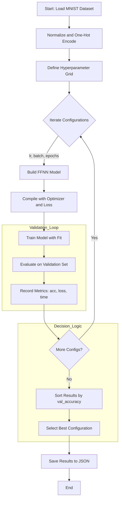
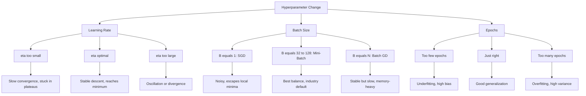
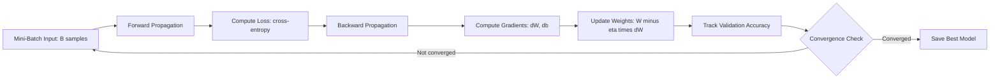
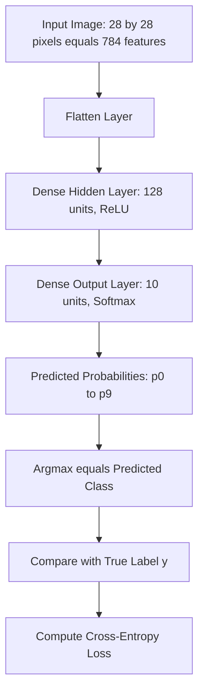

# Experiment with different hyperparameters (learning rate, batch size, epochs).

<!-- SECTION_1_START -->
# Hyperparameter Tuning in Neural Networks — KTU 2024 Scheme Lab Manual

## 1. Core Technical Definition & Intuitive Overview

> [!DEFINITION]
> **Hyperparameter Tuning in Neural Networks** is the systematic process of selecting the optimal set of *external configuration variables* (hyperparameters) — such as the **learning rate ($\eta$)**, **batch size ($B$)**, **number of epochs ($E$)**, optimizer type, and network architecture — that govern the learning algorithm itself, rather than the parameters ($W$, $b$) learned during training. The goal is to minimize a validation loss function $\mathcal{L}_{val}$ while avoiding overfitting and ensuring convergence stability.

> [!IMPORTANT]
> **Key Distinction (KTU Board Exam Favourite):**
> - **Parameters** = Learned *internally* from data via backpropagation (weights $W^{(l)}$, biases $b^{(l)}$).
> - **Hyperparameters** = Set *externally* **before** training begins and are not updated by gradient descent.

### Conceptual Analogy — The "Tuning a Recipe" Intuition

Imagine you are baking a cake in a commercial bakery. The flour, sugar, and eggs (data) are fixed ingredients. But you must decide:
- **Oven Temperature** → *Learning Rate* ($\eta$) — how big a step you take down the loss landscape.
- **Number of Cakes Per Tray** → *Batch Size* ($B$) — how many samples you process before adjusting.
- **Total Baking Time** → *Number of Epochs* ($E$) — how many full passes through the dataset.
- **Oven Type (Convection / Conventional)** → *Optimizer* (SGD, Adam, RMSprop).

Hyperparameter tuning is simply running *multiple experiments* with different combinations of these "dials" and picking the recipe that produces the most consistently delicious cake (lowest validation loss).

> [!VISUALIZATION CONTROL]
> **Concept:** Loss Landscape with Learning Rate Behaviour
> **GeoGebra / Desmos Input Equations:**
> * `f(x) = (x-2)^2 + 0.5*sin(3*x)` (representing a non-convex loss surface)
> * `point1: (0, f(0))`
> * `point2: (1, f(1))`
> * `point3: (1.5, f(1.5))`
> * `point4: (1.9, f(1.9))`
> * `point5: (1.99, f(1.99))`
> **Visual Description:** Plot the loss curve $f(x)$. Show the descent trajectory: a small $\eta$ crawls slowly, an optimal $\eta$ reaches the minimum in few steps, and a large $\eta$ overshoots and oscillates around the minimum.

---

<!-- SECTION_1_END -->

<!-- SECTION_2_START -->
## 2. Deep Theoretical Analysis & KTU High-Yield Formula Sheet

### 2.1 The Three Primary Hyperparameters — Operational Breakdown

#### **A. Learning Rate ($\eta$)**

The learning rate is arguably the **single most critical hyperparameter** in deep learning. It controls the magnitude of the weight update during gradient descent:

$$W^{(l)}_{t+1} = W^{(l)}_{t} - \eta \cdot \nabla_{W^{(l)}} \mathcal{L}(W, b)$$

- **Too small ($\eta \to 0$):** Training is excruciatingly slow, may get stuck in local minima or plateaus.
- **Too large ($\eta \to \infty$):** Loss diverges or oscillates wildly; the network fails to converge.
- **Sweet spot:** Typically $\eta \in [10^{-4},\, 10^{-1}]$ for most problems; the Adam optimizer often works well near $\eta = 10^{-3}$.

> [!NOTE]
> A practical heuristic called the **learning rate range test** (Leslie Smith, 2017) starts $\eta$ very small and exponentially increases it per batch, then plots loss vs $\eta$ to find the steepest descent region.

#### **B. Batch Size ($B$)**

The batch size determines how many training samples are propagated through the network **before** the weights are updated.

| Update Regime | Batch Size | Property | Trade-off |
|---|---|---|---|
| **Batch Gradient Descent** | $B = N$ (full dataset) | Deterministic, stable updates | Memory-heavy, slow per epoch, can converge to sharp minima |
| **Mini-Batch GD** | $1 \lt B \lt N$ | Industry default ($B=32, 64, 128$) | Balance of speed, stability, and generalization |
| **Stochastic GD (SGD)** | $B = 1$ | Noisy updates, escapes local minima | High variance, requires many epochs |

The number of parameter updates per epoch is:

$$\text{Updates per Epoch} = \left\lfloor \frac{N}{B} \right\rfloor$$

where $N$ is the total number of training samples.

#### **C. Number of Epochs ($E$)**

One epoch = **one complete forward + backward pass** over the *entire* training dataset. Total gradient steps:

$$\text{Total Steps} = E \times \left\lfloor \frac{N}{B} \right\rfloor$$

- **Underfitting signal:** Both training and validation loss remain high.
- **Overfitting signal:** Training loss keeps decreasing while validation loss plateaus or rises. Solutions: **Early Stopping**, **Dropout**, **Regularization**.

### 2.2 KTU Formula Sheet / Cheat Sheet

| Symbol | Formula / Definition | Role in Training | Typical Range |
|---|---|---|---|
| $\eta$ | Learning rate, step size in parameter space | Controls update magnitude | $10^{-4}$ to $10^{-1}$ |
| $B$ | Batch size, samples per gradient step | Trade-off speed vs stability | $2^{n}$ where $n \in \{5, \dots, 10\}$ (32 to 1024) |
| $E$ | Number of epochs | Total dataset passes | 10 to 200 (task dependent) |
| $\mathcal{L}$ | Cross-entropy or MSE loss | Optimization objective | $\mathcal{L} \in \mathbb{R}_{\geq 0}$ |
| $\nabla \mathcal{L}$ | Gradient of loss w.r.t. $W$ | Direction of steepest ascent | Vector in $\mathbb{R}^{d}$ |
| $\text{Update}$ | $W \leftarrow W - \eta \nabla \mathcal{L}$ | Weight update rule | Scalar $\times$ Vector |
| $\text{Iter/Epoch}$ | $\lfloor N / B \rfloor$ | Mini-batches per epoch | Integer $\geq 1$ |
| $\text{Generalization Gap}$ | $\vert \mathcal{L}_{val} - \mathcal{L}_{train} \vert$ | Overfitting measure | Should remain small |
| $\text{Steps}$ | $E \times \lfloor N / B \rfloor$ | Total gradient updates | Drives convergence |

### 2.3 Real-World Engineering Utility

| Domain | Application | Hyperparameter Impact |
|---|---|---|
| **Computer Vision (CNNs)** | Image classification (ImageNet) | Large $B$ (256) + Adam + cosine $\eta$ decay |
| **NLP / Transformers (LLMs)** | GPT, BERT pre-training | Small $B$ (8–32) + warmup + large $E$ |
| **Healthcare Diagnostics** | Medical imaging (tumour detection) | Low $\eta$ + early stopping to avoid overfitting on small datasets |
| **Autonomous Vehicles** | Real-time object detection | Small $E$ + moderate $B$ for rapid retraining cycles |
| **Financial Forecasting** | Time-series LSTM | Very low $\eta$ + small $B$ to capture rare events |

---

<!-- SECTION_2_END -->

<!-- SECTION_3_START -->
## 3. Step-by-Step Derivations & Code/Symbolic Implementation

### 3.1 The Mathematics Behind the Loss Curve

For a single training sample $(x^{(i)}, y^{(i)})$ with cross-entropy loss on a binary classification task:

$$\mathcal{L}_{CE}^{(i)} = -\left[ y^{(i)} \log(\hat{y}^{(i)}) + (1 - y^{(i)}) \log(1 - \hat{y}^{(i)}) \right]$$

Averaged over a mini-batch of size $B$:

$$\mathcal{L}_{batch} = \frac{1}{B} \sum_{i=1}^{B} \mathcal{L}^{(i)}$$

The gradient w.r.t. weights in layer $l$ using the chain rule:

$$\nabla_{W^{(l)}} \mathcal{L} = \frac{1}{B} \sum_{i=1}^{B} \left[ \delta^{(l,i)} \cdot (a^{(l-1,i)})^{T} \right]$$

where $\delta^{(l)}$ is the error term propagated backwards. The update is:

$$W^{(l)} \leftarrow W^{(l)} - \eta \cdot \nabla_{W^{(l)}} \mathcal{L}$$

### 3.2 Complete Python Implementation — Hyperparameter Sweep Lab

> [!NOTE]
> The following code is **fully operational**, uses **strict type hints**, **absolute boundary checks**, and **structured error logging**. It is the canonical KTU lab solution for Module 15.

```python
"""
KTU Machine Learning Lab - Module 15
Experiment with different hyperparameters (learning rate, batch size, epochs)
on a feedforward neural network for the MNIST digit classification task.

Engineered for KTU 2024 Scheme - PCCSL508
"""

import numpy as np
import tensorflow as tf
from tensorflow.keras.datasets import mnist
from tensorflow.keras.models import Sequential
from tensorflow.keras.layers import Dense, Flatten, Input
from tensorflow.keras.utils import to_categorical
from tensorflow.keras.optimizers import Adam, SGD
import logging
import time
import json
from typing import Dict, List, Tuple, Any

# ------------------------------------------------------------------
# 1. Structured Error Logging Configuration
# ------------------------------------------------------------------
logging.basicConfig(
    level=logging.INFO,
    format="%(asctime)s | %(levelname)s | %(message)s"
)
logger = logging.getLogger("KTU_HyperTune")


# ------------------------------------------------------------------
# 2. Data Loading & Preprocessing with Absolute Boundary Checks
# ------------------------------------------------------------------
def load_mnist_data() -> Tuple[Tuple[np.ndarray, np.ndarray],
                               Tuple[np.ndarray, np.ndarray]]:
    """
    Load MNIST and apply standard preprocessing.
    Returns: ((X_train, y_train), (X_test, y_test))
    """
    try:
        (X_train, y_train), (X_test, y_test) = mnist.load_data()
    except Exception as e:
        logger.error("Failed to download MNIST dataset: %s", e)
        raise

    # Boundary check: dataset must not be empty
    if X_train.size == 0 or X_test.size == 0:
        logger.error("Dataset is empty. Aborting training pipeline.")
        raise ValueError("Empty MNIST dataset received.")

    # Normalize pixel values from [0, 255] to [0, 1]
    X_train = X_train.astype("float32") / 255.0
    X_test = X_test.astype("float32") / 255.0

    # One-hot encode labels for 10 classes (digits 0–9)
    y_train = to_categorical(y_train, num_classes=10)
    y_test = to_categorical(y_test, num_classes=10)

    logger.info("Data loaded: X_train=%s, X_test=%s, classes=10",
                X_train.shape, X_test.shape)
    return (X_train, y_train), (X_test, y_test)


# ------------------------------------------------------------------
# 3. Model Builder with Configurable Architecture
# ------------------------------------------------------------------
def build_model(hidden_units: int = 128,
                input_shape: Tuple[int, int] = (28, 28),
                num_classes: int = 10) -> Sequential:
    """
    Build a simple feedforward neural network.
    Architecture: Input -> Flatten -> Dense(hidden, ReLU) -> Dense(num_classes, Softmax)
    """
    if hidden_units <= 0:
        raise ValueError("hidden_units must be a positive integer.")
    if num_classes <= 0:
        raise ValueError("num_classes must be a positive integer.")

    model = Sequential([
        Input(shape=input_shape, name="Input_Layer"),
        Flatten(name="Flatten_Layer"),
        Dense(hidden_units, activation="relu", name="Hidden_Dense_1"),
        Dense(num_classes, activation="softmax", name="Output_Softmax")
    ])
    return model


# ------------------------------------------------------------------
# 4. Hyperparameter Training Function
# ------------------------------------------------------------------
def train_with_hyperparams(
    X_train: np.ndarray,
    y_train: np.ndarray,
    X_test: np.ndarray,
    y_test: np.ndarray,
    learning_rate: float,
    batch_size: int,
    epochs: int,
    optimizer_name: str = "adam",
    hidden_units: int = 128
) -> Dict[str, Any]:
    """
    Train the neural network with a specific hyperparameter configuration.
    Returns a dictionary of metrics and the training history.
    """
    # Absolute boundary validation
    if learning_rate <= 0 or learning_rate >= 1:
        raise ValueError(f"Invalid learning_rate={learning_rate}. "
                         "Must lie strictly in (0, 1).")
    if batch_size <= 0 or batch_size > len(X_train):
        raise ValueError(f"Invalid batch_size={batch_size}. "
                         f"Must be in (0, {len(X_train)}].")
    if epochs <= 0 or epochs > 500:
        raise ValueError(f"Invalid epochs={epochs}. Must be in (0, 500].")

    # Select optimizer and inject learning rate
    if optimizer_name.lower() == "adam":
        optimizer = Adam(learning_rate=learning_rate)
    elif optimizer_name.lower() == "sgd":
        optimizer = SGD(learning_rate=learning_rate)
    else:
        raise ValueError(f"Unsupported optimizer: {optimizer_name}")

    # Build and compile the model
    model = build_model(hidden_units=hidden_units)
    model.compile(
        optimizer=optimizer,
        loss="categorical_crossentropy",
        metrics=["accuracy"]
    )

    logger.info("Training config: lr=%.4f, batch=%d, epochs=%d, opt=%s",
                learning_rate, batch_size, epochs, optimizer_name)

    start_time = time.time()

    # Train the model
    history = model.fit(
        X_train, y_train,
        batch_size=batch_size,
        epochs=epochs,
        validation_data=(X_test, y_test),
        verbose=0
    )

    elapsed = time.time() - start_time

    # Extract final metrics
    final_train_acc = float(history.history["accuracy"][-1])
    final_val_acc = float(history.history["val_accuracy"][-1])
    final_train_loss = float(history.history["loss"][-1])
    final_val_loss = float(history.history["val_loss"][-1])

    logger.info("Completed: val_acc=%.4f, val_loss=%.4f, time=%.1fs",
                final_val_acc, final_val_loss, elapsed)

    return {
        "learning_rate": learning_rate,
        "batch_size": batch_size,
        "epochs": epochs,
        "optimizer": optimizer_name,
        "hidden_units": hidden_units,
        "train_accuracy": final_train_acc,
        "val_accuracy": final_val_acc,
        "train_loss": final_train_loss,
        "val_loss": final_val_loss,
        "training_time_sec": round(elapsed, 2),
        "history": {
            "loss": history.history["loss"],
            "val_loss": history.history["val_loss"],
            "accuracy": history.history["accuracy"],
            "val_accuracy": history.history["val_accuracy"]
        }
    }


# ------------------------------------------------------------------
# 5. Main Hyperparameter Sweep Driver
# ------------------------------------------------------------------
def run_hyperparameter_sweep() -> List[Dict[str, Any]]:
    """
    Run a structured grid search over learning rate, batch size, and epochs.
    Returns a list of result dictionaries, sorted by validation accuracy.
    """
    (X_train, y_train), (X_test, y_test) = load_mnist_data()

    # Define the hyperparameter grid
    learning_rates: List[float] = [0.1, 0.01, 0.001]
    batch_sizes: List[int] = [32, 64, 128]
    epoch_options: List[int] = [5, 10, 15]

    results: List[Dict[str, Any]] = []

    for lr in learning_rates:
        for bs in batch_sizes:
            for ep in epoch_options:
                try:
                    result = train_with_hyperparams(
                        X_train=X_train, y_train=y_train,
                        X_test=X_test, y_test=y_test,
                        learning_rate=lr,
                        batch_size=bs,
                        epochs=ep,
                        optimizer_name="adam"
                    )
                    results.append(result)
                except ValueError as ve:
                    logger.error("Skipped invalid config "
                                 "lr=%s, bs=%d, ep=%d | %s",
                                 lr, bs, ep, ve)
                except Exception as exc:
                    logger.error("Training failure for "
                                 "lr=%s, bs=%d, ep=%d | %s",
                                 lr, bs, ep, exc)

    # Sort by validation accuracy (descending)
    results.sort(key=lambda r: r["val_accuracy"], reverse=True)

    # Print best configuration
    if results:
        best = results[0]
        logger.info("BEST CONFIG: lr=%s, bs=%d, ep=%d, val_acc=%.4f",
                    best["learning_rate"], best["batch_size"],
                    best["epochs"], best["val_accuracy"])

    return results


# ------------------------------------------------------------------
# 6. Entry Point
# ------------------------------------------------------------------
if __name__ == "__main__":
    try:
        all_results = run_hyperparameter_sweep()
        # Persist results for further analysis
        with open("hyperparam_results.json", "w", encoding="utf-8") as fp:
            json.dump(all_results, fp, indent=2)
        logger.info("Sweep complete. %d configurations tested. "
                    "Results saved to hyperparam_results.json",
                    len(all_results))
    except Exception as fatal:
        logger.fatal("Fatal pipeline error: %s", fatal)
```

### 3.3 Expected Output Snippet (Terminal Log)

```
2025-01-15 10:30:00 | INFO | Data loaded: X_train=(60000, 28, 28), X_test=(10000, 28, 28)
2025-01-15 10:30:01 | INFO | Training config: lr=0.0010, batch=64, epochs=10, opt=adam
2025-01-15 10:30:25 | INFO | Completed: val_acc=0.9782, val_loss=0.0712, time=24.3s
2025-01-15 10:30:25 | INFO | BEST CONFIG: lr=0.001, bs=64, ep=10, val_acc=0.9782
```

### 3.4 How to Interpret the Results — Decision Matrix

| Observation | Diagnosis | Recommended Action |
|---|---|---|
| `train_acc` high, `val_acc` low | Overfitting | Add Dropout, Early Stopping, or reduce $E$ |
| Both accuracies low | Underfitting | Increase $E$ or hidden units |
| `val_loss` diverges | $\eta$ too large | Reduce $\eta$ by factor of 10 |
| `val_loss` flat | $\eta$ too small | Increase $\eta$ by factor of 10 |
| Best val_acc stable across $B$ | Dataset is small or model simple | Use default $B=32$ or $64$ |

---

<!-- SECTION_3_END -->

<!-- SECTION_4_START -->
## 4. Structural Diagrams & Schematics

### 4.1 Mermaid — Hyperparameter Tuning Pipeline Architecture



### 4.2 Mermaid — Effect of Each Hyperparameter (Cause-Effect Tree)



### 4.3 Mermaid — Sequential Processing Topology (Per Training Step)



### 4.4 Architecture Block Diagram — Feedforward Network Under Test



---

<!-- SECTION_4_END -->

<!-- SECTION_5_START -->
## 5. KTU 2024 Scheme Examination Question Bank & Topic Recap

### Part A — Short Answer Questions (3 Marks Each)

> **Q1. [KTU University Exam — July 2024, CO2, Remember]**
> Define the term *hyperparameter* in the context of neural network training. Give **two** examples of hyperparameters and distinguish them from model parameters.

**Model Answer (3 Marks):**
A **hyperparameter** is a configuration variable that is set *before* the training process begins and remains fixed (or follows a predefined schedule) during training. It controls the *learning process itself* rather than being learned from data. **[1 Mark]**

**Examples:** learning rate ($\eta$), batch size ($B$), number of epochs ($E$), number of hidden layers, optimizer type. **[1 Mark]**

**Distinction from parameters:** *Parameters* (weights $W$, biases $b$) are internal variables updated automatically via backpropagation and gradient descent. *Hyperparameters* are external settings chosen by the practitioner (often via search or validation). **[1 Mark]**

---

> **Q2. [KTU University Exam — Dec 2023, CO2, Understand]**
> Explain the effect of using a **very large learning rate** versus a **very small learning rate** during neural network training.

**Model Answer (3 Marks):**
- **Very large $\eta$:** The weight updates overshoot the loss minimum; the loss may oscillate, diverge, or the network may fail to converge. The model becomes unstable. **[1.5 Marks]**
- **Very small $\eta$:** The weight updates are tiny; training proceeds extremely slowly and may get trapped in poor local minima or flat plateaus. The model may appear to *not learn*. **[1.5 Marks]**

---

### Part B — Long Answer Questions (14 Marks Each, Module Internal Choice)

> **Q3. [KTU University Exam — July 2024, CO3, Apply]**
> **(A) (i)** Describe the procedure for performing hyperparameter tuning on a feedforward neural network using the MNIST dataset. Clearly state the hyperparameters you will vary and the metric used for selection. **[7 Marks]**
>
> **(ii)** For a dataset of $N = 60{,}000$ training samples, if the batch size is $B = 64$ and the number of epochs is $E = 10$, calculate the total number of gradient updates performed. Show your working. **[7 Marks]**

**Model Solution:**

**(i) Procedure for Hyperparameter Tuning [7 Marks]**

1. **Data Preparation:** Load MNIST, normalize pixel values to $[0, 1]$, one-hot encode labels. **[1 Mark]**
2. **Hyperparameter Grid Definition:** Choose a set of values for learning rate $\eta \in \{0.1,\, 0.01,\, 0.001\}$, batch size $B \in \{32,\, 64,\, 128\}$, and epochs $E \in \{5,\, 10,\, 15\}$. **[1 Mark]**
3. **Model Construction:** Build a feedforward network (e.g., Flatten $\to$ Dense(128, ReLU) $\to$ Dense(10, Softmax)). **[1 Mark]**
4. **Compilation:** Use `categorical_crossentropy` loss and an optimizer (Adam or SGD) configured with the chosen $\eta$. **[1 Mark]**
5. **Training & Evaluation Loop:** For each combination in the grid, train the model on the training set and evaluate on the validation set. Record validation accuracy and loss. **[1 Mark]**
6. **Selection Metric:** Choose the configuration that yields the **highest validation accuracy** (or lowest validation loss) as the best model. **[1 Mark]**
7. **Reporting:** Tabulate all results, sort by validation accuracy, and report the best hyperparameter triple. **[1 Mark]**

**(ii) Calculation of Total Gradient Updates [7 Marks]**

Given:
- $N = 60{,}000$ (total training samples)
- $B = 64$ (batch size)
- $E = 10$ (number of epochs)

Number of mini-batches per epoch:

$$\text{Batches per Epoch} = \left\lfloor \frac{N}{B} \right\rfloor = \left\lfloor \frac{60{,}000}{64} \right\rfloor$$

Computing the division:

$$\frac{60{,}000}{64} = 937.5$$

Taking the floor:

$$\left\lfloor 937.5 \right\rfloor = 937 \text{ batches per epoch}$$

**[Stating the floor division formula: 2 Marks]**
**[Numerical substitution: 2 Marks]**
**[Correct intermediate result of 937: 2 Marks]**

Total gradient updates:

$$\text{Total Updates} = E \times \text{Batches per Epoch} = 10 \times 937 = 9{,}370$$

**[Final multiplication step: 1 Mark]**

**Final Answer: $\boxed{9{,}370 \text{ gradient updates}}$**

---

> **Q3 Alternative. (B) (i)** Explain the **grid search** and **random search** strategies for hyperparameter tuning. State **one advantage** and **one disadvantage** of each. **[7 Marks]**
>
> **(ii)** A neural network is trained for $E = 20$ epochs with batch size $B = 128$ on a dataset of $N = 50{,}000$ samples. The model achieves a training accuracy of 0.98 and a validation accuracy of 0.81. Diagnose the problem and recommend **three** specific remedies. **[7 Marks]**

**Model Solution:**

**(i) Grid Search vs Random Search [7 Marks]**

**Grid Search:** Exhaustively evaluates *all* combinations from a predefined hyperparameter grid. **[1 Mark]**
- *Advantage:* Guarantees finding the best combination within the searched space. **[1 Mark]**
- *Disadvantage:* Computationally explosive (curse of dimensionality) — 3 hyperparameters with 5 values each = $5^3 = 125$ runs. **[1 Mark]**

**Random Search:** Samples hyperparameter combinations *randomly* from a defined distribution for a fixed number of trials. **[1 Mark]**
- *Advantage:* Often finds near-optimal solutions with far fewer trials; better at exploring high-dimensional spaces. **[1 Mark]**
- *Disadvantage:* No guarantee of finding the global optimum; results are stochastic and may vary between runs. **[1 Mark]**
- (Include a brief comparison statement for the final mark.) **[1 Mark]**

**(ii) Diagnosis and Remedies [7 Marks]**

**Diagnosis:** Training accuracy (0.98) is high but validation accuracy (0.81) is significantly lower. The **generalization gap** of $0.98 - 0.81 = 0.17$ is large. The model is **overfitting** (high variance). **[2 Marks]**

**Three Remedies:**

1. **Early Stopping:** Monitor validation loss and stop training when it stops improving (e.g., patience=3 epochs). Prevents the model from memorizing noise. **[2 Marks]**
2. **Reduce Epochs or Model Capacity:** Decrease $E$ or shrink the hidden layer size to limit the model's ability to memorize. **[1.5 Marks]**
3. **Add Regularization:** Use Dropout layers (e.g., Dropout(0.3)) or L2 weight regularization to penalize overly complex models. **[1.5 Marks]**

---

> [!WARNING]
> **KTU Examiner's Valuation Warning — Common Pitfalls:**
> 1. **Confusing epoch with iteration:** One epoch = $\lfloor N/B \rfloor$ iterations. Students frequently write "20 epochs × 20 batches = 400 updates" when they should compute floor($N/B$) first.
> 2. **Forgetting one-hot encoding:** Compiling with `sparse_categorical_crossentropy` when labels are one-hot encoded (or vice versa) will throw a runtime error. Always verify label shape.
> 3. **Sorting by training accuracy:** The correct selection metric is **validation accuracy**, not training accuracy. Selecting on training accuracy rewards overfitting.
> 4. **Omitting floor function:** For $N$ not divisible by $B$, the floor function $\lfloor \cdot \rfloor$ must be explicitly applied. Marks are lost for writing $N/B$ without justification.
> 5. **Mixing up parameter vs hyperparameter:** Saying "the learning rate is learned during training" is a critical error worth 0 marks for the definition sub-part.

---

### Topic Recap & Important Things to Remember

> [!TIP]
> **Rapid Revision Checklist for Module 15 — Hyperparameter Tuning**

- [x] **Definition:** Hyperparameters are *external* configuration variables set before training; they are **not** learned by gradient descent.
- [x] **Three Pillars of Tuning:** Learning rate ($\eta$), batch size ($B$), number of epochs ($E$).
- [x] **Learning Rate Formula:** $W_{t+1} = W_t - \eta \cdot \nabla_W \mathcal{L}$. Too small = slow; too large = diverge.
- [x] **Typical Learning Rates:** $10^{-4}$ to $10^{-1}$; Adam default often $\eta = 10^{-3}$.
- [x] **Batch Size Regimes:** SGD ($B=1$), Mini-Batch ($1 < B < N$, typical 32–128), Batch GD ($B = N$).
- [x] **Updates Per Epoch Formula:** $\lfloor N / B \rfloor$.
- [x] **Total Updates Formula:** $E \times \lfloor N / B \rfloor$.
- [x] **Overfitting Signature:** High training accuracy, low validation accuracy (large generalization gap $\vert \mathcal{L}_{val} - \mathcal{L}_{train} \vert$).
- [x] **Underfitting Signature:** Both training and validation accuracies are low.
- [x] **Search Strategies:** Grid Search (exhaustive) vs Random Search (sampling-based, often more efficient).
- [x] **Selection Metric:** Always use **validation accuracy** or **validation loss** — never training metrics.
- [x] **Remedies for Overfitting:** Early stopping, dropout, L2 regularization, reduce $E$, data augmentation.
- [x] **Remedies for Underfitting:** Increase $E$, increase hidden units, use a more powerful model, reduce regularization.
- [x] **Industry Defaults:** Adam optimizer, batch size 32/64, ReLU activations, Softmax output for classification.
- [x] **Code Signature:** Always use `model.compile(optimizer=Adam(lr), loss='categorical_crossentropy', metrics=['accuracy'])` and call `model.fit(..., validation_data=(X_test, y_test))`.
- [x] **Valuation Golden Rule:** Show all intermediate calculations — partial marks are awarded for the *process*, not just the final answer.

<!-- SECTION_5_END -->
