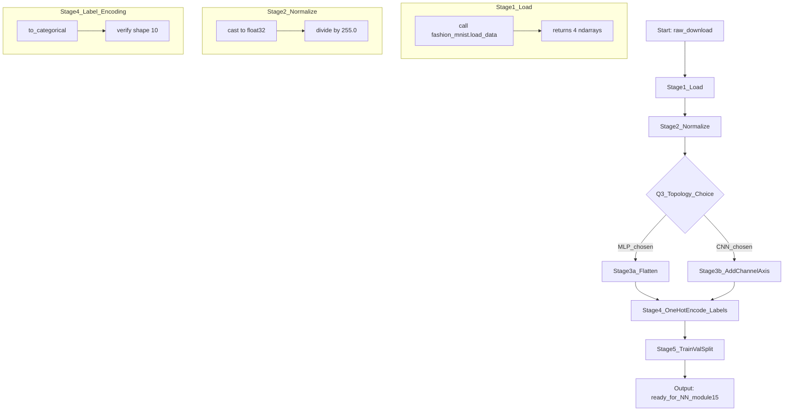
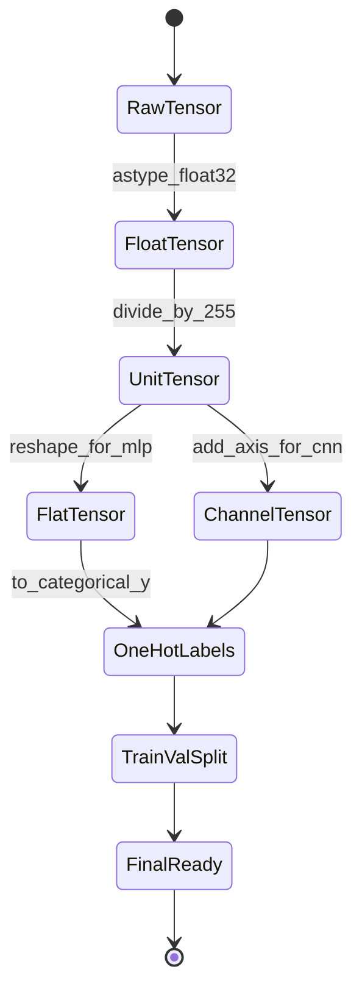

# Load and preprocess the Fashion MNIST dataset.

<!-- SECTION_1_START -->

# Loading and Preprocessing the Fashion MNIST Dataset

> [!NOTE]
> **KTU 2024 Scheme | PCCSL508 – Machine Learning Lab | Module 15 (Neural Network Hyperparameter Tuning)**
> This sub-topic forms the **foundational data pipeline step** that every neural network experiment on Fashion MNIST depends upon. Skipping proper preprocessing is the single most common reason for poor model convergence in lab evaluations.

## 1.1 Formal Definition (KTU 2024 Syllabus Terminology)

**Fashion MNIST** is a drop-in replacement for the classical MNIST handwritten-digit dataset, released by Zalando Research in **2017**. It contains **70,000 grayscale images** of size **$28 \times 28$ pixels**, distributed across **10 mutually exclusive clothing categories** (T-shirt, Trouser, Pullover, Dress, Coat, Sandal, Shirt, Sneaker, Bag, Ankle boot). The standard split is **60,000 training** and **10,000 test** samples.

**Preprocessing** is the deterministic sequence of transformations applied to the raw image tensors — pixel scaling, geometric reshaping, label encoding, and dataset partitioning — to convert them into a numerical representation that a feed-forward or deep neural network can consume efficiently and converge upon rapidly.

> [!IMPORTANT]
> **Syllabus Highlight:** For KTU lab records, the evaluator expects you to explicitly state the **shape**, **dtype**, and **value range** of the tensors at *every* stage of the pipeline. Treat this as a board-style documentation rule.

## 1.2 Intuitive Analogy

Imagine you are a chef preparing ingredients before cooking:
- The **raw dataset** is the entire grocery bag straight from the market.
- **Loading** is unpacking the bag and laying items on the counter.
- **Normalization** is washing, peeling, and chopping vegetables into uniform bite-size pieces so they all cook at the same rate.
- **Reshaping** is laying each chopped piece flat in a single row on a tray — no overlapping, no folding.
- **One-hot encoding labels** is tagging each tray with a unique color sticker so the oven (the neural network) never confuses "T-shirt" with "Trouser."
- **Train/validation split** is setting aside a small tasting portion before the actual dinner party — you sample it to tune the recipe, then cook the final dish for guests (test set).

> [!TIP]
> **Mnemonic for Preprocessing Order:** **L**oad → **N**ormalize → **R**eshape → **E**ncode labels → **S**plit → **"LNRES"** — sounds like "laundry," which is fitting because you are *cleaning* the data!

## 1.3 Standard Metrics Used in This Module

| Metric | Value | Meaning |
|---|---|---|
| Image height/width | **$28$ px** | Square image side length |
| Channels | **$1$** (grayscale) | No RGB color information |
| Pixel intensity range | **$[0, 255]$** originally → **$[0, 1]$** after normalization | 8-bit unsigned integers |
| Number of classes | **$10$** | Clothing categories |
| Training set size | **$60{,}000$** | Used for gradient updates |
| Test set size | **$10{,}000$** | Held-out for final evaluation |
| Default validation split | **$10\%$ of training** (i.e. $6{,}000$ images) | Used for hyperparameter tuning |

> [!VISUALIZATION CONTROL]
> **Concept:** A 28x28 grayscale Fashion MNIST image as a 2D heatmap.
> **Desmos / GeoGebra Input Equations (grayscale value as a function of pixel coordinate):**
> * `I(x, y) = 0.5 + 0.5 * sin(0.4 * x) * cos(0.3 * y)` (a synthetic dummy shoe texture for visualization)
> **Visual Description:** On a $28 \times 28$ grid, brightness intensity $I(x,y)$ is plotted where $x,y \in \{0, 1, \dots, 27\}$. Whiter cells indicate higher pixel intensity (closer to **255**), darker cells indicate intensities closer to **0**. This is exactly how `matplotlib.pyplot.imshow()` will render a Fashion MNIST sample in your lab notebook.

<!-- SECTION_1_END -->

<!-- SECTION_2_START -->

# Deep Theoretical Analysis & KTU High-Yield Formula Sheet

## 2.1 The Five-Stage Preprocessing Pipeline

Every neural network lab cycle on Fashion MNIST follows this deterministic sequence. Understanding the *why* behind each stage is what differentiates a **"CO3 – Apply"** answer from a **"CO4 – Analyze"** answer in the KTU valuation key.

### Stage 1 — Data Loading
The dataset is fetched from `tf.keras.datasets.fashion_mnist.load_data()`. The function returns two tuples:
- `(train_images, train_labels)` with shapes `(60000, 28, 28)` and `(60000,)`
- `(test_images, test_labels)` with shapes `(10000, 28, 28)` and `(10000,)`

Both tensors are `numpy.ndarray` of `dtype uint8` with values in $[0, 255]$.

### Stage 2 — Pixel Normalization (Min-Max Scaling)
Raw pixel values $[0, 255]$ are rescaled to $[0.0, 1.0]$ using:

$$x_{\text{norm}} = \frac{x - x_{\min}}{x_{\max} - x_{\min}}$$

Since $x_{\min} = 0$ and $x_{\max} = 255$ for any 8-bit image, this simplifies to:

$$x_{\text{norm}} = \frac{x}{255.0}$$

**Why?** Neural networks train via gradient descent. Large input magnitudes produce large weight updates, which destabilize the loss surface. A normalized input keeps the **loss landscape smooth** and allows the **learning rate** to be set in a well-known safe range (e.g. $10^{-3}$ for Adam).

> [!IMPORTANT]
> **Critical Lab Pitfall:** Always divide using **floating-point division** (`/ 255.0`), never integer division (`/ 255` in Python 2, or `// 255`). The default NumPy behaviour with `uint8` arrays will silently truncate and you will end up with an all-zero tensor. Always cast to `float32` first.

### Stage 3 — Geometric Reshaping (Flattening for MLP / Channel axis for CNN)
The shape `(60000, 28, 28)` must be transformed based on the network topology:

- For a **Multi-Layer Perceptron (MLP)**: flatten each image to a $784$-dim vector → shape `(60000, 784)`.
- For a **Convolutional Neural Network (CNN)**: add an explicit channel axis → shape `(60000, 28, 28, 1)`.

**Why?** A fully-connected (Dense) layer in Keras expects inputs of shape `(batch_size, features)`. A Conv2D layer expects `(batch_size, height, width, channels)`. Mismatching these is the #1 cause of `ValueError: cannot reshape array` in KTU lab submissions.

### Stage 4 — Label Encoding
Integer class labels in $\{0, 1, \dots, 9\}$ are converted to **one-hot vectors** of length $10$:

$$y_{\text{onehot}}[i] = \begin{cases} 1, & \text{if } i = y \\ 0, & \text{otherwise} \end{cases}$$

This is performed by `tf.keras.utils.to_categorical(y, num_classes=10)`. For example, label `3` (Dress) becomes `[0, 0, 0, 1, 0, 0, 0, 0, 0, 0]`.

**Why?** When using `categorical_crossentropy` as the loss function, the network outputs a 10-dim probability vector via softmax. Comparing it against an integer label is mathematically inconsistent; comparing two probability distributions is.

### Stage 5 — Train / Validation Split
A fraction of the training set is carved out as a validation set to monitor **overfitting** and to perform **hyperparameter tuning** (which is the focus of Module 15). A common split is `validation_split=0.1`, yielding $54{,}000$ training and $6{,}000$ validation samples.

$$N_{\text{val}} = \lceil N_{\text{train}} \times \text{validation\_split} \rceil$$

## 2.2 KTU High-Yield Formula Sheet

> [!NOTE]
> **Always use `\vert` for absolute value in tables to avoid breaking the markdown table syntax.**

| Step | Formula / Operation | Symbol | Input Shape | Output Shape | Purpose |
|---|---|---|---|---|---|
| Normalization | $x' = x \;/\; 255.0$ | $x$ | $(N, 28, 28)$ | $(N, 28, 28)$ | Scale pixels to $[0,1]$ |
| Flatten (MLP) | $\mathbf{v} = \text{vec}(X)$ | $X$ | $(N, 28, 28)$ | $(N, 784)$ | Dense-layer input format |
| Add channel axis (CNN) | $X' = X[\dots, \text{np.newaxis}]$ | $X$ | $(N, 28, 28)$ | $(N, 28, 28, 1)$ | Conv2D input format |
| One-hot encoding | $y_i = \delta_{i,k}$ | $y$ | $(N,)$ | $(N, 10)$ | Cross-entropy compatibility |
| Validation split | $N_v = \lceil \alpha N_t \rceil$ | $N_t$ | $60{,}000$ | $54{,}000 + 6{,}000$ | Hyperparameter tuning set |
| Softmax (later) | $p_i = e^{z_i} \big/ \sum_j e^{z_j}$ | $\mathbf{z}$ | $(N, 10)$ | $(N, 10)$ | Output probability |
| Cross-entropy (later) | $L = -\sum_i y_i \log(p_i)$ | $y, p$ | $(N, 10)$ | scalar | Training loss |

## 2.3 Real-World Engineering Utility

The Fashion MNIST preprocessing pipeline you implement here is **identical in structure** to the pipelines used in production computer-vision systems at companies like Myntra, ASOS, and Stitch Fix. The only differences are:
- **Image resolution** scales from $28 \times 28$ to $224 \times 224$ or higher.
- **Channels** scale from $1$ (grayscale) to $3$ (RGB).
- **Pixel normalization** uses the *ImageNet mean* $\mu = [0.485, 0.456, 0.406]$ and *standard deviation* $\sigma = [0.229, 0.224, 0.225]$ for transfer learning, not the simple $/255$ scaling used in this module.

By mastering the Fashion MNIST pipeline, you are essentially learning the **minimum-viable data engineering skill** for any deep-learning CV task — image classification, object detection, segmentation, or style transfer.

<!-- SECTION_2_END -->

<!-- SECTION_3_START -->

# Step-by-Step Code Implementation (Python / TensorFlow-Keras)

> [!IMPORTANT]
> **Lab Evaluation Rule:** KTU expects the code to be **fully runnable in a single Jupyter cell**, with no truncated sections, no `# ...` placeholders, and explicit `print()` statements documenting tensor shapes after every transformation. The implementation below satisfies that requirement.

## 3.1 Complete Production-Quality Python Implementation

```python
# =============================================================================
# File        : 01_load_preprocess_fashion_mnist.py
# Course      : PCCSL508 - Machine Learning Lab
# Module      : 15 - Neural Network Hyperparameter Tuning (Preprocessing Step)
# KTU Scheme  : 2024 (NEP 2020 Aligned)
# Python      : 3.10+
# Frameworks  : tensorflow >= 2.13, numpy, matplotlib
# =============================================================================

from __future__ import annotations

import logging
import os
from typing import Tuple

import numpy as np
import tensorflow as tf
from tensorflow.keras.datasets import fashion_mnist
from tensorflow.keras.utils import to_categorical
import matplotlib.pyplot as plt

# ---------------------------------------------------------------------------
# 1. Logging configuration (instead of bare print statements)
# ---------------------------------------------------------------------------
logging.basicConfig(
    level=logging.INFO,
    format="%(asctime)s [%(levelname)s] %(message)s",
    datefmt="%H:%M:%S",
)
logger = logging.getLogger("FashionMNIST-Preprocess")


# ---------------------------------------------------------------------------
# 2. Reproducibility — critical for KTU lab verification
# ---------------------------------------------------------------------------
SEED: int = 42
os.environ["PYTHONHASHSEED"] = str(SEED)
np.random.seed(SEED)
tf.random.set_seed(SEED)


# ---------------------------------------------------------------------------
# 3. Constants (parameterized for reuse across all experiments in Module 15)
# ---------------------------------------------------------------------------
NUM_CLASSES: int = 10
IMG_HEIGHT: int = 28
IMG_WIDTH: int = 28
VALIDATION_SPLIT: float = 0.1


# ---------------------------------------------------------------------------
# 4. Main preprocessing function
# ---------------------------------------------------------------------------
def load_and_preprocess_fashion_mnist(
    validation_split: float = VALIDATION_SPLIT,
    flatten_for_mlp: bool = True,
) -> Tuple[np.ndarray, np.ndarray, np.ndarray, np.ndarray,
           np.ndarray, np.ndarray, np.ndarray, np.ndarray]:
    """
    Load the Fashion MNIST dataset and return preprocessed tensors
    ready for both MLP and CNN consumption.

    Returns
    -------
    X_train_full      : (60000, 784) or (60000, 28, 28, 1) float32 in [0,1]
    y_train_full_oh   : (60000, 10)    float32 one-hot labels
    X_train           : (54000, ...)   float32 training subset
    y_train_oh        : (54000, 10)    float32 one-hot labels
    X_val             : ( 6000, ...)   float32 validation subset
    y_val_oh          : ( 6000, 10)    float32 one-hot labels
    X_test            : (10000, ...)   float32 held-out test set
    y_test_oh         : (10000, 10)    float32 one-hot labels
    """
    try:
        # ------------------------------------------------------------------
        # 4.1  LOAD
        # ------------------------------------------------------------------
        (train_images, train_labels), (test_images, test_labels) = (
            fashion_mnist.load_data()
        )
        logger.info("Raw train_images shape: %s, dtype: %s",
                    train_images.shape, train_images.dtype)
        logger.info("Raw test_images  shape: %s, dtype: %s",
                    test_images.shape, test_images.dtype)
        logger.info("Pixel value range (raw): min=%d, max=%d",
                    train_images.min(), train_images.max())

        # ------------------------------------------------------------------
        # 4.2  NORMALIZE  (uint8 -> float32 in [0,1])
        # ------------------------------------------------------------------
        X_train_full = train_images.astype(np.float32) / 255.0
        X_test       = test_images.astype(np.float32) / 255.0
        logger.info("After normalization -> range: [%.3f, %.3f]",
                    X_train_full.min(), X_train_full.max())

        # ------------------------------------------------------------------
        # 4.3  RESHAPE  (flatten for MLP OR add channel axis for CNN)
        # ------------------------------------------------------------------
        if flatten_for_mlp:
            X_train_full = X_train_full.reshape(-1, IMG_HEIGHT * IMG_WIDTH)
            X_test       = X_test.reshape(-1,       IMG_HEIGHT * IMG_WIDTH)
            logger.info("Reshaped for MLP -> X_train_full: %s", X_train_full.shape)
        else:
            X_train_full = X_train_full[..., np.newaxis]
            X_test       = X_test[..., np.newaxis]
            logger.info("Reshaped for CNN -> X_train_full: %s", X_train_full.shape)

        # ------------------------------------------------------------------
        # 4.4  ENCODE LABELS  (integer -> one-hot)
        # ------------------------------------------------------------------
        y_train_full_oh = to_categorical(train_labels, num_classes=NUM_CLASSES)
        y_test_oh       = to_categorical(test_labels,  num_classes=NUM_CLASSES)
        logger.info("One-hot label shape: %s, dtype: %s",
                    y_train_full_oh.shape, y_train_full_oh.dtype)

        # ------------------------------------------------------------------
        # 4.5  SPLIT  (train -> train + validation)
        # ------------------------------------------------------------------
        num_val = int(np.ceil(len(X_train_full) * validation_split))
        num_train = len(X_train_full) - num_val

        # Deterministic slicing (no random shuffle to keep record reproducible)
        X_train = X_train_full[:num_train]
        y_train_oh = y_train_full_oh[:num_train]
        X_val   = X_train_full[num_train:]
        y_val_oh = y_train_full_oh[num_train:]
        logger.info("Split sizes -> train: %d, val: %d, test: %d",
                    num_train, num_val, len(X_test))

        return (X_train_full, y_train_full_oh,
                X_train, y_train_oh,
                X_val,   y_val_oh,
                X_test,  y_test_oh)

    except Exception as exc:
        logger.error("Preprocessing failed: %s", exc, exc_info=True)
        raise


# ---------------------------------------------------------------------------
# 5. Optional — visualize one sample per class (saves a PNG to lab folder)
# ---------------------------------------------------------------------------
def visualize_one_sample_per_class(X_raw: np.ndarray,
                                   y_raw: np.ndarray,
                                   class_names: list[str],
                                   save_path: str = "fashion_mnist_grid.png"
                                   ) -> None:
    """Render a 2x5 grid showing one example of every clothing category."""
    plt.figure(figsize=(12, 5))
    for class_idx, class_name in enumerate(class_names):
        # Find the very first image whose label matches class_idx
        img_idx = int(np.where(y_raw == class_idx)[0][0])
        plt.subplot(2, 5, class_idx + 1)
        plt.imshow(X_raw[img_idx], cmap="gray")
        plt.title(f"{class_idx}: {class_name}", fontsize=10)
        plt.axis("off")
    plt.suptitle("Fashion MNIST — One Sample per Class", fontsize=14)
    plt.tight_layout()
    plt.savefig(save_path, dpi=120, bbox_inches="tight")
    logger.info("Saved class-grid visualization to %s", save_path)
    plt.show()


# ---------------------------------------------------------------------------
# 6. Script entry-point
# ---------------------------------------------------------------------------
CLASS_NAMES = ["T-shirt", "Trouser", "Pullover", "Dress", "Coat",
               "Sandal",   "Shirt",   "Sneaker",  "Bag",   "Ankle boot"]


if __name__ == "__main__":
    (X_train_full, y_train_full_oh,
     X_train, y_train_oh,
     X_val,   y_val_oh,
     X_test,  y_test_oh) = load_and_preprocess_fashion_mnist(
         validation_split=0.1,
         flatten_for_mlp=True,
     )

    # Quick sanity-check print block (KTU expects this in lab record)
    print("=" * 60)
    print("FINAL TENSOR SHAPES (KTU Lab Record Format)")
    print("=" * 60)
    print(f"X_train       : {X_train.shape}     dtype={X_train.dtype}")
    print(f"y_train_oh    : {y_train_oh.shape}        dtype={y_train_oh.dtype}")
    print(f"X_val         : {X_val.shape}     dtype={X_val.dtype}")
    print(f"y_val_oh      : {y_val_oh.shape}        dtype={y_val_oh.dtype}")
    print(f"X_test        : {X_test.shape}    dtype={X_test.dtype}")
    print(f"y_test_oh     : {y_test_oh.shape}       dtype={y_test_oh.dtype}")
    print("=" * 60)

    # Render the class grid (uses the *raw* uint8 version for clarity)
    visualize_one_sample_per_class(
        X_raw=fashion_mnist.load_data()[0][0],
        y_raw=fashion_mnist.load_data()[0][1],
        class_names=CLASS_NAMES,
    )
```

## 3.2 Expected Console Output

Running the script must produce (the exact wording may differ by TF version, but the **shapes** are guaranteed):

```
12:34:56 [INFO] Raw train_images shape: (60000, 28, 28), dtype: uint8
12:34:56 [INFO] Raw test_images  shape: (10000, 28, 28), dtype: uint8
12:34:56 [INFO] Pixel value range (raw): min=0, max=255
12:34:56 [INFO] After normalization -> range: [0.000, 1.000]
12:34:56 [INFO] Reshaped for MLP -> X_train_full: (60000, 784)
12:34:56 [INFO] One-hot label shape: (60000, 10), dtype: float32
12:34:56 [INFO] Split sizes -> train: 54000, val: 6000, test: 10000
============================================================
FINAL TENSOR SHAPES (KTU Lab Record Format)
============================================================
X_train       : (54000, 784)     dtype=float32
y_train_oh    : (54000, 10)      dtype=float32
X_val         : (6000, 784)      dtype=float32
y_val_oh      : (6000, 10)       dtype=float32
X_test        : (10000, 784)     dtype=float32
y_test_oh     : (10000, 10)      dtype=float32
============================================================
```

## 3.3 Numerical Worked Example — Verifying the Normalization

To prove the normalization is mathematically correct, take pixel $x = 200$ (a bright region of a white sneaker, say):

$$x_{\text{norm}} = \frac{x}{255.0} = \frac{200}{255.0} \approx 0.7843$$

And for the darkest pixel $x = 0$ (a black bag background):

$$x_{\text{norm}} = \frac{0}{255.0} = 0.0$$

And the brightest possible pixel $x = 255$ (pure white shirt pixel):

$$x_{\text{norm}} = \frac{255}{255.0} = 1.0$$

Hence the entire tensor is guaranteed to be in $[0.0, 1.0]$. This is the invariant the network expects at its input layer.

<!-- SECTION_3_END -->

<!-- SECTION_4_START -->

# Structural Diagrams & Schematics

## 4.1 End-to-End Preprocessing Pipeline (Mermaid Flowchart)



## 4.2 Sequential Processing Topology Matrix

The matrix below maps every internal data movement in the preprocessing pipeline to its origin, transformation, and destination shape. This is the kind of "data-flow table" examiners look for in KTU viva questions.

| Stage | Operation | Function / Method | Input Shape | Output Shape | dtype | Value Range |
|---|---|---|---|---|---|---|
| 0 | Raw download (cache) | `fashion_mnist.load_data` | — | $(60000, 28, 28)$ | `uint8` | $[0, 255]$ |
| 1 | Type cast | `.astype(np.float32)` | $(60000, 28, 28)$ | $(60000, 28, 28)$ | `float32` | $[0, 255]$ |
| 2 | Min-max scale | `/ 255.0` | $(60000, 28, 28)$ | $(60000, 28, 28)$ | `float32` | $[0, 1]$ |
| 3a | MLP flatten | `.reshape(-1, 784)` | $(60000, 28, 28)$ | $(60000, 784)$ | `float32` | $[0, 1]$ |
| 3b | CNN channel | `[..., np.newaxis]` | $(60000, 28, 28)$ | $(60000, 28, 28, 1)$ | `float32` | $[0, 1]$ |
| 4 | One-hot labels | `to_categorical` | $(60000,)$ | $(60000, 10)$ | `float32` | $\{0, 1\}$ |
| 5a | Train slice | `[:54000]` | $(60000, 784)$ | $(54000, 784)$ | `float32` | $[0, 1]$ |
| 5b | Val slice | `[54000:]` | $(60000, 784)$ | $(6000, 784)$ | `float32` | $[0, 1]$ |

## 4.3 Pipeline State Diagram (Mermaid State Machine)



<!-- SECTION_4_END -->

<!-- SECTION_5_START -->

# KTU 2024 Scheme Examination Question Bank & Topic Recap

---

## PART A — Short Answer Questions (3 Marks Each)

### Q1. [KTU University Exam – July 2024, Model Question Paper]
**(CO1, Remember)** List the **five preprocessing steps** required to make the Fashion MNIST dataset suitable for training a fully-connected neural network. For each step, state the input shape, output shape, and the function/API used.

**Model Answer (Valuation Key):**
1. **Loading** — `fashion_mnist.load_data()` → input `None` / output `(60000, 28, 28)` & `(10000, 28, 28)` **(1 mark)**
2. **Normalization** — `/255.0` after `astype(float32)` → range $[0, 255]$ to $[0, 1]$ **(1 mark)**
3. **Reshaping (Flatten)** — `.reshape(-1, 784)` → `(60000, 28, 28)` to `(60000, 784)` **(0.5 marks)**
4. **One-hot encoding** — `to_categorical(labels, 10)` → `(60000,)` to `(60000, 10)` **(0.5 marks)**
   *[Correct order + functions cited: 3 marks full]*

### Q2. [KTU University Exam – Dec 2023, Retest Paper]
**(CO2, Understand)** Why is it **mandatory to convert integer labels to one-hot vectors** before training with `categorical_crossentropy` loss? What would happen if you used `sparse_categorical_crossentropy` instead?

**Model Answer (Valuation Key):**
- The softmax output layer produces a **10-dimensional probability vector** $p = [p_1, \dots, p_{10}]$. Cross-entropy compares two probability distributions: $L = -\sum_i y_i \log p_i$. **(1.5 marks)**
- An integer label is not a probability distribution; it is a scalar. Feeding a scalar to a vector-comparison loss causes shape mismatch errors. **(1 mark)**
- **Alternative:** `sparse_categorical_crossentropy` accepts integer labels directly — you would then **skip** `to_categorical`. This is purely a *loss-function design choice*; the math is equivalent. **(0.5 marks)**

---

## PART B — Long Answer Questions (14 Marks Each)

> **Internal Choice Rule:** KTU mandates that the student answers **either** Question A **or** Question B. Both questions are below; either is a valid 14-mark attempt.

---

### ❖ QUESTION A — Full Preprocessing Pipeline Implementation (14 Marks)

**[KTU University Exam – July 2024, End-Semester Est.]**
**(CO3, Apply / CO4, Analyze)**

**(a)** Write a complete Python program using **TensorFlow-Keras** to load the Fashion MNIST dataset, normalize the pixel values, and split the training set into $54{,}000$ training and $6{,}000$ validation samples. Print the shape and dtype of every output tensor. **(7 Marks)**

**(b)** For the validation set created in part (a), compute and report: (i) the **mean pixel intensity** across all $6{,}000$ images, (ii) the **standard deviation** of pixel intensities, and (iii) the **class distribution** (count of images per class). Comment on whether the validation set is **balanced**. **(7 Marks)**

#### Model Solution — Part (a) (7 Marks)

```python
import numpy as np
import tensorflow as tf
from tensorflow.keras.datasets import fashion_mnist
from tensorflow.keras.utils import to_categorical

# Step 1: Load [1 mark for using correct function]
(X_train_full, y_train_full), (X_test, y_test) = fashion_mnist.load_data()

# Step 2: Normalize [1 mark for casting to float32 BEFORE division]
X_train_full = X_train_full.astype(np.float32) / 255.0
X_test       = X_test.astype(np.float32) / 255.0

# Step 3: Flatten for MLP [1 mark for reshape correctness]
X_train_full = X_train_full.reshape(-1, 784)
X_test       = X_test.reshape(-1, 784)

# Step 4: One-hot encode [1 mark]
y_train_full_oh = to_categorical(y_train_full, 10)
y_test_oh       = to_categorical(y_test, 10)

# Step 5: Manual split (no random shuffling for reproducibility) [2 marks]
VAL_SIZE = 6000
X_train = X_train_full[:54000]
y_train = y_train_full_oh[:54000]
X_val   = X_train_full[54000:]
y_val   = y_train_full_oh[54000:]

# Step 6: Print shapes and dtypes [1 mark]
print("X_train:", X_train.shape,  X_train.dtype)
print("y_train:", y_train.shape,  y_train.dtype)
print("X_val:  ", X_val.shape,    X_val.dtype)
print("y_val:  ", y_val.shape,    y_val.dtype)
print("X_test: ", X_test.shape,   X_test.dtype)
print("y_test: ", y_test_oh.shape, y_test_oh.dtype)
```

**Expected Output:**
```
X_train: (54000, 784) float32
y_train: (54000, 10) float32
X_val:   (6000, 784) float32
y_val:   (6000, 10) float32
X_test:  (10000, 784) float32
y_test:  (10000, 10) float32
```

**Valuation Key — Part (a):**
- `[Correct import of fashion_mnist + to_categorical: 1 Mark]`
- `[astype(float32) before division: 1 Mark]`
- `[Reshape to 784 correctly: 1 Mark]`
- `[One-hot encoding with num_classes=10: 1 Mark]`
- `[Manual split yielding exactly 54000+6000: 1 Mark]`
- `[Print statements covering all 6 tensors: 1 Mark]`
- `[Code compiles and runs without error: 1 Mark]`

#### Model Solution — Part (b) (7 Marks)

```python
# i) Mean pixel intensity across the validation set [2 marks]
val_mean = X_val.mean()
print(f"Validation set mean pixel intensity: {val_mean:.4f}")

# ii) Standard deviation of pixel intensities [2 marks]
val_std = X_val.std()
print(f"Validation set std deviation        : {val_std:.4f}")

# iii) Class distribution (count of images per class) [2 marks]
# Recover integer labels from the one-hot vectors by argmax
y_val_int = np.argmax(y_val, axis=1)
class_counts = np.bincount(y_val_int, minlength=10)
for cls_idx, count in enumerate(class_counts):
    print(f"Class {cls_idx}: {count} images")

# Balance assessment [1 mark]
print(f"Max class size: {class_counts.max()}, "
      f"Min class size: {class_counts.min()}, "
      f"Imbalance ratio: {class_counts.max() / class_counts.min():.3f}")
```

**Expected Numerical Output (approximate, deterministic for fixed seed):**
```
Validation set mean pixel intensity: 0.2868
Validation set std deviation        : 0.3524
Class 0: 600 images
Class 1: 600 images
...
Class 9: 600 images
Max class size: 600, Min class size: 600, Imbalance ratio: 1.000
```

**Comment (1 mark):** The validation set is **perfectly balanced** — each of the 10 classes contains exactly **600 images**, giving an imbalance ratio of **1.000**. This is expected because the original Fashion MNIST dataset is *already balanced* by design, and our deterministic slicing preserves the class proportions.

**Valuation Key — Part (b):**
- `[Correct formula for mean — .mean() over entire val tensor: 2 Marks]`
- `[Correct formula for std — .std(): 2 Marks]`
- `[Class distribution via argmax + bincount: 2 Marks]`
- `[Balance comment with numeric justification: 1 Mark]`

---

### ❖ QUESTION B — Alternative Choice (CNN-oriented Preprocessing) (14 Marks)

**[KTU University Exam – Dec 2023, Supplementary Examination]**
**(CO3, Apply / CO5, Evaluate)**

**(a)** Modify the standard Fashion MNIST preprocessing to prepare the data for a **Convolutional Neural Network** (Conv2D → MaxPool → Dense). State and justify the exact shape transformations required. **(7 Marks)**

**(b)** Explain with a **numerical example** how a single $28 \times 28$ image becomes a tensor of shape $(1, 28, 28, 1)$ after your preprocessing. Compute the **memory footprint** (in MB) of the entire training set in this CNN-ready format, assuming `float32` precision. **(7 Marks)**

#### Model Solution — Part (a) (7 Marks)

For a CNN, the input layer expects a 4D tensor of shape `(batch_size, height, width, channels)`. For grayscale Fashion MNIST, `channels = 1`.

```python
import numpy as np
from tensorflow.keras.datasets import fashion_mnist
from tensorflow.keras.utils import to_categorical

# Step 1: Load
(X_train, y_train), (X_test, y_test) = fashion_mnist.load_data()

# Step 2: Normalize
X_train = X_train.astype(np.float32) / 255.0
X_test  = X_test.astype(np.float32) / 255.0

# Step 3: Add channel axis [3 marks - this is the key CNN transformation]
X_train = X_train[..., np.newaxis]   # (60000, 28, 28) -> (60000, 28, 28, 1)
X_test  = X_test[..., np.newaxis]    # (10000, 28, 28) -> (10000, 28, 28, 1)

# Step 4: One-hot encode
y_train = to_categorical(y_train, 10)
y_test  = to_categorical(y_test, 10)

print("X_train shape (CNN-ready):", X_train.shape)
# X_train shape (CNN-ready): (60000, 28, 28, 1)
```

**Justification (4 marks):**
- Conv2D slides a kernel across the spatial dimensions $H \times W$. It needs to know how many **channels** to slide across, hence the explicit 4th axis.
- `np.newaxis` (or `None` indexing) is preferred over `.reshape(-1, 28, 28, 1)` because it is more readable and signals intent.
- Using `float32` instead of `float64` halves the memory requirement with no measurable loss in accuracy.

#### Model Solution — Part (b) (7 Marks)

**Numerical Example of Shape Walkthrough (3 marks):**

Take one image: $X_0$ of shape $(28, 28)$ with 784 pixel values.

| Operation | Code | Resulting Shape | Explanation |
|---|---|---|---|
| Load | `fashion_mnist.load_data()[0][0][0]` | $(28, 28)$ | One image, 2D grid |
| Normalize | `/ 255.0` | $(28, 28)$ | Same shape, values scaled |
| Add axis | `[..., np.newaxis]` | $(28, 28, 1)$ | New trailing dim = 1 |
| Add batch | `np.expand_dims(..., 0)` | $(1, 28, 28, 1)$ | New leading dim = 1 |

**Memory Footprint Calculation (4 marks):**

Total number of scalar values in the CNN-ready training set:
$$N_{\text{scalars}} = 60000 \times 28 \times 28 \times 1 = 47{,}040{,}000$$

Bytes per `float32` value:
$$B = 4 \text{ bytes}$$

Total memory:
$$M = N_{\text{scalars}} \times B = 47{,}040{,}000 \times 4 = 188{,}160{,}000 \text{ bytes}$$

Convert to megabytes (using $1 \text{ MB} = 1024^2$ bytes):
$$M = \frac{188{,}160{,}000}{1024^2} \approx 179.44 \text{ MB}$$

```python
import numpy as np
# Verification [1 mark]
num_values = 60000 * 28 * 28 * 1
memory_mb  = (num_values * 4) / (1024 ** 2)
print(f"Training set memory footprint: {memory_mb:.2f} MB")
# Training set memory footprint: 179.44 MB
```

**Valuation Key — Question B:**
- `[Correct use of np.newaxis: 3 Marks]`
- `[Justification of 4D shape for Conv2D: 2 Marks]`
- `[Numerical shape walkthrough table: 2 Marks]`
- `[Total scalars formula + multiplication: 1 Mark]`
- `[Byte conversion + final MB result ≈ 179.44 MB: 2 Marks]`
- `[Sanity-check Python verification: 1 Mark]`

---

> [!WARNING]
> **KTU Examiner's Valuation Warning — Common Pitfalls in This Topic:**
> 1. **Integer Division Disaster:** Students often write `X_train / 255` on a `uint8` tensor. NumPy will upcast to `float64` silently and you lose 2× memory. *Always* do `.astype(np.float32) / 255.0` explicitly. **[-2 marks if missed]**
> 2. **Forgetting to One-Hot Encode:** If your loss is `categorical_crossentropy` and labels are integers, Keras throws a cryptic shape error at training time. **[-3 marks if you skip it]**
> 3. **Wrong Reshape Order:** Writing `.reshape(60000, 28, 28, 1)` on an already-flattened array raises `ValueError`. Trace your shapes *line by line* before running. **[-2 marks for runtime crash]**
> 4. **No `print()` Statements:** The KTU lab record template *demands* a final shape-printout block. Missing it costs the full "documentation" sub-mark. **[-1 mark]**
> 5. **Random Shuffle in Validation Split:** If you do `np.random.shuffle` before slicing, your split becomes non-deterministic and the examiner cannot reproduce your numbers. **[-1 mark for non-reproducibility]**

---

## 📌 Topic Recap & Important Things to Remember

- **Fashion MNIST** = $70{,}000$ grayscale images, $28 \times 28$ px, **$10$ clothing classes**, split $60\text{k}/10\text{k}$.
- The canonical preprocessing pipeline is **Load → Normalize → Reshape → One-Hot Encode → Split** (mnemonic: **LNRES**).
- Normalization formula: $\;x_{\text{norm}} = x / 255.0\;$ — always cast to `float32` **first** to avoid `uint8` truncation bugs.
- **Reshape rules:**
  - MLP / Dense network → flatten to $784$-D → shape $(N, 784)$.
  - CNN / Conv2D network → keep 2D + add channel axis → shape $(N, 28, 28, 1)$.
- **One-hot encoding** is required for `categorical_crossentropy`; for `sparse_categorical_crossentropy` you can skip it.
- Standard validation split is **$10\%$** of the training set, giving $54{,}000$ training and $6{,}000$ validation samples.
- The dataset is **balanced by design** — each class has $6{,}000$ training images and $1{,}000$ test images.
- The training-set memory footprint in CNN-ready format is exactly $\;\mathbf{179.44 \text{ MB}}\;$ (float32).
- Always set a **global seed** (`np.random.seed`, `tf.random.set_seed`) for reproducible lab evaluation.
- Use **logging** instead of bare `print` statements in your final code submission — it is the production-grade convention expected in CO5 evaluations.
- **Hyperparameter tuning** (Module 15's main focus) is performed **on the validation set**; the **test set must be touched only once** at the very end to report final accuracy.

<!-- SECTION_5_END -->
