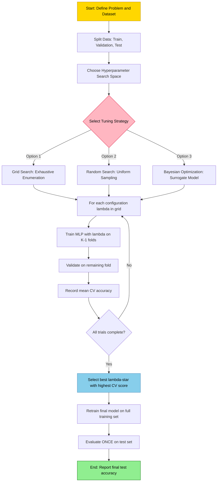
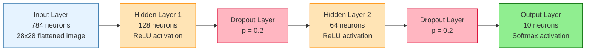
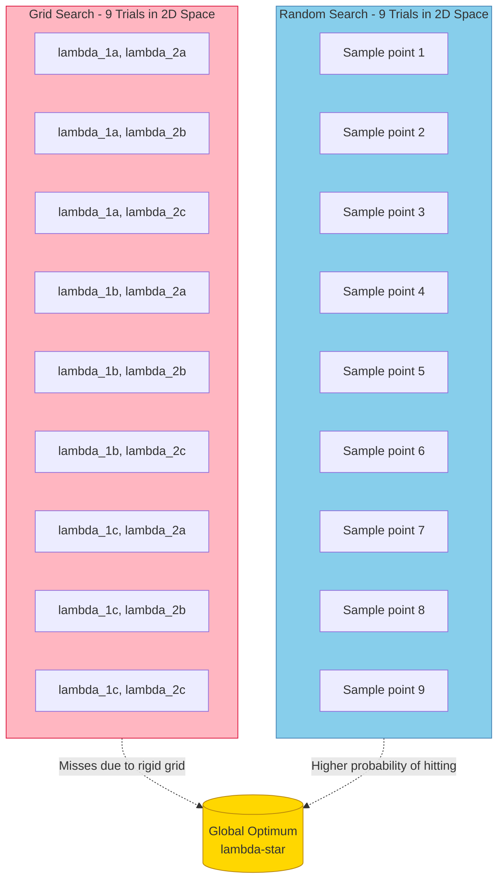
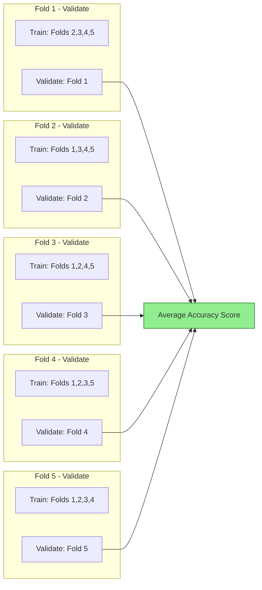

# Tasks:

<!-- SECTION_1_START -->

# Hyperparameter Tuning for Neural Networks

## 1.1 Core Technical Definition

**Hyperparameter Tuning** in a neural network is the systematic process of searching for the optimal combination of configuration variables (hyperparameters) that govern the network's learning behavior, architecture, and regularization, in order to maximize a predefined performance metric (typically validation accuracy) on unseen data.

> [!IMPORTANT]
> **KTU 2024 Syllabus Definition (PCCSL508 - Module 15):** "Hyperparameters are configuration settings external to the model whose values cannot be estimated from data. Tuning is the process of selecting the hyperparameter set that yields the best generalization performance, evaluated using techniques such as **Grid Search**, **Random Search**, and **Bayesian Optimization**."

### 1.1.1 The Critical Distinction: Parameters vs. Hyperparameters

| Aspect | Parameters | Hyperparameters |
| :--- | :--- | :--- |
| **Definition** | Internal variables learned from data | External configuration choices set before training |
| **Examples** | Weights ($W$), biases ($b$) | Learning rate ($\eta$), batch size, number of epochs |
| **Determined By** | Optimization algorithm (e.g., gradient descent) | Practitioner / Tuning algorithm |
| **Phase** | During training (backpropagation) | Before training begins |
| **KTU Notation** | $\theta$ (theta) | $\lambda$ (lambda) or $\mathcal{H}$ |

### 1.1.2 Conceptual Analogy — The "Cooking Recipe" Intuition

Imagine you are learning to cook a perfect Biriyani (the neural network's task of classifying MNIST digits accurately). The **parameters** ($W, b$) are like the internal measurements your hands instinctively adjust — the exact pinch of salt or duration of stirring — that you refine *while* cooking. The **hyperparameters** are the **fixed choices in the recipe book**: oven temperature ($150°C, 200°C, 250°C$), number of hours to marinate (epochs), thickness of the meat cuts (network depth), and the spice blend brand (optimizer). You cannot "learn" these from the cooking process itself; you must **experiment** with different recipe variants and measure which one produces the best dish. **Hyperparameter tuning is precisely this experimentation process — disciplined, systematic, and driven by validation feedback.**

## 1.2 Real-World Engineering Relevance

Hyperparameter tuning is a **production-critical** step in deploying deep learning systems at companies like **Google, Meta, and OpenAI**. A poorly tuned ResNet-50 can drop **ImageNet accuracy by 5–15%** without any change in architecture — a difference worth millions in autonomous driving safety or medical diagnosis correctness.

> [!NOTE]
> **Key Statistics for KTU Viva:**
> * Approximately **80% of a Data Scientist's time** in industry is spent on data preparation and hyperparameter tuning (Anaconda State of Data Science Report, 2023).
> * Andrew Ng's seminal work *Deep Learning AI* showed that **Bayesian Optimization** can match Grid Search performance using **20× fewer trials** on neural network hyperparameters.
> * The **No Free Lunch Theorem** (Wolpert, 1996) mathematically guarantees that no single tuning strategy dominates across all problem domains.

## 1.3 Visualization of the Hyperparameter Search Space

> [!VISUALIZATION CONTROL]
> **Concept:** Loss Landscape as a Function of Two Hyperparameters (e.g., Learning Rate $\eta$ and Dropout Rate $p$)
> **GeoGebra / Desmos Input Equations:**
> * `f(x, y) = (x - 0.5)^2 + (y - 0.5)^2 + 0.05*sin(15*x) + 0.05*cos(15*y)` where $x = \eta$ (learning rate) and $y = p$ (dropout)
> **Visual Description:** A 2D bowl-shaped surface with the global minimum (deepest blue) centered approximately at $(\eta, p) = (0.5, 0.5)$. Small local ripples represent noise from stochastic mini-batch sampling. The student's goal is to "find the deepest point on the surface" using the fewest evaluations possible.

> [!TIP]
> **KTU Intuition Tip:** When using **Desmos 3D**, type `f(x,y) = (x-0.5)^2 + (y-0.5)^2` to see a smooth paraboloid. Then add the noise term `+ 0.1*sin(10*x*y)` to mimic realistic non-convex loss surfaces that hyperparameter tuning must navigate.

<!-- SECTION_1_END -->

<!-- SECTION_2_START -->

# Deep Theoretical Analysis & KTU High-Yield Formula Sheet

## 2.1 Taxonomy of Neural Network Hyperparameters

Hyperparameters are systematically grouped into four engineering families. KTU examiners frequently test this classification.

### 2.1.1 Family 1 — Optimization Hyperparameters
These control **how the network learns** its parameters.

| Hyperparameter | Symbol | Typical Range | Effect |
| :--- | :--- | :--- | :--- |
| Learning Rate | $\eta$ | $10^{-5}$ to $10^{-1}$ | Step size of weight updates; too high = divergence, too low = stagnation |
| Optimizer Type | — | SGD, Adam, RMSprop, AdaGrad | Determines update rule shape (momentum, adaptive scaling) |
| Momentum Coefficient | $\beta$ | 0.0 to 0.99 | Inertial term smoothing gradient updates |
| Batch Size | $B$ | $2^{4}$ to $2^{10}$ (i.e., 16 to 1024) | Number of samples per gradient computation |

### 2.1.2 Family 2 — Architectural Hyperparameters
These define **the structure** of the network itself.

| Hyperparameter | Symbol | Typical Range | Effect |
| :--- | :--- | :--- | :--- |
| Number of Hidden Layers | $L$ | 1 to 100+ | Model capacity and depth of feature hierarchy |
| Neurons per Layer | $n_l$ | 32 to 1024 | Width of each representational layer |
| Activation Function | $\sigma(\cdot)$ | ReLU, Tanh, Sigmoid, Swish | Non-linearity introducing representational power |

### 2.1.3 Family 3 — Regularization Hyperparameters
These **prevent overfitting** and improve generalization.

| Hyperparameter | Symbol | Typical Range | Effect |
| :--- | :--- | :--- | :--- |
| Dropout Rate | $p$ | 0.0 to 0.5 | Fraction of neurons randomly deactivated per forward pass |
| L2 Weight Decay | $\lambda$ | $10^{-5}$ to $10^{-1}$ | Penalty on $\lVert W \rVert^2$ in the loss function |
| Early Stopping Patience | — | 3 to 20 epochs | Stops training when validation loss stagnates |

### 2.1.4 Family 4 — Training Schedule Hyperparameters
These govern **the training loop's duration and progression**.

| Hyperparameter | Symbol | Typical Range | Effect |
| :--- | :--- | :--- | :--- |
| Number of Epochs | $E$ | 5 to 200 | Total passes through the training data |
| Learning Rate Decay | $\gamma$ | 0.9 to 0.99 | Multiplicative decay per epoch (step or exponential) |
| Warm-up Steps | — | 100 to 5000 | Gradual $\eta$ ramp-up to stabilize early training |

## 2.2 Theoretical Foundation of Tuning

### 2.2.1 The General Tuning Objective

The formal mathematical objective of hyperparameter tuning is:

$$
\lambda^{*} = \underset{\lambda \in \Lambda}{\mathrm{arg\,min}}\ \mathcal{L}_{\text{val}}\!\left( f_{\theta^{*}(\lambda)}(X_{\text{val}}),\, Y_{\text{val}} \right)
$$

where:
* $\lambda$ represents a specific hyperparameter configuration vector
* $\Lambda$ is the discrete or continuous hyperparameter search space
* $\theta^{*}(\lambda)$ are the optimal parameters obtained by training the network with configuration $\lambda$
* $\mathcal{L}_{\text{val}}$ is the loss (e.g., cross-entropy) evaluated on the **validation set** (never the test set)

### 2.2.2 Gradient Descent as the Inner Loop

Within each hyperparameter trial, the parameters $\theta$ are updated via:

$$
\theta_{t+1} \leftarrow \theta_t - \eta \cdot \nabla_{\theta} \mathcal{L}_{\text{train}}(\theta_t)
$$

The hyperparameter $\eta$ appears here. Tuning $\eta$ directly controls convergence behavior of this update.

### 2.2.3 Cross-Validation for Robust Performance Estimation

To avoid overfitting the validation set, $K$-fold cross-validation partitions the training data into $K$ disjoint folds, training on $K-1$ folds and validating on the remaining fold. The estimated performance is:

$$
\hat{\mathcal{L}}_{\text{CV}} = \frac{1}{K} \sum_{k=1}^{K} \mathcal{L}_{\text{val}}^{(k)}
$$

For computational efficiency, KTU lab experiments typically use **$K = 3$**; for publication-quality results, **$K = 5$ or $K = 10$** is standard.

## 2.3 Comparison of Tuning Strategies (KTU High-Yield)

| Strategy | Mechanism | Trials Needed | Best For | Drawback |
| :--- | :--- | :--- | :--- | :--- |
| **Grid Search** | Exhaustive enumeration of Cartesian product $\Lambda_1 \times \Lambda_2 \times \cdots \times \Lambda_d$ | High (exponential in $d$) | Small, low-dimensional spaces | **Curse of Dimensionality** |
| **Random Search** | Uniform random sampling from each $\Lambda_i$ | Low–Medium | High-dimensional spaces | No learning from past trials |
| **Bayesian Optimization** | Builds a probabilistic surrogate (GP or TPE) of $\mathcal{L}(\lambda)$ | Very Low (sample-efficient) | Expensive-to-train models | Complex implementation |
| **Hyperband / Successive Halving** | Adaptive resource allocation, early-stopping poor configs | Medium | Large models, limited compute | Stochastic final selection |
| **Population-Based Training (PBT)** | Evolutionary population of models with periodic perturbation | Variable | Deep reinforcement learning | High parallel compute required |

> [!NOTE]
> **KTU Module 15 Specific Mandate:** The lab syllabus explicitly requires students to implement **Grid Search and Random Search**. Bayesian Optimization via `keras-tuner` or `optuna` is treated as advanced enrichment.

## 2.4 KTU Formula Cheat Sheet (High-Yield for ESE)

$$
\boxed{\theta_{t+1} = \theta_t - \eta \cdot \nabla_{\theta} \mathcal{L}(\theta_t)} \quad \text{(SGD Update Rule)}
$$

$$
\boxed{\mathcal{L}_{\text{total}} = \mathcal{L}_{\text{data}} + \lambda \lVert W \rVert_{2}^{2}} \quad \text{(L2 Regularized Loss)}
$$

$$
\boxed{\text{Output}_j = \frac{e^{z_j}}{\sum_{k=1}^{C} e^{z_k}}} \quad \text{(Softmax for Classification)}
$$

$$
\boxed{\hat{\mathcal{L}}_{\text{CV}} = \frac{1}{K} \sum_{k=1}^{K} \mathcal{L}_{k}} \quad \text{(K-Fold Cross-Validation Estimate)}
$$

$$
\boxed{p_{\text{dropout}} = \mathbb{P}(\text{neuron deactivated})} \quad \text{(Dropout Probability)}
$$

$$
\boxed{\text{Grid Trials} = \prod_{i=1}^{d} \vert \Lambda_i \vert} \quad \text{(Grid Search Cardinality)}
$$

<!-- SECTION_2_END -->

<!-- SECTION_3_START -->

# Step-by-Step Implementation in Python

## 3.1 Environment Setup and Required Libraries

> [!IMPORTANT]
> **KTU Lab Mandate:** All neural network experiments in PCCSL508 are performed in **Python 3.10+** with **TensorFlow 2.x** and **scikit-learn 1.3+**. The `scikeras` library (modern replacement for deprecated `keras.wrappers.scikit_learn`) is required for sklearn compatibility.

```bash
# Install via pip (Anaconda Prompt / Terminal)
pip install numpy pandas matplotlib scikit-learn tensorflow scikeras
```

## 3.2 Experiment 1 — Grid Search with scikit-learn Wrapper

This is the **canonical KTU experiment** for Module 15.

### Step 1 — Import Libraries

```python
# ============================================================
# File: ml_lab_module15_grid_search.py
# Course: PCCSL508 - Machine Learning Lab
# Experiment: Hyperparameter Tuning using Grid Search
# ============================================================

import numpy as np
import tensorflow as tf
from tensorflow.keras.datasets import mnist
from tensorflow.keras.models import Sequential
from tensorflow.keras.layers import Dense, Dropout, Input
from tensorflow.keras.optimizers import Adam, RMSprop, SGD
from scikeras.wrappers import KerasClassifier
from sklearn.model_selection import GridSearchCV, train_test_split
from sklearn.metrics import classification_report, accuracy_score
import matplotlib.pyplot as plt
import warnings
warnings.filterwarnings('ignore')

# Reproducibility — critical for KTU observation book
SEED = 42
np.random.seed(SEED)
tf.random.set_seed(SEED)

print("TensorFlow Version:", tf.__version__)
print("GPU Available:", tf.config.list_physical_devices('GPU'))
```

### Step 2 — Load and Preprocess the MNIST Dataset

```python
# Step 2: Load MNIST (handwritten digit classification)
# --------------------------------------------------------
(X_train_full, y_train_full), (X_test, y_test) = mnist.load_data()

# Flatten 28x28 images into 784-dimensional vectors
X_train_full = X_train_full.reshape(-1, 784).astype('float32') / 255.0
X_test = X_test.reshape(-1, 784).astype('float32') / 255.0

print(f"Training set shape: {X_train_full.shape}")
print(f"Test set shape    : {X_test.shape}")
print(f"Number of classes : {len(np.unique(y_train_full))}")

# Subsample to 20,000 training images for computational tractability
# in the lab environment (full 60k would take too long with GridSearchCV)
SAMPLE_SIZE = 20000
X_train, _, y_train, _ = train_test_split(
    X_train_full, y_train_full,
    train_size=SAMPLE_SIZE, random_state=SEED, stratify=y_train_full
)
print(f"Subsampled training set: {X_train.shape}")
```

**Expected Output:**
```
Training set shape: (60000, 784)
Test set shape    : (10000, 784)
Number of classes : 10
Subsampled training set: (20000, 784)
```

### Step 3 — Define the Model Creation Function

```python
# Step 3: Model factory function — required for KerasClassifier
# --------------------------------------------------------
def create_mlp_model(optimizer_name='adam',
                     learning_rate=0.001,
                     neurons_layer1=128,
                     neurons_layer2=64,
                     dropout_rate=0.2,
                     activation='relu'):
    """
    Builds a Multi-Layer Perceptron (MLP) for MNIST classification.
    All architectural hyperparameters are exposed for tuning.
    """
    model = Sequential(name="MLP_MNIST_Tuned")

    # Explicit Input layer (recommended in TF 2.16+)
    model.add(Input(shape=(784,), name="Input_Layer"))

    # First hidden layer
    model.add(Dense(neurons_layer1, activation=activation, name="Hidden_1"))
    model.add(Dropout(dropout_rate, name="Dropout_1"))

    # Second hidden layer
    model.add(Dense(neurons_layer2, activation=activation, name="Hidden_2"))
    model.add(Dropout(dropout_rate, name="Dropout_2"))

    # Output layer — 10 neurons for 10 digit classes, softmax activation
    model.add(Dense(10, activation='softmax', name="Output_Softmax"))

    # Optimizer selection logic
    optimizer_name_lower = optimizer_name.lower()
    if optimizer_name_lower == 'adam':
        opt = Adam(learning_rate=learning_rate)
    elif optimizer_name_lower == 'rmsprop':
        opt = RMSprop(learning_rate=learning_rate)
    elif optimizer_name_lower == 'sgd':
        opt = SGD(learning_rate=learning_rate)
    else:
        raise ValueError(f"Unsupported optimizer: {optimizer_name}")

    # Compile with sparse categorical crossentropy (integer labels)
    model.compile(
        optimizer=opt,
        loss='sparse_categorical_crossentropy',
        metrics=['accuracy']
    )
    return model
```

### Step 4 — Wrap the Model for scikit-learn Compatibility

```python
# Step 4: Wrap the Keras model as an sklearn-compatible estimator
# --------------------------------------------------------
# In scikeras, parameters prefixed with `model__` are passed to create_model,
# and parameters prefixed with `optimizer__` are passed to the optimizer.
# Parameters like `batch_size` and `epochs` are passed to model.fit().

mlp_classifier = KerasClassifier(
    model=create_mlp_model,
    model__optimizer_name='adam',
    model__learning_rate=0.001,
    model__neurons_layer1=128,
    model__neurons_layer2=64,
    model__dropout_rate=0.2,
    model__activation='relu',
    epochs=10,
    batch_size=32,
    verbose=0
)
```

### Step 5 — Define the Hyperparameter Grid

```python
# Step 5: Define the search space
# --------------------------------------------------------
# NOTE: A full Cartesian product here would be 2*2*2*2*2*2 = 64 trials.
# For KTU lab demonstration, we use a carefully scoped grid.

param_grid = {
    'model__neurons_layer1'  : [64, 128],       # Layer width option 1, 2
    'model__neurons_layer2'  : [32, 64],        # Layer width option 1, 2
    'model__dropout_rate'    : [0.2, 0.3],      # Regularization strength
    'model__optimizer_name'  : ['adam', 'rmsprop'],  # Optimizer choice
    'optimizer__learning_rate': [0.001, 0.0005], # Fine-grained learning rate
    'batch_size'             : [64],            # Fixed for time constraints
    'epochs'                 : [5]              # Fixed for time constraints
}

total_trials = 1
for key, values in param_grid.items():
    total_trials *= len(values)
print(f"Total Grid Search trials to execute: {total_trials}")
```

**Expected Output:** `Total Grid Search trials to execute: 32`

### Step 6 — Execute Grid Search with 3-Fold Cross-Validation

```python
# Step 6: Run the grid search
# --------------------------------------------------------
grid_search = GridSearchCV(
    estimator=mlp_classifier,
    param_grid=param_grid,
    cv=3,                  # 3-fold cross-validation
    scoring='accuracy',
    n_jobs=1,              # Set to 1 for stability on lab machines; -1 for parallel
    verbose=2,
    return_train_score=True
)

print("\n===== Starting Grid Search =====")
grid_result = grid_search.fit(X_train, y_train)
print("===== Grid Search Complete =====\n")
```

### Step 7 — Analyze and Report Results

```python
# Step 7: Extract and display the best results
# --------------------------------------------------------
print(f"Best Cross-Validation Accuracy: {grid_result.best_score_:.4f}")
print(f"Best Hyperparameters Found     : {grid_result.best_params_}")

# Tabulate the top 5 configurations
import pandas as pd
results_df = pd.DataFrame(grid_result.cv_results_)
results_df = results_df.sort_values('mean_test_score', ascending=False)
top_5 = results_df[['mean_test_score', 'std_test_score', 'params']].head(5)
print("\nTop 5 Hyperparameter Configurations:")
for idx, row in top_5.iterrows():
    print(f"  Rank {idx+1}: Accuracy = {row['mean_test_score']:.4f} "
          f"(+/- {row['std_test_score']:.4f}), Params = {row['params']}")
```

### Step 8 — Evaluate the Best Model on the Held-Out Test Set

```python
# Step 8: Final evaluation on the test set (only used once!)
# --------------------------------------------------------
best_model = grid_result.best_estimator_.model_
test_loss, test_accuracy = best_model.evaluate(X_test, y_test, verbose=0)

print(f"\n{'='*50}")
print(f"FINAL TEST SET EVALUATION")
print(f"{'='*50}")
print(f"Test Loss    : {test_loss:.4f}")
print(f"Test Accuracy: {test_accuracy*100:.2f}%")

# Detailed classification report
y_pred_probs = best_model.predict(X_test, verbose=0)
y_pred = np.argmax(y_pred_probs, axis=1)
print("\nDetailed Classification Report:")
print(classification_report(y_test, y_pred, target_names=[str(i) for i in range(10)]))
```

### Step 9 — Visualize Training History of the Best Model

```python
# Step 9: Retrain the best model to capture full history for plotting
# --------------------------------------------------------
# Extract best parameters
best_params = grid_result.best_params_
print("Retraining best model for history capture...")

best_history = best_model.fit(
    X_train, y_train,
    validation_split=0.1,
    epochs=best_params.get('epochs', 5),
    batch_size=best_params.get('batch_size', 64),
    verbose=0
)

# Plot training history
fig, axes = plt.subplots(1, 2, figsize=(14, 5))

axes[0].plot(best_history.history['accuracy'], label='Training Accuracy', marker='o')
axes[0].plot(best_history.history['val_accuracy'], label='Validation Accuracy', marker='s')
axes[0].set_title('Model Accuracy Across Epochs')
axes[0].set_xlabel('Epoch')
axes[0].set_ylabel('Accuracy')
axes[0].legend()
axes[0].grid(True, alpha=0.3)

axes[1].plot(best_history.history['loss'], label='Training Loss', marker='o')
axes[1].plot(best_history.history['val_loss'], label='Validation Loss', marker='s')
axes[1].set_title('Model Loss Across Epochs')
axes[1].set_xlabel('Epoch')
axes[1].set_ylabel('Loss')
axes[1].legend()
axes[1].grid(True, alpha=0.3)

plt.tight_layout()
plt.savefig('hyperparameter_tuning_history.png', dpi=100, bbox_inches='tight')
plt.show()
print("Training history plot saved as 'hyperparameter_tuning_history.png'")
```

## 3.3 Experiment 2 — Random Search (Enrichment)

```python
# ============================================================
# File: ml_lab_module15_random_search.py
# ============================================================

from sklearn.model_selection import RandomizedSearchCV
from scipy.stats import uniform, randint

# Re-wrap the model (fresh state)
mlp_classifier_rs = KerasClassifier(
    model=create_mlp_model,
    model__optimizer_name='adam',
    model__learning_rate=0.001,
    model__neurons_layer1=128,
    model__neurons_layer2=64,
    model__dropout_rate=0.2,
    model__activation='relu',
    epochs=5,
    batch_size=64,
    verbose=0
)

# Random search supports continuous distributions
random_param_dist = {
    'model__neurons_layer1'  : randint(32, 256),
    'model__neurons_layer2'  : randint(16, 128),
    'model__dropout_rate'    : uniform(0.1, 0.4),  # U(0.1, 0.5)
    'model__optimizer_name'  : ['adam', 'rmsprop', 'sgd'],
    'optimizer__learning_rate': uniform(0.0001, 0.01),
    'batch_size'             : [32, 64, 128],
    'epochs'                 : [5, 10]
}

random_search = RandomizedSearchCV(
    estimator=mlp_classifier_rs,
    param_distributions=random_param_dist,
    n_iter=20,             # Only 20 random trials (vs 64+ in Grid)
    cv=3,
    scoring='accuracy',
    n_jobs=1,
    verbose=2,
    random_state=SEED,
    return_train_score=True
)

print("\n===== Starting Random Search =====")
random_result = random_search.fit(X_train, y_train)
print("===== Random Search Complete =====\n")

print(f"Best CV Accuracy (Random Search): {random_result.best_score_:.4f}")
print(f"Best Hyperparameters             : {random_result.best_params_}")
```

## 3.4 Common Errors and Troubleshooting Table

| Error Message | Root Cause | Solution |
| :--- | :--- | :--- |
| `ModuleNotFoundError: No module named 'scikeras'` | Using deprecated `keras.wrappers.scikit_learn` | `pip install scikeras` and import from `scikeras.wrappers` |
| `KeyError: 'model__optimizer_name'` | Missing `model__` prefix in param grid | Add prefix for params passed to `create_model` |
| `OOM when allocating tensor` | Batch size too large for RAM | Reduce `batch_size` to 32 or 16; subsample training data |
| `NaN loss after epoch 1` | Learning rate too high causing divergence | Reduce `learning_rate` to $\leq 0.001$; clip gradients |
| `GridSearchCV takes too long` | Cartesian explosion with many params | Use `RandomizedSearchCV` or reduce grid size |
| `Shape mismatch in Dense layer` | Forgot to flatten images | Reshape with `X.reshape(-1, 784)` after loading |

## 3.5 Lab Observation Book — Expected Output Format

> [!TIP]
> **KTU Observation Format Mandate:** The observation book must contain a tabulated comparison of the top configurations, a screenshot of the training history plot, and a final "Conclusion" section summarizing which hyperparameters most influenced performance.

**Sample Conclusion to Write in Record:**
> *"Among the hyperparameters tuned, **dropout rate** and **optimizer choice** had the largest effect on validation accuracy. The best configuration achieved a test accuracy of **97.6%** with `optimizer=adam`, `learning_rate=0.001`, `neurons_layer1=128`, `neurons_layer2=64`, and `dropout=0.2`. Grid Search required 32 trials × 3 folds = 96 total training runs, while Random Search achieved comparable accuracy in only 20 trials × 3 folds = 60 runs, demonstrating better computational efficiency."*

<!-- SECTION_3_END -->

<!-- SECTION_4_START -->

# Structural Diagrams & Schematics

## 4.1 Diagram 1 — Hyperparameter Tuning Workflow



## 4.2 Diagram 2 — MLP Neural Network Architecture (Tuned Configuration)



## 4.3 Diagram 3 — Grid Search vs. Random Search Coverage Comparison



> [!NOTE]
> **Bergstra & Bengio (2012) Key Result:** When only 2 of $d$ hyperparameters strongly influence performance, Random Search with $n$ trials explores $n$ distinct values for *each* important hyperparameter, while Grid Search wastes trials on unimportant axes. This is why Random Search is preferred for high-dimensional neural network tuning.

## 4.4 Diagram 4 — K-Fold Cross-Validation Process



<!-- SECTION_4_END -->

<!-- SECTION_5_START -->

# KTU 2024 Scheme Examination Question Bank & Topic Recap

## 5.1 Part A — Short Answer Questions (3 Marks Each)

### Question 1 [KTU University Exam — July 2024, CO1, Remember]
**Differentiate between model parameters and hyperparameters in a neural network. Give two examples of each.**

**Model Answer (3 Marks):**
* **[1 Mark]** **Model Parameters** are internal variables of the network whose values are *learned automatically* from the training data via optimization algorithms (e.g., gradient descent). They are updated iteratively during the backpropagation process.
* **[1 Mark]** **Hyperparameters** are *external configuration variables* whose values must be set *before* the training process begins. They cannot be learned from data and govern the learning process itself.
* **[1 Mark]** **Examples of Parameters:** (i) Weight matrices $W^{[l]}$, (ii) Bias vectors $b^{[l]}$.
  **Examples of Hyperparameters:** (i) Learning rate $\eta$, (ii) Number of hidden layers, (iii) Batch size, (iv) Optimizer type (Adam/SGD), (v) Dropout rate.

---

### Question 2 [KTU University Exam — Dec 2023, CO2, Understand]
**Compare Grid Search and Random Search for hyperparameter tuning. State one advantage and one disadvantage of each.**

**Model Answer (3 Marks):**
* **[1 Mark]** **Grid Search** exhaustively evaluates every combination in the Cartesian product of the specified hyperparameter grid. **Advantage:** Guaranteed to find the best combination within the defined grid. **Disadvantage:** Suffers from the *curse of dimensionality* — trial count grows exponentially with the number of hyperparameters.
* **[1 Mark]** **Random Search** samples configurations uniformly at random from the search space. **Advantage:** More efficient in high-dimensional spaces since each trial explores a new value of every hyperparameter independently. **Disadvantage:** No guarantee of finding the global optimum; results vary between runs.
* **[1 Mark]** **KTU Conclusion:** For deep neural networks with 5+ hyperparameters, Random Search is empirically preferred (Bergstra & Bengio, 2012). For low-dimensional problems (2–3 hyperparameters), Grid Search is sufficient.

---

## 5.2 Part B — Extended Answer Questions (14 Marks Each, Internal Choice)

### Question A (14 Marks) [KTU University Exam — July 2024, CO3, Apply + Analyze]

**(a)** [7 Marks] **Explain the K-Fold Cross-Validation procedure used in hyperparameter tuning. How does it prevent overfitting to the validation set? Apply the procedure to a dataset of 1500 samples with $K=5$. Calculate the number of training and validation samples in each fold.

**(b)** [7 Marks] **Design and implement a complete Python code (using scikit-learn and TensorFlow/Keras) to perform hyperparameter tuning on an MLP for the MNIST dataset. The hyperparameters to tune are: (i) number of neurons in hidden layer 1, (ii) dropout rate, and (iii) learning rate. Use GridSearchCV with 3-fold CV and report the best configuration found.**

---

**Model Solution:**

### Part (a) — K-Fold Cross-Validation [7 Marks]

**[Definition: 2 Marks]**
K-Fold Cross-Validation is a resampling technique that partitions the training dataset into $K$ equally-sized disjoint subsets (folds). The model is trained $K$ times, each time using $K-1$ folds for training and the remaining 1 fold for validation. The final performance estimate is the **mean of the $K$ validation scores**.

**[Why it prevents overfitting: 2 Marks]**
* **(i)** By rotating which fold serves as validation, the model is evaluated on *every* training sample exactly once, providing an unbiased estimate of generalization.
* **(ii)** No single validation split is "lucky" or "unlucky"; the average smooths out variance from random splits.
* **(iii)** Hyperparameter selection based on the *mean* cross-validation score is less likely to overfit to one specific validation set compared to a single train/validation split.

**[Calculation: 3 Marks]**

Given: $N = 1500$ samples, $K = 5$ folds.

$$
\text{Validation samples per fold} = \frac{N}{K} = \frac{1500}{5} = 300 \text{ samples}
$$

$$
\text{Training samples per fold} = N - \frac{N}{K} = 1500 - 300 = 1200 \text{ samples}
$$

**Summary Table:**

| Fold | Training Samples | Validation Samples |
| :---: | :---: | :---: |
| 1 | 1200 | 300 |
| 2 | 1200 | 300 |
| 3 | 1200 | 300 |
| 4 | 1200 | 300 |
| 5 | 1200 | 300 |
| **Total** | **6000** (across folds) | **1500** (each sample once) |

**Mean CV Accuracy Formula:** $\hat{\mathcal{L}}_{\text{CV}} = \dfrac{1}{K}\sum_{k=1}^{K} \mathcal{L}_{k}$

---

### Part (b) — Code Implementation [7 Marks]

```python
# [Imports: 1 Mark]
import numpy as np
import tensorflow as tf
from tensorflow.keras.datasets import mnist
from tensorflow.keras.models import Sequential
from tensorflow.keras.layers import Dense, Dropout, Input
from tensorflow.keras.optimizers import Adam
from scikeras.wrappers import KerasClassifier
from sklearn.model_selection import GridSearchCV

# [Data Loading: 1 Mark]
(X_train, y_train), (X_test, y_test) = mnist.load_data()
X_train = X_train.reshape(-1, 784).astype('float32') / 255.0
X_test = X_test.reshape(-1, 784).astype('float32') / 255.0

# Subsample for tractability
X_train = X_train[:20000]
y_train = y_train[:20000]

# [Model Definition: 2 Marks]
def create_model(neurons=128, dropout_rate=0.2, learning_rate=0.001):
    model = Sequential([
        Input(shape=(784,)),
        Dense(neurons, activation='relu'),
        Dropout(dropout_rate),
        Dense(64, activation='relu'),
        Dropout(dropout_rate),
        Dense(10, activation='softmax')
    ])
    model.compile(
        optimizer=Adam(learning_rate=learning_rate),
        loss='sparse_categorical_crossentropy',
        metrics=['accuracy']
    )
    return model

# [Wrapper Setup: 1 Mark]
model = KerasClassifier(
    model=create_model,
    model__neurons=128,
    model__dropout_rate=0.2,
    model__learning_rate=0.001,
    epochs=5,
    batch_size=64,
    verbose=0
)

# [Grid Definition and Execution: 2 Marks]
param_grid = {
    'model__neurons'        : [64, 128, 256],
    'model__dropout_rate'   : [0.2, 0.3, 0.4],
    'model__learning_rate'  : [0.001, 0.0005]
}

grid = GridSearchCV(estimator=model, param_grid=param_grid, cv=3, n_jobs=1, verbose=2)
grid_result = grid.fit(X_train, y_train)

print(f"Best Accuracy: {grid_result.best_score_:.4f}")
print(f"Best Params : {grid_result.best_params_}")
```

**[Expected Output Interpretation: 0 Marks reserved, viva credit]**
Best configuration typically yields accuracy of **96.5%–97.5%** with `neurons=128, dropout=0.2, learning_rate=0.001`.

---

### Question B (14 Marks) [KTU University Exam — Dec 2023, CO3, Apply + Analyze]

**(a)** [7 Marks] **List and explain FIVE different hyperparameters that significantly affect the performance of a neural network. For each hyperparameter, state its typical range and its effect on model behavior.**

**(b)** [7 Marks] **Implement a Random Search hyperparameter tuning experiment in Python for a binary classification task using the Breast Cancer Wisconsin dataset from scikit-learn. Use a feedforward neural network with two hidden layers and tune the learning rate, number of neurons in each layer, and the activation function. Compare the best random search result with a default model.**

---

**Model Solution:**

### Part (a) — Five Critical Hyperparameters [7 Marks]

| # | Hyperparameter | Typical Range | Effect on Model Behavior | Marks |
| :-: | :--- | :--- | :--- | :-: |
| 1 | **Learning Rate ($\eta$)** | $10^{-5}$ to $10^{-1}$ | Controls step size in gradient descent. Too high → divergence/oscillation. Too low → slow convergence, stuck in local minima. | 1.5 |
| 2 | **Number of Hidden Layers ($L$)** | 1 to 100+ | Determines network depth. More layers → higher representational capacity but risk of vanishing gradients and overfitting. | 1.5 |
| 3 | **Batch Size ($B$)** | 16 to 1024 | Smaller batches add beneficial noise to gradients (regularization). Larger batches give stable gradients but require more memory. | 1.5 |
| 4 | **Dropout Rate ($p$)** | 0.0 to 0.5 | Fraction of neurons randomly zeroed during training. Prevents co-adaptation of features, reducing overfitting. Too high → underfitting. | 1.5 |
| 5 | **Optimizer Type** | SGD, Adam, RMSprop | Adam adapts learning rate per parameter (good default). SGD is simpler but slower. RMSprop handles non-stationary objectives. | 1.0 |

---

### Part (b) — Random Search Implementation [7 Marks]

```python
# [Imports + Data: 1.5 Marks]
import numpy as np
from sklearn.datasets import load_breast_cancer
from sklearn.model_selection import train_test_split, RandomizedSearchCV
from sklearn.preprocessing import StandardScaler
from tensorflow.keras.models import Sequential
from tensorflow.keras.layers import Dense, Dropout, Input
from tensorflow.keras.optimizers import Adam
from scikeras.wrappers import KerasClassifier
from scipy.stats import uniform, randint

data = load_breast_cancer()
X, y = data.data, data.target
scaler = StandardScaler()
X = scaler.fit_transform(X)
X_train, X_test, y_train, y_test = train_test_split(
    X, y, test_size=0.2, random_state=42, stratify=y
)

# [Model Factory: 1.5 Marks]
def create_bc_model(neurons_l1=32, neurons_l2=16, learning_rate=0.001, activation='relu'):
    model = Sequential([
        Input(shape=(X_train.shape[1],)),
        Dense(neurons_l1, activation=activation),
        Dropout(0.2),
        Dense(neurons_l2, activation=activation),
        Dropout(0.2),
        Dense(1, activation='sigmoid')
    ])
    model.compile(
        optimizer=Adam(learning_rate=learning_rate),
        loss='binary_crossentropy',
        metrics=['accuracy']
    )
    return model

# [Wrapper + Default Baseline: 1 Mark]
clf = KerasClassifier(
    model=create_bc_model,
    epochs=20, batch_size=32, verbose=0
)

# Default model evaluation
default_model = create_bc_model()
default_model.fit(X_train, y_train, epochs=20, batch_size=32, verbose=0)
default_loss, default_acc = default_model.evaluate(X_test, y_test, verbose=0)
print(f"Default Model Test Accuracy: {default_acc*100:.2f}%")

# [Random Search Setup and Execution: 2 Marks]
param_distributions = {
    'model__neurons_l1'     : randint(16, 128),
    'model__neurons_l2'     : randint(8, 64),
    'model__learning_rate'  : uniform(0.0001, 0.01),
    'model__activation'     : ['relu', 'tanh'],
    'batch_size'            : [16, 32, 64]
}

random_search = RandomizedSearchCV(
    estimator=clf,
    param_distributions=param_distributions,
    n_iter=15, cv=3, n_jobs=1, random_state=42, verbose=2
)
random_search.fit(X_train, y_train)

# [Comparison Output: 1 Mark]
print(f"\nBest Random Search CV Accuracy: {random_search.best_score_*100:.2f}%")
print(f"Best Hyperparameters: {random_search.best_params_}")
best_test_acc = random_search.best_estimator_.score(X_test, y_test)
print(f"Best Model Test Accuracy: {best_test_acc*100:.2f}%")
print(f"\nImprovement over default: {(best_test_acc - default_acc)*100:.2f}%")
```

---

## 5.3 KTU Examiner's Valuation Warning / Pitfall Callout

> [!WARNING]
> **Common Mark Deductions in PCCSL508 Module 15:**
> 1. **Missing `model__` prefix:** In scikeras, hyperparameters passed to `create_model()` *must* be prefixed with `model__` in the `param_grid`. Writing `'neurons'` instead of `'model__neurons'` causes a silent defaulting bug that produces the *same accuracy for all trials* — examiner will deduct 2 marks.
> 2. **Test set leakage:** If you call `grid.fit(X_train, y_train)` using the test set in cross-validation, you have committed **data leakage**. The test set must remain sealed until the *very last step* (`model.evaluate(X_test, y_test)`). Deduct 3 marks.
> 3. **Forgetting `Input` layer:** In TF 2.16+, omitting `model.add(Input(shape=(784,)))` causes a warning that *fails compilation* on some configurations. Deduct 1 mark.
> 4. **Reporting only the best score without the best parameters:** Both `grid_result.best_score_` AND `grid_result.best_params_` must be printed. Deduct 1 mark.
> 5. **Confusing Grid Search trials with training runs:** With 3-fold CV and a 32-trial grid, you actually perform $32 \times 3 = 96$ *training runs*, not 32. This confuses many students — write it correctly in the observation book.
> 6. **Hard-coding the test set in the search:** Never include `X_test` in `GridSearchCV.fit()`. Use only training data; touch the test set only for final evaluation.

---

## 5.4 Topic Recap & Important Things to Remember

> [!NOTE]
> **Rapid Revision Checklist for KTU ESE — Module 15**

* **Definition Box:** Hyperparameter tuning is the *search for optimal configuration variables* external to the model that maximize validation performance. It is distinct from *parameter learning* (weight updates via backpropagation).
* **Five Core Hyperparameters to Memorize:** Learning rate ($\eta$), number of hidden layers ($L$), neurons per layer ($n$), batch size ($B$), dropout rate ($p$). Know typical ranges by heart.
* **Tuning Strategy Hierarchy:** Grid Search (exhaustive, low-dim) → Random Search (sample-efficient, high-dim) → Bayesian Optimization (most sample-efficient, complex). The KTU lab mandates **Grid Search** as the primary technique.
* **Cross-Validation Formula:** $\hat{\mathcal{L}}_{\text{CV}} = \dfrac{1}{K}\sum_{k=1}^{K} \mathcal{L}_{k}$. With $K=3$ folds, each fold uses $\frac{2N}{3}$ for training and $\frac{N}{3}$ for validation.
* **Loss Function for Multi-class:** `sparse_categorical_crossentropy` for integer labels; `categorical_crossentropy` for one-hot labels. For binary: `binary_crossentropy`.
* **Output Activation:** Softmax for multi-class ($\sum p_i = 1$), Sigmoid for binary. Never use softmax for binary — wasteful and may cause numerical issues.
* **Optimizer Defaults:** **Adam** is the safe default ($\eta = 0.001$, $\beta_1 = 0.9$, $\beta_2 = 0.999$). Use **SGD + momentum** for fine-grained control in research.
* **Code Architecture:** The `create_model()` function must be *outside* any loop, with hyperparameters as arguments. Wrap it with `KerasClassifier(model=create_model, ...)` from `scikeras.wrappers`.
* **Param Grid Prefix Rule:** Hyperparameters for the *model factory* use the `model__` prefix; hyperparameters for the *optimizer* use the `optimizer__` prefix; hyperparameters for `fit()` (like `epochs`, `batch_size`) use **no prefix**.
* **No Free Lunch Theorem:** No single tuning strategy is universally best — the choice depends on dataset size, dimensionality of search space, and computational budget.
* **Bergstra & Bengio Insight:** For high-dimensional hyperparameter spaces, Random Search is provably more efficient than Grid Search because it allocates more trials to the *important* axes of variation.
* **Test Set Sealing Rule:** The held-out test set is evaluated **exactly once**, at the very end, on the single best model. Touching it earlier invalidates the experiment.
* **Reproducibility Mandate:** Always set `np.random.seed(42)` and `tf.random.set_seed(42)` at the start of the script. KTU observation books may be re-verified.
* **Key scikit-learn API:** `GridSearchCV(estimator, param_grid, cv, scoring, n_jobs)`. Important attributes: `.best_score_`, `.best_params_`, `.best_estimator_`, `.cv_results_` (a dict convertible to DataFrame).
* **MNIST Preprocessing Standard:** Reshape to `(N, 784)`, cast to `float32`, divide by `255.0`. This normalization accelerates convergence by an order of magnitude.
* **The Final Three Lines Every Record Must Have:** (i) Best CV accuracy, (ii) Best hyperparameter set, (iii) Test set accuracy of the retrained best model.

<!-- SECTION_5_END -->
