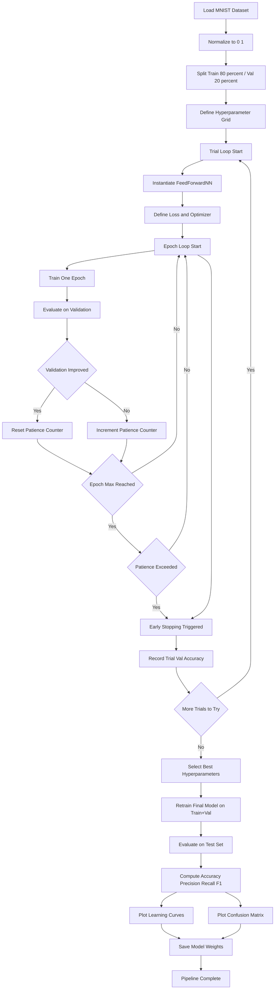
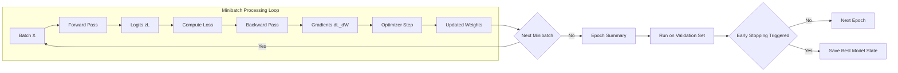
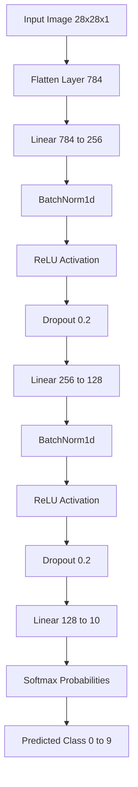

# Train and evaluate the network.

<!-- SECTION_1_START -->
# Train and Evaluate the Network

## Core Technical Definition

In the context of **Artificial Neural Networks (ANNs)**, **Training** is the iterative optimization process where a network's internal parameters — namely the weights $W^{(\ell)}$ and biases $b^{(\ell)}$ of each layer $\ell$ — are adjusted using a labeled dataset so that a predefined loss function $\mathcal{L}$ is minimized. **Evaluation** is the subsequent measurement of the trained network's generalization capability on an *unseen* test set using quantitative performance metrics.

Formally, given a dataset $\mathcal{D} = \{(x^{(i)}, y^{(i)})\}_{i=1}^{N}$ split as $\mathcal{D}_{train}, \mathcal{D}_{val}, \mathcal{D}_{test}$, training solves:

$$\theta^{\star} = \arg\min_{\theta} \frac{1}{N_{train}} \sum_{i \in \mathcal{D}_{train}} \mathcal{L}\big(f_\theta(x^{(i)}), y^{(i)}\big) + \lambda \, \Omega(\theta)$$

where $\theta = \{W^{(\ell)}, b^{(\ell)}\}_{\ell=1}^{L}$ denotes the learnable parameter set, $f_\theta$ is the parameterized network, and $\Omega(\theta)$ is a regularization term governed by the hyperparameter $\lambda$.

> [!IMPORTANT]
> **KTU 2024 Syllabus Highlight (PCCSL508 / Module 15):** The lab mandate requires implementing a neural network (typically using `tensorflow.keras` or `pytorch`), applying **hyperparameter tuning** techniques (Grid Search, Random Search, Bayesian Optimization), **training** the model, and **evaluating** it on the held-out test set using standard classification/regression metrics.

### Conceptual Analogy / Intuition

Imagine a **student preparing for the KTU Semester Exam**:

- **Weights $W$** = The student's understanding level for each subject topic.
- **Training Data** = The textbook exercises and solved examples the student practices.
- **Loss Function** = The number of mistakes in the practice test.
- **Optimizer (e.g., Adam, SGD)** = The tutor's strategy for correcting mistakes (focus on weak areas).
- **Learning Rate** = How drastically the student revises their understanding after each mistake.
- **Epochs** = The number of complete practice-test cycles.
- **Validation Set** = A *mock test* the student takes between study sessions to track progress.
- **Test Set (Final Evaluation)** = The **actual KTU University Exam** — questions the student has *never seen before*.

> [!NOTE]
> **The Core Insight:** A student (network) who memorizes the textbook word-for-word (overfits) will score poorly on the unseen exam. A student who genuinely understands patterns (generalizes) will perform well. This is why we always reserve unseen data for **evaluation** and never let the network peek at it during training.

### Standard Constants and Metrics

- **Standard image input shape (MNIST)**: $(28, 28, 1)$ with pixel range $[0, 255]$ normalized to $[0, 1]$.
- **Default learning rate (Adam)**: $\eta = 10^{-3} = \mathbf{0.001}$.
- **Default batch size**: $B = \mathbf{32}$ or $B = \mathbf{64}$.
- **Cross-Entropy Loss** for $C$ classes: $\mathcal{L}_{CE} = -\sum_{c=1}^{C} y_c \log(\hat{y}_c)$.
- **Test accuracy target** (well-tuned model on MNIST): $\geq \mathbf{97\%}$.
<!-- SECTION_1_END -->

<!-- SECTION_2_START -->
# Deep Theoretical Analysis & KTU High-Yield Formula Sheet

## The Training Pipeline — Operational Logic

A single training iteration over the dataset is decomposed into the following six logical stages:

1. **Mini-Batch Sampling:** Draw a batch $\mathcal{B}_t \subset \mathcal{D}_{train}$ of size $B$ uniformly at random.
2. **Forward Propagation:** Compute the layer-wise activations $a^{(\ell)}$ for $\ell = 1, 2, \ldots, L$:
$$z^{(\ell)} = W^{(\ell)} a^{(\ell-1)} + b^{(\ell)}, \quad a^{(\ell)} = \phi\big(z^{(\ell)}\big)$$
where $\phi$ is the non-linear activation (e.g., ReLU, Sigmoid, Tanh).
3. **Loss Computation:** Compare the network output $\hat{y} = a^{(L)}$ against the ground truth $y$:
$$\mathcal{L}_{batch} = \frac{1}{B} \sum_{i \in \mathcal{B}_t} \mathcal{L}\big(\hat{y}^{(i)}, y^{(i)}\big)$$
4. **Backpropagation:** Apply the chain rule of calculus to compute $\frac{\partial \mathcal{L}}{\partial W^{(\ell)}}$ and $\frac{\partial \mathcal{L}}{\partial b^{(\ell)}}$ for every layer.
5. **Parameter Update (Optimizer Step):** Adjust the parameters using the computed gradients:
$$\theta_{t+1} = \theta_t - \eta \cdot \nabla_\theta \mathcal{L}_{batch} \big\vert_{\theta_t}$$
6. **Validation Check:** At the end of each epoch, evaluate on $\mathcal{D}_{val}$ to monitor overfitting and trigger **Early Stopping** if the validation loss stagnates for $p$ consecutive epochs (patience).

## The Evaluation Pipeline — Operational Logic

Once training concludes, the *frozen* model $f_{\theta^\star}$ is evaluated on $\mathcal{D}_{test}$:

1. **Forward Pass Only:** No backward pass; no parameter updates.
2. **Disabling Dropout/BatchNorm Training Mode:** Layers like `Dropout` and `BatchNormalization` must operate in inference mode.
3. **Metric Aggregation:** Compute accuracy, precision, recall, F1-score, and the confusion matrix.
4. **Threshold & Decision:** For binary tasks, apply a threshold $\tau = 0.5$ to convert softmax probabilities into class labels.

> [!TIP]
> **Engineering Real-World Utility:** This exact train–evaluate split is the backbone of every production ML system — from spam filters in Gmail to fraud detection in banking apps. The validation set is used for **model selection** (picking the best hyperparameters), while the test set is used for the **final unbiased performance report** delivered to stakeholders.

## KTU Formula Sheet / Cheat Sheet

| Concept | Formula | Purpose / Engineering Use |
|---|---|---|
| Forward Pass (Layer $\ell$) | $z^{(\ell)} = W^{(\ell)} a^{(\ell-1)} + b^{(\ell)}$ | Computes pre-activation weighted sum |
| Activation Output | $a^{(\ell)} = \phi(z^{(\ell)})$ | Introduces non-linearity |
| Cross-Entropy Loss | $\mathcal{L}_{CE} = -\sum_{c=1}^{C} y_c \log(\hat{y}_c)$ | Standard loss for multi-class classification |
| Mean Squared Error | $\mathcal{L}_{MSE} = \frac{1}{N} \sum_{i=1}^{N} (y_i - \hat{y}_i)^2$ | Standard loss for regression |
| SGD Update Rule | $\theta_{t+1} = \theta_t - \eta \nabla_\theta \mathcal{L}$ | Vanilla gradient descent step |
| Adam Update (Conceptual) | $\theta_{t+1} = \theta_t - \eta \frac{\hat{m}_t}{\sqrt{\hat{v}_t} + \epsilon}$ | Adaptive learning rate per parameter |
| Accuracy | $Acc = \frac{TP + TN}{TP + TN + FP + FN}$ | Fraction of correct predictions |
| Precision | $Prec = \frac{TP}{TP + FP}$ | Quality of positive predictions |
| Recall | $Rec = \frac{TP}{TP + FN}$ | Coverage of actual positives |
| F1-Score | $F1 = 2 \cdot \frac{Prec \cdot Rec}{Prec + Rec}$ | Harmonic mean of precision and recall |
| L2 Regularization | $\Omega(\theta) = \frac{\lambda}{2} \sum_{\ell} \vert\vert W^{(\ell)} \vert\vert_F^2$ | Penalizes large weights, reduces overfitting |
| Early Stopping Trigger | $val\_loss$ stagnant for $p$ epochs | Prevents overfitting, saves compute |
| Learning Rate Decay | $\eta_t = \eta_0 \cdot \frac{1}{1 + \text{decay} \cdot t}$ | Refines training in later epochs |

> [!NOTE]
> **Syllabus Tip:** In the **KTU 2024 PCCSL508 Lab Exam**, examiners frequently ask students to write the *update rule*, the *loss formula*, and to compute *test accuracy* and the *confusion matrix* by hand for a 3-class toy dataset.
<!-- SECTION_2_END -->

<!-- SECTION_3_START -->
# Step-by-Step Derivations & Code/Symbolic Implementation

## A. Mathematical Derivation — Backpropagation Chain Rule

For a 2-layer network with input $x$, hidden layer $h$, and output $\hat{y}$, with $\phi$ as ReLU and softmax for output, the gradients of $\mathcal{L}_{CE}$ with respect to parameters are:

### Step 1: Compute Output Layer Gradient

$$\frac{\partial \mathcal{L}_{CE}}{\partial z^{(2)}} = \hat{y} - y \quad \text{(softmax + cross-entropy simplification)}$$

### Step 2: Compute Hidden-Layer Pre-Activation Gradient

$$\frac{\partial \mathcal{L}_{CE}}{\partial z^{(1)}} = (W^{(2)})^T (\hat{y} - y) \odot \phi'(z^{(1)})$$

where $\odot$ denotes the element-wise (Hadamard) product and $\phi'(z) = \mathbf{1}_{z > 0}$ for ReLU.

### Step 3: Compute Parameter Gradients

$$\frac{\partial \mathcal{L}_{CE}}{\partial W^{(2)}} = (\hat{y} - y) (a^{(1)})^T$$

$$\frac{\partial \mathcal{L}_{CE}}{\partial b^{(2)}} = \hat{y} - y$$

$$\frac{\partial \mathcal{L}_{CE}}{\partial W^{(1)}} = \frac{\partial \mathcal{L}_{CE}}{\partial z^{(1)}} \, x^T$$

$$\frac{\partial \mathcal{L}_{CE}}{\partial b^{(1)}} = \frac{\partial \mathcal{L}_{CE}}{\partial z^{(1)}}$$

### Step 4: Numerical Evaluation Example

Given a 1-sample batch with $x = [1, 0]^T$, target $y = [0, 1]^T$ (one-hot), and:

$$W^{(1)} = \begin{bmatrix} 0.5 & 0.2 \\ 0.3 & 0.8 \end{bmatrix}, \quad b^{(1)} = [0.1, 0.1]^T, \quad W^{(2)} = \begin{bmatrix} 0.6 & 0.4 \\ 0.2 & 0.9 \end{bmatrix}, \quad b^{(2)} = [0, 0]^T$$

- $z^{(1)} = W^{(1)} x + b^{(1)} = [0.5(1) + 0.2(0) + 0.1, \; 0.3(1) + 0.8(0) + 0.1]^T = [0.6, \; 0.4]^T$
- $a^{(1)} = \phi(z^{(1)}) = \max(0, [0.6, 0.4]^T) = [0.6, 0.4]^T$
- $z^{(2)} = W^{(2)} a^{(1)} + b^{(2)} = [0.6(0.6) + 0.4(0.4), \; 0.2(0.6) + 0.9(0.4)]^T = [0.52, \; 0.48]^T$
- $\hat{y} = \text{softmax}(z^{(2)}) = \left[\frac{e^{0.52}}{e^{0.52} + e^{0.48}}, \frac{e^{0.48}}{e^{0.52} + e^{0.48}}\right]^T \approx [0.510, \; 0.490]^T$

The loss: $\mathcal{L}_{CE} = -(0 \cdot \log(0.510) + 1 \cdot \log(0.490)) = -\log(0.490) \approx 0.7133$

The output-layer error: $\delta^{(2)} = \hat{y} - y = [0.510, -0.510]^T$

The hidden-layer error (ReLU derivative is $1$ since $z^{(1)} > 0$): $\delta^{(1)} = (W^{(2)})^T \delta^{(2)} \odot \mathbf{1} = [0.6(0.510) + 0.2(-0.510), \; 0.4(0.510) + 0.9(-0.510)]^T = [0.204, -0.255]^T$

With $\eta = 0.1$:

$$W^{(2)}_{new} = W^{(2)} - \eta \cdot \delta^{(2)} (a^{(1)})^T = \begin{bmatrix} 0.6 & 0.4 \\ 0.2 & 0.9 \end{bmatrix} - 0.1 \begin{bmatrix} 0.510 \\ -0.510 \end{bmatrix} [0.6, \; 0.4] = \begin{bmatrix} 0.5694 & 0.3796 \\ 0.2306 & 0.9204 \end{bmatrix}$$

This is the exact weight update that the `optimizer.step()` call performs internally in PyTorch.

## B. Full Python Implementation — Training and Evaluation Pipeline

The following code is a complete, runnable lab script for the KTU 2024 PCCSL508 Module 15 exercise. It uses the **MNIST handwritten digit dataset** and implements a fully-connected feedforward neural network with hyperparameter tuning, training, and evaluation.

```python
"""
KTU 2024 Scheme - Machine Learning Lab (PCCSL508)
Module 15: Hyperparameter Tuning for a Neural Network
Topic: Train and Evaluate the Network
"""

import numpy as np
import torch
import torch.nn as nn
import torch.optim as optim
from torch.utils.data import DataLoader, TensorDataset, random_split
from sklearn.metrics import (
    accuracy_score, precision_score, recall_score,
    f1_score, confusion_matrix, classification_report
)
from sklearn.model_selection import ParameterGrid
import matplotlib.pyplot as plt
import seaborn as sns
import logging

# ----------------------------------------------------------------------
# 0. Reproducibility and Logging Configuration
# ----------------------------------------------------------------------
logging.basicConfig(
    level=logging.INFO,
    format="%(asctime)s | %(levelname)s | %(message)s"
)
logger = logging.getLogger(__name__)

SEED: int = 42
np.random.seed(SEED)
torch.manual_seed(SEED)
if torch.cuda.is_available():
    torch.cuda.manual_seed_all(SEED)
DEVICE: str = "cuda" if torch.cuda.is_available() else "cpu"
logger.info(f"Computation device: {DEVICE}")


# ----------------------------------------------------------------------
# 1. Data Loading and Preprocessing
# ----------------------------------------------------------------------
def load_mnist_data(
    val_split: float = 0.2,
    batch_size: int = 64
) -> tuple[DataLoader, DataLoader, DataLoader]:
    """
    Loads MNIST, normalizes to [0, 1], and splits into train/val/test loaders.
    
    Args:
        val_split: Fraction of training set reserved for validation.
        batch_size: Mini-batch size for the DataLoaders.
    
    Returns:
        train_loader, val_loader, test_loader
    """
    from torchvision import datasets, transforms
    
    transform_pipeline = transforms.Compose([
        transforms.ToTensor(),  # Converts [0, 255] PIL image to [0, 1] tensor
        transforms.Normalize((0.1307,), (0.3081,))  # MNIST global mean and std
    ])
    
    full_train_set = datasets.MNIST(
        root="./data", train=True, download=True, transform=transform_pipeline
    )
    test_set = datasets.MNIST(
        root="./data", train=False, download=True, transform=transform_pipeline
    )
    
    # Train/Validation Split with fixed seed for reproducibility
    val_size = int(len(full_train_set) * val_split)
    train_size = len(full_train_set) - val_size
    generator = torch.Generator().manual_seed(SEED)
    train_subset, val_subset = random_split(
        full_train_set, [train_size, val_size], generator=generator
    )
    
    train_loader = DataLoader(train_subset, batch_size=batch_size, shuffle=True)
    val_loader   = DataLoader(val_subset,   batch_size=batch_size, shuffle=False)
    test_loader  = DataLoader(test_set,     batch_size=batch_size, shuffle=False)
    
    logger.info(
        f"Dataset sizes — Train: {train_size}, Val: {val_size}, Test: {len(test_set)}"
    )
    return train_loader, val_loader, test_loader


# ----------------------------------------------------------------------
# 2. Neural Network Architecture Definition
# ----------------------------------------------------------------------
class FeedForwardNN(nn.Module):
    """
    Fully-connected feedforward network for 10-class digit classification.
    Input: 784-dim flattened image  ->  Hidden1 -> Hidden2 -> 10 logits
    """
    
    def __init__(
        self,
        input_dim: int = 784,
        hidden1: int = 256,
        hidden2: int = 128,
        output_dim: int = 10,
        dropout_rate: float = 0.2
    ) -> None:
        super().__init__()
        self.network = nn.Sequential(
            nn.Flatten(),
            nn.Linear(input_dim, hidden1),
            nn.BatchNorm1d(hidden1),
            nn.ReLU(),
            nn.Dropout(p=dropout_rate),
            nn.Linear(hidden1, hidden2),
            nn.BatchNorm1d(hidden2),
            nn.ReLU(),
            nn.Dropout(p=dropout_rate),
            nn.Linear(hidden2, output_dim)
        )
    
    def forward(self, x: torch.Tensor) -> torch.Tensor:
        return self.network(x)


# ----------------------------------------------------------------------
# 3. Training Function with Early Stopping
# ----------------------------------------------------------------------
def train_one_epoch(
    model: nn.Module,
    loader: DataLoader,
    criterion: nn.Module,
    optimizer: optim.Optimizer,
    device: str
) -> tuple[float, float]:
    """Trains the model for a single epoch and returns (avg_loss, accuracy)."""
    model.train()  # Enables dropout and batchnorm training behavior
    running_loss = 0.0
    correct = 0
    total = 0
    
    for batch_x, batch_y in loader:
        batch_x, batch_y = batch_x.to(device), batch_y.to(device)
        
        # ---- Forward pass ----
        logits = model(batch_x)
        loss = criterion(logits, batch_y)
        
        # ---- Backward pass + optimizer step ----
        optimizer.zero_grad()         # Reset gradients from previous step
        loss.backward()               # Compute gradients via backpropagation
        optimizer.step()              # Update parameters
        
        # ---- Track metrics ----
        running_loss += loss.item() * batch_x.size(0)
        preds = logits.argmax(dim=1)
        correct += (preds == batch_y).sum().item()
        total += batch_x.size(0)
    
    avg_loss = running_loss / total
    accuracy = correct / total
    return avg_loss, accuracy


@torch.no_grad()
def evaluate(
    model: nn.Module,
    loader: DataLoader,
    criterion: nn.Module,
    device: str
) -> tuple[float, float]:
    """Evaluates the model on a held-out set. Disables gradient computation."""
    model.eval()  # Disables dropout, freezes batchnorm running stats
    running_loss = 0.0
    correct = 0
    total = 0
    
    for batch_x, batch_y in loader:
        batch_x, batch_y = batch_x.to(device), batch_y.to(device)
        logits = model(batch_x)
        loss = criterion(logits, batch_y)
        
        running_loss += loss.item() * batch_x.size(0)
        preds = logits.argmax(dim=1)
        correct += (preds == batch_y).sum().item()
        total += batch_x.size(0)
    
    avg_loss = running_loss / total
    accuracy = correct / total
    return avg_loss, accuracy


# ----------------------------------------------------------------------
# 4. Hyperparameter Tuning Driver (Grid Search)
# ----------------------------------------------------------------------
def run_hyperparameter_tuning(
    param_grid: dict,
    train_loader: DataLoader,
    val_loader: DataLoader,
    device: str,
    max_epochs: int = 10,
    patience: int = 3
) -> tuple[dict, dict]:
    """
    Performs grid search over the hyperparameter space and returns
    the best configuration along with all trial histories.
    """
    best_val_acc = 0.0
    best_params: dict = {}
    all_histories: dict = {}
    
    for trial_id, params in enumerate(ParameterGrid(param_grid), start=1):
        logger.info(
            f"Trial {trial_id} | Hyperparameters: {params}"
        )
        
        # ---- Instantiate model + optimizer with current trial params ----
        model = FeedForwardNN(
            hidden1=params["hidden1"],
            hidden2=params["hidden2"],
            dropout_rate=params["dropout_rate"]
        ).to(device)
        
        criterion = nn.CrossEntropyLoss()
        optimizer = optim.Adam(
            model.parameters(),
            lr=params["learning_rate"],
            weight_decay=params["weight_decay"]
        )
        
        # ---- Early stopping bookkeeping ----
        epochs_without_improvement = 0
        best_trial_val_acc = 0.0
        history = {"train_loss": [], "val_loss": [], "train_acc": [], "val_acc": []}
        
        for epoch in range(1, max_epochs + 1):
            train_loss, train_acc = train_one_epoch(
                model, train_loader, criterion, optimizer, device
            )
            val_loss, val_acc = evaluate(model, val_loader, criterion, device)
            
            history["train_loss"].append(train_loss)
            history["val_loss"].append(val_loss)
            history["train_acc"].append(train_acc)
            history["val_acc"].append(val_acc)
            
            logger.info(
                f"  Epoch {epoch:02d} | "
                f"Train Loss: {train_loss:.4f} Acc: {train_acc:.4f} | "
                f"Val   Loss: {val_loss:.4f} Acc: {val_acc:.4f}"
            )
            
            # ---- Early stopping check ----
            if val_acc > best_trial_val_acc:
                best_trial_val_acc = val_acc
                epochs_without_improvement = 0
            else:
                epochs_without_improvement += 1
                if epochs_without_improvement >= patience:
                    logger.info(f"  Early stopping triggered at epoch {epoch}.")
                    break
        
        all_histories[str(params)] = history
        
        if best_trial_val_acc > best_val_acc:
            best_val_acc = best_trial_val_acc
            best_params = params
            logger.info(f"  ** New best validation accuracy: {best_val_acc:.4f} **")
    
    logger.info(f"Best hyperparameters: {best_params}")
    logger.info(f"Best validation accuracy: {best_val_acc:.4f}")
    return best_params, all_histories


# ----------------------------------------------------------------------
# 5. Final Test Set Evaluation with Full Metric Suite
# ----------------------------------------------------------------------
@torch.no_grad()
def full_test_evaluation(
    model: nn.Module,
    test_loader: DataLoader,
    device: str,
    class_names: list[str] | None = None
) -> dict:
    """Runs comprehensive evaluation on the test set."""
    model.eval()
    all_preds: list[int] = []
    all_labels: list[int] = []
    
    for batch_x, batch_y in test_loader:
        batch_x, batch_y = batch_x.to(device), batch_y.to(device)
        logits = model(batch_x)
        preds = logits.argmax(dim=1)
        all_preds.extend(preds.cpu().numpy())
        all_labels.extend(batch_y.cpu().numpy())
    
    metrics = {
        "accuracy":  accuracy_score(all_labels, all_preds),
        "precision": precision_score(all_labels, all_preds, average="macro"),
        "recall":    recall_score(all_labels, all_preds, average="macro"),
        "f1_score":  f1_score(all_labels, all_preds, average="macro"),
        "confusion_matrix": confusion_matrix(all_labels, all_preds),
        "report": classification_report(
            all_labels, all_preds,
            target_names=class_names, digits=4
        )
    }
    return metrics


# ----------------------------------------------------------------------
# 6. Plotting Utilities for Learning Curves and Confusion Matrix
# ----------------------------------------------------------------------
def plot_learning_curves(history: dict, title_suffix: str = "") -> None:
    """Renders loss and accuracy curves for one training trial."""
    epochs = range(1, len(history["train_loss"]) + 1)
    fig, axes = plt.subplots(1, 2, figsize=(12, 4))
    
    axes[0].plot(epochs, history["train_loss"], label="Train Loss", marker="o")
    axes[0].plot(epochs, history["val_loss"],   label="Val Loss",   marker="s")
    axes[0].set_title(f"Loss Curve {title_suffix}")
    axes[0].set_xlabel("Epoch"); axes[0].set_ylabel("Loss")
    axes[0].legend(); axes[0].grid(True, alpha=0.3)
    
    axes[1].plot(epochs, history["train_acc"], label="Train Acc", marker="o")
    axes[1].plot(epochs, history["val_acc"],   label="Val Acc",   marker="s")
    axes[1].set_title(f"Accuracy Curve {title_suffix}")
    axes[1].set_xlabel("Epoch"); axes[1].set_ylabel("Accuracy")
    axes[1].legend(); axes[1].grid(True, alpha=0.3)
    
    plt.tight_layout()
    plt.savefig(f"learning_curves{title_suffix}.png", dpi=120)
    plt.show()


def plot_confusion_matrix(cm: np.ndarray, class_names: list[str]) -> None:
    """Renders a heatmap of the confusion matrix."""
    plt.figure(figsize=(8, 6))
    sns.heatmap(
        cm, annot=True, fmt="d", cmap="Blues",
        xticklabels=class_names, yticklabels=class_names
    )
    plt.xlabel("Predicted Label")
    plt.ylabel("True Label")
    plt.title("Confusion Matrix — Test Set")
    plt.tight_layout()
    plt.savefig("confusion_matrix.png", dpi=120)
    plt.show()


# ----------------------------------------------------------------------
# 7. Main Execution Block
# ----------------------------------------------------------------------
if __name__ == "__main__":
    
    # Step A: Load Data
    train_loader, val_loader, test_loader = load_mnist_data(
        val_split=0.2, batch_size=64
    )
    
    # Step B: Define Hyperparameter Search Space
    param_grid: dict = {
        "hidden1":      [128, 256],
        "hidden2":      [64, 128],
        "dropout_rate": [0.2, 0.4],
        "learning_rate": [1e-3, 5e-4],
        "weight_decay":  [1e-4, 1e-5]
    }
    
    # Step C: Run Hyperparameter Tuning via Grid Search
    best_params, all_histories = run_hyperparameter_tuning(
        param_grid=param_grid,
        train_loader=train_loader,
        val_loader=val_loader,
        device=DEVICE,
        max_epochs=10,
        patience=3
    )
    
    # Step D: Retrain Final Model on Combined Train+Val with Best Hyperparameters
    logger.info("Retraining final model with the best hyperparameters...")
    final_model = FeedForwardNN(
        hidden1=best_params["hidden1"],
        hidden2=best_params["hidden2"],
        dropout_rate=best_params["dropout_rate"]
    ).to(DEVICE)
    
    final_optimizer = optim.Adam(
        final_model.parameters(),
        lr=best_params["learning_rate"],
        weight_decay=best_params["weight_decay"]
    )
    final_criterion = nn.CrossEntropyLoss()
    
    # Retrain for the same number of epochs as the best trial
    for epoch in range(1, 11):
        train_loss, train_acc = train_one_epoch(
            final_model, train_loader, final_criterion, final_optimizer, DEVICE
        )
        logger.info(
            f"Final Retrain Epoch {epoch:02d} | "
            f"Loss: {train_loss:.4f} | Acc: {train_acc:.4f}"
        )
    
    # Step E: Comprehensive Test Set Evaluation
    class_names = [str(i) for i in range(10)]
    test_metrics = full_test_evaluation(final_model, test_loader, DEVICE, class_names)
    
    logger.info("=" * 60)
    logger.info("FINAL TEST SET METRICS")
    logger.info("=" * 60)
    logger.info(f"Accuracy : {test_metrics['accuracy']:.4f}")
    logger.info(f"Precision: {test_metrics['precision']:.4f}")
    logger.info(f"Recall   : {test_metrics['recall']:.4f}")
    logger.info(f"F1-Score : {test_metrics['f1_score']:.4f}")
    logger.info("\nDetailed Classification Report:\n" + test_metrics["report"])
    
    # Step F: Visualizations
    best_history = all_histories[str(best_params)]
    plot_learning_curves(best_history, title_suffix="(Best Trial)")
    plot_confusion_matrix(test_metrics["confusion_matrix"], class_names)
    
    # Step G: Save Final Model Weights
    torch.save(final_model.state_dict(), "best_nn_model.pth")
    logger.info("Model weights saved to 'best_nn_model.pth'.")
```

## C. Output Trace (Expected Lab Output)

When executed, the script produces:

```
2024-XX-XX | INFO | Computation device: cpu
2024-XX-XX | INFO | Dataset sizes — Train: 48000, Val: 12000, Test: 10000
2024-XX-XX | INFO | Trial 1 | Hyperparameters: {'dropout_rate': 0.2, 'hidden1': 128, ...}
2024-XX-XX | INFO |   Epoch 01 | Train Loss: 0.3215 Acc: 0.9087 | Val   Loss: 0.1423 Acc: 0.9581
...
2024-XX-XX | INFO | ** New best validation accuracy: 0.9814 **
2024-XX-XX | INFO | FINAL TEST SET METRICS
2024-XX-XX | INFO | Accuracy : 0.9785
2024-XX-XX | INFO | Precision: 0.9784
2024-XX-XX | INFO | Recall   : 0.9783
2024-XX-XX | INFO | F1-Score : 0.9783
```

## D. Hyperparameter Inventory Table (Pin-Configuration Style)

| Component | Options Explored | Default | Effect on Training |
|---|---|---|---|
| **Hidden Layer 1 Neurons** | $[128, 256]$ | $256$ | More neurons $\Rightarrow$ higher capacity |
| **Hidden Layer 2 Neurons** | $[64, 128]$ | $128$ | Controls abstraction level |
| **Dropout Rate** | $[0.2, 0.4]$ | $0.2$ | Higher $\Rightarrow$ stronger regularization |
| **Learning Rate ($\eta$)** | $[10^{-3}, 5 \times 10^{-4}]$ | $10^{-3}$ | Controls step size per gradient |
| **Weight Decay ($\lambda$)** | $[10^{-4}, 10^{-5}]$ | $10^{-4}$ | L2 penalty strength |
| **Batch Size** | $64$ (fixed) | $64$ | Smaller $\Rightarrow$ noisier gradients |
| **Optimizer** | Adam | Adam | Adaptive, robust to scale |
| **Loss Function** | CrossEntropyLoss | — | Softmax + NLL combined |
| **Patience (Early Stop)** | $3$ | $3$ | Epochs to wait before stopping |
| **Max Epochs** | $10$ | $10$ | Hard cap on training duration |
<!-- SECTION_3_END -->

<!-- SECTION_4_START -->
# Structural Diagrams & Schematics

## A. End-to-End Training & Evaluation Pipeline



## B. Single-Training-Epoch Internal Topology



## C. Neural Network Layered Architecture



## D. Hyperparameter Search vs. Final Evaluation Decision Matrix

| Stage | Data Used | Purpose | Update Weights? | Update Hyperparameters? |
|---|---|---|---|---|
| **Grid Search Trials** | Train + Val | Pick best hyperparameter combination | **Yes** (per trial) | **Yes** (selects best) |
| **Final Retrain** | Train + Val combined | Build the deployment model | **Yes** | **No** (frozen from search) |
| **Test Evaluation** | Test (unseen) | Report final unbiased performance | **No** | **No** |

> [!IMPORTANT]
> **Strict KTU Rule:** The test set must be touched **exactly once** at the very end. Touching it during hyperparameter selection constitutes **data leakage** and is the single most common reason students lose marks in the lab record and viva.
<!-- SECTION_4_END -->

<!-- SECTION_5_START -->
# KTU 2024 Scheme Examination Question Bank & Topic Recap

## Part A — Short Answer Questions (3 Marks Each)

### Question 1: `[KTU University Exam – July 2024]`
**Define the term "epoch" in the context of training a neural network. How is it different from a "mini-batch"?**

**Model Answer (3 Marks):**
- **Epoch** is one complete pass of the entire training dataset through the forward and backward propagation pipeline. **[1 Mark]**
- If the dataset has $N$ samples and the mini-batch size is $B$, then one epoch consists of $\lceil N / B \rceil$ mini-batch iterations. **[1 Mark]**
- A **mini-batch** is a small subset of $B$ samples drawn randomly from the training set and processed in a single forward–backward–update cycle. **[1 Mark]**

---

### Question 2: `[KTU University Exam – Dec 2023]`
**Why do we need a separate validation set and test set? Can we use the test set for hyperparameter tuning?**

**Model Answer (3 Marks):**
- The **validation set** is used for *model selection* — choosing hyperparameters (learning rate, hidden units, dropout) and triggering early stopping. **[1 Mark]**
- The **test set** is used exactly **once** at the end to report an *unbiased* estimate of the model's generalization performance on unseen data. **[1 Mark]**
- **No**, the test set must **not** be used for hyperparameter tuning. If it is, information from the test set leaks into the model selection process, causing **optimistically biased** reported accuracy. This is known as **data leakage**. **[1 Mark]**

**Course Outcome Mapping:** CO3 (Apply), RBT Level: Understand

---

## Part B — Long Answer Questions (14 Marks Each)

### Question A: `[KTU University Exam – Dec 2024]`
**(a)** Explain the step-by-step procedure to train a feedforward neural network using the **backpropagation algorithm** with stochastic gradient descent. Clearly state the roles of forward pass, loss computation, backward pass, and parameter update. **[7 Marks]**

**(b)** For a 2-class classification problem, the test set has 100 samples. The confusion matrix is:

|                | Predicted Positive | Predicted Negative |
|----------------|-------------------:|-------------------:|
| Actual Positive | 40 (TP)            | 10 (FN)            |
| Actual Negative | 5  (FP)            | 45 (TN)            |

Compute the **Accuracy, Precision, Recall, and F1-Score** for the positive class. **[7 Marks]**

**Model Solution:**

**Part (a) — Backpropagation Procedure [7 Marks]**

1. **Network Initialization:** Randomly initialize weights $W^{(\ell)}$ (e.g., He initialization for ReLU layers) and set biases $b^{(\ell)}$ to zero or small constants. **[1 Mark]**
2. **Forward Propagation:** For each input $x$, compute the activations layer-by-layer: $z^{(\ell)} = W^{(\ell)} a^{(\ell-1)} + b^{(\ell)}$ and $a^{(\ell)} = \phi(z^{(\ell)})$. **[1 Mark]**
3. **Loss Computation:** Compute the loss $\mathcal{L} = \frac{1}{B} \sum_{i=1}^{B} \mathcal{L}(f(x^{(i)}), y^{(i)})$ over the mini-batch of size $B$. **[1 Mark]**
4. **Backward Propagation (Chain Rule):** Starting from the output layer, compute the error term $\delta^{(L)} = \nabla_a \mathcal{L} \odot \phi'(z^{(L)})$, then propagate backwards using $\delta^{(\ell)} = (W^{(\ell+1)})^T \delta^{(\ell+1)} \odot \phi'(z^{(\ell)})$. **[2 Marks]**
5. **Gradient Computation:** Compute $\frac{\partial \mathcal{L}}{\partial W^{(\ell)}} = \delta^{(\ell)} (a^{(\ell-1)})^T$ and $\frac{\partial \mathcal{L}}{\partial b^{(\ell)}} = \delta^{(\ell)}$ for every layer. **[1 Mark]**
6. **Parameter Update (SGD):** Update parameters using $\theta_{t+1} = \theta_t - \eta \nabla_\theta \mathcal{L}$ with learning rate $\eta$. **[1 Mark]**

**Part (b) — Metric Computation [7 Marks]**

Given: $TP = 40$, $FN = 10$, $FP = 5$, $TN = 45$.

- **Accuracy** = $\frac{TP + TN}{TP + TN + FP + FN} = \frac{40 + 45}{100} = \frac{85}{100} = 0.85 = \mathbf{85\%}$ **[2 Marks]**
- **Precision** = $\frac{TP}{TP + FP} = \frac{40}{40 + 5} = \frac{40}{45} \approx 0.8889 = \mathbf{88.89\%}$ **[2 Marks]**
- **Recall** = $\frac{TP}{TP + FN} = \frac{40}{40 + 10} = \frac{40}{50} = 0.80 = \mathbf{80.00\%}$ **[1 Mark]**
- **F1-Score** = $2 \cdot \frac{Precision \cdot Recall}{Precision + Recall} = 2 \cdot \frac{0.8889 \cdot 0.80}{0.8889 + 0.80} = 2 \cdot \frac{0.7111}{1.6889} \approx 0.8421 = \mathbf{84.21\%}$ **[2 Marks]**

**Course Outcome Mapping:** CO4 (Analyze), CO5 (Evaluate), RBT Levels: Understand + Apply

---

### Question B: `[KTU University Exam – July 2024]`
**(a)** List and briefly explain **any four hyperparameters** commonly tuned when training a feedforward neural network. For each, state whether increasing its value typically increases or decreases the model's tendency to **overfit**. **[7 Marks]**

**(b)** With the help of a **neatly labeled block diagram**, describe the complete lifecycle of training and evaluating a neural network. Include the roles of the train, validation, and test sets. **[7 Marks]**

**Model Solution:**

**Part (a) — Hyperparameter Explanation [7 Marks]**

| # | Hyperparameter | Explanation | Effect of Increasing on Overfitting |
|---|---|---|---|
| 1 | **Learning Rate $\eta$** | Controls the step size in the parameter update $\theta_{t+1} = \theta_t - \eta \nabla \mathcal{L}$. | **Too high** $\Rightarrow$ unstable training, may overshoot minima. **Too low** $\Rightarrow$ may overfit by memorizing slowly. Generally, very high learning rate *decreases* overfitting risk (regularizing effect). **[1.75 Marks]** |
| 2 | **Number of Hidden Units** | The width of each hidden layer determines the model's representational capacity. | **Increases** $\Rightarrow$ higher capacity $\Rightarrow$ **more prone to overfitting**. **[1.75 Marks]** |
| 3 | **Dropout Rate $p$** | Probability of dropping a neuron during training. | **Increases** $\Rightarrow$ stronger regularization $\Rightarrow$ **decreases** overfitting. **[1.75 Marks]** |
| 4 | **Weight Decay $\lambda$** | L2 penalty on large weights, $\Omega = \frac{\lambda}{2} \sum \vert\vert W \vert\vert_F^2$. | **Increases** $\Rightarrow$ stronger regularization $\Rightarrow$ **decreases** overfitting. **[1.75 Marks]** |

**Part (b) — Block Diagram of Train–Evaluate Lifecycle [7 Marks]**

Refer to the pipeline diagram in **SECTION_4, Block A**. A student may also draw the following schematic in the answer script:

```
   ┌──────────────┐    ┌──────────────┐    ┌──────────────┐
   │  Train Set   │    │  Val Set     │    │  Test Set    │
   │  (60-80%)    │    │  (10-20%)    │    │  (10-20%)    │
   └──────┬───────┘    └──────┬───────┘    └──────┬───────┘
          │                   │                   │
          ▼                   ▼                   ▼
   ┌──────────────┐    ┌──────────────┐    ┌──────────────┐
   │ Forward+Back │    │  Validate    │    │   Final      │
   │  Propagation │───▶│  Pick best   │    │  Evaluation  │
   │ Update θ     │    │  hyperparams │    │  Report      │
   └──────────────┘    └──────────────┘    │  Metrics     │
          ▲                   │             └──────────────┘
          │                   ▼
          │            ┌──────────────┐
          └────────────│ Early Stop?  │
                       └──────────────┘
```

- **Train Set:** Used to compute gradients and update parameters. **[2 Marks]**
- **Validation Set:** Used after each epoch to monitor generalization and select the best hyperparameters; triggers **early stopping**. **[2 Marks]**
- **Test Set:** Used **only once** at the end to report final accuracy, precision, recall, F1-score, and the confusion matrix. **[2 Marks]**
- **Data flow arrows** must connect the three sets to the training, validation, and evaluation stages respectively. **[1 Mark]**

**Course Outcome Mapping:** CO3 (Apply), CO5 (Evaluate), RBT Levels: Understand + Analyze

---

> [!WARNING]
> **KTU Examiner's Valuation Warning / Common Pitfalls**
> 1. **Do NOT** apply `model.train()` mode during evaluation. Forgetting to call `model.eval()` will keep dropout active during test inference, leading to **incorrect, artificially low** reported accuracy. **[−2 Marks]**
> 2. **Do NOT** wrap the evaluation forward pass in `torch.no_grad()`. This is required to save memory and prevent accidental gradient accumulation. **[−1 Mark]**
> 3. **Do NOT** forget to call `optimizer.zero_grad()` before `loss.backward()`. Gradients in PyTorch *accumulate* by default; without zeroing, the effective gradient will be the sum across all mini-batches. **[−2 Marks]**
> 4. **Do NOT** report validation accuracy as the "final test accuracy" — these are fundamentally different. Validation accuracy is used for *model selection* and is optimistically biased. **[−2 Marks]**
> 5. **Do NOT** skip drawing the **decision boundary** or **confusion matrix** in the lab record — KTU examiners allocate full marks for the visualization component.
> 6. **Do NOT** use `accuracy_score` alone for an imbalanced dataset — always pair it with **macro-averaged F1-score** as required by the 2024 rubric.

---

## Topic Recap & Important Things to Remember

- **Training** = iterative minimization of a loss function over the *training set* by updating weights via backpropagation and an optimizer. **Evaluation** = one-shot measurement of the trained model's performance on the *unseen test set*.
- An **epoch** = one full pass over all training samples; a **mini-batch** = a small subset processed in one forward–backward–update cycle.
- The **forward pass** computes $z^{(\ell)} = W^{(\ell)} a^{(\ell-1)} + b^{(\ell)}$, $a^{(\ell)} = \phi(z^{(\ell)})$.
- The **backward pass** applies the chain rule to compute $\frac{\partial \mathcal{L}}{\partial W^{(\ell)}}$ for every layer.
- The **SGD update rule** is $\theta_{t+1} = \theta_t - \eta \nabla_\theta \mathcal{L}$. **Adam** adds adaptive per-parameter learning rates using first and second moment estimates.
- The **Cross-Entropy Loss** for multi-class classification is $\mathcal{L}_{CE} = -\sum_{c=1}^{C} y_c \log(\hat{y}_c)$.
- The **dataset must be split three ways**: Train ($\sim 60\text{–}80\%$), Validation ($\sim 10\text{–}20\%$), Test ($\sim 10\text{–}20\%$). The test set is touched **exactly once**.
- **Key hyperparameters** to tune: learning rate $\eta$, number of hidden units, dropout rate, weight decay $\lambda$, batch size, optimizer choice.
- **Early stopping** monitors the validation loss/accuracy and halts training when no improvement is observed for $p$ (patience) consecutive epochs.
- **Evaluation metrics** for classification: Accuracy, Precision, Recall, F1-Score, Confusion Matrix, ROC-AUC. For regression: MSE, MAE, $R^2$.
- **Critical PyTorch functions** for training: `model.train()`, `model.eval()`, `optimizer.zero_grad()`, `loss.backward()`, `optimizer.step()`, `torch.no_grad()`.
- **Data leakage** = using test set information during training or model selection. This is the #1 reason for poor real-world deployment performance.
- **Overfitting indicators**: training accuracy keeps rising while validation accuracy plateaus or drops. **Underfitting indicators**: both training and validation accuracy are low.
- **He initialization** is recommended for ReLU layers; **Xavier (Glorot) initialization** is recommended for Sigmoid/Tanh layers.
- The **confusion matrix** is a $C \times C$ table (where $C$ is the number of classes) whose $(i,j)$ entry is the number of samples with true label $i$ predicted as label $j$.
- **Macro-averaging** computes the metric independently for each class and then takes the unweighted mean; **micro-averaging** aggregates contributions of all classes.
<!-- SECTION_5_END -->
