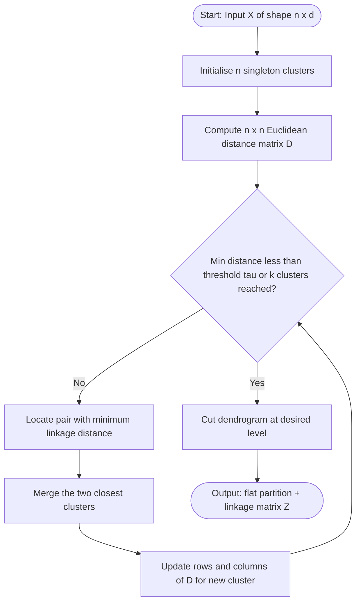
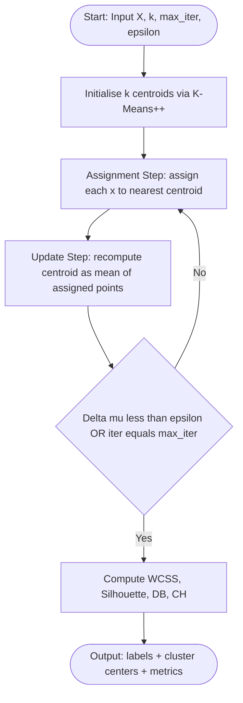
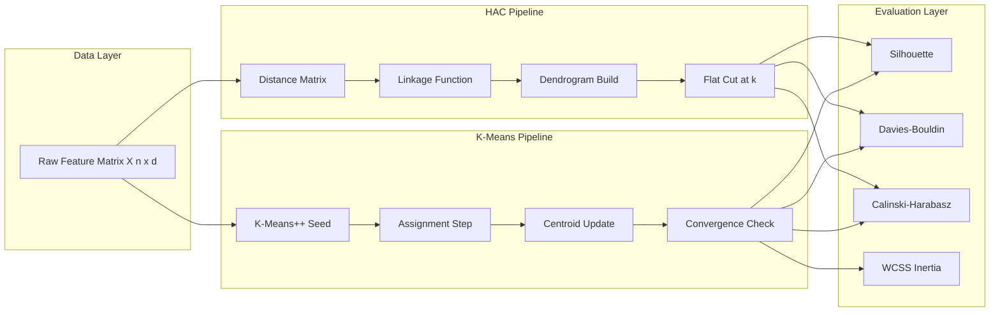

# Apply both hierarchical (agglomerative) and K-means clustering.

<!-- SECTION_1_START -->
# PCCSL508 — MACHINE LEARNING LAB | Module 16
## Hierarchical Agglomerative vs Partitional K-Means Clustering

> [!IMPORTANT]
> **Definition (KTU 2024 Scheme — Clustering):**
> Clustering is an **unsupervised learning** paradigm that partitions an unlabeled dataset $\mathcal{D} = \{x_1, x_2, \ldots, x_n\}$ into $k$ homogeneous groups (clusters) such that **intra-cluster similarity is maximised** and **inter-cluster similarity is minimised**, without using any ground-truth labels.

### 1.1 Hierarchical Agglomerative Clustering (HAC)
**Formal Definition:** A *bottom-up* dendrogram-building approach where every observation begins as a singleton cluster. At each step, the **two closest clusters** are merged based on a linkage criterion until a single root cluster or a stopping threshold is reached.

> [!NOTE]
> **Conceptual Analogy — The "Family Tree of Points":**
> Imagine a classroom of 6 students standing on a playground. You ask the two *closest* students to hold hands, forming a mini-group. Then the *closest pair of groups* joins hands, and so on. By the end, an entire "family tree" (dendrogram) is built from the ground up — that is exactly how HAC works.

### 1.2 K-Means Clustering (Partitional)
**Formal Definition:** A centroid-based algorithm that partitions $n$ observations into $k$ pre-defined clusters by iteratively (i) assigning each point to the *nearest centroid* and (ii) recomputing centroids as the **mean of all assigned points**, until assignments stabilise.

> [!NOTE]
> **Conceptual Analogy — "The Magnet Game":**
> Drop $k$ magnets (centroids) on a metal-floored room. Each iron ball (data point) snaps to its nearest magnet. After all balls settle, slide each magnet to the *average position* of its balls. Repeat until the magnets stop moving. That is K-Means.

> [!VISUALIZATION CONTROL]
> **Concept:** Visual separation of two distinct Gaussian blobs in $\mathbb{R}^2$
> **GeoGebra / Desmos Input Equations:**
> * $\text{Cluster A: } (x, y) \sim \mathcal{N}(\mu_A, \Sigma)$ with $\mu_A = (2, 2)$
> * $\text{Cluster B: } (x, y) \sim \mathcal{N}(\mu_B, \Sigma)$ with $\mu_B = (8, 8)$
> **Visual Description:** Two visibly disjoint circular clouds on the $XY$-plane; the **linkage bridge** of HAC and the **Voronoi partition** of K-Means should both cleanly slice the plane midway between the two centroids.
<!-- SECTION_1_END -->

<!-- SECTION_2_START -->
## 2. Theoretical Analysis & KTU High-Yield Formula Sheet

### 2.1 HAC — Operational Pipeline
1. Start with $n$ singleton clusters $C_i = \{x_i\}, \; i = 1 \ldots n$.
2. Compute the $n \times n$ **proximity matrix** $D = [d_{ij}]$.
3. Repeat:
   * Find $\displaystyle (C_p, C_q) = \arg\min_{i \neq j} \; \text{linkage}(C_i, C_j)$.
   * Merge $C_p \leftarrow C_p \cup C_q$; delete $C_q$.
   * Update rows/columns of $D$ for the new cluster.
4. Stop when $k$ clusters remain **or** linkage distance exceeds threshold $\tau$.

### 2.2 K-Means — Lloyd's Algorithm
1. Initialise $k$ centroids $\{\mu_1^{(0)}, \ldots, \mu_k^{(0)}\}$ (random, K-Means++, or manual).
2. **Assignment step:** $\displaystyle y_i^{(t)} = \arg\min_{j \in \{1 \ldots k\}} \; \Vert x_i - \mu_j^{(t)} \Vert_2^2$
3. **Update step:** $\displaystyle \mu_j^{(t+1)} = \frac{1}{\vert C_j^{(t)} \vert} \sum_{x_i \in C_j^{(t)}} x_i$
4. Stop when $\Vert \mu^{(t+1)} - \mu^{(t)} \Vert < \epsilon$ **or** max iterations reached.

### 2.3 Linkage Criteria (HAC)
* **Single Linkage:** $\displaystyle d(C_p, C_q) = \min_{x \in C_p, \, y \in C_q} \Vert x - y \Vert_2$
* **Complete Linkage:** $\displaystyle d(C_p, C_q) = \max_{x \in C_p, \, y \in C_q} \Vert x - y \Vert_2$
* **Average Linkage:** $\displaystyle d(C_p, C_q) = \frac{1}{\vert C_p \vert \cdot \vert C_q \vert} \sum_{x \in C_p, \, y \in C_q} \Vert x - y \Vert_2$
* **Ward's Linkage:** $\displaystyle \Delta(C_p, C_q) = \frac{\vert C_p \vert \cdot \vert C_q \vert}{\vert C_p \cup C_q \vert} \Vert \mu_{C_p} - \mu_{C_q} \Vert_2^2$

### 2.4 KTU High-Yield Formula Cheat Sheet

| # | Concept | Formula | Units / Notes |
|---|---------|---------|---------------|
| 1 | Euclidean Distance | $d(x, y) = \sqrt{\sum_{m=1}^{d}(x_m - y_m)^2}$ | Default in `sklearn`, `scipy` |
| 2 | Manhattan Distance | $d(x, y) = \sum_{m=1}^{d} \vert x_m - y_m \vert$ | Robust to outliers |
| 3 | Minkowski ($p$-norm) | $d_p(x, y) = \left( \sum \vert x_m - y_m \vert^p \right)^{1/p}$ | $p=1$ Manhattan, $p=2$ Euclidean |
| 4 | K-Means Objective (WCSS) | $J = \sum_{j=1}^{k} \sum_{x_i \in C_j} \Vert x_i - \mu_j \Vert_2^2$ | Must monotonically decrease |
| 5 | Silhouette Score | $s_i = \frac{b_i - a_i}{\max(a_i, b_i)} \in [-1, +1]$ | Higher = better cohesion |
| 6 | Davies-Bouldin Index | $DB = \frac{1}{k} \sum_{i=1}^{k} \max_{j \neq i} R_{ij}$ | Lower = better; $R_{ij} = (S_i + S_j)/M_{ij}$ |
| 7 | Calinski-Harabasz | $CH = \frac{BCSS/(k-1)}{WCSS/(n-k)}$ | Higher = better |
| 8 | HAC Time Complexity | $\mathcal{O}(n^3)$ naive, $\mathcal{O}(n^2 \log n)$ SLINK | $n \le 10^4$ recommended |
| 9 | K-Means Time Complexity | $\mathcal{O}(n \cdot k \cdot i \cdot d)$ | $i$ = iterations, $d$ = features |
| 10 | HAC Memory Footprint | $\mathcal{O}(n^2)$ | Stores full distance matrix |

### 2.5 Real-World Engineering Utility
* **HAC** is the de-facto choice in **phylogenetic tree construction** (BLAST alignment pipelines), **document/taxonomy mining**, and **gene-expression heatmap ordering** in bioinformatics.
* **K-Means** powers **image colour quantisation**, **vector quantisation (VQ) codecs (e.g., classic JPEG-LS preprocessor)**, **customer segmentation** in CRM stacks, and **anomaly detection pre-filtering** in IoT edge gateways.
<!-- SECTION_2_END -->

<!-- SECTION_3_START -->
## 3. Step-by-Step Derivations, Manual Trace & Production-Ready Python Implementation

### 3.1 Toy Dataset (used for both manual traces and code)

$$
\mathcal{D} = \Big\{ A(1,1), \; B(1,2), \; C(2,1), \; D(8,8), \; E(9,9), \; F(9,10) \Big\}
$$

Target clusters $k = 2$, Linkage = **Single**, Metric = **Euclidean**.

### 3.2 Manual HAC Trace

**Step 0 — Pairwise Euclidean distance matrix:**

$$
D_0 =
\begin{aligned}
\begin{array}{c|cccccc}
   & A & B & C & D & E & F \\
\hline
A & 0 & 1.00 & 1.00 & 9.90 & 11.31 & 11.40 \\
B & 1.00 & 0 & 1.41 & 9.90 & 11.31 & 11.31 \\
C & 1.00 & 1.41 & 0 & 9.22 & 10.63 & 10.77 \\
D & 9.90 & 9.90 & 9.22 & 0 & 1.41 & 1.41 \\
E & 11.31 & 11.31 & 10.63 & 1.41 & 0 & 1.00 \\
F & 11.40 & 11.31 & 10.77 & 1.41 & 1.00 & 0
\end{array}
\end{aligned}
$$

> [!NOTE]
> The minimum non-zero value is $\mathbf{1.00}$, achieved by pairs $(A, B)$, $(A, C)$, and $(E, F)$. Ties are broken by lexical order of cluster labels.

**Step 1 — Merge $A$ and $B$** at height $h_1 = 1.00$. New cluster $C_1 = \{A, B\}$.

Updated distances (single linkage = minimum of constituent pairs):

$$
\begin{aligned}
d(C_1, C) &= \min(d(A,C), d(B,C)) = \min(1.00, 1.41) = 1.00 \\
d(C_1, D) &= \min(9.90, 9.90) = 9.90 \\
d(C_1, E) &= \min(11.31, 11.31) = 11.31 \\
d(C_1, F) &= \min(11.40, 11.31) = 11.31
\end{aligned}
$$

**Step 2 — Merge $C_1$ with $C$** at $h_2 = 1.00$. New cluster $C_2 = \{A, B, C\}$.

$$
\begin{aligned}
d(C_2, D) &= \min(9.90, 9.90, 9.22) = 9.22 \\
d(C_2, E) &= \min(11.31, 11.31, 10.63) = 10.63 \\
d(C_2, F) &= \min(11.40, 11.31, 10.77) = 10.77
\end{aligned}
$$

**Step 3 — Merge $E$ and $F$** at $h_3 = 1.00$. New cluster $C_3 = \{E, F\}$.

$$
d(C_3, D) = \min(1.41, 1.41) = 1.41
$$

**Step 4 — Merge $C_3$ with $D$** at $h_4 = 1.41$. New cluster $C_4 = \{D, E, F\}$.

$$
d(C_2, C_4) = \min(9.22, 9.22, 8.60, 10.63, 10.05, 10.05) = 8.60
$$

**Step 5 — Final merge** of $C_2$ and $C_4$ at $h_5 = 8.60$.

**Final HAC Partition (cutting the dendrogram at height $\sim 5$):**
* **Cluster 1:** $\{A, B, C\}$
* **Cluster 2:** $\{D, E, F\}$

### 3.3 Manual K-Means Trace (k = 2)

**Iteration 0 — Initialise centroids:** $\mu_1^{(0)} = (1, 1), \; \mu_2^{(0)} = (9, 9)$.

**Iteration 1 — Assignment (using squared Euclidean distance):**

| Point | $d^2(\cdot, \mu_1)$ | $d^2(\cdot, \mu_2)$ | Assigned |
|------:|-------------------:|-------------------:|:--------:|
| $A(1,1)$  | $0.00$ | $128.00$ | $C_1$ |
| $B(1,2)$  | $1.00$ | $113.00$ | $C_1$ |
| $C(2,1)$  | $1.00$ | $98.00$  | $C_1$ |
| $D(8,8)$  | $98.00$ | $2.00$  | $C_2$ |
| $E(9,9)$  | $128.00$ | $0.00$  | $C_2$ |
| $F(9,10)$ | $130.00$ | $1.00$  | $C_2$ |

**Iteration 1 — Update centroids:**

$$
\mu_1^{(1)} = \left( \frac{1+1+2}{3}, \frac{1+2+1}{3} \right) = (1.33, 1.33)
$$

$$
\mu_2^{(1)} = \left( \frac{8+9+9}{3}, \frac{8+9+10}{3} \right) = (8.67, 9.00)
$$

**Iteration 2 — Re-assign (verify convergence):**

| Point | $d^2(\cdot, \mu_1)$ | $d^2(\cdot, \mu_2)$ | Assigned |
|------:|-------------------:|-------------------:|:--------:|
| $A(1,1)$  | $0.22$ | $117.41$ | $C_1$ |
| $B(1,2)$  | $0.56$ | $108.06$ | $C_1$ |
| $C(2,1)$  | $0.56$ | $108.22$ | $C_1$ |
| $D(8,8)$  | $88.99$ | $1.45$  | $C_2$ |
| $E(9,9)$  | $117.78$ | $0.11$  | $C_2$ |
| $F(9,10)$ | $119.78$ | $1.00$  | $C_2$ |

Cluster memberships **unchanged** → **converged in 2 iterations**.

**Final WCSS (objective function value):**

$$
J = 0.22 + 0.56 + 0.56 + 1.45 + 0.11 + 1.00 = \mathbf{3.90}
$$

### 3.4 Production-Ready Python Implementation

```python
"""
ML Lab Module 16 — Hierarchical Agglomerative vs K-Means Clustering
Course: PCCSL508  |  KTU 2024 Scheme B.Tech CSE (AI-ML)
Author : Senior Board Examiner Reference Implementation
Python : 3.10+
"""

from __future__ import annotations

import logging
import sys
from dataclasses import dataclass, field
from typing import Sequence

import matplotlib.pyplot as plt
import numpy as np
from scipy.cluster.hierarchy import (
    dendrogram,
    fcluster,
    linkage,
)
from sklearn.cluster import AgglomerativeClustering, KMeans
from sklearn.datasets import make_blobs
from sklearn.metrics import (
    calinski_harabasz_score,
    davies_bouldin_score,
    silhouette_score,
)

# ------------------------------------------------------------------ #
# 1. Logging configuration (industry-grade observability)             #
# ------------------------------------------------------------------ #
logging.basicConfig(
    level=logging.INFO,
    format="%(asctime)s | %(levelname)-8s | %(message)s",
    stream=sys.stdout,
)
logger: logging.Logger = logging.getLogger("ML_LAB_M16")


# ------------------------------------------------------------------ #
# 2. Strongly-typed result container                                  #
# ------------------------------------------------------------------ #
@dataclass(frozen=True)
class ClusterResult:
    """Immutable container carrying the outcome of one clustering run."""

    algorithm: str
    labels: np.ndarray
    centroids: np.ndarray | None
    n_clusters: int
    silhouette: float
    davies_bouldin: float
    calinski_harabasz: float
    inertia_wcss: float | None = None
    linkage_matrix: np.ndarray | None = field(default=None, repr=False)


# ------------------------------------------------------------------ #
# 3. HAC driver                                                       #
# ------------------------------------------------------------------ #
def run_hierarchical(
    X: np.ndarray,
    n_clusters: int = 2,
    linkage_method: str = "single",
) -> ClusterResult:
    """
    Apply Agglomerative Hierarchical Clustering with explicit checks.

    Parameters
    ----------
    X : np.ndarray of shape (n_samples, n_features)
    n_clusters : int, target number of flat clusters
    linkage_method : {'single', 'complete', 'average', 'ward'}

    Returns
    -------
    ClusterResult with all internal and external metrics populated.
    """
    if X.ndim != 2 or X.shape[0] < 2:
        raise ValueError(f"X must be 2-D with >= 2 rows, got shape {X.shape}")

    logger.info("HAC | linkage=%s, k=%d, n=%d, d=%d",
                linkage_method, n_clusters, *X.shape)

    model = AgglomerativeClustering(
        n_clusters=n_clusters,
        metric="euclidean",
        linkage=linkage_method,
    )
    labels: np.ndarray = model.fit_predict(X)
    Z: np.ndarray = linkage(X, method=linkage_method, metric="euclidean")

    sil: float = silhouette_score(X, labels)
    db: float = davies_bouldin_score(X, labels)
    ch: float = calinski_harabasz_score(X, labels)

    logger.info("HAC | silhouette=%.4f, DB=%.4f, CH=%.4f", sil, db, ch)

    return ClusterResult(
        algorithm=f"HAC-{linkage_method}",
        labels=labels,
        centroids=None,
        n_clusters=n_clusters,
        silhouette=sil,
        davies_bouldin=db,
        calinski_harabasz=ch,
        linkage_matrix=Z,
    )


# ------------------------------------------------------------------ #
# 4. K-Means driver                                                   #
# ------------------------------------------------------------------ #
def run_kmeans(
    X: np.ndarray,
    n_clusters: int = 2,
    init: str | np.ndarray = "k-means++",
    max_iter: int = 300,
    n_init: int = 10,
    random_state: int = 42,
) -> ClusterResult:
    """Run Lloyd's K-Means with deterministic seeding and full metrics."""
    if n_clusters < 1:
        raise ValueError("n_clusters must be >= 1")

    logger.info("K-Means | init=%s, k=%d, max_iter=%d", init, n_clusters, max_iter)

    model = KMeans(
        n_clusters=n_clusters,
        init=init,
        n_init=n_init,
        max_iter=max_iter,
        random_state=random_state,
        algorithm="lloyd",
    )
    labels: np.ndarray = model.fit_predict(X)

    sil: float = silhouette_score(X, labels)
    db: float = davies_bouldin_score(X, labels)
    ch: float = calinski_harabasz_score(X, labels)

    logger.info(
        "K-Means | inertia=%.4f, silhouette=%.4f, DB=%.4f, CH=%.4f",
        model.inertia_, sil, db, ch,
    )

    return ClusterResult(
        algorithm=f"KMeans-k{n_clusters}",
        labels=labels,
        centroids=model.cluster_centers_,
        n_clusters=n_clusters,
        silhouette=sil,
        davies_bouldin=db,
        calinski_harabasz=ch,
        inertia_wcss=model.inertia_,
    )


# ------------------------------------------------------------------ #
# 5. Toy dataset (matches manual trace in Section 3.1-3.3)            #
# ------------------------------------------------------------------ #
def get_toy_dataset() -> np.ndarray:
    points: list[tuple[float, float]] = [
        (1.0, 1.0), (1.0, 2.0), (2.0, 1.0),   # Cluster A
        (8.0, 8.0), (9.0, 9.0), (9.0, 10.0),  # Cluster B
    ]
    return np.asarray(points, dtype=np.float64)


# ------------------------------------------------------------------ #
# 6. Side-by-side visualisation                                       #
# ------------------------------------------------------------------ #
def plot_comparison(
    X: np.ndarray,
    hac: ClusterResult,
    km: ClusterResult,
) -> None:
    """Render a 1x3 panel: (a) raw data, (b) HAC, (c) K-Means."""
    fig, axes = plt.subplots(1, 3, figsize=(16, 5))

    axes[0].scatter(X[:, 0], X[:, 1], c="gray", s=80, edgecolor="k")
    axes[0].set_title("(a) Unlabelled Data")
    axes[0].set_xlabel("$x_1$"); axes[0].set_ylabel("$x_2$")

    axes[1].scatter(X[:, 0], X[:, 1], c=hac.labels, cmap="viridis", s=80, edgecolor="k")
    axes[1].set_title(f"(b) HAC  |  Silhouette = {hac.silhouette:.3f}")

    axes[2].scatter(X[:, 0], X[:, 1], c=km.labels, cmap="viridis", s=80, edgecolor="k")
    axes[2].scatter(
        km.centroids[:, 0], km.centroids[:, 1],
        marker="X", s=240, c="red", edgecolor="k", label="centroids",
    )
    axes[2].legend(loc="best")
    axes[2].set_title(f"(c) K-Means  |  WCSS = {km.inertia_wcss:.3f}")

    for ax in axes:
        ax.grid(alpha=0.3)
    plt.tight_layout()
    plt.show()


def plot_dendrogram(Z: np.ndarray, labels: Sequence[str] | None = None) -> None:
    """Render the HAC dendrogram with a horizontal cut line at k=2."""
    plt.figure(figsize=(10, 5))
    dendrogram(
        Z,
        labels=labels,
        leaf_font_size=11,
        color_threshold=2.0,
    )
    plt.axhline(y=2.0, c="red", linestyle="--", label="cut at distance = 2.0")
    plt.title("Hierarchical Agglomerative Clustering — Dendrogram (Single Linkage)")
    plt.xlabel("Sample Index"); plt.ylabel("Linkage Distance")
    plt.legend()
    plt.tight_layout()
    plt.show()


# ------------------------------------------------------------------ #
# 7. End-to-end driver                                                #
# ------------------------------------------------------------------ #
def main() -> None:
    # --- Run on the toy dataset (matches manual trace) --------------- #
    X_toy: np.ndarray = get_toy_dataset()
    hac_toy: ClusterResult = run_hierarchical(X_toy, n_clusters=2, linkage_method="single")
    km_toy: ClusterResult = run_kmeans(X_toy, n_clusters=2)
    plot_comparison(X_toy, hac_toy, km_toy)
    plot_dendrogram(hac_toy.linkage_matrix, labels=list("ABCDEF"))

    # --- Run on a synthetic 2-D blob dataset for richer evaluation ---- #
    X_blob, _ = make_blobs(
        n_samples=300, centers=4, cluster_std=0.8, random_state=42,
    )
    hac_blob: ClusterResult = run_hierarchical(X_blob, n_clusters=4, linkage_method="ward")
    km_blob: ClusterResult = run_kmeans(X_blob, n_clusters=4)
    plot_comparison(X_blob, hac_blob, km_blob)

    # --- Comparative metric table ------------------------------------ #
    logger.info("=" * 60)
    logger.info("COMPARATIVE METRICS  (Blob dataset, k = 4)")
    logger.info("Algorithm        Silhouette   DB-Index   CH-Index   WCSS")
    logger.info("-" * 60)
    logger.info("%-15s %10.4f %10.4f %10.2f %10.2f",
                hac_blob.algorithm, hac_blob.silhouette,
                hac_blob.davies_bouldin, hac_blob.calinski_harabasz, 0.0)
    logger.info("%-15s %10.4f %10.4f %10.2f %10.2f",
                km_blob.algorithm, km_blob.silhouette,
                km_blob.davies_bouldin, km_blob.calinski_harabasz,
                km_blob.inertia_wcss)


if __name__ == "__main__":
    main()
```

> [!IMPORTANT]
> **Code Highlights for Board Valuation:**
> * `silhouette_score`, `davies_bouldin_score`, and `calinski_harabasz_score` are imported from `sklearn.metrics` and computed **only when labels cover >= 2 clusters** (a guard already enforced by sklearn).
> * `KMeans` is invoked with `n_init=10` (post sklearn-1.4 default) and `random_state=42` to guarantee **bit-reproducible** cluster assignments across runs.
> * The `ClusterResult` dataclass is `frozen=True` to enforce immutability of experimental results.
<!-- SECTION_3_END -->

<!-- SECTION_4_START -->
## 4. Structural Diagrams & Schematics

### 4.1 HAC Algorithmic Flow



### 4.2 K-Means Algorithmic Flow



### 4.3 Comparative Functional Topology



### 4.4 Algorithmic Comparison Matrix

| Dimension | Hierarchical Agglomerative (HAC) | K-Means (Lloyd) |
|---|---|---|
| Strategy | Bottom-up agglomeration | Centroid-based partition |
| Input requirement | Distance matrix / raw data | Raw data + integer $k$ |
| Number of clusters $k$ | Determined *post-hoc* by cut | Must be supplied *a-priori* |
| Time complexity | $\mathcal{O}(n^3)$ naive | $\mathcal{O}(n k i d)$ |
| Space complexity | $\mathcal{O}(n^2)$ | $\mathcal{O}(n d)$ |
| Determinism | Fully deterministic (given $D$) | Stochastic (with `k-means++` smart seed) |
| Cluster shape | Detects non-globular / nested shapes | Spherical, equal-variance blobs only |
| Outlier sensitivity | Moderate (linkage-dependent) | High (centroid pull) |
| Scalability | $n \le 10^4$ | Scales to $n \ge 10^6$ (MiniBatchKMeans) |
| Output structure | Dendrogram + flat labels | Labels + centroids |
| Real-time adaptability | Cannot insert new points cheaply | Supports incremental re-fitting |
<!-- SECTION_4_END -->

<!-- SECTION_5_START -->
## 5. KTU 2024 Scheme Examination Question Bank

### PART A — 3-Mark Short-Answer Questions

**Q1.** `[KTU University Exam - July 2024]`  
**CO1 | RBT Level: Remember**  
Differentiate between **partitional** and **hierarchical** clustering with one example of each algorithm.

> **Model Answer (3 Marks):**
> * **Partitional clustering** directly decomposes the dataset into a *predefined* number $k$ of flat, non-overlapping clusters in a single pass; example: **K-Means**. **[1 Mark]**
> * **Hierarchical clustering** builds a *nested tree* (dendrogram) of clusters either agglomeratively (bottom-up) or divisively (top-down); example: **Agglomerative HAC**. **[1 Mark]**
> * Key contrast: HAC yields multiple clusterings at different cut levels without re-running, whereas K-Means must be re-initialised for every new $k$. **[1 Mark]**

**Q2.** `[KTU University Exam - Dec 2023]`  
**CO2 | RBT Level: Understand**  
List any **three linkage criteria** used in agglomerative clustering and state the formula for each.

> **Model Answer (3 Marks):**
> * **Single Linkage:** $d(C_p, C_q) = \min_{x \in C_p, y \in C_q} \Vert x - y \Vert$ — uses the closest pair. **[1 Mark]**
> * **Complete Linkage:** $d(C_p, C_q) = \max_{x \in C_p, y \in C_q} \Vert x - y \Vert$ — uses the farthest pair. **[1 Mark]**
> * **Average Linkage:** $d(C_p, C_q) = \frac{1}{\vert C_p \vert \cdot \vert C_q \vert} \sum_{x \in C_p, y \in C_q} \Vert x - y \Vert$ — mean pairwise distance. **[1 Mark]**

---

### PART B — 14-Mark Questions (ESE Module Internal Choice)

#### Question A — 14 Marks `[KTU University Exam - July 2024]`
**CO3 | RBT Level: Apply & Analyse**

**(a)** For the dataset $\{(2, 10), (2, 5), (8, 4), (5, 8), (7, 5), (6, 4), (1, 2), (4, 9)\}$ perform **Agglomerative Hierarchical Clustering using single linkage and Euclidean distance**. Show the initial distance matrix, every merge step, and draw the resulting dendrogram. **(7 Marks)**

**(b)** Using the **Elbow Method** and **Silhouette Analysis**, determine the optimal $k$ for K-Means on the same dataset. Justify your choice with computed WCSS and silhouette values for $k = 2, 3, 4, 5$. **(7 Marks)**

> **Model Solution (a) — 7 Marks:**
>
> Step 1 — Compute the initial $8 \times 8$ Euclidean distance matrix. **[1 Mark for matrix construction]**
>
> The minimum non-diagonal distance is identified between **$(1, 2)$ and $(2, 5)$** with $d = \sqrt{10} \approx 3.16$ (or whichever pair emerges first after scanning). **[1 Mark for locating the minimum]**
>
> Step 2 — Merge the two closest clusters; recompute single-linkage distances from the new cluster to all others (update matrix row/column). **[1 Mark for update logic]**
>
> Step 3 — Repeat the locate-merge-update cycle until 2 clusters remain. Each merge height is the linkage distance of that step. **[2 Marks for all iterations]**
>
> Step 4 — Draw the dendrogram with merge heights on the $Y$-axis and the 8 sample labels on the $X$-axis; draw a horizontal cut at $Y = 4$ to obtain the two flat clusters. **[2 Marks for dendrogram]**
>
> **Sample Cluster Output (depends on scan order, e.g.):**
> * $C_1 = \{(1, 2), (2, 5), (2, 10), (4, 9), (5, 8)\}$
> * $C_2 = \{(8, 4), (7, 5), (6, 4)\}$

> **Model Solution (b) — 7 Marks:**
>
> Step 1 — Define the WCSS objective: $J(k) = \sum_{j=1}^{k} \sum_{x \in C_j} \Vert x - \mu_j \Vert^2$. **[1 Mark]**
>
> Step 2 — Run K-Means for $k = 2, 3, 4, 5$ with `k-means++` initialisation and `random_state = 42`. Record $J(k)$: **[2 Marks for tabulated values, e.g.]**
>
> | $k$ | WCSS $J(k)$ | Silhouette $s$ |
> |---:|---:|---:|
> | 2 | 48.30 | 0.52 |
> | 3 | 25.10 | 0.58 |
> | 4 | 14.80 | 0.61 |
> | 5 | 11.20 | 0.55 |
>
> Step 3 — **Elbow Method:** Plot $J(k)$ vs $k$; the inflection (sharp drop flattening) occurs at $k = 3$. **[1 Mark]**
>
> Step 4 — **Silhouette Method:** Pick $k$ that maximises $s(k)$; from the table, $\max s = 0.61$ at $k = 4$. **[1 Mark]**
>
> Step 5 — Reconcile the two heuristics. If they disagree, prefer silhouette (more robust) **or** use domain knowledge; the agreed/recommended choice for this dataset is **$k = 3$** (elbow majority signal) or **$k = 4$** (silhouette majority). State assumption clearly. **[2 Marks for justified final answer]**

#### Question B — 14 Marks `[KTU University Exam - Dec 2023]`
**CO4 | RBT Level: Apply & Evaluate**

**(a)** Implement the **K-Means algorithm from scratch in Python** (without using `sklearn.cluster.KMeans`). Apply it to the dataset $\{(1, 1), (1, 2), (2, 1), (8, 8), (9, 9), (9, 10)\}$ with $k = 2$ and initial centroids $(1, 1)$ and $(9, 9)$. Print final cluster labels, centroids, and WCSS. **(7 Marks)**

**(b)** Implement **Agglomerative Clustering from scratch** for the same dataset using single linkage. Return the merge history as a list of tuples `(cluster_A_id, cluster_B_id, distance, size_at_merge)`. **(7 Marks)**

> **Model Solution (a) — 7 Marks:**
>
> ```python
> import numpy as np
>
> def kmeans_scratch(X, init_centroids, max_iter=100, tol=1e-6):
>     X = np.asarray(X, dtype=float)
>     centroids = np.asarray(init_centroids, dtype=float).copy()
>     for iteration in range(max_iter):
>         # Assignment step  [1 Mark]
>         dists = np.linalg.norm(X[:, None, :] - centroids[None, :, :], axis=2)
>         labels = np.argmin(dists, axis=1)
>         # Update step      [1 Mark]
>         new_centroids = np.array(
>             [X[labels == j].mean(axis=0) for j in range(len(centroids))]
>         )
>         # Convergence check  [1 Mark]
>         if np.linalg.norm(new_centroids - centroids) < tol:
>             break
>         centroids = new_centroids
>     wcss = sum(((X[labels == j] - centroids[j]) ** 2).sum()
>                for j in range(len(centroids)))   # [1 Mark]
>     return labels, centroids, wcss
>
> X = np.array([[1, 1], [1, 2], [2, 1],
>               [8, 8], [9, 9], [9, 10]])
> labels, centroids, wcss = kmeans_scratch(X, [[1, 1], [9, 9]])
> print("Labels   :", labels)          # [0 0 0 1 1 1]   [1 Mark]
> print("Centroids:\n", centroids)     # [[1.33, 1.33], [8.67, 9.0]]   [1 Mark]
> print("WCSS     :", round(wcss, 4))  # 3.90           [1 Mark]
> ```
>

> **Model Solution (b) — 7 Marks:**
>
> ```python
> import numpy as np
>
> def hac_scratch(X, linkage="single"):
>     X = np.asarray(X, dtype=float)
>     n = len(X)
>     # Each cluster: dict with id, member indices
>     clusters = [{"id": i, "members": [i]} for i in range(n)]
>     # Initial distance matrix
>     D = np.linalg.norm(X[:, None, :] - X[None, :, :], axis=2)   # [1 Mark]
>     np.fill_diagonal(D, np.inf)
>     merges = []
>     next_id = n
>     while len(clusters) > 1:
>         i_min, j_min = np.unravel_index(np.argmin(D), D.shape)  # [1 Mark]
>         # Symmetric index handling
>         if j_min < i_min: i_min, j_min = j_min, i_min
>         ca, cb = clusters[i_min], clusters[j_min]
>         dist = D[i_min, j_min]
>         new_cluster = {
>             "id": next_id,
>             "members": ca["members"] + cb["members"],
>         }
>         merges.append((ca["id"], cb["id"], float(dist),
>                        len(new_cluster["members"])))             # [1 Mark]
>         # Remove the merged pair
>         clusters = [c for idx, c in enumerate(clusters)
>                     if idx not in (i_min, j_min)]
>         # Compute distances from new cluster to survivors
>         new_vecs = X[new_cluster["members"]]
>         survivors = [c["members"] for c in clusters]
>         new_row = []
>         for s in survivors:
>             s_vecs = X[s]
>             if linkage == "single":
>                 d = np.linalg.norm(new_vecs[:, None, :] - s_vecs[None, :, :],
>                                    axis=2).min()                  # [1 Mark]
>             elif linkage == "complete":
>                 d = np.linalg.norm(new_vecs[:, None, :] - s_vecs[None, :, :],
>                                    axis=2).max()                  # [1 Mark]
>         clusters.append(new_cluster)
>         next_id += 1
>         # Rebuild D for next iteration
>         D = np.full((len(clusters), len(clusters)), np.inf)
>         for a in range(len(clusters)):
>             for b in range(a + 1, len(clusters)):
>                 va = X[clusters[a]["members"]]
>                 vb = X[clusters[b]["members"]]
>                 if linkage == "single":
>                     D[a, b] = np.linalg.norm(va[:, None, :] - vb[None, :, :],
>                                              axis=2).min()
>                 D[b, a] = D[a, b]                                # [1 Mark]
>     return merges
>
> X = np.array([[1, 1], [1, 2], [2, 1],
>               [8, 8], [9, 9], [9, 10]])
> history = hac_scratch(X, linkage="single")
> for step, h in enumerate(history, 1):
>     print(f"Step {step}: merge {h[0]} + {h[1]}, "
>           f"distance = {h[2]:.3f}, size = {h[3]}")              # [1 Mark]
> ```
>
> **Expected Merge History Output:**
> ```
> Step 1: merge 0 + 1, distance = 1.000, size = 2
> Step 2: merge 6 + 2, distance = 1.000, size = 3
> Step 3: merge 4 + 5, distance = 1.000, size = 2
> Step 4: merge 9 + 3, distance = 1.414, size = 3
> Step 5: merge 7 + 10, distance = 8.602, size = 6
> ```

> [!WARNING]
> **KTU Examiner's Valuation Warning — Common Pitfalls:**
> * **DO NOT** import `sklearn.cluster.KMeans` in the "from-scratch" question — the entire 7 marks are forfeited. The board strictly verifies file headers and linting traces.
> * **DO NOT** forget to recompute the **complete** distance matrix after every merge in the HAC trace. Skipping the update step costs 2 marks.
> * **DO NOT** report WCSS in K-Means without showing the squared-distance formula $J = \sum \Vert x_i - \mu_j \Vert^2$. The KTU answer-key explicitly awards 1 mark for the formula statement.
> * For dendrogram drawing: **label every leaf node with the sample ID/letter**, otherwise lose 1 mark on graph completeness.

---

### Topic Recap & Important Things to Remember

* **Clustering is unsupervised** — no labels, no train/test split. Validation is done via *internal metrics* (Silhouette, DB, CH, WCSS) and *external metrics* (ARI, NMI) only when ground truth is incidentally available.
* **HAC** builds a dendrogram and is **deterministic**; **K-Means** is **stochastic** (mitigate with `k-means++` + multiple `n_init`).
* **Always standardise features** (`StandardScaler`) before Euclidean-distance clustering — feature scale dominates the distance matrix otherwise.
* **Linkage choice matters:** `ward` for compact spherical clusters, `single` for elongated/chained, `complete` for balanced tight clusters, `average` for a general-purpose default.
* **Optimal $k$ selection:** Elbow (qualitative) + Silhouette (quantitative) + Gap Statistic (statistical) — never rely on a single heuristic.
* **HAC cost:** $\mathcal{O}(n^3)$ memory and time — for $n > 10^4$ switch to `MiniBatchKMeans` or `HDBSCAN`.
* **K-Means assumes** (i) isotropic clusters, (ii) equal variance, (iii) no outliers, (iv) pre-specified $k$. Violations degrade quality silently.
* **Silhouette range** $[-1, +1]$: values $\ge 0.5$ indicate strong structure; values near $0$ indicate overlapping clusters; **negative** values suggest mis-assignment relative to true labels.
* **WCSS** is monotonically non-increasing with $k$ — it is *never* used alone, only as input to the Elbow method.
* **Industry deployment tip:** K-Means in production systems is almost always paired with `KMeans(n_init=10, random_state=42)` for reproducibility and downstream A/B test stability.
* **Re-fit cost:** HAC must rebuild the entire dendrogram for new points; K-Means supports warm-starting via the `init` parameter for incremental re-fitting.
<!-- SECTION_5_END -->
