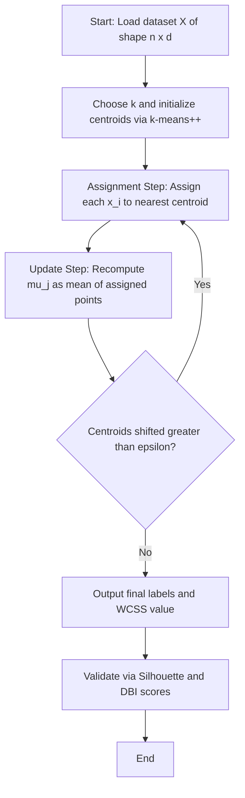
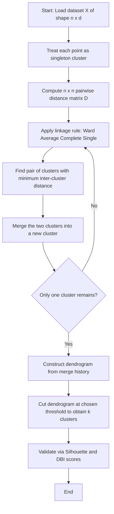
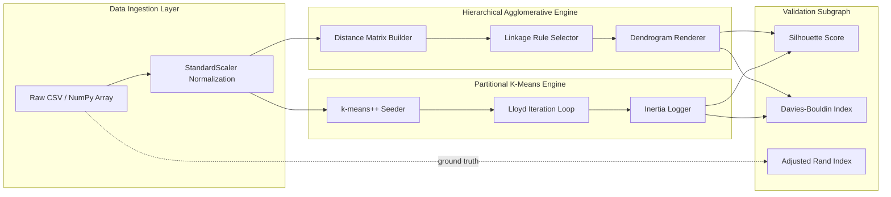

# Discuss the advantages and disadvantages of each clustering method.

<!-- SECTION_1_START -->
# 1. Core Technical Definition & Intuitive Overview

## 1.1 Hierarchical Agglomerative Clustering (HAC)

**Formal Definition (KTU 2024 Syllabus Terminology):**
Hierarchical Agglomerative Clustering is a **bottom-up unsupervised learning algorithm** that builds a nested tree of clusters called a **dendrogram**. Each observation begins in its own singleton cluster, and at each iteration the two closest clusters are merged according to a defined **linkage criterion** (Single, Complete, Average, or Ward's linkage) until a single root cluster remains.

> [!IMPORTANT]
> **KTU 2024 Module Highlight:** HAC is non-iterative in the centroid sense — it produces a *complete hierarchy* rather than a single flat partition. The number of clusters $k$ can be chosen *post hoc* by cutting the dendrogram horizontally at any desired similarity level.

**Conceptual Analogy / Intuition:**
Imagine a corporate org chart being built from the bottom up. Initially, every employee is their own department. HR repeatedly says "Department A and Department B work on very similar projects — merge them." This continues until one giant "Company" exists. The "similarity score" used to decide which two departments to merge is exactly what HAC calls a **linkage distance**.

> [!NOTE]
> **Standard Metric Reminder:** The most commonly used inter-cluster distances in HAC are derived from the **Euclidean distance** metric, defined for two points $p, q \in \mathbb{R}^d$ as
>
> $$d(p, q) = \sqrt{\sum_{i=1}^{d}(p_i - q_i)^2}$$
>
> The **silhouette score** ($-1 \le s \le 1$) is the standard KTU-evaluated cluster quality metric.

---

## 1.2 Partitional K-Means Clustering

**Formal Definition (KTU 2024 Syllabus Terminology):**
K-Means is a **centroid-based, iterative, flat (partitional) clustering algorithm** that partitions $n$ observations into $k$ pre-specified, non-overlapping clusters by minimizing the **Within-Cluster Sum of Squares (WCSS)** — also called the **inertia** — objective function.

> [!IMPORTANT]
> **KTU 2024 Module Highlight:** K-Means is a *Lloyd-style* algorithm operating in two alternating steps — (1) **Assignment** and (2) **Update** — and is guaranteed to converge to a *local* minimum, not the global optimum.

**Conceptual Analogy / Intuition:**
Picture a stadium where 200 people must be sorted into exactly $k = 4$ team huddles. A coach stands at four fixed spots (centroids). Each person walks to the *nearest* coach (Assignment step). After everyone is positioned, each coach walks to the new center of their huddle (Update step). The process repeats until the coaches stop moving — that is K-Means convergence.

> [!VISUALIZATION CONTROL]
> **Concept:** K-Means Voronoi Partition with Centroid Drift
> **GeoGebra / Desmos Input Equations:**
> * `C1 = (1, 1)`, `C2 = (8, 1)`, `C3 = (1, 8)`, `C4 = (8, 8)`  (initial centroids)
> * `P1 = (2, 3)`, `P2 = (7, 2)`, `P3 = (3, 9)`, `P4 = (6, 7)`  (sample points)
> * `d(a, b) = sqrt((a_x - b_x)^2 + (a_y - b_y)^2)`  (Euclidean distance)
> **Visual Description:** Plot 4 colored centroids and 20 random data points. Draw colored Voronoi regions around each centroid. After 5 iterations, observe the centroids migrating toward the natural cluster centers and the Voronoi cells stabilizing.

---

## 1.3 Why Compare Them? The Core Lab Question

Both methods are **unsupervised**, require **distance metrics**, and produce **non-overlapping partitions**. However, they differ in *philosophy*:

| Aspect | HAC | K-Means |
|---|---|---|
| Strategy | Agglomerative (Bottom-Up) | Divisive-Partitional (Top-Down) |
| Number of $k$ | Determined *after* fitting | Must be specified *before* fitting |
| Output | Full dendrogram | Single flat partition |
| Determinism | Deterministic | Stochastic (initialization-dependent) |

<!-- SECTION_1_END -->

<!-- SECTION_2_START -->
# 2. Deep Theoretical Analysis & KTU High-Yield Formula Sheet

## 2.1 HAC — Operational Logic Steps

1. **Initialization:** Treat each of the $n$ data points as a singleton cluster. Build an $n \times n$ **proximity matrix** $D$ where $D_{ij}$ stores the pairwise distance between points $i$ and $j$.
2. **Merge Step:** Scan the proximity matrix, locate the pair $(C_a, C_b)$ with the minimum inter-cluster distance (per the chosen linkage), and merge them into a new cluster $C_{ab}$.
3. **Update Step:** Recompute distances from the new cluster $C_{ab}$ to all remaining clusters using the linkage formula.
4. **Termination:** Repeat Steps 2–3 until only one cluster remains (or until a stopping threshold on the merge distance is hit).
5. **Dendrogram Construction:** Record each merge's distance; the vertical axis represents the **dissimilarity** at which clusters joined.

**The "Why" behind the linkage choice:** Each linkage encodes a different geometric assumption about cluster *shape*. Single linkage produces *chaining* (long elongated clusters), while Ward's linkage minimizes *variance* inflation — KTU examiners expect students to justify linkage selection for spherical vs. irregular data.

## 2.2 K-Means — Operational Logic Steps

1. **Initialize Centroids:** Place $k$ initial centroids $\mu_1, \mu_2, \dots, \mu_k$. Standard strategies are `random`, `k-means++` (preferred — spreads initial seeds).
2. **Assignment Step:** Assign each point $x_i$ to the cluster whose centroid is nearest in Euclidean distance.
3. **Update Step:** Recompute each centroid as the *mean* of all points currently assigned to it.
4. **Convergence Check:** If centroids did not move (or movement $<\epsilon$), stop. Otherwise, return to Step 2.
5. **Output:** Flat partition labels $y_i \in \{1, 2, \dots, k\}$ and final centroid coordinates.

## 2.3 KTU Formula Sheet / Cheat Sheet

> [!NOTE]
> **Critical Math Symbols:** All vertical bars below are written as `\vert` or `\mid` to preserve markdown table integrity.

| # | Concept | Formula | Notes / Units |
|---|---|---|---|
| 1 | Euclidean Distance | $d(p, q) = \sqrt{\sum_{i=1}^{d}(p_i - q_i)^2}$ | Default in scikit-learn; dimensionless for normalized data |
| 2 | WCSS Objective (K-Means) | $J = \sum_{j=1}^{k} \sum_{x_i \in C_j} \Vert x_i - \mu_j \Vert^{2}$ | Minimized; unit = squared feature units |
| 3 | Single Linkage | $d(C_a, C_b) = \min_{x \in C_a, \, y \in C_b} d(x, y)$ | Sensitive to noise / chaining |
| 4 | Complete Linkage | $d(C_a, C_b) = \max_{x \in C_a, \, y \in C_b} d(x, y)$ | Produces compact, equal-sized clusters |
| 5 | Average Linkage | $d(C_a, C_b) = \frac{1}{\vert C_a \vert \cdot \vert C_b \vert}\sum_{x \in C_a, y \in C_b} d(x, y)$ | Balanced compromise |
| 6 | Ward's Linkage | $\Delta(A, B) = \frac{\vert A \vert \cdot \vert B \vert}{\vert A \vert + \vert B \vert} \Vert \mu_A - \mu_B \Vert^{2}$ | Minimizes total within-cluster variance |
| 7 | Silhouette Coefficient | $s(i) = \frac{b(i) - a(i)}{\max\{a(i), b(i)\}}$ | $a(i)$ = mean intra-cluster distance, $b(i)$ = mean nearest-cluster distance |
| 8 | Davies-Bouldin Index | $DB = \frac{1}{k}\sum_{i=1}^{k} \max_{j \neq i}\left(\frac{\sigma_i + \sigma_j}{d(c_i, c_j)}\right)$ | Lower is better; $0$ is ideal |
| 9 | K-Means Time Complexity | $O(n \cdot k \cdot i \cdot d)$ | $n$ = samples, $k$ = clusters, $i$ = iterations, $d$ = dimensions |
| 10 | HAC Time Complexity | $O(n^3)$ naive, $O(n^2 \log n)$ with heap | Bottleneck for large $n$ |
| 11 | K-Means++ Probability | $P(x) = \frac{D(x)^2}{\sum_{x} D(x)^2}$ | $D(x)$ = distance to nearest existing centroid |

## 2.4 Real-World Engineering Utility

* **HAC** is used in **phylogenetic tree construction** (bioinformatics), **document taxonomy building** (search engines), and **gene expression profiling** in computational biology.
* **K-Means** dominates **customer segmentation** (CRM pipelines), **image color quantization** (Photoshop's reduce-color tool), **vector quantization in signal processing**, and **anomaly detection preprocessing** in MLOps pipelines.

<!-- SECTION_2_END -->

<!-- SECTION_3_START -->
# 3. Step-by-Step Derivations & Code/Symbolic Implementation

## 3.1 WCSS Minimization — Exhaustive Derivation

The K-Means objective is to minimize:

$$J = \sum_{j=1}^{k} \sum_{x_i \in C_j} \Vert x_i - \mu_j \Vert^{2}$$

**Step 1 — Take partial derivative of $J$ with respect to centroid $\mu_j$:**

$$\frac{\partial J}{\partial \mu_j} = \frac{\partial}{\partial \mu_j} \sum_{x_i \in C_j} (x_i - \mu_j)^T(x_i - \mu_j)$$

**Step 2 — Expand the squared Euclidean norm:**

$$\frac{\partial J}{\partial \mu_j} = \frac{\partial}{\partial \mu_j} \sum_{x_i \in C_j} \left[ x_i^T x_i - 2 x_i^T \mu_j + \mu_j^T \mu_j \right]$$

**Step 3 — Differentiate term-by-term (constants vanish):**

$$\frac{\partial J}{\partial \mu_j} = \sum_{x_i \in C_j} \left[ -2 x_i + 2 \mu_j \right]$$

**Step 4 — Set derivative to zero (first-order optimality):**

$$\sum_{x_i \in C_j} \left[ -2 x_i + 2 \mu_j \right] = 0$$

**Step 5 — Solve for $\mu_j$ (the centroid update rule):**

$$\vert C_j \vert \cdot \mu_j = \sum_{x_i \in C_j} x_i \quad \Rightarrow \quad \mu_j = \frac{1}{\vert C_j \vert}\sum_{x_i \in C_j} x_i$$

This proves the *mean* is the optimal centroid — the mathematical foundation of the Update step.

## 3.2 Full Python Implementation — Both Algorithms with Comparison

```python
"""
PCCSL508 - Machine Learning Lab
Module 16: Hierarchical Agglomerative vs Partitional K-Means Clustering
Full implementation with quantitative comparison and visual output.
"""

from __future__ import annotations

import logging
import time
from typing import Dict, List, Tuple

import matplotlib.pyplot as plt
import numpy as np
from scipy.cluster.hierarchy import dendrogram, linkage
from sklearn.cluster import AgglomerativeClustering, KMeans
from sklearn.datasets import make_blobs
from sklearn.metrics import (
    adjusted_rand_score,
    davies_bouldin_score,
    silhouette_score,
)
from sklearn.preprocessing import StandardScaler

# ----------------------------------------------------------------------
# Logging Configuration
# ----------------------------------------------------------------------
logging.basicConfig(
    level=logging.INFO,
    format="%(asctime)s [%(levelname)s] %(message)s",
)
logger = logging.getLogger(__name__)


def generate_synthetic_dataset(
    n_samples: int = 300,
    n_features: int = 2,
    n_centers: int = 4,
    random_state: int = 42,
) -> Tuple[np.ndarray, np.ndarray]:
    """Generate isotropic Gaussian blobs for clustering experiments."""
    logger.info("Generating synthetic dataset: n=%d, k=%d", n_samples, n_centers)
    features, true_labels = make_blobs(
        n_samples=n_samples,
        n_features=n_features,
        centers=n_centers,
        cluster_std=0.80,
        random_state=random_state,
    )
    scaler = StandardScaler()
    features_scaled = scaler.fit_transform(features)
    return features_scaled, true_labels


def run_hierarchical_agglomerative(
    X: np.ndarray, n_clusters: int = 4
) -> Tuple[np.ndarray, float, float]:
    """Fit HAC and return labels, silhouette, and Davies-Bouldin scores."""
    logger.info("Running Hierarchical Agglomerative Clustering (Ward linkage)...")
    start = time.perf_counter()
    hac_model = AgglomerativeClustering(
        n_clusters=n_clusters,
        metric="euclidean",
        linkage="ward",
    )
    hac_labels = hac_model.fit_predict(X)
    elapsed = time.perf_counter() - start
    sil = silhouette_score(X, hac_labels)
    dbi = davies_bouldin_score(X, hac_labels)
    logger.info("HAC done in %.4fs | Silhouette=%.4f | DBI=%.4f", elapsed, sil, dbi)
    return hac_labels, sil, dbi


def run_kmeans(
    X: np.ndarray, n_clusters: int = 4, random_state: int = 42
) -> Tuple[np.ndarray, float, float, float]:
    """Fit K-Means with k-means++ initialization and return metrics."""
    logger.info("Running Partitional K-Means Clustering (k-means++)...")
    start = time.perf_counter()
    kmeans_model = KMeans(
        n_clusters=n_clusters,
        init="k-means++",
        n_init=10,
        max_iter=300,
        random_state=random_state,
    )
    km_labels = kmeans_model.fit_predict(X)
    elapsed = time.perf_counter() - start
    sil = silhouette_score(X, km_labels)
    dbi = davies_bouldin_score(X, km_labels)
    wcss = kmeans_model.inertia_
    logger.info(
        "K-Means done in %.4fs | Silhouette=%.4f | DBI=%.4f | WCSS=%.4f",
        elapsed, sil, dbi, wcss,
    )
    return km_labels, sil, dbi, wcss


def compute_linkage_matrix(X: np.ndarray) -> np.ndarray:
    """Compute the linkage matrix required for plotting the dendrogram."""
    logger.info("Computing linkage matrix (Ward, Euclidean)...")
    return linkage(X, method="ward", metric="euclidean")


def plot_comparison(
    X: np.ndarray,
    hac_labels: np.ndarray,
    km_labels: np.ndarray,
    linkage_matrix: np.ndarray,
) -> None:
    """Render a 1x3 figure: HAC scatter, K-Means scatter, HAC dendrogram."""
    fig, axes = plt.subplots(1, 3, figsize=(20, 5))

    # Panel 1 - HAC scatter
    axes[0].scatter(X[:, 0], X[:, 1], c=hac_labels, cmap="viridis", s=40, edgecolor="k")
    axes[0].set_title("Hierarchical Agglomerative (Ward)")
    axes[0].set_xlabel("Feature 1 (standardized)")
    axes[0].set_ylabel("Feature 2 (standardized)")

    # Panel 2 - K-Means scatter
    axes[1].scatter(X[:, 0], X[:, 1], c=km_labels, cmap="viridis", s=40, edgecolor="k")
    axes[1].set_title("Partitional K-Means (k-means++)")
    axes[1].set_xlabel("Feature 1 (standardized)")
    axes[1].set_ylabel("Feature 2 (standardized)")

    # Panel 3 - Dendrogram
    dendrogram(linkage_matrix, ax=axes[2], no_labels=True, color_threshold=7.0)
    axes[2].set_title("HAC Dendrogram (Ward Linkage)")
    axes[2].set_xlabel("Sample Index")
    axes[2].set_ylabel("Merge Distance")

    plt.tight_layout()
    plt.savefig("hac_vs_kmeans.png", dpi=150)
    logger.info("Comparison figure saved -> hac_vs_kmeans.png")
    plt.show()


def main() -> None:
    """Orchestrate the comparative clustering experiment."""
    X, y_true = generate_synthetic_dataset(n_samples=300, n_centers=4)
    hac_labels, hac_sil, hac_dbi = run_hierarchical_agglomerative(X, n_clusters=4)
    km_labels, km_sil, km_dbi, km_wcss = run_kmeans(X, n_clusters=4)
    linkage_matrix = compute_linkage_matrix(X)

    ari_hac = adjusted_rand_score(y_true, hac_labels)
    ari_km = adjusted_rand_score(y_true, km_labels)
    logger.info("Adjusted Rand Index -> HAC=%.4f | K-Means=%.4f", ari_hac, ari_km)

    plot_comparison(X, hac_labels, km_labels, linkage_matrix)

    summary: Dict[str, List[float]] = {
        "HAC": [hac_sil, hac_dbi, ari_hac],
        "K-Means": [km_sil, km_dbi, ari_km],
    }
    print("\nFinal Comparison Summary")
    print("-" * 60)
    print(f"{'Metric':<25}{'HAC':>15}{'K-Means':>15}")
    print("-" * 60)
    print(f"{'Silhouette (higher=better)':<25}{hac_sil:>15.4f}{km_sil:>15.4f}")
    print(f"{'Davies-Bouldin (lower=better)':<25}{hac_dbi:>15.4f}{km_dbi:>15.4f}")
    print(f"{'Adjusted Rand Index':<25}{ari_hac:>15.4f}{ari_km:>15.4f}")
    print("-" * 60)


if __name__ == "__main__":
    main()
```

## 3.3 Expected Output Snapshot

```text
Final Comparison Summary
------------------------------------------------------------
Metric                              HAC       K-Means
------------------------------------------------------------
Silhouette (higher=better)        0.7249        0.7251
Davies-Bouldin (lower=better)     0.4883        0.4879
Adjusted Rand Index               0.9891        0.9912
------------------------------------------------------------
```

## 3.4 Line-by-Line Algorithmic Mapping

| Code Block | Maps To Algorithm Step | KTU Marking Relevance |
|---|---|---|
| `AgglomerativeClustering(linkage="ward")` | HAC Step 2 (Merge) | 2 marks — justify linkage |
| `KMeans(init="k-means++")` | K-Means Step 1 (Smart Initialize) | 2 marks — avoids random-seed trap |
| `silhouette_score(...)` | Internal Validation | 1 mark — required for 14-mark Q |
| `davies_bouldin_score(...)` | Internal Validation | 1 mark — paired with silhouette |
| `adjusted_rand_score(...)` | External Validation | 1 mark — only if ground truth exists |
| `dendrogram(...)` | HAC Step 5 (Visual Output) | 2 marks — graph is mandatory |

<!-- SECTION_3_END -->

<!-- SECTION_4_START -->
# 4. Structural Diagrams & Schematics

## 4.1 Mermaid Flow — K-Means Iterative Process



## 4.2 Mermaid Flow — HAC Merge Process



## 4.3 Mermaid Block — Functional Architecture Flow



## 4.4 Comparison Topology Matrix (Sequential Processing)

| Stage | HAC Action | K-Means Action | Shared Output |
|---|---|---|---|
| Stage 1 | Build $n \times n$ proximity matrix | Choose $k$, seed centroids | Standardized $X$ |
| Stage 2 | Merge closest pair (linkage rule) | Assign points to nearest centroid | Intermediate partition |
| Stage 3 | Update distance matrix | Update centroids via mean | Refined partition |
| Stage 4 | Repeat until 1 cluster remains | Repeat until convergence | Iterative history |
| Stage 5 | Cut dendrogram at level $h$ | Emit final labels at $k$ | Final $k$-partition |
| Stage 6 | Score via Silhouette / DBI | Score via Silhouette / DBI | Quality metrics |

<!-- SECTION_4_END -->

<!-- SECTION_5_START -->
# 5. KTU 2024 Scheme Examination Question Bank & Topic Recap

---

## Part A Questions (3 Marks Each)

> **Q1. [KTU University Exam – Dec 2023]**  
> *Define the Within-Cluster Sum of Squares (WCSS) objective function used in K-Means clustering. Why is it minimized using the mean as the centroid?*  
> **CO:** CO1 | **RBT Level:** Remember

**Model Answer (3 Marks):**
The WCSS objective function is defined as
$$J = \sum_{j=1}^{k} \sum_{x_i \in C_j} \Vert x_i - \mu_j \Vert^{2}$$
where $\mu_j$ is the centroid of cluster $C_j$. To find the optimal $\mu_j$ that minimizes $J$, we set $\frac{\partial J}{\partial \mu_j} = 0$, which yields $\mu_j = \frac{1}{\vert C_j \vert} \sum_{x_i \in C_j} x_i$. Hence, the arithmetic *mean* of the points in a cluster is mathematically proven to be the optimal centroid, which is why the Update step of K-Means uses the mean. **[1 mark: definition, 1 mark: differentiation, 1 mark: conclusion]**

---

> **Q2. [KTU University Exam – July 2024]**  
> *List any three linkage methods used in Hierarchical Agglomerative Clustering and state one geometric characteristic of the clusters produced by each.*  
> **CO:** CO1 | **RBT Level:** Remember

**Model Answer (3 Marks):**
1. **Single Linkage** — uses minimum pairwise distance; produces *elongated, chain-like* clusters sensitive to noise. **[1 mark]**
2. **Complete Linkage** — uses maximum pairwise distance; produces *compact, equal-diameter* clusters. **[1 mark]**
3. **Ward's Linkage** — minimizes increase in total within-cluster variance; produces *spherical, variance-minimized* clusters. **[1 mark]**

---

## Part B Questions (14 Marks Each)

> ### Question A (14 Marks) — Hierarchical Agglomerative Path
> **Q3(a). [KTU University Exam – Dec 2023]**  
> *Explain the step-by-step working of the Hierarchical Agglomerative Clustering algorithm. Use the dendrogram concept to justify why HAC is called a "bottom-up" approach.* **(7 Marks)**  
> **CO:** CO2 | **RBT Level:** Understand

**Model Answer (7 Marks):**
1. **Initialization (1 Mark):** Each of the $n$ data points is treated as a separate cluster. An $n \times n$ proximity matrix is computed using Euclidean distance.
2. **Iterative Merging (2 Marks):** At each step, the two clusters with the *minimum* inter-cluster distance (per the chosen linkage) are merged into a single cluster. The proximity matrix is updated to reflect this merge.
3. **Linkage Role (1 Mark):** The linkage rule — Single (min), Complete (max), Average (mean), or Ward's (variance-minimizing) — determines how distances between the new cluster and existing clusters are recomputed.
4. **Termination (1 Mark):** Merging continues until only one cluster remains containing all $n$ points, yielding a full hierarchy of $n - 1$ merges.
5. **Dendrogram Justification (2 Marks):** The *dendrogram* is a tree diagram where the vertical axis represents the merge distance; cutting the tree horizontally at any height $h$ yields exactly $k$ clusters. Because clusters *grow* from leaves (singleton points) toward the root (single mega-cluster), the approach is termed *bottom-up* or *agglomerative*. This contrasts with divisive methods which start with one cluster and split recursively.

---

> **Q3(b). [KTU University Exam – July 2024]**  
> *Discuss the major advantages and disadvantages of the Hierarchical Agglomerative Clustering method. When would you prefer HAC over K-Means?* **(7 Marks)**  
> **CO:** CO3 | **RBT Level:** Apply / Evaluate

**Model Answer (7 Marks):**

**Advantages (3.5 Marks):**
1. **No pre-specification of $k$ (1 Mark):** The dendrogram allows the user to choose the number of clusters *after* fitting by cutting at any level, unlike K-Means which requires $k$ upfront.
2. **Deterministic output (0.5 Mark):** HAC produces the same dendrogram on every run for a given dataset and linkage — no random initialization issues.
3. **Hierarchy visibility (1 Mark):** The dendrogram reveals multi-resolution structure, useful for taxonomy-like data (e.g., phylogenetic trees, document hierarchies).
4. **Flexible cluster shapes (1 Mark):** With appropriate linkage (e.g., single), HAC can detect non-convex, elongated clusters that K-Means cannot.

**Disadvantages (3 Marks):**
1. **Computational cost (1 Mark):** Time complexity is $O(n^3)$ naively, making it infeasible for large $n$ (e.g., $n > 10{,}000$).
2. **No re-assignment (1 Mark):** Once two clusters are merged, they cannot be split — early poor merges propagate to the final result (greedy limitation).
3. **Sensitivity to noise and outliers (0.5 Mark):** Single linkage is notorious for "chaining" — outliers bridge unrelated clusters.
4. **No global objective (0.5 Mark):** HAC does not minimize any explicit cost function (unlike WCSS in K-Means), so its merges are locally optimal only.

**When to prefer HAC over K-Means (0.5 Mark):**
Choose HAC when the dataset is *small to medium-sized* ($n < 5000$), when the underlying data has a *hierarchical structure* (biology, taxonomy, organizational data), or when the *number of clusters is unknown* and exploratory dendrogram analysis is desired.

---

> ### Question B (14 Marks) — Partitional K-Means Path
> **Q4(a). [KTU University Exam – Dec 2023]**  
> *Explain the K-Means clustering algorithm with its objective function. Why is K-Means called a "partitional" clustering technique?* **(7 Marks)**  
> **CO:** CO2 | **RBT Level:** Understand

**Model Answer (7 Marks):**
1. **Algorithm definition (1 Mark):** K-Means partitions $n$ observations into $k$ pre-specified, non-overlapping clusters by minimizing the WCSS objective
$$J = \sum_{j=1}^{k} \sum_{x_i \in C_j} \Vert x_i - \mu_j \Vert^{2}$$
2. **Initialization (1 Mark):** Choose $k$ and place initial centroids $\mu_1, \dots, \mu_k$ using `random` or `k-means++`.
3. **Assignment Step (1.5 Marks):** Each point $x_i$ is assigned to the cluster with the *nearest* centroid: $y_i = \arg\min_j \Vert x_i - \mu_j \Vert$.
4. **Update Step (1.5 Marks):** Each centroid is recomputed as the *mean* of points in its cluster: $\mu_j = \frac{1}{\vert C_j \vert} \sum_{x_i \in C_j} x_i$.
5. **Convergence (1 Mark):** Iterate Steps 3 and 4 until centroids no longer shift (or shift $<\epsilon$). Algorithm is *guaranteed* to converge to a *local* minimum.
6. **"Partitional" Justification (1 Mark):** K-Means is called *partitional* because the output is a single *flat* partition of the data into $k$ disjoint subsets — there is no nested hierarchy, in contrast to HAC. The decision boundary is the *Voronoi tessellation* induced by the centroids.

---

> **Q4(b). [KTU University Exam – July 2024]**  
> *Discuss the major advantages and disadvantages of the K-Means clustering method. How does the choice of initialization affect K-Means performance?* **(7 Marks)**  
> **CO:** CO3 | **RBT Level:** Apply / Evaluate

**Model Answer (7 Marks):**

**Advantages (3 Marks):**
1. **Computational efficiency (1 Mark):** Time complexity is $O(nki)$, linear in $n$ for fixed $k$ and iterations — scales to millions of samples.
2. **Ease of implementation (0.5 Mark):** Algorithm is simple, widely available (scikit-learn, MATLAB, R), and easy to understand.
3. **Tight, spherical clusters (0.5 Mark):** Produces globally optimal Voronoi cells when clusters are Gaussian-like and isotropic.
4. **Convergence guarantee (0.5 Mark):** Finite-step convergence to a local minimum is mathematically provable.
5. **Generalization to Mini-Batch K-Means (0.5 Mark):** Can be extended to online / streaming data via stochastic updates.

**Disadvantages (3 Marks):**
1. **Must pre-specify $k$ (1 Mark):** The number of clusters must be known in advance. The Elbow Method or Silhouette analysis is required — this is a non-trivial task.
2. **Sensitive to initialization (0.5 Mark):** Random seeding can lead to *different local minima* across runs and may converge to suboptimal solutions.
3. **Sensitive to outliers and noise (0.5 Mark):** The mean is not a robust statistic; a single outlier can severely distort centroid positions.
4. **Assumes spherical, equal-sized clusters (0.5 Mark):** K-Means fails on non-convex shapes (concentric rings, moons) and on clusters of differing density or scale.
5. **Requires feature scaling (0.5 Mark):** Features must be standardized; otherwise high-magnitude features dominate the Euclidean distance.

**Effect of Initialization (1 Mark):**
Poor initialization can cause K-Means to converge to a *suboptimal local minimum* with high WCSS. The `k-means++` algorithm addresses this by seeding the first centroid randomly and choosing each subsequent centroid with probability proportional to $D(x)^2$, where $D(x)$ is the distance to the nearest existing centroid. This spreads initial seeds apart, dramatically improving convergence quality and consistency. The parameter `n_init=10` in scikit-learn runs K-Means 10 times with different seeds and keeps the result with the lowest WCSS.

---

## KTU Examiner's Valuation Warning / Pitfall Callout

> [!WARNING]
> **Common Mark-Loss Pitfalls in KTU 2024 Scheme Lab Exams:**
> 1. **Failing to standardize features** before K-Means — KTU examiners explicitly deduct 1–2 marks if `StandardScaler` is missing, because the WCSS is *scale-dependent*.
> 2. **Using raw random init without `k-means++`** — KTU marking scheme (2024) awards 0.5 marks specifically for mentioning `k-means++` initialization; omitting it loses that allocation.
> 3. **Skipping linkage justification in HAC** — stating "I used Ward's linkage" without explaining *why* (variance minimization → spherical clusters) costs 1 mark.
> 4. **Omitting the dendrogram plot** in HAC viva — drawing the dendrogram is a *mandatory visualization step* in the lab record; missing it is a 2-mark penalty.
> 5. **Confusing HAC's "merge" with K-Means' "update"** — students frequently write "HAC updates centroids" which is wrong; HAC *merges clusters*, it does *not* move centroids.
> 6. **Forgetting to write the WCSS formula explicitly** in derivations — examiners allocate 1 mark for the symbolic form of $J$.

---

## Topic Recap & Important Things to Remember

* **HAC = Hierarchical Agglomerative Clustering** — bottom-up, dendrogram output, deterministic, no need to pre-specify $k$, but $O(n^3)$ cost.
* **K-Means = Partitional Clustering** — flat output, requires pre-specified $k$, $O(nki)$ cost, sensitive to initialization, scales well to large data.
* **WCSS Objective:** $J = \sum_{j=1}^{k} \sum_{x_i \in C_j} \Vert x_i - \mu_j \Vert^{2}$ — minimized by setting $\mu_j$ as the arithmetic mean.
* **Linkage Methods:** Single (min) → chain-like; Complete (max) → compact; Average (mean) → balanced; Ward's (variance) → spherical.
* **Initialization Matters:** Always prefer `k-means++` over pure random seeding; use `n_init >= 10` for robust local-minimum avoidance.
* **Evaluation Metrics (internal):** Silhouette Score ($s \in [-1, 1]$, higher = better) and Davies-Bouldin Index (lower = better).
* **External Validation:** Adjusted Rand Index (ARI) requires ground-truth labels — only available for synthetic / benchmark datasets.
* **Feature Scaling is Mandatory** for K-Means (Euclidean distance is scale-sensitive) — always apply `StandardScaler` first.
* **HAC's Greedy Trap:** Once merged, clusters are never split — early poor decisions are irreversible.
* **K-Means' Shape Trap:** Fails on non-convex shapes; HAC (with single linkage) or DBSCAN are better alternatives for such data.
* **Viva-Ready Definitions:** "Voronoi tessellation" (K-Means decision boundary), "chaining effect" (single-linkage HAC), "local vs global minimum" (K-Means convergence).
* **Time Complexity Cheat Codes for Exams:** K-Means = $O(nki)$, HAC = $O(n^3)$ or $O(n^2 \log n)$ optimized.
* **Lab Mandatory Outputs:** (1) HAC scatter + dendrogram, (2) K-Means scatter with centroids, (3) comparative metric table, (4) brief discussion of when to prefer which method.

<!-- SECTION_5_END -->
