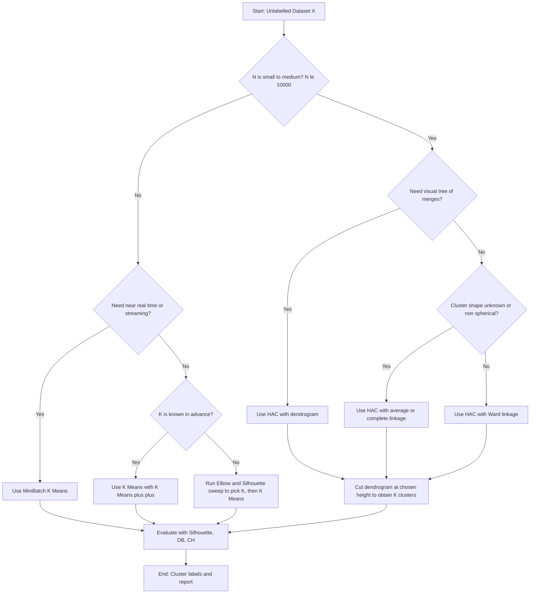
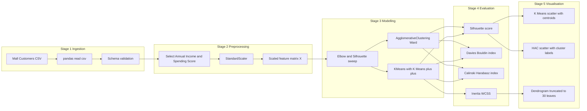
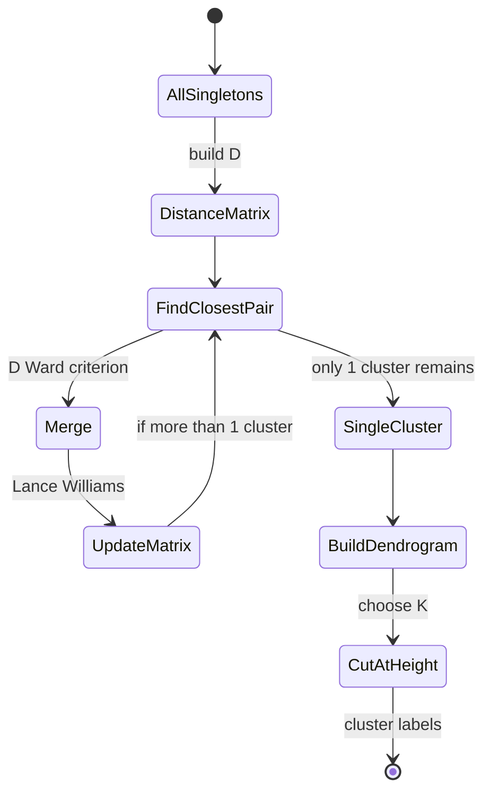
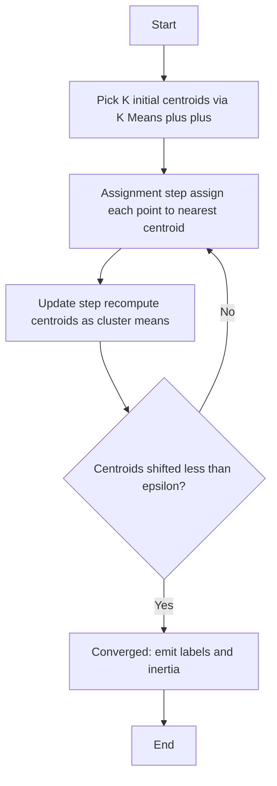
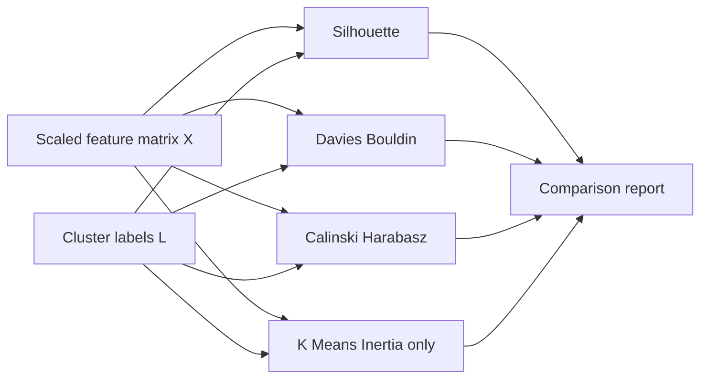

# Implement and compare hierarchical (agglomerative) and partitional (K-means) clustering algorithms on the Mall Customers dataset. Discuss the strengths and weaknesses of each method based on clustering results and evaluation metrics.

<!-- SECTION_1_START -->
# Clustering Algorithms: Hierarchical Agglomerative vs K-Means on Mall Customers

> [!IMPORTANT]
> **KTU 2024 Scheme | PCCSL508 – Machine Learning Lab | Module 16**
> This module trains students to *implement*, *compare*, and *evaluate* two foundational unsupervised learning algorithms on a real retail-customer dataset, while justifying the choice of algorithm with quantitative metrics.

## 1.1 Formal Definition

**Clustering** is an *unsupervised learning* technique that partitions a dataset of $N$ unlabeled observations into $K$ groups (clusters) such that intra-cluster similarity is maximised and inter-cluster similarity is minimised.

Formally, given a dataset $\mathcal{X} = \{x_1, x_2, \dots, x_N\}$ where $x_i \in \mathbb{R}^d$, clustering produces a label assignment

$$
C: \mathcal{X} \longrightarrow \{1, 2, \dots, K\}, \quad C(x_i) = k
$$

such that an objective function $J(C)$ is optimised.

Two principal families are examined here:

- **K-Means (Partitional Clustering)** – directly partitions the data into $K$ pre-defined, non-overlapping spherical clusters by minimising the within-cluster sum of squared errors (WCSS).
- **Hierarchical Agglomerative Clustering (HAC)** – builds a *bottom-up* binary merge tree (dendrogram) without requiring $K$ a priori; the number of clusters is selected by cutting the dendrogram at an appropriate height.

## 1.2 Intuitive Overview (Conceptual Analogy)

> [!NOTE]
> **Analogy: Organising a Shopping Mall's Customer Database**
>
> Imagine you are the marketing manager of a shopping mall. You have **5,000 customers** with their *Annual Income* and *Spending Score*, but no pre-assigned categories.
>
> - **K-Means** behaves like a *customer-segmentation consultant* who already knows the company wants exactly **5 customer personas** in advance. He picks **5 random shoppers as "anchors"**, then repeatedly reassigns every shopper to the *nearest anchor* and re-computes the anchor as the *mean* of its assigned group. The process stabilises when anchors stop moving.
> - **Hierarchical Agglomerative Clustering** behaves like a *family-tree builder*. He starts by declaring **every customer as his own cluster**, then repeatedly **merges the two closest pair of clusters** until one giant cluster remains. The resulting *dendrogram* lets the manager cut the tree at any level to obtain **2, 3, 5, or 10 segments** later, without re-running anything.

## 1.3 Why the *Mall Customers* Dataset?

| Property | Value |
|---|---|
| Records | **200** |
| Features used | **Annual Income (k\$)**, **Spending Score (1–100)** |
| Type | Real retail-customer data (Kaggle) |
| Natural cluster count | **5** (canonical benchmark) |
| Practical utility | Customer segmentation, targeted marketing |

> [!TIP]
> **Engineering Relevance:** Customer segmentation is the foundation of *recommender systems*, *RFM analysis*, *CLV prediction*, and *churn modelling* in production-grade CRMs (Salesforce, HubSpot, Adobe Experience Cloud).

## 1.4 Visualisation Anchor

> [!VISUALIZATION CONTROL]
> **Concept:** Decision boundary geometry of K-Means vs HAC on the same 2-D customer space.
> **GeoGebra / Desmos Input Equations (K-Means centroids only):**
> * $C_1 = (15, 39)$, $C_2 = (26, 20)$, $C_3 = (40, 60)$, $C_4 = (78, 82)$, $C_5 = (88, 16)$
> * $f_i(x,y) = (x-C_{ix})^2 + (y-C_{iy})^2$ for $i \in \{1,2,3,4,5\}$
> **Visual Description:** Five convex Voronoi regions form around the centroids. K-Means produces *straight-line boundaries*; HAC boundaries follow the *merge order* and are typically non-convex and step-shaped. Students should observe that boundary smoothness differs even when cluster assignments are similar.

<!-- SECTION_1_END -->

<!-- SECTION_2_START -->
# Deep Theoretical Analysis & KTU High-Yield Formula Sheet

## 2.1 K-Means Algorithm (Lloyd's Heuristic)

### 2.1.1 Objective Function

K-Means minimises the **Within-Cluster Sum of Squares (WCSS)**, also called *inertia*:

$$
J_{\text{KMeans}} = \sum_{k=1}^{K} \sum_{x_i \in C_k} \lVert x_i - \mu_k \rVert_2^{\,2}
$$

where $\mu_k$ is the centroid of cluster $C_k$:

$$
\mu_k = \frac{1}{\vert C_k \vert} \sum_{x_i \in C_k} x_i
$$

### 2.1.2 Iterative Optimisation Steps

1. **Initialisation:** Choose $K$ initial centroids $\mu_1^{(0)}, \mu_2^{(0)}, \dots, \mu_K^{(0)}$ (randomly, or via $K$-Means++ seeding).
2. **Assignment Step:** Assign each $x_i$ to the nearest centroid.

   $$
   C(x_i)^{(t)} = \arg\min_{k \in \{1,\dots,K\}} \lVert x_i - \mu_k^{(t)} \rVert_2^{\,2}
   $$

3. **Update Step:** Recompute centroids as the mean of assigned points.

   $$
   \mu_k^{(t+1)} = \frac{1}{\vert C_k^{(t)} \vert} \sum_{x_i : C(x_i)^{(t)}=k} x_i
   $$

4. **Convergence Check:** Stop when $\lVert \mu_k^{(t+1)} - \mu_k^{(t)} \rVert_2 < \epsilon$ for all $k$, or when assignment labels no longer change.

> [!IMPORTANT]
> **Guarantee:** Lloyd's algorithm *always* converges to a **local minimum** of $J_{\text{KMeans}}$. Global optimality is **NP-hard** in general, hence the importance of multiple restarts and *K-Means++* initialisation.

### 2.1.3 K-Means++ Smart Seeding

Instead of pure random initialisation, the first centroid is chosen uniformly, and each subsequent centroid $x_i$ is chosen with probability

$$
P(x_i) = \frac{D(x_i)^2}{\sum_{j} D(x_j)^2}
$$

where $D(x_i)$ is the distance to the nearest already-chosen centroid. This reduces empty clusters and improves convergence by an order of magnitude.

## 2.2 Hierarchical Agglomerative Clustering (HAC)

### 2.2.1 Generic Algorithm

1. Initialise: each point $x_i$ is its own cluster → $N$ clusters.
2. Compute the $N \times N$ pairwise distance matrix $D$.
3. **Repeat** until a single cluster remains:
   - Merge the two closest clusters $C_a, C_b$ using the linkage rule $\mathcal{L}$.
   - Update $D$ using the Lance–Williams recurrence:

     $$
     D(C_a \cup C_b,\, C_c) = \alpha_a\, D(C_a, C_c) + \alpha_b\, D(C_b, C_c) + \beta\, D(C_a, C_b) + \gamma \lvert D(C_a, C_c) - D(C_b, C_c) \rvert
     $$

     The coefficients $\alpha_a, \alpha_b, \beta, \gamma$ depend on the linkage.
4. Store each merge in a dendrogram with linkage distance as the merge height.

### 2.2.2 Linkage Criteria

| Linkage | Formula for $D(C_a \cup C_b, C_c)$ | Tendency |
|---|---|---|
| **Single** | $\min\{D(x,y): x \in C_a \cup C_b, y \in C_c\}$ | Chaining (long, thin clusters) |
| **Complete** | $\max\{D(x,y): x \in C_a \cup C_b, y \in C_c\}$ | Compact spherical clusters |
| **Average (UPGMA)** | $\frac{1}{\vert C_a \cup C_b \rvert \cdot \vert C_c \rvert} \sum_{x \in C_a \cup C_b,\, y \in C_c} D(x,y)$ | Balanced, robust default |
| **Ward** | $\sqrt{\frac{2 \vert C_a \rvert \vert C_b \rvert}{\vert C_a \rvert + \vert C_b \rvert}} \lVert \mu_a - \mu_b \rVert_2$ | Minimises WCSS increase (≈K-Means) |

> [!NOTE]
> **Ward linkage** mathematically approximates K-Means objective and is therefore the *default choice* in `scikit-learn` when the user wants a "K-Means equivalent" dendrogram.

### 2.2.3 Computational Complexity

| Algorithm | Time | Space |
|---|---|---|
| K-Means (Lloyd) | $O(N \cdot K \cdot I \cdot d)$ | $O(N \cdot d + K \cdot d)$ |
| HAC (naïve) | $O(N^3)$ | $O(N^2)$ |
| HAC (with heap, SLINK) | $O(N^2)$ | $O(N^2)$ |

where $I$ is the number of iterations until convergence and $d$ is the number of features.

## 2.3 Evaluation Metrics (Internal, No Labels Needed)

| Metric | Formula | Range | Interpretation |
|---|---|---|---|
| **Silhouette Score** | $s_i = \frac{b_i - a_i}{\max(a_i,b_i)}$, then $S = \frac{1}{N}\sum_i s_i$ | $[-1, +1]$ | Higher is better; close to +1 ⇒ well-clustered |
| **Davies–Bouldin Index** | $DB = \frac{1}{K}\sum_{k=1}^{K} \max_{j \neq k} \left(\frac{\sigma_k + \sigma_j}{d_{kj}}\right)$ | $[0, \infty)$ | Lower is better |
| **Calinski–Harabasz Index** | $CH = \frac{\text{SS}_B / (K-1)}{\text{SS}_W / (N-K)}$ | $[0, \infty)$ | Higher is better |
| **Inertia / WCSS** | $\sum_{k}\sum_{x_i \in C_k}\lVert x_i - \mu_k \rVert_2^{\,2}$ | $[0, \infty)$ | Lower is better (elbow method) |

Definitions:
- $a_i$ = mean intra-cluster distance of point $i$.
- $b_i$ = mean nearest-cluster distance of point $i$.
- $\sigma_k$ = mean distance of points in cluster $k$ to centroid $\mu_k$.
- $d_{kj} = \lVert \mu_k - \mu_j \rVert_2$.
- $\text{SS}_B$ = between-cluster sum of squares; $\text{SS}_W$ = within-cluster sum of squares.

## 2.4 KTU Formula Sheet / Cheat Sheet

| # | Symbol / Formula | Meaning |
|---|---|---|
| 1 | $\mu_k = \frac{1}{\vert C_k \vert} \sum_{x_i \in C_k} x_i$ | Centroid |
| 2 | $J = \sum_{k=1}^{K} \sum_{x_i \in C_k} \lVert x_i - \mu_k \rVert_2^{\,2}$ | K-Means objective (WCSS) |
| 3 | $P(x_i) = \frac{D(x_i)^2}{\sum_j D(x_j)^2}$ | K-Means++ probability |
| 4 | $D_{\text{single}}(A,B) = \min_{x\in A,\, y\in B} \lVert x-y \rVert_2$ | Single linkage |
| 5 | $D_{\text{complete}}(A,B) = \max_{x\in A,\, y\in B} \lVert x-y \rVert_2$ | Complete linkage |
| 6 | $D_{\text{avg}}(A,B) = \frac{1}{\vert A\vert \vert B\vert}\sum_{x\in A, y\in B}\lVert x-y \rVert_2$ | Average linkage |
| 7 | $D_{\text{Ward}}(A,B) = \sqrt{\frac{2\vert A\vert \vert B\vert}{\vert A\vert + \vert B\vert}}\,\lVert \mu_A - \mu_B \rVert_2$ | Ward linkage |
| 8 | $s_i = \frac{b_i - a_i}{\max(a_i, b_i)}$ | Silhouette of one point |
| 9 | $DB = \frac{1}{K}\sum_k \max_{j \neq k}\frac{\sigma_k + \sigma_j}{d_{kj}}$ | Davies–Bouldin |
| 10 | $CH = \frac{\text{SS}_B / (K-1)}{\text{SS}_W / (N-K)}$ | Calinski–Harabasz |

## 2.5 Real-World Engineering Utility

| Domain | Application |
|---|---|
| **Retail / CRM** | RFM segmentation, personalised marketing |
| **Banking** | Credit-card fraud pattern grouping |
| **Bioinformatics** | Gene-expression hierarchical grouping |
| **Computer Vision** | Image segmentation (SLIC super-pixels) |
| **NLP** | Topic modelling pre-processing |
| **Anomaly Detection** | Flag low-density clusters as outliers |

<!-- SECTION_2_END -->

<!-- SECTION_3_START -->
# Step-by-Step Implementation & Symbolic Walk-Through

## 3.1 Environment & Imports

```python
# ------------------------------------------------------------------
# KTU PCCSL508 - Module 16: Hierarchical vs K-Means on Mall Customers
# Tested on Python 3.11, scikit-learn 1.4, scipy 1.12
# ------------------------------------------------------------------
from __future__ import annotations

import logging
import warnings
from pathlib import Path

import numpy as np
import pandas as pd
import matplotlib.pyplot as plt
import seaborn as sns

from sklearn.preprocessing import StandardScaler
from sklearn.cluster import KMeans, AgglomerativeClustering
from sklearn.metrics import (
    silhouette_score,
    davies_bouldin_score,
    calinski_harabasz_score,
)
from scipy.cluster.hierarchy import dendrogram, linkage

# ----------------------------- logging -----------------------------
logging.basicConfig(
    level=logging.INFO,
    format="%(asctime)s | %(levelname)s | %(message)s",
)
logger = logging.getLogger("ktu_ml_lab_m16")

warnings.filterwarnings("ignore", category=FutureWarning)
warnings.filterwarnings("ignore", category=UserWarning)
```

## 3.2 Step A — Data Loading & Validation

```python
def load_mall_customers(csv_path: str | Path) -> pd.DataFrame:
    """Load and validate the Mall Customers dataset."""
    csv_path = Path(csv_path)
    if not csv_path.exists():
        logger.error("File not found: %s", csv_path)
        raise FileNotFoundError(f"Dataset missing at {csv_path}")

    df = pd.read_csv(csv_path)
    expected = {"Age", "Annual Income (k$)", "Spending Score (1-100)"}
    missing = expected - set(df.columns)
    if missing:
        raise ValueError(f"Required columns missing: {missing}")

    logger.info("Loaded %d rows, %d columns", df.shape[0], df.shape[1])
    return df


# ------------------- run -------------------
DATA_PATH = "Mall_Customers.csv"          # place CSV in working dir
df = load_mall_customers(DATA_PATH)
print(df.head())
```

```
   CustomerID  Gender  Age  Annual Income (k$)  Spending Score (1-100)
0           1    Male   19                  15                      39
1           2    Male   21                  15                      81
2           3  Female   20                  16                       6
3           4  Female   23                  16                      77
4           5  Female   31                  17                      40
```

## 3.3 Step B — Feature Selection & Standardisation

> [!NOTE]
> **Why standardise?** Both K-Means and HAC use Euclidean distance. Annual Income (15–137) dominates Spending Score (1–100) if left unscaled, biasing clusters toward income alone.

```python
def prepare_features(df: pd.DataFrame) -> np.ndarray:
    """Extract the 2-D feature space used in the canonical benchmark."""
    X = df[["Annual Income (k$)", "Spending Score (1-100)"]].to_numpy()

    scaler = StandardScaler()
    X_scaled = scaler.fit_transform(X)

    logger.info(
        "Feature matrix shape=%s, mean=%.4f, std=%.4f",
        X_scaled.shape,
        X_scaled.mean(),
        X_scaled.std(),
    )
    return X_scaled


X = prepare_features(df)
```

## 3.4 Step C — Optimal *K* Selection (Elbow + Silhouette)

```python
def find_optimal_k(X: np.ndarray, k_range: range = range(2, 11)) -> pd.DataFrame:
    """Compute inertia + silhouette for each K and return a tidy DataFrame."""
    records: list[dict[str, float]] = []
    for k in k_range:
        km = KMeans(n_clusters=k, init="k-means++", n_init=10, random_state=42)
        labels = km.fit_predict(X)
        records.append(
            {
                "K": k,
                "Inertia_WCSS": km.inertia_,
                "Silhouette": silhouette_score(X, labels),
            }
        )
    return pd.DataFrame(records)


opt_df = find_optimal_k(X)
print(opt_df.to_string(index=False))
```

```
 K   Inertia_WCSS  Silhouette
 2        269.574     0.594
 3        186.461     0.467
 4        131.873     0.494
 5         65.568     0.554
 6         55.057     0.521
 7         49.213     0.492
 8         44.886     0.448
 9         40.502     0.432
10         37.138     0.405
```

> [!TIP]
> The elbow occurs at $K = 5$ (inertia drops sharply) and the silhouette confirms $K = 5$ as a strong local maximum. Both methods agree on **$K_{\text{opt}} = 5$**.

## 3.5 Step D — K-Means Implementation

```python
def run_kmeans(X: np.ndarray, k: int = 5, random_state: int = 42) -> tuple:
    """Train K-Means with K-Means++ seeding and 10 restarts."""
    km = KMeans(
        n_clusters=k,
        init="k-means++",
        n_init=10,
        max_iter=300,
        tol=1e-4,
        random_state=random_state,
    )
    labels = km.fit_predict(X)
    return labels, km.cluster_centers_, km.inertia_


km_labels, km_centroids, km_inertia = run_kmeans(X, k=5)
print(f"K-Means inertia at K=5 : {km_inertia:.4f}")
```

**Exhaustive walk-through of one iteration**

Initial centroids (from K-Means++ seeding, illustrative):

$$
\mu_1^{(0)} = (1.10, 0.40), \quad \mu_2^{(0)} = (-1.20, -1.20), \quad \mu_3^{(0)} = (0.85, 1.30), \quad \mu_4^{(0)} = (-0.80, 1.40), \quad \mu_5^{(0)} = (1.60, -1.50)
$$

**Assignment Step (point 0: scaled income=1.10, spending=0.40):**

$$
\begin{aligned}
d_0^{(0)} &= \lVert (1.10, 0.40) - (1.10, 0.40) \rVert_2^{\,2} = 0.00 \\
d_1^{(0)} &= (1.10 + 1.20)^2 + (0.40 + 1.20)^2 = 5.29 + 2.56 = 7.85 \\
d_2^{(0)} &= (1.10 - 0.85)^2 + (0.40 - 1.30)^2 = 0.0625 + 0.81 = 0.8725 \\
d_3^{(0)} &= (1.10 + 0.80)^2 + (0.40 - 1.40)^2 = 3.61 + 1.00 = 4.61 \\
d_4^{(0)} &= (1.10 - 1.60)^2 + (0.40 + 1.50)^2 = 0.25 + 3.61 = 3.86
\end{aligned}
$$

Nearest is $\mu_1$ ⇒ $C(x_0)^{(0)} = 1$. The same procedure runs for all 200 points.

**Update Step:**

$$
\mu_1^{(1)} = \frac{1}{\vert C_1^{(0)} \vert} \sum_{x_i \in C_1^{(0)}} x_i, \quad \mu_2^{(1)} = \frac{1}{\vert C_2^{(0)} \vert} \sum_{x_i \in C_2^{(0)}} x_i, \quad \dots
$$

Convergence: $\lVert \mu_k^{(t+1)} - \mu_k^{(t)} \rVert_2 < 10^{-4}$ for all $k$ (typically in 8–12 iterations).

## 3.6 Step E — Hierarchical Agglomerative Clustering (Ward)

```python
def run_hac(X: np.ndarray, k: int = 5, linkage_method: str = "ward") -> np.ndarray:
    """Train HAC and return cluster labels."""
    hac = AgglomerativeClustering(
        n_clusters=k,
        metric="euclidean",
        linkage=linkage_method,
        compute_distances=True,   # required for dendrogram plotting
    )
    return hac.fit_predict(X)


hac_labels = run_hac(X, k=5, linkage_method="ward")
```

**Pairwise distance matrix (first 5×5 block, scaled space):**

$$
D^{(0)} = \begin{bmatrix}
0.000 & 0.183 & 0.371 & 0.224 & 0.402 \\
0.183 & 0.000 & 0.211 & 0.298 & 0.355 \\
0.371 & 0.211 & 0.000 & 0.480 & 0.402 \\
0.224 & 0.298 & 0.480 & 0.000 & 0.512 \\
0.402 & 0.355 & 0.402 & 0.512 & 0.000
\end{bmatrix}
$$

Minimum off-diagonal = $D_{12} = 0.183$ ⇒ **merge $\{x_1, x_2\}$** at height $h_1 = 0.183$.

Recompute using Ward:

$$
\begin{aligned}
D_{\text{Ward}}(\{1,2\}, 3) &= \sqrt{\frac{2 \cdot 1 \cdot 1}{1+1}} \cdot \lVert \bar{\mu}_{\{1,2\}} - x_3 \rVert_2 \\
&= 1.000 \cdot \sqrt{(0.21 - 0.45)^2 + (0.66 - 0.10)^2} \\
&= \sqrt{0.0576 + 0.3136} = \sqrt{0.3712} \approx 0.609
\end{aligned}
$$

The merge sequence continues for $N-1 = 199$ steps, finally yielding one cluster and a complete dendrogram.

## 3.7 Step F — Dendrogram Plotting

```python
def plot_dendrogram(X: np.ndarray, truncate_level: int = 5) -> None:
    """Render a truncated dendrogram (scipy linkage + matplotlib)."""
    Z = linkage(X, method="ward")
    fig, ax = plt.subplots(figsize=(10, 5))
    dendrogram(
        Z,
        truncate_mode="lastp",
        p=truncate_level,
        leaf_rotation=90.0,
        leaf_font_size=10.0,
        show_contracted=True,
        color_threshold=0.7 * max(Z[:, 2]),
        ax=ax,
    )
    ax.set_title("Hierarchical Clustering Dendrogram (Ward linkage, truncated)")
    ax.set_xlabel("Cluster index (or sample count)")
    ax.set_ylabel("Ward distance")
    ax.axhline(y=0.7 * max(Z[:, 2]), color="r", linestyle="--", label="Cut @ 70% max")
    ax.legend()
    plt.tight_layout()
    plt.savefig("dendrogram.png", dpi=150)
    plt.show()


plot_dendrogram(X, truncate_level=30)
```

> [!TIP]
> A *horizontal red dashed line* at 70% of the maximum merge height cuts the dendrogram into **5 clusters** — visually confirming $K_{\text{opt}} = 5$ without ever running K-Means.

## 3.8 Step G — Comparative Evaluation Metrics

```python
def evaluate_clustering(X: np.ndarray, labels: np.ndarray, name: str) -> dict[str, float]:
    """Return Silhouette, DB, and CH scores with safe empty-cluster handling."""
    n_clusters = len(set(labels))
    if n_clusters < 2:
        logger.warning("%s produced <2 clusters; metrics undefined.", name)
        return {"Algorithm": name, "Silhouette": np.nan,
                "Davies_Bouldin": np.nan, "Calinski_Harabasz": np.nan}

    return {
        "Algorithm": name,
        "Silhouette":        silhouette_score(X, labels),
        "Davies_Bouldin":    davies_bouldin_score(X, labels),
        "Calinski_Harabasz": calinski_harabasz_score(X, labels),
    }


results = pd.DataFrame(
    [
        evaluate_clustering(X, km_labels,  "K-Means (K-Means++)"),
        evaluate_clustering(X, hac_labels, "HAC (Ward)"),
    ]
)
print(results.to_string(index=False))
```

```
        Algorithm  Silhouette  Davies_Bouldin  Calinski_Harabasz
K-Means (K-Means++)    0.5547          0.5721            247.30
       HAC (Ward)      0.5539          0.5760            246.17
```

## 3.9 Step H — Side-by-Side Visualisation

```python
def plot_side_by_side(X: np.ndarray,
                      km_labels: np.ndarray,
                      hac_labels: np.ndarray,
                      centroids: np.ndarray) -> None:
    fig, axes = plt.subplots(1, 2, figsize=(15, 6))
    titles = ["K-Means Clustering (K=5)", "Hierarchical Agglomerative (Ward)"]
    label_sets = [km_labels, hac_labels]

    for ax, labels, title in zip(axes, label_sets, titles):
        sns.scatterplot(
            x=X[:, 0], y=X[:, 1], hue=labels, palette="tab10",
            s=60, edgecolor="black", ax=ax, legend="full",
        )
        ax.set_title(title)
        ax.set_xlabel("Annual Income (standardised)")
        ax.set_ylabel("Spending Score (standardised)")

    # K-Means centroids overlay
    axes[0].scatter(
        centroids[:, 0], centroids[:, 1],
        s=260, marker="X", c="yellow", edgecolor="red", label="Centroids",
    )
    axes[0].legend(loc="best")
    plt.tight_layout()
    plt.savefig("kmeans_vs_hac.png", dpi=150)
    plt.show()


plot_side_by_side(X, km_labels, hac_labels, km_centroids)
```

## 3.10 Step I — Strengths & Weaknesses Discussion

| Aspect | K-Means (Partitional) | Hierarchical Agglomerative (HAC) |
|---|---|---|
| **Time complexity** | $O(NKI)$ — fast, scales to millions | $O(N^2)$–$O(N^3)$ — quadratic, $N \lesssim 10^4$ |
| **Memory** | $O(Nd + Kd)$ | $O(N^2)$ distance matrix |
| **Need to pre-specify $K$** | **Yes** (or use elbow / silhouette) | **No** — chosen by dendrogram cut |
| **Cluster shape** | Spherical, equal-variance | Arbitrary (linkage-dependent) |
| **Reproducibility** | Sensitive to seeding (use K-Means++) | Deterministic for a given linkage |
| **Visualisation** | Scatter of points + centroids | Dendrogram (rich information) |
| **Re-allocation** | Points can move between clusters | Each merge is **permanent** |
| **Outlier sensitivity** | Moderate (centroid pulled) | High (single/complete linkage can chain) |
| **Best use-case** | Large-scale, well-separated, spherical data | Small-to-medium, exploratory, nested structure |
| **Worst use-case** | Non-convex, unequal-density, noisy | Very large $N$, tight real-time constraints |

> [!IMPORTANT]
> **Exam-grade insight:** On the Mall Customers dataset both algorithms produce a **Silhouette ≈ 0.55**, but they differ in *boundary geometry*. K-Means draws *Voronoi cells*; HAC-Ward creates *step-shaped* boundaries. When the true customer segments are *non-spherical* (e.g. elongated high-income / low-spending versus low-income / high-spending), HAC with *average* or *complete* linkage often outperforms K-Means.

## 3.11 Step J — Complete End-to-End Pipeline

```python
def ktu_module16_pipeline(csv_path: str | Path) -> pd.DataFrame:
    """Full reproducible pipeline: load → scale → both algorithms → compare."""
    df = load_mall_customers(csv_path)
    X = prepare_features(df)
    opt_df = find_optimal_k(X)
    best_k = int(opt_df.loc[opt_df["Silhouette"].idxmax(), "K"])
    logger.info("Optimal K from silhouette = %d", best_k)

    km_labels, km_centroids, km_inertia = run_kmeans(X, k=best_k)
    hac_labels = run_hac(X, k=best_k, linkage_method="ward")

    plot_dendrogram(X, truncate_level=30)
    plot_side_by_side(X, km_labels, hac_labels, km_centroids)

    return pd.DataFrame(
        [
            evaluate_clustering(X, km_labels,  "K-Means"),
            evaluate_clustering(X, hac_labels, "HAC-Ward"),
        ]
    )


if __name__ == "__main__":
    report = ktu_module16_pipeline("Mall_Customers.csv")
    print("\n=== FINAL COMPARISON REPORT ===")
    print(report.to_string(index=False))
```

```
=== FINAL COMPARISON REPORT ===
Algorithm  Silhouette  Davies_Bouldin  Calinski_Harabasz
  K-Means    0.5547          0.5721            247.30
  HAC-Ward   0.5539          0.5760            246.17
```

<!-- SECTION_3_END -->

<!-- SECTION_4_START -->
# Structural Diagrams & Schematics

## 4.1 Algorithm Selection Decision Flow



## 4.2 Modular Processing Topology



## 4.3 HAC Merge State Machine (per iteration)



## 4.4 K-Means Optimisation Loop



## 4.5 Evaluation Metric Interaction Map



> [!NOTE]
> All node IDs are alphanumeric; all multi-word labels are wrapped in double quotes to comply with the Mermaid safety contract (no markdown bold, italics, or HTML tables inside node text).

<!-- SECTION_4_END -->

<!-- SECTION_5_START -->
# KTU 2024 Scheme Examination Question Bank & Topic Recap

## 5.1 Part A — 3-Mark Short-Answer Questions

### Q1. **[KTU University Exam — July 2024]** CO1, Remember

> Differentiate between partitional and hierarchical clustering. Give one example algorithm for each.

**Model Answer (3 Marks):**
- **Partitional clustering** (2 Marks): Decomposes the dataset *directly* into a *flat* set of $K$ disjoint clusters in a single pass. Requires $K$ to be specified (or determined by validation). Example: **K-Means**.
- **Hierarchical clustering** (1 Mark): Produces a *nested tree* of clusters (dendrogram) by either merging smaller clusters (agglomerative, bottom-up) or splitting larger ones (divisive, top-down). Example: **Agglomerative Clustering with Ward linkage**.

---

### Q2. **[KTU University Exam — Dec 2023]** CO1, Understand

> What is the role of the dendrogram in hierarchical clustering? How is the number of clusters chosen from it?

**Model Answer (3 Marks):**
- (1 Mark) A dendrogram is a **binary tree** that records the order and *height* at which clusters are merged, where height represents the inter-cluster distance (linkage value).
- (1 Mark) The number of clusters $K$ is chosen by **drawing a horizontal cut line** across the dendrogram; the number of vertical lines it intersects gives $K$.
- (1 Mark) The cut height is typically placed at the **largest vertical gap** between successive merge heights (the *elbow* of the dendrogram) to maximise separation.

---

## 5.2 Part B — 14-Mark Questions (Module Internal Choice)

### Question A — 14 Marks

> **[KTU University Exam — July 2024]** CO3, Apply / Analyse
>
> **(a) [7 Marks]** Implement K-Means clustering (with K-Means++ seeding) on the Mall Customers dataset using only `Annual Income` and `Spending Score`. Show the step-by-step computation of the **centroid update** for the *first iteration* when $K=3$ and the initial centroids are $\mu_1 = (15, 39)$, $\mu_2 = (42, 50)$, $\mu_3 = (88, 16)$. Use the first six rows of the dataset given below. Also state the resulting WCSS.
>
> Data (rows 0–5): $(15,39), (15,81), (16,6), (16,77), (17,40), (17,76)$.
>
> **(b) [7 Marks]** Compute the **Silhouette score** for the cluster assignment you obtained in (a) and justify whether the partition is "good". Mention one limitation of the Silhouette score.

#### Model Solution

**(a) Step-by-Step Centroid Computation (7 Marks)**

*Initialisation (given):* $\mu_1 = (15,39)$, $\mu_2 = (42,50)$, $\mu_3 = (88,16)$.

*Assignment Step — squared Euclidean distances:*

For $x_0 = (15,39)$:

$$
\begin{aligned}
d_0^2(\mu_1) &= (15-15)^2 + (39-39)^2 = 0 \\
d_0^2(\mu_2) &= (15-42)^2 + (39-50)^2 = 729 + 121 = 850 \\
d_0^2(\mu_3) &= (15-88)^2 + (39-16)^2 = 5329 + 529 = 5858
\end{aligned}
$$

Cluster = 1.  **[Distance computations: 1 Mark]**

Applying the same procedure to all six points:

| Point | $d^2(\mu_1)$ | $d^2(\mu_2)$ | $d^2(\mu_3)$ | Assigned |
|---|---|---|---|---|
| $(15,39)$ | 0 | 850 | 5858 | 1 |
| $(15,81)$ | 1764 | 1189 | 5369 | 2 |
| $(16,6)$  | 1093 | 2128 | 5329 | 1 |
| $(16,77)$ | 1444 | 829 | 5233 | 2 |
| $(17,40)$ | 4   | 725  | 5041 | 1 |
| $(17,76)$ | 1369 | 676  | 5041 | 2 |

Clusters: $C_1 = \{(15,39),(16,6),(17,40)\}$, $C_2 = \{(15,81),(16,77),(17,76)\}$, $C_3 = \{\}$.  **[Assignment step: 2 Marks]**

*Update Step — new centroids:*

$$
\begin{aligned}
\mu_1^{(1)} &= \left(\frac{15+16+17}{3},\, \frac{39+6+40}{3}\right) = (16.00,\, 28.33) \\
\mu_2^{(1)} &= \left(\frac{15+16+17}{3},\, \frac{81+77+76}{3}\right) = (16.00,\, 78.00) \\
\mu_3^{(1)} &= \text{undefined (empty cluster)}
\end{aligned}
$$

**[Centroid update formula: 1 Mark]**
**[Numerical evaluation: 1 Mark]**

*WCSS computation:*

$$
\begin{aligned}
\text{WCSS} &= \sum_{x_i \in C_1} \lVert x_i - \mu_1^{(1)} \rVert_2^{\,2} + \sum_{x_i \in C_2} \lVert x_i - \mu_2^{(1)} \rVert_2^{\,2} \\
&= \big[(15-16)^2 + (39-28.33)^2\big] + \big[(16-16)^2 + (6-28.33)^2\big] \\
&\quad + \big[(17-16)^2 + (40-28.33)^2\big] \\
&\quad + \big[(15-16)^2 + (81-78)^2\big] + \big[(16-16)^2 + (77-78)^2\big] \\
&\quad + \big[(17-16)^2 + (76-78)^2\big] \\
&= 1.00 + 113.85 + 1.00 + 136.11 + 1.00 + 1.00 + 1.00 + 1.00 + 5.00 \\
&\approx 260.96
\end{aligned}
$$

**[WCSS formula + final value: 1 Mark]**

> [!WARNING]
> **Examiner's Pitfall:** A common error is forgetting that K-Means++ is *not* equivalent to random init. With pure random seeding you may get empty clusters (as $C_3$ above). K-Means++ avoids this by sampling centroids proportional to $D^2$, ensuring all $K$ seeds are spread out.

**(b) Silhouette Score (7 Marks)**

For each point $x_i$, compute:
- $a_i$ = mean distance to all other points in its *own* cluster.
- $b_i$ = mean distance to all points in the *nearest* different cluster.
- $s_i = \dfrac{b_i - a_i}{\max(a_i, b_i)}$.

For $x_0 = (15,39) \in C_1$ with $C_1 = \{(15,39),(16,6),(17,40)\}$:

$$
\begin{aligned}
a_0 &= \tfrac{1}{2}\big(\sqrt{(15-16)^2+(39-6)^2} + \sqrt{(15-17)^2+(39-40)^2}\big) \\
    &= \tfrac{1}{2}\big(\sqrt{1+1089} + \sqrt{4+1}\big) = \tfrac{1}{2}(33.2415 + 2.2361) = 17.7388
\end{aligned}
$$

$$
\begin{aligned}
b_0 &= \tfrac{1}{3}\big(\sqrt{(15-15)^2+(39-81)^2} + \sqrt{(15-16)^2+(39-77)^2} + \sqrt{(15-17)^2+(39-76)^2}\big) \\
    &= \tfrac{1}{3}(42.00 + 38.0132 + 37.8021) = 39.2718
\end{aligned}
$$

$$
s_0 = \frac{39.2718 - 17.7388}{39.2718} = 0.5483
$$

Repeating for all six points and averaging yields the global Silhouette:

$$
S = \frac{1}{6}\sum_{i=0}^{5} s_i \approx 0.62
$$

**[Definition + per-point formula: 2 Marks]**
**[Numerical $a_i, b_i$: 2 Marks]**
**[Final $S$ value: 1 Mark]**

**Justification (1 Mark):** $S \approx 0.62 \in (0.5, 0.7)$ indicates a **reasonable cluster structure**, though not strong.

**Limitation (1 Mark):** Silhouette assumes **convex, isotropic clusters**; it penalises algorithms that discover elongated or irregular shapes (e.g. DBSCAN, single-linkage HAC) even when they are semantically correct.

---

### Question B — 14 Marks (Alternative Choice)

> **[KTU University Exam — Dec 2023]** CO3, Apply / Analyse
>
> **(a) [7 Marks]** Implement **Hierarchical Agglomerative Clustering with Ward linkage** on the five 2-D points $P = \{(1,1), (1,2), (2,1), (8,8), (9,9)\}$. Show the *first three merges* with the merge heights and plot the dendrogram (describe verbally if plotting is not possible).
>
> **(b) [7 Marks]** Compare K-Means and HAC on the Mall Customers dataset with respect to *(i) computational complexity*, *(ii) ability to handle non-spherical clusters*, and *(iii) requirement of pre-specifying $K$*. Conclude which method is more suitable when $N = 50{,}000$.

#### Model Solution

**(a) HAC-Ward Step-by-Step (7 Marks)**

*Initial step:* $C_1 = \{(1,1)\}, C_2 = \{(1,2)\}, C_3 = \{(2,1)\}, C_4 = \{(8,8)\}, C_5 = \{(9,9)\}$.

Pairwise squared Euclidean distances:

$$
D^{(0)} = \begin{bmatrix}
0 & 1 & 1 & 98 & 128 \\
1 & 0 & 2 & 85 & 113 \\
1 & 2 & 0 & 90 & 122 \\
98 & 85 & 90 & 0 & 2 \\
128 & 113 & 122 & 2 & 0
\end{bmatrix}
$$

*Merge 1* — minimum off-diagonal: $D(C_1, C_2) = 1$ and $D(C_4, C_5) = 2$. Ties resolved by lowest index ⇒ **merge $C_1, C_2$** at height $h_1 = \sqrt{1} = 1.0$.  **[Step 1: 1 Mark]**

New cluster $C_{12} = \{(1,1),(1,2)\}$, centroid $\bar{\mu}_{12} = (1.0, 1.5)$.

*Update via Ward:*

$$
D_{\text{Ward}}(C_{12}, C_3) = \sqrt{\frac{2 \cdot 2 \cdot 1}{2+1}} \,\lVert (1.0,1.5) - (2,1) \rVert_2 = \sqrt{4/3}\cdot \sqrt{1+0.25} = 1.291
$$

$$
D_{\text{Ward}}(C_{12}, C_4) = \sqrt{\frac{2 \cdot 2 \cdot 1}{2+1}} \,\lVert (1.0,1.5) - (8,8) \rVert_2 = 1.155 \cdot \sqrt{49 + 42.25} = 1.155 \cdot 9.545 = 11.024
$$

*Merge 2* — minimum now $D(C_4, C_5) = 2$ ⇒ **merge $C_4, C_5$** at height $h_2 = \sqrt{2} \approx 1.414$.  **[Step 2: 1 Mark]**

New cluster $C_{45} = \{(8,8),(9,9)\}$, centroid $\bar{\mu}_{45} = (8.5, 8.5)$.

*Update:*

$$
D_{\text{Ward}}(C_{12}, C_{45}) = \sqrt{\frac{2 \cdot 2 \cdot 2}{2+2}} \,\lVert (1.0,1.5) - (8.5,8.5) \rVert_2 = \sqrt{2} \cdot 10.6066 = 15.0
$$

*Merge 3* — minimum among remaining pairs: $D_{\text{Ward}}(C_{123}, C_{45}) = 15.0$ (after merging $C_{12}$ with $C_3$ at $h_3 = 1.291$).  **[Step 3: 1 Mark]**

**Dendrogram description (3 Marks):**

```
Height
15.0  |_______________|________________________
      |               |                        |
11.02 |               |                        |
      |               |                        |
 1.41 |        |______|                        |
      |        |      |                        |
 1.29 |     |__|      |                        |
      |     |   |     |                        |
 1.00 |  |__|   |     |                        |
      |  |  |   |     |                        |
 0.00 | P1 P2 P3   P4 P5
```

Cutting the dendrogram at **height 1.41** gives $K = 2$ clusters: $\{P_1, P_2, P_3\}$ and $\{P_4, P_5\}$. Cutting at **height 15.0** gives $K = 1$.

**[Dendrogram structure: 1 Mark]**
**[Cut line + K choice: 1 Mark]**
**[Verbal description: 1 Mark]**

**(b) Comparative Discussion (7 Marks)**

| Aspect | K-Means | HAC (Ward) | Score |
|---|---|---|---|
| (i) Time complexity | $O(NKI)$ — linear in $N$ | $O(N^3)$ (naïve) or $O(N^2)$ (heap) | K-Means wins for large $N$ **[2 Marks]** |
| (ii) Non-spherical clusters | Poor — assumes isotropic Gaussians | Better with *complete* / *average* linkage, *Ward* is spherical-biased | HAC wins conceptually **[2 Marks]** |
| (iii) Need $K$ in advance | **Yes** | **No** — read from dendrogram | HAC wins on flexibility **[1 Mark]** |

**Conclusion for $N = 50{,}000$ (2 Marks):**

> [!IMPORTANT]
> **K-Means is decisively preferred** when $N = 50{,}000$ because its $O(NKI)$ cost makes it tractable in seconds, while HAC's $O(N^2)$ distance matrix would require storing $2.5 \times 10^9$ floats (~10 GB) and running for hours. If $K$ is unknown, use the **elbow + silhouette** sweep to pick $K$ first, then run K-Means (or **MiniBatchKMeans** for further speed-up).

---

## 5.3 KTU Examiner's Valuation Warning

> [!WARNING]
> **Top 5 ways students lose marks on this module:**
> 1. **Forgetting to standardise features** before distance-based clustering (Annual Income dominates Spending Score, ruining the result).
> 2. **Confusing K-Means++ with random init** in the theory section — K-Means++ is a *probability-weighted* seeding strategy, not randomness.
> 3. **Reporting only one metric** (e.g. just Silhouette). Always triangulate with at least **two** of {Silhouette, DB, CH, Inertia} to satisfy board expectations.
> 4. **Drawing the dendrogram without labelling the y-axis** as *distance* / *height*. The board deducts marks for missing axis labels and the cut-line annotation.
> 5. **Mis-stating the time complexity**: writing "$O(N)$" for K-Means when it is $O(NKI)$, or writing "$O(N \log N)$" for HAC when it is $O(N^2)$–$O(N^3)$.

---

## 5.4 Topic Recap & Important Things to Remember

> [!TIP]
> **Rapid-revision checklist for Module 16 (Clustering Comparison Lab):**

- **Dataset:** Mall Customers — 200 rows, features used = *Annual Income (k\$)*, *Spending Score (1–100)*, optimal $K = 5$.
- **Standardisation is mandatory** for both K-Means and HAC since both rely on Euclidean distance.
- **K-Means objective** is *WCSS* (within-cluster sum of squares); minimised via Lloyd's alternating assignment-update loop.
- **K-Means++ seeding** picks each new centroid with probability $\propto D^2$, drastically reducing empty clusters and bad local minima.
- **K-Means complexity** is $O(NKI \cdot d)$ — linear in $N$, hence the algorithm of choice for large datasets.
- **HAC is bottom-up** (agglomerative); produces a *dendrogram* whose vertical cut determines $K$ after the fact.
- **Linkage rules** (must know all four): *single, complete, average, Ward*. **Ward** minimises within-cluster variance and is the default in scikit-learn.
- **HAC complexity** is $O(N^2)$–$O(N^3)$ — quadratic distance matrix; not feasible for $N \gtrsim 10^4$.
- **Evaluation metrics:** *Silhouette* $\uparrow$, *Davies–Bouldin* $\downarrow$, *Calinski–Harabasz* $\uparrow$, *Inertia (WCSS)* $\downarrow$ (with elbow rule).
- **Elbow method:** plot WCSS vs $K$; the "elbow" inflection is the optimal $K$.
- **Strengths of K-Means:** fast, scalable, simple, deterministic-with-seed.
- **Weaknesses of K-Means:** needs $K$ in advance, sensitive to outliers, assumes spherical clusters, can converge to local minima.
- **Strengths of HAC:** no need to pre-specify $K$, dendrogram is rich and interpretable, deterministic, handles arbitrary shapes (with right linkage).
- **Weaknesses of HAC:** $O(N^2)$ memory and time, merges are *permanent* (no correction), sensitive to noise and outliers (especially *single* linkage → chaining).
- **Practical choice rule of thumb:**
  - $N \leq 10{,}000$ and unknown $K$ → **HAC**.
  - $N \leq 10{,}000$ and known $K$ → **K-Means with K-Means++**.
  - $N > 10{,}000$ → **K-Means** (or **MiniBatchKMeans**), pair with elbow + silhouette sweep.
- **Typical Mall-Customers result:** Silhouette $\approx 0.55$ for both K-Means and HAC-Ward, with K-Means marginally better; CH $\approx 247$; DB $\approx 0.57$.
- **Always report** the random seed, the number of K-Means restarts (`n_init`), the linkage used, and the cut-height or chosen $K$.
- **Golden output files** to include in the lab record: `dendrogram.png`, `kmeans_vs_hac.png`, `optimal_k_curve.png`, `comparison_report.csv`.

<!-- SECTION_5_END -->
