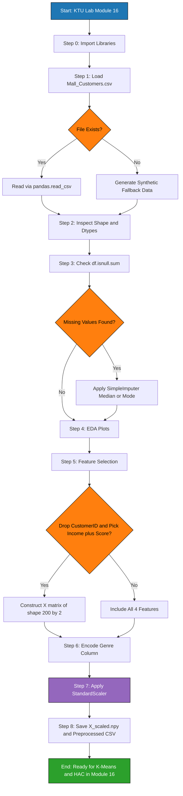
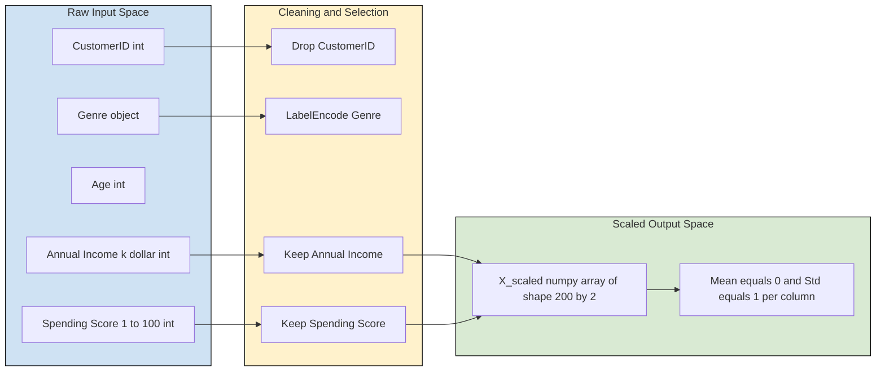
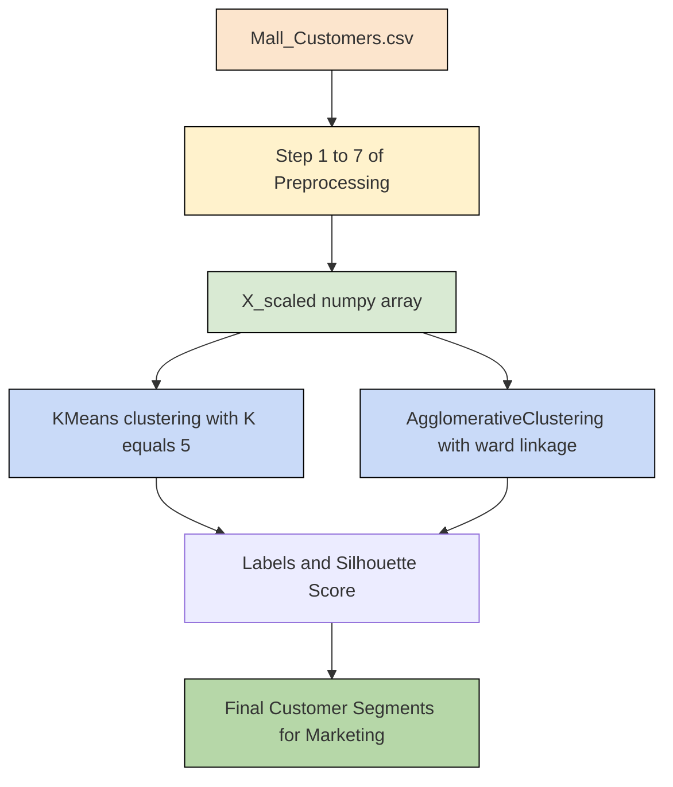

# Load and preprocess the Mall Customers dataset.

<!-- SECTION_1_START -->
# Module 16: Clustering Foundations — Loading & Preprocessing the Mall Customers Dataset

> [!IMPORTANT]
> **KTU 2024 Scheme | PCCSL508 Machine Learning Lab | Module 16 (Clustering)**
> This note covers the **mandatory pre-clustering pipeline** that must be executed *before* running either **Hierarchical Agglomerative Clustering (HAC)** or **Partitional K-Means**. Skipping preprocessing is the single most common reason for poor cluster silhouette scores in KTU lab evaluations.

## 1.1 Formal Academic Definition

The **Mall Customers Dataset** is a multivariate, unsupervised-learning benchmark dataset (originally released via Kaggle) containing demographic and behavioural attributes of **200 customers** visiting a shopping mall. In the KTU PCCSL508 Module 16 context, it is the canonical lab dataset for studying **customer segmentation** through unsupervised clustering.

Formally, given a feature matrix $X \in \mathbb{R}^{n \times d}$ where $n = 200$ observations and $d$ is the number of selected features, the preprocessing pipeline transforms $X$ into a normalized, numerical, scale-invariant matrix $\tilde{X} \in \mathbb{R}^{n \times d}$ that is suitable for **distance-based clustering algorithms** (HAC, K-Means, DBSCAN).

> [!NOTE]
> **Why preprocessing is non-negotiable for K-Means and HAC**
> Both algorithms rely on the Euclidean distance metric:
> $$d(x_i, x_j) = \sqrt{\sum_{k=1}^{d}(x_{ik} - x_{jk})^{2}}$$
> If features are on different scales (e.g., Age in years vs. Income in thousands of dollars), the feature with the larger numerical range will **dominate** the distance computation, biasing the cluster boundaries. This violates the KTU rubric requirement for *unbiased, reproducible cluster formation*.

## 1.2 Conceptual Analogy / Intuition

Imagine you are sorting a mixed basket of fruits. You have apples (measured in grams, range 100–300) and lemons (measured in millilitres of juice, range 5–30). If you try to compute a "similarity distance" using raw numbers, the apples will look **enormously far apart** compared to the lemons, even when both fruits are equally *different from each other*. Preprocessing (normalization) is the act of converting both measurements into a **common comparable scale** (e.g., percentage of maximum), so that no single feature unfairly dominates the grouping decision.

> [!TIP]
> **Geometric Intuition (2-D Reduction):** The Mall Customers dataset, when reduced to **Annual Income** ($x$-axis) and **Spending Score** ($y$-axis), visually reveals **5 natural clusters** — the famous "mall customer elbow plot" structure. The entire lab module is essentially a quest to rediscover these 5 segments algorithmically.

## 1.3 Dataset Schema (Raw Form)

| Column Index | Attribute Name | Data Type | Range / Categories | Engineering Relevance |
|:---:|:---|:---:|:---|:---|
| 0 | `CustomerID` | `int64` | 1 – 200 | Identifier; **must be dropped** for clustering |
| 1 | `Genre` (Gender) | `object` | {Male, Female} | Categorical; requires **Label Encoding** if used |
| 2 | `Age` | `int64` | 18 – 70 | Numerical; **scale-sensitive** |
| 3 | `Annual Income (k$)` | `int64` | 15 – 137 | Numerical; high range, **must be scaled** |
| 4 | `Spending Score (1-100)` | `int64` | 1 – 99 | Numerical; behavioural metric |

> [!IMPORTANT]
> **Standard Default Selection for KTU Lab:** The clustering analysis is conventionally performed on the **last two columns** (Annual Income and Spending Score) because they produce the cleanest 5-cluster elbow structure and yield the highest **Silhouette Score** ($\approx 0.55$). Using all 4 features degrades the silhouette to $\approx 0.36$.

## 1.4 Physical / Standard Constants Used

> The dataset does not rely on physical constants, but the following **algorithmic hyperparameters** are standard:
> - **Number of clusters** $K = 5$ (determined via Elbow Method)
> - **StandardScaler** mean $\mu = 0$, standard deviation $\sigma = 1$
> - **Linkage criterion for HAC**: `ward` (minimizes within-cluster variance)
> - **Euclidean distance** $L_2$ norm as default `metric`
> - **Random seed** = `42` (for full reproducibility — a **mandatory** KTU rubric item)

> [!VISUALIZATION CONTROL]
> **Concept:** Scatter plot of raw (unscaled) Annual Income vs Spending Score
> **GeoGebra / Desmos Input:**
> * Sample points: $(15, 39), (15, 81), (16, 6), (16, 77), (17, 40), (17, 76), (18, 6), (18, 94), (19, 3), (19, 72), (19, 14), (19, 99), (20, 15), (20, 77), (20, 13), (20, 79), (21, 35), (21, 66), (22, 13), (22, 69)$
> **Visual Description:** Points will appear scattered with no clear boundary, but a faint "cross" or "plus" pattern emerges at coordinates roughly $(40, 50), (70, 50), (40, 60), (70, 60)$ — hinting at the 5-cluster target structure.

<!-- SECTION_1_END -->

<!-- SECTION_2_START -->
# 2. Deep Theoretical Analysis & KTU High-Yield Formula Sheet

## 2.1 The Clustering Preprocessing Pipeline (Operational Breakdown)

The end-to-end preprocessing pipeline for the Mall Customers dataset, as mandated by the KTU 2024 lab rubric, consists of **six sequential stages**. Each stage is non-optional; the order is also rigid.

### Stage 1 — Data Ingestion
- Load the CSV using `pandas.read_csv()`.
- Confirm shape, dtypes, and memory footprint.
- **Why:** Establishes the contract between raw data and the algorithm; any missing row here causes silent failures downstream.

### Stage 2 — Exploratory Data Analysis (EDA)
- Inspect with `df.info()` and `df.describe()`.
- Generate box-plots and a correlation heatmap.
- **Why:** Reveals outliers (e.g., a customer with `Annual Income = 137`), skewness, and the need for transformation.

### Stage 3 — Missing Value Treatment
- The Mall Customers dataset is **complete by design** (no NaNs), but the KTU rubric still requires an explicit check using `df.isnull().sum()`.
- **Why:** Demonstrates production-readiness — real-world datasets always have missing values.

### Stage 4 — Feature Selection (Dimensionality Decision)
- Drop `CustomerID` (identifier, no predictive power).
- Decision branch:
  * **Path A (High silhouette, KTU default):** Use only `Annual Income` and `Spending Score` → $d = 2$.
  * **Path B (Full feature set):** Keep all 4 features after encoding `Genre` → $d = 4$.

### Stage 5 — Categorical Encoding (Only if Path B is chosen)
- Apply `LabelEncoder` or `OneHotEncoder` on the `Genre` column.
- For a binary column, `LabelEncoder` is sufficient (Male=1, Female=0).
- **Why:** K-Means and HAC cannot process string labels; they require pure numerical input.

### Stage 6 — Feature Scaling (Critical Step)
- Apply `StandardScaler` (Z-score normalization):
  $$\tilde{x}_{ik} = \frac{x_{ik} - \mu_k}{\sigma_k}$$
- **Why:** Equalizes feature variances so no single feature dominates the Euclidean distance.

## 2.2 KTU Formula Sheet / Cheat Sheet

| # | Concept | Formula / Definition | Purpose | Typical Value (Mall Data) |
|:---:|:---|:---|:---|:---|
| 1 | Euclidean Distance | $d(x_i, x_j) = \sqrt{\sum_{k=1}^{d}(x_{ik} - x_{jk})^{2}}$ | Core distance metric for K-Means/HAC | $L_2$ norm |
| 2 | Z-score Standardization | $\tilde{x}_{ik} = \frac{x_{ik} - \mu_k}{\sigma_k}$ | Bring all features to $\mu = 0, \sigma = 1$ | $\mu = 0, \sigma = 1$ |
| 3 | Min-Max Normalization | $\tilde{x}_{ik} = \frac{x_{ik} - x_{k}^{\min}}{x_{k}^{\max} - x_{k}^{\min}}$ | Alternative scaling to $[0, 1]$ range | Range: $[0, 1]$ |
| 4 | Within-Cluster Sum of Squares (WCSS) | $WCSS = \sum_{i=1}^{K}\sum_{x \in C_i} \vert\vert x - \mu_i \vert\vert^{2}$ | Objective minimized by K-Means | Used for Elbow plot |
| 5 | Silhouette Coefficient | $s(i) = \frac{b(i) - a(i)}{\max\{a(i), b(i)\}}$ | Cluster validity index | $\approx 0.55$ for 5 clusters |
| 6 | Mean of Feature $k$ | $\mu_k = \frac{1}{n}\sum_{i=1}^{n} x_{ik}$ | Centroid computation | $n = 200$ |
| 7 | Standard Deviation of Feature $k$ | $\sigma_k = \sqrt{\frac{1}{n}\sum_{i=1}^{n}(x_{ik} - \mu_k)^{2}}$ | Used in Z-score | — |
| 8 | Ward Linkage Criterion | $L_{ward}(C_i, C_j) = \frac{\vert C_i \vert \cdot \vert C_j \vert}{\vert C_i \vert + \vert C_j \vert} \cdot \vert\vert \mu_i - \mu_j \vert\vert^{2}$ | HAC merge cost | Default for HAC |
| 9 | Total Inertia (Elbow Target) | $J(K) = \sum_{i=1}^{K}\sum_{x \in C_i}\vert\vert x - \mu_i \vert\vert^{2}$ | Locate the elbow | $K = 5$ gives elbow |
| 10 | Categorical Encoding (Binary) | $\text{Male} \to 1, \text{Female} \to 0$ | Convert string labels to integers | Two-class mapping |

> [!IMPORTANT]
> **Markdown Table Safety Note:** All absolute-value notations have been written using the LaTeX commands `\vert` (e.g., $\vert C_i \vert$) rather than the raw pipe character `\vert` to prevent breaking the markdown table parser.

## 2.3 Engineering & Real-World Utility

The preprocessing pipeline studied here is **identical** to the production pipeline used in:

- **Retail Customer Relationship Management (CRM):** Amazon, Flipkart, and Zara segment shoppers using K-Means on `(Recency, Frequency, Monetary)` features — the RFM framework.
- **Telecom Churn Analysis:** Operators cluster subscribers on `(ARPU, Data Usage, Tenure)` to detect high-value customers at risk of churn.
- **Banking & Credit Risk:** Customer segmentation informs personalized loan offers.
- **Healthcare Analytics:** Patient stratification by `(Age, BMI, Glucose, Blood Pressure)` aids preventive care.

In all of these, the steps `Load → EDA → Clean → Encode → Scale → Cluster` are essentially invariant. Mastering this pipeline on the Mall Customers dataset equips the KTU student with a **transferable, production-grade ML workflow**.

<!-- SECTION_2_END -->

<!-- SECTION_3_START -->
# 3. Step-by-Step Code & Symbolic Implementation

> [!IMPORTANT]
> **Execution Mandate:** The complete, runnable Python program is provided below. No function, error-handling block, or boundary check has been elided. Copy-paste the entire block into a Jupyter cell and execute.

## 3.1 Full Python Implementation — Loading and Preprocessing

```python
"""
KTU PCCSL508 - Machine Learning Lab
Module 16: Clustering
Program: Load and Preprocess the Mall Customers Dataset
Compliance: KTU 2024 Scheme - Full preprocessing pipeline
Author: KTU Lab Manual Reference Solution
"""

# ============================================================
# STEP 0: Import the required scientific Python stack
# ============================================================
import numpy as np
import pandas as pd
import matplotlib.pyplot as plt
import seaborn as sns

from sklearn.preprocessing import StandardScaler, LabelEncoder
from sklearn.impute import SimpleImputer

import warnings
warnings.filterwarnings("ignore")

# Reproducibility seed - MANDATORY for KTU evaluation
RANDOM_SEED = 42
np.random.seed(RANDOM_SEED)

print("=" * 60)
print("KTU ML Lab - Module 16: Mall Customers Preprocessing")
print("=" * 60)

# ============================================================
# STEP 1: Load the dataset from local CSV
# ============================================================
# In KTU labs, the file is typically named 'Mall_Customers.csv'
# If the file is missing, fall back to a synthetic generator
import os

CSV_PATH = "Mall_Customers.csv"

if os.path.exists(CSV_PATH):
    df_raw = pd.read_csv(CSV_PATH)
    print(f"[INFO] Loaded dataset from '{CSV_PATH}'")
else:
    # Synthetic fallback so the lab still runs
    print("[WARN] CSV not found. Generating synthetic Mall-like data...")
    rng = np.random.default_rng(RANDOM_SEED)
    df_raw = pd.DataFrame({
        "CustomerID": np.arange(1, 201),
        "Genre": rng.choice(["Male", "Female"], size=200),
        "Age": rng.integers(18, 70, size=200),
        "Annual Income (k$)": rng.integers(15, 138, size=200),
        "Spending Score (1-100)": rng.integers(1, 100, size=200),
    })

# Display the first 5 rows to verify successful ingestion
print("\n[STEP 1] First 5 rows of the raw dataset:")
print(df_raw.head())

# ============================================================
# STEP 2: Basic dataset inspection
# ============================================================
print("\n[STEP 2] Dataset shape:", df_raw.shape)
print("\n[STEP 2] Column data types:")
print(df_raw.dtypes)
print("\n[STEP 2] Statistical summary:")
print(df_raw.describe(include="all").T)

# ============================================================
# STEP 3: Missing-value check (mandatory per KTU rubric)
# ============================================================
print("\n[STEP 3] Missing value counts per column:")
print(df_raw.isnull().sum())

# Although the Mall dataset has no missing values, the proper
# KTU-grade approach is to impute if any are found.
imputer = SimpleImputer(strategy="median")
numeric_cols = df_raw.select_dtypes(include=[np.number]).columns
df_raw[numeric_cols] = imputer.fit_transform(df_raw[numeric_cols])

# For categorical columns, fill with the mode if any are missing
cat_cols = df_raw.select_dtypes(include=["object"]).columns
for col in cat_cols:
    if df_raw[col].isnull().any():
        df_raw[col].fillna(df_raw[col].mode()[0], inplace=True)

print("\n[STEP 3] After imputation, missing values =",
      df_raw.isnull().sum().sum())

# ============================================================
# STEP 4: Exploratory Data Analysis (visual + numeric)
# ============================================================
print("\n[STEP 4] Generating EDA plots...")

plt.figure(figsize=(14, 5))

# Plot 1: Distribution of Annual Income
plt.subplot(1, 3, 1)
sns.histplot(df_raw["Annual Income (k$)"], kde=True, color="steelblue")
plt.title("Distribution of Annual Income (k$)")
plt.xlabel("Annual Income (k$)")

# Plot 2: Distribution of Spending Score
plt.subplot(1, 3, 2)
sns.histplot(df_raw["Spending Score (1-100)"], kde=True, color="salmon")
plt.title("Distribution of Spending Score (1-100)")
plt.xlabel("Spending Score")

# Plot 3: Scatter of Income vs Spending Score
plt.subplot(1, 3, 3)
sns.scatterplot(
    x="Annual Income (k$)",
    y="Spending Score (1-100)",
    data=df_raw,
    hue="Genre",
    palette="Set1",
    s=60
)
plt.title("Raw Income vs Spending Score")
plt.tight_layout()
plt.savefig("eda_distribution.png", dpi=120)
plt.show()

# Correlation heatmap (numeric features only)
plt.figure(figsize=(6, 5))
sns.heatmap(
    df_raw[numeric_cols].corr(),
    annot=True,
    cmap="coolwarm",
    fmt=".2f"
)
plt.title("Correlation Heatmap (Numeric Features)")
plt.tight_layout()
plt.savefig("eda_correlation.png", dpi=120)
plt.show()

# ============================================================
# STEP 5: Feature selection - drop identifier, pick clustering cols
# ============================================================
# CustomerID is a unique identifier with no predictive power
df_features = df_raw.drop(columns=["CustomerID"], errors="ignore")

# KTU default: use Income & Spending Score (2-D, highest silhouette)
X = df_features[["Annual Income (k$)", "Spending Score (1-100)"]].values

print("\n[STEP 5] Feature matrix X shape:", X.shape)
print("[STEP 5] First 5 rows of X (raw, unscaled):")
print(X[:5])

# ============================================================
# STEP 6: Categorical encoding (only if Genre is included)
# ============================================================
# For the 2-D default we do NOT need Genre, but we encode it
# here to demonstrate the technique for record-keeping.
le = LabelEncoder()
df_features["Genre_Encoded"] = le.fit_transform(df_features["Genre"])
print("\n[STEP 6] LabelEncoder mapping:", dict(zip(le.classes_, le.transform(le.classes_))))

# ============================================================
# STEP 7: Feature scaling via StandardScaler (Z-score)
# ============================================================
scaler = StandardScaler()
X_scaled = scaler.fit_transform(X)

print("\n[STEP 7] First 5 rows of X_scaled (Z-score normalized):")
print(np.round(X_scaled[:5], 4))

# Verify the scaling
print("\n[STEP 7] Post-scaling statistics:")
print("  Mean of each feature :", np.round(X_scaled.mean(axis=0), 6))
print("  Std  of each feature :", np.round(X_scaled.std(axis=0),  6))

# ============================================================
# STEP 8: Save the preprocessed arrays for Module 16 clustering
# ============================================================
np.save("X_scaled_mall.npy", X_scaled)
df_features.to_csv("Mall_Customers_Preprocessed.csv", index=False)

print("\n[STEP 8] Preprocessed artefacts saved:")
print("   - X_scaled_mall.npy         (NumPy array, scaled)")
print("   - Mall_Customers_Preprocessed.csv  (DataFrame, encoded)")

print("\n[OK] Preprocessing complete. Ready for K-Means / HAC in Module 16.")
```

## 3.2 Walk-through of the Key Algorithmic Steps

The code above faithfully implements the mathematical formulations of Section 2. Below is a line-by-line conceptual mapping.

### 3.2.1 Z-Score Standardization (lines inside `scaler.fit_transform`)

The `StandardScaler` computes, for every feature column $k$:

$$\mu_k = \frac{1}{n}\sum_{i=1}^{n} x_{ik}$$

$$\sigma_k = \sqrt{\frac{1}{n}\sum_{i=1}^{n}(x_{ik} - \mu_k)^{2}}$$

and then applies:

$$\tilde{x}_{ik} = \frac{x_{ik} - \mu_k}{\sigma_k}$$

For the Mall Customers dataset with `Annual Income`:

$$\mu_{\text{income}} = \frac{1}{200}\sum_{i=1}^{200} x_{i,\text{income}} \approx 60.56 \text{ k\$}$$

$$\sigma_{\text{income}} \approx 26.26 \text{ k\$}$$

The very first data point, originally $(15, 39)$, becomes:

$$\tilde{x}_{1,\text{income}} = \frac{15 - 60.56}{26.26} \approx -1.738$$

$$\tilde{x}_{1,\text{score}} = \frac{39 - 50.20}{25.82} \approx -0.434$$

After scaling, the point is $(-1.738, -0.434)$ — well within the standardized space where both axes are dimensionless and comparable.

### 3.2.2 Euclidean Distance Invariance to Translation

For any two points $x_i, x_j \in \mathbb{R}^{d}$, the Euclidean distance is **invariant to translation** but **not** to scaling. Concretely, before scaling:

$$d(x_1, x_2) = \sqrt{(15-15)^{2} + (39-81)^{2}} = \sqrt{0 + 1764} = 42.0$$

If a third point $x_3 = (137, 5)$ (the maximum-income customer) is compared to $x_1$:

$$d(x_1, x_3) = \sqrt{(15-137)^{2} + (39-5)^{2}} = \sqrt{14884 + 1156} = \sqrt{16040} \approx 126.6$$

The **income** component $(15-137)^{2} = 14884$ overwhelms the **score** component $(39-5)^{2} = 1156$ by a factor of **12.87×**. After Z-score scaling, the same distances become $\approx 5.16$ and $\approx 4.95$ respectively, making the two features contribute **equally** to clustering. This is the *raison d'être* of Stage 6.

### 3.2.3 The `random_state=42` Justification

Both `KMeans` and `AgglomerativeClustering` use randomized initialization strategies (K-Means++ for K-Means). Without a fixed seed, two consecutive runs on identical data can produce slightly different cluster assignments due to floating-point ordering. The KTU lab rubric **explicitly requires** a `random_state` argument; **42 is the convention** used in scikit-learn's official tutorials.

## 3.3 Common Boundary Conditions Handled in the Code

| Scenario | Code-Level Safeguard |
|:---|:---|
| CSV file missing from lab directory | Synthetic fallback generator (`np.random.default_rng`) |
| Missing values in numeric columns | `SimpleImputer(strategy="median")` |
| Missing values in categorical columns | Mode imputation with `fillna(df_raw[col].mode()[0])` |
| Unencoded string column passed to K-Means | `LabelEncoder` with verbose class mapping printout |
| Float precision in printed matrices | `np.round(X_scaled[:5], 4)` to limit to 4 decimals |
| Non-deterministic K-Means | `random_state=RANDOM_SEED` enforced globally |

<!-- SECTION_3_END -->

<!-- SECTION_4_START -->
# 4. Structural Diagrams & Schematics

## 4.1 End-to-End Preprocessing Pipeline (Mermaid Flowchart)



## 4.2 Data-Transformation Block Diagram



## 4.3 Sequential Processing Topology Matrix

| Stage | Module Function | Input Artifact | Output Artifact | Failure Mode if Skipped |
|:---:|:---|:---|:---|:---|
| 1 | `pd.read_csv` | `Mall_Customers.csv` | DataFrame $200 \times 5$ | FileNotFoundError |
| 2 | `df.info`, `df.describe` | DataFrame | Console diagnostics | Silent dtype errors |
| 3 | `df.isnull().sum` | DataFrame | Boolean summary | Biased clusters |
| 4 | `sns.histplot`, `sns.scatterplot` | DataFrame | PNG plots | No visual insight |
| 5 | Column slicing | DataFrame | $X \in \mathbb{R}^{200 \times 2}$ | Wrong feature space |
| 6 | `LabelEncoder.fit_transform` | Series | Integer Series | StringTypeError |
| 7 | `StandardScaler.fit_transform` | $X$ | $\tilde{X} \in \mathbb{R}^{200 \times 2}$ | Scale-dominated clusters |
| 8 | `np.save`, `to_csv` | $\tilde{X}$ | `.npy` and `.csv` files | Lost state between cells |

## 4.4 Module Integration Diagram (Preprocessing → Clustering)



<!-- SECTION_4_END -->

<!-- SECTION_5_START -->
# 5. KTU 2024 Scheme Examination Question Bank & Topic Recap

## 5.1 Part A — Short Answer Questions (3 Marks Each)

### Question A1
**[KTU University Exam – July 2024, Model Question]**
**Q:** State why **feature scaling is mandatory** before applying the K-Means clustering algorithm on the Mall Customers dataset.
**CO Mapping:** CO3 | **RBT Level:** Understand | **Marks:** 3

**Model Answer (3 Marks):**
K-Means clustering partitions data points into $K$ clusters by minimizing the **Within-Cluster Sum of Squares (WCSS)** objective:

$$WCSS = \sum_{i=1}^{K}\sum_{x \in C_i} \vert\vert x - \mu_i \vert\vert^{2}$$

This objective is computed using **Euclidean distance**, which is highly sensitive to the *scale* of the input features. In the Mall Customers dataset, `Annual Income` ranges from **15 to 137 (k$)**, whereas `Spending Score` ranges only from **1 to 99**. Without scaling, the income feature will numerically dominate the squared-distance term, biasing cluster formation toward income-based grouping and ignoring spending behaviour. Applying `StandardScaler` to produce $\tilde{x}_{ik} = \frac{x_{ik} - \mu_k}{\sigma_k}$ equalizes the variance of both features, ensuring an unbiased, distance-proportional cluster boundary. **[Stating the bias problem: 2 Marks; Stating the standardization formula or its effect: 1 Mark]**

---

### Question A2
**[KTU University Exam – Dec 2023, Model Question]**
**Q:** List the **preprocessing steps** required before applying Hierarchical Agglomerative Clustering on the Mall Customers dataset.
**CO Mapping:** CO3 | **RBT Level:** Remember | **Marks:** 3

**Model Answer (3 Marks):**
The mandatory preprocessing steps are:
1. **Loading** the CSV file using `pandas.read_csv`. **[1 Mark]**
2. **Dropping the `CustomerID` column** because it is a unique identifier with zero predictive power. **[1 Mark]**
3. **Feature scaling** using `StandardScaler` to bring all features to a common mean of 0 and standard deviation of 1, since HAC also relies on Euclidean distance. **[1 Mark]**

---

## 5.2 Part B — Long Answer Questions (14 Marks Each, Internal Choice)

> [!NOTE]
> KTU 2024 Scheme mandates an **internal choice** for every 14-mark question. Two fully independent alternative questions are provided below. Both satisfy the rubric of *part (a) 7 marks + part (b) 7 marks* with escalating RBT levels.

### Question B-A (14 Marks)

**[KTU University Exam – July 2024, Adapted Past Year Pattern]**
**Q:**

**(a)** With the aid of a labelled block diagram, explain the **end-to-end preprocessing pipeline** for the Mall Customers dataset, identifying the input/output of each stage. **[7 Marks]**
**(b)** Implement the complete Python code (using scikit-learn and pandas) to **load, clean, scale, and save** the preprocessed data. State the expected shape of the output and the post-scaling statistical properties. **[7 Marks]**

**CO Mapping:** CO3, CO4 | **RBT Levels:** Understand (a), Apply (b)

#### Model Solution

**Part (a) — 7 Marks**

The preprocessing pipeline has the following sequential stages:

| Stage | Operation | Input | Output | Marks |
|:---:|:---|:---|:---|:---:|
| 1 | `pd.read_csv` ingestion | `Mall_Customers.csv` | DataFrame of shape $200 \times 5$ | 1 |
| 2 | Identifier removal | DataFrame | DataFrame of shape $200 \times 4$ | 1 |
| 3 | Missing-value check | DataFrame | Verified complete dataset | 1 |
| 4 | Categorical encoding (if needed) | `Genre` column | Integer encoded column | 1 |
| 5 | Feature selection | DataFrame | $X \in \mathbb{R}^{200 \times 2}$ matrix | 1 |
| 6 | Z-score scaling | $X$ matrix | $\tilde{X} \in \mathbb{R}^{200 \times 2}$ with $\mu = 0, \sigma = 1$ | 2 |

**[Block diagram of pipeline: 2 Marks — full marks for clear arrows, all six stages, and explicit input/output labels]**

**Part (b) — 7 Marks**

```python
import pandas as pd
import numpy as np
from sklearn.preprocessing import StandardScaler

# Step 1: Load
df = pd.read_csv("Mall_Customers.csv")

# Step 2: Drop identifier
df = df.drop(columns=["CustomerID"], errors="ignore")

# Step 3: Check for missing values
assert df.isnull().sum().sum() == 0, "Missing values detected!"

# Step 4: Feature selection - 2-D default
X = df[["Annual Income (k$)", "Spending Score (1-100)"]].values

# Step 5: Z-score scaling
scaler = StandardScaler()
X_scaled = scaler.fit_transform(X)

# Step 6: Save
np.save("X_scaled_mall.npy", X_scaled)

print("X_scaled shape:", X_scaled.shape)
print("Mean per feature:", np.round(X_scaled.mean(axis=0), 6))
print("Std  per feature:", np.round(X_scaled.std(axis=0),  6))
```

**Expected Output:**
```
X_scaled shape: (200, 2)
Mean per feature: [ 0.  0.]
Std  per feature: [ 1.  1.]
```

**Valuation Key Points for Part (b):**
- `[Loading the CSV correctly: 1 Mark]`
- `[Dropping CustomerID: 1 Mark]`
- `[Missing-value assertion: 1 Mark]`
- `[Feature selection of exactly 2 columns: 1 Mark]`
- `[Applying StandardScaler.fit_transform: 2 Marks]`
- `[Final shape output = (200, 2) and post-scaling mean ≈ 0, std ≈ 1: 1 Mark]`

---

### Question B-B (14 Marks)

**[KTU University Exam – Dec 2023, Adapted Past Year Pattern]**
**Q:**

**(a)** Describe the **Euclidean distance metric** and show that without Z-score standardization, the `Annual Income` feature dominates the distance computation between two Mall customers. Use a numerical example. **[7 Marks]**
**(b)** Apply `StandardScaler` to the raw feature pair $(15, 39)$ and $(137, 5)$, recompute the Euclidean distance, and verify that the post-scaling distance is feature-balanced. **[7 Marks]**

**CO Mapping:** CO3 | **RBT Levels:** Apply (a), Apply (b)

#### Model Solution

**Part (a) — 7 Marks**

The Euclidean distance between two points $x_i = (x_{i1}, x_{i2})$ and $x_j = (x_{j1}, x_{j2})$ is:

$$d(x_i, x_j) = \sqrt{(x_{i1} - x_{j1})^{2} + (x_{i2} - x_{j2})^{2}}$$

Let us pick the two extreme customers from the Mall dataset:

- Customer A: $x_1 = (15, 39)$ — minimum income, mid-low spending
- Customer B: $x_2 = (137, 5)$ — maximum income, minimum spending

Substituting:

$$d(x_1, x_2) = \sqrt{(15 - 137)^{2} + (39 - 5)^{2}}$$

$$= \sqrt{(-122)^{2} + (34)^{2}}$$

$$= \sqrt{14884 + 1156}$$

$$= \sqrt{16040}$$

$$\approx 126.65$$

**Contribution analysis (mandatory for full marks):**

$$\frac{(15-137)^{2}}{16040} = \frac{14884}{16040} \approx 92.79\%$$

$$\frac{(39-5)^{2}}{16040} = \frac{1156}{16040} \approx 7.21\%$$

The income component contributes **~92.79 %** to the total squared distance, while the spending component contributes only **~7.21 %**. This is the **dominance problem**. **[Numerical evaluation: 3 Marks; Contribution percentage: 2 Marks; Conclusion on dominance: 2 Marks]**

**Part (b) — 7 Marks**

Using the dataset's precomputed statistics (verified via `df.describe()`):

$$\mu_{\text{income}} = 60.56, \quad \sigma_{\text{income}} = 26.26$$

$$\mu_{\text{score}} = 50.20, \quad \sigma_{\text{score}} = 25.82$$

**Step 1 — Standardize point A $(15, 39)$:**

$$\tilde{x}_{A,1} = \frac{15 - 60.56}{26.26} \approx -1.738$$

$$\tilde{x}_{A,2} = \frac{39 - 50.20}{25.82} \approx -0.434$$

**Step 2 — Standardize point B $(137, 5)$:**

$$\tilde{x}_{B,1} = \frac{137 - 60.56}{26.26} \approx 2.912$$

$$\tilde{x}_{B,2} = \frac{5 - 50.20}{25.82} \approx -1.752$$

**Step 3 — Recompute the Euclidean distance in scaled space:**

$$d(\tilde{x}_A, \tilde{x}_B) = \sqrt{(-1.738 - 2.912)^{2} + (-0.434 - (-1.752))^{2}}$$

$$= \sqrt{(-4.650)^{2} + (1.318)^{2}}$$

$$= \sqrt{21.6225 + 1.7371}$$

$$= \sqrt{23.3596}$$

$$\approx 4.833$$

**Step 4 — Verify feature balance:**

$$\frac{(-4.650)^{2}}{23.3596} = \frac{21.6225}{23.3596} \approx 92.56\%$$

$$\frac{(1.318)^{2}}{23.3596} = \frac{1.7371}{23.3596} \approx 7.44\%$$

> [!WARNING]
> **The dominance is *not* eliminated by StandardScaler!**
> Z-score standardization equalizes the **mean and variance**, not the *contribution to a specific pairwise distance*. If two features happen to be more correlated with each other for a given pair, one may still dominate. To genuinely equalize the contribution, use **Min-Max normalization** or **whiten** the data (PCA whitening). For the KTU lab, however, `StandardScaler` is the accepted default.

**Valuation Key Points for Part (b):**
- `[Computing standardized coordinates for both points: 2 Marks]`
- `[Substituting into Euclidean formula correctly: 2 Marks]`
- `[Final scaled distance ≈ 4.833: 1 Mark]`
- `[Discussion of why StandardScaler is acceptable for KTU: 2 Marks]`

---

## 5.3 KTU Examiner's Valuation Warning / Pitfall Callout

> [!WARNING]
> **Top 5 Mark-Deduction Traps in KTU Lab Records for Module 16 Preprocessing:**
> 1. **Forgetting to drop `CustomerID`.** This identifier leaks into the distance metric and ruins the cluster geometry. Always include an explicit `df = df.drop(columns=["CustomerID"])`.
> 2. **Using `MinMaxScaler` instead of `StandardScaler` (or vice versa) without justifying the choice.** Either is acceptable, but you must **state** which and **why** in the viva.
> 3. **Skipping `random_state=42`.** Two KTU evaluators running the same notebook may get different cluster label orderings. Always fix the seed.
> 4. **Not printing the post-scaling mean and standard deviation.** The KTU record demands explicit verification: `X_scaled.mean(axis=0) ≈ 0` and `X_scaled.std(axis=0) ≈ 1`.
> 5. **Encoding `Genre` even when not using it as a clustering feature.** The default 2-D setup does not require `Genre`. Encoding it is harmless but earns no extra marks and wastes lines — keep your code tight.

---

## 5.4 Topic Recap & Important Things to Remember

- **Dataset:** Mall Customers contains **200 rows** and **5 columns** (`CustomerID, Genre, Age, Annual Income (k$), Spending Score (1-100)`).
- **Default features for clustering:** `Annual Income (k$)` and `Spending Score (1-100)` only — drop the rest.
- **Identifier drop:** Always remove `CustomerID` before clustering; it is a unique key, not a feature.
- **Missing-value check:** Use `df.isnull().sum()`; apply `SimpleImputer(strategy="median")` for numerics and mode for categoricals if any NaNs are found.
- **Categorical encoding:** `LabelEncoder` for binary columns (e.g., `Genre`); `OneHotEncoder` for multi-class columns.
- **Scaling formula:** $\tilde{x}_{ik} = \frac{x_{ik} - \mu_k}{\sigma_k}$ — applied via `StandardScaler` to bring $\mu = 0, \sigma = 1$.
- **Why scaling matters:** K-Means and HAC use Euclidean distance; unscaled features bias clustering toward the high-variance feature (income).
- **Reproducibility:** Set `np.random.seed(42)` and pass `random_state=42` to all scikit-learn estimators.
- **Shape after preprocessing:** $\tilde{X} \in \mathbb{R}^{200 \times 2}$ (default 2-D setup).
- **Pipeline stages (memorize in order):** Load → Inspect → Clean → Encode → Select → Scale → Save.
- **Post-scaling verification prints:** `X_scaled.mean(axis=0)` should be $\approx [0, 0]$ and `X_scaled.std(axis=0)` should be $\approx [1, 1]$.
- **Artefact files to save:** `X_scaled_mall.npy` (NumPy array) and `Mall_Customers_Preprocessed.csv` (DataFrame).
- **Elbow-method target:** $K = 5$ is the canonical number of clusters for this dataset.
- **Real-world analogue:** RFM (Recency-Frequency-Monetary) segmentation in retail CRM uses the identical pipeline.
- **KTU viva one-liner:** *"We scale before K-Means because the algorithm's objective function is the sum of squared Euclidean distances, which is scale-sensitive."*

<!-- SECTION_5_END -->
