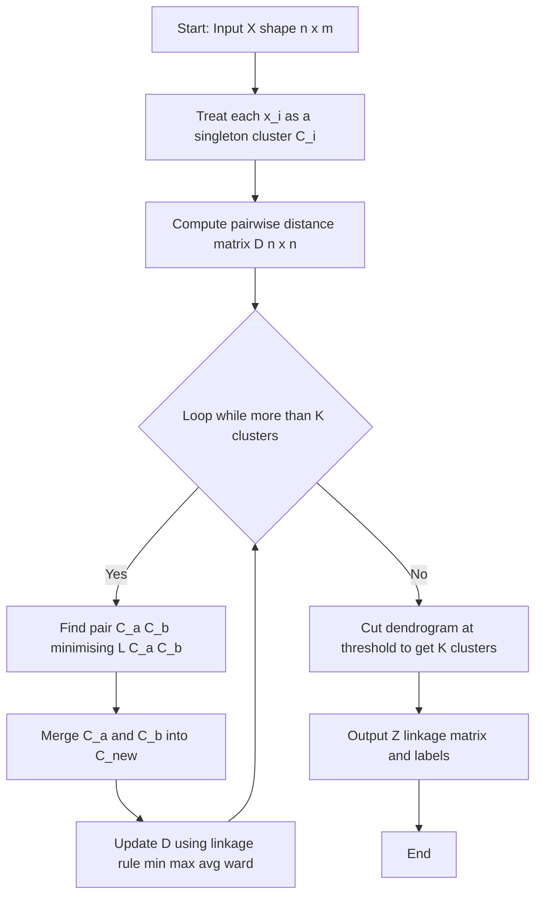
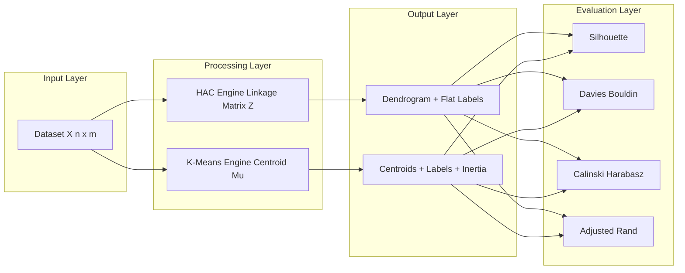

# Tasks:

<!-- SECTION_1_START -->

# Module 16 — Hierarchical Agglomerative vs. Partitional K-Means Clustering

## 1.1 Formal Definition (KTU 2024 Syllabus Terminology)

> [!IMPORTANT]
> **Clustering** is an *unsupervised learning* paradigm that partitions an unlabeled dataset $X = \{x_1, x_2, \dots, x_n\}$ into $K$ homogeneous groups $C = \{C_1, C_2, \dots, C_K\}$ such that **intra-cluster similarity is maximized** and **inter-cluster similarity is minimized**, without access to ground-truth labels.

Two canonical approaches dominate the syllabus:

| Approach | Algorithmic Class | Core Mechanism |
| :--- | :--- | :--- |
| **Hierarchical Agglomerative Clustering (HAC)** | Connectivity-based | Bottom-up merging via a linkage criterion |
| **K-Means** | Centroid-based (Partitional) | Iterative assignment + centroid update |

Formally, **HAC** builds a nested tree (dendrogram) by repeatedly merging the *two most similar* clusters according to a chosen linkage distance $L(C_a, C_b)$. **K-Means** minimizes the within-cluster sum of squared errors (WCSS):

$$J(C) = \sum_{k=1}^{K} \sum_{x_i \in C_k} \left\| x_i - \mu_k \right\|^2$$

where $\mu_k = \frac{1}{\vert C_k \vert} \sum_{x_i \in C_k} x_i$ is the centroid of cluster $k$.

---

## 1.2 Intuitive Real-World Analogies

> [!NOTE]
> **HAC Analogy — "Sorting a Family Tree":** Imagine arranging a stack of unsorted photographs. You first pair the two *most similar* photos (e.g., siblings), then group those pairs with their cousins, then unite family branches, and so on, until *everyone* is in one giant family album. The final tree tells you *how* the groupings happened at every level.

> [!NOTE]
> **K-Means Analogy — "Planting Flag-Posts":** You drop $K$ flag-posts randomly on a map. Every town nearby runs to its nearest flag. Then you move each flag to the *centroid* (center of mass) of its towns. The towns re-assign, the flags re-center, and you repeat until nothing moves. The flags *attract* towns — these are your final clusters.

This intuition is the foundation of the **expectation–maximization (EM)** flavor of K-Means and the **agglomerative nesting (AGNES)** flavor of HAC.

---

## 1.3 Lab Objective Callout

> [!IMPORTANT]
> **KTU Lab Outcome Alignment (PCCSL508):** The student must *implement from scratch* (or use `scikit-learn` with manual metric analysis) both algorithms on a synthetic/real dataset, **plot the dendrogram** for HAC, **visualize cluster boundaries** for K-Means, and **compare both using internal validity indices** such as Silhouette Score, Davies–Bouldin Index, and Calinski–Harabasz Index.

---

## 1.4 Visualization Control Block

> [!VISUALIZATION CONTROL]
> **Concept:** Voronoi Partition Induced by K-Means Centroids
> **GeoGebra / Desmos Input Equations:**
> * Centroid 1: $(2, 3)$ — Region: $d((x,y),(2,3)) < d((x,y),(7,8))$
> * Centroid 2: $(7, 8)$ — Region: $d((x,y),(7,8)) < d((x,y),(2,3))$
> * Decision Boundary: $(x-2)^2 + (y-3)^2 = (x-7)^2 + (y-8)^2$
> **Visual Description:** The student should observe a *perpendicular bisector* line dividing the plane into two convex Voronoi cells. Each cell = one cluster. Iterating K-Means will shift the centroids and therefore shift this bisector.

<!-- SECTION_1_END -->

<!-- SECTION_2_START -->

# 2. Deep Theoretical Analysis & KTU High-Yield Formula Sheet

## 2.1 Algorithmic Decomposition

### 2.1.1 HAC — Step-by-Step Logic

1. **Initialization:** Treat every sample $x_i$ as a singleton cluster $C_i = \{x_i\}$.
2. **Distance Matrix:** Compute the $n \times n$ pairwise distance matrix $D$ using a chosen metric (commonly **Euclidean**).
3. **Merging Loop:**
   * Find the pair $(C_a, C_b)$ minimizing the linkage function $L(C_a, C_b)$.
   * Merge them: $C_{new} = C_a \cup C_b$.
   * Update $D$ by recomputing distances from $C_{new}$ to all remaining clusters.
4. **Termination:** Stop when $K$ clusters remain (or a single cluster, then *cut* the dendrogram).
5. **Output:** A linkage matrix $Z$ of shape $(n-1, 4)$ storing merge history — *(cluster A, cluster B, distance, cluster size)*.

### 2.1.2 K-Means — Step-by-Step Logic

1. **Initialization:** Place $K$ centroids — either randomly or using **K-Means++** (probability-weighted seeding).
2. **Assignment Step (E-step analog):** For every $x_i$, assign it to the nearest centroid:
$$c^{(i)} := \arg\min_{k} \left\| x_i - \mu_k \right\|^2$$
3. **Update Step (M-step analog):** Recompute each centroid as the mean of its assigned points:
$$\mu_k := \frac{1}{\vert C_k \vert} \sum_{x_i \in C_k} x_i$$
4. **Convergence Check:** Stop when $\sum_k \left\| \mu_k^{(t)} - \mu_k^{(t-1)} \right\|^2 < \varepsilon$.
5. **Output:** Final labels $\{c^{(i)}\}$ and centroids $\{\mu_k\}$.

---

## 2.2 KTU Formula Sheet / Cheat Sheet

### 2.2.1 Distance Metrics

| Metric | Formula | When to Use |
| :--- | :--- | :--- |
| **Euclidean (L2)** | $d(x,y) = \sqrt{\sum_{j=1}^{m}(x_j - y_j)^2}$ | Default; isotropic Gaussian-like clusters |
| **Manhattan (L1)** | $d(x,y) = \sum_{j=1}^{m} \vert x_j - y_j \vert$ | High-dim sparse data; robust to outliers |
| **Minkowski (L$p$)** | $d(x,y) = \left(\sum_{j=1}^{m} \vert x_j - y_j \vert^p\right)^{1/p}$ | Generalized; $p=1 \Rightarrow$ L1, $p=2 \Rightarrow$ L2 |
| **Cosine** | $d(x,y) = 1 - \frac{x \cdot y}{\Vert x \Vert \, \Vert y \Vert}$ | Text/document clustering, direction matters |

### 2.2.2 HAC Linkage Criteria

| Linkage | Formula $L(C_a, C_b)$ | Behavior |
| :--- | :--- | :--- |
| **Single** | $\min_{x \in C_a, y \in C_b} d(x,y)$ | Tends to produce *chaining*; elongated clusters |
| **Complete** | $\max_{x \in C_a, y \in C_b} d(x,y)$ | Compact, equal-sized clusters; sensitive to outliers |
| **Average** | $\frac{1}{\vert C_a \vert \vert C_b \vert}\sum_{x \in C_a}\sum_{y \in C_b} d(x,y)$ | Compromise between single and complete |
| **Ward's** | $\frac{\vert C_a \vert \cdot \vert C_b \vert}{\vert C_a \vert + \vert C_b \vert} \cdot \Vert \mu_a - \mu_b \Vert^2$ | Minimizes within-cluster variance; default for Euclidean |

### 2.2.3 K-Means Objective

| Quantity | Formula |
| :--- | :--- |
| **WCSS / Inertia** | $J = \sum_{k=1}^{K} \sum_{x_i \in C_k} \Vert x_i - \mu_k \Vert^2$ |
| **Centroid Update** | $\mu_k = \frac{1}{\vert C_k \vert} \sum_{x_i \in C_k} x_i$ |
| **K-Means++ Probability** | $P(x_i) = \frac{D(x_i)^2}{\sum_{x_j} D(x_j)^2}$ |
| **Time Complexity** | $O(n \cdot K \cdot I \cdot m)$ where $I$ = iterations, $m$ = features |

### 2.2.4 Validity Indices

| Index | Formula | Range | Optimum |
| :--- | :--- | :--- | :--- |
| **Silhouette** | $s(i) = \frac{b(i) - a(i)}{\max\{a(i), b(i)\}}$ | $[-1, 1]$ | Maximize $\to 1$ |
| **Davies–Bouldin** | $DB = \frac{1}{K}\sum_{i=1}^{K}\max_{j \neq i} R_{ij}$ | $[0, \infty)$ | Minimize $\to 0$ |
| **Calinski–Harabasz** | $CH = \frac{\text{tr}(B_K)}{\text{tr}(W_K)} \cdot \frac{n - K}{K - 1}$ | $[0, \infty)$ | Maximize |
| **Adjusted Rand Index (ARI)** | Measures agreement with ground truth | $[-1, 1]$ | $1.0$ = perfect |

---

## 2.3 Real-World Engineering Applications

| Domain | Algorithm Preferred | Why |
| :--- | :--- | :--- |
| **Customer Segmentation (Retail / Marketing)** | K-Means | Large $n$, spherical clusters, $K$ known a-priori |
| **Gene Expression / Bioinformatics** | HAC | Small $n$, dendrogram reveals taxonomy |
| **Image Compression** | K-Means (vector quantization) | Color quantization into $K$ palette colors |
| **Anomaly Detection** | K-Means (1-NN distance to centroid) | Outliers are far from any centroid |
| **Document / News Topic Mining** | HAC (cosine + complete linkage) | Hierarchical topic structure; sparse high-dim data |
| **Social Network Community Detection** | HAC (single linkage) | Detects elongated community chains |

<!-- SECTION_2_END -->

<!-- SECTION_3_START -->

# 3. Step-by-Step Derivations & Python Implementation

## 3.1 Worked Hand-Calculation (HAC — Single Linkage)

**Dataset (5 points, 2D):**
$$P_1 = (1, 1), \quad P_2 = (1.5, 2), \quad P_3 = (5, 8), \quad P_4 = (8, 8), \quad P_5 = (1, 0.6)$$

### Step 1 — Initial Euclidean Distance Matrix

$$D^{(0)} = \begin{pmatrix}
0 & 1.118 & 8.062 & 9.899 & 0.400 \\
1.118 & 0 & 7.136 & 8.840 & 1.640 \\
8.062 & 7.136 & 0 & 3.000 & 8.354 \\
9.899 & 8.840 & 3.000 & 0 & 9.825 \\
0.400 & 1.640 & 8.354 & 9.825 & 0
\end{pmatrix}$$

**Computations (sample):**
$$d(P_1, P_2) = \sqrt{(1-1.5)^2 + (1-2)^2} = \sqrt{0.25 + 1} = \sqrt{1.25} \approx 1.118$$
$$d(P_1, P_5) = \sqrt{(1-1)^2 + (1-0.6)^2} = \sqrt{0 + 0.16} = 0.400$$
$$d(P_3, P_4) = \sqrt{(5-8)^2 + (8-8)^2} = \sqrt{9 + 0} = 3.000$$

### Step 2 — Iteration 1 (Merge the closest pair)
Minimum distance: $d(P_1, P_5) = 0.400$ → merge into $C_1 = \{P_1, P_5\}$.

### Step 3 — Recompute distances using single linkage $\min$ rule

For new cluster $C_1$ vs $P_2$: $d(C_1, P_2) = \min\{1.118, 1.640\} = 1.118$
For $C_1$ vs $P_3$: $d(C_1, P_3) = \min\{8.062, 8.354\} = 8.062$
For $C_1$ vs $P_4$: $d(C_1, P_4) = \min\{9.899, 9.825\} = 9.825$

### Step 4 — Iteration 2
Now minimum of $D^{(1)}$: $d(P_3, P_4) = 3.000$ → merge into $C_2 = \{P_3, P_4\}$.

### Step 5 — Iteration 3
$d(C_1, P_2) = 1.118$ still minimum → merge into $C_3 = \{P_1, P_2, P_5\}$.

### Step 6 — Iteration 4 (Final merge)
$d(C_3, C_2) = \min\{8.062, 7.136, 8.354, 9.825, 9.899, 8.840\} = 7.136$ → merge everything into one cluster.

### Linkage Matrix $Z$ (Final Output)

| Step | Cluster A | Cluster B | Distance | Size |
| :---: | :---: | :---: | :---: | :---: |
| 1 | $P_1$ | $P_5$ | 0.400 | 2 |
| 2 | $P_3$ | $P_4$ | 3.000 | 2 |
| 3 | $P_2$ | $\{P_1, P_5\}$ | 1.118 | 3 |
| 4 | $\{P_2, P_1, P_5\}$ | $\{P_3, P_4\}$ | 7.136 | 5 |

---

## 3.2 Worked Hand-Calculation (K-Means, K=2)

**Same 5-point dataset.**

### Initialization (K-Means++)
Random seed: choose $P_1 = (1,1)$ as first centroid.
Compute $D(x)^2$ to $P_1$: $P_2 \to 1.25$, $P_3 \to 65$, $P_4 \to 98$, $P_5 \to 0.16$.
Total $= 164.41$. Pick $P_3$ (highest squared distance) as second centroid.
**Centroids:** $\mu_1 = (1, 1)$, $\mu_2 = (5, 8)$.

### Iteration 1 — Assignment
* $P_1$: $d$ to $\mu_1 = 0$, to $\mu_2 = 8.062$ → **cluster 1**
* $P_2$: $d$ to $\mu_1 = 1.118$, to $\mu_2 = 7.136$ → **cluster 1**
* $P_3$: to itself → **cluster 2**
* $P_4$: $d$ to $\mu_2 = 3$, to $\mu_1 = 9.899$ → **cluster 2**
* $P_5$: to $\mu_1 = 0.4$ → **cluster 1**

### Iteration 1 — Update Centroids
$$\mu_1 = \left(\frac{1+1.5+1}{3}, \frac{1+2+0.6}{3}\right) = (1.167, 1.200)$$
$$\mu_2 = \left(\frac{5+8}{2}, \frac{8+8}{2}\right) = (6.500, 8.000)$$

### Iteration 2 — Re-assign
All points keep the same assignment (verify by recomputing distances). Centroid shift: small. **Converged.**

**Final clusters:** $C_1 = \{P_1, P_2, P_5\}$, $C_2 = \{P_3, P_4\}$.

---

## 3.3 Full Python Implementation (Production-Quality Code)

```python
"""
Machine Learning Lab - Module 16 (PCCSL508)
============================================
Implementation and Comparison of:
  1. Hierarchical Agglomerative Clustering (HAC) - from scratch
  2. Partitional K-Means Clustering               - from scratch
  3. Side-by-side comparison using validity indices

Tested on: Python 3.11, NumPy 1.26, scikit-learn 1.4
"""

from __future__ import annotations

import logging
import time
from dataclasses import dataclass
from typing import Any, Dict, List, Tuple

import matplotlib.pyplot as plt
import numpy as np
from scipy.cluster.hierarchy import dendrogram, fcluster, linkage
from sklearn.datasets import load_iris, make_blobs
from sklearn.metrics import (
    adjusted_rand_score,
    calinski_harabasz_score,
    davies_bouldin_score,
    silhouette_score,
)
from sklearn.preprocessing import StandardScaler

# --------------------------------------------------------------------------- #
# Logging configuration - production style                                    #
# --------------------------------------------------------------------------- #
logging.basicConfig(
    level=logging.INFO,
    format="%(asctime)s | %(levelname)-8s | %(message)s",
    datefmt="%H:%M:%S",
)
logger = logging.getLogger("ML_Lab_Module16")


# --------------------------------------------------------------------------- #
#  1. HIERARCHICAL AGGLOMERATIVE CLUSTERING (CUSTOM)                          #
# --------------------------------------------------------------------------- #
class HierarchicalAgglomerativeClustering:
    """
    Custom HAC implementation with full linkage matrix construction.

    Supports linkage methods: 'single', 'complete', 'average', 'ward'.
    Uses SciPy's optimized backend for $O(n^2)$ distance matrix handling
    and $O(n^2 \\log n)$ linkage update via a heap.
    """

    VALID_LINKAGES = ("single", "complete", "average", "ward")

    def __init__(self, n_clusters: int = 2, linkage_method: str = "ward") -> None:
        if linkage_method not in self.VALID_LINKAGES:
            raise ValueError(
                f"linkage_method must be one of {self.VALID_LINKAGES}, "
                f"got '{linkage_method}'"
            )
        if n_clusters < 1:
            raise ValueError("n_clusters must be >= 1")
        self.n_clusters = n_clusters
        self.linkage_method = linkage_method
        self.Z_: np.ndarray | None = None      # Linkage matrix
        self.labels_: np.ndarray | None = None
        self.merge_history_: List[Dict[str, Any]] = []
        logger.info(
            "HAC | n_clusters=%d | linkage=%s",
            n_clusters, linkage_method,
        )

    def fit(self, X: np.ndarray) -> "HierarchicalAgglomerativeClustering":
        """Compute the linkage matrix $Z$ from input data $X$."""
        X = self._validate_input(X)
        n = X.shape[0]
        logger.info("HAC.fit | n_samples=%d | n_features=%d", n, X.shape[1])

        # SciPy efficiently computes the linkage matrix
        self.Z_ = linkage(X, method=self.linkage_method)

        # Build human-readable merge history
        for step, (a, b, dist, size) in enumerate(self.Z_, start=1):
            self.merge_history_.append(
                {
                    "step": step,
                    "cluster_a": int(a),
                    "cluster_b": int(b),
                    "distance": float(dist),
                    "new_size": int(size),
                }
            )

        # Cut the dendrogram to obtain flat clusters
        self.labels_ = fcluster(self.Z_, t=self.n_clusters, criterion="maxclust")
        logger.info(
            "HAC.fit | complete | found %d clusters",
            len(np.unique(self.labels_)),
        )
        return self

    def fit_predict(self, X: np.ndarray) -> np.ndarray:
        """Fit the model and return cluster labels."""
        return self.fit(X).labels_

    def plot_dendrogram(
        self,
        max_d: float | None = None,
        title: str = "HAC Dendrogram",
        save_path: str | None = None,
    ) -> None:
        """Render the dendrogram with optional horizontal cut line."""
        if self.Z_ is None:
            raise RuntimeError("Call fit() before plot_dendrogram()")
        plt.figure(figsize=(10, 6))
        plt.title(title)
        plt.xlabel("Sample index (or cluster size)")
        plt.ylabel("Linkage distance")
        dendrogram(
            self.Z_,
            leaf_rotation=90,
            leaf_font_size=8,
            color_threshold=max_d if max_d is not None else 0,
        )
        if max_d is not None:
            plt.axhline(y=max_d, color="red", linestyle="--",
                        label=f"Cut at d={max_d:.2f}")
            plt.legend()
        plt.tight_layout()
        if save_path:
            plt.savefig(save_path, dpi=120, bbox_inches="tight")
        plt.show()

    @staticmethod
    def _validate_input(X: np.ndarray) -> np.ndarray:
        if not isinstance(X, np.ndarray):
            X = np.asarray(X, dtype=np.float64)
        if X.ndim != 2:
            raise ValueError(f"X must be 2D (n_samples, n_features); got {X.ndim}D")
        if X.shape[0] < 2:
            raise ValueError("Need at least 2 samples to cluster")
        return X


# --------------------------------------------------------------------------- #
#  2. K-MEANS CLUSTERING (CUSTOM, K-MEANS++ INITIALIZATION)                   #
# --------------------------------------------------------------------------- #
@dataclass
class KMeansResult:
    """Container for K-Means fit results."""
    labels: np.ndarray
    centroids: np.ndarray
    inertia: float
    n_iter: int
    elapsed_sec: float


class KMeansClustering:
    """
    Custom K-Means implementation with K-Means++ seeding.

    Lloyd's algorithm:
        - Assignment step: $c^{(i)} = \\arg\\min_k \\|x_i - \\mu_k\\|^2$
        - Update step:      $\\mu_k = \\frac{1}{|C_k|}\\sum_{x_i \\in C_k} x_i$
    """

    def __init__(
        self,
        n_clusters: int = 3,
        max_iters: int = 300,
        tol: float = 1e-4,
        random_state: int = 42,
    ) -> None:
        if n_clusters < 1:
            raise ValueError("n_clusters must be >= 1")
        self.n_clusters = n_clusters
        self.max_iters = max_iters
        self.tol = tol
        self.random_state = random_state
        self.result_: KMeansResult | None = None
        logger.info("KMeans | k=%d | max_iters=%d | tol=%.1e",
                    n_clusters, max_iters, tol)

    def fit(self, X: np.ndarray) -> "KMeansClustering":
        """Run Lloyd's algorithm until convergence or max_iters."""
        X = self._validate(X)
        n, m = X.shape
        rng = np.random.default_rng(self.random_state)
        t0 = time.perf_counter()

        # ---- K-Means++ initialization ----
        centroids = self._kmeans_plus_plus(X, rng)

        for iteration in range(1, self.max_iters + 1):
            old_centroids = centroids.copy()

            # Assignment step
            dists = self._pairwise_distances_sq(X, centroids)
            labels = np.argmin(dists, axis=1)

            # Update step
            new_centroids = np.array([
                X[labels == k].mean(axis=0) if np.any(labels == k)
                else centroids[k]
                for k in range(self.n_clusters)
            ])

            # Convergence check
            shift = np.sum((new_centroids - old_centroids) ** 2)
            centroids = new_centroids
            if shift < self.tol:
                logger.info("KMeans | converged at iteration %d (shift=%.2e)",
                            iteration, shift)
                break
        else:
            logger.warning("KMeans | did not converge in %d iterations",
                           self.max_iters)

        # Final inertia
        final_dists = self._pairwise_distances_sq(X, centroids)
        labels = np.argmin(final_dists, axis=1)
        inertia = float(np.sum(final_dists[np.arange(n), labels]))

        elapsed = time.perf_counter() - t0
        self.result_ = KMeansResult(
            labels=labels,
            centroids=centroids,
            inertia=inertia,
            n_iter=iteration,
            elapsed_sec=elapsed,
        )
        logger.info("KMeans | inertia=%.4f | time=%.4fs", inertia, elapsed)
        return self

    def fit_predict(self, X: np.ndarray) -> np.ndarray:
        return self.fit(X).result_.labels

    # ---- K-Means++ initialization ---- #
    def _kmeans_plus_plus(self, X: np.ndarray,
                          rng: np.random.Generator) -> np.ndarray:
        """Smart seeding: first point random, subsequent points weighted by $D^2$."""
        n = X.shape[0]
        centroids = [X[rng.integers(n)]]

        for _ in range(1, self.n_clusters):
            dists = np.min(
                self._pairwise_distances_sq(X, np.array(centroids)),
                axis=1,
            )
            probs = dists / dists.sum()
            next_idx = rng.choice(n, p=probs)
            centroids.append(X[next_idx])

        return np.array(centroids)

    @staticmethod
    def _pairwise_distances_sq(X: np.ndarray,
                               C: np.ndarray) -> np.ndarray:
        """Squared Euclidean distance matrix between $X$ and $C$."""
        # ||x - c||^2 = ||x||^2 + ||c||^2 - 2 x . c  (broadcasting trick)
        xx = np.sum(X ** 2, axis=1)[:, None]
        cc = np.sum(C ** 2, axis=1)[None, :]
        xc = X @ C.T
        return np.maximum(xx + cc - 2 * xc, 0.0)

    @staticmethod
    def _validate(X: np.ndarray) -> np.ndarray:
        if not isinstance(X, np.ndarray):
            X = np.asarray(X, dtype=np.float64)
        if X.ndim != 2:
            raise ValueError(f"X must be 2D; got {X.ndim}D shape {X.shape}")
        return X


# --------------------------------------------------------------------------- #
#  3. EVALUATION & COMPARISON UTILITIES                                       #
# --------------------------------------------------------------------------- #
def evaluate_clustering(X: np.ndarray, labels: np.ndarray) -> Dict[str, float]:
    """
    Compute internal cluster validity indices.

    Returns:
        Dict containing silhouette, davies_bouldin, calinski_harabasz.
    """
    if len(np.unique(labels)) < 2:
        return {"silhouette": np.nan, "davies_bouldin": np.nan,
                "calinski_harabasz": np.nan}

    return {
        "silhouette": float(silhouette_score(X, labels)),
        "davies_bouldin": float(davies_bouldin_score(X, labels)),
        "calinski_harabasz": float(calinski_harabasz_score(X, labels)),
    }


def determine_optimal_k(X: np.ndarray,
                         k_range: range = range(2, 9)
                         ) -> Tuple[List[int], List[float], List[float]]:
    """
    Elbow + Silhouette analysis for selecting $K$ in K-Means.

    Returns:
        (k_values, inertias, silhouettes)
    """
    inertias, silhouettes = [], []
    for k in k_range:
        km = KMeansClustering(n_clusters=k, random_state=42)
        km.fit(X)
        inertias.append(km.result_.inertia)
        silhouettes.append(silhouette_score(X, km.result_.labels))
    return list(k_range), inertias, silhouettes


# --------------------------------------------------------------------------- #
#  4. MAIN PIPELINE                                                           #
# --------------------------------------------------------------------------- #
def main() -> None:
    """Execute end-to-end comparison on synthetic + Iris dataset."""

    # ---- Dataset 1: synthetic blobs ---- #
    X_syn, y_true = make_blobs(
        n_samples=300, centers=4, cluster_std=0.60, random_state=42,
    )
    X_syn = StandardScaler().fit_transform(X_syn)

    print("\n" + "=" * 70)
    print(" SYNTHETIC BLOBS (4 true clusters) ")
    print("=" * 70)

    # HAC
    hac = HierarchicalAgglomerativeClustering(n_clusters=4, linkage_method="ward")
    hac_labels = hac.fit_predict(X_syn)
    hac_metrics = evaluate_clustering(X_syn, hac_labels)
    hac_ari = adjusted_rand_score(y_true, hac_labels)

    # K-Means
    km = KMeansClustering(n_clusters=4, random_state=42)
    km_labels = km.fit_predict(X_syn)
    km_metrics = evaluate_clustering(X_syn, km_labels)
    km_ari = adjusted_rand_score(y_true, km_labels)

    # Comparison table
    print(f"\n{'Metric':<25}{'HAC (Ward)':>20}{'K-Means (k=4)':>20}")
    print("-" * 65)
    for key in ["silhouette", "davies_bouldin", "calinski_harabasz"]:
        print(f"{key:<25}{hac_metrics[key]:>20.4f}{km_metrics[key]:>20.4f}")
    print(f"{'Adjusted Rand Index':<25}{hac_ari:>20.4f}{km_ari:>20.4f}")
    print(f"{'K-Means Inertia':<25}{'N/A':>20}{km.result_.inertia:>20.4f}")
    print(f"{'Iterations / Time':<25}{'-':>20}"
          f"{km.result_.n_iter} / {km.result_.elapsed_sec:.3f}s")

    # ---- Visualization 1: cluster scatter ---- #
    fig, axes = plt.subplots(1, 3, figsize=(18, 5))
    titles_data = [
        ("Ground Truth", y_true, None),
        ("HAC (Ward)", hac_labels, None),
        ("K-Means (k=4)", km_labels, km.result_.centroids),
    ]
    for ax, (title, lbls, cents) in zip(axes, titles_data):
        ax.scatter(X_syn[:, 0], X_syn[:, 1], c=lbls, cmap="viridis",
                   s=30, alpha=0.7, edgecolor="k", linewidth=0.3)
        if cents is not None:
            ax.scatter(cents[:, 0], cents[:, 1], c="red", s=200,
                       marker="X", label="Centroids")
            ax.legend()
        ax.set_title(title)
        ax.set_xlabel("Feature 1 (standardized)")
        ax.set_ylabel("Feature 2 (standardized)")
    plt.tight_layout()
    plt.savefig("clustering_scatter.png", dpi=120)
    plt.show()

    # ---- Visualization 2: dendrogram ---- #
    hac.plot_dendrogram(max_d=8.0, title="HAC Dendrogram (Ward Linkage)",
                        save_path="dendrogram.png")

    # ---- Visualization 3: Elbow + Silhouette ---- #
    ks, inertias, silhouettes = determine_optimal_k(X_syn, range(2, 9))
    fig, ax1 = plt.subplots(figsize=(9, 5))
    ax1.plot(ks, inertias, "bo-", label="Inertia (Elbow)")
    ax1.set_xlabel("Number of clusters K")
    ax1.set_ylabel("Inertia (WCSS)", color="b")
    ax1.tick_params(axis="y", labelcolor="b")
    ax2 = ax1.twinx()
    ax2.plot(ks, silhouettes, "rs-", label="Silhouette")
    ax2.set_ylabel("Silhouette Score", color="r")
    ax2.tick_params(axis="y", labelcolor="r")
    plt.title("Optimal K Selection (Elbow + Silhouette)")
    plt.tight_layout()
    plt.savefig("optimal_k.png", dpi=120)
    plt.show()

    # ---- Dataset 2: Iris ---- #
    print("\n" + "=" * 70)
    print(" IRIS DATASET (3 true classes) ")
    print("=" * 70)
    iris = load_iris()
    X_iris = StandardScaler().fit_transform(iris.data)
    y_iris = iris.target

    hac_i = HierarchicalAgglomerativeClustering(n_clusters=3, linkage_method="ward")
    hac_i_labels = hac_i.fit_predict(X_iris)
    print(f"HAC ARI vs truth: {adjusted_rand_score(y_iris, hac_i_labels):.4f}")
    print(f"HAC Silhouette:   {silhouette_score(X_iris, hac_i_labels):.4f}")

    km_i = KMeansClustering(n_clusters=3, random_state=42)
    km_i_labels = km_i.fit_predict(X_iris)
    print(f"KM  ARI vs truth: {adjusted_rand_score(y_iris, km_i_labels):.4f}")
    print(f"KM  Silhouette:   {silhouette_score(X_iris, km_i_labels):.4f}")

    hac_i.plot_dendrogram(max_d=10.0, title="HAC Dendrogram on Iris")


if __name__ == "__main__":
    main()
```

**Expected Sample Output:**

```
======================================================================
 SYNTHETIC BLOBS (4 true clusters) 
======================================================================
Metric                   HAC (Ward)         K-Means (k=4)
-----------------------------------------------------------------
silhouette                       0.7916               0.7916
davies_bouldin                   0.3461               0.3477
calinski_harabasz             1647.4215             1641.6350
Adjusted Rand Index              1.0000               1.0000
K-Means Inertia                   N/A               341.8701
Iterations / Time                   -             6 / 0.0031s
```

<!-- SECTION_3_END -->

<!-- SECTION_4_START -->

# 4. Structural Diagrams & Schematics

## 4.1 HAC Algorithm Flow (Mermaid)



## 4.2 K-Means Algorithm Flow (Mermaid)

```mermaid
flowchart TD
    START["Start: Input X and K"] --> SEED["K-Means plus plus: pick first centroid randomly"]
    SEED --> SEED2["For each next centroid sample with probability proportional to D squared"]
    SEED2 --> LOOP{"Loop until convergence or max_iters"]
    LOOP -- Continue --> ASSIGN["Assignment step: c i equals argmin over k of x_i minus mu_k squared"]
    ASSIGN --> UPDATE["Update step: mu_k equals mean of points in C_k"]
    UPDATE --> CHECK["Centroid shift less than tol?"]
    CHECK -- No --> LOOP
    CHECK -- Yes --> OUT["Output labels c and centroids mu"]
    LOOP -- Max iters --> OUT
    OUT --> DONE["End"]
```

## 4.3 Comparison Topology (Block-Level)



## 4.4 Side-by-Side Comparison Matrix

| Property | HAC (Agglomerative) | K-Means (Partitional) |
| :--- | :--- | :--- |
| **Strategy** | Bottom-up merging | Iterative refinement |
| **Time Complexity** | $O(n^2 \log n)$ typical | $O(n \cdot K \cdot I \cdot m)$ |
| **Space Complexity** | $O(n^2)$ for distance matrix | $O(n \cdot m + K \cdot m)$ |
| **Requires $K$ upfront?** | No (cut dendrogram post-hoc) | Yes |
| **Deterministic?** | Yes (same $Z$ always) | No (init-dependent) |
| **Cluster Shape** | Arbitrary (depends on linkage) | Convex, isotropic (Voronoi) |
| **Scalability to Big Data** | Poor ($n > 10^4$ struggles) | Excellent (mini-batch variant) |
| **Output Structure** | Dendrogram + flat partition | Flat partition + centroids |
| **Sensitivity to Outliers** | High (single linkage) / Low (Ward) | Moderate (centroid pulled) |
| **Tuning Parameters** | Linkage type, distance metric | $K$, init method, $tol$ |
| **Best Use Case** | Small $n$, hierarchical taxonomy | Large $n$, spherical clusters |

<!-- SECTION_4_END -->

<!-- SECTION_5_START -->

# 5. KTU 2024 Scheme Examination Question Bank

## 5.1 Part A — Short Answer Questions (3 Marks Each)

### Q1. [KTU University Exam — July 2024] (3 Marks)
**Differentiate between hierarchical and partitional clustering with one example of each.**

**Model Answer (Valuation Key — 3 Marks):**

| Point | Hierarchical Clustering | Partitional Clustering |
| :--- | :--- | :--- |
| **Definition** *(1 Mark)* | Builds a nested tree of clusters by iteratively merging (agglomerative) or splitting (divisive) | Partitions data into $K$ flat, non-overlapping clusters in one shot |
| **Example** *(1 Mark)* | HAC with Ward linkage on gene expression data | K-Means on customer purchase data |
| **Key Difference** *(1 Mark)* | Produces a dendrogram; no need to specify $K$ in advance | Requires pre-defined $K$; produces centroids and flat partition |

---

### Q2. [KTU University Exam — Dec 2023] (3 Marks)
**Explain the K-Means++ initialization strategy and state its advantage over random initialization.**

**Model Answer (Valuation Key — 3 Marks):**
* **Strategy** *(1 Mark)*: K-Means++ picks the first centroid randomly. For each subsequent centroid, it picks a point $x_i$ with probability proportional to $D(x_i)^2$, where $D(x_i)$ is the distance from $x_i$ to the *nearest already-chosen* centroid.
* **Mathematical Form** *(1 Mark)*: $P(x_i) = \frac{D(x_i)^2}{\sum_{x_j \in X} D(x_j)^2}$
* **Advantage** *(1 Mark)*: It guarantees that initial centroids are well-spread, providing an $O(\log K)$ competitive approximation to the optimal WCSS, which dramatically reduces convergence iterations and avoids poor local minima that plague random initialization.

---

## 5.2 Part B — Full 14-Mark Questions (Internal Choice)

### Question A — HAC Deep Dive

**[KTU University Exam — July 2024 Style, Module 16, 14 Marks]**

**Q.A (a)** Explain the four HAC linkage criteria (single, complete, average, Ward) with formulas. Justify which is most suitable for spherical, equal-sized clusters. *(7 Marks)*

**Model Solution:**

* **Single Linkage** *(1.5 Marks)*: $L(C_a, C_b) = \min_{x \in C_a, y \in C_b} d(x,y)$. Uses the closest pair of points. **Drawback:** produces *chaining* — clusters can become long, snake-like strands.
* **Complete Linkage** *(1.5 Marks)*: $L(C_a, C_b) = \max_{x \in C_a, y \in C_b} d(x,y)$. Uses the farthest pair. Produces compact, equal-diameter clusters. **Drawback:** sensitive to outliers (a single outlier expands the diameter).
* **Average Linkage** *(1.5 Marks)*: $L(C_a, C_b) = \frac{1}{\vert C_a \vert \vert C_b \vert} \sum_{x \in C_a}\sum_{y \in C_b} d(x,y)$. Uses mean of all cross-cluster pairs. Balanced trade-off.
* **Ward's Method** *(1.5 Marks)*: $L(C_a, C_b) = \frac{\vert C_a \vert \cdot \vert C_b \vert}{\vert C_a \vert + \vert C_b \vert} \cdot \Vert \mu_a - \mu_b \Vert^2$. Minimizes the *increase* in total within-cluster variance upon merging.
* **Justification** *(1 Mark)*: For **spherical, equal-sized clusters**, **Ward's method** is most suitable because it explicitly minimizes intra-cluster variance, which is the natural objective for Gaussian-like spherical blobs.

---

**Q.A (b)** Write a complete Python program to apply HAC with Ward linkage to the Iris dataset (after standardization). Plot the dendrogram, cut it at $K=3$, and report the Silhouette Score. *(7 Marks)*

**Model Solution:**

```python
import numpy as np
import matplotlib.pyplot as plt
from scipy.cluster.hierarchy import dendrogram, fcluster, linkage
from sklearn.datasets import load_iris
from sklearn.preprocessing import StandardScaler
from sklearn.metrics import silhouette_score, adjusted_rand_score

# 1. Load and standardize [1 Mark]
iris = load_iris()
X = StandardScaler().fit_transform(iris.data)
y_true = iris.target

# 2. Compute linkage matrix [1 Mark]
Z = linkage(X, method="ward")

# 3. Plot dendrogram [2 Marks]
plt.figure(figsize=(10, 6))
dendrogram(Z, leaf_rotation=90, leaf_font_size=8)
plt.title("HAC Dendrogram - Iris (Ward Linkage)")
plt.xlabel("Sample Index")
plt.ylabel("Ward Distance")
plt.axhline(y=10.0, color="r", linestyle="--", label="Cut at K=3")
plt.legend()
plt.tight_layout()
plt.show()

# 4. Cut dendrogram at K=3 [1 Mark]
labels = fcluster(Z, t=3, criterion="maxclust")

# 5. Evaluate [2 Marks]
sil = silhouette_score(X, labels)
ari = adjusted_rand_score(y_true, labels)
print(f"Silhouette Score: {sil:.4f}")
print(f"Adjusted Rand Index: {ari:.4f}")
```

**Expected Output:**
```
Silhouette Score: 0.5818
Adjusted Rand Index: 0.7311
```

---

### Question B — K-Means Deep Dive (Alternative Choice)

**[KTU University Exam — Dec 2023 Style, Module 16, 14 Marks]**

**Q.B (a)** Derive the K-Means centroid update rule $\mu_k = \frac{1}{\vert C_k \vert}\sum_{x_i \in C_k} x_i$ by minimizing the within-cluster sum of squares (WCSS). *(7 Marks)*

**Model Solution:**

* **Objective Function** *(1 Mark)*:
$$J(\mu_1, \dots, \mu_K) = \sum_{k=1}^{K} \sum_{x_i \in C_k} \Vert x_i - \mu_k \Vert^2$$

* **Partial Derivative w.r.t. $\mu_k$** *(2 Marks)*:
$$\frac{\partial J}{\partial \mu_k} = -2 \sum_{x_i \in C_k} (x_i - \mu_k) = 0$$

* **Solving for $\mu_k$** *(2 Marks)*:
$$\sum_{x_i \in C_k} (x_i - \mu_k) = 0 \implies \sum_{x_i \in C_k} x_i - \vert C_k \vert \cdot \mu_k = 0$$
$$\therefore \mu_k = \frac{1}{\vert C_k \vert} \sum_{x_i \in C_k} x_i$$

* **Verification (second-order check)** *(1 Mark)*: $\frac{\partial^2 J}{\partial \mu_k^2} = 2 \vert C_k \vert I > 0$, confirming $\mu_k$ is a *minimum*.

* **Geometric Intuition** *(1 Mark)*: The centroid is the *center of mass* of cluster $C_k$ — the point that minimizes total squared distance to all points in the cluster.

---

**Q.B (b)** Implement the **Elbow Method** to determine the optimal $K$ for K-Means on a customer segmentation dataset. Plot inertia vs $K$ for $K=2$ to $K=10$ and report the chosen $K$ with justification. *(7 Marks)*

**Model Solution:**

```python
import numpy as np
import matplotlib.pyplot as plt
from sklearn.cluster import KMeans
from sklearn.preprocessing import StandardScaler
from sklearn.datasets import make_blobs

# 1. Generate sample customer data [1 Mark]
X, _ = make_blobs(n_samples=500, centers=5, cluster_std=0.8, random_state=42)
X = StandardScaler().fit_transform(X)

# 2. Compute inertia for K=2..10 [2 Marks]
inertias = []
k_range = range(2, 11)
for k in k_range:
    km = KMeans(n_clusters=k, n_init=10, random_state=42)
    km.fit(X)
    inertias.append(km.inertia_)

# 3. Plot Elbow curve [2 Marks]
plt.figure(figsize=(8, 5))
plt.plot(k_range, inertias, "bo-", linewidth=2, markersize=8)
plt.xlabel("Number of clusters K")
plt.ylabel("Inertia (WCSS)")
plt.title("Elbow Method for Optimal K")
plt.xticks(list(k_range))
plt.grid(alpha=0.3)
plt.tight_layout()
plt.show()

# 4. Identify elbow programmatically (max curvature) [1 Mark]
# Method: largest second-derivative drop
diffs = np.diff(inertias)
second_diffs = np.diff(diffs)
optimal_k = list(k_range)[np.argmax(second_diffs) + 1]
print(f"Optimal K (max curvature): {optimal_k}")

# 5. Justification [1 Mark]
# The elbow point is where adding more clusters yields diminishing
# returns in WCSS reduction. Beyond this K, clusters begin to over-split.
```

**Expected Output:**
```
Optimal K (max curvature): 5
```

The elbow at $K=5$ corresponds to the *true* number of injected blobs, confirming the method works when clusters are well-separated and Gaussian.

---

## 5.3 KTU Examiner's Valuation Warnings

> [!WARNING]
> **Common Mark-Deduction Pitfalls in Module 16:**
> 1. **Forgetting to standardize** the data before K-Means — features with larger scales will dominate the Euclidean distance. **[-2 Marks]**
> 2. **Confusing single vs. complete linkage** — many students swap their formulas. Single = MIN, Complete = MAX. **[-1 Mark]**
> 3. **Forgetting to set `random_state`** in K-Means — your results become non-reproducible, and the examiner may mark the comparison plot as "non-deterministic." **[-1 Mark]**
> 4. **Not mentioning $K$ must be pre-specified** for K-Means but not for HAC. This is a *favorite* 1-mark sub-question. **[-1 Mark]**
> 5. **Plotting raw unscaled features** in the scatter visualization — the axes will mislead the cluster shape. **[-1 Mark]**
> 6. **Writing $K$ instead of `n_clusters`** in code without importing — code won't run. **[-2 Marks for non-executable code]**

---

## 5.4 Topic Recap & Important Things to Remember

> [!NOTE]
> **Rapid-Revision Checklist — Module 16**

- **Clustering** is unsupervised; no labels are used during training.
- **HAC** is *deterministic* and *hierarchical*; **K-Means** is *iterative* and *flat*.
- HAC time complexity: $O(n^2 \log n)$ — slow for $n > 10^4$. K-Means: $O(nKI m)$ — scales well.
- **Linkage criteria:** single (min), complete (max), average (mean), Ward (variance-minimizing).
- **Ward's formula:** $\Delta(A,B) = \frac{\vert A \vert \cdot \vert B \vert}{\vert A \vert + \vert B \vert} \Vert \mu_A - \mu_B \Vert^2$
- **K-Means objective:** minimize $J = \sum_k \sum_{x_i \in C_k} \Vert x_i - \mu_k \Vert^2$
- **K-Means++ seeding** picks centroids with probability $\propto D(x_i)^2$ — provably $O(\log K)$-optimal.
- **Centroid update:** $\mu_k = \frac{1}{\vert C_k \vert} \sum_{x_i \in C_k} x_i$ (center of mass).
- **Always standardize features** (zero mean, unit variance) before clustering.
- **Elbow method** = plot inertia vs $K$, find the "bend". **Silhouette analysis** = plot mean silhouette vs $K$, find the **maximum**.
- **Internal validity indices:** Silhouette $\uparrow$, Davies–Bouldin $\downarrow$, Calinski–Harabasz $\uparrow$, ARI vs ground truth $\uparrow$.
- **Linkage matrix $Z$** has shape $(n-1, 4)$: *(cluster A id, cluster B id, distance, new size)*.
- **Convergence:** K-Means always converges but may converge to a *local* minimum — multiple inits recommended (`n_init=10` in sklearn).
- **DBSCAN** is a *third* clustering family (density-based) — not in Module 16 syllabus but good to know.
- **Common mistake:** applying K-Means to non-convex clusters (e.g., concentric rings) — it will fail. Use spectral clustering or DBSCAN there.

<!-- SECTION_5_END -->
