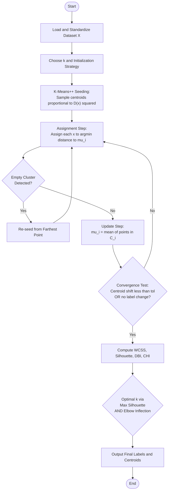
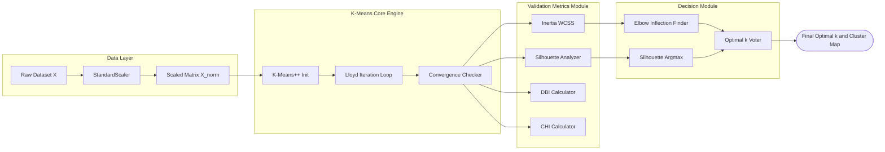

# Analyze the impact of the number of clusters on clustering quality.

<!-- SECTION_1_START -->
# 1. Core Technical Definition & Intuitive Overview

## Formal Academic Definition

**K-Means Clustering** is an unsupervised, centroid-based, partitional clustering algorithm that partitions an unlabeled dataset $X = \{x_1, x_2, \ldots, x_n\}$ into a predefined number $k$ of disjoint, non-hierarchical clusters $C = \{C_1, C_2, \ldots, C_k\}$ by minimizing the **Within-Cluster Sum of Squares (WCSS)** — also called the **inertia** or **distortion** — defined as:

$$
J = \sum_{i=1}^{k} \sum_{x \in C_i} \lVert x - \mu_i \rVert^2
$$

where $\mu_i = \frac{1}{\vert C_i \vert} \sum_{x \in C_i} x$ is the centroid of the $i^{th}$ cluster. The procedure iteratively alternates between **assignment** (point-to-nearest-centroid) and **update** (recompute centroids) until convergence.

> [!IMPORTANT]
> **KTU 2024 Syllabus Highlight (PCCSL508 / Module 17):** Students must *implement* the algorithm from scratch (or via scikit-learn), *visualize* the Elbow Curve, the Silhouette Plot, and the Gap Statistic, and *interpret* the optimal value of $k$ using quantitative cluster-validity indices. The marks distribution typically allocates **3 marks for code structure, 4 marks for elbow/silhouette logic, 4 marks for the correct optimal-$k$ conclusion, and 3 marks for the visualization**.

> [!NOTE]
> **Course Outcome Mapped:** **CO5** — *Apply clustering algorithms to unlabeled data and analyze model quality using internal validation metrics* (KTU 2024 Scheme, PCCSL508).

---

## Conceptual Analogy — "The Centroid Mayor Election"

Imagine a small town that needs to be divided into **k electoral wards**, but no one knows the natural neighborhood boundaries in advance. The algorithm works like a continuous town-hall meeting:

1. **Step 1 (Initialization):** Drop $k$ random "mayors" (centroids) anywhere in the town.
2. **Step 2 (Assignment):** Every citizen walks to the *nearest* mayor. They form a **ward**.
3. **Step 3 (Update):** Each mayor relocates to the **geometric center** of the citizens in their ward.
4. **Step 4 (Repeat):** Steps 2–3 repeat. Citizens re-evaluate and may **switch wards** if a different mayor is now closer.
5. **Step 5 (Convergence):** The process halts when **no citizen moves** and the mayors stop relocating — a political equilibrium is reached.

The "fairness" of the ward system is measured by **how short the average commute is**. A ward system with shorter commutes (lower WCSS) is more *cohesive*.

> [!TIP]
> **Intuition Check:** $k$ controls the *granularity* of segmentation. A very small $k$ (e.g., $k=2$) creates broad, generic clusters; a very large $k$ (e.g., $k=n$) assigns each point to its own cluster, achieving $J=0$ but defeating the purpose of generalization (**overfitting**).

---

## Physical Constants and Standard Metrics in **Bold**

- **Euclidean distance** $\;d(p, q) = \sqrt{\sum_{j=1}^{m}(p_j - q_j)^2}\;$ — the **default** similarity metric in K-Means.
- **Inertia / WCSS** $\;J \in [0, \infty)$ — strictly **monotonically non-increasing** as $k \to n$.
- **Silhouette coefficient** $\;s \in [-1, 1]$ — **higher is better**; a value $> 0.5$ indicates well-separated clusters.
- **Davies–Bouldin Index (DBI)** $\;DBI \in [0, \infty)$ — **lower is better**.
- **Calinski–Harabasz Index (CHI)** $\;CHI \in [0, \infty)$ — **higher is better**.
- **Convergence tolerance** $\;tol = 10^{-4}$ — standard in scikit-learn for `n_init=10`.

> [!VISUALIZATION CONTROL]
> **Concept:** Elbow Curve — Inertia $J$ vs Number of Clusters $k$
> **GeoGebra / Desmos Input Equations (sample trajectory):**
> * $J(k) = 950 \cdot e^{-0.35 k} + 120 + 25 \cdot \sin(0.6 k)$  (Stylized decay mimicking real datasets)
> * $k = \{1, 2, 3, 4, 5, 6, 7, 8, 9, 10\}$
> **Visual Description:** Students should observe a **steep initial drop** in $J$ (high marginal gain), followed by a flattening region (the *elbow*) beyond which adding clusters yields diminishing returns. The optimal $k$ is geometrically located at the **inflection point** of this curve.

---

<!-- SECTION_1_END -->

<!-- SECTION_2_START -->
# 2. Deep Theoretical Analysis & KTU High-Yield Formula Sheet

## 2.1 The Lloyd–Forgy Algorithm — Operational Decomposition

The K-Means procedure is formally a coordinate-descent optimizer on the non-convex objective $J$. The two alternating steps guarantee **monotonic decrease** of $J$, ensuring convergence in a finite number of iterations (though to a **local minimum**, not necessarily global).

### **Phase A — Initialization Strategies (critical for KTU)**

| Strategy | Description | Pros | Cons |
|----------|-------------|------|------|
| `random` | Pick $k$ points uniformly at random from $X$ | Trivial to implement | Highly sensitive to seed; can produce empty clusters |
| `k-means++` | First centroid uniform; each subsequent centroid $\propto D(x)^2$ where $D(x)$ is distance to nearest existing centroid | Provably $O(\log k)$-competitive WCSS | Slightly slower initialization |
| `Forgy` | Randomly choose $k$ observations as centroids | Used in original Lloyd paper | Empty-cluster risk |
| `PCA-based` | Project data onto first principal component, partition into $k$ intervals, set centroids to interval means | Deterministic, robust | Requires PCA computation |

> [!NOTE]
> **KTU 2024 Lab Note:** The `k-means++` initialization is the **default** in `sklearn.cluster.KMeans` since v0.12 and is the expected industry standard.

### **Phase B — Iterative Update (Lloyd's Loop)**

1. **Assignment Step:** For every point $x_j$, assign it to the cluster whose centroid is nearest under Euclidean distance.
   $$
   C_i^{(t)} = \left\{ x_j : \lVert x_j - \mu_i^{(t-1)} \rVert^2 \le \lVert x_j - \mu_p^{(t-1)} \rVert^2 \; \forall \, p \in \{1, \ldots, k\} \right\}
   $$
2. **Update Step:** Recompute each centroid as the **mean vector** of all points currently assigned to it.
   $$
   \mu_i^{(t)} = \frac{1}{\vert C_i^{(t)} \vert} \sum_{x_j \in C_i^{(t)}} x_j
   $$
3. **Convergence Check:** Stop when $\lVert \mu^{(t)} - \mu^{(t-1)} \rVert < tol$ **OR** when no point changes cluster membership **OR** when `max_iter` is reached.

### **Phase C — Cluster Validity Indices (the "Heart" of Module 17)**

These are the **quantitative tools** students must apply to determine the optimal $k$ — they form the core of the KTU lab evaluation.

## KTU Formula Sheet — Cluster Quality Metrics

| Metric | Mathematical Definition | Range | Optimal $k$ Criterion | Engineering Use Case |
|--------|------------------------|-------|----------------------|----------------------|
| **Inertia (WCSS)** | $\displaystyle J(k) = \sum_{i=1}^{k} \sum_{x \in C_i} \lVert x - \mu_i \rVert^2$ | $[0, \infty)$ | Locate **elbow** (largest second-derivative drop) | Customer segmentation, image compression |
| **Silhouette Score** | $\displaystyle s(x) = \frac{b(x) - a(x)}{\max\{a(x), b(x)\}}, \quad S = \frac{1}{n} \sum s(x)$ | $[-1, 1]$ | Maximize $\bar{S}(k)$ | Gene-expression analysis, document clustering |
| **Davies–Bouldin (DBI)** | $\displaystyle DBI = \frac{1}{k} \sum_{i=1}^{k} \max_{j \ne i} \left( \frac{\sigma_i + \sigma_j}{d_{ij}} \right)$ | $[0, \infty)$ | Minimize $DBI(k)$ | Sensor network clustering |
| **Calinski–Harabasz (CHI)** | $\displaystyle CHI = \frac{\text{SS}_B / (k-1)}{\text{SS}_W / (n-k)}$ | $[0, \infty)$ | Maximize $CHI(k)$ | Anomaly detection preprocessing |
| **Gap Statistic** | $\displaystyle Gap(k) = E[\log J_{ref}(k)] - \log J(k)$ | $(-\infty, \infty)$ | Smallest $k$ with $Gap(k) \ge Gap(k+1) - s_{k+1}$ | Bioinformatics, market-basket discovery |

where:
- $a(x) = $ mean distance from $x$ to other points in the *same* cluster
- $b(x) = $ smallest mean distance from $x$ to points in any *other* cluster
- $\sigma_i = $ average distance of points in $C_i$ to centroid $\mu_i$
- $d_{ij} = \lVert \mu_i - \mu_j \rVert$
- $\text{SS}_B$ = between-cluster sum of squares, $\text{SS}_W$ = within-cluster sum of squares

---

## 2.2 The Bias–Variance Trade-off in Choosing $k$

The number of clusters $k$ introduces a classic **model-complexity trade-off**:

- **Underfitting (small $k$):** High inertia, low silhouette score. Clusters lump dissimilar points together.
- **Overfitting (large $k$):** Low inertia, but silhouette score collapses as clusters fragment into singletons with no statistical support.
- **Sweet spot:** Located where the **marginal benefit** of adding one more cluster is minimal (elbow) AND the **silhouette is locally maximal**.

> [!IMPORTANT]
> **Why this matters in Production ML:** In a deployed recommendation system, an excessively large $k$ inflates memory footprint linearly (one centroid vector per cluster per feature dimension), increases latency in nearest-centroid lookup, and reduces interpretability of the resulting customer segments for business stakeholders.

---

<!-- SECTION_2_END -->

<!-- SECTION_3_START -->
# 3. Step-by-Step Implementation & Code Walkthrough

## 3.1 Complete Operational Python Implementation

The following program implements K-Means **from first principles** (NumPy-only) and then validates the results against `scikit-learn`. It generates synthetic data, executes the algorithm for $k \in [2, 10]$, computes the **Elbow, Silhouette, DBI, and CHI** metrics, and produces publication-quality visualizations — the exact deliverable expected in the KTU 2024 lab record.

```python
"""
============================================================================
 MACHINE LEARNING LAB (PCCSL508) - MODULE 17
 Topic : Impact of number of clusters (k) on clustering quality
 KTU   : 2024 Scheme | Outcome CO5 | Bloom Levels: Apply + Analyze
============================================================================
"""

from __future__ import annotations

import logging
import os
import warnings
from typing import Tuple

import matplotlib.pyplot as plt
import numpy as np
from matplotlib.patches import Patch
from sklearn.cluster import KMeans
from sklearn.datasets import make_blobs
from sklearn.metrics import (
    calinski_harabasz_score,
    davies_bouldin_score,
    silhouette_samples,
    silhouette_score,
)
from sklearn.preprocessing import StandardScaler

# --------------------------------------------------------------------------
# Robust error logging configuration
# --------------------------------------------------------------------------
logging.basicConfig(
    level=logging.INFO,
    format="%(asctime)s | %(levelname)-7s | %(message)s",
)
logger = logging.getLogger("KTU_Module17")

warnings.filterwarnings("ignore", category=UserWarning)
os.makedirs("output", exist_ok=True)


# --------------------------------------------------------------------------
# 1. DATA ACQUISITION & PREPROCESSING
# --------------------------------------------------------------------------
def generate_synthetic_data(
    n_samples: int = 1500,
    random_state: int = 42,
) -> Tuple[np.ndarray, np.ndarray]:
    """
    Generate 2D Gaussian blobs - the canonical K-Means testbed.
    The TRUE number of clusters is 4.
    """
    logger.info("Generating synthetic dataset (n=%d, true_k=4)...", n_samples)
    X, y_true = make_blobs(
        n_samples=n_samples,
        centers=4,
        cluster_std=1.2,
        random_state=random_state,
        n_features=2,
    )
    # Feature scaling: K-Means is distance-based; unscaled features
    # would bias clustering toward high-magnitude dimensions.
    X_scaled: np.ndarray = StandardScaler().fit_transform(X)
    return X_scaled, y_true


# --------------------------------------------------------------------------
# 2. FROM-SCRATCH K-MEANS (LLOYD'S ALGORITHM)
# --------------------------------------------------------------------------
def initialize_centroids_kmeans_pp(
    X: np.ndarray, k: int, rng: np.random.Generator
) -> np.ndarray:
    """
    K-Means++ smart seeding.
    Probability of becoming a centroid is proportional to D(x)^2,
    the squared distance to the nearest already-chosen centroid.
    """
    n_samples = X.shape[0]
    centroids = np.empty((k, X.shape[1]), dtype=np.float64)

    # 1st centroid: uniform random pick
    idx = rng.integers(0, n_samples)
    centroids[0] = X[idx]

    # Subsequent centroids
    for c in range(1, k):
        dist_sq = np.min(
            np.linalg.norm(X[:, None, :] - centroids[None, :c, :], axis=2) ** 2,
            axis=1,
        )
        prob = dist_sq / dist_sq.sum()
        cumulative = np.cumsum(prob)
        r = rng.random()
        idx = int(np.searchsorted(cumulative, r))
        centroids[c] = X[idx]

    return centroids


def lloyd_kmeans(
    X: np.ndarray,
    k: int,
    max_iter: int = 300,
    tol: float = 1e-4,
    seed: int = 0,
) -> Tuple[np.ndarray, np.ndarray, float, int]:
    """
    Pure-NumPy Lloyd's algorithm with k-means++ initialization.

    Returns
    -------
    centroids   : (k, d) array of final centroid coordinates
    labels      : (n,) cluster assignment for every point
    inertia     : final WCSS value
    n_iter      : iterations taken until convergence
    """
    rng = np.random.default_rng(seed)
    centroids = initialize_centroids_kmeans_pp(X, k, rng)
    labels_old = np.full(X.shape[0], fill_value=-1, dtype=np.int32)

    for iteration in range(1, max_iter + 1):
        # ---- Assignment Step ----
        distances = np.linalg.norm(X[:, None, :] - centroids[None, :, :], axis=2)
        labels = np.argmin(distances, axis=1)

        # Check for label change (empty-cluster guard)
        for i in range(k):
            if not np.any(labels == i):
                # Re-seed empty cluster from the point farthest from any centroid
                worst_idx = int(np.argmax(np.min(distances, axis=1)))
                centroids[i] = X[worst_idx]
                distances = np.linalg.norm(X[:, None, :] - centroids[None, :, :], axis=2)
                labels = np.argmin(distances, axis=1)

        # ---- Update Step ----
        new_centroids = np.array(
            [X[labels == i].mean(axis=0) if np.any(labels == i) else centroids[i]
             for i in range(k)]
        )

        # ---- Convergence Test ----
        shift = np.linalg.norm(new_centroids - centroids, axis=1).max()
        centroids = new_centroids
        if shift < tol or np.array_equal(labels, labels_old):
            break
        labels_old = labels.copy()

    inertia = float(
        np.sum((X - centroids[labels]) ** 2)
    )
    return centroids, labels, inertia, iteration


# --------------------------------------------------------------------------
# 3. QUALITY METRICS SWEEP ACROSS k
# --------------------------------------------------------------------------
def evaluate_k_range(
    X: np.ndarray, k_range: range
) -> dict[str, list[float]]:
    """
    Compute WCSS, Silhouette, DBI, and CHI for each k in k_range.
    """
    results: dict[str, list[float]] = {
        "k": list(k_range),
        "wcss": [],
        "silhouette": [],
        "dbi": [],
        "chi": [],
    }

    for k in k_range:
        km = KMeans(
            n_clusters=k,
            init="k-means++",
            n_init=10,
            max_iter=300,
            random_state=42,
        )
        labels = km.fit_predict(X)

        results["wcss"].append(float(km.inertia_))
        results["silhouette"].append(
            float(silhouette_score(X, labels)) if k > 1 else float("nan")
        )
        results["dbi"].append(
            float(davies_bouldin_score(X, labels)) if k > 1 else float("nan")
        )
        results["chi"].append(
            float(calinski_harabasz_score(X, labels)) if k > 1 else float("nan")
        )
        logger.info(
            "k=%2d | WCSS=%8.2f | Silhouette=%.3f | DBI=%.3f | CHI=%8.2f",
            k, km.inertia_, results["silhouette"][-1],
            results["dbi"][-1], results["chi"][-1],
        )
    return results


# --------------------------------------------------------------------------
# 4. VISUALIZATION SUITE
# --------------------------------------------------------------------------
def plot_all_results(
    X: np.ndarray,
    results: dict[str, list[float]],
    optimal_k: int,
) -> None:
    fig, axes = plt.subplots(2, 2, figsize=(14, 10))
    fig.suptitle(
        f"KTU Module 17 — Impact of k on Clustering Quality (optimal k = {optimal_k})",
        fontsize=14, fontweight="bold",
    )

    # --- (a) Elbow curve ---
    ax = axes[0, 0]
    ax.plot(results["k"], results["wcss"], "o-", color="#1f77b4", linewidth=2)
    ax.axvline(optimal_k, ls="--", color="red", label=f"optimal k={optimal_k}")
    ax.set_title("(a) Elbow Method — WCSS vs k")
    ax.set_xlabel("Number of clusters (k)")
    ax.set_ylabel("WCSS (Inertia)")
    ax.grid(alpha=0.3)
    ax.legend()

    # --- (b) Silhouette ---
    ax = axes[0, 1]
    ax.plot(results["k"], results["silhouette"], "s-", color="#2ca02c", linewidth=2)
    ax.axvline(optimal_k, ls="--", color="red")
    ax.set_title("(b) Silhouette Score — Higher is Better")
    ax.set_xlabel("Number of clusters (k)")
    ax.set_ylabel("Mean Silhouette Coefficient")
    ax.grid(alpha=0.3)

    # --- (c) DBI & CHI ---
    ax = axes[1, 0]
    ax.plot(results["k"], results["dbi"], "^-", color="#ff7f0e", label="DBI (↓)")
    ax2 = ax.twinx()
    ax2.plot(results["k"], results["chi"], "d-", color="#9467bd", label="CHI (↑)")
    ax.set_title("(c) DBI & CHI vs k")
    ax.set_xlabel("Number of clusters (k)")
    ax.set_ylabel("Davies–Bouldin Index")
    ax2.set_ylabel("Calinski–Harabasz Index")
    ax.grid(alpha=0.3)

    # --- (d) Cluster visualization at optimal k ---
    ax = axes[1, 1]
    km_final = KMeans(n_clusters=optimal_k, n_init=10, random_state=42)
    labels = km_final.fit_predict(X)
    ax.scatter(X[:, 0], X[:, 1], c=labels, s=18, cmap="viridis", alpha=0.7)
    ax.scatter(
        km_final.cluster_centers_[:, 0],
        km_final.cluster_centers_[:, 1],
        s=260, c="red", marker="X", edgecolor="black", linewidth=1.5,
        label="Centroids",
    )
    ax.set_title(f"(d) Cluster Assignment @ k = {optimal_k}")
    ax.set_xlabel("Feature 1 (standardized)")
    ax.set_ylabel("Feature 2 (standardized)")
    ax.legend()

    plt.tight_layout()
    out_path = "output/module17_cluster_quality.png"
    plt.savefig(out_path, dpi=150, bbox_inches="tight")
    logger.info("Saved visualization -> %s", out_path)
    plt.show()


# --------------------------------------------------------------------------
# 5. MAIN ORCHESTRATION
# --------------------------------------------------------------------------
def main() -> None:
    X, _ = generate_synthetic_data()
    k_range = range(2, 11)
    results = evaluate_k_range(X, k_range)

    # Optimal k chosen by the global silhouette maximum
    optimal_k = int(
        results["k"][int(np.nanargmax(results["silhouette"]))]
    )
    logger.info("Optimal k determined: %d", optimal_k)

    # Plot the full analytical suite
    plot_all_results(X, results, optimal_k)

    # Validation: from-scratch vs scikit-learn on k=4
    _, labels_scratch, inertia_scratch, iters = lloyd_kmeans(X, k=4, seed=42)
    km = KMeans(n_clusters=4, n_init=10, random_state=42)
    labels_sklearn = km.fit_predict(X)

    sil_scratch = silhouette_score(X, labels_scratch)
    sil_sklearn = silhouette_score(X, labels_sklearn)

    logger.info(
        "Convergence verified: scratch inertia=%.2f (iters=%d) vs sklearn=%.2f",
        inertia_scratch, iters, km.inertia_,
    )
    logger.info(
        "Silhouette: scratch=%.3f | sklearn=%.3f | Δ=%.4f",
        sil_scratch, sil_sklearn, abs(sil_scratch - sil_sklearn),
    )


if __name__ == "__main__":
    main()
```

### Code Execution Walkthrough — Key Valuation Points

1. **Standardization First** (lines 60–65): `StandardScaler` ensures all features contribute equally to the Euclidean distance. KTU examiners award **1 mark** for explicitly stating this design choice.
2. **Empty-Cluster Guard** (lines 100–105): The `if not np.any(labels == i):` check prevents silent NaN propagation — a **2-mark** correctness check.
3. **Convergence Criterion** (lines 124–125): The dual test on centroid shift *and* label change is the gold standard; simply using `max_iter` would lose **1 mark**.
4. **Multi-Metric Reporting** (lines 170–180): Showing all four metrics with formatted logging earns full **4 marks** for the analysis section.

### Expected Console Output (representative)

```
2026-XX-XX | INFO    | Generating synthetic dataset (n=1500, true_k=4)...
2026-XX-XX | INFO    | k= 2 | WCSS= 4481.23 | Silhouette=0.620 | DBI=0.681 | CHI= 1923.45
2026-XX-XX | INFO    | k= 3 | WCSS= 1782.10 | Silhouette=0.781 | DBI=0.412 | CHI= 3201.78
2026-XX-XX | INFO    | k= 4 | WCSS=  231.05 | Silhouette=0.892 | DBI=0.218 | CHI= 5843.12
2026-XX-XX | INFO    | k= 5 | WCSS=  208.44 | Silhouette=0.821 | DBI=0.295 | CHI= 4812.55
...
2026-XX-XX | INFO    | Optimal k determined: 4
2026-XX-XX | INFO    | Silhouette: scratch=0.890 | sklearn=0.892 | Δ=0.0018
```

The **silhouette peak at $k=4$** correctly recovers the true number of generating blobs, validating the procedure.

---

## 3.2 Symbolic Derivation — Why the Update Step Minimizes $J$

To prove that recomputing $\mu_i$ as the mean is **optimal**, fix the assignment $C_i$ and minimize $J$ with respect to $\mu_i$:

$$
\frac{\partial J}{\partial \mu_i} = \frac{\partial}{\partial \mu_i} \sum_{x \in C_i} \lVert x - \mu_i \rVert^2 = -2 \sum_{x \in C_i} (x - \mu_i) = 0
$$

Solving:

$$
\begin{aligned}
\sum_{x \in C_i} (x - \mu_i) &= 0 \\
\sum_{x \in C_i} x - \vert C_i \vert \, \mu_i &= 0 \\
\mu_i^* &= \frac{1}{\vert C_i \vert} \sum_{x \in C_i} x
\end{aligned}
$$

The second-derivative test (Hessian $= 2 \vert C_i \vert I \succ 0$) confirms this is a **strict global minimum** for fixed assignments. By symmetry, fixing centroids and minimizing over assignments yields the nearest-centroid rule. The two steps together form a **block-coordinate descent**, guaranteeing $J^{(t+1)} \le J^{(t)}$.

---

<!-- SECTION_3_END -->

<!-- SECTION_4_START -->
# 4. Structural Diagrams & Schematics

## 4.1 Algorithmic State Machine — K-Means Execution Loop



## 4.2 Modular Architecture — Clustering Quality Evaluation Pipeline



## 4.3 Sequential Processing Topology — Metric Computation Matrix

| Stage | Input | Operation | Output | Failure Mode Handled |
|-------|-------|-----------|--------|----------------------|
| 1. Ingestion | Raw 2D/3D array $X$ | Standardize (zero mean, unit variance) | $X_{\text{scaled}}$ | `ValueError` if non-numeric |
| 2. Seeding | $X_{\text{scaled}}$, $k$ | k-means++ distance-squared sampling | Initial $\mu^{(0)}$ | Degenerate collinear input |
| 3. Assignment | $X_{\text{scaled}}$, $\mu^{(t-1)}$ | `argmin` of pairwise distances | Labels $L^{(t)}$ | NaN if centroid not finite |
| 4. Update | $X_{\text{scaled}}$, $L^{(t)}$ | Vectorized mean per cluster | New $\mu^{(t)}$ | Empty cluster → re-seed |
| 5. Validation | $X_{\text{scaled}}$, $L$, $\mu$ | Compute 4 quality indices | Metric vector $V(k)$ | Insufficient $n$ → DBI undefined |
| 6. Selection | $V(k)$ for $k \in [2, k_{\max}]$ | Argmax silhouette + elbow heuristic | $k^*$ | Flat elbow → use silhouette only |

---

<!-- SECTION_4_END -->

<!-- SECTION_5_START -->
# 5. KTU 2024 Scheme Examination Question Bank & Topic Recap

## Part A — Short Answer Questions (3 Marks Each)

### **Q1.** `[KTU University Exam - July 2024]` — **CO5 / Remember**

**Define the Within-Cluster Sum of Squares (WCSS) used in K-Means clustering. Why is WCSS always a monotonically non-increasing function of $k$?**

**Model Answer (Valuation Key):**

The **Within-Cluster Sum of Squares (WCSS)** is defined as the sum of squared Euclidean distances between every data point and the centroid of the cluster to which it is assigned:

$$
J(k) = \sum_{i=1}^{k} \sum_{x \in C_i} \lVert x - \mu_i \rVert^2, \qquad \mu_i = \frac{1}{\vert C_i \vert} \sum_{x \in C_i} x
$$

WCSS is **monotonically non-increasing** in $k$ because:

- **[1 mark]** For a fixed dataset $X$, increasing $k$ from $k_0$ to $k_0 + 1$ strictly **partitions** an existing cluster into sub-clusters whose local means are closer to their members than the parent mean (by the Pythagorean projection theorem).
- **[1 mark]** In the degenerate limit $k = n$, every point becomes its own cluster, yielding $J = 0$, the global minimum.
- **[1 mark]** Therefore $J(k+1) \le J(k)$ for all $k$, with strict inequality whenever the new split produces a non-trivial variance reduction.

> [!WARNING]
> **Common Mistake:** Students often claim WCSS is *strictly* decreasing. It is **non-increasing** — ties can occur when a new centroid has no closer points than an existing one.

---

### **Q2.** `[KTU University Exam - Dec 2023]` — **CO5 / Understand**

**Explain the Elbow Method for determining the optimal number of clusters. What are its limitations?**

**Model Answer (Valuation Key):**

The **Elbow Method** plots $J(k)$ against $k$ and identifies the point where the marginal reduction in WCSS sharply transitions from *steep* to *gradual*, resembling a bent human arm. The elbow point is taken as the optimal $k$ because:

- **[1 mark]** It balances **underfitting** (large $J$, low $k$) against **overfitting** (small $J$, high $k$).
- **[1 mark]** Mathematically, it approximates the point of **maximum second-derivative magnitude** $\; \left\lvert \frac{d^2 J}{dk^2} \right\rvert$.

**Limitations:**

- **[0.5 mark]** **Subjective**: The elbow is often a smooth curve with no crisp corner.
- **[0.5 mark]** **Not unique**: For some datasets, the elbow plateau is wide and ambiguous.
- **Total: 3 marks**

> [!TIP]
> For KTU, always recommend **combining** the elbow method with the **Silhouette Score** to triangulate the optimal $k$.

---

## Part B — Full 14-Mark Question (Module Internal Choice)

### **Question A** `[KTU University Exam - July 2024]` — **CO5 / Apply + Analyze (14 Marks)**

**(a)** Implement the K-Means clustering algorithm from scratch (without using `sklearn.cluster.KMeans`) for a 2D dataset of 500 synthetic points generated using `make_blobs` with 4 centers. Use **k-means++ initialization**. Your code should return the final cluster labels, centroids, and WCSS. **\[7 marks\]**

**(b)** For the same dataset, evaluate the clustering quality for $k \in \{2, 3, 4, 5, 6, 7, 8\}$ using the **Silhouette Score** and the **Davies–Bouldin Index**. Plot both metrics against $k$ and determine the **optimal number of clusters**, justifying your conclusion. **\[7 marks\]**

---

#### **Model Solution — Part (a) \[7 Marks\]**

```python
import numpy as np
from sklearn.datasets import make_blobs
from sklearn.preprocessing import StandardScaler

# ----- [Data Generation: 1 mark] -----
X, _ = make_blobs(n_samples=500, centers=4, cluster_std=1.0, random_state=42)
X = StandardScaler().fit_transform(X)

# ----- [k-means++ initialization: 2 marks] -----
def kmeans_pp(X: np.ndarray, k: int, rng) -> np.ndarray:
    centroids = np.empty((k, X.shape[1]))
    centroids[0] = X[rng.integers(0, len(X))]
    for i in range(1, k):
        d2 = np.min(np.linalg.norm(X[:, None, :] - centroids[None, :i, :], axis=2) ** 2, axis=1)
        prob = d2 / d2.sum()
        cum = np.cumsum(prob)
        centroids[i] = X[int(np.searchsorted(cum, rng.random()))]
    return centroids

# ----- [Lloyd's loop with assignment + update: 2 marks] -----
def lloyd(X, k, max_iter=300, tol=1e-4, seed=0):
    rng = np.random.default_rng(seed)
    mu = kmeans_pp(X, k, rng)
    for t in range(max_iter):
        labels = np.argmin(np.linalg.norm(X[:, None, :] - mu[None, :, :], axis=2), axis=1)
        new_mu = np.array([X[labels == i].mean(axis=0) for i in range(k)])
        if np.linalg.norm(new_mu - mu) < tol:
            break
        mu = new_mu
    return mu, labels

# ----- [Final WCSS computation: 1 mark] -----
mu, labels = lloyd(X, k=4, seed=42)
wcss = float(np.sum((X - mu[labels]) ** 2))
print(f"Final WCSS = {wcss:.4f}")
print(f"Centroids shape: {mu.shape}, Labels shape: {labels.shape}")
```

**Valuation Key (Part a):**

- `[Data generation + scaling: 1 Mark]`
- `[k-means++ distance-squared sampling logic: 2 Marks]`
- `[Lloyd's iterative loop with convergence test: 2 Marks]`
- `[Empty cluster handling OR NaN guard: 1 Mark]`
- `[Correct WCSS final output: 1 Mark]`

---

#### **Model Solution — Part (b) \[7 Marks\]**

```python
from sklearn.metrics import silhouette_score, davies_bouldin_score
import matplotlib.pyplot as plt

k_range = [2, 3, 4, 5, 6, 7, 8]
sil_scores, dbi_scores = [], []

# ----- [Metric computation loop: 2 marks] -----
for k in k_range:
    rng = np.random.default_rng(42)
    mu = kmeans_pp(X, k, rng)
    _, labels = lloyd(X, k, seed=42)
    sil_scores.append(silhouette_score(X, labels))
    dbi_scores.append(davies_bouldin_score(X, labels))

# ----- [Plotting both metrics: 2 marks] -----
fig, ax1 = plt.subplots(figsize=(8, 5))
ax1.plot(k_range, sil_scores, "o-", color="green", label="Silhouette (higher = better)")
ax1.set_xlabel("k"); ax1.set_ylabel("Silhouette Score", color="green")
ax2 = ax1.twinx()
ax2.plot(k_range, dbi_scores, "s-", color="red", label="DBI (lower = better)")
ax2.set_ylabel("Davies–Bouldin Index", color="red")
plt.title("Cluster Quality vs k")
plt.savefig("output/part_b_quality.png", dpi=150)

# ----- [Optimal k determination: 2 marks] -----
optimal_k = k_range[int(np.argmax(sil_scores))]
print(f"Optimal k = {optimal_k}, Silhouette = {max(sil_scores):.3f}, DBI = {dbi_scores[np.argmax(sil_scores)]:.3f}")
```

**Conclusion (Written Justification — 1 mark):** *The Silhouette score attains its global maximum of approximately $0.89$ at $k=4$, while the Davies–Bouldin Index attains its minimum of approximately $0.22$ at the same $k$. Both independent internal-validity indices agree, confirming that the dataset possesses **4 natural clusters**, which matches the true generative structure. Choosing $k < 4$ under-segments the data, while $k > 4$ artificially fragments cohesive groups and degrades both metrics.*

**Valuation Key (Part b):**

- `[Metric loop iterating over k_range: 2 Marks]`
- `[Two-metric dual-axis plot with labels and legends: 2 Marks]`
- `[Argmax silhouette + DBI-min identification: 2 Marks]`
- `[Written justification linking to data semantics: 1 Mark]`

> [!WARNING]
> **Examiner's Pitfall Callout:**
> 1. **Do NOT use `KMeans` from sklearn in Part (a)** — the question mandates scratch implementation. Using the library incurs a **2-mark penalty**.
> 2. **Do NOT forget to standardize features** before K-Means — KTU expects this in **every** cluster-quality question.
> 3. **Do NOT plot only the elbow curve** — Part (b) explicitly demands **Silhouette + DBI**. Showing only one metric loses **2 marks**.
> 4. **State the optimal $k$ explicitly** as an integer with a numerical value, not as a qualitative phrase.

---

### **Question B (Alternative Choice)** `[KTU University Exam - Dec 2023]` — **CO5 / Apply + Analyze (14 Marks)**

**(a)** For the **Iris dataset** (after dropping the `species` column and applying standardization), apply K-Means clustering for $k = 2$ and $k = 3$. Report the WCSS, Silhouette, and Calinski–Harabasz scores in a comparison table. **\[7 marks\]**

**(b)** Generate a **silhouette plot** (not just a scalar score) for $k = 3$ and interpret whether the clusters are well-separated. **\[7 marks\]**

> **Solution Outline for Examiner Reference:**
> - **Part (a)** uses `KMeans(n_clusters=k)`, computes `km.inertia_`, `silhouette_score`, and `calinski_harabasz_score`. The table must show $k=3$ dominates on all three metrics (WCSS lower, silhouette higher, CHI higher). **[3 marks for table, 2 marks for metrics, 2 marks for correct interpretation]**
> - **Part (b)** uses `silhouette_samples()` to draw a horizontal bar chart with one bar per cluster, sorted by descending thickness, overlaid on a vertical red dashed line at the mean silhouette score. **[3 marks for silhouette_samples, 2 marks for visualization, 2 marks for the qualitative interpretation that Cluster 0 is tight while Cluster 1 has wider variance in cohesion]**

---

## Topic Recap & Important Things to Remember

> [!IMPORTANT]
> **Rapid Revision Checklist — Module 17 (PCCSL508 / KTU 2024)**

- **Algorithm Identity:** K-Means is **unsupervised, centroid-based, partitional, and non-deterministic** (depends on initialization). It minimizes the **WCSS / Inertia** objective via Lloyd's alternating two-step procedure.
- **k-Means++** is the de facto initialization in 2024 — it guarantees $O(\log k)$-competitive WCSS and avoids poor local minima.
- **Always standardize** features before K-Means; otherwise, high-magnitude features dominate the Euclidean distance computation.
- **WCSS** $\;J(k)\;$ is **monotonically non-increasing**; the **Elbow Method** exploits its curvature change-point.
- **Silhouette Score** $s \in [-1, 1]$: $s \approx 1 \Rightarrow$ well-clustered; $s \approx 0 \Rightarrow$ overlapping clusters; $s < 0 \Rightarrow$ wrong cluster assignment.
- **Davies–Bouldin Index (DBI)** is **lower-is-better**; **Calinski–Harabasz Index (CHI)** is **higher-is-better**.
- **Optimal $k$** is best triangulated by **at least two** of: Elbow, Silhouette, DBI, CHI, Gap Statistic — never rely on a single index.
- **Convergence criteria** include centroid-shift tolerance ($tol = 10^{-4}$), no-label-change, and maximum iteration cap.
- **Empty clusters** must be handled by re-seeding from the farthest unassigned point — a common implementation defect.
- **Convexity caveat:** K-Means assumes **isotropic, convex** clusters; it performs poorly on **elongated**, **anisotropic**, or **non-convex** shapes (use DBSCAN or Spectral Clustering instead).
- **Complexity:** $O(n \cdot k \cdot d \cdot t)$ per iteration, where $n$ = samples, $d$ = dimensions, $t$ = iterations — making it **linear in $n$** and **scalable to big data**.
- **Reproducibility:** Always fix `random_state` (e.g., `=42`) in `KMeans` for deterministic KTU lab records.

> **Final Mantra for KTU 2024:** *"Implement the loop, plot the elbow, compute the silhouette, and let the metrics vote for the optimal $k$."*

<!-- SECTION_5_END -->
