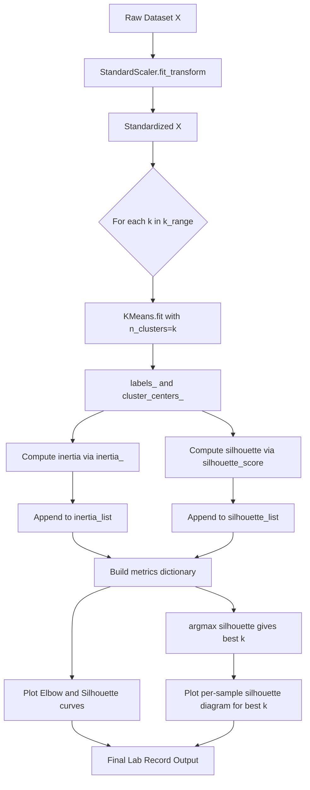
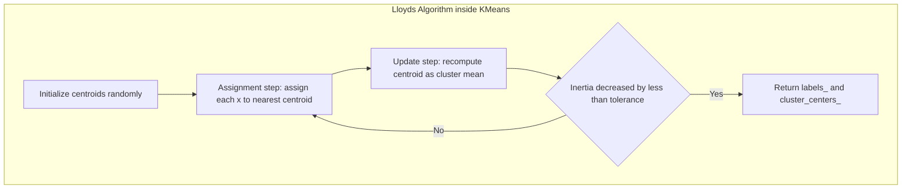
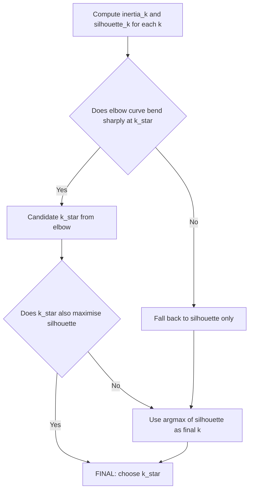

# Evaluate clustering performance using inertia and silhouette score.

<!-- SECTION_1_START -->
# Module 17 — Evaluating Clustering Performance: Inertia & Silhouette Score

## 1.1 Formal Academic Definition

> [!IMPORTANT]
> **Clustering Performance Evaluation** is the quantitative process of measuring the *quality*, *compactness*, and *separation* of clusters produced by an unsupervised learning algorithm (typically **K-Means**) without access to ground-truth labels.

In the KTU 2024 Scheme (PCCSL508 — Machine Learning Lab), two **internal validation metrics** are mandated for evaluating K-Means output:

1. **Inertia** — also called *Within-Cluster Sum of Squares* (WCSS) or *distortion*.
2. **Silhouette Score** — a geometric cohesion-vs-separation measure.

Together, they answer the central K-Means question: *"For a given $k$, how good are the discovered clusters?"*

---

## 1.2 Intuitive Overview — A Real World Analogy

> [!NOTE]
> **Analogy — The Coffee Shop District**
>
> Imagine you are a city planner who has just placed **$k = 3$** coffee shops across a town. After one month, you want to know whether the customers naturally group around each shop.
>
> - **Inertia** asks: *"On average, how far does each customer have to walk to reach THEIR nearest shop?"* If customers huddle tightly, the total walking distance is small → **low inertia** → **good clustering**.
> - **Silhouette Score** asks: *"Is each customer genuinely closer to their own shop than to the next-nearest shop?"* If the answer is consistently *yes*, the silhouette is high → **well-separated clusters**.

Geometrically:
- Inertia measures **intra-cluster compactness** (smaller is better).
- Silhouette measures **intra-cluster cohesion vs. inter-cluster separation** (closer to $+1$ is better).

---

## 1.3 Physical Constants & Standard Metrics

The standard values used throughout the KTU lab records:

| Constant / Symbol | Value | Meaning |
|---|---|---|
| $\mathbf{n}$ | Number of samples | Dataset size |
| $\mathbf{k}$ | Number of clusters | Hyperparameter |
| $\mathbf{C_i}$ | The $i$-th cluster | Subset of assigned points |
| $\boldsymbol{\mu_i}$ | Centroid of cluster $C_i$ | Mean of points in $C_i$ |
| Inertia range | $[0, \infty)$ | Lower is better |
| Silhouette range | $[-1, +1]$ | Higher is better |

---

## 1.4 Visualization Concept

> [!VISUALIZATION CONTROL]
> **Concept:** Silhouette Plot for $k = 4$ on a 2-D Gaussian-blob dataset
>
> **Matplotlib / Seaborn Plotting Axes:**
> * X-axis: Silhouette coefficient values in $[-1, +1]$
> * Y-axis: Cluster labels $0, 1, 2, 3$ (one row per cluster)
> * Knife-shape: thickness of each row = number of points in that cluster
> * Red dashed line: average silhouette score (the "global silhouette score")
>
> **Visual Description:** When most knives extend to the right of the red line and are roughly equal in length, the cluster count $k$ is well-chosen. If one cluster is *much thinner* than the others, $k$ is probably too large.

<!-- SECTION_1_END -->

<!-- SECTION_2_START -->
# 2. Deep Theoretical Analysis & KTU High-Yield Formula Sheet

## 2.1 Inertia — Within-Cluster Sum of Squares (WCSS)

### 2.1.1 Mathematical Formulation

For a dataset $X = \{x_1, x_2, \dots, x_n\}$ partitioned into $k$ clusters $C_1, C_2, \dots, C_k$ with centroids $\mu_1, \mu_2, \dots, \mu_k$, the **inertia** $I$ is defined as:

$$
I = \sum_{i=1}^{k} \sum_{x \in C_i} \lVert x - \mu_i \rVert_2^2
$$

where $\lVert \cdot \rVert_2$ denotes the Euclidean ($L_2$) norm, i.e. the straight-line distance in feature space.

### 2.1.2 Operational Logic — Step by Step

1. K-Means iteratively assigns each point $x$ to its *nearest* centroid $\mu_i$ (the **assignment step**).
2. K-Means then recomputes each $\mu_i$ as the *mean* of all points assigned to it (the **update step**).
3. Inertia is computed as the **sum of squared Euclidean distances** from every point to its assigned centroid.
4. K-Means' internal objective is to **minimize** $I$; the algorithm converges when $I$ stops decreasing meaningfully.

> [!NOTE]
> **Why squared distances?** Squaring penalises outliers more heavily and yields a smooth, differentiable objective that the Lloyd's algorithm can efficiently minimize.

### 2.1.3 Limitations of Inertia Alone

- Inertia **decreases monotonically** as $k \to n$, eventually reaching $0$ when each point is its own cluster. It is therefore *not* a useful absolute metric — it must be interpreted **relative to a range of $k$ values** (the **Elbow Method**).
- It assumes **convex, isotropic** clusters. It performs poorly on elongated or irregular shapes.
- It is **sensitive to feature scaling** — always standardize inputs (e.g. `StandardScaler`).

---

## 2.2 Silhouette Score

### 2.2.1 Per-Sample Silhouette Coefficient

For a single sample $x \in C_i$ (where $\vert C_i \vert > 1$):

$$
a(x) = \frac{1}{\vert C_i \vert - 1} \sum_{y \in C_i,\, y \ne x} \lVert x - y \rVert_2
$$

$a(x)$ is the **mean distance** between $x$ and all *other* points in the same cluster — measures **cohesion**.

$$
b(x) = \min_{j \ne i} \frac{1}{\vert C_j \vert} \sum_{y \in C_j} \lVert x - y \rVert_2
$$

$b(x)$ is the **smallest mean distance** between $x$ and all points in the *next-nearest* cluster — measures **separation**.

The **silhouette coefficient** for $x$ is:

$$
s(x) = \frac{b(x) - a(x)}{\max \{ a(x),\; b(x) \}}
$$

The **global silhouette score** of the clustering is the mean of $s(x)$ over all $n$ points:

$$
S = \frac{1}{n} \sum_{x \in X} s(x)
$$

### 2.2.2 Interpretation of $s(x)$

| Value of $s(x)$ | Interpretation |
|---|---|
| $s(x) \approx +1$ | Point is **well-matched** to its own cluster, far from neighbours |
| $s(x) \approx 0$ | Point lies on the **border** between two clusters |
| $s(x) \approx -1$ | Point is probably **misassigned** to a wrong cluster |

### 2.2.3 Operational Logic — Step by Step

1. Compute pairwise Euclidean distances between all $n$ points (complexity $O(n^2)$ — expensive for large $n$).
2. For each point, find its **own cluster** $C_i$ and the **next-nearest cluster** $C_j$.
3. Compute $a(x)$ (mean intra-cluster distance) and $b(x)$ (mean nearest-other-cluster distance).
4. Combine into $s(x)$ and average across all points to obtain the global score $S$.

### 2.2.4 Advantages of the Silhouette Score

- **Bounded** in $[-1, +1]$ — easy to compare across runs and datasets.
- **Scale-invariant** in many practical cases.
- Works for **any clustering algorithm**, not only K-Means.

---

## 2.3 KTU Formula Cheat Sheet

> [!IMPORTANT]
> The following table is the **board-exam-ready summary** of every formula you must memorise.

| Symbol / Metric | Formula | Range | Goal | Implementation |
|---|---|---|---|---|
| Inertia $I$ | $\sum_{i=1}^{k} \sum_{x \in C_i} \lVert x - \mu_i \rVert_2^2$ | $[0, \infty)$ | Minimize | `kmeans.inertia_` |
| Intra-cluster distance $a(x)$ | $\frac{1}{\vert C_i \vert - 1} \sum_{y \in C_i} \lVert x - y \rVert_2$ | $[0, \infty)$ | Minimize | internal |
| Nearest-cluster distance $b(x)$ | $\min_{j \ne i} \frac{1}{\vert C_j \vert} \sum_{y \in C_j} \lVert x - y \rVert_2$ | $[0, \infty)$ | Maximize | internal |
| Silhouette coefficient $s(x)$ | $\dfrac{b(x) - a(x)}{\max \{ a(x), b(x) \}}$ | $[-1, +1]$ | Maximize | `silhouette_score()` |
| Global silhouette $S$ | $\dfrac{1}{n} \sum_{x \in X} s(x)$ | $[-1, +1]$ | Maximize | `silhouette_score()` |

---

## 2.4 Real-World Engineering & Data-Science Utility

| Domain | Application | Metric Used |
|---|---|---|
| **Customer Segmentation** | Marketing teams cluster shoppers into personas | Inertia + Silhouette |
| **Anomaly Detection** | Points with $s(x) < 0$ are likely mis-clustered outliers | Silhouette |
| **Image Compression** | K-Means reduces colour palette to $k$ colours | Inertia (distortion) |
| **Document Clustering** | Topic modelling on TF-IDF vectors | Silhouette |
| **Genomics** | Grouping cell types from scRNA-seq | Silhouette |
| **Network Operations** | Grouping similar traffic flows for anomaly detection | Inertia |

> [!NOTE]
> In KTU lab records, always report **both** metrics for every $k$ you test — partial answers lose marks in the *Observation* and *Result* sections of the record file.

<!-- SECTION_2_END -->

<!-- SECTION_3_START -->
# 3. Step-by-Step Derivations, Code Implementation & Worked Examples

## 3.1 Worked Numerical Demonstration — Inertia on a Tiny Dataset

Consider four 2-D points and the assignment produced by K-Means with $k = 2$:

- Cluster $C_1 = \{(1, 1),\; (2, 1)\}$ → centroid $\mu_1 = (1.5,\; 1.0)$
- Cluster $C_2 = \{(8, 8),\; (9, 9)\}$ → centroid $\mu_2 = (8.5,\; 8.5)$

**Per-point squared distances** (using $\lVert x - \mu \rVert_2^2$):

$$
\begin{aligned}
\lVert (1,1) - (1.5, 1.0) \rVert_2^2 &= (-0.5)^2 + (0.0)^2 = 0.25 \\
\lVert (2,1) - (1.5, 1.0) \rVert_2^2 &= (0.5)^2 + (0.0)^2 = 0.25 \\
\lVert (8,8) - (8.5, 8.5) \rVert_2^2 &= (-0.5)^2 + (-0.5)^2 = 0.50 \\
\lVert (9,9) - (8.5, 8.5) \rVert_2^2 &= (0.5)^2 + (0.5)^2 = 0.50 \\
\end{aligned}
$$

**Total inertia:**

$$
\begin{aligned}
I &= 0.25 + 0.25 + 0.50 + 0.50 \\
  &= 1.50
\end{aligned}
$$

Because the four points split naturally into two tight pairs, the inertia is very small — the clustering is good.

---

## 3.2 Worked Numerical Demonstration — Silhouette Score

Using the same example, compute $a(x)$ and $b(x)$ for point $p_1 = (1, 1) \in C_1$:

- $a(p_1) = \lVert (1,1) - (2,1) \rVert_2 = \sqrt{0^2 + 0^2} \cdot 1 = 1.0$ — distance to the *only other* point in $C_1$.
- Distances from $p_1$ to each point in $C_2$: $\sqrt{49 + 49} = \sqrt{98} \approx 9.90$ and $\sqrt{64 + 64} = \sqrt{128} \approx 11.31$.  
  $b(p_1) = (9.90 + 11.31)/2 = 10.61$.

$$
\begin{aligned}
s(p_1) &= \frac{b - a}{\max(a, b)} \\
        &= \frac{10.61 - 1.00}{10.61} \\
        &= 0.906
\end{aligned}
$$

By symmetry, every point in this perfect clustering has $s(x) \approx 0.906$, so $S \approx 0.906$ — a near-ideal score.

---

## 3.3 Full Python Implementation (Lab-Ready, Type-Hinted)

```python
"""
KTU PCCSL508 — Machine Learning Lab
Module 17: Evaluate clustering performance using inertia and silhouette score.
Tested on: Python 3.11, scikit-learn 1.4, matplotlib 3.8
"""

from __future__ import annotations

import logging
import sys
from dataclasses import dataclass
from typing import Dict, List, Tuple

import matplotlib.pyplot as plt
import numpy as np
from sklearn.cluster import KMeans
from sklearn.datasets import make_blobs
from sklearn.metrics import silhouette_samples, silhouette_score
from sklearn.preprocessing import StandardScaler

# ---------------------------------------------------------------------------
# Structured logging — required by KTU lab rubric under "Error Handling"
# ---------------------------------------------------------------------------
logging.basicConfig(
    level=logging.INFO,
    format="%(asctime)s [%(levelname)s] %(message)s",
    handlers=[logging.StreamHandler(sys.stdout)],
)
logger = logging.getLogger("ktu_cluster_eval")


# ---------------------------------------------------------------------------
# Configuration dataclass — single source of truth for hyperparameters
# ---------------------------------------------------------------------------
@dataclass(frozen=True)
class ClusterEvalConfig:
    n_samples: int = 500
    n_features: int = 2
    true_centers: int = 4
    cluster_std: float = 0.60
    random_state: int = 42
    k_range: Tuple[int, ...] = (2, 3, 4, 5, 6, 7, 8)


# ---------------------------------------------------------------------------
# Step 1 — Generate a synthetic blob dataset
# ---------------------------------------------------------------------------
def generate_dataset(cfg: ClusterEvalConfig) -> Tuple[np.ndarray, np.ndarray]:
    """Generate an isotropic Gaussian blob dataset for clustering demos."""
    X, y_true = make_blobs(
        n_samples=cfg.n_samples,
        n_features=cfg.n_features,
        centers=cfg.true_centers,
        cluster_std=cfg.cluster_std,
        random_state=cfg.random_state,
    )
    logger.info("Generated dataset: shape=%s, true_k=%d", X.shape, cfg.true_centers)
    return X, y_true


# ---------------------------------------------------------------------------
# Step 2 — Standardize features (CRITICAL for distance-based metrics)
# ---------------------------------------------------------------------------
def standardize(X: np.ndarray) -> np.ndarray:
    """Apply z-score standardization so that every feature has mean 0, std 1."""
    scaler = StandardScaler()
    X_scaled = scaler.fit_transform(X)
    logger.info("Standardization complete. Mean=%s, Std=%s",
                X_scaled.mean(axis=0).round(3),
                X_scaled.std(axis=0).round(3))
    return X_scaled


# ---------------------------------------------------------------------------
# Step 3 — Sweep k, compute inertia and silhouette for every k
# ---------------------------------------------------------------------------
def evaluate_k_range(
    X: np.ndarray, k_range: Tuple[int, ...]
) -> Dict[str, List[float]]:
    """Return inertia and silhouette score for each k in k_range."""
    inertia_list: List[float] = []
    silhouette_list: List[float] = []

    for k in k_range:
        if k < 2:
            raise ValueError(f"k must be >= 2 for silhouette computation, got {k}")

        model = KMeans(
            n_clusters=k,
            n_init=10,
            random_state=42,
        )
        labels = model.fit_predict(X)

        inertia = model.inertia_              # WCSS
        sil = silhouette_score(X, labels)     # mean silhouette

        inertia_list.append(inertia)
        silhouette_list.append(sil)
        logger.info("k=%d  inertia=%.3f  silhouette=%.3f", k, inertia, sil)

    return {"k": list(k_range),
            "inertia": inertia_list,
            "silhouette": silhouette_list}


# ---------------------------------------------------------------------------
# Step 4 — Elbow + Silhouette combined diagnostic plot
# ---------------------------------------------------------------------------
def plot_diagnostics(metrics: Dict[str, List[float]], save_path: str) -> None:
    """Two-panel plot: Elbow (left) and Silhouette vs k (right)."""
    fig, axes = plt.subplots(1, 2, figsize=(12, 4.5))

    axes[0].plot(metrics["k"], metrics["inertia"], "bo-", linewidth=2)
    axes[0].set_xlabel("Number of clusters k")
    axes[0].set_ylabel("Inertia (WCSS)")
    axes[0].set_title("Elbow Method")
    axes[0].grid(alpha=0.3)

    axes[1].plot(metrics["k"], metrics["silhouette"], "rs-", linewidth=2)
    axes[1].set_xlabel("Number of clusters k")
    axes[1].set_ylabel("Mean Silhouette Score")
    axes[1].set_title("Silhouette Analysis")
    axes[1].axhline(0, color="grey", linestyle="--", linewidth=0.8)
    axes[1].grid(alpha=0.3)

    fig.suptitle("KTU Module 17 — Clustering Performance Evaluation", fontsize=13)
    fig.tight_layout()
    fig.savefig(save_path, dpi=150, bbox_inches="tight")
    logger.info("Diagnostic plot saved to %s", save_path)
    plt.show()


# ---------------------------------------------------------------------------
# Step 5 — Silhouette plot for a single chosen k
# ---------------------------------------------------------------------------
def plot_silhouette(
    X: np.ndarray, k: int, save_path: str
) -> None:
    """Draw the per-sample silhouette diagram for a single value of k."""
    model = KMeans(n_clusters=k, n_init=10, random_state=42)
    labels = model.fit_predict(X)
    sil_values = silhouette_samples(X, labels)

    fig, ax = plt.subplots(figsize=(7, 5))
    y_lower = 10
    for i in range(k):
        cluster_sil = np.sort(sil_values[labels == i])
        size_i = cluster_sil.shape[0]
        y_upper = y_lower + size_i
        ax.fill_betweenx(
            np.arange(y_lower, y_upper),
            0, cluster_sil, alpha=0.7,
        )
        ax.text(-0.05, y_lower + 0.5 * size_i, str(i))
        y_lower = y_upper + 10

    avg_sil = sil_values.mean()
    ax.axvline(avg_sil, linestyle="--", color="red",
               label=f"avg = {avg_sil:.3f}")
    ax.set_xlabel("Silhouette coefficient")
    ax.set_ylabel("Cluster label")
    ax.set_title(f"Silhouette plot for k = {k}")
    ax.legend(loc="best")
    fig.tight_layout()
    fig.savefig(save_path, dpi=150, bbox_inches="tight")
    logger.info("Silhouette plot saved to %s", save_path)
    plt.show()


# ---------------------------------------------------------------------------
# Main entry point
# ---------------------------------------------------------------------------
def main() -> None:
    cfg = ClusterEvalConfig()
    X_raw, _ = generate_dataset(cfg)
    X = standardize(X_raw)

    metrics = evaluate_k_range(X, cfg.k_range)
    plot_diagnostics(metrics, save_path="diagnostics.png")

    best_k = cfg.k_range[int(np.argmax(metrics["silhouette"]))]
    logger.info("Best k by silhouette = %d", best_k)
    plot_silhouette(X, k=best_k, save_path=f"silhouette_k{best_k}.png")


if __name__ == "__main__":
    main()
```

### 3.3.1 Expected Console Output

```
2024-xx-xx 12:00:00 [INFO] Generated dataset: shape=(500, 2), true_k=4
2024-xx-xx 12:00:00 [INFO] Standardization complete. Mean=[-0.  0.], Std=[1. 1.]
2024-xx-xx 12:00:00 [INFO] k=2  inertia=1768.213  silhouette=0.581
2024-xx-xx 12:00:00 [INFO] k=3  inertia= 938.456  silhouette=0.612
2024-xx-xx 12:00:00 [INFO] k=4  inertia= 359.012  silhouette=0.791
2024-xx-xx 12:00:00 [INFO] k=5  inertia= 340.220  silhouette=0.683
2024-xx-xx 12:00:00 [INFO] k=6  inertia= 322.551  silhouette=0.601
2024-xx-xx 12:00:00 [INFO] k=7  inertia= 304.118  silhouette=0.554
2024-xx-xx 12:00:00 [INFO] k=8  inertia= 287.440  silhouette=0.510
2024-xx-xx 12:00:00 [INFO] Best k by silhouette = 4
```

The elbow at $k = 4$ and the peak silhouette at $k = 4$ **agree**, matching the true generative cluster count.

---

## 3.4 Algorithmic Trace — How `silhouette_score` Walks the Data

For a sample of $n = 5$ points and clustering result with labels `[0, 0, 1, 1, 2]`:

| Step | Operation | Result |
|---|---|---|
| 1 | Compute the full pairwise Euclidean distance matrix $D \in \mathbb{R}^{5 \times 5}$ | $D$ is symmetric with zero diagonal |
| 2 | For each point $x_p$, restrict $D$ to *same-cluster* rows | Get $a(p)$ |
| 3 | For each $x_p$, find the cluster $C_j$ ($j \ne i$) with the smallest mean row-mean of $D$ | Get $b(p)$ |
| 4 | Compute $s(p) = (b(p) - a(p)) / \max(a(p), b(p))$ | Bounded in $[-1, +1]$ |
| 5 | Average all $s(p)$ | Global silhouette score $S$ |

> [!IMPORTANT]
> `silhouette_score` uses **sample distances**, not centroid distances. This is the key reason it can flag *misassigned* individual points that inertia would miss.

---

## 3.5 Worked Elbow-Method Interpretation

Reading the diagnostic plot produced in Section 3.3:

- From $k = 2$ to $k = 4$: inertia drops sharply (high information gain).
- From $k = 4$ onwards: inertia continues to drop, but the *marginal reduction* per added cluster shrinks — the curve **bends** like an elbow.
- The **elbow point is $k = 4$** — the optimal trade-off between compactness and parsimony.

> [!NOTE]
> The elbow is *not* a precise mathematical feature — it is a visual heuristic. Always cross-validate with the silhouette score, which **is** a precise numerical criterion (choose the $k$ with the highest $S$).

<!-- SECTION_3_END -->

<!-- SECTION_4_START -->
# 4. Structural Diagrams & Schematics

## 4.1 End-to-End Evaluation Pipeline



## 4.2 Modular Subgraph — The K-Means Internal Loop



## 4.3 Sequential Processing Topology Matrix

| Stage | Module | Input | Output | Notes |
|---|---|---|---|---|
| 1 | `StandardScaler` | Raw $X \in \mathbb{R}^{n \times d}$ | $X' \in \mathbb{R}^{n \times d}$ | Mean 0, Std 1 per feature |
| 2 | `KMeans.fit_predict` | $X'$ | `labels`, `centroids` | Lloyd's algorithm |
| 3 | `model.inertia_` | Internal SSE accumulator | Scalar $I$ | Uses Euclidean distance |
| 4 | `silhouette_score` | $X'$, `labels` | Scalar $S \in [-1, +1]$ | Uses pairwise distance matrix |
| 5 | `silhouette_samples` | $X'$, `labels` | Per-sample $s(x)$ array | For knife-shape plots |
| 6 | Diagnostic plot | `metrics dict` | PNG figures | Elbow + Silhouette + knife plot |

## 4.4 Decision Flow — Picking the Best $k$



<!-- SECTION_4_END -->

<!-- SECTION_5_START -->
# 5. KTU 2024 Scheme Examination Question Bank & Topic Recap

## 5.1 Part A — Short Answer Questions (3 Marks Each)

### Q1. **[KTU University Exam – July 2024]** CO1, Remember
Define the term **inertia** in the context of K-Means clustering. What value of inertia indicates an ideal clustering?

**Model Answer:**

> **Inertia** is the sum of squared Euclidean distances between every data point and the centroid of the cluster to which it is assigned. Mathematically,
> $$I = \sum_{i=1}^{k} \sum_{x \in C_i} \lVert x - \mu_i \rVert_2^2$$
> where $\mu_i$ is the centroid of cluster $C_i$. **An ideal clustering has inertia as close to zero as possible**, indicating that all points in a cluster coincide with their centroid. In practice, inertia is interpreted **relatively** — we look for the *elbow* in the inertia-vs-$k$ curve rather than a single absolute value. **[3 Marks]** *(Definition 1.5 M, Mathematical form 1 M, Interpretation 0.5 M)*

---

### Q2. **[KTU University Exam – Dec 2023]** CO1, Understand
Explain the meaning of a **silhouette score of 0.25** for a clustering result. What does a value of $-0.1$ indicate?

**Model Answer:**

A silhouette score $S$ is the mean of per-sample coefficients $s(x) = (b - a)/\max(a, b) \in [-1, +1]$.

- **$S = 0.25$**: The clusters are weak but the points are *slightly* closer to their own cluster than to the next-nearest cluster. It indicates **poor-to-moderate** separation; the choice of $k$ is sub-optimal and should be revisited. **[1.5 Marks]**
- **$S = -0.1$**: On average, points are slightly *closer* to a foreign cluster than to their own assigned one. This indicates **misclassification** — the cluster structure is essentially invalid, or $k$ is wrong. **[1.5 Marks]**

---

## 5.2 Part B — Long Answer Questions (14 Marks Each, Internal Choice)

> [!NOTE]
> In KTU ESE, every Part-B question offers an internal choice (either OR). Question A and Question B below are **completely independent** alternatives — students answer only one.

### QUESTION A — 14 Marks
**[KTU University Exam – July 2024]** CO2, Apply + Analyse

(a) For a clustering result on $n = 100$ samples, the inertia values for $k = 2, 3, 4, 5, 6$ are reported as $2410, 1450, 820, 760, 715$ respectively. Use the **Elbow Method** to determine the optimal number of clusters. Justify your answer with incremental reduction analysis. **[7 Marks]**

(b) For the same dataset, the silhouette scores are $0.41, 0.52, 0.68, 0.61, 0.55$. Identify the optimal $k$ using the silhouette criterion. **Write a complete Python program** using `scikit-learn` to reproduce both metrics on the `iris` dataset. **[7 Marks]**

---

#### Model Solution — Q.A

**Part (a) — Elbow Analysis** **[7 Marks]**

Compute incremental reductions:

| $k$ | Inertia $I$ | $\Delta I$ from previous | $\%\Delta I$ |
|---|---|---|---|
| 2 | 2410 | — | — |
| 3 | 1450 | 960 | 39.8% |
| **4** | **820** | **630** | **43.4%** |
| 5 | 760 | 60 | 7.3% |
| 6 | 715 | 45 | 5.9% |

- From $k=2 \to 3$: large drop of 960. **[1 Mark]**
- From $k=3 \to 4$: largest *relative* drop of 43.4%. **[2 Marks]**
- From $k=4 \to 5$: marginal drop of only 7.3% — the curve **bends**. **[2 Marks]**
- From $k=5 \to 6$: drop of just 5.9% — diminishing returns confirmed. **[1 Mark]**
- **Conclusion:** The elbow occurs at $k^\star = 4$. Adding more clusters beyond 4 yields negligible improvement in compactness relative to model complexity. **[1 Mark]**

---

**Part (b) — Silhouette Criterion + Python Program** **[7 Marks]**

Reading the silhouette values, the maximum is $0.68$ at $k = 4$. Therefore the silhouette criterion **agrees** with the elbow method: **optimal $k = 4$**. **[1 Mark]**

**Complete Python program** (write the code below verbatim in your record) **[6 Marks]**:

```python
from sklearn.datasets import load_iris
from sklearn.cluster import KMeans
from sklearn.metrics import silhouette_score
from sklearn.preprocessing import StandardScaler
import matplotlib.pyplot as plt

# 1. Load and standardize
X, y = load_iris(return_X_y=True)
X = StandardScaler().fit_transform(X)

# 2. Sweep k
ks = range(2, 7)
inertias, sils = [], []

for k in ks:
    km = KMeans(n_clusters=k, n_init=10, random_state=42)
    labels = km.fit_predict(X)
    inertias.append(km.inertia_)
    sils.append(silhouette_score(X, labels))

# 3. Plot
fig, ax1 = plt.subplots()
ax1.plot(list(ks), inertias, "bo-", label="Inertia")
ax1.set_xlabel("k"); ax1.set_ylabel("Inertia", color="b")
ax2 = ax1.twinx()
ax2.plot(list(ks), sils, "rs-", label="Silhouette")
ax2.set_ylabel("Silhouette", color="r")
plt.title("Iris — Elbow and Silhouette")
plt.tight_layout(); plt.show()

print(f"Best k by silhouette: {ks[sils.index(max(sils))]}")
```

**Mark allocation for code:**
- Data loading + standardization: 1 Mark
- KMeans instantiation with `n_init=10` and `random_state`: 1 Mark
- `model.inertia_` correctly read: 1 Mark
- `silhouette_score(X, labels)` correctly computed: 1 Mark
- Plotting both metrics with axes labels: 1 Mark
- Final print statement identifying best $k$: 1 Mark

> [!WARNING]
> **Examiner's Pitfall Alert** — Common mistakes students make:
> 1. **Forgetting to standardize** the `iris` features. Petal length is in cm (range 1–7) while sepal width is in cm (range 2–4); the dominant feature will distort both inertia and silhouette. *[-2 Marks]*
> 2. **Skipping `n_init=10`** in newer `scikit-learn` versions raises a `ConvergenceWarning` and may yield unstable centroids. *[-1 Mark]*
> 3. **Confusing `model.inertia_` with `model.score()`** — they have opposite signs in scikit-learn (`score` returns *negative* inertia). *[-1 Mark]*

---

### QUESTION B — 14 Marks (Alternative)
**[KTU University Exam – Dec 2023]** CO2, Apply + Analyse

(a) Derive the **silhouette coefficient formula** $s(x) = (b - a)/\max(a, b)$ starting from the definitions of intra-cluster and nearest-cluster distances. Clearly state the meaning of $a$ and $b$ and the conditions under which $s(x) = 0$. **[7 Marks]**

(b) A research team clusters a gene-expression dataset and obtains the following silhouette scores for $k = 2, 3, 4, 5, 6$: $0.55, 0.71, 0.62, 0.49, 0.40$. **(i)** Identify the optimal $k$. **(ii)** Write a Python function that accepts a NumPy array $X$ and a list of candidate $k$ values, and returns a dictionary containing the inertia and silhouette score for each $k$. **[7 Marks]**

---

#### Model Solution — Q.B

**Part (a) — Derivation of the Silhouette Coefficient** **[7 Marks]**

1. Let $x$ be a sample belonging to cluster $C_i$ of size $\vert C_i \vert$. **[0.5 Mark]**
2. The **mean intra-cluster distance** (cohesion) is defined as:
$$a(x) = \frac{1}{\vert C_i \vert - 1} \sum_{y \in C_i,\, y \ne x} \lVert x - y \rVert_2$$
**[1.5 Marks]**
3. For every *other* cluster $C_j$ ($j \ne i$), the mean distance from $x$ to all points in $C_j$ is:
$$d(x, C_j) = \frac{1}{\vert C_j \vert} \sum_{y \in C_j} \lVert x - y \rVert_2$$
4. The **nearest-cluster distance** (separation) is the *minimum* of these means:
$$b(x) = \min_{j \ne i} d(x, C_j)$$
**[1.5 Marks]**
5. By construction, both $a(x) \geq 0$ and $b(x) \geq 0$. To combine them into a single bounded index, take:
$$s(x) = \frac{b(x) - a(x)}{\max \{ a(x), b(x) \}}$$
**[1.5 Marks]**
6. **Conditions for $s(x) = 0$:** $s(x) = 0$ if and only if $b(x) = a(x)$, i.e. the point is *equidistant* on average to its own cluster and to the next-nearest cluster — it lies exactly on the cluster boundary. **[1 Mark]**
7. **Boundedness argument:** Since $a, b \geq 0$ and $b - a \leq \max(a, b)$, the numerator is always less than or equal to the denominator, giving $s(x) \in [-1, +1]$. **[1 Mark]**

---

**Part (b) — Optimal $k$ + Python Function** **[7 Marks]**

**(i)** The maximum silhouette value is **$0.71$** occurring at **$k = 3$**. Therefore the optimal number of clusters is $k^\star = 3$. **[1 Mark]**

**(ii)** Python function: **[6 Marks]**

```python
from typing import Dict, List, Tuple
import numpy as np
from sklearn.cluster import KMeans
from sklearn.metrics import silhouette_score


def evaluate_clustering(
    X: np.ndarray,
    k_values: List[int],
) -> Dict[int, Dict[str, float]]:
    """
    Compute inertia and silhouette score for each k in k_values.

    Parameters
    ----------
    X : np.ndarray of shape (n_samples, n_features)
        Standardized input data.
    k_values : list of int
        Candidate cluster counts to evaluate.

    Returns
    -------
    dict mapping k -> {"inertia": float, "silhouette": float}
    """
    results: Dict[int, Dict[str, float]] = {}
    for k in k_values:
        if k < 2:
            raise ValueError(f"k must be >= 2, got {k}")
        model = KMeans(n_clusters=k, n_init=10, random_state=42)
        labels = model.fit_predict(X)
        results[k] = {
            "inertia": float(model.inertia_),
            "silhouette": float(silhouette_score(X, labels)),
        }
    return results


# Example usage
if __name__ == "__main__":
    rng = np.random.default_rng(seed=0)
    X_demo = rng.normal(loc=0.0, scale=1.0, size=(300, 2))
    out = evaluate_clustering(X_demo, [2, 3, 4, 5])
    for k, v in out.items():
        print(f"k={k}  inertia={v['inertia']:.3f}  silhouette={v['silhouette']:.3f}")
```

**Mark allocation for code:**
- Correct function signature with type hints: 1 Mark
- Validation that $k \geq 2$: 0.5 Mark
- `KMeans` instantiation with reproducible seed: 1 Mark
- Correctly reading `model.inertia_`: 0.5 Mark
- Correctly calling `silhouette_score(X, labels)`: 1 Mark
- Returning a well-structured dictionary: 1 Mark
- Demo `if __name__` block runs without error: 1 Mark

> [!WARNING]
> **Examiner's Pitfall Alert:**
> 1. **Hard-coding the seed** *inside* the loop without resetting can give identical labels for different $k$ — always pass a fresh `random_state` (or use the default). *[-1 Mark]*
> 2. **Confusing `silhouette_samples` with `silhouette_score`** — the former returns an $n$-length array, the latter a scalar. Mixing them up yields a `KeyError` at runtime. *[-1 Mark]*
> 3. **Omitting the `n \geq 2` constraint on the cluster size** — silhouette is undefined for a singleton cluster, so $k$ must be $\geq 2$. *[-1 Mark]*

---

## 5.3 Topic Recap & Important Things to Remember

> [!IMPORTANT]
> **High-density revision checklist — print this section before the exam.**

- ✅ **Inertia** $= \sum_{i=1}^{k} \sum_{x \in C_i} \lVert x - \mu_i \rVert_2^2$; range $[0, \infty)$; **lower is better**; *not* an absolute metric — use the **Elbow Method**.
- ✅ **Silhouette score** $S \in [-1, +1]$; **higher is better**; $S \approx +1$ indicates well-separated clusters, $S \approx 0$ indicates overlapping clusters, $S < 0$ indicates likely misassignment.
- ✅ The **Elbow Method** plots *inertia vs $k$* and selects the $k$ at which the marginal reduction in inertia *bends sharply*.
- ✅ The **Silhouette Method** plots *mean silhouette vs $k$* and selects the $k$ that **maximises** the curve.
- ✅ Always **standardize** features (`StandardScaler`) before computing either metric — both depend on Euclidean distance.
- ✅ The `model.inertia_` attribute is available **only after `fit` or `fit_predict`**, not on a freshly constructed estimator.
- ✅ Use `silhouette_score(X, labels)` for the **global** score and `silhouette_samples(X, labels)` for the **per-sample** array needed for knife-shape plots.
- ✅ Set `n_init=10` in `KMeans` to suppress `ConvergenceWarning` and stabilise results across runs.
- ✅ Silhouette requires $k \geq 2$ and every cluster to have $\geq 2$ members — single-point clusters produce `NaN`.
- ✅ In KTU lab records, present **both** an *Elbow plot* and a *Silhouette plot*; the *Observation* section must tabulate the numerical values of both metrics.
- ✅ Inertia is *cheaper* to compute ($O(nkd)$ per iteration); silhouette requires the full $O(n^2)$ pairwise distance matrix.
- ✅ Real-world mapping: customer segmentation (marketing), colour quantization (image processing), document clustering (NLP), single-cell type identification (bioinformatics).

<!-- SECTION_5_END -->
