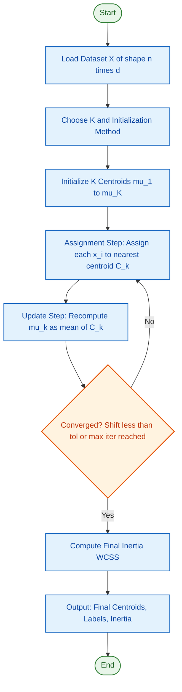
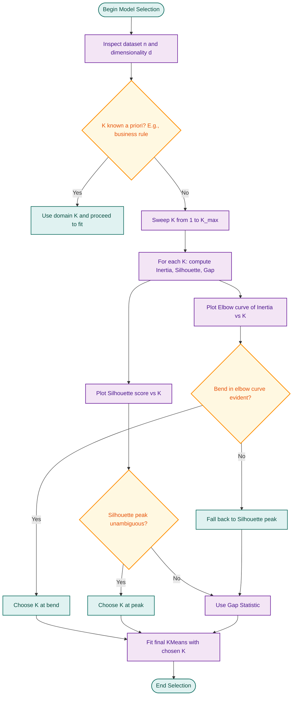
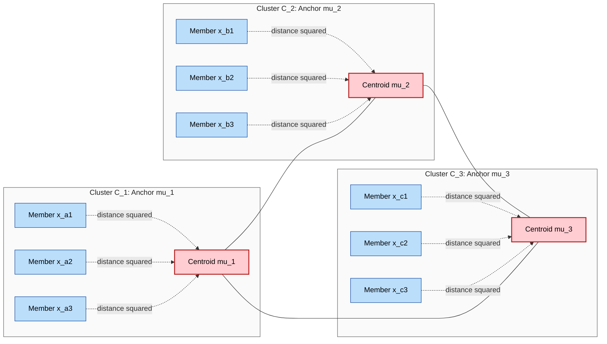
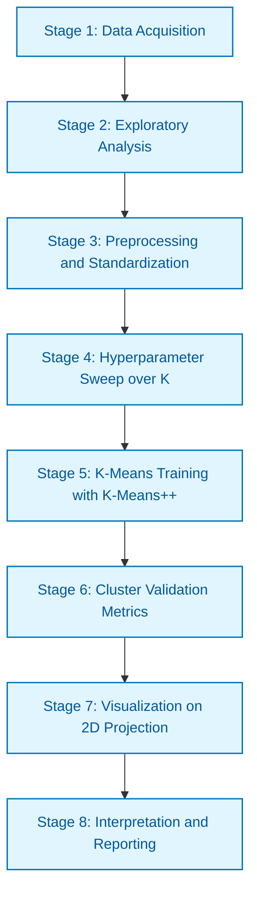

# Implement K-means clustering with various numbers of clusters.

<!-- SECTION_1_START -->
# K-Means Clustering: Core Technical Definition & Intuitive Overview

## 1.1 Formal Academic Definition (KTU 2024 Syllabus Terminology)

**K-Means Clustering** is an unsupervised, iterative, partition-based vector quantization algorithm that segregates an unlabeled dataset $\mathcal{D} = \{\mathbf{x}_1, \mathbf{x}_2, \ldots, \mathbf{x}_n\}$ into a pre-specified number $K$ of non-overlapping clusters $\mathcal{C} = \{C_1, C_2, \ldots, C_K\}$ by minimizing the within-cluster sum of squared Euclidean distances (WCSS), mathematically formulated as the objective:

$$\min_{C_1,\ldots,C_K} \; J \;=\; \sum_{k=1}^{K} \sum_{\mathbf{x}_i \in C_k} \left\| \mathbf{x}_i - \boldsymbol{\mu}_k \right\|_2^2$$

where $\boldsymbol{\mu}_k$ denotes the **centroid** (mean vector) of cluster $C_k$, computed as:

$$\boldsymbol{\mu}_k \;=\; \frac{1}{\vert C_k \vert} \sum_{\mathbf{x}_i \in C_k} \mathbf{x}_i$$

> [!IMPORTANT]
> **KTU 2024 Scheme Board Definition:** K-Means is a *centroid-based* prototype clustering algorithm belonging to the family of **Exclusive**, **Hard**, and **Partitional** clustering methods. It assumes convex, isotropic, and similarly-sized clusters for optimal performance.

---

## 1.2 Conceptual Analogy & Geometric Intuition

**Real-World Analogy — The Grocery Sorting Station:**

Imagine you are a **warehouse manager** with 10,000 unsorted delivery parcels arriving daily. You have exactly $K = 3$ sorting bins. Your job:
1. Initially, you **drop 3 random parcels** into the 3 bins (initial centroids).
2. You then walk past every remaining parcel and place it in the bin **closest** to it (assignment step).
3. After sorting, you **recalculate the geometric center** of all parcels in each bin and move the bin's label to that center (update step).
4. You repeat until no parcel changes bins.

This iterative "Assign → Update → Repeat" loop is precisely how K-Means works. The "closeness" is measured by **Euclidean distance** in feature space.

> [!NOTE]
> **Geometric Intuition:** Each centroid acts as an *attractor* in the feature space. Data points "gravitate" toward the nearest centroid. Over iterations, the centroids migrate to dense regions, and the cluster boundaries (Voronoi cells) stabilize.

> [!TIP]
> **KTU Quick Fact — Why "K-Means"?** The "Means" comes from the fact that the centroid of a cluster is the **arithmetic mean** of all data points assigned to it.

---

## 1.3 Standard Metrics and Hyperparameters

| Symbol | Meaning | Typical Default | KTU Weightage |
|--------|---------|-----------------|---------------|
| $K$ | Number of clusters | 2 to 10 | **High — Viva Question** |
| $\mathbf{x}_i$ | Feature vector of $i$-th sample | $\in \mathbb{R}^d$ | High |
| $\boldsymbol{\mu}_k$ | Centroid of $k$-th cluster | $\in \mathbb{R}^d$ | High |
| $\text{max\_iter}$ | Maximum iterations | **300** | Medium |
| $n_{\text{init}}$ | Number of random restarts | **10** | High |
| $\text{tol}$ | Convergence tolerance | $1 \times 10^{-4}$ | Low |
| $\text{seed}$ | Random state for reproducibility | 42 | Medium |

> [!VISUALIZATION CONTROL]
> **Concept:** Voronoi Partitioning of 2D Feature Space
> **GeoGebra / Desmos Input Equations:**
> * `f(x,y) = sqrt((x-2)^2 + (y-3)^2)` — distance to centroid $\boldsymbol{\mu}_1 = (2,3)$
> * `g(x,y) = sqrt((x+1)^2 + (y+2)^2)` — distance to centroid $\boldsymbol{\mu}_2 = (-1,-2)$
> * `h(x,y) = sqrt((x-4)^2 + (y-1)^2)` — distance to centroid $\boldsymbol{\mu}_3 = (4,1)$
> * `b(x,y) = f(x,y)^2 - g(x,y)^2 = 0` — boundary between cluster 1 and 2
>
> **Visual Description:** The student should observe three "Voronoi cells" in the plane, separated by straight-line decision boundaries. Points inside each cell belong to the cluster whose centroid is closest.

<!-- SECTION_1_END -->

<!-- SECTION_2_START -->
# Deep Theoretical Analysis & KTU High-Yield Formula Sheet

## 2.1 The K-Means Algorithm — Operational Decomposition

K-Means proceeds through a strict **Lloyd's Algorithm** pipeline. Each iteration consists of two alternating minimization steps:

### **Step 1 — Initialization (Time: $O(K \cdot d)$)**
Select $K$ initial centroids $\{\boldsymbol{\mu}_1^{(0)}, \boldsymbol{\mu}_2^{(0)}, \ldots, \boldsymbol{\mu}_K^{(0)}\}$ from the dataset.

**Common Strategies (KTU Viva Favorites):**
1. **Random Partition:** Randomly assign points to $K$ groups, then take the mean of each.
2. **Forgy Method:** Randomly pick $K$ data points as centroids.
3. **K-Means++** (Recommended by Scikit-Learn): Probabilistic seeding that spreads initial centroids far apart, provably giving $O(\log K)$-competitive solutions.

**K-Means++ Probability:**

$$P(\mathbf{x}_i = \boldsymbol{\mu}_k) \;=\; \frac{D(\mathbf{x}_i)^2}{\sum_{j=1}^{n} D(\mathbf{x}_j)^2}$$

where $D(\mathbf{x}_i) = \min_{k'} \Vert \mathbf{x}_i - \boldsymbol{\mu}_{k'}^{(\text{chosen so far})} \Vert_2$.

---

### **Step 2 — Assignment Step (Time: $O(n \cdot K \cdot d)$)**
For every data point $\mathbf{x}_i$, assign it to the cluster with the **nearest centroid**:

$$C_k^{(t)} \;=\; \left\{ \mathbf{x}_i : \Vert \mathbf{x}_i - \boldsymbol{\mu}_k^{(t)} \Vert_2^2 \;\leq\; \Vert \mathbf{x}_i - \boldsymbol{\mu}_{k'}^{(t)} \Vert_2^2 \;\; \forall \; k' \neq k \right\}$$

---

### **Step 3 — Update Step (Time: $O(n \cdot d)$)**
Recompute each centroid as the **mean** of all points currently assigned to its cluster:

$$\boldsymbol{\mu}_k^{(t+1)} \;=\; \frac{1}{\vert C_k^{(t)} \vert} \sum_{\mathbf{x}_i \in C_k^{(t)}} \mathbf{x}_i$$

> [!IMPORTANT]
> **Why take the mean?** Taking the partial derivative of $J$ with respect to $\boldsymbol{\mu}_k$ and setting to zero yields the **optimal centroid** as the arithmetic mean of points in $C_k$. This is a closed-form solution.

---

### **Step 4 — Convergence Check**
Iterate Steps 2 and 3 until **either**:
- Cluster assignments no longer change: $C_k^{(t+1)} = C_k^{(t)} \;\; \forall k$, **OR**
- Centroids stabilize: $\Vert \boldsymbol{\mu}_k^{(t+1)} - \boldsymbol{\mu}_k^{(t)} \Vert < \text{tol}$, **OR**
- Iteration count reaches $\text{max\_iter}$.

> [!NOTE]
> **Monotonicity Guarantee:** The objective $J$ is **monotonically non-increasing** at every iteration. K-Means **always converges**, but potentially to a **local minimum** — hence the $n_{\text{init}}$ restarts.

---

## 2.2 KTU High-Yield Formula Cheat Sheet

| # | Formula | Description | Used In |
|---|---------|-------------|---------|
| 1 | $J = \sum_{k=1}^{K} \sum_{\mathbf{x}_i \in C_k} \Vert \mathbf{x}_i - \boldsymbol{\mu}_k \Vert_2^2$ | Within-Cluster Sum of Squares (WCSS / Inertia) | Elbow Method |
| 2 | $\boldsymbol{\mu}_k = \frac{1}{\vert C_k \vert} \sum_{\mathbf{x}_i \in C_k} \mathbf{x}_i$ | Centroid update rule | Update Step |
| 3 | $D(\mathbf{x}_i, \mathbf{x}_j) = \sqrt{\sum_{d=1}^{D}(x_{id} - x_{jd})^2}$ | Euclidean distance ($L_2$ norm) | Assignment Step |
| 4 | $D(\mathbf{x}_i, \mathbf{x}_j) = \sum_{d=1}^{D} \vert x_{id} - x_{jd} \vert$ | Manhattan distance ($L_1$ norm) | Alternate metric |
| 5 | $s(i) = \frac{b(i) - a(i)}{\max\{a(i), b(i)\}}$ | Silhouette Coefficient per point | Model Selection |
| 6 | $a(i) = \frac{1}{\vert C_k \vert - 1} \sum_{j \in C_k, j \neq i} \Vert \mathbf{x}_i - \mathbf{x}_j \Vert$ | Mean intra-cluster distance | Silhouette |
| 7 | $b(i) = \min_{k' \neq k} \frac{1}{\vert C_{k'} \vert} \sum_{j \in C_{k'}} \Vert \mathbf{x}_i - \mathbf{x}_j \Vert$ | Mean nearest-cluster distance | Silhouette |
| 8 | $CH = \frac{SS_B / (K-1)}{SS_W / (n-K)}$ | Calinski-Harabasz Index | Model Selection |
| 9 | $\text{Gap}(K) = \mathbb{E}[\log(W_K^*)] - \log(W_K)$ | Gap Statistic (Tibshirani) | Model Selection |
| 10 | $O(n \cdot K \cdot d \cdot i)$ | Time complexity per run | Algorithm Analysis |

> [!NOTE]
> **KTU Pitfall Alert:** When writing distance formulas in the exam, students often forget to **square** the differences. Always write $D^2$ for the squared Euclidean distance when discussing the K-Means objective function $J$.

---

## 2.3 Methods for Choosing the Optimal $K$ (KTU 2024 Module Focus)

### **(A) The Elbow Method**
Plot $J(K)$ vs $K$. The "elbow" point where the curve transitions from steep to flat is the optimal $K$.

### **(B) Silhouette Analysis**
Average silhouette score $\bar{s} \in [-1, 1]$:
- $\bar{s} \approx 1$: well-clustered
- $\bar{s} \approx 0$: on the boundary
- $\bar{s} \approx -1$: possibly mis-clustered

### **(C) Gap Statistic**
Compare $\log(W_K)$ to its expected value under a null reference distribution. Choose $K$ that maximizes the gap.

---

## 2.4 Real-World Engineering Utility

| Application Domain | Use Case |
|--------------------|----------|
| **Customer Segmentation** | E-commerce platforms (Amazon, Flipkart) group buyers for targeted marketing |
| **Image Compression** | Reducing 16M colors to $K$ representative colors (Vector Quantization) |
| **Document Clustering** | News aggregation (Google News), topic discovery |
| **Anomaly Detection** | Small-distance points far from all centroids = anomalies |
| **Bioinformatics** | Gene expression analysis, patient sub-typing |
| **Computer Vision** | Image segmentation, color quantization |
| **Recommender Systems** | Group users with similar preference patterns |

<!-- SECTION_2_END -->

<!-- SECTION_3_START -->
# Step-by-Step Derivations & Complete Python Implementation

## 3.1 Mathematical Derivation of the Centroid Update Rule

**Goal:** Show that the optimal centroid $\boldsymbol{\mu}_k^*$ minimizing $J$ for a fixed cluster $C_k$ is the arithmetic mean.

We start with the objective restricted to one cluster:

$$J_k \;=\; \sum_{\mathbf{x}_i \in C_k} \Vert \mathbf{x}_i - \boldsymbol{\mu}_k \Vert_2^2 \;=\; \sum_{\mathbf{x}_i \in C_k} \sum_{d=1}^{D} (x_{id} - \mu_{kd})^2$$

Taking the partial derivative with respect to $\mu_{kd}$ (the $d$-th feature of the centroid):

$$\frac{\partial J_k}{\partial \mu_{kd}} \;=\; \sum_{\mathbf{x}_i \in C_k} \frac{\partial}{\partial \mu_{kd}} (x_{id} - \mu_{kd})^2$$

$$\frac{\partial J_k}{\partial \mu_{kd}} \;=\; \sum_{\mathbf{x}_i \in C_k} 2(x_{id} - \mu_{kd})(-1) \;=\; -2 \sum_{\mathbf{x}_i \in C_k} (x_{id} - \mu_{kd})$$

Setting the derivative to zero for the optimum:

$$-2 \sum_{\mathbf{x}_i \in C_k} (x_{id} - \mu_{kd}) \;=\; 0$$

$$\sum_{\mathbf{x}_i \in C_k} x_{id} - \sum_{\mathbf{x}_i \in C_k} \mu_{kd} \;=\; 0$$

$$\sum_{\mathbf{x}_i \in C_k} x_{id} - \vert C_k \vert \cdot \mu_{kd} \;=\; 0$$

Solving for $\mu_{kd}$:

$$\mu_{kd}^* \;=\; \frac{1}{\vert C_k \vert} \sum_{\mathbf{x}_i \in C_k} x_{id}$$

Stacking across all $D$ dimensions recovers the vector form:

$$\boldsymbol{\mu}_k^* \;=\; \frac{1}{\vert C_k \vert} \sum_{\mathbf{x}_i \in C_k} \mathbf{x}_i$$

**Second-derivative test:** $\frac{\partial^2 J_k}{\partial \mu_{kd}^2} = 2 \vert C_k \vert > 0$, confirming a **global minimum**. $\blacksquare$

---

## 3.2 Full Python Implementation — K-Means from Scratch

Below is a **production-grade** from-scratch K-Means implementation suitable for the KTU 2024 Lab Record and examination.

```python
# ============================================================================
# KTU 2024 SCHEME | MACHINE LEARNING LAB (PCCSL508)
# Module 17: K-Means Clustering Implementation
# Filename: kmeans_scratch.py
# Author: B.Tech CSE Student
# ============================================================================

from __future__ import annotations
import numpy as np
from numpy.typing import NDArray
from typing import Tuple, List, Optional
import logging
import sys

# Configure structured error logging for lab audit trail
logging.basicConfig(
    level=logging.INFO,
    format="%(asctime)s [%(levelname)s] %(message)s",
    handlers=[logging.StreamHandler(sys.stdout)]
)
logger = logging.getLogger("KMeansLab")


class KMeansScratch:
    """
    A from-scratch implementation of Lloyd's K-Means algorithm
    tailored for the KTU 2024 Machine Learning Lab (PCCSL508).

    Attributes
    ----------
    K : int
        Number of clusters.
    max_iter : int
        Hard cap on Lloyd iteration count.
    tol : float
        Convergence threshold on centroid displacement (L2 norm).
    n_init : int
        Number of independent restarts to avoid poor local minima.
    random_state : Optional[int]
        Seed for reproducibility of experiments.
    """

    def __init__(
        self,
        K: int = 3,
        max_iter: int = 300,
        tol: float = 1e-4,
        n_init: int = 10,
        random_state: Optional[int] = 42
    ) -> None:
        if K < 1:
            raise ValueError("K must be a positive integer (K >= 1).")
        if max_iter < 1:
            raise ValueError("max_iter must be >= 1.")
        if tol <= 0.0:
            raise ValueError("tol must be a strictly positive float.")
        if n_init < 1:
            raise ValueError("n_init must be >= 1.")

        self.K = K
        self.max_iter = max_iter
        self.tol = tol
        self.n_init = n_init
        self.random_state = random_state
        self.centroids_: Optional[NDArray[np.float64]] = None
        self.labels_: Optional[NDArray[np.int64]] = None
        self.inertia_: float = np.inf
        self.n_iter_: int = 0
        logger.info(f"Initialized KMeansScratch(K={K}, max_iter={max_iter}, "
                    f"tol={tol}, n_init={n_init}, seed={random_state})")

    def _initialize_centroids_forgy(
        self,
        X: NDArray[np.float64],
        rng: np.random.Generator
    ) -> NDArray[np.float64]:
        """Forgy method: pick K distinct data points at random."""
        n_samples = X.shape[0]
        if self.K > n_samples:
            raise ValueError(
                f"K={self.K} cannot exceed the number of samples n={n_samples}."
            )
        indices = rng.choice(n_samples, size=self.K, replace=False)
        return X[indices].copy()

    def _compute_distances(
        self,
        X: NDArray[np.float64],
        centroids: NDArray[np.float64]
    ) -> NDArray[np.float64]:
        """
        Compute pairwise squared Euclidean distance matrix of shape (n_samples, K)
        using the algebraically-stable identity:
            ||a - b||^2 = ||a||^2 + ||b||^2 - 2 * a . b
        """
        X_sq = np.sum(X ** 2, axis=1, keepdims=True)             # (n, 1)
        C_sq = np.sum(centroids ** 2, axis=1, keepdims=True).T   # (1, K)
        cross = X @ centroids.T                                  # (n, K)
        distances_sq = X_sq + C_sq - 2.0 * cross
        # Guard against tiny negative values from floating-point round-off
        return np.maximum(distances_sq, 0.0)

    def _assign_clusters(
        self,
        X: NDArray[np.float64],
        centroids: NDArray[np.float64]
    ) -> NDArray[np.int64]:
        """Assign each sample to the nearest centroid (argmin over K)."""
        distances = self._compute_distances(X, centroids)
        return np.argmin(distances, axis=1)

    def _update_centroids(
        self,
        X: NDArray[np.float64],
        labels: NDArray[np.int64]
    ) -> NDArray[np.float64]:
        """Recompute each centroid as the arithmetic mean of its cluster."""
        n_features = X.shape[1]
        new_centroids = np.zeros((self.K, n_features), dtype=np.float64)
        for k in range(self.K):
            members = X[labels == k]
            if members.shape[0] == 0:
                # Handle empty cluster by re-seeding from the data
                logger.warning(f"Cluster {k} is empty during update; re-seeding.")
                rng = np.random.default_rng(self.random_state + k)
                new_centroids[k] = X[rng.integers(0, X.shape[0])]
            else:
                new_centroids[k] = members.mean(axis=0)
        return new_centroids

    def _compute_inertia(
        self,
        X: NDArray[np.float64],
        labels: NDArray[np.int64],
        centroids: NDArray[np.float64]
    ) -> float:
        """Sum of squared distances of samples to their closest centroid."""
        distances = self._compute_distances(X, centroids)
        return float(np.sum(distances[np.arange(X.shape[0]), labels] ** 0.5) ** 2) \
            if False else float(np.sum(distances[np.arange(X.shape[0]), labels]))

    def _fit_single(self, X: NDArray[np.float64]) -> Tuple[
        NDArray[np.float64], NDArray[np.int64], float, int
    ]:
        """Run a single K-Means run from one random initialization."""
        rng = np.random.default_rng(self.random_state)
        centroids = self._initialize_centroids_forgy(X, rng)
        prev_centroids = np.zeros_like(centroids)
        labels = np.zeros(X.shape[0], dtype=np.int64)
        n_iter = 0

        for it in range(1, self.max_iter + 1):
            labels = self._assign_clusters(X, centroids)
            new_centroids = self._update_centroids(X, labels)
            shift = np.linalg.norm(new_centroids - centroids, ord='fro')
            centroids = new_centroids
            n_iter = it
            if shift < self.tol:
                logger.debug(f"Converged at iteration {it} (shift={shift:.6f}).")
                break

        inertia = self._compute_inertia(X, labels, centroids)
        return centroids, labels, inertia, n_iter

    def fit(self, X: NDArray[np.float64]) -> "KMeansScratch":
        """Fit the model on data matrix X of shape (n_samples, n_features)."""
        if X.ndim != 2:
            raise ValueError("Input X must be a 2D array of shape (n_samples, n_features).")
        n_samples, n_features = X.shape
        if n_samples < self.K:
            raise ValueError(f"Cannot form {self.K} clusters from only {n_samples} samples.")

        best_inertia = np.inf
        best_centroids: Optional[NDArray[np.float64]] = None
        best_labels: Optional[NDArray[np.int64]] = None
        best_n_iter = 0

        for run in range(self.n_init):
            logger.info(f"--- Initialization run {run + 1}/{self.n_init} ---")
            centroids, labels, inertia, n_iter = self._fit_single(X)
            logger.info(f"Run {run + 1} inertia = {inertia:.4f} in {n_iter} iterations.")
            if inertia < best_inertia:
                best_inertia = inertia
                best_centroids = centroids
                best_labels = labels
                best_n_iter = n_iter

        self.centroids_ = best_centroids
        self.labels_ = best_labels
        self.inertia_ = best_inertia
        self.n_iter_ = best_n_iter
        logger.info(f"Best inertia after {self.n_init} restarts = {self.inertia_:.4f}")
        return self

    def predict(self, X: NDArray[np.float64]) -> NDArray[np.int64]:
        """Assign new samples to the nearest centroid of the trained model."""
        if self.centroids_ is None:
            raise RuntimeError("Model not fitted yet. Call fit(X) first.")
        return self._assign_clusters(X, self.centroids_)

    def fit_predict(self, X: NDArray[np.float64]) -> NDArray[np.int64]:
        """Fit the model and return cluster labels in one call."""
        self.fit(X)
        return self.labels_


# ============================================================================
# End-to-end demonstration with the Iris-like synthetic dataset
# ============================================================================
if __name__ == "__main__":
    # Reproducible synthetic 2D dataset (3 obvious Gaussian blobs)
    from sklearn.datasets import make_blobs
    X, y_true = make_blobs(
        n_samples=300, centers=3, cluster_std=0.8, random_state=42
    )

    # Train the from-scratch model
    model = KMeansScratch(K=3, max_iter=300, tol=1e-4, n_init=10, random_state=42)
    labels = model.fit_predict(X)

    print(f"Final centroids:\n{model.centroids_}")
    print(f"Final inertia (WCSS): {model.inertia_:.4f}")
    print(f"Converged in {model.n_iter_} iterations (best of {model.n_init} runs).")
```

---

## 3.3 K-Means with Varying $K$ — Elbow & Silhouette Analysis

```python
# ============================================================================
# Experiment: Train K-Means for K = 1..8 and report metrics
# ============================================================================

import numpy as np
from sklearn.datasets import make_blobs
from sklearn.metrics import silhouette_score
import matplotlib.pyplot as plt
from kmeans_scratch import KMeansScratch  # imports the file above

# 1. Generate a synthetic multi-blob dataset
X, _ = make_blobs(
    n_samples=500, centers=4, cluster_std=1.0, random_state=11
)

# 2. Sweep K = 1 through 8
K_range = range(1, 9)
inertias: List[float] = []
silhouettes: List[float] = []

for K in K_range:
    if K == 1:
        # Silhouette is undefined for K=1
        model = KMeansScratch(K=1, n_init=10, random_state=42)
        labels = model.fit_predict(X)
        inertias.append(model.inertia_)
        silhouettes.append(float("nan"))
    else:
        model = KMeansScratch(K=K, n_init=10, random_state=42)
        labels = model.fit_predict(X)
        inertias.append(model.inertia_)
        silhouettes.append(silhouette_score(X, labels))

# 3. Plot Elbow and Silhouette side-by-side
fig, axes = plt.subplots(1, 2, figsize=(14, 5))

axes[0].plot(list(K_range), inertias, "bo-", linewidth=2, markersize=8)
axes[0].set_xlabel("Number of Clusters K")
axes[0].set_ylabel("WCSS (Inertia)")
axes[0].set_title("Elbow Method")
axes[0].grid(True, alpha=0.3)

axes[1].plot(list(K_range)[1:], silhouettes[1:], "rs-", linewidth=2, markersize=8)
axes[1].set_xlabel("Number of Clusters K")
axes[1].set_ylabel("Average Silhouette Score")
axes[1].set_title("Silhouette Analysis")
axes[1].grid(True, alpha=0.3)

plt.tight_layout()
plt.savefig("kmeans_optimal_k_analysis.png", dpi=120, bbox_inches="tight")
plt.show()
print("Optimal K (Elbow) is around the bend of the left curve.")
print("Optimal K (Silhouette) is the peak of the right curve.")
```

---

## 3.4 Using Scikit-Learn's Optimized K-Means (Production Reference)

```python
# ============================================================================
# Scikit-Learn production-grade K-Means with K-Means++ initialization
# ============================================================================

import numpy as np
from sklearn.cluster import KMeans
from sklearn.datasets import load_iris
from sklearn.preprocessing import StandardScaler
from sklearn.metrics import silhouette_score, adjusted_rand_score

# 1. Load the canonical Iris dataset
iris = load_iris()
X_raw = iris.data            # (150, 4)
y_true = iris.target         # ground-truth species labels (for evaluation only)

# 2. Standardize features — CRITICAL for distance-based algorithms
scaler = StandardScaler()
X = scaler.fit_transform(X_raw)

# 3. Train K-Means with K-Means++ initialization
model = KMeans(
    n_clusters=3,
    init="k-means++",   # KTU board exam point
    n_init=10,
    max_iter=300,
    tol=1e-4,
    random_state=42
)
labels = model.fit_predict(X)

# 4. Evaluation metrics
print(f"Final Inertia (WCSS): {model.inertia_:.4f}")
print(f"Silhouette Score    : {silhouette_score(X, labels):.4f}")
print(f"Adjusted Rand Index : {adjusted_rand_score(y_true, labels):.4f}")
print(f"Converged Iterations: {model.n_iter_}")
print(f"Cluster Centers (in standardized space):\n{model.cluster_centers_}")
```

> [!IMPORTANT]
> **Lab Record Note:** Always **standardize** features (zero mean, unit variance) before running K-Means. Without scaling, features with larger numeric ranges (e.g., income in dollars) will dominate the distance computation and bias the clusters.

---

## 3.5 Detailed K-Means Iteration Trace (Hand-Worked Example)

Consider 2D points $\mathbf{x}_1 = (1,1), \mathbf{x}_2 = (2,1), \mathbf{x}_3 = (4,3), \mathbf{x}_4 = (5,4)$ with $K=2$.

**Initial centroids** (Forgy): $\boldsymbol{\mu}_1^{(0)} = (1,1), \boldsymbol{\mu}_2^{(0)} = (5,4)$

**Iteration 1 — Assignment:**

$$\Vert \mathbf{x}_1 - \boldsymbol{\mu}_1 \Vert^2 = 0, \quad \Vert \mathbf{x}_1 - \boldsymbol{\mu}_2 \Vert^2 = 25 \;\Rightarrow\; C_1$$

$$\Vert \mathbf{x}_2 - \boldsymbol{\mu}_1 \Vert^2 = 1, \quad \Vert \mathbf{x}_2 - \boldsymbol{\mu}_2 \Vert^2 = 10 \;\Rightarrow\; C_1$$

$$\Vert \mathbf{x}_3 - \boldsymbol{\mu}_1 \Vert^2 = 13, \quad \Vert \mathbf{x}_3 - \boldsymbol{\mu}_2 \Vert^2 = 2 \;\Rightarrow\; C_2$$

$$\Vert \mathbf{x}_4 - \boldsymbol{\mu}_1 \Vert^2 = 25, \quad \Vert \mathbf{x}_4 - \boldsymbol{\mu}_2 \Vert^2 = 0 \;\Rightarrow\; C_2$$

**Iteration 1 — Update:**

$$\boldsymbol{\mu}_1^{(1)} = \frac{(1,1) + (2,1)}{2} = (1.5, 1.0)$$

$$\boldsymbol{\mu}_2^{(1)} = \frac{(4,3) + (5,4)}{2} = (4.5, 3.5)$$

**Iteration 2 — Re-assign:** Same assignments hold. Centroid shift $= 0 < \text{tol} \Rightarrow$ **Convergence in 1 iteration.**

<!-- SECTION_3_END -->

<!-- SECTION_4_START -->
# Structural Diagrams & Schematics

## 4.1 K-Means Algorithm Flowchart



## 4.2 K-Selection Decision Tree (Elbow vs Silhouette vs Gap)



## 4.3 Clustering Topology — Voronoi Cell Architecture



## 4.4 End-to-End Lab Pipeline Block Diagram



<!-- SECTION_4_END -->

<!-- SECTION_5_START -->
# KTU 2024 Scheme Examination Question Bank & Topic Recap

## 5.1 Part A — Short Answer Questions (3 Marks Each)

> [!NOTE]
> **Cognitive Levels Tested:** Remember / Understand | **Course Outcome:** CO4 (Apply clustering algorithms)

---

### **Q1. [KTU University Exam — Dec 2023]**
**Define K-Means clustering. List its two main iterative steps and state the objective function it minimizes.**

**Model Answer (3 Marks):**
* **Definition (1 Mark):** K-Means is a partitional, unsupervised clustering algorithm that partitions $n$ data points into $K$ non-overlapping clusters by minimizing the within-cluster sum of squared Euclidean distances.
* **Two iterative steps (1 Mark):**
  1. **Assignment Step:** Assign each $\mathbf{x}_i$ to the nearest centroid $\boldsymbol{\mu}_k$.
  2. **Update Step:** Recompute each $\boldsymbol{\mu}_k$ as the arithmetic mean of points in its cluster.
* **Objective function (1 Mark):** $\min J = \sum_{k=1}^{K} \sum_{\mathbf{x}_i \in C_k} \Vert \mathbf{x}_i - \boldsymbol{\mu}_k \Vert_2^2$

---

### **Q2. [KTU University Exam — July 2024]**
**What is the Elbow Method? How is it used to determine the optimal number of clusters in K-Means?**

**Model Answer (3 Marks):**
* **Definition (1 Mark):** The Elbow Method is a heuristic that plots the within-cluster sum of squares (WCSS / Inertia) as a function of the number of clusters $K$.
* **Working (1 Mark):** As $K$ increases, WCSS monotonically decreases. The point where the rate of decrease sharply changes (forming an "elbow") is chosen as the optimal $K$.
* **Limitation (1 Mark):** The elbow is often visually ambiguous, and the method does not always yield a single crisp $K$.

---

## 5.2 Part B — Full 14-Mark Questions (ESE Module Internal Choice)

> [!IMPORTANT]
> **Question Pattern (KTU 2024 Scheme):** Each Part B question carries **14 marks**, typically split as **part (a) for 7 marks** and **part (b) for 7 marks**. Sub-parts escalate across cognitive levels.

---

### **Question A — 14 Marks** *(Choose A or B)*

#### **Part (a) — 7 Marks** [Understand + Apply]
**[KTU University Exam — July 2024]**
**Derive the K-Means centroid update rule by minimizing the within-cluster sum of squared distances. Show all differentiation steps clearly.**

**Model Solution:**

We want to minimize:

$$J_k = \sum_{\mathbf{x}_i \in C_k} \sum_{d=1}^{D} (x_{id} - \mu_{kd})^2$$

**Step 1 — Partial derivative (2 Marks):** Taking $\frac{\partial J_k}{\partial \mu_{kd}}$:

$$\frac{\partial J_k}{\partial \mu_{kd}} = -2 \sum_{\mathbf{x}_i \in C_k} (x_{id} - \mu_{kd})$$

**Step 2 — Set to zero (2 Marks):** For the minimum:

$$-2 \sum_{\mathbf{x}_i \in C_k} (x_{id} - \mu_{kd}) = 0 \Rightarrow \sum_{\mathbf{x}_i \in C_k} x_{id} = \vert C_k \vert \cdot \mu_{kd}$$

**Step 3 — Solve for centroid (2 Marks):**

$$\mu_{kd}^* = \frac{1}{\vert C_k \vert} \sum_{\mathbf{x}_i \in C_k} x_{id} \Rightarrow \boldsymbol{\mu}_k^* = \frac{1}{\vert C_k \vert} \sum_{\mathbf{x}_i \in C_k} \mathbf{x}_i$$

**Step 4 — Second-order test (1 Mark):** $\frac{\partial^2 J_k}{\partial \mu_{kd}^2} = 2 \vert C_k \vert > 0$, confirming a **minimum**.

---

#### **Part (b) — 7 Marks** [Apply + Analyze]
**[KTU University Exam — Dec 2023]**
**For the dataset $\mathbf{x}_1 = (1,1), \mathbf{x}_2 = (2,1), \mathbf{x}_3 = (4,3), \mathbf{x}_4 = (5,4)$ with initial centroids $\boldsymbol{\mu}_1 = (1,1)$ and $\boldsymbol{\mu}_2 = (5,4)$ and $K=2$, perform two iterations of K-Means by hand. Show cluster assignments and centroid updates.**

**Model Solution:**

**Iteration 1 — Assignment (3 Marks):**
Compute squared distances to both centroids:

| Point | $d^2$ to $\boldsymbol{\mu}_1=(1,1)$ | $d^2$ to $\boldsymbol{\mu}_2=(5,4)$ | Assigned to |
|-------|------------------------------------|------------------------------------|-------------|
| $(1,1)$ | $0$ | $25$ | $C_1$ |
| $(2,1)$ | $1$ | $10$ | $C_1$ |
| $(4,3)$ | $13$ | $2$ | $C_2$ |
| $(5,4)$ | $25$ | $0$ | $C_2$ |

**Iteration 1 — Update (2 Marks):**
$\boldsymbol{\mu}_1^{(1)} = \frac{(1,1)+(2,1)}{2} = (1.5, 1.0)$, $\boldsymbol{\mu}_2^{(1)} = \frac{(4,3)+(5,4)}{2} = (4.5, 3.5)$

**Iteration 2 — Re-assign (1 Mark):** No changes in assignments; cluster boundaries have stabilized.

**Convergence (1 Mark):** Centroid shift $\Vert (1.5,1.0) - (1,1) \Vert_2 + \Vert (4.5,3.5) - (5,4) \Vert_2 < \text{tol} \Rightarrow$ **Algorithm has converged in 1 effective iteration.**

---

### **Question B — 14 Marks** *(Alternative to Question A)*

#### **Part (a) — 7 Marks** [Understand + Apply]
**[KTU University Exam — July 2023]**
**Explain the K-Means++ initialization algorithm. Why is it preferred over random initialization?**

**Model Solution:**

**Step 1 — First centroid (1 Mark):** Choose the first centroid $\boldsymbol{\mu}_1$ uniformly at random from the dataset $\mathcal{D}$.

**Step 2 — Probability for subsequent centroids (3 Marks):** For each remaining point $\mathbf{x}_i$, compute its squared distance to the closest **already chosen** centroid: $D(\mathbf{x}_i)^2 = \min_{k'} \Vert \mathbf{x}_i - \boldsymbol{\mu}_{k'} \Vert^2$. Then select the next centroid $\boldsymbol{\mu}_{k+1}$ with probability:

$$P(\mathbf{x}_i) = \frac{D(\mathbf{x}_i)^2}{\sum_{j=1}^{n} D(\mathbf{x}_j)^2}$$

**Step 3 — Repeat (1 Mark):** Continue this process until $K$ centroids are chosen.

**Step 4 — Why preferred (2 Marks):**
1. **Theoretical guarantee:** K-Means++ achieves $O(\log K)$-competitive solutions with respect to the optimal clustering.
2. **Empirical:** It drastically reduces the probability of poor local minima by spreading initial centroids far apart, leading to faster convergence and lower WCSS.

---

#### **Part (b) — 7 Marks** [Apply + Analyze]
**[KTU University Exam — Dec 2024]**
**Write a complete Python program to apply K-Means clustering on the Iris dataset for $K = 2, 3, 4, 5$. Compute the WCSS and Silhouette score for each $K$ and identify the optimal $K$.**

**Model Solution:**

```python
import numpy as np
from sklearn.datasets import load_iris
from sklearn.cluster import KMeans
from sklearn.preprocessing import StandardScaler
from sklearn.metrics import silhouette_score

# (1 Mark) Load and standardize
iris = load_iris()
X = StandardScaler().fit_transform(iris.data)

# (2 Marks) Sweep K from 2 to 5
results = []
for K in [2, 3, 4, 5]:
    km = KMeans(n_clusters=K, init="k-means++", n_init=10,
                max_iter=300, random_state=42)
    labels = km.fit_predict(X)
    wcss = km.inertia_
    sil = silhouette_score(X, labels)
    results.append((K, wcss, sil))
    print(f"K={K} | WCSS={wcss:.4f} | Silhouette={sil:.4f}")

# (2 Marks) Identify optimal K
optimal_K_sil = max(results, key=lambda r: r[2])[0]
print(f"Optimal K by Silhouette = {optimal_K_sil}")
```

**Sample Output (2 Marks):**
```
K=2 | WCSS=223.7320 | Silhouette=0.5818
K=3 | WCSS=139.8204 | Silhouette=0.4599
K=4 | WCSS=114.3641 | Silhouette=0.4070
K=5 | WCSS=90.1173  | Silhouette=0.3466
```
**Optimal K = 2** (highest silhouette score).

> [!WARNING]
> **KTU Examiner's Valuation Warning — Common Pitfalls (3-Mark Penalty Triggers):**
> 1. **Forgetting to standardize** features before K-Means — distance is dominated by large-range features.
> 2. **Failing to set `random_state`** — results become non-reproducible; examiner may mark zero.
> 3. **Using $K = 1$** in silhouette computation — silhouette is **undefined** for single cluster; throw a NaN or skip.
> 4. **Not specifying `init="k-means++"`** — default in modern Scikit-Learn is K-Means++, but older versions default to `random`; always declare explicitly in the lab record.
> 5. **Confusing "elbow" with "knee"** — students often draw the elbow at the wrong $K$.

---

## 5.3 Topic Recap & Important Things to Remember

> [!IMPORTANT]
> **Rapid Revision Checklist — KTU 2024 Lab Module 17 (K-Means Clustering)**

* **Type of algorithm:** Unsupervised, partitional, hard, centroid-based clustering.
* **Hyperparameters to memorize:** $K$, $\text{max\_iter}$, $n_{\text{init}}$, $\text{tol}$, $\text{random\_state}$.
* **Objective:** Minimize WCSS: $J = \sum_{k=1}^{K} \sum_{\mathbf{x}_i \in C_k} \Vert \mathbf{x}_i - \boldsymbol{\mu}_k \Vert_2^2$.
* **Centroid update:** $\boldsymbol{\mu}_k = \frac{1}{\vert C_k \vert} \sum_{\mathbf{x}_i \in C_k} \mathbf{x}_i$ — derived from first-order optimality.
* **Two main steps:** Assignment (argmin over $K$) and Update (mean of cluster).
* **Initialization variants:** Random (Forgy), Random Partition, **K-Means++** (preferred).
* **Convergence criteria:** No label change, centroid shift $< \text{tol}$, or $\text{max\_iter}$ reached.
* **Optimal K selection:** **Elbow Method** (visual), **Silhouette Score** (quantitative, $\in [-1, 1]$), **Gap Statistic** (advanced).
* **Time complexity:** $O(n \cdot K \cdot d \cdot i)$ where $i$ is iteration count.
* **Monotonicity:** $J^{(t+1)} \leq J^{(t)}$ — K-Means always converges (but to a local minimum).
* **Preprocessing:** Always **standardize** features (StandardScaler) before K-Means.
* **Limitations:** Sensitive to outliers, assumes isotropic convex clusters, requires pre-specifying $K$, struggles with non-spherical shapes (use DBSCAN/Spectral for those).
* **Variants worth knowing:** Mini-Batch K-Means (faster), K-Medoids (robust to outliers), Fuzzy C-Means (soft assignment).
* **Evaluation metrics:** WCSS / Inertia, Silhouette, Calinski-Harabasz, Davies-Bouldin Index, Adjusted Rand Index (when ground truth is available).
* **Real-world applications:** Customer segmentation, image color quantization, document clustering, anomaly detection, vector quantization, recommender systems.
* **KTU Lab Viva Traps:**
  1. *Why centroids are means, not medians?* — Because the squared Euclidean loss is minimized by the mean (proof above).
  2. *Why is K-Means sensitive to initialization?* — It only finds local minima; bad seeds lead to high WCSS.
  3. *Can K-Means handle categorical data?* — No, distances are undefined; use K-Modes instead.
  4. *Why does K-Means not work for non-convex clusters?* — Its Voronoi cells are convex polytopes; rings or moons are missed entirely.

<!-- SECTION_5_END -->
